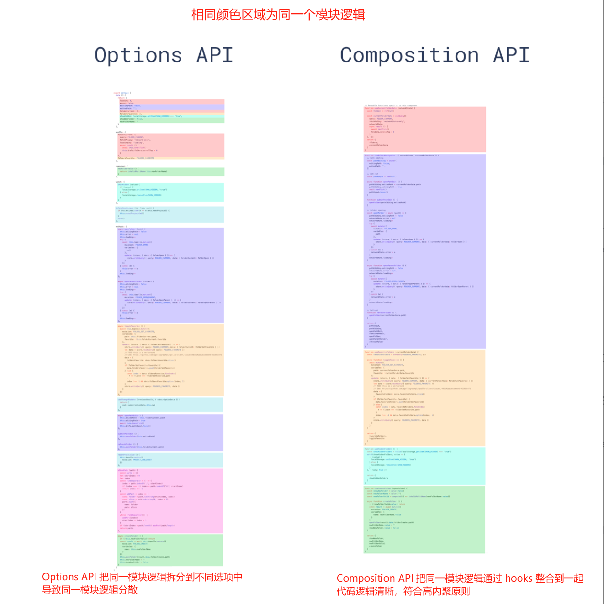
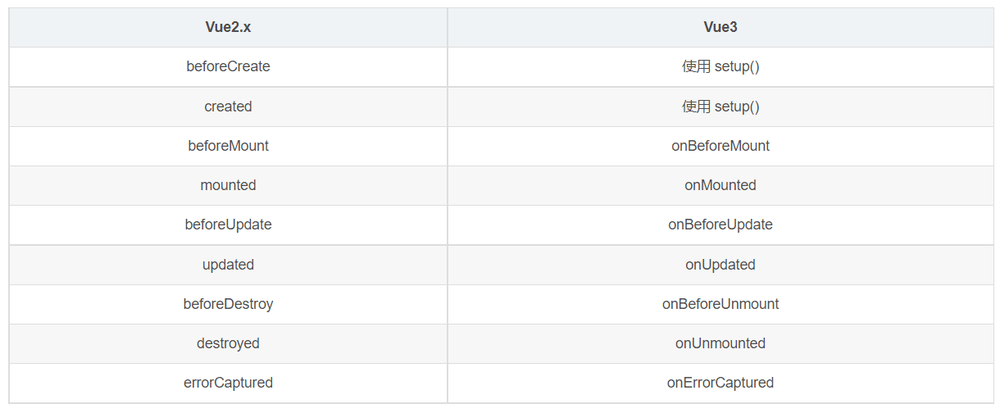

# **Vue2 Vs Vue3**

|       对比项        |                            Vue 2                             |                            Vue 3                             |
| :-----------------: | :----------------------------------------------------------: | :----------------------------------------------------------: |
|   **响应式系统**    | Vue 2 使用的是基于 `Object.defineProperty` 的响应式系统，对于数组和对象的修改需要特定的方法来触发更新。 | Vue 3 使用了 Proxy 对象来实现响应式系统，支持更深层次的响应式，无需特定方法来触发更新。 |
| **Composition API** | Vue 2 使用的是 Options API，将逻辑分散在 data、methods、computed 等选项中。 | Vue 3 引入了 Composition API，允许更加灵活的组织和重用逻辑。 |
|  **生命周期钩子**   | Vue 2 提供了 beforeCreate、created、beforeMount、mounted、beforeUpdate、updated、beforeDestroy、destroyed 等生命周期钩子。 | Vue 3 对生命周期钩子进行了重新设计，提供了 setup、onMounted、onUpdated、onUnmounted 等新的生命周期钩子，并移除了 beforeDestroy 和 destroyed。 |
| **TypeScript 支持** |  Vue 2 对 TypeScript 的支持有限，需要额外的配置和类型定义。  | Vue 3 内置了对 TypeScript 的支持，提供了更好的类型推断和类型检查。 |
|      **组件**       | Vue 2 中的组件是基于 Vue 实例构建的，组件间通信可以通过 props、events、slots、refs 等方式进行。 | Vue 3 组件与 Vue 2 基本相同，但提供了更多的优化和灵活性，如更好的 TypeScript 支持和自定义渲染函数。 |
|      **指令**       | Vue 2 中的指令（Directives）使用 v- 前缀，例如 v-if、v-for。 | Vue 3 继续使用 v- 前缀的指令，但添加了对自定义指令的更多控制和灵活性。 |
|    **模板语法**     |   Vue 2 的模板语法相对固定，使用双大括号插值表达式和指令。   | Vue 3 继承了 Vue 2 的模板语法，但提供了更多的语法糖和特性，如条件渲染的 ` v-if/v-else-if/v-else`、列表渲染的 v-for、计算属性的 `v-memo `等。 |
|    **插件系统**     |  Vue 2 提供了插件系统，可以通过 Vue.use() 方法来安装插件。   |    Vue 3 继续支持插件系统，但提供了更多的灵活性和扩展性。    |
| **自定义渲染函数**  |   Vue 2 提供了自定义渲染函数，但需要额外的配置和学习成本。   | Vue 3 对自定义渲染函数进行了改进，提供了更简洁和灵活的 API，支持 JSX 语法。 |


## **响应式系统**

###  **`Proxy` VS `Object.defineProperty`  ** 

Vue 2 使用的是基于 `Object.defineProperty` 的响应式系统，而 Vue 3 则使用了 ES6 的 `Proxy` 对象。`Proxy` 相较于 `Object.defineProperty` 提供了更高的性能和更好的兼容性，因为它能够监听对象属性的新增和删除，以及数组的直接修改。

为什么要做这个改变？

* `Object.defineProperty` 在某些情况下无法监听到数据的变化，比如当对象属性被新增或删除时。使用 `Proxy` 可以解决这些问题，并提供更稳定、更全面的响应式系统。

### Proxy 比 defineProperty好在哪里？

* Vue 3.x 响应式系统使用  [ES6 Proxy](https://es6.ruanyifeng.com/#docs/proxy)，Vue2.x 使用 `Object.defineProperty()` 实现。

Proxy和defineProperty都是JavaScript中用于处理对象属性的机制，但它们在功能和灵活性上存在一些差异。

以下是一些Proxy比defineProperty更好的地方：

**Proxy支持数组**：

* Proxy可以直接监听数组的变化; （Proxy 通过返回一个代理对象操作源对象），在使用Proxy时，你可以更容易地更新数组的索引或添加/删除数组元素。
* Object.defineProperty 需要深度遍历数组，对数组每个元素递归调用 Object.defineProperty 实现监听；因此原生API不能监听数组的变化；
* Proxy可以检测到数组基于下标的修改和长度修改，而Object.defineProperty无法做到。

**Proxt 支持监听对象属性新增和删除**：

* Proxy 通过返回代理对象监听源对象，对整个对象操作进行拦截，因此在对象属性新增和删除时候能在代理对象中监听到；
* 使用 Object.defineProperty 对对象监听，需要对每一个对象属性进行遍历监听，因此在完成初始化属性遍历拦截后，再对对象属性进行新增和修改时就无法监听到变化； (Vue2.x 中使用Object.defineProperty 进行响应式初始化之后，不再进行响应式操作，因此无法监听对象属性新增和修改 )

**Proxy 可以拦截更多的操作**：

* Proxy 可以拦截更多的操作，包括属性的读取、设置和删除等；
  * Proxy 通过返回一个代理对象操作源对象，这意味着使用Proxy可以在不干扰现有代码逻辑的情况下修改对象的行为。
* Object.defineProperty 只能监视对象单个属性值的变化。

**Proxy性能更好**：

* Proxy 通过返回一个代理对象操作源对象，Proxy可以在内存中只存储一份数据；Proxy可以在调用的时候递归，用到才代理，也不需要维护特别多的依赖关系，性能提升很大。
* Object.defineProperty 需要为每个对象每个属性都创建一个数据结构，导致内存占用较大；
* 由此在处理大量数据时，Object.defineProperty 内存占用较大；

**Proxy提供了更丰富的特性**：

* Proxy提供了更丰富的特性，例如get/set属性、apply、construct、deleteProperty、getOwnPropertyDescriptor、getPrototypeOf、isExtensible、ownKeys、preventExtensions、setPrototype等。这些特性使得Proxy在处理对象属性时更加灵活和强大。

**Proxy更简单的语法**：

* Proxy提供了一个相对简单的API，使得创建代理对象更加容易；
* Object.defineProperty的语法更加复杂和不易理解；

## **Composition API **

####  **`Composition API` VS `Options API`**

**Options API 弊端**：Options API 在 Vue 2 中将逻辑分散在 data、methods、computed 等选项中，这使得代码的组织和维护变得困难。

Vue 3 引入了 Composition API，这是一种更加灵活的组件代码复用方式。

相较于 Vue 2 中的 Options API，Composition API 允许开发者将逻辑代码进行拆分和组合，提高代码的可读性和可维护性。

Composition API 的引入**使得代码更加集中和模块化**，便于维护和复用。

示例：



## **Hooks VS Mixins** 

## **TypeScript 支持**

#### **TypeScript VS Flow**

Vue 3 是基于 TypeScript 编写的，提供了更好的类型定义和类型检查。这使得开发者在编写 Vue 代码时能够享受到自动的类型提示和错误检查。

为什么要做这个改变？

* TypeScript 在大型项目中具有更好的可维护性和可扩展性。通过提供更好的 TypeScript 支持，Vue 3 吸引了更多的开发者和团队使用 Vue 构建大型项目。

## **更快的初始化和更新**

- Vue 3 的初始化过程比 Vue 2 更快，这得益于其组件 API 的优化和编译模板的改进。此外，Vue 3 的更新性能也有所提高，特别是针对组件的更新和渲染。

## **体积更小**

- Vue 3 通过使用 webpack 的 tree-shaking 功能，减少了无用模块的打包，从而减小了整体的体积。

这些改变都是为了提高 Vue 的性能和可维护性，使其更加适应现代前端开发的需求。通过引入新的技术和改进现有功能，Vue 3 为开发者提供了更强大、更灵活的工具来构建高质量的 Web 应用程序。


## **语法差异**

[vue3.x 文档-vue2迁移](https://vue3js.cn/docs/zh/guide/migration/introduction.html#%E4%BB%8B%E7%BB%8D)章节中介绍了 vue3.x 新增特性和 vue2 差异。

**补充说明**

Vue 3 中需要关注的一些新功能包括：

- [组合式 API](https://vue3js.cn/docs/zh/guide/composition-api-introduction.html)：

  - 提供 `setup` 组件选项：在**创建组件之前**执行，一旦 `props` 被解析，并充当合成 API 的入口点。
  - `setup` 选项应该是一个接受 `props` 和 `context` 的函数。`setup` 返回的所有内容都将暴露给组件的其余部分 (计算属性、方法、生命周期钩子等等) 以及组件的模板。
  - 作用：在多个组件中复用相同的代码逻辑。把组件逻辑模块化复用，增加代码可读性。
    - vue2.x 中提供组件代码复用的 API：`mixin`、`slot`。

- [Teleport](https://vue3js.cn/docs/zh/guide/teleport.html)： 

  - 新的内置组件，将组件内的模板移动到 `to` 属性指定的 DOM 节点之下。
  - 应用场景：用于类似 `modals`,`toast` 这类和 `Vue` 应用的 `DOM` 完全剥离的组件，这类组件如果嵌套在 `Vue` 的某个组件内部，那么处理嵌套组件的定位、`z-index` 和样式就会变得很困难，因此通过 `Teleport` 可以解决。

- [片段](https://vue3js.cn/docs/zh/guide/migration/fragments.html)：支持多根节点组件，即片段。

- [组件选项 emits](https://vue3js.cn/docs/zh/guide/component-custom-events.html)

- [`createRenderer` API 来自 `@vue/runtime-core`](https://github.com/vuejs/vue-next/tree/master/packages/runtime-core) 创建自定义渲染器

  

## **创建实例方式**

* vue2: 使用 `new Vue()` 创建实例。

  * 缺点：通过 `new Vue()` 创建的根 Vue 实例。从同一个 Vue 构造函数**创建的每个根实例共享相同的全局配置**，因此全局 API 影响所有 vue 实例。 

  ```js
  // 这会影响两个根实例
  Vue.mixin({
    /* ... */
  })
  
  const app1 = new Vue({ el: '#app-1' })
  const app2 = new Vue({ el: '#app-2' })
  ```

* vue3：使用 [`createApp()`](https://vue3js.cn/docs/zh/api/global-api.html#createapp) 创建实例。

  * 解决 vue2 全局 api 缺点

  ```js
  Vue.createApp({
    data() {
      return {
        a: 1
      }
    },
    created() {
      // `this` 指向 vm 实例
      console.log('a is: ' + this.a) // => "a is: 1"
    }
  })
  //应用实例暴露的大多数方法都会返回该同一实例，允许链式：
  Vue.createApp({})
    .component('SearchInput', SearchInputComponent)
    .directive('focus', FocusDirective)
    .use(LocalePlugin)
  ```

## **生命周期**




