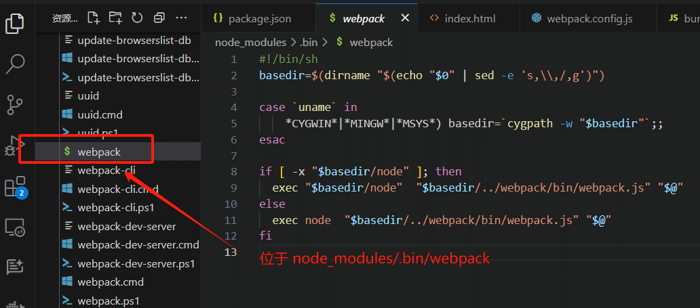

# NPM

## npm script

### 定义

npm 允许在`package.json`文件里面，使用`scripts`字段定义脚本命令。

```json
{
	// ...
	"scripts": {
		"build": "node build.js"
	}
}
```


### 原理

1. 每当执行`npm run`，就会自动新建一个 **Shell**，根据系统平台而不同，如 macos 或 Linux 中指代的是 `/bin/sh`，在Windows 中使用的是 `cmd.exe`

2. `npm run `新建的这个 Shell，会将当前目录的 `node_modules/.bin` 子目录加入`PATH`变量
3. 执行结束后，再将`PATH`变量恢复原样。


### **npm run 创建出来的Shell 有什么特别之处?**

当前目录的`node_modules/.bin`子目录里面的所有脚本，都可以直接用脚本名调用，而不必加上完整路径。

比如，当前项目的依赖里面有 webpack，只要直接写`npm run build `就可以了。

```shell
"build": "webpack --config webpack.config.js"
```

而不用写成下面这样:

```js
"build": "./node_modules/.bin/webpack  --config webpack.config.js"
```

由于 npm 脚本的唯一要求就是可以在 Shell 执行，因此它不一定是 Node 脚本，任何可执行文件都可以写在里面。

npm 脚本的退出码，也遵守 Shell 脚本规则。如果退出码不是`0`，npm 就认为这个脚本执行失败

npm scripts 脚本可以使用 Shell通配符等常规能力

> 示例：
>
> 1. 在使用 webpack 构建的项目中，使用 webpack 命令即可对项目进行打包，如下图，使用 `npm run start` 命令执行时，会执在shell 脚本中执行 `webpack --config webpack.config.js`：
>    
>
> 2. 当执行 `webpack --config` 命令时，实际上执行 `./node_modules/.bin/webpack` shell 脚本:
> 3. 执行该脚本时候，会将当前目录的`node_modules/.bin`子目录加入`PATH`变量，因此 shell 直接执行 webpack 命令，会直接执行 `./node_modules/.bin/webpack` shell 脚本。


### **npm 钩子**

使用 `npm run build` 时，会默认自动先执行 `npm run prebuild`，再执行 `npm run build` 最后执行 `npm run postbuild`:


###  **npm script 执行方式**


###  npm 版本处理

#### package-lock.json 文件

`package-lock.json` 文件是npm的一部分，主要用于确保在安装依赖时的一致性。

它存储了一个**精确的、版本化的依赖树**，而不是像`package.json`那样使用星号版本（例如 1.0.*）。

当开发者在开发环境中安装依赖时，`package-lock.json`会锁定所有依赖包的版本，确保在其他开发者或部署环境中，依赖包的版本与开发环境一致。


此外，npm的`package-lock.json`文件还具有以下特点：

1. **锁定安装时的包的版本号**：在开发过程中，当需要更新某个包时，开发者通常会先删除`node_modules`文件夹和`package-lock.json`文件，然后重新运行`npm install`。这样可以确保所有的包都是最新的版本。但是，这种做法在团队协作中可能会带来问题，因为不同的开发者可能安装了不同版本的依赖包，从而导致一些未预期的问题。通过使用`package-lock.json`文件，可以确保每个开发者都在相同的环境下工作，减少了潜在的问题。
2. **锁定完整依赖树的版本**：与`package.json`只包含直接依赖项不同，`package-lock.json`可以锁定整个依赖树的版本。这意味着不仅直接依赖项的版本被锁定，间接依赖项的版本也可以被锁定。这种机制使得开发者可以更加准确地控制他们的项目依赖，避免了在不同环境下出现版本不一致的问题。
3. **描述依赖关系树的单一表示**：`package-lock.json`文件描述了生成的确切树，以便后续安装能够生成相同的树，而不管中间依赖项更新如何。这有助于确保团队成员、部署和持续集成安装完全相同的依赖关系。
4. 提供“时间旅行”到`node_modules`先前状态的工具：通过使用`package-lock.json`文件，可以很容易地查看node_modules先前的状态。这使得在遇到问题时，开发者可以轻松地回滚到先前的版本，或者在不同的版本之间进行比较，找出问题的根源。

总的来说，`package-lock.json`文件为npm提供了一种机制，以确保开发环境和部署环境中的依赖包版本一致性，并帮助开发者更好地管理他们的项目依赖。


#### npm 多源镜像和企业级部署私服

* npm多源镜像的原理是利用镜像源来加快包的下载速度和提高开发效率。由于国内网络环境的特殊性，直接从官方npm源下载包的速度较慢，甚至可能会出现下载失败的情况。而使用国内的npm镜像源可以解决这个问题，提供更快的下载速度和更稳定的网络连接。
* 常用的npm镜像源包括淘宝NPM镜像、CNPMjs等。

* 在企业级部署中，使用私服（私有仓库）也是一种常见的做法。私服可以提供更好的网络连接速度、版本控制和安全性。
* 通过将npm包存储在本地或云上的私有仓库中，团队成员可以更快地下载和更新依赖项，并且可以更好地控制包的版本和访问权限。
* 私服通常会与CI/CD（持续集成/持续部署）工具集成，以自动化地构建、测试和发布包。

**使用私服下载原理**


### 应用

在项目，可以添加多个命令脚本，执行 `npm run 命令` 的方式执行不同的脚本


## 使用本地 npm 包

### 打包项目

* 项目开发完成后，本地打包

  ```
  npm run build
  npm pack
  ```

  * 打包后生成: 项目名称-版本号.tgz 包

### 使用项目

* 将打包的包放入使用包的项目中；
* 使用命令安装  `npm i ./包名`
* 项目使用： `import 包名 from "包名"`


## 发布自己的 npm 包

* 在命令行中登录

```bash
npm login
# Username: authorname
# Password:
# Email: (this IS public) email@email.com
# Logged in as authorname on https://registry.npmjs.org/.
```

* 使用npm源
  * 因为淘宝镜像源是只读源，所以要发布npm需要去npm源，不修改会报错

```bash
nrm use npm
# 如果没有安装nrm可以使用原生
npm config set registry=http://registry.npmjs.org
```

* 进入需要发布的目录

```bash
cd publish-catalog
npm publish
```

* 修改更新版本
  * 如果要更新版本，需要先git上面提交代码，并且修改`package.json`里面的`"version": "1.1.0"`，否则无法再次提交。

### 在淘宝镜像下发布 npm 包

使用淘宝镜像

淘宝npm 地址： http://npm.taobao.org/

* 1.临时使用

```
npm --registry https://registry.npm.taobao.org install express1
```

* 2.持久使用

```
npm config set registry https://registry.npm.taobao.org1
```

* 在淘宝镜像下发布 npm 包

```
npm login --registry http://registry.npmjs.org
npm publish --registry http://registry.npmjs.org
```


## **参考资料**

[npm pack](https://www.axihe.com/api/npm/cli/npm-pack.html)

[使用vue在npm上发布自己的ui组件包](https://blog.csdn.net/weixin_44003190/article/details/90713012)