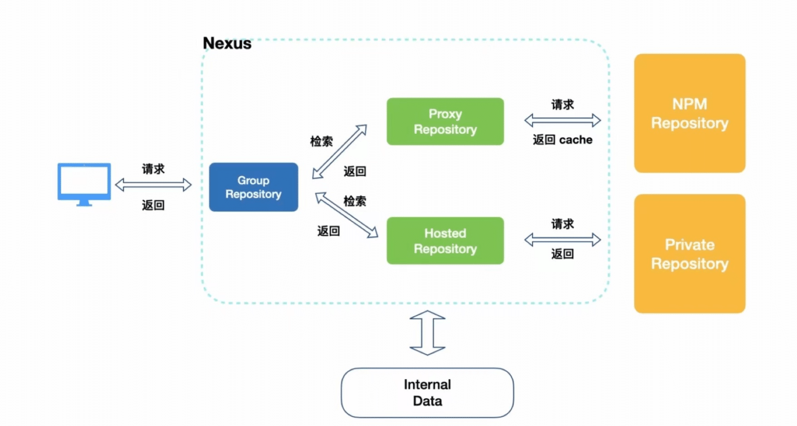

# **搭建私有NPM仓库**

## **使用私服下载原理**



## **搭建私有npm方案**

搭建私有npm的方案有多种:

|           方案           |                  描述                  |                             优点                             |                             缺点                             |
| :----------------------: | :------------------------------------: | :----------------------------------------------------------: | :----------------------------------------------------------: |
|      使用Verdaccio       | 基于Node.js创建的企业级npm私有仓库程序 | 1. 安装和配置简单<br>2. 支持Windows和Linux系统<br>3. 100%向后兼容Sinopia |        1. 功能相对基础，可能不满足大型企业的复杂需求         |
| 使用cnpm+mysql部署服务器 |  结合cnpm和mysql数据库搭建私有npm仓库  | 1. 提供了较为完善的包管理和发布功能<br>2. 可利用mysql进行数据存储和查询优化 |       1. 部署和配置相对复杂<br>2. 需要维护数据库服务器       |
|       使用Git+SSH        |     通过Git仓库和SSH协议管理npm包      |      1. 利用Git的版本控制功能<br>2. 灵活性和可扩展性强       | 1. 配置和使用相对复杂<br>2. 不支持npm的语义化版本规范（semver）<br>3. 无法直接通过npm命令进行包的安装和更新 |
|       付费购买服务       |    购买第三方提供的私有npm仓库服务     |      1. 功能完善，易于使用<br>2. 通常提供技术支持和维护      |    1. 需要支付费用<br>2. 可能受限于服务提供商的规定和限制    |

需要注意的是，不同的方案可能适用于不同的场景和需求。在选择搭建私有npm的方案时，应根据实际情况进行权衡和选择。例如，对于小型企业或个人开发者，使用Verdaccio可能是一个简单且实用的选择；而对于大型企业或需要更多高级功能的情况，可能需要考虑使用更复杂的方案或购买专业服务。


## **使用Verdaccio搭建私有npm**

**参考资料**

[搭建属于自己的私有npm库 - 掘金 (juejin.cn)](https://juejin.cn/post/6983945466694074382)

## 发布自己的 npm 包

* 在命令行中登录

```bash
npm login
# Username: authorname
# Password:
# Email: (this IS public) email@email.com
# Logged in as authorname on https://registry.npmjs.org/.
```

* 使用npm源
  * 因为淘宝镜像源是只读源，所以要发布npm需要去npm源，不修改会报错

```bash
nrm use npm
# 如果没有安装nrm可以使用原生
npm config set registry=http://registry.npmjs.org
```

* 进入需要发布的目录

```bash
cd publish-catalog
npm publish
```

* 修改更新版本
  * 如果要更新版本，需要先git上面提交代码，并且修改`package.json`里面的`"version": "1.1.0"`，否则无法再次提交。

### 在淘宝镜像下发布 npm 包

使用淘宝镜像

淘宝npm 地址： http://npm.taobao.org/

* 1.临时使用

```
npm --registry https://registry.npm.taobao.org install express1
```

* 2.持久使用

```
npm config set registry https://registry.npm.taobao.org1
```

* 在淘宝镜像下发布 npm 包

```
npm login --registry http://registry.npmjs.org
npm publish --registry http://registry.npmjs.org
```

