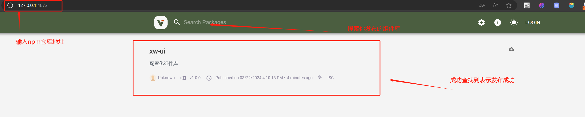

# **搭建私有NPM仓库**

## **使用私服下载原理**


## **搭建私有npm方案**

搭建私有npm的方案有多种:

|           方案           |                  描述                  |                             优点                             |                             缺点                             |
| :----------------------: | :------------------------------------: | :----------------------------------------------------------: | :----------------------------------------------------------: |
|      使用Verdaccio       | 基于Node.js创建的企业级npm私有仓库程序 | 1. 安装和配置简单<br>2. 支持Windows和Linux系统<br>3. 100%向后兼容Sinopia |        1. 功能相对基础，可能不满足大型企业的复杂需求         |
| 使用cnpm+mysql部署服务器 |  结合cnpm和mysql数据库搭建私有npm仓库  | 1. 提供了较为完善的包管理和发布功能<br>2. 可利用mysql进行数据存储和查询优化 |       1. 部署和配置相对复杂<br>2. 需要维护数据库服务器       |
|       使用Git+SSH        |     通过Git仓库和SSH协议管理npm包      |      1. 利用Git的版本控制功能<br>2. 灵活性和可扩展性强       | 1. 配置和使用相对复杂<br>2. 不支持npm的语义化版本规范（semver）<br>3. 无法直接通过npm命令进行包的安装和更新 |
|       付费购买服务       |    购买第三方提供的私有npm仓库服务     |      1. 功能完善，易于使用<br>2. 通常提供技术支持和维护      |    1. 需要支付费用<br>2. 可能受限于服务提供商的规定和限制    |

需要注意的是，不同的方案可能适用于不同的场景和需求。在选择搭建私有npm的方案时，应根据实际情况进行权衡和选择。例如，对于小型企业或个人开发者，使用Verdaccio可能是一个简单且实用的选择；而对于大型企业或需要更多高级功能的情况，可能需要考虑使用更复杂的方案或购买专业服务。


### **使用Verdaccio搭建私有npm**

搭建verdaccio提供了

* docker镜像
* pm2部署

#### **docker镜像**

1.  拉取verdaccio docker镜像:

   ```dockerfile
   docker pull verdaccio/verdaccio:nightly-master
   ```

2. 运行 docker 镜像：

   ```dockerfile
   docker run -it --rm --name verdaccio -p 4873:4873 verdaccio/verdaccio:nightly-master
   ```

> 这条命令的作用是：
>
> 从 `verdaccio/verdaccio` 仓库启动一个名为 `verdaccio` 的新容器，基于 `nightly-master` 标签的镜像，并将宿主机的 `4873` 端口映射到容器的 `4873` 端口。同时，容器将在交互模式下运行，并且当容器退出时，它将被自动删除。
>
> 1. **`docker run`**：这是 Docker 的命令，用于从指定的镜像启动一个新的容器。
>
> 2. **`-it`**：
>
>    - **`-i`**（或 `--interactive`）：保持 STDIN 开放，即使没有附加。这通常与 `-t` 一起使用，以便你可以与容器进行交互。
>    - **`-t`**（或 `--tty`）：为容器分配一个伪终端（pseudo-TTY），这通常用于使容器中的命令表现得像它们在终端中运行一样。
>
>    这两个选项通常一起使用，以便你可以交互式地运行一个命令或程序（如 bash）并与容器交互。
>
> 3. **`--rm`**：当容器退出时，自动删除该容器。这有助于保持 Docker 系统的整洁，避免留下不再需要的容器。
>
> 4. **`--name verdaccio`**：为新容器指定一个名称，这里是 `verdaccio`。这样，你可以更容易地引用或管理这个特定的容器。
>
> 5. **`-p 4873:4873`**：
>
>    - **`-p`**（或 `--publish` 或 `--publish-all`）：将容器的端口映射到宿主机的端口。
>    - **`4873:4873`**：这表示将宿主机的 `4873` 端口映射到容器的 `4873` 端口。这通常是 Verdaccio 默认的 HTTP 端口。
>
> 6. **`verdaccio/verdaccio:nightly-master`**：
>
>    - 这是你想要基于的 Docker 镜像的名称和标签。
>    - **`verdaccio/verdaccio`**：这是 Verdaccio 官方 Docker 镜像的仓库名称。
>    - **`nightly-master`**：这是特定的标签，指示你希望从该仓库中使用哪个版本的 Verdaccio 镜像。在这种情况下，`nightly-master` 通常指的是每晚自动构建的开发或预发布版本，基于最新的 `master` 分支。
>
> 如果您希望使用 Docker 在后台长期运行 Verdaccio，并且不希望与容器进行交互，那么您应该去掉 `-it` 参数，并且通常还需要加上 `-d` 参数来让容器在后台运行。此外，如果您希望容器在退出时不会自动删除，那么您也应该去掉 `--rm` 参数。
>
> 下面是一个修改后的命令，它会在后台长期运行 Verdaccio：
>
> ```bash
> docker run -d --name verdaccio -p 4873:4873 verdaccio/verdaccio:nightly-master
> ```
>
> 这里是对命令各部分的解释：
>
> - **`-d`**（或 `--detach`）：在后台运行容器，并返回容器 ID。这样，您可以在不阻塞终端的情况下启动容器。
> - **`--name verdaccio`**：为容器指定一个名称，便于后续管理。
> - **`-p 4873:4873`**：将宿主机的 4873 端口映射到容器的 4873 端口，这样您就可以通过宿主机的这个端口来访问 Verdaccio 服务。
> - **`verdaccio/verdaccio:nightly-master`**：指定要使用的 Docker 镜像。
>
> 使用上述命令启动的 Verdaccio 容器将在后台运行，并且不会因为退出而自动删除。您可以随时使用 `docker ps` 命令来查看正在运行的容器，包括这个 Verdaccio 容器。如果需要停止或删除这个容器，您可以使用 `docker stop verdaccio` 和 `docker rm verdaccio` 命令。


#### **pm2 部署**

## **nrm**

[nrm](https://link.juejin.cn/?target=https%3A%2F%2Fgithub.com%2FPana%2Fnrm)（NPM registry manager）是 npm 的镜像源管理工具，使用它可以快速切换 npm 源。

基本使用：

**添加源**

适用于企业内部定制的私有源，`<registry>` 表示源名称，`<url>` 表示源地址。

```shell
nrm add <registry> <url>
```

**使用源**

```
nrm use <registry>
```

**删除源**

```shell
nrm del <registry>
```

**测试源的响应时间**

```shell
nrm test <registry>
```


**参考资料**

[Pana/nrm: NPM registry manager, fast switch between different registries: npm, cnpm, nj, taobao (github.com)](https://github.com/Pana/nrm)

[搭建属于自己的私有npm库 - 掘金 (juejin.cn)](https://juejin.cn/post/6983945466694074382)

## 发布 npm 包

### **发布npm包到私有Verdaccio仓库**


首先，确保你已经安装并正确配置了Verdaccio。你可以在本地机器上安装它，或者在一个服务器上安装，以便于团队共享。

然后，进入你的本地项目

按照以下步骤来发布你的npm包：

1. **使用 nrm 添加你的私有 npm 仓库**：

   ```
   $ nrm add localhost http://<your-verdaccio-host>:<port>
   ```

2. **查看现有的npm源**:

   ```
   nrm ls
   ```

3. **使用 nrm 切换镜像源为你的私有 npm 镜像**:

   ```
   nrm use localhost 
   ```

4. **添加 Verdaccio 用户**：

   ```
   npm adduser 
   ```

5. **登录到你的私有 Verdaccio仓库**

在你的命令行中，运行以下命令，使用你在Verdaccio中设置的用户名和密码登录：

```bash
# 没有切换切换镜像源，需要指定镜像源地址 
npm login --registry=http://<your-verdaccio-host>:<port>
# 使用 nrm 切换镜像源为你的私有 npm 镜像后，无需指定镜像源地址 
npm login
```

将`<your-verdaccio-host>`和`<port>`替换为你的Verdaccio服务器的实际主机名和端口。

6. **初始化你的npm包**

如果你还没有初始化你的npm包，你可以通过以下命令来创建一个`package.json`文件：

```bash
npm init
```

这将提示你输入一些基本信息，例如包名、版本、描述等。完成后，它将生成一个`package.json`文件。

7. **发布你的npm包**

在你的npm包所在的目录中，运行以下命令来发布你的包：

```bash
# 没有切换切换镜像源，需要指定镜像源地址 
npm publish --registry=http://<your-verdaccio-host>:<port>
# 使用 nrm 切换镜像源为你的私有 npm 镜像后，无需指定镜像源地址 
npm publish
```

同样，将`<your-verdaccio-host>`和`<port>`替换为你的Verdaccio服务器的实际主机名和端口。


8. **验证你的npm包**

发布完成后，你可以尝试在你的Verdaccio仓库中搜索你刚刚发布的包，以确保它已成功发布。



请注意，如果你的Verdaccio服务器配置了需要身份验证才能访问的包，那么在发布包时，你需要确保你已经登录，并且你有足够的权限来发布包。

另外，如果你在使用代理或VPN，确保npm的配置中设置了正确的代理或VPN信息，以防止在发布过程中遇到网络问题。

最后，如果你遇到任何问题，你可以查看Verdaccio的日志，通常可以在Verdaccio的安装目录的`logs`文件夹中找到。这些日志可能会包含关于你的发布操作失败原因的详细信息。


### 在淘宝镜像下发布 npm 包

使用淘宝镜像

淘宝npm 地址： http://npm.taobao.org/

* 1.临时使用

```
npm --registry https://registry.npm.taobao.org install express1
```

* 2.持久使用

```
npm config set registry https://registry.npm.taobao.org1
```

* 在淘宝镜像下发布 npm 包

```
npm login --registry http://registry.npmjs.org
npm publish --registry http://registry.npmjs.org
```


## **使用私有NPM包**
