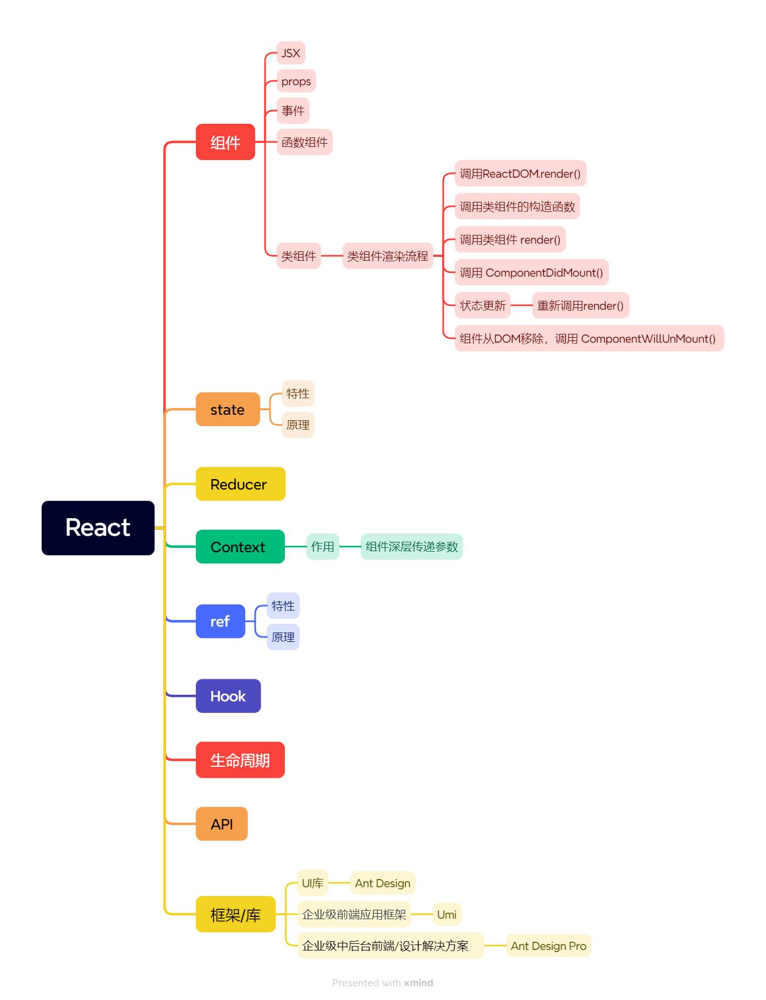

# React
## **大纲**



| 内容                                     | 库/框架                                                      |                                                              |
| ---------------------------------------- | ------------------------------------------------------------ | ------------------------------------------------------------ |
| [**基础**](https://react.docschina.org/) |                                                              |                                                              |
| **核心API： 22种 Hooks**                 |                                                              |                                                              |
| **数据状态管理**                         | **Redux**                                                    |                                                              |
| **路由**                                 | React-Router                                                 |                                                              |
| **UI框架**                               | Ant Design                                                   |                                                              |
| **企业级前端应用框架**                   | [**Umijs**](https://umijs.org/)                              | 采用约定式路由，并配备了一套完善的插件体系                   |
|                                          | [Hooks-Admin](https://baimingxuan.github.io/react-router6-doc/start/overview) | 基于 React18、React-Router v6、React-Hooks、Redux && Redux-Toolkit、TypeScript、Vite2、Ant-Design 开源的一套后台管理框架 |

## **基础概念**


|         概念          |                             说明                             |
| :-------------------: | :----------------------------------------------------------: |
| **组件（Component）** | React的基本构建块，用于表示UI的某一部分。可以是**函数或类**，接受输入（props）并返回React元素树。 |
|        **JSX**        | JavaScript的语法扩展，用于描述UI的外观。看起来像HTML，但在编译时转换为React元素。 |
|       **Props**       | Properties的缩写，用于**父组件向子组件传递数据**。子组件通过`this.props`（类组件）或函数参数（函数组件）接收props。 |
|       **State**       | **组件的私有数据，只能由该组件自己修改**。通过`this.state`（类组件）或`useState` Hook（函数组件）管理。 |
|     **事件处理**      | React组件可以像DOM元素一样处理事件，如点击、输入等。事件处理函数通常作为props传递给组件。 |
|   **生命周期方法**    | 类组件中的特殊方法，用于**在组件的不同阶段执行代码**。如`componentDidMount`、`componentDidUpdate`和`componentWillUnmount`。函数组件使用Hooks处理类似逻辑。 |
|       **Hooks**       | React 16.8引入的新特性，**允许在不编写class的情况下使用state以及其他的React特性**。如`useState`、`useEffect`和`useContext`等。 |
|      **Context**      | **允许无需显式地通过每一层组件传递props，就能将值深入组件树**。通过`React.createContext`创建，并通过`<Context.Provider>`和`useContext` Hook使用。 |
|       **Refs**        | 提供了一种方式，**用于访问DOM节点或在render方法中创建的React元素**。常用于管理焦点、文本选择或媒体播放。 |
|      **虚拟DOM**      | React的一个核心概念，**React使用虚拟DOM来比较和更新实际的DOM**。这提高了性能，因为React只更新需要变化的部分。 |
| **渲染（Rendering）** | React将组件转换为DOM标记的过程，这个过程包括创建虚拟DOM树并比较它与之前的版本，然后更新实际的DOM。 |
|  **Reconciliation**   | React的“reconciliation”算法是React用于确定哪些组件需要更新，哪些可以保持不变的过程。这是React性能优化的关键部分。 |


## **组件**

### **组件定义**

React 组件定义有两种类型：类组件和函数组件。

React定义组件主要有三种方式：

1. **无状态函数式组件**：这种组件是为了创建纯展示组件，只负责根据传入的props来展示，不涉及到state状态的操作。它没有实例，整体渲染性能得到提升，因此不能访问this对象，也不能使用生命周期的方法。语法上，它就是一个简单的JavaScript函数，接受props作为参数，并返回React元素。
2. **React.createClass定义的组件**：这是ES5的方式定义组件。它会自动绑定成员函数中的this，但可能会导致不必要的性能开销，并增加代码过时的可能性。现在这种方式已经较少使用。
3. **React.Component定义的组件**：这是ES6形式的组件定义方式，通过继承React.Component类来创建组件。它允许你使用更多的React特性，如state和生命周期方法。需要注意的是，与React.createClass不同，React.Component创建的组件需要手动绑定成员函数中的this，否则this不能获取当前组件实例对象。

#### 类组件（Class Components）

类组件是使用ES6的类语法定义的React组件。

它们**具有更完整的生命周期方法**，包括组件挂载、更新和卸载等各个阶段的方法。类组件也支持状态（state）和事件处理。

**特征：**

1. **状态管理**：类组件有自己的状态（state），可以**通过`this.state`访问和修改**。状态的变化会触发组件的重新渲染。
2. **生命周期方法**：类组件包含一系列生命周期方法，如`componentDidMount`、`componentDidUpdate`和`componentWillUnmount`等，用于在组件的不同阶段执行特定的操作。
3. **事件处理**：类组件可以定义事件处理函数，通过绑定到DOM元素的事件来响应用户交互。
4. **引用（Refs）**：类组件可以使用`createRef`或`React.forwardRef`来创建和使用refs，从而直接访问DOM元素或子组件。

```jsx
class MyClassComponent extends React.Component {  
  constructor(props) {  
    super(props);  
    this.state = { message: 'Hello from Class Component' };  
  }  
  
  render() {  
    return <div>{this.state.message}</div>;  
  }  
}
```

>  在这个例子中，`MyClassComponent`是一个类组件。它有一个构造函数，用于初始化组件的状态。状态是一个对象，可以包含组件需要的数据。`render`方法返回组件的JSX，即要渲染的UI。此外，类组件还有生命周期方法，如`componentDidMount`、`componentDidUpdate`等，这些方法在组件的不同生命周期阶段被自动调用。


#### 函数组件（Function Components）

函数组件是使用普通JavaScript函数定义的React组件。

函数组件更加轻量，没有内置的状态和生命周期方法，但可以通过Hooks来添加这些功能。

**特征：**

1. **无状态**：函数组件本身没有状态，但可以通过Hooks（如`useState`）来添加状态。
2. **Hooks**：函数组件可以使用Hooks来访问React的特性，如状态、生命周期、上下文等，而无需编写类。
3. **简单性**：函数组件的语法更加简洁，易于理解和维护。
4. **性能**：由于函数组件没有类的开销，它们在性能上可能略优于类组件。

```jsx
import React, { useState, useEffect } from 'react';  
  
function MyFunctionComponent() {  
  const [message, setMessage] = useState('Hello from Function Component');  
  
  useEffect(() => {  
    console.log('Component mounted');  
  }, []);  
  
  return <div>{message}</div>;  
}
```

>  在这个例子中，`MyFunctionComponent`是一个函数组件。它使用`useState` Hook来添加一个状态变量`message`，并通过`setMessage`函数来更新这个状态。当状态发生变化时，组件会重新渲染。此外，它还使用`useEffect` Hook来模拟类组件的生命周期方法，这里用于在组件挂载时打印一条消息。


**注意事项**

**不能把组件函数的定义嵌套起来**

React 组件为函数，每次渲染组件时，就是重新调用一次函数，如果将组件函数的定义嵌套起来，将导致定义被嵌套组件的状态无法控制（每次外层组件渲染时，被嵌套组件函数重新被执行渲染，状态重置）

示例参考官网：[对 state 进行保留和重置 – React 中文文档 (docschina.org)](https://react.docschina.org/learn/preserving-and-resetting-state#different-components-at-the-same-position-reset-state)

#### 类组件与函数组件的对比

|                  |                      类组件                       |                 函数组件                 |
| :--------------: | :-----------------------------------------------: | :--------------------------------------: |
|   **定义方式**   |                  使用ES6的类语法                  |          使用普通JavaScript函数          |
|   **状态管理**   |     内置状态管理，通过`this.state`访问和修改      |       通过`useState` Hook添加状态        |
| **生命周期方法** |    完整的生命周期方法，如`componentDidMount`等    |  通过Hooks（如`useEffect`）模拟生命周期  |
|   **事件处理**   |    定义事件处理函数，通过`this`绑定到组件实例     | 定义事件处理函数，作为组件函数的参数传递 |
| **引用（Refs）** | 使用`createRef`或`React.forwardRef`创建和使用refs |     通过`useRef` Hook创建和使用refs      |
|    **复杂性**    |    相对复杂，需要处理类的继承、this绑定等问题     |         简单直观，易于理解和维护         |
|     **性能**     |        可能略逊于函数组件，因为有类的开销         |          性能较好，没有类的开销          |

总的来说，类组件和函数组件在React中都有各自的应用场景：

* 类组件提供了更完整的生命周期方法和状态管理，适用于复杂的组件逻辑；

* 而函数组件则更加轻量、简单，并且随着Hooks的引入，其功能得到了极大的增强。


### **Prop**

### **事件**


## **state**

### **state 异步更新**

**在React中，`setState`的调用是异步的，它不会立即更新组件的状态。相反，React 把一系列 state 更新加入队列 ，并在在事件循环的下一个迭代应用**。这样做的一个主要好处是React可以批量处理多个状态更新，以提高性能。

示例：

```react
import { useState } from 'react';

export default function Counter() {
  const [score, setScore] = useState(0);

  function increment() {
    setScore(score + 1);
  }

  return (
    <>
      <button onClick={() => increment()}>+1</button>
      <button onClick={() => {
        increment();
        increment();
        increment();
      }}>+3</button>
      <h1>Score: {score}</h1>
    </>
  )
}

```

> 这段代码中的`Counter`组件确实存在一个问题：当点击“+3”按钮时，分数只会增加一次，而不是三次。这个问题是由于React的状态更新是异步的导致的。
>
> 当点击“+3”按钮时，`increment`函数会被连续调用三次。每次调用`increment`都会创建一个新的状态更新（即`score + 1`），但由于状态更新是异步的，这三个更新实际上都会被合并成一个。因此，当React应用这些更新时，只会看到最后一个`score + 1`，这导致`score`只增加了一次。

为了解决这个问题，你可以使用**函数式的状态更新**，它允许你基于先前的状态来计算新的状态

** **更新函数****

通过在设置状态时传递一个 *更新器函数* 来解决这个问题。

 **更新函数**: 传入一个根据队列中的前一个 state 计算下一个 state 的 **函数**。可以像 `setNumber(n => n + 1)` 这样传入。

当你将它传递给一个 state 设置函数时：

1. React 会将此函数加入队列，以便在事件处理函数中的所有其他代码运行后进行处理。
2. 在下一次渲染期间，React 会遍历队列并给你更新之后的最终 state。

### **useState 如何工作**

useState是React原生的Hook，其本质是为函数组件提供状态管理的能力。具体来说，useState接受一个初始状态值作为参数，并返回一个数组，该数组包含两个元素：当前的状态值和一个用于更新该状态值的函数。

```js
const [index, setIndex] = useState(0);
```

#### [React 如何知道返回哪个 state](https://react.docschina.org/learn/state-a-components-memory#how-does-react-know-which-state-to-return) 

> 在 React 内部，为每个组件保存了一个数组，其中每一项都是一个 state 对。它维护当前 state 对的索引值，在渲染之前将其设置为 “0”。
> 以 `useState` 为例，它返回一个数组，这个数组包含了当前的状态值和一个用于更新状态的函数。这个数组是通过 JavaScript 的数组解构语法来使用的，使得代码更加简洁易读。
>
> 但实际上，React 在内部维护了一个状态列表，每个 Hook 调用都会在这个列表中对应一个位置。
>
> 当组件重新渲染时，React 会按照相同的顺序调用 Hooks，并返回之前保存的状态值或函数。

这个例子**没有使用 React**，但它让你了解 `useState` 在内部是如何工作的：([来自官网](https://react.docschina.org/learn/state-a-components-memory))

```js
let componentHooks = [];
let currentHookIndex = 0;

// useState 在 React 中是如何工作的（简化版）
function useState(initialState) {
  let pair = componentHooks[currentHookIndex];
  if (pair) {
    // 这不是第一次渲染
    // 所以 state pair 已经存在
    // 将其返回并为下一次 hook 的调用做准备
    currentHookIndex++;
    return pair;
  }

  // 这是我们第一次进行渲染
  // 所以新建一个 state pair 然后存储它
  pair = [initialState, setState];

  function setState(nextState) {
    // 当用户发起 state 的变更，
    // 把新的值放入 pair 中
    pair[0] = nextState;
    updateDOM();
  }

  // 存储这个 pair 用于将来的渲染
  // 并且为下一次 hook 的调用做准备
  componentHooks[currentHookIndex] = pair;
  currentHookIndex++;
  return pair;
}

function Gallery() {
  // 每次调用 useState() 都会得到新的 pair
  const [index, setIndex] = useState(0);
  const [showMore, setShowMore] = useState(false);

  function handleNextClick() {
    setIndex(index + 1);
  }

  function handleMoreClick() {
    setShowMore(!showMore);
  }

  let sculpture = sculptureList[index];
  // 这个例子没有使用 React，所以
  // 返回一个对象而不是 JSX
  return {
    onNextClick: handleNextClick,
    onMoreClick: handleMoreClick,
    header: `${sculpture.name} by ${sculpture.artist}`,
    counter: `${index + 1} of ${sculptureList.length}`,
    more: `${showMore ? 'Hide' : 'Show'} details`,
    description: showMore ? sculpture.description : null,
    imageSrc: sculpture.url,
    imageAlt: sculpture.alt
  };
}

function updateDOM() {
  // 在渲染组件之前
  // 重置当前 Hook 的下标
  currentHookIndex = 0;
  let output = Gallery();

  // 更新 DOM 以匹配输出结果
  // 这部分工作由 React 为你完成
  nextButton.onclick = output.onNextClick;
  header.textContent = output.header;
  moreButton.onclick = output.onMoreClick;
  moreButton.textContent = output.more;
  image.src = output.imageSrc;
  image.alt = output.imageAlt;
  if (output.description !== null) {
    description.textContent = output.description;
    description.style.display = '';
  } else {
    description.style.display = 'none';
  }
}

let nextButton = document.getElementById('nextButton');
let header = document.getElementById('header');
let moreButton = document.getElementById('moreButton');
let description = document.getElementById('description');
let image = document.getElementById('image');
let sculptureList = [{
  name: 'Homenaje a la Neurocirugía',
  artist: 'Marta Colvin Andrade',
  description: 'Although Colvin is predominantly known for abstract themes that allude to pre-Hispanic symbols, this gigantic sculpture, an homage to neurosurgery, is one of her most recognizable public art pieces.',
  url: 'https://i.imgur.com/Mx7dA2Y.jpg',
  alt: 'A bronze statue of two crossed hands delicately holding a human brain in their fingertips.'  
}, {
  name: 'Floralis Genérica',
  artist: 'Eduardo Catalano',
  description: 'This enormous (75 ft. or 23m) silver flower is located in Buenos Aires. It is designed to move, closing its petals in the evening or when strong winds blow and opening them in the morning.',
  url: 'https://i.imgur.com/ZF6s192m.jpg',
  alt: 'A gigantic metallic flower sculpture with reflective mirror-like petals and strong stamens.'
}, {
  name: 'Eternal Presence',
  artist: 'John Woodrow Wilson',
  description: 'Wilson was known for his preoccupation with equality, social justice, as well as the essential and spiritual qualities of humankind. This massive (7ft. or 2,13m) bronze represents what he described as "a symbolic Black presence infused with a sense of universal humanity."',
  url: 'https://i.imgur.com/aTtVpES.jpg',
  alt: 'The sculpture depicting a human head seems ever-present and solemn. It radiates calm and serenity.'
}];

// 使 UI 匹配当前 state
updateDOM();

```

从以上示例可以看到，**在React组件中多次调用同一个 state 的 setState 方法更新状态时，实际上状态只会更新最后一次**。

因为在 setState 内部实现逻辑为：

```js
  function setState(nextState) {
    // 当用户发起 state 的变更，
    // 把新的值放入 pair 中
    pair[0] = nextState;
    updateDOM();
  }
```

每次调用 setState 时候，会将传入的新的 state 更新到同一个变量 `pair[0]` 中，`pair[0]` 为 useState 返回数组第一个下标值。因此也可以解释为什么 state 是异步更新的。

#### 自己实现状态队列 

```js
/**
* baseState 初始状态
* queue 状态队列
**/
export function getFinalState(baseState, queue) {
  let finalState = baseState;

  for (let update of queue) {
    if (typeof update === 'function') {
      // 调用更新函数
      finalState = update(finalState);
    } else {
      // 替换下一个 state
      finalState = update;
    }
  }

  return finalState;
}
```


## **Reducer**

## **Context**

## **Refs**

## **Hooks**


在 React 中，**以 `use` 开头的函数——只能在组件或[自定义 Hook](https://react.docschina.org/learn/reusing-logic-with-custom-hooks) 的最顶层调用**，`useState` 以及任何其他以“`use`”开头的函数都被称为 **Hook**。

> 如何编写 Hooks 参考文档：[使用自定义 Hook 复用逻辑 – React 中文文档 (docschina.org)](https://react.docschina.org/learn/reusing-logic-with-custom-hooks)

### **特性**

* Hook 是特殊的函数，只在 React [渲染](https://react.docschina.org/learn/render-and-commit#step-1-trigger-a-render)时有效。

* **Hook 内部使用了 state，Effect 以及其他的 React 特性**。
* 自定义 Hook 共享的只是状态逻辑而不是状态本身。对 Hook 的每个调用完全独立于对同一个 Hook 的其他调用

### **命名公约**

1. **React 组件名称必须以大写字母开头**，比如 `StatusBar` 和 `SaveButton`。React 组件还需要返回一些 React 能够显示的内容，比如一段 JSX。
2. **Hook 的名称必须以 `use` 开头，然后紧跟一个大写字母**，就像内置的 [`useState`](https://react.docschina.org/reference/react/useState) 或者本文早前的自定义 `useOnlineStatus` 一样。Hook 可以返回任意值。

如果你在组件内部看见 `getColor()` 函数调用，就可以确定它里面不可能包含 React state，因为它的名称没有以 `use` 开头。但是像 `useOnlineStatus()` 这样的函数调用就很可能包含对内部其他 Hook 的调用！


### **Hook使用注意的问题和原因**

在使用React的Hook时，需要注意以下几个问题和原因：

**只在函数组件的顶层调用Hook**

- 原因：React依靠Hook的调用顺序来正确管理组件的状态。如果Hook在循环、条件或嵌套函数中调用，React无法确定组件的状态，这可能会导致意外的行为、状态丢失或内存泄漏。

**不要在循环、条件或嵌套函数中调用Hook**

- 原因：同上，React需要确定Hook的调用顺序。在循环或条件语句中调用Hook，每次组件渲染时Hook的调用顺序可能会改变，这违反了React的规则。

**避免在自定义Hook中执行副作用操作**

- 原因：自定义Hook应该只包含逻辑代码，而不应该直接执行副作用操作（如设置订阅或修改DOM）。副作用操作应该放在组件中，并使用`useEffect` Hook来管理。

**确保Hook的依赖项正确**

- 对于`useEffect` Hook，需要明确指定依赖项数组。如果遗漏了某个依赖项，当该依赖项变化时，`useEffect`不会重新运行，可能导致状态不同步或逻辑错误。
- 原因：React使用依赖项数组来确定何时重新运行`useEffect`。如果依赖项未正确指定，React无法准确判断何时需要更新副作用。

**避免在渲染过程中直接修改状态**

- 原因：React的状态更新是异步的，并且在渲染过程中直接修改状态可能导致不可预测的行为。应该使用`setState`函数来更新状态。

**注意闭包问题**

- 在`useEffect`或事件处理函数中，如果引用了组件的state或props，可能会遇到闭包问题。这意味着，在函数执行时，它捕获的是当前的state或props值，而不是最新的值。
- 原因：JavaScript的闭包特性导致函数记住并访问其词法作用域，包括外部函数的变量和`this`值。在React中，这可能导致状态或属性值的延迟或错误使用。

**Hook命名约定**

- 自定义Hook应以“use”开头，这是一个约定，有助于其他开发者更容易地识别和理解你的代码。
- 原因：这是一个编码习惯和约定，有助于提高代码的可读性和可维护性。

正确使用Hook并遵循这些注意事项，可以帮助你编写更可靠、可预测和可维护的React组件。


## **生命周期**

React的生命周期是指React组件从创建到销毁的整个过程，这个过程可以分为三个阶段：**挂载阶段（Mounting）、更新阶段（Updating）和卸载阶段（Unmounting）**。每个阶段都有其特定的方法和功能。

### **挂载阶段（Mounting）**

在挂载阶段，React组件被创建并插入到DOM中。这个阶段包含以下几个方法：

- **constructor(props)**：构造函数，用于**初始化组件的状态和绑定事件处理函数**。在这个阶段，你可以通过`this.state`来定义组件的初始状态。
- **[static getDerivedStateFromProps(props, state)](https://react.docschina.org/reference/react/Component#static-getderivedstatefromprops)**：这是一个静态方法，用于**在组件实例化后和接收新的props之前，根据props来更新state**。注意，这个方法在React 16.3版本后引入，用于替代`componentWillReceiveProps`。
- **render()**：用于**根据组件的props和state来渲染组件的UI**。这个方法必须是一个纯函数，也就是说，对于相同的props和state，它应该总是返回相同的结果。
- **componentDidMount()**：**在组件挂载后立即调用，此时组件已经被插入到DOM中**。你可以在这个方法中进行网络请求、订阅事件等初始化操作。

#### constructor

实例过程中自动调用的方法，在方法内部通过`super`关键字获取来自父组件的`props`；

在该方法中，通常的操作为初始化`state`状态或者在`this`上挂载方法：

```react
class MyComponent extends React.Component {  
  constructor(props) {  //初始化组件的状态和绑定事件处理函数
    super(props);  //通过`super`关键字获取来自父组件的`props`
    this.state = {  
      // 使用props来初始化状态（如果需要的话）  
      value: props.initialValue,  
    };  
    this.handleClick = this.handleClick.bind(this); //在`this`上挂载方法
  }  
  
  render() {  
    // ...  
  }  
}
```

在上面的示例中，构造函数首先调用`super(props)`来确保`this.props`的可用性，然后使用`this.props`来初始化组件的状态。如果不调用`super(props)`，那么`this.props`将会是`undefined`，导致状态初始化失败。

> **在构造函数调用 super 并将 props 作为参数传入的作用?**

在React的类组件中，构造函数（constructor）是一个特殊的方法，用于初始化组件的状态（state）和绑定事件处理函数。在构造函数中调用`super(props)`是一个必要的步骤，它有几个重要的作用：

1. **继承父类属性**：在JavaScript中，类是通过继承机制来工作的。`super`关键字用于调用父类（在这里是`React.Component`）的构造函数。通过将`props`作为参数传递给`super()`，我们确保父类的构造函数能够正确执行，并且组件实例能够访问到`this.props`。
2. **确保props的可用性**：在类组件中，`props`是通过组件的实例来访问的（即`this.props`）。**如果在构造函数中不调用`super(props)`，那么`this.props`将会是`undefined`，因为构造函数中的`this`指向的是当前组件的实例，而实例的`props`属性是由父类（`React.Component`）的构造函数来初始化的**。
3. **遵循React的生命周期**：React组件的生命周期是严格定义的，并且依赖于特定的方法和步骤来正确执行。调用`super(props)`是组件生命周期中的一个关键步骤，它确保了组件实例能够按照React的预期来工作。
4. **状态初始化**：虽然`super(props)`主要用于确保`props`的可用性，但构造函数通常也用于初始化组件的状态。在调用`super(props)`之后，你可以安全地访问`this.props`，并且可以使用它来初始化状态（如果需要的话）。


### **更新阶段（Updating）**

当组件的props或state发生变化时，组件会进入更新阶段。这个阶段包含以下几个方法：

- **static getDerivedStateFromProps(props, state)**：在更新阶段也会调用这个方法，用于根据新的props来更新state。
- **shouldComponentUpdate(nextProps, nextState)**：返回一个布尔值，决定是否根据新的props和state重新渲染组件。默认返回true，但你可以在这里实现自己的逻辑来避免不必要的渲染。
- **render()**：根据新的props和state来重新渲染组件。
- **getSnapshotBeforeUpdate(prevProps, prevState)**：在DOM更新之前被调用，它使你的组件能在可能更改的DOM上捕获一些信息（例如滚动位置）。此生命周期返回的任何值都将作为第三个参数传递给`componentDidUpdate()`。
- **componentDidUpdate(prevProps, prevState, snapshot)**：在更新后立即调用，当组件的props或state更新后，可以在此进行DOM操作或网络请求等。

### **卸载阶段（Unmounting）**

当组件不再需要，并且从DOM中移除时，会进入卸载阶段。这个阶段只有一个方法：

- **componentWillUnmount()**：在组件卸载及销毁之前直接调用。你可以在这个方法中进行清理操作，如取消网络请求、移除事件监听器等。

需要注意的是，React 16.3版本之后，一些旧的生命周期方法（如`componentWillMount`、`componentWillReceiveProps`和`componentWillUpdate`）被认为是不安全的，并且可能在未来的版本中被移除。因此，建议开发者使用新的生命周期方法（如`getDerivedStateFromProps`和`getSnapshotBeforeUpdate`）来替代这些旧方法。同时，React团队还引入了Hooks API，使得组件逻辑可以更加独立和可重用，进一步简化了组件的生命周期管理。

## **VDOM**


## **核心API**

React的核心API主要包括用于创建组件、管理状态、处理生命周期以及处理用户输入等的函数和方法。

以下是一些主要的React核心API，以及它们的作用和用法：

|           API            |                             作用                             |                             用法                             |
| :----------------------: | :----------------------------------------------------------: | :----------------------------------------------------------: |
| `React.createElement()`  |                 创建并返回一个新的React元素                  |     `React.createElement(type, [props], [...children])`      |
|    `React.Component`     |               React组件的基类，用于创建类组件                |     `class MyComponent extends React.Component { ... }`      |
|        `render()`        |        类组件中必须的方法，用于返回要渲染的React元素         |       `render() { return <div>Hello, World!</div>; }`        |
|       `setState()`       |                    用于更新组件的局部状态                    |      `this.setState({ count: this.state.count + 1 });`       |
|  `componentDidMount()`   |   组件被挂载后立即调用，常用于发起网络请求、添加事件监听等   |            `componentDidMount() { fetchData(); }`            |
|  `componentDidUpdate()`  |         组件的props或state更新后调用，常用于DOM操作          |      `componentDidUpdate(prevProps, prevState) { ... }`      |
| `componentWillUnmount()` | 组件卸载及销毁之前直接调用，常用于清理操作，如取消网络请求、移除事件监听等 |   `componentWillUnmount() { clearTimeout(this.timerID); }`   |
|       `useState()`       |                 用于在函数组件中添加局部状态                 |           `const [count, setCount] = useState(0);`           |
|      `useEffect()`       | 用于在函数组件中执行副作用操作，如数据获取、订阅、手动更改DOM等 | `useEffect(() => { document.title = `You clicked ${count} times`; });` |
|      `useContext()`      | 接收一个context对象（由`React.createContext`返回）并返回该context的当前值 |          `const theme = useContext(ThemeContext);`           |
|      `useReducer()`      |      用于在函数组件中使用Redux风格的“reducer”来管理状态      | `const [state, dispatch] = useReducer(reducer, initialCount);` |
|     `useCallback()`      |                    返回一个记忆的回调函数                    | `const memoizedCallback = useCallback(() => { doSomething(a, b); }, [a, b]);` |
|       `useMemo()`        |                       返回一个记忆的值                       | `const memoizedValue = useMemo(() => computeExpensiveValue(a, b), [a, b]);` |
|        `useRef()`        | 返回一个可变的ref对象，其`.current`属性被初始化为传入的参数（`initialValue`） |               `const inputRef = useRef(null);`               |
|   `useLayoutEffect()`    | 其API与`useEffect`相同，但它会在所有的DOM变更之后同步调用effect |              `useLayoutEffect(() => { ... });`               |
|    `useDebugValue()`     |      用于在React Developer Tools中显示自定义hook的标签       |                   `useDebugValue(value);`                    |

这些API提供了构建React应用所需的基本功能，从创建和渲染组件，到管理状态和处理副作用，再到处理用户输入和生命周期事件。你可以根据具体的应用需求选择使用哪些API。
