# 链表


## 概念 

* 链表：

  * 链表又称单链表、链式存储结构，用于存储逻辑关系为“一对一”的数据。
  * 用一组任意存储的单元来存储线性表的数据元素。
  * 一个对象存储着本身的值和下一个元素的地址。

  

* 节点：

  * 在链表中，每个数据元素都配有一个指针；
  * 数据域用来存储元素的值，指针域用来存放指针；

  

* 头结点、头指针和首元结点：

  * 一个完整的链表应该由以下几部分构成
    * **头指针**：一个和结点类型相同的指针，它的特点是：永远指向链表中的第一个结点。上文提到过，我们需要记录链表中第一个元素的存储位置，就是用头指针实现。
    * **结点**：链表中的节点又细分为头结点、首元结点和其它结点：
      * 头结点：某些场景中，为了方便解决问题，会故意在链表的开头放置一个空结点，这样的结点就称为头结点。也就是说，头结点是位于链表开头、数据域为空（不利用）的结点。
      * 首元结点：指的是链表开头第一个存有数据的结点。
      * 其他节点：链表中其他的节点。

​					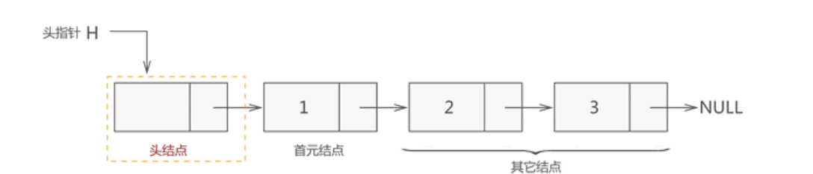


* 特点：
  * 都无法在常量时间内随机访问数据。
  * 能够在 O(1) 时间内在给定结点之后或列表开头添加一个新结点。
  * 能够在 O(1) 时间内删除第一个结点。但是删除给定结点(包括最后一个结点)时略有不同。
  * 在单链表中，它无法获取给定结点的前一个结点，因此在删除给定结点之前我们必须花费 O(N) 时间来找出前一结点。
  * 在双链表中，删除更容易，因为我们可以使用“prev”引用字段获取前一个结点。因此我们可以在 O(1) 时间内删除给定结点。
  * 

----


## 分类

1. **单向链表** (Singly Linked List):
   - 单向链表是最简单和最常见的链表类型。
   - 每个节点包含一个数据元素和一个指向下一个节点的指针。
   - 从头节点开始，通过每个节点的指针可以按顺序遍历整个链表。
   - 链表的尾节点的指针指向 null，表示链表的结束。
   - 单向链表**只能从头到尾进行遍历，不能逆向访问**。
2. **双向链表** (Doubly Linked List):
   - 双向链表在单向链表的基础上扩展，每个节点除了包含数据元素和指向下一个节点的指针外，还包含一个指向前一个节点的指针。
   - 双向链表**可以从头到尾或从尾到头进行遍历**，可以灵活地在链表中进行前后移动。
   - 由于每个节点包含两个指针，相比单向链表，双向链表占用更多的内存空间。
3. **循环链表** (Circular Linked List):
   - 循环链表是一种特殊的链表，其尾节点的指针指向头节点，形成一个循环。
   - 循环链表**可以从任意节点开始遍历整个链表**，直到回到起始节点。
   - 循环链表常用于实现循环队列、循环缓冲区等数据结构。
4. **带头节点的链表** (Linked List with Head Node):
   - 带头节点的链表在链表的头部添加一个**额外的头节点**。
   - 头节点不存储具体的数据，主要**用于方便链表的操作和处理边界情况**。
   - 头节点的存在简化了对链表的操作，使得空链表和非空链表的处理方式一致。
5. **带环链表** (Linked List with Cycle):
   - 带环链表是一种具有环形结构的链表，其中**至少存在一个节点的指针指向链表中的前面节点，形成一个环**。
   - 带环链表常用于解决相关问题，例如判断链表是否有环、找到环的起始点等。

----


## 单向链表

### 创建单向链表

#### 创建不带头节点链表

* 思路一：**不带尾指针的链表**

  > * 定义一个头指针；
  > * 创建一个头结点或者首元结点，让头指针指向它；
  > * 每创建一个结点，都令其直接前驱结点的指针指向它。

* 代码:

  ```js
  class ListNode {
    constructor(value) {
      this.value = value;
      this.next = null;
    }
  }
  
  class LinkedList {
    constructor() {
      this.head = null; // 头指针
    }
  
    insert(value) {
      // 创建新的节点
      const newNode = new ListNode(value);
  	// 判断链表是否为空，为空链接到 head 头指针后面
      if (this.head === null) {
        this.head = newNode;
      } else {
        let currentNode = this.head;
        while (currentNode.next !== null) { //遍历移动到链表尾部
          currentNode = currentNode.next;
        }
        currentNode.next = newNode; //新的节点插入链表尾部
      }
    }
  
    print() {
      let currentNode = this.head;
      while (currentNode !== null) {
        console.log(currentNode.value);
        currentNode = currentNode.next;
      }
    }
  }
  
  // 示例用法
  const linkedList = new LinkedList();
  
  linkedList.insert(1);
  linkedList.insert(2);
  linkedList.insert(3);
  linkedList.insert(4);
  
  linkedList.print(); // 输出链表的值
  ```

* 思路二：**带尾指针的链表**

  > * 定义一个头指针和一个尾指针；
  > * 创建一个头结点或者首元结点，让头指针和尾指针都指向它；
  > * 每创建一个结点，都令其直接前驱结点的指针指向它。

* 代码：

  ```js
  class ListNode {
    constructor(value) {
      this.value = value;
      this.next = null;
    }
  }
  
  class LinkedList {
    constructor() {
      this.head = null; // 头指针
      this.tail = null; // 尾指针
    }
  
    insert(value) {
      // 创建新的节点
      const newNode = new ListNode(value);
  	// 判断链表是否为空，为空链接到 head 头指针后面
      if (this.head === null) {
        this.head = this.tail = newNode;
      } else {
        this.tail.next = newNode;
        this.tail = newNode;       
      }
    }
  
    print() {
      let currentNode = this.head;
      while (currentNode !== null) {
        console.log(currentNode.value);
        currentNode = currentNode.next;
      }
    }
  }
  
  // 示例用法
  const linkedList = new LinkedList();
  
  linkedList.insert(1);
  linkedList.insert(2);
  linkedList.insert(3);
  linkedList.insert(4);
  
  linkedList.print(); // 输出链表的值
  ```

  

#### 创建带头节点链表

* 代码

  ```js
  class ListNode {
    constructor(value) {
      this.value = value;
      this.next = null;
    }
  }
  
  class LinkedList {
    constructor() {
      this.head = new ListNode(null); // 头节点
    }
  
    insert(value) {
      const newNode = new ListNode(value);
      let currentNode = this.head;
      while (currentNode.next !== null) {
        currentNode = currentNode.next;
      }
      currentNode.next = newNode;
    }
  
    print() {
      let currentNode = this.head.next;
      while (currentNode !== null) {
        console.log(currentNode.value);
        currentNode = currentNode.next;
      }
    }
  }
  
  // 示例用法
  const linkedList = new LinkedList();
  
  linkedList.insert(1);
  linkedList.insert(2);
  linkedList.insert(3);
  linkedList.insert(4);
  
  linkedList.print(); // 输出链表的值
  ```

#### 输入一组数据创建链表


* 思路：

  > * 首先定义了一个 `ListNode` 类来表示链表的节点。节点对象有一个 `value` 属性用于存储节点的值，以及一个 `next` 属性用于指向下一个节点。
  >
  > * 然后，定义了一个名为 `createLinkedList` 的函数，它接受一个数组 `arr` 作为参数，用于创建链表。如果传入的数组是空数组，则返回 `null` 表示空链表。
  >
  > * 在 `createLinkedList` 函数中，首先根据数组的第一个元素创建链表的头节点 `head`，然后使用一个循环遍历数组的剩余元素。在循环中，每次创建一个新的节点 `newNode`，并将当前节点 `currentNode` 的 `next` 属性指向新节点，然后更新 `currentNode` 为新节点，以便下一次循环连接下一个节点。
  >
  > * 最后，返回链表的头节点 `head`。

* 代码：

  ```javascript
  // 使用类构造链表结构
  class ListNode {
    constructor(value) {
      this.value = value; //保存链表的值
      this.next = null; // 保存链表下一个值
    }
  }
  
  // 创建链表函数
  function createLinkedList(arr) {
    if (arr.length === 0) { // 判断数据为空，返回 Null
      return null;
    }
    // 创建链表头节点
    const head = new ListNode(arr[0]);
    let currentNode = head; // 链表创建指针
    // 循环创建链表
    for (let i = 1; i < arr.length; i++) {
      const newNode = new ListNode(arr[i]); // 创建链表节点
      currentNode.next = newNode; // 链表指针节点指向新节点
      currentNode = newNode; // 指针指向新节点
    }
  
    return head; //返回头指针
  }
  
  // 示例用法
  const arr = [1, 2, 3, 4, 5];
  const linkedList = createLinkedList(arr);
  
  // 打印链表的值
  let currentNode = linkedList;
  while (currentNode !== null) { //最后一个节点 next 为空，因此打印边界判断为 next 是否空
    console.log(currentNode.value);
    currentNode = currentNode.next;
  }
  ```


----


### 链表插入

* 链表插入可以分为两种：

  * 带头节点的链表的插入，插入任何一个位置操作都相同；
  * 不带头节点的链表插入，要区分插入头节点位置和其他位置两种情况；

* 向链表中增添元素，根据添加位置不同，可分为以下 3 种情况：

  - 插入到链表的头部，作为首元节点；

  - 插入到链表中间的某个位置；

  - 插入到链表的最末端，作为链表中最后一个结点；

#### 有头节点链表插入

* 思路：

  > 对于有头结点的链表，3 种插入元素的实现思想是相同的，具体步骤是：（注意：第二步和第三步不能交换）
  >
  > * 1. 遍历查找到要插入位置的前一个节点；
  >   2. 将新结点的 next 指针指向插入位置后的结点；
  >   3. 将插入位置前结点的 next 指针指向插入结点；
  >
  > * 例如，在链表 `{1,2,3,4}` 的基础上分别实现在头部、中间、尾部插入新元素 5，其实现过程如：

* 代码

  ```js
  // 链表结构
  class ListNode {
    constructor(value) {
      this.value = value;
      this.next = null;
    }
  }
  
  class LinkedList {
    constructor() {
      this.head = new ListNode(null); // 头节点
    }
  
    // 插入头部 
    insertAtHead(value) {
      const newNode = new ListNode(value);
      newNode.next = this.head.next; // 将新节点的 next 指向原来的第一个节点
      this.head.next = newNode; // 更新头节点的 next 指向新节点
    }
  
    /** 
     * 插入任意位置
     * params { int } position 插入位置
     * params { int } value 插入值
     **/
    insertAtPosition(position, value) {
      if (position <= 0) {
        console.log("Invalid position.");
        return false;
      }
  
      let count = 0; // 位置计数器
      let currentNode = this.head;
  	// 遍历找到插入位置的前一个节点
      while (currentNode !== null && count < position - 1) {
        currentNode = currentNode.next;
        count++;
      }
  
      if (currentNode === null) {
        console.log("Invalid position.");
        return;
      }
  	//创建新的节点
      const newNode = new ListNode(value);
      newNode.next = currentNode.next; // 将新节点的 next 指向插入位置后的节点
      currentNode.next = newNode; // 更新插入位置前节点的 next 指向新节点
    }
  
    // 插入末尾
    insertAtEnd(value) {
      let currentNode = this.head;
  	// 遍历找到尾节点
      while (currentNode.next !== null) {
        currentNode = currentNode.next;
      }
  	// 插入尾节点
      const newNode = new ListNode(value);
      currentNode.next = newNode; // 将新节点连接到链表末尾
    }
  
    print() {
      let currentNode = this.head.next; // 跳过头节点
      while (currentNode !== null) {
        console.log(currentNode.value);
        currentNode = currentNode.next;
      }
    }
  }
  
  // 示例用法
  const linkedList = new LinkedList();
  linkedList.insertAtHead(3);
  linkedList.insertAtHead(2);
  linkedList.insertAtHead(1);
  linkedList.print(); // 输出链表的值
  console.log('---');
  
  linkedList.insertAtPosition(2, 4);
  linkedList.print(); // 输出插入到中间位置后的链表的值
  console.log('---');
  
  linkedList.insertAtEnd(5);
  linkedList.print(); // 输出插入到末尾后的链表的值
  ```

#### 无头节点链表插入


* 思路：

  > * 对于没有头结点的链表，在头部插入结点比较特殊，需要单独实现：因此需要分两种情况：
  >
  >   * 头部插入新结点：
  >
  >     * 将新结点的指针指向首元结点；
  >     * 将头指针指向新结点。
  >
  >   * 非头部节点插入新节点：
  >
  >     * 遍历查找到要插入位置的前一个节点；
  >     * 将新结点的 next 指针指向插入位置后的结点；
  >     * 将插入位置前结点的 next 指针指向插入结点；
  >
  >     

* 代码：

  ```js
  class ListNode {
    constructor(value) {
      this.value = value;
      this.next = null;
    }
  }
  
  class LinkedList {
    constructor() {
      this.head = null; // 头指针
    }
    // 插入头节点
    insertAtHead(value) {
      const newNode = new ListNode(value);
      newNode.next = this.head; // 将新节点的 next 指向首元节点
      this.head = newNode; // 更新头指针指向新节点
    }
  
   /** 
     * 插入任意位置
     * params { int } position 插入位置
     * params { int } value 插入值
     **/
    insertAtPosition(position, value) {
      if (position <= 0) {
        console.log("Invalid position.");
        return;
      }
  
      let count = 0;
      let currentNode = this.head;
      let previousNode = null; // 插入位置节点前节点指针
  
      while (currentNode !== null && count < position) {
        previousNode = currentNode; // 当前节点作为前一个节点
        currentNode = currentNode.next; // 指针后移
        count++;
      }
  
      if (count < position) {
        console.log("Invalid position.");
        return;
      }
  
      const newNode = new ListNode(value);
      newNode.next = currentNode; // 将新节点的 next 指向插入位置后的节点
  
      if (previousNode === null) {
        this.head = newNode; // 如果是在头部插入，更新头指针指向新节点
      } else {
        previousNode.next = newNode; // 更新插入位置前节点的 next 指向新节点
      }
    }
  
    print() {
      let currentNode = this.head;
      while (currentNode !== null) {
        console.log(currentNode.value);
        currentNode = currentNode.next;
      }
    }
  }
  
  // 示例用法
  const linkedList = new LinkedList();
  
  linkedList.insertAtHead(3);
  linkedList.insertAtHead(2);
  linkedList.insertAtHead(1);
  
  linkedList.print(); // 输出链表的值
  
  console.log('---');
  
  linkedList.insertAtPosition(2, 4);
  
  linkedList.print(); // 输出插入到中间位置后的链表的值
  
  console.log('---');
  
  linkedList.insertAtHead(0);
  
  linkedList.print(); // 输出头部插入后的链表的值
  ```


----


### 链表删除

* 链表删除可以分为两种：
  * 带头节点的链表的删除，插入任何一个位置操作都相同；
  * 不带头节点的链表删除，要区分插入头节点位置和其他位置两种情况；


#### 有头节点的链表删除

* 思路：

  > * 对于有头结点的链表来说，无论删除头部（首元结点）、中部、尾部的结点，实现方式都一样，执行以下三步操作：
  >
  >   1. 找到目标元素所在结点的直接前驱结点；
  >   2. 将目标结点从链表中摘下来;
  >   3. 手动释放结点占用的内存空间；
  >
  >
  >   从链表上摘除目标节点，只需找到该节点的直接前驱节点 temp，执行如下操作：
  >
  >   ```js
  >   temp->next=temp->next->next;
  >   ```
  >
  > 

* 代码：

  ```js
  class ListNode {
    constructor(value) {
      this.value = value;
      this.next = null;
    }
  }
  
  class LinkedList {
    constructor() {
      this.head = new ListNode(null); // 头节点
    }
    // 链表尾部插入节点，用于构建链表
    insert(value) {
      const newNode = new ListNode(value);
      let currentNode = this.head;
      while (currentNode.next !== null) {
        currentNode = currentNode.next;
      }
      currentNode.next = newNode;
    }
   // 删除节点
    delete(value) {
      let currentNode = this.head;
      let previousNode = null; // 删除元素的前一个元素指针
  	// 循环查找到待删除的节点
      while (currentNode !== null && currentNode.value !== value) {
        previousNode = currentNode;
        currentNode = currentNode.next;
      }
  
      if (currentNode === null) {
        console.log("Element not found.");
        return;
      }
  	// 重点：删除节点，通过将待删除节点和后一个节点连接删除
      previousNode.next = currentNode.next;
      currentNode.next = null;
      delete currentNode;
    }
  
    print() {
      let currentNode = this.head.next;
      while (currentNode !== null) {
        console.log(currentNode.value);
        currentNode = currentNode.next;
      }
    }
  }
  
  // 示例用法
  const linkedList = new LinkedList();
  
  linkedList.insert(1);
  linkedList.insert(2);
  linkedList.insert(3);
  linkedList.insert(4);
  
  linkedList.print(); // 输出链表的值
  
  console.log('---');
  
  linkedList.delete(3);
  
  linkedList.print(); // 输出删除节点后的链表的值
  ```

#### 无头节点的链表删除

* 思路：

  > * 对于不带头结点的链表，需要单独考虑删除首元结点的情况，删除其它结点的方式带头节点方式完全相同；
  >
  >   * 删除首元节点时，直接改变头指针位置；
  >
  >   * 删除非首元节点时，遍历查找节点位置，再链接删除节点的前一个节点和后一个节点；
  >
  >     

* 代码：

  ```js
  class ListNode {
    constructor(value) {
      this.value = value;
      this.next = null;
    }
  }
  
  class LinkedList {
    constructor() {
      this.head = null; // 头指针
    }
  
    insert(value) {
      const newNode = new ListNode(value);
      if (this.head === null) {
        this.head = newNode;
      } else {
        let currentNode = this.head;
        // 移动到链表尾部
        while (currentNode.next !== null) {
          currentNode = currentNode.next;
        }
        // 节点加入链表的尾部 
        currentNode.next = newNode;
      }
    }
  
    delete(value) {
      if (this.head === null) {
        console.log("Empty list.");
        return;
      }
  
      if (this.head.value === value) {
        this.head = this.head.next; //删除头节点元素
        return;
      }
  	// 当前节点元素指针
      let currentNode = this.head;
      let previousNode = null; // 当前节点元素前一个节点指针
  	// 查找元素内容
      while (currentNode !== null && currentNode.value !== value) {
        previousNode = currentNode; // 当前直接变为前一个节点
        currentNode = currentNode.next; // 当前节点指针后移
      }
  
      if (currentNode === null) {
        console.log("Element not found.");
        return;
      }
  	// 重点：删除元素节点，链接删除元素的前一个节点和后一个节点
      previousNode.next = currentNode.next;
      currentNode.next = null;
      delete currentNode;
    }
  
    print() {
      let currentNode = this.head;
      while (currentNode !== null) {
        console.log(currentNode.value);
        currentNode = currentNode.next;
      }
    }
  }
  
  // 示例用法
  const linkedList = new LinkedList();
  
  linkedList.insert(1);
  linkedList.insert(2);
  linkedList.insert(3);
  linkedList.insert(4);
  
  linkedList.print(); // 输出链表的值
  
  console.log('---');
  
  linkedList.delete(3);
  
  linkedList.print(); // 输出删除节点后的链表的值
  ```


#### 删除链表重复节点

* 思路：

  > - 1.用一个map存储每个节点出现的次数
  > - 2.删除出现次数大于1的节点:
  >   - 1.删除的节点不是尾部节点 - 将next节点覆盖当前节点；
  >   - 2.删除的节点是尾部节点且等于头节点，只剩一个节点 - 将头节点置为 null；
  >   - 3.删除的节点是尾节点且前面还有节点 - 遍历到末尾的前一个节点删除；
  >
  > 时间复杂度：O(n)；空间复杂度：O(n)；

  * 代码：

    ```js
    function deleteDuplication(pHead) {
        const map = {};
        // 如果链表不为空
        if (pHead && pHead.next) {
            let current = pHead;
            // 计算每个节点出现次数
            while (current) {
                const val = map[current.val];
                map[current.val] = val ? val + 1 : 1;
                current = current.next;
            }
            // 重新指向头节点开始遍历
            current = pHead;
            while (current) {
                const val = map[current.val];//获取当前遍历节点的出现次数
                if (val > 1) { //出现次数大于一，删除当前节点
                    // 删除的节点不是尾部节点,将next节点覆盖当前节点
                    if (current.next) {
                        current.val = current.next.val;
                        current.next = current.next.next;
                    // 删除的节点是尾部节点且等于头节点，只剩一个节点,将头节点置为 null；
                    } else if (current === pHead) {
                        current = null;
                        pHead = null;
                    } else {
                        // 删除的节点是尾节点且前面还有节点,遍历到末尾的前一个节点删除；
                        current = pHead;
                        while (current.next.next) {
                            current = current.next;
                        }
                        current.next = null;
                        current = null;
                    }
    
                } else {
                    current = current.next;
                }
            }
        }
        return pHead;
    }
    
    ```

    

### 从尾到头打印链表

* 题目：

  > 输入一个链表，按链表值从尾到头的顺序返回一个`ArrayList`。

* 思路：

  > 要了解链表的数据结构：
  >
  > * `val`属性存储当前的值，`next`属性存储下一个节点的引用。
  >
  > * 要遍历链表就是不断找到当前节点的`next`节点，当`next`节点是`null`时，说明是最后一个节点，停止遍历。
  >
  > * 因为是从尾到头的顺序，使用一个队列来存储打印结果，每次从队列头部插入。

* 代码：

  ```js
  /*function ListNode(x){
      this.val = x;
      this.next = null;
  }*/
  function printListFromTailToHead(head)
  {
      const array = [];
      while(head){
          array.unshift(head.val); //将元素移入队列头部
          head = head.next;
      }
      return array;
  }
  
  ```

  

### 反转链表

* 题目：

  > 输入一个链表，反转链表后，输出新链表的表头。

* 方法一：**重建链表**

  > * 以链表的头部节点为基准节点
  >
  > * 将基准节点的下一个节点挪到头部作为头节点
  >
  > * 当基准节点的`next`为`null`，则其已经成为最后一个节点，链表已经反转完成
  >
  >   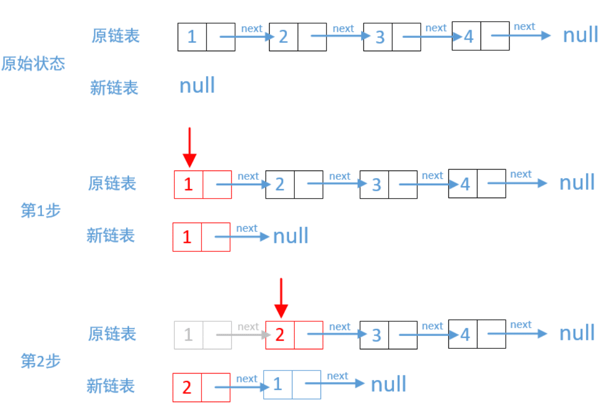
  >
  >   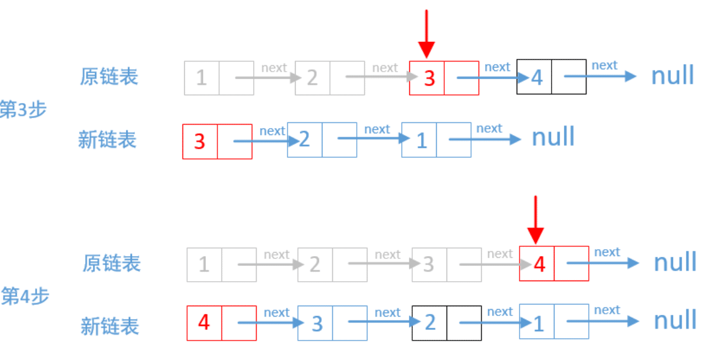

  * 代码：

    ```js
        var reverseList = function (head) {
          let currentNode = null;
          let headNode = head;//以链表的头部节点为基准节点
          while (head && head.next) {//遍历链表
            currentNode = head.next; // 头部下一个节点
            head.next = currentNode.next; // 链接头部节点和下下一个结点
            currentNode.next = headNode;//头部下一个节点链接头部
            headNode = currentNode;
          }
          return headNode;
        };
    ```

* 方法二：**栈**

  > * 利用栈 "先进后出" 特点：
  >
  >   * 遍历链表，将节点入栈；
  >
  >   * 遍历结束后，将栈元素逐个出栈，并将元素链接起来；
  >
  >     

  * 代码：

    ```js
    /**
     * Definition for singly-linked list.
     * function ListNode(val, next) {
     *     this.val = (val===undefined ? 0 : val)
     *     this.next = (next===undefined ? null : next)
     * }
     */
    /**
     * @param {ListNode} head
     * @return {ListNode}
     */
    var reverseList = function(head) {
        let stack =  [];
        let curNode = head;
        while(curNode) {
            stack.push(curNode);
            curNode = curNode.next;
        }
        if(stack.length === 0) return null;
        head = curNode = stack.pop(); // 将头节点出栈
        let len = stack.length; // 注意：此处重新计算栈长度，在出栈时，栈长度会改变，需要使用新的变量保存
        let temp = null;
        for(let i=0; i< len; i++) {
            temp = stack.pop();
            temp.next = null;
            curNode.next = temp;
            curNode = temp;
        }
        return head;
    };
    ```

  * 方法三：**递归**

    > 1. 首先，判断链表是否为空或只有一个节点，如果是，则直接返回当前节点作为反转后的链表的表头。
    > 2. 如果链表有两个或更多节点，我们可以将链表分为两部分：头节点和剩余部分。假设剩余部分已经被反转，我们需要将头节点放置在剩余部分反转后的最后一个节点的后面。
    > 3. 为了实现这一点，我们需要将剩余部分的最后一个节点的下一个节点设置为头节点，并将头节点的下一个节点设为 null，以断开原来的连接。
    > 4. 最后，我们将原链表的剩余部分反转得到的链表的表头连接到头节点后面，并返回新的表头。

    * 代码:

      ```js
      class ListNode {
        constructor(val, next = null) {
          this.val = val;
          this.next = next;
        }
      }
      
      function reverseList(head) {
        // 链表为空或只有一个节点，直接返回当前节点
        if (!head || !head.next) {
          return head;
        }
      
        // 反转剩余部分
        const newHead = reverseList(head.next);
      
        // 将头节点放置在剩余部分反转后的最后一个节点的后面
        head.next.next = head;
        head.next = null;
      
        return newHead;
      }
      
      // 示例用法
      // 创建一个链表：1 -> 2 -> 3 -> 4 -> 5
      const node1 = new ListNode(1);
      const node2 = new ListNode(2);
      const node3 = new ListNode(3);
      const node4 = new ListNode(4);
      const node5 = new ListNode(5);
      
      node1.next = node2;
      node2.next = node3;
      node3.next = node4;
      node4.next = node5;
      
      const reversedHead = reverseList(node1);
      console.log(reversedHead); // 输出反转后链表的表头
      ```

      

### [奇偶链表](https://leetcode.cn/leetbook/read/linked-list/fe0kj/)

* 题目：

  > * 给定单链表的头节点 head ，将所有索引为奇数的节点和索引为偶数的节点分别组合在一起，然后返回重新排序的列表。
  >
  > * 第一个节点的索引被认为是 奇数 ， 第二个节点的索引为 偶数 ，以此类推。
  >
  > * 请注意，偶数组和奇数组内部的相对顺序应该与输入时保持一致。
  >
  > * 你必须在 O(1) 的额外空间复杂度和 O(n) 的时间复杂度下解决这个问题。
  >
  > * 示例:
  >
  >   ```js
  >   输入: head = [1,2,3,4,5]
  >   输出: [1,3,5,2,4]
  >   ```
  >
  >   * 
  >
  >     ```js
  >     输入: head = [2,1,3,5,6,4,7]
  >     输出: [2,3,6,7,1,5,4]
  >     ```

* 思路：**分离节点后合并**

  > * 如果链表为空，则直接返回链表。
  >
  > * 对于原始链表，每个节点都是奇数节点或偶数节点。头节点是奇数节点，头节点的后一个节点是偶数节点，相邻节点的奇偶性不同。因此可以将奇数节点和偶数节点分离成奇数链表和偶数链表，然后将偶数链表连接在奇数链表之后，合并后的链表即为结果链表。
  >
  > * 原始链表的头节点 head 也是奇数链表的头节点以及结果链表的头节点，head 的后一个节点是偶数链表的头节点。令 evenHead = head.next，则 evenHead 是偶数链表的头节点。
  >
  > * 维护两个指针 odd 和 even 分别指向奇数节点和偶数节点，初始时 odd = head，even = evenHead。通过迭代的方式将奇数节点和偶数节点分离成两个链表，每一步首先更新奇数节点，然后更新偶数节点。
  >
  >   * 更新奇数节点时，奇数节点的后一个节点需要指向偶数节点的后一个节点，因此令 odd.next = even.next，然后令 odd = odd.next，此时 odd 变成 even 的后一个节点。
  >   * 更新偶数节点时，偶数节点的后一个节点需要指向奇数节点的后一个节点，因此令 even.next = odd.next，然后令 even = even.next，此时 even 变成 odd 的后一个节点。
  >
  > * 在上述操作之后，即完成了对一个奇数节点和一个偶数节点的分离。
  >
  > * 重复上述操作，直到全部节点分离完毕。全部节点分离完毕的条件是 even 为空节点或者 even.next 为空节点，此时 odd 指向最后一个奇数节点（即奇数链表的最后一个节点）。
  >
  > * 最后令 odd.next = evenHead，将偶数链表连接在奇数链表之后，即完成了奇数链表和偶数链表的合并，结果链表的头节点仍然是 head。
  >
  >   

* 代码：

  ```js
  var oddEvenList = function(head) {
      if (head === null) {
          return head;
      }
      
      let evenHead = head.next;
      // 奇数指针指向第一个节点，偶数指针指向奇数指针节点的下一个节点
      let odd = head, even = evenHead;
      // 偶数指针指向最后一个节点时，推出循环
      while (even !== null && even.next !== null) {
          odd.next = even.next; // 将偶数指针节点链接到奇数指针节点的 next，则奇数节点相连接
          odd = odd.next; // 奇数指针后移到下一个奇数节点
          even.next = odd.next;  // 将奇数指针节点链接到偶数指针节点的 next，则偶数节点相连接
          even = even.next;// 偶数指针后移到下一个偶数节点
      }
      odd.next = evenHead; // 此时奇数指针指向最后一个奇数节点，将最后一个奇数节点与偶数链表头节点链接
      return head;
  };
  
  作者：LeetCode-Solution
  链接：https://leetcode.cn/problems/odd-even-linked-list/solution/qi-ou-lian-biao-by-leetcode-solution/
  来源：力扣（LeetCode）
  著作权归作者所有。商业转载请联系作者获得授权，非商业转载请注明出处。
  ```


### [回文链表](https://leetcode.cn/leetbook/read/linked-list/fov6t/)

* 题目：

  > * 给你一个单链表的头节点 head ，请你判断该链表是否为回文链表（回文数字是指从左到右和从右到左读取都相同的数字，例如，121、12321和1221都是回文数字）。
  > * 如果是，返回 true ；否则，返回 false 。
  >
  > 
  >
  > * ​	示例 1：
  >   ```js
  >   输入：head = [1,2,2,1]
  >   输出：true
  >   ```
  >
  >   
  >
  > * 示例 2：
  >
  >   ```js
  >   输入：head = [1,2]
  >   输出：false
  >   ```
  >
  >   
  >
  >
  > 
  >
  > * 提示：
  >
  >   ```js
  >   链表中节点数目在范围[1, 105] 内
  >   0 <= Node.val <= 9
  >   ```
  >
  >   
  >
  > * 进阶：你能否用 O(n) 时间复杂度和 O(1) 空间复杂度解决此题？
  >
  > 作者：LeetCode
  > 链接：https://leetcode.cn/leetbook/read/linked-list/fov6t/
  > 来源：力扣（LeetCode）
  > 著作权归作者所有。商业转载请联系作者获得授权，非商业转载请注明出处。

* 解法一：**使用栈和遍历**

  > * 思想：将链表中间拆开两部分进行比较，并且利用栈的”先进后出“ 特性, 逆序前半部分链表节点；
  >   * 首次遍历链表，获取链表长度 len；
  >   * 根据链表长度，获取遍历链表 head 节点到  Math.floor(len/2) 长度的节点，将节点入栈；
  >   * 判断 len 是奇数还是偶数：
  >     *  len%2 != 0，表示链表长度为奇数，要跳过中间节点；
  >   * 继续遍历链表剩余节点，并将剩余节点的值与栈中的数据对比，将节点出栈，并判断当前出栈元素值是否等于链表当前遍历的节点值：
  >     * 如果相等，链表指针后移；
  >     * 如果不相等，返回 false;
  >   * 遍历结束，说明栈中元素等于后半部分元素。
  > * 时间复杂度 O(n)，空间复杂度 O(n);

  * 代码：

    ```js
    /**
     * Definition for singly-linked list.
     * function ListNode(val, next) {
     *     this.val = (val===undefined ? 0 : val)
     *     this.next = (next===undefined ? null : next)
     * }
     */
    /**
     * @param {ListNode} head
     * @return {boolean}
     */
    var isPalindrome = function(head) {
        let len = 0;
        let curNode = head;
        let stack = [];
        // 只有一个节点，为回文链表
        if(!head.next) return true;
        // 统计链表长度
        while(curNode) {
            len ++;
            curNode = curNode.next;
        }
        curNode = head;
        // 遍历链表前半部分，将所有节点入栈，形成逆序顺序(注意长度向下取整数)
        for(let i=0; i<Math.floor(len/2); i++) {
            stack.push(curNode);
            curNode = curNode.next;
        }
       	// 链表长度为奇数，跳过中间节点
        if(len %2 !=0) {
            curNode=curNode.next;
        }
        // 遍历链表后半部分，并与栈中节点值对比
        while(curNode) {
            let top = stack.pop();
            // 栈中节点值不等于后半部分链表值，不是回文链表
            if(curNode.val !== top.val) {
                return false;
            }else {
                curNode = curNode.next;
            }
        }
        return true;
    
    };
    ```

* 解法二：**将值复制到数组中后用双指针法**

  > * 复制链表值到数组列表中:
  > * 使用双指针法判断是否为回文。
  >   * 在起点放置一个指针，在结尾放置一个指针，每一次迭代判断两个指针指向的元素是否相同:
  >     * 若不同，返回 false；
  >     * 相同则将两个指针向内移动，并继续判断，直到两个指针相遇。
  >
  > * 时间复杂度：O(n)，其中 n 指的是链表的元素个数。
  >   * 第一步： 遍历链表并将值复制到数组中，O(n)。
  >   * 第二步：双指针判断是否为回文，执行了 O(n/2) 次的判断，即 O(n)。
  >   * 总的时间复杂度：O(2n)=O(n)。
  > * 空间复杂度：O(n)，其中 n 指的是链表的元素个数，我们使用了一个数组列表存放链表的元素值。

  * 代码：

    ```js
    var isPalindrome = function(head) {
        const vals = [];
        while (head !== null) {
            vals.push(head.val);
            head = head.next;
        }
        for (let i = 0, j = vals.length - 1; i < j; ++i, --j) {
            if (vals[i] !== vals[j]) {
                return false;
            }
        }
        return true;
    };
    ```

* 解法三：**递归**

  > * 设立一个指针 currentNode，从链表头节点开始递归遍历尾节点，只要存在节点就往下递归 currentNode 指向下一个节点；
  >
  > * 当 currentNode 递归到最后一个节点后，由于递归的特性，当递归函数返回时，currentNode  将会从后往前进行比较：
  >
  > * 使用函数外的指针 frontPointer 一直指向链表头
  >
  >   * 若 currentNode.val != frontPointer.val 则返回 false。
  >
  >   * 反之，frontPointer 向前移动并返回 true。
  >
  >     
  >
  > * 时间复杂度：O(n)，其中 n 指的是链表的大小。
  >
  > * 空间复杂度：O(n)，其中 n 指的是链表的大小。
  >
  >   * 我们要理解计算机如何运行递归函数，在一个函数中调用一个函数时，计算机需要在进入被调用函数之前跟踪它在当前函数中的位置（以及任何局部变量的值），通过运行时存放在堆栈中来实现（堆栈帧）。
  >   * 在堆栈中存放好了数据后就可以进入被调用的函数。在完成被调用函数之后，他会弹出堆栈顶部元素，以恢复在进行函数调用之前所在的函数。在进行回文检查之前，递归函数将在堆栈中创建 n 个堆栈帧，计算机会逐个弹出进行处理。所以在使用递归时空间复杂度要考虑堆栈的使用情况。

  * 代码

    ```js
    let frontPointer;
    
    const recursivelyCheck = (currentNode) => {
        if (currentNode !== null) {
            if (!recursivelyCheck(currentNode.next)) {
                return false;
            }
            if (currentNode.val !== frontPointer.val) {
                return false;
            }
            frontPointer = frontPointer.next;
        }
        return true;
    }
    
    var isPalindrome = function(head) {
        frontPointer = head;
        return recursivelyCheck(head);
    };
    ```

* 解法三： **快慢指针**

  > * 思想：
  >   * 将链表的后半部分反转（修改链表结构）
  >   * 然后将前半部分和后半部分进行比较。
  >   * 比较完成后我们应该将链表恢复原样。
  >
  > * 步骤：
  >   * 1.找到前半部分链表的尾节点。
  >     * 计算链表节点的数量，然后遍历链表找到前半部分的尾节点；
  >     * 使用快慢指针在一次遍历中找到：
  >       * 慢指针一次走一步，快指针一次走两步，快慢指针同时出发。
  >       * 当快指针移动到链表的末尾时，慢指针恰好到链表的中间。
  >       * 通过慢指针将链表分为两部分。
  >   * 2.反转后半部分链表。
  >   * 3.判断是否回文。
  >     * 比较两个部分的值，当后半部分到达末尾则比较完成，可以忽略计数情况中的中间节点
  >   * 4.恢复链表。
  >     * 步骤2使用的函数相同，再反转一次恢复链表本身
  >   * 5.返回结果。
  >
  > 
  >
  > * 时间复杂度：O(n)，其中 n 指的是链表的大小。
  > * 空间复杂度：O(1)。我们只会修改原本链表中节点的指向，而在堆栈上的堆栈帧不超过 O(1)。

  * 代码：

    ```js
    // 反转链表
    const reverseList = (head) => {
        let prev = null;
        let curr = head;
        while (curr !== null) {
            let nextTemp = curr.next;
            curr.next = prev;
            prev = curr;
            curr = nextTemp;
        }
        return prev;
    }
    
    // 快慢指针法查找中间节点
    const endOfFirstHalf = (head) => {
        let fast = head;
        let slow = head;
        while (fast.next !== null && fast.next.next !== null) {
            fast = fast.next.next;
            slow = slow.next;
        }
        return slow;
    }
    
    var isPalindrome = function(head) {
        if (head == null) return true;
    
        // 找到前半部分链表的尾节点并反转后半部分链表
        const firstHalfEnd = endOfFirstHalf(head);
        const secondHalfStart = reverseList(firstHalfEnd.next);
    
        // 判断是否回文
        let p1 = head;
        let p2 = secondHalfStart;
        let result = true;
        while (result && p2 != null) {
            if (p1.val != p2.val) result = false;
            p1 = p1.next;
            p2 = p2.next;
        }        
    
        // 还原链表并返回结果
        firstHalfEnd.next = reverseList(secondHalfStart);
        return result;
    };
    ```


### 合并两个有序链表

* 题目

  > * 将两个升序链表合并为一个新的 **升序** 链表并返回。新链表是通过拼接给定的两个链表的所有节点组成的。
  >
  > * 示例：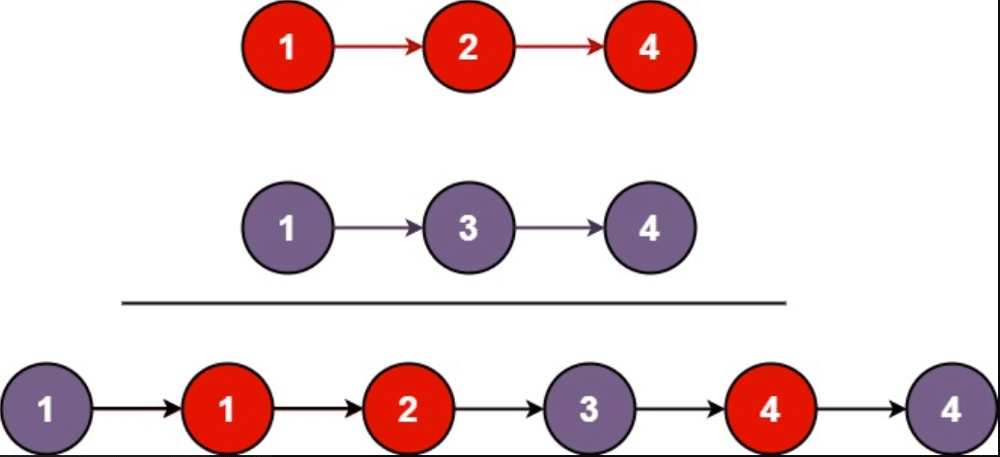
  >
  >   ```js
  >   输入：l1 = [1,2,4], l2 = [1,3,4]
  >   输出：[1,1,2,3,4,4]
  >   ```
  >
  > * 示例2
  >
  >   ```js
  >   输入：l1 = [], l2 = []
  >   输出：[]
  >   ```
  >
  > * 示例3:
  >
  >   ```js
  >   输入：l1 = [], l2 = [0]
  >   输出：[0]
  >   ```
  >
  > * **提示：**
  >
  >   - 两个链表的节点数目范围是 `[0, 50]`
  >   - `-100 <= Node.val <= 100`
  >   - `l1` 和 `l2` 均按 **非递减顺序** 排列

* 解法一：**添加前置指针**

  > * 设定一个哨兵节点 prehead ，这可以在最后让我们比较容易地返回合并后的链表。
  > * 维护一个 prev 指针，调整它的 next 指针。
  > * 然后，重复以下过程，直到 l1 或者 l2 指向了 null ：
  >   * 如果 l1 当前节点的值小于等于 l2 ，我们就把 l1 当前的节点接在 prev 节点的后面，同时将 l1 指针往后移一位。
  >   * 否则，我们对 l2 做同样的操作。
  >   * 然后 prev 向后移一位。
  >
  > * 在循环终止的时候， l1 和 l2 至多有一个是非空的。由于输入的两个链表都是有序的，所以不管哪个链表是非空的，它包含的所有元素都比前面已经合并链表中的所有元素都要大（两个链表为有序链表）。因此只需要简单地将非空链表接在合并链表的后面，并返回合并链表即可。
  >
  > 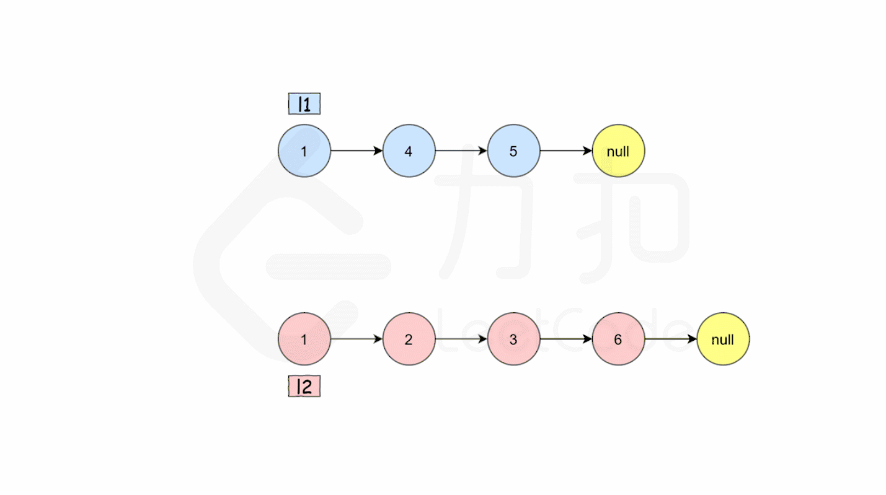
  >
  > * 时间复杂度：O(n+m)，其中 n 和 m 分别为两个链表的长度。因为每次循环迭代中，l1 和 l2 只有一个元素会被放进合并链表中， 因此 while 循环的次数不会超过两个链表的长度之和。所有其他操作的时间复杂度都是常数级别的，因此总的时间复杂度为 O(n+m)。
  >
  > * 空间复杂度：O(1)。我们只需要常数的空间存放若干变量。
  >
  > 

  * 代码:

    ```js
    var mergeTwoLists = function(l1, l2) {
        // 创建新的前置节点
        const prehead = new ListNode(-1);
        // 前置指针
        let prev = prehead;
        // 循环遍历两个链表
        while (l1 != null && l2 != null) {
            if (l1.val <= l2.val) { // 前置节点链接值较小的节点
                prev.next = l1;
                l1 = l1.next;
            } else {
                prev.next = l2;
                l2 = l2.next;
            }
            prev = prev.next; // 指针后移
        }
    
        // 合并后 l1 和 l2 最多只有一个还未被合并完，我们直接将链表末尾指向未合并完的链表即可
        prev.next = l1 === null ? l2 : l1;
        return prehead.next;
    };
    ```

* 解法二：**递归**

  > * 递归建模：
  >   * 
  >   * 如果 l1 或者 l2 一开始就是空链表 ，那么没有任何操作需要合并，所以我们只需要返回非空链表。
  >   * 否则，我们要判断 l1 和 l2 哪一个链表的头节点的值更小，然后递归地决定下一个添加到结果里的节点。
  >   * 如果两个链表有一个为空，递归结束。

  * 代码：

    ```js
    var mergeTwoLists = function(l1, l2) {
        if (l1 === null) {
            return l2;
        } else if (l2 === null) {
            return l1;
        } else if (l1.val < l2.val) {
            l1.next = mergeTwoLists(l1.next, l2);
            return l1;
        } else {
            l2.next = mergeTwoLists(l1, l2.next);
            return l2;
        }
    };
    ```


### [两数相加](https://leetcode.cn/leetbook/read/linked-list/fv6w7/)

* 题目:

  > * 给你两个 非空 的链表，表示两个非负的整数。它们每位数字都是按照 逆序 的方式存储的，并且每个节点只能存储 一位 数字。
  >
  > * 请你将两个数相加，并以相同形式返回一个表示和的链表。
  >
  > * 你可以假设除了数字 0 之外，这两个数都不会以 0 开头。
  >
  > * 示例：
  >
  >   ```js
  >   输入：l1 = [2,4,3], l2 = [5,6,4]
  >   输出：[7,0,8]
  >   解释：342 + 465 = 807.
  >   ```
  >
  >   ```js
  >   输入：l1 = [0], l2 = [0]
  >   输出：[0]
  >   ```
  >
  >   ```js
  >   输入：l1 = [9,9,9,9,9,9,9], l2 = [9,9,9,9]
  >   输出：[8,9,9,9,0,0,0,1]
  >   ```
  >
  > * **提示：**
  >
  >   - 每个链表中的节点数在范围 `[1, 100]` 内
  >   - `0 <= Node.val <= 9`
  >   - 题目数据保证列表表示的数字不含前导零

* 解法一：

  > * 两数字相加算法：
  >   * 从个位数到最最高位，每一个数字进行相加；
  >   * 相加大于10，则结果为余数，数字往上进一位，进位为整数；
  > * 遍历两个链表，节点一一对应相加，相加后求余数，并求进位数；
  > * 当两条链表都遍历结束后，如果余数不为零，则继续创建节点，将余数节点插入链表末尾；

  * 代码

  ```js
  /**
   * Definition for singly-linked list.
   * function ListNode(val, next) {
   *     this.val = (val===undefined ? 0 : val)
   *     this.next = (next===undefined ? null : next)
   * }
   */
  /**
   * @param {ListNode} l1
   * @param {ListNode} l2
   * @return {ListNode}
   */
  var addTwoNumbers = function(l1, l2) {
      let cur1 = l1;
      let cur2 = l2;
      let head = null;
      let tail = null;//使用尾指针创建链表
      let remain = 0; // 保存上一位整数
      while(cur1 || cur2) {
          let val1 = cur1? cur1.val:0;
          let val2 = cur2? cur2.val:0;
          let result = val1 + val2 + remain; // 计算两数和： 两数相加并加上上一位进数
          remain = Math.trunc(result/10); // 进数计算：结果除以 10 取整数
          let newNode = new ListNode(result%10,null); // 结果计算：取两数之和的余数
          
          if(!head) {
              head = tail = newNode;
          }else {
              tail.next = newNode;
              tail = newNode;       
          }
          cur1 = cur1?  cur1.next : null;
          cur2 = cur2?  cur2.next : null;
      }
  
      if(remain !=0) { // 注意： 如果余数不为零，说明最后有进位，将进位创建节点并假如链表末尾
          let newNode = new ListNode(remain,null);
          tail.next = newNode;
          tail = newNode; 
      }
      return head;
  };
  ```

  

### 复制带随机指针链表

* 题目：

  > 输入一个复杂链表（每个节点中有节点值，以及两个指针，一个指向下一个节点，另一个特殊指针指向任意一个节点），返回结果为复制后复杂链表的head。
  >
  > * 示例：
  >
  >   
  >
  >   ```js
  >   输入：head = [[7,null],[13,0],[11,4],[10,2],[1,0]]
  >   输出：[[7,null],[13,0],[11,4],[10,2],[1,0]]
  >   ```
  >
  > * 示例2：
  >
  >   ```js
  >   输入：head = [[1,1],[2,1]]
  >   输出：[[1,1],[2,1]]
  >   ```
  >
  > * 示例3：
  >
  >   ```js
  >   输入：head = [[3,null],[3,0],[3,null]]
  >   输出：[[3,null],[3,0],[3,null]]
  >   ```
  >
  >   

* 解法一：**使用 MAP 映射和两次遍历链表**

  * 思路：

    > 了复制一个复杂链表，需要遍历原链表并创建新的节点。同时，还需要处理特殊指针，即原链表节点的 random 指针，使其指向新链表中对应的节点。
    >
    > 具体步骤如下：
    >
    > 1. 创建一个哈希表或映射表，用于存储原链表节点和复制链表节点的对应关系。
    > 2. 第一次遍历原链表，创建新的节点，并将原链表节点和新节点的对应关系保存到哈希表中。
    > 3. 第二次遍历原链表，处理新节点的 next 和 random 指针：
    >    - 新节点的 next 指针指向哈希表中对应的原链表节点的 next 节点的复制节点。
    >    - 新节点的 random 指针指向哈希表中对应的原链表节点的 random 节点的复制节点。
    > 4. 返回复制链表的头节点。

  * 代码:

    ```js
    class Node {
      constructor(value) {
        this.val = value;
        this.next = null;
        this.random = null;
      }
    }
    
    function copyRandomList(head) {
      if (!head) {
        return null;
      }
    
      const map = new Map();
    
      // 第一次遍历，复制节点并建立映射关系
      let currentNode = head;
      while (currentNode) {
        const newNode = new Node(currentNode.val);
        map.set(currentNode, newNode);
        currentNode = currentNode.next;
      }
    
      // 第二次遍历，处理复制节点的指针
      currentNode = head;
      while (currentNode) {
        const newNode = map.get(currentNode);
        newNode.next = map.get(currentNode.next);
        newNode.random = map.get(currentNode.random);
        currentNode = currentNode.next;
      }
    
      return map.get(head);
    }
    ```

* 解法二： 

  * 思路：

    > 拆分成三步:
    >
    > 1. 复制一份链表放在前一个节点后面，即根据原始链表的每个节点N创建N`,把N`直接放在N的next位置，让复制后的链表和原始链表组成新的链表。
    >
    > 2. 给复制的链表random赋值，即`N.random=N.random.next`。
    >
    > 3. 拆分链表，将N`和N进行拆分，保证原始链表不受影响。
    >
    >    

  * 代码：

    ```js
    // 复制复杂链表 
    function Clone(pHead) {
        if (pHead === null) {
            return null;
        }
    	// 第一步：复制链表节点
        cloneNodes(pHead);
        // 第二步：复制 random 链表
        cloneRandom(pHead);
        // 第三步： 拆分链表
        return reconnetNodes(pHead);
    }
    
    function cloneNodes(pHead) {
        var current = pHead;
        while (current) {
            // 创建新节点
            let cloneNode = {
                label: current.label,
                next: current.next
            };
            // 新节点链接到当前节点前面
            current.next = cloneNode;
            current = cloneNode.next;
        }
    }
    
    function cloneRandom(pHead) {
        var current = pHead;
        while (current) {
            var cloneNode = current.next;
            if (current.random) {
                cloneNode.random = current.random.next;
            } else {
                cloneNode.random = null;
            }
            current = cloneNode.next;
        }
    }
    
    function reconnetNodes(pHead) {
        var cloneHead = pHead.next;
        var cloneNode = pHead.next;
        var current = pHead;
        while (current) {
            current.next = cloneNode.next;
            current = cloneNode.next;
            if (current) {
                cloneNode.next = current.next;
                cloneNode = current.next;
            } else {
                cloneNode.next = null;
            }
        }
        return cloneHead;
    }
    
    ```

    


----


## 双向链表

### 概念

* 双向”指的是各节点之间的逻辑关系是双向的，头指针通常只设置一个。

* 结构：

  * 指针域 `prior`：用于指向当前节点的直接前驱节点；

  * 数据域 `value`：用于存储数据元素。

  * 指针域 `next`：用于指向当前节点的直接后继节点。

    ```js
    //双向链表节点结构
    class Node {
      constructor(value) {
        this.prior = null;
        this.value = value;
        this.next = null;
      }
    }
    ```

    


* 双向链表的特点：
  1. 双向遍历：由于每个节点包含了对前一个节点的引用，可以从头到尾或从尾到头进行遍历，提供了链表的双向遍历能力。
  2. 插入和删除操作效率高：相比单向链表，在双向链表中插入和删除节点的操作更高效。因为可以直接通过前一个节点的引用找到后一个节点，无需遍历整个链表。
  3. 占用更多的内存空间：由于每个节点需要存储对前一个节点的引用，相比单向链表，双向链表占用更多的内存空间。
  4. 实现复杂度略高：相比单向链表，双向链表的实现稍微复杂一些，需要同时维护前后两个方向的引用关系。


### 创建双向链表

* 题目：输入一个数组，根据输入数据创建双向链表

* 思路：

  > 同单链表相比，双链表仅是各节点多了一个用于指向直接前驱的指针域。因此，我们可以在单链表的基础轻松实现对双链表的创建。
  >
  > 需要注意的是，与单链表不同，双链表创建过程中，每创建一个新节点都要与其前驱节点建立两次联系，分别是：
  >
  > - 将新节点的 prior 指针指向直接前驱节点；
  > - 将直接前驱节点的 next 指针指向新节点；

* 代码：

  ```js
  class Node {
    constructor(value) {
      this.value = value;
      this.prev = null;
      this.next = null;
    }
  }
  
  function createDoublyLinkedList(arr) {
    if (!Array.isArray(arr) || arr.length === 0) {
      return null; // 输入数组无效
    }
    // 头节点
    const head = new Node(arr[0]);
    let currentNode = head; // 移动指针
  
    for (let i = 1; i < arr.length; i++) {
      const newNode = new Node(arr[i]); //创建新节点
      currentNode.next = newNode; // 当前节点指向新节点
      newNode.prev = currentNode; // 新节点前驱指针指向当前节点
      currentNode = newNode; // 指针后移
    }
  
    return head;
  }
  
  // 示例用法
  const arr = [1, 2, 3, 4, 5];
  const head = createDoublyLinkedList(arr);
  
  // 打印链表元素
  let currentNode = head;
  let result = '';
  
  while (currentNode) {
    result += currentNode.value + ' ';
    currentNode = currentNode.next;
  }
  
  console.log(result.trim()); // 输出: 1 2 3 4 5
  ```


### 双向链表添加节点

根据数据添加到双向链表中的位置不同，可细分为以下 3 种情况：

*  **添加至表头**

  > 将新数据元素添加到表头，只需要将该元素与表头元素建立双层逻辑关系即可。
  >
  > 换句话说，假设新元素节点为 temp，表头节点为 head，则需要做以下 2 步操作即可：
  >
  > 1. temp->next=head; head->prior=temp;
  > 2. 将 head 移至 temp，重新指向新的表头；
  >
  > 
  > 例如，将新元素 7 添加至双链表的表头，则实现过程如图 2 所示：
  >
  > 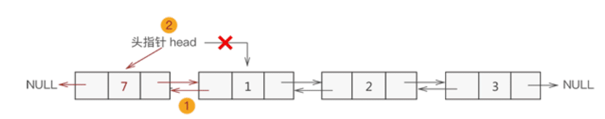

* **添加至表的中间位置**

  > 同单链表添加数据类似，双向链表中间位置添加数据需要经过以下 2 个步骤，如图 3 所示：
  >
  > 1. 新节点先与其直接后继节点建立双层逻辑关系；
  > 2. 新节点的直接前驱节点与之建立双层逻辑关系；
  >
  > 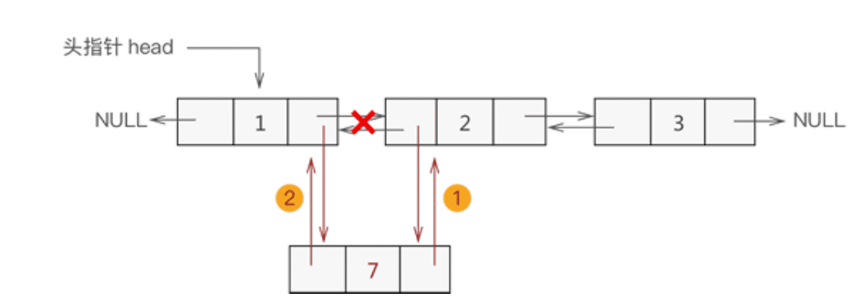

* **添加至表尾**

  > 与添加到表头是一个道理，实现过程如下（如图 4 所示）：
  >
  > 1. 找到双链表中最后一个节点；
  > 2. 让新节点与最后一个节点进行双层逻辑关系；
  >
  > 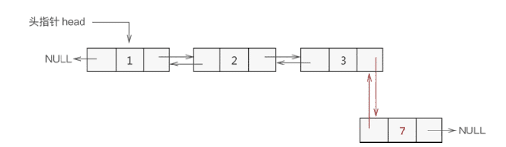

* 代码：

  ```js
  class Node {
    constructor(value) {
      this.value = value;
      this.prev = null;
      this.next = null;
    }
  }
  
  class DoublyLinkedList {
    constructor() {
      this.head = null;
    }
      
    // 在链表头部添加节点
    prepend(value) {
      const newNode = new Node(value);
  
      if (!this.head) {
        // 如果链表为空，则新节点为头节点
        this.head = newNode;
      } else {
        // 将新节点插入到头部
        newNode.next = this.head;
        this.head.prev = newNode;
        this.head = newNode;
      }
    }
      
    // 在链表末尾添加节点
    append(value) {
      const newNode = new Node(value);
  
      if (!this.head) {
        // 如果链表为空，则新节点为头节点
        this.head = newNode;
      } else {
        // 遍历链表找到最后一个节点
        let currentNode = this.head;
        while (currentNode.next) {
          currentNode = currentNode.next;
        }
  
        // 在最后一个节点后面添加新节点
        newNode.prev = currentNode;
        currentNode.next = newNode;
      }
    }
  
    // 在指定位置插入节点
    insertAt(value, position) {
      if (position < 0 || position > this.getLength()) {
        return false; // 位置无效
      }
  
      const newNode = new Node(value);
  
      if (position === 0) {
        // 在头部插入节点
        newNode.next = this.head;
        if (this.head) {
          this.head.prev = newNode;
        }
        this.head = newNode;
      } else {
        let currentNode = this.head;
        let index = 0;
  	  // 找到指定位置的前一个节点
        while (index < position - 1) {
          currentNode = currentNode.next;
          index++;
        }
  
        // 在指定位置插入节点
        newNode.prev = currentNode; // 新节点与前一个节点建立联系
        newNode.next = currentNode.next;// 新节点与后一个节点建立联系
        if (currentNode.next) {
          currentNode.next.prev = newNode; // 后一个节点与新节点建立联系
        }
        currentNode.next = newNode; // 移动 currentNode 指针
      }
  
      return true;
    }
  
    // 获取链表长度
    getLength() {
      let length = 0;
      let currentNode = this.head;
  
      while (currentNode) {
        length++;
        currentNode = currentNode.next;
      }
  
      return length;
    }
  
    // 打印链表元素
    print() {
      let currentNode = this.head;
      let result = '';
  
      while (currentNode) {
        result += currentNode.value + ' ';
        currentNode = currentNode.next;
      }
  
      console.log(result.trim());
    }
  }
  
  // 示例用法
  const linkedList = new DoublyLinkedList();
  linkedList.append(1);
  linkedList.append(2);
  linkedList.append(3);
  
  linkedList.print(); // 输出: 1 2 3
  
  linkedList.prepend(0);
  linkedList.print(); // 输出: 0 1 2 3
  
  linkedList.insertAt(4, 3);
  linkedList.print(); // 输出: 0 1 2 4 3
  ```

  

### 双向链表删除节点

和添加结点的思想类似，在双向链表中删除目标结点也分为 3 种情况。

* **删除表头结点**

> 删除表头结点的过程如下图所示：
>
> 
>
> 
> 删除表头结点的实现过程是：
>
> 1. 新建一个指针指向表头结点；
> 2. 断开表头结点和其直接后续结点之间的关联，更改 head 头指针的指向，同时将其直接后续结点的 prior 指针指向 NULL；
> 3. 释放表头结点占用的内存空间。

* **删除表中结点**

> 删除表中结点的过程如下图所示：
>
> 
>
> 删除表中结点的实现过程是：
>
> 1. 找到目标结点，新建一个指针指向改结点；
> 2. 将目标结点从链表上摘除；
> 3. 释放该结点占用的内存空间。

*  **删除表尾结点**

> 删除表尾结点的过程如下图所示：
>
> 
>
> 
> 删除表尾结点的实现过程是：
>
> 1. 找到表尾结点，新建一个指针指向该结点；
> 2. 断点表尾结点和其直接前驱结点的关联，并将其直接前驱结点的 next 指针指向 NULL；
> 3. 释放表尾结点占用的内存空间。

* 代码:

  ```js
  class Node {
    constructor(value) {
      this.value = value;
      this.prev = null;
      this.next = null;
    }
  }
  
  class DoublyLinkedList {
    constructor() {
      this.head = null;
    }
    // 删除指定值的节点
    delete(value) {
      if (!this.head) {
        return; // 链表为空，无法删除
      }
  
      let currentNode = this.head;
  
      // 遍历链表找到要删除的节点
      while (currentNode) {
        if (currentNode.value === value) {
          if (currentNode === this.head) {// 删除头节点
            // 移动 head 指针
            this.head = currentNode.next;
            if (this.head) {
              this.head.prev = null;
              currentNode.next =  null;
              return this.head;
            }
          } 
            
           // 删除表中结点:节点前后指针都不为空，表示表中节点
          if(currentNode.next && currentNode.prev){
            currentNode.next.prev = currentNode.prev;
            currentNode.prev.next = currentNode.next;
            return this.head;
          }
            
          // 删除尾节点: currentNode.next 为空表示尾节点
          if(!currentNode.next){
              currentNode.prev.next = null;
              currentNode.next = null;
              return this.head;
          }
          
        }
  
        currentNode = currentNode.next;
      }
    }
  
    // 获取链表长度
    getLength() {
      let length = 0;
      let currentNode = this.head;
  
      while (currentNode) {
        length++;
        currentNode = currentNode.next;
      }
  
      return length;
    }
  
    // 打印链表元素
    print() {
      let currentNode = this.head;
      let result = '';
  
      while (currentNode) {
        result += currentNode.value + ' ';
        currentNode = currentNode.next;
      }
  
      console.log(result.trim());
    }
  }
  
  // 示例用法
  const linkedList = new DoublyLinkedList();
  linkedList.append(1);
  linkedList.append(2);
  linkedList.append(3);
  
  linkedList.print(); // 输出: 1 2 3
  
  linkedList.delete(2);
  linkedList.print(); // 输出: 1 3
  
  linkedList.delete(1);
  linkedList.print(); // 输出: 3
  
  linkedList.delete(3);
  linkedList.print(); // 输出:
  ```


### [扁平化多级双向链表](https://leetcode.cn/leetbook/read/linked-list/fw8v5/)

* 题目：

  > * 多级双链表是一个双链表，其中包含的节点有一个下一个指针、一个前一个指针和一个额外的 子指针 。
  >   * 这个子指针可能指向一个单独的双向链表，也包含这些特殊的节点。
  >   * 这些子列表可以有一个或多个自己的子列表，以此类推，以生成如下面的示例所示的 多层数据结构 。
  >
  > * 给定链表的头节点 head ，将链表 扁平化 ，以便所有节点都出现在单层双链表中。
  > * 让 curr 是一个带有子列表的节点。子列表中的节点应该出现在扁平化列表中的 curr 之后 和 curr.next 之前 。
  > * 返回 扁平列表的 head 。列表中的节点必须将其 所有 子指针设置为 null 。
  >
  >  
  >
  > * 示例 1：
  >
  >   * ```JS
  >     输入：head = [1,2,3,4,5,6,null,null,null,7,8,9,10,null,null,11,12]
  >     输出：[1,2,3,7,8,11,12,9,10,4,5,6]
  >     解释：输入的多级列表如上图所示。
  >     ```
  >
  >   * 扁平化后的链表如下图：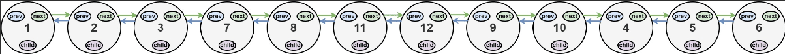
  >
  > 
  >
  > * 示例 2：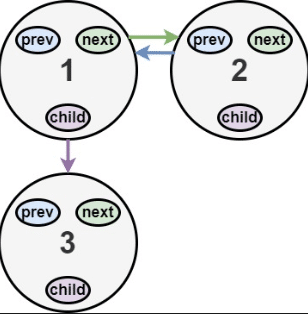
  >
  >   * ```JS
  >     输入：head = [1,2,null,3]
  >     输出：[1,3,2]
  >     解释：输入的多级列表如上图所示。
  >     ```
  >
  >   * 扁平化后的链表如下图：
  >
  > * 示例 3：
  >
  >   * ```JS
  >     输入：head = []
  >     输出：[]
  >     说明：输入中可能存在空列表。
  >     ```
  >
  >     
  >
  > * 提示：
  >
  >   > 节点数目不超过 1000
  >   > 1 <= Node.val <= 105
  >
  > * 如何表示测试用例中的多级链表？
  >
  > > * 以 示例 1 为例：
  > >
  > >   ```JS
  > >    1---2---3---4---5---6--NULL
  > >            |
  > >            7---8---9---10--NULL
  > >                |
  > >                11--12--NULL
  > >   ```
  > >
  > >   序列化其中的每一级之后：
  > >
  > >   ```JS
  > >   [1,2,3,4,5,6,null]
  > >   [7,8,9,10,null]
  > >   [11,12,null]
  > >   ```
  > >
  > >   为了将每一级都序列化到一起，我们需要每一级中添加值为 null 的元素，以表示没有节点连接到上一级的上级节点。
  > >
  > >   ```JS
  > >   [1,2,3,4,5,6,null]
  > >   [null,null,7,8,9,10,null]
  > >   [null,11,12,null]
  > >   ```
  > >
  > >   合并所有序列化结果，并去除末尾的 null 。
  > >
  > >   ```JS
  > >   [1,2,3,4,5,6,null,null,null,7,8,9,10,null,null,11,12]
  > >   ```

* 解法：**深度优先搜索**

  > * 当我们遍历到某个节点 node 时，如果它的 child 成员不为空，那么我们需要将 child 指向的链表结构进行扁平化，并且插入 node 与 node 的下一个节点之间;
  >
  > * 在遇到 child 成员不为空的节点时，就要先去处理 child 指向的链表结构:
  >
  > * 对 child 指向的链表结构的扁平化之后，就可以「回溯」到 node 节点;
  >
  > * 为了能够将扁平化的链表插入 node 与 node 的下一个节点之间，我们需要知道扁平化的链表的最后一个节点 last，随后进行如下的三步操作：
  >
  >   * 将 node 与 node 的下一个节点 next 断开：
  >
  >   * 将 node 与 child 相连；
  >
  >   * 将 last 与 next 相连。
  >
  > * 在深度优先搜索完成后，我们返回给定的首节点即可。
  >
  >   
  >
  > * 复杂度分析
  >
  >   * 时间复杂度：O(n)，其中n 是链表中的节点个数。
  >   * 空间复杂度：O(n)。上述代码中使用的空间为深度优先搜索中的栈空间，如果给定的链表的「深度」为 d，那么空间复杂度为 O(d)。在最换情况下，链表中的每个节点的 next 都为空，且除了最后一个节点外，每个节点的 child 都不为空，整个链表的深度为 n，因此时间复杂度为 O(n)。
  >
  >   

* 代码: **深度优先搜索的递归写法**

  ```JS
  var flatten = function(head) {
      // 深度优先搜索
      const dfs = (node) => {
          let cur = node;
          // 记录链表的最后一个节点
          let last = null;
  
          while (cur) {
              let next = cur.next;
              //  如果有子节点，那么首先处理子节点
              if (cur.child) {
                  // 深度搜索子节点，获取子节点的最后一个节点 childLast
                  const childLast = dfs(cur.child);
  				// 
                  next = cur.next;
                  //  将 node 与 child 相连
                  cur.next = cur.child;
                  cur.child.prev = cur;
  
                  //  如果 next 不为空，就将 last 与 next 相连
                  if (next != null) {
                      childLast.next = next;
                      next.prev = childLast;
                  }
  
                  // 将 child 置为空
                  cur.child = null;
                  last = childLast;
              } else {
                  // 没有子节点，将 last 指针指向移动的 cur 指针
                  last = cur;
              }
              // cur 指针后移
              cur = next;
  
          }
          // 移动到最后一个节点后，返回最后一个节点指针
          return last;
      }
  
      dfs(head);
      return head;
  };
  
  ```

* 代码： **深度优先搜索的栈写法**

  ```js
  var flatten = function(head) {
      if (!head) return null;
      
      const stack = []; // 栈用于保存含有 child 节点的 next 节点
      let cur = head;
      let prev = null;
      
      while (cur || stack.length > 0) {
          // 指针移遍历到末尾，则直接出栈
          if (!cur) {
              cur = stack.pop();
          }
          // 遍历的节点存在子节点，则对子节点进行遍历
          if (cur.child) {
              if (cur.next) {//注意：当前节点存在 next 节点才需要入栈等待回溯，没有 next 不需要回溯，则无需入栈
                  stack.push(cur.next);
              }
              // 直接将含有 child 的节点 与它的child 节点链接
              cur.next = cur.child;
              cur.child.prev = cur;
              cur.child = null;
          }
          
          prev = cur;
          cur = cur.next; // 指针后移
          // 遍历到最后一个节点时，获取栈顶元素，将左右一个节点与栈顶元素节点链接
          if (!cur && stack.length > 0) {
              prev.next = stack[stack.length - 1];
              stack[stack.length - 1].prev = prev;
          }
      }
      
      return head;
  };
  ```

  


----


## 循环链表

### 概念

* 循环链表是一种特殊类型的链表，其中链表中的最后一个节点指向第一个节点，形成一个闭环的结构。

* 循环链表没有尾节点，而是通过尾节点的指针将链表的末尾连接到头节点。

  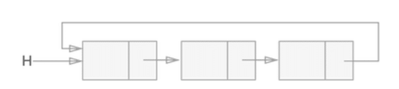

* 分类：

  * **单向循环链表**：在单向循环链表中，每个节点只有一个指针，指向下一个节点，而最后一个节点指向头节点。这种循环链表可以实现环形队列等应用。
  * **双向循环链表**：在双向循环链表中，每个节点有两个指针，一个指向前一个节点，另一个指向后一个节点。最后一个节点的后继节点是头节点，头节点的前驱节点是最后一个节点。这种循环链表可以**支持双向遍历和操作**，例如在双向循环链表中可以方便地进行插入和删除操作。

* 优势：

  * 1. **遍历方便**：由于循环链表形成了闭环结构，**可以从任意节点开始遍历整个链表**，不需要额外的终止条件。这使得循环链表在某些情况下更加方便和高效。
    2. **插入和删除操作高效**：在循环链表中，插入和删除节点的操作相对于非循环链表更加高效。由于节点的前驱和后继节点都可以直接访问，插入和删除操作不需要遍历整个链表来定位位置，因此时间复杂度较低。
    3. **实现循环结构**：循环链表的最后一个节点指向头节点，形成了一个循环结构。这种结构在某些问题和算法中非常有用，例如模拟循环队列、循环缓冲区等应用场景。

### 单向循环链表

#### 创建单向循环链表

* 题目：输入一组数据，根据输入数据创建单向循环链表

* 思路：

  > 创建循环链表方法跟创建链表方法相同，但是循环链表判断一次遍历结束方式不同： currentNode.next !== this.head

* 代码：

  ```js
  class Node {
    constructor(value) {
      this.value = value;
      this.next = null;
    }
  }
  
  class CircularLinkedList {
    constructor() {
      this.head = null;
    }
  
    // 添加节点到链表尾部
    append(value) {
      const newNode = new Node(value);
  
      if (!this.head) {
        // 如果链表为空，则新节点为头节点
        this.head = newNode;
        newNode.next = this.head; // 将头节点指向自己形成循环
      } else {
        let currentNode = this.head;
  
        // 找到最后一个节点，注意判断条件
        while (currentNode.next !== this.head) {
          currentNode = currentNode.next;
        }
  
        // 在最后一个节点后面添加新节点
        currentNode.next = newNode;
        newNode.next = this.head; // 将新节点的 next 指向头节点，形成循环
      }
    }
  
    // 打印循环链表
    print() {
      if (!this.head) {
        console.log("循环链表为空");
        return;
      }
  
      let currentNode = this.head;
      let nodes = [];
  
      // 遍历循环链表，将节点值存入数组
      do {
        nodes.push(currentNode.value);
        currentNode = currentNode.next;
      } while (currentNode !== this.head);
  
      console.log(nodes.join(" -> "));
    }
  }
  
  // 示例用法
  const input = [1, 2, 3, 4, 5];
  const circularLinkedList = new CircularLinkedList();
  
  for (let i = 0; i < input.length; i++) {
    circularLinkedList.append(input[i]);
  }
  
  circularLinkedList.print(); // 输出: 1 -> 2 -> 3 -> 4 -> 5 -> 1
  ```

  

### 双向循环链表


* 双向循环链表是一种特殊类型的链表，每个节点都有一个指向前一个节点和一个指向后一个节点的指针。
* 与单向循环链表不同，双向循环链表可以在两个方向上遍历和操作链表。
* 双向循环链表的特点和优势包括：
  * **双向遍历**：双向循环链表可以从头节点或尾节点开始，沿着前向或后向指针遍历整个链表。这使得在某些情况下可以更方便和高效地进行双向遍历操作。
  * **插入和删除操作高效**：由于每个节点都有指向前后节点的指针，插入和删除节点的操作比单向链表更高效。可以直接访问前后节点，无需遍历链表来定位位置，从而降低了时间复杂度。


#### 创建双向循环链表

* 题目：输入一组数据，根据输入数据创建双向循环链表（该双向循环链表没有尾指针）

* 思路：

  > * 创建新的节点
  > * 根据头指针的 head.prev 找到尾部节点
  > * 将新的节点插入头节点和尾节点之间

* 代码：

  ```js
  class Node {
    constructor(value) {
      this.value = value;
      this.prev = null;
      this.next = null;
    }
  }
  
  class DoublyCircularLinkedList {
    constructor() {
      this.head = null;
    }
  
    // 添加节点到链表尾部
    append(value) {
      const newNode = new Node(value);
  
      if (!this.head) {
        // 如果链表为空，则新节点为头节点
        this.head = newNode;
        newNode.prev = newNode;
        newNode.next = newNode;
      } else {
        const tailNode = this.head.prev; // 通过头指针找到当前尾节点
  
        newNode.prev = tailNode; // 链接新节点和尾节点
        newNode.next = this.head; // 链接新节点和头节点
        tailNode.next = newNode;// 链接新节点和尾节点
        this.head.prev = newNode;// 链接新节点和头节点
      }
    }
  
    // 打印双向循环链表
    print() {
      if (!this.head) {
        console.log("双向循环链表为空");
        return;
      }
  
      let currentNode = this.head;
      let nodes = [];
  
      // 遍历双向循环链表，将节点值存入数组
      do {
        nodes.push(currentNode.value);
        currentNode = currentNode.next;
      } while (currentNode !== this.head);
  
      console.log(nodes.join(" <-> "));
    }
  }
  
  // 示例用法
  const input = [1, 2, 3, 4, 5];
  const doublyCircularLinkedList = new DoublyCircularLinkedList();
  
  for (let i = 0; i < input.length; i++) {
    doublyCircularLinkedList.append(input[i]);
  }
  
  doublyCircularLinkedList.print(); // 输出: 1 <-> 2 <-> 3 <-> 4 <-> 5
  ```


### 约瑟夫环问题

* 题目：

  > * 约瑟夫环问题，是一个经典的循环链表问题
  > * 题意是：已知 n 个人（分别用编号 1，2，3，…，n 表示）围坐在一张圆桌周围，从编号为 k 的人开始顺时针报数，数到 m 的那个人出列；他的下一个人又从 1 开始，还是顺时针开始报数，数到 m 的那个人又出列；依次重复下去，直到圆桌上剩余一个人。
  > * 如图 2 所示，假设此时圆周周围有 5 个人，要求从编号为 3 的人开始顺时针数数，数到 2 的那个人出列：
  >   图 2 循环链表实现约瑟夫环
  >   出列顺序依次为：
  >   - 编号为 3 的人   开始数 1，4 数 2，所以 4 先出列；
  >   - 4 出列后，从 5 开始数 1，1 数 2，所以 1 出列；
  >   - 1 出列后，从 2 开始数 1，3 数 2，所以 3 出列；
  >   - 3 出列后，从 5 开始数 1，2 数 2，所以 2 出列；
  >   - 最后只剩下 5 自己，所以 5 胜出。

#### 循环链表法

* 思路：

  > * 根据输入的人数 `n` 创建循环链表。我们从头节点开始，依次创建 `n` 个节点，将它们连接成循环链表，最后将最后一个节点的 `next` 指针指向头节点，形成循环。
  >
  > * 在 `josephus` 方法中，我们解决约瑟夫问题:
  >   * 我们首先找到起始位置的节点，即从编号为 `k` 的人开始报数。
  >   * 然后，我们使用一个循环来模拟报数的过程，每次数到 `m`，就移除当前节点，并输出出列人的编号。
  >   * 当循环链表中只剩下一个节点时，即停止循环，并输出剩余人的编号。

* 代码：

  ```js
  class Node {
    constructor(value) {
      this.value = value;
      this.next = null;
    }
  }
  
  class CircularLinkedList {
    constructor() {
      this.head = null;
    }
  
    // 创建循环链表
    createCircularList(n) {
      if (n <= 0) {
        throw new Error("输入的人数必须大于0");
      }
  
      this.head = new Node(1);
      let currentNode = this.head;
  
      for (let i = 2; i <= n; i++) {
        const newNode = new Node(i);
        currentNode.next = newNode;
        currentNode = newNode;
      }
  
      currentNode.next = this.head; // 将最后一个节点的 next 指针指向头节点，形成循环
    }
  
    // 解决约瑟夫问题
    josephus(k, m) {
      if (!this.head) {
        throw new Error("循环链表为空");
      }
  
      let currentNode = this.head;
  
      // 找到起始位置的节点
      for (let i = 1; i < k; i++) {
        currentNode = currentNode.next;
      }
  
      let count = 0;
      let prevNode = null; //前一个节点指针
  	// 跳出条件：当前节点 next 指向自己，表示只剩下一个节点
      while (currentNode.next !== currentNode) {
        count++; // 循环计数器
         // 数到 m，移除当前节点
        if (count === m) {
          if (prevNode) {
            // 删除当前节点
            prevNode.next = currentNode.next;
          } else {
            this.head = currentNode.next;
          }
  
          console.log("出列人编号：" + currentNode.value);
          count = 0;
        } else {
          //移动前一个指针
          prevNode = currentNode;
        }
  	  // 移动指针
        currentNode = currentNode.next;
      }
  
      console.log("剩余人编号：" + currentNode.value);
    }
  }
  
  // 示例用法
  const n = 7; // 总人数
  const k = 3; // 起始位置
  const m = 4; // 报数到 m
  
  const circularLinkedList = new CircularLinkedList();
  circularLinkedList.createCircularList(n);
  circularLinkedList.josephus(k, m);
  ```

  

### [旋转链表](https://leetcode.cn/leetbook/read/linked-list/f00a2/)

* 题目：

  > * 给你一个链表的头节点 `head` ，旋转链表，将链表每个节点向右移动 `k` 个位置.
  >
  > * 示例：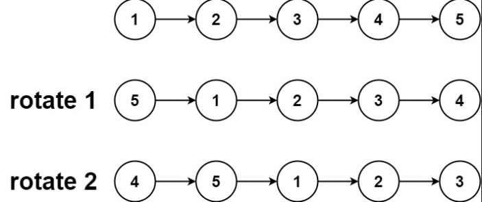
  >
  >   * ```js
  >     输入：head = [1,2,3,4,5], k = 2
  >     输出：[4,5,1,2,3]
  >     ```
  >
  > * 
  >
  >   * ```js
  >     输入：head = [0,1,2], k = 4
  >     输出：[2,0,1]
  >     ```

* 解法：**闭合为环**

  > * 将链表进行闭合形成环：计算出链表的长度 n，并找到该链表的末尾节点，将其与头节点相连；
  > * 当向右移动的次数 k 时，我们仅需要向右移动 `k  mod  n` 次即可，即头节点旋转到原来的 `(n−1)−(k  mod  n)`  的位置； （因为每 n 次移动都会让链表变为原状。新链表的最后一个节点为原链表的第 `(n−1)−(k  mod  n)` 个节点（从 0 开始计数）)
  > * 找到新链表的最后一个节点（即原链表的第 `(n−1)−(k  mod  n)`个节点），将当前闭合为环的链表断开，即可得到我们所需要的结果。
  > * 特别地，当链表长度不大于 1，或者 k 为 n的倍数时，新链表将与原链表相同，我们无需进行任何处理。

* 代码：

  ```js
  var rotateRight = function(head, k) {
      // 循环次数为0，或为空节点，或只有一个节点，直接返回
      if (k === 0 || !head || !head.next) {
          return head;
      }
      let n = 1;
      let cur = head;
      while (cur.next) { //计算链表长度，并将 cur 移动到末尾节点
          cur = cur.next;
          n++;
      }
  
      let add = n - k % n; // 计算旋转次数
      if (add === n) { // 当 add === n 时，旋转次数刚好为链表长度的整数倍，此时相当于没有移动，直接返回
          return head;
      }
  
      cur.next = head; // 链接首尾节点
      while (add) { // 找到尾节点位置： 旋转次数等于尾节点移动到原来的 add 的位置
          cur = cur.next;
          add--;
      }
  
      const ret = cur.next; // 记录头节点： 尾节点的下一个节点为头节点
      cur.next = null; // 断开头尾节点链接
      return ret; // 返回头节点
  };
  
  ```

  


----


## 带环链表


### 概念

* 带环链表（Cyclic Linked List）是一种链表数据结构，其中链表中的一个或多个节点形成一个环，即链表的尾节点指向链表中的**某个前面的节点，而不是指向空值**（null）。

  

* 带环链表具有以下特点：

  * **存在环**：带环链表至少有一个环，即链表中的某个节点的指针指向链表中的前面节点，形成一个环。
  * **无尽循环**：由于有环存在，所以从头节点开始遍历带环链表时，永远不会到达链表的末尾，而是无限循环在环中。


* 带环链表和循环链表区别：

  * 循环链表是一种特殊的链表，其中链表的尾节点指向链表的头节点，形成一个闭环。它的特点是最后一个节点的指针指向链表的头部，而不是指向空值。**循环链表可以是有序的或无序的，但不一定存在环**。

  * 带环链表是一种链表，其中链表中的一个或多个节点形成一个环，即**链表的尾节点指向链表中的某个前面的节点，而不是指向空值**。**带环链表一定存在环，且环的长度可以是任意的**。

  * 区别总结如下：

    * 循环链表可能存在环，也可能没有环，而带环链表一定存在环。
    * 循环链表的尾节点指向链表的头节点形成闭环，而带环链表的尾节点指向链表中的某个前面的节点，形成环。
    * 循环链表的环长度是固定的，即链表中的节点个数；而带环链表的环长度可以是任意的，环的位置和长度不固定。

    需要注意的是，术语的使用可能在不同的上下文中有所不同。有时候，循环链表和带环链表这两个术语也可以互换使用，但根据上述定义和常见的语义，循环链表和带环链表是有区别的

### 判断链表中是否有环

* 题目：

  > * 题目：
  >
  >   > * 给你一个链表的头节点 head ，判断链表中是否有环。
  >   > * 如果链表中有某个节点，可以通过连续跟踪 next 指针再次到达，则链表中存在环。 
  >   > * 为了表示给定链表中的环，评测系统内部使用整数 pos 来表示链表尾连接到链表中的位置（索引从 0 开始）。
  >   > * 注意：pos 不作为参数进行传递 。仅仅是为了标识链表的实际情况。
  >   > * 如果链表中存在环 ，则返回 true 。 否则，返回 false 。
  >
  > * 示例 1：
  >
  >   > 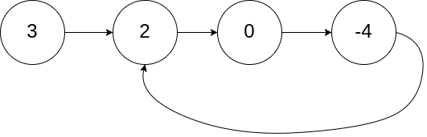
  >   >
  >   > ```js
  >   > 输入：head = [3,2,0,-4], pos = 1
  >   > 输出：true
  >   > 解释：链表中有一个环，其尾部连接到第二个节点。
  >   > ```
  >   >
  >   > 
  >
  > * 示例 2：
  >
  >   > 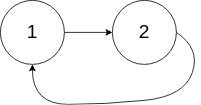
  >   >
  >   > ```js
  >   > 输入：head = [1,2], pos = 0
  >   > 输出：true
  >   > 解释：链表中有一个环，其尾部连接到第一个节点。
  >   > ```
  >   >
  >   > 
  >
  > 
  >
  > * 示例 3：
  >
  >   > 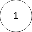
  >   >
  >   > ```js
  >   > 输入：head = [1], pos = -1
  >   > 输出：false
  >   > 解释：链表中没有环。
  >   > ```
  >
  > * 提示：
  >
  >   ```js
  >   链表中节点的数目范围是 [0, 104]
  >   -105 <= Node.val <= 105
  >   pos 为 -1 或者链表中的一个 有效索引 。
  >   ```
  >
  >   
  >
  > * 进阶：你能用 O(1)（即，常量）内存解决此问题吗？
  >
  > 作者：LeetCode
  > 链接：https://leetcode.cn/leetbook/read/linked-list/jbex5/
  > 来源：力扣（LeetCode）

#### 哈希表法

* 思路

  > * 遍历所有节点，每次遍历到一个节点时，判断该节点此前是否被访问过。
  >
  > * 使用哈希表来存储所有已经访问过的节点。
  >
  > * 每次我们到达一个节点，如果该节点已经存在于哈希表中，则说明该链表是环形链表，否则就将该节点加入哈希表中。
  >
  > * 重复这一过程，直到我们遍历完整个链表即可。
  >
  > * 时间复杂度：O(N)，其中 N 是链表中的节点数。最坏情况下我们需要遍历每个节点一次。
  >
  >   空间复杂度：O(N)，其中 N 是链表中的节点数。主要为哈希表的开销，最坏情况下我们需要将每个节点插入到哈希表中一次。
  >

* 代码：

  ```js
  /**
   * Definition for singly-linked list.
   * function ListNode(val) {
   *     this.val = val;
   *     this.next = null;
   * }
   */
  
  /**
   * @param {ListNode} head
   * @return {boolean}
   */
  let hasCycle = function(head) {
      let map=new Map();//创建 Map 表
     
      while(head){ // 不存在环时 head 为 null，存在时通过 return 终结
          if(map.get(head))
              return true; // 终止循环方式直接通过找到环终结
          map.set(head,true); // 将整个节点作为 Map 的 key值存入 map
          head=head.next;
         
      }
      return false;
  };
  ```

#### 快慢指针法

* 思路：

  > * 本方法需要读者对「Floyd 判圈算法」（又称龟兔赛跑算法）有所了解。
  >   * 假想「乌龟」和「兔子」在链表上移动，「兔子」跑得快，「乌龟」跑得慢。
  >   * 当「乌龟」和「兔子」从链表上的同一个节点开始移动时，如果该链表中没有环，那么「兔子」将一直处于「乌龟」的前方；
  >   * 如果该链表中有环，那么「兔子」会先于「乌龟」进入环，并且一直在环内移动。
  >   * 等到「乌龟」进入环时，由于「兔子」的速度快，它一定会在某个时刻与乌龟相遇，即套了「乌龟」若干圈。
  >     * 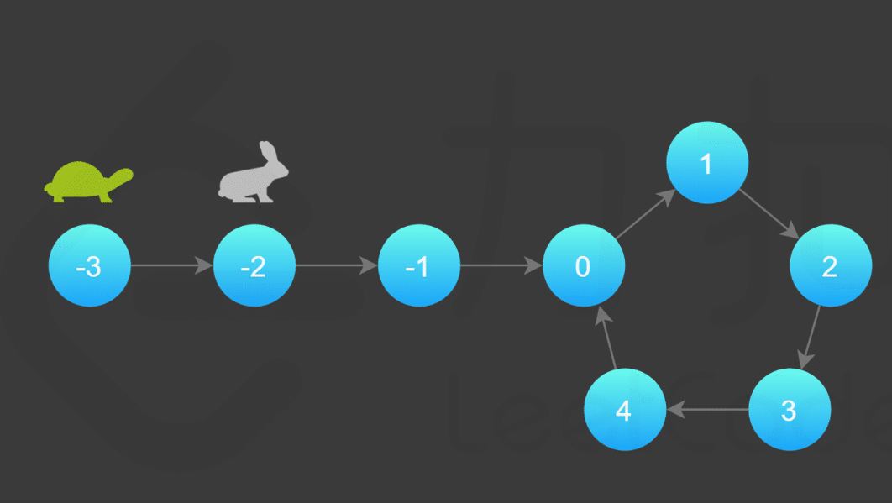
  >     * 
  >
  > * 我们可以根据上述思路来解决本题:
  >
  >   * 具体地，我们定义两个指针，一快一慢。
  >
  >   * 慢指针每次只移动一步，而快指针每次移动两步。
  >
  >   * 初始时，慢指针在位置 head，而快指针在位置 head.next。
  >
  >   * 这样一来，如果在移动的过程中，快指针反过来追上慢指针，就说明该链表为环形链表。
  >
  >   * 否则快指针将到达链表尾部，该链表不为环形链表。
  >
  >     > 为什么我们要规定初始时慢指针在位置 head，快指针在位置 head.next，而不是两个指针都在位置 head（即与「乌龟」和「兔子」中的叙述相同）？
  >     >
  >     > * 观察下面的代码，我们使用的是 while 循环，循环条件先于循环体。
  >     > * 由于循环条件一定是判断快慢指针是否重合，如果我们将两个指针初始都置于 head，那么 while 循环就不会执行。
  >     > * 因此，我们可以假想一个在 head 之前的虚拟节点，慢指针从虚拟节点移动一步到达 head，快指针从虚拟节点移动两步到达 head.next，这样我们就可以使用 while 循环了。
  >     >
  >     > 当然，我们也可以使用 do-while 循环。此时，我们就可以把快慢指针的初始值都置为 head

* 代码：

  ```js
  /**
   * Definition for singly-linked list.
   * function ListNode(val) {
   *     this.val = val;
   *     this.next = null;
   * }
   */
  
  /**
   * @param {ListNode} head
   * @return {boolean}
   * 本方案采用双指针的方式，定义两指针slow，fast。
   * slow 每次移动一个节点，fast每次移动两个节点，
   * 如果链表存在环，则在某时刻slow与fast指针将重合，
   * 如果不存在环，则能正常遍历完成链表
   */
  let hasCycle = function(head) {
  
      if(!head)return false
      let slow = head,
          fast = head.next
      	
      while(fast && fast.next){// 终止条件：快慢指针所指节点 next 指针都为空，表示不存在环
          if(slow == fast)return true; // 快慢指针相遇，表示存在环
          slow=slow.next;
          fast=fast.next.next;
      }
      return false
  };
  ```

  

### 链表环的入口节点

* 题目：

  > * 定一个链表的头节点  head ，返回链表开始入环的第一个节点。 
  > * 如果链表无环，则返回 null。
  >   * 如果链表中有某个节点，可以通过连续跟踪 next 指针再次到达，则链表中存在环。 
  >   * 为了表示给定链表中的环，评测系统内部使用整数 pos 来表示链表尾连接到链表中的位置（索引从 0 开始）。
  >   * 如果 pos 是 -1，则在该链表中没有环。注意：pos 不作为参数进行传递，仅仅是为了标识链表的实际情况。
  > * 不允许修改 链表。
  >
  > * 示例 1：
  >
  >   > 
  >   >
  >   > ```js
  >   > 输入：head = [3,2,0,-4], pos = 1
  >   > 输出：返回索引为 1 的链表节点
  >   > 解释：链表中有一个环，其尾部连接到第二个节点。
  >   > ```
  >
  > * 示例2：
  >
  >   > 
  >   >
  >   > ```js
  >   > 输入：head = [1,2], pos = 0
  >   > 输出：返回索引为 0 的链表节点
  >   > 解释：链表中有一个环，其尾部连接到第一个节点。
  >   > ```
  >
  > * 示例3：
  >
  >   > 
  >   >
  >   > ```js
  >   > 输入：head = [1], pos = -1
  >   > 输出：返回 null
  >   > 解释：链表中没有环。
  >   > ```
  >
  > * 提示：
  >
  >   * 链表中节点的数目范围在范围 [0, 104] 内
  >   * -105 <= Node.val <= 105
  >   * pos 的值为 -1 或者链表中的一个有效索引
  >
  > * 进阶：你是否可以使用 O(1) 空间解决此题？
  >
  >   作者：LeetCode
  >   链接：https://leetcode.cn/leetbook/read/linked-list/jjhf6/
  >   来源：力扣（LeetCode）
  >   著作权归作者所有。商业转载请联系作者获得授权，非商业转载请注明出处。

#### 哈希表法

* 思路：

  > * 使用 hash 表存储已访问过的节点；
  > * 循环遍历链表：如果节点存在，直接返回该节点；
  > * 否则跳出循环表示没有环；

* 代码

  ```js
  var detectCycle2 = function(head) {
      let node = head, map = new Map();
      map.set(head, "null");
      while(node) {
          if(map.get(node.next)) {
              return node.next;
          } else {
              map.set(node.next, node);
          }
          node = node.next;
      }
      return null;
  };
  ```


#### 快慢指针法

* 思路：参考 [leetcode](https://leetcode.cn/problems/linked-list-cycle-ii/solutions/441131/huan-xing-lian-biao-ii-by-leetcode-solution/)

* 代码：

  ```js
  var detectCycle = function(head) {
      if (head === null) {
          return null;
      }
      let slow = head, fast = head;
      while (fast !== null) {
          slow = slow.next; // 慢指针移动一个
          if (fast.next !== null) {
              fast = fast.next.next; // 快指针移动两个
          } else {
              return null; // 链表无环
          }
          if (fast === slow) {
              let ptr = head;
               //当 slow  与 fast  相遇时，指针 ptr。指向链表头部；随后，它和 slow 每次向后移动一个位置。最终，它们会在入环点相遇。
              while (ptr !== slow) {
                  ptr = ptr.next;
                  slow = slow.next;
              }
              return ptr;
          }
      }
      return null;
  };
  ```


## [相交链表](https://leetcode.cn/leetbook/read/linked-list/jjbj2/)

* 题目：（[题目来源 leetcode](https://leetcode.cn/leetbook/read/linked-list/jjbj2/))

  > * 给你两个单链表的头节点 headA 和 headB ，请你找出并返回两个单链表相交的起始节点。
  > * 如果两个链表不存在相交节点，返回 null 。
  >   * 图示两个链表在节点 c1 开始相交：
  >
  > 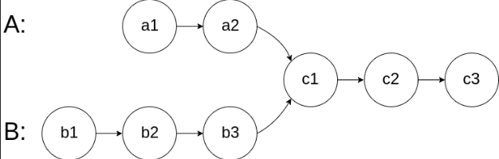
  >
  > * 题目数据 保证 整个链式结构中不存在环。
  >
  > * 注意，函数返回结果后，链表必须 保持其原始结构 

### 哈希表法

* 思路：

  > * 判断两个链表是否相交，可以使用哈希集合存储链表节点。
  >
  > * 首先遍历链表 headA，并将链表 headA 中的每个节点加入哈希集合中。
  >
  > * 然后遍历链表 headB，对于遍历到的每个节点，判断该节点是否在哈希集合中：
  >
  >   * 如果当前节点不在哈希集合中，则继续遍历下一个节点；
  >
  >   *如果当前节点在哈希集合中，则后面的节点都在哈希集合中，即从当前节点开始的所有节点都在两个链表的相交部分，因此在链表 headB 中遍历到的第一个在哈希集合中的节点就是两个链表相交的节点，返回该节点。
  >
  > * 如果链表 headB 中的所有节点都不在哈希集合中，则两个链表不相交，返回 null。
  >
  > * 时间复杂度：O(m+n)，其中 m 和 n 是分别是链表 headA 和 headB 的长度。需要遍历两个链表各一次。
  >
  >   空间复杂度：O(m)，其中 m 是链表 headA 的长度。需要使用哈希集合存储链表 headA 中的全部节点。
  >

* 代码：

  ```js
  var getIntersectionNode = function(headA, headB) {
      const visited = new Set();
      let temp = headA;
      while (temp !== null) {
          visited.add(temp);
          temp = temp.next;
      }
      temp = headB;
      while (temp !== null) {
          if (visited.has(temp)) {
              return temp;
          }
          temp = temp.next;
      }
      return null;
  };
  
  ```


### 双指针法

* 思想：

  > * 使用**双指针的方法，可以将空间复杂度降至 O(1)**。
  > * 只有当链表 headA 和 headB 都不为空时，两个链表才可能相交。
  > * 首先判断链表 headA 和 headB 是否为空，如果其中至少有一个链表为空，则两个链表一定不相交，返回 null。
  > * 当链表 headA和 headB 都不为空时，创建两个指针 pA 和 pB，初始时分别指向两个链表的头节点 headA 和 headB，然后将两个指针依次遍历两个链表的每个节点。具体做法如下：
  >   * 每步操作需要同时更新指针 pA 和 pB。
  >   * 如果指针 pA 不为空，则将指针 pA 移到下一个节点；
  >   * 如果指针 pB 不为空，则将指针 pB 移到下一个节点。
  >   * 如果指针 pA 为空，则将指针 pA 移到链表 headB 的头节点；
  >   * 如果指针 pB 为空，则将指针 pB 移到链表 headA 的头节点。
  >   * 当指针 pA和 pB 指向同一个节点或者都为空时，返回它们指向的节点或者 null。
  > * 时间复杂度：O(m+n)，其中 m 和 n是分别是链表 headA 和 headB 的长度。两个指针同时遍历两个链表，每个指针遍历两个链表各一次。
  > * 空间复杂度：O(1)。
  > * (核心思想是**将两个链表用两个指针都遍历一遍，那么当遍历到相同长度时，两个指针一定会相遇，第一次相遇时即为相交节点)**

* 代码：

  ```js
  var getIntersectionNode = function(headA, headB) {
      if (headA === null || headB === null) {
          return null;
      }
      let pA = headA, pB = headB;
      while (pA !== pB) {
          pA = pA === null ? headB : pA.next;
          pB = pB === null ? headA : pB.next;
      }
      return pA;
  };
  ```


## 题型归纳

### [链表双指针法](https://leetcode.cn/leetbook/read/linked-list/j6ywt/)

#### [删除链表的倒数第 N 个结点](https://leetcode.cn/problems/remove-nth-node-from-end-of-list/)

* 题目：

  > * 给你一个链表，删除链表的倒数第 `n` 个结点，并且返回链表的头结点。
  >
  > 
  >
  > * 示例：
  >
  > * ```js
  >   输入：head = [1,2,3,4,5], n = 2
  >   输出：[1,2,3,5]
  >   ```
  >
  > * ```js
  >   输入：head = [1], n = 1
  >   输出：[]
  >   ```
  >
  > * ```js
  >   输入：head = [1,2], n = 1
  >   输出：[1]
  >   ```
  >
  > * 提示：
  >
  >   >  链表中结点的数目为 sz
  >   > 1 <= sz <= 30
  >   > 0 <= Node.val <= 100
  >   > 1 <= n <= sz
  >
  > * 进阶：你能尝试使用一趟扫描实现吗？
  >
  >   

* 方法一：**计算链表长度**

  > * 首先从头节点开始对链表进行一次遍历，得到链表的长度 L。
  > * 随后我们再从头节点开始对链表进行一次遍历，当遍历到第  `L−n+1` 个节点时，它就是我们需要删除的节点。
  >   * 为了与题目中的 n 保持一致，节点的编号从 1 开始，头节点为编号 1 的节点。
  >
  > * 为了方便删除操作，我们可以从哑节点开始遍历 `L−n+1` 个节点。当遍历到第 `L−n+1` 个节点时，它的下一个节点就是我们需要删除的节点，这样我们只需要修改一次指针，就能完成删除操作。
  >
  > * 
  >
  > * 时间复杂度：*O*(*L*)，其中 L 是链表的长度。
  >
  > * 空间复杂度：*O*(1)。
  >
  > * 注意：
  >
  >   * 如果我们要删除节点 y，我们需要知道节点 y 的前驱节点 x，并将x 的指针指向y 的后继节点。
  >   * 但**由于头节点不存在前驱节点，因此我们需要在删除头节点时进行特殊判断**。
  >   * 但如果我们添加了哑节点（哑节点（dummy node），它的 next 指针指向链表的头节点），那么头节点的前驱节点就是哑节点本身，此时我们就只需要考虑通用的情况即可。
  >
  >   

  * 代码：

    ```js
    /**
     * Definition for singly-linked list.
     * function ListNode(val, next) {
     *     this.val = (val===undefined ? 0 : val)
     *     this.next = (next===undefined ? null : next)
     * }
     */
    /**
     * @param {ListNode} head
     * @param {number} n
     * @return {ListNode}
     */
    var removeNthFromEnd = function(head, n) {
        let len = 0;
        let curNode  = head;
        while(curNode) {
           ++ len ;
           curNode = curNode.next;
        }
        // 注意：创建哑节点，链接头节点，用于避免头节点的判断
        let dummy = new ListNode(null,head);
        curNode = dummy; // 从哑节点处开始遍历
        for(let i = 1; i < len-n+1; ++i) {
            curNode = curNode.next;
        }
        curNode.next = curNode.next.next;
        return dummy.next;
    };
    ```

* 方法二：**栈**

  * 思路：

    > * 遍历链表，并将每个节点入栈；
    > * 遍历完成后，依次弹出栈顶元素，弹出的第 n 个元素即为要删除的节点，第 `n+1` 个元素即为被删除节点的前驱节点；
    > * 注意：由于删除头节点需要特殊判断，因此同样可以在链表头部添加哑节点，避免头节点的特殊判断； 
    > * 时间复杂度 O(n)，空间复杂度 O(n)，n 为链表长度；

  * 代码：

    ```js
    /**
     * Definition for singly-linked list.
     * function ListNode(val, next) {
     *     this.val = (val===undefined ? 0 : val)
     *     this.next = (next===undefined ? null : next)
     * }
     */
    /**
     * @param {ListNode} head
     * @param {number} n
     * @return {ListNode}
     */
    var removeNthFromEnd = function(head, n) {
        let stack = [];
        let dummy = new ListNode(null,head);//创建 dummy,用于避免删除头节点的特殊判断
        let curNode = dummy;//从 dummy 节点开始入栈，考虑删除头节点情况
        while(curNode) {
            stack.push(curNode);
            curNode = curNode.next
        }
        while(n>0) { // 出栈，直到节点 n
            stack.pop()
            n--;
        }
        curNode = stack.pop(); // 获取被删除节点的前驱节点
        curNode.next = curNode.next.next; // 删除节点
        return dummy.next; // 返回 dummy 节点的后继节点！
    };
    ```

    

* 方法三：**双指针法**

  * 思路：

    > * 由于我们需要找到倒数第 n 个节点，因此我们可以使用两个指针 fast 和 slow 同时对链表进行遍历，并且 fast 超前 n 个节点。
    >
    > * 当 fast 遍历到链表的末尾时，slow 就恰好处于倒数第 n 个节点。
    >
    > * 由于删除链表的节点需要找到链表的前驱节点，因此需要遍历到倒数 n+1 个节点；
    >
    > * 为了避免单独判断头节点的特殊情况，同样可以在链表头添加哑节点，并将 slow 指针指向哑节点，fast 指向头节点，那么当 fast 移动到链表末尾时，slow 刚好指向被删除节点的前驱节点。
    >
    > * 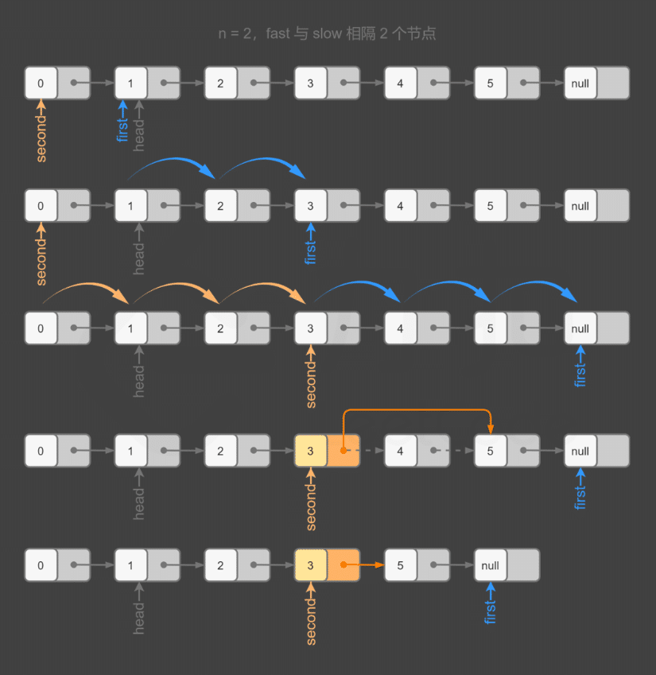
    >
    >   

  * 代码：

    ```js
    /**
     * Definition for singly-linked list.
     * function ListNode(val, next) {
     *     this.val = (val===undefined ? 0 : val)
     *     this.next = (next===undefined ? null : next)
     * }
     */
    /**
     * @param {ListNode} head
     * @param {number} n
     * @return {ListNode}
     */
    var removeNthFromEnd = function(head, n) {
        // 创建哑节点，哑节点指向头部节点
        let dummy = new ListNode(null,head);
        let slow = dummy; // slow 节点指向哑节点
        let fast = head;
        while(n>0) { // fast 前进 n 个节点
            fast = fast.next;
            n--;
        }
        while(fast) { // 同时移动 slow 和 fast,直到 fast 指向链表尾部，此时 slow 刚好指向被删除节点的前驱节点
            fast = fast.next;
            slow = slow.next;
        }
        slow.next = slow.next.next;// 删除节点
        return dummy.next; //返回 head 节点
    };
    ```

    
