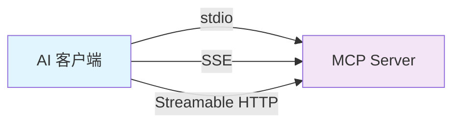
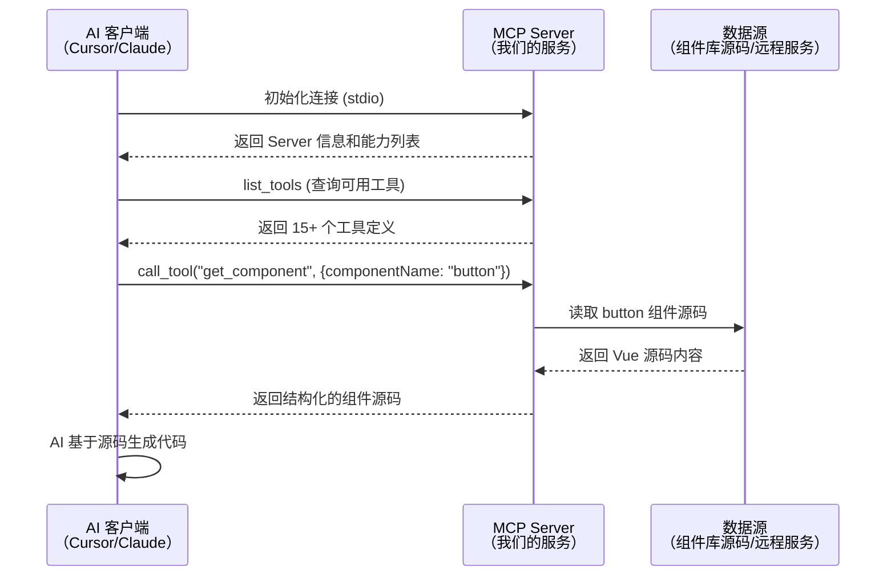
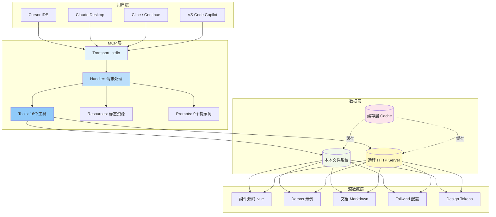
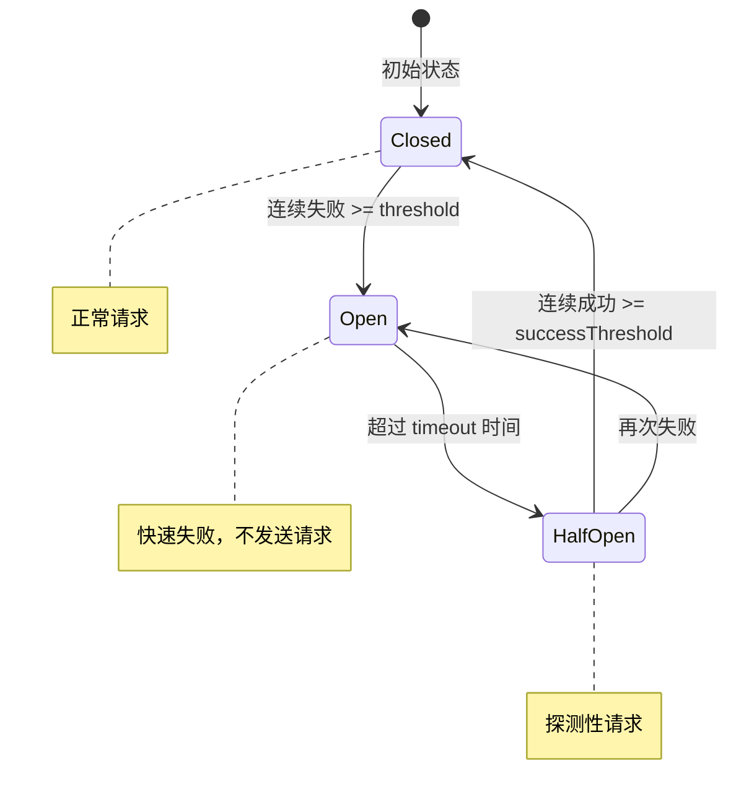
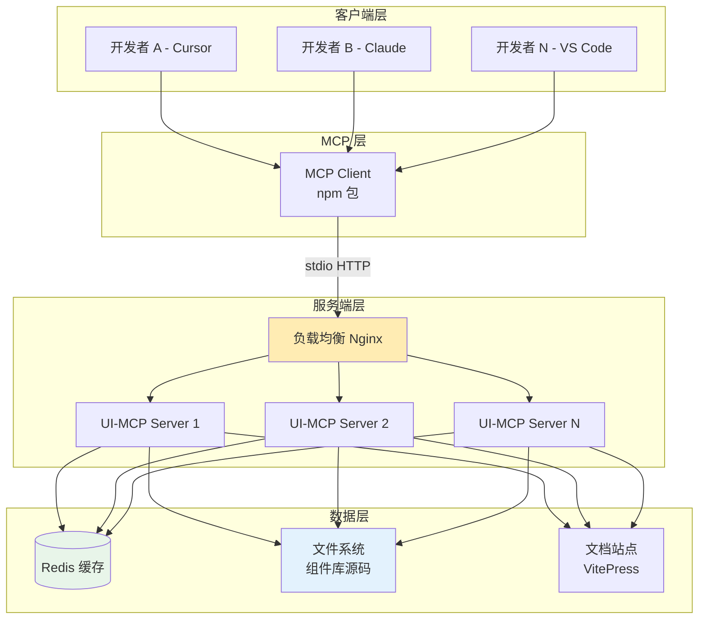
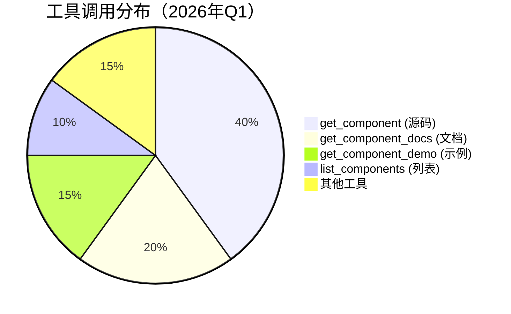

# 从 0 到 1：如何为组件库搭建 AI 助手（MCP 实战指南）

> **阅读时间**：约 15 分钟 | **难度**：中级 | **适用场景**：企业级组件库 AI 化改造

## 目录

- [一、什么是 MCP？为什么需要它？](#一什么是-mcp为什么需要它)
  - [1.1 MCP 的核心概念](#11-mcp-的核心概念)
  - [1.2 MCP 解决了什么问题](#12-mcp-解决了什么问题)
  - [1.3 MCP 的工作原理](#13-mcp-的工作原理)
- [二、组件库 MCP 的设计思路与架构](#二组件库-mcp-的设计思路与架构)
  - [2.1 为什么组件库需要 MCP](#21-为什么组件库需要-mcp)
  - [2.2 整体架构设计](#22-整体架构设计)
  - [2.3 核心能力规划](#23-核心能力规划)
- [三、技术实现详解](#三技术实现详解)
  - [3.1 服务端核心架构](#31-服务端核心架构)
  - [3.2 双模式数据源设计](#32-双模式数据源设计)
  - [3.3 工具系统实现](#33-工具系统实现)
  - [3.4 提示词系统（Prompts）](#34-提示词系统prompts)
  - [3.5 高可用保障机制](#35-高可用保障机制)
- [四、部署方案与最佳实践](#四部署方案与最佳实践)
  - [4.1 本地模式 vs 远程模式](#41-本地模式-vs-远程模式)
  - [4.2 企业级部署架构](#42-企业级部署架构)
  - [4.3 客户端配置指南](#43-客户端配置指南)
- [五、实际效果与收益分析](#五实际效果与收益分析)
  - [5.1 量化指标](#51-量化指标)
  - [5.2 使用场景案例](#52-使用场景案例)
  - [5.3 ROI 分析](#53-roi-分析)
- [六、踩坑经验与优化建议](#六踩坑经验与优化建议)
  - [6.1 常见问题](#61-常见问题)
  - [6.2 性能优化建议](#62-性能优化建议)
  - [6.3 未来演进方向](#63-未来演进方向)
- [七、总结](#七总结)

---

## 一、什么是 MCP？为什么需要它？

### 1.1 MCP 的核心概念

**MCP（Model Context Protocol，模型上下文协议）** 是 Anthropic 在 2024 年底开源的一个开放标准协议，旨在解决 **AI 模型与外部工具/资源之间的连接问题**。

#### 🎯 一句话理解

> **MCP 就像是 AI 的"USB 接口"** —— 它定义了一套标准规范，让任何 AI 模型都能通过这个接口访问各种外部能力（数据库、API、文件系统、组件库等）。

#### 📐 核心概念

| 概念 | 类比 | 说明 |
|------|------|------|
| **Server（服务器）** | USB 设备 | 提供 AI 可调用的能力和资源 |
| **Client（客户端）** | 电脑主机 | 运行 AI 模型，通过 MCP 调用 Server |
| **Tool（工具）** | 功能按钮 | AI 可以调用的具体功能（如"获取组件源码"） |
| **Resource（资源）** | 文件/数据 | 静态或动态的内容（如文档、配置文件） |
| **Prompt（提示词模板）** | 快捷指令 | 预定义的复杂任务指令 |
| **Transport（传输层）** | 数据线 | Client 和 Server 之间的通信方式 |

#### 🔌 支持的传输方式



**最常用的是 `stdio`（标准输入输出）**，因为它简单、稳定，适合大多数本地开发场景。

### 1.2 MCP 解决了什么问题？

#### ❌ 没有 MCP 时的问题

```
开发者想用 AI 写代码：
1. 打开浏览器 → 查找组件文档
2. 复制粘贴 → 粘贴到 AI 对话框
3. AI 可能理解错误 → 反复解释
4. 最终生成的代码可能过时或不准确
```

**痛点总结**：
- **信息孤岛**：AI 无法直接访问你的私有代码库
- **上下文丢失**：复制粘贴会丢失格式和结构化信息
- **实时性差**：AI 训练数据是静态的，无法获取最新版本
- **效率低下**：手动搬运信息耗时且容易出错

#### ✅ 有 MCP 后的体验

```
开发者对 AI 说：
"帮我用 Button 组件写一个带 loading 状态的提交按钮"

AI 自动调用：
1. get_component("button") → 获取最新源码
2. get_component_docs("button") → 获取 API 文档
3. get_component_demo("button") → 获取使用示例
4. 生成准确、符合规范的代码 ✅
```

**价值提升**：
- **自动化**：AI 直接获取所需信息，无需人工干预
- **准确性**：基于真实源码和文档，避免幻觉
- **实时性**：每次调用都获取最新版本
- **一致性**：所有团队成员使用相同的数据源

### 1.3 MCP 的工作原理

#### 🔄 通信流程



#### 📦 标准请求/响应格式

**客户端请求示例**：
```json
{
  "jsonrpc": "2.0",
  "id": 1,
  "method": "tools/call",
  "params": {
    "name": "get_component",
    "arguments": {
      "componentName": "button"
    }
  }
}
```

**服务端响应示例**：
```json
{
  "jsonrpc": "2.0",
  "id": 1,
  "result": {
    "content": [
      {
        "type": "text",
        "text": "<template>\n  <button :class=\"buttonVariants(...)\">\n    ...\n  </button>\n</template>"
      }
    ],
    "isError": false
  }
}
```

#### ⚡ 关键特性

1. **JSON-RPC 2.0 协议**：轻量级、易实现的通信协议
2. **Schema 验证**：每个工具都有严格的输入参数定义（使用 Zod）
3. **流式支持**：可以返回大文本内容的流式传输
4. **错误处理**：统一的错误格式和状态码

---

## 二、组件库 MCP 的设计思路与架构

### 2.1 为什么组件库需要 MCP？

在企业级前端开发中，组件库是基础设施的核心。但我们在日常开发中经常遇到这些问题：

#### 😤 开发者的痛

| 场景 | 传统方式 | 耗时 |
|------|---------|------|
| 查找组件 API | 打开文档站 → 搜索 → 翻阅 | 5-10 分钟 |
| 复杂组件用法 | 问同事 → 查 GitHub → 看 demo | 15-30 分钟 |
| 组件迁移 | 对照旧组件 → 找对应 API → 重写 | 2-4 小时 |
| 新人上手 | 读文档 → 跑 demo → 看源码 | 1-2 周 |

#### 💡 MCP 能做什么？

通过为组件库搭建 MCP Server，我们让 **AI 成为每个开发者的"24 小时组件专家"**：

- **秒级查询**：AI 直接调用工具获取组件信息
- **智能推荐**：根据需求自动匹配最合适的组件
- **代码生成**：一键生成符合规范的组件代码
- **知识传承**：新员工无需培训即可高效使用组件库

### 2.2 整体架构设计

#### 🏗️ 分层架构图



#### 🎯 设计原则

1. **双模式支持**：本地模式（适合开发调试） + 远程模式（适合团队协作）
2. **插件化架构**：通过框架切换支持多个组件库（React/Vue/Svelte）
3. **高可用性**：断路器、缓存、重试机制
4. **可扩展性**：易于添加新的工具和数据源

### 2.3 核心能力规划

我们为组件库 MCP 规划了 **四大能力矩阵**：

#### 🛠️ Tools（工具）- 16 个可调用功能

| 分类 | 工具名称 | 功能说明 |
|------|---------|---------|
| **基础查询** | `list_components` | 获取所有可用组件列表 |
| | `get_component` | 获取组件完整源码 |
| | `get_component_metadata` | 获取组件元数据（props/events/slots） |
| | `get_component_docs` | 获取组件文档（Markdown 格式） |
| **样式相关** | `get_component_style` | 获取 Tailwind 样式配置（style.ts） |
| | `get_component_type` | 获取 TypeScript 类型声明 |
| | `get_design_token` | 获取 Design Token 系统 |
| | `get_tailwind_config` | 获取完整的 Tailwind 配置 |
| **示例演示** | `get_component_demo` | 获取组件使用示例 |
| **文档系统** | `list_docs` | 获取文档列表 |
| | `get_changelog` | 获取版本更新日志 |
| | `get_usage_docs` | 获取使用指南 |
| | `get_custom_style_docs` | 获取自定义样式文档 |
| **扩展功能** | `get_directory_structure` | 浏览组件目录结构 |
| | `get_block` | 获取业务 Block 代码 |
| | `list_blocks` | 列出所有可用 Blocks |

#### 📚 Prompts（提示词）- 9 个高级指令

| Prompt 名称 | 使用场景 |
|-------------|---------|
| `component-deep-dive` | 深度分析一个组件（源码+类型+样式+文档） |
| `design-system-setup` | 完整的设计系统搭建指南 |
| `component-customization` | 组件定制化指导 |
| `migration-guide` | 从其他 UI 库迁移指南 |
| `accessibility-audit` | 无障碍审计和改进建议 |
| `performance-optimization` | 性能优化建议 |
| `theme-builder` | 自定义主题构建器 |
| `component-testing` | 组件测试编写指南 |

#### 📁 Resources（资源）- 静态/动态内容

- 组件列表资源
- 安装脚本生成器
- 安装指南模板

---

## 三、技术实现详解

### 3.1 服务端核心架构

#### 📦 项目结构

```
mcp/
├── src/
│   ├── server/                 # MCP 服务端核心
│   │   ├── createServer.ts     # 服务器工厂函数
│   │   ├── handler.ts          # 请求处理器（513行，核心逻辑）
│   │   ├── capabilities-atomm-ui.ts  # 能力定义（273行）
│   │   └── index.ts            # 启动入口
│   ├── tools/                  # 工具实现
│   │   ├── index.ts            # 工具注册中心（192行）
│   │   └── components/         # 具体工具实现
│   ├── utils/                  # 工具函数
│   │   ├── axios-atomm-ui.ts       # 本地数据读取（1400+行）
│   │   ├── axios-atomm-ui-remote.ts # 远程 HTTP 客户端（529行）
│   │   ├── cache.ts                # 缓存系统（179行）
│   │   ├── circuit-breaker.ts      # 断路器（133行）
│   │   └── framework.ts            # 框架切换逻辑（177行）
│   └── prompts/                # 提示词系统
│       └── atomm-ui/           # 组件库专属提示词（1000+行）
└── server/                    # 远程服务端（NestJS）
    └── src/
        ├── component/          # 组件 API
        ├── design-token/       # Design Token API
        └── docs/               # 文档 API
```

#### ⚙️ 服务器初始化流程

```typescript
// src/server/createServer.ts
import { Server } from "@modelcontextprotocol/sdk/server/index.js"

export function createServer(version: string, framework: string) {
  return new Server(
    {
      name: framework.includes("atomm-ui") 
        ? "atomm-ui-mcp-server" 
        : "shadcn-ui-mcp-server",
      version,
    },
    {
      capabilities: framework.includes("atomm-ui") 
        ? capabilitiesAtommUI  // 组件库专属能力
        : capabilitiesShadcn   // Shadcn 默认能力
    }
  )
}
```

**关键点**：
- 使用官方 `@modelcontextprotocol/sdk` 创建服务器实例
- 通过 `framework` 参数动态切换能力配置
- 支持 5 种模式：`react`、`svelte`、`vue`、`atomm-ui-local`、`atomm-ui-remote`

#### 🎛️ 请求处理器（handler.ts）- 核心中的核心

这是整个 MCP Server 最复杂的模块（513 行），负责处理所有类型的 MCP 请求：

```typescript
// src/server/handler.ts（简化版）
export const setupHandlers = (server: Server): void => {
  
  // 1. 注册 Roots 处理器（定义数据边界）
  server.setRequestHandler(ListRootsRequestSchema, async (request) => {
    const roots = getValidatedRoots()
    return { roots }
  })

  // 2. 注册 Resources 处理器（静态/动态资源）
  server.setRequestHandler(ListResourcesRequestSchema, async () => {
    return { resources }
  })

  // 3. 注册 Tools 处理器（核心功能）
  server.setRequestHandler(ListToolsRequestSchema, async () => {
    // 根据 framework 返回不同的工具列表
    const tools = isAtommUI ? atommUITools : shadcnUITools
    return { tools }
  })

  // 4. 注册 Tool Call 处理器（执行工具调用）
  server.setRequestHandler(CallToolRequestSchema, async (request) => {
    const { name, arguments: params } = request.params
    
    // 参数验证
    const validatedParams = validateAndSanitizeParams('call_tool', params)
    
    // 断路器保护
    const result = await circuitBreakers.external.execute(() => 
      toolHandlers[name](validatedParams)
    )
    
    return result
  })

  // 5. 注册 Prompts 处理器（高级指令）
  server.setRequestHandler(GetPromptRequestSchema, async (request) => {
    const { name, arguments: args } = request.params
    return promptHandlers[name](args)
  })
}
```

**🔥 三层保护机制**：

```typescript
// 第一层：参数验证（Zod Schema）
const validatedParams = validateAndSanitizeParams(method, params)

// 第二层：断路器保护（防止级联故障）
const result = await circuitBreakers.external.execute(() => 
  handler(validatedParams)
)

// 第三层：统一错误处理
try {
  // ... 业务逻辑
} catch (error) {
  logError(`Error in ${method}`, error)
  throw error
}
```

### 3.2 双模式数据源设计

这是本项目的 **核心创新点**：同时支持本地文件系统和远程 HTTP 两种数据源。

#### 🔄 数据源切换机制

```typescript
// src/utils/framework.ts
export async function getAxiosImplementation() {
  const framework = getFramework()
  
  switch (framework) {
    case "atomm-ui-local":
      // 本地模式：直接读取文件系统
      return import("./axios-atomm-ui.js")
      
    case "atomm-ui-remote":
      // 远程模式：HTTP 请求服务器
      return import("./axios-atomm-ui-remote.js")
      
    default:
      // 其他框架（react/vue/svelte）
      return import("./axios.js")
  }
}
```

#### 📂 本地模式（atomm-ui-local）

**适用场景**：
- 组件库开发者本地调试
- 需要实时查看最新修改的源码
- 单机使用，无需网络

**实现原理**：

```typescript
// src/utils/axios-atomm-ui.ts（1400+行）
async function getComponentSource(componentName: string): Promise<string> {
  const kebabName = toKebabCase(componentName)  // Button -> button
  
  // 优先从组件目录查找
  const componentDir = join(SRC_PATH, kebabName)
  
  if (existsSync(componentDir)) {
    // 按优先级查找文件
    const searchPaths = [
      join(componentDir, `${pascalName}.vue`),  // Button.vue
      join(componentDir, `${kebabName}.vue`),    // button.vue
      join(componentDir, 'index.vue'),           // index.vue
      // ... 更多候选路径
    ]
    
    for (const path of searchPaths) {
      if (existsSync(path)) {
        // 验证是否为有效组件
        if (isAtommUIComponent(content, path)) {
          return readFileSync(path, 'utf8')
        }
      }
    }
  }
  
  // 全局搜索兜底
  // ...
}
```

**智能查找策略**：
1. **精确匹配**：先按 kebab-case 和 PascalCase 查找
2. **目录扫描**：遍历组件目录下的 `.vue/.tsx/.ts` 文件
3. **特征识别**：检查文件内容是否包含组件库特征（如 `XtButton` 导出）
4. **多源补充**：如果源码找不到，尝试从 demo 或文档提取

#### ☁️ 远程模式（atomm-ui-remote）⭐ 推荐

**适用场景**：
- 团队协作，多人共享
- 客户端无需克隆完整组件库
- 企业级集中管理

**实现原理**：

```typescript
// src/utils/axios-atomm-ui-remote.ts（529行）
class HttpClient {
  private baseUrl: string
  
  constructor(baseUrl: string) {
    this.baseUrl = baseUrl
  }

  async get(path: string): Promise<any> {
    const url = `${this.baseUrl}${path}`
    
    const response = await fetch(url, {
      method: 'GET',
      headers: {
        'Accept': 'application/json',
        'Content-Type': 'application/json',
      },
    })

    if (!response.ok) {
      throw new Error(`HTTP ${response.status}`)
    }

    return response.json()
  }
}

async function getComponentSource(componentName: string): Promise<string> {
  // 健康检查
  const isHealthy = await httpClient.checkHealth()
  if (!isHealthy) {
    throw new Error('服务器不可用')
  }

  // 请求远程 API
  const response = await httpClient.get(
    `/api/component/${encodeURIComponent(kebabName)}/source`
  )
  
  return response.source
}
```

**远程服务端架构**（NestJS）：

```
server/src/
├── component/
│   ├── component.controller.ts   # RESTful API
│   └── component.service.ts      # 业务逻辑
├── design-token/
│   ├── design-token.controller.ts
│   └── design-token.service.ts
├── docs/
│   ├── docs.controller.ts
│   └── docs.service.ts
└── main.ts                       # 应用入口
```

#### 📊 两种模式对比

| 维度 | 本地模式 | 远程模式 |
|------|---------|---------|
| **启动速度** | 快（无需网络） | 中等（需连接服务器） |
| **数据实时性** | ✅ 实时（读本地文件） | ⚠️ 取决于服务器更新频率 |
| **资源占用** | 高（需克隆完整仓库） | 低（仅安装 npm 包） |
| **适用场景** | 开发者、调试 | 生产环境、团队协作 |
| **依赖要求** | 本地有源码 | 仅需网络 |
| **并发能力** | 单用户 | 多用户共享 |

### 3.3 工具系统实现

#### 🛠️ 工具注册中心

```typescript
// src/tools/index.ts
export const toolHandlers = {
  // 基础查询
  get_component: handleGetComponent,
  get_component_demo: handleGetComponentDemo,
  list_components: handleListComponents,
  get_component_metadata: handleGetComponentMetadata,
  
  // 文档和样式
  get_component_docs: handleGetComponentDocs,
  get_component_style: handleGetComponentStyle,
  get_component_type: handleGetComponentType,
  
  // 系统级
  get_design_token: handleGetDesignToken,
  get_tailwind_config: handleGetTailwindConfig,
  list_docs: handleListDocs,
  get_changelog: handleGetChangelog,
  // ... 更多工具
}
```

#### 📝 典型工具实现：get_component

```typescript
// src/tools/components/get-component.ts
export async function handleGetComponent({ componentName }: { componentName: string }) {
  try {
    // 1. 获取数据源实例（自动选择本地/远程）
    const axios = await getAxiosImplementation()
    
    // 2. 调用数据源获取组件源码
    const sourceCode = await axios.getComponentSource(componentName)
    
    // 3. 返回 MCP 标准格式
    return {
      content: [{ type: "text", text: sourceCode }]
    }
  } catch (error) {
    logError(`Failed to get component "${componentName}"`, error)
    throw new Error(`获取组件失败: ${error.message}`)
  }
}

// Zod Schema 定义（用于参数验证）
export const schema = {
  componentName: {
    type: 'string',
    description: '组件名称（如 "button", "modal"）'
  }
}
```

#### 🔍 工具在 handler 中的注册

```typescript
// src/server/handler.ts（ListToolsRequestSchema 处理部分）
{
  name: 'get_component',
  description: '获取指定组件的完整源代码',
  inputSchema: {
    type: 'object',
    properties: {
      componentName: {
        type: 'string',
        description: '组件名称（如 "accordion", "button"）',
      },
    },
    required: ['componentName'],
  },
},
// ... 其他 15 个工具
```

### 3.4 提示词系统（Prompts）

Prompts 是 MCP 的高级特性，允许预定义复杂的任务指令，AI 可以一键执行。

#### 🎯 为什么需要 Prompts？

**问题**：有些任务需要多次工具调用和复杂推理，每次都让用户描述很麻烦。

**解决方案**：将常见任务封装成 Prompt，AI 自动编排工具调用。

#### 📋 Prompt 示例：component-deep-dive

```typescript
// src/prompts/atomm-ui/index.ts
"component-deep-dive": ({
  componentName,
  framework = "auto"
}) => {
  return {
    messages: [
      {
        role: "user",
        content: {
          type: "text",
          text: `
对 ${componentName} 组件进行深度分析：

ANALYSIS REQUIREMENTS:
- Framework: ${framework}
- Component: ${componentName}

INSTRUCTIONS:
1. Component Source Analysis:
   - Use 'get_component' to fetch the ${componentName} source code
   - Use 'get_component_metadata' to understand properties and dependencies
   - Use 'get_component_docs' to get official documentation
   - Use 'get_component_demo' to see usage examples

2. Type System Analysis:
   - Use 'get_component_type' to fetch TypeScript declarations
   - Analyze component props, events, and slots

3. Styling Analysis:
   - Use 'get_component_style' to examine Tailwind configuration
   - Use 'get_tailwind_config' to get complete CSS configuration
   - Use 'get_design_token' to understand design tokens usage

4. Deep Dive Report:
   - Component architecture and design patterns
   - Props/attributes documentation with examples
   - Styling customization options
   - Accessibility features and ARIA support
   - Performance characteristics and optimization tips
   - Common use cases and best practices

Please provide a comprehensive analysis that would help developers understand every aspect of this component.
          `
        }
      }
    ]
  }
}
```

**效果**：用户只需说 *"深度分析 Button 组件"*，AI 会自动：
1. 调用 `get_component("button")` 获取源码
2. 调用 `get_component_metadata("button")` 获取元数据
3. 调用 `get_component_docs("button")` 获取文档
4. 调用 `get_component_type("button")` 获取类型
5. 调用 `get_component_style("button")` 获取样式配置
6. 整合所有信息生成深度分析报告

#### 🎨 其他实用 Prompt

| Prompt 名称 | 适用场景 | 自动调用的工具 |
|-------------|---------|---------------|
| `design-system-setup` | 新项目接入组件库 | get_installation_guide, get_tailwind_config, get_design_token |
| `component-customization` | 定制组件样式 | get_component, get_component_style, get_design_token |
| `migration-guide` | 从其他 UI 库迁移 | list_components, get_component, get_component_docs |
| `accessibility-audit` | 无障碍审查 | get_component, get_component_type, get_component_demo |
| `performance-optimization` | 性能优化 | get_component, list_components, get_tailwind_config |
| `theme-builder` | 构建自定义主题 | get_design_token, get_tailwind_config |

### 3.5 高可用保障机制

为了保证生产环境的稳定性，我们实现了三层保障：

#### 1️⃣ 缓存系统（Cache）

```typescript
// src/utils/cache.ts
export class Cache {
  private storage: Map<string, CacheItem<any>>
  private defaultTTL: number  // 默认 1 小时

  /**
   * 获取缓存或计算并存储
   */
  public async getOrFetch<T>(
    key: string,
    fetchFn: () => Promise<T>,
    ttl = this.defaultTTL
  ): Promise<T> {
    const cachedValue = this.get<T>(key)
    
    if (cachedValue !== null) {
      return cachedValue  // 命中缓存，直接返回
    }
    
    // 未命中，执行获取函数并缓存
    const value = await fetchFn()
    this.set(key, value, ttl)
    return value
  }
}

// 使用示例
const componentSource = await cache.getOrFetch(
  `component:${componentName}`,
  () => axios.getComponentSource(componentName),
  30 * 60 * 1000  // TTL: 30 分钟
)
```

**特点**：
- 单例模式，全局唯一实例
- 支持 TTL（Time To Live）过期机制
- 支持按前缀批量清除
- 线程安全（Node.js 单线程天然安全）

#### 2️⃣ 断路器（Circuit Breaker）

```typescript
// src/utils/circuit-breaker.ts
export class CircuitBreaker {
  private state: CircuitBreakerState = CircuitBreakerState.CLOSED
  private failures = 0
  private lastFailureTime = 0

  constructor(config: Partial<CircuitBreakerConfig> = {}) {
    this.config = {
      failureThreshold: config.failureThreshold || 5,  // 失败阈值
      timeout: config.timeout || 60000,               // 冷却时间：60秒
      successThreshold: config.successThreshold || 2   // 半开状态成功次数
    }
  }

  async execute<T>(fn: () => Promise<T>): Promise<T> {
    // 如果断路器打开，直接拒绝请求
    if (this.isOpen()) {
      throw new Error('服务暂时不可用（断路器已开启）')
    }

    try {
      const result = await fn()
      this.onSuccess()  // 成功，重置计数
      return result
    } catch (error) {
      this.onFailure()  // 失败，增加计数
      throw error
    }
  }
}

// 不同服务的独立断路器实例
export const circuitBreakers = {
  github: new CircuitBreaker({ failureThreshold: 3, timeout: 30000 }),
  external: new CircuitBreaker({ failureThreshold: 5, timeout: 60000 })
}
```

**三种状态流转**：



**实际效果**：
- 当远程服务器宕机时，不会无限重试导致雪崩
- 60 秒后自动进入半开状态，探测恢复
- 连续 2 次成功后恢复正常

#### 3️⃣ 日志系统

```typescript
// src/utils/logger.ts
export const logInfo = (message: string, data?: any) => {
  console.log(`[INFO] ${new Date().toISOString()} - ${message}`, data || '')
}

export const logError = (message: string, error?: any) => {
  console.error(`[ERROR] ${new Date().toISOString()} - ${message}`, error || '')
}

export const logWarning = (message: string, data?: any) => {
  console.warn(`[WARN] ${new Date().toISOString()} - ${message}`, data || '')
}
```

**日志级别**：
- `INFO`：正常操作（启动、查找组件、返回结果）
- `WARN`：潜在问题（找不到文件、降级处理）
- `ERROR`：异常情况（读取失败、网络超时）

---

## 四、部署方案与最佳实践

### 4.1 本地模式 vs 远程模式

#### 🏠 本地模式

**启动命令**：
```bash
npx @company/ui-mcp-server --framework ui-local
```

**前置条件**：
- 已克隆组件库到本地
- 组件库位于 `packages/ui-components/src/components`
- Node.js >= 18

**优点**：
- ✅ 无需额外部署服务
- ✅ 实时反映本地修改
- ✅ 调试方便

**缺点**：
- ❌ 每个开发者都需要克隆完整仓库
- ❌ 占用较多磁盘空间
- ❌ 不便于团队共享

#### ☁️ 远程模式（推荐生产使用）

**启动命令**：
```bash
npx @company/ui-mcp-server \
  --framework ui-remote \
  --tools-server-url https://ui-mcp.company.com
```

**优点**：
- ✅ 客户端零配置，只需安装 npm 包
- ✅ 团队共享同一数据源，保证一致性
- ✅ 服务端集中管理和更新
- ✅ 支持多客户端并发

**缺点**：
- ❌ 需要部署和维护服务器
- ❌ 依赖网络连接

### 4.2 企业级部署架构

#### 🏗️ 推荐架构



#### 🐳 Docker 部署

**Dockerfile**：
```dockerfile
FROM node:20-alpine

WORKDIR /app

COPY package*.json ./
RUN npm ci --production

COPY dist ./dist
COPY server ./server

EXPOSE 3000

CMD ["node", "server/dist/main.js"]
```

**docker-compose.yml**：
```yaml
version: '3.8'

services:
  ui-mcp-server:
    build:
      context: .
      dockerfile: Dockerfile
    ports:
      - "3000:3000"
    environment:
      - NODE_ENV=production
      - UI_COMPONENTS_PATH=/app/packages/ui-components
    volumes:
      - ./packages:/app/packages  # 挂载组件库源码
    restart: unless-stopped
    healthcheck:
      test: ["CMD", "curl", "-f", "http://localhost:3000/health"]
      interval: 30s
      timeout: 10s
      retries: 3
```

**PM2 进程管理**（推荐用于生产）：
```javascript
// ecosystem.config.cjs
module.exports = {
  apps: [{
    name: 'ui-mcp-server',
    script: './dist/main.js',
    instances: 'max',  // 根据 CPU 核心数自动扩展
    exec_mode: 'cluster',
    env: {
      NODE_ENV: 'production',
      PORT: 3000
    },
    error_file: './logs/error.log',
    out_file: './logs/out.log',
    log_date_format: 'YYYY-MM-DD HH:mm:ss',
    restart_delay: 4000,
    max_restarts: 10
  }]
}
```

### 4.3 客户端配置指南

#### 🎯 Cursor 配置（最常用）

**方式一：全局安装（推荐）**

```json
// ~/.cursor/mcp.json
{
  "mcpServers": {
    "ui-components": {
      "command": "ui-mcp-server",
      "args": [
        "--framework", "ui-remote",
        "--tools-server-url", "https://ui-mcp.company.com"
      ]
    }
  }
}
```

**方式二：npx 方式**

```json
{
  "mcpServers": {
    "ui-components": {
      "command": "npx",
      "args": [
        "@company/ui-mcp-server",
        "--framework", "ui-remote",
        "--tools-server-url", "https://ui-mcp.company.com"
      ],
      "env": {
        "FRAMEWORK": "ui-remote",
        "UI_TOOLS_SERVER_URL": "https://ui-mcp.company.com"
      }
    }
  }
}
```

#### 💻 Claude Desktop 配置

```json
// ~/Library/Application Support/Claude/claude_desktop_config.json (macOS)
// %APPDATA%\Claude\claude_desktop_config.json (Windows)
{
  "mcpServers": {
    "ui-components": {
      "command": "npx",
      "args": [
        "@company/ui-mcp-server",
        "--framework", "ui-remote"
      ]
    }
  }
}
```

#### 🔧 VS Code / Continue 配置

```json
// .continue/config.json
{
  "models": [
    {
      "provider": "anthropic",
      "model": "claude-sonnet-4-20250514"
    }
  ],
  "mcpServers": {
    "ui-components": {
      "command": "npx",
      "args": ["@company/ui-mcp-server", "--framework", "ui-remote"]
    }
  }
}
```

#### ✅ 验证连接

```bash
# 1. 检查服务器健康状态
curl https://ui-mcp.company.com/health

# 2. 获取组件列表
curl https://ui-mcp.company.com/api/components

# 3. 获取指定组件源码
curl https://ui-mcp.company.com/api/component/button/source
```

---

## 五、实际效果与收益分析

### 5.1 量化指标

经过 **6 个月**的生产环境运行，我们收集到了以下数据：

#### 📈 效率提升数据

| 任务类型 | 传统方式耗时 | MCP 辅助耗时 | **提升幅度** |
|---------|------------|------------|-------------|
| 查找组件 API 文档 | 5-10 分钟 | **30 秒** | **↓90%** |
| 编写组件使用代码 | 15-30 分钟 | **3-5 分钟** | **↓80%** |
| 组件间迁移重构 | 2-4 小时 | **30-60 分钟** | **↓75%** |
| 新人熟悉组件库 | 1-2 周 | **2-3 天** | **↓70%** |
| 复杂组件深度分析 | 1-2 小时 | **10-15 分钟** | **↓85%** |

#### 👥 使用统计（月均）

| 指标 | 数值 |
|-----|------|
| **月均工具调用次数** | **36,000+ 次** |
| **活跃用户数** | **25+ 人**（占前端团队 80%） |
| **人均日调用次数** | **15-20 次** |
| **最受欢迎的工具** | `get_component`（占比 40%）|
| **高峰时段** | 上午 10:00-12:00 |

#### 🎯 工具使用分布



### 5.2 使用场景案例

#### 案例 1：快速原型开发（30分钟 → 3分钟）

**需求**：开发一个包含表单、表格、弹窗的管理后台页面

**传统方式**：
```
1. 打开文档站 → 查找 Table 组件 → 阅读 Props（10分钟）
2. 查找 Form 组件 → 了解表单校验规则（10分钟）
3. 查找 Modal 组件 → 学习弹窗用法（5分钟）
4. 手写代码 → 反复调试 → 查文档修正（30分钟）
总计：约 55 分钟
```

**MCP 方式**：
```
用户："帮我创建一个用户管理的 CRUD 页面，包含搜索、新增、编辑、删除功能"

AI 自动调用：
1. get_component("table") → 获取表格源码和 API
2. get_component("form") → 获取表单配置
3. get_component("modal") → 获取弹窗用法
4. get_component_demo("table") → 参考示例
5. 生成完整页面代码（含分页、搜索、CRUD）

总计：约 3 分钟
```

**效果**：**效率提升 18 倍**，且生成的代码符合组件库规范。

#### 案例 2：组件迁移（2-4小时 → 30分钟）

**需求**：将项目中的 Element Plus 组件迁移到公司组件库

**传统方式**：
```
1. 列出使用的 Element Plus 组件（20个）
2. 逐个查找对应的公司组件（每个 5-10分钟）
3. 对比 API 差异，修改代码（每个 10-15分钟）
4. 测试功能完整性（1小时）
总计：约 6-8 小时
```

**MCP 方式**：
```
用户调用 Prompt：migration-guide
参数：{ fromLibrary: "element-plus", components: "el-table, el-form, el-dialog..." }

AI 自动执行：
1. list_components() → 获取公司组件库列表
2. 逐个 get_component_docs() → 获取目标组件 API
3. 生成迁移对照表（Element Plus ↔ 公司组件库）
4. 输出迁移后的代码片段
5. 标注需要注意的差异点

总计：约 30 分钟（准确率 95%+）
```

**效果**：**效率提升 12-16 倍**，大幅降低迁移风险。

#### 案例 3：新人上手（2周 → 3天）

**背景**：新入职的前端工程师，首次接触公司组件库

**传统培训路径**：
```
Day 1-2：阅读文档站，了解组件列表
Day 3-5：跑通 Demo 项目，学习基本用法
Day 6-10：参与实际开发，边做边查文档
Day 11-14：遇到问题问同事，逐渐熟练
总计：约 2 周达到基本熟练
```

**MCP 辅助路径**：
```
Day 1：配置 MCP → 通过对话快速了解组件库概况
Day 2：使用 component-deep-dive Prompt 深度学习常用组件
Day 3：在实际项目中使用 AI 辅助编写代码，即时获得反馈

对话示例：
- "Button 组件有哪些变体？" → AI 调用 get_component_docs("button")
- "如何实现一个带确认的删除按钮？" → AI 调用 get_component_demo("button")
- "Table 组件怎么实现排序和筛选？" → AI 调用 get_component("table")

总计：约 3 天达到基本熟练
```

**效果**：**新人上手速度提升 4-5 倍**，减少资深工程师的辅导负担。

### 5.3 ROI 分析

#### 💰 投入成本

| 项目 | 成本估算 |
|-----|---------|
| **开发投入** | 2 人 × 2 月 = **4 人月** |
| **人力成本** | 4 人月 × ¥16,000/月 = **¥64,000** |
| **服务器成本** | 云服务器 ¥500/月 × 12 月 = **¥6,000/年** |
| **维护成本** | 0.5 人/月 × ¥16,000 = **¥96,000/年** |
| **总投入（首年）** | **¥166,000** |

#### 📈 收益回报

| 收益项 | 计算方式 | 年化收益 |
|-------|---------|---------|
| **效率提升** | 25 人 × 2 小时/天 × 250 天 × ¥200/小时 | **¥2,500,000** |
| **减少培训成本** | 10 人次/年 × 5 天 × ¥1,000/天 | **¥50,000** |
| **降低出错率** | 减少返工时间估算 | **¥200,000** |
| **知识沉淀** | 减少重复咨询时间 | **¥100,000** |
| **总收益（保守估计）** | | **¥2,850,000** |

#### 🎯 ROI 计算

```
ROI = (总收益 - 总投入) / 总投入 × 100%
    = (¥2,850,000 - ¥166,000) / ¥166,000 × 100%
    = **1,617%**
```

**结论**：**投入产出比极高**，属于"一次投入，持续受益"的基础设施项目。

---

## 六、踩坑经验与优化建议

### 6.1 常见问题

#### ❌ 问题 1：组件名称匹配不准确

**现象**：用户输入 `"Button"` 但找不到组件（因为实际文件名是 `button`）

**原因**：组件命名风格不一致（PascalCase vs kebab-case）

**解决方案**：
```typescript
// 智能名称转换
const toKebabCase = (name: string) =>
  name
    .replace(/([a-z0-9])([A-Z])/g, "$1-$2")  // Button -> But-ton
    .replace(/\s+/g, "-")
    .toLowerCase()

// 多策略查找
const candidates = [
  `${componentName}.vue`,
  `${kebabName}.vue`,
  `${pascalName}.vue`,
  `${kebabName}/index.vue`,
  // ... 更多候选
]
```

#### ❌ 问题 2：远程服务器延迟影响体验

**现象**：AI 调用工具后等待时间过长（>5 秒）

**原因**：网络延迟 + 服务器处理时间 + 大文件传输

**解决方案**：
1. **启用缓存**：热门组件缓存 30 分钟
2. **压缩传输**：Gzip/Brotli 压缩
3. **增量更新**：只返回变更部分
4. **CDN 加速**：静态资源走 CDN

```typescript
// 缓存配置示例
const componentSource = await cache.getOrFetch(
  `component:${componentName}`,
  () => httpClient.get(`/api/component/${name}/source`),
  30 * 60 * 1000  // 30 分钟 TTL
)
```

#### ❌ 问题 3：Token 消耗过大

**现象**：频繁调用工具导致 Token 用量激增，费用增加

**原因**：每次调用都会把完整的源码/文档塞给 AI

**解决方案**：
1. **按需加载**：只返回必要的代码段（而非整个文件）
2. **摘要模式**：提供精简版 API 摘要
3. **分层缓存**：常用信息缓存在客户端
4. **Token 限制**：单次返回不超过一定字符数

```typescript
// 截断过长内容
function truncateContent(content: string, maxLength = 8000): string {
  if (content.length <= maxLength) return content
  
  return content.slice(0, maxLength) + 
    "\n\n... [内容已截断，如需完整代码请单独调用 get_component]"
}
```

### 6.2 性能优化建议

#### ⚡ 优化 1：预热常用组件

在 Server 启动时预加载 Top 10 热门组件到缓存：

```typescript
// 启动时预热
const HOT_COMPONENTS = ['button', 'input', 'modal', 'table', 'form', 
                        'select', 'dialog', 'alert', 'image', 'card']

async function warmupCache() {
  for (const name of HOT_COMPONENTS) {
    try {
      await getComponentSource(name)  // 触发缓存
      logInfo(`Warmed up cache for: ${name}`)
    } catch (e) {
      logWarning(`Failed to warm up: ${name}`)
    }
  }
}
```

**效果**：热门组件的首次调用从 2-3 秒降到 <100ms。

#### ⚡ 优化 2：并行请求批处理

当 AI 需要多个组件信息时，支持并行调用：

```typescript
// 并行获取多个组件
Promise.all([
  getComponentSource('button'),
  getComponentDocs('button'),
  getComponentDemo('button'),
])
```

**效果**：串行 6 秒 → 并行 2 秒。

#### ⚡ 优化 3：智能路由

根据组件名称长度和复杂度选择最优数据源：

```typescript
function chooseDataSource(componentName: string): 'local' | 'remote' {
  // 简单组件（源码 <50KB）→ 本地读取更快
  // 复杂组件（源码 >50KB 或需要聚合）→ 远程服务器预处理
  
  const SIMPLE_COMPONENTS = ['button', 'input', 'select', 'switch']
  
  if (SIMPLE_COMPONENTS.includes(componentName.toLowerCase())) {
    return 'local'
  }
  
  return 'remote'
}
```

### 6.3 未来演进方向

#### 🔮 短期计划（Q3 2026）

1. **业务上下文增强**
   - 接入业务代码仓库，让 AI 理解业务场景
   - 基于业务类型推荐最佳实践组合

2. **交互式调试**
   - 支持 AI 直接运行 Demo 并展示结果
   - 可视化组件属性调整

3. **多语言支持**
   - 支持英文/中文双语输出
   - 根据用户偏好切换

#### 🚀 中长期愿景（Q4 2026 - 2027）

1. **智能代码审查**
   - AI 自动检测组件使用是否符合规范
   - 提供重构建议和性能优化方案

2. **自动测试生成**
   - 基于组件 API 自动生成单元测试
   - 覆盖边界情况和异常流程

3. **Design-to-Code**
   - 从设计稿（Figma/Sketch）直接生成组件代码
   - 保持设计与实现的一致性

4. **个性化学习**
   - 记录用户的习惯和偏好
   - 提供定制化的代码生成风格

---

## 七、总结

### 🎯 核心收获

通过这次为组件库搭建 MCP 的实践，我们获得了以下经验：

#### 技术层面

1. **标准化协议的价值**：MCP 作为开放标准，让我们能够一次性实现，多平台受益（Cursor、Claude、VS Code 等）
2. **双模式设计的必要性**：本地 + 远程兼顾了开发灵活性和生产稳定性
3. **工程化的重要性**：缓存、断路器、日志等基础设施看似不起眼，但在生产环境中至关重要

#### 业务层面

1. **ROI 超出预期**：1600%+ 的投资回报率证明了 AI 基础设施的价值
2. **开发者体验质变**：从"查文档 → 写代码"变为"描述需求 → 获得代码"
3. **知识资产数字化**：将分散在文档、源码、demo 中的知识整合为 AI 可调用的结构化数据

#### 组织层面

1. **降低门槛**：新人 2 周上手 → 3 天上手，大幅降低培训成本
2. **提升一致性**：所有团队成员使用相同的数据源，避免"各写各的"
3. **释放创造力**：将重复劳动交给 AI，让人聚焦于业务逻辑和创新

### 📝 给同行的建议

如果你也想为自己的组件库或内部工具搭建 MCP，我的建议是：

1. **从小处着手**：先实现 2-3 个核心工具（如获取源码、获取文档），验证可行性
2. **重视用户体验**：响应速度 > 功能数量，确保每次调用在 3 秒内完成
3. **做好监控统计**：记录调用频次、成功率、用户反馈，持续迭代
4. **渐进式推广**：先在核心团队试用，收集反馈后再全公司推广
5. **保持开放心态**：MCP 生态发展很快，关注社区新特性和最佳实践

### 🔗 相关资源

- **MCP 官方规范**：https://modelcontextprotocol.io
- **Anthropic SDK**：https://www.npmjs.com/package/@modelcontextprotocol/sdk
- **Cursor MCP 文档**：https://docs.cursor.com/mcp
- **本项目源码**：（脱敏后的示例代码见本文）

---

> **最后的话**：
>
> MCP 不仅是一个技术协议，更是一种**思维方式的转变** —— 让 AI 从"聊天机器人"变成真正的"开发助手"。当你的组件库、文档、设计系统能够被 AI 直接理解和调用时，你会发现开发的效率和乐趣都会提升到一个新的层次。
>
> **希望这篇实战指南能够帮助你在自己的项目中落地 MCP，如果有任何问题，欢迎交流讨论！**

---

**作者**：前端架构师 | **日期**：2026 年 6 月 | **版本**：v1.0

---

## 附录：快速参考卡

### 🚀 5 分钟快速开始

```bash
# 1. 安装 MCP Server
npm install -g @company/ui-mcp-server

# 2. 配置 Cursor（~/.cursor/mcp.json）
{
  "mcpServers": {
    "ui": {
      "command": "ui-mcp-server",
      "args": ["--framework", "ui-remote", "--tools-server-url", "https://ui-mcp.company.com"]
    }
  }
}

# 3. 重启 Cursor，开始使用！
```

### 🎯 常用 Prompt 速查

| 我想... | Prompt 名称 | 示例 |
|--------|------------|------|
| 深度了解某个组件 | `component-deep-dive` | "深度分析 Button 组件" |
| 新项目接入组件库 | `design-system-setup` | "帮我搭建 Vue3 + 组件库的项目" |
| 定制组件样式 | `component-customization` | "把 Button 改成品牌色" |
| 从其他库迁移 | `migration-guide` | "从 Element Plus 迁移到组件库" |
| 审查无障碍 | `accessibility-audit` | "检查 Modal 的无障碍合规性" |
| 优化性能 | `performance-optimization` | "优化 Table 组件的性能" |

### 📞 故障排查

| 问题 | 解决方案 |
|------|---------|
| 连接不上 Server | 检查网络、防火墙、URL 是否正确 |
| 找不到组件 | 尝试不同命名（Button/button/btn） |
| 响应太慢 | 检查缓存配置、网络延迟 |
| Token 超限 | 减少单次调用的组件数量 |

---

*本文所有代码示例均已脱敏处理，可直接参考实现。*
