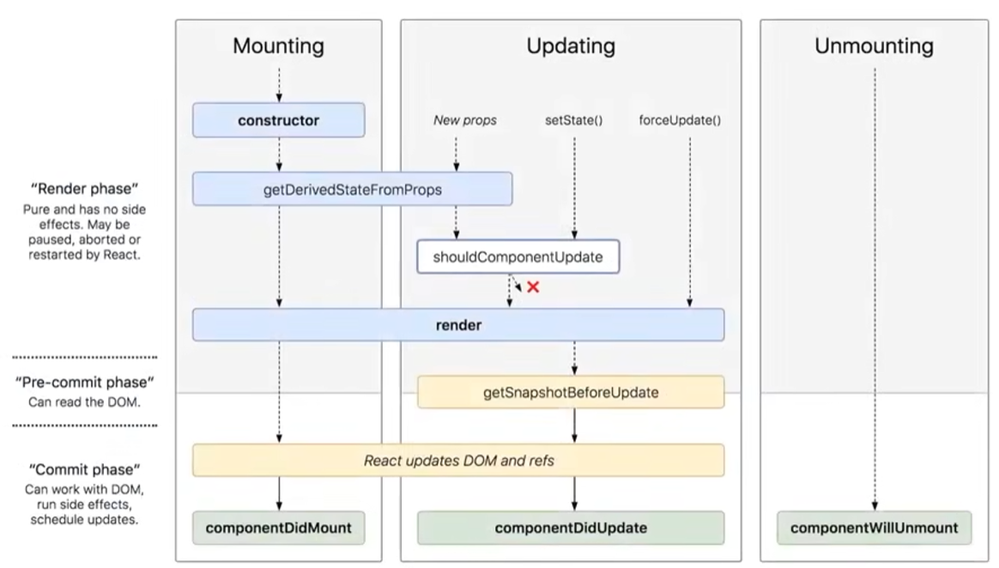

---

star: true
order: 3
category:

  - React

tag:

  - Fiber

---

# React Fiber

## **提出背景**

### **浏览器渲染限制**

#### **浏览器的帧**

页面是一帧一帧绘制出来的，当每秒绘制的帧数（FPS）达到 60 时，页面是流畅的，小于这个值时，用户会感觉到卡顿。


> 上图是一帧内需要完成的任务，浏览器在一帧内可完成如下任务：
>
> - **输入事件捕捉**：
>   - 浏览器首先会接受用户的输入事件，如点击、滚动、触摸等，并准备将其转换为相应的处理逻辑。
>     - Blocking input events（阻塞输入事件）：例如 `touch` 或 `wheel`
>     - Non-blocking input events（非阻塞输入事件）：例如 `click` 或 `keypress`
>
> - **事件回调执行**：
>   - 对于已注册的事件监听器，浏览器会执行相应的事件回调函数，处理用户输入或页面状态的变化。
>
> - **帧开始（Begin frame）**：
>   - 每一帧事件（Per frame events），例如 `window resize`、`scroll` 或 `media query change`
>
> - **样式计算和布局**：
>   - rAF（requestAnimationFrame）
>   - 浏览器会解析和计算CSS样式，确定页面中每个元素的尺寸和位置。这个过程称为布局或重排。
>
> - **绘制渲染（Paint）**：合成更新（Compositing update）、重绘部分节点（Paint invalidation）和 Record
>   - 绘制（渲染）：
>     - 在确定了元素的样式和位置后，浏览器会开始绘制页面。
>     - 这包括将文本、图像和其他内容绘制到屏幕上。绘制操作可能涉及多个层级的渲染，最终合成到屏幕上显示。
>
>   - 合成：
>     - 如果页面使用了硬件加速（如CSS3D转换或WebGL），浏览器会将不同层级的渲染结果合成到一起，形成一个完整的页面图像。
>
> - **空闲回调执行**：如果在一帧的剩余时间内还有空闲时间，并且存在待执行的空闲回调（如RequestIdleCallback），浏览器会尝试执行这些回调。这些回调通常用于执行非关键性的、可延迟的任务。
>
> 浏览器的渲染过程受到设备刷新率的限制。一般来说，设备的刷新率是60Hz，意味着每秒钟有60帧的渲染机会。因此，浏览器需要在大约16.67毫秒（1000毫秒/60帧）内完成上述所有任务，以确保流畅的动画和用户交互。


1. 浏览器的`JavaScript`引擎和页面渲染引擎两个线程是互斥的，当其中一个线程执行时，另一个线程只能挂起等待；如果 `JavaScript` 线程长时间地占用了主线程，那么渲染层面的更新就不得不长时间地等待，界面长时间不更新，会导致页面响应度变差，用户可能会感觉到卡顿。
2. 而浏览器的渲染引擎是单线程的，它将GUI描绘、时间器处理、事件处理、JavaScript执行、远程资源加载等任务放在一起执行。这意味着浏览器在处理某个任务时，必须等待该任务完成后才能开始下一个任务。


#### **React16 之前架构问题**

在React Fiber架构之前，也就是React 16之前的版本，其架构主要可以分为两个部分：Reconciler（协调器）和Renderer（渲染器）。

**原理**：

1. **Reconciler（协调器）**：它的主要任务是找出需要更新的组件。当组件的状态或属性发生变化时，Reconciler会开始工作。它会通过diff算法比较新旧组件树，找出差异，并生成一个更新列表。这个列表包含了所有需要更新的组件以及相应的更新操作。
2. **Renderer（渲染器）**：Renderer的任务是根据Reconciler生成的更新列表来更新DOM。它会遍历更新列表，对每个需要更新的组件执行相应的DOM操作。

React的更新过程采用的是**Stack架构**，也就是循环递归方式，在这个过程中，Reconciler的工作是一个**自顶向下的递归**过程。**一旦开始，它会持续占用主线程，直到所有的组件都更新完毕**。如果在更新过程中遇到大量的计算或复杂的组件树，就可能导致主线程长时间被占用，从而阻塞页面的渲染和其他用户交互。


Fiber架构的引入主要解决了React 16之前版本在性能上的一些主要问题：

1. **长时间阻塞问题**：
   * 在传统的React同步渲染方式下，一旦开始渲染，就会一直执行到渲染完成或遇到I/O操作等阻塞任务。这可能导致页面在渲染过程中长时间处于空白或无响应状态，影响用户体验。
   * Fiber架构通过将渲染过程**拆分成多个小任务**（即fiber），使得React可以**根据优先级和时间片进行任务调度和暂停**。这样，即使某个任务需要很长时间才能完成，也不会阻塞主线程，从而避免了长时间阻塞的问题。
2. **优化用户界面的响应性能**：
   * 由于Fiber架构可以将渲染过程分解为多个小任务，并且可以**根据任务优先级动态调度**，因此能够更好地响应用户的交互操作。
   * 在用户输入或动画等需要即时响应的场景下，Fiber可以优先处理高优先级任务，暂停或中断低优先级任务的执行，从而提高用户界面的响应性能和流畅度。
3. **支持优先级调度**：
   * Fiber架构引入了任务优先级的概念，使得React可以根据任务的优先级来安排任务的执行顺序。这有助于确保关键任务能够优先得到处理，进一步提高应用的性能和用户体验。


## **什么是 Fiber?**

### **可中断的工作单元**

在传统上，React使用一种称为堆栈调和递归算法来处理虚拟DOM的更新。然而，这种方法在大型应用或频繁更新的情况下可能会产生性能问题。

为了解决这个问题，React Fiber引入了增量渲染的思想。它将**更新任务分解成小的、可中断的单元，称为“fiber”**。

因此 Fiber 代表一种 **可中断的工作单元**。

### **类似双向链表的数据结构**

Fiber 的数据结构是一个链表结构，具体来说，它是一个双向链表。每个 Fiber 节点（FiberNode）都包含指向其子节点、兄弟节点以及父节点的指针，这些指针构成了整个 Fiber 链表。


#### **Fiber Node**

Fiber 节点除了包含指向其他节点的指针外，还包含组件的类型、key、状态、属性、输入、输出等信息，以及任务的优先级、开始时间、结束时间、实际执行时间、是否过期、是否中断等任务调度相关的信息。这使得 React 可以方便地追踪组件的状态和变化，并根据需要执行相应的更新操作。


::: normal-demo 演示

```js
{
  // 用于标记fiber的WorkTag类型，主要表示当前fiber代表的组件类型如FunctionComponent、ClassComponent等
  tag: WorkTag,
  // ReactElement里面的key
  key: null | string,
  // ReactElement.type，调用`createElement`的第一个参数
  elementType: any,
  // The resolved function/class/ associated with this fiber.
  // 表示当前代表的节点类型
  type: any,
  // 表示当前FiberNode对应的element组件实例
  stateNode: any,

  // 指向他在Fiber节点树中的`parent`，用来在处理完这个节点之后向上返回
  return: Fiber | null,
  // 指向自己的第一个子节点
  child: Fiber | null,
  // 指向自己的兄弟结构，兄弟节点的return指向同一个父节点
  sibling: Fiber | null,
  index: number,

  ref: null | (((handle: mixed) => void) & { _stringRef: ?string }) | RefObject,

  // 当前处理过程中的组件props对象
  pendingProps: any,
  // 上一次渲染完成之后的props
  memoizedProps: any,

  // 该Fiber对应的组件产生的Update会存放在这个队列里面
  updateQueue: UpdateQueue<any> | null,

  // 上一次渲染的时候的state
  memoizedState: any,

  // 一个列表，存放这个Fiber依赖的context
  firstContextDependency: ContextDependency<mixed> | null,

  mode: TypeOfMode,

  // Effect
  // 用来记录Side Effect
  effectTag: SideEffectTag,

  // 单链表用来快速查找下一个side effect
  nextEffect: Fiber | null,

  // 子树中第一个side effect
  firstEffect: Fiber | null,
  // 子树中最后一个side effect
  lastEffect: Fiber | null,

  // 代表任务在未来的哪个时间点应该被完成，之后版本改名为 lanes
  expirationTime: ExpirationTime,

  // 快速确定子树中是否有不在等待的变化
  childExpirationTime: ExpirationTime,

  // fiber的版本池，即记录fiber更新过程，便于恢复
  alternate: Fiber | null,
}
```

:::


#### **Fiber Tree**

**Fiber Tree 的创建** ：

* React 在首次渲染（执行 `ReactDOM.render`）时，会通过 `React.createElement` 创建一颗 Element 树，可以称之为 **Virtual DOM Tree**
* 由于要记录上下文信息，加入了 Fiber，每一个 Element 会对应一个 Fiber Node；
* 当 React 开始渲染一个组件时，它会创建一个 Fiber 节点作为起点，然后递归地创建子节点的 Fiber 节点，直到遍历完整个组件树，最后形成 Fiber Tree。

* 每一个 Fiber Node 节点与 Virtual Dom 一一对应，所有 Fiber Node 连接起来形成 Fiber Tree, 是个**单链表树结构**，如下图所示：


Fiber Tree 通过节点保存与映射，便能够随时地进行停止和重启，这样便能达到实现 **任务分割** 的基本前提。

 Fiber Tree 反映了用于渲染 UI 的应用程序的状态。这棵树通常被称为 **current 树（当前树，记录当前页面的结构状态）**。


**更新过程 Fiber Tree 变化**：

* 在后续的更新过程中（`setState`），每次重新渲染都会重新创建 Element；
* 但是 Fiber 不会，Fiber 只会使用对应的 Element 中的数据来更新自己必要的属性。

这个过程在 Fiber 出现之前的协调器 （称为 Stack Reconciler）是采取自顶向下递归比较来实现的，所以 **无法中断这个递归比较的过程**（持续占用主线程），这样主线程上的布局、动画等周期性任务以及交互响应就无法立即得到处理，影响用户体验。

在 React v16 将调度算法进行了重构，将之前的 Stack Reconciler 重构成新版的 Fiber Reconciler，变成了具有链表和指针的 **单链表树遍历算法**。通过指针映射，每个单元都记录着遍历当下的上一步与下一步，从而使遍历变得可以被暂停和重启。


**Fiber 数据结构设计的目的**：Fiber 数据结构的设计使得 React 的渲染过程可以中断和恢复。

* 在渲染过程中，如果主线程需要处理其他高优先级的任务或者达到了一定的执行时间，React 可以中断当前的渲染任务，保存当前节点的状态，然后在下次有空闲时间时恢复执行。
* 通过这种方式，Fiber 数据结构使得 React 可以更好地利用主线程的时间片，实现增量渲染和合作式调度，从而提升应用的性能和响应性。同时，由于 Fiber 数据结构是可复用的，React 可以在多个渲染任务之间共享节点，进一步减少内存消耗。


## **Fiber 思想**

Fiber架构的核心思想是**将渲染更新过程拆分成多个子任务**，每次只做一小部分，然后检查是否还有剩余时间：

* 如果有剩余时间，就继续执行下一个任务；
* 如果没有，就挂起当前任务，将时间控制权交回给主线程，等待主线程空闲时再继续执行。

这种策略称为合作式调度（Cooperative Scheduling），它**使得React的渲染过程可以中断和恢复**，从而实现更好的任务调度、优先级管理和增量更新。

**特征：**

- 增量渲染（把渲染任务拆分成块，均匀分布到多帧）
- 更新时能够暂停、终止、复用渲染任务
- 给不同类型的更新赋予优先级
- 并发方面新的基础能力

增量渲染用来解决掉帧的问题，渲染任务拆分之后，每次只做一小段，做完一段就把时间控制权交还给主线程，而不像之前长时间占用。这种策略叫做 `cooperative scheduling`（合作式调度），操作系统的 3 种任务调度策略之一（Firefox 还对真实 DOM 应用了这项技术）。

## **架构**

React的架构主要由三个关键部分组成：调度器（Scheduler）、协调器（Reconciler）和渲染器（Renderer）。

- 调度器（Scheduler）：
  - 这是React架构的新增部分，它在React 16版本中被引入。
  - 主要作用是**管理任务的优先级和调度顺序**。
  - 调度器允许高优先级的任务优先进入协调器进行处理，确保这些任务能够及时得到关注和执行。
- 协调器（Reconciler）：它的主要作用是**通过Diff算法找出哪些组件发生了变化**。
- 渲染器（Renderer）：
  - 其主要职责是**负责将协调器找出的需要更新的组件渲染到视图中**。
  - 在React中，渲染器会将协调器找出的需要更新的组件渲染到视图中。
  - 不同的渲染器可以将组件渲染到不同的宿主环境的视图中，例如React DOM会将组件渲染成HTML，而React Native则会渲染App的原生组件。


## **工作流程**

Fiber 架构的重要特征就是可以被打断的异步渲染模式，根据“能否被打断”这一标准 React 16 的生命周期被划分为了渲染阶段（ render） 和提交阶段（commit ）两个阶段。

提交阶段（commit ）又被细分为 Pre-commit 阶段和 Commit 阶段。

**render 阶段在执行过程中允许被打断，而 commit 阶段则总是同步执行的。**



### **三个阶段**

React的工作流程包括计算阶段、渲染阶段和提交阶段。

**计算阶段**:

* React会根据组件的更新优先级和调度策略，将工作单元分成多个批次进行处理。
* 计算阶段主要关注于创建更新、调度任务、构建Fiber树和识别差异。

**渲染阶段**:

* 纯净且没有副作用，可以被 React 暂停，中断或重新开始。这就导致 render 阶段的生命周期都是有可能被重复执行的。
* React会根据工作单元的类型和优先级，执行相应的渲染操作。
* 渲染阶段重点在于生成EffectList，即收集并准备需要应用到DOM的更改。

**提交阶段**:

* 提交阶段（commit ）又被细分为 Pre-commit 阶段和 Commit 阶段。
* **Pre-commit 阶段**：可以读取 DOM;
*  **Commit 阶段**：
  * 可以操作 DOM，运行副作用和更新队列；
  *  React会将更新后的虚拟DOM节点映射到实际的DOM，更新用户界面。


### **大致工作步骤**

React Fiber 的工作流程可以大致分为以下几个步骤：

1. **任务生成与拆分**：当组件的状态或属性发生变化时，React 会开始生成更新任务。与传统的 React 递归更新方式不同，Fiber 将这些更新任务拆分成多个小单元，每个单元对应一个 Fiber 节点。这些 Fiber 节点组成了一个任务队列，每个节点都代表了虚拟 DOM 树上的一个节点。
2. **优先级调度**：React 使用调度器来处理这些任务的优先级。调度器会根据任务的优先级、浏览器的空闲时间以及其他因素来决定任务的执行顺序。高优先级的任务会优先得到执行，而低优先级的任务则可能在浏览器空闲时执行，或者被更高优先级的任务中断。
3. **执行与中断**：当浏览器空闲时，React 会从任务队列中取出任务并执行。每个任务都是一个小的执行单元，它可能只更新虚拟 DOM 树的一小部分。在执行过程中，如果浏览器需要处理其他高优先级任务，React 会中断当前的执行，待浏览器空闲时再继续执行。这种中断和恢复的特性使得 React 能够更好地响应用户的操作，保持页面的流畅性。
4. **协调与渲染**：在执行任务的过程中，React 的协调器会负责处理组件更新的逻辑，包括构建 Fiber 树、执行更新、生成副作用等。当所有的任务都执行完毕后，React 会将更新应用到实际的 DOM 上，完成渲染过程。

这个流程是循环进行的，React 会不断地从任务队列中取出任务并执行，直到所有的任务都完成。同时，React 也会根据浏览器的空闲时间和任务的优先级来动态调整任务的执行顺序，以达到最优的性能和响应性。


### **详细步骤**

从 JSX 代码到 `ReactDOM.render` 方法，再到渲染出虚拟 DOM，并最终渲染到真实 DOM 的整个过程，结合 React Fiber 的计算阶段、渲染阶段和提交阶段，详细流程如下：

#### 1. JSX 转换与 `ReactDOM.render` 调用

1. **JSX 转换**：
   * 在编写 React 组件时，我们通常会使用 JSX 语法，它允许我们像写 HTML 一样写组件结构。
   * 浏览器并不能直接理解 JSX，所以在构建过程中，JSX 会被 Babel 等工具转换成纯 JavaScript 代码，通常是使用 `React.createElement` 方法来创建 React 元素。
2. **ReactDOM.render 调用**：
   * 在应用的入口点，我们会调用 `ReactDOM.render` 方法，将根组件传递给这个方法，并指定一个 DOM 元素作为挂载点。`ReactDOM.render` 方法会启动 React 的整个渲染流程。

#### 2. 计算阶段（Reconciliation）

**构建 Fiber 树**：

1. **任务生成与拆分**：
   * React 会开始调度过程，创建根 Fiber 节点，并根据根组件生成对应的 Fiber 树。
   * 每个 Fiber 节点都包含了组件的类型、属性、状态等信息，以及指向其子节点和父节点的指针。
   * 这些 Fiber 节点组成了一个任务队列，每个节点都代表了虚拟 DOM 树上的一个节点。
2. **比较与差异检测**：
   * 当组件的状态或属性发生变化时，React 开始进入计算阶段。
   * React 会使用一种称为“协调”的过程,使用**协调器（Reconciler）来比较新的 Fiber 树与旧的 Fiber 树**（如果存在的话）。
   * 这个过程中，React 会识别出哪些部分发生了改变，哪些部分保持不变，从而确定需要执行哪些更新。
3. **优先级调度**：
   * **React 使用调度器（Scheduler）来确定任务的执行顺序**。
   * 调度器会根据任务的优先级、浏览器的空闲时间以及其他因素来决定任务的执行顺序。
   * 高优先级的更新（如用户交互引起的更新）会优先执行，而低优先级的更新（如数据获取后的更新）可能会被延迟。

#### 3. 渲染阶段（Render）

**生成副作用列表**：

1. **生成新的 Fiber 树**：在渲染阶段，React 会根据计算阶段的结果生成一棵新的 Fiber 树。这棵新树反映了组件的新状态。

2. **生成副作用列表**：

   * 在构建新树的过程中，React 会识别出需要应用到真实 DOM 上的更改，并将这些更改作为“副作用”记录下来。这些副作用可能包括添加、更新或删除 DOM 元素。

   * 副作用列表 (Effect List) 可以理解为是一个存储 `effectTag` 副作用列表容器。它是由 Fiber 节点和指针 `nextEffect` 构成的**单链表结构**，这其中还包括第一个节点 `firstEffect`，和最后一个节点 `lastEffect`。如下图所示：

     

     React 采用深度优先搜索算法，在 `render` 阶段遍历 Fiber 树时，把每一个有副作用的 Fiber 筛选出来，最后构建生成一个只带副作用的 Effect List 链表。

3. **中断与恢复**：渲染阶段是可中断的。如果浏览器需要处理其他高优先级任务，React 会中断当前的渲染过程，并在浏览器空闲时恢复执行。

#### 4. 提交阶段（Commit）

**将虚拟 DOM 渲染到真实 DOM**：

1. **应用副作用列表**：
   * 在提交阶段，React 会遍历副作用列表，并依次执行每个副作用。这通常包括创建、更新或删除 DOM 元素，从而将虚拟 DOM 的更改应用到真实的 DOM 上。
2. **屏幕更新**：一旦所有的副作用都被执行完毕，浏览器就会重新渲染页面，用户会看到更新后的内容。
3. **清理工作**：提交阶段结束后，React 会进行一些清理工作，比如释放不再需要的 Fiber 节点和内存资源，为下一次的更新做好准备。

#### 5. 循环更新

这个过程是循环进行的。每当组件的状态或属性发生变化时，React 都会从计算阶段开始，重新构建 Fiber 树，生成新的虚拟 DOM，并最终将更改应用到真实的 DOM 上。同时，React 会根据任务的优先级和浏览器的空闲时间来动态调整执行顺序，以确保应用的响应性和性能。

通过这个流程，React 能够在保持高性能的同时，灵活地处理各种复杂的组件更新场景。Fiber 架构的引入使得 React 能够更好地利用浏览器的空闲时间，并在需要时中断和恢复更新过程，从而提高了应用的响应性和用户体验。
