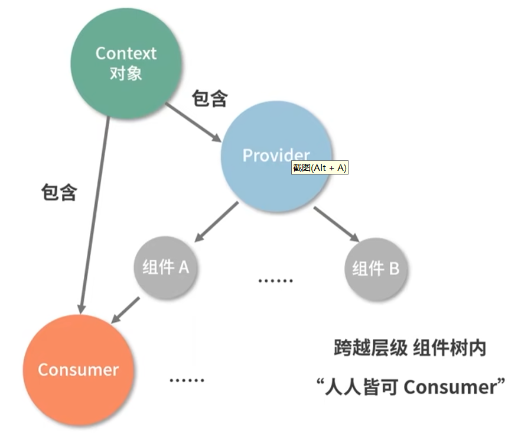

# React

> 官方文档：[React 官方中文文档 (docschina.org)](https://react.docschina.org/)

## **大纲**


| 内容                                     | 库/框架                                                      |                                                              |
| :--------------------------------------- | :----------------------------------------------------------- | :----------------------------------------------------------- |
| [**基础**](https://react.docschina.org/) |                                                              |                                                              |
| **核心API： 22种 Hooks**                 |                                                              |                                                              |
| **数据状态管理**                         | **Redux**                                                    |                                                              |
| **路由**                                 | React-Router                                                 |                                                              |
| **UI框架**                               | Ant Design                                                   |                                                              |
| **企业级前端应用框架**                   | [**Umijs**](https://umijs.org/)                              | 采用约定式路由，并配备了一套完善的插件体系                   |
|                                          | [Hooks-Admin](https://baimingxuan.github.io/react-router6-doc/start/overview) | 基于 React18、React-Router v6、React-Hooks、Redux && Redux-Toolkit、TypeScript、Vite2、Ant-Design 开源的一套后台管理框架 |

---


## **基础概念**


|         概念          | 说明                                                         |
| :-------------------: | :----------------------------------------------------------- |
| **组件（Component）** | React的基本构建块，用于表示UI的某一部分。可以是**函数或类**，接受输入（props）并返回React元素树。 |
|        **JSX**        | JavaScript的语法扩展，用于描述UI的外观。看起来像HTML，但在编译时转换为React元素。 |
|       **Props**       | Properties的缩写，用于**父组件向子组件传递数据**。子组件通过`this.props`（类组件）或函数参数（函数组件）接收props。 |
|       **State**       | **组件的私有数据，只能由该组件自己修改**。通过`this.state`（类组件）或`useState` Hook（函数组件）管理。 |
|     **事件处理**      | React组件可以像DOM元素一样处理事件，如点击、输入等。事件处理函数通常作为props传递给组件。 |
|   **生命周期方法**    | 类组件中的特殊方法，用于**在组件的不同阶段执行代码**。如`componentDidMount`、`componentDidUpdate`和`componentWillUnmount`。函数组件使用Hooks处理类似逻辑。 |
|       **Hooks**       | React 16.8引入的新特性，**允许在不编写class的情况下使用state以及其他的React特性**。如`useState`、`useEffect`和`useContext`等。 |
|      **Context**      | **允许无需显式地通过每一层组件传递props，就能将值深入组件树**。通过`React.createContext`创建，并通过`<Context.Provider>`和`useContext` Hook使用。 |
|       **Refs**        | 提供了一种方式，**用于访问DOM节点或在render方法中创建的React元素**。常用于管理焦点、文本选择或媒体播放。 |
|      **虚拟DOM**      | React的一个核心概念，**React使用虚拟DOM来比较和更新实际的DOM**。这提高了性能，因为React只更新需要变化的部分。 |
| **渲染（Rendering）** | React将组件转换为DOM标记的过程，这个过程包括创建虚拟DOM树并比较它与之前的版本，然后更新实际的DOM。 |
|  **Reconciliation**   | React的“reconciliation”算法是React用于确定哪些组件需要更新，哪些可以保持不变的过程。这是React性能优化的关键部分。 |

---

## 

## 特点

**1.声明式设计** −React采用声明范式：采用一种描述性的方式来定义组件的状态和外观，而不是直接操作DOM来更新界面。

> 在声明式设计中，开发者主要关注组件的当前状态，以及状态变化时应该呈现的界面。React会自动处理这些状态变化，并高效地更新DOM，以反映新的界面状态。这种方式使得代码更加直观、易于理解和维护。
>
> 与命令式编程（如使用jQuery或DOM事件直接操作DOM）相比，声明式设计更加关注结果而不是过程。在命令式编程中，开发者需要明确地告诉浏览器每一步应该做什么，而在声明式设计中，开发者只需要描述出最终的状态，React会自动完成中间的转换过程。

**2.高效** −React通过对VDOM，最大限度地减少与DOM的交互。

**4.JSX** − JSX 是 JavaScript 语法的扩展。

**5.组件** − 通过 React 构建组件，使得代码更加容易得到复用，能够很好的应用在大项目的开发中。

**6.单向响应的数据流** − React 实现了单向响应的数据流，从而减少了重复代码，这也是它为什么比传统数据绑定更简单。

> 在 React 中，数据主要沿一个方向流动，从父组件流向子组件。
>
> 当父组件的状态（state）发生变化时，它会将新的状态传递给子组件。
>
> 子组件接收到新的属性（props）后，会根据这些属性来渲染界面。在这个过程中，子组件不能直接修改父组件的状态，而是需要通过某种方式（如回调函数）通知父组件进行状态更新。

---


## **组件**

### **组件定义**

React 组件定义有两种类型：类组件和函数组件。

React定义组件主要有三种方式：

1. **无状态函数式组件**：这种组件是为了创建纯展示组件，只负责根据传入的props来展示，不涉及到state状态的操作。它没有实例，整体渲染性能得到提升，因此不能访问this对象，也不能使用生命周期的方法。语法上，它就是一个简单的JavaScript函数，接受props作为参数，并返回React元素。
2. **React.createClass定义的组件**：这是ES5的方式定义组件。它会自动绑定成员函数中的this，但可能会导致不必要的性能开销，并增加代码过时的可能性。现在这种方式已经较少使用。
3. **React.Component定义的组件**：这是ES6形式的组件定义方式，通过继承React.Component类来创建组件。它允许你使用更多的React特性，如state和生命周期方法。需要注意的是，与React.createClass不同，React.Component创建的组件需要手动绑定成员函数中的this，否则this不能获取当前组件实例对象。

#### 类组件（Class Components）

类组件是面向对象编程思想的一种表征。

类组件特性：

- **封装**: 将一类属性和方法，“聚拢”到一个 Class 里
- **继承**: 新的 Class 可以通过继承现有 Class实现对某一类属性和方法的复用

类组件是使用ES6的类语法定义的React组件。

它们**具有更完整的生命周期方法**，包括组件挂载、更新和卸载等各个阶段的方法。

类组件也支持状态（state）和事件处理。

**特征：**

1. **状态管理**：类组件有自己的状态（state），可以**通过`this.state`访问和修改**。状态的变化会触发组件的重新渲染。
2. **生命周期方法**：类组件包含一系列生命周期方法，如`componentDidMount`、`componentDidUpdate`和`componentWillUnmount`等，用于在组件的不同阶段执行特定的操作。
3. **事件处理**：类组件可以定义事件处理函数，通过绑定到DOM元素的事件来响应用户交互。
4. **引用（Refs）**：类组件可以使用`createRef`或`React.forwardRef`来创建和使用refs，从而直接访问DOM元素或子组件。

```jsx
class MyClassComponent extends React.Component {   
  constructor(props) {  //初始化组件的状态和绑定事件处理函数
    super(props);  //通过`super`关键字获取来自父组件的`props`
    this.state = {  
      // 使用props来初始化状态（如果需要的话）  
      value: props.initialValue,  
    };  
    this.handleClick = this.handleClick.bind(this); //在`this`上挂载方法
  }  
  
  render() {  
    return <div>{this.state.value}</div>;  
  }  
}
```

>  在这个例子中，`MyClassComponent`是一个类组件。它有一个构造函数，用于初始化组件的状态。状态是一个对象，可以包含组件需要的数据。`render`方法返回组件的JSX，即要渲染的UI。此外，类组件还有生命周期方法，如`componentDidMount`、`componentDidUpdate`等，这些方法在组件的不同生命周期阶段被自动调用。


#### 函数组件（Function Components）

函数组件是使用普通JavaScript函数定义的React组件。

函数组件更加轻量，没有内置的状态和生命周期方法，但可以通过Hooks来添加这些功能。

**特征：**

1. **无状态**：函数组件本身没有状态，但可以通过Hooks（如`useState`）来添加状态。
2. **Hooks**：函数组件可以使用Hooks来访问React的特性，如状态、生命周期、上下文等，而无需编写类。
3. **简单性**：函数组件的语法更加简洁，易于理解和维护。
4. **性能**：由于函数组件没有类的开销，它们在性能上可能略优于类组件。

```jsx
import React, { useState, useEffect } from 'react';  
  
function MyFunctionComponent() {  
  const [message, setMessage] = useState('Hello from Function Component');  
  
  useEffect(() => {  
    console.log('Component mounted');  
  }, []);  
  
  return <div>{message}</div>;  
}
```

>  在这个例子中，`MyFunctionComponent`是一个函数组件。它使用`useState` Hook来添加一个状态变量`message`，并通过`setMessage`函数来更新这个状态。当状态发生变化时，组件会重新渲染。此外，它还使用`useEffect` Hook来模拟类组件的生命周期方法，这里用于在组件挂载时打印一条消息。


#### 类组件与函数组件的对比

|                  | 类组件                                            | 函数组件                                 |
| :--------------: | :------------------------------------------------ | :--------------------------------------- |
|   **定义方式**   | 使用ES6的类语法                                   | 使用普通JavaScript函数                   |
|   **状态管理**   | 内置状态管理，通过`this.state`访问和修改          | 通过`useState` Hook添加状态              |
| **生命周期方法** | 完整的生命周期方法，如`componentDidMount`等       | 通过Hooks（如`useEffect`）模拟生命周期   |
|   **事件处理**   | 定义事件处理函数，通过`this`绑定到组件实例        | 定义事件处理函数，作为组件函数的参数传递 |
| **引用（Refs）** | 使用`createRef`或`React.forwardRef`创建和使用refs | 通过`useRef` Hook创建和使用refs          |
|    **复杂性**    | 相对复杂，需要处理类的继承、this绑定等问题        | 简单直观，易于理解和维护                 |
|     **性能**     | 可能略逊于函数组件，因为有类的开销                | 性能较好，没有类的开销                   |

* 类组件提供了更完整的生命周期方法和状态管理，适用于复杂的组件逻辑；

* 而函数组件则更加轻量、简单，并且随着Hooks的引入，其功能得到了极大的增强。

* 类组件需要继承 class，函数组件不需要；

* 类组件可以访问生命周期方法，函数组件不能；

* 类组件中可以获取到实例化后的 this，并基于这个 this 做各种各样的事情，而函数组件不可以；

* 类组件中可以定义并维护 state(状态)，而函数组件不可以；

* 函数组件会捕获 render内部的状态，这是两类组件最大的不同；函数组件真正地把数据和渲染绑定到了一起；


### **注意事项**

> **不能把组件函数的定义嵌套起来**

React 组件为函数，每次渲染组件时，就是重新调用一次函数，如果将组件函数的定义嵌套起来，将导致定义被嵌套组件的状态无法控制（每次外层组件渲染时，被嵌套组件函数重新被执行渲染，状态重置）

示例参考官网：[对 state 进行保留和重置 – React 中文文档 (docschina.org)](https://react.docschina.org/learn/preserving-and-resetting-state#different-components-at-the-same-position-reset-state)

> **组件名字总是以大写字母开头**

> **组件返回 JSX 标签**

> **一个组件必须是纯粹的**

- **只负责自己的任务。** 它不会更改在该函数调用前就已存在的对象或变量。
- **输入相同，则输出相同。** 给定相同的输入，组件应该总是返回相同的 JSX。

>  组件不应依赖于彼此的渲染顺序,渲染随时可能发生。

> **不应该改变任何用于组件渲染的输入**。这包括 props、state 和 context。通过 [“设置” state](https://react.docschina.org/learn/state-a-components-memory) 来更新界面，而不要改变预先存在的对象。

> **列表渲染时为每个组件设置一个 `key` 值**：它使 React 能追踪这些组件，即便后者的位置或数据发生了变化

---

## **受控组件和非受控组件**

在React中，表单元素的行为主要分为两种类型：受控组件（Controlled Components）和非受控组件（Uncontrolled Components）。

### **受控组件**

受控组件是指其值（如输入框的值）由React的状态（state）来控制并更新的组件：

* 在受控组件中，组件的值与状态之间保持同步：当用户输入或选择某个值时，会触发相应的事件处理函数来更新组件的状态，从而重新渲染组件。
* 受控组件必须提供一个事件处理函数来管理值的变化。
* 受控组件的优点是可以精确控制表单元素的值和行为，并且能够对值进行验证和处理。

**示例**

在受控组件中，我们将使用React的state来管理表单元素的值。在函数组件中，我们可以使用React的`useState` Hook来创建和管理状态。

```jsx
import React, { useState } from 'react';  
  
function ControlledComponent() {  
  const [inputValue, setInputValue] = useState('');  
  
  const handleChange = (event) => {  
    setInputValue(event.target.value);  
  };  
  
  return (  
    <div>  
      <input type="text" value={inputValue} onChange={handleChange} />  
      <p>你输入的内容是: {inputValue}</p>  
    </div>  
  );  
}  
  
export default ControlledComponent;
```

>  在这个例子中，`input`元素的值通过`useState` Hook创建的状态`inputValue`来控制。
>
> 当用户在输入框中输入文本时，`handleChange`函数会被调用，并通过`setInputValue`更新状态。这会导致组件重新渲染，输入框的值也会更新为新的状态值。

### **非受控组件**

非受控组件则是指其值不受React状态控制的组件：

* 在非受控组件中，表单元素的值通常由DOM自身维护，并通过对DOM进行引用来获取表单元素的值。通常是通过ref属性获取DOM元素的引用。
* 非受控组件的优点是简单易用，在处理简单的表单场景时可以减少代码量。它适用于一些简单的场景，不需要对表单数据进行额外处理的情况。

**示例**

非受控组件在函数组件中通常使用`useRef` Hook来获取对DOM元素的引用，而不是使用状态来管理值。

```jsx
import React, { useRef } from 'react';  
  
function UncontrolledComponent() {  
  const inputRef = useRef(null);  
  
  const handleSubmit = (event) => {  
    event.preventDefault();  
    alert('你输入的内容是: ' + inputRef.current.value);  
  };  
  
  return (  
    <form onSubmit={handleSubmit}>  
      <input type="text" ref={inputRef} />  
      <button type="submit">提交</button>  
    </form>  
  );  
}  
  
export default UncontrolledComponent;
```

> 在这个例子中，我们使用`useRef`创建了一个`ref`对象，并将其附加到`input`元素上。通过`inputRef.current`，我们可以访问到实际的DOM节点，并读取其值。当用户点击提交按钮时，我们直接通过`inputRef.current.value`获取输入框的值，而不需要通过状态来管理它。

非受控组件在React函数组件中相对较少使用，因为它们的值不由React状态控制，这可能导致数据流不清晰。然而，在某些情况下，如与第三方库集成或需要直接操作DOM时，非受控组件可能是必要的。

### **区别**

受控组件和非受控组件的主要区别在于表单元素的值是由React状态控制还是由DOM自身维护。

|     对比项     | 受控组件 (Controlled Components)                             | 非受控组件 (Uncontrolled Components)                  |
| :------------: | :----------------------------------------------------------- | :---------------------------------------------------- |
|   **值管理**   | 值由React状态控制                                            | 值由DOM自身维护                                       |
|  **状态管理**  | 使用React状态（如`useState`）来管理值                        | 不使用React状态来管理值                               |
|   **数据流**   | 清晰、明确的数据流                                           | 数据流可能不清晰，直接操作DOM                         |
|  **事件处理**  | 需要编写事件处理函数来更新状态                               | 无需编写事件处理函数来更新状态                        |
| **验证和处理** | 可以方便地对值进行验证和处理                                 | 值验证和处理可能较复杂，通常需要在表单提交时处理      |
|    **性能**    | 可能需要更多的计算和渲染，因为每次值改变都会触发状态更新和组件重渲染 | 性能可能稍好，因为不涉及到React状态的更新和组件重渲染 |
|  **适用场景**  | 复杂表单、需要验证和处理表单数据                             | 简单表单、无需额外处理表单数据、与第三方库集成        |
|  **推荐程度**  | 推荐用于复杂表单和需要精确控制表单元素值的情况               | 在简单表单或特定场景下使用，通常不是首选              |


## **JSX**

```react
ReactDOM.render(
    <div>
	<h1>JSX教程</h1>
	<h2>欢迎学习 React</h2>
        <p data-myattribute = "somevalue">react jsx</p>
    </div>,
    document.getElementById('example')
);
```

### React JSX 本质是什么,它和 JS 之间是什么关系

React JSX（JavaScript XML）是一种 JavaScript 的语法扩展，它允许你在 JavaScript 代码中写类似 HTML 的代码。

JSX 本质上是一种结构化的语法，用于描述 UI 组件的树形结构。

它不是真正的 HTML，而是一种标记语言，可以被转换成相应的 JavaScript 代码。

### JSX 和 JS 的关系

1. **语法糖**：
   - JSX 可以被看作是 JavaScript 的一种语法糖，它提供了一种更加直观和声明式的方式来表达 UI。
   - 尽管 JSX 看起来像是在 JavaScript 代码中混合了 HTML，但它最终会被转换成纯 JavaScript 代码，因此可以在任何支持 JavaScript 的环境中运行。
2. **转换过程**：
   - 在构建过程中，React 会使用 JSX 转换器（通常是一个 Babel 插件）将 JSX 代码转换成相应的 JavaScript 函数调用。
   - 这些函数调用会创建 JavaScript 对象，这些对象代表了 UI 的结构，即虚拟 DOM。
3. **组件描述**：
   - 使用 JSX，开发者可以定义组件的界面结构，包括元素类型、属性和子元素。
   - JSX 表达式可以包含 JavaScript 表达式，例如变量、函数调用和条件语句，这使得 UI 的动态创建成为可能。
4. **虚拟 DOM**：
   - JSX 描述的 UI 结构会被用来构建虚拟 DOM，这是 React 性能优化策略的核心。
   - 虚拟 DOM 是一种轻量级的 JavaScript 对象，它代表了真实 DOM 的状态。React 使用虚拟 DOM 来计算最小的更新操作，然后高效地更新到真实 DOM。
5. **声明式编程**：
   - JSX 使得开发者能够以声明式的方式编写 UI 代码，即描述“UI 应该是什么样”，而不是“如何让 UI 变成这样”。
   - 这种编程范式简化了 UI 的管理和更新，因为状态变化时，React 会自动处理 UI 的更新。
6. **集成性**：
   - JSX 可以与 JavaScript 代码无缝集成，使得逻辑和 UI 可以紧密地结合在一起。
   - 这种集成性是 React 组件模型的一部分，它允许开发者将 UI 和与之相关的逻辑封装在单个组件中。

###  JSX 和 React 运行机制之间的联系

1. **虚拟 DOM 的创建**：
   - JSX 使得开发者能够以一种直观的方式描述 UI。
   - 当 React 应用运行时，JSX 会被转换成对应的 JavaScript 对象，这些对象构成了虚拟 DOM 的基础。
   - 虚拟 DOM 是一个轻量级的 DOM 树表示，它允许 React 高效地更新 UI。
2. **组件化结构**：
   - JSX 支持组件化的开发方式，允许开发者将 UI 划分为独立的、可复用的组件。
   - React 的运行机制利用这些组件来构建虚拟 DOM，并且在状态或属性变化时，只更新变化的部分，而不是重新渲染整个应用。
3. **声明式编程**：
   - JSX 采用声明式语法，开发者只需描述 UI 的最终状态，而不是如何达到这个状态。
   - React 的运行机制通过 Diff 算法计算出新旧虚拟 DOM 之间的差异，并应用最小的更新操作到真实 DOM，从而实现高效的 UI 更新。
4. **响应式更新**：
   - JSX 中的 JavaScript 表达式可以动态地插入数据和逻辑，使得 UI 能够响应数据的变化。
   - React 的运行机制通过监听状态和属性的变化，触发组件的重新渲染，确保 UI 总是反映当前的状态。
5. **性能优化**：
   - JSX 允许开发者编写高性能的 UI 代码，因为它支持元素的复用和条件渲染。
   - React 的运行机制通过虚拟 DOM 和组件的生命周期方法来优化性能，例如，使用 `shouldComponentUpdate` 来避免不必要的渲染。
6. **跨平台渲染**：
   - JSX 语法不依赖于特定的平台，使得 React 能够在不同的环境下运行，如 Web、iOS、Android 等。
   - React 的运行机制支持跨平台渲染，通过特定的平台适配器（如 `react-dom`、`react-native`）来将虚拟 DOM 映射到不同平台上的真实 DOM。

总结来说，JSX 是 React 运行机制的一部分，它提供了一种直观的方式来描述 UI，而 React 的运行机制则负责将这些描述转换为实际的 UI 并进行高效的更新。

JSX 和 React 运行机制共同构成了 React 框架的核心，使得开发者能够以一种简单、高效且可预测的方式来构建复杂的用户界面。


### **JSX 规则**

* 只能返回一个根元素 

* 标签必须闭合

* 驼峰式命名属性
* 组件的名称大写，以区分它们与普通的 HTML 标签
* 在 JSX 中，用单括号`{}` 解析表达式值，属性（attributes）使用双引号，而不是单引号
* 浏览器不能直接理解 JSX，需要使用 Babel 将 JSX 转换为纯 JavaScript。通过配置构建工具（如 Webpack）实现。

详细解释参考文档：[使用 JSX 书写标签语言 – React 中文文档 (docschina.org)](https://react.docschina.org/learn/writing-markup-with-jsx)

### **渲染子组件 (类似 Slot)**

**将 JSX 作为子组件传递**：

当您将内容嵌套在 JSX 标签中时，父组件将在名为 `children` 的 prop 中接收到子组件内容。

```react
import React from 'react';  
  
function ParentComponent({ children }) {  
  return (  
    <div>  
      <h1>我是父组件</h1>  
      {children} {/* 直接渲染props中的子组件 */}  
    </div>  
  );  
}  
  
// 使用时  
function App() {  
  return (  
    <ParentComponent>  
      <p>我是子组件1</p>  
      <p>我是子组件2</p>  
    </ParentComponent>  
  );  
}
```

**参考资料**

[React JSX_w3cschool](https://www.w3cschool.cn/react/react-jsx.html)

[使用 JSX 书写标签语言 – React 中文文档 (docschina.org)](https://react.docschina.org/learn/writing-markup-with-jsx)

---


## **Prop**

**单向数据流**

当前组件的 state 以 props 的形式流动时，只能流向组件树中比自己层级更低的组件

**摘要：**

- 要传递 props，请将它们添加到 JSX，就像使用 HTML 属性一样。
- 要读取 props，请使用 `function Avatar({ person, size })` 解构语法。
- 你可以指定一个默认值，如 `size = 100`，用于缺少值或值为 `undefined` 的 props 。
- 你可以使用 `<Avatar {...props} />` JSX 展开语法转发所有 props，但不要过度使用它！
- 像 `<Card><Avatar /></Card>` 这样的嵌套 JSX，将被视为 `Card` 组件的 `children` prop。
- Props 是只读的时间快照：每次渲染都会收到新版本的 props。
- 你不能改变 props。当你需要交互性时，你可以设置 state。

> 详细解释参考官网： [将 Props 传递给组件 – React 中文文档 (docschina.org)](https://react.docschina.org/learn/passing-props-to-a-component#)

### **组件通信**

在React中，组件间的通信主要通过props和回调函数实现：父组件通过props将数据或函数传递给子组件，子组件则可以通过这些props来接收数据和触发回调函数，从而实现与父组件的通信。

对于跨层级的组件通信，React提供了Context API。Context提供了一种在组件树中共享值的方式，无需显式地通过每一层组件传递props。

---


## **state**

在 React 中，`state` 是**组件内部用于存储可变数据的一种对象**。

这个对象可以在组件的生命周期内被修改，并且**每次修改都会触发组件的重新渲染**。

`state` 是 React 组件响应式特性的基础，它使得组件能够根据内部状态的变化来更新其 UI。

### **特点**

1. **局部性**：`state` 是组件私有的，只能在该组件内部访问和修改。如果你在两个地方渲染它，则每个副本都有独属于自己的 state。
2. **不可变性**：`state` 的更新应该总是创建一个新的状态对象，而不是直接修改当前状态，通过`setState` 方法重新创建。
3. **触发渲染**：**当 `state` 发生变化时，React 会自动重新渲染该组件及其子组件**。
4. **异步更新**：在React中，**`setState`的调用是异步的，它不会立即更新组件的状态**。React 把一系列 state 更新加入队列 ，并在在事件循环的下一个迭代应用。
5. **状态独立**：React 将 state 存储在组件之外，状态是独立于组件的，但可以通过组件来访问和修改。
   * 实际上每次组件在渲染时候，都会调用组件函数，并返回 JSX 模板。**组件内 state 每次渲染时不会重置**，因为 state 保存在 React 的队列中，每次渲染时会从队列中获取下次渲染的 state 值。注意**组件内定义的变量每次渲染时会重新定义**。

### **类组件中使用 `state`**

在类组件中，`state` 是通过类的构造函数来初始化的，并使用 `this.setState` 方法来更新：

* 在构造函数中定义 `state`;
* 通过 `this.setState` 更新状态；

```jsx
class MyComponent extends React.Component {  
  constructor(props) {  
    super(props);  
    this.state = {  //在构造函数中定义 `state`
      count: 0  
    };  
  }  
  
  handleClick = () => {  
    // 通过 `this.setState` 更新状态；
    this.setState(prevState => ({  
      count: prevState.count + 1  
    }));  
  }  
  
  render() {  
    return (  
      <div>  
        <p>You clicked {this.state.count} times</p>  
        <button onClick={this.handleClick}>Click me</button>  
      </div>  
    );  
  }  
}
```

在上面的例子中，我们定义了一个名为 `MyComponent` 的类组件，并在构造函数中初始化了 `state` 对象。然后，在 `handleClick` 方法中，我们使用 `this.setState` 来更新 `count` 的值。

### **函数组件中使用 `state`**

使用 React 的 `useState` Hook 来在函数组件中添加状态,`useState` Hook 返回一对值，当前 state 和更新它的函数:

```js
 const [count, setCount] = useState(0);
```

使用示例：

```jsx
import React, { useState } from 'react';  
  
function MyFunctionComponent() {  
  const [count, setCount] = useState(0);  
  
  const handleClick = () => {  
    setCount(count + 1);  
  };  
  
  return (  
    <div>  
      <p>You clicked {count} times</p>  
      <button onClick={handleClick}>Click me</button>  
    </div>  
  );  
}
```

在这个函数组件的例子中，我们使用 `useState` Hook 来初始化一个名为 `count` 的状态变量和一个用于更新该状态的函数 `setCount`。然后，在 `handleClick` 函数中，我们使用 `setCount` 来更新 `count` 的值。

需要注意的是，`useState` 是 React Hooks 的一部分，只能在函数组件的顶层调用，并且不能在类组件中使用。Hooks 的引入使得函数组件能够拥有类似类组件的状态管理功能，同时保持了函数组件的简洁和可重用性。

### **更新 state 中对象**

在 React 中，如果你想要更新 state 中的对象，你需要**创建一个新的对象，并将需要更新的属性添加到这个新对象中，然后使用 `setState` 方法来更新整个对象**。

**直接修改 state 中的对象不会触发 React 的重新渲染机制**。


**摘要**

- 将 React 中所有的 state 都视为不可直接修改的。
- 当你在 state 中存放对象时，直接修改对象并不会触发重渲染，并会改变前一次渲染“快照”中 state 的值。
- 不要直接修改一个对象，而要为它创建一个 **新** 版本，并通过把 state 设置成这个新版本来触发重新渲染。
- 你可以使用这样的 `{...obj, something: 'newValue'}` 对象展开语法来创建对象的拷贝。
- 对象的展开语法是浅层的：它的复制深度只有一层。
- 想要更新嵌套对象，你需要从你更新的位置开始自底向上为每一层都创建新的拷贝。
- 想要减少重复的拷贝代码，可以使用 Immer。

> 参考 官方文档：[更新 state 中的对象 – React 中文文档 (docschina.org)](https://react.docschina.org/learn/updating-objects-in-state)


类组件更新state中对象：

```react
import React, { Component } from 'react';  
  
class MyComponent extends Component {  
  constructor(props) {  
    super(props);  
    this.state = {  
      person: {  
        name: 'Alice',  
        age: 30,  
        address: {  
          street: '123 Main St',  
          city: 'Anytown',  
          state: 'CA'  
        }  
      }  
    };  
  
    this.updateName = this.updateName.bind(this);  
    this.updateAge = this.updateAge.bind(this);  
  }  
  
  updateName(newName) {  
    // 创建一个新的 person 对象，并更新 name 属性  
    this.setState(prevState => ({  
      person: {  
        ...prevState.person, // 复制旧的对象  
        name: newName // 更新 name 属性  
      }  
    }));  
  }  
  
  updateAge(newAge) {  
    this.setState(prevState => ({  
      person: {  
        ...prevState.person,  
        age: newAge  
      }  
    }));  
  }  
  
  render() {  
    const { name, age } = this.state.person;  
    return (  
      <div>  
        <p>Name: {name}</p>  
        <p>Age: {age}</p>  
        <button onClick={() => this.updateName('Bob')}>Update Name to Bob</button>  
        <button onClick={() => this.updateAge(31)}>Update Age to 31</button>  
      </div>  
    );  
  }  
}  
  
export default MyComponent;
```


**函数组件更新state中对象：**

```react
import { useState } from 'react';

export default function Form() {
  const [person, setPerson] = useState({
    name: 'Niki de Saint Phalle',
    artwork: {
      title: 'Blue Nana',
      city: 'Hamburg',
      image: 'https://i.imgur.com/Sd1AgUOm.jpg',
    }
  });

  function handleNameChange(e) {
    setPerson({
      ...person,
      name: e.target.value
    });
  }

  function handleTitleChange(e) {
    setPerson({
      ...person,
      artwork: {
        ...person.artwork,
        title: e.target.value
      }
    });
  }

  function handleCityChange(e) {
    setPerson({
      ...person,
      artwork: {
        ...person.artwork,
        city: e.target.value
      }
    });
  }

  function handleImageChange(e) {
    setPerson({
      ...person,
      artwork: {
        ...person.artwork,
        image: e.target.value
      }
    });
  }

  return (
    <>
      <label>
        Name:
        <input
          value={person.name}
          onChange={handleNameChange}
        />
      </label>
      <label>
        Title:
        <input
          value={person.artwork.title}
          onChange={handleTitleChange}
        />
      </label>
      <label>
        City:
        <input
          value={person.artwork.city}
          onChange={handleCityChange}
        />
      </label>
      <label>
        Image:
        <input
          value={person.artwork.image}
          onChange={handleImageChange}
        />
      </label>
      <p>
        <i>{person.artwork.title}</i>
        {' by '}
        {person.name}
        <br />
        (located in {person.artwork.city})
      </p>
      
    </>
  );
}
```


#### 使用 Immer 编写简洁的更新逻辑

如果你的 state 有多层的嵌套，你或许应该考虑 [将其扁平化](https://react.docschina.org/learn/choosing-the-state-structure#avoid-deeply-nested-state)。但是，如果你不想改变 state 的数据结构，你可能更喜欢用一种更便捷的方式来实现嵌套展开的效果。[Immer](https://github.com/immerjs/use-immer) 是一个非常流行的库，它可以让你使用简便但可以直接修改的语法编写代码，并会帮你处理好复制的过程。通过使用 Immer，你写出的代码看起来就像是你“打破了规则”而直接修改了对象：

```js
updatePerson(draft => {
  draft.artwork.city = 'Lagos';
});
```

但是不同于一般的 mutation，它并不会覆盖之前的 state！


### **更新 state 中数组**

在 React 中，更新 state 中的数组通常涉及几个步骤。

你需要确定要执行的具体操作（比如添加、删除或修改数组中的元素），然后创建一个新的数组来替换当前的 state 数组。

由于 React 的 state 是不可变的，你**不能直接修改 state 中的数组，而必须用一个新的数组来更新 state**。

**摘要**

- 你可以把数组放入 state 中，但你不应该直接修改它。
- 不要直接修改数组，而是创建它的一份 **新的** 拷贝，然后使用新的数组来更新它的状态。
- 你可以使用 `[...arr, newItem]` 这样的数组展开语法来向数组中添加元素。
- 你可以使用 `filter()` 和 `map()` 来创建一个经过过滤或者变换的数组。
- 你可以使用 Immer 来保持代码简洁。

> 详细参考官方文档：[更新 state 中的数组 – React 中文文档 (docschina.org)](https://react.docschina.org/learn/updating-arrays-in-state)


### **组件间共享 state**

**摘要**

- 当你想要整合两个组件时，将它们的 state 移动到共同的父组件中。
- 然后在父组件中通过 `props` 把信息传递下去。
- 最后，向下传递事件处理程序，以便子组件可以改变父组件的 state 。
- 考虑该将组件视为“受控”（由 prop 驱动）或是“不受控”（由 state 驱动）是十分有益的。

> 详细参考官方文档：[在组件间共享状态 – React 中文文档 (docschina.org)](https://react.docschina.org/learn/sharing-state-between-components)


### **对 state 进行保留和重置**

- 只要在相同位置渲染的是相同组件， React 就会保留状态。
- state 不会被保存在 JSX 标签里。它与你在树中放置该 JSX 的位置相关联。
- 你可以通过为一个子树**指定一个不同的 key 来重置它的 state**。
- 不要嵌套组件的定义，否则你会意外地导致 state 被重置。

> 详细参考官方文档：[对 state 进行保留和重置 – React 中文文档 (docschina.org)](https://react.docschina.org/learn/preserving-and-resetting-state#)

### **state 更新批处理**

**在React中，`setState`的调用是异步的，它不会立即更新组件的状态。React 把一系列 state 更新加入队列 ，并在在事件循环的下一个迭代应用**。这样做的一个主要好处是React可以**批量处理多个状态更新，以提高性能**。

**函数组件状态更新批处理：**

```react
import { useState } from 'react';

export default function Counter() {
  const [score, setScore] = useState(0);

  function increment() {
    setScore(score + 1);
  }

  return (
    <>
      <button onClick={() => increment()}>+1</button>
      <button onClick={() => {
        increment();
        increment();
        increment();
      }}>+3</button>
      <h1>Score: {score}</h1>
    </>
  )
}

```

> 这段代码中的`Counter`组件确实存在一个问题：当点击“+3”按钮时，分数只会增加一次，而不是三次。这个问题是由于React的状态更新是异步的导致的。
>
> 当点击“+3”按钮时，`increment`函数会被连续调用三次。每次调用`increment`都会创建一个新的状态更新（即`score + 1`），但由于状态更新是异步的，这三个更新实际上都会被合并成一个。因此，当React应用这些更新时，只会看到最后一个`score + 1`，这导致`score`只增加了一次。

**类组件状态更新批处理：**

在类组件中，你使用 `this.setState` 方法来更新 state。同样地，`this.setState` 也是异步的，并且不会立即更新 `this.state`。

```jsx
class ExampleComponent extends React.Component {  
  constructor(props) {  
    super(props);  
    this.state = { count: 0 };  
  }  
  
  handleIncrement = () => {  
    this.setState({ count: this.state.count + 1 });  
    // 注意：this.setState 是异步的，所以下面的 console.log 可能会输出旧的值  
    console.log(this.state.count); // 可能输出旧的值  
  };  
  
  render() {  
    return (  
      <div>  
        <p>Count: {this.state.count}</p>  
        <button onClick={this.handleIncrement}>Increment</button>  
      </div>  
    );  
  }  
}
```

为了解决这个问题，你可以使用**函数式的状态更新**，它允许你基于先前的状态来计算新的状态

### **多次更新同一个 state**

通过在设置状态时传递一个 更新器函数 使 react 在下次渲染前多次更新同一个 state

#### **更新器函数**

在 `useState` 或 `this.setState` 中，你可以给状态更新函数传入一个函数而不是一个值来更新 state：

```js
setState(prevState => prevState + 1)
```

这个函数会接收当前的 state 值作为参数，并返回一个新的 state 值。这确保了你的更新是基于最新的 state 值。

**使用 `useState` 的函数式更新**

```jsx
import React, { useState, useEffect } from 'react';  
  
function ExampleComponent() {  
  const [count, setCount] = useState(0);  
  
  useEffect(() => {  
    // 模拟在渲染前多次更新同一个 state  
    setCount(prevCount => prevCount + 1); // 第一次更新  
    setCount(prevCount => prevCount + 1); // 第二次更新  
    // ... 可以继续更多次更新  
  }, []); // 空数组作为依赖项，确保只在组件挂载时运行  
  
  return (  
    <div>  
      <p>Count: {count}</p>  
    </div>  
  );  
}
```

**使用 `this.setState` 的函数式更新**

```jsx
class ExampleComponent extends React.Component {  
  constructor(props) {  
    super(props);  
    this.state = { count: 0 };  
  }  
  
  componentDidMount() {  
    // 模拟在渲染前多次更新同一个 state  
    this.setState(prevState => ({ count: prevState.count + 1 })); // 第一次更新  
    this.setState(prevState => ({ count: prevState.count + 1 })); // 第二次更新  
    // ... 可以继续更多次更新  
  }  
  
  render() {  
    return (  
      <div>  
        <p>Count: {this.state.count}</p>  
      </div>  
    );  
  }  
}
```


### **useState 如何工作**

**为什么需要 useState?**

早期的函数组件相比于类组件其一大劣势是缺乏定义和维护 state 的能力，useState 正是这样一个能够为函数组件引入状态的 API

**useState 是什么？**

`useState` 是React原生的Hook，其本质是为函数组件提供状态管理的能力。

具体来说，useState接受一个初始状态值作为参数，并返回一个数组，该数组包含两个元素：当前的状态值和一个用于更新该状态值的函数。

```js
const [index, setIndex] = useState(“初始值”);
```

#### **原理**

> 参考：[React 如何知道返回哪个 state](https://react.docschina.org/learn/state-a-components-memory#how-does-react-know-which-state-to-return) 

`useState` 的原理是基于 React 的内部状态管理和函数组件的渲染机制。它允许你在没有类实例的情况下为函数组件添加局部状态，并通过闭包和顺序依赖确保状态的一致性和可预测性:

1. **队列存储状态**：
   * React 在内部维护了一个**状态列表**（或类似的数据结构），用于存储所有通过 `useState` 创建的状态。
   * 当函数组件首次渲染时，React 会记住该组件使用了多少个 `useState` 调用，并在后续渲染中保持这个数量的一致性。
2. **闭包和顺序依赖**：
   * 每次调用 `useState` 时，React 都会返回一个状态变量和一个更新该状态的函数。这是通过闭包实现的，确保每次渲染时都能访问到正确的状态值和更新函数。
   * 同时，由于 `useState` 的调用顺序在每次渲染中必须保持一致，React 依赖于这种顺序依赖来正确地从内部状态列表中检索状态值。
3. **状态更新**：
   * 当你调用更新状态的函数时，React 并不立即重新渲染组件。
   * React会标记组件的状态为“已更改”，并在当前事件循环的末尾安排一次重新渲染。这是为了优化性能，避免不必要的重复渲染。
4. **重新渲染**：
   * 在事件循环的末尾，React 会检查所有标记为“已更改”的组件，并重新渲染它们。
   * 在重新渲染过程中，`useState` 会根据之前的调用顺序返回更新后的状态值和新的更新函数。
5. **确保一致性**：
   * 由于 React 严格管理 `useState` 的调用顺序，并且每次渲染都返回相同的状态和更新函数，因此即使在异步回调中，你也能安全地引用和更新状态，而不会遇到诸如状态丢失或更新错误之类的问题。


这个例子**没有使用 React**，但它让你了解 `useState` 在内部是如何工作的：([来自官网](https://react.docschina.org/learn/state-a-components-memory))

```js
let componentHooks = [];
let currentHookIndex = 0;

// useState 在 React 中是如何工作的（简化版）
function useState(initialState) {
  let pair = componentHooks[currentHookIndex];
  if (pair) {
    // 这不是第一次渲染
    // 所以 state pair 已经存在
    // 将其返回并为下一次 hook 的调用做准备
    currentHookIndex++;
    return pair;
  }

  // 这是我们第一次进行渲染
  // 所以新建一个 state pair 然后存储它
  pair = [initialState, setState];

  function setState(nextState) {
    // 当用户发起 state 的变更，
    // 把新的值放入 pair 中
    pair[0] = nextState;
    updateDOM();
  }

  // 存储这个 pair 用于将来的渲染
  // 并且为下一次 hook 的调用做准备
  componentHooks[currentHookIndex] = pair;
  currentHookIndex++;
  return pair;
}

function Gallery() {
  // 每次调用 useState() 都会得到新的 pair
  const [index, setIndex] = useState(0);
  const [showMore, setShowMore] = useState(false);

  function handleNextClick() {
    setIndex(index + 1);
  }

  function handleMoreClick() {
    setShowMore(!showMore);
  }

  let sculpture = sculptureList[index];
  // 这个例子没有使用 React，所以
  // 返回一个对象而不是 JSX
  return {
    onNextClick: handleNextClick,
    onMoreClick: handleMoreClick,
    header: `${sculpture.name} by ${sculpture.artist}`,
    counter: `${index + 1} of ${sculptureList.length}`,
    more: `${showMore ? 'Hide' : 'Show'} details`,
    description: showMore ? sculpture.description : null,
    imageSrc: sculpture.url,
    imageAlt: sculpture.alt
  };
}

function updateDOM() {
  // 在渲染组件之前
  // 重置当前 Hook 的下标
  currentHookIndex = 0;
  let output = Gallery();

  // 更新 DOM 以匹配输出结果
  // 这部分工作由 React 为你完成
  nextButton.onclick = output.onNextClick;
  header.textContent = output.header;
  moreButton.onclick = output.onMoreClick;
  moreButton.textContent = output.more;
  image.src = output.imageSrc;
  image.alt = output.imageAlt;
  if (output.description !== null) {
    description.textContent = output.description;
    description.style.display = '';
  } else {
    description.style.display = 'none';
  }
}

let nextButton = document.getElementById('nextButton');
let header = document.getElementById('header');
let moreButton = document.getElementById('moreButton');
let description = document.getElementById('description');
let image = document.getElementById('image');
let sculptureList = [{
  name: 'Homenaje a la Neurocirugía',
  artist: 'Marta Colvin Andrade',
  description: 'Although Colvin is predominantly known for abstract themes that allude to pre-Hispanic symbols, this gigantic sculpture, an homage to neurosurgery, is one of her most recognizable public art pieces.',
  url: 'https://i.imgur.com/Mx7dA2Y.jpg',
  alt: 'A bronze statue of two crossed hands delicately holding a human brain in their fingertips.'  
}, {
  name: 'Floralis Genérica',
  artist: 'Eduardo Catalano',
  description: 'This enormous (75 ft. or 23m) silver flower is located in Buenos Aires. It is designed to move, closing its petals in the evening or when strong winds blow and opening them in the morning.',
  url: 'https://i.imgur.com/ZF6s192m.jpg',
  alt: 'A gigantic metallic flower sculpture with reflective mirror-like petals and strong stamens.'
}, {
  name: 'Eternal Presence',
  artist: 'John Woodrow Wilson',
  description: 'Wilson was known for his preoccupation with equality, social justice, as well as the essential and spiritual qualities of humankind. This massive (7ft. or 2,13m) bronze represents what he described as "a symbolic Black presence infused with a sense of universal humanity."',
  url: 'https://i.imgur.com/aTtVpES.jpg',
  alt: 'The sculpture depicting a human head seems ever-present and solemn. It radiates calm and serenity.'
}];

// 使 UI 匹配当前 state
updateDOM();

```

从以上示例可以看到，**在React组件中多次调用同一个 state 的 setState 方法更新状态时，实际上状态只会更新最后一次**。

因为在 setState 内部实现逻辑为：

```js
  function setState(nextState) {
    // 当用户发起 state 的变更，
    // 把新的值放入 pair 中
    pair[0] = nextState;
    updateDOM();
  }
```

每次调用 setState 时候，会将传入的新的 state 更新到同一个变量 `pair[0]` 中，`pair[0]` 为 useState 返回数组第一个下标值。因此也可以解释为什么 state 是异步更新的。

#### 实现 `useState`  

实现一个简化版本的 `useState` 需要考虑几个关键点：

1. **状态存储**：我们需要一个全局的地方来存储状态。
2. **状态更新**：更新状态时需要能够触发组件的重新渲染。
3. **顺序依赖**：确保 `useState` 的调用顺序在每次渲染中保持一致。

下面是一个简化版本的 `useState` 实现：

```javascript
// 假设有一个全局的 state 列表  
let stateList = [];  
let index = 0;  
  
// 简化版的 useState  
function useState(initialState) {  
  // 初始化状态  
  if (index >= stateList.length) {  
    stateList[index] = initialState;  
  }  
  
  // 获取当前状态  
  const currentState = stateList[index];  
  
  // 更新状态的函数  
  function setState(newState) {  
    // 更新状态值  
    stateList[index] = newState;  
    // 触发重新渲染（这里简化处理，实际 React 中会复杂得多）  
    renderComponent();  
  }  
  
  // 递增索引，为下一次 useState 调用做准备  
  index++;  
  
  // 返回当前状态和更新函数  
  return [currentState, setState];  
}  
  
// 假设的组件渲染函数  
function renderComponent() {  
  // 清空索引，为下一次渲染做准备  
  index = 0;  
  // 假设的组件函数  
  function MyComponent() {  
    const [count, setCount] = useState(0);  
    return (  
      <div>  
        <p>Count: {count}</p>  
        <button onClick={() => setCount(count + 1)}>Increment</button>  
      </div>  
    );  
  }  
  
  // 这里只是简单地打印组件的“渲染结果”，实际 React 中会进行 DOM 操作  
  console.log(MyComponent());  
}  
  
// 初始渲染  
renderComponent();
```

**解释**：

- `stateList` 是一个全局数组，用于存储每个状态的值。在每次组件渲染时，这个数组会被清空并重新填充。
- `index` 是一个全局变量，用于跟踪当前 `useState` 调用的位置。每次调用 `useState` 时，`index` 都会递增，确保我们可以从 `stateList` 中获取正确的状态值。
- `useState` 函数接受一个初始状态值，并在第一次调用时将其存储在 `stateList` 的相应位置。然后，它返回当前状态值和一个更新状态的函数 `setState`。
- `setState` 函数接受一个新状态值，更新 `stateList` 中的对应项，并假设性地调用一个 `renderComponent` 函数来触发组件的重新渲染。在实际 React 中，重新渲染的过程会涉及更多的复杂性和优化。
- `renderComponent` 函数模拟了组件的渲染过程。它首先重置 `index` 为 0，然后定义并“渲染”一个使用 `useState` 的组件。这里简单地打印了组件的“渲染结果”，但在真实的 React 中，这会涉及实际的 DOM 操作。

请注意，这个简化版本的 `useState` 和实际的 React `useState` 有很大的不同。实际的 React 实现涉及更多的内部机制，比如 Fiber 架构、调度和协调、优先级处理、以及复杂的状态更新逻辑等。此外，实际的 React 还处理了并发模式、错误边界、Suspense 等高级特性。这个简化版本只是为了帮助你理解 `useState` 的基本原理。


### **state 与 变量区别**

1. 组件的`state`变化时会触发组件的重新渲染，变量不会触发组件的重新渲染。
2. 每次组件渲染时，`state` 会根据下次值状态进行渲染，而变量每次将重新定义。
   * `state `**持久性**：`state`的值在组件的多个渲染之间保持持久。即使组件重新渲染，`state`的值也会被保留，除非通过特定的setter函数进行更新。
   * **变量重新定义**：每次组件函数被调用（即每次组件渲染）时，组件变量的定义都会执行。这意味着每次渲染时，变量都会被“重新定义”。但这并不意味着变量的值会重置；如果变量是一个引用类型（如对象或数组），则每次渲染时都会创建新的引用，但引用指向的内容保持不变，除非被重新赋值。

| 对比项         | 组件的`state`                                                | 组件变量                                                     |
| :------------- | :----------------------------------------------------------- | :----------------------------------------------------------- |
| **定义与存储** | 使用React的特定方法（如`this.state`或`useState`）定义，用于存储组件内部状态 | 在组件内部直接定义，可以是普通变量或常量                     |
| **生命周期**   | 与组件实例相关联，会随着组件的挂载、更新和卸载而经历相应的生命周期 | 与组件实例相关联，但变化不会触发组件重新渲染                 |
| **更新机制**   | 需要使用React提供的特定方法（如`this.setState`或`setState`函数）来更新 | **直接赋值更新**，无需特殊方法                               |
| **触发渲染**   | **当`state`发生变化时，会触发组件的重新渲染**                | **组件变量的变化不会触发组件的重新渲染**                     |
| **持久性**     | 组件重新渲染，`state`的值也会被保留，除非通过特定的setter函数进行更新。 | 每次组件函数被调用（即每次组件渲染）时，组件变量的定义都会执行。 |
| **用途**       | 存储那些需要随着用户交互或组件生命周期变化而变化的数据，以触发组件重新渲染 | 存储不需要触发组件重新渲染的数据，或用于组件内部的临时计算   |
| **示例**       | `const [count, setCount] = useState(0); setCount(1);`        | `const myVariable = 'Hello';`                                |


---

## **Effect**

Effect是一种用于处理副作用操作的机制（副作用操作是指与组件渲染无关的任务，比如数据获取、订阅事件、手动修改DOM等）。

**Effect能够在组件被挂载、更新或卸载时执行**。

使用Effect的目的是为了将副作用操作与组件逻辑分离，并确保这些操作在正确的时间点被执行。这样可以避免产生bug、提高代码可读性和维护性。

**摘要**

- 与事件不同，Effect 是由渲染本身，而非特定交互引起的。
- Effect 允许你将组件与某些外部系统（第三方 API、网络等）同步。
- 默认情况下，Effect 在每次渲染（包括初始渲染）后运行。
- 如果 React 的所有依赖项都与上次渲染时的值相同，则将跳过本次 Effect。
- 不能随意选择依赖项，它们是由 Effect 内部的代码决定的。
- 空的依赖数组（`[]`）对应于组件“挂载”，即添加到屏幕上。
- 仅在严格模式下的开发环境中，React 会挂载两次组件，以对 Effect 进行压力测试。
- 如果 Effect 因为重新挂载而中断，那么需要实现一个清理函数。
- React 将在下次 Effect 运行之前以及卸载期间这两个时候调用清理函数。

### 编写 Effect 

**为什么需要 useEffect?**

使用函数式组件缺少对生命周期的管理控制，useEffect 则在一定程度上弥补了函数式组件生命周期的缺席。

**useEffect 能够为函数组件引入副作用**：过去习惯放在componentDidMount、componentDidUpdate 和componentWillUnmount 三个生命周期里来做的事现在可以放在 useEffect 里来做。


**编写 Effect**

> 官方文档详细解释了编写 Effect 流程：[使用 Effect 同步 – React 中文文档 (docschina.org)](https://react.docschina.org/learn/synchronizing-with-effects#)

编写 Effect 需要遵循以下三个规则：

1. **声明 Effect**:
   * 默认情况下，**Effect 会在每次渲染后都会执行**。
2. **指定 Effect 依赖**:
   * 大多数 Effect 应该按需执行，而不是在每次渲染后都执行。
   * 依赖状态变化时，执行Effect回调
   * 空数组表示这个Effect只在组件挂载和卸载时执行。
3. **添加清理（cleanup）函数**:
   * 每次重新执行 Effect 之前，React 都会调用清理函数；组件被卸载时，也会调用清理函数

```js
useEffect(() => { // 第一个参数为回调函数，在DOM挂载和依赖状态变化时执行
	return () => {} // 清理函数：每次重新执行 Effect 之前，React 都会调用清理函数；组件被卸载时，也会调用清理函数
}, []); //依赖状态变化时，执行回调；空数组表示这个Effect只在组件挂载和卸载时执行
```

> `useEffect` ：
>
> 第一个参数：为回调函数，在每次渲染后都会执行：
>
> 第二个参数：为依赖状态
>
> * 依赖状态变化时，执行回调
> * 空数组表示这个Effect只在组件挂载和卸载时执行回调


```jsx
import React, { useEffect } from 'react';
function ExampleComponent() {  
  useEffect(() => {  
    // 这是一个Effect，它会在组件挂载后执行  
    // 如果需要在组件卸载时执行清理操作，可以返回一个函数  
    return () => {  
      console.log('Component will unmount');  
      // 清理操作，如取消订阅事件、清除计时器等  
    };  
  }, []); // 空数组表示这个Effect只在组件挂载和卸载时执行  
  
  return (  
    <div>  
      <p>测试</p>  
    </div>  
  );  
}
```


下面是一个基本的`useEffect`的使用示例：

```jsx
import React, { useEffect, useState } from 'react';  
  
function ExampleComponent() {  
  const [count, setCount] = useState(0);  
  
  useEffect(() => {  
    // 这是一个Effect，它会在组件挂载后执行  
    console.log('Component mounted');  
  
    // 模拟异步数据获取  
    const fetchData = async () => {  
      const response = await fetch('https://api.example.com/data');  
      const data = await response.json();  
      // 更新状态或执行其他操作  
      setCount(data.count);  
    };  
  
    fetchData();  
  
    // 如果需要在组件卸载时执行清理操作，可以返回一个函数  
    return () => {  
      console.log('Component will unmount');  
      // 清理操作，如取消订阅事件、清除计时器等  
    };  
  }, []); // 空数组表示这个Effect只在组件挂载和卸载时执行  
  
  return (  
    <div>  
      <p>Count: {count}</p>  
    </div>  
  );  
}
```

在这个例子中，`useEffect`的回调函数会在组件挂载后立即执行。它模拟了一个异步数据获取的操作，并在数据到达后更新了组件的状态。

`useEffect`的第二个参数是一个依赖数组。在这个例子中，依赖数组是空的（`[]`），这意味着Effect只在组件首次渲染（挂载）和卸载时执行。如果依赖数组中包含某些值，那么当这些值发生变化时，Effect也会重新执行。

例如，如果你想要Effect在`count`状态改变时重新执行，你可以这样写：

```jsx
useEffect(() => {  
  console.log(`Count changed to ${count}`);  
}, [count]); // 当count变化时，这个Effect会重新执行
```

在编写Effect时，要注意避免在Effect中直接修改状态或执行可能导致无限循环的操作，除非你有明确的逻辑来控制这些操作。同时，如果你订阅了外部数据源（如事件或定时器），记得在Effect的清理函数中取消订阅，以避免内存泄漏。

### **响应式 Effect 的生命周期**

> 详细示例解释：[响应式 Effect 的生命周期 – React 中文文档 (docschina.org)](https://react.docschina.org/learn/lifecycle-of-reactive-effects)

每个 React 组件都经历相同的生命周期：

- 当组件被添加到屏幕上时，它会进行组件的 **挂载**。
- 当组件接收到新的 props 或 state 时，通常是作为对交互的响应，它会进行组件的 **更新**。
- 当组件从屏幕上移除时，它会进行组件的 **卸载**。

每个 Effect 与周围组件有着独立的生命周期，每个 Effect 描述了一个独立的同步过程，可以 **开始** 和 **停止**：

1. **挂载阶段 (Mounting)：**
   - **当组件首次渲染到 DOM 时，`useEffect` 中的回调函数会被执行**。这是 Effect 的“挂载”阶段。
     - 如果 `useEffect` 的依赖数组为空（`[]`），则 Effect 只会在组件首次渲染时执行一次。
     - 如果 `useEffect` 有依赖项，则当这些依赖项的值发生变化时，Effect 会重新执行。
2. **更新阶段 (Updating):**
   - **当组件的 props 或 state 发生变化导致组件重新渲染时，`useEffect` 会再次检查其依赖项**。
     - 如果依赖项的值没有变化，则 Effect 不会重新执行。
     - 如果依赖项的值发生了变化，则 Effect 会重新执行。
   - 每一次**组件更新后，`useEffect` 中的回调函数都会被重新安排到微任务队列中**，等待当前同步代码执行完毕后执行。
3. **卸载阶段 (Unmounting)**
   - 当组件从 DOM 中卸载时（例如，由于父组件的条件渲染或路由切换），`useEffect` 中的回调函数会再次执行，但此时会带有一个清理函数（cleanup function）。
   - 清理函数是 `useEffect` 回调函数中返回的那个函数，它会在组件卸载前执行，用于执行必要的清理操作，如取消事件监听、清除定时器或清除之前创建的资源等。

### **useEffect 用法**

**每一次渲染后都执行的副作用**: 传入回调函数，不传依赖数组

```js
useEffect(callBack)
```

**仅在挂载阶段执行一次的副作用**: 传入回调函数，且这个函数的返回值不是一个函数，同时传入一个空数组

```js
useEffect(()=>{
//这里是业务逻辑
},[])
```

**仅在挂载阶段和卸载阶段执行的副作用**: 传入回调函数，且这个函数的返回值是一个函数，同时传入一个空数组

```js
useEffect(()=>{
// 这里是A的业务逻辑
//返回一个函数记为 B
return ()=>{}
},[])
```

**每一次渲染都触发，且卸载阶段也会被触发的副作用**: 传入回调函数，且这个函数的返回值是一个函数，同时不传第二个参数

```js
useEffect(()=>{
//这里是 A的业务逻辑
// 返回一个函数记为 B
return ()=>{}
})
```

**根据一定的依赖条件来触发的副作用**: 传入回调函数，同时传入一个非空的数组

```js
useEffect(()=>{
//这是回调函数的业务逻辑
// 若 xxx 是一个函数，则 xxx 会在组件卸载时被触发
return xxx
},[numl,num2,num3])
```


## **Hooks**

### 本质

一套能够使函数组件更强大、更灵活的“钩子”

函数组件比起类组件“少”了很多东西，给函数组件的使用带来了非常多的局限性，引入 hooks 能够使函数组件更强大、更灵活。

### **特性**

在 React 中，**以 `use` 开头的函数——只能在组件或[自定义 Hook](https://react.docschina.org/learn/reusing-logic-with-custom-hooks) 的最顶层调用**，`useState` 以及任何其他以“`use`”开头的函数都被称为 **Hook**。

> 如何编写 Hooks 参考文档：[使用自定义 Hook 复用逻辑 – React 中文文档 (docschina.org)](https://react.docschina.org/learn/reusing-logic-with-custom-hooks)

* 只能在组件的最顶层调用。

* **Hook 内部使用了 state，Effect 以及其他的 React 特性**。
* Hook 是特殊的函数，只在 React [渲染](https://react.docschina.org/learn/render-and-commit#step-1-trigger-a-render)时有效。**每次组件重新渲染时，所有的 Hook 会重新运行**。
* 自定义 Hook 共享的只是状态逻辑而不是状态本身。对 Hook 的每个调用完全独立于对同一个 Hook 的其他调用。

### **命名公约**

1. **React 组件名称必须以大写字母开头**，比如 `StatusBar` 和 `SaveButton`。React 组件还需要返回一些 React 能够显示的内容，比如一段 JSX。
2. **Hook 的名称必须以 `use` 开头，然后紧跟一个大写字母**，就像内置的 [`useState`](https://react.docschina.org/reference/react/useState) 或者本文早前的自定义 `useOnlineStatus` 一样。Hook 可以返回任意值。

如果你在组件内部看见 `getColor()` 函数调用，就可以确定它里面不可能包含 React state，因为它的名称没有以 `use` 开头。但是像 `useOnlineStatus()` 这样的函数调用就很可能包含对内部其他 Hook 的调用！

### **Hook使用注意的问题和原因**

在使用React的Hook时，需要注意以下几个问题和原因：

**只在函数组件的顶层调用Hook**

- 原因：React依靠Hook的调用顺序来正确管理组件的状态。如果Hook在循环、条件或嵌套函数中调用，React无法确定组件的状态，这可能会导致意外的行为、状态丢失或内存泄漏。

**不要在循环、条件或嵌套函数中调用Hook**

- 原因：同上，React需要确定Hook的调用顺序。在循环或条件语句中调用Hook，每次组件渲染时Hook的调用顺序可能会改变，这违反了React的规则。

**避免在自定义Hook中执行副作用操作**

- 原因：自定义Hook应该只包含逻辑代码，而不应该直接执行副作用操作（如设置订阅或修改DOM）。副作用操作应该放在组件中，并使用`useEffect` Hook来管理。

**确保Hook的依赖项正确**

- 对于`useEffect` Hook，需要明确指定依赖项数组。如果遗漏了某个依赖项，当该依赖项变化时，`useEffect`不会重新运行，可能导致状态不同步或逻辑错误。
- 原因：React使用依赖项数组来确定何时重新运行`useEffect`。如果依赖项未正确指定，React无法准确判断何时需要更新副作用。

**避免在渲染过程中直接修改状态**

- 原因：React的状态更新是异步的，并且在渲染过程中直接修改状态可能导致不可预测的行为。应该使用`setState`函数来更新状态。

**注意闭包问题**

- 在`useEffect`或事件处理函数中，如果引用了组件的state或props，可能会遇到闭包问题。这意味着，在函数执行时，它捕获的是当前的state或props值，而不是最新的值。
- 原因：JavaScript的闭包特性导致函数记住并访问其词法作用域，包括外部函数的变量和`this`值。在React中，这可能导致状态或属性值的延迟或错误使用。

**Hook命名约定**

- 自定义Hook应以“use”开头，这是一个约定，有助于其他开发者更容易地识别和理解你的代码。
- 原因：这是一个编码习惯和约定，有助于提高代码的可读性和可维护性。

正确使用Hook并遵循这些注意事项，可以帮助你编写更可靠、可预测和可维护的React组件。


### **为什么需要 React Hooks**

1. 告别难以理解的 Class
2. Hooks 解决业务逻辑难以拆分的问题：
   * 生命周期使逻辑与生命周期耦合在一起。
   * Hooks 能够帮助我们实现业务逻辑的聚合避免复杂的组件和冗余的代码
3. Hooks  使状态逻辑复用变得简单可行
4. 函数组件从设计思想上来看，更加契合 React 的理念

**告别难以理解的 Class**

类组件的两大痛点：

1. this 指向不明确问题
2. 生命周期管理

**this 指向不明确问题**

```react
class Example extends Component {
    state ={
        name:'sewen',
        age: '99'
    }

    changeAge() {
    // 这里会报错
        this.setState({
         age: '100'
        });
    }
    
    render() {
        return <button onClick={this.changeAge}>{this.state.name}的年龄是{this.state.age}</button>
    }
}
```

> 以上代码点击按钮时候，程序报错，报错原因是 `changeAge` 中 找不到 this，this 指向有问题：
>
> * 在 React 类组件中，如果你在构造函数中没有绑定事件处理函数，或者没有使用箭头函数来自动绑定 `this`，那么在事件触发时，`this` 指向的可能是 `undefined`，这会导致运行时错误.
>
> 为了解决这个问题，你可以在构造函数中绑定 `this.changeAge`：
>
> ```javascript
> constructor(props) {  
>     super(props);  
>     this.changeAge = this.changeAge.bind(this);  
> }
> ```
>
> 或者使用箭头函数在类中定义 `changeAge` 方法，这样 `this` 会自动绑定到组件实例上：
>
> ```javascript
> changeAge = () => {  
>     this.setState({  
>         age: '100'  
>     });  
> }
> ```

以上问题本质上都是在用实践层面的约束来解决设计层面的问题

**生命周期管理问题**

* 学习成本

* 不合理的逻辑规划方式： 逻辑与生命周期耦合在一起。

  


---

## **事件**

**摘要**

- 事件通常在你的组件 **内部** 定义。事件处理函数在组件内部定义，所以它们可以访问 props。
- 名称以 `handle` 开头，后跟事件名称。
- 可以将事件处理函数作为 props 传递给组件。
- 事件处理函数 props 应该以 `on` 开头，后跟一个大写字母。
- 事件处理函数不需要是 [纯函数](https://react.docschina.org/learn/keeping-components-pure)，因此它是用来 *更改* 某些值的绝佳位置 。
- 事件冒泡与捕获：React 中的事件处理遵循与原生 DOM 事件相同的冒泡和捕获机制。你可以通过事件对象的 `stopPropagation` 和 `preventDefault` 方法来控制事件的行为。

> 详细内容参考：[响应事件 – React 中文文档 (docschina.org)](https://react.docschina.org/learn/responding-to-events)

### **函数组件事件**

````react
export default function Button() {
  function handleClick() {
    alert('你点击了我！');
  }

  return (
    <button onClick={handleClick}>
      点我
    </button>
  );
}

````

### **类组件事件**

在 React 的类组件中定义事件与函数组件略有不同，因为类组件有自己的实例方法和生命周期方法。

**在类组件中，你通常需要手动绑定事件处理器到组件实例**（使用 `.bind(this)`）:

**手动绑定 `this`**

```jsx
import React, { Component } from 'react';  
  
class MyButton extends Component {  
  constructor(props) {  
    super(props);  
  
    // 在构造函数中绑定 this 到 handleClick 方法  
    this.handleClick = this.handleClick.bind(this);  
  }  
  
  // 定义事件处理器方法  
  handleClick() {  
    alert('Button clicked!');  
  }  
  
  // 渲染组件并绑定事件  
  render() {  
    return (  
      <button onClick={this.handleClick}>  
        Click me  
      </button>  
    );  
  }  
}  
  
export default MyButton;
```

> 在这个例子中，`MyButton` 是一个类组件。我们在构造函数中调用了 `this.handleClick.bind(this)` 来确保 `handleClick` 方法中的 `this` 指向组件实例。然后，在 `render` 方法中，我们将 `handleClick` 方法作为 `onClick` prop 绑定到 `<button>` 元素上。

**箭头函数自动绑定 `this`**

另一种绑定事件处理器的方式是在方法定义时就使用箭头函数，这样可以自动绑定 `this`：

```jsx
import React, { Component } from 'react';  
  
class MyButton extends Component {  
  // 使用箭头函数定义事件处理器，自动绑定 this  
  handleClick = () => {  
    alert('Button clicked!');  
  }  
  
  render() {  
    return (  
      <button onClick={this.handleClick}>  
        Click me  
      </button>  
    );  
  }  
}  
  
export default MyButton;
```

> 使用箭头函数的好处是你可以在类的方法定义中直接使用它们，而无需在构造函数中进行额外的绑定。这有助于减少样板代码，并使代码更加简洁。
>
> 但是，请注意，这种方式可能会导致每个实例都创建一个新的函数，这可能会影响性能，特别是在渲染大量组件时。在大多数情况下，这种性能影响可以忽略不计，但如果你确实遇到了性能问题，那么你可能需要考虑使用其他方法，比如在构造函数中进行绑定。


### **合成事件**

**什么是合成事件？**

* React的合成事件（SyntheticEvent）是React提供的一种统一的事件系统，它可以在不同浏览器中使用同一套API以及一致的行为。React根据W3C规范来定义合成事件，兼容所有浏览器，拥有与浏览器原生事件相同的接口。

* **React把所有事件都封装为合成事件，不是原生DOM事件**，但可以通过e.nativeEvent属性获取DOM事件。比如，**在React中，当我们在JSX中直接绑定事件时，我们实际上绑定的是合成事件**。这些合成事件是对原生事件的封装，React会根据原生事件类型来使用不同的合成事件对象。

**为什么要用合成事件？**

* React合成事件解决了浏览器兼容性问题，使得开发者可以更方便、更统一地处理各种事件。

* 同时，由于React合成事件对原生事件的封装，开发者可以更容易地操作文本输入框以及其他使用文本输入的组件，如复制、剪切和粘贴等事件。

## **Reducer**

**React中的reducer是一种特殊的函数，用于处理应用的状态变化**。

Reducer 接收一个旧的状态和一个动作对象，并返回一个新的状态。

**摘要：**

把 `useState` 转化为 `useReducer`：

1. 通过事件处理函数 dispatch actions；
2. 编写一个 reducer 函数，它接受传入的 state 和一个 action，并返回一个新的 state；
3. 使用 `useReducer` 替换 `useState`；

> 如何转化详细内容参考官网：[迁移状态逻辑至 Reducer 中 – React 中文文档 (docschina.org)](https://react.docschina.org/learn/extracting-state-logic-into-a-reducer#)

**特点：**

1. 集中管理状态更新：reducer可以将组件的所有状态更新整合到一个外部函数中，使得状态管理更加集中和有序。
2. 响应动作：reducer通过接收动作对象来指明“用户刚刚做了什么”，根据动作类型来更新状态，使得状态的变化与用户的操作紧密关联。
3. 易于测试：reducer的逻辑相对独立，可以单独对它进行测试。可以针对特定的初始状态和动作，断言reducer返回的特定状态。

在编写reducer时，你需要遵循一定的规则和结构。以下是一个简单的reducer编写示例：

```javascript
// 状态的初始值
const initialState = {  
  count: 0  
};  
// reducer 函数：封装 action, action 对状态进行操作
function reducer(state = initialState, action) {  
  switch (action.type) {  
    case 'increment':  
      return { count: state.count + 1 };  
    case 'decrement':  
      return { count: state.count - 1 };  
    default:  
      return state;  
  }  
}
```

> 在这个示例中，我们首先定义了一个初始状态`initialState`，它包含了一个`count`属性，初始值为0。
>
> 然后，我们定义了一个名为`reducer`的函数，它接收两个参数：`state`和`action`。`state`是当前的状态，`action`是一个包含`type`属性的对象，用于描述要执行的操作。
>
> 在`reducer`函数中，我们使用一个`switch`语句来根据`action.type`的值执行不同的操作。
>
> 在这个示例中，我们定义了两个操作类型：`increment`和`decrement`，分别用于增加和减少`count`的值。如果`action.type`的值不是这两个之一，我们就返回当前的状态，不做任何改变。


最后，你可以在React组件中使用`useReducer`钩子来管理状态。例如：

```javascript
import React, { useReducer } from 'react';  
  
function Counter() {  
  const [state, dispatch] = useReducer(reducer, initialState);  
  
  return (  
    <div>  
      <p>Count: {state.count}</p>  
      <button onClick={() => dispatch({ type: 'increment' })}>Increment</button>  
      <button onClick={() => dispatch({ type: 'decrement' })}>Decrement</button>  
    </div>  
  );  
}
```

> 在这个组件中，我们使用`useReducer`钩子来创建一个状态和一个调度函数`dispatch`。
>
> 然后，我们在按钮的点击事件处理程序中调用`dispatch`函数，并传入一个包含`type`属性的对象来触发状态更新。这样，每当用户点击按钮时，就会通过reducer函数更新状态，并重新渲染组件。

---


## **Context**


**React中的Context提供了一种在组件之间共享数据的方法，无需通过组件树逐层显式地传递props，解决Prop逐级透传问题**。

它可以让你避免在多个层级间手动传递props，从而使你的代码更简洁且易于管理。

通过Context，你可以在整个组件树中访问共享的数据，如当前认证的用户、主题或首选语言等。

**摘要：**

- Context 使组件向其下方的整个树提供信息。
- 传递 Context 的方法:
  1. 通过 `export const MyContext = createContext(defaultValue)` 创建并导出 context。
  2. 在无论层级多深的任何子组件中，把 context 传递给 `useContext(MyContext)` Hook 来读取它。
  3. 在父组件中把 children 包在 `<MyContext.Provider value={...}>` 中来提供 context。
- Context 会穿过中间的任何组件。
- Context 可以让你写出 “较为通用” 的组件。
- 在使用 context 之前，先试试传递 props 或者将 JSX 作为 `children` 传递。

> 如何使用context参考官网：[使用 Context 深层传递参数 – React 中文文档 (docschina.org)](https://react.docschina.org/learn/passing-data-deeply-with-context#)

> 在 Vue 中使用 provide` 和 `inject 来解决 Prop 逐级透传问题：[依赖注入 | Vue.js (vuejs.org)](https://cn.vuejs.org/guide/components/provide-inject.html#prop-drilling)

### **Context API 数据流**



对于**全局、不常修改的数据共享**，就比较适合用 Context API 来实现。

- 当前认证的用户
- 主题方案
- 首选语言

除了业务场景外，很多 React 相关的功能库也是使用 Context API 实现：

- [React Redux](https://github.com/reduxjs/react-redux)：`<Provider>` 组件，通过 Context 提供一个全局态的 `store`
- [React Router](https://github.com/ReactTraining/react-router)：路由组件，通过 Context 管理路由状态

**参考资料**

[Context - React Guidebook (tsejx.github.io)](https://tsejx.github.io/react-guidebook/foundation/advanced-guides/context/)


---


## **Ref**

**摘要**

- ref 是一种脱围机制，用于**保留不用于渲染的值**。 你不会经常需要它们。
- ref 是一个普通的 JavaScript 对象，具有一个名为 `current` 的属性，你可以对其进行读取或设置。
- 你可以通过调用 `useRef` Hook 来让 React 给你一个 ref。
- 与 state 一样，**ref 允许你在组件的重新渲染之间保留信息**。
- 与 state 不同，**设置 ref 的 `current` 值不会触发重新渲染**。
- 不要在渲染过程中读取或写入 `ref.current`。这使你的组件难以预测。

> ref详细解释参考官网：[使用 ref 引用值 – React 中文文档 (docschina.org)](https://react.docschina.org/learn/referencing-values-with-refs#)

### **使用**

通过从 React 导入 `useRef` Hook 来为你的组件添加一个 ref：

```js
import { useRef } from 'react';
```

在你的组件内，调用 `useRef` Hook 并传入你想要引用的初始值作为唯一参数。例如，这里的 ref 引用的值是“0”：

```js
const ref = useRef(0);
```

`useRef` 返回一个这样的对象:

```js
{ 
  current: 0 // 你向 useRef 传入的值
}
```

你可以用 `ref.current` 属性访问该 ref 的当前值。

### **ref 和 state 的不同之处** 

| ref                                                         | state                                                        |
| ----------------------------------------------------------- | ------------------------------------------------------------ |
| `useRef(initialValue)`返回 `{ current: initialValue }`      | `useState(initialValue)` 返回 state 变量的当前值和一个 state 设置函数 ( `[value, setValue]`) |
| **更改时不会触发重新渲染**                                  | 更改时触发重新渲染。                                         |
| **可变** —— 你可以在渲染过程之外修改和更新 `current` 的值。 | “不可变” —— 你必须使用 state 设置函数来修改 state 变量，从而排队重新渲染。 |
| 你不应在渲染期间读取（或写入） `current` 值。               | 你可以随时读取 state。但是，每次渲染都有自己不变的 state [快照](https://react.docschina.org/learn/state-as-a-snapshot)。 |

### **ref 和 DOM**


你可以将 ref 指向任何值。但是，ref 最常见的用法是访问 DOM 元素。

当你将 ref 传递给 JSX 中的 `ref` 属性时，比如 `<div ref={myRef}>`，React 会将相应的 DOM 元素放入 `myRef.current` 中。当元素从 DOM 中删除时，React 会将 `myRef.current` 更新为 `null`。

要访问由 React 管理的 DOM 节点，首先，引入 `useRef` Hook：

```jsx
import { useRef } from 'react';
```

然后，在你的组件中使用它声明一个 ref：

```jsx
const myRef = useRef(null);
```

最后，将 ref 作为 `ref` 属性值传递给想要获取的 DOM 节点的 JSX 标签：

```jsx
<div ref={myRef}>
```

### **React 何时添加 refs** 

在 React 中，每次更新都分为 [两个阶段](https://react.docschina.org/learn/render-and-commit#step-3-react-commits-changes-to-the-dom)：

- 在 **渲染** 阶段， React 调用你的组件来确定屏幕上应该显示什么。
- 在 **提交** 阶段， React 把变更应用于 DOM。

在第一次渲染期间，DOM 节点尚未创建，因此 `ref.current` 将为 `null`。在渲染更新的过程中，DOM 节点还没有更新。所以读取它们还为时过早。

React 在提交阶段设置 `ref.current`。在更新 DOM 之前，React 将受影响的 `ref.current` 值设置为 `null`。更新 DOM 后，React 立即将它们设置到相应的 DOM 节点。


**摘要**

- Refs 是一个通用概念，但大多数情况下你会使用它们来保存 DOM 元素。
- 你通过传递 `<div ref={myRef}>` 指示 React 将 DOM 节点放入 `myRef.current`。
- 通常，你会将 refs 用于非破坏性操作，例如聚焦、滚动或测量 DOM 元素。
- 默认情况下，组件不暴露其 DOM 节点。 您可以通过使用 `forwardRef` 并将第二个 `ref` 参数传递给特定节点来暴露 DOM 节点。
- 避免更改由 React 管理的 DOM 节点。


**参考资料**

[Refs - React Guidebook (tsejx.github.io)](https://tsejx.github.io/react-guidebook/foundation/advanced-guides/refs/)

[使用 ref 引用值 – React 中文文档 (docschina.org)](https://react.docschina.org/learn/referencing-values-with-refs)


----

## **Portals**

### createPortal

> 详细用法参考文档：[createPortal – React 中文文档 (docschina.org)](https://react.docschina.org/reference/react-dom/createPortal)

`createPortal` 允许你将 JSX 作为 children 渲染至 DOM 的不同部分。

```jsx
<div>
  <SomeComponent />
  {createPortal(children, domNode, key?)}
</div>
```

`createPortal(children, domNode, key?)` 

调用 `createPortal` 创建 portal，并传入 JSX 与实际渲染的目标 DOM 节点：

```jsx
import { createPortal } from 'react-dom';
// ...
<div>
  <p>这个子节点被放置在父节点 div 中。</p>
  {createPortal(
    <p>这个子节点被放置在 document body 中。</p>,
    document.body
  )}
</div>
```

**参考资料**

[Portals - React Guidebook (tsejx.github.io)](https://tsejx.github.io/react-guidebook/foundation/advanced-guides/portals)

---

## **核心API**

React的核心API主要包括用于创建组件、管理状态、处理生命周期以及处理用户输入等的函数和方法。

以下是一些主要的React核心API，以及它们的作用和用法：

|           API            |                             作用                             |                             用法                             |
| :----------------------: | :----------------------------------------------------------: | :----------------------------------------------------------: |
| `React.createElement()`  |                 创建并返回一个新的React元素                  |     `React.createElement(type, [props], [...children])`      |
|    `React.Component`     |               React组件的基类，用于创建类组件                |     `class MyComponent extends React.Component { ... }`      |
|        `render()`        |        类组件中必须的方法，用于返回要渲染的React元素         |       `render() { return <div>Hello, World!</div>; }`        |
|       `setState()`       |                    用于更新组件的局部状态                    |      `this.setState({ count: this.state.count + 1 });`       |
|  `componentDidMount()`   |   组件被挂载后立即调用，常用于发起网络请求、添加事件监听等   |            `componentDidMount() { fetchData(); }`            |
|  `componentDidUpdate()`  |         组件的props或state更新后调用，常用于DOM操作          |      `componentDidUpdate(prevProps, prevState) { ... }`      |
| `componentWillUnmount()` | 组件卸载及销毁之前直接调用，常用于清理操作，如取消网络请求、移除事件监听等 |   `componentWillUnmount() { clearTimeout(this.timerID); }`   |
|       `useState()`       |                 用于在函数组件中添加局部状态                 |           `const [count, setCount] = useState(0);`           |
|      `useEffect()`       | 用于在函数组件中执行副作用操作，如数据获取、订阅、手动更改DOM等 | `useEffect(() => { document.title = `You clicked ${count} times`; });` |
|      `useContext()`      | 接收一个context对象（由`React.createContext`返回）并返回该context的当前值 |          `const theme = useContext(ThemeContext);`           |
|      `useReducer()`      |      用于在函数组件中使用Redux风格的“reducer”来管理状态      | `const [state, dispatch] = useReducer(reducer, initialCount);` |
|     `useCallback()`      |                    返回一个记忆的回调函数                    | `const memoizedCallback = useCallback(() => { doSomething(a, b); }, [a, b]);` |
|       `useMemo()`        |                       返回一个记忆的值                       | `const memoizedValue = useMemo(() => computeExpensiveValue(a, b), [a, b]);` |
|        `useRef()`        | 返回一个可变的ref对象，其`.current`属性被初始化为传入的参数（`initialValue`） |               `const inputRef = useRef(null);`               |
|   `useLayoutEffect()`    | 其API与`useEffect`相同，但它会在所有的DOM变更之后同步调用effect |              `useLayoutEffect(() => { ... });`               |
|    `useDebugValue()`     |      用于在React Developer Tools中显示自定义hook的标签       |                   `useDebugValue(value);`                    |

这些API提供了构建React应用所需的基本功能，从创建和渲染组件，到管理状态和处理副作用，再到处理用户输入和生命周期事件。你可以根据具体的应用需求选择使用哪些API。


---


## **参考资料**

[React Guidebook - 📚 React 知识图谱 关于概念、技巧、生态、前沿、源码核心 - React Guidebook (tsejx.github.io)](https://tsejx.github.io/react-guidebook/)

[React技术揭秘 (iamkasong.com)](https://react.iamkasong.com/#导学视频)

[React 官方中文文档 (docschina.org)](https://react.docschina.org/)
