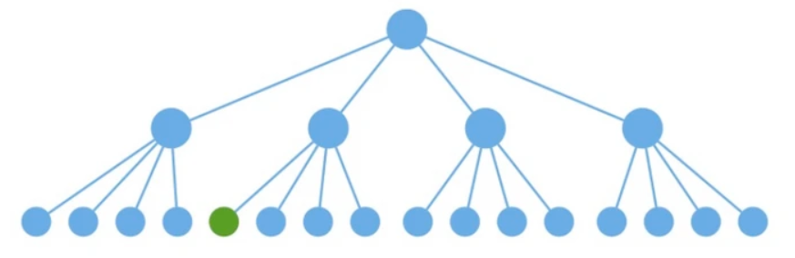
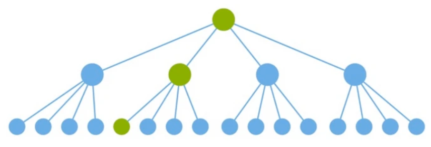

# React 性能优化

## 如何提高组件的渲染效率的？在React中如何避免不必要的render？

### 原理

React 组件 `render`的触发时机：

1. 类组件通过调用 `setState` 方法触发 `render`；
2. 父组件一旦发生`render`渲染，子组件一定也会执行`render`渲染；

父组件渲染导致子组件渲染，但子组件并没有发生任何改变，此时可以从避免多余的渲染。

例如：当我们想要更新一个子组件的时候，如下图绿色部分：



理想状态只调用该路径下的组件`render`：



但是`react`的默认做法是调用所有组件的`render`（父组件发生 render，子组件一定也会 render），再对生成的虚拟`DOM`进行对比（黄色部分），如不变则不进行更新


### 实现

在 React 中提高组件渲染效率方法有：通过判断属性和状态变化避免重复渲染、缓存组件避免重新渲染、使用key 复用组件避免不必要渲染、懒加载组件。

- **使用 [shouldComponentUpdate](https://zh-hans.react.dev/reference/react/Component#shouldcomponentupdate)**：确定是否可以跳过重新渲染；
- **使用 [PureComponent](https://zh-hans.react.dev/reference/react/PureComponent)**：当 props 和 state 与之前保持一致时会跳过重新渲染；
- **组件缓存**：
  - **使用 [React.memo](https://zh-hans.react.dev/reference/react/memo) 缓存组件；**
  - **使用 [useMemo](https://zh-hans.react.dev/reference/react/useMemo) 缓存组件**；

- **优化state和props**：
  - 尽量减少组件的state和props，只保留必要的部分。
  - 对于大型对象或数组，尽量使用不可变数据结构，或者提供一个新的对象或数组，而不是直接修改原对象或数组。这样可以避免不必要的渲染，因为React会使用浅比较来检查props和state是否发生了变化。

- **使用列表的键（key）**：
  - 当渲染列表时，确保每个列表项都有一个唯一的key。这样，React就可以准确地识别哪些项发生了变化，哪些项没有变化，从而避免不必要的渲染。

- **使用`React.lazy`和`Suspense`懒加载组件**：
  - 如果你的应用有很多大型组件，或者有一些只在特定条件下才需要的组件，你可以使用`React.lazy`和`Suspense`进行代码拆分。这样，只有当需要渲染这些组件时，才会加载它们的代码，从而减少了初始加载时间，并提高了渲染效率。

- **拆分组件**：
  - 将大型组件拆分为多个小型组件，可以提高渲染效率。
  - 因为当父组件的状态或props发生变化时，只有与这些状态或props相关的子组件才会重新渲染，而其他子组件则不会受到影响。
- **使用context和hooks管理状态**
  - 避免在组件树中通过props逐层传递状态，而是使用React的context和hooks来管理状态。
  - 这样，你可以将状态存储在更高级别的组件中，并通过context和hooks在需要的地方访问它，从而减少了不必要的props传递和渲染。

- **避免使用内联函数**：
  - 使用内联函数，则每次调用`render`函数时都会创建一个新的函数实例。

- **使用 React Fragments 避免额外标记**：
  - 


### shouldComponentUpdate

> 官方文档：[Component – React 中文文档](https://zh-hans.react.dev/reference/react/Component#shouldcomponentupdate)

如果你定义了 `shouldComponentUpdate`，React 将调用它来确定是否可以跳过重新渲染。

如果你确定你想手动编写它，你可以将 `this.props` 与 `nextProps` 以及 `this.state` 与 `nextState` 进行比较，并返回 `false` 来告诉 React 可以跳过更新。

```jsx
class Rectangle extends Component {
  state = {
    isHovered: false
  };
  shouldComponentUpdate(nextProps, nextState) {
    if (
      nextProps.position.x === this.props.position.x &&
      nextProps.position.y === this.props.position.y &&
      nextProps.size.width === this.props.size.width &&
      nextProps.size.height === this.props.size.height &&
      nextState.isHovered === this.state.isHovered
    ) {
      // 没有任何改变，因此不需要重新渲染
      return false;
    }
    return true;
  }
  // ...
}
```

当收到新的 props 或 state 时，React 会在渲染之前调用 `shouldComponentUpdate`，默认值为 `true`。初始渲染或使用 [`forceUpdate`](https://zh-hans.react.dev/reference/react/Component#forceupdate) 时将不会调用此方法。

### PureComponent

> 官方文档：[PureComponent – React 中文文档](https://zh-hans.react.dev/reference/react/PureComponent)

`PureComponent` 类似于 [`Component`](https://zh-hans.react.dev/reference/react/Component)，但是当 props 和 state 与之前保持一致时会跳过重新渲染。React 仍然支持类式组件，但我们不建议在新代码中使用。

**跳过类式组件不必要的重新渲染:** 

当父组件重新渲染时，React 通常会重新渲染子组件。为了优化性能，你可以创建一个组件，在父组件重新渲染时不会重新渲染，前提是新的 props 和 state 与旧的 props 和 state 相同。[类式组件](https://zh-hans.react.dev/reference/react/Component) 可以通过继承 `PureComponent` 来选择此行为。

```jsx
class Greeting extends PureComponent {
  render() {
    return <h1>Hello, {this.props.name}!</h1>;
  }
}
```

React 组件应该始终具有 [纯粹的渲染逻辑](https://zh-hans.react.dev/learn/keeping-components-pure)。这意味着如果 props、state 和 context 没有发生变化，它必须返回相同的输出。使用 `PureComponent` 便是在告诉 React 你的组件符合这个要求，因此只要 props 和 state 没有改变，React 就不需要重新渲染组件。然而，如果你的组件正在使用的 context 发生变化，它仍会重新渲染。

###  React.memo

> 官方文档：[memo – React 中文文档](https://zh-hans.react.dev/reference/react/memo#skipping-re-rendering-when-props-are-unchanged)

`memo` 允许你的组件在 props 没有改变的情况下跳过重新渲染。

```jsx
const MemoizedComponent = memo(SomeComponent, arePropsEqual?)
```

**当 props 没有改变时跳过重新渲染:** 

React 通常在其父组件重新渲染时重新渲染一个组件。你可以使用 `memo` 创建一个组件，当它的父组件重新渲染时，只要它的新 props 与旧 props 相同时，React 就不会重新渲染它。这样的组件被称为 **记忆化的**（memoized）组件。

要记忆化一个组件，请将它包装在 `memo` 中，使用它返回的值替换原来的组件：

```jsx
import { memo } from 'react';
const Greeting = memo(function Greeting({ name }) {
  return <h1>Hello, {name}!</h1>;
});
export default Greeting;
```

React 组件应该始终具有 [纯粹的渲染逻辑](https://zh-hans.react.dev/learn/keeping-components-pure)。这意味着如果其 props、state 和 context 没有改变，则必须返回相同的输出。通过使用 `memo`，你告诉 React 你的组件符合此要求，因此只要其 props 没有改变，React 就不需要重新渲染。即使使用 `memo`，如果它自己的 state 或正在使用的 context 发生更改，组件也会重新渲染。

### useMemo

> 官方文档：[useMemo – React 中文文档](https://zh-hans.react.dev/reference/react/useMemo)

`useMemo` 是一个 React Hook，它在每次重新渲染的时候能够缓存计算的结果。

```jsx
const cachedValue = useMemo(calculateValue, dependencies)
```

在组件的顶层调用 `useMemo` 来缓存每次重新渲染都需要计算的结果。

```jsx
import { useMemo } from 'react';
function TodoList({ todos, tab }) {
  const visibleTodos = useMemo(
    () => filterTodos(todos, tab),
    [todos, tab]
  );
  // ...
}
```

此代码依赖于 [动态 `import()`](https://developer.mozilla.org/zh-CN/docs/Web/JavaScript/Reference/Operators/import)，因此可能需要你的打包工具或框架提供支持。使用这种模式要求导入的懒加载组件必须作为 `default` 导出。

### React.lazy

> 官方文档：[lazy – React 中文文档](https://zh-hans.react.dev/reference/react/lazy)

`lazy` 能够让你在组件第一次被渲染之前延迟加载组件的代码。

```jsx
const SomeComponent = lazy(load)
```

在组件外部调用 `lazy`，以声明一个懒加载的 React 组件:

```jsx
import { lazy } from 'react';
const MarkdownPreview = lazy(() => import('./MarkdownPreview.js'));
```

### Suspense 

> 官方文档：[lazy – React 中文文档](https://zh-hans.react.dev/reference/react/lazy#suspense-for-code-splitting)

通过将懒加载组件或其任何父级包装到 [Suspense](https://zh-hans.react.dev/reference/react/Suspense) 边界中来实现：

```jsx
<Suspense fallback={<Loading />}>
  <h2>Preview</h2>
  <MarkdownPreview />
 </Suspense>
```

在这个例子中，`MarkdownPreview` 的代码只有在你尝试渲染它时才会被加载。如果 `MarkdownPreview` 还没有加载完成，将显示 `Loading`。


### 避免使用内联函数

如果我们使用内联函数，则每次调用`render`函数时都会创建一个新的函数实例，如下：

```jsx
import React from "react";

export default class InlineFunctionComponent extends React.Component {
  render() {
    return (
      <div>
        <h1>Welcome Guest</h1>
        <input type="button" onClick={(e) => { this.setState({inputValue: e.target.value}) }} value="Click For Inline Function" />
      </div>
    )
  }
}
```

应该在组件内部创建一个函数，并将事件绑定到该函数本身。这样每次调用 `render` 时就不会创建单独的函数实例，如下：

```jsx
import React from "react";
export default class InlineFunctionComponent extends React.Component {
  //组件内部创建一个函数 
  setNewStateData = (event) => {
    this.setState({
      inputValue: e.target.value
    })
  }
  
  render() {
    return (
      <div>
        <h1>Welcome Guest</h1>
        <input type="button" onClick={this.setNewStateData} value="Click For Inline Function" />
      </div>
    )
  }
}
```


### 使用 React Fragments 避免额外标记

用户创建新组件时，每个组件应具有单个父标签。父级不能有两个标签，所以顶部要有一个公共标签，所以我们经常在组件顶部添加额外标签`div`

这个额外标签除了充当父标签之外，并没有其他作用，这时候则可以使用`fragement`，其不会向组件引入任何额外标记，但它可以作为父级标签的作用，如下所示：

```jsx
export default class NestedRoutingComponent extends React.Component {
    render() {
        return (
            <>
                <h1>This is the Header Component</h1>
                <h2>Welcome To Demo Page</h2>
            </>
        )
    }
}
```
