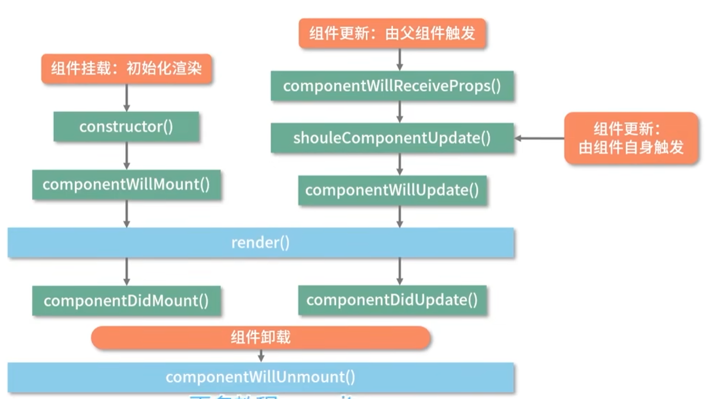
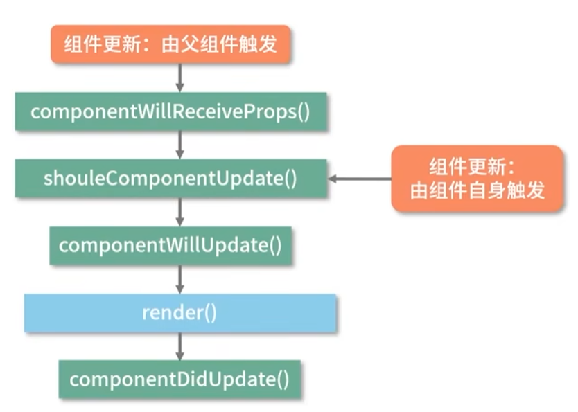
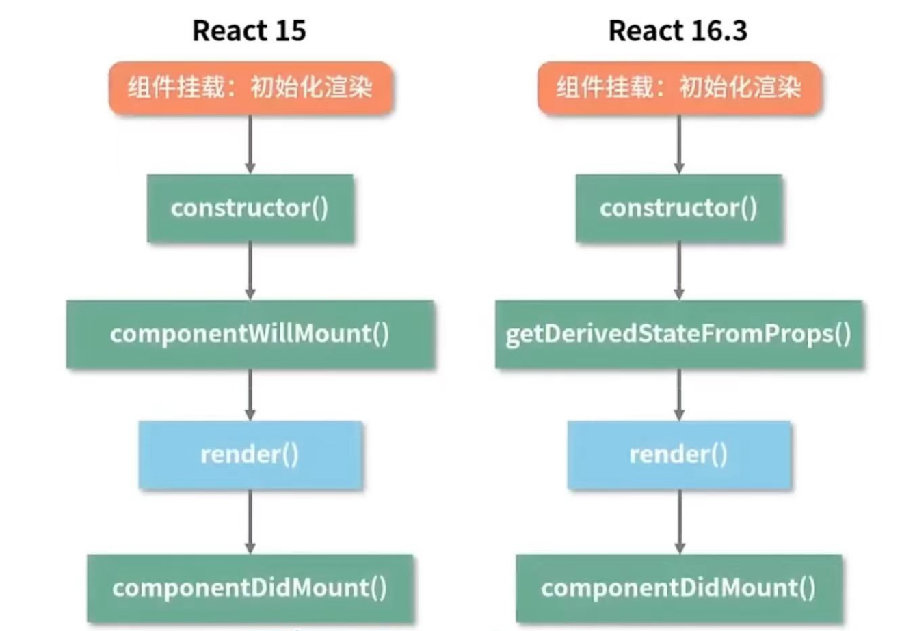
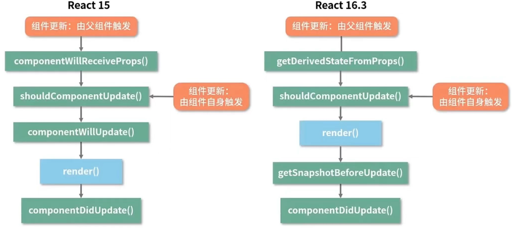

# **生命周期**

## React15 的生命周期

- `constructor()`
- `componentWillReceiveProps()`
- `shouldComponentUpdate()`
- `componentWillMount()`
- `componentWillUpdate()`
- `componentDidUpdate()`
- `componentDidMount()`
- `render()`
- `componentWillUnmount()`




React 的生命周期是指React组件从创建到销毁的整个过程，这个过程可以分为三个阶段：

* 挂载阶段（Mounting）
* 更新阶段（Updating）
* 卸载阶段（Unmounting）

### 组件挂载 (Mounting)

**constructor()**：

- 组件的构造函数，在组件实例化时调用。
- 用于初始化组件的状态（`this.state`）和绑定事件处理函数。

**componentWillMount()**：

- 在组件挂载到 DOM 之前调用。
- 用于执行挂载前的准备工作，如设置初始状态或订阅服务。

**render()**：

- 组件的渲染方法，根据组件的状态和属性生成 React 元素。
- 必须返回一个 React 元素或 null，表示组件的 UI 结构。
- render 方法在执行过程中不会操作真实 DOM，它的职能是把需要渲染的内容返回出来。
- 注意： 不要在 `render` 里面 `setState`, 否则会触发死循环导致内存崩溃

**componentDidMount()**：

- 在组件挂载到 DOM 后调用。渲染结束后触发。
- 用于执行真实 DOM 操作、发起网络请求或添加事件监听器等。

### 组件更新 (Updating)



**componentWillReceiveProps()**：

- 当组件接收到新的属性（props）时调用。
- 用于处理属性变化前的准备工作，如更新组件状态。
- **`componentWillReceiveProps()` 并不是由 Props 的变化触发的，而是由父组件的更新触发的**。如果父组件导致组件重新渲染，即使 Props 没有更改，也会调用该方法。如果只想处理更改，请确保进行当前值与变化值的比较。

**shouldComponentUpdate(nextProps,nextState)**：

- 在组件更新之前调用，用于决定组件是否需要重新渲染。
- 返回布尔值，如果返回 `false`，则组件跳过更新。

**componentWillUpdate()**：

- 在组件接收到新的属性或状态变化并准备重新渲染之前调用。
- 用于执行更新前的准备工作，如数据获取。

**render()**：

- 与挂载阶段相同，每次组件更新时都会调用。
- 根据新的状态和属性生成新的 React 元素。

**componentDidUpdate()**：

- 在组件更新到 DOM 后调用。
- 用于执行更新后的副作用，如根据 DOM 变化执行操作。


### 组件卸载 (Unmounting)


**componentWillUnmount()**：

- 在组件从 DOM 卸载和销毁之前调用。
- 用于执行清理工作，如取消网络请求、清除定时器或移除事件监听器。
- 触发条件：
  - 组件在父组件中被移除了；
  - 组件中设置了 key 属性，父组件在 render 的过程中，发现 key 值和上一次不一致；

## **React16+ 生命周期**


> 更清晰了解生命周期的阶段图表 [React Lifecycle Methods Diagram](http://projects.wojtekmaj.pl/react-lifecycle-methods-diagram/)
>


各生命周期包含的生命周期方法：

**挂载阶段（Mounting）**

- `constructor`
- `static getDerivedStateFromProps`
- `render`
- `componentDidMount`

**更新阶段（Updating）**

- `static getDerivedStateFromProps`
- `shouldComponentUpdate`
- `render`
- `getSnapshotBeforeUpdate`
- `componentDidUpdate`

**卸载阶段（Unmounting）**

- `componentWillUnmount`

从纵向划分，可以划分为 Render 阶段和 Commit 阶段。

- Render 阶段：纯净且不包含副作用，可能会被 React 暂停、中止或重新启动
- Commit 阶段：可以使用 DOM，运行副作用，安排更新


### **挂载阶段（Mounting）**

**在挂载阶段，React组件被创建并插入到DOM中**



这个阶段包含以下几个方法：

- **constructor(props)**：构造函数，用于**初始化组件的状态和绑定事件处理函数**。在这个阶段，你可以通过`this.state`来定义组件的初始状态。
- **[static getDerivedStateFromProps(props, state)](https://react.docschina.org/reference/react/Component#static-getderivedstatefromprops)**：这是一个静态方法，用于**在组件实例化后和接收新的props之前，根据props来更新state**。注意，这个方法在React 16.3版本后引入，用于替代`componentWillReceiveProps`。
- **render()**：用于**根据组件的props和state来渲染组件的UI**。这个方法必须是一个纯函数，也就是说，对于相同的props和state，它应该总是返回相同的结果。
- **componentDidMount()**：**在组件挂载后立即调用，此时组件已经被插入到DOM中**。你可以在这个方法中进行网络请求、订阅事件等初始化操作。


#### constructor

📜 **语法**：`constructor(props, context, updater)`

- `props`：继承 React.Component 的属性方法，它是不可变的 read-only
- `context`：全局上下文。
- `updater`:包含一些更新方法的对象
  - `this.setState` 最终调用的是 `this.updater.enqueueSetState`
  - `this.forceUpdate` 最终调用的是 `this.updater.enqueueForceUpdate` 方法，所以这些 API 更多是 React 调用使用，暴露出来以备开发者不时之需。

⏱ **触发时机**：在组件初始化的时候触发一次。

实例过程中自动调用的方法，在方法内部通过`super`关键字获取来自父组件的`props`；

在该方法中，通常的操作为初始化`state`状态或者在`this`上挂载方法：

```react
class MyComponent extends React.Component {  
  constructor(props) {  //初始化组件的状态和绑定事件处理函数
    super(props);  //通过`super`关键字获取来自父组件的`props`
    this.state = {  
      // 使用props来初始化状态（如果需要的话）  
      value: props.initialValue,  
    };  
    this.handleClick = this.handleClick.bind(this); //在`this`上挂载方法
  }  
  
  render() {  
    // ...  
  }  
}
```

在上面的示例中，构造函数首先调用`super(props)`来确保`this.props`的可用性，然后使用`this.props`来初始化组件的状态。如果不调用`super(props)`，那么`this.props`将会是`undefined`，导致状态初始化失败。

> **在构造函数调用 super 并将 props 作为参数传入的作用?**

在React的类组件中，构造函数（constructor）是一个特殊的方法，用于初始化组件的状态（state）和绑定事件处理函数。在构造函数中调用`super(props)`是一个必要的步骤，它有几个重要的作用：

1. **继承父类属性**：在JavaScript中，类是通过继承机制来工作的。`super`关键字用于调用父类（在这里是`React.Component`）的构造函数。通过将`props`作为参数传递给`super()`，我们确保父类的构造函数能够正确执行，并且组件实例能够访问到`this.props`。
2. **确保props的可用性**：在类组件中，`props`是通过组件的实例来访问的（即`this.props`）。**如果在构造函数中不调用`super(props)`，那么`this.props`将会是`undefined`，因为构造函数中的`this`指向的是当前组件的实例，而实例的`props`属性是由父类（`React.Component`）的构造函数来初始化的**。
3. **遵循React的生命周期**：React组件的生命周期是严格定义的，并且依赖于特定的方法和步骤来正确执行。调用`super(props)`是组件生命周期中的一个关键步骤，它确保了组件实例能够按照React的预期来工作。
4. **状态初始化**：虽然`super(props)`主要用于确保`props`的可用性，但构造函数通常也用于初始化组件的状态。在调用`super(props)`之后，你可以安全地访问`this.props`，并且可以使用它来初始化状态（如果需要的话）。

#### `static getDerivedStateFromProps(props, state)` 

> 官方文档：[Component – React 中文文档 (docschina.org)](https://react.docschina.org/reference/react/Component#static-getderivedstatefromprops)

如果你定义了 `static getDerivedStateFromProps`，React 会**在初始挂载和后续更新时调用 [`render`](https://react.docschina.org/reference/react/Component#render) 之前调用它**。

它应该返回一个对象来更新 state，或者返回 `null` 就不更新任何内容。

该方法有且仅有一个用途: **使用 props 来派生/更新 state**；

**参数**

- `props`：组件即将用来渲染的下一个 props。
- `state`：组件即将渲染的下一个 state。

**返回值**

`static getDerivedStateFromProps` 返回一个**对象**来更新 state，或返回 `null` 不更新任何内容。

**注意**

在更新和挂载两个阶段都会触发。

这是一个静态方法，因此在方法内部访问不了组件的 `this`，既此方法无权访问组件实例。

getDerivedStateFromProps 方法对 state 的更新动作并非“覆盖”式的更新，而是针对某个属性的定向更新。

**QA**

> 为什么要用 getDerivedStateFromProps 代替 componentWillReceiveProps?

与componentDidUpdate 一起，这个新的生命周期涵盖过FcomponentWillReceiveProps的所有用例。 --React官方

* getDerivedStateFromProps是作为一个试图代替 componentWillReceiveProps 的API 而出现的;
* getDerivedStateFromProps 不能完全和 componentWillReceiveProps 画等号;

getDerivedStateFromProps 可以代替 componentWillReceiveProps 实现基于 props 派生 state，原则上来说getDerivedStateFromProps 能做且只能做这一件事。getDerivedStateFromProps 相比componentWillReceiveProps 能实现的机制更专注， 因此 getDerivedStateFromProps 不能完全和 componentWillReceiveProps 画等号。

该方法改变表明 React 16 在强制推行“只用 getDerivedStateFromProps 来完成 props 到state 的映射“，来确保生命周期的行为更加可控。

### **更新阶段（Updating）**

**当组件的props或state发生变化时，组件会进入更新阶段**。



这个阶段包含以下几个方法：

- **static getDerivedStateFromProps(props, state)**：在更新阶段也会调用这个方法，用于根据新的props来更新state。
- **shouldComponentUpdate(nextProps, nextState)**：返回一个布尔值，决定是否根据新的props和state重新渲染组件。默认返回true，但你可以在这里实现自己的逻辑来避免不必要的渲染。
- **render()**：根据新的props和state来重新渲染组件。
- **getSnapshotBeforeUpdate(prevProps, prevState)**：在DOM更新之前被调用，它使你的组件能在可能更改的DOM上捕获一些信息（例如滚动位置）。此生命周期返回的任何值都将作为第三个参数传递给`componentDidUpdate()`。
- **componentDidUpdate(prevProps, prevState, snapshot)**：在更新后立即调用，当组件的props或state更新后，可以在此进行DOM操作或网络请求等。

#### `getSnapshotBeforeUpdate(prevProps, prevState)`

> 官方文档：[Component – React 中文文档 (docschina.org)](https://react.docschina.org/reference/react/Component#getsnapshotbeforeupdate)

如果你实现了 `getSnapshotBeforeUpdate`，React 会在 React 更新 DOM 之前时直接调用它。它使你的组件能够在 DOM 发生更改之前捕获一些信息（例如滚动的位置）。此生命周期方法返回的任何值都将作为参数传递给 [`componentDidUpdate`](https://react.docschina.org/reference/react/Component#componentdidupdate)。

该方法返回的一个`Snapshot`值，作为`componentDidUpdate`第三个参数传入

```jsx
getSnapshotBeforeUpdate(prevProps, prevState) {
    console.log('#enter getSnapshotBeforeUpdate');
    return 'foo';
}

componentDidUpdate(prevProps, prevState, snapshot) {
    console.log('#enter componentDidUpdate snapshot = ', snapshot);
    //输出 #enter componentDidUpdate snapshot =  foo
}
```

**参数**

- `prevProps`：更新之前的 Props。`prevProps` 将会与 [`this.props`](https://react.docschina.org/reference/react/Component#props) 进行比较来确定发生了什么改变。
- `prevState`：更新之前的 State。`prevState` 将会与 [`this.state`](https://react.docschina.org/reference/react/Component#state) 进行比较来确定发生了什么改变。

**返回值**

你应该返回你想要的任何类型的快照值，或者是 `null`。你返回的值将作为第三个参数传递给 [`componentDidUpdate`](https://react.docschina.org/reference/react/Component#componentdidupdate)。

**注意**

- 如果你定义了 [`shouldComponentUpdate`](https://react.docschina.org/reference/react/Component#shouldcomponentUpdate) 并返回了 `false`，则 `getSnapshotBeforeUpdate` 不会被调用。

### **卸载阶段（Unmounting）**

当组件不再需要，并且从DOM中移除时，会进入卸载阶段。这个阶段只有一个方法：

- **componentWillUnmount()**：在组件卸载及销毁之前直接调用。你可以在这个方法中进行清理操作，如取消网络请求、移除事件监听器等。


需要注意的是，React 16.3版本之后，一些旧的生命周期方法（如`componentWillMount`、`componentWillReceiveProps`和`componentWillUpdate`）被认为是不安全的，并且可能在未来的版本中被移除。因此，建议开发者使用新的生命周期方法（如`getDerivedStateFromProps`和`getSnapshotBeforeUpdate`）来替代这些旧方法。同时，React团队还引入了Hooks API，使得组件逻辑可以更加独立和可重用，进一步简化了组件的生命周期管理。


## React15 到16 废生命周期变化

- componentWillMount
- componentWillUpdate
- componentWillReceiveProps

由于 React 渲染时render 阶段是允许暂停、终止和重启的，这就导致以上处于 render 阶段的生命周期都是有可能被重复执行！

例如，你可以会在 componentWillMount 生命周期中执行以下操作：

* setState()
* fetch 发起异步请求
* 操作真实 DOM

以上操作会由于 React 渲染时render 阶段下，渲染可以暂停、终止和重启，导致一些 bug，如：在 componentWillMount 发起异步请求发起付款，由于 render 阶段里的生命周期都可以重复执行，在 componentWillxxx 被打断+重启多次后就会发出多个付款请求。

此外，在 componentWillUpdate 和 componentWillReceiveProps 滥用 setState 容易导致渲染死循环。

同时也新增了两个生命周期函数：

- getDerivedStateFromProps
- getSnapshotBeforeUpdate

**总结**

React 16 改造生命周期的主要动机是：为了配合 Fiber架构带来的异步渲染机制，针对生命周期中长期被滥用的部分推行了具有强制性的最佳实践，确保了 Fiber 机制下数据和视图的安全性同时也确保了生命周期方法的行为更加纯粹、可控、可预测。

**参考资料**

[生命周期 - React Guidebook (tsejx.github.io)](https://tsejx.github.io/react-guidebook/foundation/main-concepts/lifecycle)