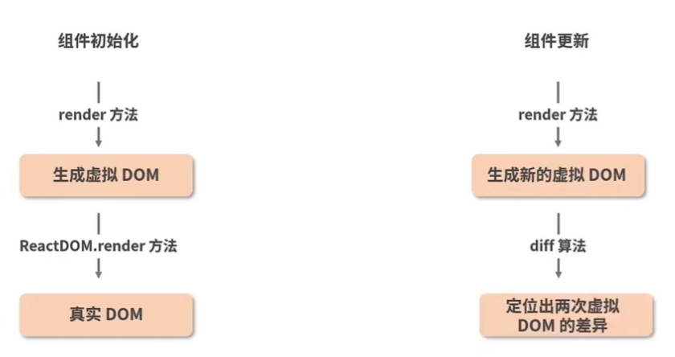

# **组件渲染流程**

React 的渲染工作流是值从**组件数据改变**到**组件实际更新**发生的过程。

1. **开发者编写 JSX 代码**：
   - 开发者使用 JSX 语法编写用户界面的代码。
   - JSX 允许开发者在 JavaScript 代码中编写类似 HTML 的结构，从而创建 React 元素和组件。

2. **Babel 编译**：
   - JSX 代码需要被转换成浏览器可以理解的 JavaScript 代码。
   - Babel 是一个 JavaScript 编译器，它可以将现代 JavaScript 代码和 JSX 转换为向后兼容的 JavaScript 代码。
   - Babel 会将 JSX 标签转换为 `React.createElement` 调用。例如，`
Hello, world!
` 会被转换成 `React.createElement('div', null, 'Hello, world!')`。
3. **React.createElement 调用**：
   - 转换后的 JavaScript 代码会使用 `React.createElement` 方法来创建 React 元素。这些元素是描述 UI 树的 JavaScript 对象。
4. **ReactElement 调用**：
   - `React.createElement` 方法返回一个 `ReactElement` 实例，它是 React 元素的内部表示。
   - `ReactElement` 包含了创建真实 DOM 节点所需的所有信息，如标签名、属性和子元素。
5. **作为参数处理**：
   - `ReactElement` 实例会被作为参数传递给 React 的渲染系统。React 会使用这些元素来构建虚拟 DOM。
6. **“虚拟 DOM”**：
   - 虚拟 DOM 是一个轻量级的 JavaScript 对象，它表示真实 DOM 的状态。
   - React 使用虚拟 DOM 来提高性能，因为它允许 React 在内存中进行 UI 更新，而不是直接操作真实 DOM。
7. **ReactDoM.render()**：
   - `ReactDOM.render()` 方法是将虚拟 DOM 渲染到真实 DOM 的入口点。这个方法接收一个 `ReactElement` 和一个 DOM 节点的选择器或引用作为参数。
   - React 会使用 Diff 算法比较新旧虚拟 DOM 树的差异，并计算出最小的更新操作。
8. **真实 DOM 传入**：
   - 根据计算出的更新操作，React 会更新传入的 DOM 节点。这个过程可能包括创建新的 DOM 节点、修改现有节点的属性或样式、删除不再需要的节点等。
   - 最终，更新后的真实 DOM 会反映在浏览器中，用户可以看到更新后的界面。

整个流程展示了从编写 JSX 代码到最终渲染在浏览器中的真实 DOM 的完整过程。通过这个过程，React 能够在保持性能的同时，提供一种简单直观的方式来构建和更新用户界面。

## **组件初始化**

1. **编写 JSX 组件实例**：

   * 定义React组件：可以通过函数组件或类组件来实现。函数组件是一个简单的JavaScript函数，而类组件则继承自`React.Component`。

   * 创建组件实例：当React需要渲染一个组件时，它会首先创建一个组件的实例。对于类组件，这意味着会调用其构造函数（如果有定义的话）。在构造函数中，你可以初始化组件的状态（`this.state`）或绑定事件处理器。

2. **渲染虚拟DOM**：

   * React 通过 `React.createElement` 方法**将 JSX 转换成虚拟DOM**。
   * 虚拟DOM是一个轻量级的JavaScript对象树，它表示了组件的UI结构。

3. **将虚拟DOM转换为真实DOM**：

   * React使用`ReactDOM.render`或`ReactDOM.hydrate`函数将虚拟DOM渲染到真实的DOM中。

4. **挂载完成**：

   * 一旦DOM更新完成，组件就被认为是“挂载”完成的。
   * 对于类组件，这意味着`componentDidMount`生命周期方法会被调用（如果有定义的话）。对于函数组件，你可以使用`useEffect` Hook 来执行类似的操作。

## **组件更新**

1. **状态或属性变化**：当组件的状态（state）或属性（props）发生变化时，组件的更新过程开始。
2. **虚拟DOM比较**：React会创建一个新的虚拟DOM树，并与旧的虚拟DOM树进行比较，找出差异。这个过程叫做“协调”或“diff”。React通过高效的diff算法来确定哪些部分需要更新。
3. **计算最小DOM操作**：基于虚拟DOM的差异，React会计算出最小化的DOM操作，以更新实际的DOM。这些操作可能包括添加、更新或删除DOM节点。
4. **应用DOM操作**：React将这些计算出的DOM操作应用到实际的DOM上，以更新页面的UI。
5. **组件更新完成**：一旦DOM更新完成，组件就被认为是更新完成的。对于类组件，相关的生命周期方法（如`componentDidUpdate`）会被调用。对于函数组件，你可以使用`useEffect` Hook 来处理更新后的逻辑。

## **总结**

在组件渲染时，主要完成以下几个步骤：

1. 初始渲染时候：

   * **将 JSX 转换成虚拟 DOM**：`JSX`通过`babel`最终转化成`React.createElement`形式；

   * **将虚拟 DOM 渲染成 真实 DOM**；

2. 组件更新时候：

   * 生成新的虚拟 DOM；
   * 使用 diff 算法比较新旧虚拟 DOM差异，生成差异树；
   * 应用差异，将虚拟 DOM 渲染成 真实 DOM；