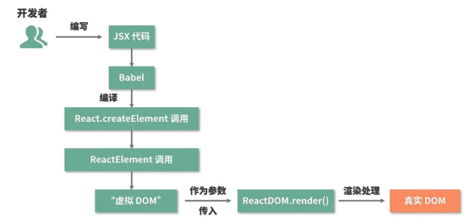
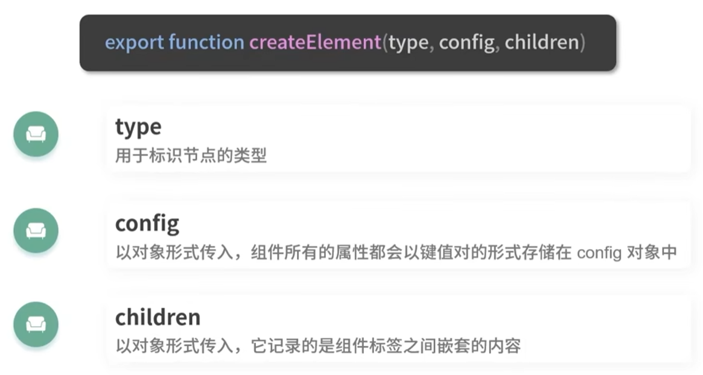
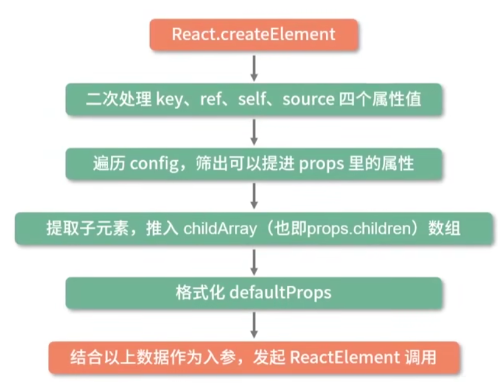
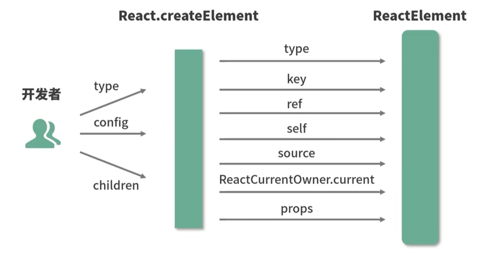
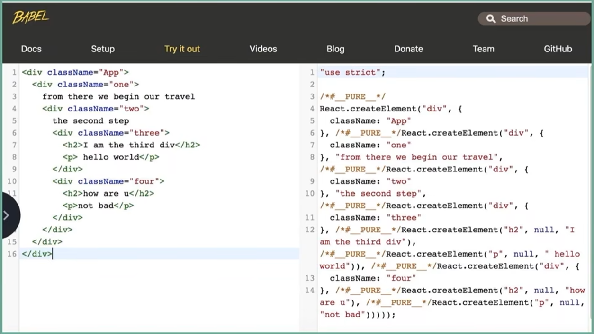

# **编译 JSX**




## **Babel 编译结果**

Babel 可以通过特定的插件（如 `@babel/plugin-transform-react-jsx`）将 JSX 语法转换为 `React.createElement` 调用，例如：

```jsx
<div>
  < img src="avatar.png" className="profile" />
  <Hello />
</div>
```

JSX  通过 Babel 编译后会被编译成 `React.createElement()`，该方法将返回一个叫做 `React Element` 的 JS 对象。

会被`bebel`转化成如下：

```jsx
React.createElement(
  "div",
  null,
  React.createElement("img", {
    src: "avatar.png",
    className: "profile"
  }),
  React.createElement(Hello, null)
);
```

### **`React.createElement` 函数分析**



**`React.createElement` 逻辑**

  

**`React.createElement` 主要对参数进行格式化**，最后实现 ReactElement:




> 为什么不直接使用 `React.createElement()` 来创建 React 的 元素？

因为直接使用 `React.createElement()` 代码会使代码结构混乱，编写代码复杂化

如下图，左侧是使用  `React.createElement()` 编写的代码，该代码复杂且混乱



## Babel 编译 JSX 过程

Babel 编译 JSX ，将 JSX 语法转换为浏览器可以理解的 JavaScript 代码。

### **解析（Parsing）**

Babel首先将输入的 **JSX 代码解析为一个抽象语法树（AST）**。

* AST是一个数据结构，用于表示源代码的抽象语法结构。
* 在这个阶段，Babel会理解JSX的结构，包括元素、属性和子元素等。

### **转换（Transformation）**

在AST生成后，**Babel会遍历这个树，对每个节点进行转换操作**。

对于React JSX，主要的转换工作是**将JSX元素转换为`React.createElement`调用**。例如，JSX中的`<div><h1>Hello, World!</h1></div>`会被转换为对应的`React.createElement`函数调用。

* 转换过程还可以包括添加、修改或删除AST节点，以及对节点进行其他操作。这些转换可以是自定义的，也可以使用Babel提供的插件，比如`@babel/plugin-transform-react-jsx`。

* 值得注意的是，在React 17及以后的版本中，JSX的转换稍有不同。它不再依赖`React.createElement`，而是使用新的运行时函数`jsx`或`jsxs`，这些函数由`react/jsx-runtime`模块提供。Babel会根据你的React版本和配置来决定使用哪种转换方式。

### **生成（Generation）**

在转换过程完成后，Babel将转换后的AST重新生成为可执行的JavaScript代码。

这个生成的代码将不包含任何JSX，而是纯粹的JavaScript，可以在浏览器中运行。

### **输出**

最后，Babel将生成的JavaScript代码输出到指定的文件或构建过程中。

这样，你就可以在项目中引用这个编译后的文件，而无需担心浏览器不支持JSX。


## **Babel 编译 JSX 配置**

1. **安装必要的 Babel 插件和依赖**：

要编译 JSX，你需要安装 `@babel/core`（Babel 的核心库）和 `@babel/plugin-transform-react-jsx`（将 JSX 转换为 `React.createElement` 调用的插件）。

此外，还需要安装 `@babel/preset-env`（用于转换 JavaScript 语法）和 `@babel/preset-react`（它内部使用了 `@babel/plugin-transform-react-jsx`）。

2. **配置 Babel**：

在你的项目根目录下创建一个 `.babelrc` 文件（或使用 `babel.config.js`），并在其中配置 Babel 的插件和预设（presets）。对于 React，你通常会使用 `@babel/preset-react`。

```json
// .babelrc  
{  
  "presets": ["@babel/preset-env", "@babel/preset-react"]  
}
```

或者，如果你使用 `babel.config.js`：

```javascript
// babel.config.js  
module.exports = {  
  presets: ['@babel/preset-env', '@babel/preset-react']  
};
```

