# **Virtual DOM**

> virtual dom 是单独存在的一个库， github: https://github.com/Matt-Esch/virtual-dom

## **Real DOM**

在认识 virtual dom 之前，先认识一下 Real DOM：

Real DOM，真实 `DOM`，意思为文档对象模型，是一个结构化文本的抽象，在页面渲染出的每一个结点都是一个真实 `DOM` 结构，如下：

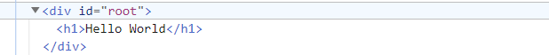

Real DOM（真实DOM）是浏览器原生提供的，它表示当前页面的实际HTML结构。当页面中的数据发生变化时，Real DOM 会进行重新渲染和更新。它是我们与网页进行交互的基础，通过操作Real DOM，我们可以改变网页的内容、样式和行为。

然而，直接操作Real DOM可能会引发重排（reflow）和重绘（repaint），这些操作是昂贵的，因为它们需要浏览器重新计算元素的布局和渲染页面的某些部分，消耗大量的计算资源。


## **Virtual DOM**

虚拟 DOM 顾名思义不是真实的 DOM，它不需要浏览器的 DOM API 支持。

虚拟 DOM 是在 DOM 的基础上建立一个抽象层，其实质是一个 JavaScript 对象，当数据和状态发生了变化，都会被自动高效的同步到虚拟 DOM 中，**最后再将仅变化的部分同步到真实 DOM 中**。

将 DOM 抽象成一个 JavaScript 对象：

```js
const element = {
  // 节点标签名
  tagName: 'ul',
  // DOM属性,用一个对象存储键值对
  props: {
    id: 'list',
  },
  // 该节点的子节点
  children: [
    { tagName: 'li', props: { class: 'item' }, children: ['Item 1'] },
    { tagName: 'li', props: { class: 'item' }, children: ['Item 2'] },
    { tagName: 'li', props: { class: 'item' }, children: ['Item 3'] },
  ],
};
```

对应的 DOM 树中的 HTML 写法：

```html
<ul id="list">
  <li class="item">Item1</li>
  <li class="item">Item2</li>
  <li class="item">Item3</li>
</ul>
```

在浏览器控制台显示的 Virtual DOM 结构:

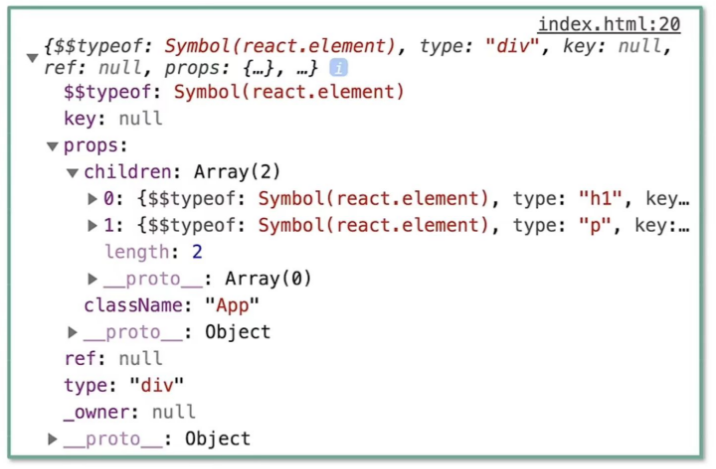


## **Real DOM 和 Virtual DOM 对比** 

|            |                    Real DOM                    |                      Virtual DOM                       |
| :--------: | :--------------------------------------------: | :----------------------------------------------------: |
|  **优点**  |                                                |                                                        |
|   可靠性   |  高，直接操作实际DOM元素，确保可靠渲染和交互   |           较高，通过抽象和比较，实现有效更新           |
| 功能丰富性 |          提供原生的API和事件处理机制           |         可以结合React等框架提供丰富的组件和API         |
| 跨平台能力 |             原生支持，无需额外转换             |       通过框架支持，如React Native，可实现跨平台       |
|  **缺点**  |                                                |                                                        |
|    性能    | 当数据变化频繁时，性能下降，需要频繁重排、重绘 | 在复杂应用中，初次渲染可能较慢，但在后续更新中性能较好 |
|  内存消耗  |   数据变化时，需要更新整个DOM树，内存消耗大    |      较小，只存储JavaScript对象树，不直接操作DOM       |
|   便捷性   |          操作繁琐，容易出错，维护困难          |            简单方便，减少直接操作DOM的需求             |
|  优化空间  |      优化空间有限，直接操作DOM的代价昂贵       |    可进行一定程度的优化，但在极端性能要求下可能受限    |

两者的区别如下：

- 虚拟 DOM 不会进行排版与重绘操作，而真实 DOM 会频繁重排与重绘
- 虚拟 DOM 的总损耗是“虚拟 DOM 增删改+真实 DOM 差异增删改+排版与重绘”，真实 DOM 的总损耗是“真实 DOM 完全增删改+排版与重绘”

* Real DOM具有可靠性和功能丰富性，但由于直接操作DOM，性能较低且内存消耗大。

* 而Virtual DOM则通过抽象和比较实现有效更新，提高了性能和内存效率，但在初次渲染时可能较慢。此外，Virtual DOM还可以结合框架实现跨平台开发，提供了更多的便捷性和优化空间。

## **为什么不直接操作 Real dom, 而是使用 Virtual dom**？

**性能优化**：

* 直接操作Real DOM通常涉及重排（reflow）和重绘（repaint），这是非常消耗计算资源的。浏览器需要重新计算元素的布局和渲染页面的某些部分。

* 相比之下，Virtual DOM是一个轻量级的JavaScript对象树，对其进行操作比直接操作Real DOM要快得多。

* 当组件状态改变时，React会重新构建Virtual DOM，并与前一个版本进行比较，从而确定Real DOM中需要更新的部分。然后，React只将这些更新的部分应用到Real DOM上，避免了不必要的重排和重绘。

  > 传统的原生 `api` 或 `jQuery` 去操作 `DOM` 时，浏览器会从构建 `DOM` 树开始从头到尾执行一遍流程:
  >
  > * 当你在一次操作时，需要更新 10 个 `DOM` 节点，浏览器没这么智能，收到第一个更新 `DOM` 请求后，并不知道后续还有 9 次更新操作，因此会马上执行流程，最终执行 10 次流程
  >
  > 而通过 `VNode`，同样更新 10 个 `DOM` 节点，虚拟 `DOM` 不会立即操作 `DOM`，而是将这 10 次更新的 `diff` 内容保存到本地的一个 `js` 对象中，最终将这个 `js` 对象一次性 `attach` 到 `DOM` 树上，避免大量的无谓计算
  >
  > 因此，真实 DOM 是全量更新，而虚拟 DOM 是差量更新。
  >
  > **注意：**
  >
  > * 虚拟 DOM 不一定会有更好的性能，虚拟 DOM 的优越之处在于拥有更高效的研发效率同时保持不错的性能。
  >
  > * 因为差量更新不一定比全量更新性能更好：数据内容变化非常大(或者说整个发生了改变)，促使差量更新计算出来的结果和全量更新极为接近(或者说完全一样)，这种情况 DOM 更新渲染消耗一致，但虚拟 DOM 存在更多计算消耗。

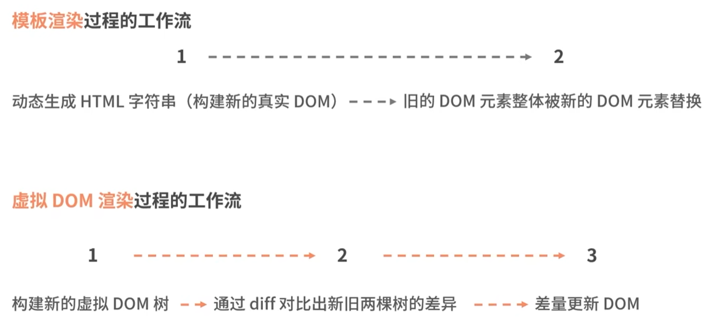

**提高研发效率**：

* 对于复杂的页面UI，往往会定义大量的Real DOM元素。频繁地操作这些元素不仅会降低性能，还会使代码变得复杂且难以维护。
* 使用Virtual DOM可以将这些操作抽象化，使开发人员能够更专注于业务逻辑和UI设计，而不是陷入繁琐的DOM操作中。
* 虚拟 DOM 使**数据驱动视图**提供基础。

**跨平台兼容性**：

* Virtual DOM使得React等框架能够更容易地实现跨平台兼容性。
* 由于Virtual DOM是一个抽象的JavaScript对象树，它可以被转换成不同平台的原生UI组件，从而实现一次编写、多处运行的目标。


## Virtual DOM 渲染

### 挂载阶段

React 将结合JSX 的描述，构建出虚拟DOM 树，然后通过`ReactDOM.render` 实现虚拟 DOM 到真实DOM 的映射(触发渲染流水线)

### 更新阶段

页面的变化会先作用于虚拟DOM，虚拟DOM将在JS 层借助算法先对比出具体有哪些真实DOM 需要被改变，然后再将这些改变作用于真实 DOM

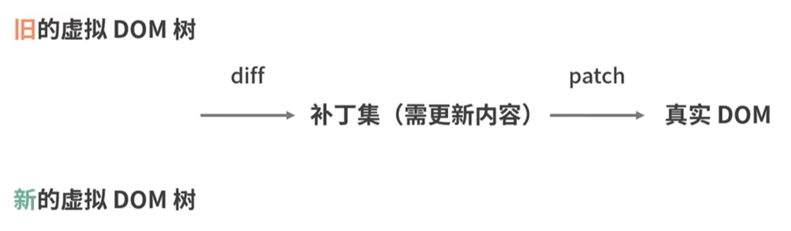

**更新流程：**

1. **渲染新的虚拟 DOM 树 (Render New Virtual DOM Tree)**：
   - 当组件的状态（state）或属性（props）发生变化时，React 会触发重新渲染。
   - 重新渲染会调用组件的 `render` 方法，该方法返回一个新的虚拟 DOM 树的描述。
2. **生成补丁集 (Generate Patch - Diffing)**：
   - React 使用 diff 算法比较旧的虚拟 DOM 树和新的虚拟 DOM 树之间的差异。
   - 这个比较过程是高效的，**React 只会检查发生变化的部分**，而不是比较整个树。
3. **补丁集 (Patch - Updating)**：
   - 通过 diff 算法，React 生成一个补丁集，它包含了**需要更新到真实 DOM 的最小操作集**。
   - 这些补丁包含了如属性更新、文本内容更改或 DOM 节点的增删等操作。
4. **应用补丁集到真实 DOM (Patch - Committing)**：
   - React 将补丁集应用到真实 DOM 上，从而更新浏览器的渲染树。
   - 这个过程是通过 React 的 `ReactDOM` 模块完成的，它会调用 DOM API 执行必要的更新。
5. **完成更新 (Update Complete)**：
   - 一旦补丁集被应用，真实 DOM 就会更新为新的虚拟 DOM 树的状态。
   - 用户界面现在反映了新的数据或状态，而不需要重新渲染整个应用。
6. **返回新的虚拟 DOM 树 (Return to New Virtual DOM Tree)**：
   - 更新完成后，React 会返回新的虚拟 DOM 树，作为下一次更新的起点。


::: detail 虚拟 DOM 创建和更新过程代码示例

```json
// 用于创建虚拟 DOM
var h = require('virtual-dom/h');
// 用于比较虚拟 DOM 差异生成补丁集
var diff = require('virtual-dom/diff');
// 应用补丁集到真实 DOM
var patch = require('virtual-dom/patch');
// 更新真实 DOM
var createElement = require('virtual-dom/create-element');

// 1: Create a function that declares what the DOM should look like
function render(count)  {
    return h('div', {
        style: {
            textAlign: 'center',
            lineHeight: (100 + count) + 'px',
            border: '1px solid red',
            width: (100 + count) + 'px',
            height: (100 + count) + 'px'
        }
    }, [String(count)]);
}

// 2: Initialise the document
var count = 0;      // We need some app data. Here we just store a count.

var tree = render(count);               // We need an initial tree
var rootNode = createElement(tree);     // Create an initial root DOM node ...
document.body.appendChild(rootNode);    // ... and it should be in the document

// 3: Wire up the update logic
setInterval(function () {
      count++; // 数据更新
	  // 重新构建新的虚拟 DOM 树
      var newTree = render(count);
      // 比较新旧虚拟 DOM 树
      var patches = diff(tree, newTree);
      // 应用补丁集到真实 DOM
      rootNode = patch(rootNode, patches);
      tree = newTree;
}, 1000);
```

:::

> 以上代码引用自 [Virtual DOM 官方文档库示例](https://github.com/Matt-Esch/virtual-dom)您可以找到单独组件的文档 在他们的自述文件中
>
> - 有关 `create-element.js`，请参阅 [vdom 自述文件](https://github.com/Matt-Esch/virtual-dom/blob/master/vdom/README.md)
> - 有关 `diff.js`，请参阅 [vtree 自述文件](https://github.com/Matt-Esch/virtual-dom/blob/master/vtree/README.md)
> - 有关 `h.js`，请参阅[虚拟超脚本自述文件](https://github.com/Matt-Esch/virtual-dom/blob/master/virtual-hyperscript/README.md)
> - 有关 `patch.js`，请参阅 [vdom 自述文件](https://github.com/Matt-Esch/virtual-dom/blob/master/vdom/README.md)

**更新阶段总体工作流程**：

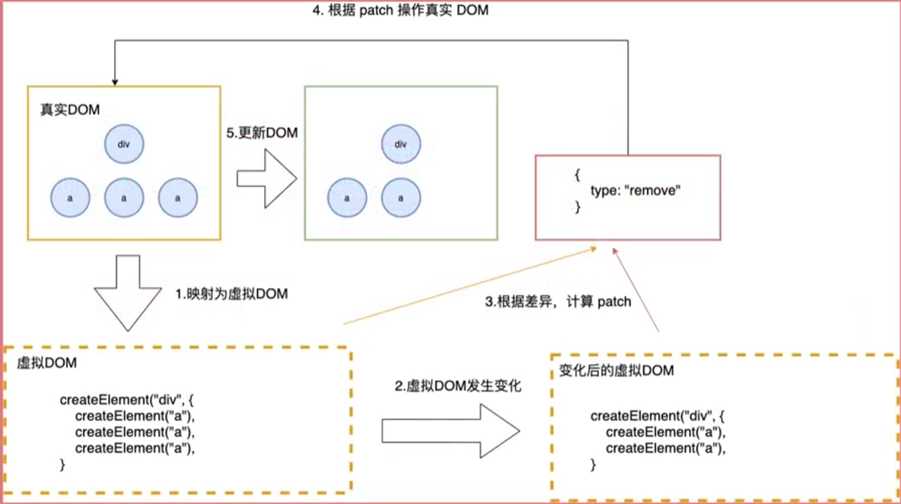


## 触发更新和差异对比的时机

1. **setState调用**：当组件的state发生变化时，React会触发Diff算法。这是因为在React中，组件的state是其内部数据模型的一部分，当state更新时，组件需要重新渲染以反映这些变化。
2. **Hooks调用**：使用React Hooks时，如调用`useState`、`useEffect`等，如果它们的状态或依赖项发生变化，同样会触发组件的重新渲染和Diff算法的执行。
3. **父组件更新**：如果父组件重新渲染，那么它的子组件（无论其props是否改变）也可能需要进行Diff操作，以确定是否需要更新。然而，React使用了一种称为“shouldComponentUpdate”或“React.memo”的机制来避免不必要的子组件渲染，这在一定程度上可以减少不必要的Diff操作。

在这些操作发生后，React会开始比较旧的Fiber树和新的ReactElement，找出它们之间的差异，并据此生成新的Fiber树。这个比较过程就是Diff算法的核心部分，它负责找出需要添加、更新或删除的元素，并生成相应的DOM操作补丁。


## 虚拟 DOM 如何工作

通过数据和模板结合，生成虚拟 DOM，再通过虚拟DOM 映射到 真实 DOM，最后挂载到页面中：

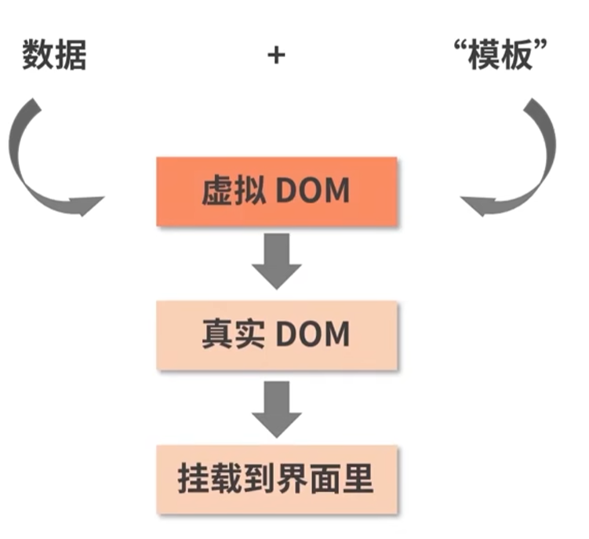


## React 15 的Reconciliation（栈调和）

React 15的Reconciliation（调和）是一个**将虚拟DOM映射到真实DOM的过程**，旨在在用户无感知的情况下将数据的更新体现到UI上。

这个过程主要发生在React组件的状态（State）改变时，React会首先进入调和阶段，然后进入提交阶段，最终展示新状态对应的页面。

具体过程包括以下几个步骤：

1. 当React组件的状态发生改变时，React会触发调和阶段。
2. 在调和阶段，React首先会计算出目标状态对应的虚拟DOM结构。这个计算过程可以称为Render过程，可以通过多种方式触发，如forceUpdate、State更新、父组件Render触发子组件Render过程等。
3. React通过如ReactDOM等类库，将计算出的虚拟DOM与“真实的”DOM进行同步，即把虚拟DOM映射到真实DOM上。

**注意**

虽然调和过程包含Diff算法，但二者并不完全等同：

* 调和是“使虚拟 DOM 到真实DOM一致”的过程，Diff 是“新旧虚拟 DOM 找不同”的过程。
* **Diff算法是调和过程中最具代表性的一环**

根据实现形式的不同，调和过程被划分为

1. **React 15 的 “栈调和”**。
2. **React 16 的 “Fiber调和”**。


##  **Diff 算法**

React Diff算法用于在更新UI时高效地计算出Virtual DOM中真正变化的部分，并仅针对这些变化的部分进行原生DOM操作，而非重新渲染整个页面。这样，React可以显著提高页面的渲染效率。

传统的要想找出两个树结构之间的不同传统的计算方法是通过循环递归进行树节点的一一对比，该算法的复杂度为 O(n^3)。

为了解决比较性能， Diff 算法进行了树对比的算法优化。


### 设计思想

#### **分层比较**

React 会将虚拟 DOM 树按层级（即**深度优先遍历**的顺序）进行比较进行分层递归，而不是对整个树进行一次性比较。

该方法是降低时间复杂度的最重要因素。

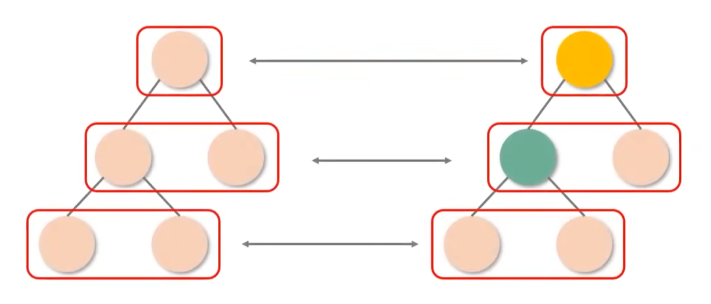


#### **同类型 Diff**

若两个组件属于同一个类型，它们将拥有相同的 DOM 树形结构。

**类型一致的节点才有继续 Diff 递归的必要性**。

如果组件是同一类型则进行比对，否则直接放入补丁中。

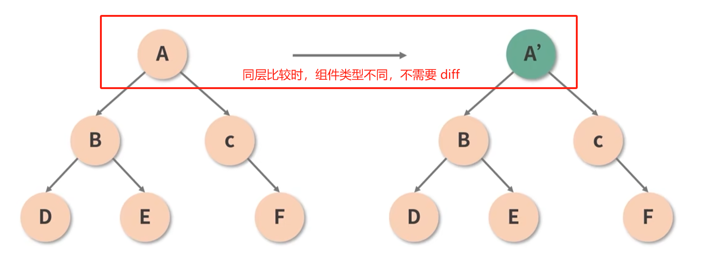

#### **同层节点比较**

React 会对新旧两个虚拟 DOM 树的同层节点进行比较。

如果节点顺序或数量有变化，React 会采用特定的算法来找出最小的操作集合，使得旧的 DOM 树能够转变为新的 DOM 树。

#### **设置 key 唯一标识**

 处于同一层级的一组子节点，可用通过设置 key作为唯一标识从而维持各个节点在不同渲染过程中的稳定性。

key 值设置关键：**唯一且稳定**

* 唯一表示能唯一表示一个节点
* 稳定表示不会随意变化
  * key不要使用随机值（随机数在下一次 render 时，会重新生成一个数字）
  * 使用 index 作为 key值，对性能没有优化


**key 属性作用：**

1. key 帮助 React 识别哪些内容被更改、添加或者删除。

2. key 使 React 尽可能**重用同一层级内的节点**。

key 需要写在用数组渲染出来的元素内部，并且需要赋予其个稳定的值。稳定在这里很重要，因为如果 key值发生了变更，React则会触发U的重渲染。

**示例：**

如下图，在 B 和 D 节点之间插入了 C 节点

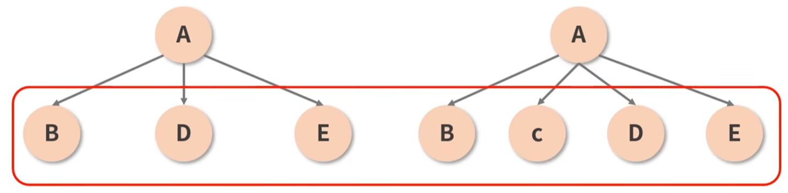

* 在没有设置 key 时：
  1. React 会逐一对比 `B : B`, `D : C`，`E : D`,  `null : E` ；
  2.  React 操作为：删除 D 并新增C，删除 E 并新增 D, 新增 E。

 以上操作实际只要新增一个 C 节点即可。

* 设置 Key 时：React 记住每一个节点，在后续更新时追踪每一个节点。

  如下图，React 重用 key 相同的节点，并插入一个新 Key 的节点：

  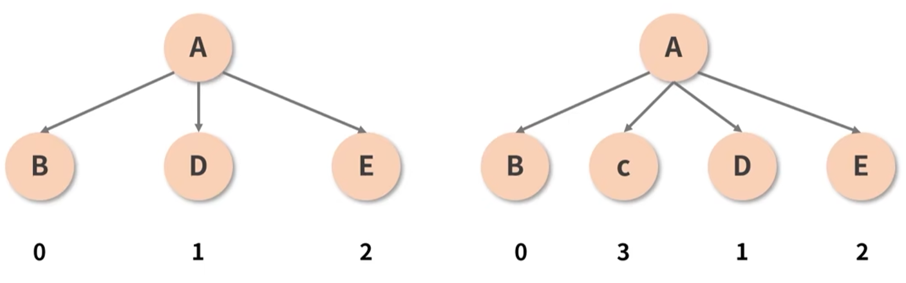


**key 值判断过程**

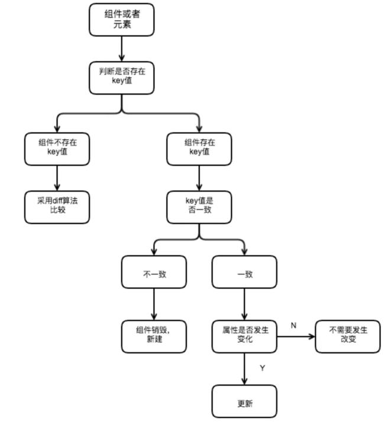


**使用`key`与不使用`key`的区别**

`react`组件中进行列表渲染的一个示例：

```jsx
const data = [
  { id: 0, name: 'abc' },
  { id: 1, name: 'def' },
  { id: 2, name: 'ghi' },
  { id: 3, name: 'jkl' }
];

const ListItem = (props) => {
  return <li>{props.name}</li>;
};

const List = () => {
  return (
    <ul>
      {data.map((item) => (
        <ListItem name={item.name}></ListItem>
      ))}
    </ul>
  );
};
```

```js
insertMovie() {
  const newMovies = [000 ,...this.state.numbers];
  this.setState({
    movies: newMovies
  })
}
```

当拥有`key`的时候，`react`根据`key`属性匹配原有树上的子元素以及最新树上的子元素，像上述情况只需要将 000 元素插入到最前面位置：

* 当没有`key`的时候，所有的`li`标签都需要进行修改
* 而写`key`则涉及到了节点的增和删，发现旧`key`不存在了，则将其删除，新`key`在之前没有，则插入，这就增加性能的开销。

并不是拥有`key`值代表性能越高，如果说只是文本内容改变了，不写`key`反而性能和效率更高，主要是因为不写`key`是将所有的文本内容替换一下，节点不会发生变化


### 实现流程

1. **生成新的虚拟 DOM**：当组件的状态或属性发生变化时，React 会重新调用组件的渲染方法，生成一个新的虚拟 DOM 树。
2. **分层比较**：React 会将虚拟 DOM 树按层级（即深度优先遍历的顺序）进行比较，而不是对整个树进行一次性比较。
3. **同层节点比较**：React 会对新旧两个虚拟 DOM 树的同层节点进行比较。如果节点顺序或数量有变化，React 会采用特定的算法来找出最小的操作集合，使得旧的 DOM 树能够转变为新的 DOM 树。
4. **节点类型与属性比较**：对于每个变化的节点，React 会比较其类型和属性。如果节点类型不同，React 会直接删除旧的 DOM 节点并创建新的 DOM 节点。如果节点类型相同但属性有变化，React 会仅更新变化的属性。
5. **子节点比较**：对于节点的子节点，React 会采用一种称为“key”的机制来优化比较过程。如果子节点有唯一的 `key` 属性，React 可以更高效地识别出哪些子节点是新增的、哪些子节点是删除的、哪些子节点是移动的。这样，即使子节点的顺序发生了变化，React 也可以只进行必要的 DOM 操作，而不是重新渲染整个子节点列表。
6. **应用 DOM 操作**：一旦找出了虚拟 DOM 树之间的差异，React 就会将这些差异应用到实际的 DOM 上。这通常包括添加、更新或删除 DOM 节点，以及修改节点的属性。
7. **更新完成**：一旦 DOM 更新完成，React 会触发相应的生命周期方法或钩子（如 `componentDidUpdate` 或 `useEffect`），以便开发者可以执行更新后的逻辑。


## Fiber 机制下 Diff 更新过程

在React的Fiber机制中，整个更新过程是通过两棵树的双缓冲完成的，即`current`树和`workInProgress`树。

这个机制允许React在更新过程中保持用户界面的响应性，同时异步地计算新的树。

### current树

`current`树代表当前显示在屏幕上的UI的虚拟DOM树的状态。

它是用户当前看到的界面的反映。在渲染过程中，React会遍历这棵树并生成真实的DOM节点，这些DOM节点最终会被渲染到屏幕上。

### workInProgress树

`workInProgress`树是React在更新过程中构建的新的虚拟DOM树。

当组件的状态或props发生变化时，React会开始构建这棵新树。这棵树是在不阻塞主线程的情况下逐步构建的，这意味着React可以在构建新树的同时保持用户界面的响应性。

### 双缓冲

双缓冲是一种在计算机图形编程中常用的技术，用于在不直接更新显示内容的情况下准备新的帧或内容。

在React的Fiber机制中，双缓冲的概念被用来处理UI的更新。具体来说，`current`树和`workInProgress`树就是双缓冲的两个部分:

- 当`workInProgress`树正在构建时，`current`树仍然保持不变并显示在屏幕上。
- 一旦`workInProgress`树构建完成，它就会被切换为新的`current`树，而原来的`current`树则变成旧的`workInProgress`树（或者被回收）。
- 然后，如果有新的更新发生，React会再次在旧的`workInProgress`树的基础上开始构建新的`workInProgress`树。

这个过程是异步的，允许React在不影响用户界面的情况下逐步构建新的树。这也使得React能够利用浏览器的空闲时间来执行更新，从而提高了性能。

### 更新过程

整个更新过程可以概括为以下几个步骤：

1. 当组件的状态或props发生变化时，React开始构建`workInProgress`树。
2. 在构建过程中，React会对比`current`树和`workInProgress`树，找出差异，并只更新那些真正发生变化的部分。这就是Diff算法的核心部分。
3. 一旦`workInProgress`树构建完成，它就会被切换为新的`current`树，并显示在屏幕上。
4. 如果有新的更新发生，React会重复上述过程，在旧的`workInProgress`树的基础上构建新的`workInProgress`树。

通过这种方式，React能够在保持用户界面响应性的同时，高效地处理复杂的UI更新。


## **React Diff 与 Vue Diff  比较**

React Diff 算法和 Vue Diff 算法在核心思想上相似，都是为了提高虚拟DOM的渲染效率；但在具体实现和应用场景上，两者存在一定的差异：

### **相同点**

1. **目标一致**：两者都是为了提高虚拟DOM的渲染效率，通过比较新旧虚拟DOM树，找出差异并最小化真实的DOM操作，以达到提升页面性能的目的。
2. **比较方式相似**：在比较新旧虚拟DOM树时，两者**都采用了同层比较的策略**，即只会在同层级进行节点比较，不会跨层级比较。
3. **优化策略**：两者都采用了诸如头头、尾尾、头尾、尾头等优化策略，以优化常见的DOM操作，进一步提高性能。

### **不同点**

1. **列表渲染的处理方式**：
   - React对列表的渲染处理是**递归**的，它会给列表中的每个元素分配一个唯一的key，在Diff过程中，React会依据这些key来判断哪些元素是新增、删除或移动的。这种方式使得React能够更精确地定位到列表中的变化，并进行相应的更新。
   - Vue在列表渲染时，采用的是双端比较的策略，即从列表的两端向中间进行比较。这种策略在某些场景下可能不如React的key策略精确，但在某些特定情况下可能更为高效。
2. **节点比较的策略**：
   - React在比较节点时，会先比较节点的类型。如果类型不同，React会完全替换旧的节点；如果类型相同，它会进一步比较节点的属性（props）和子节点。这种策略确保了React能够精确地找到需要更新的部分。
   - Vue在比较节点时，如果节点元素相同但className不同，Vue会认为是不同节点并进行删除重建。这与React的处理方式有所不同，React在这种情况下会认为是相同节点并仅更新节点属性。
3. **优化策略**：
   - React Diff算法基于一些假设进行优化，如Web UI中DOM节点的跨层级移动操作较少，因此可以忽略跨层级的比较。此外，它还利用了拥有相同类的组件会生成相似树形结构的特点，以及同一层级的子节点可以通过唯一id进行区分等策略来优化比较过程。
   - Vue的Diff算法也有其独特的优化策略，比如在列表对比时采用的从两端到中间的比较方式。