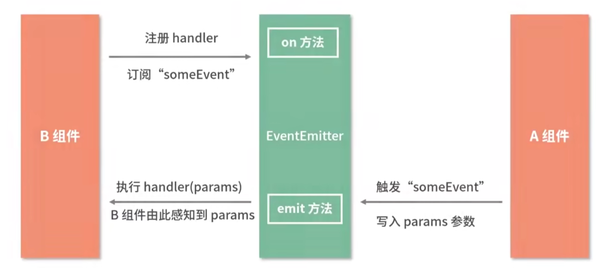

# React组件通信

**单向数据流**

当前组件的 state 以 props 的形式流动时，组件不会改变接收的数据，只会监听数据的变化，当数据发生变化时它们会使用接收到的新值，而不是去修改已有的值。

| 通信组件         | 方法                                                         | 介绍 |
| ---------------- | ------------------------------------------------------------ | ---- |
| 父->子 组件通信  | 父组件通过**传递 Props** 给子组件                            |      |
| 子->父 组件通信  | 子组件调用父组件**函数参数**：<br />父组件传递给子组件的是一个绑定了自身上下文的函数<br/>那么子组件在调用该函数时就可以将想要交给父组件的数据以函数入参的形式给出去 |      |
| 兄弟组件通信     | **状态提升**：将两个兄弟组件公共状态提升到公共父组件中，通过父组件 props 和 事件传递 |      |
| 跨层级的组件通信 | **Context API**                                              |      |
| 任意组件通信     | **发布订阅**机制、Redux                                      |      |

在React中，组件间的通信主要通过props和回调函数实现：父组件通过props将数据或函数传递给子组件，子组件则可以通过这些props来接收数据和触发回调函数，从而实现与父组件的通信。

对于跨层级的组件通信，React提供了Context API。Context提供了一种在组件树中共享值的方式，无需显式地通过每一层组件传递props。


## 父组件向子组件传递

由于`React`的数据流动为单向的，父组件向子组件传递是最常见的方式

父组件在调用子组件的时候，只需要在子组件标签内传递参数，子组件通过`props`属性就能接收父组件传递过来的参数

```jsx
function EmailInput(props) {
  // 子组件通过 props 属性就能接收父组件传递过来的参数
  return (
    <label>
      Email: <input value={props.email} />
    </label>
  );
}

const element = <EmailInput email="123124132@163.com" />;
```


## 子组件向父组件传递

子组件向父组件通信的基本思路是，父组件向子组件传一个函数，然后通过这个函数的回调，拿到子组件传过来的值

父组件对应代码如下：

```jsx
class Parents extends Component {
  constructor() {
    super();
    this.state = {
      price: 0
    };
  }

  getItemPrice(e) {
    this.setState({
      price: e
    });
  }

  render() {
    return (
      <div>
        <div>price: {this.state.price}</div>
        {/* 向子组件中传入一个函数  */}
        <Child getPrice={this.getItemPrice.bind(this)} />
      </div>
    );
  }
}
```

子组件对应代码如下：

```jsx
class Child extends Component {
  clickGoods(e) {
    // 在此函数中传入值
    this.props.getPrice(e);
  }

  render() {
    return (
      <div>
        <button onClick={this.clickGoods.bind(this, 100)}>goods1</button>
        <button onClick={this.clickGoods.bind(this, 1000)}>goods2</button>
      </div>
    );
  }
}
```

## 兄弟组件之间的通信

如果是兄弟组件之间的传递，则父组件作为中间层来实现数据的互通，将两个兄弟组件公共状态提升到公共父组件中，通过父组件 props 和 事件传递

```jsx
class Parent extends React.Component {
  constructor(props) {
    super(props)
    // 子组件通过公共状态通信
    this.state = {count: 0}
  }
  // 子组件通过公共方法通信
  setCount = () => {
    this.setState({count: this.state.count + 1})
  }
  render() {
    return (
      <div>
        <SiblingA
          count={this.state.count}
        />
        <SiblingB
          onClick={this.setCount}
        />
      </div>
    );
  }
}
```

## 父组件向后代组件传递

[**Context API**](https://zh-hans.react.dev/learn/passing-data-deeply-with-context):

父组件向后代组件传递数据是一件最普通的事情，就像全局数据一样;

使用`context`提供了组件之间通讯的一种方式，可以共享数据，其他数据都能读取对应的数据;

1. 通过使用 `React.createContext` 创建一个`context`

```js
 const PriceContext = React.createContext('price')
```

2. `context` 创建成功后，其下存在`Provider`组件用于创建数据源，`Consumer` 组件用于接收数据，使用实例如下：

* `Provider ` 组件通过 `value` 属性用于给后代组件传递数据：

```jsx
<PriceContext.Provider value={100}>
</PriceContext.Provider>
```

* 如果想要获取 `Provider` 传递的数据，可以通过 `Consumer` 组件或者或者使用 `contextType` 属性接收，对应分别如下：

```jsx
class MyClass extends React.Component {
  static contextType = PriceContext;
  render() {
    let price = this.context;
    /* 基于这个值进行渲染工作 */
  }
}
```

`Consumer`组件：

```jsx
<PriceContext.Consumer>
    { /*这里是一个函数*/ }
    {
        price => <div>price：{price}</div>
    }
</PriceContext.Consumer>
```


### **发布订阅机制**




------

