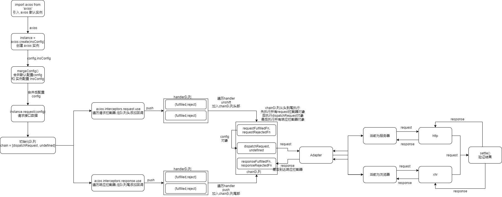
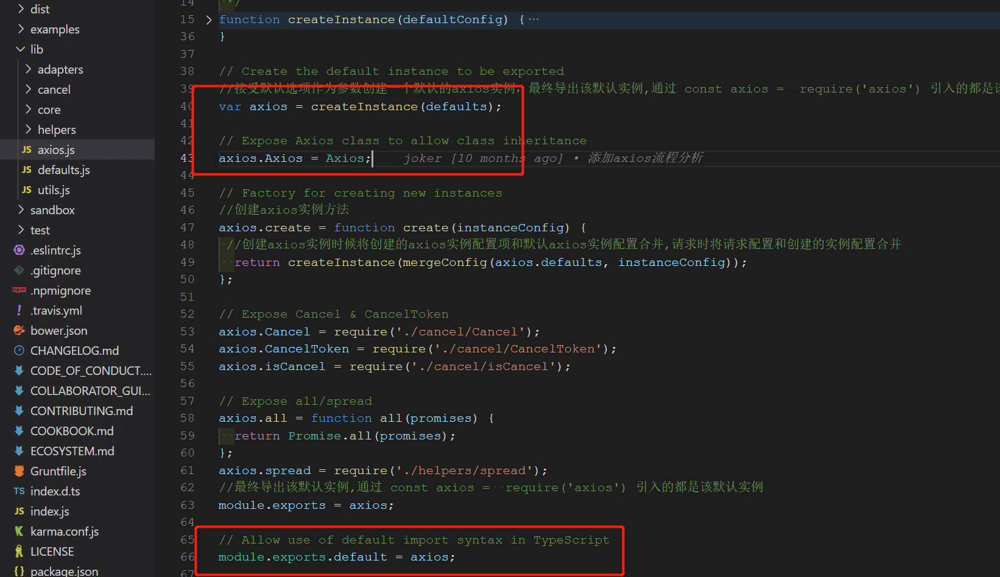
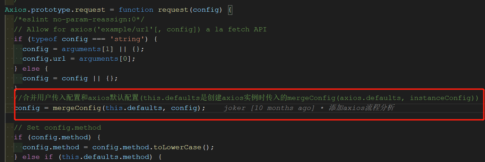

# Axios 源码分析

### 概念和API

* 概念：Axios 是一个基于 promise 的网络请求库，可以用于浏览器和 node.js。它是 *[isomorphic](https://www.lullabot.com/articles/what-is-an-isomorphic-application)* 的(即同一套代码可以运行在浏览器和node.js中)。在服务端它使用原生 node.js `http` 模块, 而在客户端 (浏览端) 则使用 XMLHttpRequests。
* 特性:
  - 从浏览器创建 [XMLHttpRequests](https://developer.mozilla.org/en-US/docs/Web/API/XMLHttpRequest)
  - 从 node.js 创建 [http](http://nodejs.org/api/http.html) 请求
  - 支持 [Promise](https://developer.mozilla.org/en-US/docs/Web/JavaScript/Reference/Global_Objects/Promise) API
  - 拦截请求和响应
  - 转换请求和响应数据
  - 取消请求
  - 自动转换JSON数据
  - 客户端支持防御[XSRF](http://en.wikipedia.org/wiki/Cross-site_request_forgery)：添加 `xsrf` 头，默认为 cookie的编码值： `{ 'X-XSRF-TOKEN':decodeURIComponent(document.cookie) }`
* 常用 API：
  * `axios.request(config)`
  * `axios.get(url[, config])`
  * `axios.delete(url[, config])`
  * `axios.head(url[, config])`
  * `axios.options(url[, config])`
  * `axios.post(url[, data[, config]])`
  * `axios.put(url[, data[, config]])`
  * `axios.patch(url[, data[, config]])`
  * 并发请求：`Promise.all()`
  * 创建实例: `axios.create([config])`

### 执行流程



* axios 执行流程：
  1. 在实例化 axios 时，通过创建 axios 实例添加实例配置或修改默认配置
  2. 使用 `axios.interceptors.request.use` 往 axios 实例中添加请求/响应拦截器
  4. 请求方法调用 `request()` 方法 (axios的所有请求方法都是该方法的封装)
  5. request() 方法中循环遍历 request interceptors 和 response interceptors，分别将 request 和 respose 拦截器实例加入 chain 队列头部和尾部，生成 [请求拦截器, dispatchRequest, 响应拦截器] 堆栈(使用了promise的链式调用)
  6. 循环遍历执行堆栈: 传入 config promise 对象 -> 执行所有 request handler -> dispatchRequest -> Adapter 对象 -> 根据环境调用 http/xhr 对象 -> settle() 方法验证结果 -> 执行所有响应拦截器对象 -> 前端/服务器。
  6. 前端/服务器使用axios请求方法发起请求 (axios.get, axios.post ...)

### axios 实例

axios 实例使用方式:

- 第1种使用方式：`axios(option)`

```javascript
axios({
  url,
  method,
  headers,
})
```

- 第2种使用方式：`axios(url[, option])`

```javascript
axios(url, {
  method,
  headers,
})
```

- 第3种使用方式（对于get、delete等方法）：`axios[method`](url[, option])

```javascript
axios.get(url, {
  headers,
})
```

- 第4种使用方式（对于post、put等方法）：`axios[method`](url[, data[, option]])

```javascript
axios.post(url, data, {
  headers,
})
```

- 第5种使用方式：`axios.request(option)`

```javascript
axios.request({
  url,
  method,
  headers,
})
```


#### axios 默认实例

* 导入默认 axios 实例：`import axios from 'axios'`

* axios 默认导出一个实例，修改了axios的默认配置，会影响所有的请求。

  * 当在 a.js 文件中导入 axios 并修改默认配置后

    ```js
    // a.js
    import axios from 'axios'
    axios.defaults.baseURL = 'https://api.example.com';
    ```

  * 如果 b.js 中依赖 a.js 文件，在 b.js 中导入 axios，则 b.js 中的 axios 实例被 a.js 中影响

    ```js
    //b.js
    import axios from 'axios'
    console.log(axios.defaults.baseURL) //https://api.example.com
    ```

  * 解决方案： 每一个独立导入 axios 的文件中都创建新的 axios 实例，再修改配置。


**源码分析：**

* 在入口文件中：使用默认配置创建一个 axios 实例并导出。定义在 [lib/axios.js](https://github.com/axios/axios/blob/master/lib/axios.js)

  


*  axios 实例对象定义默认配置和拦截器：定义在 [lib/core/Axios.js](https://github.com/axios/axios/blob/master/lib/core/Axios.js)

  

#### 创建实例

* API ： `axios.create([config])`

  ```js
  const instance = axios.create({
    baseURL: 'https://some-domain.com/api/',
    timeout: 1000,
    headers: {'X-Custom-Header': 'foobar'}
  });
  ```

**源码分析**

* `axios.create([config]) ` 通过传入实例参数，合并默认配置和传入配置项，使用原型式继承创建新的实例。定义在 [lib/axios.js](https://github.com/axios/axios/blob/master/lib/axios.js)

  

### 配置

axios 配置分为三类：

* axios 默认配置：创建默认 axios 实例的默认配置；
* axios 用户自定义实例配置： 通过 `axios.create(config)` 时传入的配置；
* 请求的 `config` 配置： 在实例使用时传入的配置项。

#### 默认配置

* 全局配置 `axios.defaults`

* 自定义实例配置：

  ```js
  // 创建实例时配置默认值
  const instance = axios.create({
    baseURL: 'https://api.example.com'
  });
  
  // 创建实例后修改默认值
  instance.defaults
  ```

* 请求配置选项。只有 `url` 是必需的。如果没有指定 `method`，请求将默认使用 `GET` 方法。

  ```javascript
  {
    // `url` 是用于请求的服务器 URL
    url: '/user',
  
    // `method` 是创建请求时使用的方法
    method: 'get', // 默认值
  
    // `baseURL` 将自动加在 `url` 前面，除非 `url` 是一个绝对 URL。
    // 它可以通过设置一个 `baseURL` 便于为 axios 实例的方法传递相对 URL
    baseURL: 'https://some-domain.com/api/',
  
    // `transformRequest` 允许在向服务器发送前，修改请求数据
    // 它只能用与 'PUT', 'POST' 和 'PATCH' 这几个请求方法
    // 数组中最后一个函数必须返回一个字符串， 一个Buffer实例，ArrayBuffer，FormData，或 Stream
    // 你可以修改请求头。
    transformRequest: [function (data, headers) {
      // 对发送的 data 进行任意转换处理
  
      return data;
    }],
  
    // `transformResponse` 在传递给 then/catch 前，允许修改响应数据
    transformResponse: [function (data) {
      // 对接收的 data 进行任意转换处理
  
      return data;
    }],
  
    // 自定义请求头
    headers: {'X-Requested-With': 'XMLHttpRequest'},
  
    // `params` 是与请求一起发送的 URL 参数
    // 必须是一个简单对象或 URLSearchParams 对象
    params: {
      ID: 12345
    },
  
    // `paramsSerializer`是可选方法，主要用于序列化`params`
    // (e.g. https://www.npmjs.com/package/qs, http://api.jquery.com/jquery.param/)
    paramsSerializer: function (params) {
      return Qs.stringify(params, {arrayFormat: 'brackets'})
    },
  
    // `data` 是作为请求体被发送的数据
    // 仅适用 'PUT', 'POST', 'DELETE 和 'PATCH' 请求方法
    // 在没有设置 `transformRequest` 时，则必须是以下类型之一:
    // - string, plain object, ArrayBuffer, ArrayBufferView, URLSearchParams
    // - 浏览器专属: FormData, File, Blob
    // - Node 专属: Stream, Buffer
    data: {
      firstName: 'Fred'
    },
    
    // 发送请求体数据的可选语法
    // 请求方式 post
    // 只有 value 会被发送，key 则不会
    data: 'Country=Brasil&City=Belo Horizonte',
  
    // `timeout` 指定请求超时的毫秒数。
    // 如果请求时间超过 `timeout` 的值，则请求会被中断
    timeout: 1000, // 默认值是 `0` (永不超时)
  
    // `withCredentials` 表示跨域请求时是否需要使用凭证
    withCredentials: false, // default
  
    // `adapter` 允许自定义处理请求，这使测试更加容易。
    // 返回一个 promise 并提供一个有效的响应 （参见 lib/adapters/README.md）。
    adapter: function (config) {
      /* ... */
    },
  
    // `auth` HTTP Basic Auth
    auth: {
      username: 'janedoe',
      password: 's00pers3cret'
    },
  
    // `responseType` 表示浏览器将要响应的数据类型
    // 选项包括: 'arraybuffer', 'document', 'json', 'text', 'stream'
    // 浏览器专属：'blob'
    responseType: 'json', // 默认值
  
    // `responseEncoding` 表示用于解码响应的编码 (Node.js 专属)
    // 注意：忽略 `responseType` 的值为 'stream'，或者是客户端请求
    // Note: Ignored for `responseType` of 'stream' or client-side requests
    responseEncoding: 'utf8', // 默认值
  
    // `xsrfCookieName` 是 xsrf token 的值，被用作 cookie 的名称
    xsrfCookieName: 'XSRF-TOKEN', // 默认值
  
    // `xsrfHeaderName` 是带有 xsrf token 值的http 请求头名称
    xsrfHeaderName: 'X-XSRF-TOKEN', // 默认值
  
    // `onUploadProgress` 允许为上传处理进度事件
    // 浏览器专属
    onUploadProgress: function (progressEvent) {
      // 处理原生进度事件
    },
  
    // `onDownloadProgress` 允许为下载处理进度事件
    // 浏览器专属
    onDownloadProgress: function (progressEvent) {
      // 处理原生进度事件
    },
  
    // `maxContentLength` 定义了node.js中允许的HTTP响应内容的最大字节数
    maxContentLength: 2000,
  
    // `maxBodyLength`（仅Node）定义允许的http请求内容的最大字节数
    maxBodyLength: 2000,
  
    // `validateStatus` 定义了对于给定的 HTTP状态码是 resolve 还是 reject promise。
    // 如果 `validateStatus` 返回 `true` (或者设置为 `null` 或 `undefined`)，
    // 则promise 将会 resolved，否则是 rejected。
    validateStatus: function (status) {
      return status >= 200 && status < 300; // 默认值
    },
  
    // `maxRedirects` 定义了在node.js中要遵循的最大重定向数。
    // 如果设置为0，则不会进行重定向
    maxRedirects: 5, // 默认值
  
    // `socketPath` 定义了在node.js中使用的UNIX套接字。
    // e.g. '/var/run/docker.sock' 发送请求到 docker 守护进程。
    // 只能指定 `socketPath` 或 `proxy` 。
    // 若都指定，这使用 `socketPath` 。
    socketPath: null, // default
  
    // `httpAgent` and `httpsAgent` define a custom agent to be used when performing http
    // and https requests, respectively, in node.js. This allows options to be added like
    // `keepAlive` that are not enabled by default.
    httpAgent: new http.Agent({ keepAlive: true }),
    httpsAgent: new https.Agent({ keepAlive: true }),
  
    // `proxy` 定义了代理服务器的主机名，端口和协议。
    // 您可以使用常规的`http_proxy` 和 `https_proxy` 环境变量。
    // 使用 `false` 可以禁用代理功能，同时环境变量也会被忽略。
    // `auth`表示应使用HTTP Basic auth连接到代理，并且提供凭据。
    // 这将设置一个 `Proxy-Authorization` 请求头，它会覆盖 `headers` 中已存在的自定义 `Proxy-Authorization` 请求头。
    // 如果代理服务器使用 HTTPS，则必须设置 protocol 为`https`
    proxy: {
      protocol: 'https',
      host: '127.0.0.1',
      port: 9000,
      auth: {
        username: 'mikeymike',
        password: 'rapunz3l'
      }
    },
  
    // see https://axios-http.com/docs/cancellation
    cancelToken: new CancelToken(function (cancel) {
    }),
  
    // `decompress` indicates whether or not the response body should be decompressed 
    // automatically. If set to `true` will also remove the 'content-encoding' header 
    // from the responses objects of all decompressed responses
    // - Node only (XHR cannot turn off decompression)
    decompress: true // 默认值
  
  }
  ```

**源码分析：**

* 默认配置选项在创建 axios 默认实例时传入，定义在 [lib/defaults.js](https://github.com/axios/axios/blob/master/lib/defaults.js)

  ```js
  var defaults = {
    adapter: getDefaultAdapter(),
  
    transformRequest: [function transformRequest(data, headers) {
      normalizeHeaderName(headers, 'Accept');
      normalizeHeaderName(headers, 'Content-Type');
      if (utils.isFormData(data) ||
        utils.isArrayBuffer(data) ||
        utils.isBuffer(data) ||
        utils.isStream(data) ||
        utils.isFile(data) ||
        utils.isBlob(data)
      ) {
        return data;
      }
      if (utils.isArrayBufferView(data)) {
        return data.buffer;
      }
      if (utils.isURLSearchParams(data)) {
        setContentTypeIfUnset(headers, 'application/x-www-form-urlencoded;charset=utf-8');
        return data.toString();
      }
      if (utils.isObject(data)) {
        setContentTypeIfUnset(headers, 'application/json;charset=utf-8');
        return JSON.stringify(data);
      }
      return data;
    }],
  
    transformResponse: [function transformResponse(data) {
      /*eslint no-param-reassign:0*/
      if (typeof data === 'string') {
        try {
          data = JSON.parse(data);
        } catch (e) { /* Ignore */ }
      }
      return data;
    }],
  
    /**
     * A timeout in milliseconds to abort a request. If set to 0 (default) a
     * timeout is not created.
     */
    timeout: 0,
  
    xsrfCookieName: 'XSRF-TOKEN',
    xsrfHeaderName: 'X-XSRF-TOKEN',
  
    maxContentLength: -1,
    maxBodyLength: -1,
  
    validateStatus: function validateStatus(status) {
      return status >= 200 && status < 300;
    }
  };
  
  defaults.headers = {
    common: {
      'Accept': 'application/json, text/plain, */*'
    }
  };
  
  utils.forEach(['delete', 'get', 'head'], function forEachMethodNoData(method) {
    defaults.headers[method] = {};
  });
  
  utils.forEach(['post', 'put', 'patch'], function forEachMethodWithData(method) {
    defaults.headers[method] = utils.merge(DEFAULT_CONTENT_TYPE);
  });
  ```

  

#### 配置信息合并

* 请求配置信息合并策略：请求的 `config` 参数 > 实例的 `defaults` 属性 > 库默认值。

  ```js
  // 使用库提供的默认配置创建实例
  // 此时超时配置的默认值是 `0`
  const instance = axios.create();
  
  // 重写库的超时默认值
  // 现在，所有使用此实例的请求都将等待2.5秒，然后才会超时
  instance.defaults.timeout = 2500;
  
  // 重写此请求的超时时间，因为该请求需要很长时间
  instance.get('/longRequest', {
    timeout: 5000
  });
  ```

**源码分析**

* 在 ` axios.create(config)` 创建实例时候，将传入 配置项与默认配置项目通过 `mergeConfig` 合并，将实例配置覆盖默认配置。

  

* 在实际请求过程中，调用 `axios.request()` 方法请求，该方法将实际请求配置与默认配置合并，用实际配置覆盖默认配置。

  
  
* `mergeConfig`定义在[lib/core/mergeConfig.js](https://github.com/axios/axios/blob/e9965bfafc82d8b42765705061b9ebe2d5532493/lib/core/mergeConfig.js)

  ```js
  module.exports = function mergeConfig(config1, config2) {
    // eslint-disable-next-line no-param-reassign
    config2 = config2 || {};
    var config = {};
  
    var valueFromConfig2Keys = ['url', 'method', 'data'];
    var mergeDeepPropertiesKeys = ['headers', 'auth', 'proxy', 'params'];
    var defaultToConfig2Keys = [
      'baseURL', 'transformRequest', 'transformResponse', 'paramsSerializer',
      'timeout', 'timeoutMessage', 'withCredentials', 'adapter', 'responseType', 'xsrfCookieName',
      'xsrfHeaderName', 'onUploadProgress', 'onDownloadProgress', 'decompress',
      'maxContentLength', 'maxBodyLength', 'maxRedirects', 'transport', 'httpAgent',
      'httpsAgent', 'cancelToken', 'socketPath', 'responseEncoding'
    ];
    var directMergeKeys = ['validateStatus'];
  
    function getMergedValue(target, source) {
      if (utils.isPlainObject(target) && utils.isPlainObject(source)) {
        return utils.merge(target, source);
      } else if (utils.isPlainObject(source)) {
        return utils.merge({}, source);
      } else if (utils.isArray(source)) {
        return source.slice();
      }
      return source;
    }
  
    function mergeDeepProperties(prop) {
      if (!utils.isUndefined(config2[prop])) {
        config[prop] = getMergedValue(config1[prop], config2[prop]);
      } else if (!utils.isUndefined(config1[prop])) {
        config[prop] = getMergedValue(undefined, config1[prop]);
      }
    }
  
    utils.forEach(valueFromConfig2Keys, function valueFromConfig2(prop) {
      if (!utils.isUndefined(config2[prop])) {
        config[prop] = getMergedValue(undefined, config2[prop]);
      }
    });
  
    utils.forEach(mergeDeepPropertiesKeys, mergeDeepProperties);
  
    utils.forEach(defaultToConfig2Keys, function defaultToConfig2(prop) {
      if (!utils.isUndefined(config2[prop])) {
        config[prop] = getMergedValue(undefined, config2[prop]);
      } else if (!utils.isUndefined(config1[prop])) {
        config[prop] = getMergedValue(undefined, config1[prop]);
      }
    });
  
    utils.forEach(directMergeKeys, function merge(prop) {
      if (prop in config2) {
        config[prop] = getMergedValue(config1[prop], config2[prop]);
      } else if (prop in config1) {
        config[prop] = getMergedValue(undefined, config1[prop]);
      }
    });
  
    var axiosKeys = valueFromConfig2Keys
      .concat(mergeDeepPropertiesKeys)
      .concat(defaultToConfig2Keys)
      .concat(directMergeKeys);
  
    var otherKeys = Object
      .keys(config1)
      .concat(Object.keys(config2))
      .filter(function filterAxiosKeys(key) {
        return axiosKeys.indexOf(key) === -1;
      });
  
    utils.forEach(otherKeys, mergeDeepProperties);
  
    return config;
  };
  ```

  

****

#### 响应信息

* 响应信息。

  ```javascript
  {
    // `data` 由服务器提供的响应
    data: {},
  
    // `status` 来自服务器响应的 HTTP 状态码
    status: 200,
  
    // `statusText` 来自服务器响应的 HTTP 状态信息
    statusText: 'OK',
  
    // `headers` 是服务器响应头
    // 所有的 header 名称都是小写，而且可以使用方括号语法访问
    // 例如: `response.headers['content-type']`
    headers: {},
  
    // `config` 是 `axios` 请求的配置信息
    config: {},
  
    // `request` 是生成此响应的请求
    // 在node.js中它是最后一个ClientRequest实例 (in redirects)，
    // 在浏览器中则是 XMLHttpRequest 实例
    request: {}
  }
  ```

### 拦截器

* 添加拦截器：在请求或响应被 then 或 catch 处理前拦截它们。

  ```js
  // 添加请求拦截器
  axios.interceptors.request.use(function (config) {
      // 在发送请求之前做些什么
      return config;
    }, function (error) {
      // 对请求错误做些什么
      return Promise.reject(error);
    });
  
  // 添加响应拦截器
  axios.interceptors.response.use(function (response) {
      // 2xx 范围内的状态码都会触发该函数。
      // 对响应数据做点什么
      return response;
    }, function (error) {
      // 超出 2xx 范围的状态码都会触发该函数。
      // 对响应错误做点什么
      return Promise.reject(error);
    });
  ```

* 移除拦截器：

  ```js
  const myInterceptor = axios.interceptors.request.use(function () {/*...*/});
  axios.interceptors.request.eject(myInterceptor);
  ```

* 自定义的 axios 实例添加拦截器。

  ```js
  const instance = axios.create();
  instance.interceptors.request.use(function () {/*...*/});
  ```


**源码分析**

* axios 对象中拦截器的定义在 axios 实例中： [lib/core/Axios.js](https://github.com/axios/axios/blob/e9965bfafc82d8b42765705061b9ebe2d5532493/lib/core/Axios.js)

  ```js
  function Axios(instanceConfig) {
    this.defaults = instanceConfig;
    this.interceptors = {
      request: new InterceptorManager(), //请求拦截器
      response: new InterceptorManager() //响应拦截器
    };
  }
  ```

* 拦截器定义：拦截器实际是一个队列，use 方法往队列中添加拦截器。定义在[lib/core/InterceptorManager.js](https://github.com/axios/axios/blob/e9965bfafc82d8b42765705061b9ebe2d5532493/lib/core/InterceptorManager.js)

  ```js
  //拦截器对象
  function InterceptorManager() {
    this.handlers = []; //拦截器堆栈
  }
  
  /**
   * Add a new interceptor to the stack
   * 往拦截器堆栈中添加拦截器
   * @param {Function} fulfilled The function to handle `then` for a `Promise`
   * @param {Function} rejected The function to handle `reject` for a `Promise`
   *
   * @return {Number} An ID used to remove interceptor later
   */
  InterceptorManager.prototype.use = function use(fulfilled, rejected) {
    this.handlers.push({
      fulfilled: fulfilled,
      rejected: rejected
    });
    return this.handlers.length - 1;
  };
  
  /**
   * Remove an interceptor from the stack
   *
   * @param {Number} id The ID that was returned by `use`
   */
  InterceptorManager.prototype.eject = function eject(id) {
    if (this.handlers[id]) {
      this.handlers[id] = null;
    }
  };
  
  /**
   * Iterate over all the registered interceptors
   *
   * This method is particularly useful for skipping over any
   * interceptors that may have become `null` calling `eject`.
   *
   * @param {Function} fn The function to call for each interceptor
   */
  InterceptorManager.prototype.forEach = function forEach(fn) {
    utils.forEach(this.handlers, function forEachHandler(h) {
      if (h !== null) {
        fn(h);
      }
    });
  };
  
  ```

### 请求方法

#### 核心方法:request

* Axios 构造函数的核心方法是 request 方法，各种 axios 的调用方式最终都是通过`axios.request(config)`方法发请求的。

* `axios.request(config)` 主要流程：

  * 合并请求配置；
  * 创建循环队列，队列初始数据为请求适配器对象；
  * 遍历请求拦截器队列，往循环队列头中添加请求拦截器；
  * 遍历响应拦截器队列，往循环队列尾部添加响应拦截器；
  * 串行执行异步循环队列；
    * 注意：axios 请求是串行执行异步请求的，也就是说会按照请求入队列的逆序执行，某个请求的响应会等待上一个请求的响应返回后才能执行。

* 源码：定义在 [lib/core/Axios.js](https://github.com/axios/axios/blob/e9965bfafc82d8b42765705061b9ebe2d5532493/lib/core/Axios.js)

  ```js
  Axios.prototype.request = function request(config) {
    /*eslint no-param-reassign:0*/
    // Allow for axios('example/url'[, config]) a la fetch API
    if (typeof config === 'string') {
      config = arguments[1] || {};
      config.url = arguments[0];
    } else {
      config = config || {};
    }
    //合并用户传入配置和axios默认配置(this.defaults是创建axios实例时传入的mergeConfig(axios.defaults, instanceConfig))
    config = mergeConfig(this.defaults, config);
  
    // Set config.method
    if (config.method) {
      config.method = config.method.toLowerCase();
    } else if (this.defaults.method) {
      config.method = this.defaults.method.toLowerCase();
    } else {
      config.method = 'get';
    }
  
    // Hook up interceptors middleware
    //循环队列
    var chain = [dispatchRequest, undefined];
    // 将config对象当作参数传给Primise.resolve方法
    var promise = Promise.resolve(config);
    //遍历所有请求拦截器，将所有请求拦截器添加到循环队列头部
    this.interceptors.request.forEach(function unshiftRequestInterceptors(interceptor) {
      chain.unshift(interceptor.fulfilled, interceptor.rejected);
    });
     //遍历所有响应拦截器，将所有响应拦截器添加到循环队列尾部
    this.interceptors.response.forEach(function pushResponseInterceptors(interceptor) {
      chain.push(interceptor.fulfilled, interceptor.rejected);
    });
  
    // 添加了拦截器后的chain数组大概会是这样的：
    // [
    //   requestFulfilledFn, requestRejectedFn, ..., 
    //   dispatchRequest, undefined,
    //   responseFulfilledFn, responseRejectedFn, ....,
    // ]
    // config会按序通过 请求拦截器 - dispatchRequest方法 - 响应拦截器
    while (chain.length) {
      // 串行执行循环队列 chain
      promise = promise.then(chain.shift(), chain.shift());
    }
  
    return promise;
  };
  ```

**模拟实现请求队列**

```js
//请求1
let req1 = function () {
  return new Promise(function (resolve, reject) {
    console.log('request1 start->')
    setTimeout(function () {
      resolve('request1->')
      console.log('request1 end->')
    }, 1000)
  })
}

// 请求2
let req2 = function (data) {
  return new Promise(function (resolve, reject) {
    console.log('request2 start->')
    resolve(data + 'request2->')
    console.log('request2 end->')
  })
}

// 请求3
let req3 = function (data) {
  return new Promise(function (resolve, reject) {
    console.log('request3 start->')
    setTimeout(function () {
      resolve(data + 'request3->')
      console.log('request3 end->')
    }, 500)
  })
}

//响应1
let res1 = function () {
  return new Promise(function (resolve, reject) {
    setTimeout(function () {
      console.log('get response1->')
      resolve('response1 ->')
    }, 1100)
  })
}
//响应数据2
let res2 = function (data) {
  return new Promise(function (resolve, reject) {
    console.log('get response2->')
    resolve(data + 'response2->')
  })
}

let res3 = function (data) {
  return new Promise(function (resolve, reject) {
    setTimeout(function () {
      console.log('get response3->')
      resolve(data + 'response3->')
    }, 500)
  })
}

let chain = []
let requeseInter = [req1,req2,req3]
let responseInter = [res1,res2,res3]

requeseInter.forEach(p=>chain.unshift(p));
responseInter.forEach(p=>chain.push(p));

let promise = Promise.resolve({})
while(chain.length){
    promise  = promise.then(chain.shift());
}
console.log(promise)
```

执行结果：


#### 其他请求方法

* Axios 实例就是一个 axios 应用，其他方法都是对 Axios 内容的扩展，axios 构造函数的核心方法是 request 方法，各种 axios 的调用方式最终都是通过 request 方法发请求的。

* * `axios.get(url[, config])`
  * `axios.delete(url[, config])`
  * `axios.head(url[, config])`
  * `axios.options(url[, config])`
  * `axios.post(url[, data[, config]])`
  * `axios.put(url[, data[, config]])`
  * `axios.patch(url[, data[, config]])`

* * `axios.get(url[, config])`
  * `axios.delete(url[, config])`
  * `axios.head(url[, config])`
  * `axios.options(url[, config]).`
  * `axios.post(url[, data[, config]])`
  * `axios.put(url[, data[, config]])`
  * `axios.patch(url[, data[, config]])`

* 实现：遍历方法名，合并配置项目参数，返回 reques 方法。定义在 [lib/core/Axios.js](https://github.com/axios/axios/blob/e9965bfafc82d8b42765705061b9ebe2d5532493/lib/core/Axios.js)

  ```js
  // Provide aliases for supported request methods
  //所有请求方法都是封装 request 方法
  utils.forEach(['delete', 'get', 'head', 'options'], function forEachMethodNoData(method) {
    /*eslint func-names:0*/
    Axios.prototype[method] = function(url, config) {
      return this.request(mergeConfig(config || {}, {
        method: method,
        url: url
      }));
    };
  });
  
  utils.forEach(['post', 'put', 'patch'], function forEachMethodWithData(method) {
    /*eslint func-names:0*/
    Axios.prototype[method] = function(url, data, config) {
      return this.request(mergeConfig(config || {}, {
        method: method,
        url: url,
        data: data
      }));
    };
  });
  ```


### 发送请求

* 在 axios 中请求方法都是通过 axios.request 完成，上面分析过：request 中初始队列中使用 `dispatchRequest` 方法，当拦截器队列中所有请求被串行执行完成后，执行 `dispatchRequest` 方法，最后执行响应拦截器。

* `dispatchRequest` 方法：定义在[/lib/core/dispatchRequest.js](https://github.com/axios/axios/blob/e9965bfafc82d8b42765705061b9ebe2d5532493/lib/core/dispatchRequest.js)

  * 检查是否取消，若取消则抛出请求取消错误；
  * 处理请求配置 config、转换请求格式；
  * 使用适配器发送请求；
  * 最后处理响应数据：首先检查请求是否已经取消，已经取消抛出请求取消错误；否则转换响应数据并返回。

  ```javascript
  /**
   * Dispatch a request to the server using the configured adapter.
   * 使用配置的适配器发送请求
   * @param {object} config The config that is to be used for the request
   * @returns {Promise} The Promise to be fulfilled
   */
  module.exports = function dispatchRequest(config) {
    throwIfCancellationRequested(config); //如果已请求取消，抛出' Cancel '。
  
    // Ensure headers exist
    config.headers = config.headers || {};
  
    // Transform request data
    //transformRequest 是在配置请求配置时候传入的自定义转换方法，在此处请求前转换。
    config.data = transformData(
      config.data,
      config.headers,
      config.transformRequest
    );
  
    // Flatten headers
    config.headers = utils.merge(
      config.headers.common || {},
      config.headers[config.method] || {},
      config.headers
    );
  
    utils.forEach(
      ['delete', 'get', 'head', 'post', 'put', 'patch', 'common'],
      function cleanHeaderConfig(method) {
        delete config.headers[method];
      }
    );
  
    var adapter = config.adapter || defaults.adapter;
  
    return adapter(config).then(function onAdapterResolution(response) { //响应成功处理方法
      throwIfCancellationRequested(config);
  
      // Transform response data
      // 
      response.data = transformData(
        response.data,
        response.headers,
        config.transformResponse
      );
  
      return response;
    }, function onAdapterRejection(reason) { //响应失败处理方法
      if (!isCancel(reason)) {
        throwIfCancellationRequested(config);
  
        // Transform response data
        if (reason && reason.response) {
          reason.response.data = transformData(
            reason.response.data,
            reason.response.headers,
            config.transformResponse
          );
        }
      }
  
      return Promise.reject(reason);
    });
  };
  ```


### 适配器

* Axios 是一个基于 promise 的网络请求库，可以用于浏览器和 node.js。它是 *[isomorphic](https://www.lullabot.com/articles/what-is-an-isomorphic-application)* 的(即同一套代码可以运行在浏览器和node.js中)。在服务端它使用原生 node.js `http` 模块, 而在客户端 (浏览端) 则使用 XMLHttpRequests。
* isomorphic 的实现，使用适配器设计模式来屏蔽平台的差异性，让使用者可以在浏览器端和 NodeJS 环境中使用同一套 API 发起 http 请求。
* http请求适配器就是一个方法，在axios项目里，http请求适配器主要指两种：XHR 和 HTTP。
  * XHR：核心是浏览器端的XMLHttpRequest对象。
  * HTTP：核心是 node 的 http/https 的 request 方法。

**源码分析：**

* 添加默认是适配器：

  * 在默认导入 axios 实例时，axios 使用默配置创建 axios 实例。

  * 在 [lib/defaults.js](https://github.com/axios/axios/blob/master/lib/defaults.js)默认配置中使用 `getDefaultAdapter` 获取默认 adapter 适配器。

  * `getDefaultAdapter` 方法：判断 `XMLHttpRequest` 和 `process` 对象，获取 xhr/http 适配器。

    

* 使用适配器：

  * 在上节中分析到： request 串行请求遍历拦截器 -> `dispatchRequest` 返送请求 -> 返回适配器。流程中`dispatchRequest` 方法调用适配器。

* XHR 适配器： 创建 `XMLHttpReques` 对象，添加请求结果处理、中断超时处理、错误处理方法，进行参数转换、xsrf 处理、请求取消处理等。定义在[lib/adapters/xhr.js](https://github.com/axios/axios/blob/e9965bfafc82d8b42765705061b9ebe2d5532493/lib/adapters/xhr.js)

* HTTP 适配器： 参数、配置处理，根据配置创建 http/https/httpsFollow/httpFollow 对象，发送请求。

* 适配器中结果返回后，统一调用 sette() 方法进行结果验证。

* settle 方法： 使用配置参数中自定义验证方法验证结果。

  ```js
  // /lib/core/settle.js
  module.exports = function settle(resolve, reject, response) {
    var validateStatus = response.config.validateStatus;
    if (!validateStatus || validateStatus(response.status)) {
      resolve(response);
    } else {
      reject(createError(
        'Request failed with status code ' + response.status,
        response.config,
        null,
        response.request,
        response
      ));
    }
  };
  ```

  

### 取消请求

* 使用 *cancel token* 取消一个请求：Axios 的 cancel token API 是基于被撤销 [cancelable promises proposal](https://github.com/tc39/proposal-cancelable-promises)。

* 可以使用同一个 cancel token 取消多个请求。

* 取消请求方式：

  * 传递一个 executor 函数到 `CancelToken` 的构造函数来创建一个 cancel token：

    ```js
    const CancelToken = axios.CancelToken;
    let cancel;
    
    axios.get('/user/12345', {
      cancelToken: new CancelToken(function executor(c) {
        // executor 函数接收一个 cancel 函数作为参数，调用 cancel 函数可以取消请求操作
        cancel = c;
      })
    });
    
    // 取消请求
    cancel();
    ```

  * 使用 `CancelToken.source` 工厂方法创建一个 cancel token ：

    ```js
    const CancelToken = axios.CancelToken;
    const source = CancelToken.source();
    
    axios.get('/user/12345', {
      cancelToken: source.token
    }).catch(function (thrown) {
      if (axios.isCancel(thrown)) {
        console.log('Request canceled', thrown.message);
      } else {
        // 处理错误
      }
    });
    
    axios.post('/user/12345', {
      name: 'new name'
    }, {
      cancelToken: source.token
    })
    
    // 取消请求（message 参数是可选的）
    source.cancel('Operation canceled by the user.');
    ```

    

**源码分析：**

* 取消请求判断时机：在 创建 axios实例 -> 合并配置 -> 添加拦截器 -> 遍历拦截器队列 -> dispatchRequest 分发请求前，检查请求是否取消 -> 适配器发送请求时检查是否取消请求 -> 适配器中响应数据返回到 `dispatchRequest ` 方法后，再次检查请求是否取消。因此一共经过三次请求取消检查。

  *  第一次取消检查：dispatchRequest 分发请求前，检查请求是否取消。在[/lib/core/dispatchRequest.js](https://github.com/axios/axios/blob/e9965bfafc82d8b42765705061b9ebe2d5532493/lib/core/dispatchRequest.js)。

    

  * 第二次取消检查：适配器发送请求时检查是否取消请求。

    * XHR 适配器中：
    * HTTP 是配器中：

  * 第三次取消检查：适配器中响应数据返回到 `dispatchRequest ` 方法后，再次检查请求是否取消。

    


* 使用 cancel token 有两种不同使用方式：

  * 传递一个 executor 函数到 `CancelToken` 的构造函数来创建一个 cancel token。

    * `CancelToken` 的构造函数：

      ```javascript
      /**
       * A `CancelToken` is an object that can be used to request cancellation of an operation.
       * 一个可以取消请求操作的 CancelToken 对象
       * @class
       * @param {Function} executor The executor function. 参数为执行器函数
       */
      function CancelToken(executor) {
        if (typeof executor !== 'function') { //执行器必须为函数
          throw new TypeError('executor must be a function.');
        }
      
        var resolvePromise;
        this.promise = new Promise(function promiseExecutor(resolve) {
          resolvePromise = resolve;
        });
      
        var token = this; // 保存对象上下文
        executor(function cancel(message) { //执行执行器方法，传入 cancel 方法作为 执行器回调
          if (token.reason) {
            // Cancellation has already been requested
            return;
          }
      
          token.reason = new Cancel(message); //创建 cancel 对象
          resolvePromise(token.reason); //返回 cancel 对象作为回调
        });
      }
      ```

    * `Cancle` 对象定义：只有一个 message 参数，表示取消信息，创建后 `__CANCEL__` 变量为 true，用于判断请求是否已经取消。

      ```js
      /**
       * A `Cancel` is an object that is thrown when an operation is canceled.
       *
       * @class
       * @param {string=} message The message.
       */
      function Cancel(message) {
        this.message = message;
      }
      
      Cancel.prototype.toString = function toString() {
        return 'Cancel' + (this.message ? ': ' + this.message : '');
      };
      
      Cancel.prototype.__CANCEL__ = true;//用于判断请求是否已经取消。
      ```

    * 判断请求是否取消：`isCancel()`，判断 Cancel 对象原型中 `__CANCEL__` 变量。 当调用执行器的 `cancel()` 方法后，会创建`Cancel`对象，该对象`__CANCEL__` 变量为 true，表示已经取消请求。

      ```js
      module.exports = function isCancel(value) {
        return !!(value && value.__CANCEL__);
      };
      ```

      

    

  * 使用 `CancelToken.source` 工厂方法创建一个 cancel token 过程：` CancelToken.source()`方法返回 CancelToken 对象和该对象的取消方法。

    * `CancelToken.source()` 源码：

      ```javascript
      /**
       * Returns an object that contains a new `CancelToken` and a function that, when called,
       * cancels the `CancelToken`.
       * 返回一个 CancelToken 对象 和 cancel 方法
       */
      CancelToken.source = function source() {
        var cancel;
        // token 为  CancelToken 实例，传入默认执行器，使用 cancel 保存执行器的取消方法
        var token = new CancelToken(function executor(c) {
          cancel = c;
        });
        return {
          token: token,
          cancel: cancel
        };
      };
      ```

      

    

### 错误处理

* 错误处理：`catch()`、 `validateStatus` 配置选项、

  * ```js
    axios.get('/user/12345')
      .catch(function (error) {
        if (error.response) {
          // 请求成功发出且服务器也响应了状态码，但状态代码超出了 2xx 的范围
          console.log(error.response.data);
          console.log(error.response.status);
          console.log(error.response.headers);
        } else if (error.request) {
          // 请求已经成功发起，但没有收到响应
          // `error.request` 在浏览器中是 XMLHttpRequest 的实例，
          // 而在node.js中是 http.ClientRequest 的实例
          console.log(error.request);
        } else {
          // 发送请求时出了点问题
          console.log('Error', error.message);
        }
        console.log(error.config);
      });
    ```

    使用 `validateStatus` 配置选项，可以自定义抛出错误的 HTTP code。

    ```js
    axios.get('/user/12345', {
      validateStatus: function (status) {
        return status < 500; // 处理状态码小于500的情况
      }
    })
    ```

    使用 `toJSON` 可以获取更多关于HTTP错误的信息。

    ```js
    axios.get('/user/12345')
      .catch(function (error) {
        console.log(error.toJSON());
      });
    ```


### 请求体编码

默认情况下，axios将 JavaScript 对象序列化为 `JSON` 。 

要以`application/x-www-form-urlencoded`格式发送数据，您可以使用以下选项之一。

**浏览器**

在浏览器中，可以使用[`URLSearchParams`](https://developer.mozilla.org/en-US/docs/Web/API/URLSearchParams) API，如下所示：

```js
const params = new URLSearchParams();
params.append('param1', 'value1');
params.append('param2', 'value2');
axios.post('/foo', params);
```

> 请注意，不是所有的浏览器(参见 [caniuse.com](http://www.caniuse.com/#feat=urlsearchparams))都支持 `URLSearchParams` ，但是可以使用[polyfill](https://github.com/WebReflection/url-search-params) (确保 polyfill 全局环境)

或者, 您可以使用[`qs`](https://github.com/ljharb/qs) 库编码数据:

```js
const qs = require('qs');
axios.post('/foo', qs.stringify({ 'bar': 123 }));
```

或者用另一种方式 (ES6),

```js
import qs from 'qs';
const data = { 'bar': 123 };
const options = {
  method: 'POST',
  headers: { 'content-type': 'application/x-www-form-urlencoded' },
  data: qs.stringify(data),
  url,
};
axios(options);
```

**Node.js**

* Query string

在 node.js 中， 可以使用 [`querystring`](https://nodejs.org/api/querystring.html) 模块，如下所示:

```js
const querystring = require('querystring');
axios.post('http://something.com/', querystring.stringify({ foo: 'bar' }));
```

或者从['url module'](https://nodejs.org/api/url.html)中使用['URLSearchParams'](https://nodejs.org/api/url.html#url_class_urlsearchparams)，如下所示:

```js
const url = require('url');
const params = new url.URLSearchParams({ foo: 'bar' });
axios.post('http://something.com/', params.toString());
```

您也可以使用 [`qs`](https://github.com/ljharb/qs) 库。

**注意**

如果需要对嵌套对象进行字符串化处理，则最好使用 `qs` 库，因为 querystring 方法在该用例中存在已知问题(https://github.com/nodejs/node-v0.x-archive/issues/1665)。

**Form data**

在 node.js, 您可以使用 [`form-data`](https://github.com/form-data/form-data) 库，如下所示:

```js
const FormData = require('form-data');
 
const form = new FormData();
form.append('my_field', 'my value');
form.append('my_buffer', new Buffer(10));
form.append('my_file', fs.createReadStream('/foo/bar.jpg'));

axios.post('https://example.com', form, { headers: form.getHeaders() })
```

或者, 使用一个拦截器:

```js
axios.interceptors.request.use(config => {
  if (config.data instanceof FormData) {
    Object.assign(config.headers, config.data.getHeaders());
  }
  return config;
});
```


## 应用

### axios 封装

一般为了业务需要，会对 axios 进行封装，统一处理：环境配置、 默认配置、添加拦截器、请求方法封装等。

不同应用对于 axios 封装会有不同的方法，SPA 单页面应用和 SSR 服务端渲染的同构应用对于 axios 的配置不同：

* SPA 应用接口请求主要在浏览器端，无需服务端，无需区分浏览器环境和服务端；
* SSR 同构应用涉及 服务端和浏览器端接口请求，需要区分不同环境的请求。
  * 服务端渲染无登录相关，请求无需 token 处理、无弹窗提示等。


**封装时区分内容：**

* **创建 axios 实例**：封装 axios 时候尽量创建一个新的 axios 实例，避免引入 axios 默认实例。
  
* 原因：引入 axios 默认实，在修改 axios 默认实例的默认配置后，默认配置会影响到所有其他引入 axios 默认实例的接口。在 SPA 单页面应用中一般没什么问题，但是在同构应用中，不同客户端和服务端请求处理不同，因此使用默认引入的 axios 实例容易导致错误。
  
* **环境配置**：单页面应用仅仅区分 开发/测试/生产环境，同构应用还要区分 浏览器和服务端环境。

  * 开发/测试/生产环境：根据 `process.env.NODE_ENV` 配置不同的 `baseURL`，使项目只需执行相应打包命令，就可以在不同环境中自动切换请求主机地址。

    ```js
    //单页面应用下，五服务端渲染环境时候封装方式
    const getBaseUrl = (env = process.env.NODE_ENV) => {
      let base = {
        production: '/',
        development: 'http://localhost:3000',
        test: 'http://localhost:3001',
      }[env];
      return base? base : '/' ;
    };
    ```

    

  * 浏览器和服务端环境：同构应用需要区分。根据 `process.env.isServer` (通过 webpack 打包时注入) 判断浏览器和 node 服务端运行环境，在浏览器和 node 服务端中，请求中 baseUrl 会略有差异：

    * 在 Node 服务器中，请求需要配置默认 baseUrl，因为服务器不知道请求域名/地址。

    * 在浏览器中不需要配置 baseUrl，浏览器默认会使用当前页面下的域名作为 baseUrl 发送请求。（同构应用在服务端渲染时候获取初始接口数据，渲染静态化页面后进行客户端激活，客户端激活后处理客户端请求接口）

      ```js
      //SSR同构应用下， 服务端渲染和客户端渲染同时存在
      const getBaseUrl = (env = process.env.NODE_ENV,isServer = process.env.isServer) => {
        let base = {
          production: '/',
          development: 'http://localhost:3000',
          test: 'http://localhost:3001',
        }[env];
        return (isServer === 'server')? (base? base : '/') : '' ;
      };
      ```

      

* **默认配置/参数**：如果是同构应用，需要区分浏览器环境和 Node 环境（服务端渲染），根据 `process.env.isServer` 判断。

  * 浏览器环境和 Node 环境的统一配置：

    * 配置超时时间 timeout 属性
    
  * 仅浏览器环境下配置：

    * 配置允许携带凭证 widthCredentials 属性设为 true 。客户端环境下添加， 服务端渲染时不需要。

    * 添加 Token： 为了避免每次请求中手动添加 Token，可以在 header 中默认配置统一添加 token。，在 node 环境下(服务端渲染时) 不需要添加。

      ```js
      client.defaults.headers = {
        post: {
          "Content-Type": "application/json;charset=UTF-8",
        },
        get "User-Token"() {
          return getAccessToken() //获取 token 方法
        },
      };
      ```

* **添加拦截器**: 拦截器需要返回配置，否则整个请求不会进行。

  * 可以在请求拦截器中 添加token凭证、统一设置语言、统一设置内容类型、指定数据格式、添加默认参数、loading缓冲效果等

    * 如：请求拦截中添加请求默认参数。

      ```js
      //示例
      client.interceptors.request.use(
        function (config) {
          // console.log(config)
          if (config) {
            if (["post", "delete", "put"].includes(config.method)) {
              config.data.languageCode = languageCode;
              config.data.countryCode = countryCode;
              config.data.platform = platform;
            } else if (config.method === "get") {
              config.params.languageCode = languageCode;
              config.params.countryCode = countryCode;
              config.params.platform = platform;
            }
          }
          return config; //返回这个配置，否则整个请求不会进行
        },
        function (error) {
          return Promise.reject({
            errMsg: error || "404(TimeOut)",
            errCode: 404,
          });
        }
      );
      ```

      

    

  * 响应拦截器：过滤响应数据、根据状态码进行统一处理，如弹窗提示、清除 token、token过期处理、清除loading缓冲效果等。

    * 注意：弹窗提示、清除 token、token过期处理等需要在浏览器端环境下，Node 环境(服务端渲染)下不需要样式和 token。（ Token 是用户登录相关数据，服务端渲染时不需要用户登录）
    * token 过期处理：首先刷新 token、根据结果判断，刷新失败则清除 token 、退出登录、清除用户数据；刷新成功重新保存新的 token。

* **请求方法封装**：封装 `request`  方法，在 request 方法上进行其他请求方法 (get、post、delete、put ...) 二次封装。不同请求方法参数不同，封装方法参数。

  ```js
  export function post(url, data = {}, config = {}) {
    return request({
      method: "post",
      url,
      data,
      config,
    });
  }
  
  export function get(url, params = {}) {
    return request({
      url,
      params,
    });
  }
  
  export function put(url, data = {}) {
    return request({
      method: "put",
      url,
      data,
    });
  }
  ```

**注意：**

*  默认实例配置、新建实例配置、拦截器、请求方法 request 中都可以处理 默认配置、默认参数、token处理等。
  * 区别： 根据配置合并策略：请求的 `config` 参数 >(覆盖) 实例的 `defaults` 属性 > (覆盖) 库默认值。

### API 管理

目前前后端开发基本采用前端分离开发模式，前端 API 管理主要为前端在业务层 API 中的划分方式。

常见采用划分方式：

* 按照 API 文档模块划分 API 模块：axios 统一封装后，按照页面/模块功能划分文件目录。
  * 

常见 API 文档管理工具：

* Swagger
* YApi
* Eolinker
* ShowDoc
* DOClever
* RAP2

#### MOCK 数据 

在时机项目开发中，经常遇到：

* 前端开发依赖于后端接口数据，但是后台人员不足或者无法立即到位，前端迟迟不能开工；
* 前端参照 ui 设计图，完成对应的静态页面（没有数据交互），待后台人员到位，再进行二次开发，协助完成接口对接。

因此，为了解决此类困境，前端通常可以使用 mock api 方式 在前后端同时开发的时候，后端接口数据没有出来，前端可以mock假数据，模拟开发。

前端 mock 数据方法：

* 使用文档管理工具 Mock，前端代理到文档管理工具地址；
* mock 同步接口文档并使用 [Mock.js](https://github.com/nuysoft/Mock/wiki/Getting-Started) 本地启动 mock 服务；
  * 优点： 可以通过修改本地 mock 数据测试页面显示结果，提高开发效率；

## 参考文章

[axios文档](https://www.axios-http.cn/docs/intro)

