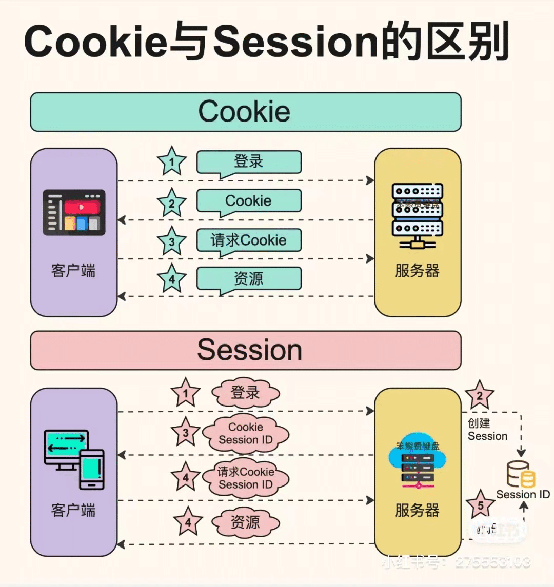
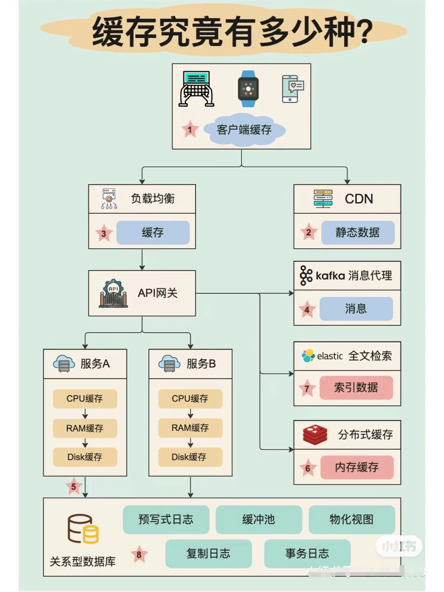
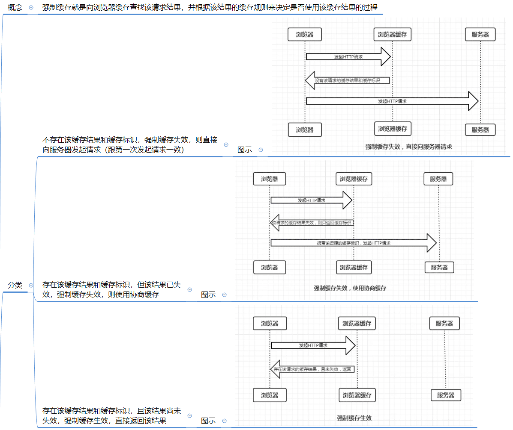
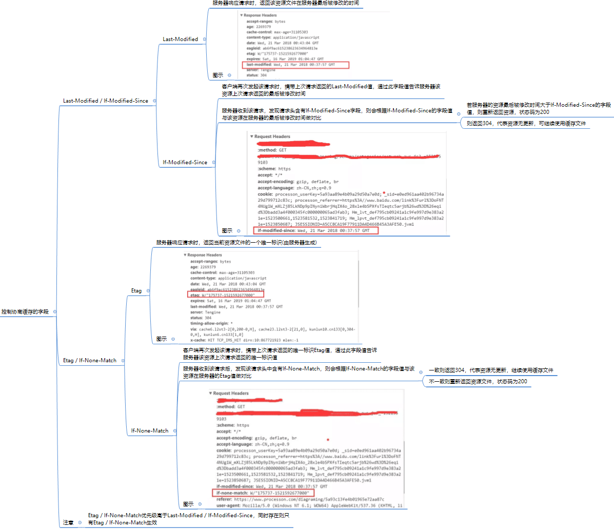

# 前端存储

## **前端缓存和存储分类**


* **存储技术发展史**


* **存储技术介绍**


## LocalStorage 和 sessionStorage

> LocalStorage和sessionStorage都是HTML5提供的Web存储机制，它们通过键值对的形式存储数据，并且仅限于在浏览器端使用。


|          | LocalStorage                                                 | SessionStorage                                               |
| -------- | ------------------------------------------------------------ | ------------------------------------------------------------ |
| 作用     | 用于在浏览器端存储持久化数据                                 | 用于在浏览器端存储会话期间的临时数据                         |
| 特点     | - **数据持久化**：存储的数据在浏览器关闭后仍然存在<br>- 容量较大：一般情况下，LocalStorage的容量较大，通常为5MB或更大<br>- **跨标签页共享**：同一域名下的不同标签页可以共享同一个LocalStorage的数据 | - **数据会话期间有效**：存储的数据仅在当前会话期间有效，会话结束时数据被清除<br>- 容量较小：一般情况下，SessionStorage的容量较小，通常为5MB或更小<br>- **不跨标签页共享**：不同标签页之间的SessionStorage数据不共享 |
| 差异     | - 生命周期：LocalStorage的数据没有过期时间，除非主动清除，否则会一直存在<br>- 数据共享：LocalStorage的数据在同一域名下的不同标签页之间共享<br>- 存储量：LocalStorage的容量较大 | - 生命周期：SessionStorage的数据仅在当前会话期间有效，关闭标签页或浏览器后数据被清除<br>- 数据不共享：SessionStorage的数据不在不同标签页之间共享<br>- 存储量：SessionStorage的容量较小 |
| 适用场景 | - 长期存储用户偏好设置、用户身份信息等<br>- 缓存静态资源，提高网站性能<br>- 本地数据存储和离线应用程序 | - 临时存储表单数据、页面状态等<br>- 多个页面间的数据共享<br>- 敏感数据的短期存储和使用 |
| API      | `localStorage.setItem(key, value)`: 将指定的键值对存储到LocalStorage中。 `localStorage.getItem(key)`: 根据键获取LocalStorage中存储的值。 `localStorage.removeItem(key)`: 根据键从LocalStorage中移除对应的键值对。 `localStorage.clear()`: 清除LocalStorage中的所有键值对。 `localStorage.key(index)`: 获取LocalStorage中指定索引位置的键名。 `localStorage.length`: 获取LocalStorage中存储的键值对数量。 | `sessionStorage.setItem(key, value)`: 将指定的键值对存储到SessionStorage中。 `sessionStorage.getItem(key)`: 根据键获取SessionStorage中存储的值。 `sessionStorage.removeItem(key)`: 根据键从SessionStorage中移除对应的键值对。 `sessionStorage.clear()`: 清除SessionStorage中的所有键值对。 `sessionStorage.key(index)`: 获取SessionStorage中指定索引位置的键名。 `sessionStorage.length`: 获取SessionStorage中存储的键值对数量。 |


## Cookie


* cookie 同源限制：Cookie 是服务器写入浏览器的一小段信息，只有同源的网页才能共享。

* 两个网页一级域名相同，只是二级域名不同，浏览器允许通过设置`document.domain`共享 Cookie。

  * A网页是`http://w1.example.com/a.html`，B网页是`http://w2.example.com/b.html`，那么只要设置相同的`document.domain`，两个网页就可以共享Cookie。

  ```shell
  document.domain = 'example.com';
  ```

  * 现在，A网页通过脚本设置一个 Cookie。

  ```shell
  document.cookie = "test1=hello";
  ```

  * B网页就可以读到这个 Cookie。

  ```shell
  var allCookie = document.cookie;
  ```

* 服务器也可以在设置Cookie的时候，指定Cookie的所属域名为一级域名，比如`.example.com`。

  ```shell
  Set-Cookie: key=value; domain=.example.com; path=/
  ```

  这样的话，二级域名和三级域名不用做任何设置，都可以读取这个Cookie。

**常见问题**

> 服务器代理转发时，该如何处理 cookie？

* 服务器端可以使用 Set-Cookie 的响应头部来配置 cookie 信息。

* 一条 cookie 包括了 5 个属性值 expires、domain、path、secure、HttpOnly。其中 expires 指定了 cookie 失 效的时间，domain 是域名、path 是路径，domain 和 path 一起限制了 cookie 能够被哪些 url 访问。secure 规定了 cookie 只能在确保安全的情况下传输，HttpOnly 规定了这个 cookie 只能被服务器访问，不能使用 js 脚本访问。
* 在发生 xhr 的跨域请求的时候，即使是同源下的 cookie，也不会被自动添加到请求头部，除非显示地规定。  

## Session


## **cookie和session区别**

|                      | Cookies          | Session           |
| :------------------- | :--------------- | ----------------- |
| 存储位置             | 客户端（浏览器） | 服务器端          |
| 数据存储方式         | 文本文件         | 服务器内存/数据库 |
| 数据类型             | 小型文本数据     | 任意类型数据      |
| 可存储数据量         | 通常较小         | 通常较大          |
| 安全性               | 相对较低         | 相对较高          |
| 数据访问方式         | 客户端可读写     | 服务器端可读写    |
| 生命周期             | 可设定过期时间   | 可设定过期时间    |
| 数据传输             | 每次请求都携带   | 通过会话ID传递    |
| 并发性               | 并发请求独立     | 并发请求共享      |
| 跨会话访问           | 是               | 是                |
| 跨域名/子域名访问    | 可配置           | 可配置            |
| 用途                 | 存储持久化数据   | 存储用户会话数据  |
| 修改数据权限         | 客户端可修改     | 服务器端控制      |
| 对服务器资源的依赖性 | 无               | 需要存储和管理    |




## 缓存分类



## 浏览器缓存机制

> 客户端缓存主要为浏览器缓存，浏览器缓存是浏览器在访问网页时用于存储资源的一种机制，它可以提高网页加载速度和减轻服务器负载。


### **优点**

1. **响应速度快**: 不需要将请求传递到源服务器，因此客户端和缓存越近，响应速度就越快。最典型的例子是浏览器本身为浏览器请求存储缓存。
2. **减少服务器负载**: 当响应可复用时，源服务器不需要处理请求——因为它不需要解析和路由请求、根据 cookie 恢复会话、查询数据库以获取结果或渲染模板引擎。这减少了服务器上的负载。


### 缓存位置

从缓存位置上来说分为四种，并且各自有优先级，当依次查找缓存且都没有命中的时候，才会去请求网络。

- **Service Worker**
- **Memory Cache**
- **Disk Cache**
- **Push Cache**


#### **Memory Cache**

Memory Cache 也就是内存中的缓存，主要包含的是当前中页面中已经抓取到的资源,例如页面上已经下载的样式、脚本、图片等。读取内存中的数据肯定比磁盘快,内存缓存虽然读取高效，可是缓存持续性很短，会随着进程的释放而释放。


**特点：**

* **内存缓存适用于频繁访问的资源**，例如网页的Logo图标、CSS样式和JavaScript文件等。
* **一旦我们关闭 Tab 页面，内存中的缓存也就被释放了**；
* 内存缓存的存储容量较小，通常只有几百KB到几十MB；
* **内存缓存在缓存资源时并不关心返回资源的HTTP缓存头Cache-Control是什么值，同时资源的匹配也并非仅仅是对URL做匹配，还可能会对Content-Type，CORS等其他特征做校验**；


当我们访问过页面以后，再次刷新页面，可以发现很多数据都来自于内存缓存

内存缓存中有一块重要的缓存资源是preloader相关指令（例如 `<linkrel="prefetch">`）下载的资源。(preloader的相关指令已经是页面优化的常见手段之一，它可以一边解析js/css文件，一边网络请求下一个资源)。


#### **Disk Cache**

Disk Cache 也就是存储在硬盘中的缓存，读取速度较慢，但是什么都能存储到磁盘中，**比之 Memory Cache 胜在容量和存储时效性上**。

**特点：**

* 在所有浏览器缓存中，Disk Cache 覆盖面基本是最大的。磁盘缓存的存储容量相对较大，可以达到几百MB到几GB。
* Disk Cache会根据 HTTP Herder 中的字段判断哪些资源需要缓存，哪些资源可以不请求直接使用，哪些资源已经过期需要重新请求。并且即使在跨站点的情况下，相同地址的资源一旦被硬盘缓存下来，就不会再次去请求数据。
* 绝大部分的缓存都来自 Disk Cache。


#### **Service Worker**

Service Worker 是运行在浏览器背后的独立线程，一般可以用来实现缓存功能。使用 Service Worker的话，传输协议必须为 HTTPS。因为 Service Worker 中涉及到请求拦截，所以必须使用 HTTPS 协议来保障安全。

**Service Worker 的缓存与浏览器其他内建的缓存机制不同，它可以让我们自由控制缓存哪些文件、如何匹配缓存、如何读取缓存，并且缓存是持续性的**。

**实现**

Service Worker 实现缓存功能一般分为三个步骤：首先需要先注册 Service Worker，然后监听到 install 事件以后就可以缓存需要的文件，那么在下次用户访问的时候就可以通过拦截请求的方式查询是否存在缓存，存在缓存的话就可以直接读取缓存文件，否则就去请求数据。

当 Service Worker 没有命中缓存的时候，我们需要去调用 fetch 函数获取数据。也就是说，如果我们没有在 Service Worker 命中缓存的话，会根据缓存查找优先级去查找数据。但是不管我们是从 Memory Cache 中还是从网络请求中获取的数据，浏览器都会显示我们是从 Service Worker 中获取的内容。


#### **Push Cache**

Push Cache（推送缓存）是 HTTP/2 中的内容，当以上三种缓存都没有命中时，它才会被使用。**它只在会话（Session）中存在，一旦会话结束就被释放，并且缓存时间也很短暂**，在Chrome浏览器中只有5分钟左右，同时它也并非严格执行HTTP头中的缓存指令。

**特点：**

- 所有的资源都能被推送，并且能够被缓存,但是 Edge 和 Safari 浏览器支持相对比较差
- 可以推送 no-cache 和 no-store 的资源
- 一旦连接被关闭，Push Cache 就被释放
- 多个页面可以使用同一个 HTTP/2 的连接，也就可以使用同一个Push Cache。这主要还是依赖浏览器的实现而定，出于对性能的考虑，有的浏览器会对相同域名但不同的tab标签使用同一个HTTP连接。
- Push Cache 中的缓存只能被使用一次
- 浏览器可以拒绝接受已经存在的资源推送
- 可以给其他域名推送资源


#### **四种缓存对比**

| 缓存位置       | 相同点                                                       | 不同点                                                       | 特点和适用场景                                               |
| -------------- | ------------------------------------------------------------ | ------------------------------------------------------------ | ------------------------------------------------------------ |
| Memory Cache   | - 存储在浏览器的内存中<br>- 读取速度快<br>- 生命周期较短     | - 存储容量较小<br>- 关闭浏览器或标签页后会被清除             | - 适用于频繁访问的资源，如网页的Logo图标、CSS样式和JavaScript文件等 |
| Disk Cache     | - 存储在硬盘上<br>- 存储容量较大<br>- 生命周期较长           | - 读取速度相对较慢<br>- 需要读取磁盘上的数据                 | - 适用于不经常变动的资源，如网页的图片、音频和视频文件等     |
| Service Worker | - 可以拦截和处理网络请求<br>- 可以离线缓存资源<br>- 生命周期较长 | - 需要编写和注册Service Worker脚本<br>- 需要HTTPS协议支持    | - 适用于离线访问和提供离线功能的应用程序，如离线浏览、推送通知等 |
| Push Cache     | - 存储在浏览器的内存中<br>- 可以通过HTTP推送缓存资源         | - 只能缓存通过HTTP/2推送的资源<br>- 生命周期短于Memory Cache | - 适用于通过HTTP/2服务器推送的资源，如网页的预加载资源等     |


**如果以上四种缓存都没有命中的话，那么只能发起请求来获取资源了。**

那么为了性能上的考虑，大部分的接口都应该选择好缓存策略，**通常浏览器缓存策略分为两种：强缓存和协商缓存，并且缓存策略都是通过设置 HTTP Header 来实现的**。


### 缓存机制

浏览器的缓存机制指的是通过在一段时间内保留已接收到的web资源的一个副本，如果在资源的有效时间内，发起了对这个资源的再一次请求，那么浏览器会直接使用缓存的副本，而不是向服务器发起请求。

使用浏览器缓存可以有效地提高页面的打开速度，减少不必要的网络带宽的消耗；


#### **强制缓存**




#### **协商缓存**





**浏览器缓存存在问题：**

* 问题：ajax能提高页面载入的速度主要的原因是通过ajax减少了重复数据的载入，也就是说在载入数据的同时将数据缓存到内存中，一旦数据被加载其中，只要我们没有刷新页面，这些数据就会一直被缓存在内存中，当我们提交 的URL与历史的URL一致时，就不需要提交给服务器，也就是不需要从服务器上面去获取数据，虽然这样降低了服务器的负载提高了用户的体验，但是我们不能获取最新的数据。为了保证我们读取的信息都是最新的，我们就需要禁止他的缓存功能。 
* 解决方案：
  * 在ajax发送请求前加上 `anyAjaxObj.setRequestHeader("If-Modified-Since","0")`。 
  * 在ajax发送请求前加上` anyAjaxObj.setRequestHeader("Cache-Control","no-cache")`。 
  * 在URL后面加上一个随机数：` "fresh=" + Math.random();`。 
  * 在URL后面加上时间搓：`"nowtime=" + new Date().getTime();`。 
  * 如果是使用 JQuery，直接这样就可以了 `$.ajaxSetup({cache:false})`。这样页面的所有ajax都会执行这条语句就是不需要保存缓存记录。


### **用户行为分析**

#### **地址栏输入url**

当在浏览器地址栏输入URL时，浏览器会执行以下步骤来查找缓存中的资源：

1. **输入URL并按下回车键**：用户在浏览器地址栏中输入URL，并按下回车键。

2. **检查浏览器缓存**：浏览器首先检查是否有与该URL相关的缓存。它会查找内存缓存（Memory Cache）和磁盘缓存（Disk Cache）。

3. **内存缓存（Memory Cache）检查**：浏览器会首先检查内存缓存，即浏览器在当前会话期间缓存的资源。如果在内存缓存中找到匹配的资源，并且未过期（根据缓存的过期策略），浏览器将直接使用内存缓存中的资源。

4. **磁盘缓存（Disk Cache）检查**：如果在内存缓存中没有找到匹配的资源，浏览器会继续检查磁盘缓存，即之前访问过的资源缓存到硬盘上的地方。如果在磁盘缓存中找到匹配的资源，并且未过期，浏览器将从磁盘缓存中加载资源。

5. **DNS解析**：如果在浏览器缓存中没有找到匹配的缓存资源，浏览器将进行DNS解析，将URL解析为对应的IP地址。

6. **建立连接**：浏览器将与目标服务器建立TCP连接，并发送HTTP请求。

7. **服务器响应**：服务器接收到请求后，会根据请求的URL和其他相关信息生成响应。

8. **响应处理**：浏览器接收到服务器的响应后，会对响应进行处理。这可能涉及验证响应的有效性、检查响应状态码以及处理响应的内容。

9. **缓存更新**：如果服务器响应中包含缓存相关的HTTP响应头（如`Cache-Control`、`ETag`等），浏览器会根据这些响应头更新缓存。它可能会将响应缓存到内存缓存或磁盘缓存中，以便将来使用。


**总结：**

浏览器在输入URL后，会首先检查内存缓存和磁盘缓存，如果没有找到匹配的缓存资源，将进行DNS解析并与服务器建立连接，最后接收服务器的响应并根据缓存策略更新缓存。这样可以提高网页加载速度，并减轻服务器的负载。

#### **普通刷新(F5)**

使用F5键（或浏览器刷新按钮）刷新网页时，并不会直接清除浏览器缓存。它的主要作用是重新发送之前的请求，以获取更新的资源。


**过程：**

1. 当你按下F5键或点击浏览器的刷新按钮时，浏览器会发送一个HTTP请求到服务器，请求当前网页的资源。在这个请求中，浏览器会发送一些额外的信息，如`If-Modified-Since`和`If-None-Match`等，用于告诉服务器之前缓存的资源的相关信息。

2. 服务器收到这个请求后，会检查这些额外的信息。

   * 如果服务器发现请求的资源没有被修改（即与浏览器缓存中的版本相同），它会返回一个`304 Not Modified`的响应，表示资源未修改，可以直接使用浏览器缓存的版本。

   * 如果服务器发现请求的资源已经被修改了，它会返回一个新的响应，包含最新的资源内容和相关的HTTP响应头。

3. 浏览器会接收到这个新的响应，并将其与之前缓存的版本进行比较。如果两个版本不同，浏览器会更新缓存，并加载新的资源。


需要注意的是，F5键并不会直接清除浏览器缓存。它只是重新发送请求，让服务器验证资源是否有更新。如果服务器返回的响应被浏览器缓存，则仍然会使用缓存的版本，而不是从服务器重新下载资源。

如果你想强制清除浏览器缓存，可以使用Ctrl + F5（或Cmd + Shift + R在Mac上）组合键。这个组合键会发送一个特殊的请求头`Cache-Control: no-cache`，告诉服务器不要使用缓存的资源，而是始终返回最新的资源。这样就可以绕过浏览器缓存，获取最新的资源。


**内存访问顺序：**

当使用F5刷新浏览器时，浏览器会按照以下顺序尝试使用缓存中的资源：

1. **Memory Cache**：浏览器首先检查内存缓存（Memory Cache）。内存缓存是浏览器在当前会话期间缓存的资源，存储在内存中。如果请求的资源在内存缓存中有匹配的副本，并且未过期（根据缓存的过期策略），浏览器将直接使用内存缓存中的资源。
2. **Disk Cache**：如果内存缓存中没有找到匹配的资源，浏览器接下来会检查磁盘缓存（Disk Cache）。磁盘缓存是浏览器将之前访问过的资源缓存到硬盘上的地方。如果请求的资源在磁盘缓存中有匹配的副本，并且未过期，浏览器将从磁盘缓存中加载资源。

3. 如果在内存缓存和磁盘缓存中都没有找到匹配的资源，浏览器将向服务器发送请求，获取最新的资源。

需要注意的是，浏览器在查找缓存时会根据请求的URL、请求头和缓存策略等因素来决定使用哪种缓存。每个浏览器的缓存机制可能会有所不同，具体的行为可能因浏览器而异。

此外，开发人员可以通过使用特定的HTTP响应头（如`Cache-Control`、`Expires`、`ETag`等）来控制浏览器缓存的行为。


#### **强制刷新(Ctrl + F5)**

使用Ctrl + F5（或Cmd + Shift + R在Mac上）可以强制刷新网页并清除浏览器缓存。

**行为分析：**

1. 当用户第一次访问一个网页时，浏览器将下载并缓存页面的资源（如HTML、CSS、JavaScript、图像等）。
2. 下次访问同一个网页时，浏览器会检查资源的缓存标识（如HTTP响应头中的`Cache-Control`和`ETag`等），如果资源没有过期或未被修改，浏览器会直接从缓存中加载资源，而不是重新下载。
3. 但是有时候我们希望强制刷新网页，即使资源没有过期或未被修改，也要从服务器重新下载资源。这时候就可以使用Ctrl + F5来触发强制刷新。


**原理：**

这个操作的原理涉及浏览器缓存机制和HTTP协议的缓存策略。

浏览器缓存是为了提高网页加载速度和减轻服务器负载而引入的机制。

Ctrl + F5的原理是通过发送一个**特殊的HTTP请求头**来告诉服务器不使用缓存的资源，而是返回最新的资源。

这个特殊的请求头是**`Cache-Control: no-cache`**，它指示服务器不要返回缓存的资源，而是始终返回最新的资源。

当浏览器收到带有`Cache-Control: no-cache`请求头的请求后，服务器会忽略缓存并重新生成响应，然后将最新的资源发送给浏览器，浏览器会用这些新的资源替换掉缓存中的旧资源。


**缺点：**

Ctrl + F5只会清除浏览器的缓存，而不会影响到代理服务器或CDN等其他缓存层。这意味着，即使你使用Ctrl + F5刷新了网页，仍然可能会从代理服务器或CDN获取缓存的资源。

如果你希望完全绕过所有缓存，可以使用私密浏览模式（如Chrome的隐身模式）或禁用代理服务器。


### **常见缓存问题**

#### **浏览器会把哪些文件丢进内存中？哪些丢进硬盘中？**

浏览器在缓存资源时，会根据资源的类型和使用频率将不同类型的文件丢进内存或硬盘中。下面是一般的规则：

通常会将以下类型的文件丢进**内存缓存**中：

1. **HTML文件**：网页的HTML文件通常被频繁访问，因此浏览器会将其缓存到内存中，以便快速加载和渲染页面。
2. **CSS文件**：CSS样式文件对于网页的渲染至关重要，因此浏览器通常会将其缓存到内存中，以便快速应用样式。
3. **JavaScript文件**：JavaScript文件包含网页的交互逻辑，也会被频繁访问和执行，因此浏览器会将其缓存到内存中，以提高脚本的执行速度。
4. **字体文件**：某些网页使用自定义字体，这些字体文件会被缓存到内存中，以便在页面加载时快速显示正确的字体样式。
5. **图片文件**：小型的图片文件（如图标和小型背景图）也有可能被缓存在内存中，以提高页面的加载速度和用户体验。

浏览器通常会将以下类型的文件丢进磁盘缓存中：

1. **大型媒体文件**：大型的音频文件、视频文件和高分辨率图片文件通常会被缓存到磁盘中，因为它们的体积较大，无法完全放入内存。
2. **较少访问的文件**：对于较少访问的文件，如过时的页面、旧版本的脚本文件等，浏览器可能会将它们缓存到磁盘中，以释放内存空间给更常访问的文件使用。

需要注意的是，浏览器在缓存资源时会根据多种因素做出决策，包括资源的大小、类型、访问频率、缓存策略等。

不同的浏览器可能会有不同的优化策略和缓存机制，因此具体的行为可能会有所差异。此外，开发人员也可以通过设置响应头中的缓存控制字段来影响浏览器的缓存行为。


#### **前端发版静态资源404问题**

详细过程和解决方案，参考博客：[前端发版静态资源404问题 | Sewen 博客 (sewar-x.github.io)](https://sewar-x.github.io/workNote/前端发版静态资源404问题/)

#### 白屏问题

问题描述：

> 在浏览器设置”默认打开上次关闭选项“时，使用浏览器打开项目，关闭项目后再重新打开浏览器
>
> 在不刷新页面时项目将一直显示白屏

原因分析：

> 在使用vue-cli脚手架构建完项目，项目完成后，需打包上线。
> 默认打包方式则是 npm build，然后项目根目录会生成 dist 文件夹。服务端将该文件夹替换线上即可。
>
> 但是当第n（n>1）次上线后，由于在用户端会默认缓存index.html入口文件，而由于vue打包生成的css/js都是哈希值，跟上次的文件名都不同，因此会出现找不到css/js的情况，导致白屏的产生。

解决方案：

* 方案1： **meta标签清除缓存**

  * ```html
    <meta http-equiv="Cache-control" content="no-cache,max-age=0, must-revalidate,no-store">
    <meta http-equiv="Pragma" content="no-cache" />
    <meta http-equiv="Expires" content="0" />
    <meta http-equiv="Cache" content="no-cache">
    ```

    > 解释：
    >
    > * http 1.0 控制字段：
    >
    >   * Pragma:
    >
    >     * 用于设定禁止浏览器从本地机的缓存中调阅页面内容
    >
    >     * 它用来向后兼容只支持 HTTP/1.0 协议的缓存服务器，那时候 HTTP/1.1 协议中的 Cache-Control 还没有出来
    >
    > * http 1.1控制字段：
    >
    >   * Expires: 相应头过期时间，用于设定网页的到期时间；Cache-control中设置max-age;则该属性会被忽略
    >   * Cache-control：指定请求和响应遵循的缓存机制，在请求消息或响应消息中设置Cache-Control并不会修改另一个消息处理过程中的缓存处理过程；该字段的优先级要比Expires优先级高
    >     * 常见的取值：
    >     * no-chche:表示无论服务端有没有设置Cache-control,都必须重新追根到源服务器进行校验，源服务器未变化返回304
    >     * must-revalidate:告诉浏览器/缓存服务器；在本地文件过期之前可以使用本地文件；本地文件一旦过期需要去源服务器进行有效性校验；如果有缓存服务器且该资源未过有效期则命中缓存服务器并返回200；如果过期切源服务器未发生更改；则教研后返回304；
    >     * max-age:缓存的内容将在多少秒后失效,相对于请求时间来说的；max-age=0便是无论服务端如何设置；在重新获取资源之前；先检验ETag/Last-Modified;在设置max-age=0或no-cache后；在资源无更新的情况下访问都会返回304
    >     * private:客户端可以缓存
    >     * public:客户端和代理服务器都可缓存


**参考资料**：

[HTTP 缓存 MDN](https://developer.mozilla.org/zh-CN/docs/Web/HTTP/Caching)

[彻底理解浏览器的缓存机制](https://mp.weixin.qq.com/s/UOSvXZcB0LF6p6HTk1pqlQ)

[深入理解浏览器的缓存机制](https://mp.weixin.qq.com/s/KNFXOwM1bcwcLVP98L7Qpg)

[meta元素](http://web.h3399.cn/meta.htm#attr-name)

[Nginx针对前端静态资源的缓存处理](https://www.cnblogs.com/hanshuai/p/12002202.html)

## Service Workers 缓存

* Service Workers  缓存：Service Workers  能够拦截 HTTP 请求，进入任何传入的 HTTP 请求，并决定想要如何响应。在你的 Service Worker 中，可以编写逻辑来决定想要缓存的资源，以及需要满足什么条件和资源需要缓存多久。

- 与 HTTP 缓存比较：Web 服务器可以使用 Expires 首部来通知 Web 客户端，它可以使用资源的当前副本，直到指定的“过期时间”。反过来，浏览器可以缓存此资源，并且只有在有效期满后才会再次检查新版本。使用 HTTP 缓存意味着你要依赖服务器来告诉你何时缓存资源和何时过期。

* **注册：**使用 [`ServiceWorkerContainer.register()`](https://developer.mozilla.org/zh-CN/docs/Web/API/ServiceWorkerContainer/register) 方法在该站点注册。其内容在 sw.js 文件中，可以在注册成功后执行。

  ```js
  if('serviceWorker' in navigator) {
      navigator.serviceWorker.register('/sw.js');
  };
  ```

* **安装：**sw.js 监听 install 事件、`e.waitUntil()`等待 service worker 安装完成、Cache API 开启了一个缓存，并且将我们的应用所需要缓存的文件全部添加进去，当我们再次加载这些资源时，由请求 URL 确定的对应缓存就是可用的。

  ```js
  self.addEventListener('install', function(e) {
    console.log('[Service Worker] Install');
    e.waitUntil(
      caches.open(cacheName).then(function(cache) {
            console.log('[Service Worker] Caching all: app shell and content');
        return cache.addAll(contentToCache);
      })
    );
  });
  ```

  * API 介绍：
    * `e.waitUntil()`：等待 service worker 安装完成。[`ExtendableEvent.waitUntil`](https://developer.mozilla.org/zh-CN/docs/Web/API/ExtendableEvent/waitUntil)方法告诉事件分发器该事件仍在进行。这个方法也可以用于检测进行的任务是否成功。在服务工作线程中，这个方法告诉浏览器事件一直进行，直至 promise 解决，浏览器不应该在事件中的异步操作完成之前终止服务工作线程。
      * `caches` 是一个特殊的 [`CacheStorage`](https://developer.mozilla.org/zh-CN/docs/Web/API/CacheStorage) 对象，它能在 Service Worker 指定的范围内提供数据存储的能力。因为 Web Storage 的执行是同步的，在 Service Worker 中使用 [Web Storage](https://developer.mozilla.org/zh-CN/docs/Web/API/Web_Storage_API) 将不会有效果，所以我们使用 Cache API 作为替代。

* **激活：** 监听`activate` 事件。删除那些我们已经不需要的文件或者做一些清理工作。

  ```js
  self.addEventListener('activate', event => {
    const currentCaches = [PRECACHE];
    //遍历缓存,查找不存在于自定义缓存列表中的浏览器缓存，并清除
    event.waitUntil(
      caches.keys().then(cacheNames => {//查找缓存
        return cacheNames.filter(cacheName => !currentCaches.includes(cacheName));
      }).then(cachesToDelete => {
        return Promise.all(cachesToDelete.map(cacheToDelete => {
          return caches.delete(cacheToDelete); //清除缓存
        }));
      }).then(() => self.clients.claim())
    );
  });
  ```

* **响应请求：**通过 [`FetchEvent`](https://developer.mozilla.org/zh-CN/docs/Web/API/FetchEvent) 事件去响应请求。通过使用 [`FetchEvent.respondWith`](https://developer.mozilla.org/zh-CN/docs/Web/API/FetchEvent/respondWith) 方法，你可以任意修改对于这些请求的响应。拦截页面请求，现在缓存中查找，未找到才去请求。

  ```js
  self.addEventListener('fetch', function(event) {
    console.log('Handling fetch event for', event.request.url);
   //事件处理程序侦听 fetch 事件。当触发时返回一个promise给受控页面。
    event.respondWith(
      // promise在 Cache 对象中查询第一个匹配URL请求。如果没有发现匹配项，该代码将转而从网络获取响应。
      caches.match(event.request).then(function(response) {
        if (response) {
          console.log('Found response in cache:', response);
  
          return response;
        }
        console.log('No response found in cache. About to fetch from network...');
  
        return fetch(event.request).then(function(response) {
          console.log('Response from network is:', response);
  
          return response;
        }).catch(function(error) {
          console.error('Fetching failed:', error);
  
          throw error;
        });
      })
    );
  });
  ```

参考资料：

* [Service Worker API MDN](https://developer.mozilla.org/zh-CN/docs/Web/API/Service_Worker_API)