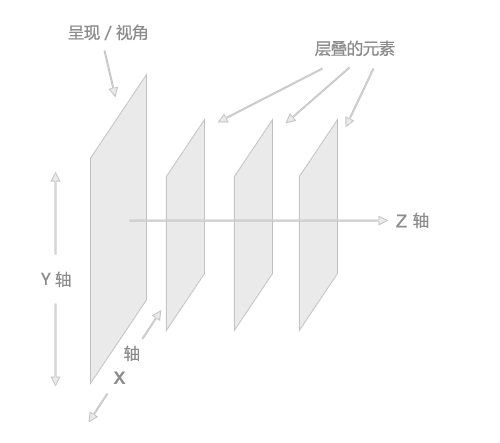
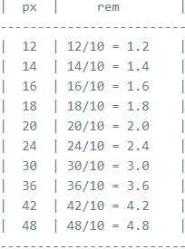
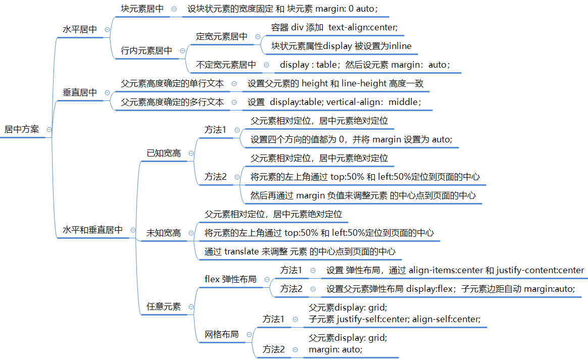

# CSS


## 盒子模型

### 标准盒子模型


* 总元素的宽度=宽度+左填充+右填充+左边框+右边框+左边距+右边距
* 总元素的高度=高度+顶部填充+底部填充+上边框+下边框+上边距+下边距

### IE中的盒子模型

* 只有margin和content ，content中包含border,padding

* 宽度=margin+content 

### 控制盒子模型的属性

> box-sizing 属性

**作用**

* 用于更改用于计算元素的宽度和高度默认的CSS盒子模型

	* 可以使用此属性来模拟不正确支持CSS盒子模型规范的游览器行为

**取值**

* **content-box：**

  *  `box-sizing` 属性的默认值，此属性表现为标准模式下的盒模型。

  * 作用：设置为 标准盒子模型，设置的 width = content。

    * 宽度和高度分别应用到元素的内容框

    * 在宽度和高度之外绘制元素的内边距和边框
  
* padding 和 border不被包含在定义的width和height之内
  
* 对象的实际宽度等于设置的 width 值和 border、padding 之和，即 ( Element width = width + border + padding )
  
  


* **border-box**

  * 作用：设置 IE 盒子模型
    * 为元素设定的宽度和高度决定了元素的边框盒。
    * 就是说，为元素指定的任何内边距和边框都将在已设定的宽度和高度内进行绘制。
    * 通过从已设定的宽度和高度分别减去边框和内边距才能得到内容的宽度和高度
  * 设置的 width = content + padding + border
       * padding和border被包含在定义的width和height之内


## 文档流

* 将窗体自上而下分成一行一行，并在每行中按从左至右依次排放元素，称为文档流，也称为普通流

* HTML中全部元素都是盒模型，盒模型占用一定的空间，依次排放在HTML中，形成了文档流


### **脱离文档流**

脱离文档流的元素的定位基于正常的文档流，当一个元素脱离文档流后，依然在文档流中的其他元素将忽略该元素并填补其原先的空间，元素脱离文档流之后，将不再在文档流中占据空间，而是处于浮动状态（可以理解为漂浮在文档流的上方）



**让 div 脱离文档流方法**

1. `position: absolute;`
2. `position: fixed;`

> 元素的 position 值为 absolute 或 fixed 时，元素往 Z 轴方向移了一层，元素脱离了普通流，所以不再占据原来那层的空间，还会覆盖下层的元素
>
> 该元素将变为块级元素，相当于给该元素设置了 `display: block;`（给一个内联元素，如 `<span> `，设置 absolute之后发现它可以设置宽高了）
>
> 如果该元素是块级元素，元素的宽度由原来的 width: 100%（占据一行），变为了 auto。

3. `float`	    


### **层叠上下文和层叠顺序**

* 层叠上下文：指图层在z轴中的位置 
* 一旦普通元素具有了层叠上下文，其层叠顺序就会变高


#### **特性**

	* 层叠上下文的层叠水平要比普通元素高

 * 层叠上下文可以阻断元素的混合模式
 * 层叠上下文可以嵌套，内部层叠上下文及其所有子元素均受制于外部的层叠上下文
 * 每个层叠上下文和兄弟元素独立，也就是当进行层叠变化或渲染的时候，只需要考虑后代元素
 * 每个层叠上下文是自成体系的，当元素发生层叠的时候，整个元素被认为是在父层叠上下文的层叠顺序中

**分类**

* 根层叠上下文：
   *  页面根元素具有层叠上下文，称之为“根层叠上下文”
   * 因为根层叠上下文，所以绝对定位元素在left/top等值定位的时候，如果没有其他定位元素限制，会**相对浏览器窗口定位**。
* 定位元素与传统层叠上下文：
   *  z-index 值为数值的定位元素的传统层叠上下文
   * 对于包含有 `position:relative/position:absolute/position:fixed` 声明的定位元素，当其z-index值不是auto的时候，会创建层叠上下文
   * 当z-index嵌套错乱，看看是不是受父级的层叠上下文元素干扰了

#### **层叠水平**

* 决定了同一个层叠上下文中元素在z轴上的显示顺序

* 普通元素的层叠水平优先由层叠上下文决定，因此，层叠水平的比较只有在当前层叠上下文元素中才有意义

* 注意：不要把层叠水平和CSS的z-index属性混为一谈，某些情况下z-index确实可以影响层叠水平，但是，只限于定位元素以及flex盒子的孩子元素，而层叠水平所有的元素都存在

* 层叠顺序：表示元素发生层叠时候有着特定的垂直显示顺序


#### **层叠顺序规则**


* 最低水平的border/background 指的是层叠上下文元素的边框和背景色
* 每一个层叠顺序规则适用于一个完整的层叠上下文元素
* 原图没有呈现inline-block的层叠顺序，实际上，inline-block和inline水平元素是同等level级别
* z-index:0实际上和z-index:auto单纯从层叠水平上看，是可以看成是一样的


#### **层叠准则**

**谁大谁上：**

* 当具有明显的层叠水平标示的时候，如识别的z-indx值，在同一个层叠上下文领域，层叠水平值大的那一个覆盖小的那一个

**后来居上：**

* 当元素的层叠水平一致、层叠顺序相同的时候，在DOM流中处于后面的元素会覆盖前面的元素

* 在CSS和HTML领域，只要元素发生了重叠，都离不开上面这两个黄金准则

## Position(定位)

### **static**

* HTML 元素的默认值，即没有定位，遵循正常的文档流对象
* 静态定位的元素**不会受到 top, bottom, left, right影响**

### **fixed**

* 元素的位置**相对于浏览器窗口是固定位置**,即使窗口是滚动的它也不会移动; 
* Fixed定位使元素的位置与文档流无关，**因此不占据空间**; 
* Fixed定位的元素和其他元素重叠
* 注意: Fixed 定位在 IE7 和 IE8 下需要描述 !DOCTYPE 才能支持

### **sticky**

* 粘性定位:  **基于用户的滚动位置来定位**; 
* 粘性定位的元素是依赖于用户的滚动，在 `position:relative` 与 `position:fixed` 定位之间切换。 它的行为就像 `position:relative;`
  *  而当页面滚动超出目标区域时，它的表现就像 `position:fixed`; 它会固定在目标位置。元素定位表现为在跨越特定阈值前为相对定位，之后为固定定位; 这个特定阈值指的是 top, right, bottom 或 left 之一，换言之，指定 top, right, bottom 或 left 四个阈值其中之一，才可使粘性定位生效。
  * 否则其行为与相对定位相同。
* 注意: Internet Explorer, Edge 15 及更早 IE 版本不支持 sticky 定位。 Safari 需要使用 -webkit- prefix (查看以下实例)

### **relative**

* 相对定位元素的定位是相对其正常位置;
* 移动相对定位元素，但它原本所占的空间不会改变; 
* 相对定位元素经常**被用来作为绝对定位元素的容器块；**

### **absolute**

* 绝对定位的元素的位置**相对于最近的已定位(已经相对定位的)父元素**，如果元素没有已定位的父元素，那么它的位置相对于`<html>`。
* absolute 定位使元素的位置与文档流无关，因此**不占据空间**。
* absolute 定位的元素和其他元素重叠。
* inherit: 从父元素继承 position 属性的值。
* 控制: 位置通过top, bottom, left, right控制。
* 堆叠顺序：
  * 元素的定位与文档流无关，所以它们可以覆盖页面上的其它元素。
  * z-index属性: 指定了一个元素的堆叠顺序,具有更高堆叠顺序的元素总是在较低的堆叠顺序元素的前面
  * 注意: 如果两个定位元素重叠，没有指定z - index，最后定位在HTML代码中的元素将被显示在最前面


## Float(浮动)

### 作用

* 使元素向左或向右移动，其周围的元素也会重新排列
* 一个浮动元素会尽量向左或向右移动，直到它的外边缘碰到包含框或另一个浮动框的边框为止

### 浮动元素对其他元素影响

* 浮动元素之后的元素将围绕它
* 浮动元素之前的元素将不会受到影响

### 清除浮动影响

*  `clear:both;`
  * 元素浮动之后，周围的元素会重新排列，为了避免这种情况，使用 clear 属性。
  * clear 属性指定元素两侧不能出现浮动元素
* 要点
  * 只有左右浮动，没有上下浮动。
  * 元素设置 float 之后，它会**脱离普通流**（和 position: absolute; 一样），不再占据原来那层的空间，还会覆盖下一层的元素。
  * 浮动不会对该元素的上一个兄弟元素有任何影响;
  * 浮动之后，该元素的下一个兄弟元素会紧贴到该元素之前没有设置 float 的元素之后;
  * 如果该元素的下一个兄弟元素中有内联元素（通常是文字），则会围绕该元素显示，形成类似「文字围绕图片」的效果
  * 下一个兄弟元素如果也设置了同一方向的 float，则会紧随该元素之后显示;
  * 该元素将变为块级元素，相当于给该元素设置了 `display: block`;


## 元素类型

### **块级元素(block)**

`display:block`  -- 显示为块级元素

 **特性：**

* 总是**独占一行**，表现为另起一行开始，而且其后的元素也必须另起一行显示;
* 宽度(width)、高度(height)、内边距(padding)、外边距(margin) **都可控制**;

 * 例子: div ,  form , h1 , h2 , h3 , h4 , h5 , h6 , hr , isindex , menu , noframes , noscript , ol , p , pre , table , ul , li，address , blockquote , center , dir ，dl , fieldset 

### **内联元素(inline)**

`display:inline`  -- 显示为内联元素

**特性：**

* **和相邻的内联元素在同一行**;
* 宽度(width)、高度(height)、内边距的 top/bottom(padding-top/padding-bottom)、外边距的 top/bottom(margin-top/margin-bottom) **都不可改变**，就是里面文字或图片的大小;
* 例子: a , abbr , acronym , b , bdo , big , br , cite , code , dfn , em , font , i , img , input , kbd , label , q , s , samp , select , small , span , strike , strong , sub , sup ,textarea , tt , u , var

### **行块级元素**

`display:inline-block` -- 显示为内联块元素

	* 特性：**拥有内在尺寸，可设置高宽，不会自动换行**。

 * 例子:   button,input，textarea,select, img

### **可变元素**

* 特性:   根据上下文关系确定该元素是块元素还是内联元素

 * 例子:   applet ,button ,del ,iframe , ins ,map ,object , script

### **控制属性**

* display:block  -- 显示为块级元素
* display:inline  -- 显示为内联元素
* display:inline-block -- 显示为内联块元素，表现为同行显示并可修改宽高内外边距等属性
* display:none
  *  可以隐藏某个元素，且**隐藏的元素不会占用任何空间**
  *  **该元素不但被隐藏了，而且该元素原本占用的空间也会从页面布局中消失**


参考资料
[display取值](https://www.runoob.com/cssref/pr-class-display.html)


## 像素和屏幕分辨率


### **物理像素**（Physical Pixel）

概念：物理像素是组成显示屏的最小单位，也是设备屏幕能控制显示的最小单位。每个设备的物理像素点固定不变，是真实存在的像素点。

- 单位：通常用pt表示，其中1pt=1/72(inch)，1inch=2.54cm。
- 示例：如iPhone 6的设备像素为750*1334。
- 特点：物理像素是显示屏上实际的像素点，直接决定了屏幕的物理分辨率。

### **虚拟像素**

- 概念：虚拟像素是指显示屏上的**物理像素点数和实际显示的像素点数是1：N（N=2X2）的关系**。它能显示的图像像素比显示屏的实际像素多是长宽像素各2倍。
- 实现方法：通过特定的技术或算法，使得在相同数量的物理像素下，能够呈现出更多的像素点，从而提高了显示效果。
- 优点：可以提高显示性能、降低整屏的造价，并降低人观看时的疲劳感。

### **逻辑像素（设备独立像素、DIP）**

- 概念：逻辑像素是与设备屏幕无关的像素，可以理解为计算机坐标系统中的一个点，这个点代表一个可以由程序使用的虚拟像素（比如CSS像素）。
- 关系：逻辑像素和物理像素之间通过设备像素比（DPR）进行转换。
- DPR=物理像素/逻辑像素。
- 示例：iPhone 6的设备独立像素为375*667，正好是设备像素的一半。
- 特点：逻辑像素是人为定义的一层抽象的像素，用于在不同分辨率的设备上实现一致的显示效果。

### **设备像素**

- 在此上下文中，设备像素通常与物理像素相同，指的是显示器上的真实像素。
- 特点：设备像素是显示器固有的属性，屏幕出厂后就不会改变。设备像素决定了屏幕的物理分辨率。


### **分辨率（Resolution）**

- 分辨率指的是显示器所能显示的像素的多少。显示器可显示的像素越多，画面就越精细。
- 在显示屏领域，物理分辨率是固有的参数，表示显示屏最高可显示的像素数，也即最佳分辨率，是屏幕实际存在的像素行数乘以列数的数学表达方式。
- 例如，物理分辨率为1024×768时，意味着在LED液晶板的横向上划分了1024个像素点，竖向上划分了768个像素点。

### **CSS像素分辨率（CSS Pixel Resolution）**

- CSS像素又称为虚拟像素、设备独立像素或逻辑像素，是web开发中使用的像素（px）。
- 物理像素和CSS像素之间的关系在于，不同分辨率的屏幕下，由多个物理像素对应一个CSS像素，以实现在不同分辨率的屏幕下显示相同的页面效果。
- 设备像素比（dpr）是物理像素和CSS像素之间的比例关系，如 `dpr=2` 意味着一个CSS像素需要用2x2个物理像素来绘制。

### **渲染分辨率（Render Resolution）**

- 渲染分辨率指的是显卡将图像或视频渲染到屏幕上时所使用的分辨率。
- 一般来说，渲染分辨率越高，图像或视频的清晰度就越高。
- 常见的渲染分辨率有1920x1080（高清）、2560x1440（2K）和3840x2160（4K）等。

### **信号分辨率（Signal Resolution）**

- 信号分辨率泛指量测或显示系统对细节的分辨能力。
- 在信号处理领域，如时间信号或空间信号，具有最大的时间或空间分辨率。
- 经过傅里叶变换、小波变换等信号处理方法，信号可以在频域具有分辨率。

### **总结**

- 物理像素是屏幕显示的最小单位，决定了屏幕的显示效果。
- 分辨率是屏幕显示像素的多少，直接影响画面的精细程度。
- CSS像素分辨率是web开发中使用的像素分辨率，与物理像素有关但不一定相等。
- 渲染分辨率是显卡渲染图像或视频时使用的分辨率，决定了图像的清晰度。
- 信号分辨率是信号处理系统对细节的分辨能力，与信号类型和处理方法有关。

**参考资料**

* 参考资料：[物理像素、分辨率与CSS像素分辨率、渲染分辨率 、信号分辨率](https://developer.mozilla.org/zh-CN/docs/Web/API/Window/devicePixelRatio)

* 参考资料：[《物理像素、虚拟像素、逻辑像素、设备像素，PPI, DPI, DPR 和 DIP》](https://www.cnblogs.com/libin-1/p/7148377.html)

## 像素单位

### **分类**

**按尺寸分类**

* 相对长度单位

 * 绝对长度单位
 * 固定尺寸，它们采用的是物理度量单位：cm、mm、in、px、pt以及pc

**按照不同的参考元素**

* 字体相对单位：em、ex、ch、rem

 * 视窗相对单位：vw、vh、vmin、vmax

### px

* 概念：为像素单位。它是**显示屏上显示的每一个小点**，为显示的最小单位
* 单位：**绝对尺寸单位**,不能变动
* 原理：大小是根据用户屏幕显示器的分辨率决定的（因此不同的设备显示相同的像素值也可能会有不同的结果）
* 特点：使用px作为字体单位，其字体大小将不能被更改

### em
* 概念：**相对于应用在当前元素的字体尺寸**，如果当前文本的字体尺寸未被定义，则相对于浏览器的默认字体尺寸
* 单位：相对长度单位，可以变动
* 原理：**根据当前元素的字号按比例计算**
  * em 作为 font-size 的单位时，其代表父元素的字体大小
  * em 作为其他属性单位时，代表自身字体大小
* 特点：em的值并不是固定不变的。em会继承父级元素字体的大小
* em与px转换:
  * 一般浏览器字体大小默认为16px，则1em =16px,那么0.625em=10px
  * 当设置根元素Font-size:62.5%时,1em=10px
* 注意：慎用em。
  * 理由：em会叠加计算
  * 实例	
    > 解释：外层span的字号是16px（浏览器默认值），所以1.5em之后是24px。由于字号是继承的，导致内层span的字号继承过来是24px，再经过1.5em之后就成了36px


### rem
* 概念：

  * **相对根节点html的字体大小来计算**
  * rem作用于非根元素时，相对于根元素字体大小
  * rem作用于根元素字体大小时，相对于其出初始字体大小

* rem与px换算：浏览器默认的字号16px

  * 已知px换算成rem ：

    * 换算公式: `rem = px / 根元素字体大小`
    *  字号16px时px单位与rem之间的转换关系

    

    * 注意：为了方便计算，时常将在`<html>`元素中设置 `font-size`值为62.5%,相当于在`<html>`中设置`font-size`为10px

    

    * 原理：浏览器默认的字号16px,设置font-size=62.5%,相当于16px*62.5%=10px

  * 已知rem换算成px：

    * 1rem 等于 html 根元素设定的 font-size 的 px 值;
    * 实例：假如在css里面设定html{font-size:14px} ,则此时1rem=14px


### 百分比%
* 概念：**相对于父元素的百分比值**，百分比表示法所表示的仅仅是父元素“内容”的百分比，不包括padding

* 百分比基准：
  * 若元素不存在定位： 则基于直接父元素的宽高度
  * 若元素存在定位 且 定位为 relative， 则也基于直接父元素的宽高度
  * 若元素存在定位 且 定位为 absolute， 则基于最近的相对定位（relative）的祖先元素的宽高度
  * 若元素存在定位 且 定位为 fixed， 则始终基于body元素的宽高度
  
* 注意：
  * 高度百分比问题：若某元素的父元素没有确定高度，则无法有效使用height=XX%的样式
  
  * 让高度百分比生效方法:
    1. 给从根的父容器到子容器的所有容器都设置好百分比高度信息
  
    2. 给父容器设置具体的高度信息，比如直接写死在样式中，或者用javascript来设置
  
    3. 给父容器设置位置信息，让其得到高度信息
  
       示例，用css使body得到高度，从而使其中的div全屏

### vw/vh

* 视口：根据 **浏览器窗口的大小的单位**，**不受显示器分辨率的影响**
  * vw —— 视口宽度的 1/100
  * vh —— 视口高度的 1/100
* 在pc端，视口宽高就是浏览器得宽高
* 在移动端，视口宽高不同，不过一般设置`<meta name="viewport" content="width=device-width, initial-scale=1, maximum-scale=1">`
* vmin：指选择vw和vh中最小的那个
* vmax：选择最大的那个

### rpx

* 概念：rpx 即响应式 px，一种根据屏幕宽度自适应的动态单位。

* rpx单位是微信小程序中css的尺寸单位，rpx可以根据屏幕宽度进行自适应。`规定屏幕宽为750rpx`。

* rpx 是相对于基准宽度的单位，可以根据屏幕宽度进行自适应。小程序规定屏幕基准宽度 750rpx。

* 以 750 宽的屏幕为基准，750rpx 恰好为屏幕宽度。屏幕变宽，rpx 实际显示效果会等比放大

* 如在 iPhone6 上，屏幕宽度为375px，共有750个物理像素，则750rpx = 375px = 750物理像素，1rpx = 0.5px = 1物理像素。 
  rpx 为小程序中使用的相对单位，用法和rem类似， 1rpx = 屏幕宽度/750 px, 所以在屏幕宽度为750的设计稿中，1rpx = 1px。

* 设计稿 1px 与框架样式 1rpx 转换公式如下：

  ```
  设计稿 1px / 设计稿基准宽度 = 框架样式 1rpx / 750rpx
  ```

  换言之，页面元素宽度在 `uni-app` 中的宽度计算公式：

  ```
  元素宽度 rpx = 750 * 元素在设计稿中的宽度 / 设计稿基准宽度
  ```

  **举例说明：**

  1. 若设计稿宽度为 750px，元素 A 在设计稿上的宽度为 100px，那么元素 A 在小程序里面的宽度应该设为：`750 * 100 / 750`，结果为：100rpx。
  2. 若设计稿宽度为 640px，元素 A 在设计稿上的宽度为 100px，那么元素 A 在小程序里面的宽度应该设为：`750 * 100 / 640`，结果为：117rpx。
  3. 若设计稿宽度为 375px，元素 B 在设计稿上的宽度为 200px，那么元素 B 在小程序里面的宽度应该设为：`750 * 200 / 375`，结果为：400rpx

  

  

### **页面适配的方式**

* 使用px，结合Media Query进行阶梯式的适配；
* 使用%，按百分比自适应布局；%是参考父容器
* 使用rem，结合html元素的font-size来根据屏幕宽度适配；
* 使用vw、vh，直接根据视口宽高适配。vw和vh是参考视口

### 移动端适配方案

#### **rem+动态计算根元素 font-size**

#### **rem+vw**

* 使用方式
  *  根元素设置font-size使用vw
  * 代码中使用rem单位

 * 原理:
   			* 1vw 始终表示移动端视窗的 1/100 ，当屏幕大小改变时候，1vw表示 px 大小也在变化
      * 根元素 font-size 使用 vw 时,则显示字体大小随着屏幕宽度变化而变化
      * 根元素 font-size 如果使用 px，则显示字体大小固定，不随屏幕大小变化而变化
      * 使用 rem 作为元素单位，则元素大小随根元素 font-size 大小 px 变化而变化
 * 计算方式
   			* 根元素 font-size 计算：
           * 根元素 font-size 代表根元素字体默认大小,一般为16px
           * 1vw 表示移动端视窗的 1/100
           * 设计稿使用屏幕宽度为 px, 设计稿中 1px = 100vw / 设计稿宽度px
           * 则根元素 font-size 使用 vw 计算方式为: 100vw / 设计稿宽度px * 设置的根元素font-size大小
      * 代码中rem单位计算方式：
        * 1 rem=设计稿px/根元素字体大小font-size
        * 当设置根元素font-size: 100px, 则代码中rem计算为: 设计稿px/100
      * 示例
        * 假设设计稿屏幕宽度为750px,为了方便设置根元素font-size: 100px，根元素font-size计算100vw / 750px  * 100px = 13.33333333 vw
     * 代码单位计算：rem = 设计稿宽度px / 100px 
   * 使用场景
     * 在视觉稿要求固定尺寸的元素上使用px
     * 在字号、（大多数）间距上使用rem

​						

参考资料

* [《对于页面适配，你应该使用px还是rem》](https://segmentfault.com/a/1190000015867354)


## 属性继承

* 无继承性的属性：
   	* display
    * 文本属性
      		* vertical-align：垂直文本对齐
        * text-decoration：规定添加到文本的装饰
        * text-shadow：文本阴影效果
        * white-space：空白符的处理
        * unicode-bidi：设置文本的方向
    * 盒子模型的属性：width、height、margin 、margin-top、margin-right、margin-bottom、margin-left、border、border-style、border-top-style、border-right-style、border-bottom-style、border-left-style、border-width、border-top-width、border-right-right、border-bottom-width、border-left-width、border-color、border-top-color、border-right-color、border-bottom-color、border-left-color、border-top、border-right、border-bottom、border-left、padding、padding-top、padding-right、padding-bottom、padding-left
    * 背景属性：background、background-color、background-image、background-repeat、background-position、background-attachment
    * 定位属性：float、clear、position、top、right、bottom、left、min-width、min-height、max-width、max-height、overflow、clip、z-index
    * 生成内容属性：content、counter-reset、counter-increment
    * 轮廓样式属性：outline-style、outline-width、outline-color、outline
    * 页面样式属性：size、page-break-before、page-break-after
    * 声音样式属性：pause-before、pause-after、pause、cue-before、cue-after、cue、play-during

* 有继承性的属性：
    	
    * 字体系列属性：
      
        * ```css
            * font：组合字体
            * font-family：规定元素的字体系列
            * font-weight：设置字体的粗细
            * font-size：设置字体的尺寸
            * font-style：定义字体的风格
            * font-variant：设置小型大写字母的字体显示文本，这意味着所有的小写字母均会被转换为大写，但是所有使用小型大写字体的字母与其余文本相比，其字体尺寸更小。
            * font-stretch：对当前的 font-family 进行伸缩变形。所有主流浏览器都不支持。
            * font-size-adjust：为某个元素规定一个 aspect 值，这样就可以保持首选字体的 x-height
           ```
       
    * 文本系列属性
      
        * ```css
             * text-indent：文本缩进
             * text-align：文本水平对齐
             * line-height：行高
             * word-spacing：增加或减少单词间的空白（即字间隔）
             * letter-spacing：增加或减少字符间的空白（字符间距）
             * text-transform：控制文本大小写
             * direction：规定文本的书写方向
             * color：文本颜色
             ```
          
             
       
    * 元素可见性：visibility
      
    * 表格布局属性：caption-side、border-collapse、border-spacing、empty-cells、table-layout
      
    * 列表布局属性：list-style-type、list-style-image、list-style-position、list-style
      
    * 生成内容属性：quotes
      
    * 光标属性：cursor
      
    * 页面样式属性：page、page-break-inside、windows、orphans
      
    * 声音样式属性：speak、speak-punctuation、speak-numeral、speak-header、speech-rate、volume、voice-family、pitch、pitch-range、stress、richness、、azimuth、elevation

* 所有元素可以继承的属性

   * 元素可见性：visibility

   * 光标属性：cursor

* 内联元素可以继承的属性：

   * 字体系列属性：除text-indent、text-align之外的文本系列属性

* 块级元素可以继承的属性：text-indent、text-align

## CSS 轮廓（outline）

* 轮廓（outline）是绘制于元素周围的一条线，位于边框边缘的外围，可起到突出元素的作用
* 轮廓（outline）属性指定元素轮廓的样式、颜色和宽度
* 注意
  * 1.outline是不占空间的，既不会增加额外的width或者height（这样不会导致浏览器渲染时出现reflow或是repaint）
  * 2.outline有可能是非矩形的（火狐浏览器下）
  * 3.outline位于margin中间

## font字体

* 使用外部字体 : @font-face

* 文字溢出省略

  * 单行文本的溢出显示省略号

    ```css
    overflow: hidden;
    text-overflow:ellipsis;
    white-space: nowrap;
    ```

    > text-overflow:ellipsis属性: 文本的溢出显示省略号,需要加宽度width属来兼容部分浏

  * 多行文本溢出显示省略号

    ```css
    display: -webkit-box;
    -webkit-box-orient: vertical;
    -webkit-line-clamp: 3;
    overflow: hidden;
    ```

    >display: -webkit-box; 必须结合的属性 ，将对象作为弹性伸缩盒子模型显示
    >-webkit-box-orient 必须结合的属性 ，设置或检索伸缩盒对象的子元素的排列方式 
    >
    >-webkit-line-clamp用来限制在一个块元素显示的文本的行数  


 ## CSS 样式重置

* HTML 标签在不设置任何样式的情况下，也会有一个默认的 CSS 样式，而不同内核浏览器对于这个默认值的设置则不尽相同，这样可能会导致同一套代码在不同浏览器上的显示效果不一致，而出现兼容性问题
* 因此，在初始化时，需要对常用标签的样式进行初始化，使其默认样式统一，这就是 CSS Reset方式

```css
*{ margin:0; padding:0; }
```


## 引入 CSS 方式

引入 CSS 的方式有 4 种方式可以在 HTML 中引入 CSS。其中有 2 种方式是在 HTML 文件中直接添加 CSS 代码，另外两种是引入 外部 CSS 文件。下面我们就来看看这些方式和它们的优缺点。

### 内联方式

内联方式指的是直接在 HTML 标签中的 **style** 属性中添加 CSS。

示例：

```html
<div style="background: red"></div>
```

这通常是个很糟糕的书写方式，它只能改变当前标签的样式，如果想要多个**`<div>`** 拥有相同的样式，你不得不重复地为每个 **`<div>`** 添加相同的样式，如果想要修改一种样式，又不得不修改所有的 style 中的代码。很显然，内联方式引入 CSS 代码会导致 HTML 代码变得冗长，且使得网页难以维护。

### 嵌入方式

嵌入方式指的是在 HTML 头部中的 **`<style>`** 标签下书写 CSS 代码。

示例：

```html
<head>
    <style>
    .content {
        background: red;
    }
    </style>
</head>
```

嵌入方式的 CSS 只对当前的网页有效。因为 CSS 代码是在 HTML 文件中，所以会使得代码比较集中，当我们写模板网页时这通常比较有利。因为查看模板代码的人可以一目了然地查看 HTML 结构和 CSS 样式。因为嵌入的 CSS 只对当前页面有效，所以当多个页面需要引入相同的 CSS 代码时，这样写会导致代码冗余，也不利于维护。

### 链接方式

链接方式指的是使用 HTML 头部的 **`<head>`** 标签引入外部的 CSS 文件。

示例：

```
<head>
    <link rel="stylesheet" type="text/css" href="style.css">
</head>
```

这是最常见的也是最推荐的引入 CSS 的方式。使用这种方式，所有的 CSS 代码只存在于单独的 CSS 文件中，所以具有良好的可维护性。并且所有的 CSS 代码只存在于 CSS 文件中，CSS 文件会在第一次加载时引入，以后切换页面时只需加载 HTML 文件即可。

### 导入方式

导入方式指的是使用 CSS 规则引入外部 CSS 文件。

示例：

```
<style>
    @import url(style.css);
</style>
```

### 比较链接方式和导入方式

链接方式（下面用 link 代替）和导入方式（下面用 **@import** 代替）都是引入外部的 CSS 文件的方式，下面我们来比较这两种方式，并且说明为什么不推荐使用 **@import**。

- link 属于 HTML，通过 **<link>** 标签中的 href 属性来引入外部文件，而 **@import** 属于 CSS，所以导入语句应写在 CSS 中，要注意的是导入语句应写在样式表的开头，否则无法正确导入外部文件；
- **@import** 是 CSS2.1 才出现的概念，所以如果浏览器版本较低，无法正确导入外部样式文件；
- 当 HTML 文件被加载时，link 引用的文件会同时被加载，而 **@import** 引用的文件则会等页面全部下载完毕再被加载；

------

**小结**：我们应尽量使用 **<link>** 标签导入外部 CSS 文件，避免或者少用使用其他三种方式。


## 样式优先级

* 多重样式优先级
  	
   * 优先级是浏览器是通过判断哪些属性值与元素最相关以决定并应用到该元素上的。优先级仅由选择器组成的匹配规则决定的。
   
  * 优先级就是分配给指定的CSS声明的一个权重，它由匹配的选择器中的每一种选择器类型的数值决定
    
  * 优先级顺序：

      * 通用选择器（*）>元素(类型)选择器 > 类选择器 > 属性选择器 > 伪类 > ID 选择器 > 内联样式
      * !important 规则例外： 当 !important 规则被应用在一个样式声明中时,该样式声明会覆盖CSS中任何其他的声明, 无论它处在声明列表中的哪里. 尽管如此, !important规则还是与优先级毫无关系.
  
  * 经验法则
  
     * Always 要优化考虑使用样式规则的优先级来解决问题而不是 !important
       * Only 只在需要覆盖全站或外部 css（例如引用的 ExtJs 或者 YUI ）的特定页面中使用 !important
     * Never 永远不要在全站范围的 css 上使用 !important
       * Never 永远不要在你的插件中使用 !important
  
  * 权重计算 
  
    * > 1.内联样式表的权值最高 1000；
      >
      > 2.ID 选择器的权值为 100
    >
  	    > 3.Class 类选择器的权值为 10
  	    >
  	    > 4.HTML 标签选择器的权值为 1
  
* 优先级： 
  * 内联样式>内部样式>外部样式>浏览器默认样式
  * 外部样式放在内部样式后面,则外部样式会覆盖内部样式
  * 连接样式的优先级
    * 设置的优先顺序： link-visited-hover-actived
  
* CSS 优先级法则
  * 选择器都有一个权值，权值越大越优先；
  * 当权值相等时，后出现的样式表设置要优于先出现的样式表设置；
  * 创作者的规则高于浏览者：即网页编写者设置的CSS 样式的优先权高于浏览器所设置的样式；
  *  继承的CSS 样式不如后来指定的CSS 样式；
  *  在同一组属性设置中标有“!important”规则的优先级最大
    
    		

* 元素选择器：
  	
   * 选择器优先级: !important>id选择器>类选择器>标签>通配符>继承>浏览器默认
   
  * 越具体的对象的选择器优先级越高
    	
  

参考资料

[CSS 样式优先级](https://www.runoob.com/w3cnote/css-style-priority.html)


## CSS Sprites
* 简介：
  	* CSS Sprites在国内很多人叫css精灵，是一种网页图片应用处理方式
   * 它允许将一个页面涉及到的所有零星图片都包含到一张大图中， 利用CSS的“background-image”，“background- repeat”，“background-position”的组合进行背景定位， 访问页面时避免图片载入缓慢的现象。
* 优点
  	* CSS Sprites能很好地减少网页的http请求，从而大大的提高页面的性能，这是CSS Sprites最大的优点，也是其被广泛传播和应用的主要原因；
   * CSS Sprites能减少图片的字节；
   * CSS Sprites解决了网页设计师在图片命名上的困扰，只需对一张集合的图片命名，不需要对每一个小图片进行命名，从而提高了网页制作效率。
   * CSS Sprites只需要修改一张或少张图片的颜色或样式来改变整个网页的风格。
* 缺点
  	* 图片合并麻烦：图片合并时，需要把多张图片有序的合理的合并成一张图片，并留好足够的空间防止版块出现不必要的背景。
   * 图片适应性差：在高分辨的屏幕下自适应页面，若图片不够宽会出现背景断裂。
   * 图片定位繁琐：开发时需要通过工具测量计算每个背景单元的精确位置。
   * 可维护性差：页面背景需要少许改动，可能要修改部分或整张已合并的图片，进而要改动css。在避免改动图片的前提下，又只能（最好）往下追加图片，但这样增加了图片字节。


## CSS Hack

* 概念：不同的浏览器对CSS的解析结果是不同的，因此会导致相同的CSS输出的页面效果不同，这就需要CSS Hack来解决浏览器局部的兼容性问题。而这个针对不同的浏览器写不同的CSS 代码的过程，就叫CSS Hack
* Hack主要针对IE浏览器
* 常见的形式
  
  * CSS属性Hack
  
   * CSS选择符Hack
   * IE条件注释Hack

## 居中方案



一般常见的几种居中的方法有：

### 水平居中

水平居中分为块级元素和行内元素的居中方案。 

| 方案 | 描述 | CSS代码示例 |
| --- | --- | --- |
| 内联元素 | 使用`text-align`属性水平居中内联元素 | `text-align: center;` |
| 块级元素 | 使用`margin`属性自动外边距实现块级元素水平居中 | `display:block; margin: auto; ` |
| Flexbox | 使用Flexbox布局实现水平居中 | `display: flex; justify-content: center;` |
| Grid | 使用CSS Grid布局实现水平居中 | `display: grid; place-items: center;` |
| 绝对定位 | 使用绝对定位和`transform`属性实现水平居中 | `position: absolute; left: 50%; transform: translateX(-50%);` |
| 表格布局 | 使用表格布局实现元素水平居中 | `display: table-cell; text-align: center;` |
| 文本居中 | 仅对文本内容进行水平居中 | `text-align: center;` |

#### **块元素居中**

设置 display:block; 块状元素的宽度width为固定值 和 块元素 margin: 0 auto；

```css
div {
    display:block;
    width: 200px;
    margin: 0 auto;
}
```

设置居中的元素为块元素，设置父元素 `text-align:center`

#### **弹性居中**

```css
display: flex;
justify-content: center;
```

#### **文本居中**

*  `text-align: center`


#### **图片居中**

```css
 display: block;
 margin: 0 auto;
```


#### **行内元素居中**

行内元素居中分为:

* 定宽块元素居中
* 不定宽块元素 居中

#### **定宽块状元素居中**

> 容器 div 添加  `text-align:center;`

* 块状元素属性 display 被设置为 inline 时，也是可以使用这种方法。
* 但子元素必须没有被 float 影响，否则无效

```css
.container {
    background: rgba(0, 0, 0, 0.5);
    text-align: center;
    font-size: 0;
}
.box {
  display: inline-block;
  width: 500px;
  height: 400px;
  background-color: pink;
}
```

#### **不定宽块状元素居中**

>  块状元素的宽度width不固定

* 在实际工作中我们会遇到需要为“不定宽度的块状元素”设置居中，比如网页上的分页导航，因为分页的数量是不确定的，所以我们不能通过设置宽度来限制它的弹性。


**方法1：**

> table 布局

* 实现：

  * 使用 `display : table`；然后设该元素“ 左右margin ”值为“auto”来实现居中；
  * 或则 将要显示的元素加入到 table 标签当中，然后为 table 标签设置“左右margin”值为“auto”来实现居中。

* 使用 table 原理: 

  * 利用 table 标签的长度自适应性，table其长度根据其内文本长度决定，因此可以看做一个定宽度块元素，然后再利用定宽度块状居中的margin的方法，使其水平居中。

    ```css
    .wrap{
        background:#ccc;
        display:table;
        margin:0 auto;
    }
    
    <div class="wrap">
      Hello world  
    </div>
    ```

**方法2：**

* 实现：给父元素设置 float， position:relative 和 left:50%，子元素设置 position:relative 和 left: -50% 来实现水平居中

  ```css
  .wrap{
      float:left;
      position:relative;
      left:50%;
      clear:both;
  }
  .wrap-center{
      background:#ccc;
      position:relative;
      left:-50%;
  }
  
  <div class="wrap">
      <div class="wrap-center">Hello world</div>
  </div>
  ```

  

**方法3：**

* 设置块级元素的 display 为 inline 类型（设置为 行内元素 显示），然后使用 text-align:center 来实现居中效果

  ```css
  .container{
      text-align:center;
   }
  .container ul{
      list-style:none;
      margin:0;
      padding:0;
      display:inline;  
   }
  
  <div class="container">
      <ul>
          <li>Hello world</li>
          <li>Hello world</li>
      </ul>
  </div>
  ```

  * 优点：不用增加无语义标签；
  * 缺点：将块状元素的 display 类型改为 inline，变成了行内元素，所以少了一些功能，比如设定长度值（变成inline-block就可以设置宽高）

### 垂直居中

垂直居中可分为父元素高度确定的单行文本、父元素高度确定的多行文本。

| 方案 | 描述 | CSS代码示例 |
| --- | --- | --- |
| 行内元素 | 对行内元素使用`line-height`等属性实现垂直居中 | `line-height: height;` |
| Flexbox | 使用Flexbox布局实现垂直居中 | `display: flex; align-items: center; justify-content: center;` |
| Grid | 使用CSS Grid布局实现垂直居中 | `display: grid; place-items: center;` |
| 绝对定位 | 使用绝对定位和`transform`属性实现垂直居中 | `position: absolute; top: 50%; transform: translateY(-50%);` |
| 绝对定位 + 负边距 | 使用绝对定位和负边距实现垂直居中 | `position: absolute; top: 50%; margin-top: -height/2;` |
| 表格单元格 | 使用表格单元格实现垂直居中 | `display: table-cell; vertical-align: middle;` |
| 视口单位 | 使用视口单位`vh`实现全屏垂直居中 | `height: 100vh; display: flex; align-items: center; justify-content: center;` |

#### **父元素高度确定的单行文本**

* 实现：**设置父元素的 height 和 line-height 高度一致**。(height: 该元素的高度，line-height: 行高，指在文本中、行与行之间的 基线间的距离 )

  ```css
  .wrap h2{
      margin:0;
      height:100px;
      line-height:100px;
      background:#ccc;
  }
  
  <div class="wrap">
      <h2>Hello world</h2>
  </div>
  ```

#### **父元素高度确定的多行文本**

两种实现方式：

**方法1：**

> table 布局

* 设置  `display:table; vertical-align：middle；`

* 或则 使用 table (包括tbody、tr、td)标签，同时设置 vertical-align：middle。

* ```css
  .wrap{
      background:#ccc;
      display:table;
      vertical-align:middle;
  }
  
  <div class="wrap">
      <p>Hello world</p>
      <p>Hello world</p>
      <p>Hello world</p>
  </div>
  ```

* ```css
  .wrap{
      height:300px;
      background:#ccc;
      vertical-align:middle;/* td 标签默认情况下就默认设置了 vertical-align 为 middle，可以不需要显式地设置 */
  }
  
  <table>
      <tbody>
          <tr>
              <td class="wrap">
                  <div>
                      <p>Hello world</p>
                      <p>Hello world</p>
                      <p>Hello world</p>
                  </div>
              </td>
          </tr>
      </tbody>
  </table>
  ```

**方法2：**

设置块级元素的 display 为 table-cell（设置为表格单元显示），激活 vertical-align 属性；

* ```css
  .wrap{
      height:300px;
      background:#ccc;
      
      display:table-cell;/*IE8以上及Chrome、Firefox*/
      vertical-align:middle;/*IE8以上及Chrome、Firefox*/
  }
  
  <div class="wrap">
      <p>Hello world</p>
      <p>Hello world</p>
      <p>Hello world</p>
  </div>
  ```

* 缺点：兼容性比较差， IE6、7 并不支持这个样式

### 水平垂直居中

#### **已知高度和宽度的元素**

**方法1：**

* 父元素相对定位，居中元素绝对定位，设置四个方向的值都为 0，并将 margin 设置为 auto;

* ```css
  .wrap {
      position: relative;
  }
  div {
      position:absolute;
      width:100px;
      height: 100px;
      margin:auto;
      top:0;
      bottom:0;
      left:0;
      right:0;
  }
  ```

  

* 原理：子元素依然相对于父元素定位，但是由于 `top:0` 和 `bottom:0` 无法同时满足，且该元素的 `margin` 又是自适应，因此最终变成了由上下外边距平分尺寸，从而达到垂直居中。至于水平居中，原理也是一样。

**方法2：**

* 父元素相对定位，居中元素绝对定位

* 将元素的左上角通过 top:50% 和 left:50%定位到页面的中心

* 然后再通过 margin 负值来调整元素 的中心点到页面的中心

  ```css
  .wrap {
      position: relative;
  }
  div{
      position:absolute; /*绝对定位*/
      width:500px;
      height:300px;
      top:50%;
      left:50%;
      margin:-150px 0 0 -250px;/*外边距为自身宽高的一半*/
      background-color:pink;/*方便看效果*/
  }
  ```

* 原理：

#### **未知高度和宽度的元素**

* 父元素相对定位，居中元素绝对定位

* 将元素的左上角通过 top:50% 和 left:50%定位到页面的中心

* 通过 translate 来调整 元素 的中心点到页面的中心

  ```css
  .wrap {
      position: relative;
  }
  div{
      position:absolute;
      top: 50%;
      left:50%;
      transform: translate(-50%,-50%);
  }
  ```

* 原理：由于 不知道子元素高度和宽度，因此通过 `transform: translateY(50%，50%);` 方式移动元素中心到页面中心。


####  **任意元素水平垂直居中**

**flex 弹性布局**

**方法1：**

* 实现：设置 弹性布局，通过 `align-items:center` 和 `justify-content:center` 设置容器的垂直和水平 方向上为居中对 ，它的子元素也可以实现垂直和水平的居中

  ```css
  .wrap {
      display:flex;
      justify-content: center;
      align-items: center;
  }
  ```

方法2：

* 实现：设置父元素弹性布局 display:flex；子元素边距自动 margin:auto;

  ```css
  .wrap {
      display: flex;
  }
  div{ /*子元素边距自动 margin:auto;*/
      margin: auto;
  }
  ```

**网格布局**

* 方法1：

  ```css
  .wrap {
      display: grid;
  }
  div{
      justify-self:center;
      align-self:center;
  }
  ```

* 方法2：

  ```css
  .wrap {
      display: grid;
  }
  div{
      margin: auto;
  }
  ```

**伪元素实现**

* ```css
  .wrap {
      font-size: 0;  /* 消除空隙 */
      text-align: center;  /* 实现水平居中*/
      &::before {
          content: "";
          display: inline-block;
          width: 0;
          height: 100%;
          vertical-align: middle;
      }
  }
  div{ /*子元素*/
    display: inline-block;
    vertical-align: middle;
  }
  ```

  

## 常见布局方式


### **单列布局**

单列布局通常是最简单的布局方式，整个页面内容从上到下依次排列。使用块级元素（如`<div>`）作为容器，内部放置其他元素。

CSS 单列布局的实现方案通常非常简单，因为它只需要一个垂直堆叠的容器来包含所有的内容。以下是一些常见的单列布局实现方案：

#### 1. 基本的块级元素

HTML 默认的块级元素（如 `<div>`, `<section>`, `<article>`, `<header>`, `<footer>` 等）会自动占据其父元素的全部宽度，并且在其后创建新的行。因此，你只需将内容放入这些块级元素中，它们就会自然地形成一个单列布局。

```html
<body>  
  <header>页眉</header>  
  <main>  
    <section>主要内容区域1</section>  
    <section>主要内容区域2</section>  
  </main>  
  <footer>页脚</footer>  
</body>
```

#### 2. 使用 Flexbox

Flexbox 是一种现代的 CSS 布局模式，它允许你轻松地设计复杂的布局结构，包括单列布局。尽管 Flexbox 主要用于更复杂的布局，但你也可以用它来创建一个简单的单列布局。

```html
<div class="container">  
  <div>页眉</div>  
  <div>主要内容</div>  
  <div>页脚</div>  
</div>  
  
<style>  
.container {  
  display: flex;  
  flex-direction: column; /* 垂直方向排列子元素 */  
}  
</style>
```

#### 3. 使用 Grid

CSS Grid 布局是另一个强大的布局系统，允许你创建二维布局。虽然 Grid 主要用于更复杂的布局结构，如表格布局、响应式布局等，但你也可以使用它来创建一个简单的单列布局。

```html
<div class="container">  
  <div>页眉</div>  
  <div>主要内容</div>  
  <div>页脚</div>  
</div>  
  
<style>  
.container {  
  display: grid;  
  grid-template-rows: auto 1fr auto; /* 定义行的高度 */  
}  
</style>
```

#### 4. 使用定位和边距

你也可以使用定位和边距来手动创建一个单列布局，但这种方法通常不如使用块级元素、Flexbox 或 Grid 那么直观或灵活。

```html
<div class="header">页眉</div>  
<div class="content">主要内容</div>  
<div class="footer">页脚</div>  
  
<style>  
.header, .content, .footer {  
  position: relative; /* 或 absolute/fixed，具体取决于你的需求 */  
  width: 100%; /* 确保元素占据全部宽度 */  
}  
  
.content {  
  margin-top: 100px; /* 为页眉留出空间 */  
  margin-bottom: 50px; /* 为页脚留出空间 */  
}  
</style>
```


### **两列自适应布局**

CSS 两列自适应布局有多种实现方案，以下是其中一些常见的方案：

#### 1. 浮动（Floats）

浮动是一种经典的布局方法，可以用于实现两列布局。浮动左侧的列，并给右侧的列设置左边距（margin-left）等于左侧列的宽度，从而实现自适应效果。

```html
<div class="container">  
  <div class="left-column">左侧内容</div>  
  <div class="right-column">右侧内容</div>  
</div>  
  
<style>  
.container {  
  overflow: hidden; /* 清除浮动产生的影响 */  
}  
  
.left-column {  
  float: left;  
  width: 200px; /* 左侧列固定宽度 */  
}  
  
.right-column {  
  margin-left: 220px; /* 右侧列左边距等于左侧列宽度加间距 */  
}  
</style>
```

#### 2. Flexbox（弹性盒模型）

Flexbox 是一种现代的 CSS 布局模式，可以轻松实现两列自适应布局。通过设置容器的 `display` 属性为 `flex`，并指定子元素的 `flex-grow` 属性，可以实现右侧列自适应剩余空间。

```html
<div class="container">  
  <div class="left-column">左侧内容</div>  
  <div class="right-column">右侧内容</div>  
</div>  
  
<style>  
.container {  
  display: flex;  
}  
  
.left-column {  
  width: 200px; /* 左侧列固定宽度 */  
}  
  
.right-column {  
  flex: 1; /* 右侧列自适应剩余空间 */  
}  
</style>
```

#### 3. Grid（网格布局）

CSS Grid 布局是另一种现代的 CSS 布局模式，它允许你创建复杂的二维布局。在 Grid 中，你可以轻松定义行和列，并实现两列自适应布局。

```html
<div class="container">  
  <div class="left-column">左侧内容</div>  
  <div class="right-column">右侧内容</div>  
</div>  
  
<style>  
.container {  
  display: grid;  
  grid-template-columns: 200px 1fr; /* 左侧列固定宽度，右侧列自适应剩余空间 */  
}  
</style>
```

#### 4. 圣杯布局（Holy Grail Layout）

圣杯布局是一种常用的两列（或三列）自适应布局技巧，其中内容列位于中间，两侧是固定宽度的列。这种布局通常使用浮动和负边距来实现。

使用 Flexbox 实现圣杯布局的一个简单示例，展示两列自适应布局：

```html
<div class="container">  
  <div class="middle">  
    <!-- 中间主要内容 -->  
    中间列内容  
  </div>  
  <div class="left">  
    <!-- 左侧内容 -->  
    左侧列内容  
  </div>  
  <div class="right">  
    <!-- 右侧内容 -->  
    右侧列内容  
  </div>  
</div>  
  
<style>  
.container {  
  display: flex;  
  flex-wrap: wrap; /* 允许子元素换行 */  
}  
  
.middle {  
  flex: 1; /* 中间列自适应宽度 */  
  order: 1; /* 通过 order 调整渲染顺序，让中间列先渲染 */  
  background-color: #ddd;  
  padding: 20px;  
  box-sizing: border-box; /* 包含 padding 和 border 在内计算宽度 */  
}  
  
.left, .right {  
  flex-basis: 200px; /* 左侧和右侧列固定宽度 */  
  order: 2; /* 左侧和右侧列在视觉上排在后面 */  
  background-color: #f8f9fa;  
  padding: 20px;  
  box-sizing: border-box;  
}  
  
.left {  
  margin-right: 10px; /* 右侧间距 */  
}  
  
.right {  
  margin-left: 10px; /* 左侧间距 */  
}  
</style>
```

在这个示例中，我们使用 Flexbox 来布局三个列：中间列（`.middle`）、左侧列（`.left`）和右侧列（`.right`）。通过设置 `flex: 1;` 使得中间列自适应剩余空间，而左右两侧列则通过 `flex-basis` 设置固定宽度。通过 `order` 属性调整列的渲染顺序，使得中间列在页面上首先渲染，而左右两侧列则随后渲染并位于其两侧。


#### 5. 表格布局（不推荐）

虽然可以使用 CSS 的 `display: table;`、`display: table-cell;` 等属性来模拟表格布局，但这种方法在现代网页设计中并不推荐，因为它不够灵活，并且不符合语义化标准。


### **三栏布局**

CSS 三栏布局有多种实现方案，以下是几种常见的方案：

#### 1. 浮动布局（Floats）

通过给左右两栏设置浮动，中间栏通过左右边距留出空间来形成三栏布局。

```html
<div class="container">  
  <div class="left">左侧栏</div>  
  <div class="main">中间栏</div>  
  <div class="right">右侧栏</div>  
</div>  
  
<style>  
.left, .right {  
  width: 200px; /* 假设左右两栏宽度固定 */  
  height: 200px; /* 示例高度 */  
  float: left; /* 左侧栏左浮动 */  
}  
  
.right {  
  float: right; /* 右侧栏右浮动 */  
}  
  
.main {  
  margin: 0 210px; /* 留出左右两栏的空间（包括边距） */  
  height: 200px; /* 示例高度 */  
}  
</style>
```

#### 2. 定位布局（Positioning）

使用绝对定位（absolute）或相对定位（relative）来定位三栏。

```html
<div class="container">  
  <div class="left">左侧栏</div>  
  <div class="right">右侧栏</div>  
  <div class="main">中间栏</div>  
</div>  
  
<style>  
.container {  
  position: relative;  
  height: 200px; /* 示例高度 */  
}  
  
.left, .right {  
  position: absolute;  
  width: 200px; /* 假设左右两栏宽度固定 */  
  height: 200px; /* 示例高度 */  
  top: 0;  
}  
  
.left {  
  left: 0;  
}  
  
.right {  
  right: 0;  
}  
  
.main {  
  margin: 0 210px; /* 留出左右两栏的空间（包括边距） */  
  height: 200px; /* 示例高度 */  
}  
</style>
```

注意：在这种方法中，`.main` 需要放在 `.left` 和 `.right` 之后，或者使用其他方法来确保 `.main` 在视觉上处于中间位置。

#### 3. Flexbox 布局

使用 CSS 的 Flexbox 布局模型可以轻松实现三栏布局。

```html
<div class="container">  
  <div class="left">左侧栏</div>  
  <div class="main">中间栏</div>  
  <div class="right">右侧栏</div>  
</div>  
  
<style>  
.container {  
  display: flex;  
}  
  
.left, .right {  
  width: 200px; /* 假设左右两栏宽度固定 */  
  flex-shrink: 0; /* 防止内容过多时缩小 */  
}  
  
.main {  
  flex: 1; /* 中间栏自适应剩余空间 */  
}  
</style>
```

#### 4. Grid 布局

CSS Grid 布局提供了二维的布局系统，非常适合实现三栏布局。

```html
<div class="container">  
  <div class="left">左侧栏</div>  
  <div class="main">中间栏</div>  
  <div class="right">右侧栏</div>  
</div>  
  
<style>  
.container {  
  display: grid;  
  grid-template-columns: 200px 1fr 200px; /* 定义三栏宽度 */  
}  
  
.left {  
  /* 不需要额外样式，Grid 会自动处理 */  
}  
  
.main {  
  /* 不需要额外样式，Grid 会自动处理 */  
}  
  
.right {  
  /* 不需要额外样式，Grid 会自动处理 */  
}  
</style>
```

#### 5. 圣杯布局（Holy Grail Layout）

圣杯布局是一种使用浮动（Floats）和负边距（Negative Margins）来实现的三栏布局技术。它的目标是使中间栏内容首先渲染，而左右两侧栏分居其两侧，形成“圣杯”的形状。这种布局常用于需要优先展示主要内容的网页设计中。

**实现原理**：

1. **HTML 结构**：通常将中间栏放在最前面，然后是左侧栏和右侧栏。这是为了确保在视觉上中间栏首先呈现，尽管在HTML代码中是后于左右两栏的。
2. **浮动**：给左右两栏设置浮动，通常左侧栏左浮动，右侧栏右浮动。
3. **宽度**：中间栏通常设置为100%宽度，但随后会通过左右边距（padding）来为其留出空间。左右两栏则设置为固定宽度。
4. **负边距**：为了将左右两栏移动到中间栏的两侧，需要给它们设置负的左边距（左栏）或右边距（右栏）。负边距的值应该等于左右两栏的宽度。
5. **容器内边距**：通常会在容器（container）上设置左右内边距（padding），其值等于左右两栏的宽度，以确保内容区域与左右两栏之间有一定的间距。

**举例**：

HTML 结构：

```html
<div class="container">  
  <div class="main">中间栏</div>  
  <div class="left">左侧栏</div>  
  <div class="right">右侧栏</div>  
</div>
```

CSS 样式：

```css
.container {  
  padding-left: 200px; /* 留出左侧栏的空间 */  
  padding-right: 150px; /* 留出右侧栏的空间 */  
}  
  
.main {  
  float: left; /* 使中间栏浮动 */  
  width: 100%; /* 初始宽度设置为100% */  
  box-sizing: border-box; /* 包括padding和border在内计算宽度 */  
}  
  
.left {  
  float: left; /* 左浮动 */  
  width: 200px; /* 左侧栏宽度 */  
  margin-left: -100%; /* 将左侧栏移动到左侧 */  
  position: relative; /* 便于使用left属性 */  
  left: -200px; /* 将左侧栏定位到正确的位置 */  
  background-color: #f8f9fa; /* 示例背景色 */  
}  
  
.right {  
  float: left; /* 右浮动（尽管视觉上看起来在右侧）*/  
  width: 150px; /* 右侧栏宽度 */  
  margin-left: -150px; /* 将右侧栏移动到左侧 */  
  background-color: #f8f9fa; /* 示例背景色 */  
}  
  
/* 清除浮动，确保容器能包裹浮动元素 */  
.container::after {  
  content: "";  
  display: table;  
  clear: both;  
}
```

**注意**：上述示例中，虽然左右两栏在HTML中写在中间栏之后，但通过浮动和负边距的技巧，它们在视觉上呈现为在中间栏的两侧。同时，容器上的内边距确保了内容区域与左右两栏之间有足够的间距。清除浮动（clearfix）的伪元素确保了容器能够正确地包裹其内部的浮动元素。


#### 6.双飞翼布局（Double Flywing Layout）

双飞翼布局是另一种用于实现三栏布局的技术，它的核心思想也是将中间栏内容优先渲染，而左右两侧栏分居其两侧。与圣杯布局不同的是，双飞翼布局在HTML结构上做了一些调整，并且避免了使用负边距，从而在某些情况下可能更容易理解和实现。

**实现原理**：

1. **HTML 结构**：双飞翼布局通常将中间栏的内容放在一个额外的内部容器中，这样中间栏的内容就可以先渲染。左右两栏紧随其后。
2. **浮动**：左右两栏以及中间栏的外部容器都设置浮动，通常左侧栏左浮动，右侧栏右浮动，中间栏的外部容器根据需要可以左浮动或右浮动（或者不浮动）。
3. **宽度**：中间栏的外部容器通常设置为100%宽度，左右两栏则设置为固定宽度。中间栏的内容容器则通过左右边距（margin）来为其留出空间。
4. **边距**：中间栏的内容容器通过左右边距（margin）来创建空间，使得左右两栏能够紧贴在它的两侧。

**举例**：

HTML 结构：

```html
<div class="container">  
  <div class="main">  
    <div class="main-content">中间栏内容</div>  
  </div>  
  <div class="left">左侧栏</div>  
  <div class="right">右侧栏</div>  
</div>
```

CSS 样式：

```css
.container {  
  /* 无需额外样式，因为子元素会浮动 */  
}  
  
.main, .left, .right {  
  float: left; /* 所有三栏都浮动 */  
}  
  
.left {  
  width: 200px; /* 左侧栏宽度 */  
  background-color: #f8f9fa; /* 示例背景色 */  
}  
  
.right {  
  width: 150px; /* 右侧栏宽度 */  
  background-color: #f8f9fa; /* 示例背景色 */  
}  
  
.main {  
  width: 100%; /* 初始宽度设置为100% */  
}  
  
.main-content {  
  margin: 0 200px 0 210px; /* 为左右两栏留出空间（左侧还需考虑左侧栏的边框或内边距）*/  
  /* 注意：这里的210px是左侧栏宽度加上可能的边框或内边距 */  
}  
  
/* 清除浮动，确保容器能包裹浮动元素 */  
.container::after {  
  content: "";  
  display: table;  
  clear: both;  
}
```

**注意**：在双飞翼布局中，`.main-content` 的左右边距值是根据左右两栏的宽度以及它们可能有的边框或内边距来设置的。这样，`.main-content` 就能正确地显示在中间，而左右两栏则紧贴在它的两侧。同时，清除浮动的伪元素确保了容器 `.container` 能够正确地包裹其内部的浮动元素。


### **等高布局**

**CSS 等高布局** 是指在一个多列布局中，使所有列具有相同的高度，即使它们的内容长度不同。这在网页设计中很常见，尤其是当你希望保持设计的整体性和一致性时。

以下是几种常见的 CSS 等高布局实现方案：

1. 伪列与背景图：
   - 通过 CSS 的 `background-image` 属性来模拟列的高度。
   - 需要一个固定的背景图像，其高度与期望的列高度相匹配。
   - 这种方法不依赖于内容的实际高度，但可能不适用于所有设计或背景。
2. 使用表格：
   - 使用 HTML 的 `<table>` 元素来实现等高布局。
   - 表格的单元格默认具有相同的高度。
   - 但要注意，过度使用表格布局可能会降低页面的可访问性和可维护性。
3. Flexbox：
   - CSS3 引入的 Flexbox 是一个现代的布局模式，可以轻松地实现等高布局。
   - 使用 `display: flex;` 创建一个弹性容器，并使用 `align-items: stretch;` 来确保子元素等高。
   - Flexbox 还提供了许多其他功能，如灵活的排列、对齐和分布空间。
4. Grid：
   - CSS Grid 是一个二维布局系统，也可以用于实现等高布局。
   - 使用 `display: grid;` 创建一个网格容器，并通过设置行和列的大小来定义网格。
   - Grid 提供了更强大的布局能力，包括复杂的列和行布局、灵活的间距和对齐方式。
5. 使用 JavaScript：
   - 如果 CSS 方法无法满足需求，可以使用 JavaScript 来动态调整列的高度。
   - 通过遍历 DOM 并比较列的高度，然后设置最高列的高度为所有列的高度，可以实现等高布局。
   - 但要注意，这种方法可能会增加页面的加载时间和复杂性。
6. 使用边框和填充：
   - 通过设置列的边框和填充来模拟等高效果。
   - 这种方法可能不适用于所有设计，但它可以在某些情况下提供一种简单的解决方案。
7. CSS 伪元素：
   - 使用 CSS 伪元素（如 `::before` 和 `::after`）来创建额外的元素，这些元素可以与列一起使用以实现等高布局。
   - 这种方法可能需要一些创造性的 CSS 技巧，但它可以在不增加额外 HTML 元素的情况下实现一些复杂的布局效果。


**参考资料**

[几种常见的CSS布局](https://juejin.cn/post/6844903710070407182#heading-18)

## 响应式布局

当然，CSS Flexbox（Flexible Box）是一个用于设计复杂布局的CSS3模块。它允许容器内的元素（称为flex items）在多个方向上对齐和分布空间，即使容器的大小是动态变化的或者未知的。Flexbox尤其适合构建响应式和动态界面，因为它能轻松地对齐和分配空间。

### 基本概念

1. **Flex容器（Flex Container）**：一个设置了`display`属性为`flex`或`inline-flex`的元素。
2. **Flex项目（Flex Items）**：Flex容器中的子元素。
3. **主轴（Main Axis）**：Flex项目默认沿着水平方向（行内轴）排列，这个方向称为主轴。
4. **交叉轴（Cross Axis）**：与主轴垂直的轴称为交叉轴。
5. **Flex方向（Flex Direction）**：决定主轴的方向，可以是行（row）或列（column）。

### Flexbox属性

Flexbox包括两组属性：容器属性和项目属性。

#### 容器属性

- `flex-direction`: 设置主轴的方向。
- `flex-wrap`: 控制是否允许flex项目换行。
- `flex-flow`: `flex-direction`和`flex-wrap`的简写属性。
- `justify-content`: 控制主轴上的对齐方式。
- `align-items`: 控制交叉轴上的对齐方式。
- `align-content`: 控制多行flex项目在交叉轴上的对齐方式（当`flex-wrap`为wrap时）。

#### 项目属性

- `flex-grow`: 定义项目的放大比例，默认为0。
- `flex-shrink`: 定义项目的缩小比例，默认为1。
- `flex-basis`: 定义在分配多余空间之前，项目占据的主轴空间（宽度或高度）。
- `flex`: `flex-grow`、`flex-shrink`和`flex-basis`的简写属性。
- `align-self`: 允许单个项目有与其他项目不一样的对齐方式。
- `order`: 控制项目的排列顺序。

### 示例

假设我们有一个容器，其中包含三个flex项目，我们希望它们水平排列并平均分配空间：

```html
<div class="flex-container">  
  <div class="flex-item">1</div>  
  <div class="flex-item">2</div>  
  <div class="flex-item">3</div>  
</div>
.flex-container {  
  display: flex;  
  justify-content: space-between; /* 在主轴上平均分配空间 */  
}  
  
.flex-item {  
  flex: 1; /* 允许项目放大以填充可用空间 */  
  margin: 10px; /* 添加一些外边距 */  
  text-align: center; /* 文本居中 */  
}
```

在这个例子中，`.flex-container`是flex容器，`.flex-item`是flex项目。通过设置`display: flex;`，我们告诉浏览器这是一个flex容器。然后，我们使用`justify-content: space-between;`来在主轴上平均分配空间。最后，我们给flex项目设置`flex: 1;`，这样它们就可以放大以填充可用空间。

**参考资料**

[viewport meta tag](https://developer.mozilla.org/en-US/docs/Mozilla/Mobile/Viewport_meta_tag)

[CSS media queries](https://developer.mozilla.org/en-US/docs/Web/CSS/Media_Queries/Using_media_queries)

[Flexbox](https://developer.mozilla.org/en-US/docs/Web/CSS/CSS_Flexible_Box_Layout)

[CSS Grid](https://developer.mozilla.org/en-US/docs/Web/CSS/CSS_Grid_Layout)


