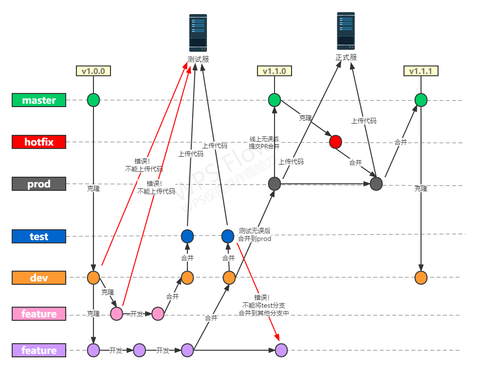
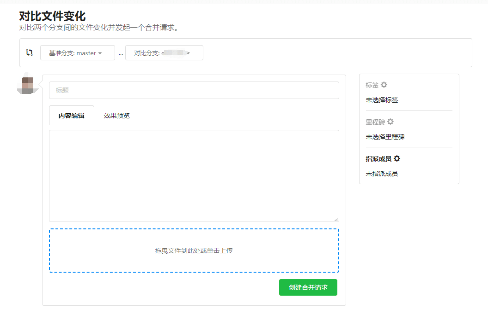

# Git 规范

## 常见研发模式的分支管理规范

### 主干模式

主干研发模式是一种集中开发、集中发布的模式。

#### **工作流程**

1. 所有的开发人员都在一个主干分支上进行编码，需要集成时再合并到一个临时release分支上进行打包发布；
2. 发布完成后，再将代码合并到主干分支上；

#### **优点**

1. **减少重复冲突**：由于代码始终从主干合并，因此可以有效减少集成时因代码冲突而需要重复解决的问题。
2. **一次集成解决冲突**：当代码在主干上集成时，一旦解决了冲突，就不会有后续的冲突产生，避免了多次集成带来的麻烦。
3. **提高可维护性**：主干研发模式可以使代码库始终保持清晰和一致，使得新加入的成员能够更快地了解项目的结构和变化。
4. **简化代码管理**：由于所有的分支最终都需要合并到主干，因此主干的代码始终是最新的，这使得管理大量的分支变得简单。

#### **缺点**

1. **分支功能开发受限**：在主干研发模式中，分支的功能开发可能会受到主干的限制，因为分支的代码需要不断与主干合并。这可能会导致分支的开发效率降低。
2. **对团队协作要求高**：主干研发模式需要团队成员之间的高度协作和沟通，以确保分支的代码能够顺利与主干合并，并且不会破坏主干的代码。
3. **对测试要求高**：由于代码频繁地在主干上集成和测试，因此对测试的要求很高，需要保证测试的准确性和可靠性。


### Aone-Flow 分支模式

#### **工作流程**

1. 提交变更，Aone-Flow 会创建一个集成分支，或者复用已有分支，自动将你的变更合并到这个集成分支。

2. 当你发现你的变更有问题不能发布，可以“退出发布”，Aone-Flow 会自动创建一个新的集成分支，把剩余的需

要继续发布的变更再合并进去。

3. 当集成分支完成正式部署之后，会合并到 master 主干上。这个集成分支上的变更都会被标记“已完成”，并打上

Git Tag。

4. 当需要回滚时，可以根据系统的记录同时将线上的版本和代码一起回滚掉（git revert）。避免出现无意把有问题的

master 代码发布上线的情况。


关于 Aone-Flow 的详细描述可以参看：[阿里巴巴如何管理代码分支？](https://www.infoq.cn/article/EaC4c6yiJrzZ_Gtaf9Ne)

### Git Flow 模式

一种多分支管理的Git分支模型，为每个分支分配了具有特定含义的名称，并将软件生命周期中的各类活动归并到不同的分支上:

1. 拥有主分支和多个功能分支，主分支用于组织与软件开发、部署相关的活动，功能分支用于解决特定的问题或进行特定的开发活动。
2. 允许创建多个功能分支，这些分支通常用于开发新功能或修复缺陷。这些分支的创建、使用和合并都遵循特定的规则和流程。
3. 拥有用于准备、维护和记录发布的发布分支和用于紧急修复的hotfix分支。
4. 它涉及特性分支和多个主分支的使用，开发人员创建一个特性分支，并延迟将其合并到主干分支，直到特性完成。这种长存活功能分支需要更多的协作才能合并，并且存在更高的偏离主干分支的风险，有可能会引发冲突。
5. Git Flow适用于具备预定发布周期的项目和持续交付的DevOps最佳实践。这种工作流不会新增超过功能分支工作流所需的新概念或新命令。它为不同的分支分配了非常具体的角色，并定义了它们应该如何以及何时交互。


> Git 主要用于团队协作，使用统一的 Git 规范，可以减少因为成员使用习惯导致的错误、快速定位问题

## 分支合并方向说明

> 关于  "Merge branch base into new"  和 "Merge branch new into base" 方向说明：
>
> * "Merge branch base into new" :  表示 将 "base 分支合并到 new 分支", "new  分支合并了 base 分支"
> * "Merge branch new into base":  表示 将 "new 分支合并到 base 分支",  "base 分支合并了 new 分支"

* 分支方向图示说明

## 分支介绍

| 分支   | 作用                                                         | 注意事项                                                     |
| ------ | ------------------------------------------------------------ | ------------------------------------------------------------ |
| master | 用于线上代码;                                                | 1.被保护分支，不能直接合并到该分支，需要提交PR<br />2.  master 分支只能发布到正式服<br />3.合并到master时候，预先review 提交完整版本信息（功能信息和修复内容） |
| test   | 测试分支；测试环境使用，用于测试当前开发模块（开发自测和测试人员使用） | 1.测试服代码对应测试分支；<br />2.测试服分支代码不能合并到任何分支上,只能将其他分支合并到测试分支;<br />3.在 test 分支提交代码后会自动进行构建和发布版本; |
| dev    | 模块开发分支； 命名规范： dev-模块名称，如：npi模块开发分支命名为 dev-npi | 前端开发人员共同管理所有开发分支;                            |
| feat   | 功能特性分支；特性分支基于开发分支模块； <br />命名规范：feat-特性名；如：npi 模块已上线，上线后 npi 模块内新增某个模块，则该模块命名为 feat-模块名称； | 各自开发人员自己管理自己开发模块的特性分支;                  |
| hotfix | 热修复分支；用于紧急修复Bug 基于 dev 分支开发                |                                                              |



## 服务器代码与分支对应关系

目前系统只分 正式服 和 测试服：

> * 正式服上传 master 分支代码；测试服上传 test 分支代码；
>
> * 测试功能分支代码时，先将代码合并到测试分支，推送到远程仓库后会自动触发构建测试分支代码；
>
> * 不能将其他分支代码直接上传到正式服和测试服；(已使用脚本自动拦截，请勿注释或删除脚本来跳过检查！)

注意：**为了避免开发过程中，不同开发人员开发的功能相互覆盖的情况，请将开发的特性分支合并到 test 分支后推送到测试服！**

## 测试服 FTP 权限配置

推送到测试服，必须要有测试服静态服务的 FTP 账号/权限，配置流程如下：

1. 寻找系统负责人，开通系统 FTP 测试服账号/权限；
2. 在 `/deploy` 目录下创建一个 `users.ts` 文件：（以 pmp 系统为例）

```js
const userConfig = {
    user: {
        test: 'ftp 测试服账号',
        production: 'ftp 正式服账号',// //没有正式服 ftp 权限，设置为空
    },
    password: {
        test: 'ftp 测试服密码',
        production: 'ftp 正式服密码', //没有正式服 ftp 权限，设置为空
    },
}

module.exports = userConfig
```

3. 将该文件加入 `.gitignore` 文件

   

## 新模块开发流程

1. 确定新大模块开发;
2. 使用开发分支“dev-模块名称”;
3. 开发人员细分模块，基于 “dev-模块名称” 分支切出 “feat-细分模块” 分支开发;
4. 开发完成合并到测试分支测试各自开发模块;
5. 开发人员各自模块确认无误后，合并到 dev 分支;
6. 将 “dev-模块名称” 分支合并到 测试分支，测试整体模块;
7. 整体模块确认无误后，合并到 prod ，打包上线到正式服;
8. 正式服试用确认无误(功能无需调整后)，将 prod 分支提交 PR 合并到 master.


## BUG 修复流程

1. 切换到 master 分支，拉取代码(更新)；

2. 切换到 fix-hot 分支，合并 master 分支代码到 fix-hot；

3. 在 fix-hot 分支修复bug；

4. 合并 fix-hot 分支到 test 分支，推送到远程分支，自动构建部署到测试服测试；

5. 测服无误，提交 PR 将 fix-hot 合并到 master 分支；推动到远程分支，自动构建 master 分支代码并部署到正式服;


## Git 发版流程

在测试服测试无误，并与项目管理员沟通确认发版后，按照以下流程将分支合并到 master 后发版：

1. 本地合并master 分支，解决冲突：

   * 本地切换到 master 分支： `git checkout  master`;

   * 同步本地 master 与远程 master 分支： `git pull`;

   * 切换回自己的分支，并合并本地 master  分支：（此步骤目的：**本地解决你的开发分支与 master 分支的冲突**）
     * `git  checkout  你的开发分支`
     * `git merge master` 合并master 分支到你的分支； 

2. 提交 PR: 合并远程分支到 master 分支

   * 目的：
     * **通过提交 PR 方式，需要对 master 分支进行保护，避免成员直接推送分支到 master，造成代码污染**；
     * **通过 PR 对提交到 master 分支的代码进行审查；**

   * 打开 git 仓库管理界面 -> 打开合并请求 ->  点击创建合并请求：(此处使用 gogs 管理代码仓库)
     * 

   * 点击创建合并请求，将显示以下界面：(此处使用 gogs 管理代码仓库)

     * 

       > * 基准分支：合并进入的分支，比如你的 dev 分支要合并到 master，那么 master 就是基准分支；
       > * 对比分支： 你的开发/特性 分支
       > * 标题： 分支合并的标题描述
       > * 内容：分支合并的内容描述


## 分支管理规范说明

1. **不能将 test 分支合并到其他分支 !!** (test 分支代码可能包含未上线代码或废弃代码，将 test 分支合并到其他分支，若该分支又提交到 prod 分支，将可能导致 prod 分支有未上线代码或废弃代码)
2. 不能直接将 feature 分支合并到 prod， 需要将 feature 分支合并到 dev - 特性 分支，再将 dev - 特性合并到prod;
3. **正式服代码对应 prod 分支代码；测试服代码对应 test 分支代码；不能将其他分支代码打到上传到 正式服和测试服；** 
4. **不可以随意推送 master 分支代码(必须测试无误会后推送)，目前提送 master 分支代码后会自动构建并部署到正式服，推送 test 分支代码也如此；**

## GIT 强制规范

> GIT 提交强制规范内容：
>
> 1. 强制 测试服 仅能上传 test 分支代码，正式服仅能上传 prod 代码；
> 2. master 分支受保护，其他分支不能直接合并到 master，需要提交 PR 合并；
> 3. 强制 test 分支 不能合并到任何分支；
> 4. 其他分支合并到 prod 分支后，执行 git push 之后将自动执行  npm run build:prod 命令；
> 5. 执行命令 npm run build:prod 将执行以下操作:（npm run build:stage 执行相同操作，对应 test 分支代码）
>    1. 同步远程分支代码；（脚本自动执行，避免人为遗忘同步）
>    2. 自动构建 prod 分支代码；（自动构建，节省命令行输入）
>    3. 自动部署 prod 分支代码正式服；（脚本自动部署正式服为 prod 分支代码，避免人为部署了其他分支代码的错误）

## 分支提交规范

* 项目采用目前流行的Angular提交规范：

* 提交格式如下：

  ```
  <type>(<scope>): <subject>
  <BLANK LINE>
  <body>
  <BLANK LINE>
  <footer>
  ```

  每次提交可以包含页眉(header)、正文(body)和页脚(footer)，每次提交必须包含页眉内容

  每次提交的信息不超过100个字符

* 提交类型指定为下面其中一个：

  1. `build`：对构建系统或者外部依赖项进行了修改
  2. `ci`：对CI配置文件或脚本进行了修改
  3. `docs`：对文档进行了修改
  4. `feat`：增加新的特征
  5. `fix`：修复`bug`
  6. `pref`：提高性能的代码更改
  7. `refactor`：既不是修复`bug`也不是添加特征的代码重构
  8. `style`：不影响代码含义的修改，比如空格、格式化、缺失的分号等
  9. `test`：增加确实的测试或者矫正已存在的测试

* 参考资料

  * [Angular提交信息规范](https://zj-git-guide.readthedocs.io/zh_CN/latest/message/Angular%E6%8F%90%E4%BA%A4%E4%BF%A1%E6%81%AF%E8%A7%84%E8%8C%83/)

## 制规范脚本技术实现

* 工具/插件：
  * [githooks](https://git-scm.com/docs/githooks) : 钩子是您可以放置在钩子目录中的程序，以在 git 执行的某些点触发操作。未设置可执行位的挂钩将被忽略。
  * [husky](https://typicode.github.io/husky/#/?id=install)：husky是一个 git hook工具，可以帮助我们触发git提交的各个阶段。
  * [ftp-deploy](https://www.npmjs.com/package/ftp-deploy): 一个帮助部署代码的 Node.js 包。从本地磁盘 ftp 一个文件夹到远程 ftp 目标。不从目标目录中删除。
  * [npm script shell](https://www.likecs.com/show-204138878.html)

## 实现细节

### **强制规范实现**

* 自动同步代码，自动构建和发布命令流程实现：

  * > 使用 npm run build:prod 命令将自动同步远程分支代码，构建 prod 分支代码并部署到 正式服; 

  * 实现代码： 

* 代码推送时自动构建代码实现:

* 自动部署脚本实现：

  

