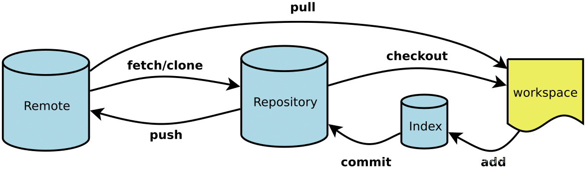

# Git 基础

### GIt 原理



git 仓库分为两部分：

- 本地仓库
- 远程仓库

git 本地仓库会分成三个区：

- **工作区**（Workspace）：我们书写代码的地方，工作的目录就叫工作区。
- **暂存区** （Index）：暂时存储的区域，在git中，代码无法直接从工作区提交到仓库区，而是需要先从工作区添加到暂存区，然后才能从暂存区提交到仓库区。
  - 暂存区的目的是避免误操作。
- **本地仓库区**（Repository）：将保存在暂存区域的内容永久转储到 Git 仓库中，生成版本号。生成版本号之后，就可以任何的回退到某一个具体的版本。
  - 当我们进行commit操作的时候，事实上只是提交到本地的git分支上；而只有进行了push后，才是提交到远程的git分支上
- **远程仓库**（Remote）： 仓库，托管代码的服务器，可以简单的认为是你项目组中的一台电脑用于远程数据交换。

## Git 常用命令


## Git 常见操作

### 快速创建新分支

* 切换到 master 分支(或则作为基分支的节点)： `git chekcout master`
* 更新本地仓库代码:  `git pull` （`git pull = git fetch + git merge refs/remotes/origin/maste`）
* 创建新分支并切换到新分支：` git checkout -b  分支名称`

### 解决冲突

**场景示例**

以 `index.html` 文件为例，如果你跟同事都修改了这个文件，就有如下两种场景:

场景1：

* 你在本地修改了 index.html，但还没执行 git commit（未提交到本地仓库），此时如果你执行 git pull，代码无法更新，会有如下提示：

  ```bash
  error: Your local changes to 'index.html' would be overwritten by merge.  Aborting.
  Please, commit your changes or stash them before you can merge.
  ```

* 解决方案：

  * 方案1：(不推荐)

    * 先备份本地 index.html，然后执行 git revert 撤销文件提交，然后执行 git pull 下载远程代码并合并本地代码，此时代码就可以正常拉取。（此时远程仓库代码和本地代码没有冲突）
    * 然后再通过 diff 比较更新后的代码和本地备份代码 两份代码不一致的地方，修改后再次 git commit 提交代码即可

  * 方案2：(推荐)

    * 第一步：提交修改到本地仓库 

      * git add . （添加到暂存区）
      * git commit -m"提交备注"  提交修改到本地仓库

    * 第二步： git pull （获取并合并远程分支代码)

      * 获取并合并远程分支代码后，会出现代码冲突提示：

        ```
        Auto-merging 冲突文件名
        CONFLICT (content): Merge conflict 冲突文件名
        ```

    * 第三步： 打开代码冲突解决工具，查看冲突部分代码，与同事协商保留的代码。

    * 第四步： 解决冲突后的代码后，重新执行 git add .  ->  git commit -m"提交备注"  

  * 方案3：（推荐）

    * 第一步：[git stash](https://git-scm.com/docs/git-stash) 暂存本地修改 （暂存后本地工作区回到干净的工作目录）
      * 查看暂存信息 git stash list 
    * 第二步：git pull （获取并合并远程分支代码)
      * 获取并合并远程分支代码后，会出现代码冲突提示
    * 第三步：git  stash pop 还原暂存的内容
    * 第四步：解决文件中冲突的的部分，保存代码后提交

场景2：
* 你本地修改了 index.html，而且执行了git commit（提交到本地仓库），此时如果执行 git push 的话就会提示冲突，因为你的同事的版本已经先于你提交了，你们对同一个文件进行了操作，此时 git 就不知道究竟采用你的还是你的同事的代码。
  
  

**参考资料**

[在 GitHub 上使用合并冲突解决来解决竞争提交](https://docs.microsoft.com/zh-cn/learn/modules/resolve-merge-conflicts-github/?WT.mc_id=DT-MVP-5003916)


### 删除分支

假设删除本地和远程 test 分支

```shell
删除本地 test 分支：git branch -d test
删除本地的仓库 test 分支：git branch -r -d origin/test
删除 origin 主机的 test 分支：git push origin :test 命令等同于 git push origin --delete test
```


### Git 回滚

`git reset` 和 `git revert`

当前版本回滚没有任何流程化管理模式，使用最原始的分支管理和 git 命令直接回滚

当前回滚版本流程：

以 SRDPM 为例，目前生产服对应 prod 分支代码，测试服对应 test 分支代码，（master 为保护分支，定期将 prod 代码合并到 master）假如生产服某个版本出现重大问题，需要回滚，通过以下 Git 操作流程回滚：

1. 使用 ` git checkout prod` 切换到 prod 分支，使用 `git log` 查看提交记录；
2. 查找到需要回滚的提交记录 hash 值，复制提交记录 hash 值；
3. 使用命令 `git reset --hard <commit-hash>` 强制回滚，也可以使用 `git revert <commit-hash>` 去除提交记录（两个命令区别下面将详细介绍）；
4. 强制推送到远程分支：`git push --force origin <branch-name>`;
5. 执行命令 `npm run build` 重新构建并上传当前分支代码；

### git reset

> **原理：** git reset的作用是修改HEAD的位置，即将HEAD指向的位置改变为之前存在的某个版本，如下图所示，假设我们要回退到版本


要回滚并同步远程分支，可以按照以下步骤进行操作：

1. 确定回滚目标：首先，确定要回滚到的目标提交。可以使用 `git log` 命令查看提交历史，找到目标提交的哈希值。

   ````shell
   git log
   ````
   
2. 回滚本地分支：运行以下命令回滚本地分支到目标提交。

   ````shell
   git reset --hard <commit-hash>
   将 `<commit-hash>` 替换为目标提交的哈希值。
   
   例如：git reset --hard abcdef12345 
   这将回滚本地分支，并将其指向目标提交。
   ````
   
3. 强制推送到远程分支：由于本地分支已经回滚，远程分支仍然指向旧的提交。要将更改同步到远程分支，可以使用 `--force` 参数进行强制推送。

   ~~~shell
   git push --force origin <branch-name>
   将 `<branch-name>` 替换为你的分支名称。
   
   例如：`git push --force origin my-branch`
   git push --force origin my-branch 这将强制推送本地分支的更改到远程分支，并覆盖远程分支的历史记录。
   ~~~
   

请注意，强制推送会改变远程分支的历史记录，可能会影响其他人的工作。在执行强制推送之前，请确保与团队成员进行适当的沟通，并确保你有合理的理由进行这样的操作。


### git revert

> 原理： git revert是用于“反做”某一个版本，以达到撤销该版本的修改的目的。
>
> 比如，我们commit了三个版本（版本一、版本二、 版本三），突然发现版本二不行（如：有bug），想要撤销版本二，但又不想影响撤销版本三的提交，就可以用 git revert 命令来反做版本二，生成新的版本四，这个版本四里会保留版本三的东西，但撤销了版本二的东西。


使用 `git revert` 命令可以回滚指定的提交，而不是像 `git reset` 那样移动分支指针。`git revert` 会创建一个新的提交，该提交撤销了要回滚的提交的更改。以下是使用 `git revert` 回滚版本的步骤：

1. 确定要回滚的提交：首先，使用 `git log` 命令查看提交历史，找到要回滚的提交的哈希值。

   ~~~shell
   git log
   ~~~
   
2. 执行回滚：运行以下命令来回滚指定的提交。

   ~~~shell
   git revert <commit-hash>
   将 `<commit-hash>` 替换为要回滚的提交的哈希值。
   
   例如：
   git revert abcdef12345
   这将创建一个新的提交，该提交撤销了目标提交的更改。
   ~~~
   
3. 提交回滚：在弹出的编辑器中，输入撤销提交的说明，保存并关闭编辑器。

4. 推送到远程：如果你想将回滚的提交推送到远程仓库，可以运行 `git push` 命令。

   ~~~shell
   git push origin <branch-name>
   将 `<branch-name>` 替换为你的分支名称。
   
   git push origin main
   这将把回滚的提交推送到远程分支。
   ~~~

使用 `git revert` 回滚版本是一种安全的方法，因为它不会改变历史记录。相比之下，`git reset` 会移动分支指针并修改历史记录，可能会影响其他人的工作。因此，在团队协作的情况下，`git revert` 通常是更推荐的方法。

## Git 项目配置

### Git Hook

**参考资料**

[vue-element-admin Git Hooks](https://panjiachen.github.io/vue-element-admin-site/zh/guide/advanced/git-hook.html#lint-staged)

[husky](https://www.npmjs.com/package/husky)

## 参考资料

[git 手册](https://git-scm.com/about)

[Git 分支设计规范](https://zhuanlan.zhihu.com/p/131332462)