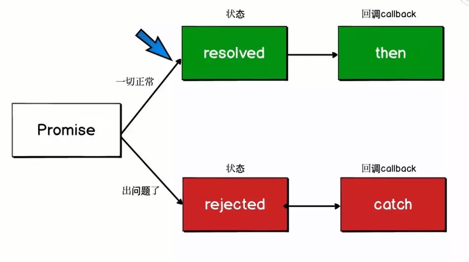

# Promise 专题

## Promise 基础

### Promise 概念


### then()


### 错误处理


### Promise 值穿透


### finally()


### 包装Pomise 对象

 

### 并发方法


promise 基础直接参考 阮一峰[《ECMAScript 6 入门》](https://es6.ruanyifeng.com/#docs/promise) 

## Promise 原理实现

强烈推荐先看 《[图解 Promise 实现原理](https://mp.weixin.qq.com/s/UNzYgpnKzmW6bAapYxnXRQ) 》文章，文章内容将原理讲述透彻，该系列文章有如下几个章节组成：

1. [图解 Promise 实现原理（一）—— 基础实现](https://mp.weixin.qq.com/s?__biz=MzI4NjY4MTU5Nw==&mid=2247486661&idx=1&sn=8e4b3056aa9c110ca08047d0917290f4&chksm=ebd87c57dcaff54168d1a8f94b074fa814270b9753d8c1e7eebe3b4203254ecb0e6989ba1f19&scene=21#wechat_redirect)

2. [图解 Promise 实现原理（二）—— Promise 链式调用](https://mp.weixin.qq.com/s?__biz=MzI4NjY4MTU5Nw==&mid=2247486706&idx=2&sn=9434eb4f5ea43e46de70a6486afbffbf&chksm=ebd87c60dcaff57669d389cf114a993b15df789b1b14fe1f4c89e38d304d79489dc5394e9296&scene=178&cur_album_id=1500522652875194368#rd)

3. [图解 Promise 实现原理（三）—— Promise 原型方法实现](https://mp.weixin.qq.com/s?__biz=MzI4NjY4MTU5Nw==&mid=2247486850&idx=2&sn=647638dbb430da2c23a1320033fc806f&chksm=ebd87d10dcaff40681acb2ee93b5516ae190e1111938fc72da12178e3d7f9c9fe5ffa0569254&scene=178&cur_album_id=1500522652875194368#rd)

4. [图解 Promise 实现原理（四）—— Promise 静态方法实现](https://mp.weixin.qq.com/s?__biz=MzI4NjY4MTU5Nw==&mid=2247486966&idx=2&sn=5c90d287040a811ed06517518fee8e34&chksm=ebd87d64dcaff4726226d01cbb7b12aea5f16429a06b8f8cfbc23a35ecf955c899cd139283b7&scene=178&cur_album_id=1500522652875194368#rd)

   

Promise 核心原理实现主要分为：**基础方法+链式调用+延迟机制+状态管理+异常处理**

* Promise() 对象最基础包含 constructor()、then()、resolve() 三个方法；
* 链式调用主要原理： then() 返回一个新的 Promise() 对象；
* 延迟机制：
  * 目的:  保证在 resolve 执行之前，then 方法已经注册完所有的回调;
  * 实现： 
    * 方法1： 使用 setTimeout() 模拟实现
    * 方法2： 通过判断状态变化
* 状态管理：Promise 对象的状态改变，只有两种可能。
  * Pending 变为 Resolved ：promise变为FULFILLED状态后具有一个唯一的value；
  * Pending 变为 Rejected： promise变为REJECTED状态后具有一个唯一的reason；
  * 
* 异常处理：在执行 onFulfilled 或者 onRejected 时，出现的异常处理方法，使用 try-catch 捕获错误，然后将相应的 Promise 状态设置为 rejected 状态
  * 不管是错误也好，异常也罢，最终都是通过 reject 实现的，可见最终对于错误以及异常的处理，都可以通过 then 中的 onRejected 来处理。所以单独增加一个 catch 方法，它是 .then(null, onRejected) 的别名


```javascript
class Promise {
  callbacks = []; //异步回调函数队列
  state = 'pending';//增加状态
  value = null;//保存当前promise 异步操作执行结果	
  constructor(fn) {
    fn(this._resolve.bind(this), this._reject.bind(this));// 创建Promise对象时立即执行 fn 函数
  }
  then(onFulfilled, onRejected) { // then 函数仅仅是注册了后续需要执行的回调
    return new Promise((resolve, reject) => {  // 链式调用关键：返回新的promise对象
      this._handle({
        onFulfilled: onFulfilled || null, // then方法成功回调函数
        onRejected: onRejected || null, // then方法失败回调函数
        resolve: resolve, // 新的Promise 对象 resolve 方法
        reject: reject  // 新的Promise 对象 reject 方法
      });
    });
  }
  catch(onError) {
    return this.then(null, onError);
  }
  finally(onDone) {
    if (typeof onDone !== 'function') return this.then();
 
    let Promise = this.constructor;
    return this.then(
      value => Promise.resolve(onDone()).then(() => value),
      reason => Promise.resolve(onDone()).then(() => { throw reason })
    );
  }
  _handle(callback) {
    if (this.state === 'pending') {
      this.callbacks.push(callback);
      return;
    }
 	//获取回调方法
    let cb = this.state === 'fulfilled' ? callback.onFulfilled : callback.onRejected;
 
    if (!cb) {//如果then中没有传递任何东西
      cb = this.state === 'fulfilled' ? callback.resolve : callback.reject;
      cb(this.value);
      return;
    }
 
    let ret;
 
    try {
      // 执行当前返回异步操作结果的promise的回调函数，并将异步操作结果this.value传入回调函数
      ret = cb(this.value);
      cb = this.state === 'fulfilled' ? callback.resolve : callback.reject;
    } catch (error) {
      ret = error;
      cb = callback.reject // 回调函数执行报错，执行回调的 reject 
    } finally {
      //调用当前返回异步操作结果的promise的回调函数的resolve/reject方法，并传入回调执行结果
      cb(ret);
    }
 
  }
  _resolve(value) { //回调函数的执行是在 resolve 方法里面执行的
    // Promise 异步操作结果为 Promise 对象,调用 异步操作结果的 then()
    if (value && (typeof value === 'object' || typeof value === 'function')) {
      var then = value.then;
      if (typeof then === 'function') {
        then.call(value, this._resolve.bind(this), this._reject.bind(this));
        return;
      }
    }
 
    this.state = 'fulfilled';//改变状态
    this.value = value;//保存结果
    this.callbacks.forEach(callback => this._handle(callback)); //执行下一个回调函数
  }
  _reject(error) { //回调函数的执行是在reject 方法里面执行的
    this.state = 'rejected';
    this.value = error;
    this.callbacks.forEach(callback => this._handle(callback));
  }
}
```

**参考资料**

[图解 Promise 实现原理](https://mp.weixin.qq.com/s/UNzYgpnKzmW6bAapYxnXRQ) 

[模拟实现Promise](http://www.conardli.top/docs/JavaScript/%E6%A8%A1%E6%8B%9F%E5%AE%9E%E7%8E%B0promise.html#%E5%9F%BA%E7%A1%80%E7%89%88%E6%9C%AC)


## Promise 执行顺序

执行顺序题目主要结合 JavaScript 的事件循环和 Promise 的宏任务/微任务考察：

* Promise 新建后executor就会立即执行;
* 调用 resolve() 或 reject() 并不会终结 Promise 的 executor 函数的执行
* Promise 的状态一旦变更为成功或者失败，则不会再次改变
* 宏任务： script(主程序代码)，setTimeout(), setInterval(), setImmediate(), I/O, requestAnimationFrame()，UI rendering
* 微任务： Promise.resolve()，Promise.reject()，Promises.then()，Promises.finally()，process.nextTick()，Object.observe()， MutationObserver()
* 执行顺序：script(主程序代码)—>process.nextTick—>Promises.then()——>setTimeout——>setInterval——>setImmediate——> I/O——>UI rendering

 任务执行流程：


```javascript
setTimeout(function () {
  console.log(3);
}, 0);
Promise.resolve().then(function () {
  console.log(2);
});
console.log(1);
//输出: 1 2 3
```

> 以上代码的输出结果是：
> ```js
> 1
> 2
> 3
> ```
>
> 这是因为 JavaScript 中的事件循环机制决定了代码执行的顺序。
>
> 首先，按顺序执行同步代码：
> - `console.log(1)` 输出 1。
>
> 接下来，执行微任务（Promise）：
> - `Promise.resolve().then()` 创建一个微任务，将其放入微任务队列中。
> - `console.log(2)` 输出 2。
>
> 然后，执行宏任务（setTimeout）：
> - `setTimeout(function () { console.log(3); }, 0)` 创建一个宏任务，将其放入宏任务队列中。由于延迟时间为 0，所以会尽快执行。
> - `console.log(3)` 输出 3。
>
> 根据事件循环的规则，微任务优先级高于宏任务。因此，在执行完同步代码后，会先执行微任务队列中的任务，然后再执行宏任务队列中的任务。
>
> 所以，最终的输出结果是按照顺序输出 1、2、3。

```javascript
const promise = new Promise((resolve, reject) => {
    console.log(1);
    resolve();
    console.log(2);
    reject('error');
})
promise.then(() => {
    console.log(3);
}).catch(e => console.log(e))
console.log(4);
//输出: 1 2 4 3
```

> 规则一: promise`构造函数的代码会立即执行，`then`或者`reject`里面的代码会放入异步微任务队列，在宏任务结束后会立即执行。
>
> 规则二：`promise`的状态一旦变更为成功或者失败，则不会再次改变，所以执行结果为：1,2,4,3。而`catch`里面的函数不会再执行

* 

```javascript
const promise = new Promise((resolve, reject) => {
        setTimeout(() => {
             console.log('once')
             resolve('success')
        }, 1000)
 })
promise.then((res) => {
       console.log(res)
     })
promise.then((res) => {
     console.log(res)
 })

//执行结果: 过一秒打印 once,success,success
```

> `promise`的构造函数只会执行一次，而`then`方法可以多次调用，但是第二次是直接返回结果，不会有异步等待的时间

* 

```javascript
const p1 = () => (new Promise((resolve, reject) => {
	console.log(1);
	let p2 = new Promise((resolve, reject) => {
		console.log(2);
		const timeOut1 = setTimeout(() => {
			console.log(3);
			resolve(4);
		}, 0)
		resolve(5);
	});
	resolve(6);
	p2.then((arg) => {
		console.log(arg);
	});

}));
const timeOut2 = setTimeout(() => {
	console.log(8);
	const p3 = new Promise(reject => {
		reject(9);
	}).then(res => {
		console.log(res)
	})
}, 0)


p1().then((arg) => {
	console.log(arg);
});
console.log(10);

// 输出: 1 2 10 5 6 8 9 3
```

> 第一步：
>
> ​	执行主程序宏任务，执行 p1，p2，conole.log(10)，输出：1,2,10。
> ​	这时候事件循环里面有异步任务`timeOut1,timeOut2,p2.then,p1.then`
> ​	`p2.then,p1.then`为微任务，`timeOut1,timeOut2`为宏任务
>
> 第二步：
>
> ​	宏任务执行完后`Event Loop`会去任务队列取异步任务，微任务会优先执行。
>
> ​	根据微任务进入异步队列顺序，这时候会先后执行 `p2.then -> p1.then`，打印 5,6。
>
> 第三步：
>
> ​	微任务执行完了，开始宏任务，由于2个`settimeout`等待时间一样，所以会执行先进入异步队列的顺序，`timeOut2 `先后打印：8。执行宏任务的过程中，`p3.then` 微任务进入了微任务队列，宏任务执行完毕会执行微任务，输出：9。
>
> ​	之后继续执行下一个宏任务`timeOut1`, 输出：3。
>
> 第四步：
>
> ​	结合规则6，由于p2这个`Promise`对象的执行结果已经确定，所以4不会被打印

* **错误捕获** 

```javascript
Promise.resolve()
  .then(() => {
    return new Error('error!!!')
  })
  .then((res) => {
    console.log('then: ', res)
  })
  .catch((err) => {
    console.log('catch: ', err)
  })
//输出：then:  Error: error!!!
```

> 这里的陷阱在于只有抛出错误时才会执行 .catch()，题目中并不是抛出错误，所以执行 .then()。
>
> 改成如下方式会执行 .catch():
>
> return Promise.reject(new Error('error!!!'))
> throw new Error('error!!!')

* 

```javascript
const promise = Promise.resolve()
    .then(() => {
        return promise
    })
promise.catch(console.error)
```

> 答案
> 程序报错：`TypeError: Chaining cycle detected for promise #<Promise>`
> 解读
> `.then() 或 .catch() 返回的值不能是 promise 本身，否则会造成死循环`

* 

```javascript
setTimeout(() => {
    console.log(1)
    Promise.resolve(3).then(data => console.log(data))
}, 0)

setTimeout(() => {
    console.log(2)
}, 0)

//输出：1 3 2
```

>先执行整体代码，没有发现微任务；
>再执行下一个宏任务—setTimeout回调函数，打印出1；
>遇到微任务—Promise 回调函数；
>立即执行微任务，打印出3；
>微任务队列被清空，执行下一个宏任务—下一个setTimeout回调函数，打印出2。

* 

```javascript
var pro = new Promise((res,rej)=>{
    res(1);
});
pro.then(res=>{
    console.log(res);
});
setTimeout(()=>{
console.log(2);
})
pro.then(res=>{
    console.log(res);
})

//输出： 1 1 2
```

> promise 对象赋值给了变量 pro，每个 `.then()` 都是独立的，遇到 .then() 都会加入微任务队列，然后进行事件循环

* 

```javascript
async function async1 () {
    console.log('async1 start');
    await async2();
    console.log('async1 end');
}

async function async2 () {
    console.log('async2');
}

console.log('script start');

setTimeout(function () {
    console.log('setTimeout');
}, 0);

async1() 

new Promise (function (resolve) {
    console.log('promise1');
    resolve();
}).then (function () {
    console.log('promise2');
})

console.log('script end');

//------输出--------
script start
async1 start
async2
promise1
script end
async1 end
promise2
setTimeout

```

> 注意以下几点:
>
> * 定义 async1()，async2()，不会立即执行
> * await async2(); 表示先执行 async2()，然后将 await 后面的代码当作 .then() 中的回调来处理，因此执行 async2() 以后，返回值和后面代码添加到微任务队列中
> * 初始化 promise，promise 中的代码会立即执行


## Promise 封装异步操作 

* 题目一：使用 promise 封装 setTimeout

  * 实现: 
    * 参数： ms 毫秒数
    * 返回值： 新的promise

  ```js
  const wait = ms => new Promise((resolve，reject) => setTimeout(resolve,ms) )
  ```

  ```js
  const wait = ms => new Promise(resolve => setTimeout(resolve,ms) )
  ```

  * 使用

    ```js
    wait(10000)
        .then(() => saySomething("10 seconds"))
        .catch(failureCallback);
    ```

    

  * 分析：因为 `setTimeout` 并不会真的执行失败，那么我们可以在这种情况下忽略 reject

* 题目二：使用 promise 封装 [navigator.geolocation.getCurrentPosition(success, error, options)](https://developer.mozilla.org/zh-CN/docs/Web/API/Geolocation/getCurrentPosition) 接口

  * 实现：

    * 参数： options

    * 返回值： promise

    * ```js
      getLocation = options => new Promise((resolve, reject) => {
          navigator.geolocation.getCurrentPosition(resolve,reject,options)
      })
      ```

* 题目三：封装 XMLHttpRequest 

  * 实现

    * ```js
      function myAsyncFunction(url) {
        return new Promise((resolve, reject) => {
          const xhr = new XMLHttpRequest();
          xhr.open("GET", url);
          xhr.onload = () => resolve(xhr.responseText);
          xhr.onerror = () => reject(xhr.statusText);
          xhr.send();
        });
      };
      ```


## Promise 特性

### **Promise 特性问题**

 **如何取消一个Promise？**

* 在要停止的`promise`链位置添加一个方法，返回一个永远不执行`resolve`或者`reject`的`Promise`，那么这个`promise`永远处于`pending`状态，所以永远也不会向下执行`then`或`catch`了。这样我们就停止了一个`promise`链

  ```javascript
  Promise.resolve().then(() => {
      console.log('ok1')
      return new Promise(()=>{})  // 返回“pending”状态的Promise对象
  }).then(() => {
      // 后续的函数不会被调用
      console.log('ok2')
  }).catch(err => {
      console.log('err->', err)
  })
  ```

* Promise.race竞速方法

  ```javascript 
  let p1 = new Promise((resolve, reject) => {
      resolve('ok1')
  })
  
  let p2 = new Promise((resolve, reject) => {
      setTimeout(() => {resolve('ok2')}, 10)
  })
  
  Promise.race([p2, p1]).then((result) => {
      console.log(result) //ok1
  }).catch((error) => {
      console.log(error)
  })
  ```

**如果向Promise.all()和Promise.race()传递空数组，运行结果会有什么不同？**

* 
* all会立即决议，决议结果是fullfilled，值是undefined; race会永远都不决议，程序卡死

**Promise链上返回的最后一个Promise出错了怎么办？**

* `catch`在`promise`链式调用的末尾调用，用于捕获链条中的错误信息，但是`catch`方法内部也可能出现错误，所以有些`promise`实现中增加了一个方法`done`，`done`相当于提供了一个不会出错的`catch`方法，并且不再返回一个`promise`，一般用来结束一个`promise`链

  ```javascript
  done() {
      this.catch(reason => { //调用 Promise 的 catch 方法
        console.log('done', reason);
        throw reason; // 向外抛出错误
      });
   }
  ```

  

### Promise 应用题

* 题目一：**顺序加载10张图片，图片地址已知，但是同时最多加载3张图片，要求用`promise`实现**

```javascript
const baseUrl = 'http://img.aizhifou.cn/';
const urls = ['1.png', '2.png', '3.png', '4.png', '5.png','6.png', '7.png', '8.png', '9.png', '10.png'];
const loadImg = function (url, i) {
	return new Promise((resolve, reject) => {
		try {
			// 加载一张图片
			let image = new Image();
			image.onload = function () {
				resolve(i)
			}
			image.onerror = function () {
				reject(i)
			};
			image.src = baseUrl + url;
		} catch (e) {
			reject(i)
		}
	})
}
function startLoadImage(urls, limits, endHandle) {
	// 当前存在的promise队列
	let promiseMap = {};
	// 当前索引对应的加载状态，无论成功，失败都会标记为true，格式： {0: true, 1: true, 2: true...}
	let loadIndexMap = {};
	// 当前以及加载到的索引，方便找到下一个未加载的索引，为了节省性能，其实可以不要
	let loadIndex = 0;
	const loadAImage = function () {
		// 所有的资源都进入了异步队列
		if (Object.keys(loadIndexMap).length === urls.length) {
			// 所有的资源都加载完毕，或者进入加载状态，递归结束
			const promiseList = Object.keys(promiseMap).reduce((arr, item) => {arr.push(promiseMap[item]); return arr}, [])
			Promise.all(promiseList).then(res => {
				// 这里如果没有加载失败，就会在所有加载完毕后执行，如果其中某个错误了，这里的结果就不准确，不过这个不是题目要求的。
				console.log('all');
				endHandle && endHandle()
			}).catch((e) => {
				console.log('end:' + e);
			})
		} else {
			// 遍历，知道里面有3个promise
			while (Object.keys(promiseMap).length < limits) {
				for (let i = loadIndex; i < urls.length; i++) {
					if (loadIndexMap[i] === undefined) {
						loadIndexMap[i] = false;
						promiseMap[i] = loadImg(urls[i], i);
						loadIndex = i;
						break;
					}
				}
			}
			// 获取当前正在进行的promise列表，利用reduce从promiseMap里面获取
			const promiseList = Object.keys(promiseMap).reduce((arr, item) => {arr.push(promiseMap[item]); return arr}, [])
			Promise.race(promiseList).then((index) => {
				// 其中一张加载成功，删除当前promise，让PromiseList小于limit，开始递归，加载下一张
				console.log('end:' + index);
				loadIndexMap[index] = true;
				delete promiseMap[index];
				loadAImage();
			}).catch(e => {
				// 加载失败也继续
				console.log('end：' + e);
				loadIndexMap[e] = true;
				delete promiseMap[e];
				loadAImage();
			})
		}
	}
	loadAImage()
}

startLoadImage(urls, 3)
```

>将代码复制到chrome浏览器可以看到下面的运行结果：
>
>可以看到，所有图片加载完成，在没有失败的情况下，打印出来`all`
>解析：`Promise.race`方法接受的参数中有一个`promise`对象返回结果了就会立即触发成功或者失败的函数。这里利用这个特性，先将`promise`队列循环加入，直到达到限制，等待`race`，`race`后又加入一个`promise`，利用递归一直循环这个过程，到最后用`promise.all`捕获剩下的图片加载


## Promisec串行

### 串行概念

* 有多个任务，多个任务必须顺序执行（下一个任务依赖上一个任务结果）
* 使用 Promise 进行异步操作的顺序处理
* Promise 串行执行实现原理： 利用 Promise.then() 的链式调用

### Pomise 串行实现

模拟三个异步函数，每一个函数依赖上一个函数结果

```javascript
/ 异步函数 p1
let p1 = function () {
  return new Promise(function (resolve, reject) {
    setTimeout(function () {
      resolve('p1->')
    }, 1000)
  })
}

// 异步函数 p2
let p2 = function (data) {
  return new Promise(function (resolve, reject) {
    resolve(data + 'p2->')
  })
}

// 异步函数 p3
let p3 = function (data) {
  return new Promise(function (resolve, reject) {
    setTimeout(function () {
      resolve(data + 'p3->')
    }, 500)
  })
}
```


* 实现一：**使用then链式操作**

  * 缺点：书写比较繁琐

  ```javascript
  p1()
    .then(function (data) {
      return p2(data)
    })
    .then(function (data) {
      return p3(data)
    })
    .then(function (data) {
      console.log(data)
    })
  // 输出: p1->p2->p3->
  ```

  

* 实现二：**forEach循环构建队列**

  ```javascript
  function queue(arr) {
    let sequence = Promise.resolve()
    arr.forEach(function (item) {
      sequence = sequence.then(item)
    })
    return sequence
  }
  
  // 执行队列
  queue([p1, p2, p3])
    .then(data => {
      console.log(data)
    })
  // 输出: p1->p2->p3->
  ```

  

* 实现三：**reduce循环构建队列**

  ```javascript
  function queue(arr) {
    return arr.reduce(
      (promiseChain, currentFunction) => promiseChain.then(currentFunction),
      Promise.resolve()	//	将初始值使用 promise 包裹
    );
  }
  
  // 执行队列
  queue([p1, p2, p3])
    .then(data => {
      console.log(data)
    })
  // 输出: p1->p2->p3->
  ```

  ```javascript
  function queue(tasks) {
      function recordValue(results, value) {
          results.push(value);
          return results;
      }
      var pushValue = recordValue.bind(null, []);
      return tasks.reduce(function (promise, task) {
          return promise.then(() => task).then(pushValue);
      }, Promise.resolve());
  }
  
  
  // 执行队列
  queue([p1, p2, p3])
    .then(data => {
      console.log(data)
    })
  ```

  

* 实现四：**使用async、await构建队列**

  ```javascript
  async function queue(arr) {
    let res = null
    for (let promise of arr) {
      res = await promise(res)
    }
    return await res
  }
  
  // 执行队列
  queue([p1, p2, p3])
    .then(data => {
      console.log(data)
    })
  // 输出: p1->p2->p3->
  ```


### 串行应用

#### axios请求/响应拦截过程

* axios中请求/响应是过程是顺序执行 [请求拦截器, dispatchRequest, 响应拦截器]  队列的过程
* 队列中请求拦截器， dispatchRequest，响应拦截器 为Promise 对象
* [源码](https://github.com/axios/axios/blob/master/lib/core/Axios.js)
* 

模拟实现：

```js
//请求1
let req1 = function () {
  return new Promise(function (resolve, reject) {
    console.log('request1 start->')
    setTimeout(function () {
      resolve('request1->')
      console.log('request1 end->')
    }, 1000)
  })
}

// 请求2
let req2 = function (data) {
  return new Promise(function (resolve, reject) {
    console.log('request2 start->')
    resolve(data + 'request2->')
    console.log('request2 end->')
  })
}

// 请求3
let req3 = function (data) {
  return new Promise(function (resolve, reject) {
    console.log('request3 start->')
    setTimeout(function () {
      resolve(data + 'request3->')
      console.log('request3 end->')
    }, 500)
  })
}

//响应1
let res1 = function () {
  return new Promise(function (resolve, reject) {
    setTimeout(function () {
      console.log('get response1->')
      resolve('response1 ->')
    }, 1100)
  })
}
//响应数据2
let res2 = function (data) {
  return new Promise(function (resolve, reject) {
    console.log('get response2->')
    resolve(data + 'response2->')
  })
}

let res3 = function (data) {
  return new Promise(function (resolve, reject) {
    setTimeout(function () {
      console.log('get response3->')
      resolve(data + 'response3->')
    }, 500)
  })
}

let chain = []
let requeseInter = [req1,req2,req3]
let responseInter = [res1,res2,res3]

requeseInter.forEach(p=>chain.unshift(p));
responseInter.forEach(p=>chain.push(p));

let promise = Promise.resolve({})
while(chain.length){
    promise  = promise.then(chain.shift());
}
console.log(promise)
```

执行结果：

## Promise 并行

* 并行：多个异步请求同时进行

### 并行执行 API

* [Promise.all(iterable)](https://developer.mozilla.org/zh-CN/docs/Web/JavaScript/Reference/Global_Objects/Promise/all)

* [Promise.any()](https://developer.mozilla.org/zh-CN/docs/Web/JavaScript/Reference/Global_Objects/Promise/any)

* [Promise.race(iterable)](https://developer.mozilla.org/zh-CN/docs/Web/JavaScript/Reference/Global_Objects/Promise/race)

* [Promise.allSettled()](https://developer.mozilla.org/zh-CN/docs/Web/JavaScript/Reference/Global_Objects/Promise/allSettled)


### 并发控制

#### 并发概念

​	要求执行 n 个异步任务，但不能 n 个异步任务同时执行 (内存资源限制等原因)，需要控制每次 m ( m<n ) 个异步任务同时进行，但最终结果是执行 n 个异步任务

#### 并发思想

* 使用 Promise 并行执行 API : Promise.all()、Promise.allSettled()、Promise.race()、Promise.any() 并行执行异步，控制每次并行执行的 Promise 实例;
* Promise 并发限制，其实根源上就是控制 Promise 的实例化个数；Promise 并不是因为调用 Promise.all 才执行，而是在实例化 Promise 对象的时候就执行了;
* 要实现并发限制，只能从 Promise 实例化上下手，把生成 Promises 数组的控制权，交给并发控制逻辑

#### 并发实现

* 实现一： **使用 async await 和 Promise.all 封装并发任务 (推荐)**

  * 思路：循环截取列表中 limit 个数据并发执行
  * 缺点：
    * 每次并发执行 limit 个，需要等待全部结果返回后，才能执行下一次并发

  ```javascript
  /**
   * @params list {Array} - 要迭代的数组
   * @params limit {Number} - 并发数量控制数
   * @params asyncHandle {Function} - 对 list 的每一个项的异步处理函数，参数为当前处理项，必须 return 一个 Promise 来确定是否继续进行迭代 ( 异步处理 Promise 实例化必须在 asyncHandle 中完成 )
   * @return {Promise} - 返回一个 Promise 值来确认所有数据是否迭代完成
  **/
  async function concurrencyLimit(list,limit,asyncHandler) {
      for(let i = 0; i < list.length; i += limit) { 
          let partiaList  = list.slice(i,i + limit); //遍历列表，每次截取 limit 个数据
          console.log(`partiaList is ${partiaList}`)
          await (()=> { //遍历截取的并发数据，使用 asyncHandler 包装异步操作，并返回 Promise 数组，并发执行
              return Promise.all( partiaList.map( value => asyncHandler(value)) )
          })();
      }
  }
  
  
  //------------------------------------------测试demo---------------------------------------------
  //模拟获取 10 个数据结果
  let dataLists = Array.from({length: 10}, (v, i) => i); //生成 1-10的数组，待并发执行数据
  let successfulData = [] //成功获取的数据
  let errData = [] // 获取失败的数据
  concurrencyLimit(dataLists, 3, (curItem)=>{ // 异步处理函数
      return new Promise((resolve, reject) => {
          setTimeout(()=>{
              console.log(`return data is ${curItem}`) 
              if(curItem %3 == 0) { // 如果数据是 3 的倍数，获取失败
                  reject({
                   	data: curItem,
                  	status: 404 
                  })
              }
              resolve({
                  data: curItem,
                  status: 200
              });
          }, Math.random() * 5000)  // 设置随机响应时间
      }).then(res => {
          successfulData.push(res) //获取成功数据保存进入数组
      }).catch(err => {
          console.log(`get fail: ${err.data}`) 
          errData.push(err) //获取失败数据保存
      });
  })
  ```

  

* 实现二：**Promise.all 并发执行并递归**

  * 思路：使用 Promise 并发执行 limit 个异步操作，然后通过递归和 then 的链式调用形成 limit 条并发执行的执行链
  * 缺点： 
    * 最后只返回 limit 条链的最后执行的结果，不能记录每条执行链的执行顺序和所有结果
    * 捕获的错误数据也会返回
  * 使用递归，如果并发请求量大，会占用较大内存
    * 不能按顺序发起请求

  ```javascript
  /**
   * @params list {Array} - 要迭代的数组
   * @params limit {Number} - 并发数量控制数
   * @params asyncHandle {Function} - 对 list 的每一个项的异步处理函数，参数为当前处理项，必须 return 一个 Promise 来确定是否继续进行迭代 ( 异步处理 Promise 实例化必须在 asyncHandle 中完成 )
   * @return {Promise} - 返回一个 Promise 值来确认所有数据是否迭代完成
   */
  const concurrencyLimit = (list, limit, asyncHandle) => {
      let recursion = (tasks) => { //递归迭代数组，形成一条执行链
          return asyncHandle(tasks.shift()) //获取队列头数据，并用异步处理函数处理，返回一个 Promise 实例
              .then((res)=>{ // 返回异步处理结果 
                  if (tasks.length > 0) {
                      return recursion(tasks)   // 数组还未迭代完，递归继续进行迭代
                  } else { //迭代完成，返回最终数据
                      console.log('res is ',res)
                      return res 
                  }
              }).catch(err => { //捕获错误
              	console.log('err data is', err.data)
              	if (tasks.length > 0) { //数组未迭代完成，继续迭代
                      return recursion(tasks)   // 数组还未迭代完，递归继续进行迭代
                  } else { //迭代完成，返回最终数据
                      return err
                  }
          	})
      };
      
      let listCopy = [].concat(list); // 拷贝需要处理的列表
      let asyncList = []; // 正在进行的数量为 limit 个并发异步操作
      while(limit--) { // 控制并发数量，通过 Promise.all 形成 limit 条并发执行的执行链
          asyncList.push( recursion(listCopy) ); //实例化 limit 个 Promise 异步操作实例
      }
      return Promise.all(asyncList)
      	.then( response => { // 返回 limit 条并发执行的执行链的最后一个执行结果
          	console.log(`all data is `,response)
      	})
      	.catch(err => {
          	console.log(`error: ${err}`)
      	});  // 所有并发异步操作都完成后，本次并发控制迭代完成
  }
  
  
  //-------------测试demo--------------------
  let dataLists = Array.from({length: 10}, (v, i) => i); //生成 1-10的数组
  concurrencyLimit(dataLists, 3, (curItem)=>{
      return new Promise((resolve,reject) => {
          setTimeout(()=>{
              console.log(`return data is ${curItem}`)
              if(curItem % 4 == 0) { // 如果数据是 4 的倍数，获取失败
              	reject({
                   	data: curItem,
                  	status: 404 
                  })
              }
              resolve({
                  data: curItem,
                  status: 200
              });
          }, Math.random() * 5000)  
      });
  })
  ```

* 实现三：**使用递归和队列 (推荐)**

  * 思路：将待请求数据存入数组，形成并发执行的异步操作队列，然后进行遍历，取出数组中每一项数据执行异步操作。进行调用控制并发数的同时，每结束一个请求并发起一个新的请求。使用递归的方式，添加一个请求队列，然后我们只要维护这个队列，每次发起一个请求就添加进去，结束一个就丢出来，继而实现了控制并发

  ```javascript
  /**
   * @params list {Array} - 要迭代的任务数组
   * @params limit {Number} - 并发数量控制数
   * @params asyncHandle {Function} - 对 list 的每一个任务的异步处理函数，参数为当前处理项，必须 return 一个 Promise 来确定是否继续进行迭代 ( 异步处理 Promise 实例化必须在 asyncHandle 中完成 )
   * @params callback {Function} - 所有异步操作结束后执行的回调
   * @return {Promise} - 返回一个 Promise 值来确认所有数据是否迭代完成
  **/
  const concurrencyLimit = (list, limit, asyncHandle, callback) => {
      const count = list.length; // 异步任务数量
      const tasksQueue = []; //并发任务队列，每次执行一个任务就添加进去，结束一个就丢出来，继而实现了控制并发
      const results = []; // 任务执行结果
      let   tasksList = [].concat(list); // 拷贝需要处理的任务列表
      
      const resultHandle = (res) => { //结果处理函数，维护请求队列
          console.log('current tasks queue is:',tasksQueue);
          const resultNum = results.push(res); // 保存结果，并返回执行完成的异步任务数量
          if(resultNum < count && tasksList.length > 0) { //返回结束任务数量和待处理任务列表不为空
              tasksQueue.shift(); //任务队列中移除已经完成的异步任务
              handleTask(tasksList.shift()) //从任务列表中添加一个任务进行处理
          } else if(resultNum === count && tasksList.length === 0) { 
              //任务列表任务处理完成并所有执行结果返回
              'function' === typeof callback && callback(results)
          } 
      }
      
      const handleTask = (task) => { //任务处理方法，控制任务并发数量
          let request = asyncHandle(task) //任务处理
          	.then(res => {
             		resultHandle(res); 
         		}).catch(res => {
  				resultHandle(res); 
              });
          
          if(tasksQueue.push(request) < limit) { //并发执行任务数量小于限制数量,[].push 操作后返回当前数组长度
              handleTask(tasksList.shift()); // 添加并发任务处理
          }
      }
      
      //将任务列表任务添加到任务处理方法
      handleTask(tasksList.shift()); 
  }
  
  //--------------------测试demo--------------------------------------
  let dataLists = Array.from({length: 10}, (v, i) => i); //生成 1-10的数组
  const callback = (results) => {
    console.log('all tasks finished! results is:',results);
  };
  concurrencyLimit(dataLists, 3, (curItem)=>{
      return new Promise((resolve,reject) => {
          setTimeout(()=>{
              console.log(`return data is ${curItem}`)
               if(curItem % 3 == 0) { // 如果数据是 3 的倍数，获取失败
              	reject({
                   	data: curItem,
                  	status: 404 
                  })
              }
              resolve({
                  data: curItem,
                  status: 200
              });
          }, Math.random() * 5000)  
      });
  },callback)
  ```

  

  

#### 并发应用

* 题目一：**网页中预加载20张图片资源，分步加载，一次加载10张，两次完成，怎么控制图片请求的并发，怎样感知当前异步请求是否已完成？**

  答案参考 [Promise 异步流程控制](https://zhuanlan.zhihu.com/p/29792886)


## 异步循环

> 异步循环：在循环中包含异步操作

* 解决思路： promise + async wait: 使用promise封装异步操作，使用async await执行循环

  ```javascript
  let getSomething = function (param) {
    return new Promise((reslove, reject) => {
      setTimeout(() => {
        reslove(`get ${param}`)
      }, 1000);
    })
  }
  
  let getAll = async function () {
    for (let i = 0; i < 10; i++) {
      let result = await getSomething(i)
      console.log(result)
    }
  }
  
  getAll()
  ```


## 异步串行

> 异步方案有：
>
> * 回调
> * promise
> * async await

### 回调实现

```js
// operations defined elsewhere and ready to execute
const operations = [
  { func: function1, args: args1 },
  { func: function2, args: args2 },
  { func: function3, args: args3 },
];

function executeFunctionWithArgs(operation, callback) {
  // executes function
  const { args, func } = operation;
  func(args, callback); // 传入参数并执行函数
}

function serialProcedure(operation) {
  if (!operation) process.exit(0); // finished
  executeFunctionWithArgs(operation, function (result) {
    // continue AFTER callback
    serialProcedure(operations.shift());//回调中执行下一个异步函数
  });
}

serialProcedure(operations.shift());

```


## 异步并行

### 全并行

* 全并行：全部异步函数同时并发执行，不限制数据量
* 题目：实现通过电子邮件发送 1,000,000 个电子邮件收件人的列表。

#### 回调实现

```js
let count = 0;
let success = 0;
const failed = [];
const recipients = [
  { name: 'Bart', email: 'bart@tld' },
  { name: 'Marge', email: 'marge@tld' },
  { name: 'Homer', email: 'homer@tld' },
  { name: 'Lisa', email: 'lisa@tld' },
  { name: 'Maggie', email: 'maggie@tld' },
];

function dispatch(recipient, callback) {
  // `sendEmail` is a hypothetical SMTP client
  sendMail(
    {
      subject: 'Dinner tonight',
      message: 'We have lots of cabbage on the plate. You coming?',
      smtp: recipient.email,
    },
    callback
  );
}

function final(result) {
  console.log(`Result: ${result.count} attempts \
      & ${result.success} succeeded emails`);
  if (result.failed.length)
    console.log(`Failed to send to: \
        \n${result.failed.join('\n')}\n`);
}

recipients.forEach(function (recipient) {
  dispatch(recipient, function (err) {
    if (!err) {
      success += 1;
    } else {
      failed.push(recipient.name);
    }
    count += 1;

    if (count === recipients.length) {
      final({
        count,
        success,
        failed,
      });
    }
  });
});

```


### 有限并行

* 优先并行：通过控制限制并发数量，实现并发请求

#### 回调实现

```js
let successCount = 0; // 记录成功发送的邮件数量
let parallelCount = 100; // 并发执行数量
function final() {
  console.log(`dispatched ${successCount} emails`); // 打印成功发送的邮件数量
  console.log('finished'); // 打印任务完成的消息
}

function dispatch(recipient, callback) {
  // `sendEmail` 是一个假设的 SMTP 客户端，用于发送邮件
  sendMail(
    {
      subject: 'Dinner tonight',
      message: 'We have lots of cabbage on the plate. You coming?',
      smtp: recipient.email,
    },
    callback
  );
}

function sendOneMillionEmailsOnly() {
  getListOfTenMillionGreatEmails(function (err, bigList) {
    if (err) throw err;

    function parallel(recipients) {
      let count = 0; // 并行发送的邮件计数器
      let index = 0; // 收件人列表的索引

      function sendNext() {
        if (count >= 1000000) return final(); // 达到发送限制时调用 final 函数结束发送
        if (index >= recipients.length) return; // 所有收件人都已处理完毕时直接返回

        dispatch(recipients[index], function (_err) {
          if (!_err) {
            successCount += 1; // 更新成功发送的邮件数量
            count += 1; // 更新并行发送的邮件计数器
          }
          index += 1; // 更新收件人列表的索引
          sendNext(); // 递归调用 sendNext 处理下一个收件人
        });
      }

      for (let i = 0; i < parallelCount; i++) {
        sendNext(); // 启动并行发送任务
      }
    }

    parallel(bigList.slice(0, parallelCount)); // 将收件人列表切片为大小为 parallelCount 的子列表作为初始并行任务的输入
  });
}

sendOneMillionEmailsOnly(); // 启动发送一百万封电子邮件的过程
```


## 异步题目

### 异步API执行顺序

* 题目一：以下代码输出结果

  ```js
  async function async1() {
   console.log('async1 start')
   await async2()
   console.log('async1 end')
  }
  
  async function async2() {
   console.log('async2')
  }
  
  console.log('script start')
  
  setTimeout(function () {
   console.log('setTimeout0')
  }, 0)
  
  setTimeout(function () {
   console.log('setTimeout2')
  }, 300)
  
  setImmediate(() => console.log('setImmediate'))
  
  process.nextTick(() => console.log('nextTick1'))
  
  async1()
  
  process.nextTick(() => console.log('nextTick2'))
  
  new Promise(function (resolve) {
   console.log('promise1')
   resolve();
   console.log('promise2')
  }).then(function () {
   console.log('promise3')
  })
  
  console.log('script end')
  ```

  * 结果：

    ```js
    script start
    async1 start
    async2
    promise1
    promise2
    script end
    nextTick1
    nextTick2
    async1 end
    promise3
    setTimeout0
    setImmediate
    setTimeout2
    ```

  * 分析：

    > 1. 首先，代码从顶部开始执行，**输出`script start`。**
    > 2. 接下来，`async1()`函数被调用，**输出`async1 start`。**
    > 3. 在`async1()`函数内部，遇到了`await async2()`语句。由于`async2()`函数是一个异步函数，所以它会返回一个Promise并暂停`async1()`函数的执行（async await 后面的函数被放入微任务列队）。
    > 4. 此时，JavaScript引擎继续执行后面的代码。**输出`async2`**，这是由于`async2()`函数被调用。
    > 5. 紧接着，**输出`promise1`**，这是因为`new Promise`的回调函数立即执行。
    > 6. 继续执行，**输出`promise2`**，然后调用`resolve()`。
    > 7. Promise的`resolve()`方法并不会立即执行`then`方法中的回调函数，而是将其放入事件队列中，等待当前执行栈为空后执行。
    > 8. 继续执行主任务，**输出`script end`**。
    > 9. **输出`nextTick1`**，这是由于`process.nextTick()`方法的回调函数会在当前执行栈执行完成后立即执行。
    > 10. **输出`nextTick2`**，这是因为在上一个`nextTick`回调函数之后，又调用了`process.nextTick()`方法。
    > 11. 回到`async1()`函数，**输出`async1 end`**。
    > 12. 然后，`promise.then()`中的回调函数被放入事件队列中，等待当前执行栈为空后执行。
    > 13. **输出`promise3`**，这是因为`then`方法中的回调函数在上一步骤中被调用。
    > 14. `setTimeout0`回调函数被放入事件队列中，等待至少达到设定的延迟时间（0ms）后执行，**输出`setTimeout0`**。
    > 15. `setImmediate`回调函数被放入事件队列中，等待当前执行栈为空后执行，**输出`setImmediate`**。
    > 16. `setTimeout2`回调函数被放入事件队列中，等待至少达到设定的延迟时间（300ms）后执行，**输出`setTimeout2`**。
    >
    > 最后，根据事件循环机制和各个定时器的规则，事件循环会按照一定的顺序处理事件队列中的回调函数。因此，`setImmediate`回调函数会在`setTimeout`回调函数之前执行，而`setTimeout0`回调函数会在`setTimeout2`回调函数之前执行。

### setTimeout 与 setImmediate 输出顺序

* 以下代码输出结果为：

  ```js
  setTimeout(() => {
      console.log("setTimeout");
  }, 0);
  setImmediate(() => {
      console.log("setImmediate");
  });
  ```

  * 结果：

    ```js
    情况一：
    setTimeout
    setImmediate
    情况二：
    setImmediate
    setTimeout
    ```

  * 分析：

    > ● 外层同步代码一次性全部执行完，遇到异步API就塞到对应的阶段
    >
    > ● 遇到setTimeout,虽然设置的是0毫秒触发，但实际上会被强制改成1ms,时间到了然后塞入times阶段
    >
    > ● 遇到setImmediate塞入check 阶段
    >
    > ● 同步代码执行完毕，进入Event Loop
    >
    > ● 先进入times阶段，检查当前时间过去了1毫秒没有，如果过了1毫秒，满足setTimeout条件，执行回调，如果没过1毫秒，跳过
    >
    > ● 跳过空的阶段，进入check阶段，执行setImmediate回调
    >
    > 这里的关键在于这1ms,如果同步代码执行时间较长，进入Event Loop的时候1毫秒已经过了，setTimeout先执行，如果1毫秒还没到，就先执行了setImmediate


## 参考资料

[Promise](https://developer.mozilla.org/zh-CN/docs/Web/JavaScript/Reference/Global_Objects/Promise)

[Promises/A+](https://promisesaplus.com/)

[es6文档](https://es6.ruanyifeng.com/#docs/promise#Promise-all)

[使用 Promise](https://developer.mozilla.org/zh-CN/docs/Web/JavaScript/Guide/Using_promises)

[promise并行](http://liubin.org/promises-book/#ch2-promise-all)