# JavaScript 基础

## ES6新特性

1. let const
2. 字符串、数组、对象的方法扩展
3. symbol、set、map新的数据类型和数据结构
4. proxy代理拦截
5. 异步解决方案：promise、generate，async、await
6. class类
7. module模块

详情可参考：[ES6 入门教程 - 阮一峰](https://es6.ruanyifeng.com/)

## 严格模式的限制

1. 变量必须声明后再使用
2. 函数的参数不能有同名属性，否则报错
3. 不能使用with语句
4. 不能对只读属性赋值，否则报错
5. 不能使用前缀0表示八进制数，否则报错
6. 不能删除不可删除的属性，否则报错
7. 不能删除变量delete prop，会报错，只能删除属性delete global[prop]
8. eval不会在它的外层作用域引入变量
9. eval和arguments不能被重新赋值
10. arguments不会自动反映函数参数的变化
11. 不能使用arguments.callee
12. 不能使用arguments.caller
13. 禁止this指向全局对象
14. 不能使用fn.caller和fn.arguments获取函数调用的堆栈
15. 增加了保留字（比如protected、static和interface）

## Script 标签加载脚本

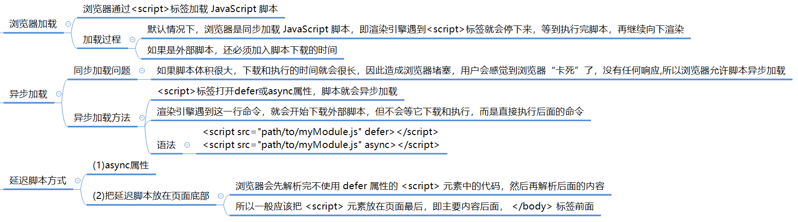


## JS 延迟加载方式

 js延迟加载，也就是等页面加载完成之后再加载JavaScript文件。js延迟加载有助于提高页面加载速度

一般有以下几种方式：

* defer属性
* async属性
* 动态创建DOM方式：对文档的加载事件进行监听，当文档加载完成后再动态的创建script标签来引入js脚本
* 使用setTimeout延迟方法
* 让JS最后加载


## 内存分类


## 数据类型

* 基本类型：Number、Boolean、String、null、undefined、symbol（ES6 新增的）， BigInt（ES2020） 
* 引用类型：Object
* 基本包装类型（Array，Function）


**基本数据类型：**


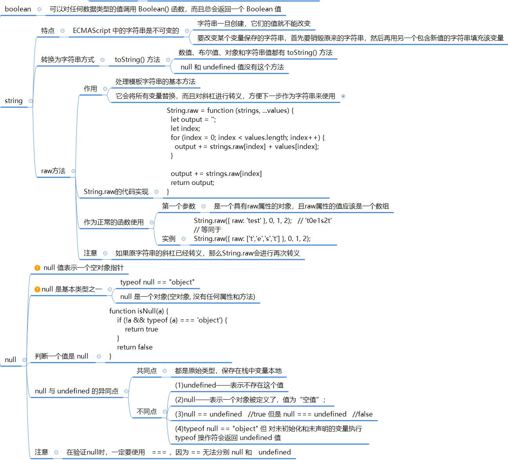


**引用类型：**


**包装类型:**


### undefined & null

> **undefined与undeclared区别?**

* 已在作用域中声明但还没有赋值的变量，是undefined的。
* 还没有在作用域中声明过的变量，是undeclared的。
* 对于undeclared变量的引用，浏览器会报引用错误，如ReferenceError:bisnotdefined。但是我们可以使用typeof的安全防范机制来避免报错，因为对于undeclared（或者notdefined）变量，typeof会返回"undefined"。

> **null和undefined区别?**

* Undefined和Null都是基本数据类型，这两个基本数据类型分别都只有一个值，就是undefined和null。
* undefined代表的含义是未定义，null代表的含义是空对象。
* 一般变量声明了但还没有定义的时候会返回undefined，null主要用于赋值给一些可能会返回对象的变量，作为初始化。
* undefined在js中不是一个保留字，这意味着我们可以使用undefined来作为一个变量名，这样的做法是非常危险的，它会影响我们对undefined值的判断。但是我们可以通过一些方法获得安全的undefined值，比如说void0。
* 当我们对两种类型使用typeof进行判断的时候，Null类型化会返回“object”，这是一个历史遗留的问题。
* 当我们使用双等号对两种类型的值进行比较时会返回true，使用三个等号时会返回false

> **如何获取安全的undefined值?**

* 用 void 0 来获得 undefined
* 因为undefined是一个标识符，所以可以被当作变量来使用和赋值，但是这样会影响undefined的正常判断。表达式void___没有返回值，因此返回结果是undefined。void并不改变表达式的结果，只是让表达式不返回值。

### NaN 

> **NaN 是什么，用 typeof 会输出什么？**

* Not a Number，表示非数字，NaN意指“不是一个数字”（notanumber），NaN是一个“警戒值”（sentinelvalue，有特殊用途的常规值），用于指出数字类型中的错误情况，即“执行数学运算没有成功，这是失败后返回的结果”。

* typeof NaN === 'number'
* NaN是一个特殊值，它和自身不相等，是唯一一个非自反（自反，reflexive，即x===x不成立）的值。而NaN!=NaN为true。

> **isNaN() 和 Number.isNaN() 函数的区别?**

* 函数 isNaN() 接收参数后，会尝试将这个参数转换为数值，任何不能被转换为数值的的值都会返回true，因此非数字值传入也会返回true，会影响NaN的判断
* 函数 Number.isNaN() 会首先判断传入参数是否为数字，如果是数字再继续判断是否为NaN，这种方法对于NaN的判断更为准确
* 总结： isNaN() 判断不准确，非数字返回 true；Number.isNaN() 判断更为准确


## 精度丢失

* 解释一：


* 解释二：

  JavaScirpt 使用 Number 类型来表示数字（整数或浮点数），遵循 IEEE 754 标准，通过 64 位来表示一 个数字（1 + 11 + 52）

  *  1 符号位，0 表示正数，1 表示负数 s 
  * 11 指数位（e） 
  * 52 尾数，小数部分（即有效数字） 

  最大安全数字：Number.MAX_SAFE_INTEGER = Math.pow(2, 53) - 1，转换成整数就是 16 位，所以 0.1 === 0.1，是因为通过 toPrecision(16) 去有效位之后，两者是相等的。 

  在两数相加时，会先转换成二进制，0.1 和 0.2 转换成二进制的时候尾数会发生无限循环，然后进行对阶 运算，JS 引擎对二进制进行截断，所以造成精度丢失。

  总结：**精度丢失可能出现在进制转换和对阶运算中**

## 整数相关问题

> **JS整数是怎么表示的？**

​	通过 Number 类型来表示，遵循 IEEE754 标准，通过 64 位来表示一个数字，（1 + 11 + 52），最大安 全数字是 Math.pow(2, 53) - 1，对于 16 位十进制。（符号位 + 指数位 + 小数部分有效位）

> **Number() 的存储空间是多大？如果后台发送了一个超过最大自己的数字怎么办**

​	Math.pow(2, 53) ，53 为有效数字，会发生截断，等于 JS 能支持的最大数字

## 进制转换

在JavaScript中，没有直接针对所有进制转换的内置函数（除了十进制到二进制、八进制、十六进制的`toString()`方法），但我们可以使用`parseInt()`函数和`toString()`方法进行常见的进制转换：

* 十进制数字转（二进制、八进制、十六进制）字符串：**`parseInt()`函数**
* （二进制、八进制、十六进制）字符串转十进制数字： **`toString()`**

| 转换类型         | 方法                        | 示例                                                         |
| ---------------- | --------------------------- | ------------------------------------------------------------ |
| 十进制转二进制   | `toString(2)`               | `let decimal = 255; let binary = decimal.toString(2); // "11111111"` |
| 十进制转八进制   | `toString(8)`               | `let decimal = 255; let octal = decimal.toString(8); // "377"` |
| 十进制转十六进制 | `toString(16)`              | `let decimal = 255; let hex = decimal.toString(16); // "ff"` |
| 二进制转十进制   | `parseInt(binaryString, 2)` | `let binary = "11111111"; let decimal = parseInt(binary, 2); // 255` |
| 八进制转十进制   | `parseInt(octalString, 8)`  | `let octal = "377"; let decimal = parseInt(octal, 8); // 255` |
| 十六进制转十进制 | `parseInt(hexString, 16)`   | `let hex = "ff"; let decimal = parseInt(hex, 16); // 255`    |

## 显示转换&隐式转换

**显示转换**

显示转换一般指使用Number、String和Boolean三个构造函数，手动将各种类型的值，转换成数字、字符串或者布尔值

**隐式转换**：

运算符两边数据类型不一致，编译器自动转换数据类型

* 转成string类型：+号两边如果有一边是字符串，则会把另一边转换成字符串，然后进行拼接
* 转成number类型：
  * 以下几种运算符会将任何数据转换成number类型再运算，如果无法转换则为NaN
    * 数学正号 ： +num
    * 当 +/-号写在一个变量名的前面，此时表示数学的正/负数
    * 自增自减（++ --）
    * 算术运算符（+ - * / %）
    * 比较运算符(> < >= <= == != === !==)
      说明：全等与不全等会先比较值（此时会隐式转换再比较），然后再比较数据类型
* 转成boolean类型：逻辑非（！）会将任何数据转为boolean类型再运算


## `Math`对象

在JavaScript中，`Math`对象提供了许多用于数学运算的方法和常量。

|            方法            | 说明                                            | 示例                                                         |
| :------------------------: | :---------------------------------------------- | :----------------------------------------------------------- |
|       `Math.abs(x)`        | 返回x的绝对值                                   | `Math.abs(-10); // 返回 10`                                  |
|       `Math.acos(x)`       | 返回x的反余弦值（弧度值）                       | `Math.acos(0.5); // 返回约 1.0471975511965979`               |
|       `Math.asin(x)`       | 返回x的反正弦值（弧度值）                       | `Math.asin(0.5); // 返回约 0.5235987755982989`               |
|       `Math.atan(x)`       | 返回x的反正切值（弧度值）                       | `Math.atan(1); // 返回约 0.7853981633974483`                 |
|     `Math.atan2(y, x)`     | 返回y/x的反正切值（弧度值），但会考虑x和y的符号 | `Math.atan2(1, 1); // 返回约 0.7853981633974483`             |
|       `Math.ceil(x)`       | 返回大于或等于x的最小整数（向上取整）           | `Math.ceil(5.4); // 返回 6`                                  |
|       `Math.cos(x)`        | 返回x的余弦值（x以弧度为单位）                  | `Math.cos(Math.PI / 2); // 返回约 -6.123233995736766e-17（接近0）` |
|       `Math.exp(x)`        | 返回e的x次幂（e为自然对数的底数）               | `Math.exp(1); // 返回约 2.718281828459045`                   |
|      `Math.floor(x)`       | 返回小于或等于x的最大整数（向下取整）           | `Math.floor(5.7); // 返回 5`                                 |
|       `Math.log(x)`        | 返回x的自然对数（底数为e）                      | `Math.log(Math.E); // 返回约 1`                              |
|   `Math.max(...values)`    | 返回一组数值中的最大值                          | `Math.max(1, 2, 3); // 返回 3`                               |
|   `Math.min(...values)`    | 返回一组数值中的最小值                          | `Math.min(1, 2, 3); // 返回 1`                               |
| `Math.pow(base, exponent)` | 返回base的exponent次幂                          | `Math.pow(2, 3); // 返回 8`                                  |
|      `Math.random()`       | 返回0（包括）到1（不包括）之间的伪随机数        | `Math.random(); // 返回一个0到1之间的随机数`                 |
|      `Math.round(x)`       | 对x进行四舍五入取整                             | `Math.round(5.4); // 返回 5`                                 |
|       `Math.sin(x)`        | 返回x的正弦值（x以弧度为单位）                  | `Math.sin(Math.PI / 2); // 返回约 1`                         |
|       `Math.sqrt(x)`       | 返回x的平方根                                   | `Math.sqrt(4); // 返回 2`                                    |
|       `Math.tan(x)`        | 返回x的正切值（x以弧度为单位）                  | `Math.tan(Math.PI / 4); // 返回约 1`                         |
|         `Math.PI`          | 表示圆周率的值，约等于3.14159                   | `Math.PI; // 返回圆周率的值`                                 |

请注意，上述示例中的返回值可能会根据具体环境和浮点数的精度而有所不同。此外，`Math`对象还提供了其他一些不常用的方法和常量，但上述列表涵盖了最常用的部分。

## 运算符规则

**加号规则**


**减号规则**


**等号规则**


**布尔操作符**


## 位运算符

* 位运算符工作于32位的数字上。任何数字操作都将转换为32位。结果会转换为 JavaScript 数字。

* | 运算符 | 描述 | 例子       | 类似于       | 结果 | 十进制 |
  | :----- | :--- | :--------- | :----------- | :--- | :----- |
  | &      | AND  | x = 5 & 1  | 0101 & 0001  | 0001 | 1      |
  | \|     | OR   | x = 5 \| 1 | 0101 \| 0001 | 0101 | 5      |
  | ~      | 取反 | x = ~ 5    | ~0101        | 1010 | -6     |
  | ^      | 异或 | x = 5 ^ 1  | 0101 ^ 0001  | 0100 | 4      |
  | <<     | 左移 | x = 5 << 1 | 0101 << 1    | 1010 | 10     |
  | >>     | 右移 | x = 5 >> 1 | 0101 >> 1    | 0010 | 2      |

  (引用[菜鸟教程-JavaScript 位运算符](https://www.runoob.com/jsref/jsref-operators.html))

### 异或运算

#### 运算规则

* 异或（eor）是一个数学运算符。它应用于逻辑运算。异或的数学符号为“⊕”，计算机符号为“eor”。其运算法则为：
  * **相同为0，不同为1**：
    * 二进制中： `1 ^ 1 = 0`，`0 ^ 0 = 0`，`1 ^ 0 = 1`，`0 ^ 1 = 1`;
  * **任何数与 0 异或，等于这个数**： `a ^ 0 = a`；
  * **任何数跟自己异或，等于 0**: `a ^ a = 0`;
  * **满足交换律**： `a ^ b = b ^ a`；
  * **满足结合律**： `(a ^ b) ^ c = a ^ (b ^ c)`；

#### 使用场景

* **异或运算交换两个数**：

  * ```js
    let a = 5;
    let b = 10;
    // 使用异或运算交换值
    a = a ^ b;
    b = a ^ b;
    a = a ^ b;
    
    console.log('a=>', a,'b=>', b)
    ```

  * 原理： 

    > * 第一步： `a = a ^ b = 5 ^ 10  ` ;
    > * 第二步：  `b = a ^ b = 5 ^ 10 ^ 10 = 5` (相同为0，不同为1);
    > * 第三步：  `a = a ^ b = 5 ^ 10 ^ 5 = 10` (相同为0，不同为1);

* **简单加密**：

  * > 假设明文`text`，秘钥`key`，进行异或运算得到密文 `cipher`；
    >
    > * 加密：`const cipher = text ^ key` ；
    > * 解密：`const text = cipher ^ key`；

  * 原理：

    > * 加密：`const cipher = text ^ key`
    > * 解密：`const text = (text ^ key) ^ key`

#### 算法题

* 题目：

  > 一个数组中有一种数出现了奇数次，其他数都出现了偶数次，怎么找到这一个数？
  >
  > 要求： 时间复杂度 O(n)，空间复杂度 O(1)

* 思路：

  > * 要求空间复杂度为 O(1)，则不能开辟新的空间；
  >
  > * 根据异或运算规则：
  >   * 任何数字和 自己异或等于 0;
  >   * 任何数字和 0 异或等于这个数；
  > * 将所有数字进行异或操作，则偶数个数字异或结果为0，奇数个数字异或结果为1；

* 代码：

  ```js
  const arr = [2,3,4,5,6,5,5,6,4,3,2];
  let number = arr[0];
  for (var i = 1; i < arr.length; i ++) {
      number = number ^ arr[i]
  }
  console.log('number=>', number);//输出为出现奇数次的数字
  ```

  

## [尾后逗号](https://developer.mozilla.org/zh-CN/docs/Web/JavaScript/Reference/Trailing_commas)

**尾后逗号** （有时叫做“终止逗号”）在向 JavaScript 代码添加元素、参数、属性时十分有用。如果你想要添加新的属性，并且上一行已经使用了尾后逗号，你可以仅仅添加新的一行，而不需要修改上一行。这使得版本控制的代码比较（diff）更加清晰，代码编辑过程中遇到的麻烦更少。

JavaScript 一开始就支持数组字面量中的尾后逗号，随后向对象字面量（ECMAScript 5）中添加了尾后逗号。最近（ECMAScript 2017），又将其添加到函数参数中

但是，[JSON](https://developer.mozilla.org/zh-CN/docs/Glossary/JSON) 不允许尾后逗号。


> [,,,] 的长度是多少？

```javascript
let a = [,,,];
a.length // 3
```


## Symbol

**Symbol 是什么？**

* `Symbol`是ES6 引入的一种新的原始数据类型，表示独一无二的值。

* Symbol 值通过`Symbol`函数生成。

**Symbol 作用？**

* 保证对象每个属性的名字都是独一无二，防止命名冲突；
* 提供遍历接口，布置了 symbol.iterator 的对象才可以使用 for···of 循环，可以统一处理数据结构。调用之后回返回一个遍历器对象，包含有一个 next 方法，使用 next 方法后有两个返回值 value 和 done 分别表示函数当前执行位置的值和是否遍历完毕。
* [消除魔术字符串](https://es6.ruanyifeng.com/#docs/symbol#%E5%AE%9E%E4%BE%8B%EF%BC%9A%E6%B6%88%E9%99%A4%E9%AD%94%E6%9C%AF%E5%AD%97%E7%AC%A6%E4%B8%B2)

**Symbol注意点:**

* 1.Symbol函数前不能使用new命令，否则会报错。
* 2.Symbol函数可以接受一个字符串作为参数，表示对Symbol实例的描述，主要是为了在控制台显示，或者转为字符串时，比较容易区分。
* 3.Symbol作为属性名，该属性不会出现在for...in、for...of循环中，也不会被Object.keys()、Object.getOwnPropertyNames()、JSON.stringify()返回。
* 4.Object.getOwnPropertySymbols方法返回一个数组，成员是当前对象的所有用作属性名的Symbol值。
* 5.Symbol.for接受一个字符串作为参数，然后搜索有没有以该参数作为名称的Symbol值。如果有，就返回这个Symbol值，否则就新建并返回一个以该字符串为名称的Symbol值。
* 6.Symbol.keyFor方法返回一个已登记的Symbol类型值的key


**参考：**

[ECMAScript 6 入门-Symbol](https://es6.ruanyifeng.com/#docs/symbol)


## **类型判断**

### typeof 操作符


**内部属性[[Class]]:**

​	所有typeof返回值为"object"的对象（如数组）都包含一个内部属性[[Class]]（我们可以把它看作一个内部的分类，而非传统的面向对象意义上的类）。这个属性无法直接访问，一般通过Object.prototype.toString(..)来查看

```javascript
Object.prototype.toString.call([1,2,3]);  //"[objectArray]"
Object.prototype.toString.call(/regex-literal/i);  //"[objectRegExp]"
```


### instanceof 操作符


### 数据类型判断方法

判断数据类型方法

* typeof 操作符

* Object.prototype.toString.call()

  


## **数组**

### 数组创建和检测


### 数组方法


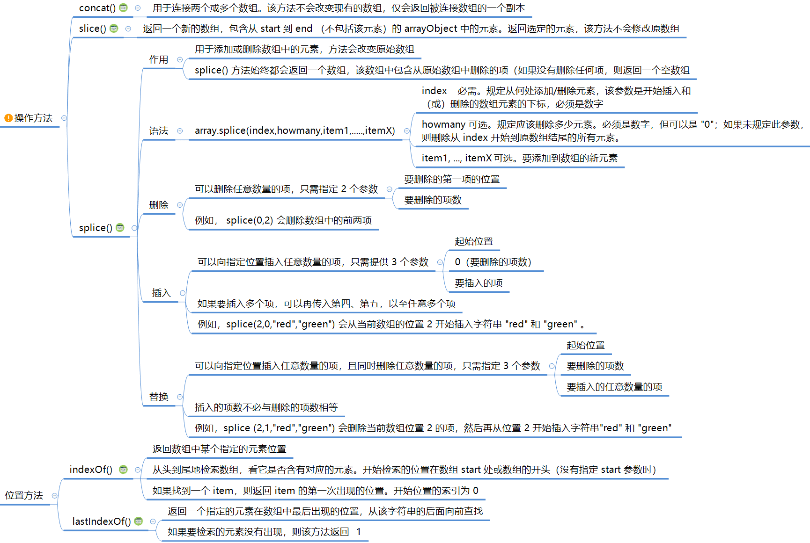


### **会改变原数组方法**

|       方法        | 是否修改原始数组 |                        描述与基本操作                        |
| :---------------: | :--------------: | :----------------------------------------------------------: |
|    **push()**     |      **是**      |       向数组的末尾添加一个或更多元素，并返回新的长度。       |
|     **pop()**     |      **是**      |                删除并返回数组的最后一个元素。                |
|    **shift()**    |      **是**      |                 删除并返回数组的第一个元素。                 |
|   **unshift()**   |      **是**      |       向数组的开头添加一个或更多元素，并返回新的长度。       |
|   **splice()**    |      **是**      | 通过删除或替换现有元素或者添加新元素来修改数组，并以数组形式返回被修改的内容。 |
|    **sort()**     |      **是**      | 对数组的元素进行排序，并返回数组。排序不一定是稳定的。默认排序顺序是根据字符串Unicode码点。 |
|   **reverse()**   |      **是**      | 颠倒数组中元素的顺序，并返回该数组。数组的第一个元素会变成最后一个，数组的最后一个元素变成第一个。 |
|    **fill()**     |      **是**      | 用一个固定值填充一个数组中从起始索引到终止索引内的全部元素。不包括终止索引。 |
| **copyWithin()**  |      **是**      | 在数组内部，将一段连续元素复制到另一个位置，并返回这个数组。不会改变数组的大小。 |
|   **concat()**    |      **否**      | 用于连接两个或多个数组。此方法不会更改现有数组，而是返回一个新数组。 |
|    **slice()**    |      **否**      | 可从已有的数组中返回选定的元素。此方法并不会修改原数组，而是返回一个新数组。 |
|    **join()**     |      **否**      | 把数组的所有元素放入一个字符串。元素通过指定的分隔符进行分隔。 |
|  **toString()**   |      **否**      |               把数组转换为字符串，并返回结果。               |
|   **indexOf()**   |      **否**      | 返回在数组中可以找到给定元素的第一个索引，如果不存在，则返回-1。 |
| **lastIndexOf()** |      **否**      | 返回指定元素在数组中的最后一个的索引，如果不存在则返回 -1。从数组的后面向前查找，从 fromIndex 处开始。 |
|  **includes()**   |      **否**      | 判断一个数组是否包含一个指定的值，根据情况，如果需要，搜索也可使用值来开始。 |
|    **find()**     |      **否**      | 返回数组中满足提供的测试函数的第一个元素的值。否则返回undefined。 |
|  **findIndex()**  |      **否**      | 返回数组中满足提供的测试函数的第一个元素的索引。否则返回-1。 |
|   **forEach()**   |      **否**      |             对数组的每个元素执行一次提供的函数。             |
|     **map()**     |      **否**      | 创建一个新数组，其结果是该数组中的每个元素都调用一个提供的函数后返回的结果。 |
|   **filter()**    |      **否**      |  创建一个新数组, 其包含通过所提供函数实现的测试的所有元素。  |
|   **reduce()**    |      **否**      | 对累加器和数组中的每个元素（从左到右）应用一个函数，将其减少为单个输出值。 |
|    **some()**     |      **否**      | 测试数组中是不是至少有1个元素通过由提供的函数实现的测试。它返回的是一个Boolean值。 |
|    **every()**    |      **否**      | 测试数组的所有元素是否都通过了由提供的函数实现的测试。它返回一个布尔值。 |
| **reduceRight()** |      **否**      | 接收一个函数作为累加器（accumulator），数组中的每个值（从左到右）开始缩减，最终为一个值。 |

请注意，尽管上述方法按照是否修改原始数组进行了分类，但某些方法（如`sort()`）可能会以不可预测的方式修改原始数组的元素顺序，即使它们不添加或删除元素。此外，`sort()`方法默认将数组元素转换为字符串，然后进行Unicode码点比较，这可能并不是您所期望的排序方式，特别是对于非字符串数组元素。在这种情况下，您可能需要提供一个自定义比较函数。

### 数组迭代


> **indexOf 和 findIndex 的区别?**

* [indexOf](https://developer.mozilla.org/zh-CN/docs/Web/JavaScript/Reference/Global_Objects/Array/findIndex) ：查找值作为第一个参数，采用 `===` 比较，更多的是用于查找基本类型，如果是对象类型，则是判断是否是同一个对象的引用
* [findIndex](https://developer.mozilla.org/zh-CN/docs/Web/JavaScript/Reference/Global_Objects/Array/findIndex) ：比较函数作为第一个参数，多用于非基本类型(例如对象)的数组索引查找，或查找条件很复杂


### [for...in 与 for...of 比较](https://es6.ruanyifeng.com/#docs/iterator#%E4%B8%8E%E5%85%B6%E4%BB%96%E9%81%8D%E5%8E%86%E8%AF%AD%E6%B3%95%E7%9A%84%E6%AF%94%E8%BE%83)

**[for...in 循环](https://developer.mozilla.org/zh-CN/docs/Web/JavaScript/Reference/Statements/for...in)**：

* `for...in`循环主要是为遍历对象而设计的，不适用于遍历数组；
* 缺点：
  * 数组的键名是数字，但是`for...in`循环是以字符串作为键名“0”、“1”、“2”等等。
  * `for...in`循环不仅遍历数字键名，还会遍历手动添加的其他键，甚至包括原型链上的键。
  * 某些情况下，`for...in`循环会以任意顺序遍历键名

**[for...of 循环](https://es6.ruanyifeng.com/#docs/iterator#for---of-%E5%BE%AA%E7%8E%AF)**：

* 一个数据结构只要部署了`Symbol.iterator`属性，就被视为具有 iterator 接口，就可以用`for...of`循环遍历它的成员；
* `for...of`循环内部调用的是数据结构的`Symbol.iterator`方法；
* `for...of`循环可以使用的范围包括数组、Set 和 Map 结构、某些类似数组的对象（比如`arguments`对象、DOM NodeList 对象）、 Generator 对象，字符串.
* 优点： 
  * 有着同`for...in`一样的简洁语法，但是没有`for...in`那些缺点。
  * 不同于`forEach`方法，它可以与`break`、`continue`和`return`配合使用。
  * 提供了遍历所有数据结构的统一操作接口


## 类数组

**类数组概念:**

* JavaScript中，数组是一个特殊的对象，其 property 名为正整数，且其l ength 属性会随着数组成员的增减而发生变化，同时又从 Array 构造函数中继承了一些用于进行数组操作的方法。
* 而对于一个普通的对象来说，如果它的所有 property 名均为正整数，同时也有相应的 *length* 属性，那么虽然该对象并不是由Array构造函数所创建的，它依然呈现出数组的行为，在这种情况下，这些对象被称为　“类数组对象”　。
* 总结： 拥有`length`属性的对象

**类数组包含:**

* DOM方法的返回结果： document.getElementsByTagName() 返回的就是一个类数组对象
* 函数 arguments 对象
* 函数也可以被看作是类数组对象，因为它含有length属性值，代表可接收的参数个数

**类数组转数组的方法：**

* 扩展运算符 ...
* Array.from(arrayLike)
* Array.prototype.slice.apply(arguments)
* Array.prototype.splice.call(arrayLike,0)
* Array.prototype.concat.apply([],arrayLike)


**参考资料：**

[JavaScript深入之类数组对象与arguments](https://github.com/mqyqingfeng/Blog/issues/14)


## 字符串

### 字符串的不可变性

* 在JavaScript中，字符串是不可变的（immutable），这意味着一旦**字符串被创建，就无法对其进行修改**。
* 当你对字符串执行某些操作时，实际上是创建了一个新的字符串，而原始字符串保持不变。
* 当你尝试修改字符串中的某个字符时，**例如使用索引访问并更改字符的值，或者使用类似 `str[index] = newValue` 的方式来修改，这些操作实际上是无效的，不会改变原始字符串**。**JavaScript中的字符串是只读的**。
* 这种不可变性的设计有一些重要的好处：
  1. 可靠性：由于字符串不可变，你可以确信一个字符串的值不会在其他地方被修改。这在多线程环境或并发操作中特别有用。
  2. 缓存优化：不可变性使得字符串在进行缓存时更有效。由于字符串不会改变，可以更容易地对字符串进行缓存，以便在需要时重用。
  3. 函数式编程：不可变性是函数式编程的重要概念之一。它鼓励使用纯函数，即函数的输出只由输入决定，不对外部状态进行修改。不可变性使得字符串在函数式编程中更易于处理。
* 尽管字符串是不可变的，但你可以通过创建新的字符串来进行字符串的拼接、替换、截取等操作。
* JavaScript提供了许多字符串处理方法来执行这些操作，例如 `concat()`、`slice()`、`replace()` 等等。
* 总结起来，**JavaScript中的字符串是不可变的，一旦创建就无法直接修改，但你可以通过创建新的字符串来实现对字符串的操作和变换**。


### **字符串方法**

| 方法名称 | 描述 | 示例 |
| --- | --- | --- |
| `charAt(index)` | 返回指定索引处的字符 | `let str = 'Hello'; console.log(str.charAt(1)); // 输出 'e'` |
| `charCodeAt(index)` | 返回指定索引处字符的Unicode编码 | `let str = 'Hello'; console.log(str.charCodeAt(0)); // 输出 72` |
| `fromCharCode(index)` | 返回由指定的 UTF-16 码元序列创建的字符串 | `String.fromCharCode(65, 66, 67); // 返回 "ABC"` |
| `concat(string1, ..., stringX)` | 连接两个或多个字符串，并返回新的字符串 | `let str1 = 'Hello, '; let str2 = 'World!'; console.log(str1.concat(str2)); // 输出 'Hello, World!'` |
| `indexOf(searchValue, [fromIndex])` | 返回指定值在字符串中首次出现的位置，如果未找到则返回-1 | `let str = 'Hello, World!'; console.log(str.indexOf('o')); // 输出 4` |
| `lastIndexOf(searchValue, [fromIndex])` | 返回指定值在字符串中最后一次出现的位置，如果未找到则返回-1 | `let str = 'Hello, World!'; console.log(str.lastIndexOf('o')); // 输出 7` |
| `slice(startIndex, [endIndex])` | 提取字符串的某个部分，并返回一个新的字符串（不包含结束索引的字符） | `let str = 'Hello, World!'; console.log(str.slice(0, 5)); // 输出 'Hello'` |
| **`substring(indexStart, [indexEnd])`** | 提取字符串中两个指定的索引号之间的字符，并返回一个新的字符串（不包含结束索引的字符） | `let str = 'Hello, World!'; console.log(str.substring(0, 5)); // 输出 'Hello'` |
| **`substr(start, [length])`** | 从字符串中提取从指定位置开始指定长度的字符 | `let str = 'Hello, World!'; console.log(str.substr(7, 5)); // 输出 'World'` |
| `toUpperCase()` | 将字符串转换为大写 | `let str = 'hello'; console.log(str.toUpperCase()); // 输出 'HELLO'` |
| `toLowerCase()` | 将字符串转换为小写 | `let str = 'HELLO'; console.log(str.toLowerCase()); // 输出 'hello'` |
| `trim()` | 去除字符串两端的空白字符 | `let str = '   Hello, World!   '; console.log(str.trim()); // 输出 'Hello, World!'` |
| `split(separator, [limit])` | 通过指定的分隔符将字符串分割为数组 | `let str = 'apple,banana,orange'; console.log(str.split(',')); // 输出 ['apple', 'banana', 'orange']` |
| `search(regexp)` | 检索与正则表达式相匹配的子字符串的**位置** | `let str = 'Hello, World!'; console.log(str.search('o')); // 输出 4` |
| `match(regexp)` | 找到一个或多个正则表达式的匹配项 | `let str = 'Hello, World!'; console.log(str.match(/o/g)); // 输出 ['o', 'o']` |
| `replace(regexp/substr, replacement)` | 替换与正则表达式或子字符串匹配的字符串 | `let str = 'Hello, World!'; console.log(str.replace('World', 'JavaScript')); // 输出 'Hello, JavaScript!'` |
| `startsWith(searchString, [position])` | 判断字符串是否以指定的子字符串开始 | `let str = 'Hello, World!'; console.log(str.startsWith('Hello')); // 输出 true` |
| `endsWith(searchString, [position])` | 判断字符串是否以指定的子字符串结束 | `let str = 'Hello, World!'; console.log(str.endsWith('World!')); // 输出 true` |
| `repeat(count)` | 返回一个新字符串，表示将原字符串重复指定的次数 | `let str = 'Hello'; console.log(str.repeat(3)); // 输出 'HelloHelloHello'` |
| `includes(searchString, [position])` | 判断字符串是否包含指定的子字符串 | `let str = 'Hello, World!'; console.log(str.includes('World')); // 输出 true` |


### **字符串比较**

在JavaScript中，字符串比较可以使用多种方法，但最常见的是使用关系运算符（`==`, `===`, `>`, `<`, `>=`, `<=`）以及`String`对象的`localeCompare()`方法。

**使用关系运算符**：

- `==`（等于）：比较两个值是否相等，但在比较之前会进行类型转换。
- `===`（严格等于）：比较两个值是否相等，且不会进行类型转换。

```javascript
let str1 = "hello";  
let str2 = "hello";  
let str3 = "Hello"; // 注意大小写  
  
console.log(str1 == str2); // true  
console.log(str1 === str2); // true  
console.log(str1 === str3); // false，因为大小写不同  
  
let numStr = "123";  
let num = 123;  
  
console.log(numStr == num); // true，因为"123"会被转换为数字123进行比较  
console.log(numStr === num); // false，因为类型不同
```

`>`, `<`, `>=`, `<=`：

这些运算符用于比较字符串在字典序（基于Unicode码点）上的大小。

```javascript
let strA = "apple";  
let strB = "banana";  
console.log(strA < strB); // true，因为"a"在字典序上小于"b"
```

`>`, `<`, `>=`, `<=` **比较原理**：

当使用 `>`, `<`, `>=`, `<=` 运算符来比较字符串时，这些运算符实际上是基于字符串的 Unicode 码点值（也称为字符编码）来进行比较的。这意味着它们**会比较字符串中每个字符的 Unicode 码点值，直到找到不同的字符或者比较完整个字符串**。

**比较过程：**

1. **Unicode 码点**：每个字符在 Unicode 中都有一个唯一的码点值。例如，'A' 的 Unicode 码点是 65，'a' 的 Unicode 码点是 97。
2. **逐字符比较**：当使用 `>`, `<`, `>=`, `<=` 运算符比较两个字符串时，JavaScript 会从字符串的第一个字符开始，逐个比较每个字符的 Unicode 码点值。
3. **比较结果**：
   - 如果第一个不同的字符的 Unicode 码点值在第一个字符串中小于第二个字符串中相应字符的 Unicode 码点值，那么第一个字符串就被认为是“较小”的（即 `str1 < str2`）。
   - 如果第一个不同的字符的 Unicode 码点值在第一个字符串中大于第二个字符串中相应字符的 Unicode 码点值，那么第一个字符串就被认为是“较大”的（即 `str1 > str2`）。
   - 如果两个字符串的所有字符都相同（即没有不同的字符），那么这两个字符串就被认为是相等的（即 `str1 == str2` 或 `str1 === str2`，注意 `===` 还比较类型）。
4. **长度差异**：如果第一个字符串的所有字符都与第二个字符串的相应字符相同，但第一个字符串更短，那么较短的字符串就被认为是“较小”的（因为 Unicode 码点值比较在较短的字符串结束后就停止了）。
5. **大小写敏感**：JavaScript 中的字符串比较是大小写敏感的，因为大写字母和小写字母有不同的 Unicode 码点值。例如，`'A' < 'a'` 的结果是 `true`，因为 'A' 的 Unicode 码点值（65）小于 'a' 的 Unicode 码点值（97）。
6. **非字母数字字符**：非字母数字字符（如空格、标点符号、特殊字符等）也有自己的 Unicode 码点值，并且这些值也会被用于比较。
7. **性能考虑**：由于字符串比较可能需要遍历整个字符串（直到找到不同的字符或到达字符串末尾），因此对于非常长的字符串，这种比较可能会相对较慢。在性能关键的场景中，可能需要考虑使用其他方法来优化字符串比较。


**使用`localeCompare()`方法比较**：

> MDN 文档：[String.prototype.localeCompare() - JavaScript | MDN (mozilla.org)](https://developer.mozilla.org/zh-CN/docs/Web/JavaScript/Reference/Global_Objects/String/localeCompare)

这个方法用于比较两个字符串，并根据本地特定的排序规则**返回一个小于、等于或大于零的值**。

如果引用字符串（`referenceStr`）存在于比较字符串（`compareString`）之前则为**负数**；如果引用字符串存在于比较字符串之后则为**正数**；相等的时候返回 `0`。

```javascript
let strA = "apple";  
let strB = "banana";  
  
console.log(strA.localeCompare(strB)); // 一个负数，因为"apple"在字典序上小于"banana"  
  
let strC = "Apple"; // 注意大小写  
console.log(strA.localeCompare(strC, undefined, { sensitivity: 'base' })); // 0，因为忽略了大小写

'a'.localeCompare('a') // 0
'a'.localeCompare('A') // -1
'a'.localeCompare('b') // -1
```

在这个例子中，我们使用了`localeCompare()`的第三个参数来指定一个选项对象，其中`sensitivity`属性设置为`'base'`以忽略大小写。如果不提供这个选项，默认会考虑大小写。


###  字符串字母排序

在JavaScript中，对字符串中的字母进行排序通常意味着你需要将字符串转换为字符数组，对数组进行排序，然后再将数组转回字符串。

但是，因为JavaScript的`sort()`方法默认会将数组元素转换为字符串，并使用Unicode值进行排序（这可能会导致大写字母排在小写字母之前），所以你可能需要提供一个自定义的比较函数来确保正确的字母顺序。

以下是一个示例，展示了如何对字符串中的字母进行排序（包括大小写，并且大写字母在小写字母之前）：

```javascript
function sortString(str) {  
    // 将字符串转换为字符数组  
    let arr = str.split('');  
  
    // 使用自定义比较函数进行排序  
    // 比较函数确保大写字母在小写字母之前  
    arr.sort((a, b) => {  
        // 首先比较字符的Unicode值  
        if (a.localeCompare(b) !== 0) {  
            return a.localeCompare(b);  
        }  
        // 如果Unicode值相同（例如'a'和'A'），则根据字符是否为大写字母进行排序  
        return a.toLowerCase() === a ? 1 : -1;  
    });  
  
    // 将字符数组转回字符串  
    return arr.join('');  
}  
  
// 示例  
let str = "Hello World!";  
console.log(sortString(str)); // 输出: "!HWdellloor"
```

但是，如果你想要忽略大小写并按字母顺序排序（即小写字母在大写字母之前），你可以稍微修改比较函数：

```javascript
function sortStringIgnoreCase(str) {  
    // 将字符串转换为字符数组  
    let arr = str.split('');  
  
    // 使用自定义比较函数进行排序  
    // 比较函数确保小写字母在大写字母之前  
    arr.sort((a, b) => {  
        // 转换为小写进行比较  
        let lowerA = a.toLowerCase();  
        let lowerB = b.toLowerCase();  
        if (lowerA !== lowerB) {  
            return lowerA.localeCompare(lowerB);  
        }  
        // 如果两个字符的小写形式相同，则按原始字符的Unicode值排序  
        // 这会确保大写字母在小写字母之后  
        return a.localeCompare(b);  
    });  
    // 或者直接使用以下排序方法
    arr.sort((a, b) => {
        if (a < b) {
            return -1
        } else if (a > b) {
            return 1
        } else {
            return 0
        }
    })
  
    // 将字符数组转回字符串  
    return arr.join('');  
}  
  
// 示例  
let str = "Hello World!";  
console.log(sortStringIgnoreCase(str)); // 输出: "!HWdellloor" （注意：这里的输出与上一个示例相同，但排序逻辑不同）
```

请注意，尽管第二个示例中的排序逻辑与第一个示例不同，但由于字符串"Hello World!"中不包含重复的字母（无论大小写），所以两个示例的输出是相同的。如果你有一个包含重复字母（无论大小写）的字符串，那么两个示例的输出将会有所不同。


### 字符串转数字

在JavaScript中，你可以使用几种不同的方法将一个字符串转换为数字，并判断转换是否成功。以下是一些常用的方法：

1. **使用 `parseInt()` 或 `parseFloat()` 函数**

这两个函数尝试将字符串解析为整数或浮点数。如果字符串不能表示为一个数字，它们会返回 `NaN`（表示“不是一个数字”）。

```javascript
let str = "123";  
let num = parseInt(str);  
  
if (!isNaN(num)) {  
    console.log("转换成功，数字是:", num);  
} else {  
    console.log("转换失败，不是有效的数字");  
}
```

注意：

* `parseInt()` 会忽略字符串开头的非数字字符，直到找到第一个数字字符或字符串结束。例如，`parseInt("123abc")` 会返回 `123`。
* 不能只有 typeof 操作符号判断 使用 parseInt 转换的是否为合法数字，因为 ` typeof parseInt()  ` 总是返回 number。

2. **使用 `Number()` 构造函数或一元加号运算符**

这两个方法都会尝试将字符串转换为数字。如果字符串不能表示为一个数字，它们会返回 `NaN`。

```javascript
let str = "123";  
let num = Number(str);  
// 或者  
let num2 = +str; // 一元加号运算符也会尝试将字符串转换为数字  
  
if (!isNaN(num)) {  
    console.log("转换成功，数字是:", num);  
} else {  
    console.log("转换失败，不是有效的数字");  
}
```

3. **使用 `isFinite()` 函数**

虽然 `isFinite()` 函数的主要用途是检查一个值是否是一个有限数字，但它也可以与 `parseFloat()` 或 `Number()` 一起使用来检查字符串是否可以转换为有效的数字。

```javascript
let str = "123";  
let num = parseFloat(str);  
  
if (isFinite(num)) {  
    console.log("转换成功，数字是:", num);  
} else {  
    console.log("转换失败，不是有效的数字");  
}
```

注意：`isFinite()` 会将非数字值（如 `undefined` 或空字符串）视为无效的数字，并返回 `false`。因此，在使用 `isFinite()` 之前，你可能需要确保你的值是一个字符串。


## **Object 对象**

### 对象访问


### 对象方法


**相关问题**

>  `Object.keys()` 、`Object.values()`是按什么顺序返回值?

* .Chrome Opera 的 JavaScript 解析引擎遵循的是新版 ECMA-262 第五版规范。因此，使用 for-in 语句遍历对象属性时遍历书序并非属性构建顺序。
* 而 IE6 IE7 IE8 Firefox Safari 的 JavaScript解析引擎遵循的是较老的 ECMA-262 第三版规范，属性遍历顺序由属性构建的顺序决定。
* Chrome Opera 中使用 for-in 语句遍历对象属性时会遵循一个规律：
  * 它们会先提取所有 key 的 parseFloat 值为非负整数的属性，然后根据数字顺序对属性排序首先遍历出来，然后按照对象定义的顺序遍历余下的所有属性。
  * 其它浏览器则完全按照对象定义的顺序遍历属性。
* 大多数浏览器将对象属性迭代为：
  1. 按升序排列的整数键（以及像“1”这样解析为整数的字符串）
  2. 字符串键，按插入顺序（ES2015 保证这一点，所有浏览器都遵守）
  3. 符号名称，按插入顺序（ES2015 保证这一点，所有浏览器都遵守）
  4. 一些较旧的浏览器结合了类别 #1 和 #2，按插入顺序迭代所有键。如果您的键可能会解析为整数，最好不要依赖任何特定的迭代顺序。

### 对象属性

* 对象属性包括
  * 数据属性
  * 访问器属性


### 对象属性方法


### 防篡改对象


### 假值对象

* 浏览器在某些特定情况下，在常规JavaScript语法基础上自己创建了一些外来值，这些就是“假值对象”。
* 假值对象看起来和普通对象并无二致（都有属性，等等），但将它们强制类型转换为布尔值时结果为false最常见的例子是document.all，它是一个类数组对象，包含了页面上的所有元素，由DOM（而不是JavaScript引擎）提供给JavaScript程序使用

### 内置对象

全局的对象（globalobjects）或称标准内置对象，不要和"全局对象（globalobject）"混淆。

这里说的全局的对象是说在全局作用域里的对象。

全局作用域中的其他对象可以由用户的脚本创建或由宿主程序提供。

标准内置对象的分类：

* （1）值属性。这些全局属性返回一个简单值，这些值没有自己的属性和方法。例如Infinity、NaN、undefined、null字面量
* （2）函数属性。全局函数可以直接调用，不需要在调用时指定所属对象，执行结束后会将结果直接返回给调用者。例如eval()、parseFloat()、parseInt()等
* （3）基本对象。基本对象是定义或使用其他对象的基础。基本对象包括一般对象、函数对象和错误对象。例如Object、Function、Boolean、Symbol、Error等
* （4）数字和日期对象。用来表示数字、日期和执行数学计算的对象。例如Number、Math、Date
* （5）字符串。用来表示和操作字符串的对象。例如String、RegExp
* （6）可索引的集合对象。这些对象表示按照索引值来排序的数据集合，包括数组和类型数组，以及类数组结构的对象。例如Array
* （7）使用键的集合对象。这些集合对象在存储数据时会使用到键，支持按照插入顺序来迭代元素。例如Map、Set、WeakMap、WeakSet
* （8）矢量集合。SIMD矢量集合中的数据会被组织为一个数据序列。例如SIMD等
* （9）结构化数据。这些对象用来表示和操作结构化的缓冲区数据，或使用JSON编码的数据。例如JSON等
* （10）控制抽象对象。例如Promise、Generator等
* （11）反射。例如Reflect、Proxy
* （12）国际化，为了支持多语言处理而加入ECMAScript的对象。例如Intl、Intl.Collator等
* （13）WebAssembly（
* 14）其他例如arguments

**总结**：

* 内置对象主要指的是在程序执行前存在全局作用域里的由js定义的一些全局值属性、函数和用来实例化其他对象的构造函数对象。
* 一般我们经常用到的如全局变量值NaN、undefined，全局函数如parseInt()、parseFloat()用来实例化对象的构造函数如Date、Object等，还有提供数学计算的单体内置对象如Math对象。

详细资料可以参考：[《标准内置对象的分类》](https://developer.mozilla.org/zh-CN/docs/Web/JavaScript/Reference/Global_Objects)[《JS所有内置对象属性和方法汇总》](https://segmentfault.com/a/1190000011467723)


### new操作符

>  new操作符具体干了什么?

- 创建一个空对象
- 继承了该函数的原型
- 属性和方法被加入到 this 引用的对象中
- 新创建的对象由 this 所引用，并且最后隐式的返回 this

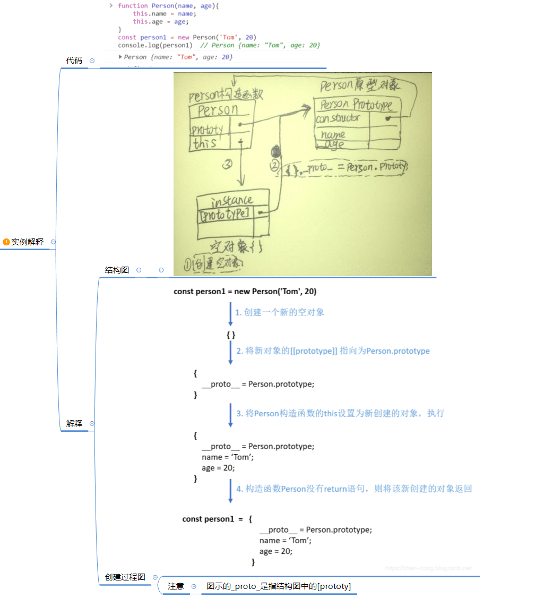


```javascript
/**

 \* @param {Function} construct 构造函数

 \* @param {any} args  其余参数

 \* @return obj 绑定了构造函数上下文的空对象

 */

function myNew(construct, ...args) {

  let obj = {} //创建空对象

  obj.__proto__ = construct.prototype //将空对象的[prototype]原型指向构造函数的原型对象

  construct.apply(obj, args) //将构造函数的执行上下文this绑定到空对象

  return obj

}

//-----------------------------------------使用-------------------------------------------------------

function Person(name, age) {

  this.name = name

  this.age = age

}

let person1 = myNew(Person, 'joker', 20)

console.log(`name is ${person1.name}, age is ${person1.age}`)

```


## 深浅拷贝


**浅拷贝**：仅拷贝第一层

- `Object.assign`，
- 展开运算符 `...`

**深拷贝**：

 `JSON.parse(JSON.stringify(object))` **缺陷**：

- 使用`JSON.parse(JSON.stringify(object))`拷贝对象存在以下缺陷：

  - 函数、undefined 丢失；

  - 正则表达式、Error对象 只得到空对象；

  - NaN、Infinity、-Infinity 会变成null;

  - 会忽略 symbol;

  - 时间对象 `Date()`，拷贝后时间将是字符串的形式，而不是对象的形式;

    

  - JSON.stringify()只能拷贝对象的可枚举的自有属性。

    - 如果对象中的对象是有构造函数生成的， 则使用JSON.parse(JSON.stringify(obj))深拷贝后，会丢弃对象的constructor；

      

    

  

  

  


## **集合**

### Set 集合


### WeakSet


### Map 集合

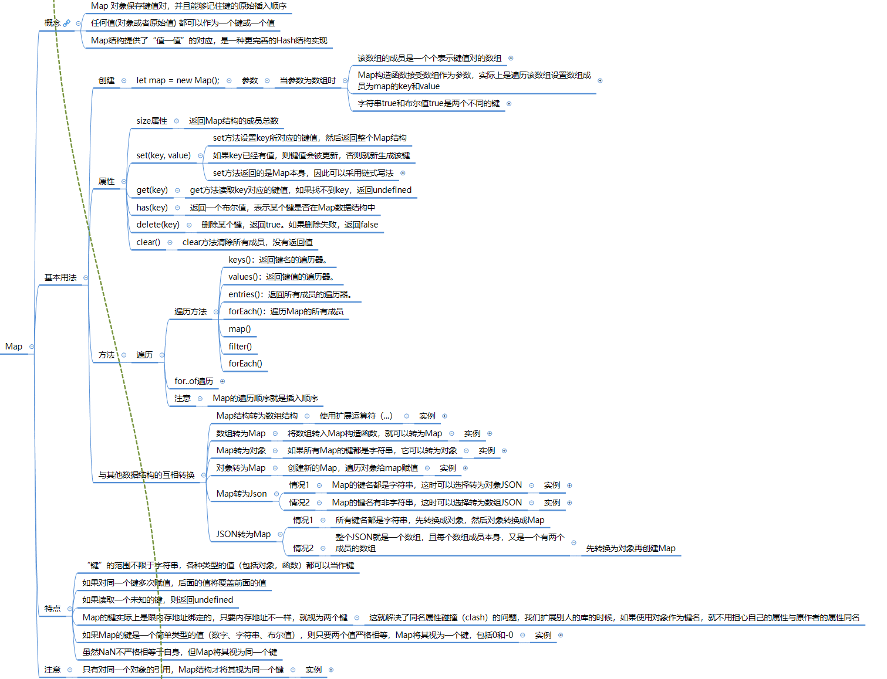


#### **遍历Map**

在 JavaScript 中，`Map` 数据结构提供了几种方法来遍历 Map 内容：

**使用 `for...of` 循环**：

`for...of` 循环可以直接在 Map 对象上迭代，每次迭代都会返回一个 `[key, value]` 数组。

```javascript
const map = new Map();  
map.set('key1', 'value1');  
map.set('key2', 'value2');  
  
for (let [key, value] of map) {  
  console.log(key, value);  
}
```

**使用 `Map.prototype.forEach()` 方法**：

`forEach()` 方法接受一个回调函数作为参数，该回调函数将在每个键值对上被调用，并且接收三个参数：键、值和 Map 对象本身。

```javascript
map.forEach((value, key, mapObj) => {  
  console.log(key, value);  
});
```

**使用 `Map.prototype.keys()`、`Map.prototype.values()` 和 `Map.prototype.entries()` 方法**：

这些方法分别返回一个新的迭代器对象，它包含 Map 对象中每个元素的键、值或 `[key, value]` 对。然后，你可以使用 `for...of` 循环来迭代这些迭代器。

```javascript
// 遍历键  
for (let key of map.keys()) {  
  console.log(key);  
}  
  
// 遍历值  
for (let value of map.values()) {  
  console.log(value);  
}  
  
// 遍历键值对（与直接使用 for...of 循环相同）  
for (let [key, value] of map.entries()) {  
  console.log(key, value);  
}
```

**使用 `Array.from()` 方法**：

虽然这不是直接遍历 Map 的方法，但你可以使用 `Array.from()` 方法将 Map 的键、值或键值对转换为数组，然后遍历这个数组。

```javascript
// 将键转换为数组并遍历  
Array.from(map.keys()).forEach(key => console.log(key));  
  
// 将值转换为数组并遍历  
Array.from(map.values()).forEach(value => console.log(value));  
  
// 将键值对转换为数组并遍历  
Array.from(map.entries()).forEach(([key, value]) => console.log(key, value));
```

**使用扩展运算符 (`...`)**：

你也可以使用扩展运算符来将 Map 的内容展开为数组的一部分，然后遍历这个数组。但请注意，这通常用于将 Map 的内容与其他数组或可迭代对象合并，而不是直接遍历 Map。

```javascript
// 示例：将 Map 的键值对与另一个数组合并，并遍历结果数组  
const entries = [...map.entries()];  
const otherArray = [['key3', 'value3']];  
for (let [key, value] of [...entries, ...otherArray]) {  
  console.log(key, value);  
}
```


### Set、Map、Object 比较


> **为什么要引入：[WeakSet](http://es6.ruanyifeng.com/#docs/set-map#WeakSet) 和 [WeakMap](http://es6.ruanyifeng.com/#docs/set-map#WeakMap)？**

* js 引擎会对未使用的引用需要进行垃圾回收，需要及时清除未使用的引用。但有时候不容易记住所有未使用的引用，所以容易导致内存泄漏。
* 因此，引入一种方法，在新建引用的时候就声明，哪些引用必须手动清除，哪些引用可以忽略不计，当其他引用消失以后，垃圾回收机制就可以释放内存。这样就能大大减轻程序员的负担，你只要清除主要引用就可以了。
* ES6 考虑到了这一点，推出了两种新的数据结构：[WeakSet](http://es6.ruanyifeng.com/#docs/set-map#WeakSet) 和 [WeakMap](http://es6.ruanyifeng.com/#docs/set-map#WeakMap)。它们对于值的引用都是不计入垃圾回收机制的，所以名字里面才会有一个"Weak"，表示这是弱引用。
* 基本上，如果你要往对象上添加数据，又不想干扰垃圾回收机制，就可以使用 WeakMap。

## **变量**

### 变量声明方式


**嵌套作用域-屏蔽**

* 嵌套作用域的屏蔽是指当变量在一个嵌套的作用域中被声明时，它会屏蔽外部作用域中具有相同名称的变量。

  ```js
  function sumMatrix(matrix: number[][]) {
      let sum = 0;
      for (let i = 0; i < matrix.length; i++) {
          var currentRow = matrix[i];
          for (let i = 0; i < currentRow.length; i++) {
              sum += currentRow[i];
          }
      }
  
      return sum;
  }
  ```

  > 这个版本的循环能得到正确的结果，因为内层循环的`i`可以屏蔽掉外层循环的`i`。


**变量作用域理解**

* 题目1：输出结果

```js
for(var i=0; i<=5; i++) {
    setTimeout(()=>{
        console.log(i)
    },500)
}
//输出： 6,6,6,6,6,6
```

> 分析：
>
> * 考察点：`JavaScript中的事件循环机制`、`变量作用域`
>
> * 分析：该题目涉及 JS 时间循环机制 和 作用域 考察
>
>   * JS 循环机制：
>
>     * JS是单线程环境，也就是说代码的执行是从上到下，依次执行，这样的执行称为同步执行；
>     * 遇到异步任务，会将异步任务添加到异步事件队列；等待异步任务执行完成，会将异步任务结果放入回调队列；
>     * 等主线程所有任务执行完成，才执行回调队列中的事件。
>
>   * 在此代码中：
>
>     * for循环是同步代码，而setTimeout中的是异步代码，JS碰到这个有同步和异步的情况下会先从上到下执行同步代码，碰到异步的代码会将其插入到任务队列当中等待
>     * 在循环中，使用了`setTimeout`函数来创建了一个异步任务。每次循环迭代时，都会创建一个新的异步任务，并将其添加到事件队列中。这些异步任务将在指定的延迟时间后执行。
>     * 然而，`setTimeout`中的回调函数是在循环结束后才被调用的。此时，循环已经完成，并且变量`i`的值已经变为了6。
>     * 由于JavaScript中的变量没有块级作用域，而是函数级作用域，这意味着在循环中定义的变量`i`是一个全局变量。
>
>   * 作用域链：
>
>     * 作用域是变量等资源的作用范围
>     * 当同步代码执行完毕开始执行异步的setTimeout代码时，setTimeout中需要变量 i,而执行的时候在当前的作用域中开始找，找不到变量i的定义，这个时候就把创建这个函数的作用域作为当前作用域
>     * 再次寻找，创建这个函数的作用域就是全局作用域，也就是找到了for循环中i，找到了之后就结束寻找变量i的过程
>     * 由于这个时候的i是全局的，并且保存变量 6，因此所有定时任务都输出全局作用域的变量 i 的结果。 
>
>   * 解决方法：使用闭包来创建一个独立的作用域，并在每次循环迭代时将`i`的值传递给回调函数：
>
>     ```js
>     // ES5 写法
>     for(var i=0; i<=5; i++) {
>         (function(index) {
>             setTimeout(() => {
>                 console.log(index);
>             }, 500);
>         })(i);
>     }
>     // 输出：0 1 2 3 4 5
>     ```
>
>     ```js
>     //ES6 写法
>     for (let i = 0; i <= 5; i++) {
>     	setTimeout(() => {
>         	console.log(i);
>         }, 1000 );
>     }
>     //输出：1，2，3，4，5
>     ```
>
>     * 分析：
>       * 首先同步执行 for 循环，循环内部 包含一个闭包函数，通过参数形式传入 i，闭包中保存变量 i 副本；当遇到 setTimeout 时，打印闭包中的 i 副本，因此每次输出 i 都是递增值


### 变量提升和函数提升

* 提升：js代码执行前引擎会先进行预编译，预编译期间会将函数声明提升至其对应作用域的最顶端；

* 变量提升：变量的声明会被自动移到函数或者全局代码的最顶上；移动的仅仅是声明，变量的定义并不会随之提升；
* 函数提升：直接在函数声明之前调用该函数，并能成功执行它，而不会提升函数表达式；


**变量提升相关题目**

* 题目1：

  ```js
  var name = "world";
       (function () {
       	if (typeof name == 'undefined') {
       		var name = 'yang';
       		console.log('Hello ' + name)
       	} else {
       		console.log('Hello ' + name)
       	}
   })()
  ```

  * 输出结果：Hello yang

  * 代码相当于

    ```js
    var name = "world";
    (function () {
        var name;
        if (typeof name == 'undefined') {
            var name = 'yang';
            console.log('Hello ' + name)
        } else {
            console.log('Hello ' + name)
        }
    })()
    ```

    


## this 和 this 绑定

在 JavaScript 中，`this` 关键字是一个特殊的关键字，它在函数被调用时确定其值。`this` 的值是在函数执行时动态绑定的，而不是在函数定义时绑定的。

注意：在严格模式（`'use strict'`）下，全局执行上下文中的 `this` 是 `undefined`，而不是全局对象。

this 绑定方式：

|           绑定方式           |                             说明                             |                             特点                             |
| :--------------------------: | :----------------------------------------------------------: | :----------------------------------------------------------: |
| **默认绑定(全局执行上下文)** | 在全局作用域中，`this` 指向全局对象（在浏览器中是 `window`）。 | 当你在全局作用域中调用一个函数，且该函数内部没有显式地设置 `this` 的值时，`this` 会指向全局对象。 |
|    **隐式绑定(函数调用)**    |  当一个函数以函数调用的方式执行时，`this` 绑定到全局对象。   |          这就是在全局作用域中直接调用函数时的情况。          |
|         **对象方法**         |   当一个函数作为对象的方法被调用时，`this` 绑定到该对象。    |    当你在一个对象上调用它的方法时，`this` 会指向该对象。     |
|         **构造函数**         | 当一个函数以构造函数的方式调用时（使用 `new` 关键字），`this` 绑定到新创建的对象。 | 构造函数是一种特殊类型的函数，用于初始化一个新创建的对象。在构造函数内部，`this` 指向新创建的对象。 |
| **`call`、`apply`、`bind`**  | 你可以使用 `call`、`apply` 或 `bind` 方法来显式地设置 `this` 的值。 | 这些方法允许你控制函数执行时 `this` 的值。`call` 和 `apply` 会立即调用函数，而 `bind` 会返回一个新的函数，该函数在调用时具有指定的 `this` 值。 |
|         **箭头函数**         | 箭头函数不绑定自己的 `this`，而是从包含它的函数或全局作用域中继承 `this`。 | 箭头函数提供了一种简洁的方式来定义函数，同时保持 `this` 的上下文不变。这对于在回调函数和其他情况下保持 `this` 的正确引用非常有用。 |


* this 绑定判断

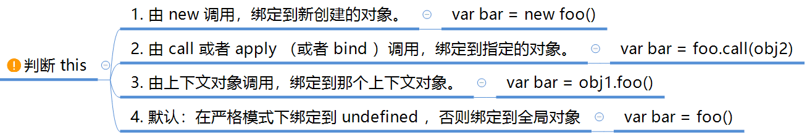

* this 使用

  


**相关问题：**

> **如果一个构造函数，bind了一个对象，用这个构造函数创建出的实例会继承这个对象的属性吗？为什么?**

​		不会继承，因为根据 this 绑定四大规则，new 绑定的优先级高于 bind 显示绑定，通过 new 进行构造函数调用时，会创建一个新对象，这个新对象会代替 bind 的对象绑定，作为此函数的 this，并且在此函数没有返回对象的情况下，返回这个新建的对象。


## 执行环境&环境栈

**执行环境**


**环境栈**

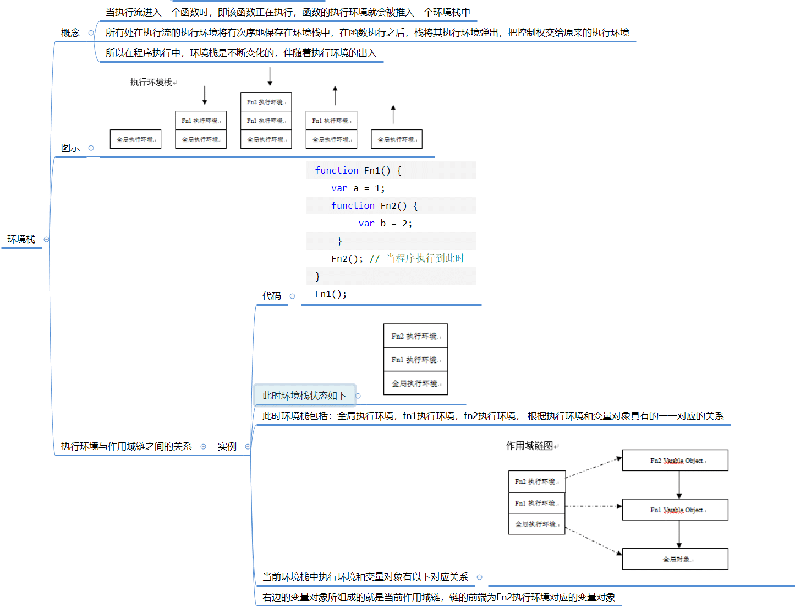

## 作用域&作用域链


**作用域:**

* 作用域是变量与函数的可访问范围，即作用域控制着变量与函数的可见性和生命周期。
* 作用域是一套规则，在当前作用域以及嵌套的子作用域中根据标识符名称进行变量查找。


**作用域链:**

- 作用域链的作用是保证执行环境里有权访问的变量和函数是有序的
- 作用域链的变量只能向上访问，变量访问到window对象即被终止，作用域链向下访问变量是不被允许的。


## 闭包


**相关问题**  

> **什么是闭包？**

* 闭包是有权限访问其他函数作用域的局部变量的一个**函数**

* 判断闭包：函数内部使用了该函数外部的变量，则该函数是闭包。

  ```js
  function closureOuter(){
    let outerVar = 'outer func var'
    return function(){ // 闭包函数，引用了外部函数变量
      return outerVar 
    }
  }
  let test = closureOuter()  // 使用test接受匿名函数
  name = null // 释放引用内存
  ```

  

> 为什么其他非闭包的函数，没有权限访问另一个函数的内部作用域? 

* 在JS中，变量的作用域属于函数作用域，在函数执行后作用域就会被清理、内存也随之被收回;
* 闭包是建立在一个函数内部的子函数，由于其可访问上级作用域的原因，因此存在对上级作用域的引用计数（无法垃圾回收），即使上级函数执行完，作用域也不会随之销毁；
* 这时的子函数—也就是闭包，便拥有了访问上级作用域中的变量的权限，即使上级函数执行完后，作用域内的值也不会被销毁。

> **闭包产生本质？**

* 当前函数定义了其他函数，当前环境中存在指向父级作用域的引用
* 本质上闭包就是将函数内部和函数外部连接起来的方式

> **闭包解决了什么？**

* 作用域链的变量只能向上访问，变量访问到window对象即被终止，作用域链向下访问变量是不被允许的。闭包就是用于解决这个问题所产生的

  

* 由于闭包可以缓存下级作用域，那么就使得函数外部打破了“函数作用域”的束缚，可以访问函数内部的变量。

> **闭包作用？**

* 可以读取函数内部的变量；
* 保存上级作用域，实现方法或属性的私有化；

> **闭包特性？**

* 函数内部嵌套函数
* 函数内部可以引用外部的变量
* 参数和变量不会被垃圾回收机制回收

> **如何产生闭包？**

* 函数中返回一个函数
* 函数当作参数传递
* IIFE 执行函数
* 定时器 setTimeout 和自执行函数
* 所有的回调函数

>  **闭包的this指向**

* 闭包的 this 指向的是 window

>**闭包应用场景**？

* 回调函数

* 柯里化 bind

* 模块

* 创建私有变量

* 模仿块级作用域

  * 概念：JavaScript 没有块级作用域的概念。这意味着在块语句中定义的变量，实际上是在包含函数中而非语句中创建的

  * 要点：

    * 创建并立即调用一个函数，这样既可以执行其中的代码，又不会在内存中留下对该函数的引用
    * 函数内部的所有变量都会被立即销毁——除非将某些变量赋值给了包含作用域（即外部作用域）中的变量

  * 语法：

    * ```javascript
      (function(){
      //这里是块级作用域
      })();
      ```

    * 解释：以上代码定义并立即调用了一个匿名函数。将函数声明包含在一对圆括号中，表示它实际上是一个函数表达式。而紧随其后的另一对圆括号会立即调用这个函数

  * 实例：

    * 在匿名函数中定义的任何变量，都会在执行结束时被销毁；
    * 变量 i 只能在循环中使用，使用后即被销毁；
    * 在私有作用域中能够访问变量 count ，是因为这个匿名函数是一个闭包，它能够访问包含作用域中的所有变量

> **滥用闭包存在什么问题？**

* 会造成网页的性能问题，在IE中可能导致内存泄漏。
  * 原因：
    * JS使用垃圾回收机制的原理是标记清除，当一个变量所属的函数作用域被销毁了，变量所存在的作用域没有了，这时JS会给这个变量打上一个标记，待下次垃圾回收时会将其清除。
    * 闭包函数中引用了外部函数的变量，并且外部函数返回的函数赋给了全局作用域中的变量，导致了原本应该被回收的闭包外部函数的变量一直被引用无法回收，这样会导致内存泄漏。
  * 解决方法：全局作用域中的变量复制为 null。

> **栈内存释放**

* 即使外部函数栈内存释放闭包依旧存在
  * 堆内存：存储引用类型，对象类型就是键值对，函数就是代码字符串。将引用类型的空间地址赋值为 `null`。
  * 栈内存：提供代码的执行环境和存储基本类型。函数执行完后函数的私有作用域会被释放掉。


> **匿名函数与闭包区别?**

* 闭包中引用了其他作用域链上的变量


**实例解析**

* 闭包使用实例：
  * 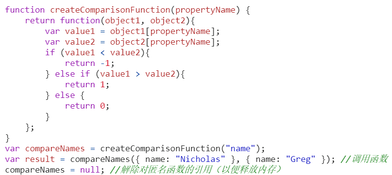
  * 图示：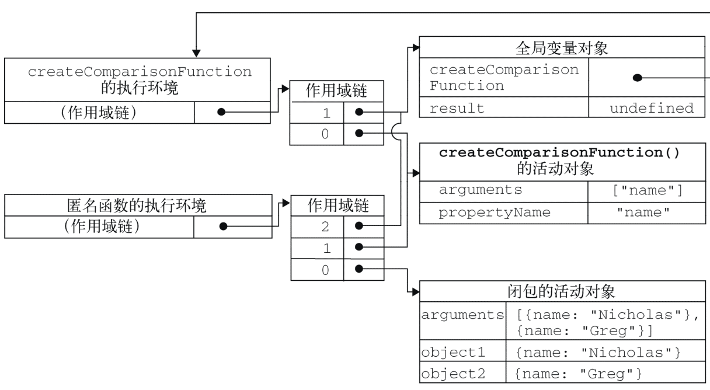
  * 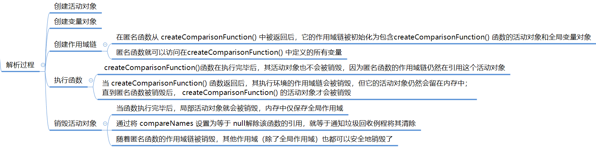
  
* **闭包只能取得包含函数中任何变量的最后一个值**
  * 原因：闭包所保存的是整个变量对象，而不是某个特殊的变量
  
  * 实例：
    
    ```js
    function createFunctions(){
        var result = new Array();
        for(var i=0; i< 10; i++) {
            result[i] = (function(num) {
                return function(){
                    return num;
                }
            })(i);
        }
        return result;
    }
    var res = createFunctions();
    console.log(res,res[0](),res[1](),res[9]());
    // 输出结果： [ƒ, ƒ, ƒ, ƒ, ƒ, ƒ, ƒ, ƒ, ƒ, ƒ] 0 1 9
    ```
    
    ```js
    function createFunctions(){
        var result = new Array();
        for(var i=0; i< 10; i++) {
            result[i] = (function(num) {
                return num
            })(i);
        }
        return result;
    }
    var res = createFunctions();
    console.log(res);
    // 输出结果：[0, 1, 2, 3, 4, 5, 6, 7, 8, 9]
    ```
    
    
    
    * 创建另一个匿名函数强制让闭包将变量i传递给该匿名函数
    * 匿名函数(闭包)活动对象中保存变量副本,数组每一个变量则保存匿名函数引用
    * 图示：


* **闭包形参优先级高于变量提升的变量**
  * 实例：
    * 在函数内部，调用 foo.n 优先访问的是形参，而不是内部定义的变量；console.log 访问的按作用域链优先访问内部变量
* **使用闭包创建私有变量**
  * 概念：
    * JavaScript 中没有私有成员的概念；所有对象属性都是公有的
    * 但是任何在函数中定义的变量，都可以认为是私有变量
    * 可以使用闭包来实现公有方法，而通过公有方法可以访问在包含作用域中定义的变量
  * 特权方法：
    * 概念：有权访问私有变量的公有方法叫做特权方法
    * 为自定义类型创建私有变量和特权方法：
      * 基本模式：
      * 原理：能够在构造函数中定义特权方法，是因为特权方法作为闭包有权访问在构造函数中定义的所有变量和函数，使用函数声明创建局部特权方法
      * 作用：利用私有和特权成员，可以隐藏那些不应该被直接修改的数据
  * 静态私有变量：
    * 概念：在私有作用域中定义私有变量或函数，同样也可以创建特权方法
    * 基本模式：
    * 原理：公有方法是在原型上定义，使用了函数表达式
    * 与在构造函数中定义特权方法的主要区别：
      * 私有变量和函数是由实例共享的
      * 特权方法是在原型上定义的，因此所有实例都使用同一个函数
      * 特权方法作为一个闭包，总是保存着对包含作用域的引用
    * 实例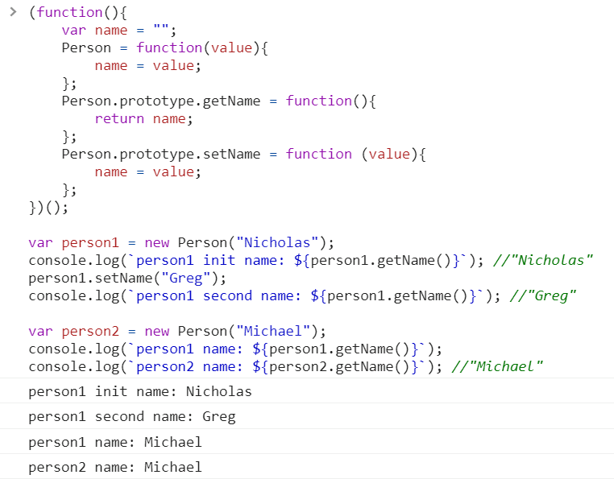
  * 为单例创建私有变量和特权方法：
    * 模块模式：通过为单例添加私有变量和特权方法能够使其得到增强
      * 
      * 解释：
        * 使用了一个返回对象的匿名函数
        * 在这个匿名函数内部，首先定义了私有变量和函数。然后，将一个对象字面量作为函数的值返回
        * 返回的对象字面量中只包含可以公开的属性和方法
        * 由于这个对象是在匿名函数内部定义的，因此它的公有方法有权访问私有变量和函数
        * 从本质上来讲，这个对象字面量定义的是单例的公共接口
  * 增强的模块模式：在返回对象之前加入对其增强的代码
    * 
    * 适用情况：单例必须是某种类型的实例，同时还必须添加某些属性和（或）方法对其加以增强的情况


## Prototype 对象


* 示例：

  > 使用 Person 构造函数和 Person.prototype 创建实例

  * 语法一：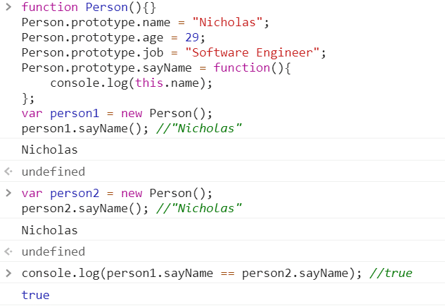
    * 图示：
  * 语法二：
    * 问题
      	 constructor 属性不指向 Person
        	无法通过 constructor 确定对象的类型
    * 改进：
      * 问题问题：
        * 这种方式重设 constructor 属性会导致它的 [[Enumerable]] 特性被设置为 true
        * 默认情况下，原生的 constructor 属性是不可枚举的
        * 切断了构造函数与最初原型之间的联系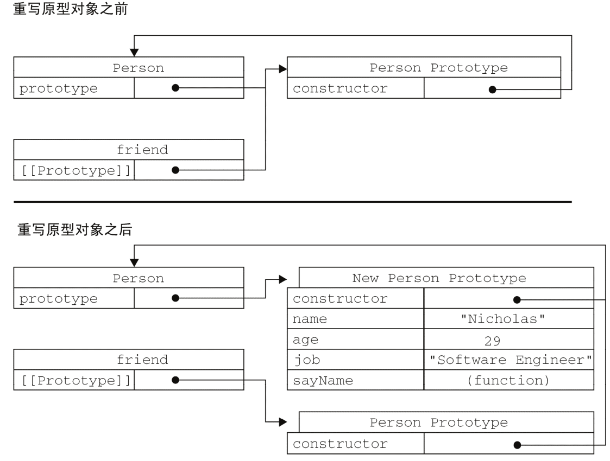
          * Person.prototype 原来指向 Person Prototype，重写后指向了 New Person Prototype 新的原型对象
        * 重写原型对象切断了现有原型与任何之前已经存在的对象实例之间的联系；它们引用的仍然是最初的原型	


## Prototype属性和proto 属性

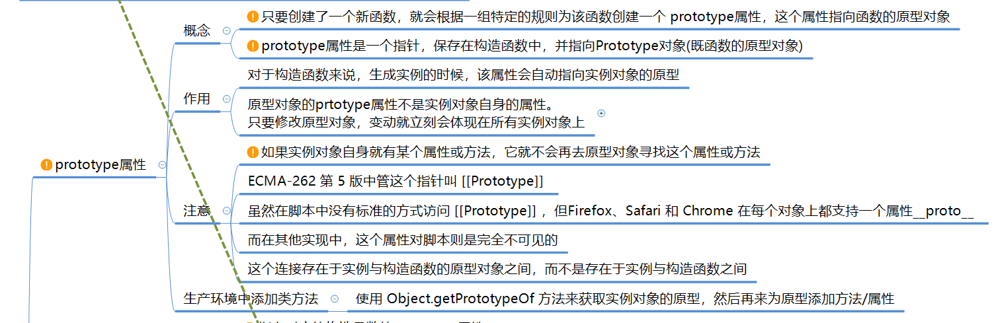

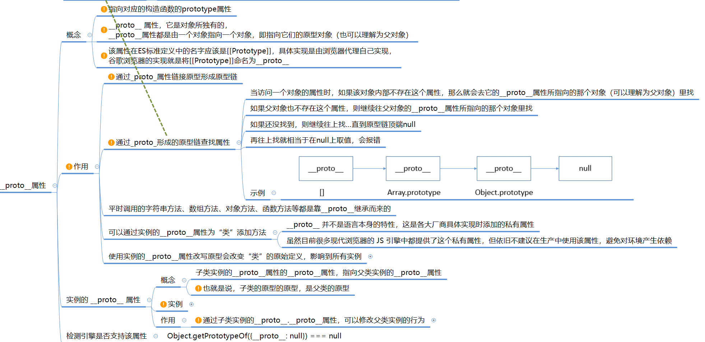


>  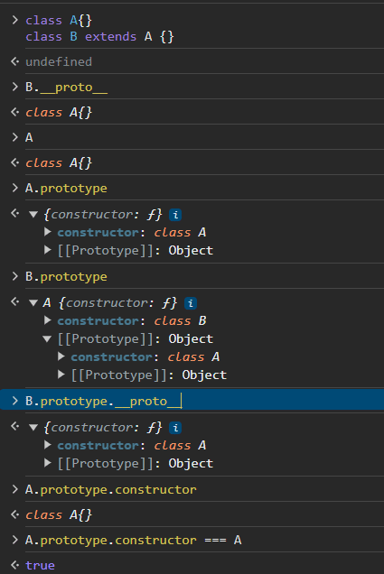
>
> 分析：
>
> * `A`指向 A 类型的构造函数 `constructor`;
> * `B.__proto__`指向 A 类型的构造函数 `constructor`;
> * `A.prototype` 指向 A 的原型对象，A 的原型对象中包含 A 的构造函数 constructor 和属性；
> * `B.prototype` 指向 B 的原型对象，B 的原型对象中包含 B 的构造函数 constructor 和属性；
> * `B.prototype.__proto__` 指向 A 的原型对象，即为 B 原型对象中 [[Prototype]]  属性；

## 获取原型方法

* `p.__proto`__

* `p.constructor.prototype`
* `Object.getPrototypeOf(p)`


## constructor 属性

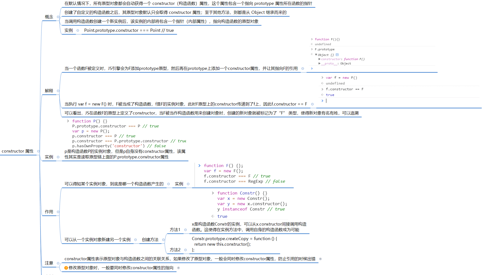

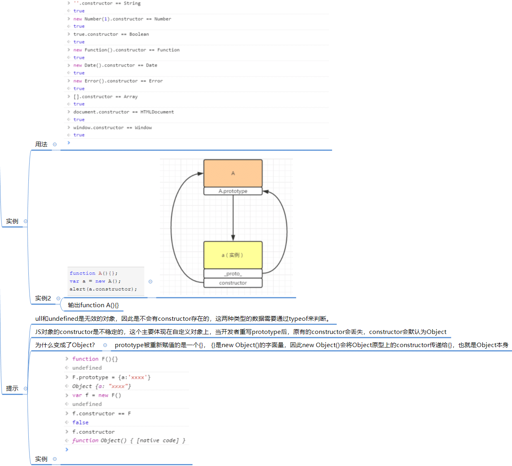


## 原型&原型链


* 注意：
  * 通过 `Object.prototype.__proto__ ` 查找原型，原型链的终点是 null。
    * 


## **函数**

### ES5 函数

**函数定义**


**函数参数**


### 箭头函数


### 箭头函数与普通函数的区别

**普通函数**：

​	普通函数通过 function 关键字定义， this 无法结合词法作用域使用，在运行时绑定，只取决于函数的调用方式，在哪里被调用，调用位置。（取决于调用者，和是否独立运行）

**箭头函数：**

1. 函数体内的this对象，就是定义时所在的对象，而不是使用时所在的对象;
2. 箭头函数常用于回调函数中，包括事件处理器或定时器;
3. 没有原型、没有 this、没有 super，没有 arguments，没有 new.target;
4. 不可以使用arguments对象，该对象在函数体内不存在。如果要用，可以用Rest参数代替;
5. 不可以使用yield命令，因此箭头函数不能用作Generator函数;
6. 不可以当作构造函数，也就是说，不可以使用new命令，否则会抛出一个错误:
   * 一个函数内部有两个方法：[[Call]] 和 [[Construct]]
   * 在通过 new 进行函数调用时，会执行[[construct]] 方法，创建一个实例对象，然后再执行这个函数体，将函数的 this 绑定在这个实例对象上当直接调用时，执行 [[Call]] 方法
   * 直接执行函数体箭头函数没有 [[Construct]] 方法，不能被用作构造函数调用，当使用 new 进行函数调用时会报错

### 其他函数


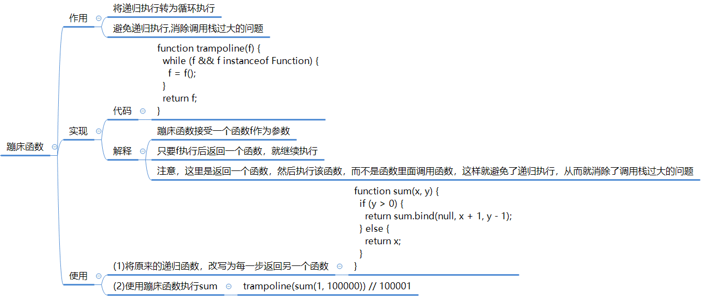

### 函数柯里化

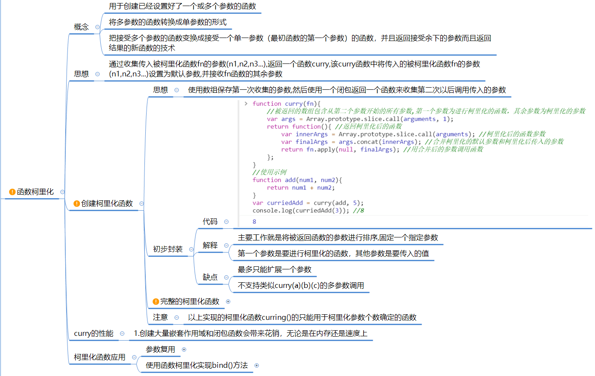

## **对象**

### 创建对象方式有哪些

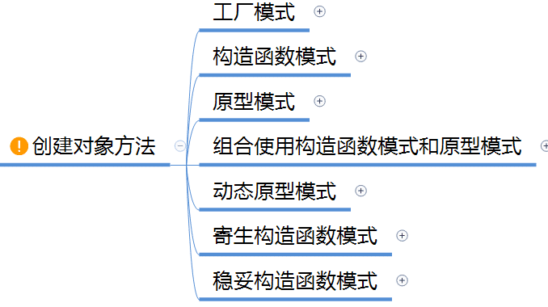

### 创建对象方式比较


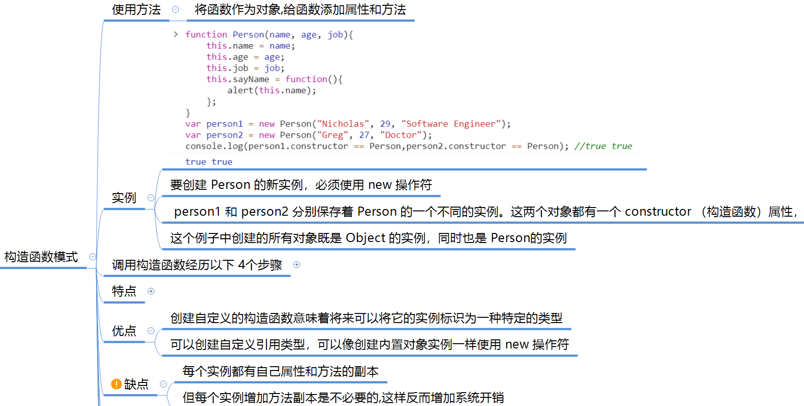


### 对象继承方式


### 对象继承方式比较

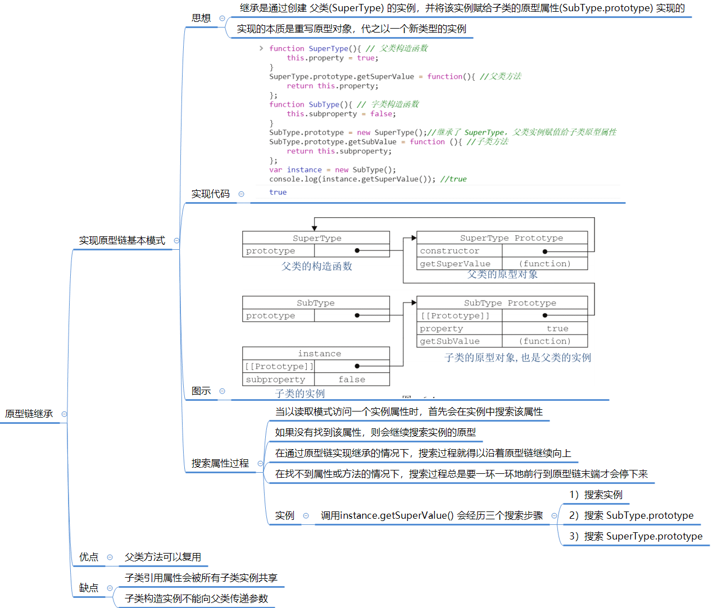


## **类**

### Class 类

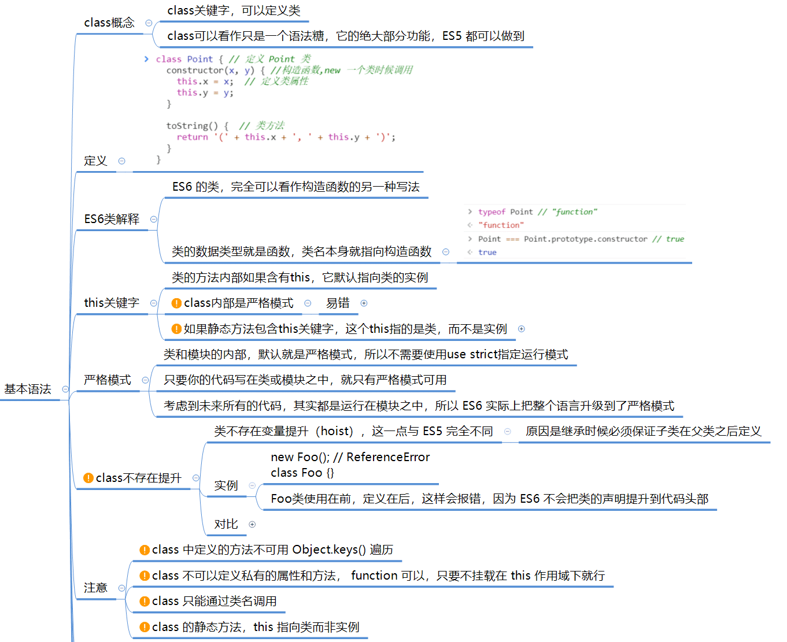

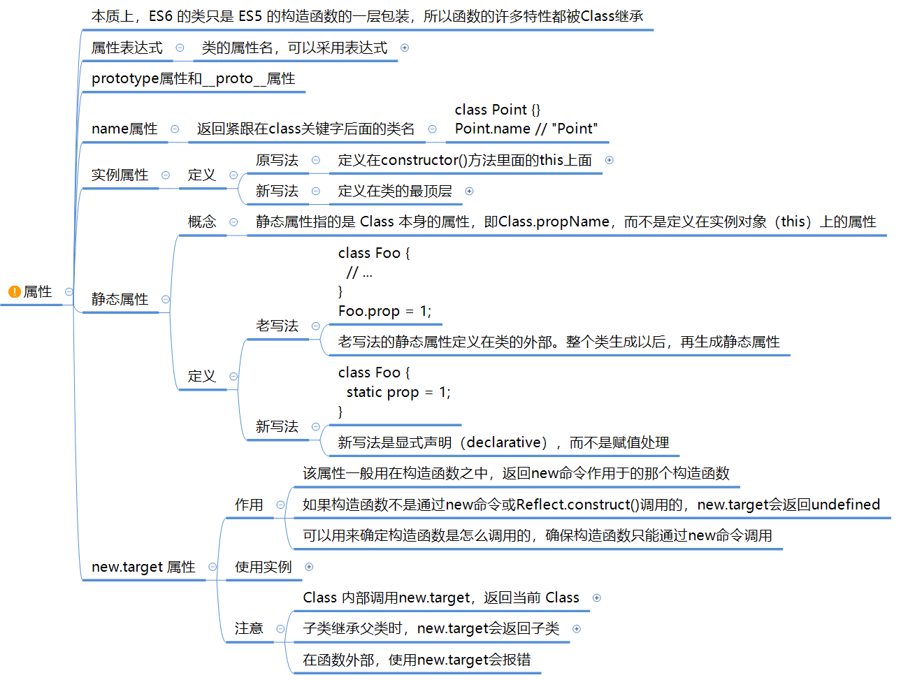


### Class 继承


## Reflect 对象


## [Object.defineProperty](https://devdoc.net/web/developer.mozilla.org/en-US/docs/Web/JavaScript/Reference/Global_Objects/Object/defineProperties.html)


## [Proxy 对象](https://es6.ruanyifeng.com/#docs/proxy) 


### Object.defineProperty 和 Proxy 比较


>  **如何监听一个变量的变化?**

- ES5 的 `Object.defineProperty`
- ES6 的 `Proxy`


> `Object.defineProperty` 和  `Proxy`  区别：

* **Object.defineProperty**：这是一个ES5引入的特性，**用于定义对象的新属性或修改现有属性的特性**。
  * 通过使用`Object.defineProperty`，可以精确地控制属性的读取(get)、写入(set)和删除(delete)等操作。
  * 它可以拦截对属性的访问和修改，从而实现对属性的监视和自定义行为。
  *   `Object.defineProperty` 缺点：
    * 只能对已存在的属性进行劫持，并且需要逐个定义每个属性。这意味着在大型对象或需要动态添加属性的情况下，使用`Object.defineProperty`会变得复杂和冗长。
    * 无法检测到对象属性的新增和删除；
    * 无法检测数组的变化。

* **Proxy**：这是ES6引入的特性，它提供了一个可以代理目标对象的代理对象。

  * 通过使用`Proxy`，可以**拦截并重定义目标对象的底层操作**，如读取属性(get)、写入属性(set)、删除属性(delete)、函数调用等。

  * ``Proxy`提供了更强大和灵活的拦截功能，它可以**拦截对整个对象的操作，而不仅限于属性级别的拦截**。
  * `Proxy`也**支持动态添加和删除属性**，可以在代理对象上直接进行操作，而不需要像`Object.defineProperty`那样逐个定义属性。


> 为什么Vue 3使用 `Proxy` 替代 `Object.defineProperty` 来实现双向绑定？

* **更强大的拦截能力**：Proxy提供了丰富的拦截方法，能够拦截更多类型的操作，包括属性读取、写入、删除、函数调用等，比Object.defineProperty更灵活。

* **更好的性能**：Proxy在底层实现上比Object.defineProperty更高效。Proxy可以直接代理整个对象，而不需要逐个定义属性，这在大型对象或动态属性的场景下性能更优。

* **更好的语法支持**：Proxy的语法更简洁直观，可以通过定义一个代理对象来统一拦截操作，而不需要分散处理每个属性。

## 模块加载方案


### CommonJS 模块

commonjs 核心就是 require 语句

**require() 的基本用法**

当 Node 遇到 require(X) 时，按下面的顺序处理。

（1）如果 X 是内置模块（比如 require('http'）)
　　a. 返回该模块。
　　b. 不再继续执行。

（2）如果 X 以 "./" 或者 "/" 或者 "../" 开头
　　a. 根据 X 所在的父模块，确定 X 的绝对路径。
　　b. 将 X 当成文件，依次查找下面文件，只要其中有一个存在，就返回该文件，不再继续执行。

> - X
> - X.js
> - X.json
> - X.node

　　c. 将 X 当成目录，依次查找下面文件，只要其中有一个存在，就返回该文件，不再继续执行。

> - X/package.json（main字段）
> - X/index.js
> - X/index.json
> - X/index.node

（3）如果 X 不带路径
　　a. 根据 X 所在的父模块，确定 X 可能的安装目录。
　　b. 依次在每个目录中，将 X 当成文件名或目录名加载。

（4） 抛出 "not found"

**参考资料：**

[require() 源码解读](http://www.ruanyifeng.com/blog/2015/05/require.html)

### ES6模块


* ES6 模块命令：


### 模块加载混合引用


### 模块加载循环引用


## 定时器


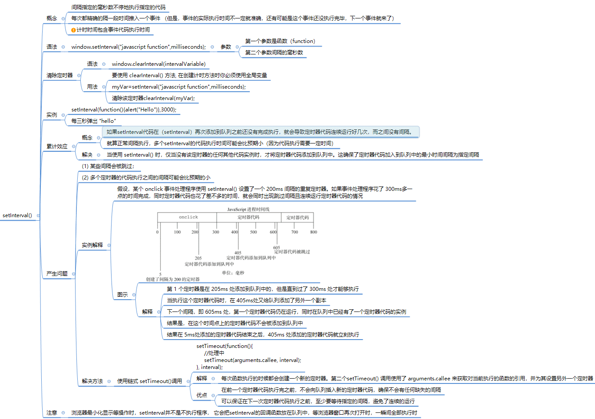


* **为什么使用setTimeout实现setInterval？怎么模拟？**

> `setInterval` 每 n 毫秒启动一个函数，而不考虑函数何时完成执行。
>
> 如果一个函数总是花费相同的时间，那就没问题：
>
> [](https://dev.nodejs.cn/static/fa9e9fec1aea517d98b47b11c5fec296/4d383/setinterval-ok.png)
>
> 也许该函数需要不同的执行时间，具体取决于网络条件，例如：
>
> [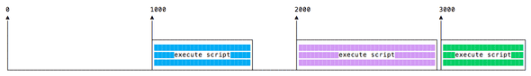](https://dev.nodejs.cn/static/f2ae544ad5038515ba1d44b29322bec9/19a6b/setinterval-varying-duration.png)
>
> 也许一个长时间的执行与下一个重叠：
>
> [](https://dev.nodejs.cn/static/4e64c07dfb9f7be0e819fe3eb7def66a/393aa/setinterval-overlapping.png)
>
> 为避免这种情况，你可以安排一个递归的 setTimeout 在回调函数完成时调用：
>
> ```js
> jscopyconst myFunction = () => {
>   // do something
> 
>   setTimeout(myFunction, 1000);
> };
> 
> setTimeout(myFunction, 1000);
> ```
>
> 添加控制器版本
>
> ```js
> //思路是使用递归函数，不断地去执行 setTimeout 从而达到 setInterval 的效果
> function mySetInterval(fn,timeout){ 
>     //控制器，控制定时器是否继续执行
>     var timer = { flag:true }; 
>     //设置递归函数，模拟定时器执行。
>     function interval(){
>         if(timer.flag){
>             fn();
>             setTimeout(interval,timeout);
>         }
>     }
>     //启动定时器
> 	setTimeout(interval,timeout);
>     //返回控制器
>     return timer;
> }
> ```
>
> 实现这种情况：
>
> [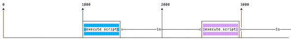](https://dev.nodejs.cn/static/4bde07363650160e953f899734adc29e/1790f/recursive-settimeout.png)
>
> `setTimeout` 和 `setInterval` 在 Node.js 中可用，通过 [定时器模块](https://nodejs.cn/api/timers.html)。
>
> Node.js 还提供了 `setImmediate()`，相当于使用 `setTimeout(() => {}, 0)`，主要用于配合 Node.js Event Loop。

引用资料：[探索 JavaScript 定时器](https://dev.nodejs.cn/learn/discover-javascript-timers/) 


## 垃圾回收

**V8引擎的垃圾回收机制**

v8的垃圾回收机制基于分代回收机制，这个机制又基于世代假说，这个假说有两个特点:

* 一是新生的对象容易早死；
* 二是不死的对象会活得更久；

基于这个假说，v8引擎将内存分为了新生代和老生代。

* 新创建的对象或者只经历过一次的垃圾回收的对象被称为新生代。

* 经历过多次垃圾回收的对象被称为老生代。 

新生代被分为From和To两个空间，To一般是闲置的。当From空间满了的时候会执行Scavenge算法进行垃圾回收。

当我们执行垃圾回收算法的时候应用逻辑将会停止，等垃圾回收结束后再继续执行。

这个算法分为三步：

* （1）首先检查From空间的存活对象，如果对象存活则判断对象是否满足晋升到老生代的条件，如果满足条件则晋升到老生代。如果不满足条件则移动To空间。
* （2）如果对象不存活，则释放对象的空间。
* （3）最后将From空间和To空间角色进行交换。

新生代对象晋升到老生代有两个条件：

* （1）第一个是判断是对象否已经经过一次Scavenge回收。若经历过，则将对象从From空间复制到老生代中；若没有经历，则复制到To空间。
* （2）第二个是To空间的内存使用占比是否超过限制。当对象从From空间复制到To空间时，若To空间使用超过25%，则对象直接晋升到老生代中。设置25%的原因主要是因为算法结束后，两个空间结束后会交换位置，如果To空间的内存太小，会影响后续的内存分配。

老生代采用了标记清除法和标记压缩法：

* 标记清除法首先会对内存中存活的对象进行标记，标记结束后清除掉那些没有标记的对象。由于标记清除后会造成很多的内存碎片，不便于后面的内存分配。
* 所以了解决内存碎片的问题引入了标记压缩法。

**参考资料：**

[深入理解V8的垃圾回收原理](https://www.jianshu.com/p/b8ed21e8a4fb)

[JavaScript 中的垃圾回收](https://zhuanlan.zhihu.com/p/23992332)

### 内存泄漏

**定义**

​	指由于疏忽或错误造成程序未能释放已经不再使用的内存的情况。内存泄漏并非指内存在物理上的消失，而是应用程序分配某段内存后，由于设计错误，失去了对该段内存的控制，因而造成了内存的浪费。

**哪些操作会造成内存泄漏?**

造成内存泄漏情况：

* 意外的全局变量
  * 由于使用未声明的变量，而意外的创建了一个全局变量，而使这个变量一直留在内存中无法被回收
* 被遗忘的计时器或回调函数
  * 设置了setInterval定时器，而忘记取消它，如果循环函数有对外部变量的引用的话，那么这个变量会被一直留在内存中，而无法被回收
* 脱离DOM的引用
  * 获取一个DOM元素的引用，而后面这个元素被删除，由于我们一直保留了对这个元素的引用，所以它也无法被回收
* 闭包
  * 不合理的使用闭包，从而导致某些变量一直被留在内存当中
    * 闭包会导致原始作用域链不释放，造成内存泄漏（占用）；


**内存泄漏的识别方法:**

* **浏览器**:

  * Chrome 浏览器查看内存占用，按照以下步骤操作:

    * 打开开发者工具，选择 Timeline 面板

    * 在顶部的`Capture`字段里面勾选 Memory

    * 点击左上角的录制按钮。

    * 在页面上进行各种操作，模拟用户的使用情况。

    * 一段时间后，点击对话框的 stop 按钮，面板上就会显示这段时间的内存占用情况

      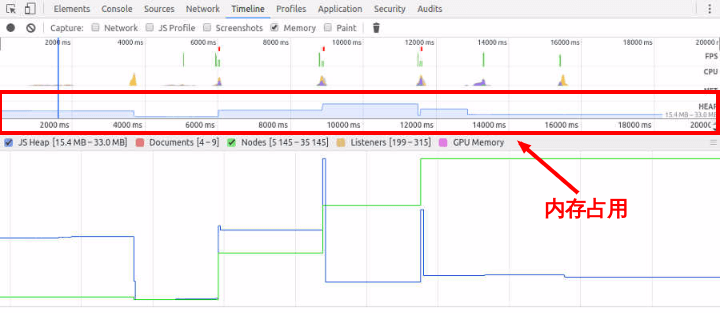

    * 如果内存占用基本平稳，接近水平，就说明不存在内存泄漏

    * 正常情况： 

    * 内存泄漏：

* **命令行**

  * 命令行可以使用 Node 提供的[`process.memoryUsage`](https://nodejs.org/api/process.html#process_process_memoryusage)方法

    ```javascript
    console.log(process.memoryUsage());
    // { rss: 27709440,
    //  heapTotal: 5685248,
    //  heapUsed: 3449392,
    //  external: 8772 }
    ```

    

  * `process.memoryUsage`返回一个对象，包含了 Node 进程的内存占用信息。该对象包含四个字段，单位是字节，[含义](http://stackoverflow.com/questions/12023359/what-do-the-return-values-of-node-js-process-memoryusage-stand-for)如下:

    * rss（resident set size）：所有内存占用，包括指令区和堆栈。
    * heapTotal："堆"占用的内存，包括用到的和没用到的。
    * heapUsed：用到的堆的部分。
    * external： V8 引擎内部的 C++ 对象占用的内存。

    

    


**参考资料：**

[JavaScript 内存泄漏程](http://www.ruanyifeng.com/blog/2017/04/memory-leak.html)

[javascript典型内存泄漏及chrome的排查方法](https://segmentfault.com/a/1190000008901861)


## AJax 


### 创建 Ajax 过程


* 示例：


## 消息推送技术


**websocket 与 Ajax 区别**


### SSE实现


### websocket 实现


## 跨页面通信方法

在浏览器中，我们可以同时打开多个Tab页，每个Tab页可以粗略理解为一个“独立”的运行环境，即使是全局对象也不会在多个Tab间共享。然而有些时候，我们希望能在这些“独立”的Tab页面之间同步页面的数据、信息或状态，因此需要跨页面通信。

跨页面通信分为两类

* 同源跨页面通信
  * 广播模式：Broadcast Channe / Service Worker / LocalStorage + StorageEvent
  * 共享存储模式：Shared Worker / IndexedDB / cookie
  * 口口相传模式：window.open + window.opener
  * 基于服务端：Websocket / Comet / SSE 等
* 非同源跨页面通信
  * 嵌入同源 iframe 作为“桥”，将非同源页面通信转换为同源页面通信

**同源跨页面通信方案**

* **[BroadcastChannel](https://developer.mozilla.org/zh-CN/docs/Web/API/BroadcastChannel)**

  * 接口代理了一个命名频道，可以让指定 [origin](https://developer.mozilla.org/zh-CN/docs/Glossary/Origin) 下的任意 [browsing context](https://developer.mozilla.org/zh-CN/docs/Glossary/Browsing_context) 来订阅它。它允许同源的不同浏览器窗口，Tab页，frame或者 iframe 下的不同文档之间相互通信。通过触发一个 `message` 事件，消息可以广播到所有监听了该频道的 `BroadcastChannel` 对象。

  * 实现：

    ```javascript
    // 发送消息页面
    const channel = new BroadcastChannel('tabs')
    channel.postMessage('hello')
    
    // 监听消息页面
    const channel = new BroadcastChannel('tabs')
    channel.onmessage = evt => {
    // evt.data
    }
    ```

  * 缺点：

  * `BroadcastChannel`方案兼容性差些（chrome > 58），但比`localStorage`方案生命周期短（不会持久化）。

  ---

  

* **[LocalStorage](https://developer.mozilla.org/zh-CN/docs/Web/API/Window/localStorage)**

  * 当 LocalStorage 变化时，会触发`storage`事件。利用这个特性，我们可以在发送消息时，把消息写入到某个 LocalStorage 中；然后在各个页面内，通过监听`storage`事件即可收到通知。

    `storage`事件只有在值真正改变时才会触发。

    触发写入操作的页面下的 `storage listener`不会被触发。

    safari隐身模式下无法设置`localStorage`值

  * 实现：

    ```javascript
    //监听消息页面
    window.addEventListener('storage', function (e) {
        if (e.key === 'broadcast') {
            const data = JSON.parse(e.newValue);
            const text = '[receive] ' + data.msg + ' —— tab ' + data.from;
            console.log('[Storage I] receive message:', text);
        }
    });
    //发送消息页面
    window.localStorage.setItem('broadcast', '123'); // 第一次设置值触发 storage 事件
    window.localStorage.setItem('broadcast', '123'); // 第二次设置相同值不会触发 storage 事件
    ```

    ---


* **[Shared Worker](https://developer.mozilla.org/zh-CN/docs/Web/API/SharedWorker)**
  * `**SharedWorker**` 接口代表一种特定类型的 worker，可以从几个浏览上下文中*访问*，例如几个窗口、iframe 或其他 worker。它们实现一个不同于普通 worker 的接口，具有不同的全局作用域


**非同源跨页面通信方案**

* **获取句柄**：

  * 父页面通过`window.open(url, name)`方式打开的子页面可以获取句柄，然后通过`postMessage`完成通讯需求。

  * 实现：

    ```javascript
    // parent.html
    const childPage = window.open('child.html', 'child')
    
    childPage.onload = () => {
       childPage.postMessage('hello', location.origin)
    }
    
    // child.html
    window.onmessage = event => {
    	// event.data
    }
    ```

  * 缺点：

    * 当指定`window.open`的第二个name参数时，再次调用`window.open('****', 'child')`会使之前已经打开的同name子页面刷新

    * 只能与自己打开的页面完成通讯，应用面相对较窄；但优点是在跨域场景中依然可以使用该方案。

    * 由于安全策略，异步请求之后再调用`window.open`会被浏览器阻止，不过可以通过句柄设置子页面的url即可实现类似效果。

      ```javascript
      // 首先先开一个空白页
      const tab = window.open('about:blank')
      
      // 请求完成之后设置空白页的url
      fetch(/* ajax */).then(() => {
         tab.location.href = '****'
      })
      ```

      

* **iframe:**

  嵌入同源 iframe 作为“桥”，将非同源页面通信转换为同源页面通信。由于 iframe 与父页面间可以通过指定`origin`来忽略同源限制，因此可以在每个页面中嵌入一个 iframe ，而这些 iframe 由于使用的是一个 url，因此属于同源页面，其通信方式可以复用上面第一部分提到的各种方式。

  * 实现：

    ```javascript
    // 页面中监听 iframe 发来的消息
    window.addEventListener('message', function (e) {
        // …… do something
    });
    //当页面要与其他的同源或非同源页面通信时，会先给 iframe 发送消息
    window.frames[0].window.postMessage(mydata, '*');
    //frame 收到消息后，会使用某种跨页面消息通信技术在所有 iframe 间同步消息，例如下面使用的 Broadcast Channel：
    const bc = new BroadcastChannel('broadcast');
    // 收到来自页面的消息后，在 iframe 间进行广播
    window.addEventListener('message', function (e) {
        bc.postMessage(e.data);
    });  
    //其他 iframe 收到通知后，则会将该消息同步给所属的页面
    // 对于收到的（iframe）广播消息，通知给所属的业务页面
    bc.onmessage = function (e) {
        window.parent.postMessage(e.data, '*');
    };
    
    ```

    

****

**参考：**

[前端跨页面通信，你知道哪些方法？](https://blog.csdn.net/p3118601/article/details/88966864)

[跨页面通信的各种姿势*](https://zhuanlan.zhihu.com/p/29368435)

***

## Iframe框架

* 概念：

  * **HTML内联框架元素 (`<iframe>`)** 表示嵌套的[browsing context](https://developer.mozilla.org/zh-CN/docs/Glossary/Browsing_context)。它能够将另一个HTML页面嵌入到当前页面中。
  * 每个嵌入的浏览上下文（embedded browsing context）都有自己的[会话历史记录(session history)](https://developer.mozilla.org/zh-CN/docs/Web/API/History)和[DOM树](https://developer.mozilla.org/zh-CN/docs/Web/API/Document)。
  * 包含嵌入内容的浏览上下文称为*父级浏览上下文*。顶级浏览上下文（没有父级）通常是由 [`Window`](https://developer.mozilla.org/zh-CN/docs/Web/API/Window) 对象表示的浏览器窗口。

* 属性： iframe的特性都是依赖参数配置实现：

  | 属性                | 解释                                                         | 备注 |
  | ------------------- | ------------------------------------------------------------ | ---- |
  | allow               | 可以为iframe指定[特性策略](https://link.juejin.cn/?target=https%3A%2F%2Fdeveloper.mozilla.org%2Fen-US%2Fdocs%2FWeb%2FHTTP%2FFeature_Policy) |      |
  | allowfullscreen     | 是否允许iframe调用requestFullscreen()方法激活全屏模式，这个属性等同于allow属性的这个配置：`allow="fullscreen"` |      |
  | allowpaymentrequest | 是否允许一个跨域的iframe调用[支付请求API](https://link.juejin.cn/?target=https%3A%2F%2Fdeveloper.mozilla.org%2Fen-US%2Fdocs%2FWeb%2FAPI%2FPayment_Request_API) |      |
  | csp                 | 内嵌的资源强制实行同源策略                                   |      |
  | height              | iframe的高度，默认150px                                      |      |
  | importance          | 标识在iframe属性src指示的资源的下载优先级，有`auto`/`high`/`low`三个等级 |      |
  | name                | 内嵌的浏览内容的目标名称                                     |      |
  | referrerpolicy      | 指示当获取frame的资源的时候携带的referrer，默认是`no-referrer-when-downgrade`，也就是仅当发生协议降级（如 HTTPS 页面引入 HTTP 资源，从 HTTPS 页面跳到 HTTP 等）时不发送 Referrer 信息。这个规则是现在大部分浏览器默认所采用的； |      |
  | sandbox             | 在frame上的内容上运用额外的一下限制: 1. script脚本不能执行；2. 不能发送ajax请求；3. 不能使用本地存储，即localStorage,cookie等； 4. 不能创建新的弹窗和window； 5. 不能发送表单 6. 不能加载额外插件比如flash等 |      |


* 优点：
  * iframe能够原封不动的把嵌入的网页展现出来。
  * 如果有多个网页引用iframe，那么你只需要修改iframe的内容，就可以实现调用的每一个页面内容的更改，方便快捷。
  * 网页如果为了统一风格，头部和版本都是一样的，就可以写成一个页面，用iframe来嵌套，可以增加代码的可重用。
  * 如果遇到加载缓慢的第三方内容如图标和广告，这些问题可以由iframe来解决。

* 缺点：
  * iframe会阻塞主页面的onload事件；动态设置`src`可解决这个问题。
  * iframe和主页面共享连接池，而浏览器对相同域的连接有限制，所以会影响页面的并行加载。会产生很多页面，不容易管理。
  * iframe框架页面会增加服务器的http请求。加载了新页面，增加了`css`与`js`文件的请求，即额外增加了`HTTP`请求。
  * 不利于搜索引擎优化（SEO）。现在的搜索引擎爬虫还不能很好的处理iframe中的内容。
  * iframe 如果框架个数多的话，可能会出现上下、左右滚动条，会分散访问者的注意力，用户体验度差。
  * 设备兼容性差。很多的移动设备无法完全显示框架
* 应用：
  * 实现Ajax：可以使用`iframe`进行实现异步请求发送，来模拟`Ajax`的请求操作，`Ajax`的异步请求完成操作为`XHR.readyState === 4`执行`callback`，`iframe`使用`iframe.onload`执行`callback`，还可以实现一个轮询长连接
    * 现在基本上都是用Ajax来代替iframe，所以iframe已经渐渐的退出了前端开发。如果需要使用iframe，最好是通过javascript动态给iframe添加src属性值
  * 加载广告：广告是与原文无关的，假如硬编码进去，会造成网页布局的紊乱,而且这样势必需要引入额外的`css`和`js`文件，极大的降低了网页的安全性，使用`iframe`便可以解决这些问题。
  * 提交表单：可以使用`iframe`提交表单来避免整个页面的刷新，还可以实现无刷新文件上传的操作。
* 常见问题：

**参考资料**

[`<iframe>` MDN](https://developer.mozilla.org/zh-CN/docs/Web/HTML/Element/iframe)

## BOM


## DOM


### DOM事件分类


## 事件流

事件流是网页元素接收事件的顺序，"DOM2级事件"规定的事件流包括三个阶段：

* 事件捕获阶段
* 处于目标阶段
* 事件冒泡阶段


* 例题：


### 事件是如果实现的？

基于**发布订阅模式**，就是在浏览器加载的时候会读取事件相关的代码，但是只有实际等到具体的事件触发的时候才会执行。

比如点击按钮，这是个事件（Event），而负责处理事件的代码段通常被称为事件处理程序（EventHandler），也就是「启动对话框的显示」这个动作。

在 Web 端，我们常见的就是 DOM 事件：

* DOM0 级事件，直接在 html 元素上绑定 on-event，比如 onclick，取消的话，dom.onclick =null，同一个事件只能有一个处理程序，后面的会覆盖前面的。
* DOM2 级事件，通过 addEventListener 注册事件，通过 removeEventListener 来删除事件，一个事件可以有多个事件处理程序，按顺序执行，捕获事件和冒泡事件。
* DOM3级事件，增加了事件类型，比如 UI 事件，焦点事件，鼠标事件。

### 事件委托(代理)

* 概念：事件委托本质上是利用了浏览器事件冒泡的机制。因为事件在冒泡过程中会上传到父节点，并且父节点可以通过事件对象获取到目标节点，把子节点的监听函数定义在父节点上，由父节点的监听函数统一处理多个子元素的事件，这种方式称为事件代理。
* 为什么要用事件委托？
  * 使用事件代理可以不必要为每一个子元素都绑定一个监听事件，这样减少了内存上的消耗和减少DOM操作。
    * 每个函数都是一个对象，是对象就会占用内存，对象越多，内存占用率越大。
    * 在JavaScript中，添加到页面上的事件处理程序数量将直接关系到页面的整体运行性能，因为需要不断的与dom节点进行交互，访问dom的次数越多，引起浏览器**重绘与重排**的次数也就越多，就会延长整个页面的交互就绪时间；
  * 使用事件代理可以实现事件的动态绑定。
    * 比如：新增了一个子节点，我们并不需要单独地为它添加一个监听事件，它所发生的事件会交给父元素中的监听函数来处理

* 优点：
  * 动态添加和修改元素，减少dom事件绑定的次数。将事件绑定到父节点上，通过事件冒泡获取到实际点击的叶子节点。
  * 减少管理的函数。不用为每个元素都添加监听函数。同一个父节点下面类似的子元素，可以通过委托给父元素的监听函数来处理事件。
  * 减少 JavaScript 和 DOM 节点之间的关联，这样也就减少了因循环引用而带来的内存泄漏发生的概率。


**应用**：

>  如：在一个列表中，需要点击列表中的 `<li>` 元素触发事件，获取到 `<li>` 标签内的文本内容

解决方案: 

**事件委托**：获取所有 `<li>` 元素的父元素 `<ul>`, 通过事件冒泡机制，获取冒泡到 `<ul>` 的事件，再获取目标元素的内容。

* Event 对象提供了一个属性叫 target，可以返回事件的目标节点；标准浏览器用 `ev.target`，IE浏览器用event.srcElement；通过 `target.nodeName` 获取签名。

* 根据标签名称在 `<li>` 父节点获取 `target.nodeName` 判断子节点类型，分类处理。

  ```js
  window.onload = function(){
          let myul = document.getElementById('ul');
          myul.onclick = function(ev){ // 标准浏览器ev ie是event
              let ev = ev || window.event // 兼容ie
              let target = ev.target || ev.srcElement
              switch( target.nodeName.toLowerCase()){
                  case 'li': //do somthing...
              }
          }
      }
  ```

  

****

## JS 兼容性

* 兼容性产生原因：浏览器内核不同，不同 js 引擎对 js 的实现存在差异
  * Trident ['traɪd(ə)nt] 内核（IE 内核）：IE、浏览器兼容模式
  * Blink 内核（Chromium 内核）：Chrome、Opera
  * Gecko ['gekəʊ] 内核（FireFox 内核）：FireFox
  * Webkit 内核：Safari
* 目前主要是 IE 浏览器与其他浏览 firefox 浏览器的差异。 

### 兼容性问题

* const 
  * 现有问题：在IE中不能使用`const`关键字。如`const constVar = 32;`在IE中这是语法错误。 
  * 解决方法：不使用 `const`，以 `var` 代替。
*  多余的逗号 
  * 现有问题：firefox 中对象文字常量容许多余的逗号，在IE中不允许。下面语句在IE中非法: `var obj = { ‘key’ : ‘aaa’, }` 
  * 解决方法：去掉多余逗号。

**元素查找问题**

* document.all[name] 
  * 现有问题：Firefox不支持document.all[name] 
  * 解决方法：使用getElementsByName(name)，getElementById(id)等来替代。

*  集合类对象问题 
  * 现有问题：IE中对许多集合类对象取用时可以用 ()，但在Firefox只能用[]。 
    * 如：IE中可以使用`document.forms(“formName”)`来返回名字为”formName”的Form，但在Firefox却行不通。
  * 解决方法：使用[]，上例中可以改为`document.forms[“formName”]`

* HTML元素的ID在[JavaScript](http://lib.csdn.net/base/javascript)可见 
  * 现有问题：IE中HTML元素中的ID可以作为document的下属对象变量名直接使用。在Firefox中不能。
  * 解决方法：使用 `getElementById(“idName”)`代替 idName 作为对象变量使用。

* `eval(idName)`取得对象 
  * 现有问题：在IE中，利用eval(idName)可以取得ID为idName的HTML对象，在Firefox中不能。 
  * 解决方法：用 `getElementById(idName)` 代替 `eval(idName)`。

* 变量名与某HTML对象ID相同 
  * 现有问题：在Firefox中，因为对象ID不作为HTML对象的名称，所以可以使用与HTML对象id相同的变量名，IE中不能。 
  * 解决方法：在声明变量时，一律加上var，以避免歧义，这样在IE中亦可正常运行。此外，最好不要取与HTML对象id相同的变量名，以减少错误。
  * 注：3、4和5都属于同一类的问题。
* Frame 
  * 现有问题：在IE中可以用 `window.top.frameId` 和 `window.top.frameName` 来得到该 Frame 所代表的 Window，Firefox中只能用 `window.top.frameName`。 
  * 解决方法：将 Frame 的Id和Name设置成相同，使用 `window.top.frameName` 来访问Frame。

**DOM 操作**

* 创建DOM 

  * 现有问题：IE 使用 ActiveXObject() 创建 DOM， firefox 使用 `document.implementation.createDocument`

  * 解决方法:

    ```js
    function createXmlDom() {
        var oXmlDom;
        if (Window.ActiveXObject) { // IE
         oXmlDom = new ActiveXObject("Microsoft.XmlDom");
        } else { // Firefox
         oXmlDom = document.implementation.createDocument("", "", null);
        }
       }
    ```

    

* 设置元素的文本内容。 

  * 现有问题：IE使用innerText，而Firefox使用 textContent 来设置元素文本内容。 

  * 解决方法：如果文本内容不包含 `<` 和 `>` 等特殊字符，可以使用 innerHTML。否则，可以使用：

    * ```js
      var child = elem.firstChild;
      if (child != null) elem.removeChild(child);
      elem.appendChild(document.createTextNode(content));
      ```

* parentElement，parent.children 
  * 现有问题：IE可以使用 parentElement 获得父结点，parent.children 得到结点的所有孩子结点。Firefox不支持。 
  * 解决方法：使用 parentNode 和 parent.childNodes。

*  对childNodes的解释。 

  * 现有问题：IE和Firefox中对childNodes的解释不同，IE不会包含空白文本结点，而Firefox会包含。 

  * 解决方法：使用childNodes过滤文本结点，如下：

    ```js
      var children = elem.childNodes;
      for (i = 0; i < children.length; i++) {
       if (children[i].nodeType != 3) { // 过滤文本结点
        // ...
       }
      }
    ```

* 对 `document.getElementsByName` 的解释。 
  * 现有问题：IE中 `getElementsByName` 只会检查和元素，而在Firefox下会检查所有元素。 
  * 解决方法：不要使用 `getElementsByName` 检查除和之外的元素，如果要获得单个元素，尽量使用 `getElementById`。
* 对 `document.getElementById` 的解释。 
  * 现有问题：IE中 `getElementById` 不仅检查Id属性，也会检查Name属性，当Name属性匹配参数时也会返回该元素。而在Firefox中只会检查Id属性。 
  * 解决方法：尽量保持Id和Name相同，不要让一个元素name属性和另一个元素的id属性相同。

**事件**

* event.x与event.y问题 

  * 现有问题：在IE中，event对象有x,y 属性，Firefox中没有。 

  * 解决方法：在Firefox中，与event.x 等效的是 event.pageX。可以使用：

  * ```js
    mX = event.x ? event.x : event.pageX;
    ```

* 获取事件及事件对象目标

  * 存在问题：

    * 在IE中，event对象为window的属性，作用于全局作用域，而在Firefox中，event对象是最为事件的参数存在的
    * 在IE中通过event对象的srcElement属性访问，而在火狐中通过event对象的target属性访问。

  * 解决方案：

  * ```js
    //获取事件对象的兼容性写法
     getEvent: function(event){
      return event ? event : window.event;
     },
     //获取事件对象目标的兼容性写法
     getTarget: function(event){
      return event.target || event.srcElement;
    }
    ```

* 添加事件方法 

  * 现有问题：IE中使用attachEvent来添加事件，Firefox中使用addEventListener。 
  * 解决方法：如下，注意事件参数的区别，一个是click，一个是onclick。

  * ```js
    addHandler：function(element,type,handler){
     if(element.addEventListener){//检测是否为DOM2级方法
      element.addEventListener(type, handler, false);
     }else if (element.attachEvent){//检测是否为IE级方法
      element.attachEvent("on" + type, handler);
     } else {//检测是否为DOM0级方法
      element["on" + type] = handler;
     }
    }
    ```

* 移除事件方法

  * 问题：IE中使用detachEvent来移除事件，Firefox中使用 removeEventListener。 

  * 解决方法：

    ```js
    removeHandler：function(element, type, handler){
      if (element.removeEventListener){
       element.removeEventListener(type, handler, false);
      } else if (element.detachEvent){
       element.detachEvent("on" + type, handler);
      } else {
       element["on" + type] = null;
      }
    }
    ```

* 阻止浏览器默认事件的兼容性写法：

  ```js
  preventDefault: function(event){
    if (event.preventDefault){
     event.preventDefault();
    } else {
     event.returnValue = false;
    }
  }
  ```

* 阻止事件冒泡的兼容性写法:

  ```js
  stopPropagation: function(event){
    if (event.stopPropagation){
     event.stopPropagation();
    } else {
     event.cancelBubble = true;
    }
  }
  ```

* mouseover和mouseout 事件才包含的获取相关元素的方法:

  ```js
  //mouseover和mouseout 事件才包含的获取相关元素的方法
  getRelatedTarget: function(event){
   if (event.relatedTarget){
    return event.relatedTarget;
   } else if (event.toElement){
    return event.toElement;
   } else if (event.fromElement){
    return event.fromElement;
   } else {
    return null;
   }
  }
  ```

* 鼠标滚轮判断 :

  * 对于mousedown 和mouseup 事件来说，则在其 event 对象存在一个button 属性， 表示按下或释放的按钮。

  * DOM的button 属性可能有如下3 个值：0 表示主鼠标按钮，1 表示中间的鼠 标按钮（鼠标滚轮按钮），2 表示次鼠标按钮。

    * 在常规的设置中，主鼠标按钮就是鼠标左键，而次鼠标 按钮就是鼠标右键。 

  * IE8 及之前版本也提供了button 属性，但这个属性的值与DOM 的button 属性有很大差异。 

    *  0：表示没有按下按钮。 
    * 1：表示按下了主鼠标按钮。 
    * 2：表示按下了次鼠标按钮。 
    * 3：表示同时按下了主、次鼠标按钮。 
    *  4：表示按下了中间的鼠标按钮。 
    *  5：表示同时按下了主鼠标按钮和中间的鼠标按钮。 
    *  6：表示同时按下了次鼠标按钮和中间的鼠标按钮。 
    *  7：表示同时按下了三个鼠标按钮。

  * 解决方案：

    ```js
    
    getButton: function(event){
     if (document.implementation.hasFeature("MouseEvents", "2.0")){
      return event.button;
     } else {
      switch(event.button){
       case 0:
       case 1:
       case 3:
       case 5:
       case 7:
       return 0;
       case 2:
       case 6:
       return 2;
       case 4:
       return 1;
      }
     }
    }
    ```

  * 取得鼠标滚轮增量值（delta）的方法:

    ```js
    getWheelDelta: function(event){
     if (event.wheelDelta){
      return (client.engine.opera && client.engine.opera < 9.5 ?
       -event.wheelDelta : event.wheelDelta);
     } else {
      return -event.detail * 40;//firefox中的值为+3表示向上滚，-3表示向下滚
     }
    }
    ```

* 跨浏览器的方式取得字符编码:

  ```js
  getCharCode: function(event){
   if (typeof event.charCode == "number"){
    return event.charCode;
   } else {
    return event.keyCode;
   }
  }
  ```

* 访问剪贴板中的数据:

  ```js
  getClipboardText: function(event){
    var clipboardData = (event.clipboardData || window.clipboardData);
    return clipboardData.getData("text");
  }
  ```

* 设置剪贴板中的数据:

  ```js
  setClipboardText: function(event, value){
    if (event.clipboardData){
     return event.clipboardData.setData("text/plain", value);
    } else if (window.clipboardData){
     return window.clipboardData.setData("text", value);
    }
  }
  ```

**XML 兼容性**

* 创建XMLHttpRequest 

  * 现有问题：Firefox使用XMLHttpRequest，IE使用ActiveXObject。 

  * 解决方法：

  * ```js
    if (window.XMLHttpRequest) {
       req = new XMLHttpRequest();
     } else if (window.ActiveXObject) {
       req = new ActiveXObject("Microsoft.XMLHTTP");
     }
    ```

* 加载XML 

  * 现有问题：如果要加载外部文件IE和Firefox都可以用:

    ```js
    oXmlDom.async=false;      // 这在Firefox中是必须的
    oXmlDom.load("test.xml");
    ```

    但是它们加载xml字符串的方式不一样，IE中直接可以使用 `oXmlDom.loadXML("<root><child/></root>")`，而Firefox要使用DOMParser:

    ```js
    var oParser = new DOMParser();
    var oXmlDom = oParser.parseFromString("<root/>", "text/xml");
    ```

  * 解决方法：比较好的方法是给Firefox产生的XMLDom加上loadXML方法： 

    ```js
    if (isFirefox) { // 需要浏览器检测
     Document.prototype.loadXML = function(sXml) {
      var oParser = new DOMParser();
      var oXmlDom = oParser.parseFromString(sXml, "text/xml");
      while (this.firstChild) this.removeChild(this.firstChild);
      for (var i = 0; i < oXmlDom.childNodes.length; i++) {
       var oNewNode = this.importNode(oXmlDom.childNodes[i], true);
       this.appendChild(oNewNode);
      }
     }
    }
    ```

    这样在IE和Firefox就可以调用loadXML方法了。

### 兼容性统一处理方案


***


[冴羽的博客](https://github.com/mqyqingfeng/Blog)

