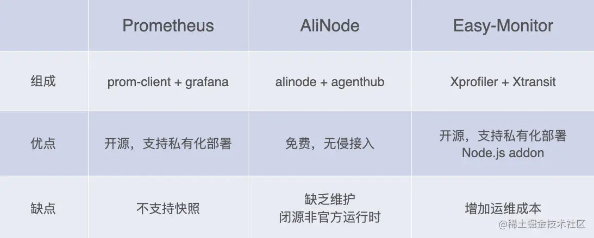

# Node 性能优化

## 性能指标

Node作为一门服务端语言，性能方面尤为重要，其衡量指标一般有如下：

* **CPU**
* **内存**：监控Node.js进程的内存使用情况，包括堆内存和非堆内存的分配和释放。
* **I/O**：
  *  **吞吐量（Throughput）**：表示在单位时间内处理的请求数量。较高的吞吐量表示应用程序能够处理更多的请求。

* **网络**
  * **请求响应时间（Response Time）**：衡量从客户端发送请求到服务器返回响应所需的时间。较低的响应时间通常表示更好的性能。
* **事件循环周期数（Event Loop Cycles）**：记录事件循环运行的周期数。较高的周期数可能表示应用程序存在过多的同步操作或阻塞。
* **错误率（Error Rate）**：记录应用程序中发生的错误数量和错误类型。较高的错误率可能表示存在代码错误或异常情况。

### CPU

CUP 指标：

* **CPU负载**：在某个时间段内，占用以及等待CPU的进程总数

* **CPU使用率**：示CPU在某个时间段内的使用情况。CPU使用率越高，表示CPU负载越重。等于`1 - 空闲CPU时间(idle time)/CPU总时间`

  * 这两个指标都是用来评估系统当前CPU的繁忙程度的量化指标

  * Node应用一般不会消耗很多的CPU,如果CPU占用率高，则表明应用存在很多同步操作，导致异步任务回调被阻塞

* **用户CPU时间（User CPU Time）**：表示应用程序在用户空间执行的CPU时间。它反映了应用程序自身的执行时间。

* **系统CPU时间（System CPU Time）**：表示应用程序在内核空间执行的CPU时间。它反映了应用程序与操作系统的交互和系统调用的时间。

* **空闲CPU时间（Idle CPU Time）**：表示CPU处于空闲状态的时间。较高的空闲CPU时间表示CPU资源未被充分利用。

* **上下文切换（Context Switching）**：表示从一个线程或进程切换到另一个线程或进程的次数。过多的上下文切换可能导致CPU资源浪费。

* **中断（Interrupts）**：表示发生的硬件中断次数。过多的中断可能会导致CPU资源被中断处理占用。

### 内存指标

内存是一个非常容易量化的指标。内存占用率是评判一个系统的内存瓶颈的常见指标。对于Node来说，内部内存堆栈的使用状态也是一个可以量化的指标。

* 内存监控指标：

  1. **堆内存使用量（Heap Memory Usage）**：表示Node.js进程中堆内存的使用情况，包括已分配的堆内存和当前使用的堆内存。

  1. **非堆内存使用量（Non-Heap Memory Usage）**：表示Node.js进程中非堆内存的使用情况，包括代码段、栈、堆栈等非堆内存的分配和使用。

  1. **内存泄漏（Memory Leaks）**：指应用程序中无法释放的内存，导致内存占用不断增加。内存泄漏可能导致应用程序的性能下降和内存溢出。

  1. **垃圾回收时间（Garbage Collection Time）**：指垃圾回收器对堆内存进行垃圾回收所需的时间。较长的垃圾回收时间可能导致应用程序的停顿和性能问题。

  1. **垃圾回收频率（Garbage Collection Frequency）**：指垃圾回收器执行垃圾回收的频率。频繁的垃圾回收可能表示堆内存过度使用或存在内存泄漏

* 内存监控：

  * **使用内置的内存监控工具**：Node.js提供了一些内置的工具来监控内存使用情况，如`process.memoryUsage()`方法可以获取当前进程的内存使用情况，包括堆内存和非堆内存的使用量。

    ```js
    // /app/lib/memory.js	
    const os = require('os');
    // 获取当前Node内存堆栈情况	
    const { rss, heapUsed, heapTotal } = process.memoryUsage();
    // 获取系统空闲内存	
    const sysFree = os.freemem();
    // 获取系统总内存		
    const sysTotal = os.totalmem();
    
    module.exports = {
      memory: () => {
        return {
          sys: 1 - sysFree / sysTotal,	// 系统内存占用率
          heap: heapUsed / headTotal,	// Node堆内存占用率
          node: rss / sysTotal,	// Node占用系统内存的比例
        }
      }
    }
    ```

    > * rss：表示node进程占用的内存总量 。
    >
    > * heapTotal ： 表示堆内存的总量 。
    >
    > *  heapused ： 实际堆内存的使用量。
    >
    > * external ： 外部程序的内存使用量 ， 包含Node核心的c+＋程序的内存使用量

在 Node 中，1个进程的最大内存容量为1.5GB 。因此我们需要减少内存泄露。

### 磁盘 IO

* 硬盘的 IO 开销是非常昂贵的硬盘 IO 花费的 CPU  时钟周期是内存的 164000 倍；内存 IO 比磁盘 IO 快非常多 ，所以使用内存缓存数据是有效的优化方法 。

* 常用的工具如 redis 、memcached 等
* 并不是所有数据都需要缓存 ，访问频率高 ，生成代价比较高的才考虑是否缓存 ，也就是说影响你性能瓶颈的考虑去缓存， 并且而且缓存还有缓存雪崩 、缓存穿透等问题要解决

磁盘IO监控指标：

1. **磁盘读取速度（Disk Read Speed）**：表示从磁盘读取数据的速度。较高的读取速度表示磁盘I/O性能较好。
2. **磁盘写入速度（Disk Write Speed）**：表示向磁盘写入数据的速度。较高的写入速度表示磁盘I/O性能较好。
3. **磁盘读取次数（Disk Read Count）**：表示从磁盘进行读取操作的次数。较多的读取次数可能表示频繁的磁盘I/O操作。
4. **磁盘写入次数（Disk Write Count）**：表示向磁盘进行写入操作的次数。较多的写入次数可能表示频繁的磁盘I/O操作。
5. **磁盘队列长度（Disk Queue Length）**：表示等待进行磁盘I/O操作的请求队列长度。较长的队列长度可能表示磁盘I/O负载过重。


## 性能监控

对于监控Node.js应用程序的性能，可以采取以下方法：

1. **使用内置的性能分析工具**：Node.js提供了一些内置的性能分析工具，如`console.time`和`console.timeEnd`来测量代码块的执行时间，`console.profile`和`console.profileEnd`来生成CPU分析报告。
2. **使用第三方性能监控工具**：有许多第三方工具可以帮助监控和分析Node.js应用程序的性能，如New Relic、AppDynamics、Datadog等。这些工具提供了更全面的性能监控和分析功能，包括请求响应时间、吞吐量、内存使用量等指标。
3. **使用内置的性能分析工具模块**：Node.js的`perf_hooks`模块提供了更高级的性能分析功能，如测量函数执行时间、跟踪事件循环延迟等。可以使用`performance.now()`来测量代码块的执行时间，使用`performance.eventLoopUtilization()`来获取事件循环的使用率。
4. **使用监控工具和平台**：使用监控工具和平台来收集和可视化Node.js应用程序的性能指标。例如，Grafana和Prometheus是流行的监控工具，可以与Node.js应用程序集成，收集和展示性能指标。
5. **日志分析**：通过分析应用程序的日志，可以观察性能问题和错误。可以记录关键事件、请求响应时间、错误信息等，并使用日志分析工具进行分析和可视化。

### 性能监控工具



**Prometheus**

- [prom-client](https://link.juejin.cn?target=https%3A%2F%2Fgithub.com%2Fsiimon%2Fprom-client)是prometheus的nodejs实现，用于采集性能指标
- [grafana](https://link.juejin.cn?target=https%3A%2F%2Fgithub.com%2Fgrafana%2Fgrafana)是一个可视化平台，用来展示各种数据图表，支持prometheus的接入
- 只支持了性能指标的采集和展示，排查问题还需要其他快照工具，才能组成闭环

**AliNode**

- alinode是一个兼容官方nodejs的拓展运行时，提供了一些额外功能：
  - v8的运行时内存状态监控
  - libuv的运行时状态监控
  - 在线故障诊断功能：堆快照、CPU Profile、GC Trace等
- [agenthub](https://link.juejin.cn?target=https%3A%2F%2Fgithub.com%2Faliyun-node%2Fagenthub)是一个常驻进程，用来收集性能指标并上报
  - 整合了[agentx](https://link.juejin.cn?target=https%3A%2F%2Fgithub.com%2Faliyun-node%2Fagentx) + [commdx](https://link.juejin.cn?target=https%3A%2F%2Fgithub.com%2Faliyun-node%2Fcommands)的便利工具
- 整体从监控，展示，快照，分析形成闭环，接入便捷简单，但是拓展运行时还是有风险

**[Easy-Monitor](https://link.juejin.cn?target=https%3A%2F%2Fgithub.com%2Fhyj1991%2Feasy-monitor)**

- [xprofiler](https://link.juejin.cn?target=https%3A%2F%2Fgithub.com%2FX-Profiler%2Fxprofiler) 负责进行实时的运行时状态采样，以及输出性能日志（也就是性能数据的抓取）
- [xtransit](https://link.juejin.cn?target=https%3A%2F%2Fgithub.com%2FX-Profiler%2Fxtransit) 负责性能日志的采集与传输
- 跟AliNode最大的区别在于使用了`Node.js Addon`来实现采样器

### easy-monitor

#### 参考资料

[easy-monitor](https://github.com/hyj1991/easy-monitor)

## 性能优化

Node 性能优化方案可以考虑以下几个方面：

* **使用最新版本Node.js**

  * 每个版本的性能提升主要来自于两个方面：

    * V8 的版本更新

    * Node.js 内部代码的更新优化

* **正确使用流 stream**:

  * 使用流的方式，无需一次性读取整个文件到内存中，而是以可控的速度逐块读取和发送数据，大大减少了内存占用

* **代码层面优化**：
  * 避免过多的循环嵌套、使用适当的数据结构和算法；
  * 避免频繁的对象创建和销毁等。

* **内存管理优化**:
  * 及时释放不再使用的资源、使用合适的内存缓存等，可以减少内存占用和垃圾回收的开销。
* **并发处理**：

  * Node.js天生支持异步和事件驱动的编程模型，利用其非阻塞I/O特性，可以实现高并发的处理能力。
  * 合理利用异步操作、事件驱动和回调函数，可以提高应用程序的并发性能。

* **缓存策略**：

  * 合理使用缓存可以减少重复计算和IO操作，提高数据访问的响应速度。
  * 对于频繁读取的数据，可以考虑使用内存缓存或外部缓存（如Redis）来加速访问。

* **数据库优化**：

  * 对于与数据库交互的操作，使用适当的索引、批量操作和合理的查询语句，可以提高数据库访问的效率。
  * 合并查询 ，将多次查询合并 —次 ，减少数据库的查询次数；
  * 合理管理数据库连接池，避免过多的连接创建和销毁。
* **并行计算和负载均衡**：

  * 对于需要进行大量计算的任务，可以考虑使用多线程或子进程进行并行计算，充分利用多核处理器的计算能力。
  * 对于高负载场景，可以考虑使用负载均衡来分摊请求压力。


### 正确使用流 stream

在 Node  中,很多对象都实现了流,对于1个大文件可以通过流的形式发送,不需要将其完全读入内存:

```js
   const http = require('http');
   const fs = require( 'fs');

   // bad
  http.createServer(function (req, res) {
      fs.readFile(__dirname + '/data.txt', function (err, data) {
           res.end(data);
       });
   });

   // good
  http.createServer(function (req, res) {
       const stream = fs.createReadStream(__dirname + '/data.txt');
       stream.pipe(res);
   });
```

> * 使用`readFile`方法将整个文件读入内存，然后将读取到的数据通过`res.end`方法发送给客户端。这种方式的问题在于，当文件很大时，会消耗大量的内存资源，特别是在高并发的情况下，可能会导致应用程序的内存占用过高，影响系统的稳定性和性能。
> * 使用`createReadStream`方法优势在于：
>   1. **内存效率**：使用流的方式，无需一次性读取整个文件到内存中，而是以可控的速度逐块读取和发送数据，大大减少了内存占用。
>   2. **性能和速度**：由于数据是边读边发送的，可以更快地开始向客户端发送数据，减少了等待时间和响应延迟。
>   3. **可伸缩性**：使用流的方式可以处理大文件和高并发的情况，因为在内存中只需要保存少量数据，不会因为文件大小而导致内存溢出。


### 数据库优化

* 合并查询，将多次查询合并 —次，减少数据库的查询次数

  ```js
  // bad: 循环遍历 ids 查询数据库                  
  for user_id in userIds
  	let account = user_account.findOne(user_id)  
  
  // good：一次性遍历，存储到map中，后从map中获取    
  const user_account_map = {}   // 注意这个对象将会消耗大量内存
   	user_account.find(user_id in  user_ids).forEach(account){
  		user_account_map[account.user_id] =  account
  	}
  for user_id in userIds
  	var account = user_account_map[user_id]
  ```

  

### 内存管理优化

在 V8 中 ， 主要将内存分为新生代和老生代两代：

* 新生代：  对象的存活时间较短 。新生对象或只经过一次垃圾回收的对象

* 老生代：  对象存活时间较长 。经历过一次或多次垃圾回收的对象

若新生代内存空间不够 ，直接分配到老生代

以下是一些内存管理优化方案：

1. **避免内存泄漏**：确保及时释放不再使用的对象和资源，避免对象引用链中存在未被回收的对象。注意在使用事件监听器、定时器和回调函数时，适时地取消注册，以避免潜在的内存泄漏。
2. **使用适当的数据结构**：选择合适的数据结构可以减少内存占用。例如，对于大量的键值对或缓存数据，可以使用Map或Set替代常规的对象或数组，以提高性能和内存效率。
3. **控制数据加载和处理**：对于处理大量数据的场景，使用流式处理、分块读取或分页查询等方式，避免一次性加载和处理大量数据，以减少内存压力。
4. **优化缓存策略**：合理使用缓存可以减少重复计算和IO操作，降低对内存的需求。使用适当的缓存策略和淘汰算法，根据数据的访问模式和频率来决定何时缓存、何时清理缓存。
5. **减少内存占用**： 如果有内存泄露 ，也会导致大量的对象存储到老生代中，服务器性能会大大降低
   * 节省内存最好的方式是使用池 ，其将频用 、可复用对象存储起来 ，减少创建和销毁操作
     * 例如有个图片请求接口，每次请求都需要用到类 。若每次都需要重新new这些类 ， 并不是很合适，在大量请求时，频繁创建和销毁这些类，造成内存抖动。
     * 使用对象池的机制， 对这种频繁需要创建和销毁的对象保存在一个对象池中 。每次用到该对象时就取对象池空闲的对象， 并对它进行初始化操作，从而提高框架的性能


## 参考资料

[一文了解Node.js性能监控](https://juejin.cn/post/7130162638922711071)