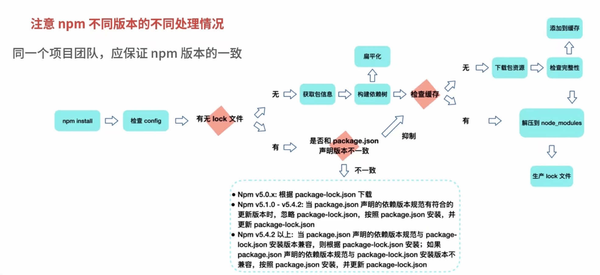
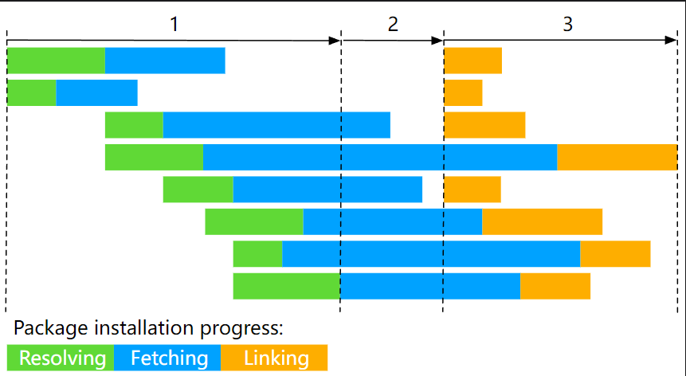
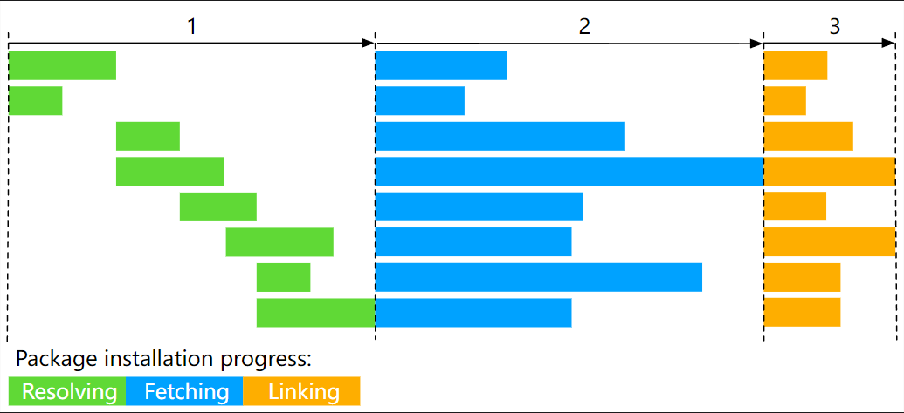
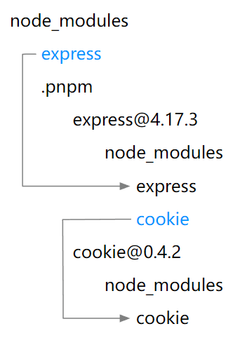

# NPM


## **`package.json` 文件**

> 关于 `package.json` 文件的详细配置信息可以参考官网：[package.json | npm 中文网 (nodejs.cn)](https://npm.nodejs.cn/cli/v10/configuring-npm/package-json)
>
> 以下介绍几个重要和易混淆的知识

### **常见属性**

**必须属性**: name、version

- name是项目的名称;
- version是当前项目的版本号;
- description是描述信息，很多时候是作为项目的基本描述，
- author是作者相关信息(发布时用到);
- license是开源协议(发布时用到);

**private 属性**:

- private属性记录当前的项目是否是私有的,当值为true时，npm是不能发布它的，这是防止私有项目或模块发布出去的方式

**engines 属性:**

- engines属性用于指定Node和NPM的版本号
- 在安装的过程中，会先检查对应的引擎版本，如果不符合就会报错，
- 事实上也可以指定所在的操作系统`"os":["darwin"，"linux"]`，只是很少用到;

**browserslist 属性：**

- 用于配置打包后的JavaScript浏览器的兼容情况，参考
- 否则我们需要手动的添加polyfils来让支持某些语法，也就是说它是为webpack等打包工具服务的一个属性

### **文件入口配置**

在`package.json`文件中，与入口相关的字段主要如下：

|  字段名   | 作用                                                         |
| :-------: | :----------------------------------------------------------- |
|  `main`   | 指定Node.js环境中模块的入口文件。当其他模块通过`require`引入这个包时，会加载此字段指定的文件。 |
| `browser` | 指定浏览器环境中模块的入口文件。当使用Webpack等打包工具时，它们会识别此字段，并据此处理模块。 |
| `module`  | 指定ES6模块的入口文件。当使用支持ES6模块的打包工具或环境时，会加载此字段指定的文件。这常用于支持tree shaking等高级特性。 |
| `esnext`  | 与`module`类似，但通常用于指定更现代的ES模块入口，可能包含实验性或尚未标准化的ES特性。 |
| `exports` | 提供一个更细粒度的入口点映射，允许定义不同条件下的导出文件。这可以用于替代`main`、`module`等字段，并提供更好的封装和兼容性。 |
|   `bin`   | 指定可执行文件的入口。如果包中包含可执行的命令行工具，可以通过此字段指定。 |

这些字段为开发者提供了灵活性，以支持不同的运行环境和使用场景。注意，不是所有的字段都需要在`package.json`中指定，具体取决于你的模块如何被使用以及目标环境是什么。而且，一些字段可能需要配合特定的工具或构建系统来使用。

以下是一个简单的`package.json`示例，其中包含了一些与入口相关的字段，以及它们的作用说明：

```json
{  
  "name": "my-package",  
  "version": "1.0.0",  
  "description": "A simple package with multiple entry points",  
  "main": "dist/main.js", // Node.js环境中的默认入口文件  
  "browser": "dist/browser.js", // 浏览器环境中的默认入口文件  
  "module": "src/index.mjs", // ES6模块的入口文件，支持tree shaking等特性  
  "exports": {  
    ".": "./dist/main.js", // 包的默认导出，相当于main字段  
    "./browser": "./dist/browser.js", // 指定browser字段的导出  
    "./module": "./src/index.mjs" // 指定module字段的导出  
  },  
  "bin": {  
    "my-cli": "./bin/my-cli.js" // 命令行工具的入口文件  
  },  
  "scripts": {  
    "build": "build-script" // 构建脚本，用于生成dist目录下的文件  
  },  
  "dependencies": {  
    // 依赖项...  
  },  
  "devDependencies": {  
    // 开发依赖项...  
  }  
}
```

在这个示例中：

- `main`字段指定了Node.js环境中模块的入口文件为`dist/main.js`。当其他Node.js模块通过`require('my-package')`引入这个包时，会加载`dist/main.js`文件。
- `browser`字段指定了浏览器环境中模块的入口文件为`dist/browser.js`。当使用支持此字段的打包工具（如Webpack）时，它们会加载这个文件而不是`main`字段指定的文件。
- `module`字段指定了ES6模块的入口文件为`src/index.mjs`。这意味着支持ES6模块的构建工具或环境会加载这个文件，并可以利用ES6模块的特性，如静态导入和tree shaking。
- `exports`字段提供了一个更细粒度的入口点映射。在这个例子中，它定义了包的默认导出（`.`对应`main`字段），以及特定的子路径导出（如`./browser`和`./module`）。这允许消费者精确地指定他们想要加载的模块版本。
- `bin`字段指定了`my-cli`这个命令行工具的入口文件为`bin/my-cli.js`。这意味着当用户全局安装这个包后，可以直接在命令行中运行`my-cli`命令。

请注意，这些字段的作用和如何使用它们取决于你的构建流程、目标环境以及使用的工具。在实际项目中，你可能需要根据你的具体需求来配置这些字段，并且可能需要配合构建脚本（如`scripts`字段中的`build`命令）来生成这些入口文件。


### **项目依赖**

> 项目依赖字段官方文档：[package.json | npm 中文网 (nodejs.cn)](https://npm.nodejs.cn/cli/v10/configuring-npm/package-json#dependencies)

#### **peerDependencies**

`peerDependencies` 用于指定一个库或框架所依赖的其他库或框架的版本范围。这些依赖项不是由当前项目直接安装的，而是由使用当前项目的其他项目来安装和管理。

`peerDependencies` 主要用于插件或库，这些插件或库需要与其他特定的库或框架一起使用。

例如：

```json
{
  "name": "tea-latte",
  "version": "1.3.5",
  "peerDependencies": {
    "tea": "2.x"
  }
}
```

这确保你的包 `tea-latte` 只能与主机包 `tea` 的第二个主要版本一起安装。`npm install tea-latte` 可能会产生以下依赖图：

```bash
├── tea-latte@1.3.5
└── tea@2.2.0
```

在 npm 版本 3 到 6 中，`peerDependencies` 不会自动安装，如果在树中发现无效版本的对等依赖，则会触发警告。从 npm v7 开始，默认安装 peerDependencies。

如果无法正确解析树，则尝试安装另一个具有冲突要求的插件可能会导致错误。出于这个原因，请确保你的插件要求尽可能广泛，而不是将其锁定到特定的补丁版本。

假设主机符合 [semver](https://semver.org/)，只有主机包主要版本的更改会破坏你的插件。因此，如果你使用过每个 1.x 版本的主机包，请使用 `"^1.0"` 或 `"1.x"` 来表达这一点。如果你依赖 1.5.2 中引入的功能，请使用 `"^1.5.2"`。

**注意**

在`package.json`文件中，`peerDependencies`用于声明当前包所依赖的其他包，并且这些依赖的包预期会在引用的项目中存在。与`dependencies`不同，放在`peerDependencies`中的依赖不会在当前的包中被下载或打包。相反，它们会使用引用项目中的依赖。

因此，**`package.json`文件中`peerDependencies`声明的依赖在打包时候不会被打包进项目**。它们仅仅是一个声明，告诉使用此包的项目开发者需要安装哪些其他包作为依赖。

此外，如果`peerDependencies`中声明的依赖在引用的项目中不存在，将会报错，因为该包依赖于这些peer依赖项来正常工作。所以，开发者在使用具有`peerDependencies`的包时，需要确保他们的项目中已经安装了这些依赖。


**示例**：

在 `element-plus` 中，将`vue`写入`peerDependencies`中：

```json
{
  "private": true,
  "packageManager": "pnpm@8.14.1",
  "workspaces": [
    "packages/*",
    "play",
    "docs"
  ],
  "scripts": {},
  "peerDependencies": {
    "vue": "^3.2.0"
  },
  "dependencies": {},
  "devDependencies": {}
}

```

将`vue`写入`peerDependencies`中而不是`dependencies`中的原因主要是：

1. **版本兼容性**：`element-plus`是一个为Vue 3设计的UI库。它依赖于特定版本的Vue 3。通过将Vue作为`peerDependency`，`element-plus`可以确保用户在自己的项目中安装适当版本的Vue，而不是由`element-plus`来决定Vue的版本。这样可以避免版本冲突，让开发者更灵活地管理他们的Vue版本。
2. **避免重复安装**：如果`element-plus`将Vue作为`dependency`包含在内，那么当开发者在自己的项目中安装`element-plus`时，Vue也会被安装为`element-plus`的一个子依赖。这可能导致Vue在开发者的项目中被多次安装，这不仅是资源的浪费，还可能引发一些难以调试的问题。
3. **清晰的依赖关系**：将Vue声明为`peerDependency`可以清晰地告诉开发者`element-plus`所依赖的Vue版本，从而帮助开发者管理他们的项目依赖。


#### **dependencies**

`dependencies`字段列出了项目运行所直接依赖的包。这些包是项目代码的一部分，通常用于实现项目的核心功能。当你使用npm或yarn安装一个项目时，`dependencies`中列出的包会被自动安装到项目的`node_modules`目录下。这些依赖包会被打包进最终的发布版本中，因此它们对于项目的运行是必需的。

#### **devDependencies**

`devDependencies` 字段列出了只在开发过程中需要的库和框架，例如测试工具、构建工具、代码格式化工具等。这些依赖项不会在生产环境中使用，因此在安装项目依赖时，可以使用 `--production` 标志来跳过它们。

**区别**

1. **安装时机**：`dependencies`中的包在安装项目时会被自动安装；而`peerDependencies`中的包则需要开发者手动安装。
2. **用途**：`dependencies`中的包是项目运行所必需的，它们会被打包进最终的发布版本中；而`peerDependencies`中的包则是为了满足某些特定的功能或API要求，它们不会被打包进你的项目的发布版本中。
3. **版本管理**：`dependencies`中的包由你的项目直接管理，你可以通过更新`package.json`中的版本号来升级或降级这些包；而`peerDependencies`中的包则由项目的使用者来管理，你的项目只是声明了对这些包的版本要求。

**选择 peerDependencies 还是 devDependencies ？**

如果某个包既是运行时的依赖（应该在 `peerDependencies` 中配置），又是开发时的依赖（应该在 `devDependencies` 中配置），那么应该只在 `peerDependencies` 中配置它。这样可以确保使用当前项目的其他项目能够正确地安装和管理这个包，同时避免在开发环境和生产环境中出现版本冲突或其他问题。

**构建项目和使用项目时的区别？**

在构建项目时，`dependencies`中的包会被包含进最终的构建产物中，因为它们是实现项目功能所必需的。而`peerDependencies`则不会被包含进构建产物中，因为它们是由项目的使用者来提供的。

在使用项目时，如果开发者没有安装`peerDependencies`中指定的包或安装的版本不符合要求，那么项目可能会在运行时出现错误或功能异常。因此，在使用一个项目之前，开发者需要确保已经安装了所有必需的`peerDependencies`，并且它们的版本满足项目的要求。

### **依赖版本管理**

npm 的包通常需要遵从semver版本规范:

- semver: https://semverorg/lang/zh-CN/
- npm semver: https://docs.npmis.com/misc/semver

semver 版本规范是X.Y.Z:

- X： 主版本号(major):当你做了不兼容的 API修改(可能不兼容之前的版本);
-  Y：次版本号(minor):当你做了向下兼容的功能性新增(新功能增加，但是兼容之前的版本)
- Z：修订号(patch):当你做了向下兼容的问题修正(没有新功能，修复了之前版本的bug);

`^`和`~`的区别:

- `x.y.z`:表示一个明确的版本号
- `^x.y.2`:表示x是保持不变的，y和z永远安装最新的版本
- `~x.y.z`:表示x和y保持不变的，z永远安装最新的版本;


### **workspaces**

> 官方文档：[workspaces | npm 中文网 (nodejs.cn)](https://npm.nodejs.cn/cli/v10/using-npm/workspaces)

工作区是一个通用术语，指的是 npm cli 中的一组功能，它支持在单个顶层根包中管理本地文件系统中的多个包。

这组功能弥补了从本地文件系统处理链接包的更加简化的工作流程。它作为 `npm install` 的一部分自动执行链接过程，并且无需手动使用 `npm link` 来添加对应符号链接到当前 `node_modules` 文件夹中的包的引用。

我们还将 `npm install` 期间自动符号链接的这些包称为单个工作区，这意味着它是在 [`package.json`](https://npm.nodejs.cn/cli/v10/configuring-npm/package-json#workspaces) `workspaces` 配置中显式定义的当前本地文件系统中的嵌套包。

**[定义工作区](https://npm.nodejs.cn/cli/v10/using-npm/workspaces#定义工作区)**

工作区通常通过 [`package.json`](https://npm.nodejs.cn/cli/v10/configuring-npm/package-json#workspaces) 文件的 `workspaces` 属性定义，例如：

```json
{
  "name": "my-workspaces-powered-project",
  "workspaces": ["packages/a"]
}
```

鉴于上述 `package.json` 示例位于当前工作目录 `.` 中，该目录包含一个名为 `packages/a` 的文件夹，该文件夹本身包含一个 `package.json`，定义了一个 Node.js 包，例如：

```bash
.
+-- package.json
`-- packages
   +-- a
   |   `-- package.json
```

在当前工作目录 `.` 中运行 `npm install` 后，预期的结果是文件夹 `packages/a` 将符号链接到当前工作目录的 `node_modules` 文件夹。

下面是一个帖子 `npm install` 示例，假设文件和文件夹的先前示例结构相同：

```bash
.
+-- node_modules
|  `-- a -> ../packages/a
+-- package-lock.json
+-- package.json
`-- packages
   +-- a
   |   `-- package.json
```

### **依赖项目的 workspaces**

在 `package.json` 文件的 `dependencies` 部分，`workspace:*` 是一个特殊的依赖标识符，它表示该依赖项来自当前项目的工作空间：

```json
//package.json
{
  "name": "@xw-ui/element-ui",
  "version": "1.0.0",
  "description": "二次封装 element-ui",

  "author": "Sewen",
  "license": "MIT",
  "peerDependencies": {
    "vue": "~2.6.0"
  },
  "dependencies": {
    "element-ui": "^2.15.6",
    "@xw-ui/hooks": "workspace:*", // 表示 @xw-ui/hooks 依赖项来自当前项目的工作空间
    "@xw-ui/shared": "workspace:*"
  },
  "devDependencies": {
    "vue": "~2.6.0",
    "vue-router": "3",
    "vue-template-compiler": "~2.6.0",
    "vite-plugin-vue2": "^2.0.1"
  }
}
```

**什么时候使用 `"workspace:*"`?**

当你有一个多包仓库（monorepo），并且希望在一个包的 `package.json` 文件中引用另一个包的本地版本时，你可以使用 `workspace:*` 语法。这允许你在本地环境中直接链接这些包，而不是从远程仓库安装它们。

这样做的好处是，你可以在开发过程中更容易地在包之间进行迭代和测试，因为你总是使用最新本地的更改。

在以上例子中：

```
"dependencies": {
  "antd": "^4.21.7",
  "@xw-ui/hooks": "workspace:*",
  "@xw-ui/shared": "workspace:*"
}
```

- `@xw-ui/hooks` 和 `@xw-ui/shared` 则是工作空间依赖。
- `workspace:*` 表示 pnpm 应该查找当前项目工作空间内的 `@xw-ui/hooks` 和 `@xw-ui/shared` 包，并使用它们的本地版本。

这意味着在你的项目结构中，应该有一个或多个目录包含了 `@xw-ui/hooks` 和 `@xw-ui/shared` 的实现。pnpm会自动处理这些依赖的链接，确保它们指向正确的本地位置，而不是远程 npm 仓库。

为了支持这种工作空间依赖，你的项目根目录的 `package.json` 文件中通常会有一个 `workspaces` 字段，它列出了包含可发布包的目录。例如：

```json
{
  "private": true,
  "workspaces": [
    "packages/*"
  ],
  // ... 其他字段
}
```

在这个例子中，`packages/*` 表示任何在 `packages/` 目录下的子目录都将被视为一个工作空间包。这意味着在 `packages/` 目录下的任何包都可以被其他包作为工作空间依赖来使用。


### **项目配置**

> 官方文档：[package.json | npm 中文网 (nodejs.cn)](https://npm.nodejs.cn/cli/v10/configuring-npm/package-json#配置)

项目配置字段为 `config`:

在`package.json`文件中，`config`字段是一个对象，用于存储应用程序或模块的配置信息。这些配置信息可以包含各种设置，如环境变量、命令行参数等，它们可以在项目的不同部分（如脚本、依赖项等）中被引用和使用。

`config`字段的主要作用是提供一个集中的地方来管理项目的配置信息，使得这些配置信息可以在整个项目中被方便地访问和使用。通过这样做，可以提高代码的可维护性和可重用性，减少配置信息的冗余和混乱。

举一个简单的例子，假设你有一个Node.js项目，它需要在不同的环境中运行（如开发环境、测试环境、生产环境）。每个环境可能需要不同的配置信息，比如数据库连接信息、API密钥等。你可以将这些配置信息存储在`package.json`的`config`字段中，并在项目的代码中引用它们。

下面是一个示例的`package.json`文件，其中包含了`config`字段：

```json
{  
  "name": "my-project",  
  "version": "1.0.0",  
  "config": {  
    "env": "development",  
    "database": {  
      "host": "localhost",  
      "port": 3306,  
      "username": "myuser",  
      "password": "mypassword"  
    },  
    "api": {  
      "key": "myapikey"  
    }  
  },  
  "scripts": {  
    "start": "node index.js"  
  },  
  "dependencies": {  
    // ... 项目依赖项 ...  
  }  
}
```

在上面的例子中，`config`字段包含了三个子字段：`env`、`database`和`api`。这些字段分别存储了环境信息、数据库连接信息和API密钥。在项目的代码中，你可以使用`process.env.npm_package_config_...`来访问这些配置信息。例如，你可以通过`process.env.npm_package_config_database_host`来获取数据库的主机名。

需要注意的是，虽然`config`字段在`package.json`中是可用的，但并非所有的Node.js工具或库都会自动解析和使用它。有些工具可能需要你通过特定的方式（如环境变量或命令行参数）来传递配置信息。因此，在使用`config`字段时，你需要确保你的项目所使用的工具或库支持该字段，并了解如何正确地引用和使用其中的配置信息。


### **npm script**

npm 允许在`package.json`文件里面，使用`scripts`字段定义脚本命令。

```json
{
	// ...
	"scripts": {
		"build": "node build.js"
	}
}
```

**npm script 执行方式**


原理

1. 每当执行`npm run`，就会自动新建一个 **Shell**，根据系统平台而不同，如 macos 或 Linux 中指代的是 `/bin/sh`，在Windows 中使用的是 `cmd.exe`

2. `npm run `新建的这个 Shell，会将当前目录的 `node_modules/.bin` 子目录加入`PATH`变量
3. 执行结束后，再将`PATH`变量恢复原样。

在全局模式下，可执行文件链接到 Unix 上的 `{prefix}/bin`，或直接链接到 Windows 上的 `{prefix}`。确保路径在终端的 `PATH` 环境中以运行它们。

在本地模式下，可执行文件被链接到 `./node_modules/.bin`，以便它们可用于通过 npm 运行的脚本。（例如，当你运行 `npm test` 时，测试运行程序将在路径中。）

**npm run 创建出来的 Shell 有什么特别之处?**

当前目录的`node_modules/.bin`子目录里面的所有脚本，都可以直接用脚本名调用，而不必加上完整路径。

比如，当前项目的依赖里面有 webpack，只要直接写`npm run build `就可以了。

```shell
"build": "webpack --config webpack.config.js"
```

而不用写成下面这样:

```js
"build": "./node_modules/.bin/webpack  --config webpack.config.js"
```

由于 npm 脚本的唯一要求就是可以在 Shell 执行，因此它不一定是 Node 脚本，任何可执行文件都可以写在里面。

npm 脚本的退出码，也遵守 Shell 脚本规则。如果退出码不是`0`，npm 就认为这个脚本执行失败

npm scripts 脚本可以使用 Shell通配符等常规能力

> 示例：
>
> 1. 在使用 webpack 构建的项目中，使用 webpack 命令即可对项目进行打包，如下图，使用 `npm run start` 命令执行时，会执在shell 脚本中执行 `webpack --config webpack.config.js`：
>    
>
> 2. 当执行 `webpack --config` 命令时，实际上执行 `./node_modules/.bin/webpack` shell 脚本:
> 3. 执行该脚本时候，会将当前目录的`node_modules/.bin`子目录加入`PATH`变量，因此 shell 直接执行 webpack 命令，会直接执行 `./node_modules/.bin/webpack` shell 脚本。

**应用**

在项目，可以添加多个命令脚本，执行 `npm run 命令` 的方式执行不同的脚本


#### **npm 钩子**

在 npm（Node Package Manager）中，钩子（hooks）是一种在特定生命周期事件发生时自动运行的脚本。这些生命周期事件包括安装、更新、测试等阶段，它们允许开发者在这些关键点执行自定义命令或脚本。通过钩子，开发者可以扩展 npm 的功能，满足特定项目或工作流程的需求。

npm 的生命周期脚本主要定义在 `package.json` 文件的 `scripts` 字段中。

以下是一些常用的 npm 钩子及其描述：

1. **preinstall 和 install 和 postinstall**
   - `preinstall`：在包安装之前运行。
   - `install`：实际安装包时运行。
   - `postinstall`：在包安装之后运行。这通常用于编译代码、安装依赖项或其他需要在包安装完成后执行的任务。
2. **prepublish 和 prepare 和 postpublish**
   - `prepublish`：在包发布之前运行。注意，这个钩子在 npm 5.0.0 之后的行为有所变化，现在它仅在 `npm publish` 命令中运行，而不是在 `npm install` 时。
   - `prepare`：在 `npm publish` 和 `npm install`（如果安装了本地包）之前运行。这通常用于构建或准备要发布的包。
   - `postpublish`：在包发布之后运行。
3. **preuninstall 和 uninstall**
   - `preuninstall`：在包卸载之前运行。
   - `uninstall`：实际卸载包时运行。
4. **prestart 和 start**
   - `prestart`：在 `npm start` 命令之前运行。
   - `start`：定义运行项目的命令。
5. **pretest 和 test**
   - `pretest`：在 `npm test` 命令之前运行。
   - `test`：定义运行测试的命令。
6. **prestop 和 stop**
   - `prestop`：在 `npm stop` 命令之前运行。
   - `stop`：定义停止项目的命令。

此外，还有一些其他钩子，如 `preversion`、`version` 和 `postversion`，它们在版本更改时运行。

使用这些钩子，你可以轻松地在 npm 生命周期的特定阶段执行自定义任务。例如，你可以使用 `postinstall` 钩子来自动编译项目的前端资源，或者在 `prepublish` 钩子中运行 lint 检查和测试。

要在 `package.json` 中使用这些钩子，只需在 `scripts` 字段中添加相应的命令即可。例如：

```json
{  
  "name": "my-project",  
  "version": "1.0.0",  
  "scripts": {  
    "preinstall": "echo 'Running pre-install script...'",  
    "install": "echo 'Installing dependencies...'",  
    "postinstall": "echo 'Dependencies installed successfully.'",  
    "start": "node index.js"  
  }  
}
```

这样，当你运行 `npm install` 时，`preinstall`、`install` 和 `postinstall` 脚本将按顺序执行。


### **注意**

- `name` 会作为参数传递给`require()`


## **package-lock.json 文件**

`package-lock.json` 文件是npm的一部分，主要用于确保在安装依赖时的一致性。

它存储了一个**精确的、版本化的依赖树**，而不是像`package.json`那样使用星号版本（例如 1.0.*）。

当开发者在开发环境中安装依赖时，`package-lock.json`会锁定所有依赖包的版本，确保在其他开发者或部署环境中，依赖包的版本与开发环境一致。


此外，npm的`package-lock.json`文件还具有以下特点：

1. **锁定安装时的包的版本号**：在开发过程中，当需要更新某个包时，开发者通常会先删除`node_modules`文件夹和`package-lock.json`文件，然后重新运行`npm install`。这样可以确保所有的包都是最新的版本。但是，这种做法在团队协作中可能会带来问题，因为不同的开发者可能安装了不同版本的依赖包，从而导致一些未预期的问题。通过使用`package-lock.json`文件，可以确保每个开发者都在相同的环境下工作，减少了潜在的问题。
2. **锁定完整依赖树的版本**：与`package.json`只包含直接依赖项不同，`package-lock.json`可以锁定整个依赖树的版本。这意味着不仅直接依赖项的版本被锁定，间接依赖项的版本也可以被锁定。这种机制使得开发者可以更加准确地控制他们的项目依赖，避免了在不同环境下出现版本不一致的问题。
3. **描述依赖关系树的单一表示**：`package-lock.json`文件描述了生成的确切树，以便后续安装能够生成相同的树，而不管中间依赖项更新如何。这有助于确保团队成员、部署和持续集成安装完全相同的依赖关系。
4. 提供“时间旅行”到`node_modules`先前状态的工具：通过使用`package-lock.json`文件，可以很容易地查看node_modules先前的状态。这使得在遇到问题时，开发者可以轻松地回滚到先前的版本，或者在不同的版本之间进行比较，找出问题的根源。

总的来说，`package-lock.json`文件为npm提供了一种机制，以确保开发环境和部署环境中的依赖包版本一致性，并帮助开发者更好地管理他们的项目依赖。




**参考资料**

[package.json | npm 中文网 (nodejs.cn)](https://npm.nodejs.cn/cli/v10/configuring-npm/package-json)

## **参考资料**

[npm 中文网 (nodejs.cn)](https://npm.nodejs.cn/)

[NPM 文档丨阿西河 (axihe.com)](https://www.axihe.com/api/npm/api/api.html)

[使用vue在npm上发布自己的ui组件包](https://blog.csdn.net/weixin_44003190/article/details/90713012)

# **pnpm**

## **是什么**

pnpm是一个流行的JavaScript包管理器，类似于npm和yarn。它是“performant npm”的缩写，旨在成为一个更高效的npm替代品。

pnpm通过使用内容寻址存储来避免相同包在不同项目中的重复下载和存储，从而节省磁盘空间并加速安装过程。

> pnpm 官方文档：[Fast, disk space efficient package manager | pnpm](https://pnpm.io/zh/)

## **为什么？**

PNPM相对于NPM有以下几个优势：

### **高效的存储空间使用**

* PNPM使用称为“**内容寻址存储**”的机制来存储npm包，这意味着即使多个项目使用相同的包，该包在磁盘上也只存储一次。

  

  > 使用 NPM和Yarn 时，依赖每次被不同的项目使用，都会重复安装一次，会在每个项目的node_modules目录中分别存储一份副本。
  >
  > 而在使用 pnpm 时，依赖会被存储在内容可寻址的存储中，所以：
  >
  > 1. 如果你用到了某依赖项的不同版本，只会将不同版本间有差异的文件添加到仓库。 例如，如果某个包有100个文件，而它的新版本只改变了其中1个文件。那么 `pnpm update` 时只会向存储中心额外添加1个新文件，而不会因为仅仅一个文件的改变复制整新版本包的内容。
  > 2. 所有文件都会存储在硬盘上的某一位置。 当软件包被被安装时，包里的文件会硬链接到这一位置，而不会占用额外的磁盘空间。 这允许你跨项目地共享同一版本的依赖。
  >
  > 因此，您在磁盘上节省了大量空间，这与项目和依赖项的数量成正比，并且安装速度要快得多！

  

### **更快的安装速度**

pnpm 分三个阶段执行安装：

1. 依赖解析。 仓库中没有的依赖都被识别并获取到仓库。
2. 目录结构计算。 `node_modules` 目录结构是根据依赖计算出来的。
3. 链接依赖项。 所有以前安装过的依赖项都会直接从仓库中获取并链接到 `node_modules`。PNPM只是从全局存储中链接它们。



npm / yarn 等通常通过三阶段安装过程，三个阶段串行执行（解析、获取和将所有依赖项写入`node_modules`）快得多。




### **非扁平的 node_modules 目录**

> **什么是扁平的 node_modules 目录**

当使用npm或Yarn安装一个包时，它们会下载该包及其依赖项，并将它们放在`node_modules`目录中。

这个目录的结构通常是平铺的，所有的包都被提升到模块目录的根目录，意味着所有的包都被直接放在该目录下，而不是按照它们之间的依赖关系进行嵌套。这种平铺的结构使得项目中的代码可以直接访问到这些包，而无需担心依赖关系的嵌套结构。

这种平铺结构有助于简化依赖管理，但也可能会导致一些问题。例如，不同的包可能依赖于相同的其他包，但版本不同。在这种情况下，npm和Yarn会尝试解决这些依赖冲突，以确保每个包都使用其所需的正确版本。然而，这有时可能会导致一些难以预料的问题，特别是在大型项目中，依赖关系可能变得非常复杂。


> **为什么 npm3 需要开始在 v3 中使用平铺的 node_modules ？**

npm3选择使用平铺的`node_modules`结构是为了解决npm2中存在的一些问题，提高性能、简化依赖管理，并更好地控制依赖包的版本。这种改变使得npm在依赖管理方面更加成熟和健壮。

npm3选择使用平铺的`node_modules`结构主要有以下几个原因：

1. **性能优化**：在npm2及之前的版本中，依赖项是以树状层级关系安装的。这意味着如果两个模块依赖于相同的第三方包，但是版本不同，那么该包会被重复安装多次，造成磁盘空间的浪费。npm3通过平铺结构解决了这个问题，使得相同的包只会被安装一次，从而节省了磁盘空间并提高了性能。
2. **依赖扁平化**：平铺的`node_modules`结构使得依赖关系更加扁平化，减少了嵌套的层级。这有助于简化依赖管理，减少了依赖冲突的可能性，并使得项目更加健壮和可维护。
3. **更好的版本控制**：npm3通过使用平铺结构，可以更好地控制和管理依赖包的版本。它使用了一种称为“确定性安装”的技术，确保每次安装依赖项时都会获得相同的结果。这有助于减少因依赖版本不一致而导致的问题。

> **pnpm 采用哪种模式管理 node_modules 目录？**

pnpm 采用非扁平的 node_modules 目录。

默认情况下，pnpm 使用符号链接将项目的直接依赖项添加到模块目录的根目录中。



### **严格的依赖处理**

* PNPM创建一个严格的node_modules目录，确保项目不会意外地访问未声明的包。这与传统的NPM和Yarn处理依赖的方式不同，有助于避免隐藏的依赖问题，使项目更加清晰易管理。

### **支持多包仓库**

* PNPM原生支持多包仓库(monorepos)，这是在单个仓库中管理多个包的一种方法，类似于Yarn workspaces。这使得PNPM方便管理多个项目之间的依赖关系。

### **安全性**

* 与Yarn一样，PNPM有一个包含所有已安装包校验和的特殊文件，用于在执行代码之前验证每个已安装包的完整性。这有助于确保依赖项没有被篡改或损坏，从而提高项目的安全性。

综上所述，PNPM相对于NPM具有更高的存储效率、更快的安装速度、更严格的依赖处理、支持多包仓库以及更高的安全性等优势。这些优势使得PNPM成为一个更高效的npm替代品，尤其适用于大型项目或需要管理多个项目的场景。


## 功能比较

| 功能                     | pnpm                          | Yarn                 | npm                     |
| ------------------------ | ----------------------------- | -------------------- | ----------------------- |
| 工作空间支持（monorepo） | ✔️                             | ✔️                    | ✔️                       |
| 隔离的 `node_modules`    | ✔️ - 默认                      | ✔️                    | ✔️                       |
| 提升的 `node_modules`    | ✔️                             | ✔️                    | ✔️ - 默认                |
| 自动安装 peers           | ✔️                             | ❌                    | ✔️                       |
| Plug'n'Play              | ✔️                             | ✔️ - 默认             | ❌                       |
| 零安装                   | ❌                             | ✔️                    | ❌                       |
| 修补依赖项               | ✔️                             | ✔️                    | ❌                       |
| 管理 Node.js 版本        | ✔️                             | ❌                    | ❌                       |
| 有锁文件                 | ✔️ - `pnpm-lock.yaml`          | ✔️ - `yarn.lock`      | ✔️ - `package-lock.json` |
| 支持覆盖                 | ✔️                             | ✔️ - 通过 resolutions | ✔️                       |
| 内容可寻址存储           | ✔️                             | ❌                    | ❌                       |
| 动态包执行               | ✔️ - 通过 `pnpm dlx`           | ✔️ - 通过 `yarn dlx`  | ✔️ - 通过 `npx`          |
| 辅助缓存                 | ✔️                             | ❌                    | ❌                       |
| 列出许可证               | ✔️ - 通过 `pnpm licenses list` | ✔️ - 通过插件         | ❌                       |


## **常见操作**

### 将已安装的软件包替换为本地版本

假设您有一个使用 `foo` 包的项目。 您想要对 `foo` 进行更改并在你的项目中测试它们。 在这种情况下，您可以使用 `pnpm link` 将本地版本的 `foo` 链接到您的项目，而 `package.json` 不会被修改。

> 使用 `pnpm link` 命令，手册：[pnpm link | pnpm](https://pnpm.io/zh/cli/link#pnpm-link-dir)

#### **方案一**

1. 进入`foo` 包的项目，使用 `pnpm link --global` ，此操作将 foo 包项目链接到全局的`node_modules`。

   > `pnpm link --global`:将此命令在执行的位置或通过`–dir`选项指定的位置链接到全局的`node_modules`，这样它就可以通过`pnpm link --global <pkg>`从另一个软件包中引用。 此外，如果软件包具有`bin`字段，则软件包的二进制文件将在系统范围内可用。

2. 进入你的项目目录，使用 `pnpm link --global foo` 将指定的包（`<pkg>`）从全局 `node_modules` 链接到你项目中的 `package` 的 `node_modules`。

   > `pnpm link --global <pkg>`: 将指定的包（`<pkg>`）从全局 `node_modules` 链接到 `package` 的 `node_modules`，从该 `package` 中执行或通过 `--dir` 选项指定。

示例代码：

```shell
cd ~/projects/foo # 进入 foo 项目目录
pnpm install # 安装 foo 项目依赖
pnpm link --global # 将 foo 连接到全局的 node_modules
cd ~/projects/my-project # 进入你的项目目录
pnpm link --global foo # 连接全局的项目依赖 foo 到你的项目的 node_modules
```

#### **方案二**

直接将 foo 连接到你项目中的 `node_modules`，而不是使用全局 `node_modules` 文件夹：

```shell
cd ~/projects/foo # 进入 foo 你的项目
pnpm install # 安装 foo 项目依赖
cd ~/projects/my-project # 进入你的项目
pnpm link ~/projects/foo # 连接 foo 项目到你的项目中的 node_modules
```

