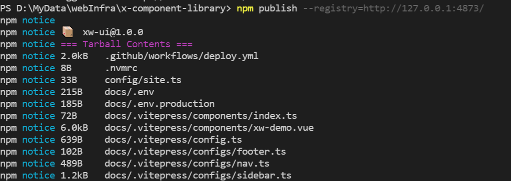
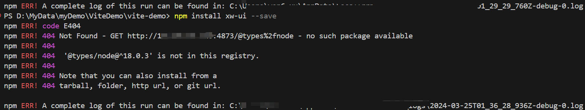

# **搭建私有NPM仓库**

## **代码共享方案**

方式一：上传到GitHub上、其他程序员通过GitHub下载我们的代码手动的引用

- 缺点是大家必须知道你的代码GitHub的地址，并且从GitHub上手动下载:
- 需要在自己的项目中手动的引用，并且管理相关的依赖;
- 不需要使用的时候，需要手动来删除相关的依赖;
- 当遇到版本升级或者切换时，需要重复上面的操作;
- 上面的方式是有效的，但是这种传统的方式非常麻烦，并且容易出错；

方式二:使用一个专业的工具来管理我们的代码

- 口我们通过工具将代码发布到特定的位置
- 其他程序员直接通过工具来安装、升级、删除我们的工具代码

## **使用私服下载原理**


**参考资料**

[Uplinks | Verdaccio](https://verdaccio.org/docs/uplinks/)

## **搭建私有npm方案**

搭建私有npm的方案有多种:

|           方案           |                  描述                  |                             优点                             |                             缺点                             |
| :----------------------: | :------------------------------------: | :----------------------------------------------------------: | :----------------------------------------------------------: |
|      使用Verdaccio       | 基于Node.js创建的企业级npm私有仓库程序 | 1. 安装和配置简单<br>2. 支持Windows和Linux系统<br>3. 100%向后兼容Sinopia |        1. 功能相对基础，可能不满足大型企业的复杂需求         |
| 使用cnpm+mysql部署服务器 |  结合cnpm和mysql数据库搭建私有npm仓库  | 1. 提供了较为完善的包管理和发布功能<br>2. 可利用mysql进行数据存储和查询优化 |       1. 部署和配置相对复杂<br>2. 需要维护数据库服务器       |
|       使用Git+SSH        |     通过Git仓库和SSH协议管理npm包      |      1. 利用Git的版本控制功能<br>2. 灵活性和可扩展性强       | 1. 配置和使用相对复杂<br>2. 不支持npm的语义化版本规范（semver）<br>3. 无法直接通过npm命令进行包的安装和更新 |
|       付费购买服务       |    购买第三方提供的私有npm仓库服务     |      1. 功能完善，易于使用<br>2. 通常提供技术支持和维护      |    1. 需要支付费用<br>2. 可能受限于服务提供商的规定和限制    |

需要注意的是，不同的方案可能适用于不同的场景和需求。在选择搭建私有npm的方案时，应根据实际情况进行权衡和选择。例如，对于小型企业或个人开发者，使用Verdaccio可能是一个简单且实用的选择；而对于大型企业或需要更多高级功能的情况，可能需要考虑使用更复杂的方案或购买专业服务。


### **使用Verdaccio搭建私有npm**

搭建verdaccio提供了

* docker镜像
* pm2部署

#### **docker镜像**

1.  拉取verdaccio docker镜像:

   ```dockerfile
   docker pull verdaccio/verdaccio
   ```

2. 运行 docker 镜像：

   ```dockerfile
   docker run -d --name verdaccio -p 4873:4873  verdaccio/verdaccio
   ```

> 这条命令的作用是：使用 Docker 在后台长期运行 Verdaccio:
>
> - **`-d`**（或 `--detach`）：在后台运行容器，并返回容器 ID。这样，您可以在不阻塞终端的情况下启动容器。
>- **`--name verdaccio`**：为容器指定一个名称，便于后续管理。
> - **`-p 4873:4873`**：将宿主机的 4873 端口映射到容器的 4873 端口，这样您就可以通过宿主机的这个端口来访问 Verdaccio 服务。
>- **`verdaccio/verdaccio`**：指定要使用的 Docker 镜像。
> 
>使用上述命令启动的 Verdaccio 容器将在后台运行，并且不会因为退出而自动删除。您可以随时使用 `docker ps` 命令来查看正在运行的容器，包括这个 Verdaccio 容器。如果需要停止或删除这个容器，您可以使用 `docker stop verdaccio` 和 `docker rm verdaccio` 命令。


#### 将配置文件夹映射到宿主系统

为了防止容器被删除后导致系统数据被删除，需要将容器的配置文件夹映射到宿主系统

```shell
# 在宿主系统创建文件夹
mkdir -p /docker/verdaccio
cd docker/verdaccio
# 创建配置文件夹，插件文件夹和存储文件夹
mkdir conf && mkdir plugins && mkdir storage

# 创建配置文件 config.yaml 
cd conf

# 启动一个容器，进入容器中，将容器中的 Config.yaml 文件复制出来
docker run -d --name verdaccio -p 4873:4873  verdaccio/verdaccio
# 查看容器id
docker ps -a
# 进入容器
docker exec -it  <容器名称或ID> /bin/sh
# 以管理员身份进入容器 -u 0参数表示以管理员身份（即root用户）进入容器
docker exec -u 0 -it <容器名称或ID> /bin/bash
# 查找容器的 config.yaml 文件
find /-name config.yaml
# 进入容器中 config.yaml 目录，检查是否有 congfig.yaml 
cd /verdaccio/conf
ls -a
# 检查配置文件内容
cat config.yaml
# 退出容器
exit 
# 将容器的配置文件复制到宿主机
docker cp 容器id:/verdaccio/conf/config.yaml /home/app_webadmin/docker/verdaccio/conf/
# 检查宿主机是否复制成功
cd /home/app_webadmin/docker/verdaccio/conf/
ls -a
# 修改文件夹权限
sudo chmod -R 777 config.yaml

# 重新运行容器，没有容器将自动拉取镜像并运行
docker run -d --name verdaccio -p 4873:4873 -v /home/app_webadmin/docker/verdaccio/conf/config.yaml:/verdaccio/conf/config.yaml -v /home/app_webadmin/docker/verdaccio/storage:/verdaccio/storage  -v /home/app_webadmin/docker/verdaccio/plugins:/verdaccio/plugins  verdaccio/verdaccio

# 如果出现错误，查看日志
docker logs verdaccio
```

`config.yaml`配置文件:

```shell
#
# This is the default configuration file. It allows all users to do anything,
# please read carefully the documentation and best practices to
# improve security.
#
# Do not configure host and port under `listen` in this file
# as it will be ignored when using docker.
# see https://verdaccio.org/docs/en/docker#docker-and-custom-port-configuration
#
# Look here for more config file examples:
# https://github.com/verdaccio/verdaccio/tree/5.x/conf
#
# Read about the best practices
# https://verdaccio.org/docs/best

# path to a directory with all packages
storage: /verdaccio/storage/data
# path to a directory with plugins to include
plugins: /verdaccio/plugins

# https://verdaccio.org/docs/webui
web:
  title: Verdaccio
  # comment out to disable gravatar support
  # gravatar: false
  # by default packages are ordercer ascendant (asc|desc)
  # sort_packages: asc
  # convert your UI to the dark side
  # darkMode: true
  # html_cache: true
  # by default all features are displayed
  # login: true
  # showInfo: true
  # showSettings: true
  # In combination with darkMode you can force specific theme
  # showThemeSwitch: true
  # showFooter: true
  # showSearch: true
  # showRaw: true
  # showDownloadTarball: true
  #  HTML tags injected after manifest <scripts/>
  # scriptsBodyAfter:
  #    - '<script type="text/javascript" src="https://my.company.com/customJS.min.js"></script>'
  #  HTML tags injected before ends </head>
  #  metaScripts:
  #    - '<script type="text/javascript" src="https://code.jquery.com/jquery-3.5.1.slim.min.js"></script>'
  #    - '<script type="text/javascript" src="https://browser.sentry-cdn.com/5.15.5/bundle.min.js"></script>'
  #    - '<meta name="robots" content="noindex" />'
  #  HTML tags injected first child at <body/>
  #  bodyBefore:
  #    - '<div id="myId">html before webpack scripts</div>'
  #  Public path for template manifest scripts (only manifest)
  #  publicPath: http://somedomain.org/

# https://verdaccio.org/docs/configuration#authentication
auth:
  htpasswd:
    file: /verdaccio/storage/htpasswd
    # Maximum amount of users allowed to register, defaults to "+infinity".
    # You can set this to -1 to disable registration.
    # max_users: 1000
    # Hash algorithm, possible options are: "bcrypt", "md5", "sha1", "crypt".
    # algorithm: bcrypt # by default is crypt, but is recommended use bcrypt for new installations
    # Rounds number for "bcrypt", will be ignored for other algorithms.
    # rounds: 10

# https://verdaccio.org/docs/configuration#uplinks
# a list of other known repositories we can talk to
uplinks:
  npmjs:
    url: https://registry.npmjs.org/
  yarn: 
    url: https://registry.yarnpkg.com/
  taobao:
    url: https://registry.npm.taobao.org/

# Learn how to protect your packages
# https://verdaccio.org/docs/protect-your-dependencies/
# https://verdaccio.org/docs/configuration#packages
packages:
  '@*/*':
    # scoped packages
    access: $all
    publish: $authenticated
    unpublish: $authenticated
    proxy: npmjs taobao

  '**':
    # allow all users (including non-authenticated users) to read and
    # publish all packages
    #
    # you can specify usernames/groupnames (depending on your auth plugin)
    # and three keywords: "$all", "$anonymous", "$authenticated"
    access: $all

    # allow all known users to publish/publish packages
    # (anyone can register by default, remember?)
    publish: $authenticated
    unpublish: $authenticated

    # if package is not available locally, proxy requests to 'npmjs' registry
    proxy: npmjs taobao

# To improve your security configuration and  avoid dependency confusion
# consider removing the proxy property for private packages
# https://verdaccio.org/docs/best#remove-proxy-to-increase-security-at-private-packages

# https://verdaccio.org/docs/configuration#server
# You can specify HTTP/1.1 server keep alive timeout in seconds for incoming connections.
# A value of 0 makes the http server behave similarly to Node.js versions prior to 8.0.0, which did not have a keep-alive timeout.
# WORKAROUND: Through given configuration you can workaround following issue https://github.com/verdaccio/verdaccio/issues/301. Set to 0 in case 60 is not enough.
server:
  keepAliveTimeout: 60
  # Allow `req.ip` to resolve properly when Verdaccio is behind a proxy or load-balancer
  # See: https://expressjs.com/en/guide/behind-proxies.html
  # trustProxy: '127.0.0.1'

# https://verdaccio.org/docs/configuration#offline-publish
# publish:
#   allow_offline: false

# https://verdaccio.org/docs/configuration#url-prefix
# url_prefix: /verdaccio/
# VERDACCIO_PUBLIC_URL='https://somedomain.org';
# url_prefix: '/my_prefix'
# // url -> https://somedomain.org/my_prefix/
# VERDACCIO_PUBLIC_URL='https://somedomain.org';
# url_prefix: '/'
# // url -> https://somedomain.org/
# VERDACCIO_PUBLIC_URL='https://somedomain.org/first_prefix';
# url_prefix: '/second_prefix'
# // url -> https://somedomain.org/second_prefix/'

# https://verdaccio.org/docs/configuration#security
# security:
#   api:
#     legacy: true
#     jwt:
#       sign:
#         expiresIn: 29d
#       verify:
#         someProp: [value]
#    web:
#      sign:
#        expiresIn: 1h # 1 hour by default
#      verify:
#         someProp: [value]

# https://verdaccio.org/docs/configuration#user-rate-limit
# userRateLimit:
#   windowMs: 50000
#   max: 1000

# https://verdaccio.org/docs/configuration#max-body-size
# max_body_size: 10mb

# https://verdaccio.org/docs/configuration#listen-port
# listen:
# - localhost:4873            # default value
# - http://localhost:4873     # same thing
# - 0.0.0.0:4873              # listen on all addresses (INADDR_ANY)
# - https://example.org:4873  # if you want to use https
# - "[::1]:4873"                # ipv6
# - unix:/tmp/verdaccio.sock    # unix socket

# The HTTPS configuration is useful if you do not consider use a HTTP Proxy
# https://verdaccio.org/docs/configuration#https
# https:
#   key: ./path/verdaccio-key.pem
#   cert: ./path/verdaccio-cert.pem
#   ca: ./path/verdaccio-csr.pem

# https://verdaccio.org/docs/configuration#proxy
# http_proxy: http://something.local/
# https_proxy: https://something.local/

# https://verdaccio.org/docs/configuration#notifications
# notify:
#   method: POST
#   headers: [{ "Content-Type": "application/json" }]
#   endpoint: https://usagge.hipchat.com/v2/room/3729485/notification?auth_token=mySecretToken
#   content: '{"color":"green","message":"New package published: * {{ name }}*","notify":true,"message_format":"text"}'

middlewares:
  audit:
    enabled: true

# https://verdaccio.org/docs/logger
# log settings
log: { type: stdout, format: pretty, level: http }
#experiments:
#  # support for npm token command
#  token: false
#  # enable tarball URL redirect for hosting tarball with a different server, the tarball_url_redirect can be a template string
#  tarball_url_redirect: 'https://mycdn.com/verdaccio/${packageName}/${filename}'
#  # the tarball_url_redirect can be a function, takes packageName and filename and returns the url, when working with a js configuration file
#  tarball_url_redirect(packageName, filename) {
#    const signedUrl = // generate a signed url
#    return signedUrl;
#  }

# translate your registry, api i18n not available yet
# i18n:
# list of the available translations https://github.com/verdaccio/verdaccio/blob/master/packages/plugins/ui-theme/src/i18n/ABOUT_TRANSLATIONS.md
#   web: en-US

```


#### **pm2 部署**

## **nrm**

[nrm](https://link.juejin.cn/?target=https%3A%2F%2Fgithub.com%2FPana%2Fnrm)（NPM registry manager）是 npm 的镜像源管理工具，使用它可以快速切换 npm 源。

基本使用：

**添加源**

适用于企业内部定制的私有源，`<registry>` 表示源名称，`<url>` 表示源地址。

```shell
nrm add <registry> <url>
```

**使用源**

```
nrm use <registry>
```

**删除源**

```shell
nrm del <registry>
```

**测试源的响应时间**

```shell
nrm test <registry>
```


**参考资料**

[Pana/nrm: NPM registry manager, fast switch between different registries: npm, cnpm, nj, taobao (github.com)](https://github.com/Pana/nrm)

[搭建属于自己的私有npm库 - 掘金 (juejin.cn)](https://juejin.cn/post/6983945466694074382)

## 发布 npm 包

### **发布npm包到私有Verdaccio仓库**

首先，确保你已经安装并正确配置了Verdaccio。你可以在本地机器上安装它，或者在一个服务器上安装，以便于团队共享。

然后，进入你的本地项目

按照以下步骤来发布你的npm包：

1. **使用 nrm 添加你的私有 npm 仓库**：

   ```
   $ nrm add localhost http://<your-verdaccio-host>:<port>
   ```

2. **查看现有的npm源**:

   ```
   nrm ls
   ```

3. **使用 nrm 切换镜像源为你的私有 npm 镜像**:

   ```
   nrm use localhost 
   ```

4. **添加 Verdaccio 用户**：

   ```
   npm adduser 
   ```

5. **登录到你的私有 Verdaccio仓库**

在你的命令行中，运行以下命令，使用你在Verdaccio中设置的用户名和密码登录：

```bash
# 没有切换切换镜像源，需要指定镜像源地址 
npm login --registry=http://<your-verdaccio-host>:<port>
# 使用 nrm 切换镜像源为你的私有 npm 镜像后，无需指定镜像源地址 
npm login
```

将`<your-verdaccio-host>`和`<port>`替换为你的Verdaccio服务器的实际主机名和端口。

6. **初始化你的npm包**

如果你还没有初始化你的npm包，你可以通过以下命令来创建一个`package.json`文件：

```bash
npm init
```

这将提示你输入一些基本信息，例如包名、版本、描述等。完成后，它将生成一个`package.json`文件。

7. **发布你的npm包**

在你的npm包所在的目录中，运行以下命令来发布你的包：

```bash
# 没有切换切换镜像源，需要指定镜像源地址 
npm publish --registry=http://<your-verdaccio-host>:<port>
# 使用 nrm 切换镜像源为你的私有 npm 镜像后，无需指定镜像源地址 
npm publish
```

同样，将`<your-verdaccio-host>`和`<port>`替换为你的Verdaccio服务器的实际主机名和端口。



8. **验证你的npm包**

发布完成后，你可以尝试在你的Verdaccio仓库中搜索你刚刚发布的包，以确保它已成功发布。


请注意，如果你的Verdaccio服务器配置了需要身份验证才能访问的包，那么在发布包时，你需要确保你已经登录，并且你有足够的权限来发布包。

另外，如果你在使用代理或VPN，确保npm的配置中设置了正确的代理或VPN信息，以防止在发布过程中遇到网络问题。

最后，如果你遇到任何问题，你可以查看Verdaccio的日志，通常可以在Verdaccio的安装目录的`logs`文件夹中找到。这些日志可能会包含关于你的发布操作失败原因的详细信息。


### 在淘宝镜像下发布 npm 包

使用淘宝镜像

淘宝npm 地址： http://npm.taobao.org/

* 1.临时使用

```
npm --registry https://registry.npm.taobao.org install express1
```

* 2.持久使用

```
npm config set registry https://registry.npm.taobao.org1
```

* 在淘宝镜像下发布 npm 包

```
npm login --registry http://registry.npmjs.org
npm publish --registry http://registry.npmjs.org
```


## **使用私有NPM包**

在我的项目中，使用我刚刚发布的包 `xw-ui` ，进入我的项目，执行命令 `npm install xw-ui` 后，出现以下错误：



> 错误提示 `npm ERR! 404 Not Found - GET http://xxxxx:4873/@types%2fnode - no such package available` 指出 npm 在尝试从您的私有 Verdaccio 服务中安装 `@types/node` 这个包时失败了，因为服务上没有找到这个包。
>
> 这个问题通常有几个可能的原因：
>
> 1. **私有 Verdaccio 服务上没有 `@types/node` 包**：`@types/node` 是一个来自 DefinitelyTyped 的 TypeScript 定义文件包，它通常是公开的，并从 npm 官方仓库中获取。如果 xw-ui 依赖 `@types/node`，并且您没有将它发布到您的私有 Verdaccio 服务上，npm 会尝试从您配置的 registry（在这种情况下是您的私有 Verdaccio 服务）中获取它。您需要确保所有需要的依赖包都在您的私有 registry 中可用，或者允许 npm 从默认的 npm registry 中获取这些包。
> 2. **配置问题**：可能您的 Verdaccio 配置不允许从上游仓库（例如 npm 官方仓库）拉取缺失的包。通常，Verdaccio 可以配置为缓存上游仓库的包，但如果配置不当，它可能只尝试从本地存储中查找包。
>
> 解决方案：
>
> 1. **将 `@types/node` 包添加到您的私有 Verdaccio 服务**：如果 xw-ui 确实需要 `@types/node`，并且您希望所有包都从您的私有 Verdaccio 服务中获取，那么您需要将这个包也发布到您的私有 Verdaccio 服务中。
>
> 2. **配置 Verdaccio 允许上游代理**：确保您的 Verdaccio 配置正确，允许代理到上游仓库（比如 npm 官方仓库）。这通常是通过在 Verdaccio 的配置文件中设置 `uplinks` 和 `packages` 部分来实现的。例如：
>
>    ```yaml
>    uplinks:  
>      npmjs:  
>        url: https://registry.npmjs.org/  
>     
>    packages:  
>      '@*/*':  
>        # 允许所有 scoped 包从 npmjs 代理  
>        access: $all  
>        publish: $authenticated  
>        proxy: npmjs  
>     
>      '**':  
>        # 允许所有其他包从 npmjs 代理  
>        access: $all  
>        publish: $authenticated  
>        proxy: npmjs
>    ```
>
>    上述配置允许 Verdaccio 代理所有缺失的包到 npmjs.org。
>
> 3. **使用 npm 的 fallback 功能**：如果您只希望在特定的包缺失时才从上游仓库获取，可以在 npm 配置中设置 fallback 选项。这通常在 `.npmrc` 文件中完成，例如：
>
>    ```
>    registry=http://xxxxx:4873/  
>    @your-scope:registry=http://xxxxx:4873/  
>    always-auth=true  
>    //registry.npmjs.org/:_authToken=YOUR_NPM_TOKEN  
>    fallback=https://registry.npmjs.org/
>    ```
>
>    `fallback` 配置项会告诉 npm 当私有 registry 中找不到包时，尝试从 npm 官方仓库获取。
>
> 4. **检查依赖**：确认 xw-ui 是否真的需要 `@types/node`。也许你可以通过调整 xw-ui 的 `package.json` 中的依赖，移除对 `@types/node` 的直接依赖，或者改用其他方式引入 TypeScript 类型定义。
>
> 确保在尝试上述任何解决方案后，清除 npm 缓存（使用 `npm cache clean --force`）并重新尝试安装 xw-ui 包。如果问题依旧存在，请检查 Verdaccio 的日志以获取更多详细信息

