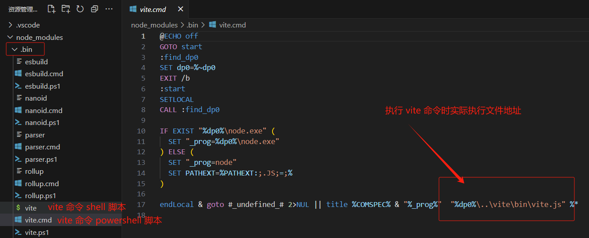
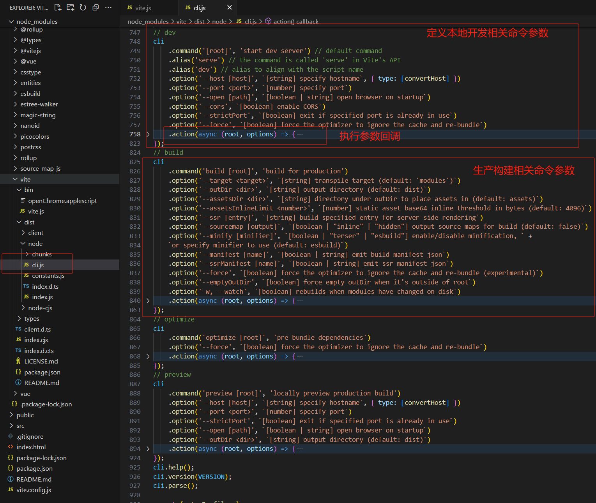
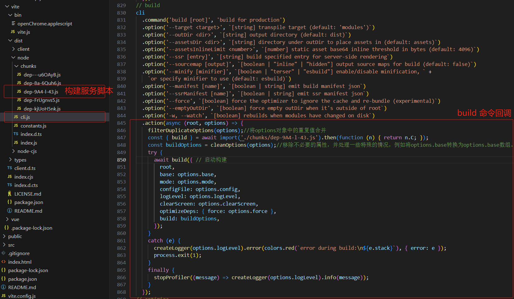

# **Vite原理解析**


## **命令解析**

在安装了 Vite 的项目中，可以在 npm scripts 中使用 `vite` 可执行文件，或者直接使用 `npx vite` 运行它。

下面是通过脚手架创建的 Vite 项目中默认的 npm scripts：

```js
{
  "scripts": {
    "dev": "vite", // 启动开发服务器，别名：`vite dev`，`vite serve`
    "build": "vite build", // 为生产环境构建产物
    "preview": "vite preview" // 本地预览生产构建产物
  }
}
```

可以指定额外的命令行选项，如 `--port` 或 `--open`。

在 windows 或 shell 中执行 `vite` 命令时，cmd 或 shell 会在当前目录下的 `./node_modules/.bin/` 目录下查找脚本;

以下是在 windows 下 powershell 中执行脚本：



在 Linux 下 shell 脚本为：


通过以上脚本，解析 `vite` 命令时，会在不同平台下加载对应 Shell 脚本， shell 中使用 node 执行 vite 脚本，vite 脚本位于 `./node_modules/vite/bin/vite.js` 目录下：


> vite 入口文件主要执行以下逻辑：
>
> 1. 解析命令参数；
> 2. 引入脚手架文件，调用 `start` 方法启动；

**总结：**

执行 `vite` 命令时:

1. 首先调用平台的 shell 脚本解析命令，使用 node 执行 vite 入口文件；
2. vite 入口文件首先解析命令参数，然后执行 `start ` 方法启动；


## **启动服务**

在 `./node_modules/vite/dist/node/cli.js`  文件中：

以上文件主要定义了 `dev` ,`build`,`optimize`,`preview` 命令参数：并在执行对象参数后，执行 `cli.command.action` 回调。

下面以 `dev` 和 `build` 命令解析为例说明 vite 解析过程。

vite 开发和构建服务命令：

```js
{
  "scripts": {
    "dev": "vite", // 启动开发服务器，别名：`vite dev`，`vite serve`
    "build": "vite build", // 为生产环境构建产物
    "preview": "vite preview" // 本地预览生产构建产物
  }
}
```

在执行 `vite dev ` 和 `vite build` 命令时，默认会执行 `cli.js` 文件的回调。


### **开发服务**

`vite dev` 命令的回调：

```js
async (root, options) => {
    filterDuplicateOptions(options);//过滤重复的选项，确保在创建服务器时使用的是最新的配置。
    //导入Vite服务器创建函数createServer，以及一些额外的配置选项
    const { createServer } = await import('./chunks/dep-9A4-l-43.js').then(function (n) { return n.A; });
    try {
      //使用过滤后的配置选项创建Vite服务器
      const server = await createServer({
        root,
        base: options.base,
        mode: options.mode,
        configFile: options.config,
        logLevel: options.logLevel,
        clearScreen: options.clearScreen,
        optimizeDeps: { force: options.force },
        server: cleanOptions(options),
      });
      //检查服务器是否创建成功，如果没有，抛出错误
      if (!server.httpServer) {
        throw new Error('HTTP server not available');
      }
      //启动服务器监听
      await server.listen();
      const info = server.config.logger.info;//获取日志记录函数info
      const viteStartTime = global.__vite_start_time ?? false;//获取Vite启动时间，如果找不到则设置为false。
      const startupDurationString = viteStartTime//计算启动时间字符串。
        ? colors.dim(`ready in ${colors.reset(colors.bold(Math.ceil(performance.now() - viteStartTime)))} ms`)
        : '';
      //检查标准输出和错误输出是否有数据写入。
      const hasExistingLogs = process.stdout.bytesWritten > 0 || process.stderr.bytesWritten > 0;
      //调用日志记录函数，显示基本信息，并设置clear属性为!hasExistingLogs，表示是否清空屏幕。
      info(`\n  ${colors.green(`${colors.bold('VITE')} v${VERSION}`)}  ${startupDurationString}\n`, {
        clear: !hasExistingLogs,
      });
      //打印服务器URL。
      server.printUrls();
      const customShortcuts = [];
      if (profileSession) {
       // 省略代码...
      }
      server.bindCLIShortcuts({ print: true, customShortcuts });
    }
    catch (e) {
      const logger = createLogger(options.logLevel);
      logger.error(colors.red(`error when starting dev server:\n${e.stack}`), {
        error: e,
      });
      stopProfiler(logger.info);
      process.exit(1);
    }
  }
```

在 `vite dev ` 回调中主要通过 `createServer` 方法使用过滤后的配置选项创建Vite服务器。


### **构建服务**

在执行  `vite build` 命令时，默认会执行 `cli.js` 文件的回调：



> 执行 `vite build` 构建命令后，执行以下逻辑：
>
> 1. 构建参数处理；
> 2. 启动构建

构建方法`build`在 `./chunks/dep-9A4-l-43.js` 文件中定义，定义如下：

```js
/**
 * Bundles the app for production.
 * Returns a Promise containing the build result.
 */
async function build(inlineConfig = {}) {
    //省略代码...
    // 此处为根据构建参数进行各项初始化
    try{
        // write or generate files with rollup
        // 引入 rollup 
        const { rollup } = await import('rollup');
        // 使用 rollup 并传入 rollup 选项参数进行构建
        bundle = await rollup(rollupOptions);
        if (options.write) {
            // 输出构建文件
            prepareOutDir(outDirs, options.emptyOutDir, config);
        }
        const res = [];
        for (const output of normalizedOutputs) {
            res.push(await bundle[options.write ? 'write' : 'generate'](output));
        }
        return Array.isArray(outputs) ? res : res[0];
    }
    catch (e) {
        outputBuildError(e);
        throw e;
    }
    finally {
        if (bundle)
            await bundle.close();
    }
}
```

通过以上代码可以看到，**Vite 构建底层是通过 Rollup 来进行构建的**！

 
