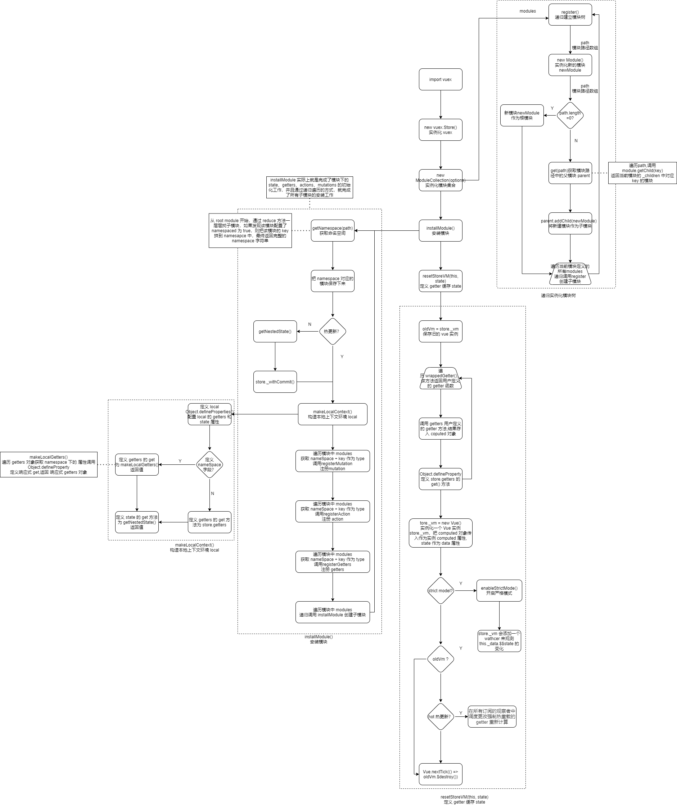

# Vuex原理分析

# VUEX

## VUEX 基础

* Vuex  应用开发的状态管理模式。采用集中式存储管理应用的所有组件的状态。

* Vuex 和单纯的全局对象有以下两点不同：

  * **Vuex 的状态存储是响应式的**。当 Vue 组件从 store 中读取状态的时候，若 store 中的状态发生变化，那么相应的组件也会相应地得到高效更新。
  * **不能直接改变 store 中的状态。**改变 store 中的状态的唯一途径就是显式地**提交 (commit) mutation**。这样使得我们可以方便地跟踪每一个状态的变化，从而让我们能够实现一些工具帮助我们更好地了解我们的应用。

* Vuex解决了什么问题？

  * 多个组件依赖于同一状态时，多层嵌套组件和兄弟组件状态传参问题。
  * 来自不同组件的行为需要变更同一状态问题。以往采用父子组件直接引用或者通过事件来变更和同步状态的多份拷贝。以上的这些模式非常脆弱，通常会导致无法维护的代码。

* 什么时候使用 Vuex?

  * 多个组件依赖于同一状态时。
  * 来自不同组件的行为需要变更同一状态。

* 核心属性：

  * **State 状态：** 存储状态数据，状态存储是响应式的。

    * 获取 state 数据: `this.$store.state` 获取， store 实例中读取状态最简单的方法就是在[计算属性 (opens new window)](https://cn.vuejs.org/guide/computed.html)中返回某个状态 。
    * 获取多个状态：`mapState` 辅助函数。`mapState` 返回的是一个对象，使用对象展开运算符`...` 将对象混入到外部对象中。

  * **Getter：**用于获取 `state`。

    * 参数：Getter 接受 state 作为其第一个参数，其他 getter 作为第二个参数。
    * 返回值：返回值会根据它的依赖被缓存起来，且只有当它的依赖值发生了改变才会被重新计算。
    * 获取单个 getters：  `this.$store.getters` 对象。
    * 获取多个 getters：`mapGetters` 辅助函数，返回多个 getters 对象。

  * **Mutation：**提交 mutation 是更改状态的唯一方法。

    * 规则：

      * **mutation 必须是同步函数**（在回调函数中进行的状态的改变都是不可追踪）
      * 使用常量替代 mutation 事件类型
      * 在组件中使用 `this.$store.commit('xxx')` 提交 mutation，或者使用 `mapMutations` 辅助函。

    * 定义和提交：

      ```javascript
      //定义：第一个参数 state，第二个参数提交数据
      mutations: {
        increment (state, payload) {
          state.count += payload.amount
        }
      }
      //提交：第一个参数 mutation 事件类型，第二个参数为提交数据
      store.commit('increment', {
        amount: 10
      })
      //对象风格提交
      store.commit({
        type: 'increment',
        amount: 10
      })
      ```

    * 实现: 从 _mutations 中取出对应的 mutation，循环执行其中的每一个 mutation。

      ```javascript
      commit (type, payload, _options) {
          //_mutations 为用户定义的 mutation 的数组，type 为 namespace + path 拼接字符串
          const entry = this._mutations[type]; 
          entry.forEach(function commitIterator (handler) {
              handler(payload);    
          });
      }
      ```

      

  * **Action：**一般用于**调用异步 API** 和**分发多重 mutation**

    * Action 提交的是 mutation，而不是直接变更状态。

    * Action 可以包含任意异步操作。

    * 使用：使用 `this.$store.dispatch('xxx')` 分发 action，或者使用 `mapActions` 辅助函数将组件的 methods 映射为 `store.dispatch` 调用（需要先在根节点注入 `store`）

    * `store.dispatch` 可以处理被触发的 action 的处理函数返回的 Promise，并且 `store.dispatch` 仍旧返回 Promise，然后 then 提交 commit 修改 state。

    * 多次提交同一个action： mapActions辅助函数。

    * ```javascript
      //定义
      actions: {
        checkout ({ commit, state }, products) {
          // 把当前购物车的物品备份起来
          const savedCartItems = [...state.cart.added]
          // 发出结账请求，然后乐观地清空购物车
          commit(types.CHECKOUT_REQUEST)
          // 购物 API 接受一个成功回调和一个失败回调
          shop.buyProducts(
            products,
            // 成功操作
            () => commit(types.CHECKOUT_SUCCESS),
            // 失败操作
            () => commit(types.CHECKOUT_FAILURE, savedCartItems)
          )
        }
      }
      //使用 promise
      store.dispatch('checkout').then((res) => {
         commit('checkout', res.data)
      })
      // 使用 async await 
       actions: {
        async actionA ({ commit }) {
          commit('checkout', await getData())
        }
       }
      ```

    * 实现：取出 _actions 中的所有对应 action，将其执行，如果有多个则用 Promise.all 进行包装。

      ```javascript
      dispatch (type, payload) {
           //_actions 为用户定义的 action 的数组，type 为 namespace + path 拼接字符串
          const entry = this._actions[type];
          return entry.length > 1
          ? Promise.all(entry.map(handler => handler(payload)))
          : entry[0](payload);
      }
      ```

      

  * **Module：**

    * 产生：由于使用单一状态树，应用的所有状态会集中到一个比较大的对象，当应用变得非常复杂时，`store` 对象就有可能变得相当臃肿。
    * 作用：将 store 分割成**模块（module）**。每个模块拥有自己的 state、mutation、action、getter、嵌套子模块。
    * 数据结构：模块的设计就是一个树型结构，`store` 本身可以理解为一个 `root module`，它下面的 `modules` 就是子模块
    * 命名空间：
      * 全局命名空间：默认情况为全局命名空间，多个模块能够对同一 `mutation` 或 `action` 作出响应。
      * 局部命名空间：`namespaced: true` 的方式使其成为带命名空间的模块，所有 `getter`、`action` 及 `mutation` 都会自动根据模块注册的路径调整命名。

* 规则：

  * 应用层级的状态应该集中到单个 store 对象中。
  * 提交 **mutation** 是更改状态的唯一方法，并且这个过程是同步的。
  * 异步逻辑都应该封装到 **action** 里面。

* 流程：

  * 页面组件 dispatch 分发 action 获取数据；

  * Action 中异步获取数据，获取后 commit 同步提交 mutation;

  * mutation 同步修改 state 状态，state 通过 getters 通知变化；

  * 在组件的计算属性中，通过 getters 来动态获取 state 中的值。

    

  * Vuex 缺点：

    * vuex中存储的数据不能持久化。vuex 的 store 中的数据是保存在运行内存中的，当页面刷新后，页面会重新加载 vue 实例，vuex 里面的数据就会被重新赋值，这样就会出现页面刷新vuex中的数据丢失的问题。需要监听处理来维持vuex存储的数据状态持久化。

## 初始化

* 初始化过程：

  * 使用 Vue 插件机制状态 Vuex；
  * vuex 的 `install` 中 使用 `Vue.mixin`  全局混入 `beforeCreate` 钩子；
  * `new Vue()` 创建 Vue 实例时在 init() 方法中调用  `beforeCreate` 钩子；
  * `beforeCreate` 钩子中执行 `vuexInit()` ：把 `options.store` （`Store` 实例）保存在所有组件的 `this.$store` 中。

* 

  

## 实例化


* 实例化过程分为三个阶段

  * `new ModuleCollection(options)` 建立模块树：  

    * 创建一个子模块；
    * 模块 `path `中包含模块父子关系，遍历模块 `path` ，通过每个子模块通过路径找到它的父模块，然后通过父模块的 `addChild` 方法建立父子关系
    * 递归执行这样的过程，最终就建立一颗完整的模块树

  * `installModule` 安装模块：

    *  完成模块下的 state、getters、actions、mutations 的初始化工作
    *  并且通过递归遍历的方式，就完成所有子模块的安装工作

  * `resetStoreVM` 建立 `getters` 和 `state` 的联系: 使 getter 缓存 state。

    * **vuex 存储响应式原理：**创建 vue 实例，将 state 作为 vue 实例的 data 数据， getters 作为 computed 数据，在 vue 实例化时,会进行 state 和 getter 依赖收集，在数据修改时候触发更新。

    * 从设计上 `getters` 的获取就依赖了 `state` ，并且希望它的依赖能被缓存起来，且只有当它的依赖值发生了改变才会被重新计算。

    * 因此这里利用了 Vue 中 `computed` 计算属性来实现 getters 缓存 state：

      ```javascript
      forEachValue(wrappedGetters, (fn, key) => {
          // use computed to leverage its lazy-caching mechanism
          computed[key] = () => fn(store)
          Object.defineProperty(store.getters, key, {
            get: () => store._vm[key],
            enumerable: true // for local getters
          })
        })
      
        // use a Vue instance to store the state tree
        // suppress warnings just in case the user has added
        // some funky global mixins
        const silent = Vue.config.silent
        Vue.config.silent = true
        store._vm = new Vue({
          data: {
            $$state: state
          },
          computed
        })
      ```

      



## 相关问题

**基础题：**

> Vuex中状态是对象时，使用时要注意什么？

* 因为对象是引用类型，复制后改变属性还是会影响原始数据，这样会改变state里面的状态，是不允许，所以先用深度克隆复制对象，再修改。

>  Vuex中要从state派生一些状态出来，且多个组件使用它，该怎么做？

* 使用getter属性，相当Vue中的计算属性computed，只有原状态改变派生状态才会改变。
* getter接收两个参数，第一个是state，第二个是getters(可以用来访问其他getter)。

* 然后在组件中可以用计算属性computed通过`this.$store.getters.total`这样来访问这些派生转态。

> vuex中直接修改 state 与 commit 来修改 state 的区别?

* 可以通过 `this.$store.state.aaa = xxx` 进行 state 值的修改;
* 当`vuex`的模式改成严格模式下，在通过直接修改`state`的方式修改状态的时候，控制台会报错；
* 使用commit提交状态修改是为了配合开发者工具使用，使得状态更好的被最终，保存状态快照，实现时间漫游／回滚之类的操作;


> 在模块中，getter和mutation接收的第一个参数state，是全局的还是模块的?

* 对于模块内部的 mutation 和 getter，接收的第一个参数是**模块的局部状态对象**。

  参考： [模块的局部状态对象](https://vuex.vuejs.org/zh/guide/modules.html#%E6%A8%A1%E5%9D%97%E7%9A%84%E5%B1%80%E9%83%A8%E7%8A%B6%E6%80%81)


>  在模块中，getter和mutation和action中怎么访问全局的state和getter？

* 在getter中可以通过第三个参数rootState访问到全局的state,可以通过第四个参数rootGetters访问到全局的getter。

* 在mutation中不可以访问全局的satat和getter，只能访问到局部的state。

* 在action中第一个参数context中的`context.rootState`访问到全局的state，`context.rootGetters`访问到全局的getter。


**应用题：**

> vuex 数据表单可以使用 v-model 吗？

* 不能。

* 当在严格模式中使用 Vuex 时，在属于 Vuex 的 state 上使用 `v-model` 会比较棘手：

  ```javascript
  <input v-model="obj.message">
  ```

  ​		假设这里的 `obj` 是在计算属性中返回的一个属于 Vuex store 的对象，在用户输入时，`v-model` 会试图直接修改 `obj.message`。在严格模式中，由于这个修改不是在 mutation 函数中执行的, 这里会抛出一个错误。

* 解决方案一：通过computed计算属性来转换，computed 数据 get 方法返回 state，set 方法提交 mutation

  ```js
  <input v-model="message">
  // ...
  computed: {
      message: {
          get () {
              return this.$store.state.message
          },
          set (value) {
              this.$store.commit('updateMessage', value)
          }
      }
  }
  ```

  

* 解决方案二：用“Vuex 的思维”去解决这个问题的方法是：给 `<input>` 中绑定 value，然后侦听 `input` 或者 `change` 事件，在事件回调中调用一个方法:

  ```javascript
  <input :value="message" @input="updateMessage">
  // ...
  computed: {
    ...mapState({
      message: state => state.obj.message
    })
  },
  methods: {
    updateMessage (e) {
      this.$store.commit('updateMessage', e.target.value)
    }
  }
  ```

  

> vue 中 ajax 请求代码应该写在组件的 methods 中还是 vuex 的 actions 中？

* 如果请求来的数据不需要其他组件公用，仅仅在请求的组件内使用，就不需要放入vuex 的state里。

* 如果请求的数据被其他地方复用，则将请求放入action里。方便复用，并包装成promise返回，在调用处用async await处理返回的数据。

> Vuex中有两个action，分别是actionA和actionB，其内都是异步操作，在actionB要提交actionA，需在actionA处理结束再处理其它操作，怎么实现？

利用 async / await:

* ```javascript
  actions: {
   async actionA ({ commit }) {
     commit('gotData', await getData())
   },
   async actionB ({ dispatch, commit }) {
     await dispatch('actionA') // 等待 actionA 完成
     commit('gotOtherData', await getOtherData())
   }
  }
  ```


## 应用

### Vuex和localStorage 比较

共同点：

* 用于存储数据
* 用于组件间 数据通信

区别：

* 存储位置不同：
  * Vuex 存储在内存，
  * localstorage（本地存储）则以文件的方式存储在本地(浏览器),永久保存；
* 存储空间来：
  *  Vuex取决于可用内存和浏览器的限制
  * localstorage 都有个默认的大小（至少5MB，由浏览器决定），超出大小则需要用户同意增加空间；
* 共享：
  * Vuex无法跨标签页、跨物理页面共享
  * localstorage 则可以在同一域名底下共享

* 独有能力：
  * vuex的状态存储是响应式的：当Vue组件从store中读取状态的时候，若store中的状态发生变化，那么相应的组件也会得到更新

* 应用：
  * 当需要响应式共享数据时， 需要使用使用Vuex来实现
    * vuex与localStorage结合，实现组件间通信，同时刷新页面数据不丢失
  * 当需求是刷新页面仍然可以获取到数据，或者是同一域名下不同项目共享数据，需要使用 localStorage

### Vuex数据持久化

> Vuex 实现数据持久化？ vuex 如何解决页面刷新后数据丢失的问题？

* 方案1：`Vuex + sessionStorage/localStorage`

  * 实现：

    * 封装 Storage 对象（封装目的：sessionStorage/localStorage 保存的是字符串，避免每次获取 JSON.parse 和存入都使用 JSON.stringify 转换）
    * Vuex 中 state 读取 Storage 中数据， mutation 提交数据更改时候存入 Storage。

    ```js
    var Storage = {
      // ==================sessionStorage设置缓存================
      // 设置缓存
      sessionSet: function (name, data, expires) {
        sessionStorage.removeItem(name)
        sessionStorage.setItem(name, JSON.stringify(data))
        if (expires && expires instanceof Date) {
          sessionStorage.removeItem(`${name}__expires`)
          sessionStorage.setItem(`${name}__expires`, new Date(expires).getTime())
        }
      },
      // 获取缓存
      sessionGet: function (name) {
        if (sessionStorage.getItem(`${name}__expires`)) {
          const now = Date.now()
          const expires = sessionStorage.getItem(`${name}__expires`)
          if (now >= expires) {
            sessionStorage.removeItem(name)
            sessionStorage.removeItem(`${name}__expires`)
            return undefined
          } else {
            return JSON.parse(sessionStorage.getItem(name))
          }
        } else {
          return JSON.parse(sessionStorage.getItem(name))
        }
      },
      // 清除缓存
      sessionRemove: function (name) {
        sessionStorage.removeItem(name)
      },
      // ==================localStorage设置缓存==================
      // 设置缓存
      localSet: function (name, data, expires) {
        localStorage.removeItem(name)
        localStorage.setItem(name, JSON.stringify(data))
        if (expires && expires instanceof Date) {
          localStorage.removeItem(`${name}__expires`)
          localStorage.setItem(`${name}__expires`, new Date(expires).getTime())
        }
      },
      // 获取缓存
      localGet: function (name) {
        if (localStorage.getItem(`${name}__expires`)) {
          const now = Date.now()
          const expires = localStorage.getItem(`${name}__expires`)
          if (now >= expires) {
            localStorage.removeItem(name)
            localStorage.removeItem(`${name}__expires`)
            return undefined
          } else {
            return JSON.parse(localStorage.getItem(name))
          }
        } else {
          return JSON.parse(localStorage.getItem(name))
        }
      },
      // 清除缓存
      localRemove: function (name) {
        localStorage.removeItem(name)
      }
    }
    
    export default Storage
    ```

* 方案二： 插件实现。

  * [vuex-persistedstate 插件](https://www.npmjs.com/package/vuex-persistedstate)：`persistedState`内部默认使用`localStorage`存储。
  * [vuex-persist 插件](https://github.com/championswimmer/vuex-persist)

## 参考资料

[vuex3.x文档](https://vuex.vuejs.org/zh/guide/)

