# Vue2.x 原理源码分析

[TOC]


## 框架设计

### MVC & MVVM


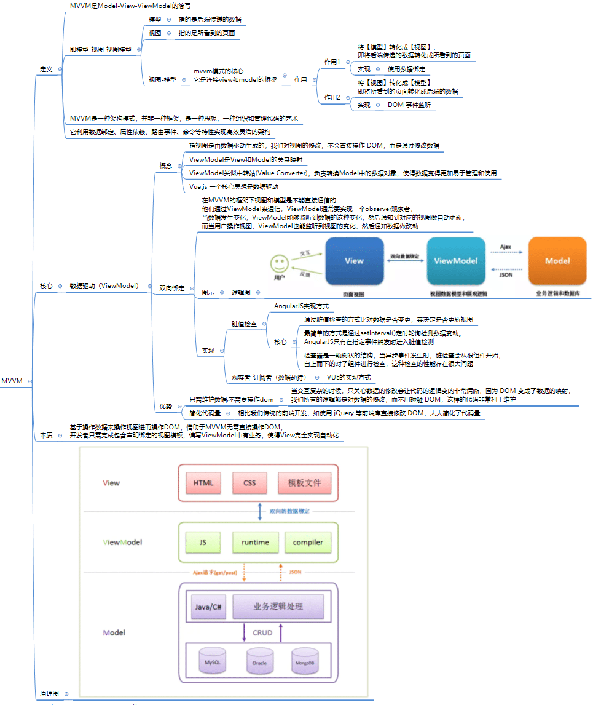

**vue 采用模型：**

* Vue.js 采用mvvm模型，一个核心思想是数据驱动。
* 所谓数据驱动，是指视图是由数据驱动生成的，我们对视图的修改，不会直接操作 DOM，而是通过修改数据。
* 它相比我们传统的前端开发，如使用 jQuery 等前端库直接修改 DOM，大大简化了代码量。特别是当交互复杂的时候，只关心数据的修改会让代码的逻辑变的非常清晰，因为 DOM 变成了数据的映射，我们所有的逻辑都是对数据的修改，而不用碰触 DOM，这样的代码非常利于维护。

### 单页面 & 多页面应用


----


## 原理分析

### 构建流程

* 通常在开发 vue 项目完成后会通过命令行 npm run build 进行 打包构建，vue 中的构建也是如此。

* vue 构建流程：

  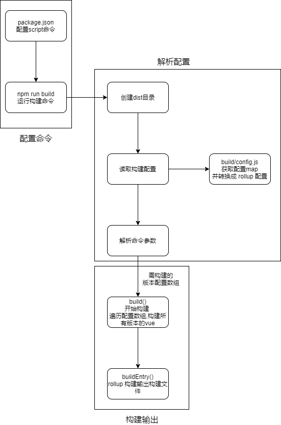

* Vue.js 源码是基于 [Rollup](https://github.com/rollup/rollup) 构建的，它的构建相关配置都在 scripts 目录下


#### **源码分析**

* 构建脚本

  通常一个基于 NPM 托管的项目都会有一个 package.json 文件，它是对项目的描述文件，它的内容实际上是一个标准的 JSON 对象。

  我们通常会配置 `script` 字段作为 NPM 的执行脚本，Vue.js 源码构建的脚本如下：

  ```json
  {
    "script": {
      "build": "node scripts/build.js",
      "build:ssr": "npm run build -- web-runtime-cjs,web-server-renderer",
      "build:weex": "npm run build --weex"
    }
  }
   
  ```

  这里总共有 3 条命令，作用都是构建 Vue.js，后面 2 条是在第一条命令的基础上，添加一些环境参数。

  当在命令行运行 `npm run build` 的时候，实际上就会执行 `node scripts/build.js`，接下来我们来看看它实际是怎么构建的。

* 构建过程

  我们对于构建过程分析是基于源码的，先打开构建的入口 JS 文件，在 `scripts/build.js` 中：

  ```js
  let builds = require('./config').getAllBuilds()
  
  // filter builds via command line arg
  if (process.argv[2]) {
    const filters = process.argv[2].split(',')
    builds = builds.filter(b => {
      return filters.some(f => b.output.file.indexOf(f) > -1 || b._name.indexOf(f) > -1)
    })
  } else {
    // filter out weex builds by default
    builds = builds.filter(b => {
      return b.output.file.indexOf('weex') === -1
    })
  }
  
  build(builds)
  ```

  这段代码逻辑非常简单，先从配置文件读取配置，再通过命令行参数对构建配置做过滤，这样就可以构建出不同用途的 Vue.js 了。接下来我们看一下配置文件，在 `scripts/config.js` 中：

  ```js
  const builds = {
    // Runtime only (CommonJS). Used by bundlers e.g. Webpack & Browserify
    'web-runtime-cjs': {
      entry: resolve('web/entry-runtime.js'),
      dest: resolve('dist/vue.runtime.common.js'),
      format: 'cjs',
      banner
    },
    // Runtime+compiler CommonJS build (CommonJS)
    'web-full-cjs': {
      entry: resolve('web/entry-runtime-with-compiler.js'),
      dest: resolve('dist/vue.common.js'),
      format: 'cjs',
      alias: { he: './entity-decoder' },
      banner
    },
    // Runtime only (ES Modules). Used by bundlers that support ES Modules,
    // e.g. Rollup & Webpack 2
    'web-runtime-esm': {
      entry: resolve('web/entry-runtime.js'),
      dest: resolve('dist/vue.runtime.esm.js'),
      format: 'es',
      banner
    },
    // Runtime+compiler CommonJS build (ES Modules)
    'web-full-esm': {
      entry: resolve('web/entry-runtime-with-compiler.js'),
      dest: resolve('dist/vue.esm.js'),
      format: 'es',
      alias: { he: './entity-decoder' },
      banner
    },
    // runtime-only build (Browser)
    'web-runtime-dev': {
      entry: resolve('web/entry-runtime.js'),
      dest: resolve('dist/vue.runtime.js'),
      format: 'umd',
      env: 'development',
      banner
    },
    // runtime-only production build (Browser)
    'web-runtime-prod': {
      entry: resolve('web/entry-runtime.js'),
      dest: resolve('dist/vue.runtime.min.js'),
      format: 'umd',
      env: 'production',
      banner
    },
    // Runtime+compiler development build (Browser)
    'web-full-dev': {
      entry: resolve('web/entry-runtime-with-compiler.js'),
      dest: resolve('dist/vue.js'),
      format: 'umd',
      env: 'development',
      alias: { he: './entity-decoder' },
      banner
    },
    // Runtime+compiler production build  (Browser)
    'web-full-prod': {
      entry: resolve('web/entry-runtime-with-compiler.js'),
      dest: resolve('dist/vue.min.js'),
      format: 'umd',
      env: 'production',
      alias: { he: './entity-decoder' },
      banner
    },
    // ...
  }
  ```

  这里列举了一些 Vue.js 构建的配置，关于还有一些服务端渲染 webpack 插件以及 weex 的打包配置就不列举了。

  对于单个配置，它是遵循 Rollup 的构建规则的。其中 `entry` 属性表示构建的入口 JS 文件地址，`dest` 属性表示构建后的 JS 文件地址。`format` 属性表示构建的格式，`cjs` 表示构建出来的文件遵循 [CommonJS](http://wiki.commonjs.org/wiki/Modules/1.1) 规范，`es` 表示构建出来的文件遵循 [ES Module](http://exploringjs.com/es6/ch_modules.html) 规范。 `umd` 表示构建出来的文件遵循 [UMD](https://github.com/umdjs/umd) 规范。

  以 `web-runtime-cjs` 配置为例，它的 `entry` 是 `resolve('web/entry-runtime.js')`，先来看一下 `resolve` 函数的定义。

  源码目录：`scripts/config.js`

  ```js
  const aliases = require('./alias')
  const resolve = p => {
    const base = p.split('/')[0]
    if (aliases[base]) {
      return path.resolve(aliases[base], p.slice(base.length + 1))
    } else {
      return path.resolve(__dirname, '../', p)
    }
  }
  ```

  这里的 `resolve` 函数实现非常简单，它先把 `resolve` 函数传入的参数 `p` 通过 `/` 做了分割成数组，然后取数组第一个元素设置为 `base`。在我们这个例子中，参数 `p` 是 `web/entry-runtime.js`，那么 `base` 则为 `web`。`base` 并不是实际的路径，它的真实路径借助了别名的配置，我们来看一下别名配置的代码，在 `scripts/alias` 中：

  ```js
  const path = require('path')
  
  module.exports = {
    vue: path.resolve(__dirname, '../src/platforms/web/entry-runtime-with-compiler'),
    compiler: path.resolve(__dirname, '../src/compiler'),
    core: path.resolve(__dirname, '../src/core'),
    shared: path.resolve(__dirname, '../src/shared'),
    web: path.resolve(__dirname, '../src/platforms/web'),
    weex: path.resolve(__dirname, '../src/platforms/weex'),
    server: path.resolve(__dirname, '../src/server'),
    entries: path.resolve(__dirname, '../src/entries'),
    sfc: path.resolve(__dirname, '../src/sfc')
  }
  ```

  很显然，这里 `web` 对应的真实的路径是 `path.resolve(__dirname, '../src/platforms/web')`，这个路径就找到了 Vue.js 源码的 web 目录。然后 `resolve` 函数通过 `path.resolve(aliases[base], p.slice(base.length + 1))` 找到了最终路径，它就是 Vue.js 源码 web 目录下的 `entry-runtime.js`。因此，`web-runtime-cjs` 配置对应的入口文件就找到了。

  它经过 Rollup 的构建打包后，最终会在 dist 目录下生成 `vue.runtime.common.js`


### 执行流程


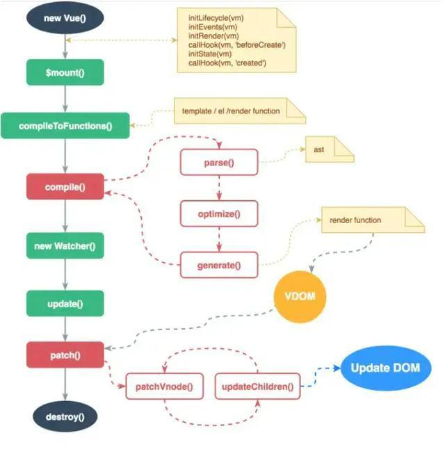

> 总体流程：初始化 ->挂载组件 -> 模板编译 ->  依赖收集 -> 数据更新 -> 实例销毁

* 初始化：
  * 在 new Vue() 之后, 调用 _init 函数进行初始化: 生命周期、事件、初始化渲染、调用 beforeCreated 钩子；
  * 初始化状态 initState： props、methods、data、computed 与 watch;
  * 初始化 data、computed 和 watch 时，调用 `defineReactive` 定义响应式数据，使用 Object.defineProperty 设置  getter 函数，初始化「 响应式」数据。
  * 调用 created 钩子。
* 挂载组件：
  * 调用 `$mount` 挂载组件，如果是运行时编译，即不存在  render function  但是存在 template  的情况，需要进行「 编译」步骤。
* 模板编译: 
  * 将模板编译生成 渲染函数。
  * `parse`:  用正则等方式解析  template  模板中的指令、class、style 等数据，形成 AST。
  * `optimize`: 标记  static  静态节点。当 update更新界面时，会有一个 patch 的过程，diff  算法会直接跳过静态节点，从而减少了比较的过程，优化了 patch 的性能。
  * `generate`:将  AST  转化成  render function  字符串的过程,得到 render 的字符串以及 staticRenderFns  字符串。
* 依赖收集
  * 当  render function  被渲染的时候，因为会读取所需对象的值，所以会触发数据的 getter 函数进行「 依赖收集」；
  * 「 依赖收集」的目的是将观察者  Watcher  对象存放到当前闭包中的订阅者  Dep  的  subs  中。
  * 调用 beforeMount 钩子。
  * 通过 _render() 生成 VNode，通过 _update() 将 VNode 渲染成真实 DOM。
  * createElm() 先通过 VNode 创建真实 DOM 插入到父节点，直到递归完成完整 DOM  插入到 body，**完成初次渲染**。
  * 调用 mounted 钩子。
* 数据更新
  * 在修改对象的值的时候，会触发对应的 setter， setter 通知之前「 依赖收集」得到的  Dep  中的每一个 Watcher，告诉它们自己的值改变了，需要重新渲染视图。
  * Watcher  就会开始调用 update 来更新视图。
* update时, 通过 patch (打补丁) 的过程以及使用队列来异步更新的策略更新视图。
  * patch 时，通过 patchVnode() 比较 新旧 VNode, 并 updateChild() 进行更新视图。
* 实例销毁： 
  * 离开页面时，触发 beforeDestroy 钩子


* 总流程图：

  

  简化流程：

  


#### **VUE 三大核心**

* **响应式模块**：以下响应式部分讲解。
* **编译器模块**：将模板编译成渲染函数，以下模板编译部分为编译器模块。
* **渲染模块**：包含三个阶段。
  * 渲染阶段：将 render function 渲染成 Virtual Dom Node; 对应以下 render -> patch 阶段；
  * 挂载阶段：将  Virtual Dom Node 调用 DOM API 创建页面；对应以下 render -> patch  阶段;
  * patch阶段：进行 新旧虚拟节点比较并只更新网页变化部分；对应 派发更新阶段；


### 生命周期

**基础知识：**

Vue 一共有 8 个生命阶段，分别是创建前、创建后、加载前、加载后、更新前、更新后、销毁 前和销毁后，每个阶段对应了一个生命周期的钩子函数：

* beforeCreate 钩子函数：在实例初始化之后，在数据监听和事件配置之前触发。
  * 在这个事件中获取不到 data 数据。
* created 钩子函数：在实例创建完成后触发，此时可以访问 data、methods 等属性。
  * 但这个时候组件还没有被挂载到页面中去，所以这个时候访问不到 $el 属性。
  * 一般我们可以在这 个函数中进行一些页面初始化的工作。比如通过 ajax 请求数据来对页面进行初始化。 


* beforeMount 钩子函数：在组件被挂载到页面之前触发。
  * 在 beforeMount 之前，会找到对应的 template，编译成 render 函数。
* mounted 钩子函数：在组件挂载到页面之后触发。已经完成页面首次渲染。
  * 此时可以通过 DOM API 获取到页面中 的 DOM 元素。
  * 在 mounted 中请求数据，可能导致页面闪屏。
    * 因为 mounted 中，已经完成页面首次渲染，因此在 mounted 获取异步数据，数据返回前首次渲染的页面是没有后台数据的，在获取数据后将进入数据派发过程。


* beforeUpdate 钩子函数：在响应式数据更新时触发，发生在虚拟 DOM 重新渲染和 patch 打补 丁之前。
  * 这个时候我们可以对可能会被移除的元素做一些操作，比如移除事件监听器。
* updated 钩子函数：虚拟 DOM 重新渲染和打补丁之后调用。


* beforeDestroy 钩子函数：在实例销毁之前调用。
  * 一般在这一步我们可以销毁定时器、 解绑全局事件、组件中创建的实例等。
* destroyed 钩子函数：在实例销毁之后调用，调用后，Vue 实例中的所有东西都会解除 绑定，所有的事件监听器会被移除，所有的子实例也会被销毁。


` <keep-alive>` 组件中，还有两个钩子函数，分别是 activated 和 deactivated 。

*  用 keep-alive 包裹的组件在切换时不会进行销毁，而是缓存到内存中并执行 deactivated 钩子函数。
* 命中缓存渲染后会执行 actived 钩子函数。


**原理分析：**

* 执行生命周期的函数都是调用 `callHook` 方法。

 **callHook 方法**

 `callHook` 方法： 功能就是调用某个生命周期钩子注册的所有回调函数。

* 它的定义在 [src/core/instance/lifecycle](https://github.com/vuejs/vue/blob/v2.3.0/rc/core/instance/lifecycle) 中：

  ```javascript
  /*callhook 函数的功能就是调用某个生命周期钩子注册的所有回调函数,调用钩子函数并且触发钩子事件*/
  export function callHook(vm: Component, hook: string) {
    const handlers = vm.$options[hook] //获取hook对应的回调数组，在合并options时将生命周期合并进入options
    if (handlers) {
      //遍历执行，执行的时候把 vm 作为函数执行的上下文
      for (let i = 0, j = handlers.length; i < j; i++) {
        try {
          handlers[i].call(vm)
        } catch (e) {
          handleError(e, vm, `${hook} hook`)
        }
      }
    }
    if (vm._hasHookEvent) {
      vm.$emit('hook:' + hook)
    }
  }
  ```


**beforeCreate & created**

* `beforeCreate` 和 `created` 函数都是在实例化 `Vue` 的阶段，在 `_init` 方法中执行的，它的定义在 `src/core/instance/init.js` 中：

  ```javascript
  Vue.prototype._init = function (options?: Object) {
    // ...
    initLifecycle(vm)
    initEvents(vm)
    initRender(vm)
    callHook(vm, 'beforeCreate')
    initInjections(vm) // resolve injections before data/props
    initState(vm)
    initProvide(vm) // resolve provide after data/props
    callHook(vm, 'created')
    // ...
  }
  ```

  * `beforeCreate` 的钩子函数中不能获取到 `props`、`data` 中定义的值和调用 `methods` 中定义的函数。
    * `initState` 的作用是初始化 `props`、`data`、`methods`、`watch`、`computed` 等属性，`beforeCreate` 的钩子函数在 initState 之前调用，
  * `beforeCreate` 和 `created` 钩子函数执行的时候不能够访问 DOM。
    * 因为钩子函数执行的时候，并没有渲染 DOM。
  * 访问 `props`、`data` 等数据的话，就需要使用 `created` 钩子函数。
    * created 在 props、data 初始化后调用。

**beforeMount & mounted**

* `mounted` 钩子函数被调用时机有两种：

  * 外部 `new Vue` 初始化过程调用 `mounted` 钩子 ；
  * 组件实例化调用 `mounted` 钩子 ；

* 外部 `new Vue` 初始化过程调用钩子：

  * `beforeMount` 和 `mount`钩子函数发生在 `mount`方法，也就是 DOM 挂载之前，它的调用时机是在 `mountComponent` 函数中。
  * 定义在 `src/core/instance/lifecycle.js` 中：

  ```javascript
    vm: Component,
    el: ?Element,
    hydrating?: boolean
  ): Component {
    vm.$el = el
    if (!vm.$options.render) { //不存在render方法(vue实例中没有render方法并且mount没有转换render方法)
      /*render函数不存在的时候创建一个空的VNode节点*/
      vm.$options.render = createEmptyVNode
      if (process.env.NODE_ENV !== 'production') {
        /* istanbul ignore if */
        // 当用了 runtime only 版本没有render方法并且写添加了template，则警告(runtime only版本不能添加template)
        if ((vm.$options.template && vm.$options.template.charAt(0) !== '#') ||
          vm.$options.el || el) {
          warn(
            'You are using the runtime-only build of Vue where the template ' +
            'compiler is not available. Either pre-compile the templates into ' +
            'render functions, or use the compiler-included build.',
            vm
          )
        } else { // 没有写render函数或则template
          warn(
            'Failed to mount component: template or render function not defined.',
            vm
          )
        }
      }
    }
    /*触发beforeMount钩子*/
    callHook(vm, 'beforeMount')
  
    /*updateComponent作为Watcher对象的getter函数，用来依赖收集*/
    let updateComponent
    /* istanbul ignore if */
    // 性能埋点相关
    if (process.env.NODE_ENV !== 'production' && config.performance && mark) {
      updateComponent = () => {
        const name = vm._name
        const id = vm._uid
        const startTag = `vue-perf-start:${id}`
        const endTag = `vue-perf-end:${id}`
  
        mark(startTag)
        const vnode = vm._render()
        mark(endTag)
        measure(`${name} render`, startTag, endTag)
  
        mark(startTag)
        vm._update(vnode, hydrating)
        mark(endTag)
        measure(`${name} patch`, startTag, endTag)
      }
    } else {
      updateComponent = () => {
        /*在此方法中调用 vm._render (该方法定义在./render) 方法先生成虚拟 VNode，
        最终调用 vm._update 更新 DOM，_update 是实例的一个私有方法，它被调用的时机有 2 个，
        一个是首次渲染，一个是数据更新的时候*/
        vm._update(vm._render(), hydrating)
      }
    }
  
    /**
     * 这里对该vm注册一个渲染Watcher实例，Watcher的getter为updateComponent函数，
     * 用于触发所有渲染所需要用到的数据的getter，进行依赖收集，该Watcher实例会存在所有渲染所需数据的闭包Dep中
     * Watcher 在这里起到两个作用:
     * 一个是初始化的时候会执行回调函数（updateComponent），
     * 另一个是当 vm 实例中的监测的数据发生变化的时候执行回调函数（updateComponent）
     * @param {} vm vue实例对象
     * @param {Function} updateComponent 
     * @param {Funciont} noop 空函数
     */
    vm._watcher = new Watcher(vm, updateComponent, noop) //创建渲染watcher
    hydrating = false
  
    // manually mounted instance, call mounted on self
    // mounted is called for render-created child components in its inserted hook
    if (vm.$vnode == null) { //vm.$vnode 表示 Vue 实例的父虚拟 Node，所以它为 Null 则表示当前是根 Vue 的实例
      /*标志位，代表该组件已经挂载*/
      vm._isMounted = true
      /*调用mounted钩子*/
      callHook(vm, 'mounted')
    }
    return vm
  }
  ```

  * 在执行 `vm._render()` 函数渲染 VNode 之前，执行了 `beforeMount` 钩子函数，在执行完 `vm._update()` 把 VNode patch 到真实 DOM 后，执行 `mouted` 钩子。
  * 这里对 `mouted` 钩子函数执行有一个判断逻辑，`vm.$vnode` 如果为 `null`，则表明这不是一次组件的初始化过程，而是我们通过外部 `new Vue` 初始化过程。

* 组件实例化调用 `mounted` 钩子 ：

  * 组件的 VNode patch 到 DOM 后，会执行 `invokeInsertHook` 函数，把 `insertedVnodeQueue` 里保存的钩子函数依次执行一遍，它的定义在 `src/core/vdom/patch.js` 中：

    ```js
    function invokeInsertHook (vnode, queue, initial) {
      // delay insert hooks for component root nodes, invoke them after the
      // element is really inserted
      if (isTrue(initial) && isDef(vnode.parent)) {
        vnode.parent.data.pendingInsert = queue
      } else {
        for (let i = 0; i < queue.length; ++i) {
          queue[i].data.hook.insert(queue[i])
        }
      }
    }
    ```

    * 该函数会执行 `insert` 这个钩子函数，对于组件而言，`insert` 钩子函数的定义在 `src/core/vdom/create-component.js` 中的 `componentVNodeHooks` 中：

    ```js
    const componentVNodeHooks = {
      // ...
      insert (vnode: MountedComponentVNode) {
        const { context, componentInstance } = vnode
        if (!componentInstance._isMounted) {
          componentInstance._isMounted = true
          callHook(componentInstance, 'mounted')
        }
        // ...
      },
    }
    ```

    * 每个子组件都是在这个钩子函数中执行 `mouted` 钩子函数，并且我们之前分析过，`insertedVnodeQueue` 的添加顺序是先子后父，所以对于同步渲染的子组件而言，`mounted` 钩子函数的执行顺序也是先子后父。


**beforeUpdate & updated**

* `beforeUpdate` 和 `updated` 的钩子函数执行时机都在数据更新的时候。

* `beforeUpdate` 的执行时机：

  * 在渲染 Watcher 的 `before` 函数中，在组件已经 mounted 之后，去调用这个钩子函数：

    ```javascript
    export function mountComponent (
      vm: Component,
      el: ?Element,
      hydrating?: boolean
    ): Component {
      // ...
    
      // we set this to vm._watcher inside the watcher's constructor
      // since the watcher's initial patch may call $forceUpdate (e.g. inside child
      // component's mounted hook), which relies on vm._watcher being already defined
      new Watcher(vm, updateComponent, noop, {
        before () {
          if (vm._isMounted) {
            callHook(vm, 'beforeUpdate')
          }
        }
      }, true /* isRenderWatcher */)
      // ...
    }
    ```

* `update` 的执行时机:

  * 在`flushSchedulerQueue` 函数调用的时候, 它的定义在 `src/core/observer/scheduler.js` 中：

    ```javascript
    function flushSchedulerQueue () {
      // ...
      // 获取到 updatedQueue
      callUpdatedHooks(updatedQueue)
    }
    /**updatedQueue 是 更新了的 wathcer 数组，那么在 callUpdatedHooks 函数中，它对这些数组做遍历，只有满足当前 watcher 为 vm._watcher 以及组件已经 mounted 这两个条件，才会执行 updated 钩子函数*/
    function callUpdatedHooks (queue) {
      let i = queue.length
      while (i--) {
        const watcher = queue[i]
        const vm = watcher.vm
        if (vm._watcher === watcher && vm._isMounted) {
          callHook(vm, 'updated')
        }
      }
    }
    ```

    * callUpdatedHooks 函数中，只有 vm._watcher 的回调执行完毕后，才会执行 updated 钩子函数:

      * 在组件 mount 的过程中，会实例化一个渲染的 `Watcher` 去监听 `vm` 上的数据变化重新渲染，这断逻辑发生在 `mountComponent` 函数执行的时候：

        ```js
        export function mountComponent (
          vm: Component,
          el: ?Element,
          hydrating?: boolean
        ): Component {
          // ...
          // 这里是简写
          let updateComponent = () => {
              vm._update(vm._render(), hydrating)
          }
          new Watcher(vm, updateComponent, noop, {
            before () {
              if (vm._isMounted) {
                callHook(vm, 'beforeUpdate')
              }
            }
          }, true /* isRenderWatcher */)
          // ...
        }
        ```

        那么在实例化 `Watcher` 的过程中，在它的构造函数里会判断 `isRenderWatcher`，接着把当前 `watcher` 的实例赋值给 `vm._watcher`，定义在 `src/core/observer/watcher.js` 中：

        ```js
        export default class Watcher {
          // ...
          constructor (
            vm: Component,
            expOrFn: string | Function,
            cb: Function,
            options?: ?Object,
            isRenderWatcher?: boolean
          ) {
            this.vm = vm
            if (isRenderWatcher) {
              vm._watcher = this
            }
            vm._watchers.push(this)
            // ...
          }
        }
        ```

        同时，还把当前 `wathcer` 实例 push 到 `vm._watchers` 中，`vm._watcher` 是专门用来监听 `vm` 上数据变化然后重新渲染的，所以它是一个渲染相关的 `watcher`，因此在 `callUpdatedHooks` 函数中，只有 `vm._watcher` 的回调执行完毕后，才会执行 `updated` 钩子函数。

  

**beforeDestroy & destroyed**

* `beforeDestroy` 和 `destroyed` 钩子函数的执行时机在组件销毁的阶段;

* 组件的销毁过程之后，最终会调用 `$destroy` 方法，它的定义在 `src/core/instance/lifecycle.js` 中：

  ```javascript
    Vue.prototype.$destroy = function () {
      const vm: Component = this
      if (vm._isBeingDestroyed) {
        return
      }
      /* 调用beforeDestroy钩子 */
      callHook(vm, 'beforeDestroy')
      /* 标志位 */
      vm._isBeingDestroyed = true
      // remove self from parent
      const parent = vm.$parent
      if (parent && !parent._isBeingDestroyed && !vm.$options.abstract) {
        remove(parent.$children, vm)
      }
      // teardown watchers
      /* 该组件下的所有Watcher从其所在的Dep中释放 */
      if (vm._watcher) {
        vm._watcher.teardown()
      }
      let i = vm._watchers.length
      while (i--) {
        vm._watchers[i].teardown()
      }
      // remove reference from data ob
      // frozen object may not have observer.
      if (vm._data.__ob__) {
        vm._data.__ob__.vmCount--
      }
      // call the last hook...
      vm._isDestroyed = true
      // invoke destroy hooks on current rendered tree
      vm.__patch__(vm._vnode, null)
      // fire destroyed hook
      /* 调用destroyed钩子 */
      callHook(vm, 'destroyed')
      // turn off all instance listeners.
      /* 移除所有事件监听 */
      vm.$off()
      // remove __vue__ reference
      if (vm.$el) {
        vm.$el.__vue__ = null
      }
      // remove reference to DOM nodes (prevents leak)
      vm.$options._parentElm = vm.$options._refElm = null
    }
  ```

  * `beforeDestroy` 钩子函数的执行时机是在 `$destroy` 函数执行最开始的地方，接着执行了一系列的销毁动作，包括从 `parent` 的 `$children` 中删掉自身，删除 `watcher`，当前渲染的 VNode 执行销毁钩子函数等，执行完毕后再调用 `destroy` 钩子函数。
  * 在 `$destroy` 的执行过程中，它又会执行 `vm.__patch__(vm._vnode, null)` 触发它子组件的销毁钩子函数，这样一层层的递归调用，所以 `destroy` 钩子函数执行顺序是先子后父，和 `mounted` 过程一样。


### 初始化

初始化总体流程


**源码分析**

* 从入口代码开始分析，我们先来分析 `new Vue` 背后发生了哪些事情。我们都知道，`new` 关键字在 Javascript 语言中代表实例化是一个对象，而 `Vue` 实际上是一个类，类在 Javascript 中是用 Function 来实现的，来看一下[源码](https://github.com/vuejs/vue/blob/v2.3.0/src/core/instance/index.js)，在`src/core/instance/index.js` 中。

  ```js
  //定义vue对象
  function Vue (options) {
    if (process.env.NODE_ENV !== 'production' &&
      !(this instanceof Vue)) { //必须通过new关键字创建vue实例(使用es5实现class的机制)
      warn('Vue is a constructor and should be called with the `new` keyword')
    }
    /*初始化vue,该方法在 ./init.js 文件中定义，新建一个vue实例时会调用vue的init方法*/
    this._init(options)
  }
  
  // 在vue原型对象上进行扩展
  initMixin(Vue) // 在Vue的原型上增加_init方法，构造Vue实例的时候会调用这个_init方法来初始化Vue实例
  stateMixin(Vue) // 初始化props、methods、data、computed与watch
  eventsMixin(Vue) // 为Vue原型加入操作事件的方法
  lifecycleMixin(Vue) //为vue原型中添加声明周期钩子
  renderMixin(Vue)
  ```

  可以看到 `Vue` 只能通过 new 关键字初始化，然后会调用 `this._init` 方法， 该方法在 [src/core/instance/init.js](https://github.com/vuejs/vue/blob/v2.3.0/src/core/instance/init.js) 中定义。

  ```js
  export function initMixin (Vue: Class<Component>) {
    Vue.prototype._init = function (options?: Object) {
      const vm: Component = this
      // a uid
      vm._uid = uid++
  
      let startTag, endTag
      /* istanbul ignore if */
      if (process.env.NODE_ENV !== 'production' && config.performance && mark) {
        startTag = `vue-perf-init:${vm._uid}`
        endTag = `vue-perf-end:${vm._uid}`
        mark(startTag)
      }
  
      // a flag to avoid this being observed
      /*一个防止vm实例自身被观察的标志位*/
      vm._isVue = true
      // 合并传入options
      if (options && options._isComponent) { //当传入参数为组件时,执行组件初始化时合并options
        // optimize internal component instantiation
        // since dynamic options merging is pretty slow, and none of the
        // internal component options needs special treatment.
        //优化内部组件实例化，因为动态选项合并非常慢，而且没有一个内部组件选项需要特殊处理。
        //把通过 createComponentInstanceForVnode 函数传入的几个参数合并到内部的选项 $options 里了
        initInternalComponent(vm, options)
      } else { //通过new Vue(option)时，合并option
        vm.$options = mergeOptions( //合并options，将new Vue(options)传入的options合并到vue实例的options
          resolveConstructorOptions(vm.constructor), //指Vue.option，定义在src/core/global-api/index 
          options || {}, //new Vue(option)定义Vue时候传入的option
          vm
        )
      }
      /* istanbul ignore else */
      if (process.env.NODE_ENV !== 'production') {
        initProxy(vm) //开发环境下定义属性代理
      } else {
        vm._renderProxy = vm //生产环境下保存vue实例
      }
      // 对外暴露实例对象
      vm._self = vm
      /*初始化生命周期*/
      initLifecycle(vm)
      /*初始化事件中心*/
      initEvents(vm)
      /*初始化render*/
      initRender(vm)
      /*调用beforeCreate钩子函数并且触发beforeCreate钩子事件*/
      callHook(vm, 'beforeCreate')
      initInjections(vm) // resolve injections before data/props
      /*初始化props、methods、data、computed与watch*/
      initState(vm)
      initProvide(vm) // resolve provide after data/props
      /*调用created钩子函数并且触发created钩子事件*/
      callHook(vm, 'created')
  
      /* istanbul ignore if */
      if (process.env.NODE_ENV !== 'production' && config.performance && mark) {
        /*格式化组件名*/
        vm._name = formatComponentName(vm, false)
        mark(endTag)
        measure(`${vm._name} init`, startTag, endTag)
      }
  
      if (vm.$options.el) { //new Vue(options)时，options如果包含$el选项，则将vue实例挂载到el指定的dom对象上
        /*挂载组件*/
        /**$mount 这个方法的实现是和平台、构建方式都相关的，不同版本vue对$mount()方法实现不同：
         * runtime+compiler版本的$mount()实现在src/platform/web/entry-runtime-with-compiler.js
         * 只有runtime版本的实现在src/platform/web/runtime/index.js
         * weex平台下实现在src/platform/weex/runtime/index.js
         */
        vm.$mount(vm.$options.el)
      }
    }
  }
  ```

  * Vue 初始化主要就干了几件事情: 合并配置，初始化生命周期，初始化事件中心，初始化渲染，初始化 data、props、computed、watcher 等等。


* 总结

  * Vue 的初始化逻辑写的非常清楚，把不同的功能逻辑拆成一些单独的函数执行，让主线逻辑一目了然，这样的编程思想是非常值得借鉴和学习的。

  * 在初始化的最后，检测到如果有 `el` 属性，则调用 `vm.$mount` 方法挂载 `vm`，挂载的目标就是把模板渲染成最终的 DOM，那么接下来就是 Vue 的挂载过程。


### 响应式

#### **核心API**

* Vue.js  是一款  MVVM  框架，数据模型仅仅是普通的  JavaScript  对象，但是对这些对象进行操作时，却能影响对应视图，它的核心实现就是「 响应式系统」。

* 响应式系统核心使用 ES5的 [Object.defineProperty()](https://developer.mozilla.org/en-US/docs/Web/JavaScript/Reference/Global_Objects/Object/defineProperty) API 实现 ： 

  * 参数：第一个参数是需要定义属性的对象，第二个 参数是需要定义的属性，第三个是该属性描述符。
  * 属性的描述符有四个属性：value 属性的值，writable 属性是否可写， enumerable 属性是否可枚举，configurable 属性是否可配置修改。
  * 缺陷：有一些对属性的操作，使用这种方法无法拦截：比如说通过下标方式修改数组数据或者给对象新 增属性
    * vue 内部通过重写函数解决了这个问题：在 Vue3.0 中已经不使用这种方式了，而是 通过使用 Proxy 对对象进行代理，从而实现数据劫持。
    * 使用 Proxy 的好处是它可以完美的监 听到任何方式的数据改变，唯一的缺点是兼容性的问题，因为这是 ES6 的语法。

  


#### **响应式系统流程**

* **创建实例：**新建一个vue实例，在构造函数中调用 oserver() 传入 data 数据并创建一个观察者对象;
* **定义响应式数据：**observer 函数遍历 data 的属性，调用 defineReactive，在方法内创建一个依赖收集对象并使用 Object.defineProperty 修改data 的属性
* **依赖收集：**runder funtion 读取数据时，触发数据的 getter()，在属性的 getter 中往依赖收集对象中添加属性的 watcher对象；
* **派发更新：**修改数据时，触发数据的 setter()，在 setter 中调用依赖收集对象的 notify 方法，notify 方法再调用对应的 watcher 对象的update 方法更新视图。

简单实现：

```javascript
/**
 * 依赖收集对象
 */
class Dep {
  constructor() {
    //存放watcher类的数组
    this.subs = []
  }
  //添加watcher类
  addSub(sub) {
    this.subs.push(sub)
  }
  //通知更新视图方法
  notify() {
    //遍历watcher类,调用update更新视图
    this.subs.forEach((sub) => {
      sub.update()
    })
  }
}

/**
 * 观察者类
 */
class Watcher {
  constructor() {
    //在 new 一个 Watcher 对象时将该对象赋值给 Dep.target，在 get 中会用到
    Dep.target = this
  }
  //模拟更新视图方法
  update(val) {

    // 默认情况下都会进入else的分支，同步则直接调用watcher的run方法
    if (this.lazy) {
      this.dirty = true
    } else if (this.sync) {
      this.run()
    } else {
      queueWatcher(this) 
    }

  }
}

/**
 * 异步更新队列
 * @param {Watcher} watcher 
 */
function queueWatcher(watcher) {
  //将观察者对象添加进入队列等操作

  //...

  // 调用nextTick在此次事件循环结尾的时候刷新watcher队列检查的dom更新操作
  nextTick(flushSchedulerQueue)
}


/**
 * 定义响应式方法
 * @param {*} obj 
 * @param {*} key 
 * @param {*} val 
 */
function defineReactive(obj, key, val) {
  const dep = new Dep() // 创建数据的依赖收集对象
  Object.defineProperty(obj, key, {
    enumerable: true,       //属性可枚举 
    configurable: true,     // 属性可被修改或删除 
    get: function reactiveGetter() { //渲染时触发getter依赖收集
      dep.addSub(Dep.target) //依赖收集:把 Watcher 实例存放到对应的 Dep 对象中去
      return val
    },
    set: function reactiveSetter(newVal) { /*设置数据时触发setter更新视图 */
      if (newVal === val) return
      val = newVal //更新数据
      dep.notify() //依赖收集对象通知视图更新
    }
  })
}

/**
 * 观察者方法
 * @param {*} value 
 */
function observer(value) {
  if (!value || (typeof value !== 'object')) {
    return
  }
  //遍历对象属性，给对象每一个值重写setter和getter
  Object.keys(value).forEach((key) => {
    defineReactive(value, key, value[key])
  })
}


/**
 * vue类
 */
class Vue {
  /* Vue 构造类 */
  constructor(options) {
    this._data = options.data
    observer(this._data)
    new Watcher() // 新建一个Watcher观察者对象，这时候Dep.target会指向这个Watcher对象
    console.log('当前数据', this._data.test)
  }
}


let testVue = new Vue({
  data: {
    test: "测试数据"
  }
})
testVue._data.test = "hello,test."

Dep.target = null
```

依赖收集对象 Dep 和 观察者对象 Watcher:

* 对象结构：

  

* 对象关系:

  


**源码分析：**

* 总体流程图：

  * **`initState`**： 在 Vue 的初始化阶段，`_init` 方法执行的时候，会执行 `initState(vm)` 方法: 主要是对 `props`、`methods`、`data`、`computed` 和 `wathcer` 等属性做了初始化操作。它的定义在 `src/core/instance/state.js` 

    ```javascript
    /*初始化props、methods、data、computed与watch*/
    export function initState (vm: Component) {
      vm._watchers = []
      const opts = vm.$options //获取创建vue实例时传入的options参数
      /*初始化props*/
      if (opts.props) initProps(vm, opts.props)
      /*初始化方法*/
      if (opts.methods) initMethods(vm, opts.methods)
      /*初始化data*/
      if (opts.data) {
        initData(vm)
      } else {
        /*该组件没有data的时候绑定一个空对象*/
        observe(vm._data = {}, true /* asRootData */)
      }
      /*初始化computed*/
      if (opts.computed) initComputed(vm, opts.computed)
      /*初始化watchers*/
      if (opts.watch) initWatch(vm, opts.watch)
    }
    ```

  * **initProps 方法**：遍历定义的 `props` 配置。遍历的过程主要做两件事情：

    * 一个是调用 `defineReactive` 方法把每个 `prop` 对应的值变成响应式，可以通过 `vm._props.xxx` 访问到定义 `props` 中对应的属性。

    * 另一个是通过 `proxy` 把 `vm._props.xxx` 的访问代理到 `vm.xxx` 上

      ```javascript
      /*初始化props*/
      function initProps (vm: Component, propsOptions: Object) {
        const propsData = vm.$options.propsData || {} //获取组件实例的props
        const props = vm._props = {}
        // cache prop keys so that future props updates can iterate using Array
        // instead of dynamic object key enumeration.
        /*缓存属性的key，使得将来能直接使用数组的索引值来更新props来替代动态地枚举对象*/
        const keys = vm.$options._propKeys = []
        /*根据$parent是否存在来判断当前是否是根结点*/
        const isRoot = !vm.$parent
        // root instance props should be converted
        /*根结点会给shouldConvert赋true，根结点的props应该被转换*/
        observerState.shouldConvert = isRoot
        for (const key in propsOptions) {
          /*props的key值存入keys（_propKeys）中*/
          keys.push(key)
          /*验证prop,不存在用默认值替换，类型为bool则声称true或false，当使用default中的默认值的时候会将默认值的副本进行observe*/
          const value = validateProp(key, propsOptions, propsData, vm)
          /* istanbul ignore else */
          if (process.env.NODE_ENV !== 'production') {
            /*判断是否是保留字段，如果是则发出warning*/
            if (isReservedProp[key] || config.isReservedAttr(key)) {
              warn(
                `"${key}" is a reserved attribute and cannot be used as component prop.`,
                vm
              )
            }
            defineReactive(props, key, value, () => {
              /*
                由于父组件重新渲染的时候会重写prop的值，所以应该直接使用prop来作为一个data或者计算属性的依赖
                https://cn.vuejs.org/v2/guide/components.html#字面量语法-vs-动态语法
              */
              if (vm.$parent && !observerState.isSettingProps) {
                warn(
                  `Avoid mutating a prop directly since the value will be ` +
                  `overwritten whenever the parent component re-renders. ` +
                  `Instead, use a data or computed property based on the prop's ` +
                  `value. Prop being mutated: "${key}"`,
                  vm
                )
              }
            })
          } else {
            //对属性进行定义响应式
            defineReactive(props, key, value)
          }
          // static props are already proxied on the component's prototype
          // during Vue.extend(). We only need to proxy props defined at
          // instantiation here.
          /*Vue.extend()期间，静态prop已经在组件原型上代理了，我们只需要在这里进行代理prop
          通过 proxy 把 vm._props.xxx 的访问代理到 vm.xxx 上*/
          if (!(key in vm)) {
            proxy(vm, `_props`, key)
          }
        }
        observerState.shouldConvert = true
      }
      ```

  * **initData 方法**： 初始化 data ，主要过程也是做两件事：

    * 一个是对定义 data 函数返回对象的遍历，通过 proxy 把每一个值 vm._data.xxx 都代理到 vm.xxx 上；

    * 另一个是调用 observe 方法观测整个 data 的变化，把 data 也变成响应式，可以通过 vm._data.xxx 访问到定义 data 返回函数中对应的属性并检查data对象中是否与props对象中存在同名key

      ```javascript
      function initData (vm: Component) {
      
        /*得到data数据*/
        let data = vm.$options.data //获取vue实例对象中设置的data对象
        data = vm._data = typeof data === 'function' //判断data对象是否为funtion,不是直接设置data
          ? getData(data, vm)
          : data || {}
      
        /*对对象类型进行严格检查，只有当对象是纯javascript对象的时候返回true*/
        if (!isPlainObject(data)) {
          data = {}
          process.env.NODE_ENV !== 'production' && warn(
            'data functions should return an object:\n' +
            'https://vuejs.org/v2/guide/components.html#data-Must-Be-a-Function',
            vm
          )
        }
        // proxy data on instance
        /*遍历data对象*/
        const keys = Object.keys(data)
        const props = vm.$options.props
        let i = keys.length
      
        //遍历data中的数据
        while (i--) {
      
          /*保证data中的key不与props中的key重复，props优先，如果有冲突会产生warning*/
          if (props && hasOwn(props, keys[i])) { //props对象存在并且props中存在与data同名Key
            process.env.NODE_ENV !== 'production' && warn(
              `The data property "${keys[i]}" is already declared as a prop. ` +
              `Use prop default value instead.`,
              vm
            )
          } else if (!isReserved(keys[i])) { //data对象的key不为保存关键字
            /*判断是否是保留字段*/
      
            /*将data上面的属性代理到了vm实例上（_data保存了vue实例传入的data对象：132行）
            通过 proxy 把 vm._data.xxx 的访问代理到 vm.xxx 上
            */
            proxy(vm, `_data`, keys[i])
          }
        }
        // observe data
        /*从这里开始我们要observe了，开始对数据进行绑定，这里有尤大大的注释asRootData，这步作为根数据，下面会进行递归observe进行对深层对象的绑定。*/
        observe(data, true /* asRootData */)
      }
      ```

  * **proxy 方法**：把 `props` 和 `data` 上的属性代理到 `vm` 实例上。

    * 通过 proxy 当定义了如下 props，却可以通过 vm 实例访问到它。

      ```javascript
      let comP = {
        props: {
          msg: 'hello'
        },
        methods: {
          say() {
            console.log(this.msg)
          }
        }
      }j
      ```

    * 实现：通过 `Object.defineProperty` 把 `target[sourceKey][key]` 的读写变成了对 `target[key]` 的读写。所以对于 `props` 而言，对 `vm._props.xxx` 的读写变成了 `vm.xxx` 的读写，而对于 `vm._props.xxx` 我们可以访问到定义在 `props` 中的属性，所以我们就可以通过 `vm.xxx` 访问到定义在 `props` 中的 `xxx` 属性了。同理，对于 `data` 而言，对 `vm._data.xxxx` 的读写变成了对 `vm.xxxx` 的读写，而对于 `vm._data.xxxx` 我们可以访问到定义在 `data` 函数返回对象中的属性，所以我们就可以通过 `vm.xxxx` 访问到定义在 `data` 函数返回对象中的 `xxxx` 属性了。

      ```javascript
      /*通过proxy函数将_data（或者_props等）上面的数据代理到vm上，这样就可以用app.text代替app._data.text了。*/
      export function proxy (target: Object, sourceKey: string, key: string) {
        sharedPropertyDefinition.get = function proxyGetter () { //定义getter
          return this[sourceKey][key]
        }
        sharedPropertyDefinition.set = function proxySetter (val) { //定义setter
          this[sourceKey][key] = val
        }
        //对vm对象的key属性定义setter和getter方法，当访问vm.key时，既触发getter方法，返回vm.sourceKey.key
        Object.defineProperty(target, key, sharedPropertyDefinition)
      }
      ```

  * **`Observer` 类**：它的作用是给对象的属性添加 getter 和 setter，用于依赖收集和派发更新：

    ```javascript
    /*
      每个被观察到对象被附加上观察者实例，一旦被添加，观察者将为目标对象加上getter\setter属性，
      进行依赖收集以及调度更新。
    */
    export class Observer {
      value: any;
      dep: Dep;
      vmCount: number; // number of vms that has this object as root $data
    
      constructor(value: any) {
        this.value = value
        this.dep = new Dep()
        this.vmCount = 0
        /* 将Observer实例绑定到data的__ob__属性上面去，data的__ob__属性保存数据对应的观察者对象
        observe的时候会先检测是否已经有__ob__对象存放Observer实例了*/
        def(value, '__ob__', this)
        if (Array.isArray(value)) {
     /*如果是数组，将修改后可以截获响应的数组方法替换掉该数组的原型中的原生方法，达到监听数组数据变化响应的效果。
     这里如果当前浏览器支持__proto__属性，则直接覆盖当前数组对象原型上的原生数组方法，如果不支持该属性，则直接覆盖数组对象的原型*/
          const augment = hasProto
            ? protoAugment  /*直接覆盖原型的方法来修改目标对象*/
            : copyAugment   /*定义（覆盖）目标对象或数组的某一个方法*/
          augment(value, arrayMethods, arrayKeys)
     
          /*如果是数组则需要遍历数组的每一个成员进行observe*/
          this.observeArray(value)
        } else {
          /*如果是对象则直接walk进行绑定*/
          this.walk(value)
        }
      }
    
      /**
       * Walk through each property and convert them into
       * getter/setters. This method should only be called when
       * value type is Object.
       */
      /* 遍历每一个对象并且在它们上面绑定getter与setter,这个方法只有在value的类型是对象的时候才能被调用 */
      walk(obj: Object) {
        const keys = Object.keys(obj)
        /*walk方法会遍历对象的每一个属性进行defineReactive绑定*/
        for (let i = 0; i < keys.length; i++) {
          defineReactive(obj, keys[i], obj[keys[i]])
        }
      }
    
      /**
       * Observe a list of Array items.
       */
      /*对一个数组的每一个成员进行observe*/
      observeArray(items: Array<any>) {
        for (let i = 0, l = items.length; i < l; i++) {
          /*数组需要遍历每一个成员进行observe*/
          observe(items[i])
        }
      }
    }
    ```

    * `Observer` 的构造函数逻辑:
    *  首先实例化 `Dep` 对象，接着通过执行 `def` 函数把自身实例添加到数据对象 `value` 的 `__ob__` 属性上; `def` 方法就是对 ` Object.defineProperty` 的简单封装。
      * 接着进行判断：
      * 如果是数组则需要遍历数组的每一个成员进行observe。observe 会对对象/数组的子对象递归进行observe。
        * 如果是对象则直接walk进行绑定：遍历对象 key 给每个属性定义响应式，同样会调用observe 会对对象/数组的子对象递归进行observe。
    * 由于`Observer`中需要对数组和对象的遍历观测，因此 Vue2.x 中响应式过程存在性能损耗。 
  
  * `observe` 函数：给非 VNode 的对象类型数据添加一个 `Observer`，如果已经添加过则直接返回，否则在满足一定条件下去实例化一个 `Observer` 对象实例，它的定义在 `src/core/observer/index.js` 中：
  
    ```javascript
      /*对象的子对象递归进行observe并返回子节点的Observer对象*/
      let childOb = observe(val)
      Object.defineProperty(obj, key, {
        enumerable: true,
        configurable: true,
        get: function reactiveGetter() {
          /*如果原本对象拥有getter方法则执行*/
          const value = getter ? getter.call(obj) : val
          if (Dep.target) {
            /*进行依赖收集*/
            dep.depend()
            if (childOb) {
              /*子对象进行依赖收集，其实就是将同一个watcher观察者实例放进了两个depend中，
              一个是正在本身闭包中的depend，另一个是子元素的depend*/
              childOb.dep.depend()
            }
            if (Array.isArray(value)) {
              /*是数组则需要对每一个成员都进行依赖收集，如果数组的成员还是数组，则递归。*/
              dependArray(value)
            }
          }
          return value
        },
        set: function reactiveSetter(newVal) {
          /*通过getter方法获取当前值，与新值进行比较，一致则不需要执行下面的操作*/
          const value = getter ? getter.call(obj) : val
          /* eslint-disable no-self-compare */
          if (newVal === value || (newVal !== newVal && value !== value)) {
            return
          }
          /* eslint-enable no-self-compare */
          if (process.env.NODE_ENV !== 'production' && customSetter) {
            customSetter()
          }
          if (setter) {
            /*如果原本对象拥有setter方法则执行setter*/
            setter.call(obj, newVal)
          } else {
            val = newVal
          }
          /*新的值需要重新进行observe，保证数据响应式*/
          childOb = observe(newVal)
          /*dep对象通知所有的观察者*/
        dep.notify()
        }
    })
    }
    ```
  
  * `defineReactive` 函数： 定义一个响应式对象，给对象动态添加 getter 和 setter。
  
  * 过程：
      * 初始化 `Dep` 对象的实例，接着拿到 `obj` 的属性描述符；
      * 然后对子对象递归调用 `observe` 方法，这样就保证了无论 `obj` 的结构多复杂，它的所有子属性也能变成响应式的对象，这样我们访问或修改 `obj` 中一个嵌套较深的属性，也能触发 getter 和 setter；
      * 最后利用 `Object.defineProperty` 去给 `obj` 的属性 `key` 添加 getter 和 setter。
    * 它的定义在 `src/core/observer/index.js` 中：
  
    ```javascript
    /*为对象defineProperty上在变化时通知的属性*/
    export function defineReactive(
      obj: Object,
      key: string,
      val: any,
      customSetter?: Function
    ) {
      /*在闭包中定义一个dep对象*/
      const dep = new Dep()
    
      const property = Object.getOwnPropertyDescriptor(obj, key)
      if (property && property.configurable === false) {
        return
      }
    
      /*如果之前该对象已经预设了getter以及setter函数则将其取出来，新定义的getter/setter中会将其执行，
      保证不会覆盖之前已经定义的getter/setter。*/
      // cater for pre-defined getter/setters
      const getter = property && property.get
      const setter = property && property.set
    
      /*对象的子对象递归进行observe并返回子节点的Observer对象*/
      let childOb = observe(val)
      Object.defineProperty(obj, key, {
        enumerable: true,
        configurable: true,
        get: function reactiveGetter() {
          /*如果原本对象拥有getter方法则执行*/
          const value = getter ? getter.call(obj) : val
          if (Dep.target) {
            /*进行依赖收集*/
            dep.depend()
            if (childOb) {
              /*子对象进行依赖收集，其实就是将同一个watcher观察者实例放进了两个depend中，
              一个是正在本身闭包中的depend，另一个是子元素的depend*/
              childOb.dep.depend()
            }
            if (Array.isArray(value)) {
              /*是数组则需要对每一个成员都进行依赖收集，如果数组的成员还是数组，则递归。*/
              dependArray(value)
            }
          }
          return value
        },
        set: function reactiveSetter(newVal) {
          /*通过getter方法获取当前值，与新值进行比较，一致则不需要执行下面的操作*/
          const value = getter ? getter.call(obj) : val
          /* eslint-disable no-self-compare */
          if (newVal === value || (newVal !== newVal && value !== value)) {
            return
          }
          /* eslint-enable no-self-compare */
          if (process.env.NODE_ENV !== 'production' && customSetter) {
            customSetter()
          }
          if (setter) {
            /*如果原本对象拥有setter方法则执行setter*/
            setter.call(obj, newVal)
          } else {
            val = newVal
          }
          /*新的值需要重新进行observe，保证数据响应式*/
          childOb = observe(newVal)
          /*dep对象通知所有的观察者*/
          dep.notify()
        }
      })
    }
    ```


### 挂载组件

#### **Runtime Only VS Runtime + Compiler**

通常我们利用 vue-cli 去初始化我们的 Vue.js 项目的时候会询问我们用 Runtime Only 版本的还是 Runtime + Compiler 版本。下面我们来对比这两个版本。


#### **Runtime Only**

我们在使用 Runtime Only 版本的 Vue.js 的时候，通常需要借助如 webpack 的 vue-loader 工具把 .vue 文件编译成 JavaScript，因为是在编译阶段做的，所以它只包含运行时的 Vue.js 代码，因此代码体积也会更轻量。

```js
//Runtime Only  不需要编译器的版本 
new Vue({
  render (h) {
    return h('div', this.hi)
  }
})
```


#### **Runtime + Compiler**

我们如果没有对代码做预编译，但又使用了 Vue 的 template 属性并传入一个字符串，则需要在客户端编译模板，如下所示：

```js
// 需要编译器的版本
new Vue({
  template: '<div>{{ hi }}</div>'
})
```

因为在 Vue.js 2.0 中，最终渲染都是通过 `render` 函数，如果写 `template` 属性，则需要编译成 `render` 函数，那么这个编译过程会发生运行时，所以需要带有编译器的版本。

很显然，这个编译过程对性能会有一定损耗，所以通常我们更推荐使用 Runtime-Only 的 Vue.js。


#### **mount() 挂载实现**

* Vue 中我们是通过 `$mount` 实例方法去挂载 `vm` 的

  * `$mount` 方法在多个文件中都有定义，如:
    * 原型上的定义：执行组件挂载，将 render function 渲染成 VNode，定义在 [src/platform/web/runtime/index.js](https://github.com/vuejs/vue/blob/v2.3.0/src/platforms/web/runtime/index.js) 、
    * `compiler` 版本的定义 :  获取模板进行模板编译，编译后调用原型上 mount 方法进行组件挂载，定义在 [src/platform/web/entry-runtime-with-compiler.js](https://github.com/vuejs/vue/blob/v2.3.0/src/platforms/web/runtime-with-compiler.js) 
    * weex平台版本定义： `src/platform/weex/runtime/index.js`。
*  `$mount` 这个方法的实现是和平台、构建方式都相关的。
  
  * 不同版本之间关系： compiler 版本 和 weex 版本都是以 原型上mount() 定义进行重写，添加一些平台相关逻辑，原型版本主要执行 `mountComponent` 方法。
  
* 总体流程图：

  

* 原型上的 `$mount` 方法： 在 [src/platform/web/runtime/index.js](https://github.com/vuejs/vue/blob/v2.3.0/src/platforms/web/runtime/index.js) 中定义，它是可以被 `runtime only` 版本的 Vue 直接使用的。

  ```js
  /**
   * runtime only版本
   * 组件挂载方法
   * 第一个是 el，它表示挂载的元素，可以是字符串，也可以是 DOM 对象，如果是字符串在浏览器环境下会调用 query 方法转换成 DOM 对象的
   * 第二个参数是和服务端渲染相关，在浏览器环境下我们不需要传第二个参数
   */
  Vue.prototype.$mount = function (
    el?: string | Element,
    hydrating?: boolean
  ): Component {
    /*获取DOM实例对象*/
    el = el && inBrowser ? query(el) : undefined
    /*挂载组件,在浏览器环境下会调用 query 方法转换成 DOM 对象的*/
    return mountComponent(this, el, hydrating)
  }
  ```

* `mountComponent` 方法: 定义在 [src/core/instance/lifecycle.js](https://github.com/vuejs/vue/blob/v2.3.0/[src/core/instance/lifecycle.js](https://github.com/vuejs/vue/blob/v2.3.0/src/platforms/web/runtime/index.js)) 文件中：

  ```js
  /*挂载组件*/
  export function mountComponent(
    vm: Component,
    el: ?Element,
    hydrating?: boolean
  ): Component {
    vm.$el = el
    if (!vm.$options.render) { //不存在render方法(vue实例中没有render方法并且mount没有转换render方法)
      /*render函数不存在的时候创建一个空的VNode节点*/
      vm.$options.render = createEmptyVNode
      if (process.env.NODE_ENV !== 'production') {
        /* istanbul ignore if */
        // 当用了 runtime only 版本没有render方法并且写添加了template，则警告(runtime only版本不能添加template)
        if ((vm.$options.template && vm.$options.template.charAt(0) !== '#') ||
          vm.$options.el || el) {
          warn(
            'You are using the runtime-only build of Vue where the template ' +
            'compiler is not available. Either pre-compile the templates into ' +
            'render functions, or use the compiler-included build.',
            vm
          )
        } else { // 没有写render函数或则template
          warn(
            'Failed to mount component: template or render function not defined.',
            vm
          )
        }
      }
    }
    /*触发beforeMount钩子*/
    callHook(vm, 'beforeMount')
  
    /*updateComponent作为Watcher对象的getter函数，用来依赖收集*/
    let updateComponent
    /* istanbul ignore if */
    // 性能埋点相关
    if (process.env.NODE_ENV !== 'production' && config.performance && mark) {
      updateComponent = () => {
        const name = vm._name
        const id = vm._uid
        const startTag = `vue-perf-start:${id}`
        const endTag = `vue-perf-end:${id}`
  
        mark(startTag)
        const vnode = vm._render()
        mark(endTag)
        measure(`${name} render`, startTag, endTag)
  
        mark(startTag)
        vm._update(vnode, hydrating)
        mark(endTag)
        measure(`${name} patch`, startTag, endTag)
      }
    } else {
      updateComponent = () => {
        /*在此方法中调用 vm._render (该方法定义在./render) 方法先生成虚拟 VNode，
        最终调用 vm._update 更新 DOM，_update 是实例的一个私有方法，它被调用的时机有 2 个，
        一个是首次渲染，一个是数据更新的时候*/
        vm._update(vm._render(), hydrating)
      }
    }
  
    /**
     * 这里对该vm注册一个渲染Watcher实例，Watcher的getter为updateComponent函数，
     * 用于触发所有渲染所需要用到的数据的getter，进行依赖收集，该Watcher实例会存在所有渲染所需数据的闭包Dep中
     * Watcher 在这里起到两个作用:
     * 一个是初始化的时候会执行回调函数（updateComponent），
     * 另一个是当 vm 实例中的监测的数据发生变化的时候执行回调函数（updateComponent）
     * @param {} vm vue实例对象
     * @param {Function} updateComponent 
     * @param {Funciont} noop 空函数
     */
    vm._watcher = new Watcher(vm, updateComponent, noop) //创建渲染watcher
    hydrating = false
  
    // manually mounted instance, call mounted on self
    // mounted is called for render-created child components in its inserted hook
    if (vm.$vnode == null) { //vm.$vnode 表示 Vue 实例的父虚拟 Node，所以它为 Null 则表示当前是根 Vue 的实例
      /*标志位，设置 vm._isMounted 为 true 代表该组件已经挂载*/
      vm._isMounted = true
      /*调用mounted钩子*/
      callHook(vm, 'mounted')
    }
    return vm
  }
  ```

  * `mountComponent` 核心就是先调用 `vm._render` 方法先生成虚拟 Node，再实例化一个渲染`Watcher`，在它的回调函数中会调用 `updateComponent` 方法，最终调用 `vm._update` 更新 DOM。

  * `mountComponent` 方法的逻辑也是非常清晰的，它会完成整个渲染工作，最核心的 2 个方法：`vm._render` 和 `vm._update`。

    

* `compiler` 版本的 `$mount` 方法：在 [src/platform/web/entry-runtime-with-compiler.js](https://github.com/vuejs/vue/blob/v2.3.0/src/platforms/web/runtime-with-compiler.js)文件中定义：

  ```js
  /*把原本不带编译的$mount方法保存下来，在最后会调用
   *Vue.prototype.$mount()方法定义在./runtime/index
   */
  const mount = Vue.prototype.$mount
  /**
   * runtime + compiler版本
   * 在vue原型上重新定义了mount方法，挂载组件，带模板编译(将template换成成render)
   * Q: 为什么要保存Vue原型中的$mount方法，然后又在此处重写$mount方法？
   * A: 因为Vue原型中的$mount方法是不带编译方法的，在此处重写是为了往$mount中添加编译方法compileToFunctions方法
   * 此文件是带runtime和compilr的vue版本，Vue原型中的$mount方法是不带compiler的版本
   * (原先原型上的 $mount 方法在 src/platform/web/runtime/index.js 中定义)，这样做的好处是能复用$mount方法
   */
  Vue.prototype.$mount = function (
    el?: string | Element,
    hydrating?: boolean
  ): Component {
    el = el && query(el) //获取dom对象
  
    /* istanbul ignore if */
    //限制 vue 不能挂载到 body 和 html 上
    if (el === document.body || el === document.documentElement) {
      process.env.NODE_ENV !== 'production' && warn(
        `Do not mount Vue to <html> or <body> - mount to normal elements instead.`
      )
      return this
    }
  
    const options = this.$options
    // resolve template/el and convert to render function
    /*render不存在的时候编译template，编译成render函数，否则优先使用render*/
    if (!options.render) { 
      let template = options.template
      /*template存在的时候取template，不存在的时候取el的outerHTML*/
      if (template) {
        /*当template是字符串的时候*/
        if (typeof template === 'string') {
          if (template.charAt(0) === '#') { //传入vue中的template字段的value值必须为dom的id
            template = idToTemplate(template) //根据id获取templete，即获取id对应的DOM，然后访问其innerHTML
            /* istanbul ignore if */
            //id对应的dom为空，警告
            if (process.env.NODE_ENV !== 'production' && !template) {
              warn(
                `Template element not found or is empty: ${options.template}`,
                this
              )
            }
          }
        } else if (template.nodeType) {
          /*当template为DOM节点的时候，直接获取dom节点对象*/
          template = template.innerHTML
        } else {
          /*报错*/
          if (process.env.NODE_ENV !== 'production') {
            warn('invalid template option:' + template, this)
          }
          return this
        }
      } else if (el) { //template字段不存在的时候取el字段对应的dom对象
        /*获取element的outerHTML*/
        template = getOuterHTML(el)
      }
      if (template) {
        /* istanbul ignore if */
        if (process.env.NODE_ENV !== 'production' && config.performance && mark) {
          mark('compile') //vue性能埋点(vue中提供的性能分析)
        }
  
        /*
        将template编译成render函数，这里会有render以及staticRenderFns两个返回，这是vue的编译时优化，
        static静态不需要在VNode更新时进行patch，优化性能
        在 Vue 2.0 版本中，所有 Vue 的组件的渲染最终都需要 render 方法，无论我们是用单文件 .vue 方式开发组件，
        还是写了 el 或者 template 属性，最终都会转换成 render 方法，那么这个过程是 Vue 的一个“在线编译”的过程，
        它是调用 compileToFunctions 方法实现的*/
        const { render, staticRenderFns } = compileToFunctions(template, {
          shouldDecodeNewlines,
          delimiters: options.delimiters
        }, this)
        options.render = render
        options.staticRenderFns = staticRenderFns
  
        /* istanbul ignore if */
        if (process.env.NODE_ENV !== 'production' && config.performance && mark) {
          mark('compile end')
          measure(`${this._name} compile`, 'compile', 'compile end')
        }
      }
    }
    /**
     * 如果vue实例参数中存在render方法，直接调用mount挂载el
     * 调用const mount = Vue.prototype.$mount保存下来的不带编译的mount
     * 原先原型上的 $mount 方法在 src/platform/web/runtime/index.js 中定义
     * 之所以这么设计完全是为了复用，因为它是可以被 runtime only 版本的 Vue 直接使用的
     */
    return mount.call(this, el, hydrating)
  }
  ```

  * 流程分析：

    * 首先缓存了原型上的 `$mount` 方法，再重新定义该方法。
    * 首先，它对 `el` 做了限制，Vue 不能挂载在 `body`、`html` 这样的根节点上。
    * 如果没有定义 `render` 方法，则会把 `el` 或者 `template` 字符串转换成 `render` 方法。
    * 在 Vue 2.0 版本中，所有 Vue 的组件的渲染最终都需要 `render` 方法，无论我们是用单文件 .vue 方式开发组件，还是写了 `el` 或者 `template` 属性，最终都会转换成 `render` 方法，那么这个过程是 Vue 的一个“在线编译”的过程，它是调用 `compileToFunctions` 方法实现的。
    * 最后，调用原先原型上的 `$mount` 方法挂载。

  * 核心编译的入口：`compileToFunctions` 方法，把模板 `template` 编译生成 `render` 以及 `staticRenderFns`，它的定义在 [src/platforms/web/compiler/index.js]() https://github.com/vuejs/vue/blob/v2.3.0/src/platforms/web/compiler/index.js中

    ```js
    export const baseOptions: CompilerOptions = {
      expectHTML: true,
      modules,
      directives,
      isPreTag,
      isUnaryTag,
      mustUseProp,
      canBeLeftOpenTag,
      isReservedTag,
      getTagNamespace,
      staticKeys: genStaticKeys(modules)
    }
    /*这里会根据不同平台传递不同的baseOptions创建编译器*/
    const { compile, compileToFunctions } = createCompiler(baseOptions)
    export { compile, compileToFunctions }
    ```

  * ` createCompiler` 方法的定义，在 [src/compiler/index.js](https://github.com/vuejs/vue/blob/v2.3.0/src/compiler/index.js)  中：

    ```js
    /*提供一个方法，根据传递的baseOptions（不同平台可以有不同的实现）创建相应的编译器*/
    export function createCompiler (baseOptions: CompilerOptions) {
      /*
        作为缓存，防止每次都重新编译。
        模板的key为delimiters(https://cn.vuejs.org/v2/api/#delimiters)+template，value为编译结果
      */
      const functionCompileCache: {
        [key: string]: CompiledFunctionResult;
      } = Object.create(null)
    
      /*编译，将模板template编译成AST树、render函数以及staticRenderFns函数*/
      //-------------------- compile function --------------------
      function compile (
        template: string,
        options?: CompilerOptions
      ): CompiledResult {
        const finalOptions = Object.create(baseOptions)
        const errors = []
        const tips = []
        finalOptions.warn = (msg, tip) => {
          (tip ? tips : errors).push(msg)
        }
    
        /*做下面这些merge的目的因为不同平台可以提供自己本身平台的一个baseOptions，内部封装了平台自己的实现，然后把共同的部分抽离开来放在这层compiler中，所以在这里需要merge一下*/
        if (options) {
          // merge custom modules
          /*合并modules*/
          if (options.modules) {
            finalOptions.modules = (baseOptions.modules || []).concat(options.modules)
          }
          // merge custom directives
          if (options.directives) {
            /*合并directives*/
            finalOptions.directives = extend(
              Object.create(baseOptions.directives),
              options.directives
            )
          }
          // copy other options
          for (const key in options) {
            /*合并其余的options，modules与directives已经在上面做了特殊处理了*/
            if (key !== 'modules' && key !== 'directives') {
              finalOptions[key] = options[key]
            }
          }
        }
    
        /*基础模板编译，得到编译结果*/
        const compiled = baseCompile(template, finalOptions)
        if (process.env.NODE_ENV !== 'production') {
          errors.push.apply(errors, detectErrors(compiled.ast))
        }
        compiled.errors = errors
        compiled.tips = tips
        return compiled
      }
     //-------------------- compileToFunctions function --------------------
      /*带缓存的编译器，同时staticRenderFns以及render函数会被转换成Funtion对象*/
      function compileToFunctions (
        template: string,
        options?: CompilerOptions,
        vm?: Component
      ): CompiledFunctionResult {
        options = options || {}
    
        /* istanbul ignore if */
        if (process.env.NODE_ENV !== 'production') {
          // detect possible CSP restriction
          try {
            new Function('return 1')
          } catch (e) {
            if (e.toString().match(/unsafe-eval|CSP/)) {
              warn(
                'It seems you are using the standalone build of Vue.js in an ' +
                'environment with Content Security Policy that prohibits unsafe-eval. ' +
                'The template compiler cannot work in this environment. Consider ' +
                'relaxing the policy to allow unsafe-eval or pre-compiling your ' +
                'templates into render functions.'
              )
            }
          }
        }
    
        // check cache
        /*有缓存的时候直接取出缓存中的结果即可*/
        const key = options.delimiters
          ? String(options.delimiters) + template
          : template
        if (functionCompileCache[key]) {
          return functionCompileCache[key]
        }
    
        // compile
        /*核心编译*/
        const compiled = compile(template, options)
    
        // check compilation errors/tips
        if (process.env.NODE_ENV !== 'production') {
          if (compiled.errors && compiled.errors.length) {
            warn(
              `Error compiling template:\n\n${template}\n\n` +
              compiled.errors.map(e => `- ${e}`).join('\n') + '\n',
              vm
            )
          }
          if (compiled.tips && compiled.tips.length) {
            compiled.tips.forEach(msg => tip(msg, vm))
          }
        }
    
        // turn code into functions
        const res = {}
        const fnGenErrors = []
        /*将render转换成Funtion对象*/
        res.render = makeFunction(compiled.render, fnGenErrors)
        /*将staticRenderFns全部转化成Funtion对象 */
        const l = compiled.staticRenderFns.length
        res.staticRenderFns = new Array(l)
        for (let i = 0; i < l; i++) {
          res.staticRenderFns[i] = makeFunction(compiled.staticRenderFns[i], fnGenErrors)
        }
    
        // check function generation errors.
        // this should only happen if there is a bug in the compiler itself.
        // mostly for codegen development use
        /* istanbul ignore if */
        if (process.env.NODE_ENV !== 'production') {
          if ((!compiled.errors || !compiled.errors.length) && fnGenErrors.length) {
            warn(
              `Failed to generate render function:\n\n` +
              fnGenErrors.map(({ err, code }) => `${err.toString()} in\n\n${code}\n`).join('\n'),
              vm
            )
          }
        }
    
        /*存放在缓存中，以免每次都重新编译*/
        return (functionCompileCache[key] = res) 
      }
     //-----------------
      return {
        compile,
        compileToFunctions
      }
    }
    ```

    * ` createCompiler` 方法主要 定义 `compile` 和 `compileToFunctions` 方法并返回。

    * `mount` 方法中主要调用 `compileToFunctions` 方法，获得 `render`,  `staticRenderFns`。

    * `compileToFunctions` 定义：

      * 它接收 3 个参数、编译模板 `template`，编译配置 `options` 和 Vue 实例 `vm`。

      * 返回值： 模板编译结果。

      * 处理流程：

        * 先在缓存中查找 模板编译结果，有则返回；否则调用 `compiled` 方法进行编译；
        * 检查编译是否错误 -> 将编译的 `render` 转换成 `Funtion` 对象 -> 缓存并返回编译结果。

      * 核心的编译过程就一行代码：因此主要分析   `compile` 方法。

        ```js
        const compiled = compile(template, options)
        ```

    * `compile` 方法：

      * 处理流程

        * 处理 options 参数配置；
        * 调用  `baseCompile()` 进行基础编译，返回编译结果；

      * `compile` 函数真正执行编译过程就一行代码：因此主要分析 ` baseCompile` 方法。

        ```js
        const compiled = baseCompile(template, finalOptions)
        ```

    * ` baseCompile` 方法： 定义在 [src/compiler/index.js](https://github.com/vuejs/vue/blob/v2.3.0/src/compiler/index.js)

      ```js
      function baseCompile (
        template: string,
        options: CompilerOptions
      ): CompiledResult {
        /*parse解析得到ast树*/
        const ast = parse(template.trim(), options)
        /*
          将AST树进行优化
          优化的目标：生成模板AST树，检测不需要进行DOM改变的静态子树。
          一旦检测到这些静态树，我们就能做以下这些事情：
          1.把它们变成常数，这样我们就再也不需要每次重新渲染时创建新的节点了。
          2.在patch的过程中直接跳过。
       */
        optimize(ast, options)
        /*根据ast树生成所需的code（内部包含render与staticRenderFns）*/
        const code = generate(ast, options)
        return {
          ast,
          render: code.render,
          staticRenderFns: code.staticRenderFns
        }
      }
      ```

      * ` baseCompile` 方法为真正的编译入口，它主要就是执行了如下几个逻辑：

        - 解析模板字符串生成 AST

        ```js
        const ast = parse(template.trim(), options)
        ```

        - 优化语法树

        ```js
        optimize(ast, options)
        ```

        - 生成代码

        ```js
        const code = generate(ast, options)
        ```

### 模板编译

* 模板编译总体流程

  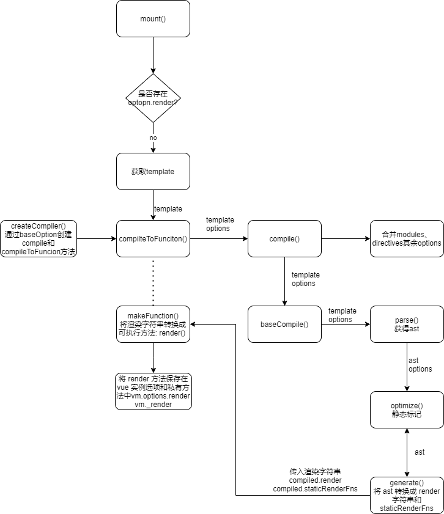


#### Parse 

* **作用**： 用正则等方式解析  template  模板中的指令、class、style 等数据，形成 AST。

  ```js
  // 被解析的模板
  <ul :class="bindCls" class="list" v-if="isShow">
      <li v-for="(item,index) in data" @click="clickItem(index)">{{item}}:{{index}}</li>
  </ul>
  
  // 最终解析出的 AST 
  ast = {
    'type': 1,
    'tag': 'ul',
    'attrsList': [],
    'attrsMap': {
      ':class': 'bindCls',
      'class': 'list',
      'v-if': 'isShow'
    },
    'if': 'isShow',
    'ifConditions': [{
      'exp': 'isShow',
      'block': // ul ast element
    }],
    'parent': undefined,
    'plain': false,
    'staticClass': 'list',
    'classBinding': 'bindCls',
    'children': [{
      'type': 1,
      'tag': 'li',
      'attrsList': [{
        'name': '@click',
        'value': 'clickItem(index)'
      }],
      'attrsMap': {
        '@click': 'clickItem(index)',
        'v-for': '(item,index) in data'
       },
      'parent': // ul ast element
      'plain': false,
      'events': {
        'click': {
          'value': 'clickItem(index)'
        }
      },
      'hasBindings': true,
      'for': 'data',
      'alias': 'item',
      'iterator1': 'index',
      'children': [
        'type': 2,
        'expression': '_s(item)+":"+_s(index)'
        'text': '{{item}}:{{index}}',
        'tokens': [
          {'@binding':'item'},
          ':',
          {'@binding':'index'}
        ]
      ]
    }]
  }
  ```

  * 生成的 AST 是一个树状结构，每一个节点都是一个 `ast element`，除了它自身的一些属性，还维护了它的父子关系，如 `parent` 指向它的父节点，`children` 指向它的所有子节点.

* **parse算法**：

  * 数据结构：

    * 使用栈保存标签头，栈中使用 root 指向根元素标签头，使用 currentParent 指向当前标签头，使用 currentParent.children 数组保存当前标签的子元素；

    * 使用数组保存 dom 属性和对应值；

      

  * 使用 `parseHTML` 函数，在里面我们循环解析  template  字符串:

    * 1.从左到右解析 template 字符串，

    * 2.使用正则匹配标签的头部，标签头入栈；将匹配的标签头放入 currentParent.children 数组， 并将 currentParent 指向栈顶节点；

    * 3.使用两个正则分别用来解析标签结束以及标签内的属性，循环一直匹配到结束标签为止，解析内部所有的属性，存入数组中；

    * 4.匹配到 `v-for` 和 `v-if` 指令时，将指令存入  attrsMap 中 ；定义一个 getAndRemoveAttr 函数，用来从 el 的 attrsMap 属性或是 attrsList 属性中取出 name 对应值（比如解析`<div v-for="item in test">` 中的 item 和 test 值）；`v-for`会将指令解析成 for 属性以及 alias 属性，而 `v-if` 会将条件都存入 ifConditions 数组中。 

    * 5.解析下一个标签解析：

      * 如果还是头标签或者是文本的话，会成为当前栈顶节点的子节点；
      * 如果是尾标签的话，从栈中取出最近的跟自己标签名一致的那个元素，将currentParent 指向那个元素，并将该元素之前的元素都从栈中出栈；（注意：这里为什么解析的尾元素不是对应栈的最上面的一个元素？因为栈中可能出现自闭合标签；如 `<br/>`标签，或者是写了`<span>`但是没有加上`< /span>`的情况，这时候就要找到栈中的第二个位置才能找到同名标签）

    * 6.最后是解析文本，这个比较简单，只需要将文本取出，然后有两种情况：

      * 一种是普通的文本，直接构建一个节点  push  进当前 currentParent 的  children  中即可；
      * 还有一种情况是文本是如“{{item}}”这样的 Vue.js  的表达式，使用一个 tokens 数组来存放解析结果，通过 defaultTagRE 来循环匹配该文本，如果是普通文本直接 push 到 tokens 数组中去，如果是表达式（{{item}}），则转化成“_s(${exp})”的形式

    * 7.最终得到的  AST  通过一些特定的属性，能够比较清晰地描述出标签的属性以及依赖关系。

      

* parse 算法示例：

  * 被解析模板： 
    * 遇到 div 入栈；从左往右解析，遇到属性存入数组；遇到指令 存入 map;
    * 遇到 span 标签头，入栈，并将 span 存入 div 元素对象的 children 数组，将 currentParent 指向 span；继续解析 span 中的指令；
    * 遇到 Vue.js  的表达式，使用一个 tokens 数组来存放解析结果；
    * 遇到 span 尾标签，从栈中取出最近的跟自己标签名一致的那个元素，将 currentParent 指向 span 元素，并将该元素之前的元素都从栈中出栈；栈中剩余 div 标签
    * 遇到 div 尾标签，将栈中  div 标签取出。

* [查看源码分析](http://caibaojian.com/vue-analysis/compile/parse.html#parse)


#### Optimize 

* **作用：**给每个节点会加上 static 属性，用来标记是否是静态的。
  * 添加 static 属性原因：
    *  Vue 是数据驱动，是响应式的，但是我们的模板并不是所有数据都是响应式的，也有很多数据是首次渲染后就永远不会变化的，那么这部分数据生成的 DOM 也不会变化，我们可以在 `patch` 的过程跳过对他们的比对;
    * patch 的过程实际上是将  VNode  节点进行一层一层的比对，然后将「差异」更新到视图上。那么一些静态节点是不会根据数据变化而产生变化的，这些节点我们没有比对的需求，因此可以添加标记在 patch 时跳过这些静态节点的比对，从而达到「优化」的目的。
* 算法：
  * 遍历所有节点通过 isStatic 来判断当前节点是否是静态节点，此外，会遍历当前节点的所有子节点，如果子节点是非静态节点，那么当前节点也是非静态节点；
  * isStatic 函数，传入一个  node  判断该  node  是否是静态节点。判断的标准是当  type  为 2（表达式节点）则是非静态节点，当 type 为 3（文本节点）的时候则是静态节点，当然，如果存在 if 或者 for这样的条件的时候（表达式节点），也是非静态节点；
  * 最后使用 markStaticRoots 函数，用来标记 staticRoot（静态根）。如果当前节点是静态节点，同时满足该节点并不是只有一个文本节点左右子节点时，标记 staticRoot 为  true，否则为  false。

#### generate 

* **作用：**generate 主要 将AST 树转换成可执行的代码 (既 render funtion 字符串) ，最终得到  render  的字符串以及 staticRenderFns  字符串。

* `generate` 函数： 定义在  [src/compiler/codegen/index.js](https://github.com/vuejs/vue/blob/v2.3.0/src/compiler/codegen/index.js) 中：

  ```js
  export function generate (
    ast: ASTElement | void,
    options: CompilerOptions
  ): CodegenResult {
    const state = new CodegenState(options)
    const code = ast ? genElement(ast, state) : '_c("div")'
  return {
      render: `with(this){return ${code}}`,
    staticRenderFns: state.staticRenderFns
    }
  }
  ```
  
  * `generate` 函数首先通过 `genElement(ast, state)` 生成 `code`，再把 `code` 用 `with(this){return ${code}}}` 包裹起来。这里的 `state` 是 `CodegenState` 的一个实例。
  
*  `genElement` 函数：判断当前 AST 元素节点的属性执行不同的代码生成函数，最后返回可执行代码 code。

  ```js
  export function genElement (el: ASTElement, state: CodegenState): string {
    if (el.staticRoot && !el.staticProcessed) {
      return genStatic(el, state)
    } else if (el.once && !el.onceProcessed) {
      return genOnce(el, state)
    } else if (el.for && !el.forProcessed) {
      return genFor(el, state)
    } else if (el.if && !el.ifProcessed) {
      return genIf(el, state)
    } else if (el.tag === 'template' && !el.slotTarget) {
      return genChildren(el, state) || 'void 0'
    } else if (el.tag === 'slot') {
      return genSlot(el, state)
    } else {
      // component or element
      let code
      if (el.component) {
        code = genComponent(el.component, el, state)
      } else {
        const data = el.plain ? undefined : genData(el, state)
  
        const children = el.inlineTemplate ? null : genChildren(el, state, true)
        code = `_c('${el.tag}'${
          data ? `,${data}` : '' // data
        }${
          children ? `,${children}` : '' // children
        })`
      }
      // module transforms
      for (let i = 0; i < state.transforms.length; i++) {
        code = state.transforms[i](el, code)
      }
      return code
    }
  }
  ```

  

* 示例：

  ```html
  <ul :class="bindCls" class="list" v-if="isShow">
        <li v-for="(item,index) in data" @click="clickItem(index)">{{item}}:{{index}}</li>
    </ul>
  ```

    ```js
  //它经过编译，执行 `const code = generate(ast, options)`，生成的 `render` 代码串如下：
  with(this){
      return (isShow) ?
        _c('ul', {
            staticClass: "list",
            class: bindCls
          },
          _l((data), function(item, index) {
            return _c('li', {
              on: {
                "click": function($event) {
                  clickItem(index)
                }
              }
            },
            [_v(_s(item) + ":" + _s(index))])
          })
        ) : _e()
    }
    ```

  * 在 `compileToFunctions` 中，通过 ` makeFunction()`  把 `render` 代码串转换成函数，它的定义在 [src/compiler/index.js](https://github.com/vuejs/vue/blob/v2.3.0/src/compiler/index.js)中

    ```js
  /*提供一个方法，根据传递的baseOptions（不同平台可以有不同的实现）创建相应的编译器*/
    export function createCompiler (baseOptions: CompilerOptions) {
      // 省略 compile 代码...
    
      /*带缓存的编译器，同时staticRenderFns以及render函数会被转换成Funtion对象*/
      function compileToFunctions (
        template: string,
        options?: CompilerOptions,
        vm?: Component
      ): CompiledFunctionResult {
        // 省略其余代码....
        /*编译*/
        const compiled = compile(template, options)
    
        // turn code into functions
        const res = {}
        const fnGenErrors = []
        /*将 render 转换成 Funtion对象*/
        res.render = makeFunction(compiled.render, fnGenErrors)
        /*将 staticRenderFns 全部转化成 Funtion 对象 */
        const l = compiled.staticRenderFns.length
        res.staticRenderFns = new Array(l)
        for (let i = 0; i < l; i++) {
          res.staticRenderFns[i] = makeFunction(compiled.staticRenderFns[i], fnGenErrors)
        }
      }
    }
    ```

    

  * `makeFunction` 方法: 把 `render` 代码串通过 `new Function` 的方式转换成可执行的函数，赋值给 `vm.options.render`，这样当组件通过 `vm._render` 的时候，就会执行这个 `render` 函数。定义在 [src/compiler/index.js](https://github.com/vuejs/vue/blob/v2.3.0/src/compiler/index.js) 中：

    ```js
    function makeFunction (code, errors) {
      try {
        return new Function(code)
      } catch (err) {
        errors.push({ err, code })
        return noop
      }
    }
    ```

* 接下来就会执行组件挂载，调用原型上的 `mount` 方法，`mount` 方法中调用 `mountComponent` 执行组件挂载，组件挂载主要将 render function 渲染成 VNode，在渲染过程中会触发数据依赖的收集。 

#### 依赖收集

* 依赖收集发生时间：模板编译完成 -> 原型中的 `mount()`  -> `mountComponent()` ->  `new Watcher()` 创建渲染 watcher 的构造函数 -> `watcher.get()`。

* 作用： 订阅数据变化的 watcher 的收集，数据更新时，触发数据 setter，通知到对应的 vm 实例订阅者进行视图的更新。

  ```javascript
  //假设我们现在有一个全局的对象，我们可能会在多个  Vue  对象中用到它进行展示。
  let globalObj = {
      text1:'text1'
  };
  let o1 = new Vue({
      template:`<div><span>{{text1}}</span><div>`,
      data: globalObj
  });
  let o2 = newVue({
      template:`<div><span>{{text1}}</span><div>`,
      data:globalObj
  });
  //这个时候，我们执行了如下操作。 
  globalObj.text1='hello,text1';
  //我们应该需要通知 o1 以及 o2 两个 vm 实例进行视图的更新，「依赖收集」会让 text1 这个数据知道“哦～有两个地方依赖我的数据，我变化的时候需要通知它们～
  ```

* 通过依赖收集最终会形成数据与视图的一种对应关系：

  * 一个数据 data 对应一个依赖对象，依赖对象用于收集 Watcher 对象；
  * Watcher 通常包括组件的 渲染 Watcher，用户自定义 Watcher，computed Watcher等。
  * 当数据 data 发生变化时，会通过 遍历 Dep 对象，调用 watcher.run() 进行视图更新。
  
  
  
* 依赖收集流程

  * 一次依赖收集流程

    

  * 嵌套组件依赖收集流程： 依赖收集发生在组件渲染时，嵌套组件创建过程是深度遍历子组件和父组件，因此嵌套组件依赖收集也是先收集子组件依赖后收集父组件依赖。

    


**依赖对象Dep & Watcher 对象**

* Dep 对象：`Dep` 是一个 Class，它定义了一些属性和方法，对 `Watcher` 的管理对象。定义在 `src/core/observer/dep.js` 中：

  ```javascript
  /* @flow */
  
  import type Watcher from './watcher'
  import { remove } from '../util/index'
  
  let uid = 0
  /**
   * A dep is an observable that can have multiple
   * directives subscribing to it.
   * Dep 实际上就是对 Watcher 的一种管理，Dep 脱离 Watcher 单独存在是没有意义的
   */
  export default class Dep {
    static target: ?Watcher;//静态属性 target，这是一个全局唯一 Watcher，在同一时间只能有一个全局的 Watcher 被计算
    id: number;
    subs: Array<Watcher>;
  
    constructor () {
      this.id = uid++
      this.subs = []
    }
  
    /*添加一个观察者对象*/
    addSub (sub: Watcher) {
      this.subs.push(sub)
    }
  
    /*移除一个观察者对象*/
    removeSub (sub: Watcher) {
      remove(this.subs, sub)
    }
  
    /*依赖收集，当存在Dep.target的时候添加观察者对象*/
    depend () {
      if (Dep.target) {
        Dep.target.addDep(this)
      }
    }
  
    /*通知所有订阅者*/
    notify () {
      // stabilize the subscriber list first
      const subs = this.subs.slice()
      for (let i = 0, l = subs.length; i < l; i++) {
        subs[i].update()
      }
    }
  }
  
  // the current target watcher being evaluated.
  // this is globally unique because there could be only one
  // watcher being evaluated at any time.
  /**静态属性 target，这是一个全局唯一 Watcher，这是一个非常巧妙的设计，因为在同一时间只能有一个全局的 Watcher 被计算，另外它的自身属性 subs 也是 Watcher 的数组 */
  /*依赖收集完需要将Dep.target设为null，防止后面重复添加依赖。*/
  Dep.target = null
  const targetStack = []
  
  /*将watcher观察者实例设置给Dep.target，用以依赖收集。同时将该实例存入target栈中*/
  export function pushTarget (_target: Watcher) {
    if (Dep.target) targetStack.push(Dep.target)
    Dep.target = _target
  }
  
  /*将观察者实例从target栈中取出并设置给Dep.target*/
  export function popTarget () {
    Dep.target = targetStack.pop()
  }
  
  ```

* Watcher 对象：进行依赖收集的观察者，同时在数据变更时通知响应数据改变。

  
  

**过程分析**

*  Vue 的 mount 过程是通过 `mountComponent` 函数，其中有一段比较重要的逻辑，大致如下：

  ```js
  updateComponent = () => {
    vm._update(vm._render(), hydrating)
  }
  new Watcher(vm, updateComponent, noop, {
    before () {
      if (vm._isMounted) {
        callHook(vm, 'beforeUpdate')
      }
    }
  }, true /* isRenderWatcher */)
  ```

  当我们去实例化一个渲染 `watcher` 的时候，首先进入 `watcher` 的构造函数逻辑，然后会执行它的 `this.get()` 方法，进入 `get` 函数，首先会执行：

  ```js
  pushTarget(this)
  ```

  `pushTarget` 的定义在 `src/core/observer/dep.js` 中：

  ```js
  export function pushTarget (_target: Watcher) {
    if (Dep.target) targetStack.push(Dep.target)
    Dep.target = _target
  }
  ```

  实际上就是把 `Dep.target` 赋值为当前的渲染 `watcher` 并压栈（为了恢复用）。接着又执行了：

  ```js
  value = this.getter.call(vm, vm)
  ```

  `this.getter` 对应就是 `updateComponent` 函数，这实际上就是在执行：

  ```js
  vm._update(vm._render(), hydrating)
  ```

  它会先执行 `vm._render()` 方法，因为之前分析过这个方法会生成 渲染 VNode，并且在这个过程中会对 `vm` 上的数据访问，这个时候就触发了数据对象的 getter。

  那么每个对象值的 getter 都持有一个 `dep`，在触发 getter 的时候会调用 `dep.depend()` 方法，也就会执行 `Dep.target.addDep(this)`。

  刚才我们提到这个时候 `Dep.target` 已经被赋值为渲染 `watcher`，那么就执行到 `addDep` 方法：

  ```js
  addDep (dep: Dep) {
    const id = dep.id
    if (!this.newDepIds.has(id)) {
      this.newDepIds.add(id)
      this.newDeps.push(dep)
      if (!this.depIds.has(id)) {
        dep.addSub(this)
      }
    }
  }
  ```

  这时候会做一些逻辑判断（保证同一数据不会被添加多次）后执行 `dep.addSub(this)`，那么就会执行 `this.subs.push(sub)`，也就是说把当前的 `watcher` 订阅到这个数据持有的 `dep` 的 `subs` 中，这个目的是为后续数据变化时候能通知到哪些 `subs` 做准备。

  所以在 `vm._render()` 过程中，会触发所有数据的 getter，这样实际上已经完成了一个依赖收集的过程。那么到这里就结束了么，其实并没有，再完成依赖收集后，还有几个逻辑要执行，首先是：

  ```js
  if (this.deep) {
    traverse(value)
  }
  ```

  这个是要递归去访问 `value`，触发它所有子项的 `getter`，这个之后会详细讲。接下来执行：

  ```js
  popTarget()
  ```

  `popTarget` 的定义在 `src/core/observer/dep.js` 中：

  ```js
  Dep.target = targetStack.pop()
  ```

  实际上就是把 `Dep.target` 恢复成上一个状态，因为当前 vm 的数据依赖收集已经完成，那么对应的渲染`Dep.target` 也需要改变。最后执行：

  ```js
  cleanupDeps () {
    let i = this.deps.length
  while (i--) {
      const dep = this.deps[i]
    if (!this.newDepIds.has(dep.id)) {
        dep.removeSub(this)
      }
    }
    let tmp = this.depIds
    this.depIds = this.newDepIds
    this.newDepIds = tmp
    this.newDepIds.clear()
    tmp = this.deps
    this.deps = this.newDeps
    this.newDeps = tmp
    this.newDeps.length = 0
  }
  ```
  
  考虑到 Vue 是数据驱动的，所以每次数据变化都会重新 render，那么 `vm._render()` 方法又会再次执行，并再次触发数据的 getters，所以 `Wathcer` 在构造函数中会初始化 2 个 `Dep` 实例数组，`newDeps` 表示新添加的 `Dep` 实例数组，而 `deps` 表示上一次添加的 `Dep` 实例数组。
  
  在执行 `cleanupDeps` 函数的时候，会首先遍历 `deps`，移除对 `dep` 的订阅，然后把 `newDepIds` 和 `depIds` 交换，`newDeps` 和 `deps` 交换，并把 `newDepIds` 和 `newDeps` 清空。
  
  那么为什么需要做 `deps` 订阅的移除呢，在添加 `deps` 的订阅过程，已经能通过 `id` 去重避免重复订阅了。

  考虑到一种场景，我们的模板会根据 `v-if` 去渲染不同子模板 a 和 b，当我们满足某种条件的时候渲染 a 的时候，会访问到 a 中的数据，这时候我们对 a 使用的数据添加了 getter，做了依赖收集，那么当我们去修改 a 的数据的时候，理应通知到这些订阅者。那么如果我们一旦改变了条件渲染了 b 模板，又会对 b 使用的数据添加了 getter，如果我们没有依赖移除的过程，那么这时候我去修改 a 模板的数据，会通知 a 数据的订阅的回调，这显然是有浪费的。

### 首次渲染

* 首次渲染为 vue 通过初始化数据渲染出视图的过程，未涉及数据修改后重新触发视图渲染流程。

* 首次渲染流程：通过 初始化 -> 挂载组件 -> 模板编译 -> 依赖收集 -> 触发 render() 渲染视图 -> 完成 vue 视图的首次渲染。

* 首次渲染阶段：

  * 渲染阶段：将 render function 渲染成 Virtual Dom Node; 对应以下 render -> patch 阶段；
  * 挂载阶段：将  Virtual Dom Node 调用 DOM API 创建页面；对应以下 render -> patch  阶段;
  
  

### Virtual DOM

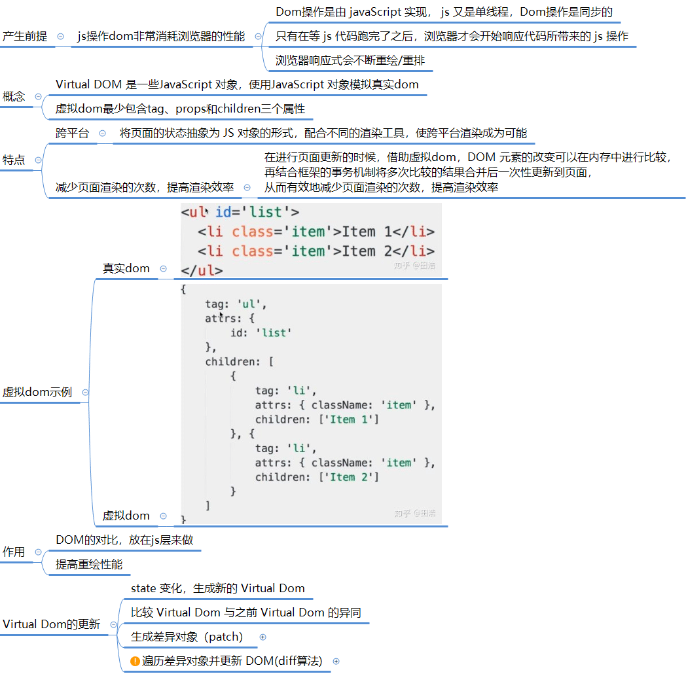


* Vue 中 定义了 Virtual DOM 的数据结构，映射到真实的 DOM 实际上要经历 VNode 的 create、patch、diff 等过程：

  * 创建过程：在模板编译以后，通过 render() 渲染时，调用 createElement 创建 父Vnode 占位符；  
* path 过程：把 VNode 渲染成真实的 DOM 的过程。
    *  首先，通过另一个 `createElem()` ，递归方式深度遍历创建子组件 VNode，通过 `insert()` 插入到真实 dom；
  * 更新父占 VNode 位节点，最后创建了一个完整的 DOM 树并插入到 Body 上
  * 当数据更新时：path 过程会执行 diff 比较，记录下两棵树的差异，最后将记录的有差异的地方应用到真正的 DOM 树中去，完成视图就更新。
  

#### **Virtual Dom 结构**

```javascript
// Virtual DOM
{ 
tag:'div',	/*说明这是一个div标签*/
	children:[	/*存放该标签的子节点*/
		{
			tag:'a',	/*说明这是一个a标签*/
			text:'clickme'	/*标签的内容*/
		}
	]
}
//渲染后的 真实 DOM
<div><a>clickme</a></div>
```

* 虚拟dom与真实dom映射过程:

  * 1.借助JSX编译器，将文件中的HTML转化成函数的形式

    html 元素：

    ```js
    function render() {
        return (
            <ul>
                <li>0</li>
                {
                    [1, 2, 3].map( i => (
                        <li>{i}</li>
                    ))
                }
            </ul>
        );
    }
    ```

     JSX编译后函数：(h()函数为createElement()函数别名)

    ```js
    function render() {
        return h(
            'ul',
            null,
            h(
                'li',
                null,
                '0'
            ),
            /*
             * 需要将下面这个数组解构出来再放到children数组中
             */
            [1, 2, 3].map(i => h(
                'li',
                null,
                i
            ))
        );
    }
    ```

  * 2.利用这个函数生成虚拟dom对象: 函数转成虚拟dom对象(执行h函数后得到虚拟dom对象）

    ```js
    {
        tag: "div",
        props: {},
        children: [
            "Hello World", 
            {
                tag: "ul",
                props: {},
                children: [{
                    tag: "li",
                    props: {
                        id: 1,
                        class: "li-1"
                    },
                    children: ["第", 1]
                }]
            }
        ]
    }
    ```

  * 3.通过遍历虚拟对象，生成真实的dom

    ```js
    // 创建dom元素
    function createElement(vdom) {
        // 如果vdom是字符串或者数字类型，则创建文本节点，比如“Hello World”
        if (typeof vdom === 'string' || typeof vdom === 'number') {
            return doc.createTextNode(vdom);
        }
    
        const {tag, props, children} = vdom;
    
        // 1. 创建元素
        const element = doc.createElement(tag);
    
        // 2. 属性赋值
        setProps(element, props);
    
        // 3. 创建子元素
        // appendChild在执行的时候，会检查当前的this是不是dom对象，因此要bind一下
        children.map(createElement)
                .forEach(element.appendChild.bind(element));
    
        return element;
    }
    
    // 属性赋值
    function setProps(element, props) {
        for (let key in props) {
            element.setAttribute(key, props[key]);
        }
    }
    ```

  * 生成dom时，vue.js 使用一层适配层了，将不同平台的  API  封装在内，以同样的接口对外提供

    ```js
    //nodeOps 对象做适配，根据  platform  区分不同平台来执行当前平台对应的 API，而对外则是提供了一致的接口，供  Virtual DOM  来调用
    const nodeOps={
        setTextContent(text){
            if(platform==='weex'){
                node.parentNode.setAttr('value',
                text);
            }elseif(platform==='web'){
                node.textContent=text;
            }
        },
        parentNode(){
            //......
        },
        removeChild(){
            //......
        },
        nextSibling(){
            //......
        },
        insertBefore(){
            //......
        }
    }
    ```

    

* Virtual DOM 源码中定义：定义在 [src/core/vdom/vnode.js](https://github.com/vuejs/vue/blob/v2.3.0/src/core/vdom/vnode.js) 中。

  ```js
  export default class VNode {
    tag: string | void;
    data: VNodeData | void;
    children: ?Array<VNode>;
    text: string | void;
    elm: Node | void;
    ns: string | void;
    context: Component | void; // rendered in this component's scope
    key: string | number | void;
    componentOptions: VNodeComponentOptions | void;
    componentInstance: Component | void; // component instance
    parent: VNode | void; // component placeholder node
  
    // strictly internal
    raw: boolean; // contains raw HTML? (server only)
    isStatic: boolean; // hoisted static node
    isRootInsert: boolean; // necessary for enter transition check
    isComment: boolean; // empty comment placeholder?
    isCloned: boolean; // is a cloned node?
    isOnce: boolean; // is a v-once node?
    asyncFactory: Function | void; // async component factory function
    asyncMeta: Object | void;
    isAsyncPlaceholder: boolean;
    ssrContext: Object | void;
    fnContext: Component | void; // real context vm for functional nodes
    fnOptions: ?ComponentOptions; // for SSR caching
    fnScopeId: ?string; // functional scope id support
  
    constructor (
      tag?: string,
      data?: VNodeData,
      children?: ?Array<VNode>,
      text?: string,
      elm?: Node,
      context?: Component,
      componentOptions?: VNodeComponentOptions,
      asyncFactory?: Function
    ) {
      this.tag = tag
      this.data = data
      this.children = children
      this.text = text
      this.elm = elm
      this.ns = undefined
      this.context = context
      this.fnContext = undefined
      this.fnOptions = undefined
      this.fnScopeId = undefined
      this.key = data && data.key
      this.componentOptions = componentOptions
      this.componentInstance = undefined
      this.parent = undefined
      this.raw = false
      this.isStatic = false
      this.isRootInsert = true
      this.isComment = false
      this.isCloned = false
      this.isOnce = false
      this.asyncFactory = asyncFactory
      this.asyncMeta = undefined
      this.isAsyncPlaceholder = false
    }
  
    // DEPRECATED: alias for componentInstance for backwards compat.
    /* istanbul ignore next */
    get child (): Component | void {
      return this.componentInstance
    }
  }
  ```

  * VNode 是对真实 DOM 的一种抽象描述，它的核心定义无非就几个关键属性，标签名、数据、子节点、键值等，其它属性都是都是用来扩展 VNode 的灵活性以及实现一些特殊 feature 的。由于 VNode 只是用来映射到真实 DOM 的渲染，不需要包含操作 DOM 的方法，因此它是非常轻量和简单的。

#### render

* 作用： 把实例渲染成一个虚拟 Node，生成 Virtual DOM。

* render 方法生成：通过模板编译将 ast 转换成 code，生成可执行的 render() 挂到 vue 实例 选项和 私有方法中。

* render 调用： 在依赖收集阶段， `new Watcher(vm, updateComponent, noop)` 时回调的  `updateComponent` 中调用。 

* render 流程图：

  

* Vue 的 `_render` 方法：定义在 [src/core/instance/render.js](https://github.com/vuejs/vue/blob/v2.3.0/src/core/instance/render.js) 文件中：

  ```js
  export function renderMixin (Vue: Class<Component>) {
    //省略无关代码...
    /*vm._render 最终是通过执行 createElement 方法并返回 vnode，它是一个虚拟 Node*/
    Vue.prototype._render = function (): VNode {
      const vm: Component = this
      const {
        render,
        staticRenderFns,
        _parentVnode
      } = vm.$options
  
      if (vm._isMounted) {
        // clone slot nodes on re-renders
        /*在重新渲染时会克隆槽位节点*/
        for (const key in vm.$slots) {
          vm.$slots[key] = cloneVNodes(vm.$slots[key])
        }
      }
  
      /*作用域slot*/
      vm.$scopedSlots = (_parentVnode && _parentVnode.data.scopedSlots) || emptyObject
  
      if (staticRenderFns && !vm._staticTrees) {
        /*用来存放static节点，已经被渲染的并且不存在v-for中的static节点不需要重新渲染，只需要进行浅拷贝*/
        vm._staticTrees = []
      }
      // set parent vnode. this allows render functions to have access
      // to the data on the placeholder node.
      vm.$vnode = _parentVnode
      // render self
      /*渲染*/
      let vnode
      try {
        /**
         * _render方法核心：调用render函数，返回一个VNode节点
         * @param {} vm._renderProxy 生产环境下为vue实例，开发环境为代理 （./init.js中初始化了_renderProxy）
         * @param {} vm.$createElement 内置创建VNode方法，render时候调用该方法创建VNode（定义在../vdom/create-element）
         */
        vnode = render.call(vm._renderProxy, vm.$createElement)
      } catch (e) {
        handleError(e, vm, `render function`)
        // return error render result,
        // or previous vnode to prevent render error causing blank component
        /* istanbul ignore else */
        if (process.env.NODE_ENV !== 'production') {
          vnode = vm.$options.renderError
            ? vm.$options.renderError.call(vm._renderProxy, vm.$createElement, e)
            : vm._vnode
        } else {
          vnode = vm._vnode
        }
      }
      // return empty vnode in case the render function errored out
      /*如果VNode节点没有创建成功则创建一个空节点*/
      if (!(vnode instanceof VNode)) {
        // VNode为数组，表示当前根节点不止一个节点，报错
        if (process.env.NODE_ENV !== 'production' && Array.isArray(vnode)) {
          warn(
            'Multiple root nodes returned from render function. Render function ' +
            'should return a single root node.',
            vm
          )
        }
        vnode = createEmptyVNode()
      }
      // set parent
      vnode.parent = _parentVnode
      return vnode
    }
  // 省略无关代码...
  }
  
  ```

  * `render` 函数核心代码： `vnode = render.call(vm._renderProxy, vm.$createElement)`

  * `render` 函数中的 参数 `vm.$createElement`  就是我们编写传入的 `render` 选项的`createElement` 方法。

    ```html
    <div id="app">
      {{ message }}
    </div>
    ```

    相当于我们编写如下 `render` 函数：

    ```js
    render: function (createElement) {
      return createElement('div', {
         attrs: {
            id: 'app'
          },
      }, this.message)
    }
    ```

  * `vm.$createElement` 方法：定义在 [src/core/instance/render.js](https://github.com/vuejs/vue/blob/v2.3.0/src/core/instance/render.js) 文件中。

    ```js
    /*初始化render*/
    export function initRender (vm: Component) {
      vm._vnode = null // the root of the child tree
      vm._staticTrees = null
      const parentVnode = vm.$vnode = vm.$options._parentVnode // the placeholder node in parent tree  父树中的占位符节点
      const renderContext = parentVnode && parentVnode.context
      vm.$slots = resolveSlots(vm.$options._renderChildren, renderContext)
      vm.$scopedSlots = emptyObject
      // bind the createElement fn to this instance
      // so that we get proper render context inside it.
      // args order: tag, data, children, normalizationType, alwaysNormalize
      // internal version is used by render functions compiled from templates
      /**
       * 被编译生成的render函数使用的方法
       * 将createElement函数绑定到该实例上，该vm存在闭包中，不可修改，vm实例则固定。这样我们就可以得到正确的上下文渲染
       */
      vm._c = (a, b, c, d) => createElement(vm, a, b, c, d, false)
      // normalization is always applied for the public version, used in
      // user-written render functions.
      /**
       * 给手写的render函数提供的创建 VNode 的方法
       * 常规方法被用于公共版本，被用来作为用户界面的渲染方法
       */
      vm.$createElement = (a, b, c, d) => createElement(vm, a, b, c, d, true)
    }
    ```

    * `vm.$createElement` 方法定义是在执行 `initRender` 方法的时候，可以看到除了 `vm.$createElement` 方法，还有一个 `vm._c` 方法，它是被模板编译成的 `render` 函数使用，而 `vm.$createElement` 是用户手写 `render` 方法使用的， 这俩个方法支持的参数相同，并且内部都调用了 `createElement` 方法。

* `createElement()` 方法:对 _createElement 方法的封装，它允许传入的参数更加灵活。

  ```js
  /**
   * createElement 方法实际上是对 _createElement 方法的封装，它允许传入的参数更加灵活，
   * 在处理这些参数后，调用真正创建 VNode 的函数 _createElement
   * @param {*} context 表示 VNode 的上下文环境，它是 Component 类型
   * @param {*} tag 表示标签，它可以是一个字符串，也可以是一个 Component
   * @param {*} data 表示 VNode 的数据，它是一个 VNodeData 类型，可以在 flow/vnode.js 中找到它的定义
   * @param {*} children 表示当前 VNode 的子节点，它是任意类型的，它接下来需要被规范为标准的 VNode 数组
   * @param {*} normalizationType 表示子节点规范的类型，类型不同规范的方法也就不一样，它主要是参考 render 函数是编译生成的还是用户手写的
   * @param {*} alwaysNormalize 
   */
  export function createElement (
    context: Component,
    tag: any,
    data: any,
    children: any,
    normalizationType: any,
    alwaysNormalize: boolean
  ): VNode {
    /*兼容不传data的情况,将所有参数前移*/
    if (Array.isArray(data) || isPrimitive(data)) {
      normalizationType = children
      children = data
      data = undefined
    }
    /*如果alwaysNormalize为true，则normalizationType标记为ALWAYS_NORMALIZE*/
    if (isTrue(alwaysNormalize)) {
      normalizationType = ALWAYS_NORMALIZE
    }
    /*创建虚拟节点*/
    return _createElement(context, tag, data, children, normalizationType)
  }
  ```

* `_createElement()` 方法:  创建 VNode，它定义在  [src/core/vdom/create-elemenet.js](https://github.com/vuejs/vue/blob/v2.3.0/src/core/vdom/create-elemenet.js) 中:

  ```js
  /*创建VNode节点*/
  export function _createElement (
    context: Component, // 表示 VNode 的上下文环境
    tag?: string | Class<Component> | Function | Object, //表示标签
    data?: VNodeData, // VNode 的数据
    children?: any, //当前 VNode 的子节点，它是任意类型的，它接下来需要被规范为标准的 VNode 数组；
    normalizationType?: number //子节点规范的类型，类型不同规范的方法也就不一样，它主要是参考 render 函数是编译生成的还是用户手写的
  ): VNode {
    /*
      如果data未定义（undefined或者null）或者是data的__ob__已经定义（代表已经被observed，上面绑定了Oberver对象），
      https://cn.vuejs.org/v2/guide/render-function.html#约束，那么创建一个空节点
    */
    if (isDef(data) && isDef((data: any).__ob__)) {
      process.env.NODE_ENV !== 'production' && warn(
        `Avoid using observed data object as vnode data: ${JSON.stringify(data)}\n` +
        'Always create fresh vnode data objects in each render!',
        context
      )
      //返回空节点
      return createEmptyVNode()
    }
    /*如果tag不存在也是创建一个空节点*/
    if (!tag) {
      // in case of component :is set to falsy value
      return createEmptyVNode()
    }
    // support single function children as default scoped slot
    /*默认默认作用域插槽*/
    if (Array.isArray(children) &&
        typeof children[0] === 'function') {
      data = data || {}
      data.scopedSlots = { default: children[0] }
      children.length = 0
    }
    /**
     * 由于 Virtual DOM 实际上是一个树状结构，每一个 VNode 可能会有若干个子节点，这些子节点应该也是 VNode 的类型。
     * _createElement 接收的第 4 个参数 children 是任意类型的，因此我们需要把它们规范成 VNode 类型 
     * 根据 normalizationType 的不同，调用了 normalizeChildren(children) 和 simpleNormalizeChildren(children) 方法
     * 它们的定义都在 src/core/vdom/helpers/normalzie-children.js 中*/
    if (normalizationType === ALWAYS_NORMALIZE) {
    //normalizeChildren 方法的调用场景有 2 种：
    //一个场景是 render 函数是用户手写的，当 children 只有一个节点的时候，Vue.js 从接口层面允许用户把 children 写成基础类型用来创建单个简单的文本节点，这种情况会调用 createTextVNode 创建一个文本节点的 VNode；
  //另一个场景是当编译 slot、v-for 的时候会产生嵌套数组的情况，会调用 normalizeArrayChildren 方法
      children = normalizeChildren(children)
    } else if (normalizationType === SIMPLE_NORMALIZE) {
    //simpleNormalizeChildren 方法调用场景是 render 函数是编译生成的
    //理论上编译生成的 children 都已经是 VNode 类型的，但这里有一个例外，就是 functional component 函数式组件返回的是一个数组而不是一个根节点，所以会通过 Array.prototype.concat 方法把整个 children 数组打平，让它的深度只有一层
      children = simpleNormalizeChildren(children)
    }
    let vnode, ns
    if (typeof tag === 'string') { //传入createElement()为Vnode对象时，tag为string
      let Ctor
      /*获取tag的名字空间*/
      ns = config.getTagNamespace(tag)
      /*判断是否是保留的标签*/
      if (config.isReservedTag(tag)) {
        // platform built-in elements
        /*如果是保留的标签则创建一个相应节点*/
        vnode = new VNode(
          config.parsePlatformTagName(tag), data, children,
          undefined, undefined, context
        )
        /*调用 resolveAsset(context.$options, 'components', tag)，
        即拿 vm.$options.components[tag]，这样我们就可以在 resolveAsset 的时候拿到这个组件的构造函数，
        并作为 createComponent 的钩子的参数*/
      } else if (isDef(Ctor = resolveAsset(context.$options, 'components', tag))) {
        //如果是为已注册的组件名，则通过 createComponent 创建一个组件类型的 VNode
        /*从vm实例的option的components中寻找该tag，存在则就是一个组件，创建相应节点，Ctor为组件的构造类*/
        vnode = createComponent(Ctor, data, context, children, tag)
      } else {
        // unknown or unlisted namespaced elements
        // check at runtime because it may get assigned a namespace when its
        // parent normalizes children
        /*未知的元素，在运行时检查，因为父组件可能在序列化子组件的时候分配一个名字空间*/
        vnode = new VNode(
          tag, data, children,
          undefined, undefined, context
        )
      }
    } else {
      //直接传入 createElement() 组件对象
      // direct component options / constructor
      /*tag不是字符串的时候则是组件的构造类，调用createComponent创建组件*/
      vnode = createComponent(tag, data, context, children)
    }
    if (isDef(vnode)) {
      /*如果有名字空间，则递归所有子节点应用该名字空间*/
      if (ns) applyNS(vnode, ns)
      return vnode
    } else {
      /*如果vnode没有成功创建则创建空节点*/
      return createEmptyVNode()
    }
  }
  ```

  * 由于 Virtual DOM 实际上是一个树状结构，每一个 VNode 可能会有若干个子节点，这些子节点应该也是 VNode 的类型。`_createElement` 接收的第 4 个参数 children 是任意类型的，因此我们需要把它们规范成 VNode 类型。

  * 这里根据 `normalizationType` 的不同，调用了 `normalizeChildren(children)` 和 `simpleNormalizeChildren(children)` 方法，它们的定义都在 [src/core/vdom/helpers/normalzie-children.js](https://github.com/vuejs/vue/blob/v2.3.0/src/core/vdom/helpers/normalize-children.js) 中：

    ```js
    /**
     * simpleNormalizeChildren 方法调用场景是 render 函数是编译生成的。
     * 理论上编译生成的 children 都已经是 VNode 类型的，但这里有一个例外，
     * 就是 functional component 函数式组件返回的是一个数组而不是一个根节点，
     * 所以会通过 Array.prototype.concat 方法把整个 children 数组打平，让它的深度只有一层
     * 该方法仅考虑最多二维数组情况
     * @param {*} children 
     */
    export function simpleNormalizeChildren (children: any) {
      for (let i = 0; i < children.length; i++) {
        if (Array.isArray(children[i])) {
          return Array.prototype.concat.apply([], children)
        }
      }
      return children
    }
    
    /**
     * normalizeChildren 方法的调用场景有 2 种，一个场景是 render 函数是用户手写的，
     * 当 children 只有一个节点的时候，Vue.js 从接口层面允许用户把 children 写成基础类型用来创建单个简单的文本节点，
     * 这种情况会调用 createTextVNode 创建一个文本节点的 VNode；
     * 另一个场景是当编译 slot、v-for 的时候会产生嵌套数组的情况，会调用 normalizeArrayChildren 方法
     * @param {*} children 
     */
    export function normalizeChildren (children: any): ?Array<VNode> {
      return isPrimitive(children)
        ? [createTextVNode(children)] //返回一维数组，数组中包含一个文本VNode
        : Array.isArray(children)
          ? normalizeArrayChildren(children)
          : undefined
    }
    
    /**
     * 作用：对 children 的规范化，children 变成了一个类型为 VNode 的 Array，将children多维数组转为一维数组
     * normalizeArrayChildren 主要的逻辑就是遍历 children，获得单个节点 c，然后对 c 的类型判断，
     * 如果是一个数组类型，则递归调用 normalizeArrayChildren; 
     * 如果是基础类型，则通过 createTextVNode 方法转换成 VNode 类型；
     * 否则就已经是 VNode 类型了，如果 children 是一个列表并且列表还存在嵌套的情况，
     * 则根据 nestedIndex 去更新它的 key。
     * 这里需要注意一点，在遍历的过程中，对这 3 种情况都做了如下处理：
     * 如果存在两个连续的 text 节点，会把它们合并成一个 text 节点
     * 经过对 children 的规范化，children 变成了一个类型为 VNode 的 Array
     * @param {*} children 表示要规范的子节点
     * @param {*} nestedIndex 表示嵌套的索引，因为单个 child 可能是一个数组类型
     */
    function normalizeArrayChildren (children: any, nestedIndex?: string): Array<VNode> {
      const res = []
      let i, c, last
      for (i = 0; i < children.length; i++) { //遍历子节点
        c = children[i] //获得一个子节点
        if (isUndef(c) || typeof c === 'boolean') continue
        last = res[res.length - 1]
        //  nested
        if (Array.isArray(c)) { //如果是一个数组类型，则递归调用 normalizeArrayChildren
          res.push.apply(res, normalizeArrayChildren(c, `${nestedIndex || ''}_${i}`))
        } else if (isPrimitive(c)) { //如果是基础类型
          if (isDef(last) && isDef(last.text)) { //为文本节点
            last.text += String(c)
          } else if (c !== '') {
            // convert primitive to vnode
            //通过 createTextVNode 方法转换成 VNode 类型
            res.push(createTextVNode(c))
          }
        } else { //已经是 VNode 类型了
          if (isDef(c.text) && isDef(last) && isDef(last.text)) {
            res[res.length - 1] = createTextVNode(last.text + c.text)
          } else {
            // default key for nested array children (likely generated by v-for)
            if (isDef(c.tag) && isUndef(c.key) && isDef(nestedIndex)) {
              c.key = `__vlist${nestedIndex}_${i}__`
            }
            res.push(c)
          }
        }
      }
      return res
    }
    ```

* `vm._render` 是如何创建了一个 VNode，接下来就是要把这个 VNode 渲染成一个真实的 DOM 并渲染出来，这个过程是通过 `vm._update` 完成的。

* `update`:

  * 作用：对 patch 方法封装，把 VNode 渲染成真实的 DOM。

  * 调用的时机：

    * 一个是首次渲染；
    * 一个是数据更新的时候；

  * `_update` 函数：方法在初始化时 `lifecycleMixin`中添加到 Vue.prototype，定义在 [src/core/instance/lifecycle.js](https://github.com/vuejs/vue/blob/v2.3.0/src/core/instance/lifecycle.js) 中：

    ```js
    export function lifecycleMixin(Vue: Class<Component>) {
      /*更新节点Vue 的 _update 是实例的一个私有方法，它被调用的时机有 2 个，一个是首次渲染，一个是数据更新的时候*/
      Vue.prototype._update = function (vnode: VNode, hydrating?: boolean) {
        const vm: Component = this
        /*如果该组件已经挂载过了则代表进入这个步骤是个更新的过程，触发beforeUpdate钩子*/
        if (vm._isMounted) {
          callHook(vm, 'beforeUpdate')
        }
        const prevEl = vm.$el
        const prevVnode = vm._vnode //首次渲染时 _vonde为空
        const prevActiveInstance = activeInstance //activeInstance 作用就是保持当前上下文的 Vue 实例，它是在 lifecycle 模块的全局变量
        activeInstance = vm
        vm._vnode = vnode//这个 vnode 是通过 vm._render() 返回的组件渲染 VNode，vm._vnode 和 vm.$vnode 的关系就是一种父子关系，用代码表达就是 vm._vnode.parent === vm.$vnode
        // Vue.prototype.__patch__ is injected in entry points
        // based on the rendering backend used.
        /*基于后端渲染Vue.prototype.__patch__被用来作为一个入口*/
        if (!prevVnode) { //首次渲染
        /* vm.__patch__ 方法实际上在不同的平台，比如 web 和 weex 上的定义是不一样的，
          因此在 web 平台中它的定义在 src/platforms/web/runtime/index.js 中
          首次渲染在执行 patch 函数的时候，传入的 vm.$el 对应的是例子中 options的el选项对应的 DOM 对象,这个也就是我们在 index.html 模板中写的 <div id="app">
          vm.$el 的赋值是在之前 mountComponent 函数做的，vnode 对应的是调用 render 函数的返回值，hydrating 在非服务端渲染情况下为 false; removeOnly 为 false
        */
          vm.$el = vm.__patch__(
            vm.$el, vnode, hydrating, false /* removeOnly */,
            vm.$options._parentElm,
            vm.$options._refElm
          )
        } else { //数据更新
          // updates
          vm.$el = vm.__patch__(prevVnode, vnode)
        }
        activeInstance = prevActiveInstance
        // update __vue__ reference
        /*更新新的实例对象的__vue__*/
        if (prevEl) {
          prevEl.__vue__ = null
        }
        if (vm.$el) {
          vm.$el.__vue__ = vm
        }
        // if parent is an HOC, update its $el as well
        if (vm.$vnode && vm.$parent && vm.$vnode === vm.$parent._vnode) {
          vm.$parent.$el = vm.$el
        }
        // updated hook is called by the scheduler to ensure that children are
        // updated in a parent's updated hook.
      }
    }
    
    ```

    * _update 方法主要根据变量  _isMounted   和 _vnode  判断是首次渲染还是数据更新，然后调用 patch 传入不同参数。

#### patch

* 作用：深度遍历 VNode，递归创建 VNode 并把 VNode 渲染成真实的 DOM。
* 调用的时机：
  * 一个是首次渲染；
  * 一个是数据更新的时候；
  * patch 由 update 方法根据参数判断首次渲染还是数据更新，给 patch 传入不同参数。
* 总体流程：


* `vm.__patch__` 方法：

  * 这个方法实际上在不同的平台。

  * 在 web 平台中它的定义在 [src/platforms/web/runtime/index.js](https://github.com/vuejs/vue/blob/v2.3.0/src/platforms/web/runtime/index.js) 中：

    ```js
    Vue.prototype.__patch__ = inBrowser ? patch : noop
    ```

    可以看到，甚至在 web 平台上，是否是服务端渲染也会对这个方法产生影响。因为在服务端渲染中，没有真实的浏览器 DOM 环境，所以不需要把 VNode 最终转换成 DOM，因此是一个空函数，而在浏览器端渲染中渲染中，它指向了 `patch` 方法。

*  `patch` 方法：它的定义在 [src/platforms/web/runtime/patch.js](https://github.com/vuejs/vue/blob/v2.3.0/src/platforms/web/runtime/patch.js)中:

  ```js
  import * as nodeOps from 'web/runtime/node-ops'
  import { createPatchFunction } from 'core/vdom/patch'
  import baseModules from 'core/vdom/modules/index'
  import platformModules from 'web/runtime/modules/index'
  
  // the directive module should be applied last, after all
  // built-in modules have been applied.
  const modules = platformModules.concat(baseModules)
  //nodeOps 封装了一系列 DOM 操作的方法，modules 定义了一些模块的钩子函数的实现
  export const patch: Function = createPatchFunction({ nodeOps, modules })
  ```

  * 方法的定义是调用 `createPatchFunction` 方法的返回值，这里传入了一个对象，包含 `nodeOps` 参数和 `modules` 参数。其中，`nodeOps` 封装了一系列 DOM 操作的方法，`modules` 定义了一些模块的钩子函数的实现。

* `createPatchFunction` 方法: 它的定义在 [src/core/vdom/patch.js](https://github.com/vuejs/vue/blob/v2.3.0/src/core/vdom/patch.js)中:

  ```js
  //创建patch方法
  export function createPatchFunction (backend) {
    let i, j
    const cbs = {}
  
    /*
   	nodeOps见platforms/web(weex)/runtime/node-ops.js  实际上是操作节点（分平台，比如web上是Dom节点的操作）的方法集合的一个适配层，保证不同平台使用同样的对外接口操作节点。
      modules见/platforms/web(weex)/runtime/modules 表示平台的一些模块
    */
    const { modules, nodeOps } = backend
  
    /*构建cbs回调函数，web平台上见/platforms/web/runtime/modules*/
    for (i = 0; i < hooks.length; ++i) {
      cbs[hooks[i]] = []
      for (j = 0; j < modules.length; ++j) {
        if (isDef(modules[j][hooks[i]])) {
          cbs[hooks[i]].push(modules[j][hooks[i]])
        }
      }
    }
  
    //省略一系列 VNode 操作的辅助方法定义...
    //createPatchFunction的返回值，一个patch函数
    return function patch (oldVnode, vnode, hydrating, removeOnly, parentElm, refElm) {
    }
  }
  ```

  * createPatchFunction 内部定义了一系列的辅助方法，最终返回了一个 patch 方法，这个方法就赋值给了 vm._update 函数里调用的 vm.__patch__。
  * 每个平台都有各自的 nodeOps 和 modules，它们的代码需要托管在 src/platforms 这个大目录下，而不同平台的 patch 的主要逻辑部分是相同的，所以这部分公共的部分托管在 core 这个大目录下，差异化部分只需要通过参数来区别，这里用到了一个函数柯里化的技巧，通过 createPatchFunction 把差异化参数提前固化，这样不用每次调用 patch 的时候都传递 nodeOps 和 modules 了。
  * nodeOps 表示对 “平台 DOM” 的一些操作方法，modules 表示平台的一些模块，它们会在整个 patch 过程的不同阶段执行相应的钩子函数

* 示例分析：

  * ```js
    var app = new Vue({
      el: '#app',
      render: function (createElement) {
        return createElement('div', {
          attrs: {
            id: 'app'
          },
        }, this.message)
      },
      data: {
        message: 'Hello Vue!'
      }
    })
    ```

    然后我们在 `vm._update` 的方法里是这么调用 `patch` 方法的：

    ```js
    // initial render
    vm.$el = vm.__patch__(vm.$el, vnode, hydrating, false /* removeOnly */)
    ```

    结合我们的例子，我们的场景是首次渲染，所以在执行 `patch` 函数的时候，传入的 `vm.$el` 对应的是例子中 id 为 `app` 的 DOM 对象，这个也就是我们在 index.html 模板中写的 `<div id="app">`， `vm.$el` 的赋值是在之前 `mountComponent` 函数做的，`vnode` 对应的是调用 `render` 函数的返回值，`hydrating` 在非服务端渲染情况下为 false，`removeOnly` 为 false。

* `pach` 方法中关键函数分析：`sameVnode` 、`createElm`、`patchVnode`。

##### sameVnode

* 作用 : 判断是否为相同节点。只有当 key、 tag、 isComment（是否为注释节点）、 data同时定义（或不定义），同时满足当标签类型为  input  的时候  type  相同（某些浏览器不支持动态修改`<input>`类型，所以他们被视为不同类型）即可。

  ```js
  /*
    判断两个VNode节点是否是同一个节点，需要满足以下条件
    key相同
    tag（当前节点的标签名）相同
    isComment（是否为注释节点）相同
    是否data（当前节点对应的对象，包含了具体的一些数据信息，是一个VNodeData类型，可以参考VNodeData类型中的数据信息）都有定义
    当标签是<input>的时候，type必须相同
  */
  function sameVnode (a, b) {
    return (
      a.key === b.key &&
      a.tag === b.tag &&
      a.isComment === b.isComment &&
      isDef(a.data) === isDef(b.data) &&
      sameInputType(a, b)
    )
  }
  ```


##### createElem

* 作用：通过虚拟节点创建真实的 DOM 并插入到它的父节点中。

* 过程：递归创建了一个完整的 DOM 树并插入到 Body 上。

* createElem 流程：

  

  ```js
    /**
     * createElm 的作用是通过虚拟节点创建真实的 DOM 并插入到它的父节点中
     * @param {*} vnode 
     * @param {*} insertedVnodeQueue 
     * @param {*} parentElm 
     * @param {*} refElm 
     * @param {*} nested 
     */
    function createElm (vnode, insertedVnodeQueue, parentElm, refElm, nested) {
      /*insertedVnodeQueue为空数组[]的时候isRootInsert标志为true*/
      vnode.isRootInsert = !nested // for transition enter check
      /*createComponent 创建一个组件节点*/
      if (createComponent(vnode, insertedVnodeQueue, parentElm, refElm)) {
        return
      }
  
      const data = vnode.data
      const children = vnode.children
      const tag = vnode.tag
      if (isDef(tag)) { //判断 vnode 是否包含 tag
        if (process.env.NODE_ENV !== 'production') { //如果包含，先简单对 tag 的合法性在非生产环境下做校验，看是否是一个合法标签
          if (data && data.pre) {
            inPre++
          }
          if (
            !inPre &&
            !vnode.ns &&
            !(config.ignoredElements.length && config.ignoredElements.indexOf(tag) > -1) &&
            config.isUnknownElement(tag)
          ) {
            warn(
              'Unknown custom element: <' + tag + '> - did you ' +
              'register the component correctly? For recursive components, ' +
              'make sure to provide the "name" option.',
              vnode.context
            )
          }
        }
        //去调用平台 DOM 的操作去创建一个占位符元素
        vnode.elm = vnode.ns
          ? nodeOps.createElementNS(vnode.ns, tag)
          : nodeOps.createElement(tag, vnode)
        setScope(vnode)
  
        /* istanbul ignore if */
        if (__WEEX__) {
  		// 省略 weex 平台操作...
        } else {
          createChildren(vnode, children, insertedVnodeQueue) //创建子元素
          if (isDef(data)) {
            //执行所有的 create 的钩子并把 vnode push 到 insertedVnodeQueue 中
            invokeCreateHooks(vnode, insertedVnodeQueue)
          }
          insert(parentElm, vnode.elm, refElm)
        }
  
        if (process.env.NODE_ENV !== 'production' && data && data.pre) {
          inPre--
        }
      } else if (isTrue(vnode.isComment)) { //如果 vnode 节点不包含 tag，则它有可能是一个注释或者纯文本节点
        vnode.elm = nodeOps.createComment(vnode.text) //创建注释节点
        insert(parentElm, vnode.elm, refElm) //直接插入到父元素中
      } else {
        vnode.elm = nodeOps.createTextNode(vnode.text)
        insert(parentElm, vnode.elm, refElm)
      }
    }
  ```

##### patchVnode

* `patchVnode`: 把新的 VNode path 到 旧VNode。

  ```js
   /*patch VNode节点*/
   function patchVnode (oldVnode, vnode, insertedVnodeQueue, removeOnly) {
     /*两个VNode节点相同则直接返回*/
     if (oldVnode === vnode) {
       return
     }
     // reuse element for static trees.
     // note we only do this if the vnode is cloned -
     // if the new node is not cloned it means the render functions have been
     // reset by the hot-reload-api and we need to do a proper re-render.
     /*
       如果新旧VNode都是静态的，同时它们的key相同（代表同一节点），
       并且新的VNode是clone或者是标记了once（标记v-once属性，只渲染一次），
       那么只需要替换elm以及componentInstance即可。
     */
     if (isTrue(vnode.isStatic) &&
         isTrue(oldVnode.isStatic) &&
         vnode.key === oldVnode.key &&
         (isTrue(vnode.isCloned) || isTrue(vnode.isOnce))) {
       vnode.elm = oldVnode.elm
       vnode.componentInstance = oldVnode.componentInstance
       return
     }
     let i
     const data = vnode.data,
     //当更新的 vnode 是一个组件 vnode 的时候，会执行 prepatch 的方法,它的定义在 src/core/vdom/create-component.js 中
     if (isDef(data) && isDef(i = data.hook) && isDef(i = i.prepatch)) { //判断并获取prepatch 的方法
       /*i = data.hook.prepatch，如果存在的话，见"./create-component componentVNodeHooks"。*/
       i(oldVnode, vnode) //调用prepatch 的方法
     }
     const elm = vnode.elm = oldVnode.elm
     const oldCh = oldVnode.children
     const ch = vnode.children
     if (isDef(data) && isPatchable(vnode)) {
       /*调用update回调以及update钩子*/
       for (i = 0; i < cbs.update.length; ++i) cbs.update[i](oldVnode, vnode)
       if (isDef(i = data.hook) && isDef(i = i.update)) i(oldVnode, vnode)
     }
     /*如果这个VNode节点没有text文本时*/
     if (isUndef(vnode.text)) {
       if (isDef(oldCh) && isDef(ch)) {
         /*新老节点均有children子节点，则对子节点进行diff操作，调用updateChildren*/
         if (oldCh !== ch) updateChildren(elm, oldCh, ch, insertedVnodeQueue, removeOnly)
       } else if (isDef(ch)) {
         /*如果老节点没有子节点而新节点存在子节点，表示执行了新增子节点操作，先清空elm的文本内容，然后为当前节点加入子节点*/
         if (isDef(oldVnode.text)) nodeOps.setTextContent(elm, '')
         addVnodes(elm, null, ch, 0, ch.length - 1, insertedVnodeQueue)
       } else if (isDef(oldCh)) {
         /*当新节点没有子节点而老节点有子节点的时候，表示进行了节点删除操作，则移除所有ele的子节点*/
         removeVnodes(elm, oldCh, 0, oldCh.length - 1)
       } else if (isDef(oldVnode.text)) {
         /*当新老节点都无子节点的时候，只是文本的替换，因为这个逻辑中新节点text不存在，所以直接去除ele的文本*/
         nodeOps.setTextContent(elm, '')
       }
     } else if (oldVnode.text !== vnode.text) {
       /*当新老节点text不一样时，直接替换这段文本*/
       nodeOps.setTextContent(elm, vnode.text)
     }
     /*调用postpatch钩子*/
     if (isDef(data)) {
       if (isDef(i = data.hook) && isDef(i = i.postpatch)) i(oldVnode, vnode)
     }
   }
  ```

* `updateChildren`: 使用 diff 算法，比较对比两棵树的差异。

### diff 算法

* 作用：**diff  算法可以比对出两颗树的「差异」**

* 思想：

  * diff  算法是通过同层的树节点进行比较而非对树进行逐层搜索遍历的方式，所以时间复杂度只有  O(n)。
  * 比较的是新旧的虚拟dom节点，操作的是真实的dom节点，最终根据新旧虚拟dom节点的变化操作真实dom节点。

  

  假设我们现在有新老  VNode  节点两颗树，这时候到了 patch 的过程，我们需要将他们进行比对;这张图中的相同颜色的方块中的节点会进行比对，比对得到「差异」后将这些「差异」更新到视图上。因为只进行同层级的比对，所以十分高效。

* **算法：**

  * path 时，首先会对新旧两棵树进行一个深度优先的遍历，每遍历到一个节点，我们就将这个节点和新的树中的节点进行比较；
  * 循环遍历两个 VNode 的子节点；
  * 分别对两个 Vnode 的子节点的第一个和最后一个两两比较，因此有四次比较；
  * 比较结果有三种：VNode 的替换、新增、删除；
  * 根据比较结果进行 VNode 操作:
    * 替换/新增：在 oldVnode（老  VNode  节点）不存在的时候，相当于新的  VNode  替代原本没有的节点；
    * 删除:   在 vnode（新  VNode  节点）不存在的时候，相当于要把老的节点删除;
  * 四次比较匹配都不成功：根据是否设置 key 值执行不同操作。
    * 没有设置 key 值，就会创建新 VNode;
    * 设置 Key 值，会从旧 VNode 子节点中查找 Key 值相同 VNode 进行复用 VNode。
  * 两个 VNode 的子节点循环遍历完成：
    * 如果旧 VNode 子节点遍历完成：则将未匹配的新 VNode 插入到真实 DOM；
    * 如果新 VNode 子节点遍历完成：则将未匹配的旧 VNode 从真实 DOM 中删除。
  * 根据新的 Virtual DOM 继续下一层节点的比较。

* 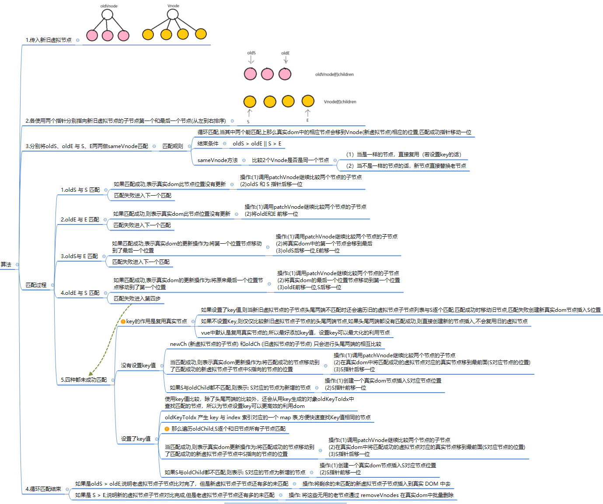

* 示例：

  * 不设置 key 的 diff

    

    

    

  * 设置 key 的 diff: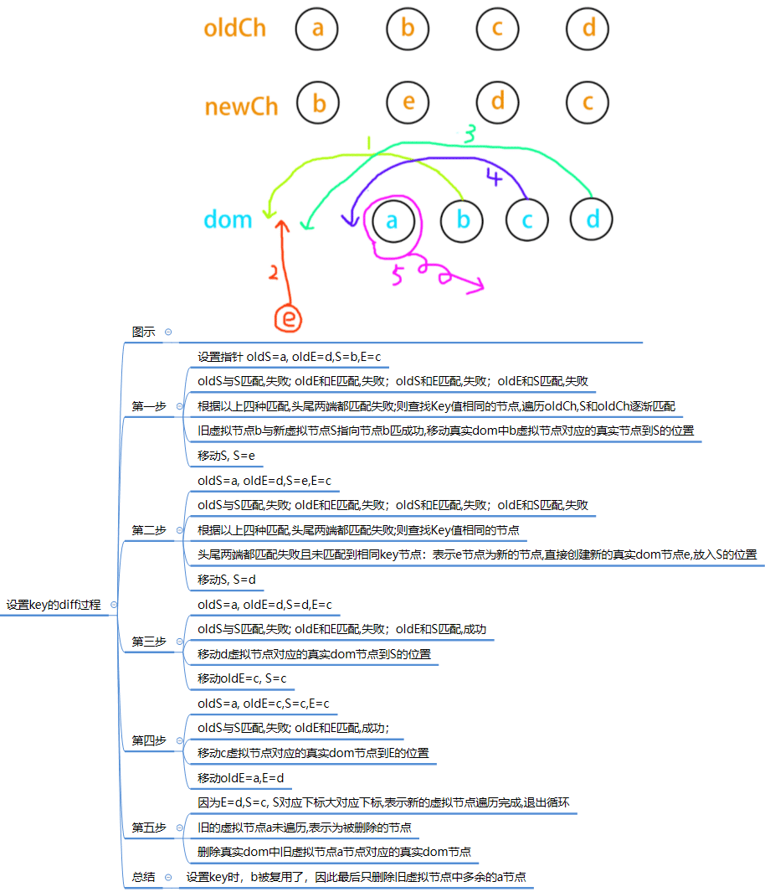

* 源码：diff 算法 使用 updateChildren() 实现，位于[src/core/vdom/patch.js](https://github.com/vuejs/vue/blob/v2.3.0/src/core/vdom/patch.js)，该算法来源于 [snabbdom](https://github.com/snabbdom/snabbdom)。

  ```javascript
    function updateChildren (parentElm, oldCh, newCh, insertedVnodeQueue, removeOnly) {
      let oldStartIdx = 0
      let newStartIdx = 0
      let oldEndIdx = oldCh.length - 1
      let oldStartVnode = oldCh[0]
      let oldEndVnode = oldCh[oldEndIdx]
      let newEndIdx = newCh.length - 1
      let newStartVnode = newCh[0]
      let newEndVnode = newCh[newEndIdx]
      let oldKeyToIdx, idxInOld, elmToMove, refElm
  
      // removeOnly is a special flag used only by <transition-group>
      // to ensure removed elements stay in correct relative positions
      // during leaving transitions
      const canMove = !removeOnly
  
      while (oldStartIdx <= oldEndIdx && newStartIdx <= newEndIdx) {
        if (isUndef(oldStartVnode)) {
          oldStartVnode = oldCh[++oldStartIdx] // Vnode has been moved left
        } else if (isUndef(oldEndVnode)) {
          oldEndVnode = oldCh[--oldEndIdx]
        } else if (sameVnode(oldStartVnode, newStartVnode)) {
          /*前四种情况其实是指定key的时候，判定为同一个VNode，则直接patchVnode即可，分别比较oldCh以及newCh的两头节点2*2=4种情况*/
          patchVnode(oldStartVnode, newStartVnode, insertedVnodeQueue)
          oldStartVnode = oldCh[++oldStartIdx]
          newStartVnode = newCh[++newStartIdx]
        } else if (sameVnode(oldEndVnode, newEndVnode)) {
          patchVnode(oldEndVnode, newEndVnode, insertedVnodeQueue)
          oldEndVnode = oldCh[--oldEndIdx]
          newEndVnode = newCh[--newEndIdx]
        } else if (sameVnode(oldStartVnode, newEndVnode)) { // Vnode moved right
          patchVnode(oldStartVnode, newEndVnode, insertedVnodeQueue)
          canMove && nodeOps.insertBefore(parentElm, oldStartVnode.elm, nodeOps.nextSibling(oldEndVnode.elm))
          oldStartVnode = oldCh[++oldStartIdx]
          newEndVnode = newCh[--newEndIdx]
        } else if (sameVnode(oldEndVnode, newStartVnode)) { // Vnode moved left
          patchVnode(oldEndVnode, newStartVnode, insertedVnodeQueue)
          canMove && nodeOps.insertBefore(parentElm, oldEndVnode.elm, oldStartVnode.elm)
          oldEndVnode = oldCh[--oldEndIdx]
          newStartVnode = newCh[++newStartIdx]
        } else {
          /*
            生成一个key与旧VNode的key对应的哈希表（只有第一次进来undefined的时候会生成，也为后面检测重复的key值做铺垫）
            比如childre是这样的 [{xx: xx, key: 'key0'}, {xx: xx, key: 'key1'}, {xx: xx, key: 'key2'}]  beginIdx = 0   endIdx = 2  
            结果生成{key0: 0, key1: 1, key2: 2}
          */
          if (isUndef(oldKeyToIdx)) oldKeyToIdx = createKeyToOldIdx(oldCh, oldStartIdx, oldEndIdx)
          /*如果newStartVnode新的VNode节点存在key并且这个key在oldVnode中能找到则返回这个节点的idxInOld（即第几个节点，下标）*/
          idxInOld = isDef(newStartVnode.key) ? oldKeyToIdx[newStartVnode.key] : null
          if (isUndef(idxInOld)) { // New element
            /*newStartVnode没有key或者是该key没有在老节点中找到则创建一个新的节点*/
            createElm(newStartVnode, insertedVnodeQueue, parentElm, oldStartVnode.elm)
            newStartVnode = newCh[++newStartIdx]
          } else {
            /*获取同key的老节点*/
            elmToMove = oldCh[idxInOld]
            /* istanbul ignore if */
            if (process.env.NODE_ENV !== 'production' && !elmToMove) {
              /*如果elmToMove不存在说明之前已经有新节点放入过这个key的Dom中，提示可能存在重复的key，确保v-for的时候item有唯一的key值*/
              warn(
                'It seems there are duplicate keys that is causing an update error. ' +
                'Make sure each v-for item has a unique key.'
              )
            }
            if (sameVnode(elmToMove, newStartVnode)) {
              /*如果新VNode与得到的有相同key的节点是同一个VNode则进行patchVnode*/
              patchVnode(elmToMove, newStartVnode, insertedVnodeQueue)
              /*因为已经patchVnode进去了，所以将这个老节点赋值undefined，之后如果还有新节点与该节点key相同可以检测出来提示已有重复的key*/
              oldCh[idxInOld] = undefined
              /*当有标识位canMove实可以直接插入oldStartVnode对应的真实Dom节点前面*/
              canMove && nodeOps.insertBefore(parentElm, newStartVnode.elm, oldStartVnode.elm)
              newStartVnode = newCh[++newStartIdx]
            } else {
              // same key but different element. treat as new element
              /*当新的VNode与找到的同样key的VNode不是sameVNode的时候（比如说tag不一样或者是有不一样type的input标签），创建一个新的节点*/
              createElm(newStartVnode, insertedVnodeQueue, parentElm, oldStartVnode.elm)
              newStartVnode = newCh[++newStartIdx]
            }
          }
        }
      }
      if (oldStartIdx > oldEndIdx) {
        /*全部比较完成以后，发现oldStartIdx > oldEndIdx的话，说明老节点已经遍历完了，新节点比老节点多，所以这时候多出来的新节点需要一个一个创建出来加入到真实Dom中*/
        refElm = isUndef(newCh[newEndIdx + 1]) ? null : newCh[newEndIdx + 1].elm
        addVnodes(parentElm, refElm, newCh, newStartIdx, newEndIdx, insertedVnodeQueue)
      } else if (newStartIdx > newEndIdx) {
        /*如果全部比较完成以后发现newStartIdx > newEndIdx，则说明新节点已经遍历完了，老节点多余新节点，这个时候需要将多余的老节点从真实Dom中移除*/
        removeVnodes(parentElm, oldCh, oldStartIdx, oldEndIdx)
      }
    }
  
  ```


#### 组件创建

* 组件创建时机：

  * render 方法调用的 _createElement() 方法中：当 tag 不是 string 时，调用 createComponent() 创建组件；
  * path 方法调用 createElem() 方法中： 调用 createComponent() 创建组件；

* 根据不同的创建时机， createComponent() 实现不同，主要有两种实现：

  * render 方法调用的 _createElement() 方法中的 createComponent() 的实现；
    * 此处主要创建组件的占位符节点；
  * path 方法调用 createElem() 方法中： 调用 createComponent() 的实现；
    * 此处递归创建组件组件实例，通过 new Vue() 创建组件；

* 查看组件的模板被编译后的渲染函数方式：访问 `this.$options.render`

* 组件创建总体流程图：

  

* render 方法调用的 _createElement() 中的 `createComponent` 方法：

  * 流程图

    

  * 源码：定义在 [src/core/vdom/create-component.js](https://github.com/vuejs/vue/blob/v2.3.0/src/core/vdom/create-component.js) 文件中。

  ```js
  /*创建一个组件节点，返回Vnode节点*/
  export function createComponent (
    Ctor: Class<Component> | Function | Object | void,
    data?: VNodeData,
    context: Component, //vm实例
    children: ?Array<VNode>,
    tag?: string
  ): VNode | void {
    /*没有传组件构造类直接返回*/
    if (isUndef(Ctor)) {
      return
    }
  
    /*获取vue实例,_base存放了Vue，作为基类，这个的定义是在最开始初始化 Vue 的阶段，
    在 src/core/global-api/index.js 中的 initGlobalAPI 函数中保存了vue实例*/
    const baseCtor = context.$options._base 
  
    // plain options object: turn it into a constructor
    if (isObject(Ctor)) {
      // baseCtor.extend()实际为 Vue.extend 函数，定义在 src/core/global-api/extend.js 中
      //子组件继承于vue实例
      Ctor = baseCtor.extend(Ctor)
    }
  
    // if at this stage it's not a constructor or an async component factory,
    // reject.
    /*如果在该阶段Ctor依然不是一个构造函数或者是一个异步组件工厂则直接返回*/
    if (typeof Ctor !== 'function') {
      if (process.env.NODE_ENV !== 'production') {
        warn(`Invalid Component definition: ${String(Ctor)}`, context)
      }
      return
    }
  
    // async component
    /*处理异步组件*/
    if (isUndef(Ctor.cid)) {
      Ctor = resolveAsyncComponent(Ctor, baseCtor, context)
      if (Ctor === undefined) {
        // return nothing if this is indeed an async component
        // wait for the callback to trigger parent update.
        /*如果这是一个异步组件则会不会返回任何东西（undifiened），直接return掉，等待回调函数去触发父组件更新。s*/
        return
      }
    }
  
    // resolve constructor options in case global mixins are applied after
    // component constructor creation
    resolveConstructorOptions(Ctor)
  
    data = data || {}
  
    // transform component v-model data into props & events
    if (isDef(data.model)) {
      transformModel(Ctor.options, data)
    }
  
    // extract props
    const propsData = extractPropsFromVNodeData(data, Ctor, tag)
  
    // functional component
    if (isTrue(Ctor.options.functional)) {
      return createFunctionalComponent(Ctor, propsData, data, context, children)
    }
  
    // extract listeners, since these needs to be treated as
    // child component listeners instead of DOM listeners
    const listeners = data.on
    // replace with listeners with .native modifier
    data.on = data.nativeOn
  
    if (isTrue(Ctor.options.abstract)) {
      // abstract components do not keep anything
      // other than props & listeners
      data = {}
    }
  
    // merge component management hooks onto the placeholder node
    //合并组件钩子和vue实例钩子
   //在 VNode 执行 patch 的过程中执行相关的钩子函数
    mergeHooks(data)
  
    // return a placeholder vnode
    //返回一个占位符节点
    const name = Ctor.options.name || tag
    const vnode = new VNode(
      `vue-component-${Ctor.cid}${name ? `-${name}` : ''}`, //tag参数
      data, undefined, undefined, undefined, context, //data、children、text、elm、context参数
      { Ctor, propsData, listeners, tag, children } //componentOptions参数
    )
    return vnode
  }
  ```

* path 方法调用 createElem() 方法中的 `createComponent()` 的实现:定义在 [src/core/vdom/patch.js](https://github.com/vuejs/vue/blob/v2.3.0/src/core/vdom/patch.js) 文件中。

  ```js
    /*创建一个组件，创建成功返回true*/
    function createComponent (vnode, insertedVnodeQueue, parentElm, refElm) {
      let i = vnode.data
      if (isDef(i)) {//组件 VNode 包含 data 选项
        const isReactivated = isDef(vnode.componentInstance) && i.keepAlive
        //获取组件 init 钩子函数
        if (isDef(i = i.hook) && isDef(i = i.init)) {
          i(vnode, false /* hydrating */, parentElm, refElm)
        }
        // after calling the init hook, if the vnode is a child component
        // it should've created a child instance and mounted it. the child
        // component also has set the placeholder vnode's elm.
        // in that case we can just return the element and be done.
        /*
          在调用了init钩子以后，如果VNode是一个子组件，它应该已经创建了一个子组件实例并挂载它。
          子组件也应该设置了一个VNode占位符，我们直接返回组件实例即可。
          意思就是如果已经存在组件实例，则不需要重新创建一个新的，我们要做的就是初始化组件以及激活组件即可，还是用原来的组件实例。
        */
        if (isDef(vnode.componentInstance)) {
          /*初始化组件*/
          initComponent(vnode, insertedVnodeQueue)
          if (isTrue(isReactivated)) {
            reactivateComponent(vnode, insertedVnodeQueue, parentElm, refElm)
          }
          return true
        }
      }
    }
  ```

  * `createComponent` 函数中，首先对 `vnode.data` 做了一些判断：

    ```js
    let i = vnode.data
    if (isDef(i)) {
      // ...
      if (isDef(i = i.hook) && isDef(i = i.init)) {
        i(vnode, false /* hydrating */)
        // ...
      }
      // ..
    }
    ```

    如果 `vnode` 是一个组件 VNode，那么条件会满足，并且得到 `i` 就是 `init` 钩子函数，回顾上节我们在创建组件 VNode 的时候合并钩子函数中就包含 `init` 钩子函数，定义在 `src/core/vdom/create-component.js` 中：

    ```js
    init (vnode: VNodeWithData, hydrating: boolean): ?boolean {
      if (
        vnode.componentInstance &&
        !vnode.componentInstance._isDestroyed &&
        vnode.data.keepAlive
      ) {
        // kept-alive components, treat as a patch
        const mountedNode: any = vnode // work around flow
        componentVNodeHooks.prepatch(mountedNode, mountedNode)
      } else {
        const child = vnode.componentInstance = createComponentInstanceForVnode(
          vnode,
          activeInstance
        )
        child.$mount(hydrating ? vnode.elm : undefined, hydrating)
      }
    },
    ```

    `init` 钩子函数执行也很简单，我们先不考虑 `keepAlive` 的情况，它是通过 `createComponentInstanceForVnode` 创建一个 Vue 的实例，然后调用 `$mount` 方法挂载子组件， 先来看一下 `createComponentInstanceForVnode` 的实现：

    ```js
    export function createComponentInstanceForVnode (
      vnode: any, // we know it's MountedComponentVNode but flow doesn't
      parent: any, // activeInstance in lifecycle state
    ): Component {
      const options: InternalComponentOptions = {
        _isComponent: true,
        _parentVnode: vnode,
        parent
      }
      // check inline-template render functions
      const inlineTemplate = vnode.data.inlineTemplate
      if (isDef(inlineTemplate)) {
        options.render = inlineTemplate.render
        options.staticRenderFns = inlineTemplate.staticRenderFns
      }
      return new vnode.componentOptions.Ctor(options)
    }
    ```

    `createComponentInstanceForVnode` 函数构造的一个内部组件的参数，然后执行 `new vnode.componentOptions.Ctor(options)`。这里的 `vnode.componentOptions.Ctor` 对应的就是子组件的构造函数，我们上一节分析了它实际上是继承于 Vue 的一个构造器 `Sub`，相当于 `new Sub(options)` 这里有几个关键参数要注意几个点，`_isComponent` 为 `true` 表示它是一个组件，`parent` 表示当前激活的组件实例（注意，这里比较有意思的是如何拿到组件实例，后面会介绍。

    所以子组件的实例化实际上就是在这个时机执行的，并且它会执行实例的 `_init` 方法，这个过程有一些和之前不同的地方需要挑出来说，代码在 `src/core/instance/init.js` 中：

    ```js
    Vue.prototype._init = function (options?: Object) {
      const vm: Component = this
      // merge options
      if (options && options._isComponent) {
        // optimize internal component instantiation
        // since dynamic options merging is pretty slow, and none of the
        // internal component options needs special treatment.
        initInternalComponent(vm, options)
      } else {
        vm.$options = mergeOptions(
          resolveConstructorOptions(vm.constructor),
          options || {},
          vm
        )
      }
      // ...
      if (vm.$options.el) {
        vm.$mount(vm.$options.el)
      } 
    }
    ```

    这里首先是合并 `options` 的过程有变化，`_isComponent` 为 true，所以走到了 `initInternalComponent` 过程，这个函数的实现也简单看一下：

    ```js
    export function initInternalComponent (vm: Component, options: InternalComponentOptions) {
      const opts = vm.$options = Object.create(vm.constructor.options)
      // doing this because it's faster than dynamic enumeration.
      const parentVnode = options._parentVnode
      opts.parent = options.parent
      opts._parentVnode = parentVnode
    
      const vnodeComponentOptions = parentVnode.componentOptions
      opts.propsData = vnodeComponentOptions.propsData
      opts._parentListeners = vnodeComponentOptions.listeners
      opts._renderChildren = vnodeComponentOptions.children
      opts._componentTag = vnodeComponentOptions.tag
    
      if (options.render) {
        opts.render = options.render
        opts.staticRenderFns = options.staticRenderFns
      }
    }
    ```

    这个过程我们重点记住以下几个点即可：`opts.parent = options.parent`、`opts._parentVnode = parentVnode`，它们是把之前我们通过 `createComponentInstanceForVnode` 函数传入的几个参数合并到内部的选项 `$options` 里了。

    再来看一下 `_init` 函数最后执行的代码：

    ```js
    if (vm.$options.el) {
       vm.$mount(vm.$options.el)
    }
    ```

    由于组件初始化的时候是不传 el 的，因此组件是自己接管了 `$mount` 的过程，这个过程的主要流程在上一章介绍过了，回到组件 `init` 的过程，`componentVNodeHooks` 的 `init` 钩子函数，在完成实例化的 `_init` 后，接着会执行 `child.$mount(hydrating ? vnode.elm : undefined, hydrating)` 。这里 `hydrating` 为 true 一般是服务端渲染的情况，我们只考虑客户端渲染，所以这里 `$mount` 相当于执行 `child.$mount(undefined, false)`，它最终会调用 `mountComponent` 方法，进而执行 `vm._render()` 方法：

    ```js
    Vue.prototype._render = function (): VNode {
      const vm: Component = this
      const { render, _parentVnode } = vm.$options
    
      
      // set parent vnode. this allows render functions to have access
      // to the data on the placeholder node.
      vm.$vnode = _parentVnode
      // render self
      let vnode
      try {
        vnode = render.call(vm._renderProxy, vm.$createElement)
      } catch (e) {
        // ...
      }
      // set parent
      vnode.parent = _parentVnode
      return vnode
    }
    ```

    我们只保留关键部分的代码，这里的 `_parentVnode` 就是当前组件的父 VNode，而 `render` 函数生成的 `vnode` 当前组件的渲染 `vnode`，`vnode` 的 `parent` 指向了 `_parentVnode`，也就是 `vm.$vnode`，它们是一种父子的关系。

    我们知道在执行完 `vm._render` 生成 VNode 后，接下来就要执行 `vm._update` 去渲染 VNode 了。来看一下组件渲染的过程中有哪些需要注意的，`vm._update` 的定义在 `src/core/instance/lifecycle.js` 中：

    ```js
    export let activeInstance: any = null
    Vue.prototype._update = function (vnode: VNode, hydrating?: boolean) {
      const vm: Component = this
      const prevEl = vm.$el
      const prevVnode = vm._vnode
      const prevActiveInstance = activeInstance
      activeInstance = vm
      vm._vnode = vnode
      // Vue.prototype.__patch__ is injected in entry points
      // based on the rendering backend used.
      if (!prevVnode) {
        // initial render
        vm.$el = vm.__patch__(vm.$el, vnode, hydrating, false /* removeOnly */)
      } else {
        // updates
        vm.$el = vm.__patch__(prevVnode, vnode)
      }
      activeInstance = prevActiveInstance
      // update __vue__ reference
      if (prevEl) {
        prevEl.__vue__ = null
      }
      if (vm.$el) {
        vm.$el.__vue__ = vm
      }
      // if parent is an HOC, update its $el as well
      if (vm.$vnode && vm.$parent && vm.$vnode === vm.$parent._vnode) {
        vm.$parent.$el = vm.$el
      }
      // updated hook is called by the scheduler to ensure that children are
      // updated in a parent's updated hook.
    }
    ```

    `_update` 过程中有几个关键的代码，首先 `vm._vnode = vnode` 的逻辑，这个 `vnode` 是通过 `vm._render()` 返回的组件渲染 VNode，`vm._vnode` 和 `vm.$vnode` 的关系就是一种父子关系，用代码表达就是 `vm._vnode.parent === vm.$vnode`。还有一段比较有意思的代码：

    ```js
    export let activeInstance: any = null
    Vue.prototype._update = function (vnode: VNode, hydrating?: boolean) {
        // ...
        const prevActiveInstance = activeInstance
        activeInstance = vm
        if (!prevVnode) {
          // initial render
          vm.$el = vm.__patch__(vm.$el, vnode, hydrating, false /* removeOnly */)
        } else {
          // updates
          vm.$el = vm.__patch__(prevVnode, vnode)
        }
        activeInstance = prevActiveInstance
      }
    ```

    这个 `activeInstance` 作用就是保持当前上下文的 Vue 实例，它是在 `lifecycle` 模块的全局变量，定义是 `export let activeInstance: any = null`，并且在之前我们调用 `createComponentInstanceForVnode` 方法的时候从 `lifecycle` 模块获取，并且作为参数传入的。因为实际上 JavaScript 是一个单线程，Vue 整个初始化是一个深度遍历的过程，在实例化子组件的过程中，它需要知道当前上下文的 Vue 实例是什么，并把它作为子组件的父 Vue 实例。之前我们提到过对子组件的实例化过程先会调用 `initInternalComponent(vm, options)` 合并 `options`，把 `parent` 存储在 `vm.$options` 中，在 `$mount` 之前会调用 `initLifecycle(vm)` 方法：

    ```js
    export function initLifecycle (vm: Component) {
      const options = vm.$options
    
      // locate first non-abstract parent
      let parent = options.parent
      if (parent && !options.abstract) {
        while (parent.$options.abstract && parent.$parent) {
          parent = parent.$parent
        }
        parent.$children.push(vm)
      }
    
      vm.$parent = parent
      // ...
    }
    ```

    可以看到 `vm.$parent` 就是用来保留当前 `vm` 的父实例，并且通过 `parent.$children.push(vm)` 来把当前的 `vm` 存储到父实例的 `$children` 中。

    在 `vm._update` 的过程中，把当前的 `vm` 赋值给 `activeInstance`，同时通过 `const prevActiveInstance = activeInstance` 用 `prevActiveInstance` 保留上一次的 `activeInstance`。实际上，`prevActiveInstance` 和当前的 `vm` 是一个父子关系，当一个 `vm` 实例完成它的所有子树的 patch 或者 update 过程后，`activeInstance` 会回到它的父实例，这样就完美地保证了 `createComponentInstanceForVnode` 整个深度遍历过程中，我们在实例化子组件的时候能传入当前子组件的父 Vue 实例，并在 `_init` 的过程中，通过 `vm.$parent` 把这个父子关系保留。

    那么回到 `_update`，最后就是调用 `__patch__` 渲染 VNode 了。

    ```js
    vm.$el = vm.__patch__(vm.$el, vnode, hydrating, false /* removeOnly */)
     
    function patch (oldVnode, vnode, hydrating, removeOnly) {
      // ...
      let isInitialPatch = false
      const insertedVnodeQueue = []
    
      if (isUndef(oldVnode)) {
        // empty mount (likely as component), create new root element
        isInitialPatch = true
        createElm(vnode, insertedVnodeQueue)
      } else {
        // ...
      }
      // ...
    }
    ```

    这里又回到了本节开始的过程，之前分析过负责渲染成 DOM 的函数是 `createElm`，注意这里我们只传了 2 个参数，所以对应的 `parentElm` 是 `undefined`。我们再来看看它的定义：

    ```js
    function createElm (
      vnode,
      insertedVnodeQueue,
      parentElm,
      refElm,
      nested,
      ownerArray,
      index
    ) {
      // ...
      if (createComponent(vnode, insertedVnodeQueue, parentElm, refElm)) {
        return
      }
    
      const data = vnode.data
      const children = vnode.children
      const tag = vnode.tag
      if (isDef(tag)) {
        // ...
    
        vnode.elm = vnode.ns
          ? nodeOps.createElementNS(vnode.ns, tag)
          : nodeOps.createElement(tag, vnode)
        setScope(vnode)
    
        /* istanbul ignore if */
        if (__WEEX__) {
          // ...
        } else {
          createChildren(vnode, children, insertedVnodeQueue)
          if (isDef(data)) {
            invokeCreateHooks(vnode, insertedVnodeQueue)
          }
          insert(parentElm, vnode.elm, refElm)
        }
        
        // ...
      } else if (isTrue(vnode.isComment)) {
        vnode.elm = nodeOps.createComment(vnode.text)
        insert(parentElm, vnode.elm, refElm)
      } else {
        vnode.elm = nodeOps.createTextNode(vnode.text)
        insert(parentElm, vnode.elm, refElm)
      }
    }
    ```

    注意，这里我们传入的 `vnode` 是组件渲染的 `vnode`，也就是我们之前说的 `vm._vnode`，如果组件的根节点是个普通元素，那么 `vm._vnode` 也是普通的 `vnode`，这里 `createComponent(vnode, insertedVnodeQueue, parentElm, refElm)` 的返回值是 false。接下来的过程就和我们上一章一样了，先创建一个父节点占位符，然后再遍历所有子 VNode 递归调用 `createElm`，在遍历的过程中，如果遇到子 VNode 是一个组件的 VNode，则重复本节开始的过程，这样通过一个递归的方式就可以完整地构建了整个组件树。

    由于我们这个时候传入的 `parentElm` 是空，所以对组件的插入，在 `createComponent` 有这么一段逻辑：

    ```js
    function createComponent (vnode, insertedVnodeQueue, parentElm, refElm) {
      let i = vnode.data
      if (isDef(i)) {
        // ....
        if (isDef(i = i.hook) && isDef(i = i.init)) {
          i(vnode, false /* hydrating */)
        }
        // ...
        if (isDef(vnode.componentInstance)) {
          initComponent(vnode, insertedVnodeQueue)
          insert(parentElm, vnode.elm, refElm)
          if (isTrue(isReactivated)) {
            reactivateComponent(vnode, insertedVnodeQueue, parentElm, refElm)
          }
          return true
        }
      }
    }
    ```

    在完成组件的整个 `patch` 过程后，最后执行 `insert(parentElm, vnode.elm, refElm)` 完成组件的 DOM 插入，如果组件 `patch` 过程中又创建了子组件，那么DOM 的插入顺序是先子后父。


### 派发更新

* 总体更新流程

  

#### 异步更新 

* 理解异步更新，先理解 [js 事件循环机制](https://gitee.com/jokerxw/myNotes/tree/master/javascript/javascript%E7%9F%A5%E8%AF%86%E7%82%B9%E6%95%B4%E5%90%88#%E4%BA%8B%E4%BB%B6%E5%BE%AA%E7%8E%AF)

  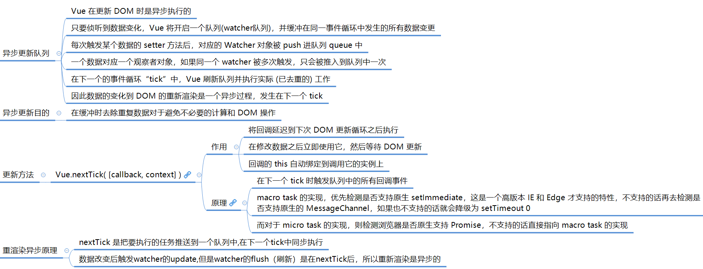

  

  

* **异步更新队列原理：**

  * Vue中有一个watcher，用于观察数据的变化，然后更新dom。
  * Vue里面不是每一次数据改变都会触发更新dom，而是将这些操作都缓存在一个队列，在一个事件循环结束之后，刷新队列，统一执行dom更新操作

* 核心流程：

  * **定义响应式：**遍历 data 属性为其增加 get，set 方法，在 get 方法中会收集依赖 (dev.subs.push(watcher))，而 set 方法则会调用 dep 的notify 方法，此方法的作用是通知 subs 中的所有的 watcher 并调用 watcher 的 update 方法，我们可以将此理解为设计模式中的发布与订阅;
  * **修改数据：**当我们在组件中对响应的数据做了修改，就会触发 setter 的逻辑，最后调用 `dep.notify()` 方法，notify() 遍历所有的 `subs`，也就是 `Watcher` 的实例数组，然后调用每一个 `watcher` 的 `update` 方法;
  * **数据更新：** update 方法中首先判断两个特殊标记（ `Watcher` 的状态标记）:
    - 是否为 lazy 懒更新，则设置 dirty 为 true，以标记当前 `watcher` 为懒更新;
    - 再判断是否有 sync 同步更新标记，直接执行 `watcher.run()`，Vue 官方不推荐使用，文档没有该属性;
  * **Vue 默认异步更新**， `watcher.async` 为true，因此 update 方法被调用后会触发 queueWatcher 函数，此函数的主要功能就是将 watcher 实例本身加入一个队列中(queue.push(watcher))；
    * queueWatcher 函数用 `has` 对象保证同一个 `Watcher` 只添加一次；
    * 放入队列有两种方式，以 flushing 标志判断：
      * 若无在刷新队列中，直接 push 进 queue 队列
      * 若正在刷新队列中，按 watcher.id 进行升序排序，确保更新的顺序
    * 通过 `wating` 保证对 `nextTick(flushSchedulerQueue)` 的调用逻辑只有一次
    * 这也是 Vue 在做派发更新的时候的一个优化的点，它并不会每次数据改变都触发 `watcher` 的回调，而是把这些 `watcher` 先添加到一个队列里，然后在 `nextTick` 后执行 `flushSchedulerQueue`
  * 然后调用 nextTick(flushSchedulerQueue)，将 flushSchedulerQueue 放入 callbacks 数组中，若浏览器的任务队列中无 flushCallbacks 函数，则执行 timerFunc()（用 pending 来判断控制）。
  * timerFunc() 将 flushCallbacks 函数放入浏览器的异步任务队列中。
  * 等待浏览器异步任务队列执行 callbacks 数组中的 flushSchedulerQueue 方法。
  * flushSchedulerQueue 是一个函数，目的是调用 queue 中所有 watcher 的 watcher.run 方法。
    * flushSchedulerQueue 首先进行队列排序： `queue.sort((a, b) => a.id - b.id)` 对队列做了从小到大的排序；
    * 然后执行队列遍历：在对 `queue` 排序后，接着就是要对它做遍历，拿到对应的 `watcher`，执行 `watcher.run()`
  * flushSchedulerQueue 在被执行后调用 watcher.run()，而 run 方法被调用后接下来的操作就是通过新的虚拟 dom 与老的虚拟 dom 做 diff 算法后生成新的真实 dom于是你看到了一个新的页面

* 实现异步更新流程：

  ```js
  //============================简单实现异步更新流程==============================================
  let uid = 0;
  class Watcher {
    constructor() {
      this.id = ++uid; //观察者对象的uid
    }
  
    update() {
      console.log('watch' + this.id + ' update');
      queueWatcher(this); //观察者队列
    }
  
    run() {
      console.log('watch' + this.id + '视图更新啦～');
    }
  }
  
  let has = {};
  let queue = []; //watcher 队列
  //waiting 是一个标记位，标记是否已经向 nextTick 传递了 flushSchedulerQueue 方法，在下一个 tick
  //时候执行 flushSchedulerQueue 方法来 flush queue，执行它里面的所有 Watcher 对象的 run 方法
  let waiting = false;
  
  /**
   * 缓存变更数据的观察者队列，如果队列中不存在该观察者对象，则缓存；否则忽略
   * @param {Watcher} watcher 变更数据对应的观察者对象
   */
  function queueWatcher(watcher) {
    const id = watcher.id; //获取观察者对象id
    if (has[id] == null) { //观察者队列中不存在id的观察者对象,则添加进队列
      has[id] = true; //设置存在标记
      queue.push(watcher);
      if (!waiting) { //未向nextTick传入flushSchedulerQueue,则传入队列
        waiting = true; //等待执行 watcher queue
        nextTick(flushSchedulerQueue);
      }
    }
  }
  
  /**
   * 取出一次 tick 时所有 Watcher，执行它里面的所有 Watcher 对象的 run 方法
   */
  function flushSchedulerQueue() {
    let watcher, id;
    queue.sort((a, b) => a.id - b.id) //队列排序
    // 执行 watcher queue 中所有 run()
    for (index = 0; index < queue.length; index++) {
      watcher = queue[index]
      id = watcher.id;
      has[id] = null;
      watcher.run();
    }
    waiting = false; // 停止等待执行一次 tick 时所有 watcher queue
  }
  
  //callbacks 数组用来存储 nextTick，在下一个tick处理这些回调函数之前，所有的cb都会被存在这个callbacks数组中
  let callbacks = [];
  let pending = false;// pending 是一个标记位，代表一个等待的状态
  
  /**
   * 在下次 DOM 更新循环结束之后执行延迟回调，在修改数据之后立即使用这个方法，获取更新后的 DOM
   * @param {Function} cb 回调函数
   */
  function nextTick(cb) {
    callbacks.push(cb);
    if (!pending) {
      pending = true;
      //使用setTimeout模拟异步更新, setTimeout会在 task 中创建一个事件 flushCallbacks 
      setTimeout(flushCallbacks, 0);
    }
  }
  
  /**
   * 在执行时将 callbacks 中的所有 cb 依次执行,这里的 cb 就是 flushSchedulerQueue 方法
   */
  function flushCallbacks() {
    pending = false;
    const copies = callbacks.slice(0);
    callbacks.length = 0; //清空回调队列
    // 执行回调队列中所有的回调函数
    for (let i = 0; i < copies.length; i++) {
      copies[i]();
    }
  }
  
  //--------------------------------测试---------------------------------------------------
  (function () {
    let watch1 = new Watcher();
    let watch2 = new Watcher();
  
    watch1.update();
    watch1.update();
    watch2.update();
  })();
  /**
    我们现在 new 了两个 Watcher 对象，因为修改了 data 的数据，所以我们模拟触发了两次 watch1的 update 以及 一次 watch2 的 update
    假设没有批量异步更新策略的话，理论上应该执行 Watcher 对象的 run，那么会打印：
    watch1 update
    watch1 视图更新啦～
    watch1 update
    watch1 视图更新啦～
    watch2 update
    watch2 视图更新啦～
    实际上则执行：
    watch1 update
    watch1 update
    watch2 update
    watch1 视图更新啦～
    watch2 视图更新啦～
    异步更新策略的效果把相同的 Watcher 对象会在这个过程中被剔除，在下一个 tick 的时候去更新视图
   */
  ```
  
  
  
* > 为什么要为什么要异步更新数据 ？

  ```vue
  <template>
      <div><div>{{number}}</div>
          <div@click="handleClick">click</div>
      </div>
  </template>
  
  export default {
  	data(){ 
  		return {
  			number: 0
  		};
  	},
  	methods: {
  		handleClick(){
  			for( let i=0; i < 1000 ;i++) { 
              	this.number++;
              }
          }
      }
    }
  ```

  * 当我们按下  click  按钮的时候， number 会被循环增加 1000 次。
  *  那么按照之前的理解，每次 number 被  +1  的时候，都会触发 number 的 setter 方法，从而根据上面的流程一直跑下来最后修改真实  DOM。那么在这个过程中，DOM  会被更新  1000  次！ Vue.js  为了避免如此低效的处理方法。
  * Vue.js 在默认情况下，每次触发某个数据的 setter 方法后，对应的 Watcher 对象其实会被 push 进一个队列 queue 中，在下一个  tick  的时候将这个队列queue 全部拿出来 run（ Watcher 对象的一个方法，用来触发 patch 操作）  一遍。

### 销毁实例


***

## 手写响应式原理

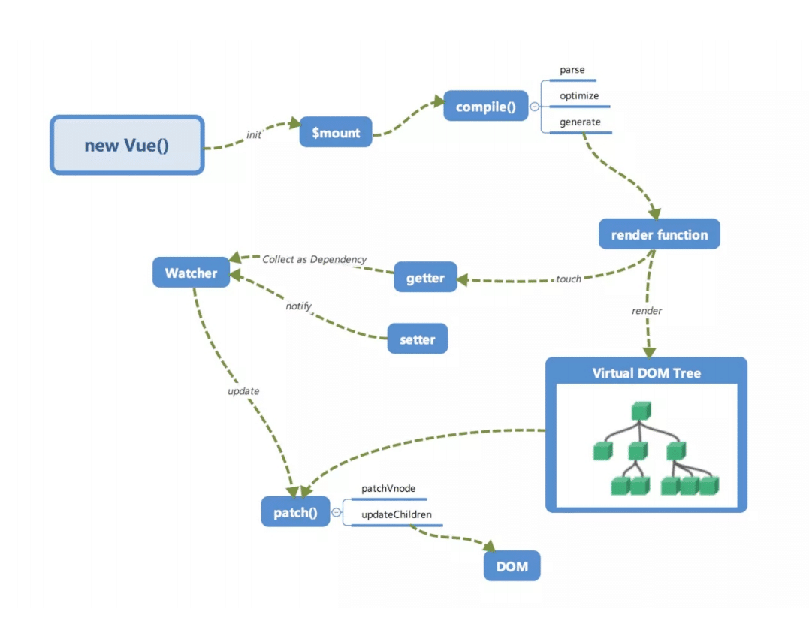

> Vue的响应式过程可以分为三个阶段：初始化阶段、依赖收集阶段和响应阶段。
>
> 1. **初始化阶段**：
>
>    * 在 `new Vue()` 后，Vue会调用 `_init ` 函数进行初始化。
>    * 在这个阶段，Vue的 `data `属性会被 `reactive `化，也就是加上 `setter/getter` 函数。这个过程会将Data通过Observer 转换成 `getter/setter` 的形式，以对数据追踪变化。这一步会遍历数据对象的属性，并使用`Object.defineProperty()`为每个属性定义`getter`和`setter`，从而实现对属性的劫持。对于数组和嵌套对象，会遍历递归调用`Object.defineProperty()`为每个属性定义`getter`和`setter`；
>
>    * 当被设置的对象被读取的时候，会执行getter函数；当被赋值的时候，会执行setter函数。
>
> 2. **依赖收集阶段：**
>
>    * 在这个阶段，Dep 类会进行依赖收集。当编译模板时访问响应式数据时，通过 Watcher 读取数据，会触发 getter ，从而将 Watcher 添加到依赖中。这意味着每一个 data 的属性都会有一个 dep 对象，用于存储依赖的 Watcher。
>
> 3. **响应阶段**：
>
>    * 当修改对象的值时，会触发对应的setter，setter会通知之前依赖收集得到的Dep中的每一个Watcher，告诉它们自己的值改变了，需要重新渲染视图。
>    * 这时候，这些Watcher就会开始调用update来更新视图。
>
> 这个过程涉及到三个核心对象：`Observer`、`Dep`（依赖管理器）和`Watcher`。`Observer`用于将数据对象转换为响应式数据，`Dep`用于管理依赖和触发更新，`Watcher`用于与Vue实例和视图关联，并在数据变化时更新视图。


1. 创建一个`Observer`对象，用于将数据转换为响应式数据：

   ```js
   //遍历data数据，对数据每一个属性定义响应式
   function Observer(data) {
     // 注意：此处对data数据对象属性进行遍历，因此没有被枚举在 data 或 computed 的数据不会被定义响应式
     for (let key in data) {
       // 数据对象自身属性进行响应式，目的：避免遍历到原型链上的属性
       if (data.hasOwnProperty(key)) {
         defineReactive(data, key, data[key]);
       }
     }
   }
   
   /**
   * 对数据定义响应式
   **/
   function defineReactive(obj, key, value) {
     // 创建依赖收集对象，用于收集 watcher 对象
     let dep = new Dep();
     // 对象属性定义响应式
     Object.defineProperty(obj, key, {
       enumerable: true,
       configurable: true,
       get: function() {
         // 依赖收集目标不为空，表示有数据被访问收集，将数据的 watcher 对象放入依赖收集队列
         if (Dep.target) {
           dep.addWatcher(Dep.target);
         }
         return value;
       },
       set: function(newValue) {
         // 数据发生更变，依赖对象通知变更
         if (value !== newValue) {
           value = newValue;
           dep.notify();
         }
       }
     });
   }
   ```

2. 创建一个`Watcher`对象，用于更新视图：

   ```js
   /**
   * 观察者对象，绑定数据，data 一个属性数据对应一个 watcher 对象
   **/
   function Watcher(vm, key, callback) {
     this.vm = vm;
     this.key = key;
     this.callback = callback;
     this.value = this.get();
   }
   // 观察者对象访问方法，访问数据时触发，将观察者对象绑定依赖目标，并保存当前数据值
   Watcher.prototype.get = function() {
     Dep.target = this;
     let value = this.vm[this.key];
     Dep.target = null;
     return value;
   };
   // 观察者更新方法，更新数据
   Watcher.prototype.update = function() {
     let newValue = this.vm[this.key];
     if (this.value !== newValue) {
       this.value = newValue;
       this.callback.call(this.vm, newValue);
     }
   };
   ```

3. 创建一个`Dep`对象，用于管理`Watcher`对象：

   ```js
   /**
   * 依赖收集对象
   **/
   function Dep() {
     // 观察者队列，保存被访问的数据观察者对象，用于更新数据时通知数据变更
     this.watchers = [];
   }
   // 添加观察者对象到依赖对象
   Dep.prototype.addWatcher = function(watcher) {
     this.watchers.push(watcher);
   };
   // 通知观察者对象数据变更
   Dep.prototype.notify = function() {
     this.watchers.forEach(function(watcher) {
       watcher.update();
     });
   };
   ```

4. 创建一个`Vue`对象，用于绑定数据和视图：

   ```js
   /**
   * vue 实例对象
   **/
   function Vue(options) {
     this.data = options.data;
     
     Observer(this.data);
     this.bindData();
   }
   // 绑定数据对象，遍历当前数据定义响应式
   Vue.prototype.bindData = function() {
     let self = this;
     // 遍历对象上所有属性进行双向绑定
     for (let key in this.data) {
       if (this.data.hasOwnProperty(key)) {
         Object.defineProperty(this, key, {
           get: function() {
             return self.data[key];
           },
           set: function(newValue) {
             self.data[key] = newValue;
           }
         });
       }
     }
   };
   ```

5. 代码进行测试：

   ```js
   let vm = new Vue({
     data: {
       message: 'Hello, Vue!'
     }
   });
   
   new Watcher(vm, 'message', function(newValue) {
     console.log('New message:', newValue);
   });
   
   vm.message = 'Hello, World!'; // 输出：New message: Hello, World!
   ```


通过这种响应式机制，Vue能够自动追踪依赖关系，并在数据发生变化时更新相关的视图，实现了数据和视图的双向绑定。这使得开发者无需手动操作DOM，而能够专注于数据的处理和业务逻辑的编写。

---


***


## 全局API

### [Vue.extend(options)](https://cn.vuejs.org/v2/api/#Vue-extend)

* 原理：

  * 使用基础 Vue 构造器，创建一个“子类”。
  * 其实就是扩展了基础构造器，形成了一个可复用的有指定选项功能的子构造器
  * 使用`原型继承`的方式把一个纯对象转换一个继承于 Vue 的构造器 Sub 并返回，然后对 Sub 这个对象本身扩展了一些属性，如扩展 options、添加全局 API 等；并且对配置中的 props 和 computed 做了初始化工作；
  * 最后对于这个 Sub 构造函数做了缓存，避免多次执行 Vue.extend 的时候对同一个子组件重复构造

* `Vue.extend` 函数的定义在 [src/core/global-api/extend.js](https://github.com/vuejs/vue/blob/v2.3.0/src/core/global-api/extend.js) 中。

  ```js
    /*
    参数是一个包含组件option的对象。  https://cn.vuejs.org/v2/api/#Vue-extend-options
    */
    Vue.extend = function (extendOptions: Object): Function {
      extendOptions = extendOptions || {} //new Vue()时传入的组件对象
      /*父类的构造*/
      const Super = this //this指向Vue
      /*父类的cid，cid构造器唯一标识*/
      const SuperId = Super.cid
      /*cachedCtors用于缓存组件对象
      缓存组件对象目的：当该组件对象被多个组件引用时，该组件构造器逻辑只执行一次，下次再引用该组件时直接返回缓存中的构造器
      */
      const cachedCtors = extendOptions._Ctor || (extendOptions._Ctor = {})
      /*如果构造函数中已经存在了该组件cid，则代表已经该组件通过extend进行实例化了，直接返回*/
      if (cachedCtors[SuperId]) {
        return cachedCtors[SuperId]
      }
      //获取组件名称
      const name = extendOptions.name || Super.options.name
      if (process.env.NODE_ENV !== 'production') { //非生产环境下进行组件名称校验
        /*name只能包含字母与连字符*/
        if (!/^[a-zA-Z][\w-]*$/.test(name)) {
          warn(
            'Invalid component name: "' + name + '". Component names ' +
            'can only contain alphanumeric characters and the hyphen, ' +
            'and must start with a letter.'
          )
        }
      }
  
      /*
        Sub构造函数其实就一个_init方法，这跟Vue的构造方法是一致的，在_init中处理各种数据初始化、生命周期等。
        因为Sub作为一个Vue的扩展构造器，所以基础的功能还是需要保持一致，跟Vue构造器一样在构造函数中初始化_init。
      */
      const Sub = function VueComponent(options) {
        this._init(options)
      }
      /*继承父类，使用原型式继承，使子类构原型指向父类实例对象*/
      Sub.prototype = Object.create(Super.prototype)
      /*构造函数*/
      Sub.prototype.constructor = Sub
      /*创建一个新的cid*/
      Sub.cid = cid++
      /*将父组件的option与子组件的合并到一起(Vue有一个cid为0的基类，即Vue本身，会将一些默认初始化的option合并)*/
      Sub.options = mergeOptions(
        Super.options,
        extendOptions
      )
      /*es6语法，super为父类构造*/
      Sub['super'] = Super
  
      // For props and computed properties, we define the proxy getters on
      // the Vue instances at extension time, on the extended prototype. This
      // avoids Object.defineProperty calls for each instance created.
      /*在扩展时，我们将计算属性以及props通过代理绑定在Vue实例上（也就是vm），这也避免了Object.defineProperty被每一个实例调用*/
      if (Sub.options.props) {
        /*初始化props，将option中的_props代理到vm上*/
        initProps(Sub)
      }
      if (Sub.options.computed) {
        /*处理计算属性，给计算属性设置defineProperty并绑定在vm上*/
        initComputed(Sub)
      }
  
      // allow further extension/mixin/plugin usage
      /*加入extend、mixin以及use方法，允许将来继续为该组件提供扩展、混合或者插件*/
      Sub.extend = Super.extend
      Sub.mixin = Super.mixin
      Sub.use = Super.use
  
      // create asset registers, so extended classes
      // can have their private assets too.
      /*使得Sub也会拥有父类的私有选项（directives、filters、components）*/
      ASSET_TYPES.forEach(function (type) {
        Sub[type] = Super[type]
      })
      // enable recursive self-lookup
      /*把组件自身也加入components中，为递归自身提供可能（递归组件也会查找components是否存在当前组件，也就是自身）*/
      if (name) {
        Sub.options.components[name] = Sub
      }
  
      // keep a reference to the super options at extension time.
      // later at instantiation we can check if Super's options have
      // been updated.
      /*保存一个父类的options，此后我们可以用来检测父类的options是否已经被更新*/
      Sub.superOptions = Super.options
      /*extendOptions存储起来*/
      Sub.extendOptions = extendOptions
      /*保存一份option，extend的作用是将Sub.options中的所有属性放入{}中*/
      Sub.sealedOptions = extend({}, Sub.options)
  
      // cache constructor
      /*缓存构造函数（用cid），防止重复extend*/
      cachedCtors[SuperId] = Sub
      return Sub
    }
  ```


### [Vue.nextTick](https://cn.vuejs.org/v2/api/#Vue-nextTick)

* [异步更新队列](https://cn.vuejs.org/v2/guide/reactivity.html#异步更新队列):
  * Vue 在更新 DOM 时是**异步**执行的。只要侦听到数据变化，Vue 将开启一个队列，并缓冲在同一事件循环中发生的所有数据变更。
  * 如果同一个 watcher 被多次触发，只会被推入到队列中一次。
  * 这种在缓冲时去除重复数据对于避免不必要的计算和 DOM 操作是非常重要的。
  * 然后，在下一个的事件循环“tick”中，Vue 刷新队列并执行实际 (已去重的) 工作。
  
* vue 在异步更新数据时使用 nextTick 进行异步更新：参考 异步更新 一节

* 实现原理：

  * Vue 在内部对异步队列尝试使用原生的 `Promise.then`、`MutationObserver` 和 `setImmediate`，如果执行环境不支持，则会采用 `setTimeout(fn, 0)` 代替。

* 应用：

  * 数据的变化到 DOM 的重新渲染是一个异步过程，发生在下一个 tick。这就是我们平时在开发的过程中，比如从服务端接口去获取数据的时候，数据做了修改，如果我们的某些方法去依赖了数据修改后的 DOM 变化，我们就必须在 `nextTick` 后执行。

    ```javascript
    getData(res).then(()=>{
      this.xxx = res.data
      this.$nextTick(() => {
        // 这里我们可以获取变化后的 DOM
      })
    })
    ```

    

* 流程图

* 源码分析：

  * 在 Vue  源码 2.3.0 中，`nextTick` 定义在 [src/core/util/env.js](https://github.com/vuejs/vue/blob/v2.3.0/src/core/util/env.js)

    ```js
    /**
     * Defer a task to execute it asynchronously.
     */
     /*
        延迟一个任务使其异步执行，在下一个tick时执行，一个立即执行函数，返回一个function
        这个函数的作用是在task或者microtask中推入一个timerFunc，在当前调用栈执行完以后以此执行直到执行到timerFunc
        目的是延迟到当前调用栈执行完以后执行
    */
    export const nextTick = (function () {
      /*异步任务队列，存放异步执行的回调*/
      const callbacks = []
      /*一个标记位，如果已经有timerFunc被推送到任务队列中去则不需要重复推送*/
      let pending = false
      /*一个函数指针，指向函数将被推送到任务队列中，等到主线程任务执行完时，任务队列中的timerFunc被调用*/
      let timerFunc
    
      /*下一个tick时的回调*/
      function nextTickHandler () {
        /*一个标记位，标记等待状态（即函数已经被推入任务队列或者主线程，已经在等待当前栈执行完毕去执行），这样就不需要在push多个回调到callbacks时将timerFunc多次推入任务队列或者主线程*/
        pending = false
        /*执行所有callback*/
        const copies = callbacks.slice(0)
        callbacks.length = 0
        for (let i = 0; i < copies.length; i++) {
          copies[i]()
        }
      }
    
      /*
        这里解释一下，一共有Promise、MutationObserver以及setTimeout三种尝试得到timerFunc的方法。
        优先使用Promise，在Promise不存在的情况下使用MutationObserver，这两个方法的回调函数都会在microtask中执行，它们会比setTimeout更早执行，所以优先使用。
        如果上述两种方法都不支持的环境则会使用setTimeout，在task尾部推入这个函数，等待调用执行。
        为啥要用 microtask？
        根据 HTML Standard，在每个 task 运行完以后，UI 都会重渲染，那么在 microtask 中就完成数据更新，
        当前 task 结束就可以得到最新的 UI 了。反之如果新建一个 task 来做数据更新，那么渲染就会进行两次。
        参考：https://www.zhihu.com/question/55364497/answer/144215284
      */
      if (typeof Promise !== 'undefined' && isNative(Promise)) {
        /*使用Promise*/
        var p = Promise.resolve()
        var logError = err => { console.error(err) }
        timerFunc = () => {
          p.then(nextTickHandler).catch(logError)
          // in problematic UIWebViews, Promise.then doesn't completely break, but
          // it can get stuck in a weird state where callbacks are pushed into the
          // microtask queue but the queue isn't being flushed, until the browser
          // needs to do some other work, e.g. handle a timer. Therefore we can
          // "force" the microtask queue to be flushed by adding an empty timer.
          if (isIOS) setTimeout(noop)
        }
      } else if (typeof MutationObserver !== 'undefined' && (
        isNative(MutationObserver) ||
        // PhantomJS and iOS 7.x
        MutationObserver.toString() === '[object MutationObserverConstructor]'
      )) {
        // use MutationObserver where native Promise is not available,
        // e.g. PhantomJS IE11, iOS7, Android 4.4
        /*新建一个textNode的DOM对象，用MutationObserver绑定该DOM并指定回调函数，
        在DOM变化的时候则会触发回调,该回调会进入主线程（比任务队列优先执行），
        即textNode.data = String(counter)时便会加入该回调*/
        var counter = 1
        var observer = new MutationObserver(nextTickHandler)
        var textNode = document.createTextNode(String(counter))
        observer.observe(textNode, {
          characterData: true
        })
        timerFunc = () => {
          counter = (counter + 1) % 2
          textNode.data = String(counter)
        }
      } else {
        // fallback to setTimeout
        /* istanbul ignore next */
        /*使用setTimeout将回调推入任务队列尾部*/
        timerFunc = () => {
          setTimeout(nextTickHandler, 0)
        }
      }
    
      /*
        推送到队列中下一个tick时执行
        cb 回调函数
        ctx 上下文
      */
      return function queueNextTick (cb?: Function, ctx?: Object) {
        let _resolve
        /*cb存到callbacks中*/
        callbacks.push(() => {
          if (cb) {
            try {
              cb.call(ctx)
            } catch (e) {
              handleError(e, ctx, 'nextTick')
            }
          } else if (_resolve) {
            _resolve(ctx)
          }
        })
        if (!pending) {
          pending = true
          timerFunc()
        }
        if (!cb && typeof Promise !== 'undefined') {
          return new Promise((resolve, reject) => {
            _resolve = resolve
          })
        }
      }
    })()
    ```

    

  * 在 Vue 源码 2.5+ 后，`nextTick` 的实现单独有一个 JS 文件来维护它。在 [src/core/util/next-tick.js](https://github.com/vuejs/vue/blob/2.6/src/core/util/next-tick.js) 中：

    * `next-tick.js` 申明了 `microTimerFunc` 和 `macroTimerFunc` 2 个变量，它们分别对应的是 micro task 的函数和 macro task 的函数。对于 macro task 的实现，优先检测是否支持原生 `setImmediate`，这是一个高版本 IE 和 Edge 才支持的特性，不支持的话再去检测是否支持原生的 `MessageChannel`，如果也不支持的话就会降级为 `setTimeout 0`；而对于 micro task 的实现，则检测浏览器是否原生支持 Promise，不支持的话直接指向 macro task 的实现。

    

### [Vue.set ](https://cn.vuejs.org/v2/api/#Vue-set)

* 为什么要引入 `Vue.set` ?
  
   * 解决数组和对象检测更新问题。
     
   * 对于使用 `Object.defineProperty` 实现响应式的对象，当我们去给这个对象添加一个新的属性的时候，是不能够触发它的 setter 的，比如：
   
      ```js
      var vm = new Vue({
        data:{
          a:1
        }
      })
      // vm.b 是非响应的
      vm.b = 2
      ```
   
      但是添加对象新属性的场景我们在平时开发中会经常遇到，那么 Vue 为了解决这个问题，定义了一个全局 API `Vue.set` 方法
   
* 原理:
  
   * 如果目标是数组,使用 vue 实现的变异方法 splice 实现响应式
   * 如果目标是对象,判断属性存在,即为响应式,直接赋值
   * 如果 target 本身就不是响应式,直接赋值并返回
   * 如果属性不是响应式,则调用 defineReactive 方法进行响应式处理
   * 最后手动的触发依赖通知（这就是为什么执行 `Vue.set` 的时候可以让添加新的属性到对象也可以检测到变化）
   
* 源码分析：

  * 初始化set过程: 在 [vue](https://github.com/vuejs/vue)/[src](https://github.com/vuejs/vue/tree/dev/src)/[core](https://github.com/vuejs/vue/tree/dev/src/core)/[instance](https://github.com/vuejs/vue/tree/dev/src/core/instance)/[index.js](https://github.com/vuejs/vue/blob/dev/src/core/instance/index.js) 中，在 new Vue() 前 stateMixin(Vue) 中  `Vue.prototype.$set = set`。

  * set 源码： 定义在 [vue/src/core/observer/index.js]((https://github.com/vuejs/vue/blob/v2.3.0/src/core/observer/index.js))

    ```javascript
    export function set (target: Array<any> | Object, key: any, val: any): any {
      // set用于设置Array/Object, 如果 set 函数的第一个参数是 undefined 或 null 或者是原始类型值，那么在非生产环境下会打   //印警告信息
      if (process.env.NODE_ENV !== 'production' &&
        (isUndef(target) || isPrimitive(target))
      ) {
        warn(`Cannot set reactive property on undefined, null, or primitive value: ${(target: any)}`)
      }
      if (Array.isArray(target) && isValidArrayIndex(key)) {
        // 修改数组的长度, 避免 索引 > 数组长度 导致splcie()执行有误
        target.length = Math.max(target.length, key)
        // 利用数组的 splice 变异方法触发响应式
        target.splice(key, 1, val)
        return val
      }
      // target为对象, key在target或者target.prototype上
      // 同时必须不能在 Object.prototype 上 issue: https://github.com/vuejs/vue/issues/6845
      if (key in target && !(key in Object.prototype)) {
        target[key] = val
        return val
      }
      // 给target创建一个新的属性,获取Observer实例(data的__ob__属性保存数据对应的观察者对象,Observe类中定义_ob_)
      const ob = (target: any).__ob__
      // Vue 实例对象拥有 _isVue 属性,一个防止vm实例自身被观察的标志位
      // 也不允许Vue.set/$set 函数为根数据对象(vm.$data)添加属性
      //当vue已经被Observer了,并且是根数据对象, vmCount才大于零
      if (target._isVue || (ob && ob.vmCount)) {
        process.env.NODE_ENV !== 'production' && warn(
          'Avoid adding reactive properties to a Vue instance or its root $data ' +
          'at runtime - declare it upfront in the data option.'
        )
        return val
      }
      // target本身就不是响应式数据, 直接赋值
      if (!ob) {
        target[key] = val
        return val
      }
      // 进行响应式处理
      defineReactive(ob.value, key, val)
      ob.dep.notify() //手动的触发依赖通知
      return val
    }
    ```

    

* 应用：

  * 错误示例：
  * 先给对象添加属性，后使用Vue.set定义响应式内容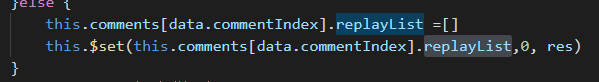
      * 错误原因: 直接给对象添加 replayList 属性时, 该属性不是响应式，并且不能触发视图更新，当后面使用 Vue.set 添加 replayList[0] 时，replayList[0] 式响应式,但 replayList 依然不是响应式对象,所以依然无法触发视图更新
      * 更正：
        * 方式1：给对象添加 replayList 响应式属性后再添加数据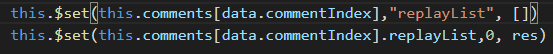
        * 方式2：直接给对象添加响应式属性数据 


### [Vue.use( plugin )](https://cn.vuejs.org/v2/api/#Vue-use)

- **参数**：

  - `{Object | Function} plugin`

- **用法**：

  * 安装 Vue.js 插件。
    * 如果插件是一个对象，必须提供 `install` 方法。
    * 如果插件是一个函数，它会被作为 install 方法。install 方法调用时，**会将 Vue 作为参数传入**。
      * 插件中传入 Vue 原因：作为 Vue 的插件对 `Vue` 对象是有依赖的，但又不能去单独去 `import Vue`，因为那样会增加包体积，所以就通过这种方式拿到 `Vue` 对象。

  * 该方法需要在调用 `new Vue()` 之前被调用。

  * 当 install 方法被同一个插件多次调用，插件将只会被安装一次。

- 原理：

  - 维护了一个 `_installedPlugins` 缓存数组，它存储所有注册过的 `plugin`；
  - 先在缓存查找  `plugin`，找到直接返回； 
  - 否则，判断 `plugin` 有没有定义 `install` 方法，如果有的话则调用该方法，并且该方法执行的第一个参数是 `Vue`；
  - 最后把 `plugin` 存储到 `installedPlugins` 中；

- 源码：定义在 [vue/src/core/global-api/use.js](https://github.com/vuejs/vue/blob/v2.3.0/src/core/global-api/use.js)中。

  ```javascript
  /*初始化use*/
  export function initUse (Vue: GlobalAPI) {
    /*https://cn.vuejs.org/v2/api/#Vue-use*/
    Vue.use = function (plugin: Function | Object) {
      /* istanbul ignore if */
      /*标识位检测该插件是否已经被安装*/
      if (plugin.installed) {
        return
      }
      // additional parameters
      const args = toArray(arguments, 1)
      /*a*/
      args.unshift(this)
      if (typeof plugin.install === 'function') {
        /*install执行插件安装*/
        plugin.install.apply(plugin, args)
      } else if (typeof plugin === 'function') {
        plugin.apply(null, args)
      }
      plugin.installed = true
      return this
    }
  }
  ```

- 调用时机：引入`import Vue from vue` -> `initGlobalAPI(Vue)` -> ` initUse(Vue)`

- **参考**：[插件](https://cn.vuejs.org/v2/guide/plugins.html)


### [Vue.mixin( mixin )](https://cn.vuejs.org/v2/api/#Vue-mixin)

- **参数**：

  - `{Object} mixin`

- **用法**：

  * 全局注册一个混入，影响注册之后所有创建的每个 Vue 实例。插件作者可以使用混入，向组件注入自定义的行为。**不推荐在应用代码中使用**。

- 原理：把要混入的对象通过 `mergeOption` 合并到 `Vue` 的 `options` 中，由于每个组件的构造函数都会在 `extend` 阶段合并 `Vue.options` 到自身的 `options` 中，所以也就相当于每个组件都定义了 `mixin` 定义的选项。

- 源码：定义在 [src/core/global-api/mixin.js](https://github.com/vuejs/vue/blob/v2.3.0/src/core/global-api/mixin.js)

  ```javascript
  /*初始化mixin*/
  export function initMixin (Vue: GlobalAPI) {
      /*https://cn.vuejs.org/v2/api/#Vue-mixin*/
    Vue.mixin = function (mixin: Object) {
      /*mergeOptions合并optiuons*/
      this.options = mergeOptions(this.options, mixin)
    }
  }
  ```

- 执行时机： 定义 Vue 构造函数 -> `initMixin(Vue)` -> `new Vue()`

- 优点：mixin可以根据逻辑关注点进行组织代码，复用组件代码。

- 缺点：

  - `mixins` 带来了隐式依赖
  - `mixins` 与 `mixins` 之间，`mixins` 与组件之间容易导致命名冲突
  - 由于 `mixins` 是侵入式的，它改变了原组件，所以修改 `mixins` 等于修改原组件，随着需求的增长 `mixins` 将变得复杂，导致滚雪球的复杂性。

- **参考**：[全局混入](https://cn.vuejs.org/v2/guide/mixins.html#全局混入)

### [选项合并策略](https://cn.vuejs.org/v2/guide/mixins.html#自定义选项合并策略)

**混入基础：**

* [混入](https://cn.vuejs.org/v2/guide/mixins.html#%E8%87%AA%E5%AE%9A%E4%B9%89%E9%80%89%E9%A1%B9%E5%90%88%E5%B9%B6%E7%AD%96%E7%95%A5)(mixin) : 提供了一种非常灵活的方式，来分发 Vue 组件中的可复用功能。

* 混入 API：[Vue.mixin( mixin )](https://cn.vuejs.org/v2/api/#Vue-mixin)

* 一个混入对象可以包含任意组件选项。当组件使用混入对象时，所有混入对象的选项将被“混合”进入该组件本身的选项。

* 默认混入(合并)策略：

  * 数据对象 data： 进行递归合并，并在发生冲突时以组件数据优先 ；
  * 值为对象的选项（例如 `methods`、`components` 和 `directives`）：合并为同一个对象。两个对象键名冲突时，取组件对象的键值对；
  * 钩子函数： 合并为一个数组，因此都将被调用，调用顺序：混入对象的钩子 -> 组件自身钩子;

* 混入类型：

  * 全局混入：一旦使用全局混入，它将影响每一个之后创建的 Vue 实例。使用恰当时，这可以用来为自定义选项注入处理逻辑。
  * 局部混入：使用 minxis 属性添加对象。

* Vue 中提供自定义选项合并策略API:

  * [Vue.config.optionMergeStrategies](https://cn.vuejs.org/v2/api/#optionMergeStrategies) 添加一个函数：

    ```js
    Vue.config.optionMergeStrategies.myOption = function (toVal, fromVal) {
      // 返回合并后的值
    }
    ```


**选项合并策略分析：**

* 混入即使用 vue 的默认选项合并策略。

* 对于 `options` 的合并有 2 个过程：

  * 外部初始化 Vue 通过 `mergeOptions` 合并选项；

* 子组件初始化过程通过 `initInternalComponent` 过程中通过 `mergeOptions` 合并选项 ；

* 选项合并结果：合并后 vue实例 vm.$options 的值最终包含：vue默认option、用户传入 option、 组件实例 option。

* 选项合并流程：

  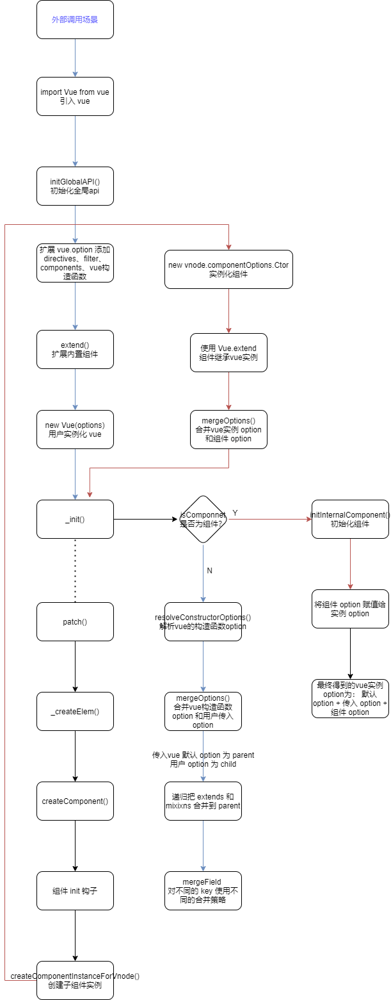

  

* 合并流程分析：

  * 为了更直观，我们可以举个简单的示例：

    ```js
    import Vue from 'vue'
    
    let childComp = {
      template: '<div>{{msg}}</div>',
      created() {
        console.log('child created')
      },
      mounted() {
        console.log('child mounted')
      },
      data() {
        return {
          msg: 'Hello Vue'
        }
      }
    }
    
    Vue.mixin({
      created() {
        console.log('parent created')
      }
    })
    
    let app = new Vue({
      el: '#app',
      render: h => h(childComp)
    })
    ```

  * **外部调用合并过程：**

    * 外部引入 Vue 实例时，在 `initGlobalAPI(Vue)` 的时候初始化 Vue 实例默认 option。代码[src/core/global-api/index.js](https://github.com/vuejs/vue/blob/v2.3.0/src/core/global-api/index.js) 

      ```js
      //在 Vue 上扩展的一些全局方法的定义
      export function initGlobalAPI(Vue: GlobalAPI) {
        // config
        const configDef = {}
        configDef.get = () => config
        if (process.env.NODE_ENV !== 'production') {
          configDef.set = () => {
            warn(
              'Do not replace the Vue.config object, set individual fields instead.'
            )
          }
        }
        Object.defineProperty(Vue, 'config', configDef)
      
        // exposed util methods.
        // NOTE: these are not considered part of the public API - avoid relying on
        // them unless you are aware of the risk.
        Vue.util = {
          warn,
          extend,
          mergeOptions,
          defineReactive
        }
      
        Vue.set = set
        Vue.delete = del
        Vue.nextTick = nextTick
      
        Vue.options = Object.create(null)
        /** 
        `ASSET_TYPES` 的定义在 `src/shared/constants.js` 中：
         ASSET_TYPES = [
            'component',
            'directive',
            'filter'
          ]
          遍历结果为
          Vue.options.components = {}
          Vue.options.directives = {}
          Vue.options.filters = {}
        */
        ASSET_TYPES.forEach(type => {
          Vue.options[type + 's'] = Object.create(null)
        })
      
        // this is used to identify the "base" constructor to extend all plain-object
        // components with in Weex's multi-instance scenarios.
        /*_base被用来标识基本构造函数（也就是Vue），以便在多场景下添加组件扩展*/
        Vue.options._base = Vue
        /* 把一些内置组件扩展到 Vue.options.components*/
        extend(Vue.options.components, builtInComponents)
      
        initUse(Vue)
        initMixin(Vue)
        initExtend(Vue)
        initAssetRegisters(Vue)
      }
      ```

    * 当执行 `new Vue` 的时候，在执行 `this._init(options)` 的时候，就会执行如下逻辑去合并 `options`：

      ```js
      vm.$options = mergeOptions(
        resolveConstructorOptions(vm.constructor),
        options || {},
        vm
      )
      ```

    * `mergeOptions` 函数:  主要功能就是把 `parent` 和 `child` 这两个对象根据一些合并策略，合并成一个新对象并返回。它的定义在 [src/core/util/options.js](https://github.com/vuejs/vue/blob/v2.3.0/src/core/util/options.js) 中：

      ```javascript
       /**
        * mergeOptions 主要功能就是把 parent 和 child 这两个对象根据一些合并策略，合并成一个新对象并返回
        * @param {*} parent 
        * @param {*} child 
        * @param {*} vm 
        */
      export function mergeOptions (
        parent: Object,
        child: Object,
        vm?: Component
      ): Object {
        if (process.env.NODE_ENV !== 'production') {
          /*检查是否是有效的组件名*/
          checkComponents(child)
        }
      
        if (typeof child === 'function') {
          child = child.options
        }
      
        /*确保所有props option序列化成正确的格式*/
        normalizeProps(child)
        /*将函数指令序列化后加入对象*/
        normalizeDirectives(child)
        /*
          https://cn.vuejs.org/v2/api/#extends
          允许声明扩展另一个组件(可以是一个简单的选项对象或构造函数),而无需使用 
          将child的extends也加入parent扩展
        */
        const extendsFrom = child.extends
        if (extendsFrom) { //递归把子组件的extends合并到parant
          parent = mergeOptions(parent, extendsFrom, vm)
        }
        /*child的mixins加入parent中*/
        if (child.mixins) { //递归把子组件的mixins合并到parent
          for (let i = 0, l = child.mixins.length; i < l; i++) {
            parent = mergeOptions(parent, child.mixins[i], vm)
          }
        }
        const options = {}
        let key
        for (key in parent) {
          mergeField(key)
        }
        /*合并parent与child*/
        for (key in child) {
          if (!hasOwn(parent, key)) { //如果 key 不在 parent 的自身属性上
            mergeField(key) //合并
          }
        }
        //mergeField 函数，它对不同的 key 有着不同的合并策略
        function mergeField (key) {
          /*strats里面保存了 用户自定义合并策略optionMergeStrategies、el、data、props、watch、computed、
          生命周期钩子函数、component、directive、filter 的合并方法，在这里取出合并方法*/
          const strat = strats[key] || defaultStrat
          /*根据合并方法来合并两个option*/
          options[key] = strat(parent[key], child[key], vm, key)
        }
        return options
      }
      ```

      * 先递归把 `extends` 和 `mixixns` 合并到 `parent` 上
      * 然后遍历 `parent`，调用 `mergeField`，然后再遍历 `child`，如果 `key` 不在 `perent` 的自身属性上，则调用 `mergeField`

    * `mergeField`函数：选项合并策略函数，它对不同的 `key` 有着不同的合并策略。 strat 是函数数组，数组包含 optionMergeStrategies 的 propsData、data、Hook、Assets、Watch、Computed、Components、Directives 等选项的合并策略方法。strat 定义在 [src/core/util/options.js](https://github.com/vuejs/vue/blob/v2.3.0/src/core/util/options.js) 中：

      ```javascript
       /*
        这个strats的作用就是，当要合并两个option（比如父组件的option与子组件的option）合并的时候，
        这里写了如何合并两个数据（或者function等）得到最终结果的方法
       */
      const strats = config.optionMergeStrategies //全局api
      
      
      /**
      *  定义默认合并策略
       * Default strategy.
       */
      const defaultStrat = function (parentVal: any, childVal: any): any {
        return childVal === undefined
          ? parentVal
          : childVal
      }
      
      // 以 data 合并策略为例，其他合并策略代码省略...
      /**
       * Data
       */
      strats.data = function (
        parentVal: any,
        childVal: any,
        vm?: Component
      ): ?Function {
        if (!vm) {
          // in a Vue.extend merge, both should be functions
          if (!childVal) {
            return parentVal
          }
          if (typeof childVal !== 'function') {
            process.env.NODE_ENV !== 'production' && warn(
              'The "data" option should be a function ' +
              'that returns a per-instance value in component ' +
              'definitions.',
              vm
            )
            return parentVal
          }
          if (!parentVal) {
            return childVal
          }
          // when parentVal & childVal are both present,
          // we need to return a function that returns the
          // merged result of both functions... no need to
          // check if parentVal is a function here because
          // it has to be a function to pass previous merges.
          return function mergedDataFn () {
            return mergeData(
              childVal.call(this),
              parentVal.call(this)
            )
          }
        } else if (parentVal || childVal) {
          return function mergedInstanceDataFn () {
            // instance merge
            const instanceData = typeof childVal === 'function'
              ? childVal.call(vm)
              : childVal
            const defaultData = typeof parentVal === 'function'
              ? parentVal.call(vm)
              : undefined
            if (instanceData) {
              return mergeData(instanceData, defaultData)
            } else {
              return defaultData
            }
          }
        }
      }
      ```

    * 执行完 mergeOptions 方法后，`vm.$options` 中包含 Vue 默认 option 和 用户传入 option：

      ```js
       vm.$options = {
        components: { }, // vue 默认option
        created: [
          function created() { // 用户传入 option
            console.log('parent created')
          }
        ],
        directives: { }, // vue 默认option
        filters: { }, // vue 默认option
        _base: function Vue(options) {  // vue 默认option
          // ...
        },
        el: "#app",
        render: function (h) {
          //...
        }
      }
      ```

  * **组件实例化合并过程：**

    * 在创建组件一节中组件实例化时有两处：

      * render 方法调用的 _createElement() 方法中：当 tag 不是 string 时，调用 createComponent() 创建组件；
      * path 方法调用 createElem() 方法中： 调用 createComponent() 创建组件；

    * 只有path 方法 createElem() 方法中调用 createComponent() 创建组件时通过 new Vue() 实例创建；代码定义在 `src/core/vdom/create-component.js` 中：

      ```js
      export function createComponentInstanceForVnode (
        vnode: any, // we know it's MountedComponentVNode but flow doesn't
        parent: any, // activeInstance in lifecycle state
      ): Component {
        const options: InternalComponentOptions = {
          _isComponent: true,
          _parentVnode: vnode,
          parent
        }
        // ...
        return new vnode.componentOptions.Ctor(options)
      }
      ```

    * `new vnode.componentOptions.Ctor(options)` 时，组件的构造函数是通过 `Vue.extend` 继承自 `Vue` 的：代码定义在 `src/core/global-api/extend.js` 中。

      ```js
      /**
       * Class inheritance
       */
      Vue.extend = function (extendOptions: Object): Function {
        // ...
        Sub.options = mergeOptions(
          Super.options,
          extendOptions
        )
      
        // ...
        // keep a reference to the super options at extension time.
        // later at instantiation we can check if Super's options have
        // been updated.
        Sub.superOptions = Super.options
        Sub.extendOptions = extendOptions
        Sub.sealedOptions = extend({}, Sub.options)
      
        // ...
        return Sub
      }
      ```

      * 在组件构造函数中，主要通过 mergeOptions 将 vue 实例默认 option 和 `extendOptions` 组件对象的  option 进行合并，作为组件 Sub.options。

    * 执行 `new vnode.componentOptions.Ctor(options)` 接着执行 `this._init(options)`，因为 `options._isComponent` 为 true，那么合并 `options` 的过程走到了 `initInternalComponent(vm, options)` 逻辑。

    * `initInternalComponent` 函数：将组件 option 保存到 vue 实例的 option 中。

      * 因为实例化 vue 时,将 用户传入 option 和 vue 默认 option 已经合并，并且在实例化组件时，组件构造函数将组件option 和 vue 实例 option 合并作为组件 option，因此此时组件 option 包含：vue默认option、用户传入 option、 组件实例 option。

        ```javascript
        export function initInternalComponent (vm: Component, options: InternalComponentOptions) {
          const opts = vm.$options = Object.create(vm.constructor.options)
          // doing this because it's faster than dynamic enumeration.
          const parentVnode = options._parentVnode
          opts.parent = options.parent
          opts._parentVnode = parentVnode
        
          const vnodeComponentOptions = parentVnode.componentOptions
          opts.propsData = vnodeComponentOptions.propsData
          opts._parentListeners = vnodeComponentOptions.listeners
          opts._renderChildren = vnodeComponentOptions.children
          opts._componentTag = vnodeComponentOptions.tag
        
          if (options.render) {
            opts.render = options.render
            opts.staticRenderFns = options.staticRenderFns
          }
        }
        ```

    * **执行完合并后`vm.$options` 的值最终包含：vue默认option、用户传入 option、 组件实例 option**。

      ```javascript
      vm.$options = {
        parent: Vue /*父Vue实例*/,
        propsData: undefined, //vue默认option
        _componentTag: undefined,
        _parentVnode: VNode /*父VNode实例*/,
        _renderChildren:undefined,
        __proto__: {
          components: { }, //vue默认option
          directives: { }, //vue默认option
          filters: { },//vue默认option
          _base: function Vue(options) { //vue默认option
              //...
          },
          _Ctor: {},
          created: [
            function created() {
              console.log('parent created') //用户传入 option
            }, function created() {
              console.log('child created') //组件实例 option
            }
          ],
          mounted: [
            function mounted() {
              console.log('child mounted') //组件实例 option
            }
          ],
          data() {
             return {
               msg: 'Hello Vue'
             }
          },
          template: '<div>{{msg}}</div>'
        }
      }
      ```

      

* 选项合并设计思路：自身定义了一些默认配置，同时又可以在初始化阶段传入一些定义配置，然后去 merge 默认配置，来达到定制化不同需求的目的。


## 选项/数据

### [data](https://cn.vuejs.org/v2/api/#data)

- **类型**：`Object | Function`

- **限制**：组件的定义只接受 `function`。

- **详细**：

  * Vue 实例的数据对象。Vue 会递归地把 data 的 property 转换为 getter/setter，从而让 data 的 property 能够响应数据变化。**对象必须是纯粹的对象 (含有零个或多个的 key/value 对)**：浏览器 API 创建的原生对象，原型上的 property 会被忽略。大概来说，data 应该只能是数据 - 不推荐观察拥有状态行为的对象。

  * 一旦观察过，你就无法在根数据对象上添加响应式 property。因此推荐在创建实例之前，就声明所有的根级响应式 property。

  * 实例创建之后，可以通过 `vm.$data` 访问原始数据对象。Vue 实例也代理了 data 对象上所有的 property，因此访问 `vm.a` 等价于访问 `vm.$data.a`。

  * 以 `_` 或 `$` 开头的 property **不会**被 Vue 实例代理，因为它们可能和 Vue 内置的 property、API 方法冲突。你可以使用例如 `vm.$data._property` 的方式访问这些 property。

  * 当一个组件被定义，**`data` 必须声明为返回一个初始数据对象的函数**，因为组件可能被用来创建多个实例。如果 `data` 仍然是一个纯粹的对象，则所有的实例将**共享引用**同一个数据对象！通过提供 `data` 函数，每次创建一个新实例后，我们能够调用 `data` 函数，从而返回初始数据的一个全新副本数据对象。

  * 如果需要，可以通过将 `vm.$data` 传入 `JSON.parse(JSON.stringify(...))` 得到深拷贝的原始数据对象。


### [computed 计算属性](https://cn.vuejs.org/v2/api/#computed)

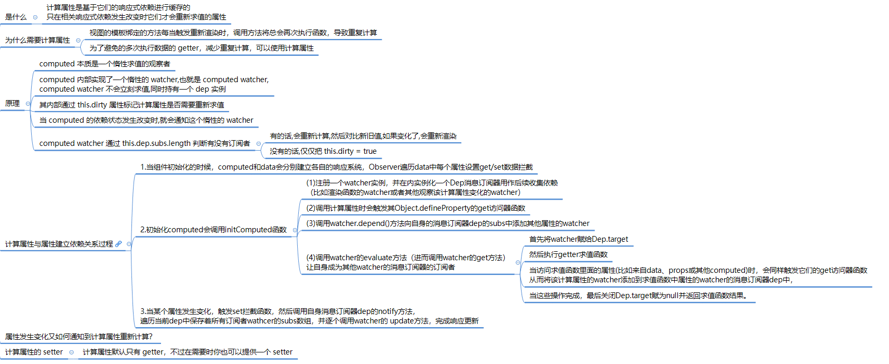

**computed & watch 比较** 

* 相同点：数据变化时，会执行回调方法，进行依赖数据收集和重新计算。
* 区别：


* 流程图：

  * 初次渲染comouted 流程

    

  * 修改 computed 重新渲染流程

    

  

* 源码分析：

  计算属性的初始化是发生在 Vue 实例初始化阶段的 `initState` 函数中，执行了 `if (opts.computed) initComputed(vm, opts.computed)`，`initComputed` 的定义在 [src/core/instance/state.js](https://github.com/vuejs/vue/blob/v2.3.0/src/core/instance/state.js) 中：

  ```js
  const computedWatcherOptions = { lazy: true } // lazy 标志是否重新求值
  
  /*初始化computed*/
  function initComputed (vm: Component, computed: Object) {
    const watchers = vm._computedWatchers = Object.create(null) // 创建 watcher 对象
  
    for (const key in computed) { // 遍历计算属性对象
      const userDef = computed[key]
      /*
        计算属性可能是一个function，也有可能设置了get以及set的对象。
        可以参考 https://cn.vuejs.org/v2/guide/computed.html#计算-setter
      */
      let getter = typeof userDef === 'function' ? userDef : userDef.get
      if (process.env.NODE_ENV !== 'production') { // 非生产环境下提示警告
        /*getter不存在的时候抛出warning并且给getter赋空函数*/
        if (getter === undefined) {
          warn(
            `No getter function has been defined for computed property "${key}".`,
            vm
          )
          getter = noop
        }
      }
      // create internal watcher for the computed property.
      /*
        为每一个计算属性创建一个对应的内部的监视器 Watcher，保存在vm实例的_computedWatchers中
        这里的computedWatcherOptions参数传递了一个lazy为true，会使得watch实例的dirty为true
      */
      watchers[key] = new Watcher(vm, getter, noop, computedWatcherOptions)
  
      // component-defined computed properties are already defined on the
      // component prototype. We only need to define computed properties defined
      // at instantiation here.
      /*组件正在定义的计算属性已经定义在现有组件的原型上则不会进行重复定义*/
      if (!(key in vm)) {
        /*定义计算属性*/
        defineComputed(vm, key, userDef)
      } else if (process.env.NODE_ENV !== 'production') { // 非生产环境下警告
        /*如果计算属性与已定义的data或者props中的名称冲突则发出warning*/
        if (key in vm.$data) {
          warn(`The computed property "${key}" is already defined in data.`, vm)
        } else if (vm.$options.props && key in vm.$options.props) {
          warn(`The computed property "${key}" is already defined as a prop.`, vm)
        }
      }
    }
  }
  ```

  * 函数首先创建 `vm._computedWatchers` 为一个空对象，接着对 `computed` 对象做遍历，拿到计算属性的每一个 `userDef`，然后尝试获取这个 `userDef` 对应的 `getter` 函数，拿不到则在开发环境下报警告。
  * 接下来为每一个 `getter` 创建一个 `watcher`，这个 `watcher` 和渲染 `watcher` 有一点很大的不同，它是一个 `computed watcher`，因为 `const computedWatcherOptions = { computed: true }`。
  * 最后对判断如果 `key` 不是 `vm` 的属性，则调用 `defineComputed(vm, key, userDef)`，否则判断计算属性对于的 `key` 是否已经被 `data` 或者 `prop` 所占用，如果是的话则在开发环境报相应的警告。

  那么接下来需要重点关注 `defineComputed` 的实现：

  ```js
  /*定义计算属性*/
  export function defineComputed (target: any, key: string, userDef: Object | Function) {
    if (typeof userDef === 'function') {
      /*创建计算属性的getter*/
      sharedPropertyDefinition.get = createComputedGetter(key)
      /*
        当userDef是一个function的时候是不需要setter的，所以这边给它设置成了空函数。
        因为计算属性默认是一个function，只设置getter。
        当需要设置setter的时候，会将计算属性设置成一个对象。参考：https://cn.vuejs.org/v2/guide/computed.html#计算-setter
      */
      sharedPropertyDefinition.set = noop
    } else {
      /*get不存在则直接给空函数，如果存在则查看是否有缓存cache，没有依旧赋值get，有的话使用createComputedGetter创建*/
      sharedPropertyDefinition.get = userDef.get
        ? userDef.cache !== false
          ? createComputedGetter(key)
          : userDef.get
        : noop
      /*如果有设置set方法则直接使用，否则赋值空函数*/
      sharedPropertyDefinition.set = userDef.set
        ? userDef.set
        : noop
    }
    /*defineProperty上getter与setter*/
    Object.defineProperty(target, key, sharedPropertyDefinition)
  }
  ```

  这段逻辑很简单，其实就是利用 `Object.defineProperty` 给计算属性对应的 `key` 值添加 getter 和 setter，setter 通常是计算属性是一个对象，并且拥有 `set` 方法的时候才有，否则是一个空函数。在平时的开发场景中，计算属性有 setter 的情况比较少，我们重点关注一下 getter 部分，缓存的配置也先忽略，最终 getter 对应的是 `createComputedGetter(key)` 的返回值，来看一下它的定义：

  ```js
  /*
  * 创建计算属性的 getter 函数
  * 主要执行两个步骤： 
  *  1. 获取 computed 对应的 watcher 对象判断依赖数据是否改变，改变了 重新计算computed 
  *  2. 重新依赖收集
  */
  function createComputedGetter (key) {
    return function computedGetter () {
      // 获取 computed 对应的 watcher 对象
      const watcher = this._computedWatchers && this._computedWatchers[key]
      if (watcher) {
        /*实际是脏检查，在计算属性中的依赖发生改变的时候dirty会变成true，在get的时候重新计算计算属性的输出值*/
        if (watcher.dirty) {
          watcher.evaluate()
        }
        /*依赖收集*/
        if (Dep.target) {
          watcher.depend()
        }
        return watcher.value
      }
    }
  }
  ```

  `createComputedGetter` 返回一个函数 `computedGetter`，它就是计算属性对应的 getter。

  整个计算属性的初始化过程到此结束，我们知道计算属性是一个 `computed watcher`，它和普通的 `watcher` 有什么区别呢，为了更加直观，接下来来我们来通过一个例子来分析 `computed watcher` 的实现。

  ```js
  var vm = new Vue({
    data: {
      firstName: 'Foo',
      lastName: 'Bar'
    },
    computed: {
      fullName: function () {
        return this.firstName + ' ' + this.lastName
      }
    }
  })
  ```

  当初始化这个 `computed watcher` 实例的时候，构造函数部分逻辑稍有不同：

  ```js
  constructor (
    vm: Component,
    expOrFn: string | Function,
    cb: Function,
    options?: ?Object,
    isRenderWatcher?: boolean
  ) {
    // ...
    if (this.computed) {
      this.value = undefined
      this.dep = new Dep()
    } else {
      this.value = this.get()
    }
  }  
  ```

  可以发现 `computed watcher` 会并不会立刻求值，同时持有一个 `dep` 实例。

  然后当我们的 `render` 函数执行访问到 `this.fullName` 的时候，就触发了计算属性的 `getter`，它会拿到计算属性对应的 `watcher`，然后执行 `watcher.depend()`，来看一下它的定义：

  ```js
  /**
    * Depend on this watcher. Only for computed property watchers.
    */
  depend () {
    if (this.dep && Dep.target) {
      this.dep.depend()
    }
  }
  ```

  注意，这时候的 `Dep.target` 是渲染 `watcher`，所以 `this.dep.depend()` 相当于渲染 `watcher` 订阅了这个 `computed watcher` 的变化。

  然后再执行 `watcher.evaluate()` 去求值，来看一下它的定义：

  ```js
  /**
    * Evaluate and return the value of the watcher.
    * This only gets called for computed property watchers.
    */
  evaluate () { // 进行脏检查，在计算属性中的依赖发生改变的时候dirty会变成true，重新计算
    if (this.dirty) {
      this.value = this.get()
      this.dirty = false
    }
    return this.value
  }
  ```

  `evaluate` 的逻辑非常简单，判断 `this.dirty`，如果为 `true` 则通过 `this.get()` 求值，然后把 `this.dirty` 设置为 false。在求值过程中，会执行 `value = this.getter.call(vm, vm)`，这实际上就是执行了计算属性定义的 `getter` 函数，在我们这个例子就是执行了 `return this.firstName + ' ' + this.lastName`。

  这里需要特别注意的是，由于 `this.firstName` 和 `this.lastName` 都是响应式对象，这里会触发它们的 getter，根据我们之前的分析，它们会把自身持有的 `dep` 添加到当前正在计算的 `watcher` 中，这个时候 `Dep.target` 就是这个 `computed watcher`。

  最后通过 `return this.value` 拿到计算属性对应的值。我们知道了计算属性的求值过程，那么接下来看一下它依赖的数据变化后的逻辑。

  一旦我们对计算属性依赖的数据做修改，则会触发 setter 过程，通知所有订阅它变化的 `watcher` 更新，执行 `watcher.update()` 方法：

  ```js
  /* istanbul ignore else */
  if (this.computed) {
    // A computed property watcher has two modes: lazy and activated.
    // It initializes as lazy by default, and only becomes activated when
    // it is depended on by at least one subscriber, which is typically
    // another computed property or a component's render function.
    if (this.dep.subs.length === 0) {
      // In lazy mode, we don't want to perform computations until necessary,
      // so we simply mark the watcher as dirty. The actual computation is
      // performed just-in-time in this.evaluate() when the computed property
      // is accessed.
      this.dirty = true
    } else {
      // In activated mode, we want to proactively perform the computation
      // but only notify our subscribers when the value has indeed changed.
      this.getAndInvoke(() => {
        this.dep.notify()
      })
    }
  } else if (this.sync) {
    this.run()
  } else {
    queueWatcher(this)
  }
  ```

  那么对于计算属性这样的 `computed watcher`，它实际上是有 2 种模式，lazy 和 active。如果 `this.dep.subs.length === 0` 成立，则说明没有人去订阅这个 `computed watcher` 的变化，仅仅把 `this.dirty = true`，只有当下次再访问这个计算属性的时候才会重新求值。在我们的场景下，渲染 `watcher` 订阅了这个 `computed watcher` 的变化，那么它会执行：

  ```js
  this.getAndInvoke(() => {
    this.dep.notify()
  })
  
  getAndInvoke (cb: Function) {
    const value = this.get()
    if (
      value !== this.value ||
      // Deep watchers and watchers on Object/Arrays should fire even
      // when the value is the same, because the value may
      // have mutated.
      isObject(value) ||
      this.deep
    ) {
      // set new value
      const oldValue = this.value
      this.value = value
      this.dirty = false
      if (this.user) {
        try {
          cb.call(this.vm, value, oldValue)
        } catch (e) {
          handleError(e, this.vm, `callback for watcher "${this.expression}"`)
        }
      } else {
        cb.call(this.vm, value, oldValue)
      }
    }
  }
  ```

  `getAndInvoke` 函数会重新计算，然后对比新旧值，如果变化了则执行回调函数，那么这里这个回调函数是 `this.dep.notify()`，在我们这个场景下就是触发了渲染 `watcher` 重新渲染。

  通过以上的分析，我们知道计算属性本质上就是一个 `computed watcher`，也了解了它的创建过程和被访问触发 getter 以及依赖更新的过程，其实这是最新的计算属性的实现，之所以这么设计是因为 Vue 想确保不仅仅是计算属性依赖的值发生变化，而是当计算属性最终计算的值发生变化才会触发渲染 `watcher` 重新渲染，本质上是一种优化。

  接下来我们来分析一下侦听属性 `watch` 是怎么实现的。

  


### [watch 侦听器](https://cn.vuejs.org/v2/api/#watch)

* 作用：用于数据变化时执行异步或开销较大的操作。

* 本质上侦听属性也是基于 `Watcher` 实现的，它是一个 `user watcher`

* watcher 初始化流程：

  

* 源码分析：

  * 侦听属性的初始化也是发生在 Vue 的实例初始化阶段的 `initState` 函数中，在 `computed` 初始化之后，执行了：

    ```js
    if (opts.watch && opts.watch !== nativeWatch) {
      initWatch(vm, opts.watch)
    }
    ```

     `initWatch` 函数：它的定义在 `src/core/instance/state.js` 中：

    ```js
    function initWatch (vm: Component, watch: Object) {
      for (const key in watch) {
        const handler = watch[key]
        if (Array.isArray(handler)) {
          for (let i = 0; i < handler.length; i++) {
            createWatcher(vm, key, handler[i])
          }
        } else {
          createWatcher(vm, key, handler)
        }
      }
    }
    ```

    这里就是对 `watch` 对象做遍历，拿到每一个 `handler`，因为 Vue 是支持 `watch` 的同一个 `key` 对应多个 `handler`，所以如果 `handler` 是一个数组，则遍历这个数组，调用 `createWatcher` 方法，否则直接调用 `createWatcher`：

    ```js
    function createWatcher (
      vm: Component,
      expOrFn: string | Function,
      handler: any,
      options?: Object
    ) {
      if (isPlainObject(handler)) {
        options = handler
        handler = handler.handler
      }
      if (typeof handler === 'string') {
        handler = vm[handler]
      }
      return vm.$watch(expOrFn, handler, options)
    }
    ```

    这里的逻辑也很简单，首先对 `hanlder` 的类型做判断，拿到它最终的回调函数，最后调用 `vm.$watch(keyOrFn, handler, options)` 函数，`$watch` 是 Vue 原型上的方法，它是在执行 `stateMixin` 的时候定义的：

    ```js
    Vue.prototype.$watch = function (
      expOrFn: string | Function,
      cb: any,
      options?: Object
    ): Function {
      const vm: Component = this
      if (isPlainObject(cb)) {
        return createWatcher(vm, expOrFn, cb, options)
      }
      options = options || {}
      options.user = true
      const watcher = new Watcher(vm, expOrFn, cb, options)
      if (options.immediate) {
        cb.call(vm, watcher.value)
      }
      return function unwatchFn () {
        watcher.teardown()
      }
    }
    ```

    * 侦听属性 `watch` 最终会调用 `$watch` 方法，这个方法首先判断 `cb` 如果是一个对象，则调用 `createWatcher` 方法，这是因为 `$watch` 方法是用户可以直接调用的，它可以传递一个对象，也可以传递函数。
    * 接着执行 `const watcher = new Watcher(vm, expOrFn, cb, options)` 实例化了一个 `watcher`，这里需要注意一点这是一个 `user watcher`，因为 `options.user = true`。通过实例化 `watcher` 的方式，一旦我们 `watch` 的数据发送变化，它最终会执行 `watcher` 的 `run` 方法，执行回调函数 `cb`，并且如果我们设置了 `immediate` 为 true，则直接会执行回调函数 `cb`。
    * 最后返回了一个 `unwatchFn` 方法，它会调用 `teardown` 方法去移除这个 `watcher`。 

**watcher 对象**

* Watcher 对象：进行依赖收集的观察者，同时在数据变更时通知响应数据改变。

* ```js
  /* A watcher parses an expression, collects dependencies,
   * and fires callback when the expression value changes.
   * This is used for both the $watch() api and directives.
    一个解析表达式，进行依赖收集的观察者，同时在表达式数据变更时触发回调函数。它被用于$watch api以及指令
   */
  export default class Watcher {
    vm: Component;
    expression: string;
    cb: Function;
    id: number;
    deep: boolean;
    user: boolean;
    lazy: boolean;
    sync: boolean;
    dirty: boolean;//表示数据是否被读取
    active: boolean;
    deps: Array<Dep>;
    newDeps: Array<Dep>;
    depIds: ISet;
    newDepIds: ISet;
    getter: Function;
    value: any;
  
    constructor (
      vm: Component,
      expOrFn: string | Function, //在new Watcher(vm, updateComponent, noop, {}) 中对应 updateComponent() 方法
      cb: Function,
      options?: Object
    ) {
      this.vm = vm
      /*_watchers存放观察者实例*/
      vm._watchers.push(this)
      // options
      if (options) { //Watcher 类型选项
        this.deep = !!options.deep // deep Watcher 标记
        this.user = !!options.user  // user Watcher 标记
        this.lazy = !!options.lazy // computed watcher 标记
        this.sync = !!options.sync // sync watcher 标记 （vue数据更新是异步的，当响应式数据发送变化后，触发了 watcher.update()，只是把这个 watcher 推送到一个队列中，在 nextTick 后才会真正执行 watcher 的回调函数。而一旦我们设置了 sync，就可以在当前 Tick 中同步执行 watcher 的回调函数）
      } else {
        this.deep = this.user = this.lazy = this.sync = false
      }
      this.cb = cb
      this.id = ++uid // uid for batching
      this.active = true
      this.dirty = this.lazy // for lazy watchers
      this.deps = [] //当数据发生更新时候的旧数据的依赖watcher
      this.newDeps = [] //当数据发生更新时候的新数据的依赖watcher
      this.depIds = new Set()
      this.newDepIds = new Set()
      this.expression = process.env.NODE_ENV !== 'production'
        ? expOrFn.toString()
        : ''
      // parse expression for getter
      /*把表达式expOrFn参数解析成getter*/
      if (typeof expOrFn === 'function') {
        this.getter = expOrFn
      } else {
        this.getter = parsePath(expOrFn)
        if (!this.getter) {
          this.getter = function () {}
          process.env.NODE_ENV !== 'production' && warn(
            `Failed watching path: "${expOrFn}" ` +
            'Watcher only accepts simple dot-delimited paths. ' +
            'For full control, use a function instead.',
            vm
          )
        }
      }
      this.value = this.lazy
        ? undefined
        : this.get()
    }
  
    /**
     * Evaluate the getter, and re-collect dependencies.
     */
    /*获得getter的值并且重新进行依赖收集*/
    get () {
      /*将自身watcher观察者实例设置给Dep.target，用以依赖收集*/
      pushTarget(this)
      let value
      const vm = this.vm
  
      /*
        执行了getter操作，看似执行了渲染操作，其实是执行了依赖收集。
        在将Dep.target设置为自生观察者实例以后，执行getter操作。
        譬如说现在的的data中可能有a、b、c三个数据，getter渲染需要依赖a跟c，
        那么在执行getter的时候就会触发a跟c两个数据的getter函数，
        在getter函数中即可判断Dep.target是否存在然后完成依赖收集，
        将该观察者对象放入闭包中的Dep的subs中去。
      */
      if (this.user) {
        try {
          value = this.getter.call(vm, vm) //this.getter 对应就是 updateComponent 函数()
        } catch (e) {
          handleError(e, vm, `getter for watcher "${this.expression}"`)
        }
      } else {
        value = this.getter.call(vm, vm)
      }
      // "touch" every property so they are all tracked as
      // dependencies for deep watching
      /*如果存在deep，则触发每个深层对象的依赖，追踪其变化*/
      if (this.deep) {
        /*递归每一个对象或者数组，触发它们的getter，使得对象或数组的每一个成员都被依赖收集，形成一个“深（deep）”依赖关系*/
        traverse(value)
      }
  
      /*将观察者实例从target栈中取出并设置给Dep.target*/
      popTarget()
      this.cleanupDeps()
      return value
    }
  
    /**
     * Add a dependency to this directive.
     */
     /*添加一个依赖关系到Deps集合中*/
    addDep (dep: Dep) {
      const id = dep.id
      if (!this.newDepIds.has(id)) {
        this.newDepIds.add(id)
        this.newDeps.push(dep)
        if (!this.depIds.has(id)) {
          dep.addSub(this)
        }
      }
    }
  
    /**
     * Clean up for dependency collection.
     */
    /*清理依赖收集
      目的：在重新渲染时候清除更新后视图没有依赖的Watcher对象
    */
    cleanupDeps () {
      /*移除所有观察者对象*/
      let i = this.deps.length
      while (i--) {
        const dep = this.deps[i]
        /*移除更新后没有订阅的数据*/
        if (!this.newDepIds.has(dep.id)) {
          dep.removeSub(this)
        }
      }
      let tmp = this.depIds
      this.depIds = this.newDepIds
      this.newDepIds = tmp
      this.newDepIds.clear()
      tmp = this.deps
      this.deps = this.newDeps
      this.newDeps = tmp
      this.newDeps.length = 0
    }
  
    /**
     * Subscriber interface.
     * Will be called when a dependency changes.
     */
    /*
      订阅者接口，当依赖发生改变的时候进行回调
     */
    update () {
      /* istanbul ignore else */
      if (this.lazy) {
        this.dirty = true
      } else if (this.sync) { //sync Watcher
        /*同步则执行run直接渲染视图*/
        this.run()
      } else {
        /*异步推送到观察者队列中，下一个tick时调用。*/
        queueWatcher(this)
      }
    }
  
    /**
     * Scheduler job interface.
     * Will be called by the scheduler.
     */
    /*
        调度者工作接口，将被调度者回调。
      */
    run () {
      if (this.active) {
        /* 对于渲染 watcher 而言，它在执行 this.get() 方法求值的时候，会执行 getter 方法
        (getter方法实际为updateComponents方法，该方法首先调用_render()方法渲染Vnode,然后调用_update()方法更新dom)
        所以这就是当我们去修改组件相关的响应式数据的时候，会触发组件重新渲染的原因，
        接着就会重新执行 patch 的过程，但它和首次渲染有所不同 */
        const value = this.get()//获取当前的值
        if (
          value !== this.value ||
          // Deep watchers and watchers on Object/Arrays should fire even
          // when the value is the same, because the value may
          // have mutated.
          /*
          如果满足新旧值不等、新值是对象类型、deep 模式任何一个条件
          即便值相同，拥有Deep属性的观察者以及在对象／数组上的观察者应该被触发更新，因为它们的值可能发生改变。
          */
          isObject(value) ||
          this.deep
        ) {
          // set new value
          const oldValue = this.value
          /*设置新的值*/
          this.value = value
  
          /*触发回调*/
          if (this.user) {
            try {
              //该回调就是定义watch对向时的回调
              this.cb.call(this.vm, value, oldValue)
            } catch (e) {
              handleError(e, this.vm, `callback for watcher "${this.expression}"`)
            }
          } else {
            this.cb.call(this.vm, value, oldValue)
          }
        }
      }
    }
  
    /**
     * Evaluate the value of the watcher.
     * This only gets called for lazy watchers.
     */
  /*获取观察者的值*/
    evaluate () {
      this.value = this.get()
      this.dirty = false
    }
  
    /**
     * Depend on all deps collected by this watcher.
     */
     /*收集该watcher的所有deps依赖*/
    depend () {
      let i = this.deps.length
      while (i--) {
        this.deps[i].depend()
      }
    }
  
    /**
     * Remove self from all dependencies' subscriber list.
     */
     /*将自身从所有依赖收集订阅列表删除*/
    teardown () {
      if (this.active) {
        // remove self from vm's watcher list
        // this is a somewhat expensive operation so we skip it
        // if the vm is being destroyed.
        /*从vm实例的观察者列表中将自身移除，由于该操作比较耗费资源，所以如果vm实例正在被销毁则跳过该步骤。*/
        if (!this.vm._isBeingDestroyed) {
          remove(this.vm._watchers, this)
        }
        let i = this.deps.length
        while (i--) {
          this.deps[i].removeSub(this)
        }
        this.active = false
      }
    }
  }
  ```

* 根据 options 传入选项，Watcher 对象有四中类型。 

  * `deep watcher`： 对象做深度观测；
  * `user watcher`: 通过 `vm.$watch` 创建的 `watcher` ;
  * `computed watcher` : watch 计算属性;
  * `sync watcher` : 同步执行 `watcher` 

* **deep watcher**

  通常，如果我们想对一下对象做深度观测的时候，需要设置这个属性为 true，考虑到这种情况：

  ```js
  var vm = new Vue({
    data() {
      a: {
        b: 1
      }
    },
    watch: {
      a: {
        handler(newVal) {
          console.log(newVal)
        }
      }
    }
  })
  vm.a.b = 2
  ```

  这个时候是不会 log 任何数据的，因为我们是 watch 了 `a` 对象，只触发了 `a` 的 getter，并没有触发 `a.b` 的 getter，所以并没有订阅它的变化，导致我们对 `vm.a.b = 2` 赋值的时候，虽然触发了 setter，但没有可通知的对象，所以也并不会触发 watch 的回调函数了。

  而我们只需要对代码做稍稍修改，就可以观测到这个变化了

  ```js
  watch: {
    a: {
      deep: true,
      handler(newVal) {
        console.log(newVal)
      }
    }
  }
  ```

  这样就创建了一个 `deep watcher` 了，在 `watcher` 执行 `get` 求值的过程中有一段逻辑：

  ```js
  get() {
    let value = this.getter.call(vm, vm)
    // ...
    if (this.deep) {
      traverse(value)
    }
  }
  ```

  在对 watch 的表达式或者函数求值后，会调用 `traverse` 函数，它的定义在 `src/core/observer/traverse.js` 中：

  ```javascript
   /*递归每一个对象或者数组，触发它们的getter，使得对象或数组的每一个成员都被依赖收集，形成一个“深（deep）”依赖关系*/
  
   /*用来存放Oberser实例等id，避免重复读取*/
  const seenObjects = new Set()
  function traverse (val: any) {
    seenObjects.clear()
    _traverse(val, seenObjects)
  }
  
  function _traverse (val: any, seen: ISet) {
    let i, keys
    const isA = Array.isArray(val)
    /*非对象或数组或是不可扩展对象直接return，不需要收集深层依赖关系。*/
    if ((!isA && !isObject(val)) || !Object.isExtensible(val)) {
      return
    }
    if (val.__ob__) {
      /*把子响应式对象通过它们的 dep id 记录到 seenObjects，避免以后重复访问*/
      const depId = val.__ob__.dep.id
      if (seen.has(depId)) {
        return
      }
      seen.add(depId)
    }
  
    /*递归对象及数组*/
    if (isA) {
      i = val.length
      while (i--) _traverse(val[i], seen)
    } else {
      keys = Object.keys(val)
      i = keys.length
      while (i--) _traverse(val[keys[i]], seen)
    }
  }
  ```

  `traverse` 的逻辑也很简单，它实际上就是对一个对象做深层递归遍历，因为遍历过程中就是对一个子对象的访问，会触发它们的 getter 过程，这样就可以收集到依赖，也就是订阅它们变化的 `watcher`，这个函数实现还有一个小的优化，遍历过程中会把子响应式对象通过它们的 `dep id` 记录到 `seenObjects`，避免以后重复访问。

  那么在执行了 `traverse` 后，我们再对 watch 的对象内部任何一个值做修改，也会调用 `watcher` 的回调函数了。

  对 `deep watcher` 的理解非常重要，今后工作中如果大家观测了一个复杂对象，并且会改变对象内部深层某个值的时候也希望触发回调，一定要设置 `deep` 为 true，但是因为设置了 `deep` 后会执行 `traverse` 函数，会有一定的性能开销，所以一定要根据应用场景权衡是否要开启这个配置。

* **user watcher**

  通过 `vm.$watch` 创建的 `watcher` 是一个 `user watcher`，其实它的功能很简单，在对 `watcher` 求值以及在执行回调函数的时候，会处理一下错误，如下：

  ```js
  get() {
    if (this.user) {
      handleError(e, vm, `getter for watcher "${this.expression}"`)
    } else {
      throw e
    }
  },
  getAndInvoke() {
    // ...
    if (this.user) {
      try {
        this.cb.call(this.vm, value, oldValue)
      } catch (e) {
        handleError(e, this.vm, `callback for watcher "${this.expression}"`)
      }
    } else {
      this.cb.call(this.vm, value, oldValue)
    }
  }
  ```

  `handleError` 在 Vue 中是一个错误捕获并且暴露给用户的一个利器

* **sync watcher**

  当响应式数据发送变化后，触发了 `watcher.update()`，只是把这个 `watcher` 推送到一个队列中，在 `nextTick` 后才会真正执行 `watcher` 的回调函数。而一旦我们设置了 `sync`，就可以在当前 `Tick` 中同步执行 `watcher` 的回调函数。

  ```js
  update () {
    if (this.computed) {
      // ...
    } else if (this.sync) {
      this.run()
    } else {
      queueWatcher(this)
    }
  }
  ```

  只有当我们需要 watch 的值的变化到执行 `watcher` 的回调函数是一个同步过程的时候才会去设置该属性为 true


### this.$options.data() 和 this.$data


**参考资料**

[Vue中的this.$options.data()和this.$data用法说明](https://www.yzlfxy.com/jiaocheng/JavaScript/363285.html)


## 指令

### [v-if & v-show](https://cn.vuejs.org/v2/api/#v-show)	


* **共同点：** 都能控制元素的显示和隐藏；
* **不同点：** 实现本质方法不同，`v-show` 本质就是通过控制 css 中的 `display` 设置为 `none`，控制隐藏，只会编译一次；`v-if` 是动态的向 DOM 树内添加或者删除 DOM 元素，若初始值为 `false` ，就不会编译了。而且 `v-if` 不停的销毁和创建比较消耗性能。

**v-if & v-for**

* 2.x 版本中在一个元素上同时使用 `v-if` 和 `v-for` 时，`v-for` 会优先作用。
* 3.x 版本中 `v-if` 总是优先于 `v-for` 生效。


### [v-model 双向绑定](https://cn.vuejs.org/v2/api/#v-model)

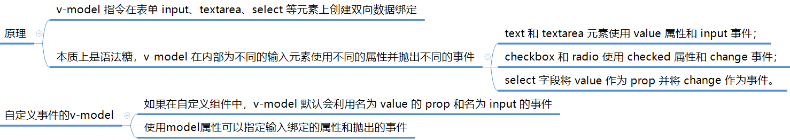

* 双向绑定：数据变化更新视图，视图变化更新数据

  * 输入框内容变化时，Data 中的数据同步变化。即 View => Data 的变化

  * Data 中的数据变化时，文本节点的内容同步变化。即 Data => View 的变化

    

* 本质上就是一种语法糖，它即可以支持原生表单元素，也可以支持自定义组件。

  * 原生的v-model，会根据标签的不同生成不同的事件和属性。
  
  * 在组件的实现中，我们是可以配置子组件接收的 `prop` 名称，以及派发的 `event `属性来进行自定义
  
    ```javascript
    let Child = {
      template: '<div>'
      + '<input :value="msg" @input="updateValue" placeholder="edit me">' +
      '</div>',
      props: ['msg'],
      model: {
        prop: 'msg', //子组件 v-model 绑定的属性
        event: 'change' // 子组件 v-model 触发的事件
      },
      methods: {
        updateValue(e) {
          this.$emit('change', e.target.value)
        }
      }
    }
    
    let vm = new Vue({
      el: '#app',
      template: '<div>' +
      '<child v-model="message"></child>' +
      '<p>Message is: {{ message }}</p>' +
      '</div>',
      data() {
        return {
          message: ''
        }
      },
      components: {
        Child
      }
    })
    ```
  
    
  
* [源码分析](http://caibaojian.com/vue-analysis/extend/v-model.html#v-model)


## [实例方法 / 事件](https://cn.vuejs.org/v2/api/#实例方法-事件)

### VUE 事件机制

* Vue 事件机制 本质上就是 一个 发布-订阅 模式的实现

###  修饰符

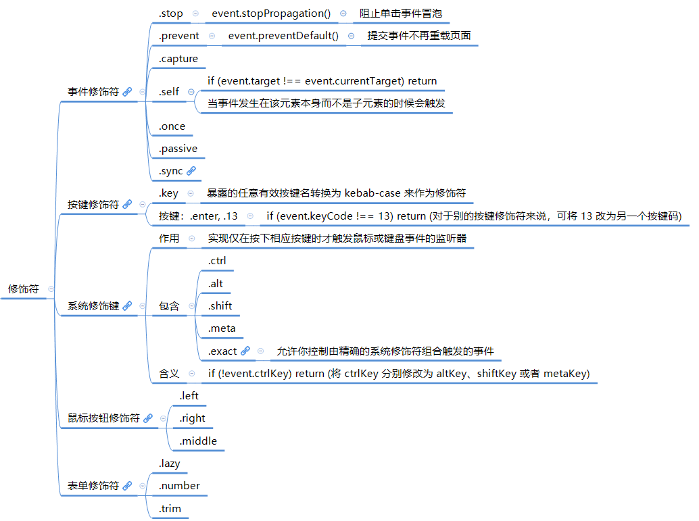

### 手写$on,$off,$emit,$once

```js
class Vue {

  constructor() {
    //  事件通道调度中心
    this._events = Object.create(null)
  }

  $on(event, fn) {
    if (Array.isArray(event)) { //如果事件名为数组，递归添加事件
      event.map(item => {
        this.$on(item, fn)
      })
    } else { //向事件对象添加事件回调
      (this._events[event] || (this._events[event] = [])).push(fn)
    }
    return this
  }

  $once(event, fn) {
    function on() {
      this.$off(event, on)
      fn.apply(this, arguments)
    }
    on.fn = fn
    this.$on(event, on)
    return this
  }

  $off(event, fn) {
    if (!arguments.length) {
      this._events = Object.create(null)
      return this
    }
    if (Array.isArray(event)) {
      event.map(item => {
        this.$off(item, fn)
      })
      return this
    }
    const cbs = this._events[event]
    if (!cbs) {
      return this
    }
    if (!fn) {
      this._events[event] = null
      return this
    }
    let cb
    let i = cbs.length
    while (i--) {
      cb = cbs[i]
      if (cb === fn || cb.fn === fn) {
        cbs.splice(i, 1)
        break
      }
    }
    return this
  }
  
  $emit(event) {
    let cbs = this._events[event]
    if (cbs) {
      const args = [].slice.call(arguments, 1)
      cbs.map(item => {
        args ? item.apply(this, args) : item.call(this)
      })
    }
    return this
  }
}
```


## [特殊属性](https://cn.vuejs.org/v2/api/#特殊-attribute)

### [key](https://cn.vuejs.org/v2/api/#key)

* 作用: 

  * key 是给每一个 vnode 的唯一 id,依靠 key,我们的 diff 操作可以更准确、更快速。

    * diff 算法的过程中,先会进行新旧节点的首尾交叉对比,当无法匹配的时候会通过 key 查找 VNode。
    
  * 更准确 : 因为带 key 就不是就地复用了 VNode,在 sameNode 函数 a.key === b.key 对比中可以避免就地复用的情况。所以会更加准确,如果不加 key,会导致之前节点的状态被保留下来,会产生一系列的 bug。
    
  * 更快速 : key 的唯一性可以被 Map 数据结构充分利用,相比于遍历查找的时间复杂度 O(n),Map 的时间复杂度仅仅为 O(1)。
    
  * 在v-if条件渲染中，用 key 避免组件复用:

    * 当我们使用 v-if 来实现元素切换的时候，如果切换前后含有相同类型的元素，那么这个元素就会被复用。
    * 如果是相同的 input 元素，那么切换前后用户的输入不会被清除掉，这样是不符合需求的。
    * 因此我们可以通过使用 key 来唯一的标识一个元素，这个情况下，使用 key 的元素不会被复用。
    * 这个时候 key 的作用是用来标识一个独立的元素。

    

  * 在v-for列表渲染中,用key维护维护列表状态：

    * 当 Vue 正在更新使用 v-for 渲染的元素列表时，它默认使用“就地更新”的策略；

    * 如果数据项的顺序被改变，Vue 将不会移动 DOM 元素来匹配数据项的顺序，而是简单复用此处的每个元素。

    * 因此通过为每个列表项提供一个 key 值，来以便 Vue 跟踪元 素的身份，从而高效的实现复用。

    * 这个时候 key 的作用是为了高效的更新渲染虚拟 DOM。

    * 原理：diff 比较同层列表时，未加 Key 则会继续比较该层的子 dom 变化，导致子 dom 树没有变化的节点被复用；添加 key 值就会直接根据 Key 比较，查找同层列表中 Key 值相同的节点，然后复用列表组件，因此复用整层的 dom 树。

      

* 原理: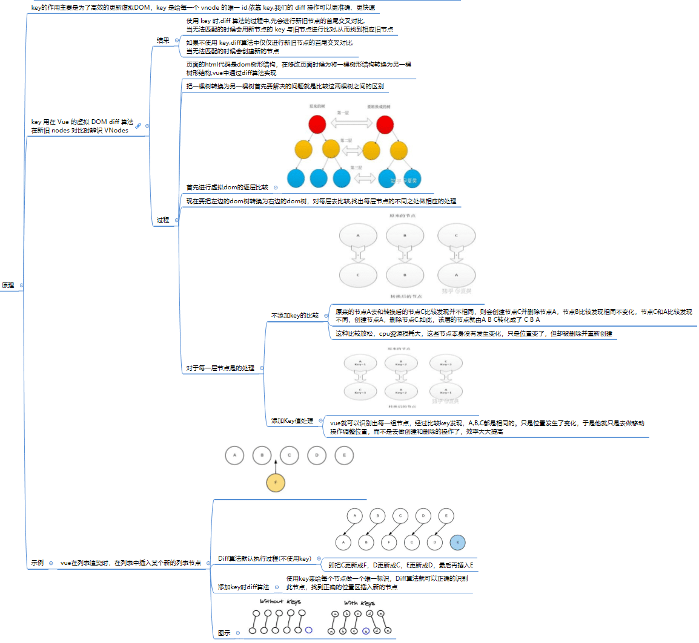


* 参考资料
  * [Vue2.0 v-for 中 :key 到底有什么用？](https://www.zhihu.com/question/61064119)


## VUE 2.X 缺陷

### [数组和对象的检测缺陷](https://vue3js.cn/docs/zh/guide/change-detection.html#%E5%A3%B0%E6%98%8E%E5%93%8D%E5%BA%94%E5%BC%8F-property)

* 缺陷原因：

  * vue2.x使用 `Object.defineProperty() `实现数据响应式
  * `Object.defineProperty()`存在以下缺陷
    * **不能监听数组的变化**
    * **无法检测到对象属性的新增或删除**

* 缺陷检测

  
  

### 为什么 Vue2 无法检测到 data 对象属性的新增或删除？

* Vue.js 2.x 的响应系统是基于 **Object.defineProperty** 的，该 API **只能对对象单个属性操作拦截**;
* Vue 的响应式系统**在实例化时会对数据对象 data 选项进行递归遍历**，将其属性转换为getter/setter，从而实现数据的响应式更新;由于 Object.defineProperty只能对对象单个属性操作拦，因此必须对对象深度遍历；
* **当初始化完成以后，不再进行响应式操作**，因此在运行时通过直接给对象新增或删除属性的方式来改变数据，Vue 无法遍历到新增的属性，因此无法对新增属性调用 `defineReactive` 定义响应式。

以下截取部分 `手写响应式原理过程`（详细代码可参考以上 `手写响应式原理`）, 当新增数据时候， ` if (data.hasOwnProperty(key))`  语句为 `false`，跳过了 `defineReactive`，因此新增属性无法进行响应式。

```js
//遍历数据，对数据每一个属性定义响应式
function Observer(data) {
  for (let key in data) {
  // 当新增数据时候，该语句为 false，跳过了 defineReactive 方法，因此新增属性无法进行响应式。
    if (data.hasOwnProperty(key)) {
      defineReactive(data, key, data[key]);
    }
  }
}

function defineReactive(obj, key, value) {
  let dep = new Dep();

  Object.defineProperty(obj, key, {
    enumerable: true,
    configurable: true,
    get: function() {
      if (Dep.target) {
        dep.addWatcher(Dep.target);
      }
      return value;
    },
    set: function(newValue) {
      if (value !== newValue) {
        value = newValue;
        dep.notify();
      }
    }
  });
}

// vue 实例，初始化时遍历 data 对象，进行观察数据，双向绑定
function Vue(options) {
  this.data = options.data;
  Observer(this.data);
  this.bindData();
}

Vue.prototype.bindData = function() {
  let self = this;
  // 遍历对象上所有属性进行双向绑定
  for (let key in this.data) {
    if (this.data.hasOwnProperty(key)) {
      Object.defineProperty(this, key, {
        get: function() {
          return self.data[key];
        },
        set: function(newValue) {
          self.data[key] = newValue;
        }
      });
    }
  }
};

let vm = new Vue({
  data: {
    someObject: {
        key1: 'value1'
    }
  }
});

// 无法监听到 key2 值的变化
vm.data.key2 = 'value2'
```

#### **解决 vue2 无法检测到 data 对象属性的新增或删除**

**Vue2 解决方案**

* 为了让Vue能够响应新增或删除属性的变化，你可以使用Vue提供的**`Vue.set`或`this.$set`方法来添加属性**，以及使用**`Vue.delete`或`this.$delete`方法来删除属性**。这些方法会通过特殊的方式触发属性的更新，使Vue能够检测到属性的变化并更新视图。

```js
// 在Vue实例中使用Vue.set添加属性
Vue.set(obj, 'newProperty', 'value');

// 在Vue组件中使用this.$set添加属性
this.$set(this.obj, 'newProperty', 'value');

// 在Vue实例中使用Vue.delete删除属性
Vue.delete(obj, 'propertyToRemove');

// 在Vue组件中使用this.$delete删除属性
this.$delete(this.obj, 'propertyToRemove');
```


**Vue3 解决方案**

使用 `Proxy` API 替换 `Object.defineProperty() ` 方法对 `data` 对象定义响应式，`Proxy` 接口底层支持检测代理对象属性的新增和删除检测。

## Vue2.x数组变更方法

### **Vue 不能检测到数组的变动**

* Vue 不能检测到利用索引直接设置一个项

  例如：`vm.items[indexOfItem] = newValue`；使用：`Vue.set(example1.items, indexOfItem, newValue)`；

* Vue 不能检测到数组的长度的修改
  例如：`vm.items.length = newLength`；使用 `vm.items.splice(newLength)`。

### **数组变更方法实现**

[变更方法](https://cn.vuejs.org/v2/guide/list.html#变更方法)：Vue 将被侦听的数组的变更方法进行了包裹，所以它们也将会触发视图更新。

这些被包裹过的方法包括：
* `push()`
* `pop()`
* `shift()`
* `unshift()`
* `splice()`
* `sort()`
* `reverse()`

### **数组方法包裹实现原理**

> 1. 首先，进行**代理原型**；
>
> 2. 然后，通过**重写数组变更方法，调用缓存的数组变更方法**；
>
> 3. 最后**对新插入数据进行数据观测和通知视图变更**；

* 首先，进行代理原型：

  * 原数组对象原型关系： `ArrayInstance.__proto__` =  `Array.prototype`;

    

  * 以数组对象的原型 `Array.prototype` 创建新的对象 `arrayMethods` 作为代理原型 ；

  * 创建新数组对象 `methodsToPatch`，将新数组对象的 `methodsToPatch.__proto__` 属性指向了  `arrayMethods`；

  * 将  `arrayMethods__proto__` 属性指向 `Array.prototype`;

  * 因此经过代理原型后，原型关系为：`ArrayInstance.__proto__` =  `methodsToPatch` , `methodsToPatch.__proto__`  =  `Array.prototype`;

    

* 然后，通过重写数组变更方法，调用缓存的数组变更方法；

* 最后对新插入数据进行数据观测和通知视图变更。

* 源码分析：

  * 在 new Vue() 初始化时候，进入到定义响应式数据，调用 observer() 

    ```javascript
    export class Observer {
      constructor (value: any) {
        this.value = value
        this.dep = new Dep()
        this.vmCount = 0
        def(value, '__ob__', this)
        if (Array.isArray(value)) {
          const augment = hasProto
            ? protoAugment
            : copyAugment
          augment(value, arrayMethods, arrayKeys)
          this.observeArray(value)
        } else {
          // ...
        }
      }
    }
    ```

    这里我们只需要关注 `value` 是 Array 的情况，首先获取 `augment`，这里的 `hasProto` 实际上就是判断对象中是否存在 `__proto__`，如果存在则 `augment` 指向 `protoAugment`， 否则指向 `copyAugment`，来看一下这两个函数的定义：

    ```js
    /**
     * Augment an target Object or Array by intercepting
     * the prototype chain using __proto__
     `protoAugment` 方法是直接把 `target.__proto__` 原型直接修改为 `src`
     */
    function protoAugment (target, src: Object, keys: any) {
      /* eslint-disable no-proto */
      target.__proto__ = src
      /* eslint-enable no-proto */
    }
    
    /**
     * Augment an target Object or Array by defining
     * hidden properties.
     `copyAugment` 方法是遍历 keys，通过 `def`，也就是 `Object.defineProperty` 去定义它自身的属性值。
     */
    /* istanbul ignore next */
    function copyAugment (target: Object, src: Object, keys: Array<string>) {
      for (let i = 0, l = keys.length; i < l; i++) {
        const key = keys[i]
        def(target, key, src[key])
      }
    }
    ```

    对于大部分现代浏览器都会走到 `protoAugment`，那么它实际上就把 `value` 的原型指向了 `arrayMethods` 

  * `arrayMethods` 的定义在 `src/core/observer/array.js` 中：

    ```js
    import { def } from '../util/index'
    
    const arrayProto = Array.prototype
    //`arrayMethods` 首先继承了 `Array`
    export const arrayMethods = Object.create(arrayProto)
    
    const methodsToPatch = [
      'push',
      'pop',
      'shift',
      'unshift',
      'splice',
      'sort',
      'reverse'
    ]
    
    /**
     * Intercept mutating methods and emit events
     方法进行重写
     */
    methodsToPatch.forEach(function (method) {
      // cache original method
      const original = arrayProto[method]
      // def 为 defineReactive 方法
      def(arrayMethods, method, function mutator (...args) {
        const result = original.apply(this, args)
        const ob = this.__ob__
        let inserted
        switch (method) {
          case 'push':
          case 'unshift':
            inserted = args
            break
          case 'splice':
            inserted = args.slice(2)
            break
        }
         //获取到插入的值，然后把新添加的值变成一个响应式对象
        if (inserted) ob.observeArray(inserted)
        // notify change
        ob.dep.notify()
        return result
    })
    })
    ```

    * 对原来数字方法进行重写，重写的方法会先执行它们本身原有的逻辑，并对能增加数组长度的 3 个方法 `push、unshift、splice` 方法做了判断，获取到插入的值，然后把新添加的值变成一个响应式对象
    * 再调用 `ob.dep.notify()` 手动触发依赖通知

---

## VUE2.x 问答题

**基础题**

> **如何让CSS只在当前组件中起作用**？

Q：在组件中的 style 标签上加上 scoped。

> **如何获取dom?**

Q：ref="domName" 用法：this.$refs.domName

> **vue获取数据在哪个周期函数?**

Q：普通单页应用项目一般在 created 钩子以后，如： created、before Mount、mounted。

SSR 项目中： 由于没有动态更新，所有的生命周期钩子函数中，只有 `beforeCreate` 和 `created` 会在服务器端渲染 (SSR) 过程中被调用。这就是说任何其他生命周期钩子函数中的代码（例如 `beforeMount` 或 `mounted`），只会在客户端执行。所以静态化的数据一般只在 `beforeCreate` 和 `created` 中服务端获取渲染，动态获取的数据在 `beforeMount` 或 `mounted` 中客户端获取。

> **第一次页面加载会触发哪几个钩子？**

Q：第一次页面加载即为首次渲染过程，首次渲染不涉及数据更新和页面销毁过程，所以只触发 beforeCreate, created, beforeMount, mounted ，并在 mounted 的时候DOM渲染完成。

>  **vue中数据渲染的时候如何保证将数据原样输出？**

* v-text：将数据输出到元素内部，如果输出的数据有HTML代码，会作为普通文本输出
* v-html：将数据输出到元素内部，如果输出的数据有HTML代码，会被渲染
* {{}}：插值表达式，可以直接获取Vue实例中定义的数据或函数，使用插值表达式的时候，值可能闪烁；而使用v-html、v-text不会闪烁，有值就显示，没值就隐藏


> props 和 $attr 区别？

* [props](https://cn.vuejs.org/v2/api/#props):props 可以是数组或对象，用于接收来自父组件的数据。

* [vm.$attrs](https://cn.vuejs.org/v2/api/#vm-attrs):包含了父作用域中不作为 prop 被识别 (且获取) 的 attribute 绑定 (`class` 和 `style` 除外)。当一个组件没有声明任何 prop 时，这里会包含所有父作用域的绑定 (`class` 和 `style` 除外)，并且可以通过 `v-bind="$attrs"` 传入内部组件——在创建高级别的组件时非常有用。


## VUE2.x源码问答题

### **初始化过程相关问题**

>  `beforeCreate` 钩子函数前完成了什么？

Q：beforeCreate 之前，主要是在处理 vm 实例上的各种属性配置和自定义事件属性，也就是**将 Vue 的壳初始化完成**。
 首先合并了组件的配置项挂载到全局 vm.$options 上。初始化组件实例关系属性，如：$parent、$children、$root、$refs 等等，然后初始化自定义的事件监听，最后初始化组件的插槽 slot 和作用域插槽scopedSlots，createElement（即 render 函数，同时定义了组件 attrs 和 $listeners属性。）


>  父子组件中，子组件调用执行本身注册的自定义事件 A()，那么父子组件中，谁监听事件 A() 的执行调用？

Q：谁注册了自定义事件，则谁监听自定义事件。故是子组件监听事件。

> `created` 钩子函数前完成了什么？

Q：created 钩子函数是在 Vue 壳构建完成后，开始初始化实例的响应式数据和方法。
 首先初始化好 inject 配置项，再初始化各种响应式数据和方法如：props、methods、data、computed、watch，最后初始化 vm._provided 属性。

>  `initInjections(vm)`、`initState(vm)`、`initProvide(vm)` 三者的执行顺序可否变化？

不可以，源码中有官方注释。
 inject 配置项是注入数据，在后续的 computed 和 data 中均可以或需要使用注入数据，故解析 injections 需要在 data/props 前。
 解析 provide 实际上只是将 vm.$options.provide 挂载到 vm._providedinject 上，需要等响应式数据和方法初始化完毕后再执行。inject 和 provide 是成对出现的，一个注入，一个接收。

```js
initInjections(vm) // resolve injections before data/props
initState(vm)
initProvide(vm) // resolve provide after data/props
```


> Vue 的初始化过程？

Q：Vue 初始化过程其实就是 beforeCreate 钩子函数和 created 钩子函数前执行的内容。

- 在 beforeCreate 前，主要先初始化搭建了 Vue 实例的壳，如组件的 options 配置项，组件实例的关系属性，处理了自定义事件。
- 在 created 前，主要是初始化实例的响应式数据和方法，首先初始化 inject 配置项，再初始化数据响应式和方法，最后解析组件配置项上的 provide 对象。总结来说构建初始化 Vue 实例对象 vm。


> vue 的类使用 ES5 function定义的，为什么不用 ES6 class 定义？

源码中有很多 `xxxMixin` 的函数调用，并把 `Vue` 当参数传入，它们的功能都是给 Vue 的 prototype 上扩展一些方法，Vue 按功能把这些扩展分散到多个模块中去实现，而不是在一个模块里实现所有，这种方式是用 Class 难以实现的。

这么做的好处是非常方便代码的维护和管理


> 怎么实现 this._test 改变而不是 this._data.test 改变触发更新?

这中间有一个 代理的过程: 本质就是通过 Object.defineProperty 使在访问 this 上的某属性时从 this._data 中读取（写入）。

```javascript
function _proxy (data) {
    const that = this;
    Object.keys(data).forEach(key => {
        Object.defineProperty(that, key, {
            configurable: true,
            enumerable: true,
            get: function proxyGetter () {
                return that._data[key];
            },
            set: function proxySetter (val) {
                that._data[key] = val;
            }
        })
    });
}
```


> Q:为什么vue组件中data对象、props、methods的key值不能重复(为什么data和props的key相同时会冲突)？ 

A:因为data、props、methods最终都会挂载到vue实例上(vm)，vue将这些属性代理到 vue 实例上，最终可以通过this.xxx访问属性 


> Q:如果组件中props对象和data对象中的Key重复,谁优先级高？ 

A:props优先级高  


> Q: 为什么通过this可以直接访问data对象中的数据？（比如：data对象中包含message，然后在钩子函数或函数中通过this.message可以访问该数据） 

A: 在vue初始化时，将data对象挂载到vue实例上的vm._data属性中(将data设置为vue实例的私有变量)，

然后通过Proxy代理(使用Object.defineProperty)设置data的key的getter和setter,在获取data时,代理到vm._data中(源码：src/core/instance/state.js中165行) 


> Q: 能不能将vue实例mount()挂载到 html 或则 body 元素上？ 

A: 不能。因为在vue生成的dom中会替换mount的节点，如果挂载到 html 或 body 上，会导致 html 页面结构改变 


> Q: 为什么我们在其它组件中使用 `<keep-alive>` 组件不需要注册? 

A: vue通过 extend(Vue.options.components, builtInComponents) 把一些内置组件扩展到 Vue.options.components 上 


> Q: options 的合并方式？

A: options 的合并有 2 种方式:第一种，外部初始化 Vue 通过 mergeOptions；第二种，子组件初始化过程通过 initInternalComponent 方式 


> Q: vue中钩子函数的合并策略函数？

A: mergeHook()函数中定义合并策略(src/core/utils/options)


### **全局API 问答**


>  Vue 初始化全局 API 时，做了什么？

* 1.Vue 初始化了全局的 config 配置并设为响应式。
* 2.暴露一些工具方法，如日志、选项扩展、选项合并、设置对象响应式 
* 3.暴露全局初始化方法，如 Vue.set、Vue.delete、Vue.nextTick、Vue.observable 
* 4.暴露组件配置注册方法，如  Vue.options.components、Vue.options.directives、Vue.options.filters、Vue.options._base 
* 5.暴露全局方法，如 Vue.use、Vue.mixin、Vue.extend、Vue.initAssetRegisters()


> Vue 全局 API 有什么作用？

* Vue.use()： 用来安装 plugin 插件，对插件进行缓存优化，并执行 install() 安装。

* Vue.mixin()：用来在 Vue 的全局配置上合并 options 配置。并且每个组件生成 vnode 时会合并全局配置和组件配置，因此可以作为抽离公共的业务逻辑，实现公共的业务逻辑，也就是类的继承。

* Vue.extend()：用来在 Vue 实例扩展子类，可以用于一些公共组件化配置上。与 Vue.mixin() 区别，我认为 extend 更多的是公众的组件化，也就是类的多态，外观模式。

* Vue.initAssetRegisters()：用来将实例上的 component、directive、filter 对象配置到全局的 Vue.options 上。


### **响应式原理相关问题**

> Vue 如何处理响应式数据？

Q：响应式的数据主要分为两类：Object 和 Array

* Object 对象则利用 defineReactive()，来循环遍历整个对象，通过 Object.defineProperty 设置 getter 和 setter 的拦截，再通过观察者模式双向绑定来实现对象响应式原理

* Array 数组则利用 `Array.split()` 重写数组的那 7 个可以更改自身的原型方法来实现响应式。


### **数据更新相关问题**

#### **Vue 默认更新是同步的还是异步？**

Q：Vue 默认异步更新，通过 `watcher.async`。Vue 源码还设置了开启同步更新的操作，可以通过设置 `watcher.sync` 的属性，在 watcher.update() 方法时并直接执行 watcher.run() 方法进行更新操作。**但 Vue 官方不推荐使用该属性，因同步更新机制将阻塞后续任务的执行，整个组件更新将大打折扣。**


#### **Vue 是如何避免重复执行同一次异步更新？**

Q：通过三个标识符的操作来进行避免重复执行同一次的异步更新：

* 在将 watcher 放入 watcher 队列时，进行了 id 的缓存，避免重复 watcher 添加到 queue 数组。

* 通过 waiting 判断是否正在刷新 queue 队列，避免重复执行刷新 queue 队列。

* 通过 pending 判断浏览器的异步任务队列中是否有刷新 callbacks（放的是刷新 queue 队列的任务） 数组的任务，避免浏览器异步任务队列重复执行刷新 callbacks 数组的任务。


#### **Vue 是如何将刷新 callbacks 数组的函数放入浏览器任务队列进行异步更新的？**

Q：根据浏览器任务队列异步执行的效率来选择放入方法的优先级，分别为：

1. Promise.resolve().then(flushCallbacks)
2. new MutationObserver(flushCallbacks)
   - 提供了监视对DOM树所做更改的能力（HTML5 中的新特性）
3. setImmediate(flushCallbacks)
4. setTimeout(flushCallbacks, 0)

****

## 参考资料 

### 源码相关

[Vue.js 技术揭秘](http://caibaojian.com/vue-analysis/)

