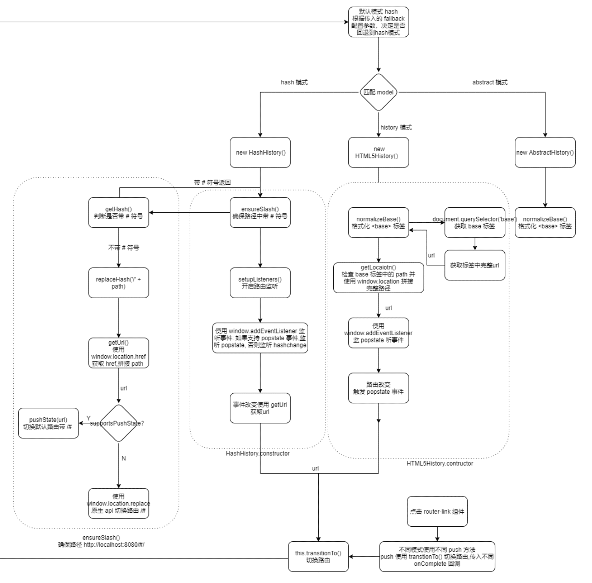
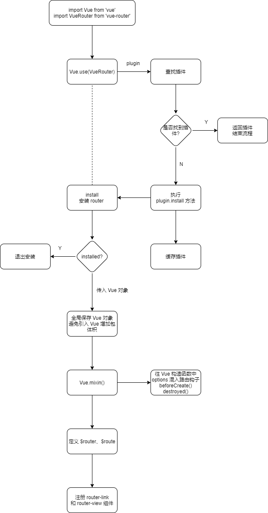
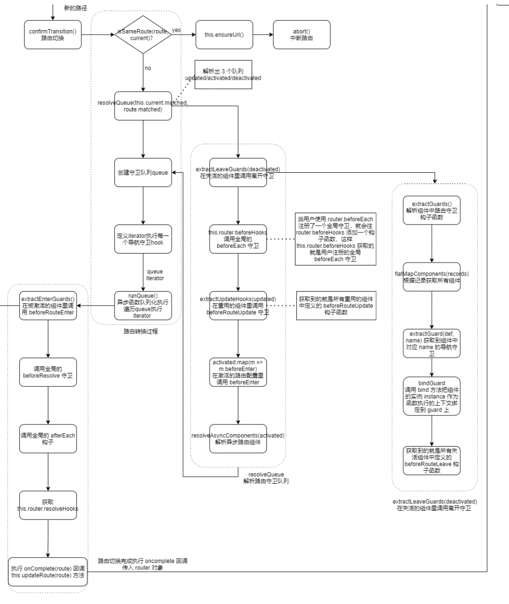

# VueRouter原理分析

# Vue-Router 3.x

## 路由基础

* 路由作用：根据不同的路径映射到不同的视图。

* 监听[复用组件](https://router.vuejs.org/zh/guide/essentials/dynamic-matching.html#%E5%93%8D%E5%BA%94%E8%B7%AF%E7%94%B1%E5%8F%82%E6%95%B0%E7%9A%84%E5%8F%98%E5%8C%96) 路由参数变化：watch (监测变化) `$route` 对象。

  ```javascript
  const User = {
    template: '...',
    watch: {
      $route(to, from) {
        // 对路由变化作出响应...
      }
    }
  }
  ```

* 配置 `routes` 常用参数：

  * 路由路径：`path` 参数。
  * [动态路由匹配](https://router.vuejs.org/zh/guide/essentials/dynamic-matching.html#动态路由匹配)： 一个“路径参数”使用冒号 `:` 标记。 如：` { path: '/user/:id', component: User }`
  * [路由组件传参](https://router.vuejs.org/zh/guide/essentials/passing-props.html#%E8%B7%AF%E7%94%B1%E7%BB%84%E4%BB%B6%E4%BC%A0%E5%8F%82)：使用 `props` 将组件和路由解耦。
  * [路由命名](https://router.vuejs.org/zh/guide/essentials/named-routes.html#%E5%91%BD%E5%90%8D%E8%B7%AF%E7%94%B1)： `name` 参数。
  * 组件： `component` 参数。
  * [嵌套组件](https://router.vuejs.org/zh/guide/essentials/named-views.html#%E5%B5%8C%E5%A5%97%E5%91%BD%E5%90%8D%E8%A7%86%E5%9B%BE)：`children` 参数。
  * [重定向](https://router.vuejs.org/zh/guide/essentials/redirect-and-alias.html#%E9%87%8D%E5%AE%9A%E5%90%91)：`redirect` 参数。
  * [别名](https://router.vuejs.org/zh/guide/essentials/redirect-and-alias.html#%E9%87%8D%E5%AE%9A%E5%90%91)：`alias` 参数。
  * [元信息](https://router.vuejs.org/zh/guide/advanced/meta.html)：`meta` 参数。

* 内置组件：

  * 视图切换：[`<router-link>` 组件](https://router.vuejs.org/zh/api/#router-link)
  * 视图渲染：[`<router-view>` 组件](https://router.vuejs.org/zh/api/#aria-current-value)

* [导航守卫](https://router.vuejs.org/zh/guide/advanced/navigation-guards.html#%E5%85%A8%E5%B1%80%E5%89%8D%E7%BD%AE%E5%AE%88%E5%8D%AB)：

  * 全局守卫：
    * 全局前置守卫：`router.beforeEach`，导航触发时，全局前置守卫按照创建顺序调用。
    * 全局解析守卫：`router.beforeResolve`，导航被确认之前，同时在所有组件内守卫和异步路由组件被解析之后，解析守卫就被调用。
    * 全局后置守卫：`router.afterEach`。
  * 路由独享守卫：`beforeEnter`。单个路由独享的钩子函数，它是在路由配置上直接进行定义的。
  * 组件内守卫：它们是直接在路由组 件内部直接进行定义的。
    * `beforeRouteEnter`
    * `beforeRouteUpdate`
    * `beforeRouteLeave`

* 导航解析流程

  * 导航被触发。
  * 在失活的组件里调用 `beforeRouteLeave` 守卫。
  * 调用全局的 `beforeEach` 守卫。
  * 在重用的组件里调用 `beforeRouteUpdate` 守卫 (2.2+)。
  * 在路由配置里调用 `beforeEnter`。
  * 解析异步路由组件。
  * 在被激活的组件里调用 `beforeRouteEnter`。
  * 调用全局的 `beforeResolve` 守卫 (2.5+)。
  * 导航被确认。
  * 调用全局的 `afterEach` 钩子。
  * 触发 DOM 更新。
  * 调用 `beforeRouteEnter` 守卫中传给 `next` 的回调函数，创建好的组件实例会作为回调函数的参数传入。

* 路由对象：

  * [**this.$router**](https://router.vuejs.org/zh/api/#router-%E5%AE%9E%E4%BE%8B%E5%B1%9E%E6%80%A7)：`router` 的 Vue 根实例。是一个全局路由对象，包含了路由跳转的方法、钩子函数等。
  * [**this.$route**](https://router.vuejs.org/zh/api/#%E8%B7%AF%E7%94%B1%E5%AF%B9%E8%B1%A1)：当前激活的[路由信息对象](https://router.vuejs.org/zh/api/#路由对象)。  每一个路由都会有一个 route 对象，是一个局部对象，包含path,params,hash,query,fullPath,matched,name等路由信息参数。
    * 里面的属性是 immutable (不可变) 的，通过 watch 监测变化 
    * 它包含了当前 URL 解析得到的信息，还有 URL 匹配到的**路由记录 (route records)**。
    * 每次成功的导航后都会产生一个新的对象。
    * 路由对象出现在多个地方:
      * 在组件内，即 `this.$route`
      * 在 `$route` 观察者回调内
      * `router.match(location)` 的返回值

* [路由懒加载](https://router.vuejs.org/zh/guide/advanced/lazy-loading.html#%E8%B7%AF%E7%94%B1%E6%87%92%E5%8A%A0%E8%BD%BD)：

  * 将异步组件定义为返回一个 Promise 的工厂函数
  * 在 Webpack 2 中，我们可以使用[动态 import (opens new window)](https://github.com/tc39/proposal-dynamic-import)语法来定义代码分块点 
  * 注释语法来提供 chunk name : `webpackChunkName`

* 路由传参：使用 `router.push()`切换路由。

  * `params` 传参： 

    * 只能使用 `name`，不能使用 `path`；如果提供了 `path`，`params` 会被忽略

      ```javascript
      // 这里的 params 不生效
      router.push({ path: '/user', params: { userId }}) // -> /user
      ```

    * 参数不会显示在路径上

    * 浏览器强制刷新参数会被清空

      ```javascript
      // 传递参数
      this.$router.push({
        name: Home,
        params: {
            test: 'hello'
        }
      })
      router.push({ name: 'user', params: { userId:123 }}) // -> /user/123
      // 接收参数
      const p = this.$route.params
      ```

  * `query` 传参：带查询参数。

    * 参数会显示在路径上，刷新不会被清空

    * `name` 可以使用 `path` 路径

      ```javascript
      // 传递参数
      this.$router.push({
        	name: Home,
        	query: {
      		test:"hello"
      	}
      })
      // 带查询参数，变成 /register?plan=private
      router.push({ path: 'register', query: { plan: 'private' }})
      // 接收参数
      const q = this.$route.query
      ```

      

## 总体流程 


## 路由对象

VueRouter 的实现是一个类，它的定义在 [src/index.js](https://github.com/vuejs/vue-router/blob/v3.0.1/src/index.js)中：

```js
export default class VueRouter {
  static install: () => void;
  static version: string;

  app: any;
  apps: Array<any>;
  ready: boolean;
  readyCbs: Array<Function>;
  options: RouterOptions;
  mode: string;
  history: HashHistory | HTML5History | AbstractHistory;
  matcher: Matcher;
  fallback: boolean;
  beforeHooks: Array<?NavigationGuard>;
  resolveHooks: Array<?NavigationGuard>;
  afterHooks: Array<?AfterNavigationHook>;

  constructor (options: RouterOptions = {}) {
    this.app = null
    this.apps = []
    this.options = options
    this.beforeHooks = []
    this.resolveHooks = []
    this.afterHooks = []
    this.matcher = createMatcher(options.routes || [], this)

    let mode = options.mode || 'hash'
    this.fallback = mode === 'history' && !supportsPushState && options.fallback !== false
    if (this.fallback) {
      mode = 'hash'
    }
    if (!inBrowser) {
      mode = 'abstract'
    }
    this.mode = mode

    switch (mode) {
      case 'history':
        this.history = new HTML5History(this, options.base)
        break
      case 'hash':
        this.history = new HashHistory(this, options.base, this.fallback)
        break
      case 'abstract':
        this.history = new AbstractHistory(this, options.base)
        break
      default:
        if (process.env.NODE_ENV !== 'production') {
          assert(false, `invalid mode: ${mode}`)
        }
    }
  }

  match (
    raw: RawLocation,
    current?: Route,
    redirectedFrom?: Location
  ): Route {
    return this.matcher.match(raw, current, redirectedFrom)
  }

  get currentRoute (): ?Route {
    return this.history && this.history.current
  }

  init (app: any) {
    process.env.NODE_ENV !== 'production' && assert(
      install.installed,
      `not installed. Make sure to call \`Vue.use(VueRouter)\` ` +
      `before creating root instance.`
    )

    this.apps.push(app)

    if (this.app) {
      return
    }

    this.app = app

    const history = this.history

    if (history instanceof HTML5History) {
      history.transitionTo(history.getCurrentLocation())
    } else if (history instanceof HashHistory) {
      const setupHashListener = () => {
        history.setupListeners()
      }
      history.transitionTo(
        history.getCurrentLocation(),
        setupHashListener,
        setupHashListener
      )
    }

    history.listen(route => {
      this.apps.forEach((app) => {
        app._route = route
      })
    })
  }

  beforeEach (fn: Function): Function {
    return registerHook(this.beforeHooks, fn)
  }

  beforeResolve (fn: Function): Function {
    return registerHook(this.resolveHooks, fn)
  }

  afterEach (fn: Function): Function {
    return registerHook(this.afterHooks, fn)
  }

  onReady (cb: Function, errorCb?: Function) {
    this.history.onReady(cb, errorCb)
  }

  onError (errorCb: Function) {
    this.history.onError(errorCb)
  }

  push (location: RawLocation, onComplete?: Function, onAbort?: Function) {
    this.history.push(location, onComplete, onAbort)
  }

  replace (location: RawLocation, onComplete?: Function, onAbort?: Function) {
    this.history.replace(location, onComplete, onAbort)
  }

  go (n: number) {
    this.history.go(n)
  }

  back () {
    this.go(-1)
  }

  forward () {
    this.go(1)
  }

  getMatchedComponents (to?: RawLocation | Route): Array<any> {
    const route: any = to
      ? to.matched
        ? to
        : this.resolve(to).route
      : this.currentRoute
    if (!route) {
      return []
    }
    return [].concat.apply([], route.matched.map(m => {
      return Object.keys(m.components).map(key => {
        return m.components[key]
      })
    }))
  }

  resolve (
    to: RawLocation,
    current?: Route,
    append?: boolean
  ): {
    location: Location,
    route: Route,
    href: string,
    normalizedTo: Location,
    resolved: Route
  } {
    const location = normalizeLocation(
      to,
      current || this.history.current,
      append,
      this
    )
    const route = this.match(location, current)
    const fullPath = route.redirectedFrom || route.fullPath
    const base = this.history.base
    const href = createHref(base, fullPath, this.mode)
    return {
      location,
      route,
      href,
      normalizedTo: location,
      resolved: route
    }
  }

  addRoutes (routes: Array<RouteConfig>) {
    this.matcher.addRoutes(routes)
    if (this.history.current !== START) {
      this.history.transitionTo(this.history.getCurrentLocation())
    }
  }
}
```

## 路由模式

* vue 中定义了三种路由模式：`hash`、`history`、`abstract` 。


### **hash 模式**

 使用 url 的 hash 值来作为路由。支持所有浏览器。一般用于单页应用。

**表现：** 

* url 中带有 `#` 符号，如 `http://localhost:8080/#/`；
* 页面跳转时   `#` 后面 hash 值改变；当 URL 改变时，页面不会重新加载（实际有重新获取数据）；
* 通过浏览器的前进、后退、刷新页面均可以变；

**原理：**

* 监听路由变化： 如果支持 [popstate 事件](https://developer.mozilla.org/zh-CN/docs/Web/API/Window/popstate_event)，则监听 popstate 事件，否则监听 [hashchange 事件](https://developer.mozilla.org/zh-CN/docs/Web/API/Window/hashchange_event);
* 点击 `router-link` 路由切换：判断是否支持  [HTML5 History API](https://developer.mozilla.org/zh-CN/docs/Web/API/Window/history) （replaceState 和 pushState），支持则使用 History API，否则使用 [Location.hash API](https://developer.mozilla.org/zh-CN/docs/Web/API/Location/hash) 

### **History 模式**

 使用 [HTML5 History API](https://developer.mozilla.org/zh-CN/docs/Web/API/Window/history) 和并需要服务器配置。一般用于多页应用。

**表现：**

* url 中没有 `#` 符号
* 可以通过浏览器前进、后退，但刷新页面会导致 404 (如果服务器中没有相应的响应或者资源)；

**原理：**

* 监听路由变化：监听 [popstate 事件](https://developer.mozilla.org/zh-CN/docs/Web/API/Window/popstate_event)；
* 点击 `router-link` 路由切换：使用  [HTML5 History API](https://developer.mozilla.org/zh-CN/docs/Web/API/Window/history) （replaceState 和 pushState）切换路由；

**缺点：**

* 要在服务端增加一个覆盖所有情况的候选资源：如果 URL 匹配不到任何静态资源，则应该返回同一个 `index.html` 页面，这个页面就是你 app 依赖的页面。

### **Abstract 模式**

*  支持所有javascript运行模式。如果发现没有浏览器的API，路由会自动强制进入这个模式。

* 三种模式中类继承关系

* 三种模式的路由初始化： 在 VueRouter 构造函数中根据配置项创建路由模式。

  


### **三种模式路由切换的底层实现**


## 路由安装



* Vue-Router 的入口文件是 `src/index.js`，其中定义了 `VueRouter` 类，也实现了 `install` 的静态方法：`VueRouter.install = install`，它的定义在 `src/install.js` 中：

  ```javascript
  export let _Vue
  export function install (Vue) {
    if (install.installed && _Vue === Vue) return
    install.installed = true
  
    _Vue = Vue
  
    const isDef = v => v !== undefined
  
    const registerInstance = (vm, callVal) => {
      let i = vm.$options._parentVnode
      if (isDef(i) && isDef(i = i.data) && isDef(i = i.registerRouteInstance)) {
        i(vm, callVal)
      }
    }
  
    Vue.mixin({
      beforeCreate () {
        if (isDef(this.$options.router)) {
          this._routerRoot = this
          this._router = this.$options.router
          this._router.init(this)
          Vue.util.defineReactive(this, '_route', this._router.history.current)
        } else {
          this._routerRoot = (this.$parent && this.$parent._routerRoot) || this
        }
        registerInstance(this, this)
      },
      destroyed () {
        registerInstance(this)
      }
    })
  
    Object.defineProperty(Vue.prototype, '$router', {
      get () { return this._routerRoot._router }
    })
  
    Object.defineProperty(Vue.prototype, '$route', {
      get () { return this._routerRoot._route }
    })
  
    Vue.component('RouterView', View)
    Vue.component('RouterLink', Link)
  
    const strats = Vue.config.optionMergeStrategies
    strats.beforeRouteEnter = strats.beforeRouteLeave = strats.beforeRouteUpdate = strats.created
  }
  ```

  

## 路由匹配

* 使用 math 方法匹配
  * 总流程 

## 路由切换

* 流程图
  * 

## 内置组件

### [`<router-link>` ](https://router.vuejs.org/zh/api/#router-link)

* 作用：支持用户在具有路由功能的应用中 (点击) 导航。

* 通过 `to` 属性指定目标地址，默认渲染成带有正确链接的 `<a>` 标签，可以通过配置 `tag` 属性生成别的标签.。

* 当目标路由成功激活时，链接元素自动设置一个表示激活的 CSS 类名。

* `<router-link>` 比起写死的 `<a href="...">` 会好一些，理由如下：

  - 无论是 HTML5 history 模式还是 hash 模式，它的表现行为一致，所以，当你要切换路由模式，或者在 IE9 降级使用 hash 模式，无须作任何变动。
  - 在 HTML5 history 模式下，`router-link` 会守卫点击事件，让浏览器不再重新加载页面。
  - 当你在 HTML5 history 模式下使用 `base` 选项之后，所有的 `to` 属性都不需要写 (基路径) 了。

* 源码分析：router-link 本质是内置的函数式组件，[`src/components/link.js`](https://github.com/vuejs/vue-router/blob/v3.0.1/src/components/link.js) 中。

  ```javascript
  export default {
    name: 'RouterLink',
    props: {
      to: {
        type: toTypes,
        required: true
      },
      tag: {
        type: String,
        default: 'a'
      },
      exact: Boolean,
      append: Boolean,
      replace: Boolean,
      activeClass: String,
      exactActiveClass: String,
      event: {
        type: eventTypes,
        default: 'click'
      }
    },
    render (h: Function) { //基于 render 函数渲染
      //路由解析
      const router = this.$router
      const current = this.$route
      //router.resolve 是 VueRouter 的实例方法，解析 router 获得目标 location、route、href。它的定义在  src/index.js 中
      const { location, route, href } = router.resolve(this.to, current, this.append)
  
      //解析类名
      const classes = {}
      const globalActiveClass = router.options.linkActiveClass
      const globalExactActiveClass = router.options.linkExactActiveClass
      const activeClassFallback = globalActiveClass == null
              ? 'router-link-active'
              : globalActiveClass
      const exactActiveClassFallback = globalExactActiveClass == null
              ? 'router-link-exact-active'
              : globalExactActiveClass
      const activeClass = this.activeClass == null
              ? activeClassFallback
              : this.activeClass
      const exactActiveClass = this.exactActiveClass == null
              ? exactActiveClassFallback
              : this.exactActiveClass
      const compareTarget = location.path
        ? createRoute(null, location, null, router)
        : route
  
      classes[exactActiveClass] = isSameRoute(current, compareTarget)
      classes[activeClass] = this.exact
        ? classes[exactActiveClass]
        : isIncludedRoute(current, compareTarget)
  	//创建了一个守卫函数
      const handler = e => {
        if (guardEvent(e)) {
          if (this.replace) {
            router.replace(location)
          } else {
            router.push(location)
          }
        }
      }
  	//监听点击事件或者其它可以通过 prop 传入的事件类型，执行 hanlder 函数
      const on = { click: guardEvent }
      if (Array.isArray(this.event)) {
        this.event.forEach(e => { on[e] = handler })
      } else {
        on[this.event] = handler
      }
  
      const data: any = {
        class: classes
      }
  	//判断当前 tag 是否是 <a> 标签，<router-link> 默认会渲染成 <a> 标签
      if (this.tag === 'a') {
        data.on = on
        data.attrs = { href }
      } else {
         //当修改 tag 的 prop 渲染成其他节点，这种情况下会尝试找它子元素的 <a> 标签
        const a = findAnchor(this.$slots.default)
        if (a) {
          //如果有则把事件绑定到 <a> 标签上并添加 href 属性
          a.isStatic = false
          const extend = _Vue.util.extend
          const aData = a.data = extend({}, a.data)
          aData.on = on
          const aAttrs = a.data.attrs = extend({}, a.data.attrs)
          aAttrs.href = href
        } else {//否则绑定到外层元素本身
          data.on = on
        }
      }
  	//使用 createElement() 创建 <a> 标签
      return h(this.tag, data, this.$slots.default)
    }
  }
  ```

  

### [`<router-view>` ](https://router.vuejs.org/zh/api/#aria-current-value)

* `<router-view>` 组件是一个 functional 组件，渲染路径匹配到的视图组件。`<router-view>` 渲染的组件还可以内嵌自己的 `<router-view>`，根据嵌套路径，渲染嵌套组件。

* 其他属性 (非 router-view 使用的属性) 都直接传给渲染的组件， 很多时候，每个路由的数据都是包含在路由参数中。

* 源码分析：它的定义在[ `src/components/view.js`](https://github.com/vuejs/vue-router/blob/v3.0.1/src/components/view.js) 中。

  ```javascript
  export default {
    name: 'RouterView',
    functional: true,
    props: {
      name: {
        type: String,
        default: 'default'
      }
    },
    render (_, { props, children, parent, data }) {
      data.routerView = true
     
      const h = parent.$createElement
      const name = props.name
      const route = parent.$route //获取当前的路径
      const cache = parent._routerViewCache || (parent._routerViewCache = {})
  
      let depth = 0 //<router-view> 是支持嵌套的,表示 <router-view> 嵌套的深度
      let inactive = false
      //parent._routerRoot 表示的是根 Vue 实例,这个循环就是从当前的 <router-view> 的父节点向上找，一直找到根 Vue 实例，在这个过程，如果碰到了父节点也是 <router-view> 的时候，说明 <router-view> 有嵌套的情况，depth++。
      while (parent && parent._routerRoot !== parent) {
        if (parent.$vnode && parent.$vnode.data.routerView) {
          depth++
        }
        if (parent._inactive) {
          inactive = true
        }
        parent = parent.$parent
      }
      data.routerViewDepth = depth
  
      if (inactive) {
        return h(cache[name], data, children)
      }
      //根据当前线路匹配的路径和 depth 找到对应的 RouteRecord，进而找到该渲染的组件
      const matched = route.matched[depth]
      if (!matched) {
        cache[name] = null
        return h()
      }
  
      const component = cache[name] = matched.components[name]
     	//注册路由实例的方法
      data.registerRouteInstance = (vm, val) => {  
        //matched.instances[name] 赋值当前组件的 vm 实例:在混入的 beforeCreate 钩子函数中，会执行 registerInstance 方法，进而执行 render 函数中定义的 registerRouteInstance 方法
        const current = matched.instances[name]
        if (
          (val && current !== vm) ||
          (!val && current === vm)
        ) {
          matched.instances[name] = val
        }
      }
      
      ;(data.hook || (data.hook = {})).prepatch = (_, vnode) => {
        matched.instances[name] = vnode.componentInstance
      }
  
      let propsToPass = data.props = resolveProps(route, matched.props && matched.props[name])
      if (propsToPass) {
        propsToPass = data.props = extend({}, propsToPass)
        const attrs = data.attrs = data.attrs || {}
        for (const key in propsToPass) {
          if (!component.props || !(key in component.props)) {
            attrs[key] = propsToPass[key]
            delete propsToPass[key]
          }
        }
      }
  	//根据 component 渲染出对应的组件 vond
      return h(component, data, children)
    }
  }
  ```

  

## 相关问题

### 路由匹配过程

* 在 new Router(routes)时,根据传入用户路由配置生成三张路由映射表：pathList (存储所有路径) ，pathMap (路径 -> RouterRecord映射表)，nameMap  (name -> RouterRecord映射表)

* 路由切换触发 history.transitionTo() 进行路由过度, 回调执行 router.math() 进行路由匹配：

  * 当直接在浏览器输入路径时，math() 中先通过 normalizeLocation() 将 router 转换成 Location 对象：

    当name 不存在时，遍历 pathList 表，获得 path，再通过 pathMap 获取 RoouterRecord 对象:

    （RoouterRecord 对象的 regex 使用[path-to-regexp](https://github.com/pillarjs/path-to-regexp/tree/v1.7.0) 作为路径匹配引擎，path-to-regexp 会将 路由配置中 path 转为如下结构的一个正则表达式，最终使用日 re 正则表达式匹配 "输入浏览器的路径" ）

    然后获取RoouterRecord 对象 regex 与当前 Router 的 location 对象的 path 比较

    ```js
    matchRoute(record.regex, location.path, location.params)
    ```

    匹配成功通过 _createRoute(record, location, redirectedFrom) 创建路径

>  路由匹配引擎?

* `vue-router` 使用 [path-to-regexp](https://github.com/pillarjs/path-to-regexp/tree/v1.7.0) 作为路径匹配引擎，所以支持很多高级的匹配模式，例如：可选的动态路径参数、匹配零个或多个、一个或多个，甚至是自定义正则匹配

>  /test/:name 与 /test/:id 两个路由将如何匹配？  (假设 name 参数特点为非数字字符串，id 参数特点为数字)

* ```js
  const routes = [	
    { path: '/test/:name', component: Name },
    { path: '/test/:id', component: ID }
  ]
  const router = new VueRouter({
    routes
  })
  ```

* 因为 /test/:name 与 /test/:id 通过 [path-to-regexp](https://github.com/pillarjs/path-to-regexp/tree/v1.7.0) 匹配引擎解析后的 regexp 相同  ( 解析结果都为 /^\/foo\/([^\/]+?)\/?$/i )，因此使用 /test/:name 与 /test/:id 作为路由配置的 path 参数是无法区分两个路由；在路由匹配时通过遍历 pathList 匹配 "浏览器路径"，因此当输入 /test/joker 或则 /test/1234 时将总是匹配到 /test/:name 路径

* 解决方案: /test/:name 与 /test/:id 是相同路径不同参数名称的路由，可以根据 name 和 id 两个不同参数的特征，使用正则表达式匹配，因此路由配置中路径可以写为 /test/:name([A-Za-z]+) 与 /test/:id(\d+)


>  路由之间是怎么跳转的？有哪些方式？

组件导航: router-link

编程导航: router.push、 router.replace、 router.go


> active-class 是哪个组件的属性？

[active-class](https://router.vuejs.org/zh/api/#active-class) 是 router-link 属性，设置链接激活时使用的 CSS 类名。默认值可以通过路由的构造选项 `linkActiveClass` 来全局配置。


----


**导航守卫相关:** 

### 响应路由参数的变化

> 如果目的地和当前路由相同，只有参数发生了改变 (比如从一个用户资料到另一个 `/users/1` -> `/users/2`) 如何响应变化？

* 使用 [`beforeRouteUpdate`](https://router.vuejs.org/zh/guide/essentials/dynamic-matching.html#响应路由参数的变化) 来响应这个变化 (比如抓取用户信息)

* 注意：使用带有参数的路由时需要注意的是，当用户从 `/users/1` 导航到 `/users/2` 时，**相同的组件实例将被重复使用**。因为两个路由都渲染同个组件，比起销毁再创建，复用则显得更加高效。**不过，这也意味着组件的生命周期钩子不会被调用**。


### 对同一个组件中参数的变化做出响应

* 方案一：简单地 watch `$route` 对象上的任意属性，在这个场景中，就是 `$route.params` ：

  ```js
  const User = {
    template: '...',
    created() {
      this.$watch(
        () => this.$route.params,
        (toParams, previousParams) => {
          // 对路由变化做出响应...
        }
      )
    },
  }
  ```

* 方案二：使用 `beforeRouteUpdate` [导航守卫](https://router.vuejs.org/zh/guide/advanced/navigation-guards.html)，它也可以取消导航：

  ```js
  const User = {
    template: '...',
    async beforeRouteUpdate(to, from) {
      // 对路由变化做出响应...
      this.userData = await fetchUser(to.params.id)
    },
  }
  ```

**参考资料**:[响应路由参数的变化](https://router.vuejs.org/zh/guide/essentials/dynamic-matching.html#%E5%93%8D%E5%BA%94%E8%B7%AF%E7%94%B1%E5%8F%82%E6%95%B0%E7%9A%84%E5%8F%98%E5%8C%96)

### beforeRouteEnter 能否拿到组件实例 this? 为什么? 

* 不能，因为当守卫执行前，组件实例还没被创建，但是我们可以通过传一个回调给 next 来访问组件实例：

  ```javascript
  beforeRouteEnter (to, from, next) {
  	next(vm => {
  		// 通过 `vm` 访问组件实例
  	})
  }
  ```


### 如何在路由守卫进行管道中的下一个钩子？

* 调用 next() 方法

* `router.beforeEach` 注册一个全局前置守卫：

  ```js
  const router = new VueRouter({ ... })
  
  router.beforeEach((to, from, next) => {
    // ...
  })
  ```

  当一个导航触发时，全局前置守卫按照创建顺序调用。守卫是异步解析执行，此时导航在所有守卫 resolve 完之前一直处于 **等待中**。

  每个守卫方法接收三个参数：

  - **`to: Route`**: 即将要进入的目标 [路由对象](https://router.vuejs.org/zh/api/#路由对象)
  - **`from: Route`**: 当前导航正要离开的路由
  - **`next: Function`**: 一定要调用该方法来 **resolve** 这个钩子。执行效果依赖 `next` 方法的调用参数。
    - **`next()`**: 进行管道中的下一个钩子。如果全部钩子执行完了，则导航的状态就是 **confirmed** (确认的)。
    - **`next(false)`**: 中断当前的导航。如果浏览器的 URL 改变了 (可能是用户手动或者浏览器后退按钮)，那么 URL 地址会重置到 `from` 路由对应的地址。
    - **`next('/')` 或者 `next({ path: '/' })`**: 跳转到一个不同的地址。当前的导航被中断，然后进行一个新的导航。你可以向 `next` 传递任意位置对象，且允许设置诸如 `replace: true`、`name: 'home'` 之类的选项以及任何用在 [`router-link` 的 `to` prop](https://router.vuejs.org/zh/api/#to) 或 [`router.push`](https://router.vuejs.org/zh/api/#router-push) 中的选项。
    - **`next(error)`**: (2.4.0+) 如果传入 `next` 的参数是一个 `Error` 实例，则导航会被终止且该错误会被传递给 [`router.onError()`](https://router.vuejs.org/zh/api/#router-onerror) 注册过的回调。


### 为什么路由路由守卫中必须调用 next()，才会前进到下一个导航守卫钩子函数中？

Q：vue 路由中实现了一个 iterator 遍历器，在路由切换时，解析路由出守卫队列 queue ，然后使用遍历器遍历 路由守卫队列；


**路由应用：**

### 切换路由时需要保存草稿的功能，怎么实现？

使用 `<keep-alive>` 缓存组件：在组件切换过程中将状态保留在内存中，防止重复渲染DOM。

在router中设置router的元信息meta：

```javascript
//...router.js 
export default new Router({
    routes: [ 
      { path: '/',
        name: 'Hello',
        component: Hello, 
        meta: {
          keepAlive: false    // 不需要缓存 
  } 
}, 
       { path: '/page1', 
         name: 'Page1', 
         component: Page1, 
         meta: {
           keepAlive: true    // 需要被缓存 
       } 
     } 
   ] 
})
```

组件中添加 meta 判断：

```html
<keep-alive>
    <router-view v-if="$route.meta.keepAlive"></router-view>
</keep-alive>
 <router-view v-if="!$route.meta.keepAlive"></router-view>
```


### 刷新无法触发 router.beforeEach 守卫问题

* 背景：

  > 在一个使用 Vue3 + Vue-Router 4.x 的项目中，使用 `router.beforeEach`  作为全局路由守卫拦截路由实现对权限控制

* 现象：

  > 在获取异步路由以后，进入异步路由权限页面，刷新页面，页面空白，路由对象丢失

* 实现代码：

  ```js
  
  import type { Router, RouteRecordRaw, RouteItem } from 'vue-router';
  import { getToken, getOAToken, getOALoginToken } from "@/utils/token";
  import { WHITE_NAME_LIST } from '@/router'
  import { PageEnum } from '@/enums/pageEnum';
  import { useUserStoreWithOut } from "@/store/modules/common/user";
  import { useRoutesStore } from "@/store/modules/common/routes";
  const userStore = useUserStoreWithOut();
  const routesStore = useRoutesStore();
  export function createPermissionGuard(router: Router) {
      /**
       * 问题： 直接使用 router.beforeEach 会导致在刷新页面时无法进入 router.beforeEach 的回调函数
       * 原因：可能是因为在刷新页面时，Vue Router 的初始化过程尚未完成，导致路由守卫无法正常触发。
       * 解决方案：将 router.beforeEach 回调函数的逻辑放在一个异步函数中，并在 Vue Router 初始化完成后再调用这个异步函数。你可以使用 router.isReady() 方法来判断 Vue Router 是否已经初始化完成。
       * isReady: isReady(): Promise<void> 返回一个 Promise，它会在路由器完成初始导航之后被解析，也就是说这时所有和初始路由有关联的异步入口钩子和异步组件都已经被解析。如果初始导航已经发生，则该 Promise 会被立刻解析。
       */
      router.isReady().then(() => {
          router.beforeEach(async (to, from, next) => {
              let hasToken = getToken();
              if (hasToken) {
                  await routerPermission(to, from, next)
              } else {
                  // 获取 oa 中的 token
                  const { oaToken } = getOAToken()
  
                  if (oaToken) { // oa 存在 token，用户已经登录 oa
                      try {
                          // 使用 oa token 登录系统
                          await userStore.CheckOaLogin();
                          // 获取新 oa token:LtpaToken, 通过创建 iframe,重定向获取 oa 登录 token
                          await getOALoginToken()
                          next();
                      } catch (err) {
                          userStore.ClearLocal();
                          next("/login?redirect=" + to.path);
                      }
                  } else if (WHITE_NAME_LIST.includes(to.name as string)) {            // 用户未登录
                      next();
                  } else {
                      next("/login?redirect=" + to.path);
                  }
              }
  
          });
  
      });
  
  
      /**
       * 路由权限判断函数,根据路由权限进入不同路由
       */
      async function routerPermission(to: RouteItem, from: RouteItem, next: Function) {
  
          // 已经存在 token, 进入用户登录页面
          if (to.path == PageEnum.BASE_LOGIN) {
              // 从登录页面进入，直接进入登录页面
              if (from.path === PageEnum.BASE_LOGIN || PageEnum.ROOT) {
                  next(PageEnum.BASE_HOME);
              } else {
                  //已经存在 token, 从其他页面进入用户登录页面，直接返回来源页面
                  next(from.path);
              }
          } else {
              // determine whether the user has obtained his permission roles through getInfo
              // 已经加载异步路由直接进入页面（在用户退出系统后必须清除 store 中数据）
              const hasAccessRoutes = routesStore.getAddRoutes.length > 0
  
              if (hasAccessRoutes) {
                  // await routesStore.SetShowRouters(to)
                  next()
              } else {
                  try {
                      // get user info
                      // 获取用户信息(包括权限列表)
                      const data = await userStore.GetUserInfo()
                      // 根据用户权限列表，生成异步路由
  
                      const accessRoutes = routesStore.GenerateRoutes(data[1].menuNames || [])
  
                      if (accessRoutes.length > 0) {
                          // dynamically add accessible routes
  
                          router.addRoute(...accessRoutes)
                          router.options.routes.push(...accessRoutes)
                          // set the replace: true, so the navigation will not leave a history record
                          // await routesStore.SetShowRouters(to)
                          next()
                      } else {
                          next()
                      }
                  } catch (error) {
                      // remove token and go to login page to re-login
                      await userStore.Logout()
                      next(to.path)
  
                  }
                  // 获取新 oa token:LtpaToken, 通过创建 iframe,重定向获取 oa 登录 token
                  getOALoginToken()
              }
          }
      }
  }
  ```

* 问题分析：

  > * 通过在 ` router.beforeEach` 回调函数中打 debugger 断点，单步调试，执行以下步骤：
  > * 登录页面 -> 进入异步路由页面 -> 刷新页面 -> 页面空白
  > * 发现刷新页面后未进入  ` router.beforeEach` 回调函数中的 debugger 断点


## 参考资料

* [Vue Router 3.x](https://router.vuejs.org/zh/)


****

