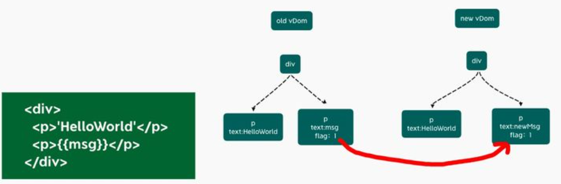

# Vue2 Vs Vue3

## **对比总览**

| 优化项   |                  对比项                  |                            Vue 2                             |                            Vue 3                             |
| -------- | :--------------------------------------: | :----------------------------------------------------------: | :----------------------------------------------------------: |
| **源码** |                                          |                                                              |                                                              |
|          |               **源码管理**               |            Vue 2 的源码是作为一个整体的项目来管理            | `vue3`整个源码是通过 `monorepo`的方式维护的，<br />根据功能将不同的模块拆分到`packages`目录下面不同的子目录中 |
|          |           **TypeScript 支持**            | Vue 2 对 TypeScript 的支持有限，需要额外的配置和类型定义。<br />Vue2 中使用 Flow 作为类型系统。 | Vue 3 内置了对 TypeScript 的支持，提供了更好的类型推断和类型检查。 |
| **性能** |                                          |                                                              |                                                              |
|          |              **响应式系统**              | Vue 2 使用的是基于 `Object.defineProperty` 的响应式系统，对于数组和对象的修改需要特定的方法来触发更新。 | Vue 3 使用了 **Proxy 对象**来实现响应式系统，支持更深层次的响应式，无需特定方法来触发更新。 |
|          |     **体积优化<br />(tree-shaking)**     |                                                              | 1. Vue 3 使用 webpack 的 tree-shaking 功能，减少了无用模块的打包，从而减小了整体的体积。<br />2.Vue3 移除一些不常用的 API |
|          |               **编译优化**               |                                                              |  diff算法优化<br />静态提升<br />事件监听缓存<br />SSR优化   |
| **语法** |                                          |                                                              |                                                              |
|          | **Composition API <br />和 Options API** | Vue 2 使用的是 **Options API**，<br />将逻辑分散在 data、methods、computed 等选项中。 | Vue 3 引入了 Composition API，<br />允许更加灵活的组织和重用逻辑。 |
|          |           **Hooks 和 Mixins**            | Vue2 通过 Mixins 复用代码，一个混入对象可以包含任意组件选项。mixins 会导致依赖关系不清晰 |  相比 Mxins，hooks 能实现更加清晰的逻辑复用，并避免命名冲突  |
|          |             **生命周期钩子**             | Vue 2 提供了 beforeCreate、created、beforeMount、mounted、beforeUpdate、updated、beforeDestroy、destroyed 等生命周期钩子。 | Vue 3 对生命周期钩子进行了重新设计，提供了 setup、onMounted、onUpdated、onUnmounted 等新的生命周期钩子，并移除了 beforeDestroy 和 destroyed。 |
|          |             **创建实例方式**             | 使用 `new Vue()` 创建实例<br />同一个 Vue 构造函数**创建的每个根实例共享相同的全局配置**，因此全局 API 影响所有 vue 实例。 | 使用 `createApp()`工厂函数创建实例<br />可以返回一个提供应用上下文的应用实例，不同的实例注册的组件无法在不同的实例下使用 |
|          |               **内置组件**               |                                                              | Vue3 支持模板下可以有多个根节点<br />引入了 `<suspense>` 组件和`<teleport>` 组件 |
|          |               **模板语法**               |                  vue3 组件可以有多个根节点                   |                   Vue2组件只能有一个根节点                   |
|          |      **`v-if` 与 `v-for` 的优先级**      |                vue3 中 v-if 优先级大于 v-for                 |                vue2 中 v-for 优先级大于 v-if                 |
|          |                                          |                                                              |                                                              |

## **源码管理**

**Vue2**:
在 Vue 2 的源码结构中，Vue 2 的源码是作为一个整体的项目来管理的，不同的功能模块（如核心库、编译器、模板编译器、服务器渲染器等）虽然被逻辑上划分到了不同的目录中，但它们仍然在同一个仓库中共同开发和维护。

**Vue3**:

`vue3`整个源码是通过 `monorepo`的方式维护的，根据功能将不同的模块拆分到`packages`目录下面不同的子目录中：


`monorepo` 管理优点：

1. **模块拆分更细化，职责划分更明确，模块之间的依赖关系也更加明确**，开发人员也更容易阅读、理解和更改所有模块源码，提高代码的可维护性

2. `package`（比如 `reactivity` 响应式库）可以独立于 `Vue` 使用的，这样用户如果只想使用 `Vue3`的响应式能力，可以单独依赖这个响应式库而不用去依赖整个 `Vue`。

## **TypeScript 支持**

#### **Flow**

Flow 是 Facebook 出品的 JavaScript 静态类型检查工具，它可以以非常小的成本对已有的。JavaScript 代码迁入，非常灵活，这也是Vue.js 2.0 当初选型它时一方面的考量

但是 Flow 对于一些复杂场景类型的检查，支持得并不好

#### **TypeScript**

Vue 3 是基于 TypeScript 编写的，提供了更好的类型定义和类型检查。这使得开发者在编写 Vue 代码时能够享受到自动的类型提示和错误检查。

为什么要做这个改变？

1. **社区支持和流行度**：TypeScript 在开发者社区中的流行度和支持度已经显著超过了 Flow。TypeScript 提供了更强大的类型系统，并且得到了广泛的采纳，特别是在大型项目和企业环境中。这意味着使用 TypeScript 可以为 Vue 3 吸引更多的贡献者和用户。
2. **与 JavaScript 的兼容性**：TypeScript 是 JavaScript 的一个超集，它添加了静态类型，但编译后的代码仍然是纯 JavaScript。这使得 TypeScript 更加容易与现有的 JavaScript 库和框架集成。相比之下，Flow 虽然也提供了类型检查，但它与 JavaScript 的生态系统和工具链的集成可能不那么顺畅。
3. **IDE 支持**：由于 TypeScript 的流行，主流的开发环境（IDE）如 Visual Studio Code 提供了对 TypeScript 的出色支持，包括智能提示、自动补全、重构工具等。这可以极大地提高开发者的效率和代码质量。
4. **类型系统的成熟度**：TypeScript 的类型系统相比 Flow 来说更加成熟和全面。它支持更多的高级类型特性，如泛型、条件类型、映射类型等，这些特性对于构建复杂的大型应用程序非常有用。
5. **维护成本**：维护一个自定义的类型系统（如 Vue 2 中的 Flow 集成）需要额外的努力。由于 TypeScript 的普及和社区支持，使用它可以减少 Vue 团队在类型系统上的维护负担。
6. **未来兼容性**：随着 ECMAScript（JavaScript 的标准）的不断发展，TypeScript 团队积极地将新的 ECMAScript 特性集成到其类型系统中。这保证了使用 TypeScript 编写的代码可以更好地与未来的 JavaScript 特性兼容。


## **响应式系统**

> 详细的响应式系统原理可以参考： [Vue2.x 原理源码分析 | Sewen 博客 (sewar-x.github.io)](https://sewar-x.github.io/vue2/Vue2原理和源码分析/#派发更新)

Vue 2 使用的是基于 `Object.defineProperty` 的响应式系统，而 Vue 3 则使用了 ES6 的 `Proxy` 对象。

###  **`Object.defineProperty`缺陷**

> 1. 实现DOM功能，必须劫持数据的访问和更新；
> 2. 无法监听数组索引和长度的变化；
> 3. 不能检测对象属性的添加和删除;
> 4. 必须遍历对象的所有属性；

**实现DOM功能，必须劫持数据的访问和更新**：

当数据改变后，为了自动更新 DOM，在渲染 DOM 的时候访问了数据，必须劫持数据的更新，在内部建立了依赖关系，当数据发生改变后才能自动执行一些代码去更新 DOM；

通过 `Object.defineProperty` 这个API劫持数据的 getter和 setter。


**无法监听数组索引和长度的变化**：

* 使用 `Object.defineProperty` 实现的响应式系统无法直接检测到数组索引和长度的变化。

* 为了解决这个问题，Vue 2 提供了诸如 `Vue.set` 和 `Array.prototype.splice` 这样的方法来触发视图的更新。但这增加了使用者的心智负担，并且可能导致一些不易察觉的错误。

**必须遍历对象的所有属性**：

* `Object.defineProperty` 只能对对象的属性进行劫持，这意味着在对象创建时，必须遍历其所有属性并将它们转换为 getter/setter，以实现响应式。

* 如果属性是在对象创建后动态添加的，那么这些属性将不是响应式的，除非显式地使用 Vue 提供的方法。

  ```js
  //定义响应式对象，进行数据劫持
  function defineReactive(obj, key, val) {
      observe(val)
      Object.defineProperty(obj, key, {
          get() {
              console.log(`get ${key}:${val}`);
              return val
          },
          set(newVal) {
              if (newVal !== val) {
                  val = newVal
                  update()
              }
          }
      })
  }
  
  function observe(obj) {
      if (typeof obj !== 'object' || obj == null) {
          return
      }
      // 遍历对象属性对所有数据进行劫持
      Object.keys(obj).forEach(key => {
          defineReactive(obj, key, obj[key])
      })
  }
  ```
  
  > 如上例代码所示，`Object.defineProperty` 需要遍历 data 的所有属性进行劫持

**对新添加或删除的属性不敏感**：

* 由于 `Object.defineProperty` 只能对已经存在的属性进行劫持，所以它无法检测到对象中新添加或删除的属性。

* 需要使用 Vue 提供的特定方法（如 `Vue.set` 或 `Vue.delete`）来处理。

**性能问题**：

* 由于需要遍历和劫持对象的所有属性，因此对于大数量和嵌套深入的对象，要遍历递归`Object.defineProperty` 进行劫持对象，可能会导致一定的性能开销。

  ```js
  default {
    data: {
      a: {
        b: {
            c: {
            d: 1
          }
        }
      }
    }
  }
  ```

  > 如上图所示的数据类型，`Object.defineProperty` 需要递归遍历 data 对象的属性进行劫持

### **Proxy 优势**

* Vue 3.x 响应式系统使用  [ES6 Proxy](https://es6.ruanyifeng.com/#docs/proxy)，Vue2.x 使用 `Object.defineProperty()` 实现。

`Proxy`的监听是针对一个对象的，那么对这个对象的所有操作会进入监听操作，这就完全可以代理所有属性了

使用 `Proxy`定义一个响应式方法`reactive` 示例：

```js
function reactive(obj) {
    if (typeof obj !== 'object' && obj != null) {
        return obj
    }
    // Proxy相当于在对象外层加拦截
    const observed = new Proxy(obj, {
        get(target, key, receiver) {
            const res = Reflect.get(target, key, receiver)
            console.log(`获取${key}:${res}`)
            return res
        },
        set(target, key, value, receiver) {
            const res = Reflect.set(target, key, value, receiver)
            console.log(`设置${key}:${value}`)
            return res
        },
        deleteProperty(target, key) {
            const res = Reflect.deleteProperty(target, key)
            console.log(`删除${key}:${res}`)
            return res
        }
    })
    return observed
}
```

Proxy和defineProperty都是JavaScript中用于处理对象属性的机制，但它们在功能和灵活性上存在一些差异。

以下是一些Proxy比defineProperty更好的地方：

#### **Proxy支持监听数组的变化**

* Proxy可以**直接监听数组的变化**; （Proxy 通过返回一个代理对象操作源对象），在使用Proxy时，你可以更容易地更新数组的索引或添加/删除数组元素。

  ```
  const obj = [1,2,3]
  const proxtObj = reactive(obj)
  obj.psuh(4) // ok
  ```

  > `Proxy`有多达13种拦截方法,不限于`apply`、`ownKeys`、`deleteProperty`、`has`等等，这是`Object.defineProperty`不具备的。

* `Object.defineProperty` 需要深度遍历数组，对数组每个元素递归调用 `Object.defineProperty` 实现监听；因此原生API不能监听数组的变化；

* Proxy可以检测到数组基于下标的修改和长度修改，而`Object.defineProperty`无法做到。

#### **Proxt 支持监听对象属性新增和删除**

* Proxy 通过返回代理对象监听源对象，对整个对象操作进行拦截，因此**在对象属性新增和删除时候能在代理对象中监听到**；
* 使用 `Object.defineProperty` 对对象监听，需要对每一个对象属性进行遍历监听，因此在完成初始化属性遍历拦截后，再对对象属性进行新增和修改时就无法监听到变化； (Vue2.x 中使用`Object.defineProperty` 进行响应式初始化之后，不再进行响应式操作，因此无法监听对象属性新增和修改 )

#### **Proxy 可以拦截更多的操作**

* Proxy 可以拦截更多的操作，包括属性的读取、设置和删除等；
  * Proxy 通过返回一个代理对象操作源对象，这意味着使用Proxy可以在不干扰现有代码逻辑的情况下修改对象的行为。
* `Object.defineProperty` 只能监视对象单个属性值的变化。

#### **Proxy 无需遍历对象的所有属性**

* Proxy 通过返回一个代理对象操作源对象，Proxy可以在内存中只存储一份数据；Proxy可以在调用的时候递归，用到才代理，也不需要维护特别多的依赖关系，性能提升很大。
* `Object.defineProperty` 需要为每个对象每个属性都创建一个数据结构，导致内存占用较大，由此在处理大量数据时，内存占用较大；

#### **Proxy提供了更丰富的特性**

* Proxy提供了更丰富的特性，例如get/set属性、apply、construct、deleteProperty、getOwnPropertyDescriptor、getPrototypeOf、isExtensible、ownKeys、preventExtensions、setPrototype等。这些特性使得Proxy在处理对象属性时更加灵活和强大。

#### **Proxy更简单的语法**

* Proxy提供了一个相对简单的API，使得创建代理对象更加容易；
* `Object.defineProperty` 的语法更加复杂和不易理解；

### Proxy 缺陷

虽然ES6的Proxy API在拦截对象操作方面非常强大，但 Proxy API 并**不能直接监听到内部深层次的对象变化**。

要实现这一功能，开发者需要手动递归地为内部对象创建Proxy，并在陷阱函数中实现相应的逻辑。

Proxy API的默认行为并不能直接监听到代理对象内部深层次的对象变化，这主要是由于以下几个原因：

1. **拦截的是直接操作**：Proxy API拦截的是对代理对象的直接操作。如果对象内部有深层次的结构，比如嵌套的对象或数组，并且这些内部对象的变化是通过内部引用间接进行的，那么Proxy API无法直接捕获这些变化。
2. **需要递归应用Proxy**：要监听内部深层次的对象变化，需要递归地为每一层内部对象创建Proxy。这意味着你需要遍历对象的整个结构，并为每个内部对象创建一个新的Proxy。然而，这样做可能会引入额外的性能开销，并且对于非常复杂的对象结构，可能会变得难以管理。
3. **陷阱函数的限制**：Proxy API的陷阱函数（如`get`、`set`等）只能捕获对代理对象的直接操作。当这些操作涉及到内部对象时，陷阱函数并不会自动应用于内部对象。因此，如果你希望监听内部对象的变化，你需要在陷阱函数中手动实现相应的逻辑。
4. **设计哲学**：JavaScript的设计哲学之一是“简单即美”。虽然为Proxy API添加监听内部深层次对象变化的功能可能在某些情况下很有用，但这也会增加API的复杂性和潜在的性能开销。因此，JavaScript的设计者可能选择保持Proxy API的简洁性，而将监听深层次对象变化的责任留给开发者来实现。


**陷阱函数**：

在ES6的Proxy API中，陷阱函数（trap functions）是那些被用来拦截和自定义某些基本操作的函数。当这些操作被应用到Proxy实例上时，对应的陷阱函数会被调用。这些陷阱函数包括`get`、`set`、`has`、`deleteProperty`、`defineProperty`、`enumerate`、`ownKeys`、`preventExtensions`、`getPrototypeOf`和`setPrototypeOf`等。


### Proxy 实现监听对象深层次变化

使用`get`和`set`陷阱函数来手动实现监听深层次对象变化：

```js
// 定义响应式函数
function reactive(obj) {  
  return new Proxy(obj, {  
    get(target, propKey, receiver) {  
      // 如果属性值依然是对象，则递归地使其变为响应式对象  
      const value = Reflect.get(target, propKey, receiver);  
      if (typeof value === 'object' && value !== null) {  
        return reactive(value);  
      }  
      return value;  
    },  
    set(target, propKey, value, receiver) {  
      // 监听对象自身属性的变化  
      console.log(`Setting ${propKey.toString()} to ${value.toString()}`);  
      // 如果设置的值是对象，则递归地使其变为响应式对象  
      if (typeof value === 'object' && value !== null) {  
        value = reactive(value);  
      }  
      return Reflect.set(target, propKey, value, receiver);  
    }  
  });  
}  
  
// 使用验证示例
const obj = {  
  a: 1,  
  b: {  
    c: 2  
  }  
};  
  
const reactiveObj = reactive(obj);  
// 监听对象自身属性的变化  
reactiveObj.a = 2; // 输出: Setting a to 2  
// 监听深层次对象属性的变化  
reactiveObj.b.c = 3; // 输出: Setting c to 3
```

**需要注意**：

* 即使这样做了，我们仍然不能“监听”到深层次对象属性的直接变化，比如通过`obj.b.c = 3`这样的操作。
* 这是因为`obj.b`本身不是一个代理对象，所以对其属性的赋值操作不会被`set`陷阱函数拦截。在上面的例子中，我们是通过代理对象`reactiveObj`来访问和修改`b.c`的，所以`set`陷阱函数能够捕获到变化

要真正监听深层次对象属性的变化，我们需要**确保所有内部对象都是代理对象，并且所有对这些对象的操作都是通过代理进行的**。

这通常涉及到在初始化对象时递归地应用Proxy，并在所有访问和修改内部对象的地方使用代理对象，这在实际应用中可能会非常复杂且难以管理。

因此，在实际应用中，开发者可能会选择其他更适合的方式来处理深层次对象的变化，比如使用专门的状态管理库。


## **体积优化**

Vue3相比Vue2在体积方面做了以下优化：

1. 引入 Tree-shaking；
2. 移除冷门的 feature；
3. 包体积优化: 内部逻辑进行了拆分，并进行了懒加载处理。

### **引入 Tree-shaking **

#### **Tree-shaking**

Tree-shaking是一种用于优化JavaScript应用程序的技术，也被称为“摇树优化”。它的原理是**通过静态分析的方式，识别和删除项目中未被使用的代码**（也称为“死代码”），从而减小最终打包后的文件大小。

具体来说，Tree-shaking的实现过程可以分为以下几个步骤：

1. **静态分析**：Tree-shaking依赖于ES6模块系统（`import`与`exports`）的静态结构特性。
   * 在ES6模块系统中，每个模块都被视为一个独立的作用域，其导出和导入关系是静态的，这使得编译器可以轻松地分析和优化模块之间的依赖关系。
   * 因此，Tree-shaking首先对项目的代码进行静态分析，确定哪些模块和函数被实际使用，哪些未被使用。
2. **标记和删除**：在静态分析的基础上，Tree-shaking会标记出那些未被使用的代码，并在最终的打包过程中将这些代码删除。这样，最终生成的文件只包含实际被使用的代码，从而减小了文件大小。


需要注意的是，为了让Tree-shaking技术能够生效，需要满足一定的条件:

1. 代码**必须使用ES6模块系统**。
2. 代码**必须是静态的，不能有动态的引用和执行代码**。
3. 代码**必须使用纯函数或者纯表达式**，不能有副作用。


#### **Vue3 Tree-shaking优化**

在`Vue2`中，无论我们使用什么功能，它们最终都会出现在生产代码中。主要原因是**`Vue2`实例在项目中是单例的，捆绑程序无法检测到该对象的哪些属性在代码中被使用到**：

```js
import Vue from 'vue'
 
Vue.nextTick(() => {})
```

而**`Vue3`源码引入`tree shaking`特性，将全局 API 进行分块**。如果您不使用其某些功能，它们将不会包含在您的基础包中

```js
import { nextTick, observable } from 'vue'
 
nextTick(() => {})
```

Vue3的模块结构和代码组织更利于tree-shaking，这使得打包时只会包含项目实际使用的代码，减少了最终打包文件的大小。

* 任何一个函数，如`ref`、`reavtived`、`computed`等，仅仅在用到的时候才打包，没用到的模块都被摇掉，打包的整体体积变小。

通过`Tree shaking`，`Vue3`给我们带来的好处是：

- 减少程序体积（更小）
- 减少程序执行时间（更快）
- 便于将来对程序架构进行优化（更友好）


### **移除冷门的 feature**

Vue.js 3.0 移除了以下一些冷门的 feature：

1. **keyCode 支持作为 v-on 的修饰符**：在 Vue.js 2.x 中，可以使用特定的 keyCode 值作为 v-on 事件的修饰符，以监听特定的按键事件。然而，在 Vue.js 3.0 中，这个功能被移除了，因为现代浏览器提供了更强大且标准的键盘事件 API。
2. **`on,off` 和 `$once` 实例方法**：这些方法在 Vue.js 2.x 中用于手动管理组件的事件监听器。然而，在 Vue.js 3.0 中，由于组件的事件处理更加规范和统一，这些方法不再被需要，因此被移除了。
3. **filter 过滤**：在 Vue.js 2.x 中，可以使用 filter 对文本进行格式化处理。然而，这个功能在 Vue.js 3.0 中被移除了，因为开发者更倾向于在组件内部使用计算属性或方法来处理这类逻辑。
4. **内联模板**：Vue.js 2.x 支持在组件标签内使用 inline-template 属性来定义模板内容。然而，这个功能在 Vue.js 3.0 中被移除了，因为 Vue 官方推荐将模板内容放在单独的 `.vue` 文件中，以提高代码的可读性和可维护性。

通过移除这些冷门的 feature，Vue.js 3.0 能够进一步精简源码体积，提高运行效率，同时也鼓励开发者使用更加现代和规范的编程方式。


### **包体积优化**

Vue3对打包体积进行了优化，将一些内部逻辑进行了拆分，并进行了懒加载处理，这使得Vue3的包体积较Vue2更小。

这意味着在使用Vue3时，用户需要下载和加载的代码量更少，从而可以更快地加载和渲染应用程序。


## **编译优化**

> Vue3 相比 Vue2 在编译方面做的优化：
>
> - diff 算法优化
> - 静态提升
> - 事件监听缓存
> - SSR优化

在`Vue2`，我们知道每个组件实例都对应一个 `watcher` 实例，它会在组件渲染的过程中把用到的数据`property`记录为依赖，当依赖发生改变，触发`setter`，则会通知`watcher`，从而使关联的组件重新渲染。详细过程可参考 [Vue2.x 原理源码分析 | Sewen 博客 (sewar-x.github.io)](https://sewar-x.github.io/vue2/Vue2原理和源码分析/#派发更新)


试想一下，一个组件结构如下图

```html
<template>
    <div id="content">
        <p class="text">静态文本</p>
        <p class="text">静态文本</p>
        <p class="text">{{ message }}</p>
        <p class="text">静态文本</p>
        ...
        <p class="text">静态文本</p>
    </div>
</template>
```

可以看到，组件内部只有一个动态节点，剩余一堆都是静态节点，所以这里很多 `diff` 和遍历其实都是不需要的，造成性能浪费

### **diff 算法优化**

**`vue3`在`diff`算法中相比`vue2`增加了静态标记**

>  详细 diff 算法介绍可以参考： [Vue2.x 原理源码分析 | Sewen 博客 (sewar-x.github.io)](https://sewar-x.github.io/vue2/Vue2原理和源码分析/#diff-算法)

静态标记作用是为了会发生变化的地方添加一个`flag`标记，下次发生变化的时候直接找该地方进行比较，已经标记静态节点的`p`标签在`diff`过程中则不会比较，把性能进一步提高




### **patch 过程优化**

通过编译阶段对静态模板的分析，编译生成了 Block tree。

#### **Block** tree

* Block tree 是一个将模版基于动态节点指令切割的嵌套区块，每个区块内部的节点结构是固定的；
* 每个区块只需要以一个 Array 来追踪自身包含的动态节点；
* 借助 Block tree，Vue 将 vnode 更新性能由与模版整体大小相关提升为与动态内容的数量相关;


### **Slot 编译优化**


### **静态提升**

> "静态提升"（Static Hoisting）是一种用于优化模板编译结果的技术。它主要涉及到**在编译阶段识别并提取模板中的静态内容**，这些内容在组件的多次渲染之间是不会发生变化的。
>
> 静态提升的基本原理是，在编译阶段，Vue 的编译器会分析模板，识别出那些不依赖于组件状态（如 props、data、computed 等）的静态部分。这些静态部分在组件的每次渲染时都是相同的，因此没有必要在每次渲染时都重新创建它们。
>
> 通过将这些静态部分提升到渲染函数之外，Vue 可以在组件初始化时只创建一次静态内容，并在之后的渲染中重复使用这些已经创建好的静态内容。这样做的好处是可以减少不必要的计算和内存分配，从而提高渲染性能。
>
> 需要注意的是，静态提升只适用于模板中的静态部分，对于依赖于组件状态的动态内容，仍然需要在每次渲染时进行计算和更新。此外，静态提升的效果也会受到模板复杂性和组件状态变化频率的影响。

`Vue3`中对不参与更新的元素，会做静态提升，只会被创建一次，在渲染时直接复用，免去了重复的创建节点，优化了运行时候的内存占用。

**示例：**

```js
<span>你好</span>

<div>{{ message }}</div>
```

没有做静态提升之前

```js
export function render(_ctx, _cache, $props, $setup, $data, $options) {
  return (_openBlock(), _createBlock(_Fragment, null, [
    _createVNode("span", null, "你好"),
    _createVNode("div", null, _toDisplayString(_ctx.message), 1 /* TEXT */)
  ], 64 /* STABLE_FRAGMENT */))
}
```

做了静态提升之后

```js
//静态内容`_hoisted_1`被放置在`render` 函数外，每次渲染的时候只要取 `_hoisted_1` 即可,同时 `_hoisted_1` 被打上了 `PatchFlag` ，静态标记值为 -1 ，特殊标志是负整数表示永远不会用于 Diff
const _hoisted_1 = /*#__PURE__*/_createVNode("span", null, "你好", -1 /* HOISTED */)

export function render(_ctx, _cache, $props, $setup, $data, $options) {
  return (_openBlock(), _createBlock(_Fragment, null, [
    _hoisted_1,
    _createVNode("div", null, _toDisplayString(_ctx.message), 1 /* TEXT */)
  ], 64 /* STABLE_FRAGMENT */))
}

// Check the console for the AST
```

### **事件监听缓存优化**

> 在 Vue 源码的编译优化中，事件监听缓存是一种优化手段，用于提高事件处理函数的执行效率。
>
> Vue 组件中的事件监听器（如 `@click`、`@input` 等）在模板编译阶段会被转换成相应的事件处理函数，并在组件实例化时绑定到对应的 DOM 元素上。
>
> 事件监听缓存的基本思想是：**对于同一个事件监听器，如果它绑定的事件处理函数没有发生变化，那么就没有必要在每次组件渲染时都重新绑定该事件监听器**。Vue 通过在内部维护一个事件监听器的缓存来实现这一点。
>
> 具体来说，当组件渲染时，Vue 会检查当前绑定的事件监听器是否已经存在于缓存中。如果存在，Vue 会直接使用缓存中的事件监听器，而不是重新创建和绑定一个新的监听器。这样可以避免不必要的 DOM 操作和内存分配，从而提高渲染性能。
>
> 需要注意的是，事件监听缓存只适用于那些绑定相同事件处理函数的事件监听器。如果事件处理函数发生了变化（例如，由于组件状态的变化导致处理函数的逻辑改变），那么缓存中的事件监听器就不再适用，需要重新绑定新的事件监听器。****

**示例：**

默认情况下绑定事件行为会被视为动态绑定，所以每次都会去追踪它的变化

```html
<div>
  <button @click = 'onClick'>点我</button>
</div>
```

没开启事件监听器缓存

```js
export const render = /*#__PURE__*/_withId(function render(_ctx, _cache, $props, $setup, $data, $options) {
  return (_openBlock(), _createBlock("div", null, [
    _createVNode("button", { onClick: _ctx.onClick }, "点我", 8 /* PROPS */, ["onClick"])
                                             // PROPS=1<<3,// 8 //动态属性，但不包含类名和样式
  ]))
})
```

开启事件侦听器缓存后

```js
export function render(_ctx, _cache, $props, $setup, $data, $options) {
  return (_openBlock(), _createBlock("div", null, [
    _createVNode("button", {
      onClick: _cache[1] || (_cache[1] = (...args) => (_ctx.onClick(...args)))
    }, "点我")//开启了缓存后，没有了静态标记。也就是说下次`diff`算法的时候直接使用
  ]))
}
```

### **SSR优化**

当静态内容大到一定量级时候，会用`createStaticVNode`方法在客户端去生成一个static node，这些静态`node`，会被直接`innerHtml`，就不需要创建对象，然后根据对象渲染

```js
<div>
	<div>
		<span>你好</span>
	</div>
	...  // 很多个静态属性
	<div>
		<span>{{ message }}</span>
	</div>
</div>
```

编译后

```js
import { mergeProps as _mergeProps } from "vue"
import { ssrRenderAttrs as _ssrRenderAttrs, ssrInterpolate as _ssrInterpolate } from "@vue/server-renderer"

export function ssrRender(_ctx, _push, _parent, _attrs, $props, $setup, $data, $options) {
  const _cssVars = { style: { color: _ctx.color }}
  _push(`<div${
    _ssrRenderAttrs(_mergeProps(_attrs, _cssVars))
  }><div><span>你好</span>...<div><span>你好</span><div><span>${
    _ssrInterpolate(_ctx.message)
  }</span></div></div>`)
}
```

##  **Composition VS Options**

|  特性/指标   |                      Vue 2 Options API                       |                    Vue 3 Composition API                     |
| :----------: | :----------------------------------------------------------: | :----------------------------------------------------------: |
|   代码组织   | 基于选项（options）的组织方式，如 `data`、`methods`、`computed` 等 |             基于函数的组合方式，更加灵活和可组合             |
|   逻辑复用   | 通过高阶组件（HOC）或混入（mixins）实现逻辑复用，但可能导致命名冲突和关系不清晰 | 通过可复用的函数（composable functions）实现逻辑复用，更加清晰和可控 |
|  响应式系统  | 使用 `Object.defineProperty` 实现响应式，存在一些限制和性能开销 |           使用 `Proxy` 实现响应式，更加完整和高效            |
| 生命周期钩子 | 使用 `beforeCreate`、`created`、`beforeMount` 等生命周期钩子函数 |   使用 `setup` 函数替代大部分生命周期钩子，更加简洁和一致    |
|   状态管理   |                通常需要结合 Vuex 进行状态管理                | 可以在组件内部使用 `reactive` 和 `ref` 等 API 进行状态管理，也可以结合 Vuex 4 使用 Composition API 风格的状态管理 |
|   异步操作   |    使用 `methods` 或生命周期钩子中的异步函数处理异步操作     | 可以在 `setup` 函数中使用 `async`/`await` 处理异步操作，更加直观和简洁 |


### Options API

`Options API`，即大家常说的选项API，即以`vue`为后缀的文件，通过定义`methods`，`computed`，`watch`，`data`等属性与方法，共同处理页面逻辑

如下图：


可以看到`Options`代码编写方式，如果是组件状态，则写在`data`属性上，如果是方法，则写在`methods`属性上...

用组件的选项 (`data`、`computed`、`methods`、`watch`) 组织逻辑在大多数情况下都有效，然而，当组件变得复杂，导致对应属性的列表也会增长，这可能会导致组件难以阅读和理解。

**Options API 弊端**：Options API 在 Vue 2 中将逻辑分散在 data、methods、computed 等选项中，如果需要修改一个逻辑点关注点，就需要在单个文件中不断上下切换和寻找，这使得代码的组织和维护变得困难。

### Composition Api

在 Vue3 Composition API 中，组件根据逻辑功能来组织的，一个功能所定义的所有 API 会放在一起（更加的高内聚，低耦合）

即使项目很大，功能很多，我们都能快速的定位到这个功能所用到的所有 API。


相较于 Vue 2 中的 Options API，Composition API 允许开发者将逻辑代码进行拆分和组合，提高代码的可读性和可维护性。

`composition API`，其两大显著的优化：

- **优化逻辑组织**
- **优化逻辑复用**

### **优化逻辑组织**


### **优化逻辑复用**

Vue3 优化逻辑复用主要是使用 hooks 代替 mixins 的代码组织方式。

## **Hooks VS Mixins** 

在 Vue 3 中，实际上并没有直接称为 "hooks" 的概念，与 React 的 hooks 不同。

Vue 3 通过 Composition API 提供了类似的功能，允许更灵活的组织和复用代码逻辑。

|   特性/指标    | Vue 2 Mixins                                                 | Vue 3 Composition API (类似 Hooks)                           |
| :------------: | ------------------------------------------------------------ | :----------------------------------------------------------- |
|    代码复用    | 允许在不同的组件中复用相同的逻辑                             | 通过编写可复用的函数（composable functions）实现**逻辑复用** |
| 响应式状态管理 | 使用 Vue 实例的响应式系统进行状态管理                        | 使用 `reactive` 和 `ref` 等 API 创建和管理响应式状态         |
|  生命周期钩子  | 可以混入生命周期钩子函数，但可能导致冲突和难以追踪的问题     | 在 `setup` 函数中使用 `onMounted`、`onUpdated` 等函数来替代生命周期钩子 |
|    命名冲突    | 容易发生命名冲突，特别是当多个 mixins 使用相同的属性或方法名时 | 通过将逻辑封装在独立的函数中，**避免了命名冲突的问题**       |
|    类型支持    | 有限的类型支持，需要额外的类型定义和注解                     | 更好的类型支持，特别是与 TypeScript 结合使用时，提供更强大的类型推断和检查 |
|    逻辑组合    | Mixins 的组合方式不够直观，难以理解和维护                    | 通过导入和调用函数，可以**清晰地组合和组织逻辑**             |
|    依赖关系    | Mixins 之间可能存在隐式的依赖关系，导致难以预测的行为        | Composition API 鼓励显式地传递依赖，使**依赖关系更加清晰和可控** |
|   模板中使用   | Mixins 中的属性和方法可以直接在模板中使用                    | 通过 `setup` 函数返回的响应式状态和函数可以在模板中使用      |
|   调试和测试   | Mixins 可能使得调试和测试变得更加困难，因为它们引入了额外的层和间接性 | Composition API 提供了更清晰的代码结构和更少的间接性，从而更容易进行调试和测试 |

**Mixins 弊端**：

- **命名冲突**
- **数据来源不清晰**


下面举个例子，对比 Mixins 和 Hooks 区别：

```js
export const MoveMixin = {
  data() {
    return {
      x: 0,
      y: 0,
    };
  },

  methods: {
    handleKeyup(e) {
      console.log(e.code);
      // 上下左右 x y
      switch (e.code) {
        case "ArrowUp":
          this.y--;
          break;
        case "ArrowDown":
          this.y++;
          break;
        case "ArrowLeft":
          this.x--;
          break;
        case "ArrowRight":
          this.x++;
          break;
      }
    },
  },

  mounted() {
    window.addEventListener("keyup", this.handleKeyup);
  },

  unmounted() {
    window.removeEventListener("keyup", this.handleKeyup);
  },
};
```

然后在组件中使用

```js
<template>
  <div>
    Mouse position: x {{ x }} / y {{ y }}
  </div>
</template>
<script>
import mousePositionMixin from './mouse'
export default {
  mixins: [mousePositionMixin]
}
</script>
```

使用单个`mixin`似乎问题不大，但是当我们一个组件混入大量不同的 `mixins` 的时候

```js
mixins: [mousePositionMixin, fooMixin, barMixin, otherMixin]
```

会存在两个非常明显的问题：

- **命名冲突**
- **数据来源不清晰**

现在通过`Compositon API`这种方式改写上面的代码

```js
import { onMounted, onUnmounted, reactive } from "vue";
export function useMove() {
  const position = reactive({
    x: 0,
    y: 0,
  });

  const handleKeyup = (e) => {
    console.log(e.code);
    // 上下左右 x y
    switch (e.code) {
      case "ArrowUp":
        // y.value--;
        position.y--;
        break;
      case "ArrowDown":
        // y.value++;
        position.y++;
        break;
      case "ArrowLeft":
        // x.value--;
        position.x--;
        break;
      case "ArrowRight":
        // x.value++;
        position.x++;
        break;
    }
  };

  onMounted(() => {
    window.addEventListener("keyup", handleKeyup);
  });

  onUnmounted(() => {
    window.removeEventListener("keyup", handleKeyup);
  });

  return { position };
}
```

在组件中使用

```js
<template>
  <div>
    Mouse position: x {{ x }} / y {{ y }}
  </div>
</template>

<script>
import { useMove } from "./useMove";
import { toRefs } from "vue";
export default {
  setup() {
    const { position } = useMove();
    const { x, y } = toRefs(position);
    return {
      x,
      y,
    };

  },
};
</script>
```

可以看到，整个数据来源清晰了，即使去编写更多的 hook 函数，也不会出现命名冲突的问题


## **语法差异**

[vue3.x 文档-vue2迁移](https://vue3js.cn/docs/zh/guide/migration/introduction.html#%E4%BB%8B%E7%BB%8D)章节中介绍了 vue3.x 新增特性和 vue2 差异。

**补充说明**

Vue 3 中需要关注的一些新功能包括：

- [组合式 API](https://vue3js.cn/docs/zh/guide/composition-api-introduction.html)：

  - 提供 `setup` 组件选项：在**创建组件之前**执行，一旦 `props` 被解析，并充当合成 API 的入口点。
  - `setup` 选项应该是一个接受 `props` 和 `context` 的函数。`setup` 返回的所有内容都将暴露给组件的其余部分 (计算属性、方法、生命周期钩子等等) 以及组件的模板。
  - 作用：在多个组件中复用相同的代码逻辑。把组件逻辑模块化复用，增加代码可读性。
    - vue2.x 中提供组件代码复用的 API：`mixin`、`slot`。

- [Teleport](https://vue3js.cn/docs/zh/guide/teleport.html)： 

  - 新的内置组件，将组件内的模板移动到 `to` 属性指定的 DOM 节点之下。
  - 应用场景：用于类似 `modals`,`toast` 这类和 `Vue` 应用的 `DOM` 完全剥离的组件，这类组件如果嵌套在 `Vue` 的某个组件内部，那么处理嵌套组件的定位、`z-index` 和样式就会变得很困难，因此通过 `Teleport` 可以解决。

- [片段](https://vue3js.cn/docs/zh/guide/migration/fragments.html)：支持多根节点组件，即片段。

- [组件选项 emits](https://vue3js.cn/docs/zh/guide/component-custom-events.html)

- [`createRenderer` API 来自 `@vue/runtime-core`](https://github.com/vuejs/vue-next/tree/master/packages/runtime-core) 创建自定义渲染器

  

## **创建实例方式**

**Vue2:**

 **使用 `new Vue()` 创建实例**。

* 创建Vue实例主要通过**构造函数的方式**进行，即使用`new Vue()`来创建一个Vue实例。

* 这种方式下，**所有Vue实例都共享一个Vue构造函数对象**，包括全局指令/全局组件等，这使得它们无法做到相互隔离。

* 此外，Vue2的组件系统设计中，**整个项目中只能有一个根Vue实例**，其他的单文件组件创建的Vue实例都会成为它的子实例。

  ```js
  // 这会影响两个根实例
  Vue.mixin({
    /* ... */
  })
  
  const app1 = new Vue({ el: '#app-1' })
  const app2 = new Vue({ el: '#app-2' })
  ```

**Vue3：**

**使用 [`createApp()`](https://vue3js.cn/docs/zh/api/global-api.html#createapp) 工厂函数创建实例。**

* 这种方式下，`createApp`方法可以返回一个提供应用上下文的应用实例，不同的实例注册的组件无法在不同的实例下使用。
* 这使得Vue3更适合在大型的开发环境中使用，不同的开发人员可以完全独立地使用不同的实例。

```js
Vue.createApp({
  data() {
    return {
      a: 1
    }
  },
  created() {
    // `this` 指向 vm 实例
    console.log('a is: ' + this.a) // => "a is: 1"
  }
})
//应用实例暴露的大多数方法都会返回该同一实例，允许链式：
Vue.createApp({})
  .component('SearchInput', SearchInputComponent)
  .directive('focus', FocusDirective)
  .use(LocalePlugin)
```

## **生命周期钩子**


## **内置组件**

|        组件名        | Vue2 | Vue3 |                             作用                             |
| :------------------: | :--: | :--: | :----------------------------------------------------------: |
|    `<component>`     |  ✔️   |  ✔️   | 动态组件：可以动态地切换多个组件，根据 `is` 属性的值来决定显示哪个组件。 |
|    `<transition>`    |  ✔️   |  ✔️   |       过渡效果：为元素或组件的进入/离开提供过渡动画。        |
| `<transition-group>` |  ✔️   |  ✔️   | 列表过渡：为列表的渲染提供过渡动画，通常与 `v-for` 一起使用。 |
|    `<keep-alive>`    |  ✔️   |  ✔️   | 缓存组件：包裹动态组件时，会缓存不活动的组件实例，避免重复渲染。 |
|       `<slot>`       |  ✔️   |  ✔️   | 插槽：用于分发内容，允许在父组件中向子组件的指定位置插入内容。 |
|     `<template>`     |  ✔️   |  ✔️   | 模板：声明性渲染的容器，内部可以包含任意合法的 Vue 模板内容。但不渲染为 DOM 元素，仅作为逻辑结构。 |
|     `<suspense>`     |  ❌   |  ✔️   | 异步组件加载：用于在异步组件加载时显示占位内容，如加载指示器。 |
|     `<teleport>`     |  ❌   |  ✔️   | 传送：能够将组件的 HTML 结构移动到 DOM 中的指定位置，而不受组件树的限制。 |

Vue2和Vue3在内置组件上主要有以下差异：

1. 过渡和动画：Vue3 通过 `<transition>` 和 `<transition-group>` 组件提供了更强大和灵活的过渡和动画系统。相比之下，Vue2 的过渡系统较为简单，功能也相对有限。
2. 碎片（Fragments）：**Vue3 支持模板下可以有多个根节点**，即碎片化的模板。这意味着在 Vue3 中，组件的模板可以包含多个顶级元素，而不需要像 Vue2 那样只能有一个根节点。
3. 悬浮（Suspense）：Vue3 引入了 `<suspense>` 组件，用于异步组件加载时的等待状态处理。它允许你在组件加载完成之前显示一个占位符或加载指示器，提供更好的用户体验。Vue2 没有内置的 `<suspense>` 组件，需要开发者自行处理异步组件的加载状态。
4. 插槽（Slots）：Vue3 对插槽进行了改进，引入了更具表达力的插槽语法和新的 `<slot>` 组件用法。Vue3 中的插槽可以具有默认内容，也可以通过作用域插槽传递数据给子组件。相比之下，Vue2 的插槽功能相对简单，语法也较为有限。
5. 指令（Directives）：Vue3 在指令方面进行了一些改进和扩展。例如，Vue3 中的 `v-model` 指令支持自定义事件和多个模型绑定，而 Vue2 中的 `v-model` 仅支持表单元素的双向绑定。此外，Vue3 还引入了一些新的内置指令，如 `v-memo` 用于性能优化。


## v-if 与 v-for 优先级不同

- **vue2 中 v-for 优先级大于 v-if**
- **vue3 中 v-if 优先级大于 v-for**

在 Vue 2 中，`v-for` 的优先级高于 `v-if`，这意味着在解析元素或组件时，Vue 首先处理 `v-for` 指令，然后才是 `v-if`。这可能会导致一些不太直观的行为，尤其是在你想要根据某个条件来过滤列表项时。

然而，在 Vue 3 中，这个优先级被颠倒了，`v-if` 的优先级高于 `v-for`。这一变化的原因主要有以下几点：

1. **性能优化**：
   - 在 Vue 2 中，由于 `v-for` 的优先级更高，如果在一个被 `v-for` 渲染的元素上使用了 `v-if`，那么即使 `v-if` 的条件为假，Vue 也会首先渲染所有列表项，然后才去判断每个项是否需要显示。这可能会产生不必要的渲染开销。
   - 而在 Vue 3 中，由于 `v-if` 的优先级更高，如果 `v-if` 的条件为假，Vue 将不会执行 `v-for`，从而避免了不必要的渲染。
2. **代码清晰度和可维护性**：
   - 在 Vue 2 中，由于 `v-for` 的优先级更高，开发者可能会写出一些难以理解的代码，尤其是在同时使用 `v-for` 和 `v-if` 时。

需要注意的是，虽然 Vue 3 修改了 `v-for` 和 `v-if` 的优先级，但这并不意味着你不能在 Vue 3 中同时使用这两个指令。只是你需要更加注意它们的组合使用方式，以确保你的模板代码是清晰、高效和易于维护的。


扩展：

### **在 vue 中v-for 和 v-if 可以共存吗？**

在 Vue 中，`v-for` 和 `v-if` 可以在同一个元素上共存，但是通常不推荐这样做，因为这样做可能会导致一些不可预期的行为和性能问题。

当 `v-for` 和 `v-if` 同时出现在同一个元素上时，Vue 2 和 Vue 3 的处理方式是不同的：

**Vue 2**

在 Vue 2 中，由于 `v-for` 的优先级高于 `v-if`，所以 `v-for` 会先被处理，然后才是 `v-if`。这可能会导致一些问题，因为即使 `v-if` 的条件为假，Vue 也会首先渲染所有由 `v-for` 生成的元素，然后再根据 `v-if` 的条件来决定是否显示这些元素。这可能会浪费一些渲染性能。

**Vue 3**

在 Vue 3 中，`v-if` 的优先级高于 `v-for`。这意味着如果 `v-if` 的条件为假，Vue 将不会执行 `v-for`，从而避免了不必要的渲染。然而，即使 `v-if` 的条件为真，在同一个元素上使用 `v-for` 和 `v-if` 仍然不是最佳实践，因为这可能会使模板变得难以阅读和维护。

**推荐做法**

1. **使用计算属性**：如果需要根据条件过滤列表项，最好使用计算属性（computed property）来创建一个新的数组，然后在模板中只使用 `v-for` 来渲染这个过滤后的数组。

```vue
<template>  
  <div v-for="item in filteredItems" :key="item.id">  
    {{ item.name }}  
  </div>  
</template>  
  
<script>  
export default {  
  data() {  
    return {  
      items: [/* ... */],  
      // 其他数据  
    };  
  },  
  computed: {  
    filteredItems() {  
      //在计算属性中进行条件过滤
      return this.items.filter(item => /* 过滤条件 */);  
    },  
  },  
};  
</script>
```

1. **使用 `<template>` 元素**：如果你需要在渲染列表项的同时进行条件判断，可以将 `v-if` 放在一个 `<template>` 元素上，然后在这个 `<template>` 元素内部使用 `v-for`。由于 `<template>` 元素不会被渲染为实际的 DOM 元素，所以这样做不会影响 DOM 结构。

```vue
<template>  
  <template v-if="someCondition">  
    <div v-for="item in items" :key="item.id">  
      {{ item.name }}  
    </div>  
  </template>  
</template>  
  
<script>  
// ...  
</script>
```

总之，虽然 `v-for` 和 `v-if` 可以在同一个元素上共存，但为了避免潜在的问题和提高代码的可读性和可维护性，最好将它们分开使用，或者使用计算属性或 `<template>` 元素来组合它们。


## Tmeplate 和 JSX 的性能

- 编译时：JSX 编译比 Template 快
- 运行时：Template 性能比 JSX 好

因为 Template 编译解析时有 `静态节点提升` 步骤会降低编译速度，而 JSX 没有，所以编译肯定是 JSX 更快；

但是在运行时的时候， Template 的性能会更好，因为它进行了 `静态节点提升` ，使更新效率更高。

