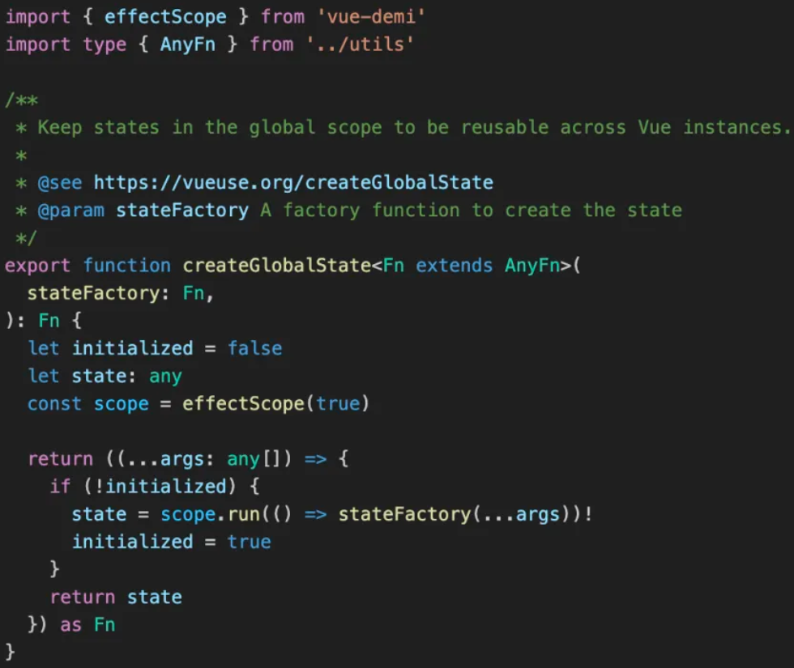

# Vue3基础

---


## **ref 原理**

> 参考官方文档：
>
> - [响应式基础 | Vue.js (vuejs.org)](https://cn.vuejs.org/guide/essentials/reactivity-fundamentals.html#why-refs)
> - [深入响应式系统 | Vue.js (vuejs.org)](https://cn.vuejs.org/guide/extras/reactivity-in-depth.html)

实现伪代码：

```javascript
function ref(value) {
  const refObject = {
    get value() {
      track(refObject, 'value')
      return value
    },
    set value(newValue) {
      value = newValue
      trigger(refObject, 'value')
    }
  }
  return refObject
}
```

**Proxy 和 Reflect：**

- Vue 3 使用 Proxy 对象来包装原始数据，并拦截对其属性的访问和修改。Proxy 允许我们定义一些拦截器（handlers），这些拦截器会在对 Proxy 对象进行某些操作时（如读取属性、设置属性等）被调用。
- Reflect 是一个内置对象，提供与 Object 类似的方法的静态版本。Vue 3 在拦截器中经常使用 Reflect 来对原始数据进行操作，以确保操作的正确性和一致性。

**创建响应式引用：**

- 当调用 `ref` 函数时，Vue 3 会创建一个响应式引用对象。这个对象包含一个 `_value` 属性（在内部实现中，不一定总是命名为 `_value`），用于存储实际的值。
- 在外部，我们通过访问 `.value` 属性来读取或修改 `ref` 的值。但在内部，Vue 3 使用 Proxy 来拦截对 `.value` 的访问和修改。

**拦截和追踪：**

- 当我们读取 `ref.value` 时，Vue 3 的 Proxy 拦截器会被触发。在拦截器中，Vue 3 会检查当前是否有组件或计算属性依赖于这个 `ref`。如果有，Vue 3 会将这个组件或计算属性添加到 `ref` 的依赖列表中。
- 当我们修改 `ref.value` 时，Vue 3 的 Proxy 拦截器同样会被触发。在拦截器中，Vue 3 会通知所有依赖于这个 `ref` 的组件或计算属性，告诉它们 `ref` 的值已经发生了变化，需要重新渲染或重新计算。

**依赖收集和属性代理**：

- Vue 3 的响应式系统还包括依赖收集和属性代理的机制。当 `ref` 的值被读取时，Vue 3 会收集当前依赖于这个 `ref` 的所有观察者（watcher）。这些观察者可能是组件的渲染函数、计算属性或其他响应式引用。
- 当 `ref` 的值被修改时，Vue 3 会通知所有依赖于这个 `ref` 的观察者，并触发它们的重新计算或重新渲染。这就是 Vue 3 响应式系统的核心机制。

**模板中的使用：**

- 在 Vue 3 的模板中，我们可以直接使用 `ref` 而不需要 `.value` 后缀。这是因为 Vue 3 的编译器在编译模板时会自动处理 `ref` 的访问和修改，将其转换为对 `.value` 的访问和修改。这使得在模板中使用 `ref` 更加简洁和直观。

###  Ref 和 ShallowRef 的区别

**响应式深度**：

- `ref`：对包装的值进行**深度响应式转换**。
  - 这意味着，如果你有一个对象或数组，并且你使用 `ref` 来包装它，那么对象或数组内部属性的变化也会是响应式的，并且会触发视图更新。
- `shallowRef`：只进行**浅层响应式转换**。
  - 如果你使用 `shallowRef` 来包装一个对象或数组，**只有对象或数组本身的引用变化时，`shallowRef` 才会触发更新**。对象或数组内部属性的变化不会触发更新。

**性能影响**：

- 由于 `shallowRef` 只对第一层属性进行响应式转换，因此在处理大型对象时可能会比 `ref` 更具性能优势。如果你只需要关注对象的第一层属性变化，并且不希望因为对象内部属性的变化而触发不必要的更新，那么 `shallowRef` 可能会更适合你的需求。

**应用场景**：

- `ref`：适用于需要对整个对象进行深度响应式转换的场景。例如，当你有一个复杂的对象或数组，并且你需要跟踪其内部属性的变化时，你可以使用 `ref`。
- `shallowRef`：适用于只需要关注对象的第一层属性变化的场景。例如，当你只需要知道对象本身是否被替换，而不关心其内部属性的变化时，你可以使用 `shallowRef`。


----


## **reactive 原理**

> 详细参考：[深入响应式系统 | Vue.js (vuejs.org)](https://cn.vuejs.org/guide/extras/reactivity-in-depth.html)

与将内部值包装在特殊对象中的 ref 不同，`reactive()` 将使对象本身具有响应性：

```js
function reactive(obj) {
  return new Proxy(obj, {
    get(target, key) {
      track(target, key)
      return target[key]
    },
    set(target, key, value) {
      target[key] = value
      trigger(target, key)
    }
  })
}
```

 [`reactive()` 的局限性](https://cn.vuejs.org/guide/essentials/reactivity-fundamentals.html#limitations-of-reactive)：

- 当你将一个响应式对象的属性赋值或解构到一个本地变量时，访问或赋值该变量是非响应式的，因为它将不再触发源对象上的 get / set 代理。注意这种“断开”只影响变量绑定——如果变量指向一个对象之类的非原始值，那么对该对象的修改仍然是响应式的。
- 从 `reactive()` 返回的代理尽管行为上表现得像原始对象，但我们通过使用 `===` 运算符还是能够比较出它们的不同。


----


## Props

> 详细解释参考官方文档：[Props | Vue.js (vuejs.org)](https://cn.vuejs.org/guide/components/props.html#props-declaration)

### props 解构

**直接解构会丢失响应式**

```vue
<script setup>
 const props = defineProps({count:Number});
 let { count }= props;
 count++;
 console.log(props.count);//0，并不会发生变化
</script>
```

**解构 props 需要使用 toRefs 或 toRef**

```vue
<script setup>
	import {toRef, toRefs }from "vue";
    const props = defineProps({msg: String.count: Number});
	//_msg 也是响应式的，会随着 props.msg 改变
    const msg = toRef(props,“msg");
	// msg，count也是响应式的，会随着 props 改变
    const{ msg,count } = toRefs(props);
</script>
```


### useAttrs 和 props 的区别

- props：只会接收类型定义的属性
- useAttrs：只会接收非 props 类型定义的属性

也就是 props 和 useAttrs 是互补的

> 注意：useAttrs 并不会自动将横杆命名的属性转成驼峰命名属性，但是 props 是会的

```vue
<script setup>
import {   useAttrs } from 'vue'
const attrs = useAttrs()
</script>
```

----


## 插槽

> 详细使用参考官方文档：[插槽 Slots | Vue.js (vuejs.org)](https://cn.vuejs.org/guide/components/slots.html)

插槽（slot）是前端开发中的一个概念，特别是在使用如Vue.js这样的框架时。插槽的主要原理是在子组件中预留一个位置（即占位符），以便父组件可以在这个位置插入内容。

### **插槽的使用**

- **默认插槽**：在子组件的模板中，使用`<slot></slot>`标签定义一个默认插槽。父组件在引用子组件时，可以直接在子组件标签内写入要插入的内容，这些内容会被填充到默认插槽中。
- **具名插槽**：在子组件的模板中，可以给插槽指定一个名字，如`<slot name="header"></slot>`。在父组件中，可以通过`v-slot:header`来指定要插入到哪个具名插槽中的内容。
- **作用域插槽**：作用域插槽允许子组件向父组件传递数据，并在父组件的插槽模板中使用这些数据。在子组件中，可以使用`<slot :data="someData"></slot>`来定义作用域插槽，其中`someData`是子组件传递给父组件的数据。在父组件中，可以通过`v-slot:default="slotProps"`来接收这些数据，并在插槽模板中使用它们。

### **插槽的原理**

- 插槽允许你在子组件的模板中定义一个或多个占位符，这些占位符可以在父组件中被填充。
- 父组件在引用子组件时，可以通过插槽向子组件传递内容，这些内容可以是HTML代码、其他组件等。
- 子组件通过插槽接收父组件传递的内容，并在适当的位置进行渲染。

### **源码解析**

**普通插槽** 普通插槽`slot`会被当做子元素进行解析，最终会被解析成一个`_t`函数，他接收的第一个参数为插槽的名称，默认是`default`，也就是`_t('default')`，执行此函数进行最终元素的渲染

具名插槽，则传对应的插槽名 **作用域插槽** 插槽会被封装成一个函数放置在`scopeSlotes`对象中，解析时`_t`第二个参数接收子组件的数据，并进行渲染。


---


## 生命周期

Vue2 生命周期示例图：


Vue3 生命周期示例图：


Vue 2和Vue 3生命周期钩子的对比：

| Vue 2 生命周期钩子  | Vue 3 生命周期钩子  | 描述                                                         |
| :------------------ | :------------------ | :----------------------------------------------------------- |
| `beforeCreate`      | `beforeCreate`      | 在实例初始化之后，数据观测 (data observer) 和 event/watcher 事件配置之前被调用。 |
| `created`           | `created`           | 实例已经创建完成，此时已经完成了数据观测和初始化，但尚未挂载到 DOM 上。 |
| `beforeMount`       | `beforeMount`       | 在挂载开始之前被调用，相关的 render 函数首次被调用。         |
| `mounted`           | `onMounted`         | 在挂载完成后调用。Vue 3 使用了 `onMounted` 而不是 `mounted`。 |
| `beforeUpdate`      | `beforeUpdate`      | 数据更新时调用，发生在虚拟 DOM 重新渲染和打补丁之前。        |
| `updated`           | `onUpdated`         | 由于数据更改导致的虚拟 DOM 重新渲染和打补丁后调用。Vue 3 使用了 `onUpdated` 而不是 `updated`。 |
| **`beforeDestroy`** | **`beforeUnmount`** | 在实例销毁之前调用。Vue 3 使用了 `beforeUnmount` 而不是 `beforeDestroy`。 |
| **`destroyed`**     | **`onUnmounted`**   | 实例销毁后调用。Vue 3 使用了 `onUnmounted` 而不是 `destroyed`。 |

Vue 3 的生命周期钩子名称前都加上了 `on` 前缀，这是为了与组合式 API（Composition API）中的其他函数保持一致。


## 侦听器

### watch 原理

在 Vue 3 中，`watch` 侦听器的实现原理与 Vue 3 的响应式系统紧密相连。Vue 3 使用了 Proxy 来替代 Vue 2 中的 Object.defineProperty 来实现更高效的响应式系统：

1. **初始化响应式数据**：当Vue组件被创建时，Vue会使用Proxy或Reflect（在某些情况下）来包裹组件的`data`、`computed`属性、`props`等，使其变成响应式的。这个过程会创建一个getter/setter对，用于追踪和拦截属性的访问和修改。
2. **设置侦听器**：在组件的`setup()`函数或选项式API的`watch`选项中，你可以定义侦听器来监听某个响应式属性的变化。这些侦听器可以是函数、数组或对象，具体取决于你的需求。
3. **依赖收集**：当组件被渲染或计算属性被计算时，Vue会遍历所有的响应式属性，并调用它们的getter。在这个过程中，Vue会收集与这些属性相关的依赖，这些依赖通常是一个或多个Watcher对象（观察者）。**对于`watch`侦听器，Vue会创建一个Watcher对象，并将其与需要监听的响应式属性关联起来。**
4. **属性变化通知**：当响应式属性被修改时（即setter被调用），Vue会触发一个更新流程。在这个流程中，Vue会通知所有依赖于这个属性的Watcher对象进行更新。**对于与`watch`侦听器关联的Watcher对象，Vue会执行侦听器的回调函数。**
5. **执行回调函数**：在Watcher对象被通知更新后，它会执行与之关联的回调函数（即`watch`侦听器的回调函数）。这个回调函数可以接受新旧值作为参数，并可以根据需要执行任何逻辑。

### watch 回调的触发时机

> 引入自官方文档解释：[侦听器 | Vue.js (vuejs.org)](https://cn.vuejs.org/guide/essentials/watchers.html#watcheffect)

当你更改了响应式状态，它可能会同时触发 Vue 组件更新和侦听器回调。

**默认情况下，侦听器回调会在父组件更新 (如有) 之后、所属组件的 DOM 更新之前被调用。**

意味着侦听器回调在组件更新 updated 生命周期之后，在组件被挂载到 DOM 之前调用，此时访问组件 DOM 是无法访问到的。

如果你尝试在侦听器回调中访问所属组件的 DOM，那么 DOM 将处于更新前的状态。


### `watchEffect()`

> 官方文档：[侦听器 | Vue.js (vuejs.org)](https://cn.vuejs.org/guide/essentials/watchers.html#watcheffect)

`watchEffect()` 允许我们自动跟踪回调的响应式依赖：

```vue
watchEffect(async () => {
  const response = await fetch(
    `https://jsonplaceholder.typicode.com/todos/${todoId.value}`
  )
  data.value = await response.json()
})
```

这个例子中，回调会立即执行，不需要指定 `immediate: true`。在执行期间，它会自动追踪 `todoId.value` 作为依赖（和计算属性类似）。每当 `todoId.value` 变化时，回调会再次执行。有了 `watchEffect()`，我们不再需要明确传递 `todoId` 作为源值。

### `watch` vs. `watchEffect`

> 官方文档：[侦听器 | Vue.js (vuejs.org)](https://cn.vuejs.org/guide/essentials/watchers.html#watch-vs-watcheffect)

`watch` 和 `watchEffect` 都是用来监听响应式数据变化的，都能响应式地执行有副作用的回调。它们之间的主要区别是追踪响应式依赖的方式：

- `watch` ：主动去声明需要监听的响应式数据。只追踪明确侦听的数据源。它不会追踪任何在回调中访问到的东西。另外，仅在数据源确实改变时才会触发回调。`watch` 会避免在发生副作用时追踪依赖，因此，我们能更加精确地控制回调函数的触发时机。
- `watchEffect`：不需要声明，会自动收集监听数据。会在副作用发生期间追踪依赖。它会在同步执行过程中，自动追踪所有能访问到的响应式属性。这更方便，而且代码往往更简洁，但有时其响应性依赖关系会不那么明确。


## effectScope 和 onScopeDispose

### effectScope 

> 官方文档：[响应式 API：进阶 | Vue.js (vuejs.org)](https://cn.vuejs.org/api/reactivity-advanced.html#effectscope)

effectScope 可以有两个作用：

- 收集副作用
- 全局状态管理

#### 收集副作用

创建一个 effect 作用域，可以捕获其中所创建的响应式副作用 (即计算属性和侦听器)，这样捕获到的副作用可以一起处理。

```javascript
const scope = effectScope()

scope.run(() => {
  const doubled = computed(() => counter.value * 2)

  watch(doubled, () => console.log(doubled.value))

  watchEffect(() => console.log('Count: ', doubled.value))
})

onUnmounted(()=>{
 // 处理掉当前作用域内的所有 effect
	scope.stop()   
})

```

**原理**：

- 当你调用 `effectScope()` 时，它会返回一个新的作用域实例。
- 在这个作用域内创建的任何副作用都会被绑定到这个作用域实例。
- 你可以使用 `getCurrentScope()` 函数来获取当前活跃的作用域（即最近一个由 `effectScope()` 创建且尚未被销毁的作用域）

通常在使用 composition api 时，经常使用其他的 use 函数，在 vueuse 中，当组件卸载时将被卸载，VueUse的函数也会自动清除副作用。

但更通用的解决方案是使用Vue的 [`effectScope` API](https://vuejs.org/api/reactivity-advanced.html#effectscope)

```javascript
import { effectScope } from 'vue'

const scope = effectScope()

scope.run(() => {
  // ...
  // 将使用的 use 函数方法在 scope 中使用
  useEventListener('mousemove', () => {})
  onClickOutside(el, () => {})
  watch(source, () => {})
})

// all composables called inside `scope.run` will be disposed
scope.stop()

```

> 参考 VueUse 官方文档：[最佳实践 | VueUse中文文档 (vueusejs.com)](https://www.vueusejs.com/guide/best-practice.html#消除副作用-side-effect-clean-up)


#### **全局状态管理**

Pinia 的原理就是依赖了 effectScope，所以可以自己使用 effectScope 来实现自己的局部状态管理。

比如封装一个通用组件，这个组件层级比较多，并且需要共享一些数据，那么这个时候肯定不会用 Pinia 这种全局状态管理，而是会自己写一个局部的状态管理，这个时候可以使用 effectScope 封装。

[vueuse](https://www.vueusejs.com/) 中的 [createGlobalState](https://www.vueusejs.com/shared/createGlobalState/) 底层使用  effectScope 实现。

**createGlobalState 用法**：

> 详细可参考官方文档：[createGlobalState | VueUse中文文档 (vueusejs.com)](https://www.vueusejs.com/shared/createGlobalState/#createglobalstate)

1. 定义全局变量：

```javascript
// store.js
import { computed, ref } from 'vue'
import { createGlobalState } from '@vueuse/core'

export const useGlobalState = createGlobalState(
  () => {
    // state
    const count = ref(0)

    // getters
    const doubleCount = computed(() => count.value * 2)

    // actions
    function increment() {
      count.value++
    }

    return { count, doubleCount, increment }
  }
)
```

2. 使用：

```javascript
// component.js
import { useGlobalState } from './store'

export default defineComponent({
  setup() {
    const state = useGlobalState()
    return { state }
  },
})

```

**createGlobalState 原理**：




### onScopeDispose

>官方文档：[响应式 API：进阶 | Vue.js (vuejs.org)](https://cn.vuejs.org/api/reactivity-advanced.html#onscopedispose)

`onScopeDispose` 是一个用于在 effect 作用域销毁时注册回调函数的函数。这允许你在作用域被销毁时执行一些清理工作，例如取消外部订阅或清理资源。

**原理**：

- `onScopeDispose` 接收一个回调函数作为参数。
- 当使用 `effectScope()` 创建的作用域被销毁时（通常是由于其内部的组件被卸载或手动调用 `scope.stop()`），`onScopeDispose` 中注册的回调函数将被调用。
- 这允许你在作用域销毁时执行必要的清理操作。

### 区别

- **功能**：`effectScope` 用于创建新的 effect 作用域，而 `onScopeDispose` 用于在作用域销毁时注册回调函数。
- **使用场景**：当你需要在一个特定的作用域内管理多个副作用，并在作用域销毁时执行清理操作时，你会使用 `effectScope` 和 `onScopeDispose`。例如，在组件的 `setup` 函数中，你可能希望创建一个作用域来管理该组件的所有副作用，并在组件卸载时清理这些副作用。
- **关联**：虽然 `effectScope` 和 `onScopeDispose` 在功能上是不同的，但它们通常一起使用。你首先使用 `effectScope()` 创建一个作用域，然后在该作用域内创建副作用，并使用 `onScopeDispose()` 注册清理回调函数。当作用域被销毁时，这些回调函数将被调用以执行清理操作。


## **参考资料**

[「Vue2+Vue3」 的 62 个知识点，看看你掌握了几个？](https://mp.weixin.qq.com/s/CAYPxaDrKChSgO1PMUGcAg)