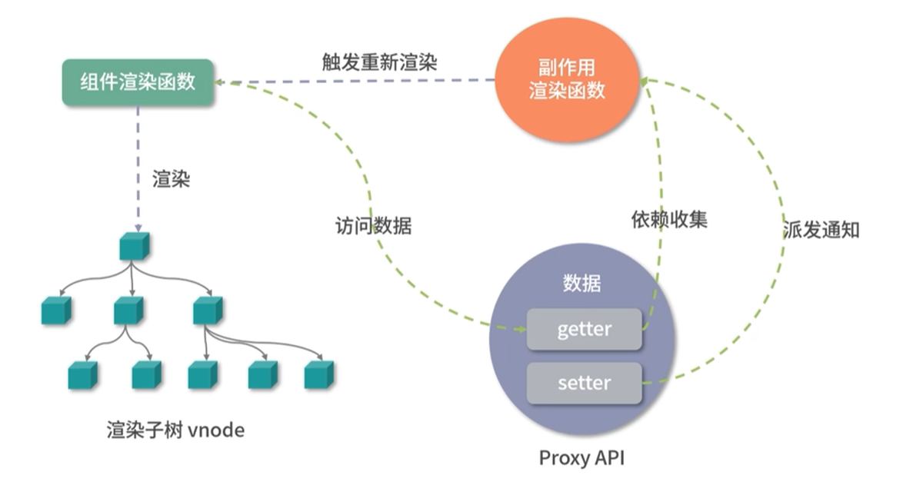
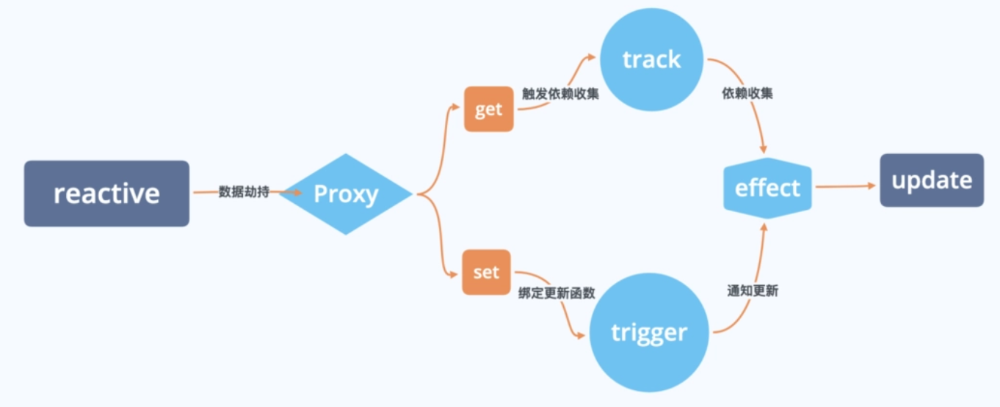

# 响应式原理

## 流程图



> Vue3 响应式原理过程与 Vue2 差异不大，主要是将 Vue2中 依赖收集和派发更新的 Watcher 对象替换成了 副作用渲染函数 Effect()

---


## **Proxy API**

Proxy 响应式实现：

```js

// Proxy 中 receiver: Proxy 或者继承 Proxy 的对象
// Reflect 中 receiver: 如果 target 对象中设置了 getter, getter 中的 this 指向 receiver
const proxy = new Proxy(target,{
	get(target,key,receiver){
 		target[key]
		return Reflect.get(target, key, receiver)
	},
	set(target, key,value,receiver){
    	target[key] = value
      	return  Reflect.set(target, key,value, receiver)
	},
	deleteProperty(target, key){
        delete target[key]
		return Reflect.deleteProperty(target,key)
    }
}
```


Proxy 响应式处理：

- Proxy 对象实现属性监听
- 多层属性嵌套，在访问属性过程中处理下一级属性
- 默认监听动态添加的属性
- 默认监听属性的删除操作
- 默认监听数组索引和 length 属性
- 可以作为单独的模块使用

---


## **响应式 API**

- **reactive**
- **ref**
- **toRef**
- **computed**

---


## **reactive**

### **API 介绍**

> [**reactive()**:](https://cn.vuejs.org/api/reactivity-core.html#reactive)
>
> 返回一个对象的响应式代理。
>
> - **类型**
>
>   ```ts
>   function reactive<T extends object>(target: T): UnwrapNestedRefs<T>
>   ```
>
> - **详细信息**
>
>   响应式转换是“深层”的：它会影响到所有嵌套的属性。一个响应式对象也将深层地解包任何 [ref](https://cn.vuejs.org/api/reactivity-core.html#ref) 属性，同时保持响应性。
>
>   值得注意的是，当访问到某个响应式数组或 `Map` 这样的原生集合类型中的 ref 元素时，不会执行 ref 的解包。
>
>   若要避免深层响应式转换，只想保留对这个对象顶层次访问的响应性，请使用 [shallowReactive()](https://cn.vuejs.org/api/reactivity-advanced.html#shallowreactive) 作替代。
>
>   返回的对象以及其中嵌套的对象都会通过 [ES Proxy](https://developer.mozilla.org/en-US/docs/Web/JavaScript/Reference/Global_Objects/Proxy) 包裹，因此**不等于**源对象，建议只使用响应式代理，避免使用原始对象。

### **原理**

1. 接收一个参数，判断这参数是否是对象；
2. 创建拦截器对象 handler，设置 `get`、`set`、`deleteProperty`；
3. 返回 Proxy 对象；

```js
// 判断是否为对象
const isobject = val => val !== null && typeof val === 'object'  
const hasOwn = (target,key) =>  

// 实现响应式
export function reactive(target){
    // 如果不是对象，无需代理
    if(!isobject(target))
        return target
    
    // 定义 proxy 的 handler 方法
    const handler= {
        // 获取属性
        get(target,key,receiver){
            //进行收集依赖
            track(target, key)
            // 返回当前对象
            const result = Reflect.get(target,key,receiver)
            // 判断是否为对象，是对象进行深度响应式
            return isobject(result) ? reactive(result) : result
        }
        // 设置属性
        set(target,key,value,receiver){
            // 获取旧值
            const oldValue = Reflect.get(target,key,receiver)
            // 获取对象 key 属性结果,Reflect 会返回一个 boolean 值
            let result = true
            // 如果值发生改变
            if(oldValue !== value){
                result = Reflect.set(target, key, value, receiver)
                // 触发更新
                trigger(target, key)
                return result
            }
        }
    	// 删除属性
        deleteProperty(target,key){
            // 判断是否有 key 属性
            const hadKey = Object.prototype.hasOwnProperty.call(target,key)
            // 删除 key 属性对象值
            const result = Reflect.deleteProperty(target, key)
            if(hacikey && result){
                // 触发更新
                console.log('delete 触发更新', key)
            }
            // 返回删除结果
            return result
        }
    // 返回代理对象
    return new Proxy(target,handler)
}

```


### **依赖收集过程**

依赖收集过程方法：

- **effect**：定义“副作用函数”并监视响应式数据的变化
- **track**： 收集依赖

### **effect()**

**定义与功能**

- `effect`是一个函数，用于定义“副作用函数”并监视响应式数据的变化。
- 当响应式数据被修改时，通过`effect`定义的函数会重新执行，实现响应式更新的效果。

**基本用法**

- `effect`函数接收一个函数作为参数，并返回一个响应式的Effect对象。
- 在传入的函数内部，你可以进行各种操作，如发起Ajax请求、修改浏览器标题等。

**示例**

```javascript
import { effect, reactive } from 'vue';  
  
const state = reactive({ count: 0 });  
  
const logCount = effect(() => {  
  console.log(`count is ${state.count}`);  
});  
  
state.count++; // 输出 "count is 1"
```

在上面的示例中，我们定义了一个响应式数据`state`和一个通过`effect`定义的函数`logCount`。当`state.count`的值发生变化时，`logCount`函数会自动重新执行。

**选项与特性**

- ```
  effect
  ```

  函数还可以接收一个选项对象作为第二个参数，用于控制Effect的行为。

  - `lazy: true`：将Effect的执行推迟到首次触发时机之后。
  - `scheduler`：调度器，用于控制Effect的执行时机。
  - `onTrack` 和 `onTrigger`：用于调试Effect。

**嵌套的 effect 与 effect 栈**

- 在Vue 3中，你可以创建嵌套的effect。当外部effect运行时，它会触发内部effect的执行。
- 当响应式数据发生变化时，Vue 3会重新运行与之相关的所有effect，包括嵌套的effect。


### **track()**

在Vue 3中，`track`方法并不是直接暴露给开发者使用的API，而是Vue内部用于实现响应式系统的一部分。

**作用：**

`track`方法主要用于**跟踪响应式数据**（如`ref`或`reactive`创建的数据）的访问。

当开发者访问响应式数据的属性时，Vue的响应式系统会调用`track`方法以记录这个访问。

**依赖收集：**

在Vue 3中，`track`方法是**实现依赖收集**的关键环节。

当数据被访问时，Vue会**记录下当前的“副作用函数”（effect）作为这个数据的依赖**。这样，当数据发生变化时，Vue就可以知道哪些副作用函数需要被重新执行。

**内部实现**：

`track`方法通常与`targetMap`（或类似的数据结构）一起使用，用于存储每个响应式数据与它的依赖之间的映射关系。

具体来说，每个响应式数据都可能有一个与之关联的`depsMap`（依赖映射），而`depsMap`中则存储了所有依赖于该数据的副作用函数。

**与`effect`的关系：**

在Vue 3中，开发者通常通过`effect`函数来创建副作用函数。

当副作用函数执行时，它可能会访问响应式数据，从而触发`track`方法的调用。

同时，当响应式数据发生变化时，Vue会遍历其依赖列表（即`depsMap`中存储的副作用函数），并重新执行这些函数。

**触发时机：**

`track`方法通常在**响应式数据被访问时触发**。

具体来说，当开发者在副作用函数中读取响应式数据的值时（例如`const value = refValue.value`），Vue的响应式系统会调用`track`方法来记录这个访问。


### **依赖收集过程对象**

依赖收集过程中会创建三个对象：

#### **targetMap**

- **定义**：`targetMap`是一个`WeakMap`类型的集合，用于存储当前活动的副作用函数（effect）与响应式数据之间的映射关系。
- **结构**：`targetMap`的键是响应式数据（或称为target），值是一个`Map`实例。这个`Map`的键是响应式数据的属性键（key），值是一个由依赖这个属性的副作用函数组成的`Set`。

#### **depsMap**

- **定义**：`depsMap`实际上是`targetMap`中值的`Map`实例。它存储了特定响应式数据属性的所有依赖（即副作用函数）。
- **结构**：`depsMap`的键是响应式数据的属性键（key），值是一个`Set`。这个`Set`包含了所有依赖该属性的副作用函数。

#### **dep**

- **定义**：在Vue 3的响应式系统中，`dep`通常指的是与某个响应式数据属性相关联的依赖集合 （即`depsMap`中值的`Set`）。但在某些上下文中， `dep`也可能指代更具体的依赖对象或结构 。
- **功能**：**`dep`负责存储和管理依赖于特定响应式数据属性的所有副作用函数（effect）**。当响应式数据属性发生变化时，`dep`会通知其中的所有副作用函数进行更新。
- dep 使用 Set() 数据结构原因：`Set`的一个核心特性是它只能存储唯一的值。在响应式系统中，同一个依赖（effect）不应该被多次添加到同一个属性的依赖集合中。**使用`Set`可以确保每个依赖只被添加一次**，从而避免了不必要的重复和额外的开销。

#### **它们之间的关系**

- **targetMap 与 depsMap**：`targetMap`是一个全局的映射表，用于存储响应式数据（target）与其属性依赖（depsMap）的关联关系。每个响应式数据都有一个与之对应的`depsMap`，该`depsMap`存储了所有依赖于该数据属性的副作用函数。
- **depsMap 与 dep**：`depsMap`中的每个值都是一个`dep`（即一个`Set`），它包含了所有依赖于特定响应式数据属性的副作用函数。当响应式数据属性发生变化时，Vue会遍历相应的`dep`，并重新执行其中的所有副作用函数。


### 依赖收集过程简述

1. 当一个副作用函数（effect）被创建或执行时，它会被标记为当前活动的副作用函数（`activeEffect`）。
2. 当副作用函数访问响应式数据的属性时，会触发该属性的getter函数。在getter函数内部，Vue会调用`track`函数来收集依赖。
3. `track`函数会首先检查是否应该收集依赖（例如，检查当前是否有活动的副作用函数）。如果应该收集依赖，它会从`targetMap`中获取或创建与该响应式数据关联的`depsMap`。
4. 然后，`track`函数会在`depsMap`中查找与访问的属性键（key）对应的`dep`（即`Set`）。如果找不到，则会在`depsMap`中为该属性键创建一个新的`dep`。
5. 最后，`track`函数会将当前活动的副作用函数（`activeEffect`）添加到与访问的属性键对应的`dep`中。这样，当该属性发生变化时，Vue就可以通过遍历`dep`来通知所有依赖该属性的副作用函数进行更新。


### **依赖收集过程实现**

```js
let activeEffect = null

//定义“副作用函数”并监视响应式数据的变化
export function effect(callback){
    activeEffect = callback
    callback()//访问响应式对象属性，去收集依赖
    activeEffect = null // 依赖收集结束后，清空依赖回调
}

//存储当前活动的副作用函数（effect）与响应式数据之间的映射关系
let targetMap = new WeakMap()
// 依赖收集
export function track(target, key){
    if(!activeEffect) return
    let depsMap = targetMap.get(target)
    // 当前读取属性是否有副作用函数（effect）
    if(!depsMap){
        // 创建响应式数据的 副作用函数
        const depsMap = new Map()
        // 存入
		targetMap.set(target,depsMap)
    }
    // 获取当前 target 属性的依赖对象
	let dep = depsMap.get(key)
    if(!dep){
        // 创建当前 target 的依赖对象集合
        const dep = new set()
        // 存储 依赖对象和 target 映射关系
        depsMap.set(key,dep)
    }
    // 依赖对象中添加 副作用函数
	dep.add(activeEffect)
}
```


### **派发更新 trigger**

派发更新方法：

- **trigger**

```js
export function trigger(target, key){
    // 获取目标对象 key 属性依赖对象
    const depsMap = targetMap.get(target)
    // 没有依赖对象，直接返回
    if(!depsMap) return
    // 获取 key 属性依赖的副作用函数集合
    const dep = depsMap.get(key)
    if(dep){
        // 遍历副作用函数，执行
        dep.forEach(effect =>{ 
            effect()
        }
    }
}
```


### 流程图



## **ref**

## **toRef**

## **computed**


