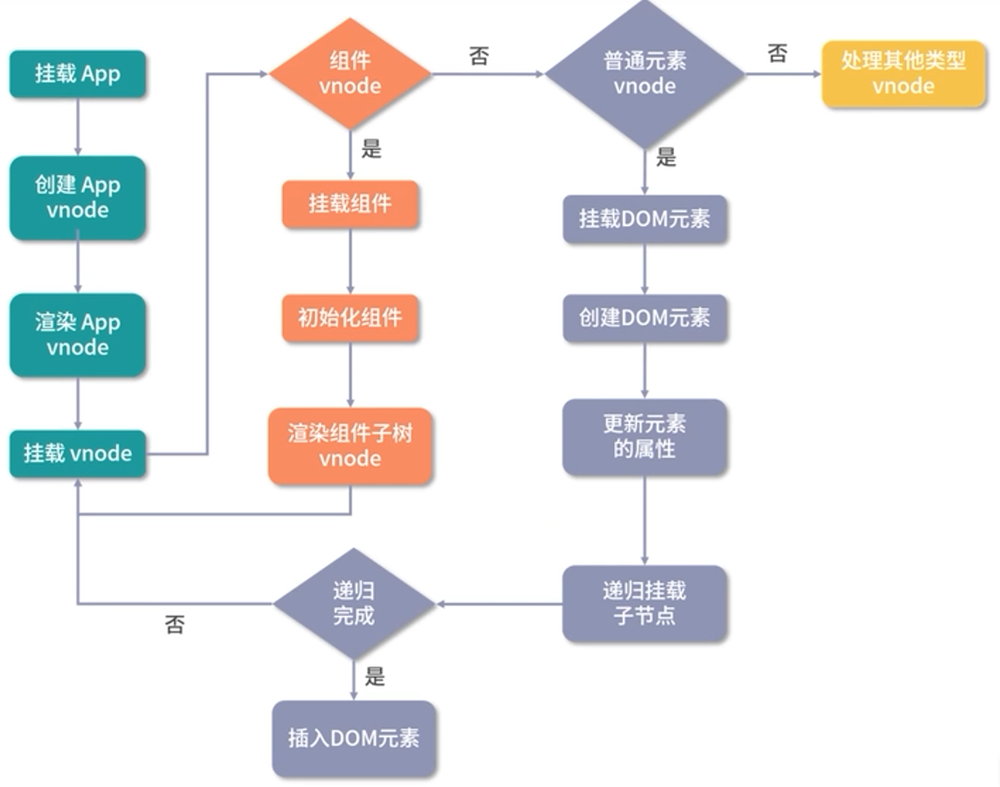
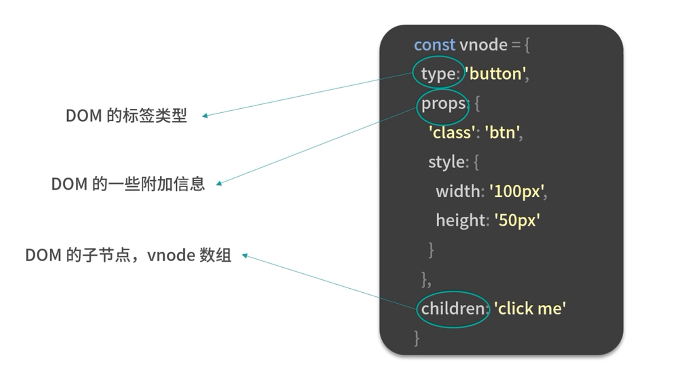

# 组件渲染流程

## 组件渲染流程图




## 组件渲染成真实 DOM 步骤

组件是一个抽象的概念，它是对一颗 DOM 树的抽象，在页面中写一个组件节点：

```html
<hello-word />
```

而组件实际是由组件内部的模板定义，如以上标签内部模板定义为：

```html
<template>
    <div>
        <p>Hello World</p>
    </div>
</template>
```

模板最终会生成以上形式。

一个组件要渲染成真实 DOM 的几个步骤：


一个组件可以通过“模板加对象描述”的方式创建，组件创建好以后是如何被调用并初始化的呢?

因为整个组件树是由根组件开始渲染的为了找到根组件的渲染入口，需要从应用程序的初始化过程开始分析：


## 初始化

初始化 Vue3 实例：在 Vue.js3.0中，初始化一个应用的方式如下

```js
import { createApp } from 'vue;
import App from ./app'
const app = createApp(App)
app.mount('#app')
```

## **createApp()实现**

1. 创建 app 对象
2. 重写 mount方法

```js
const createApp =((...args) =>{
//创建 app 对象
const app = ensureRenderer().createApp(...args)
const {mount }= app
//重写 mount方法
app.mount=(containerOrSelector)=>{}
return app
})
```

`createApp()` 中使用 ensureRender() 创建一个渲染器对象，该方法最后返回 app 实例。

代码实现：

```js
//渲染相关的一些配置，比如更新属性的方法，操作DOM的方法
const rendererOptions ={
    patchProp,
    ...nodeOps
}
let renderer
//延时创建渲染器，当用户只依赖响应式包的时候，可以通过tree-shaking移除核心渲染逻辑相关的代码
function ensureRenderer(){
    return renderer(renderer = createRenderer(rendererOptions))
}

function createRenderer(options){
    return baseCreateRenderer(options)
}

function baseCreateRenderer(options){
    function render(vnode, container){
        //组件渲染的核心逻辑
    }
    return {
        render,
		createApp: createAppAPl(render)
    }
}

function createAppAPI(render){
    //createApp 方法接受的两个参数:根组件的对象和 prop
    return function createApp(rootComponent, rootProps = null){
		const app ={
			_component: rootComponent,
            _props: rootProps,
            mount(rootContainer){
				//创建根组件的 vnode
				const vnode = createVNode(rootComponent, rootProps)
				//利用渲染器渲染 vnode
				render(vnode, rootContainer)
                app._container=rootContainer
                return vnode.component.proxy
            }
        }
        return app
    }
}
        
```

> - 在整个 app 对象创建过程中，Vue.js 利用闭包和函数柯里化的技巧，很好地实现了参数保留
> - 比如，在执行 `app.mount` 的时候，不需要传入渲染器 render 因为在执行 createAppAPl 的时候渲染器 render 参数已经被保留下来了


**思考：**

> 为什么要重写 `createApp`  方法，而不把相关逻辑放在 app 对象的 mount 方法内部来实现呢?

因为 Vue.js 不仅仅是为 Web 平台服务，它的目标是支持跨平台渲染。

 `createApp` 函数内部的 `app.mount` 方法是一个标准的可跨平台的组件渲染流程：

```js
mount(rootContainer){
    //创建根组件的 vnode
    const vnode = createVNode(rootComponent, rootProps)
    //利用渲染器渲染 vnode
    render(vnode, rootContainer)
    app._container = rootContainer
    return vnode.component.proxy
}
```


**`app.mount` 重写：**

重写的目的: 

1. 既能让用户在使用 API时可以更加灵活;
2. 也兼容了 Vue.js 2.x 的写法: 比如 `app.mount` 的第一个参数就同时支持选择器字符串和 DOM 对象两种类型。

```js
app.mount=(containerOrSelector)=>{
    //标准化容器
	const container = normalizeContainer(containerOrSelector)
    if (!container)
		return
	const component=app._component
    //如组件对象没有定义 render函数和 template 模板，则取容器的 innerHTML作为组件模板内容
    if(!isFunction(component) && !component.render && !component.template){
		component.template = container.innerHTML
    }
	//挂载前清空容器内容
	container.innerHTML=""
	//真正的挂载
	return mount(container)
}
```


## 核心渲染流程

核心渲染流程：创建 Vnode 和 渲染 Vnode。

### **Vnode**

vnode 本质上是用来描述 DOM 的 JavaScript 对象，它在 Vue.is 中可以描述不同类型的节点，比如普通元素节点、组件节点等。

在 HTML 中使用 `<button>` 标签来写一个按钮:

```html
<button class="btn" style="width:100px;height:50px">click me</button>
```

该 button 标签的 Vnode 为：



同样也可以用 Vnode 表示组件。

#### **Vnode 分类**

* 纯文本 vnode;
* 注释 vnode;

> Vnode 有什么优势？为什么一定要设计 Vnode 数据结构？

* 抽象：引入vnode，可以把渲染过程抽象化从而使得组件的抽象能力也得到提升；
* 跨平台：因为 patch vnode 的过程不同平台可以有自己的实现，基于 vnode 再做服务端渲染、weex平台、小程序的渲染。

**特别注意**：使用vnode 并不意味着不用操作 DOM 了。

> 误区： vnode 的性能一定比手动操作原生 DOM 好。

实际 vnode 的性能不一定比手动操作原生 DOM 好 ：

* 这种基于 vnode 实现的 MVVM 框架，在每次 render to vnode 的过程中渲染组件会有一定的 JavaScript 耗时，特别是大组件；
* 当我们去更新组件的时候，用户会感觉到明显的卡顿，虽然 diff 算法在减少 DOM 操作方面足够优秀，但最终还是免不了操作 DOM所以说性能并不是 vnode 的优势。


### **创建 Vnode**

通过 `createVNode` 函数创建了根组件的 `vnode`:

```js
const vnode = createVNode(rootComponent, rootProps)
```

`createVNode` 函数实现：

```js
function createVNode(type, props = null,children =null){
if (props) {
//处理 props相关逻辑，标准化 class 和 style
}
//对 vnode 类型信息编码
    const shapeFlag=isString(type)
    ? 1/* ELEMENT */
	:isSuspense(type)
	? 128/* SUSPENSE */
	:isTeleport(type)
	? 64 /* TELEPORT */
	:isObject(type)
    ? 4/* STATEFUL COMPONENT */
    :isFunction(type)
	?2/* FUNCTIONAL COMPONENT */
    :0
    
    const vnode ={
    type,
    props,
    shapeFlag
    //一些其他属性
    }
    //标准化子节点，把不同数据类型的children 转成数组或者文本类型
    normalizeChildren(vnode, children)
        return vnode
}
```


### **渲染 Vnode**

**渲染 Vnode 通过 render 函数进行渲染：**

```js
render(vnode, rootContainer)
const render = (vnode, container) =>{
    if (vnode == null) {
        //销毁组件
        if(container._vnode){
            unmount(container._vnode, null, null, true)
        }
    } else {
        //创建或者更新组件
        patch(container. vnodenull, vnode, container)
    }
    
    //缓存 vnode 节点，表示已经渲染
    container. vnode =vnode
}
```

**创建或者更新组件 patch 函数实现：**

```js
/**
*  参数 n1: 表示旧的 vnode，当n1为 null的时候，表示是一次挂载的过程
*  参数 n2: 新的 vnode节点，后续会根据这个vnode 类型执行不同的处理逻辑
*  参数 container: 表示 DOM 容器，在vnode 渲染生成 DOM 后，会挂载到 container 下面
**/
const patch =(nl,n2, container, anchor = null,parentComponent=null,parentSuspense =null, isSVG=false,optimized = false) =>{
	//如果存在新旧节点,且新旧节点类型不同，则销毁旧节点
	if (n1 && !isSameVNodeType(n1, n2)){
		anchor = getNextHostNode(n1)
		unmount(nl,parentComponent, parentSuspense, true)
        n1=null
    }
    //新的 vnode节点，后续会根据n2 vnode 类型执行不同的处理逻辑
	const {type,shapeFlag} = n2
    switch (type) {
       case Text:
        //处理文本节点
        break
        case Comment:
        // 处理注释节点
        break
        case Static:
        //处理静态节点
        break
        case Fragment:
        //处理 Fragment 元素   
        break
		default:
		  	if (shapeFlag & 1 /* ELEMENT */){
				//处理普通 DOM 元素
				processElement(nl,n2,container, anchorparentComponent,parentSuspense,isSVG,optimized)
            } else if (shapeFlag & 6 /* COMPONENT */) {
             	//处理 COMPONENT
			 	processComponent(nl,n2,container, anchorparentComponent,parentSuspense,isSVG,optimized)
            } else if (shapeFlag & 64 /* TELEPORT */) {
                //处理 TELEPORT
            } else if (shapeFlag& 128 /* SUSPENSE */){ 
                 //处理 SUSPENSE
            }
    }
}
```

更新组件 patch 函数过程中，对组件处理是调用 `processComponent` 方法实现。

**组件处理调用 `processComponent` 方法实现：**

```js
const processComponent=(nl,n2,container, anchorparentComponent,parentSuspense,isSVG,optimized)=>{
    if (n1 == null){
		// 挂载组件
		mountComponent(n2,container, anchor, parentComponentparentSuspense,isSVG, optimized)
    }else if{
        //更新组件
		updateComponent(n1,n2,parentComponent, optimized)
    }
}
```

当 `n1 == null` 时，表示挂载组件，通过 `mountComponent` 方法挂载组件。

 **`mountComponent` 挂载组件方法实现:**

1. 创建组件实例: 内部也通过对象的方式去创建了当前渲染的组件实例。
2. 设置组件实例：instance 保留了很多组件相关的数据，维护了组件的上下文包括对 props、插槽，以及其他实例的属性的初始化处理。
3. 设置并运行带副作用的渲染函数

```js
const mountComponent=(initialVNode, container, anchorparentComponent,parentSuspense,isSVG,optimized)=>{
    //创建组件实例
	const instance=(initialVNode.component = createComponentInstance(initialVNode,parentComponentparentSuspense))
//设置组件实例
setupComponent(instance
//设置并运行带副作用的渲染函数
setupRenderEffect(instance,initialVNode, container, anchor，parentSuspense,isSVG,optimized)
}
```


**设置并运行带副作用的渲染函数  setupRenderEffec 的实现:** 

```js
const setupRenderEffect =(instance,initialVNodecontainer,anchor, parentSuspense,isSVG,optimized) =>
//创建响应式的副作用渲染函数
instance.update = effect(function componentEffect(){
	if (!instance.isMounted) {
    //渲染组件生成子树 vnode
	const subTree = (instance.subTree = renderComponentRoot(instance))
	//把子树 vnode 挂载到 container 中
    patch(null,subTree, container, anchor, instanceparentSuspense,isSVG)
		//保留渲染生成的子树根 DOM 节点
		initialVNode.el = subTree.el
		instance.isMounted = true
    } else {
//更新组件
},prodEffectOptions)
```


### **初始渲染**

初始渲染主要做两件事情:

1. 渲染组件生成 `subTree`；
2. 把 `subTree` 挂载到 `container` 中


### **普通 DOM 元素处理流程**

在以上 path 方法中，处理普通 DOM 元素，调用 `processElement` 处理普通 DOM 元素：

1. 挂载元素节点
2. 或 更新元素节点

```js
const processElement=(nl,n2, container, anchor, parentComponent,parentSuspense,isSVG, optimized)=>{
	isSVG=isSVG|ln2.type ==='svg
	if(n1 == null){
	//挂载元素节点
		mountElement(n2,container, anchor, parentComponentparentSuspense,isSVG, optimized)
    }else if{
   	 //更新元素节点
		patchElement(n1,n2,parentComponent,parentSuspense,isSVG,optimized)
    }
}
```

挂载元素节点 `mountElement` :

1. 创建 DOM 元素节点;
2. 处理 props，比如 class、style、event 等属性;
3. 处理子节点是纯文本的情况;
4. 处理子节点是数组的情况;
5. 把创建的 DOM 元素节点挂载到 container 上

```js
const mountElement=(vnode,container, anchorparentComponent, parentSuspense, isSVG, optimized) =>{
	let el
	const {type, props,shapeFlag} = vnode
    //创建 DOM 元素节点
    //如果是其他平台比如Weex，hostCreateElement方法就不再是操作 DOM而是平台相关的 API了，这些平台相关的方法是在创建渲染器阶段作为参数传入的
	el = vnode.el = hostCreateElement(vnode.type, isSVGprops && props.is)
    if (props) {
	//处理 props，比如 class、style、event 等属性
        for (const key in props) {
            if (!isReservedProp(key)){
                hostPatchProp(el, key, null, propslkey], isSVG)
            }
        }
    }
	if (shapeFlag & 8 /* TEXT_CHILDREN */){//处理子节点是纯文本的情况
		hostSetElementText(el,vnode.children)
    }else if(shapeFlag& 16 /* ARRAY_CHILDREN */){//处理子节点是数组的情况
        mountChildren(vnode.children, el, null,parentComponent,parentSuspense,isSVG &&type !== 'foreignObject' optimized!!vnode.dynamicChildren)
    }
	//把创建的 DOM 元素节点挂载到 container 上
    hostInsert(el, container, anchor)
}
```


`mountElement` 方法对子节点的处理：

1. 子节点是纯文本的情况，`hostSetElementText` 方法：

   ```js
   function setElementText(el, text){
       el.textContent=text
   }
   ```

2. 子节点是数组的情况，`mountChildren` 方法:

   ```js
   const mountChildren=(children, container, anchor,parentComponent,parentSuspense,isSVG,optimized, start = 0) => {
       for (let i= start;i< children.length; i++){
   	//预处理 child
   	const child =(children[i] = optimized ? clonelfMounted(children[i]):normalizeVNode(children[i])
   	//递归 patch 挂载 child
   	patch(null, child, container, anchor, parentComponent.parentSuspense,isSVG, optimized)
       }
   }
   ```

> 注意：在 `mountChildren` 的时候递归执行的是 `patch` 函数，而不是 `mountElement` 函数。
>
> 这是因为子节点可能有其他类型的 vnode，比如组件 vnode


`mountElement` 方法处理完成子节点后，最后通过  `hostInsert` 挂载到 dom 到 container 上:

```js
function insert(child, parent, anchor){
    if (anchor) {
		parent.insertBefore(child,anchor)
    }
	else {
        parent.appendChild(child)
    }
}
```

因为 insert 的执行是在处理子节点后，所以挂载的顺序是**先子节点，后父节点最终挂载到最外层的容器上**


## 总结

组件 vnode 主要维护着组件的定义对象，组件上的各种 props，而组件本身是一个抽象节点它自身的渲染其实是通过执行组件定义的render 函数渲染生成的子树 vnode 来完成然后再 patch 通过这种递归的方式，无论组件的嵌套层级多深，都可以完成整个组件树的渲染。


