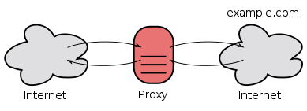
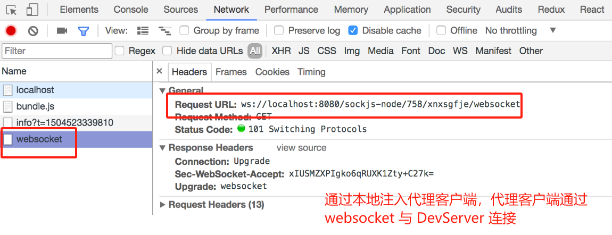
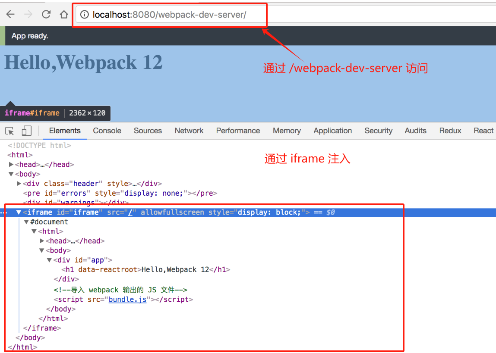
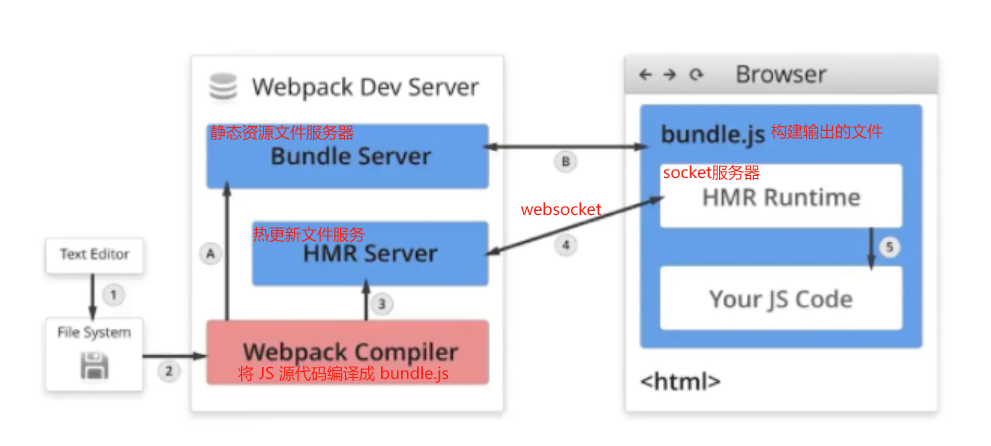
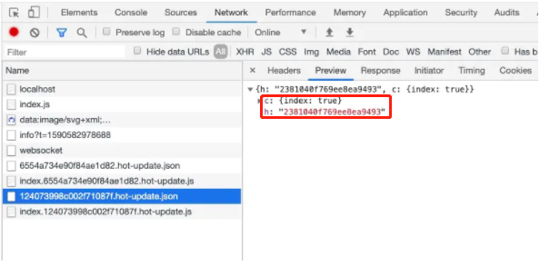

# DevServer


## **DevServer 是什么**

Webpack DevServer 是一个方便开发的小型 HTTP 服务器，主要用于在开发过程中提供模块热替换（HMR）和源映射（source maps）等功能。

## DevServer 功能

1. 提供 HTTP 服务而不是使用本地文件预览；
2. 监听文件的变化并自动刷新网页，做到实时预览；
3. 支持 Source Map，以方便调试。
4. `webpack`代理服务，解决跨域问题。

Webpack DevServer 常见功能和配置选项:

| 功能               | 配置选项             | 解决的问题                                                 |
| :----------------- | :------------------- | :--------------------------------------------------------- |
| 静态文件服务       | `contentBase`        | 在开发环境中提供静态文件的本地服务器                       |
| 实时重载           | `hot`                | 当源代码发生变化时，自动刷新页面以显示最新的更改           |
| 热模块替换         | `hotOnly`            | 替换或插入模块的代码更新，而不刷新整个页面                 |
| 路由历史回退       | `historyApiFallback` | 用于单页应用程序，使得在路由切换时能够正确地回退到指定页面 |
| 代理               | `proxy`              | 将特定请求路径转发到其他服务器，解决跨域请求的问题         |
| 自动打开浏览器     | `open`               | 启动DevServer时自动打开默认浏览器                          |
| 自定义端口         | `port`               | 指定DevServer监听的端口号                                  |
| 自定义主机         | `host`               | 指定DevServer绑定的主机地址                                |
| HTTPS支持          | `https`              | 在DevServer上启用HTTPS协议                                 |
| 代理请求日志       | `proxy`              | 在控制台输出代理请求的详细日志信息                         |
| 压缩输出           | `compress`           | 压缩DevServer的输出，减小传输大小                          |
| 启用模块热替换日志 | `clientLogLevel`     | 控制台输出模块热替换相关的日志信息                         |
| 启用错误提示       | `overlay`            | 在页面上显示编译错误和警告信息                             |
| 自定义404页面      | `historyApiFallback` | 当请求的资源不存在时，显示自定义的404页面                  |

请注意，这里列出的只是一些常见功能和配置选项，Webpack DevServer还提供了其他更高级的功能和配置选项，如HTTP/2支持、自定义中间件、Webpack插件支持等。具体的功能和配置选项可以参考Webpack DevServer的官方文档。

## **使用** DevServer

1. 首先需要安装 DevServer：

```bash
npm i -D webpack-dev-server
```

2. 安装成功后执行 `webpack-dev-server` 命令， DevServer 就启动了，这时你会看到控制台有一串日志输出：

```shell
Project is running at http://localhost:8080/
webpack output is served from /
```

> DevServer 启动的 HTTP 服务器监听在 `http://localhost:8080/` 
>
> DevServer 启动后会一直驻留在后台保持运行，访问这个网址你就能获取项目根目录下的 `index.html`。
>
>  用浏览器打开这个地址你会发现页面空白错误原因是 `./dist/bundle.js` 加载404了。 同时你会发现并没有文件输出到 `dist` 目录，原因是 DevServer 会把 Webpack 构建出的文件保存在内存中，在要访问输出的文件时，必须通过 HTTP 服务访问。 由于 DevServer 不会理会 `webpack.config.js` 里配置的 `output.path` 属性，所以要获取 `bundle.js` 的正确 URL 是 `http://localhost:8080/bundle.js`，对应的 `index.html` 应该修改为：
>
> ```html
> <html>
> <head>
>   <meta charset="UTF-8">
> </head>
> <body>
> <div id="app"></div>
> <!--导入 DevServer 输出的 JavaScript 文件-->
> <script src="bundle.js"></script>
> </body>
> </html>
> ```


3. `webpack.config.js` 文件中配置 devServer:

   ```js
   module.exports = {
     // ...其他Webpack配置
   
     devServer: {
       contentBase: path.resolve(__dirname, 'dist'),//指定静态文件的根目录，这里设置为dist目录。
       hot: true,//启用模块热替换，实现实时更新。
       historyApiFallback: true,//启用路由历史回退，用于单页应用程序。
       proxy: {//配置代理规则，将以/api开头的请求转发到http://api.example.com。
         '/api': {
           target: 'http://api.example.com',
           pathRewrite: { '^/api': '' },
         },
       },
       open: true,//启动DevServer时自动打开默认浏览器。
       port: 8080,//指定DevServer监听的端口号为8080。
       host: 'localhost',//指定DevServer绑定的主机地址为localhost。
       https: false,//禁用HTTPS支持。
       compress: true,//启用输出压缩，减小传输大小。
       clientLogLevel: 'info',//设置模块热替换日志级别为info。
       overlay: true,//在页面上显示编译错误和警告信息。
     }
   };
   ```

   

## **DevServer 原理**

DevServer 其实是基于 [webpack-dev-middleware](https://github.com/webpack/webpack-dev-middleware) 和 [Expressjs](https://expressjs.com/) 实现的， 而 `webpack-dev-middleware` 其实是 Expressjs 的一个中间件。

DevServer 基本功能的代码大致如下：

```js
const express = require('express');
const webpack = require('webpack');
const webpackMiddleware = require('webpack-dev-middleware');

// 从 webpack.config.js 文件中读取 Webpack 配置 
const config = require('./webpack.config.js');
// 用读取到的 Webpack 配置实例化一个 Compiler
const compiler = webpack(config);
// 实例化一个 Expressjs app
const app = express();
// 给 app 注册 webpackMiddleware 中间件
app.use(webpackMiddleware(compiler));
// 启动 HTTP 服务器，服务器监听在 3000 端口 
app.listen(3000);
```

> DevServer 核心是使用  `webpack-dev-middleware`  中间件实现


## **`webpack-dev-middleware` 原理**

`webpack-dev-middleware` 中导出 `webpackMiddleware` 是一个函数，该函数需要接收一个 Compiler 实例。

`webpackMiddleware` 函数的返回结果是一个 Expressjs 的中间件，该中间件有以下功能：

- 接收来自 Webpack Compiler 实例输出的文件，但不会把文件输出到硬盘，而是保存在内存中；
- 往 Expressjs app 上注册路由，拦截 HTTP 收到的请求，根据请求路径响应对应的文件内容；

通过 webpack-dev-middleware 能够将 DevServer 集成到现有的 HTTP 服务器中，让现有的 HTTP 服务器能返回 Webpack 构建出的内容，而不是在开发时启动多个 HTTP 服务器。 这特别适用于后端接口服务采用 Node.js 编写的项目。

具体来说，webpack-dev-middleware具备以下功能：

1. **快速响应**：它使用**内存作为文件系统**，所以文件的更改能够快速地被反映。
2. **实时编译**：当源文件发生改变时，`webpack-dev-middleware` 能够实时编译新的代码，并把编译后的文件输出到内存中。
3. **自动刷新**：当源代码发生改变时，浏览器会自动刷新，显示最新的代码。
4. **支持热替换**（Hot Module Replacement）：这允许开发者在不刷新整个页面的情况下替换、添加或删除模块。
5. **自定义配置**：除了webpack的配置，开发者还可以对webpack-dev-middleware进行自定义配置，以满足特定的需求。


**Webpack Dev Middleware 支持的配置项:**

```js
// webpackMiddleware 函数的第二个参数为配置项
app.use(webpackMiddleware(compiler, {
    // webpack-dev-middleware 所有支持的配置项
    // 只有 publicPath 属性为必填，其它都是选填项

    // Webpack 输出资源绑定在 HTTP 服务器上的根目录，
    // 和 Webpack 配置中的 publicPath 含义一致 
    publicPath: '/assets/',

    // 不输出 info 类型的日志到控制台，只输出 warn 和 error 类型的日志
    noInfo: false,

    // 不输出任何类型的日志到控制台
    quiet: false,

    // 切换到懒惰模式，这意味着不监听文件变化，只会在请求到时再去编译对应的文件，
    // 这适合页面非常多的项目。
    lazy: true,

    // watchOptions
    // 只在非懒惰模式下才有效
    watchOptions: {
        aggregateTimeout: 300,
        poll: true
    },

    // 默认的 URL 路径, 默认是 'index.html'.
    index: 'index.html',

    // 自定义 HTTP 头
    headers: {'X-Custom-Header': 'yes'},

    // 给特定文件后缀的文件添加 HTTP mimeTypes ，作为文件类型映射表
    mimeTypes: {'text/html': ['phtml']},

    // 统计信息输出样式
    stats: {
        colors: true
    },

    // 自定义输出日志的展示方法
    reporter: null,

    // 开启或关闭服务端渲染
    serverSideRender: false,
}));
```


## **WebPack proxy**

### **是什么？**

> Webpack的代理功能（proxy）允许你在开发过程中将特定的HTTP请求转发到其他服务器上。

### **为什么？**

> 通过本地代理服务解决**开发中**跨域请求的问题

代理功能允许你在开发过程中将请求代理到其他服务器上，以解决跨域请求的问题。

通过配置代理规则，Webpack DevServer可以将特定的请求路径映射到远程服务器上，从而绕过同源策略。

### **怎么用？**

在`webpack`配置对象属性中通过`devServer`属性提供，如下：

```js
// ./webpack.config.js
const path = require('path')

module.exports = {
    // ...
    devServer: {
        contentBase: path.join(__dirname, 'dist'),
        compress: true,
        port: 9000,
        // 配置本地代理
        proxy: {
            '/api': { // 代理匹配的路径
                target: 'https://test.com' // 转发的路径，通过将原路径中 /api 替换成 https://test.com
            }
        }
        // ...
    }
}
```

`devServetr`里面`proxy`则是关于代理的配置，该属性为对象的形式，对象中每一个属性就是一个代理的规则匹配：

* 属性的名称是需要被代理的请求路径前缀，一般为了辨别都会设置前缀为`/api`

* 值为对应的代理匹配规则，对应如下：

  - target：表示的是代理到的目标地址；

  - pathRewrite：默认情况下，我们的` /api-hy `也会被写入到URL中，如果希望删除，可以使用pathRewrite

  - secure：默认情况下不接收转发到 https 的服务器上，如果希望支持，可以设置为false；
  - changeOrigin：它表示是否更新代理后请求的 headers 中host地址


### **解决跨域原理**

* 在开发阶段， `webpack-dev-server` 会启动一个本地开发服务器，所以我们的应用在开发阶段是独立运行在 `localhost`的一个端口上，而后端服务又是运行在另外一个地址上；

* 所以在开发阶段中，由于浏览器同源策略的原因，当本地访问后端就会出现跨域请求的问题；

* 通过设置`webpack proxy`实现代理请求后，相当于浏览器与服务端中添加一个代理者；

* 当本地发送请求的时候，代理服务器响应该请求，并将请求转发到目标服务器，目标服务器响应数据后再将数据返回给代理服务器，最终再由代理服务器将数据响应给本地；
* 在代理服务器传递数据给本地浏览器的过程中，两者同源，并不存在跨域行为，这时候浏览器就能正常接收数据。




注意：**服务器与服务器之间请求数据并不会存在跨域行为，跨域行为是浏览器安全策略限制**


### **代理原理**

Webpack的代理功能（proxy）通过**拦截和转发HTTP请求来实现**：

1. 当Webpack DevServer收到一个HTTP请求时，它会检查请求的URL是否匹配了代理配置中定义的规则。
2. 如果匹配成功，Webpack DevServer将会将该请求转发到代理目标服务器上，并将响应返回给客户端。
   * 当一个请求到达Webpack DevServer时，它会检查请求的URL是否与代理配置中的源路径匹配。如果匹配成功，Webpack DevServer将会将该请求转发到配置的目标URL。
   * 在转发请求时，Webpack DevServer会将原始请求的URL进行修改，以便与目标服务器的路径匹配（如果配置了路径重写）。

代理配置规则通常包括以下信息：

1. **源路径（context）**：指定需要被代理的请求路径的前缀或模式。例如，`/api`或`/api/**`。
2. **目标URL（target）**：指定将请求转发到的目标服务器的URL。例如，`http://api.example.com`。
3. **路径重写（pathRewrite）**：可选项，用于对请求路径进行修改。可以用于移除前缀、重定向到其他路径等操作。

webpack 中提供服务器的工具为 `webpack-dev-server`，`webpack-dev-server`是 `webpack` 官方推出的一款开发工具，将自动编译和自动刷新浏览器等一系列对开发友好的功能全部集成在了一起。

 `webpack-dev-server`目的是为了提高开发者日常的开发效率，**只适用在开发阶段**

`proxy`工作原理实质上是利用`http-proxy-middleware` 这个`http`代理中间件，实现请求转发给其他服务器：

> 在开发阶段，本地地址为`http://localhost:3000`，该浏览器发送一个前缀带有`/api`标识的请求到服务端获取数据，但响应这个请求的服务器只是将请求转发到另一台服务器中
>
> ```js
> const express = require('express');
> const proxy = require('http-proxy-middleware');
> 
> const app = express();
> 
> app.use('/api', proxy({target: 'http://www.example.org', changeOrigin: true}));
> app.listen(3000);
> 
> // http://localhost:3000/api/foo/bar -> http://www.example.org/api/foo/bar
> ```


## **DevServer 实时预览功能**

Webpack DevServe 实现实时预览有两种模式：

1.  **监听模式**：当发生变化时重新执行完构建后通知 DevServer，DevServer **重新刷新页面**，进行实时预览；
2.  **模块热替换**：在**不重新加载整个网页**的情况下，通过将被更新过的模块替换老的模块，再重新执行一次来实现实时预览。

### **监听模式**

> 文件监听是在发现源码文件发生变化时，自动重新构建出新的输出文件。

#### **开启监听模式**

要让 Webpack 开启监听模式，有两种方式：

- 在配置文件 `webpack.config.js` 中设置 `watch: true`。
- 在执行启动 Webpack 命令时，带上 `--watch` 参数，完整命令是 `webpack --watch`。

**命令行传入**

Webpack 默认是关闭监听模式的，在启动 Webpack 时通过 `webpack --watch` 来开启监听模式。

**文件配置**

相关的配置项如下：

```js
module.export = {
  // 只有在开启监听模式时，watchOptions 才有意义
  // 默认为 false，也就是不开启
  watch: true,
  // 监听模式运行时的参数
  // 在开启监听模式时，才有意义
  watchOptions: {
    // 不监听的文件或文件夹，支持正则匹配
    // 默认为空
    ignored: /node_modules/,
    // 监听到变化发生后会等300ms再去执行动作，防止文件更新太快导致重新编译频率太高
    // 默认为 300ms
    aggregateTimeout: 300,
    // 判断文件是否发生变化是通过不停的去询问系统指定文件有没有变化实现的
    // 默认每隔1000毫秒询问一次
    poll: 1000
  }
}
```


#### **监听模式缺陷**

**不能监听 `.html` 文件变化**

>  如果尝试修改 `index.html` 文件并保存，你会发现这并不会使 webpack 重新执行构建；
>
> 导致这个问题的原因是 Webpack 在启动时会以配置里的 `entry` 为入口去递归解析出 `entry` 所依赖的文件，只有 `entry` 本身和依赖的文件才会被 Webpack 添加到监听列表里。
>
>  而 `index.html` 文件是脱离了 JavaScript 模块化系统的，所以 Webpack 不知道它的存在。


#### **自动更新原理**

通过 DevServer 启动的 Webpack 会开启监听模式，当**发生变化时重新执行完构建后通知 DevServer**。

1. **注入代理客户端**：DevServer 会让 Webpack 在构建出的 JavaScript 代码里**注入一个代理客户端用于控制网页**，网页和 DevServer 之间通过 WebSocket 协议通信， 以方便 DevServer 主动向客户端发送命令。

2. **定时获取文件的最后编辑时间：**Webpack **定时的去获取文件的最后编辑时间**，每次都存下最新的最后编辑时间，如果发现当前获取的和最后一次保存的最后编辑时间不一致，就认为该文件发生了变化。
3. **通知客户端网页自动刷新：**DevServer 在收到来自 Webpack 的文件变化通知时通过注入的客户端控制网页刷新。


通过以上原理分析可以发现，主要涉及两个原理：

1. 获取文件变化原理：定时的去获取文件的最后编辑时间。
2. 自动刷新浏览器原理：监听到文件更新后的下一步是去刷新浏览器，webpack 模块负责监听文件，`webpack-dev-server` 模块则负责刷新浏览器。


#### **文件监听原理**

1. Webpack **定时的去获取文件的最后编辑时间**，每次都存下最新的最后编辑时间，如果发现当前获取的和最后一次保存的最后编辑时间不一致，就认为该文件发生了变化。
   * 配置项中的 `watchOptions.poll` 就是用于控制定时检查的周期，具体含义是每隔多少毫秒检查一次。

2. 当发现某个文件发生了变化时，并不会立刻告诉监听者，而是先缓存起来，收集一段时间的变化后，再一次性告诉监听者。
   * 配置项中的 `watchOptions.aggregateTimeout` 就是用于配置这个等待时间。这样做的目的是因为我们在编辑代码的过程中可能会高频的输入文字导致文件变化的事件高频的发生，如果每次都重新执行构建就会让构建卡死。

3. 对于多个文件来说，默认情况下 Webpack 会从配置的 Entry 文件出发，递归解析出 Entry 文件所依赖的文件，把这些依赖的文件都加入到监听列表中去。


#### **自动刷新浏览器原理**

监听到文件更新后的下一步是去刷新浏览器，webpack 模块负责监听文件，`webpack-dev-server` 模块则负责刷新浏览器。

 在使用 `webpack-dev-server` 模块去启动 webpack 模块时，webpack 模块的监听模式默认会被开启。   

webpack 模块会在文件发生变化时告诉 `webpack-dev-server` 模块。

控制浏览器刷新有三种方法：

1. 借助浏览器扩展去通过浏览器提供的接口刷新。
2. 往要开发的网页中注入代理客户端代码，通过代理客户端去刷新整个页面。
3. 把要开发的网页装进一个 iframe 中，通过刷新 iframe 去看到最新效果。

DevServer 支持第2、3种方法，第2种是 DevServer 默认采用的刷新方法。

通过 DevServer 启动构建后，在浏览器中打开网址 `http://localhost:8080/` 后， 在浏览器的开发者工具中你会发现由代理客户端向 DevServer 发起的 WebSocket 连接：



**配置浏览器自动刷新：**

配置项`devServer.inline`，它就是用来控制是否往 Chunk 中注入代理客户端的，**默认会注入**。


#### **优化文件监听性能**

由于保存文件的路径和最后编辑时间需要占用内存，定时检查周期检查需要占用 CPU 以及文件 I/O，所以最好减少需要监听的文件数量和降低检查频率。


**优化方案**

1. 忽略监听 `node_modules` 下的文件；
2. `watchOptions.aggregateTimeout` 值越大性能越好，因为这能降低重新构建的频率。
3. `watchOptions.poll` 值越大越好，因为这能降低检查的频率。


**忽略监听 `node_modules` 下的文件：**

>  开启监听模式时，默认情况下会监听配置的 Entry 文件和所有其递归依赖的文件。 
>
> 在这些文件中会有很多存在于 `node_modules` 下，因为如今的 Web 项目会依赖大量的第三方模块。
>
> 在大多数情况下我们都不可能去编辑 `node_modules` 下的文件，而是编辑自己建立的源码文件。

配置如下：

```js
module.export = {
  watchOptions: {
    // 不监听的 node_modules 目录下的文件
    ignored: /node_modules/,
  }
}
```


#### **优化自动刷新的性能**

**存在问题：**

在开启 inline 时，DevServer 会为每个输出的 Chunk 中注入代理客户端的代码，当你的项目需要输出的 Chunk 有很多个时，这会导致你的构建缓慢。 

其实要完成自动刷新，一个页面只需要一个代理客户端就行了，DevServer 之所以粗暴的为每个 Chunk 都注入，是因为它不知道某个网页依赖哪几个 Chunk，索性就全部都注入一个代理客户端。 网页只要依赖了其中任何一个 Chunk，代理客户端就被注入到网页中去。


**优化的思路：**

> 关闭 inline 模式，只注入一个代理客户端。

关闭 inline 模式：在启动 DevServer 时，可通过执行命令 `webpack-dev-server --inline false`（也可以在配置文件中设置）

在关闭了 inline 后，DevServer 会自动地提示你通过新网址 `http://localhost:8080/webpack-dev-server/` 去访问：



> **在关闭 inline 后，webpack 讲要开发的网页被放进了一个 iframe 中，编辑源码后，iframe 会被自动刷新**。


### **模块热替换**

> 模块热替换: 在**不重新加载整个网页的情况下，通过将被更新过的模块替换老的模块**，再重新执行一次来实现实时预览。

#### **为什么需要模块热替换？**

Webpack 打包器的开发服务器将构建内容存入内存，这样它们只需要在文件更改时使模块图的一部分失活[[1\]](https://cn.vitejs.dev/guide/why.html#footnote-1)，但它也仍需要整个重新构建并重载页面。

这样代价很高，并且重新加载页面会消除应用的当前状态，所以打包器支持了动态模块热替换（HMR）；

#### **什么是模块热替换？**

允许一个模块 “热替换” 它自己，而不会影响页面其余部分。

大大改进了开发体验。

#### **开启模块热替换**

开启模块热替换有三种方式：

**1.命令行开启：**

模块热替换默认是关闭的，要开启模块热替换，你只需在启动 DevServer 时带上 `--hot` 参数，重启 DevServer 后再去更新文件，完整命令是 `webpack-dev-server --hot`。


**2.webpack 配置：**

```js
const webpack = require('webpack')
module.exports = {
  // ...
  devServer: {
    // 开启 HMR 特性
    hot: true
    // hotOnly: true
  }
}
```


**3.接入 `webpack-hot-middleware` 中间件：**

第1步：修改 HTTP 服务器代码 `server.js` 文件，接入 `webpack-hot-middleware` 中间件，修改如下：

```js
const express = require('express');
const webpack = require('webpack');
const webpackMiddleware = require('webpack-dev-middleware');

// 从 webpack.config.js 文件中读取 Webpack 配置
const config = require('./webpack.config.js');
// 实例化一个 Expressjs app
const app = express();

// 用读取到的 Webpack 配置实例化一个 Compiler
const compiler = webpack(config);
// 给 app 注册 webpackMiddleware 中间件
app.use(webpackMiddleware(compiler));
// 为了支持模块热替换，响应用于替换老模块的资源
app.use(require('webpack-hot-middleware')(compiler));
// 把项目根目录作为静态资源目录，用于服务 HTML 文件
app.use(express.static('.'));
// 启动 HTTP 服务器，服务器监听在 3000 端口
app.listen(3000, () => {
  console.info('成功监听在 3000');
});
```

第2步：修改 `webpack.config.js` 文件，加入 `HotModuleReplacementPlugin` 插件，修改如下：

```js
const HotModuleReplacementPlugin = require('webpack/lib/HotModuleReplacementPlugin');

module.exports = {
  entry:{
    // 为每个入口都注入代理客户端
    main:['webpack-dev-server/client?http://localhost:8080/', 'webpack/hot/dev-server','./src/main.js'],
  },
  plugins: [
    // 该插件的作用就是实现模块热替换，实际上当启动时带上 `--hot` 参数，会注入该插件，生成 .hot-update.json 文件。
    new HotModuleReplacementPlugin(),
  ],
  devServer:{
    // 告诉 DevServer 要开启模块热替换模式
    hot: true,      
  }  
};
```

>  在启动 Webpack 时带上参数 `--hot` 其实就是自动为你完成以上配置

第3步：修改执行入口文件 `main.js`，加入替换逻辑，在文件末尾加入以下代码：

```js
if (module.hot) {
  module.hot.accept();
}
```

第4步：安装新引入的依赖：

```bash
npm i -D webpack-dev-middleware webpack-hot-middleware express
```


#### **模块热替换优势**

- 实时预览反应更快，等待时间更短。
- 不刷新浏览器能保留当前网页的运行状态，例如在使用 Redux 来管理数据的应用中搭配模块热替换能做到代码更新时 Redux 中的数据还保持不变。


#### **模块热替换缺陷**

> 需要去指定哪些模块发生更新时进行`HRM`

使用模块特替换时，修改并保存`css`文件，确实能够以不刷新的形式更新到页面中

但是，当我们修改并保存`js`文件之后，页面依旧自动刷新了，这里并没有触发热模块

所以，`HMR`并不像 `Webpack` 的其他特性一样可以开箱即用，需要去指定哪些模块发生更新时进行`HRM`，如下代码：

```js
if(module.hot){
    module.hot.accept('./util.js',()=>{
        console.log("util.js更新了")
    })
}
```


#### 模块热替换原理

> 当一个源码发生变化时，只重新编译发生变化的模块，再用新输出的模块替换掉浏览器中对应的老模块。

**模块热更新流程：**

1. `webpack-dev-server` 创建两个服务器：  提供静态资源的服务  (express)   和 `socket ` 服务;

2. `express server` 负责直接提供静态资源的服务  (打包后的资源直接被浏览器请求和解析)；

3. `socket server` 是一 个 `websocket `的长连接 ， 双方可以通信;

4. 当 `socket server` 监听到对应的模块发生变化时 ， 会生成两个文件 `json`  (manifest文件)  和 `.js`文件 ;

5. 通过长连接 `socket server` 可以直接将这两个文件主动发送给客户端  (浏览器);

6. 浏览器拿到两个新的文件后， 通过 `HMR runtime`机制，加载这两个文件，并且针对修改的模块进行更新。



* `Webpack compile`：将 JS 源代码编译成 bundle.js;
* `HMR Server`：用来将热更新的文件输出给 HMR Runtime;
* `Bundle server`：静态资源文件服务器 ， 提供文件访问路径;
* `HMR Runtime`：socket服务器 , 会被注入到浏览器,更新文件的变化;
* `bundle.js`：构建输出的文件;

在HMR Runtime 和 HMR Server之间建立 websocket,即图上4号线, 用于实时更新文件变化上面图中,  可以分成两个阶段：

* **启动阶段**:  为上图 `1 -> 2 -> A -> B` 

  * 在编写未经过`webpack`打包的源代码后，`Webpack Compile` 将源代码和 `HMR Runtime` 一起编译成 `bundle`文件，传输给`Bundle Server` 静态资源服务器

* **更新阶段**: 为上图 `1 -> 2 -> 3 -> 4` 

  * 当某一个文件或者模块发生变化时，`webpack`监听到文件变化对文件重新编译打包，编译生成唯一的`hash`值，这个`hash`值用来作为下一次热更新的标识

  * 根据变化的内容生成两个补丁文件：`manifest`（包含了 `hash` 和 `chundId`，用来说明变化的内容）和`chunk.js` 模块

  * 由于`socket`服务器在`HMR Runtime` 和 `HMR Server`之间建立 `websocket`链接，当文件发生改动的时候，服务端会向浏览器推送一条消息，消息包含文件改动后生成的`hash`值，如下图的`h`属性，作为下一次热更细的标识

    

  * 在浏览器接受到这条消息之前，浏览器已经在上一次`socket` 消息中已经记住了此时的`hash` 标识，这时候我们会创建一个 `ajax` 去服务端请求获取到变化内容的 `manifest` 文件

  * `mainfest`文件包含重新`build`生成的`hash`值，以及变化的模块，对应上图的`c`属性

  * 浏览器根据 `manifest` 文件获取模块变化的内容，从而触发`render`流程，实现局部模块更新

    


#### **优化模块热替换**

**存在问题：**

> 在发生模块热替换时,浏览器控制台只显示被替换模块的 id，不会告知详细的被替换的模块

在发生模块热替换时，你会在浏览器的控制台中看到类似这样的日志：


> 其中的 `Updated modules: 68` 是指 ID 为68的模块被替换了，这对开发者来说很不友好，因为开发者不知道 ID 和模块之间的对应关系，最好是把替换了的模块的名称输出出来

**优化方法：**

通过 Webpack 内置的 NamedModulesPlugin 插件，可以在控制台显示被替换的模块名称。

Webpack 配置文件接入该插件：

```js
const NamedModulesPlugin = require('webpack/lib/NamedModulesPlugin');

module.exports = {
  plugins: [
    // 显示出被替换模块的名称
    new NamedModulesPlugin(),
  ],
};
```

重启构建后你会发现浏览器中的日志显示了被替换模块的名称：


## Source Map

### **是什么？**

>  Source map（源映射）是一种文件，用于将转换后的、压缩过的代码映射回原始的、未经转换的源代码。它提供了一种对应转换后代码与源代码之间关系的方法，使开发者能够在调试过程中准确定位错误和异常。

### 为什么需要 **SourceMap？**

在开发过程中，通常会对代码进行转换、压缩和合并等操作，以提高代码执行效率和减小文件大小。然而，这样的转换会使得源代码与最终生成的代码之间的对应关系变得复杂，不易于调试和定位问题。

Source map包含了源代码与转换后代码的映射关系，通常以一种叫做VLQ（Variable Length Quantity，可变长度编码）的格式存储。

Source map可以告诉开发者，转换后代码中的特定位置对应于源代码中的哪个位置，从而使得浏览器的开发者工具能够在调试时正确地显示源代码，而不是转换后的代码。

#### **Source map 作用**

1. **调试**：使用Source map能够在开发者工具中准确地显示源代码，帮助开发者在调试过程中定位错误、断点和异常。
2. **错误报告**：当转换后的代码出现错误时，浏览器可以通过Source map将错误堆栈跟踪信息映射回源代码，从而提供更有用的错误报告。
3. **性能优化**：在生产环境中，通过使用Source map只在需要时启用调试功能，可以减小发布的代码包的大小，提高加载和执行性能。

### **怎么用？**

 控制 Source Map 输出的 Webpack 配置项是 `devtool`，取值其实可以由 `source-map`、`eval`、`inline`、`hidden`、`cheap`、`module` 这六个关键字随意组合而成。 这六个关键字每个都代表一种特性，它们的含义分别是：

- eval：用 `eval` 语句包裹需要安装的模块；
- source-map：生成独立的 Source Map 文件；
- hidden：不在 JavaScript 文件中指出 Source Map 文件所在，这样浏览器就不会自动加载 Source Map；
- inline：把生成的 Source Map 转换成 base64 格式内嵌在 JavaScript 文件中；
- cheap：生成的 Source Map 中不会包含列信息，这样计算量更小，输出的 Source Map 文件更小；同时 Loader 输出的 Source Map 不会被采用；
- module：来自 Loader 的 Source Map 被简单处理成每行一个模块；

配置项 `devtool`可选值：

| devtool                 | 含义                                                         |
| ----------------------- | ------------------------------------------------------------ |
| 空                      | 不生成 Source Map                                            |
| eval                    | 每个 module 会封装到 eval 里包裹起来执行，并且会在每个 eval 语句的末尾追加注释 `//# sourceURL=webpack:///./main.js` |
| source-map              | 会额外生成一个单独 Source Map 文件，并且会在 JavaScript 文件末尾追加 `//# sourceMappingURL=bundle.js.map` |
| hidden-source-map       | 和 source-map 类似，但不会在 JavaScript 文件末尾追加 `//# sourceMappingURL=bundle.js.map` |
| inline-source-map       | 和 source-map 类似，但不会额外生成一个单独 Source Map 文件，而是把 Source Map 转换成 base64 编码内嵌到 JavaScript 中 |
| eval-source-map         | 和 eval 类似，但会把每个模块的 Source Map 转换成 base64 编码内嵌到 eval 语句的末尾，例如 `//# sourceMappingURL=data:application/json;charset=utf-8;base64,eyJ2ZXJzaW...` |
| cheap-source-map        | 和 source-map 类似，但生成的 Source Map 文件中没有列信息，因此生成速度更快<br />1.会额外生成一个单独 Source Map 文件，并且会在 JavaScript 文件末尾追加 `//# sourceMappingURL=bundle.js.map`<br />2.生成的 Source Map 文件中没有列信息；<br />3.生成速度更快 |
| cheap-module-source-map | 和 cheap-source-map 类似，但会包含 Loader 生成的 Source Map；<br />1.会额外生成一个单独 Source Map 文件，并且会在 JavaScript 文件末尾追加 `//# sourceMappingURL=bundle.js.map`<br />2.生成的 Source Map 文件中没有列信息；<br />3.生成速度更快，并会包含 Loader 生成的 Source Map； |


**1.webpack 配置**

```js
module.exports = {  
  // ...  
  devtool: 'source-map', // 根据需要选择适合的方式  
  // ...  
};
```


**2.命令行参数**

 Webpack 支持生成 Source Map，只需在启动时带上 `--devtool source-map` 参数。


加上参数重启 DevServer 后刷新页面，再打开 Chrome 浏览器的开发者工具，就可在 Sources 栏中看到可调试的源代码了。


### **如何选择Devtool 配置项**

1. 如果你不关心细节和性能，只是想在不出任何差错的情况下调试源码，可以直接设置成 `source-map`;
   * 但这样会造成两个问题：
     - `source-map` 模式下会输出质量最高最详细的 Source Map，这会造成构建速度缓慢，特别是在开发过程需要频繁修改的时候会增加等待时间；
     - `source-map` 模式下会把 Source Map 暴露出去，如果构建发布到线上的代码的 Source Map 暴露出去就等于源码被泄露；
2. 实践优化方案：
   * 在开发环境下把 `devtool` 设置成 `cheap-module-eval-source-map`；
     * 因为生成这种 Source Map 的速度最快，能加速构建。由于在开发环境下不会做代码压缩，Source Map 中即使没有列信息也不会影响断点调试；
   * 在生产环境下把 `devtool` 设置成 `hidden-source-map`
     * 意思是生成最详细的 Source Map，但不会把 Source Map 暴露出去。由于在生产环境下会做代码压缩，一个 JavaScript 文件只有一行，所以需要列信息。

**注意：**

在生产环境下通常不会把 Source Map 上传到 HTTP 服务器让用户获取，而是上传到 JavaScript 错误收集系统，在错误收集系统上根据 Source Map 和收集到的 JavaScript 运行错误堆栈计算出错误所在源码的位置。

不要在生产环境下使用 `inline` 模式的 Source Map， 因为这会使 JavaScript 文件变得很大，而且会泄露源码。


### **加载现有的 Source Map**

有些从 Npm 安装的第三方模块是采用 ES6 或者 TypeScript 编写的，它们在发布时会同时带上编译出来的 JavaScript 文件和对应的 Source Map 文件，以方便你在使用它们出问题的时候调试它们；

默认情况下 Webpack 是不会去加载这些附加的 Source Map 文件的，Webpack 只会在转换过程中生成 Source Map。 为了让 Webpack 加载这些附加的 Source Map 文件，需要安装 [source-map-loader](https://github.com/webpack-contrib/source-map-loader) 。 使用方法如下：

```js
module.exports = {
  module: {
    rules: [
      {
        test: /\.js$/,
        // 只加载你关心的目录下的 Source Map，以提升构建速度
        include: [path.resolve(root, 'node_modules/some-components/')],
        use: ['source-map-loader'],
        // 要把 source-map-loader 的执行顺序放到最前面，如果在 source-map-loader 之前有 Loader 转换了该 JavaScript 文件，会导致 Source Map 映射错误
        enforce: 'pre'
      }
    ]
  }
};
```

> 由于 source-map-loader 在加载 Source Map 时计算量很大，因此要避免让该 Loader 处理过多的文件，不然会导致构建速度缓慢。 通常会采用 `include` 去命中只关心的文件。

再安装新引入的依赖：

```bash
npm i -D source-map-loader
```

重启 Webpack 后，你就能在浏览器中调试 `node_modules/some-components/` 目录下的源码了。
