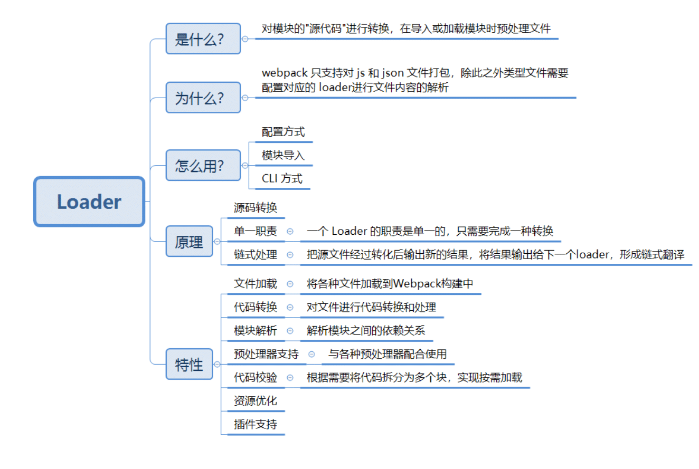
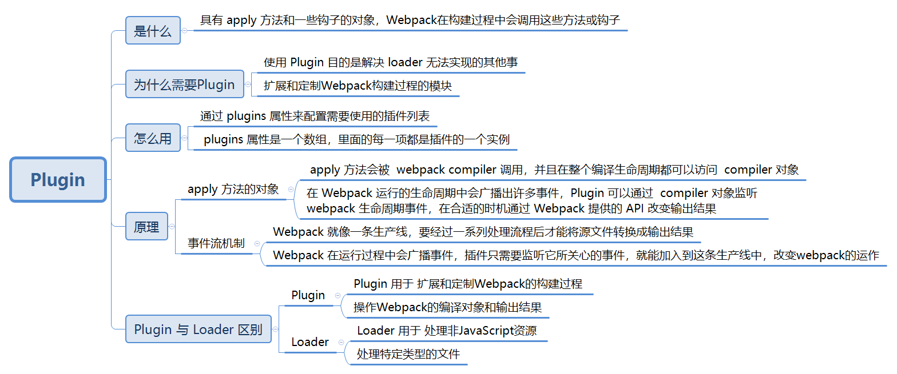

# Loader和Plugin原理

[TOC]


## Loader



### **Loader 是什么？**

>  `loader` 用于 对模块的"源代码"进行转换，在 `import` 或"加载"模块时预处理文件

### **为什么要 Loader?**

>  `webpack`只支持对`js` 和 `json` 文件打包，像`css`、`sass`、`png`等这些类型的文件的时候，`webpack` 需要配置对应的`loader`进行文件内容的解析

`webpack`做的事情，仅仅是分析出各种模块的依赖关系，然后形成资源列表，最终打包生成到指定的文件中。如下图所示：


在`webpack`内部中，任何文件都是模块，不仅仅只是`js`文件

默认情况下，在遇到`import`或者`require`加载模块的时候，`webpack`只支持对`js` 和 `json` 文件打包，像`css`、`sass`、`png`等这些类型的文件的时候，`webpack`则无能为力，这时候就需要配置对应的`loader`进行文件内容的解析

在加载模块的时候，执行顺序如下：


当 `webpack` 碰到不识别的模块的时候，`webpack` 会在配置的中查找该文件解析规则

### **Loader 怎么用？**

配置`loader`的方式有三种：

- 配置方式（推荐）：在 `webpack.config.js` 文件中指定 loader
- 模块导入：在每个 import 语句中显式指定 loader
- CLI 方式：在 shell 命令中指定它们


#### **配置 loader**

`loader`的配置，在`module.rules`属性中，属性介绍如下：

* `rules`属性: 数组的形式，配置多个`loader`；每一个`loader`对应一个对象的形式，对象属性`test` 为匹配的规则，一般情况为正则表达式；
* `test`属性: 正则表达式，匹配文件名称规则；
* `use` 属性:数组的形式，对匹配到文件类型，调用对应的 `loader` 进行处理，use 属性中**Loader 的执行顺序是由后到前的**

**loader 对象配置方式：**

```js
module.exports = {
  // ... 其他配置项
  module: {
    rules: [
      {
        test: /\.css$/,
        use: [
          { loader: 'style-loader' },
          {
            loader: 'css-loader',
            options: {
              modules: true
            }
          },
          { loader: 'sass-loader' }
        ]
      }
    ]
  }
};
```

**loader 数组配置方式：**

```js
 module.exports = {
     // ... 其他配置项
     module: {
        rules: [
          {
            // 用正则去匹配要用该 loader 转换的 CSS 文件
            test: /\.css$/,
            use: ['style-loader', 'css-loader?minimize'],
          }
        ]
      }
  }
```

> `loader`支持链式调用，链中的每个`loader`会处理之前已处理过的资源，最终变为`js`代码。顺序为相反的顺序执行，即上述执行方式为`sass-loader`、`css-loader`、`style-loader`

#### **模块导入**

在源码中引入 loader 

```js
//在源码中指定 Loader 去处理文件,这个文件先采用 css-loader 再采用 style-loader 转换 css
require('style-loader!css-loader?minimize!./main.css');
```


### **Loader 特性**

- **文件加载（File Loading）**：Webpack Loader可以帮助将各种文件加载到Webpack构建中，例如JavaScript文件、CSS文件、图像文件、字体文件等。它们可以处理不同类型的资源，并将其作为模块导入到应用程序中。loader 可以是同步的，也可以是异步的。

- **代码转换（Code Transformation）**：Webpack Loader可以对文件进行代码转换和处理。例如，通过Babel Loader，可以将ES6/ES7代码转换为ES5代码，以便在旧版浏览器中运行。通过CSS Loader和Style Loader，可以将CSS文件转换为JavaScript模块，并将其注入到页面中。loader 能够产生额外的任意文件。

- **模块解析（Module Resolution）**：Webpack Loader可以帮助解析模块之间的依赖关系。它们可以处理模块之间的引用，包括相对路径和绝对路径的解析，以及处理模块的别名和路径映射。

- **预处理器支持（Preprocessor Support）**：Webpack Loader可以与各种预处理器配合使用，如Sass、Less、Stylus等。通过相应的Loader，可以将预处理器语言转换为浏览器可识别的CSS。

- **代码校验（Code Validation）**：Webpack Loader可以进行代码校验，以提供更好的代码质量和可靠性。例如，通过ESLint Loader，可以集成ESLint进行JavaScript代码的静态分析和错误检查。

- **资源优化（Asset Optimization）**：Webpack Loader可以对资源进行优化，以提高应用程序的性能和加载速度。例如，通过Image Loader和File Loader，可以对图像和文件进行压缩、缓存和重命名等处理，以减小文件大小并提高加载速度。

- **插件支持（Plugin Support）**：Webpack Loader可以与Webpack插件一起使用，以提供更丰富的功能和扩展性。它们可以与各种插件配合使用，如热模块替换（Hot Module Replacement）插件、代码压缩插件等，以实现更高级的功能和优化。

  

### **Loader 原理？**

#### **源码转换**

 Webpack 是运行在 Node.js 之上的，一个 Loader 其实就是一个 Node.js 模块，这个模块需要导出一个函数。 这个导出的函数的工作就是获得处理前的原内容，对原内容执行处理后，返回处理后的内容。

Loader 函数具有以下特性：

> * 函数中的 `this` 作为上下文会被 `webpack` 填充，因此我们不能将 `loader`设为一个箭头函数；
>
> * 函数接受一个参数，为 `webpack` 传递给 `loader` 的文件源内容；
> * 函数中 `this` 是由 `webpack` 提供的对象，能够获取当前 `loader` 所需要的各种信息；
> * 函数中有异步操作或同步操作，异步操作通过 `this.callback` 返回，返回值要求为 `string` 或者 `Buffer`；

一个最简单的 Loader 的源码如下：

```js
module.exports = function(source) {
  // source 为 compiler 传递给 Loader 的一个文件的原内容
  // 该函数需要返回处理后的内容，这里简单起见，直接把原内容返回了，相当于该 Loader 没有做任何转换
  // 如果 loader 配置了 options 对象，那么this.query将指向 options
  const options = this.query;
    /*
     * this.callback 参数：
     * error：Error | null，当 loader 出错时向外抛出一个 error
     * content：String | Buffer，经过 loader 编译后需要导出的内容
     * sourceMap：为方便调试生成的编译后内容的 source map
     * ast：本次编译生成的 AST 静态语法树，之后执行的 loader 可以直接使用这个 AST，进而省去重复生成 AST 的过程
     */
  this.callback(null, source); // 异步
  return source;
};
```

由于 Loader 运行在 Node.js 中，你可以调用任何 Node.js 自带的 API，或者安装第三方模块进行调用：

```js
const sass = require('node-sass');
module.exports = function(source) {
  return sass(source);
};
```

#### **单一职责**

一个 Loader 的职责是单一的，只需要完成一种转换。 如果一个源文件需要经历多步转换才能正常使用，就通过多个 Loader 去转换。 在调用多个 Loader 去转换一个文件时，每个 Loader 会链式的顺序执行， 第一个 Loader 将会拿到需处理的原内容，上一个 Loader 处理后的结果会传给下一个接着处理，最后的 Loader 将处理后的最终结果返回给 Webpack。

所以，在开发一个 Loader 时，请保持其职责的单一性，你只需关心输入和输出。

#### **链式处理**

Loader 就像是一个翻译员，能把源文件经过转化后输出新的结果，将结果输出给下一个loader，形成链式翻译。

```js
module.exports = {
  module: {
    rules: [
      {
        // 增加对 SCSS 文件的支持
        test: /\.scss$/,
        // SCSS 文件的处理顺序为先 sass-loader 再 css-loader 再 style-loader
        use: [
          'style-loader',
          {
            loader:'css-loader',
            // 给 css-loader 传入配置项
            options:{
              minimize:true, 
            }
          },
          'sass-loader'],
      },
    ]
  },
};
```

以处理 SCSS 文件为例：

1. SCSS 源代码会先交给 sass-loader 把 SCSS 转换成 CSS；
2. 把 sass-loader 输出的 CSS 交给 css-loader 处理，找出 CSS 中依赖的资源、压缩 CSS 等；
3. 把 css-loader 输出的 CSS 交给 style-loader 处理，转换成通过脚本加载的 JavaScript 代码；

可以看出以上的处理过程需要有顺序的链式执行，先 sass-loader 再 css-loader 再 style-loader。

### **常见 Loader** 

- style-loader: 将css添加到DOM的内联样式标签style里
- css-loader :允许将css文件通过require的方式引入，并返回css代码
- less-loader: 处理less
- sass-loader: 处理sass
- postcss-loader: 用postcss来处理CSS
- autoprefixer-loader: 处理CSS3属性前缀，已被弃用，建议直接使用postcss
- file-loader: 分发文件到output目录并返回相对路径
- url-loader: 和file-loader类似，但是当文件小于设定的limit时可以返回一个Data Url
- html-minify-loader: 压缩HTML
- babel-loader :用babel来转换ES6文件到ES

### **手写 Loader**

下面编写一个 `print-loader.js` 为例，该 loader 作用为打印源码结果。

当编写Webpack Loader步骤：

1. **安装所需的依赖**：首先，需要安装必要的依赖，包括`loader-utils`和`schema-utils`。`loader-utils`提供了一些实用工具函数，`schema-utils`用于验证Loader的选项。

   ````bash
   npm install loader-utils schema-utils --save-dev

2. **创建Loader函数**：创建一个JavaScript文件，命名为`print-loader.js`，并编写Loader的逻辑。

   ````javascript
   const { getOptions } = require('loader-utils'); // 用于获取Loader的选项
   const { validate } = require('schema-utils'); // 用于验证Loader的选项
   const schema = require('./print-loader-options.json'); // 加载选项的JSON模式
   
   module.exports = function(source) {
     const options = getOptions(this); // 获取Loader的选项
     validate(schema, options, {
       name: 'Print Loader',
       baseDataPath: 'options',
     }); // 验证Loader的选项是否符合模式
   
     // 在源代码上添加打印结果
     const result = `console.log('Source Code:', ${JSON.stringify(source)});\n${source}`;
     // 通过 this.callback 告诉 Webpack 返回的结果
     this.callback(null, source, sourceMaps);
     // 当你使用 this.callback 返回内容时，该 Loader 必须返回 undefined，
     // 以让 Webpack 知道该 Loader 返回的结果在 this.callback 中，而不是 return 中 
     return result;
   };
   
   ````

   > 在这个示例中，我们将选项的模式定义在一个独立的JSON文件`print-loader-options.json`中。
   >
   > Loader函数接收一个`source`参数，表示输入的源代码。我们在源代码前面添加一个打印结果，然后返回修改后的源代码。
   >
   > 1. 使用`getOptions`函数从Webpack配置中获取Loader的选项。
   >
   > 2. 使用`validate`函数验证选项是否符合预定义的模式。
   >
   > 3. 通过 `this.callback` 告诉 Webpack 返回的结果.
   >
   >    其中的 `this.callback` 是 Webpack 给 Loader 注入的 API，以方便 Loader 和 Webpack 之间通信。 `this.callback` 的详细使用方法如下：
   >
   >    ```js
   >    this.callback(
   >        // 当无法转换原内容时，给 Webpack 返回一个 Error
   >        err: Error | null,
   >        // 原内容转换后的内容
   >        content: string | Buffer,
   >        // 用于把转换后的内容得出原内容的 Source Map，方便调试
   >        sourceMap?: SourceMap,
   >        // 如果本次转换为原内容生成了 AST 语法树，可以把这个 AST 返回，
   >        // 以方便之后需要 AST 的 Loader 复用该 AST，以避免重复生成 AST，提升性能
   >        abstractSyntaxTree?: AST
   >    );
   >    ```

3. **定义Loader的选项模式**：在与Loader文件相同的目录下，创建一个名为`print-loader-options.json`的JSON文件，并定义Loader的选项模式。

   ````json
   {
     "type": "object",
     "properties": {
       "optionName": {
         "type": "string"
         // 添加其他选项的定义...
       }
     },
     "additionalProperties": false
   }
   ````

   > 定义一个名为`optionName`的字符串类型选项。你可以根据自己的需求添加或修改选项的定义。

4. **配置Webpack**：在Webpack配置中，将我们编写的Loader应用于相应的模块。

   ````javascript
   module.exports = {
     // ...
     module: {
       rules: [
         {
           test: /\.js$/, // 匹配要应用Loader的文件类型,将`print-loader`应用于所有以`.js`结尾的文件，并传递了一个名为`optionName`的选项。
           use: [
             {
               loader: 'print-loader', // 使用我们编写的Loader
               options: {
                 optionName: 'example' // 传递Loader的选项
               }
             }
           ]
         }
       ]
     }
   };
   

现在，当Webpack构建过程中遇到匹配的`.js`文件时，将会应用我们编写的Loader。Loader将在源代码前面添加一个打印结果，然后返回修改后的源代码。


### 参考资料

[《深入浅出webpack - 编写 Loader》](https://webpack.wuhaolin.cn/5%E5%8E%9F%E7%90%86/5-3%E7%BC%96%E5%86%99Loader.html)


## Plugin




### **Plugin 是什么？**

Webpack插件通常**是一个JavaScript对象或类，它具有一些指定的方法或钩子**（hooks）。Webpack在构建过程中会调用这些方法或钩子，从而允许开发人员在不同的构建阶段执行自定义逻辑。

Webpack插件（Webpack plugins）是**用于扩展和定制Webpack构建过程的模块**。它们可以用来处理资源、优化输出、引入环境变量或者执行其他自定义操作。

Webpack插件通过在Webpack**构建流程的不同阶段注入自定义代码**来修改构建行为。这些插件可以在Webpack的配置文件中配置并应用于特定的构建任务。


### **为什么要 Plugin?**

**使用 Plugin 目的是解决`loader` 无法实现的其他事**

通过使用插件，开发人员可以轻松地**扩展和定制Webpack的功能**，以满足特定的项目需求。

一些常见的Webpack插件功能包括：

- **资源优化**：如压缩代码、混淆代码、拆分代码块、提取公共模块等。
- **文件处理**：如处理图片、字体、样式文件等。
- **环境变量注入**：根据构建环境注入不同的变量或配置。
- **代码检查**：如ESLint或Stylelint等代码规范检查工具的集成。
- **HTML生成**：生成HTML文件并自动注入构建后的资源。
- **自动化部署**：将构建结果自动部署到远程服务器或发布到CDN等。

### **Plugin 怎么用？**

通过 `plugins` 属性来配置需要使用的插件列表的。

 `plugins` 属性是一个数组，里面的每一项都是插件的一个实例，在实例化一个组件时可以通过构造函数传入这个组件支持的配置属性。

```js
const HtmlWebpackPlugin = require('html-webpack-plugin'); // 通过 npm 安装
const webpack = require('webpack'); // 访问内置的插件
module.exports = {
  ...
  plugins: [
    new webpack.ProgressPlugin(),
    new HtmlWebpackPlugin({ template: './src/index.html' }),
  ],
};
```


### **Plugin 原理？**

#### **具有`apply`方法的对象**

Plugin 其本质是一个**具有`apply`方法`javascript`对象**

`apply` 方法会被 `webpack compiler`调用，并且在整个编译生命周期都可以访问 `compiler`对象，在 Webpack 运行的生命周期中会广播出许多事件，Plugin 可以通过 `compiler`对象监听 webpack 生命周期事件，在合适的时机通过 Webpack 提供的 API 改变输出结果。

一个最基础的 Plugin 的代码：

```js
class BasicPlugin{
  // 在构造函数中获取用户给该插件传入的配置
  constructor(options){
  }

  // Webpack 会调用 BasicPlugin 实例的 apply 方法给插件实例传入 compiler 对象
  apply(compiler){
    //通过 `compiler`对象监听 webpack 生命周期事件
    compiler.plugin('compilation',function(compilation) {
    })
  }
}

// 导出 Plugin
module.exports = BasicPlugin;
```

在使用这个 Plugin 时，相关配置代码如下：

```js
const BasicPlugin = require('./BasicPlugin.js');
module.export = {
  plugins:[
    new BasicPlugin(options),
  ]
}
```

**过程：**

1. Webpack 启动后，在读取配置的过程中会先执行 `new BasicPlugin(options)` 初始化一个 BasicPlugin 获得其实例。 

2. 在初始化 compiler 对象后，再调用 `basicPlugin.apply(compiler)` 给插件实例传入 compiler 对象。 

   * > 在 webpack 开始编译时，执行了`run`方法后，首先会触发`compile`，构建一个`Compilation`对象。详细参考 [WebPack 原理解析 | Sewen 博客 (sewar-x.github.io)](https://sewar-x.github.io/webpack/webpack构建原理/#编译流程)

3. 插件实例在获取到 compiler 对象后，就可以通过 `compiler.plugin(事件名称, 回调函数)` 监听到 Webpack 广播出来的事件。 并且可以通过 compiler 对象去操作 Webpack。


#### **事件流机制**

Webpack 就像一条生产线，要经过一系列处理流程后才能将源文件转换成输出结果。 这条生产线上的每个处理流程的职责都是单一的，多个流程之间有存在依赖关系，只有完成当前处理后才能交给下一个流程去处理。 插件就像是一个插入到生产线中的一个功能，在特定的时机对生产线上的资源做处理。

Webpack 通过 [Tapable](https://github.com/webpack/tapable) 来组织这条复杂的生产线。 Webpack 在**运行过程中会广播事件**，插件只需要监听它所关心的事件，就能加入到这条生产线中，去改变生产线的运作。 Webpack 的事件流机制保证了插件的有序性，使得整个系统扩展性很好。

Webpack 的事件流机制应用了观察者模式，和 Node.js 中的 EventEmitter 非常相似。 Compiler 和 Compilation 都继承自 Tapable，可以直接在 Compiler 和 Compilation 对象上广播和监听事件;

Compiler 方法如下：

```js
/**
* 广播出事件
* event-name 为事件名称，注意不要和现有的事件重名
* params 为附带的参数
*/
compiler.apply('event-name',params);

/**
* 监听名称为 event-name 的事件，当 event-name 事件发生时，函数就会被执行。
* 同时函数中的 params 参数为广播事件时附带的参数。
*/
compiler.plugin('event-name',function(params) {

});
```

> `compiler hook` 的 `tap`方法的第一个参数，应是驼峰式命名的插件名称
>
> 关于整个编译生命周期钩子，有如下：
>
> - entry-option ：初始化 option
> - run
> - compile： 真正开始的编译，在创建 compilation 对象之前
> - compilation ：生成好了 compilation 对象
> - make 从 entry 开始递归分析依赖，准备对每个模块进行 build
> - after-compile： 编译 build 过程结束
> - emit ：在将内存中 assets 内容写到磁盘文件夹之前
> - after-emit ：在将内存中 assets 内容写到磁盘文件夹之后
> - done： 完成所有的编译过程
> - failed： 编译失败的时候


同理，compilation.apply 和 compilation.plugin 使用方法和上面一致。


> Compiler 和 Compilation 的区别在于：Compiler 代表了整个 Webpack 从启动到关闭的生命周期，而 Compilation 只是代表了一次新的编译。
>
> * Compiler 对象包含了 Webpack 环境所有的的配置信息，包含 options，loaders，plugins 这些信息，这个对象在 Webpack 启动时候被实例化，它是全局唯一的，可以简单地把它理解为 Webpack 实例;
> * 当 Webpack 以开发模式运行时，每当检测到一个文件变化，一次新的 Compilation 将被创建。Compilation 对象也提供了很多事件回调供插件做扩展。通过 Compilation 也能读取到 Compiler 对象。
>
> 详细参考[WebPack 原理解析 | Sewen 博客 (sewar-x.github.io)](https://sewar-x.github.io/webpack/webpack构建原理/#编译流程)


在开发插件时，还需要注意以下两点：

- 只要能拿到 Compiler 或 Compilation 对象，就能广播出新的事件，所以在新开发的插件中也能广播出事件，给其它插件监听使用。

- 传给每个插件的 Compiler 和 Compilation 对象都是同一个引用。也就是说在一个插件中修改了 Compiler 或 Compilation 对象上的属性，会影响到后面的插件。

- 有些事件是异步的，这些异步的事件会附带两个参数，第二个参数为回调函数，在插件处理完任务时需要调用回调函数通知 Webpack，才会进入下一处理流程。例如：

  ```js
    compiler.plugin('emit',function(compilation, callback) {
      // 支持处理逻辑
  
      // 处理完毕后执行 callback 以通知 Webpack 
      // 如果不执行 callback，运行流程将会一直卡在这不往下执行 
      callback();
    });
  ```

### Plugin 常用 API

下面是一些常见Webpack Plugin 编写过程中常用的一些方法和属性，用于监听构建事件、操作资源文件、记录警告和错误信息等。

| API                               | 描述                                                         |
| :-------------------------------- | :----------------------------------------------------------- |
| `apply(compiler)`                 | 定义插件的入口方法，接收Webpack的`compiler`对象作为参数      |
| `compiler.hooks.<hook>.tap`       | 注册钩子函数，监听Webpack构建过程中的特定事件                |
| `compilation.hooks.<hook>.tap`    | 注册钩子函数，监听每次构建过程中的特定事件                   |
| `compilation.assets`              | 用于操作构建过程中生成的资源文件，如添加、修改或删除生成的文件 |
| `compilation.errors`              | 记录构建过程中的错误信息                                     |
| `compilation.warnings`            | 记录构建过程中的警告信息                                     |
| `compilation.assets`              | 记录构建过程中生成的资源文件                                 |
| `compilation.chunks`              | 记录构建过程中生成的代码块                                   |
| `compilation.modules`             | 记录构建过程中的模块信息                                     |
| `compilation.dependencyGraph`     | 记录构建过程中的依赖关系图                                   |
| `compilation.addEntry`            | 添加入口文件到构建过程中，用于动态添加入口文件               |
| `compilation.addModule`           | 添加模块到构建过程中，用于动态添加模块                       |
| `compilation.updateAsset`         | 更新构建过程中生成的资源文件                                 |
| `compilation.emitAsset`           | 添加额外的生成资源文件到构建过程中                           |
| `compilation.errors.push`         | 向构建过程中的错误列表添加错误信息                           |
| `compilation.warnings.push`       | 向构建过程中的警告列表添加警告信息                           |
| `compilation.dependencyTemplates` | 记录和操作构建过程中的依赖模板                               |


#### 读取输出资源、代码块、模块及其依赖

有些插件可能需要读取 Webpack 的处理结果，例如输出资源、代码块、模块及其依赖，以便做下一步处理。

在 `emit` 事件发生时，代表源文件的转换和组装已经完成，在这里可以读取到最终将输出的资源、代码块、模块及其依赖，并且可以修改输出资源的内容。 

* `emit` 事件发生在 webpack 编译时，执行 run 方法时候触发，详细参考 [WebPack 原理解析 | Sewen 博客 (sewar-x.github.io)](https://sewar-x.github.io/webpack/webpack构建原理/#编译流程)

**`compilation` API 如下：**

##### **读取输出资源的API**

| API                            | 描述                                                         |
| :----------------------------- | :----------------------------------------------------------- |
| `compilation.assets`           | 访问构建过程中生成的资源文件，如获取、读取或操作生成的文件。 |
| `compilation.getAsset()`       | 获取指定名称的输出资源。                                     |
| `compilation.getAssets()`      | 获取所有输出资源的名称列表。                                 |
| `compilation.getAssetModule()` | 获取指定资源所属的模块对象。                                 |

##### **读取代码块的API**

| API                             | 描述                                 |
| :------------------------------ | :----------------------------------- |
| `compilation.chunks`            | **获取构建过程中生成的代码块列表。** |
| `compilation.getChunk()`        | 获取指定名称或ID的代码块对象。       |
| `compilation.getChunkModules()` | 获取指定代码块包含的模块列表。       |
| `compilation.chunkGraph`        | 获取代码块之间的依赖关系图。         |

##### **读取模块的API**

| API                       | 描述                           |
| :------------------------ | :----------------------------- |
| `compilation.modules`     | 获取构建过程中生成的模块列表。 |
| `compilation.getModule()` | 获取指定模块对象。             |
| `compilation.moduleGraph` | 获取模块之间的依赖关系图。     |

##### **读取模块依赖的API**

| API                                   | 描述                               |
| :------------------------------------ | :--------------------------------- |
| `compilation.dependencyGraph`         | 获取构建过程中的依赖关系图。       |
| `compilation.getDependency()`         | 获取指定依赖对象。                 |
| `compilation.getModuleDependencies()` | 获取指定模块的所有依赖列表。       |
| `compilation.getModuleIssuers()`      | 获取使用指定模块的所有代码块列表。 |

插件代码如下：

```js
class Plugin {
  apply(compiler) {
    compiler.plugin('emit', function (compilation, callback) {
      // compilation.chunks 存放所有代码块，是一个数组
      compilation.chunks.forEach(function (chunk) {
        // chunk 代表一个代码块
        // 代码块由多个模块组成，通过 chunk.forEachModule 能读取组成代码块的每个模块
        chunk.forEachModule(function (module) {
          // module 代表一个模块
          // module.fileDependencies 存放当前模块的所有依赖的文件路径，是一个数组
          module.fileDependencies.forEach(function (filepath) {
          });
        });

        // Webpack 会根据 Chunk 去生成输出的文件资源，每个 Chunk 都对应一个及其以上的输出文件
        // 例如在 Chunk 中包含了 CSS 模块并且使用了 ExtractTextPlugin 时，
        // 该 Chunk 就会生成 .js 和 .css 两个文件
        chunk.files.forEach(function (filename) {
          // compilation.assets 存放当前所有即将输出的资源
          // 调用一个输出资源的 source() 方法能获取到输出资源的内容
          let source = compilation.assets[filename].source();
        });
      });

      // 这是一个异步事件，要记得调用 callback 通知 Webpack 本次事件监听处理结束。
      // 如果忘记了调用 callback，Webpack 将一直卡在这里而不会往后执行。
      callback();
    })
  }
}
```

#### 监听文件变化

Webpack 会从配置的入口模块出发，依次找出所有的依赖模块，当入口模块或者其依赖的模块发生变化时， 就会触发一次新的 Compilation。

在开发插件时经常需要知道是哪个文件发生变化导致了新的 Compilation，通过监听`watch-run` 事件中 `watching.compiler.watchFileSystem.watcher.mtimes` 获取发生变化的文件列表

为此可以使用如下代码：

```js
// 当依赖的文件发生变化时会触发 watch-run 事件
compiler.plugin('watch-run', (watching, callback) => {
    // 获取发生变化的文件列表
    const changedFiles = watching.compiler.watchFileSystem.watcher.mtimes;
    // changedFiles 格式为键值对，键为发生变化的文件路径。
    if (changedFiles[filePath] !== undefined) {
      // filePath 对应的文件发生了变化
    }
    callback();
});
```

> * `watch-run` 发生在启动一次新的编译时候，在编译阶段执行。（详细参考 [WebPack 原理解析 | Sewen 博客 (sewar-x.github.io)](https://sewar-x.github.io/webpack/webpack构建原理/#编译流程)）
> * `watch-run` 是在监听模式下启动的编译，在这个事件中可以获取到是哪些文件发生了变化导致重新启动一次新的编译。

**监听 HTML 文件的变化：**

默认情况下 Webpack 只会监视入口和其依赖的模块是否发生变化。

在有些情况下项目可能需要引入新的文件，例如引入一个 HTML 文件。 由于 JavaScript 文件不会去导入 HTML 文件，Webpack 就不会监听 HTML 文件的变化，编辑 HTML 文件时就不会重新触发新的 Compilation。

 为了监听 HTML 文件的变化，我们需要把 HTML 文件加入到依赖列表中，为此可以使用如下代码：

```js
compiler.plugin('after-compile', (compilation, callback) => {
  // 把 HTML 文件添加到文件依赖列表，好让 Webpack 去监听 HTML 模块文件，在 HTML 模版文件发生变化时重新启动一次编译
    compilation.fileDependencies.push(filePath);
    callback();
});
```

> `after-compile` 发生在一次 Compilation 执行完成。在开始编译阶段，执行 run 方法中执行。

#### 修改输出资源

有些场景下插件需要修改、增加、删除输出的资源，要做到这点需要监听 `emit` 事件

因为发生 `emit` 事件时所有模块的转换和代码块对应的文件已经生成好， 需要输出的资源即将输出，因此 `emit` 事件是修改 Webpack 输出资源的最后时机。（`emit` 事件时将各个模块或chunk输出到结果文件）

所有需要输出的资源会存放在 `compilation.assets` 中，`compilation.assets` 是一个键值对，键为需要输出的文件名称，值为文件对应的内容。

设置 `compilation.assets` 的代码如下：

```js
compiler.plugin('emit', (compilation, callback) => {
  // 设置名称为 fileName 的输出资源
  compilation.assets[fileName] = {
    // 返回文件内容
    source: () => {
      // fileContent 既可以是代表文本文件的字符串，也可以是代表二进制文件的 Buffer
      return fileContent;
      },
    // 返回文件大小
      size: () => {
      return Buffer.byteLength(fileContent, 'utf8');
    }
  };
  callback();
});
```

读取 `compilation.assets` 的代码如下：

```js
compiler.plugin('emit', (compilation, callback) => {
  // 读取名称为 fileName 的输出资源
  const asset = compilation.assets[fileName];
  // 获取输出资源的内容
  asset.source();
  // 获取输出资源的文件大小
  asset.size();
  callback();
});
```

#### 判断 Webpack 使用了哪些插件

在开发一个插件时可能需要根据当前配置是否使用了其它某个插件而做下一步决定，因此需要读取 Webpack 当前的插件配置情况。

通过 `compiler.options.plugins` 获取当前配置所有使用的插件列表；

 以判断当前是否使用了 ExtractTextPlugin 为例，可以使用如下代码：

```js
// 判断当前配置使用使用了 ExtractTextPlugin，
// compiler 参数即为 Webpack 在 apply(compiler) 中传入的参数
function hasExtractTextPlugin(compiler) {
  // 当前配置所有使用的插件列表
  const plugins = compiler.options.plugins;
  // 去 plugins 中寻找有没有 ExtractTextPlugin 的实例
  return plugins.find(plugin=>plugin.__proto__.constructor === ExtractTextPlugin) != null;
}
```

### **手写 Plugin** 

**Plugin 规范：**

- 插件必须是一个函数或者是一个**包含 `apply` 方法的对象**，这样才能访问`compiler`实例;
- 传给每个插件的 `compiler` 和 `compilation` 对象都是同一个引用，因此不建议修改;
- 异步的事件需要在插件处理完任务时调用回调函数通知 `Webpack` 进入下一个流程，不然会卡住;


**题目：**

>  实现一个EndWebpackPlugin，该插件作用是在 Webpack 即将退出时再附加一些额外的操作，例如在 Webpack 成功编译和输出了文件后执行发布操作把输出的文件上传到服务器。 同时该插件还能区分 Webpack 构建是否执行成功。

使用该插件时方法：

```js
module.exports = {
  plugins:[
    // 在初始化 EndWebpackPlugin 时传入了两个参数，分别是在成功时的回调函数和失败时的回调函数；
    new EndWebpackPlugin(() => {
      // Webpack 构建成功，并且文件输出了后会执行到这里，在这里可以做发布文件操作
    }, (err) => {
      // Webpack 构建失败，err 是导致错误的原因
      console.error(err);        
    })
  ]
}
```


**分析：**

webpack 插件实际就是一个具有 apply 方法的对象，`apply` 方法会被 `webpack compiler`调用，并且在整个编译生命周期都可以访问 `compiler`对象。

要实现该插件，需要监听 webpack 的两个事件：

* **done**：在成功构建并且输出了文件后，Webpack 即将退出时发生；

* **failed**：在构建出现异常导致构建失败，Webpack 即将退出时发生；

**实现**

```js
class EndWebpackPlugin {

  constructor(doneCallback, failCallback) {
    // 存下在构造函数中传入的回调函数
    this.doneCallback = doneCallback; // 成功构建并且输出了文件后，Webpack 即将退出时回调
    this.failCallback = failCallback;// 在构建出现异常导致构建失败，Webpack 即将退出时回调
  }

  apply(compiler) {
    compiler.plugin('done', (stats) => {
        // 在 webpack done 事件中回调 doneCallback
        this.doneCallback(stats);
    });
    compiler.plugin('failed', (err) => {
        // 在 webpack failed 事件中回调 failCallback
        this.failCallback(err);
    });
  }
}
// 导出插件 
module.exports = EndWebpackPlugin;
```


### 常见的 Plugin

#### **HtmlWebpackPlugin**

在打包结束后，⾃动生成⼀个 `html` 文件，并把打包生成的`js` 模块引⼊到该 `html` 中

```bash
npm install --save-dev html-webpack-plugin
```

```js
// webpack.config.js
const HtmlWebpackPlugin = require("html-webpack-plugin");
module.exports = {
 ...
  plugins: [
     new HtmlWebpackPlugin({
       title: "My App",
       filename: "app.html",
       template: "./src/html/index.html"
     }) 
  ]
};
```

```html
<!--./src/html/index.html-->
<!DOCTYPE html>
<html lang="en">
<head>
    <meta charset="UTF-8">
    <meta name="viewport" content="width=device-width, initial-scale=1.0">
    <meta http-equiv="X-UA-Compatible" content="ie=edge">
    <title><%=htmlWebpackPlugin.options.title%></title>
</head>
<body>
    <h1>html-webpack-plugin</h1>
</body>
</html>
```

在 `html` 模板中，可以通过 `<%=htmlWebpackPlugin.options.XXX%>` 的方式获取配置的值

#### **clean-webpack-plugin**

删除（清理）构建目录

```bash
npm install --save-dev clean-webpack-plugin
```

```js
const {CleanWebpackPlugin} = require('clean-webpack-plugin');
module.exports = {
 ...
  plugins: [
    ...,
    new CleanWebpackPlugin(),
    ...
  ]
}
```

#### **mini-css-extract-plugin**

提取 `CSS` 到一个单独的文件中

```bash
npm install --save-dev mini-css-extract-plugin
```

```js
const MiniCssExtractPlugin = require('mini-css-extract-plugin');
module.exports = {
  //...,
  module: {
   rules: [
    {
     test: /\.s[ac]ss$/,
     use: [
      {
       loader: MiniCssExtractPlugin.loader
     },
          'css-loader',
          'sass-loader'
        ]
   }
   ]
 },
  plugins: [
    //...,
    new MiniCssExtractPlugin({
     filename: '[name].css'
    }),
    ...
  ]
}
```

#### DefinePlugin

允许在编译时创建配置的全局对象，是一个`webpack`内置的插件，不需要安装

```js
const { DefinePlugun } = require('webpack')

module.exports = {
  //...
    plugins:[
        new DefinePlugin({
            BASE_URL:'"./"'
        })
    ]
}
```

这时候编译`template`模块的时候，就能通过下述形式获取全局对象

```html
<link rel="icon" href="<%= BASE_URL%>favicon.ico>"
```

#### copy-webpack-plugin

复制文件或目录到执行区域，如`vue`的打包过程中，如果我们将一些文件放到`public`的目录下，那么这个目录会被复制到`dist`文件夹中

```text
npm install copy-webpack-plugin -D
```

```js
new CopyWebpackPlugin({
    parrerns:[
        {
            from:"public",
            globOptions:{
                ignore:[
                    '**/index.html'
                ]
            }
        }
    ]
})
```

复制的规则在`patterns`属性中设置：

- from：设置从哪一个源中开始复制
- to：复制到的位置，可以省略，会默认复制到打包的目录下
- globOptions：设置一些额外的选项，其中可以编写需要忽略的文件


## **Plugin 与 Loader 区别？**

Webpack插件（Webpack plugins）和加载器（loaders）在Webpack中扮演不同的角色，各自有不同的功能和用途。

**Plugin 的作用**：
Plugin 用于**扩展和定制Webpack的构建过程**。

它们可以对打包结果进行优化、自动化任务、资源管理等。插件通过在Webpack构建流程的不同阶段注入自定义代码来修改构建行为。例如，可以使用插件来压缩代码、拆分代码块、生成HTML文件、提取CSS等。插件是通过实现Webpack插件接口的JavaScript对象或类来定义的，它们具有一些指定的方法或钩子（hooks），Webpack在构建过程中会调用这些方法或钩子。

**Loader 的作用**：
Loader 用于**处理非JavaScript资源**，例如处理样式表、图片、字体等文件。

加载器可以将这些资源转换为Webpack可处理的模块，并将它们添加到依赖图中。加载器是通过使用正则表达式匹配特定类型的文件，并将其传递给相应的加载器进行处理的。加载器可以对资源进行转换、压缩、优化等操作，将其转换为可在JavaScript模块中导入的形式。

**区别：**

* **Plugin 改变 webpack 输出结果**：在`Webpack` 运行的生命周期中会广播出许多事件，`Plugin` 可以监听这些事件，在合适的时机通过`Webpack`提供的 `API`改变输出结果
* `loader`，实质是一个转换器，将A文件进行编译形成B文件，操作的是文件。比如将`A.scss`或`A.less`转变为`B.css`，单纯的文件转换过程；

两者在运行时机上的区别：

- loader 运行在打包文件之前
- plugins 在整个编译周期都起作用

| 特点               | Plugin                                                       | Loader                                                       |
| ------------------ | ------------------------------------------------------------ | ------------------------------------------------------------ |
| 功能和用途         | 扩展和定制Webpack构建过程，对打包结果进行优化、自动化任务、资源管理等 | 将非JavaScript资源转换为Webpack可处理的模块，如样式表、图片、字体等 |
| 配置方式           | 在Webpack配置文件中实例化并配置                              | 在模块规则中配置                                             |
| 处理对象           | 操作Webpack的编译对象和输出结果                              | 处理特定类型的文件                                           |
| 调用时机           | 在Webpack构建流程的不同阶段被调用                            | 文件被引入时被调用                                           |
| 示例               | UglifyJsPlugin、HtmlWebpackPlugin等                          | css-loader、file-loader、babel-loader等                      |
| 文件扩展和匹配规则 | 不涉及文件扩展和匹配规则                                     | 通过正则表达式匹配特定类型的文件                             |

