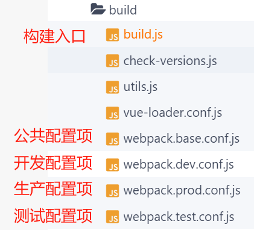

# Vue2.5 项目 webpack 构建分析

## **技术栈**

| 核心 库/插件 | 版本   |
| ------------ | ------ |
| vue          | ^2.5.2 |
| webpack      | ^3.6.0 |


## **源码分析**

### **构建命令**

项目构建从根目录 `package.json` 入口文件 `npm script` 开始，构建命令如下：

```shell
"dev": "cross-env NODE_ENV=development SERVER_ENV=development webpack-dev-server --inline --progress --config build/webpack.dev.conf.js", // 本地开发环境命令
"testing": "cross-env NODE_ENV=testing --config build/webpack.test.conf.js", //构建测试环境命令
"prod": "cross-env NODE_ENV=production --config build/webpack.prod.conf.js", // 构建生产环境命令
```

### **WebPack 目录分析**



### **构建入口分析**

项目构建入口文件为 `./build/build.js`：这段代码是用于生产环境的Webpack打包配置

```js

// 引入'use strict'，确保使用严格模式，这有助于捕捉错误和提高代码安全性  
'use strict'  
  
// 调用check-versions模块，检查项目所需的Node.js和npm版本是否满足要求  
require('./check-versions')()  
  
// 设置环境变量NODE_ENV为'production'，表示当前环境为生产环境  
process.env.NODE_ENV = 'production'  
  
// 引入ora模块，用于显示旋转的加载效果  
const ora = require('ora')  
  
// 引入rimraf模块，用于删除文件或目录  
const rm = require('rimraf')  
  
// 引入path模块，用于处理文件和目录路径  
const path = require('path')  
  
// 引入chalk模块，用于在控制台输出彩色文字  
const chalk = require('chalk')  
  
// 引入webpack模块，用于打包前端资源文件  
const webpack = require('webpack')  
  
// 引入项目配置文件，包含项目的一些基础配置信息  
const config = require('../config')  
  
// 引入webpack的配置文件，这个文件包含了webpack打包的详细配置信息  
const webpackConfig = require('./webpack.prod.conf')  
  
// 创建一个新的ora实例并开始显示旋转效果，提示用户正在进行生产环境的构建过程  
const spinner = ora('building for production...')  
spinner.start()  
  
// 删除构建产出的资源文件所在的目录，确保每次构建都是从干净的目录开始  
rm(path.join(config.build.assetsRoot, config.build.assetsSubDirectory), err => {  
  if (err) throw err  // 如果删除目录出错，抛出异常  
})  
  
// 使用webpack打包项目，使用上面引入的生产环境配置文件作为参数  
webpack(webpackConfig, (err, stats) => {  
  spinner.stop()  // 构建完成后停止旋转效果  
  if (err) throw err  // 如果打包出错，抛出异常  
  process.stdout.write(stats.toString({  // 将webpack的打包统计信息输出到控制台，并格式化显示  
    colors: true,  // 输出彩色信息  
    modules: false,  // 不显示每个模块的详细信息  
    children: false,  // 如果使用ts-loader，设置为true可以显示TypeScript的错误信息在构建过程中  
    chunks: false,  // 不显示每个块的信息  
    chunkModules: false  // 不显示每个块中的模块信息  
  }) + '\n\n')  
  
  if (stats.hasErrors()) {  // 如果打包过程中有错误发生  
    console.log(chalk.red(' Build failed with errors.\n'))  // 在控制台以红色文字输出错误信息，并终止程序执行  
    process.exit(1)  // 退出程序，返回状态码1表示错误  
  } else {  // 如果打包过程没有错误发生  
    console.log(chalk.cyan(' Build complete.\n'))  // 在控制台以青色文字输出构建完成的信息  
    console.log(chalk.yellow(  // 在控制台以黄色文字输出一些提示信息，告诉用户如何正确地打开构建完成后的文件（通过HTTP服务器而不是直接打开index.html文件）  
      ' Tip: built files are meant to be served over an HTTP server.\n' +   
      ' Opening index.html over file:// won\'t work.\n'   
    ))   
  }   
})  // 结束webpack打包回调函数，打包过程至此结束

```

> 以上代码主要执行两件事情：
>
> 1. 控制台输出信息；
>
> 2. webpack 构建资源：
>
>    ```js
>    webpack(webpackConfig, (err, stats) =>   {})
>    ```


### **检查版本文件分析**

检查版本脚本为 `./build/check-version.js`：这段代码主要用于检查运行项目的 Node.js 和 npm 的版本是否满足项目的要求。

以下是详细的逐行注释：

```javascript
// 使用严格模式，确保代码按照更严格的标准执行，帮助捕获错误并提高安全性。  
'use strict'  
  
// 引入chalk模块，用于在控制台输出彩色文字。  
const chalk = require('chalk')  
// 引入semver模块，用于处理语义化版本号。  
const semver = require('semver')  
// 引入项目的package.json文件，获取项目的配置信息。  
const packageConfig = require('../package.json')  
// 引入shelljs模块，用于执行shell命令。  
const shell = require('shelljs')  
  
// 定义一个函数exec，接受一个命令作为参数，并执行该命令，返回执行结果。  
function exec (cmd) {  
  return require('child_process').execSync(cmd).toString().trim()  
}  
  
// 创建一个数组，存储版本要求的信息。目前只包括Node.js的版本要求。  
const versionRequirements = [  
  {  
    name: 'node',  // 模块名称：node（Node.js）  
    currentVersion: semver.clean(process.version),  // 当前Node.js的版本号  
    versionRequirement: packageConfig.engines.node  // 项目要求的Node.js版本号  
  }  
]  
  
// 如果系统中安装了npm（Node.js包管理器），则添加npm的版本要求到versionRequirements数组中。  
if (shell.which('npm')) {  
  versionRequirements.push({  
    name: 'npm',  // 模块名称：npm  
    currentVersion: exec('npm --version'),  // 获取当前npm的版本号  
    versionRequirement: packageConfig.engines.npm  // 项目要求的npm版本号  
  })  
}  
  
// 导出一个函数，该函数用于检查版本要求并输出警告信息。  
module.exports = function () {  
  // 创建一个空数组，用于存储不满足版本要求的警告信息。  
  const warnings = []  
  
  // 遍历versionRequirements数组中的每个元素（每个元素包含模块名称、当前版本和版本要求）。  
  for (let i = 0; i < versionRequirements.length; i++) {  
    const mod = versionRequirements[i]  // 获取当前模块的信息  
  
    // 检查当前模块的当前版本是否满足项目的要求。如果不满足，则将警告信息添加到warnings数组中。  
    if (!semver.satisfies(mod.currentVersion, mod.versionRequirement)) {  
      warnings.push(mod.name + ': ' +  // 添加警告信息到warnings数组中，格式为模块名称加冒号加当前版本号。  
        chalk.red(mod.currentVersion) + ' should be ' +  // 当前版本号显示为红色。  
        chalk.green(mod.versionRequirement)  // 版本要求显示为绿色。  
      )  
    }  
  }  
  
  // 如果存在警告信息，则输出警告信息并退出程序。输出的警告信息包括需要更新的模块和其当前的版本号。程序返回状态码1表示错误。  
  if (warnings.length) {  
    console.log('')  // 输出一个空行。  
    console.log(chalk.yellow('To use this template, you must update following to modules:'))  // 输出提示信息，提示用户需要更新哪些模块的版本。颜色为黄色。  
    console.log()  // 输出一个空行。  
    for (let i = 0; i < warnings.length; i++) {  // 遍历warnings数组中的每个元素（每个元素是一个警告信息）。  
      const warning = warnings[i]  // 获取当前警告信息。  
      console.log('  ' + warning)  // 输出当前警告信息。前面添加两个空格，使输出格式整齐。  
    }  
    console.log()  // 输出一个空行。  
    process.exit(1)  // 退出程序，返回状态码1表示错误。  
  }  
}
```


### **工具脚本文件分析**

工具脚本 `./build/utils.js`：这段代码是用于配置Webpack的CSS和样式加载器，具体用于处理CSS、PostCSS、LESS、SASS、SCSS和Stylus等样式文件。

以下是详细的逐行注释：

```javascript
// 引入 'strict' 模式，确保代码按照更严格的标准执行，帮助捕获错误并提高安全性。  
'use strict'  
  
// 引入 'path' 模块，该模块提供一系列处理文件路径字符串的工具函数。  
const path = require('path')  
  
// 引入项目的配置文件。这个文件应该包含一些配置信息，例如环境变量、构建配置等。  
const config = require('../config')  
  
// 引入 'ExtractTextPlugin'，这是一个用于从JavaScript应用程序中提取CSS到单独的文件中的Webpack插件。  
const ExtractTextPlugin = require('extract-text-webpack-plugin')  
  
// 引入项目的 package.json 文件，获取项目的配置信息。  
const packageConfig = require('../package.json')  
  
// 定义一个函数 `assetsPath`，它接收一个路径参数，并返回该路径下的资源文件路径。根据当前环境（生产环境或开发环境），它返回不同的子目录。  
exports.assetsPath = function (_path) {  
  // 获取环境变量中的 'assetsSubDirectory'，如果当前环境是生产环境，则使用 'build.assetsSubDirectory'，否则使用 'dev.assetsSubDirectory'。  
  const assetsSubDirectory = process.env.NODE_ENV === 'production'  
    ? config.build.assetsSubDirectory  
    : config.dev.assetsSubDirectory  
  // 返回路径的规范化的绝对版本，它将 _path 添加到 assetsSubDirectory 的开头。  
  return path.posix.join(assetsSubDirectory, _path)  
}  
  
// 定义一个函数 `cssLoaders`，它接收一个选项对象，并返回一个包含各种CSS加载器的对象。这些加载器用于处理CSS、PostCSS、LESS、SASS、SCSS和Stylus样式文件。  
exports.cssLoaders = function (options) {  
  // 默认的选项对象。如果未提供选项，将使用此对象。  
  options = options || {}  
  // 定义一个包含 'css-loader' 和 'postcss-loader' 的对象。这两个加载器用于处理CSS和PostCSS。  
  const cssLoader = {  
    loader: 'css-loader', // 使用 'css-loader' 处理CSS文件。它使用CSS模块系统并支持源映射。  
    options: {  
      sourceMap: options.sourceMap // 使用或禁用源映射。如果提供了选项对象，则使用其 sourceMap 属性；否则禁用源映射。  
    }  
  }  
  const postcssLoader = {  
    loader: 'postcss-loader', // 使用 'postcss-loader' 处理PostCSS文件。PostCSS是一个用于CSS的插件系统。  
    options: {  
      sourceMap: options.sourceMap // 使用或禁用源映射。如果提供了选项对象，则使用其 sourceMap 属性；否则禁用源映射。  
    }  
  }  
  // 定义一个函数 `generateLoaders`，它接收一个加载器和一个加载器选项对象，并返回一个包含处理该样式文件的加载器的数组。如果提供了额外的加载器或选项对象，它们将添加到数组中。  
  function generateLoaders (loader, loaderOptions) {  
    // 根据是否使用PostCSS来设置加载器数组。如果使用PostCSS，则将 'css-loader' 和 'postcss-loader' 添加到数组中；否则只添加 'css-loader'。  
    const loaders = options.usePostCSS ? [cssLoader, postcssLoader] : [cssLoader]  
    // 如果提供了额外的加载器或选项对象，则将其添加到加载器数组中。这里假设 loader 是加载器的名称，并且 loaderOptions 是加载器的选项对象。  
    if (loader) {  
      loaders.push({  
        loader: loader + '-loader', // 将提供的加载器名称添加为后缀 '-loader' 来创建完整的加载器名称。例如，如果 loader 是 'less'，则 loader 将是 'less-loader'。  
        options: Object.assign({}, loaderOptions, { // 将提供的选项对象与默认选项合并。如果提供了 loaderOptions，则使用它们；否则使用默认选项（这里没有默认选项）。  
          sourceMap: options.sourceMap // 使用或禁用源映射。如果提供了选项对象，则使用其 sourceMap 属性；否则禁用源映射。  
        })  
      })  
    }  
  // 如果在选项中启用了提取样式（extract），则使用 ExtractTextPlugin 将样式提取到单独的文件中。  
  // (这通常在生产构建过程中发生)  
  if (options.extract) {  
    return ExtractTextPlugin.extract({  
      use: loaders, // 使用先前生成的加载器数组。  
      fallback: 'vue-style-loader', // 如果发生错误，回退使用 vue-style-loader。  
      publicPath: '../../' // 解决打包后element-ui图标丢失问题。指定资源在打包后的输出目录中的位置。  
    })  
  } else {  
    return ['vue-style-loader'].concat(loaders) // 否则，将 'vue-style-loader' 添加到加载器数组的开头并返回结果。  
  }  
}  
  
// 以下代码块为各种样式文件类型生成对应的加载器配置。  
return {  
  css: generateLoaders(), // 为CSS文件生成加载器配置。  
  postcss: generateLoaders(), // 为PostCSS文件生成加载器配置。  
  less: generateLoaders('less'), // 为LESS文件生成加载器配置。  
  sass: generateLoaders('sass', { indentedSyntax: true }), // 为SASS文件（使用缩进语法）生成加载器配置。  
  scss: generateLoaders('sass'), // 为SCSS文件（使用嵌套语法）生成加载器配置。  
  stylus: generateLoaders('stylus'), // 为Stylus文件生成加载器配置。  
  styl: generateLoaders('stylus') // 为Stylus文件（已废弃的名称）生成加载器配置。  
}  
} // 结束函数定义。  
  
// 生成用于处理独立样式文件的加载器配置（不包含在.vue文件中）。  
exports.styleLoaders = function (options) {  
  const output = [] // 创建一个空数组来存储加载器配置。  
  const loaders = exports.cssLoaders(options) // 从cssLoaders函数获取加载器配置。  
  
  // 遍历每个扩展名和对应的加载器配置。  
  for (const extension in loaders) {  
    const loader = loaders[extension] // 获取当前扩展名的加载器配置。  
    output.push({ // 将加载器配置添加到输出数组中。  
      test: new RegExp('\\.' + extension + '$'), // 设置正则表达式来匹配当前扩展名的文件。  
      use: loader // 使用当前扩展名的加载器配置来处理匹配的文件。  
    })  
  }  
  
  return output // 返回包含所有加载器配置的数组。  
}  

// 导出名为 'createNotifierCallback' 的函数。这个函数返回一个回调函数，该回调函数在出现错误时发送通知。  
exports.createNotifierCallback = () => {  
  // 引入 'node-notifier' 模块，这是一个用于在终端上发送通知的库。  
  const notifier = require('node-notifier')  
  
  // 返回一个回调函数，该函数接收两个参数：'severity' 和 'errors'。  
  return (severity, errors) => {   
    // 如果严重性不是 'error'，则不执行任何操作并直接返回。  
    if (severity !== 'error') return  
  
    // 获取错误数组中的第一个错误对象。  
    const error = errors[0]  
      
    // 从错误对象的 'file' 属性中获取文件名。如果 'file' 属性存在，则使用 'split' 方法分割字符串并取最后一个元素作为文件名。  
    const filename = error.file && error.file.split('!').pop()  
  
    // 使用 'node-notifier' 模块发送通知。通知的内容包括标题、消息、副标题和图标。  
    notifier.notify({  
      title: packageConfig.name, // 通知的标题来自 'packageConfig.name' 属性。  
      message: severity + ': ' + error.name, // 通知的消息是严重性和错误的名称。  
      subtitle: filename || '', // 通知的副标题是文件名，如果文件名为空，则使用空字符串。  
      icon: path.join(__dirname, 'logo.png') // 通知的图标是项目目录下名为 'logo.png' 的文件。  
    })  
  }  
}
```

#### **工具类配置插件**

> |          插件名称           |                            描述                             |
> | :-------------------------: | :---------------------------------------------------------: |
> |      HtmlWebpackPlugin      | 用于简化创建和配置 HTML 文件，以加载 webpack 打包后的资源。 |
> |    MiniCssExtractPlugin     |   将 CSS 从 JavaScript 中分离出来，生成单独的 CSS 文件。    |
> |      CopyWebpackPlugin      |                 复制文件和目录到输出目录。                  |
> |      WebpackBarPlugin       |     提供一个 progress bar，用于展示 webpack 编译过程。      |
> | FriendlyErrorsWebpackPlugin |     显示友好的错误信息，帮助开发者快速定位和解决问题。      |
> |     webpack-dev-server      |           提供开发服务器，支持热更新等开发特性。            |


### **WebPack 基础配置**

WebPack 基础配置项位于 `./build/webpack.base.conf.js` 中：

```js
'use strict' // 使用严格模式，以避免某些JavaScript错误。  

const path = require('path') // 引入Node.js的path模块，用于处理文件和目录路径。  

const utils = require('./utils') // 引入当前目录下的utils模块。  

const config = require('../config') // 引入上一级目录下的config模块，通常包含项目的配置信息。  

const vueLoaderConfig = require('./vue-loader.conf') // 引入当前目录下的vue-loader.conf模块，可能是Vue文件的loader配置。  

function resolve(dir) { // 定义一个resolve函数，用于将相对路径转换为绝对路径。  
    return path.join(__dirname, '..', dir) // 使用path模块的join方法，将当前文件的目录（__dirname）、上一级目录（'..'）和传入的dir参数合并成一个绝对路径。  
}

const createLintingRule = () => ({ // 定义一个createLintingRule函数，用于创建linting规则。  
    test: /\.(js|vue)$/, // 设置规则匹配的文件类型，这里是匹配所有以.js或.vue结尾的文件。  
    loader: 'eslint-loader', // 设置使用eslint-loader来处理这些文件。eslint-loader是一个Webpack loader，用于ESLint代码检查。  
    enforce: 'pre', // 在文件被其他loader处理之前强制执行这个linting规则。  
    include: [resolve('src'), resolve('test')], // 设置要包含哪些文件或目录进行linting，这里是通过resolve函数将相对路径转换为绝对路径，包括'src'和'test'目录下的文件。  
    options: { // 设置eslint-loader的选项。  
        formatter: require('eslint-friendly-formatter'), // 设置ESLint的输出格式，这里使用eslint-friendly-formatter，使输出结果更易于阅读。  
        emitWarning: !config.dev.showEslintErrorsInOverlay // 如果config.dev.showEslintErrorsInOverlay为false，则eslint-loader会发出警告而不是错误。这通常用于开发环境，以避免在错误提示中覆盖其他重要的信息。  
    }
})

module.exports = {
    // 配置文件的基础路径，通常为项目的根目录  
    context: path.resolve(__dirname, '../'),

    // 定义入口文件，这里是主应用程序的JavaScript文件  
    entry: {
        app: './src/main.js'
    },

    // 配置输出文件的路径和名称格式  
    output: {
        // 输出文件的路径，通常为构建目录下的assets文件夹  
        path: config.build.assetsRoot,
        // 每个入口点对应的输出文件名，这里使用入口文件的名字加上.js后缀  
        filename: '[name].js',
        // 配置发布到线上资源的 URL 前缀  
        publicPath: process.env.NODE_ENV === 'production' // 判断当前环境是否为生产环境  
            ? config.build.assetsPublicPath // 如果是，使用生产环境的资源前缀  
            : config.dev.assetsPublicPath // 否则，使用开发环境的资源前缀  
    },

    // 解析模块时使用的别名和扩展名  
    resolve: {
        // 自动解析的文件扩展名列表，这里是解析 .js, .vue 和 .json 文件  
        extensions: ['.js', '.vue', '.json'],
        // 在解析模块时查找的目录列表，这里使用绝对路径来指定 node_modules 的位置，以提高性能  
        modules: [resolve('node_modules')],
        // 别名配置，用于简化模块路径的引用  
        alias: {
            // 使用别名 'vue$' 来引用 Vue 的 ESM 格式的入口文件  
            'vue$': 'vue/dist/vue.esm.js',
            // 使用别名 '@' 来引用 src 目录，通常用于引用项目源代码目录下的模块和文件  
            '@': resolve('src')
        }
    },
    module: {
        // 配置规则，用于告诉Webpack如何处理不同类型的文件  
        rules: [
            // 如果config.dev.useEslint为true，则添加linting规则，否则不添加  
            ...(config.dev.useEslint ? [createLintingRule()] : []),
            //针对.vue文件  
            {
                test: /\.vue$/, // 匹配所有以.vue结尾的文件  
                loader: 'vue-loader', // 使用vue-loader来处理这些文件，vue-loader是用来将Vue单文件组件编译成JavaScript模块的加载器  
                include: [resolve('src/views'), resolve('src/components')], // 指定vue-loader要处理的文件路径，只处理src/views和src/components目录下的.vue文件，减小webpack搜索范围，提高构建速度  
                options: vueLoaderConfig // 使用vueLoaderConfig来配置vue-loader的行为  
            },
            // 针对.js文件  
            {
                test: /\.js$/, // 匹配所有以.js结尾的文件  
                loader: 'babel-loader', // 使用babel-loader来处理这些文件，babel-loader是用来将ES6+代码转化为ES5代码的加载器，使得不支持ES6的浏览器也能运行ES6代码  
                include: [resolve('src'), resolve('node_modules/webpack-dev-server/client')], // 指定babel-loader要处理的文件路径，包括src目录和webpack-dev-server的client模块目录  
            },
            //针对图片文件  
            {
                test: /\.(png|jpe?g|gif|svg)(\?.*)?$/, // 匹配所有图片文件（png、jpg、jpeg、gif、svg）和可能带查询参数的文件  
                loader: 'url-loader', // 使用url-loader来处理这些文件，url-loader可以将小于limit的资源转为base64字符串，提高资源加载速度  
                include: [resolve('src')], // 指定url-loader要处理的文件路径，只处理src目录下的图片文件  
                exclude: [resolve('src/icons/svg')], // 不处理src/icons/svg目录下的文件  
                options: { // url-loader的配置选项  
                    limit: 10000, // 转为base64字符串的图片文件大小限制为10000字节  
                    name: utils.assetsPath('img/[name].[hash:7].[ext]') // 输出文件的路径和名称格式，使用7位哈希值来防止缓存问题，保留文件扩展名  
                }
            },
            // 针对SVG图标文件  
            {
                test: /\.svg$/, // 匹配所有SVG图标文件  
                loader: 'svg-sprite-loader', // 使用svg-sprite-loader来处理这些文件，svg-sprite-loader是一个用于将多个SVG图标编译成一个精灵图的加载器，可以提高性能和减少HTTP请求数  
                include: [resolve('src/icons/svg')], // 指定svg-sprite-loader要处理的文件路径，只处理src/icons/svg目录下的SVG图标文件  
                options: { // svg-sprite-loader的配置选项  
                    symbolId: 'icon-[name]' // 生成的精灵图的symbol ID格式为icon-[文件名]  
                }
            },
            //针对媒体文件（视频和音频）  
            {
                test: /\.(mp4|webm|ogg|mp3|wav|flac|aac)(\?.*)?$/, // 匹配所有媒体文件（mp4、webm、ogg、mp3、wav、flac、aac）和可能带查询参数的文件  
                loader: 'url-loader', // 使用url-loader来处理这些文件，同上文所述url-loader的作用  
                options: { // url-loader的配置选项，同上文所述url-loader的配置选项  
                    limit: 10000, // 转为base64字符串的媒体文件大小限制为10000字节  
                    name: utils.assetsPath('media/[name].[hash:7].[ext]') // 输出文件的路径和名称格式，同上文所述输出文件的路径和名称格式  
                }
            },
            //针对字体文件（woff2、eot、ttf、otf）  
            {
                test: /\.woff2?|eot|ttf|otf$/, // 匹配所有字体文件（woff, woff2, eot, ttf, otf）  
                loader: 'url-loader', // 使用url-loader来处理这些文件，url-loader可以将小于limit的资源转为base64字符串，提高资源加载速度  
                options: { // url-loader的配置选项  
                    limit: 10000, // 转为base64字符串的字体文件大小限制为10000字节  
                    name: utils.assetsPath('fonts/[name].[hash:7].[ext]') // 输出文件的路径和名称格式，使用7位哈希值来防止缓存问题，保留文件扩展名  
                }
            },
            {  // 开始一个新的规则对象  
                test: /\.scss$ /, // 匹配所有以.scss结尾的文件  
                include: [resolve('src/styles'), resolve('src/views')], // 指定该规则应用于哪些文件，只处理src/styles和src/views目录下的.scss文件，减小webpack搜索范围，提高构建速度  
                loaders: ['style', 'css', 'sass'] // 使用style-loader、css-loader和sass-loader来处理这些文件，分别将样式添加到<style>标签、将CSS转换为JS对象、将SCSS转换为CSS  
            }
        ]
    },
    node: {
        // prevent webpack from injecting useless setImmediate polyfill because Vue
        // source contains it (although only uses it if it's native).
        setImmediate: false,
        // prevent webpack from injecting mocks to Node native modules
        // that does not make sense for the client
        dgram: 'empty',
        fs: 'empty',
        net: 'empty',
        tls: 'empty',
        child_process: 'empty'
    }
}

```

#### **基础配置中使用的loader**

> |      插件      |                             描述                             |
> | :------------: | :----------------------------------------------------------: |
> |  `url-loader`  | 用于处理字体文件（如woff, woff2, eot, ttf, otf）和图片文件。<br />它可以将小于`limit`字节的资源转为base64字符串，提高资源加载速度。<br />在此配置中，限制为10000字节。 |
> | `style-loader` | 将样式添加到HTML页面中的`<style>`标签中，使得样式可以在浏览器中呈现。 |
> |  `css-loader`  | 将CSS转化为JS对象，使得CSS的样式可以直接在JavaScript中引用和操作。 |
> | `sass-loader`  | 将SCSS转化为CSS，SCSS是一种CSS预处理器，它提供了更多的功能和语法糖，使得CSS编写更加便捷。 |


### **Webpack 开发配置**

```js
// 使用严格模式，启用所有ECMAScript的严格类型检查  
'use strict'

// 引入一个名为utils的模块，是一个自定义工具模块，包含了各种实用函数  
const utils = require('./utils')

// 引入webpack模块，webpack是一个模块打包工具，可以将许多模块打包成一个或多个bundle  
const webpack = require('webpack')

// 引入项目配置文件，这通常包含了一些全局配置信息  
const config = require('../config')

// 引入webpack-merge模块，用于合并webpack配置  
const merge = require('webpack-merge')

// 引入path模块，提供了处理文件和目录路径的函数  
const path = require('path')

// 引入webpack的基础配置文件，这个文件通常包含了webpack运行所需的基本设置和插件  
const baseWebpackConfig = require('./webpack.base.conf')

// 引入copy-webpack-plugin插件，这个插件可以复制文件到输出目录中  
const CopyWebpackPlugin = require('copy-webpack-plugin')

// 引入html-webpack-plugin插件，这个插件可以简化生成HTML文件的过程，并自动将生成的脚本和样式链接到HTML文件中  
const HtmlWebpackPlugin = require('html-webpack-plugin')

// 引入friendly-errors-webpack-plugin插件，这个插件可以在控制台中提供更友好的错误信息  
const FriendlyErrorsPlugin = require('friendly-errors-webpack-plugin')

// 引入portfinder模块，这个模块可以帮助自动选择一个可用的端口号  
const portfinder = require('portfinder')

// 从环境变量中获取HOST值，是开发服务器的地址  
const HOST = process.env.HOST

// 检查环境变量中是否存在PORT值，如果存在则将其转换为数字类型并赋值给PORT变量，是开发服务器的端口号  
const PORT = process.env.PORT && Number(process.env.PORT)

// 使用webpack-merge来合并基础配置与开发配置  
const devWebpackConfig = merge(baseWebpackConfig, {

    // 针对CSS模块的加载器配置，这里使用了一些工具如source map和PostCSS来优化样式处理  
    module: {
        rules: utils.styleLoaders({
            sourceMap: config.dev.cssSourceMap, // 是否开启CSS源码映射，有助于开发者调试样式  
            usePostCSS: true // 使用PostCSS来处理CSS，可以添加插件进行自动前缀、颜色变量替换等  
        })
    },

    // 定义开发模式下使用的source map类型。这里选择的是"cheap-module-eval-source-map"，它对于开发更快速  
    devtool: config.dev.devtool,

    // 定义webpack devServer的配置选项  
    devServer: {
        // 控制台日志级别，这里设置为警告，意味着只显示警告和错误信息  
        clientLogLevel: 'warning',

        // 当请求某些路由时，返回index.html，这对于单页应用(SPA)是很有用的，确保所有路由都返回index.html  
        historyApiFallback: {
            rewrites: [
                { from: /.*/, to: path.posix.join(config.dev.assetsPublicPath, 'index.html') }
            ]
        },

        // 开启模块热替换模式，当模块改变时自动更新页面，无需手动刷新  
        hot: true,

        // 由于使用了CopyWebpackPlugin来复制静态资源，所以这里设置为false，避免与CopyWebpackPlugin产生冲突  
        contentBase: false,

        // 启用压缩，减少传输的数据量  
        compress: true,

        // 开发服务器绑定的主机地址，如果未设置则使用默认值或config中的值  
        host: HOST || config.dev.host,

        // 开发服务器绑定的端口号，如果未设置则使用默认值或config中的值  
        port: PORT || config.dev.port,

        // 自动打开浏览器窗口来显示应用，需要安装open-browser-webpack-plugin插件  
        open: config.dev.autoOpenBrowser,

        // 在控制台中显示覆盖层，当有编译错误时显示，而不是只显示警告。需要安装webpack-dev-server-side-overlay插件。  
        overlay: config.dev.errorOverlay ? { warnings: false, errors: true } : false,

        // 公共资源路径，所有输出文件都会放在这个路径下。这里是配置中的assetsPublicPath值。  
        publicPath: config.dev.assetsPublicPath,

        // 定义代理规则，例如对于某些请求重定向到其他服务器或端口。这里是配置中的proxyTable值。  
        proxy: config.dev.proxyTable,

        // 必要的设置，使得FriendlyErrorsPlugin可以正常工作。这个插件使得错误信息更友好、更易读。  
        quiet: true,

        // 设置watch的选项。这里设置了poll属性为true，意味着使用轮询的方式检查文件改动（代替了默认的fs watch）。同时忽略node_modules目录下的文件改动。  
        watchOptions: {
            poll: config.dev.poll,
            ignored: /node_modules/
        }
    },
    // 定义使用的插件列表，包括各种webpack插件和自定义插件。这些插件用来完成各种任务，如定义全局变量、热替换、错误处理等。  
    plugins: [
        //定义全局变量
        new webpack.DefinePlugin({
            'process.env': require('../config/dev.env')
        }),
        new webpack.HotModuleReplacementPlugin(),//热替换
        new webpack.NamedModulesPlugin(), // 模块热替换文件名替换插件 HMR shows correct file names in console on update.
        new webpack.NoEmitOnErrorsPlugin(),
        // https://github.com/ampedandwired/html-webpack-plugin
        new HtmlWebpackPlugin({
            filename: 'index.html',
            template: 'index.html',
            inject: true
        }),
        // 复制静态资源插件
        new CopyWebpackPlugin([
            {
                from: path.resolve(__dirname, '../static'),
                to: config.dev.assetsSubDirectory,
                ignore: ['.*']
            }
        ])
    ]
})

module.exports = new Promise((resolve, reject) => {
    portfinder.basePort = process.env.PORT || config.dev.port
    portfinder.getPort((err, port) => {
        if (err) {
            reject(err)
        } else {
            // publish the new Port, necessary for e2e tests
            process.env.PORT = port
            // add port to devServer config
            devWebpackConfig.devServer.port = port

            // Add FriendlyErrorsPlugin
            devWebpackConfig.plugins.push(new FriendlyErrorsPlugin({
                compilationSuccessInfo: {
                    messages: [`Your application is running here: http://${devWebpackConfig.devServer.host}:${port}`]
                },
                onErrors: config.dev.notifyOnErrors
                    ? utils.createNotifierCallback()
                    : undefined
            }))

            resolve(devWebpackConfig)
        }
    })
})

```

#### **开发配置中使用插件**

> | **插件**                               | **作用**                                                     |
> | -------------------------------------- | ------------------------------------------------------------ |
> | **`webpack-merge`**                    | 用于合并webpack配置                                          |
> | **`copy-webpack-plugin`**              | 复制文件到输出目录中                                         |
> | **`html-webpack-plugin`**              | 简化生成HTML文件的过程，并自动将生成的脚本和样式链接到HTML文件中 |
> | **`friendly-errors-webpack-plugin`**   | 在控制台中提供更友好的错误信息                               |
> | **`portfinder`模块**                   | 帮助自动选择一个可用的端口号                                 |
> | **webpack.DefinePlugin**               | 定义全局变量，让你在编译时定义可配置的全局常量，这对于在多个地方使用相同的值非常有用。 |
> | **webpack.HotModuleReplacementPlugin** | 在开发过程中自动替换或注入更新的模块或资源，这对于动态内容和用户交互非常有用。 |
> | **webpack.NamedModulesPlugin**         | 使得模块热替换时文件名会替换，使得HMR（Hot Module Replacement）在更新时在控制台显示正确的文件名。 |
> | **webpack.NoEmitOnErrorsPlugin**       | 当在编译过程中出现错误时，阻止webpack从输出目录中写入文件，这样当有错误发生时，不会生成有错误的包。 |
> | **HtmlWebpackPlugin**                  | 根据webpack入口文件和配置，自动生成HTML文件，这样你就不需要手动创建HTML文件，并在其中引用所有你的js文件了。 |
> | **CopyWebpackPlugin**                  | 复制静态资源到输出目录，这对于复制如字体、图片等静态资源非常有用。 |


### **WebPack 生产配置**

```js
'use strict'; // 使用严格模式，确保代码按照ECMAScript规范执行，不会因为某些不严格的行为而出错。  

const path = require('path') // 引入Node.js的path模块，提供处理文件和目录路径的工具。  

const utils = require('./utils') // 引入当前目录下的utils模块，通常包含一些工具函数。  

const webpack = require('webpack') // 引入webpack模块，这是我们用来构建应用程序的工具。  

const config = require('../config') // 引入上一级目录的config模块，通常包含一些配置信息。  

const merge = require('webpack-merge') // 引入webpack-merge模块，用于合并webpack的配置对象。  

const baseWebpackConfig = require('./webpack.base.conf') // 引入当前目录下的webpack.base.conf模块，作为webpack的基础配置。  

const CopyWebpackPlugin = require('copy-webpack-plugin') // 引入copy-webpack-plugin插件，用于复制静态资源到输出目录。  

const HtmlWebpackPlugin = require('html-webpack-plugin') // 引入html-webpack-plugin插件，用于根据webpack的入口文件生成HTML文件。  

const ExtractTextPlugin = require('extract-text-webpack-plugin') // 引入extract-text-webpack-plugin插件，用于将CSS样式从JavaScript文件中提取出来。  

const OptimizeCSSPlugin = require('optimize-css-assets-webpack-plugin') // 引入optimize-css-assets-webpack-plugin插件，用于优化CSS资源。  

const UglifyJsPlugin = require('uglifyjs-webpack-plugin') // 引入uglifyjs-webpack-plugin插件，用于压缩JavaScript代码。  

const SentryCliPlugin = require('@sentry/webpack-plugin') // 引入@sentry/webpack-plugin插件，用于集成Sentry错误追踪系统。  

const env = require('../config/prod.env') // 引入上一级目录的prod.env模块，通常包含生产环境下的配置信息。

// 定义一个名为webpackConfig的常量，并将baseWebpackConfig与另一个配置对象合并。  
const webpackConfig = merge(baseWebpackConfig, {
    // 配置模块处理规则  
    module: {
        // 配置样式加载器规则，用于处理样式文件  
        rules: utils.styleLoaders({
            // 决定是否生成源映射，用于开发阶段的调试  
            sourceMap: config.build.productionSourceMap,
            // 指示webpack从JavaScript文件中提取CSS样式，而不是内联它们  
            extract: true,
            // 使用PostCSS处理CSS文件，通过插件进行各种CSS优化和标准化  
            usePostCSS: true
        })
    },
    // 配置开发工具，用于生成源映射，帮助开发者在生产版本的代码中进行调试  
    devtool: config.build.productionSourceMap ? config.build.devtool : false,
    // 配置输出设置，定义构建后文件的输出路径和名称格式  
    output: {
        // 设置输出文件的路径，使用config中的assetsRoot作为输出目录  
        path: config.build.assetsRoot,
        // 定义输出文件的名称格式，使用哈希值确保文件名的唯一性，并有助于缓存管理  
        filename: utils.assetsPath('js/[name].[chunkhash].js'),
        // 定义chunk文件的名称格式，用于按需加载或分发应用程序的不同部分  
        chunkFilename: utils.assetsPath('js/[id].[chunkhash].js')
    },
    plugins: [
        /**
         * 该插件可配置sourcemap并将其在构建过程中上载到 Sentry
         * https://github.com/getsentry/sentry-webpack-plugin
         */
        new SentryCliPlugin({
            include: path.resolve(__dirname, '../../resources/webui'), // 作用的文件夹,它将上传所有.map文件并匹配关联的.js文件
            release: process.env.RELEASE_VERSION, // 发行的版本号
            configFile: '../.sentryclirc', // 配置文件地址
            ignore: ['node_modules', 'webpack.config.js'], // 上传过程中要忽略的一条或多条路径。覆盖ignoreFile文件中的条目
            urlPrefix: '~/'
        }),
        /**
         * http://vuejs.github.io/vue-loader/en/workflow/production.html
         * 当代码中没有使用 process 时就不会打包进 process 模块的代码。这个注入的 process 模块作用是为了模拟 Node.js 中的 process，以支持使用的 process.env.NODE_ENV
         * 定义的环境变量的值被代入到了源码中,Webpack 也不会打包进 process 模块了
         *通过 Shell 脚本的方式去定义的环境变量，例如 NODE_ENV=production webpack，Webpack 是不认识的，对 Webpack 需要处理的代码中的环境区分语句是没有作用的
         */
        new webpack.DefinePlugin({
            'process.env': env
        }),
        // 压缩JS代码插件
        new UglifyJsPlugin({
            uglifyOptions: {
                compress: {
                    warnings: false, // 在UglifyJs删除没有用到的代码时不输出警告
                    drop_debugger: true,
                    collapse_vars: true, // 内嵌定义了但是只用到一次的变量
                    reduce_vars: true, // 提取出出现多次但是没有定义成变量去引用的静态值
                    drop_console: false // 删除所有的 `console` 语句，可以兼容ie浏览器
                },
                output: {
                    beautify: false, // 最紧凑的输出
                    comments: false // 删除所有的注释
                }
            },
            sourceMap: config.build.productionSourceMap,
            parallel: true
        }),
        // 提取CSS文件到单独的文件中  
        new ExtractTextPlugin({
            filename: utils.assetsPath('css/[name].[contenthash].css'),
            // 提取后的CSS文件名格式，包括内容哈希值  
            // 以下设置决定是否从代码分割的块中提取CSS。如果设置为false，CSS将通过style-loader动态插入。  
            // 当设置为true时，sourcemaps会被包含在代码分割的包中，这会增加文件大小。  
            allChunks: true
        }),

        // 压缩提取后的CSS文件。使用此插件可以消除不同组件之间的重复CSS。  
        new OptimizeCSSPlugin({
            cssProcessorOptions: config.build.productionSourceMap // 使用生产源映射配置优化CSS  
                ? { safe: true, map: { inline: false } } // 安全压缩，并设置source map选项  
                : { safe: true } // 安全压缩，不设置source map选项  
        }),

        // 生成dist/index.html文件，该文件包含正确的资源哈希值，用于缓存。你可以通过编辑/index.html来自定义输出。  
        // 见https://github.com/ampedandwired/html-webpack-plugin  
        new HtmlWebpackPlugin({
            filename: config.build.index, // 输出的HTML文件的名称或路径  
            template: 'index.html', // 指定webpack模板的相对或绝对路径，用于描述哪些资源需要被添加到输出的HTML文件中  
            inject: true, // 允许插件注入脚本和样式到HTML模板中  
            minify: { // 压缩HTML、JS、CSS文件，减少文件体积  
                removeComments: true, // 删除HTML中的注释  
                collapseWhitespace: true, // 压缩HTML中的空白字符  
                removeAttributeQuotes: true // 删除HTML属性的引号  
                // 更多选项：https://github.com/kangax/html-minifier#options-quick-reference  
            },
            // 为了与多个chunks通过CommonsChunkPlugin一致工作，需要设置chunksSortMode为'dependency'。  
            chunksSortMode: 'dependency'
        }),

        // 保持module.id稳定，即使vendor模块没有变化  
        // 当Webpack打包过程中，如果有模块ID发生改变（例如，模块的依赖关系发生变化），那么依赖这个模块的所有地方都需要重新生成。
        // 这个插件通过为每个模块生成一个基于内容的hash来确定模块ID，使得即使在代码没有变化的情况下，模块ID也能保持稳定。  
        new webpack.HashedModuleIdsPlugin(),

        // 启用作用域提升  
        // 作用域提升是一种优化技术，它可以将多个模块的代码合并到一个代码块中，并优化代码以提高执行速度。  
        new webpack.optimize.ModuleConcatenationPlugin(),

        // 将vendor.js分割成单独的文件  
        // 这个插件将公共的、不常变化的代码（如库和框架）分割到单独的文件中，这样可以减少主应用程序的大小，并在应用程序更新时减少需要重新加载的代码量。  
        new webpack.optimize.CommonsChunkPlugin({
            name: 'vendor',
            minChunks(module) {
                // 如果模块在node_modules目录下，则将其提取到vendor块中  
                return (
                    module.resource &&
                    /\.js$/.test(module.resource) &&
                    module.resource.indexOf(
                        path.join(__dirname, '../node_modules')
                    ) === 0
                )
            }
        }),

        // 将webpack运行时和模块清单提取到单独的文件中，以防止应用程序包更新时更新vendor哈希值。  
        // 通过将运行时代码和模块清单提取到单独的文件中，可以确保它们不被包含在应用程序的构建中，从而减少应用程序的大小。这也有助于防止vendor哈希值在应用程序更新时被更改。  
        new webpack.optimize.CommonsChunkPlugin({
            name: 'manifest',
            minChunks: Infinity
        }),

        // 从分割的代码中提取共享块并将其打包到一个类似于vendor块的文件中。  
        // 这个插件可以提取公共的、不常变化的代码（如库和框架）到单独的文件中，类似于上面的'vendor'块。
        // 但是这个插件允许异步加载这些块，这意味着它们可以在应用程序运行时按需加载，而不是在应用程序启动时加载。这对于大型应用程序来说非常有用，因为它可以减少应用程序的初始加载时间。  
        new webpack.optimize.CommonsChunkPlugin({
            name: 'app',
            async: 'vendor-async',
            children: true,
            minChunks: 3
        }),

        // 复制自定义静态资源。  
        // 这个插件将指定的静态资源复制到输出目录中。
        // 这对于需要在构建过程中复制文件的情况非常有用，例如复制图像、字体等资源。通过这种方式，你可以确保这些资源在构建过程中被正确处理并包含在最终的构建包中。  
        new CopyWebpackPlugin([
            {
                from: path.resolve(__dirname, '../static'),
                to: config.build.assetsSubDirectory,
                ignore: ['.*']
            }
        ])

    ]
})


// 检查配置中是否启用了生产环境的gzip压缩  
if (config.build.productionGzip) {
    // 引入compression-webpack-plugin插件，用于生成gzip压缩文件  
    const CompressionWebpackPlugin = require('compression-webpack-plugin')

    // 将CompressionWebpackPlugin插件添加到webpack配置的plugins数组中  
    webpackConfig.plugins.push(
        new CompressionWebpackPlugin({
            // 定义压缩后的文件名格式，例如[path].gz[query]  
            asset: '[path].gz[query]',
            // 指定压缩算法为gzip  
            algorithm: 'gzip',
            // 定义哪些文件需要进行压缩，这里使用正则表达式匹配文件扩展名  
            test: new RegExp(
                '\\.(' +
                config.build.productionGzipExtensions.join('|') +
                ')$'
            ),
            // 定义只有大于10KB的文件才会进行压缩，避免小文件产生过多开销  
            threshold: 10240,
            // 定义只有文件大小减少到原文件的80%以上时才会进行压缩，避免无谓的压缩操作  
            minRatio: 0.8
        })
    )
}

// 检查配置中是否需要生成bundle分析报告  
if (config.build.bundleAnalyzerReport) {
    // 引入webpack-bundle-analyzer的BundleAnalyzerPlugin插件，用于生成bundle分析报告  
    const BundleAnalyzerPlugin = require('webpack-bundle-analyzer').BundleAnalyzerPlugin
    // 将BundleAnalyzerPlugin插件添加到webpack配置的plugins数组中，用于生成bundle分析报告  
    webpackConfig.plugins.push(new BundleAnalyzerPlugin())
}


module.exports = webpackConfig

```

#### **生产使用的插件**

> |                     插件名称                     |               插件来源               |                             作用                             |
> | :----------------------------------------------: | :----------------------------------: | :----------------------------------------------------------: |
> |           **CompressionWebpackPlugin**           |     `compression-webpack-plugin`     | 该插件用于生成gzip压缩文件，通过定义压缩后的文件名格式、压缩算法、需要压缩的文件类型以及压缩阈值和最小压缩率等参数来控制压缩行为。 |
> |             **BundleAnalyzerPlugin**             |      `webpack-bundle-analyzer`       | 该插件用于生成bundle分析报告，可以帮助开发者了解和优化webpack打包后的代码大小和结构。 |
> |       **`webpack.HashedModuleIdsPlugin`**        |           webpack核心插件            |      当模块ID的改变不影响输出文件时，保持模块ID的稳定性      |
> | **`webpack.optimize.ModuleConcatenationPlugin`** |           webpack核心插件            |               启用作用域内联，提高代码执行效率               |
> |    **`webpack.optimize.CommonsChunkPlugin`**     |           webpack核心插件            |       将公共模块提取到单独的文件中，减少主bundle的大小       |
> |             **webpack.DefinePlugin**             |           webpack核心插件            | 在编译时定义可配置的全局常量，这对于在多个地方使用相同的值非常有用。 |
> |      **webpack.HotModuleReplacementPlugin**      |           webpack核心插件            | 在开发过程中自动替换或注入更新的模块或资源，这对于动态内容和用户交互非常有用。 |
> |          **webpack.NamedModulesPlugin**          |           webpack核心插件            | 使得模块热替换时文件名会替换，使得HMR（Hot Module Replacement）在更新时在控制台显示正确的文件名。 |
> |         **webpack.NoEmitOnErrorsPlugin**         |           webpack核心插件            | 当在编译过程中出现错误时，阻止webpack从输出目录中写入文件，这样当有错误发生时，不会生成有错误的包。 |
> |              **HtmlWebpackPlugin**               |        html-webpack-plugin包         | 根据webpack入口文件和配置，自动生成HTML文件，这样你就不需要手动创建HTML文件，并在其中引用所有你的js文件了。 |
> |              **CopyWebpackPlugin**               |        copy-webpack-plugin包         | 复制静态资源到输出目录，这对于复制如字体、图片等静态资源非常有用。 |
> |              **ExtractTextPlugin**               |    extract-text-webpack-plugin包     | 提取CSS到单独的文件中，以减少HTTP请求的数量和改善加载性能。  |
> |              **OptimizeCSSPlugin**               | optimize-css-assets-webpack-plugin包 |           优化CSS文件，减小其体积，提高加载速度。            |
> |                **UglifyJsPlugin**                |      uglifyjs-webpack-plugin包       |     压缩和混淆JavaScript代码，减少文件大小并提高安全性。     |
> |               **SentryCliPlugin**                |       @sentry/webpack-plugin包       |          与Sentry集成，用于错误跟踪和实时崩溃报告。          |


