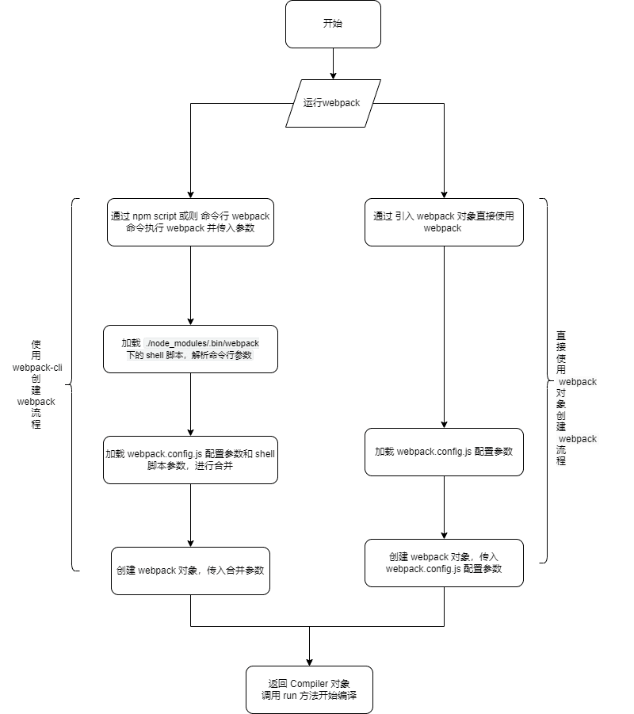
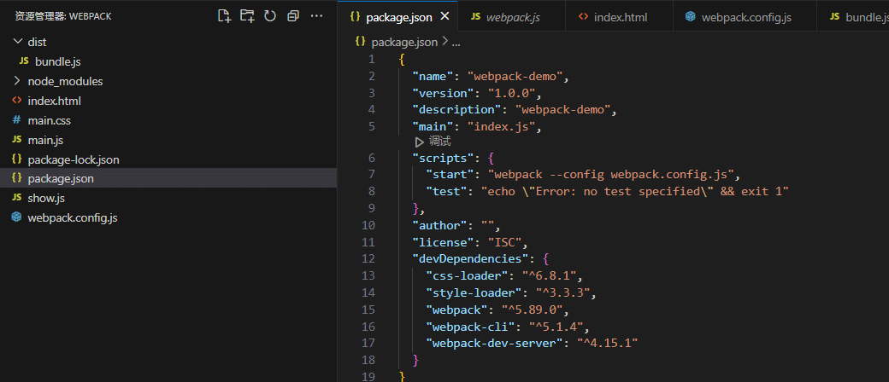
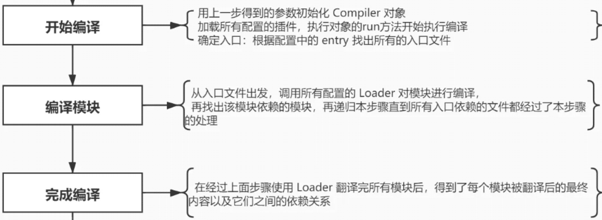
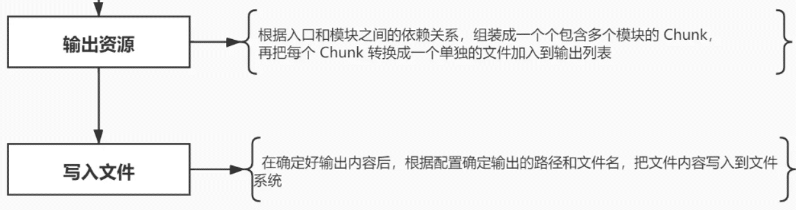
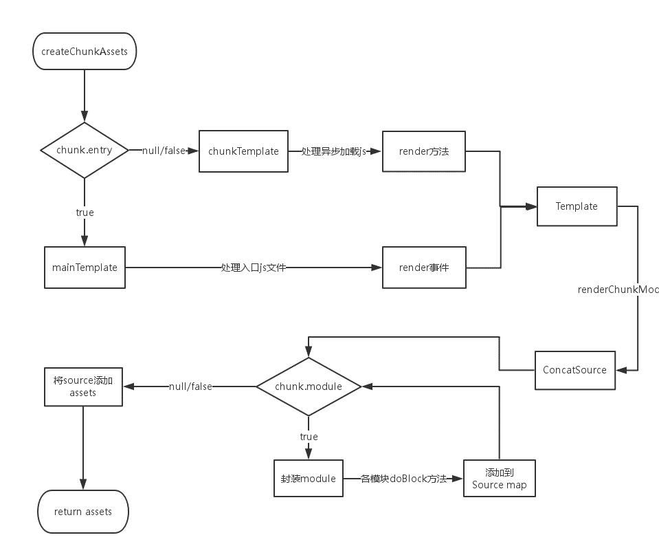
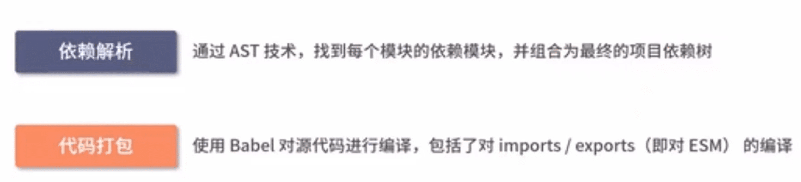
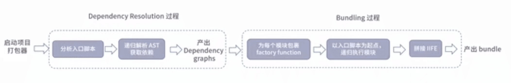

# WebPack 构建原理

[TOC]


## **webpack 基础配置项**

- **Entry**：入口，Webpack 执行构建的第一步将从 Entry 开始，可抽象成输入。
- **Module**：模块，在 Webpack 里一切皆模块，一个模块对应着一个文件。Webpack 会从配置的 Entry 开始递归找出所有依赖的模块。
- **Chunk**：代码块，code splitting 后的产物，也就是按需加载的分块，装载了不同的 module。
  - Chunk 是一系列文件的集合，一个 Chunk 中会包含这个 Chunk 的入口文件和入口文件依赖的文件，由多个module组合而成，用于代码合并与分割。
- **Loader**：模块转换器，用于把模块原内容按照需求转换成新内容。loader 间可以串行使用。
- **Plugin**：扩展插件，在 Webpack 构建流程中的特定时机会广播出对应的事件，插件可以监听这些事件的发生，在特定时机做对应的事情。

module 和 chunk 的关系图：（Webpack会根据一定的规则将Module打包成一个Chunk，Chunk可以被进一步处理和优化，最终被合并成Bundle，下图中圆数字代表模块）


## WebPack 构建示例

### **使用方式**

使用 webpack 可以有两种方式：

1. 使用 webpack-cli 构建；（使用参考官网或 [安装与使用 · 深入浅出 Webpack](https://webpack.wuhaolin.cn/1入门/1-3安装与使用.html))
2. 使用 `webpack` 核心对象构建（通过 Node.js API 启动 Webpack）；

### 区别

使用 webpack-cli 创建项目和使用直接使用 webpack 构建项目的主要区别在于: 配置文件和命令行工具的使用。

* 使用 webpack-cli 创建项目时，您可以使用 `webpack-cli` 命令行工具来生成一个基本的 webpack 项目结构，包括配置文件、入口文件、输出文件等。这个过程相对简单，只需要运行一次命令即可完成项目的初始化。在生成的配置文件中，您可以根据需要修改和扩展 webpack 的配置选项，以满足项目的需求。

* 直接使用 webpack 构建项目需要手动编写 webpack 的配置对象，并执行相应的编译过程。这种方式需要更多的手动操作和配置工作，但对于一些特定的需求或项目结构，可能会更加灵活和可控。


### **使用 webpack 核心对象构建**

 Webpack API  ： `webpack(config , callback);`

* 如果不传 callback 回调函数，就会返回一个 Compiler 实例：`const compiler = webpack(config)`;
* 如果传入 callbakc 不会返回任何参数：

使用方法如下：

```js
webpack({
  // Webpack 配置，和 webpack.config.js 文件一致
}, (err, stats) => {
  if (err || stats.hasErrors()) {
    // 构建过程出错
  }
  // 成功执行完构建
});
```


使用示例：

```js
const webpack = require('webpack');
/** 
  * 使用方式： webpack(config , callback);
  * 传入webpack配置参数，webpack 将返回一个编译对象，该编译对象包含一个run 方法,run 方法将执行编译
**/ 
const compiler = webpack({
    entry:'./serve/App.vue',
    target:'node',
    output:{
      libraryTarget: "commonjs",
      publicPath:'/dist/'
    },
  });

 compiler.run((err, stats) => {
	if(err) {
		console.error(err)
	}
 })
```

> 使用流程：
>
> 1. 引入webpack: `const webpack = require('webpack')`；
> 2. 调用 webpack 并传入配置参数，webpack 将返回一个编译对象；
> 3. 调用编译对象的 run 方法,run 方法将执行编译。

## Webpack 构建流程

Webpack 的构建流程可以分为以下三大阶段：

1. **初始化**：启动构建，读取与合并配置参数，加载 Plugin，实例化 Compiler。
2. **编译**：从 Entry 发出，针对每个 Module 串行调用对应的 Loader 去翻译文件内容，再找到该 Module 依赖的 Module，递归地进行编译处理。
3. **输出**：对编译后的 Module 组合成 Chunk，把 Chunk 转换成文件，输出到文件系统。

如果只执行一次构建，以上阶段将会按照顺序各执行一次。但在开启监听模式下，流程将变为如下：


在每个大阶段中又会发生很多事件，Webpack 会把这些事件广播出来供给 Plugin 使用


### 构建执行总流程


Webpack 的运行流程是一个串行的过程，从启动到结束会依次执行以下流程：

1. **初始化参数**：
   - 从配置文件（如 `webpack.config.js`）和 Shell 语句中读取参数。
   - 合并参数，得出最终的配置参数。
2. **开始编译**：
   - 初始化 Compiler 对象。
   - 加载所有配置的插件。
   - 执行 Compiler 对象的 `run` 方法开始编译过程。
3. **确定入口**：
   - 根据配置中的 `entry` 选项找出入口文件。
   - 可以有多个入口，对应生成多个 bundle。
4. **编译模块**：
   - 从入口文件开始，递归地处理每个模块。
   - 使用配置的 Loader 对模块进行转换（如将 ES6 代码转换为 ES5）。
   - 处理模块依赖，递归地处理依赖模块。
5. **完成模块编译**：
   - 收集所有模块的内容和依赖关系。
   - 可以生成 dependency graph（依赖图）。
6. **输出资源**：
   - 根据入口和模块依赖关系，组装成 Chunk。
   - 将每个 Chunk 转换成一个单独的文件，并加入到输出列表。
   - 这一步是修改输出内容的最后机会。
7. **输出完成**：
   - 根据配置确定输出路径和文件名。
   - 将文件内容写入到文件系统。
8. **插件事件与API调用**：
   在编译过程中的特定阶段，Webpack 会触发特定的事件，插件可以监听这些事件并执行特定的逻辑。插件还可以使用 Webpack 提供的 API 来修改编译结果。
9. **优化与部署**：在完成构建后，可能还需要进行进一步的优化和部署步骤，如压缩代码、创建生产环境版本等。这些步骤可以在 Webpack 的配置中进行，也可以使用插件来实现。


### 函数调用流程


### 初始化流程



在使用了 webpack-cli 的工程项目中，就会执行 webpack 的初始化流程；

通过 webpack-cli 构建一个 webpack 构建的流程：

1. 从配置文件和 `Shell` 语句中读取与合并参数，得出最终的参数。
2. 安装 webpack-cli;
3. 执行 WebpackCli，并将参数传入，运行 webpack。


#### **初始化事件**

| 事件名          | 解释                                                         |
| --------------- | ------------------------------------------------------------ |
| 初始化参数      | 从配置文件和 Shell 语句中读取与合并参数，得出最终的参数。 这个过程中还会执行配置文件中的插件实例化语句 `new Plugin()`。 |
| 实例化 Compiler | 用上一步得到的参数初始化 Compiler 实例，Compiler 负责文件监听和启动编译。Compiler 实例中包含了完整的 Webpack 配置，全局只有一个 Compiler 实例。 |
| 加载插件        | 依次调用插件的 apply 方法，让插件可以监听后续的所有事件节点。同时给插件传入 compiler 实例的引用，以方便插件通过 compiler 调用 Webpack 提供的 API。 |
| environment     | 开始应用 Node.js 风格的文件系统到 compiler 对象，以方便后续的文件寻找和读取。 |
| entry-option    | 读取配置的 Entrys，为每个 Entry 实例化一个对应的 EntryPlugin，为后面该 Entry 的递归解析工作做准备。 |
| after-plugins   | 调用完所有内置的和配置的插件的 apply 方法。                  |
| after-resolvers | 根据配置初始化完 resolver，resolver 负责在文件系统中寻找指定路径的文件。 |

#### **webpack配置项**

配置文件默认下为`webpack.config.js`，也或者通过命令的形式指定配置文件，主要作用是用于激活`webpack`的加载项和插件

关于文件配置内容分析，如下注释：

```js
var path = require('path');
var node_modules = path.resolve(__dirname, 'node_modules');
var pathToReact = path.resolve(node_modules, 'react/dist/react.min.js');

module.exports = {
  // 入口文件，是模块构建的起点，同时每一个入口文件对应最后生成的一个 chunk。
  entry: './path/to/my/entry/file.js'，
  // 文件路径指向(可加快打包过程)。
  resolve: {
    alias: {
      'react': pathToReact
    }
  },
  // 生成文件，是模块构建的终点，包括输出文件与输出路径。
  output: {
    path: path.resolve(__dirname, 'build'),
    filename: '[name].js'
  },
  // 这里配置了处理各模块的 loader ，包括 css 预处理 loader ，es6 编译 loader，图片处理 loader。
  module: {
    loaders: [
      {
        test: /\.js$/,
        loader: 'babel',
        query: {
          presets: ['es2015', 'react']
        }
      }
    ],
    noParse: [pathToReact]
  },
  // webpack 各插件对象，在 webpack 的事件流中执行对应的方法。
  plugins: [
    new webpack.HotModuleReplacementPlugin()
  ]
};
```

`webpack` 将 `webpack.config.js` 中的各个配置项拷贝到 `options` 对象中，并加载用户配置的 `plugins；

#### **webpack 命令和 shell 脚本参数解析**

shell 脚本参数一般通过 shell 直接输入或者通过 npm script 输入：



> 上图中，通过 shell 执行 npm run start 后，执行  `webpack --config webpack.config.js` ，通过 shell 的 config 参数和 webpack 命令将配置文件传入 webpack 中

每次在命令行输入 `webpack` 命令后，操作系统都会去调用 `./node_modules/.bin/webpack` 这个 shell 脚本。（在 window 下是执行`./node_modules/.bin/webpack.cmd` 文件）


这个脚本会去调用 `./node_modules/webpack/bin/webpack.js` 并追加输入的参数，如 -p , -w 。(图中 webpack.js 是 webpack 的启动文件，而 $@ 是后缀参数)


#### **shell 与 webpack.config 解析**

在 webpack.js 这个文件中 webpack 通过 optimist 将用户配置的 webpack.config.js 和 shell 脚本传过来的参数整合成 options 对象传到了下一个流程的控制对象中。

**optimist 介绍**

> 为了整合 webpack.config.js 中的配置和命令行参数，Webpack 使用了一个叫做 optimist 的库。
>
> optimist 是一个用于解析命令行参数的库，可以将命令行参数解析为 JavaScript 对象，这样它们就可以与 webpack.config.js 中的配置进行合并。

和 commander 一样，[optimist](https://github.com/substack/node-optimist) 实现了 node 命令行的解析，其 API 调用非常方便。

```js

var optimist = require("optimist");
optimist
  .boolean("json").alias("json", "j").describe("json")
  .boolean("colors").alias("colors", "c").describe("colors")
  .boolean("watch").alias("watch", "w").describe("watch")
  ...
```

获取到后缀参数后，optimist 分析参数并以键值对的形式把参数对象保存在 optimist.argv 中，来看看 argv 究竟有什么？

```js
// webpack --hot -w
{  hot: true,  profile: false,  watch: true,  ...}
```

#####  **config 合并与插件加载**

1. 在加载插件之前，webpack 将 webpack.config.js 中的各个配置项拷贝到 options 对象中，并加载用户配置在 webpack.config.js 的 plugins 。

2. 接着 optimist.argv 会被传入到`./node_modules/webpack/bin/convert-argv.js` 中，通过判断 argv 中参数的值决定是否去加载对应插件。

```js
ifBooleanArg("hot", function() {
  ensureArray(options, "plugins");
var HotModuleReplacementPlugin = require("../lib/HotModuleReplacementPlugin");
  options.plugins.push(new HotModuleReplacementPlugin());
});
...
return options;
```

`options` 作为最后返回结果，包含了之后构建阶段所需的重要信息。

```js
{ 
  entry: {},//入口配置
  output: {}, //输出配置
  plugins: [], //插件集合(配置文件 + shell指令) 
  module: { loaders: [ [Object] ] }, //模块配置
  context: //工程路径
  ... 
}
```

这和 webpack.config.js 的配置非常相似，只是多了一些经 shell 传入的插件对象。

插件对象一初始化完毕， options 也就传入到了下个流程中。

```js
	
var webpack = require("../lib/webpack.js");
var compiler = webpack(options);
```

#### **webpakc-cli 安装**

在 webpack.js 这个文件，检查用户是否安装webpack-cli，没有安装则进行安装，安装后执行 webpack-cli，并将参数传入 webpack-cli 中：

`webpack.js` 源码：(位于项目中 `./node_modules/webpack/bin/webpack.js` )

```js
#!/usr/bin/env node

/**
 * 解析并运行命令行
 * @param {string} command process to run
 * @param {string[]} args command line arguments
 * @returns {Promise<void>} promise
 */
const runCommand = (command, args) => {
	const cp = require("child_process");
	return new Promise((resolve, reject) => {
		const executedCommand = cp.spawn(command, args, {
			stdio: "inherit",
			shell: true
		});

		executedCommand.on("error", error => {
			reject(error);
		});

		executedCommand.on("exit", code => {
			if (code === 0) {
				resolve();
			} else {
				reject();
			}
		});
	});
};

/**
 * 检查包是否安装 
 * @param {string} packageName name of the package
 * @returns {boolean} is the package installed?
 */
const isInstalled = packageName => {
	if (process.versions.pnp) {
		return true;
	}

	const path = require("path");
	const fs = require("graceful-fs");

	let dir = __dirname;

	do {
		try {
			if (
				fs.statSync(path.join(dir, "node_modules", packageName)).isDirectory()
			) {
				return true;
			}
		} catch (_error) {
			// Nothing
		}
	} while (dir !== (dir = path.dirname(dir)));

	// https://github.com/nodejs/node/blob/v18.9.1/lib/internal/modules/cjs/loader.js#L1274
	// eslint-disable-next-line no-warning-comments
	// @ts-ignore
	for (const internalPath of require("module").globalPaths) {
		try {
			if (fs.statSync(path.join(internalPath, packageName)).isDirectory()) {
				return true;
			}
		} catch (_error) {
			// Nothing
		}
	}

	return false;
};

/**
 * 运行脚手架
 * @param {CliOption} cli options
 * @returns {void}
 */
const runCli = cli => {
	const path = require("path");
	const pkgPath = require.resolve(`${cli.package}/package.json`);
	// eslint-disable-next-line node/no-missing-require
	const pkg = require(pkgPath);

	if (pkg.type === "module" || /\.mjs/i.test(pkg.bin[cli.binName])) {
		// eslint-disable-next-line node/no-unsupported-features/es-syntax
		import(path.resolve(path.dirname(pkgPath), pkg.bin[cli.binName])).catch(
			error => {
				console.error(error);
				process.exitCode = 1;
			}
		);
	} else {
		// eslint-disable-next-line node/no-missing-require
		require(path.resolve(path.dirname(pkgPath), pkg.bin[cli.binName]));
	}
};

/**
 * 脚手架参数
 * @typedef {Object} CliOption
 * @property {string} name display name
 * @property {string} package npm package name
 * @property {string} binName name of the executable file
 * @property {boolean} installed currently installed?
 * @property {string} url homepage
 */

/** @type {CliOption} */
const cli = {
	name: "webpack-cli",
	package: "webpack-cli",
	binName: "webpack-cli",
	installed: isInstalled("webpack-cli"),
	url: "https://github.com/webpack/webpack-cli"
};

// 判断脚手架是否被安装，若没有安装，询问用户是否安装，并根据用户的包管理工具下载安装webpack-cli
if (!cli.installed) {
	const path = require("path");
	const fs = require("graceful-fs");
	const readLine = require("readline");

	const notify =
		"CLI for webpack must be installed.\n" + `  ${cli.name} (${cli.url})\n`;

	console.error(notify);

	let packageManager;

	if (fs.existsSync(path.resolve(process.cwd(), "yarn.lock"))) {
		packageManager = "yarn";
	} else if (fs.existsSync(path.resolve(process.cwd(), "pnpm-lock.yaml"))) {
		packageManager = "pnpm";
	} else {
		packageManager = "npm";
	}

	const installOptions = [packageManager === "yarn" ? "add" : "install", "-D"];

	console.error(
		`We will use "${packageManager}" to install the CLI via "${packageManager} ${installOptions.join(
			" "
		)} ${cli.package}".`
	);

	const question = `Do you want to install 'webpack-cli' (yes/no): `;

	const questionInterface = readLine.createInterface({
		input: process.stdin,
		output: process.stderr
	});

	// In certain scenarios (e.g. when STDIN is not in terminal mode), the callback function will not be
	// executed. Setting the exit code here to ensure the script exits correctly in those cases. The callback
	// function is responsible for clearing the exit code if the user wishes to install webpack-cli.
	process.exitCode = 1;
	questionInterface.question(question, answer => {
		questionInterface.close();
		// 格式化用户输入
		const normalizedAnswer = answer.toLowerCase().startsWith("y");

		if (!normalizedAnswer) {
			console.error(
				"You need to install 'webpack-cli' to use webpack via CLI.\n" +
					"You can also install the CLI manually."
			);

			return;
		}
		process.exitCode = 0;

		console.log(
			`Installing '${
				cli.package
			}' (running '${packageManager} ${installOptions.join(" ")} ${
				cli.package
			}')...`
		);

		runCommand(packageManager, installOptions.concat(cli.package))
			.then(() => {
				runCli(cli);
			})
			.catch(error => {
				console.error(error);
				process.exitCode = 1;
			});
	});
} else {
	runCli(cli);
}

```

> webpack 入口文件，先是检查用户是否完成安装 webpack-cli ，若没有安装，则进行安装
>
> 安装成功以后，运行 webpack-cli 脚手架，并将参数 shell 和 webpack.config.js 的参数传入


####  **运行 webpack-cli 初始化 webpack**

1. 在安装完成 webpack-cli 后(文件位于`./node_modules/webpack-cli/.bin/cli.js`)，执行 webpack-cli 下的 `cli.js`，将文件参数传入，执行 WebpackCLI 对象（文件位于 `./node_modules/webpack-cli/lib/webpack-cli.js` ）；

2. `WebpackCLI` 对象中声明了一些列的 webpack 初始化方法（如: webpack 的执行方法` run`）


3. `WebpackCLI` 对象的 ` run` 方法中，调用 `loadWebpack` 方法，该方法将查找 webpack 的核心模块；
4. webpack 的核心模块位于`./node_modules/webpack/lib/webpack.js`  中，然后进入编译构建流程；

### 编译流程



在加载配置文件和 shell 后缀参数申明的插件，并传入构建信息 options 对象后，开始整个 webpack 打包最漫长的一步。

而这个时候，真正的 webpack 对象才刚被初始化，具体的初始化逻辑在`./node_modules/webpack/lib/webpack.js`  中，该文件中定义了 webpack 的核心代码。

> webpack 构建流程：
>
> 1. Webpack 启动后会从 Entry 里配置的 Module 开始递归**解析 Entry 依赖的所有 Module**。 
> 2. 每找到一个 Module， 就会根据配置的 **Loader 去找出对应的转换规则**，对 Module 进行转换后，再**解析出当前 Module 依赖的 Module**。
> 3. 这些模块会**以 Entry 为单位进行分组**，一个 Entry 和其所有依赖的 Module 被分到一个组也就是一个 Chunk。
> 4. 最后 Webpack 会把**所有 Chunk 转换成文件输出**。 
> 5. 在整个流程中 Webpack 会在恰当的时机执行 Plugin 里定义的逻辑。


#### **编译阶段事件**

| 事件名        | 解释                                                         |
| ------------- | ------------------------------------------------------------ |
| run           | 启动一次新的编译。                                           |
| watch-run     | 和 run 类似，区别在于它是在监听模式下启动的编译，在这个事件中可以获取到是哪些文件发生了变化导致重新启动一次新的编译。 |
| compile       | 该事件是为了告诉插件一次新的编译将要启动，同时会给插件带上 compiler 对象。 |
| compilation   | 当 Webpack 以开发模式运行时，每当检测到文件变化，一次新的 Compilation 将被创建。一个 Compilation 对象包含了当前的模块资源、编译生成资源、变化的文件等。Compilation 对象也提供了很多事件回调供插件做扩展。 |
| make          | 一个新的 Compilation 创建完毕，即将从 Entry 开始读取文件，根据文件类型和配置的 Loader 对文件进行编译，编译完后再找出该文件依赖的文件，递归的编译和解析。 |
| after-compile | 一次 Compilation 执行完成。                                  |
| invalid       | 当遇到文件不存在、文件编译错误等异常时会触发该事件，该事件不会导致 Webpack 退出。 |

在编译阶段中，最重要的要数 compilation 事件了，因为在 compilation 阶段调用了 Loader 完成了每个模块的转换操作，在 compilation 阶段又包括很多小的事件，它们分别是：

| 事件名               | 解释                                                         |
| -------------------- | ------------------------------------------------------------ |
| build-module         | 使用对应的 Loader 去转换一个模块。                           |
| normal-module-loader | 在用 Loader 对一个模块转换完后，使用 acorn 解析转换后的内容，输出对应的抽象语法树（AST），以方便 Webpack 后面对代码的分析。 |
| program              | 从配置的入口模块开始，分析其 AST，当遇到 `require` 等导入其它模块语句时，便将其加入到依赖的模块列表，同时对新找出的依赖模块递归分析，最终搞清所有模块的依赖关系。 |
| seal                 | 所有模块及其依赖的模块都通过 Loader 转换完成后，根据依赖关系开始生成 Chunk。 |


#### **编译对象**

在`./node_modules/webpack/lib/webpack.js`  中，开始初始化`Compiler`编译对象，该对象掌控者`webpack`生命周期，不执行具体的任务，只是进行一些调度工作

```js
class Compiler extends Tapable {
    constructor(context) {
        super();
        this.hooks = {
            //生命周期钩子
            beforeCompile: new AsyncSeriesHook(["params"]),
            compile: new SyncHook(["params"]),
            afterCompile: new AsyncSeriesHook(["compilation"]),
            make: new AsyncParallelHook(["compilation"]),
            entryOption: new SyncBailHook(["context", "entry"])
            // 定义了很多不同类型的钩子
        };
        // ...
    }
}

function webpack(options) {
  var compiler = new Compiler();
  ...// 检查options,若watch字段为true,则开启watch线程
  return compiler;
}
...
```

`Compiler` 对象继承自 `Tapable`，初始化时定义了很多钩子函数（`Compiler` 对象定义在`./node_modules/webpack/lib/Compiler.js`）

根据配置中的 `entry` 找出所有的入口文件

```js
module.exports = {
  entry: './src/file.js'
}
```


#### **run 开始编译**

初始化完成后会调用`Compiler`的`run`方法来真正启动`webpack`编译构建流程，主要流程如下：

1. **`compile` 开始编译:**
   * 目的：这是整个编译过程的开始，意味着开始将源代码转换为可执行代码或目标代码。
   * 操作：读取源代码文件，并开始进行初步的解析和处理。

2. **`make` 从入口点分析模块及其依赖的模块，创建这些模块对象:**
   - 目的：确定项目的依赖关系构建一个依赖图，并创建模块对象以供后续处理。
   - 操作：
     1. 工具（如Webpack）会分析源代码中的import或require语句，分析项目的依赖关系，并确定哪些模块需要被编译。
     2. 为每个模块创建一个对象，这个对象包含了该模块的所有相关信息。
     3. 模块对象包括：模块ID、模块路径、模块依赖数组等；

3. **`build-module` 构建模块:**
   * 目的：对每个模块的源代码进行处理和转换。
   * 操作：这一步包括将模块的源代码进行转换、优化、合并等操作。例如，Babel会在此阶段将ES6+的语法转换为ES5语法。
4. **`after-compile` 完成构建:**
   - 目的：在所有模块都构建完成后执行一些全局的操作。
   - 操作：例如，可能会进行全局的代码优化、清理临时文件等。
5. **`seal` 封装构建结果:**
   - 目的：将构建的结果进行封装，以便于部署和分发。
   - 操作：可能会将所有的模块和资源打包到一个或多个文件中，并进行压缩、优化等操作。
6. **`emit` 把各个chunk输出到结果文件:**
   - 目的：将各个模块或chunk输出到结果文件。
   - 操作：工具会根据其内部的依赖关系，将每个chunk（例如，由多个模块组成的代码块）输出到指定的结果文件。
7. **`after-emit` 完成输出:**
   - 目的：在所有chunks都输出到结果文件后执行一些后续操作。
   - 操作：例如，可能会复制生成的资源到输出目录、执行一些清理任务等。


#### compile 编译

* 目的：这是整个编译过程的开始，意味着开始将源代码转换为可执行代码或目标代码。
* 操作：读取源代码文件，并开始进行初步的解析和处理。

**`Compilation`对象介绍**

执行了`run`方法后，首先会触发`compile`，主要是构建一个`Compilation`对象


该对象是编译阶段的主要执行者，主要会依次下述流程：

1. 负责组织整个打包过程：执行模块创建、依赖收集、分块、打包等主要任务，图中看到比较关键的步骤，如 `addEntry()` , `_addModuleChain()` ,`buildModule()` , `seal()` , `createChunkAssets()` (在每一个节点都会触发 webpack 事件去调用各插件)
2. 对象内部存放着所有 module ，chunk，生成的 asset 以及用来生成最后打包文件的 template 的信息。


#### **Compiler 和 Compilation 区分**

> 在开发 Plugin 时最常用的两个对象就是 Compiler 和 Compilation，它们是 Plugin 和 Webpack 之间的桥梁。 
>
> Compiler 和 Compilation 的含义如下：
>
> - Compiler 对象包含了 Webpack 环境所有的的配置信息，包含 options，loaders，plugins 这些信息，这个对象在 Webpack 启动时候被实例化，它是全局唯一的，可以简单地把它理解为 Webpack 实例；
>- Compilation 对象包含了当前的模块资源、编译生成资源、变化的文件等。当 Webpack 以开发模式运行时，每当检测到一个文件变化，一次新的 Compilation 将被创建。Compilation 对象也提供了很多事件回调供插件做扩展。通过 Compilation 也能读取到 Compiler 对象。
> 
> Compiler 和 Compilation 的区别在于：**Compiler 代表了整个 Webpack 从启动到关闭的生命周期，而 Compilation 只是代表了一次新的编译。**


#### make 构建依赖图

- 目的：**生成模块依赖关系图**。

- 操作：工具（如Webpack）会分析源代码中的import或require语句，分析项目的依赖关系，并确定哪些模块需要被编译。为每个模块创建一个对象，这个对象包含了该模块的所有相关信息。

  1. **生成模块依赖关系图**： 通过遍历入口文件及其依赖的模块，生成一个模块依赖关系图。这个图描述了模块之间的依赖关系，为后续的代码拆分和优化提供了基础。
  2. **代码拆分**：根据模块依赖关系图，将代码拆分成不同的chunks。每个chunk包含一组相关的模块，这些模块共享相同的入口和出口。

  

在创建 module 之前，Compiler 会触发 make，并调用 `Compilation.addEntry` 方法，通过 options 对象的 entry 字段找到入口js文件。

之后，在 addEntry 中调用私有方法`_addModuleChain`;

`_addModuleChain`方法主要做了两件事情:

* 一是根据模块的类型获取对应的模块工厂并**创建模块;**
* 二是构建模块;

`_addModuleChain()`函数，如下：

```js
_addModuleChain(context, dependency, onModule, callback) {
   ...
   // 根据依赖查找对应的工厂函数
   const Dep = /** @type {DepConstructor} */ (dependency.constructor);
   const moduleFactory = this.dependencyFactories.get(Dep);
   
   // 调用工厂函数NormalModuleFactory的create来生成一个空的NormalModule对象
   moduleFactory.create({
       dependencies: [dependency]
       ...
   }, (err, module) => {
       ...
       const afterBuild = () => {
        this.processModuleDependencies(module, err => {
          if (err) return callback(err);
           callback(null, module);
         });
    };
       // 开始模块编译
       this.buildModule(module, false, null, null, err => {
           ...
           afterBuild();
       })
   })
}
```

> 过程如下：
>
> 1. `_addModuleChain`中接收参数`dependency`传入的入口依赖，使用对应的工厂函数`NormalModuleFactory.create`方法生成一个空的`module`对象
>
> 2. 回调中会把此`module`存入`compilation.modules`对象和`dependencies.module`对象中，由于是入口文件，也会存入`compilation.entries`中
>
> 3. 随后执行`buildModule`进入真正的构建模块`module`内容的过程


#### build-module 模块编译

* 目的：对每个模块的源代码进行处理和转换。

* 操作：这一步包括将模块的源代码进行转换、优化、合并等操作。例如，Babel会在此阶段将ES6+的语法转换为ES5语法。


##### **模块编译总流程：**

1. **执行加载器（Loaders）**：对于每个模块，根据配置的加载器对其进行转换和处理。加载器可以将模块的源代码转换为更低级别的代码，或者添加额外的元数据和代码片段等。
   1.  **loaders 解析模块**： 调用配置的`loaders`，将我们的模块转成标准的`JS`模块；
   2. **生成 AST**： 在用`Loader` 对一个模块转换完后，使用 `acorn` 解析转换后的内容，输出对应的抽象语法树（`AST`），以方便 `Webpack`后面对代码的分析；
   3. **构建模块所依赖的模块**： 从配置的入口模块开始，分析其 `AST`，当遇到`require`等导入其它模块语句时，便将其加入到依赖的模块列表，同时对新找出的依赖模块递归分析，最终搞清所有模块的依赖关系；
2. **执行插件（Plugins）**：在`make`方法中，还会执行一系列的插件。这些插件可以对编译过程进行定制和扩展，例如添加新的功能、修改输出结果等。
3. **Tree Shaking**：在上述步骤中，Tree shaking实际上已经隐含地执行了。Tree shaking的核心思想是消除未使用的代码，通过静态分析来确定哪些代码被使用，哪些代码未被使用，并删除未使用的代码。在这个过程中，Webpack会遍历整个依赖图，并根据AST来确定哪些模块是可用的或不可用的。然后，Webpack会删除未使用的模块和代码，从而减小最终输出的文件大小。


##### **模块编译流程分析**

##### **1.调用 loaders 解析模块**

webpack 提供的一个很大的便利就是能将所有资源都整合成模块，不仅仅是 js 文件。

所以需要一些 loader ，比如 `url-loader` ， `jsx-loader` ， `css-loader` 等等来让我们可以直接在源文件中引用各类资源。webpack 调用 `doBuild()` ，对每一个 require() 用对应的 loader 进行加工，最后生成一个 js module。

#####  **2.[acorn](https://github.com/ternjs/acorn) 解析源文件生成 AST**

**Acorn 介绍**

> Acorn是一个完全使用JavaScript实现的，小型且快速的JavaScript解析器。它可以完成JavaScript代码解析工作，这个代码解析工作的产出即抽象语法树（AST）。
>
> Acorn允许使用者通过插件的形式扩展其功能，例如支持JSX语法。
>
> 在webpack打包流程中，Acorn主要用于解析每一个经loader处理过的source，并生成AST。然后遍历所有节点，当遇到require调用时，会分析是AMD、CMD的调用，或者是require.ensure。

**AST 介绍**

> **概念**：
>
> * AST（抽象语法树）是**源代码的抽象语法结构的树状表现形式**，以**树状**的形式表现编程语言的语法结构。
>
> * AST的每个节点都表示源代码中的一种结构，例如标识符、二元表达式、变量定义、函数定义等。
>
> * AST在很多领域有广泛的应用，比如浏览器、智能编辑器、编译器等。
>
> **作用**：
>
> * AST的主要作用是**提供对源代码的详细分析和操作能力**。
> * 通过AST，可以对代码进行各种转换和处理，例如代码压缩、删除无用代码、变量重命名、类型检查等。
> * 在JavaScript中，AST的使用非常普遍，许多工具和库都依赖于AST来分析和处理代码。
> * AST还可以用于**编译器和解释器的实现**。
>   * 编译器可以将源代码转换成AST，然后对AST进行各种优化和转换，最终生成目标代码。
>   * 解释器则可以读取AST并执行相应的操作。
>
> 总的来说，AST是一种对源代码进行抽象表示和操作的方式，在编译器、解释器、代码分析、代码转换等领域有广泛的应用。


**acorn 解析AST流程**


> 1. 词法分析：Acorn通过词法分析器将源代码分解成一系列的记号（token），每个记号都代表源代码中的一个特定部分，如关键字、标识符、运算符等。
> 2. 语法分析：接下来，Acorn使用语法分析器将这些记号转换成抽象语法树（AST）的节点。AST是一种树形结构，表示源代码的结构和语义信息。每个节点都代表源代码中的一个结构，如表达式、语句、控制结构等。
> 3. 遍历AST：在生成AST后，Acorn会遍历AST的每个节点，并根据节点类型和属性执行相应的处理逻辑。这些处理逻辑可以包括生成代码、检查语法错误、分析依赖关系等。
> 4. 生成代码：在遍历AST的过程中，Acorn可以生成最终的JavaScript代码。这可以用于将AST还原为原始代码，或者生成优化后的代码。

调用 [acorn](https://github.com/ternjs/acorn) 解析经 loader 处理后的源文件生成抽象语法树 AST

```js
	
Parser.prototype.parse = functionparse(source, initialState) {
var ast;
if (!ast) {
// acorn以es6的语法进行解析
    ast = acorn.parse(source, {
      ranges: true,
      locations: true,
      ecmaVersion: 6,
      sourceType: "module"
    });
  }
  ...
};
```

##### **3.遍历 AST，构建该模块所依赖的模块**

对于当前模块，或许存在着多个依赖模块。

当前模块会开辟一个依赖模块的数组 `factories`，在遍历 AST 时，将 require() 中的模块通过 `addDependency()` 添加到数组中。

当前模块构建完成后，webpack 调用 `processModuleDependencies` 开始递归处理依赖的 module，接着就会重复之前的构建步骤。

```js
/**
*dependencies 为依赖模块
**/
Compilation.prototype.addModuleDependencies = function(module, dependencies, bail, cacheGroup, recursive, callback) {
// 根据依赖数组(dependencies)创建依赖模块对象,存入 factories
var factories = [];
for (var i = 0; i < dependencies.length; i++) {
var factory = _this.dependencyFactories.get(dependencies[i][0].constructor);
    factories[i] = [factory, dependencies[i]];
  }
  ...
// 与当前模块构建步骤相同
}
```

4. **Tree Shaking**： 通过静态分析AST，Tree shaking可以确定哪些代码被使用，哪些代码未被使用，并删除未使用的代码。

   > Tree Shaking 可以用来剔除 JavaScript 中用不上的死代码。它依赖静态的 ES6 模块化语法，例如通过 `import` 和 `export` 导入导出。 使用 Tree Shaking参考[使用 Tree Shaking · 深入浅出 Webpack ](https://webpack.wuhaolin.cn/4优化/4-10使用TreeShaking.html)


#### **构建的核心源码**

module 是 webpack 构建的核心实体，也是所有 module 的 父类，它有几种不同子类：`NormalModule` , `MultiModule` , `ContextModule` , `DelegatedModule` 等。

但这些核心实体都是在构建中都会去调用对应方法，也就是 `build()` ；

```js
// 初始化module信息，如context,id,chunks,dependencies等。
NormalModule.prototype.build = functionbuild(options, compilation, resolver, fs, callback) {
//设置构建时间戳：方法中设置了this.buildTimestamp为当前时间戳，这可能是为了跟踪模块的构建时间
this.buildTimestamp = newDate().getTime();
this.built = true;//标记模块为已构建
//执行构建操作
return this.doBuild(options, compilation, resolver, fs, function(err) {
// 指定模块引用，不经acorn解析
if (options.module && options.module.noParse) {
if (Array.isArray(options.module.noParse)) {
 //检查是否需要跳过解析：如果配置中有module.noParse选项，并且模块的请求（request）匹配该选项，则跳过解析步骤，直接调用回调函数。
if (options.module.noParse.some(function(regExp) {
return typeof regExp === "string" ?
this.request.indexOf(regExp) === 0 :
              regExp.test(this.request);
          }, this)) {
return callback();
        }
      } else if (typeof options.module.noParse === "string" ?
this.request.indexOf(options.module.noParse) === 0 :
          options.module.noParse.test(this.request)) {
return callback();
      }
    }
// 使用this.parser.parse方法解析模块的源代码。这通常会生成抽象语法树（AST）。由acorn解析生成ast
try {
this.parser.parse(this._source.source(), {
        current: this,
		module: this,
        compilation: compilation,
        options: options
      });
    } catch (e) {
  //错误处理：如果在解析过程中发生错误，捕获该错误，并创建一个新的ModuleParseError错误对象，然后调用回调函数返回该错误。
        var source = this._source.source();
        this._source = null;
		return callback(new ModuleParseError(this, source, e));
    }
    //调用回调函数：如果一切正常，最后调用回调函数，可能表示构建完成。
	return callback();
  }.bind(this));
};
```

> 以上方法主要流程：
>
> 1. **初始化模块信息**：在开始构建模块之前，该方法首先会初始化一些模块相关的信息，如上下文（context）、ID、chunks（代码块）、依赖关系等。
> 2. **设置构建时间戳**：方法中设置了`this.buildTimestamp`为当前时间戳，这可能是为了跟踪模块的构建时间。
> 3. **标记模块为已构建**：将`this.built`设置为`true`，表示该模块已经被构建过。
> 4. **执行构建操作**：使用`this.doBuild`方法执行实际的构建操作。这可能包括编译、转换、打包等步骤。
> 5. **检查是否需要跳过解析**：如果配置中有`module.noParse`选项，并且模块的请求（request）匹配该选项，则跳过解析步骤，直接调用回调函数。
> 6. **解析模块源代码**：如果没有跳过解析，则使用`this.parser.parse`方法解析模块的源代码。这通常会生成抽象语法树（AST）。
> 7. **错误处理**：如果在解析过程中发生错误，捕获该错误，并创建一个新的`ModuleParseError`错误对象，然后调用回调函数返回该错误。
> 8. **调用回调函数**：如果一切正常，最后调用回调函数，可能表示构建完成。
>
> 这个方法基本上是处理一个模块从初始化到构建完成的全过程，包括初始化信息、设置构建时间、执行构建、解析源代码等步骤。


### 输出流程



1. 在所有模块及其依赖模块 build 完成后，webpack 会监听 `seal` 事件调用各插件对构建后的结果进行封装；
2. 逐次对每个 module 和 chunk 进行整理，生成编译后的源码，合并，拆分，生成 hash 。同时这是我们在开发时进行代码优化和功能添加的关键环节。

#### **输出阶段事件**

| 事件名      | 解释                                                         |
| ----------- | ------------------------------------------------------------ |
| should-emit | 所有需要输出的文件已经生成好，询问插件哪些文件需要输出，哪些不需要。 |
| emit        | 确定好要输出哪些文件后，执行文件输出，可以在这里获取和修改输出内容。 |
| after-emit  | 文件输出完毕。                                               |
| done        | 成功完成一次完成的编译和输出流程。                           |
| failed      | 如果在编译和输出流程中遇到异常导致 Webpack 退出时，就会直接跳转到本步骤，插件可以在本事件中获取到具体的错误原因。 |

在输出阶段已经得到了各个模块经过转换后的结果和其依赖关系，并且把相关模块组合在一起形成一个个 Chunk。 在输出阶段会根据 Chunk 的类型，使用对应的模版生成最终要要输出的文件内容。

#### seal 输出资源

`seal`方法主要是要生成`chunks`，对`chunks`进行一系列的优化操作，并生成要输出的代码

`webpack` 中的 `chunk` ，可以理解为配置在 `entry` 中的模块，或者是动态引入的模块

根据入口和模块之间的依赖关系，组装成一个个包含多个模块的 `Chunk`，再把每个 `Chunk` 转换成一个单独的文件加入到输出列表

`seal ` 源码分析：

```js
Compilation.prototype.seal = functionseal(callback) {
// 触发插件的seal事件
this.applyPlugins("seal"); 
//对preparedChunks进行排序
this.preparedChunks.sort(function(a, b) {
    if (a.name < b.name) {
    return-1;
        }
    if (a.name > b.name) {
    return1;
        }
    return0;
});
//将preparedChunks添加到chunks中
this.preparedChunks.forEach(function(preparedChunk) {
	var module = preparedChunk.module;
	var chunk = this.addChunk(preparedChunk.name, module);
    chunk.initial = chunk.entry = true;
	// 关联模块和chunks:整理每个Module和chunk，每个chunk对应一个输出文件。
    chunk.addModule(module);
	module.addChunk(chunk);
 }, this);
//调用插件的"optimize-tree"事件
this.applyPluginsAsync("optimize-tree", this.chunks, this.modules, function(err) {
    if (err) {
    	return callback(err);
      }
        ... // 触发插件的事件
     this.createChunkAssets(); // 生成最终assets
        ... // 触发插件的事件
    }.bind(this));
};
```

> 这段代码是Webpack的编译（Compilation）对象的一个`seal`方法。
>
> Webpack的编译对象是整个编译过程的核心，包含了所有模块、chunk和assets的信息。
>
> 这个`seal`方法主要是完成了以下几个步骤：
>
> 1. **触发插件的"seal"事件**：通过`this.applyPlugins("seal")`，这个方法会触发所有已注册的插件的"seal"事件。这允许开发者在编译过程中插入自定义逻辑，例如优化代码或添加自定义插件。
> 2. **对preparedChunks进行排序**：这个排序基于chunk的名字。如果`a.name`小于`b.name`，那么`a`会被排在`b`之前。如果名字相同，则不改变它们的顺序。
> 3. **将preparedChunks添加到chunks中**：对于每一个`preparedChunk`，它首先被添加到编译对象的chunks中。同时，它被标记为初始的和入口的chunk。
> 4. **关联模块和chunks**：每一个chunk都与一个模块关联，每一个模块也与一个或多个chunks关联。这是通过调用`chunk.addModule(module)`和`module.addChunk(chunk)`来完成的。
> 5. **应用插件的"optimize-tree"事件**：这个方法会触发所有已注册的插件的"optimize-tree"事件，这通常用于进行进一步的优化，例如压缩代码、去除无用代码等。
> 6. **生成最终的assets**：调用`this.createChunkAssets()`来生成最终的assets，这些assets是编译结果，会被输出到文件系统上。
>
> 注意，代码中有一些省略的部分（用"..."表示），这部分可能是其他事件处理或一些其他的逻辑。
>
> 总的来说，这个`seal`方法主要是完成Webpack编译过程中的"seal"阶段，它主要是准备并优化所有的chunks和modules，然后生成最终的assets。


##### **生成 assets 流程**

seal 输出资源时，会调用 `createChunkAssets` 方法进行打包后代码的生成 assets。

**createChunkAssets 流程如下**：



> 流程分析：
>
> 1. 入口处理：通过判断是入口 js 还是需要异步加载的 js 来选择不同的模板对象进行封装：
>
>    * 入口 js 会采用 webpack 事件流的 render 事件来触发 `Template类` 中的`renderChunkModules()`
>    * 异步加载的 js 会调用 chunkTemplate 中的 render 方法；
>    * 在 webpack 中有四个 Template 的子类模块:
>      *  `MainTemplate.js` ：**主要模板主要负责生成入口文件的代码**。当你在配置文件(webpack.config.js)中指定entry为入口起点时，Webpack就会从该起点开始，找出所有的依赖模块，然后将这些模块的源代码按照特定的规则捆绑在一起。这个过程就是由MainTemplate完成的。
>      *  `ChunkTemplate.js`：**块模板负责生成块(chunk)的代码**。块的概念在Webpack中非常重要，一个块就是一个独立的代码块，可以是同步加载的，也可以是异步加载的。当你的项目中有很多小的、独立的部分，或者你想要根据用户的需求来按需加载某些模块时，就会用到块的概念。ChunkTemplate的作用就是把这些模块的源代码按照特定的规则捆绑在一起，生成出块的代码。
>      * `ModuleTemplate.js` ：**模块模板负责生成每一个模块的代码**。每一个模块都是一个独立的文件，它们各自负责自己的功能。ModuleTemplate的作用就是把这些模块的源代码按照特定的规则捆绑在一起，生成出每一个模块的代码。
>      *  `HotUpdateChunkTemplate.js` :**热更新块模板用于生成热更新代码块**。热更新是一种特殊的更新方式，它可以在不刷新页面的情况下，动态地更新页面的某些部分。HotUpdateChunkTemplate的作用就是生成用于热更新的代码块，这个代码块包含了新旧版本的模块代码，以及用于比较新旧版本差异的代码。
>
> 2. 模块封装：当 chunk.module 为 true 时，进行模块封装。
>
>    * 模块在封装的时候和它在构建时一样，都是调用各模块类中的方法。
>    * 封装通过调用`module.source()` 来进行各操作，比如说 require() 的替换。
>
> 3. 生成 assets：
>
>    * 各模块进行 doBlock 后，把 module 的最终代码循环添加到 source 中。
>    * 一个 source 对应着一个 asset 对象，该对象保存了单个文件的文件名( name )和最终代码( value )。
>
>    

#### emit 输出完成

最后一步，webpack 调用 Compiler 中的 `emitAssets()` 

按照 output 中的配置项将文件输出到了对应的 path 中，从而 webpack 整个打包过程结束。

```js
output: {
    path: path.resolve(__dirname, 'build'),
        filename: '[name].js'
}
```

要注意的是，若想对结果进行处理，则需要在 `emit` 触发后对自定义插件进行扩展。


### **构建函数流程图**


### **常见问题**


### 参考资料

[细说 webpack 之流程篇](https://developer.aliyun.com/article/61047)

## **手动实现打包器**

### **打包流程**

1. 读取入口文件(比如entry.js)；
2. 基于 AST 分析入口文件，并产出依赖列表；
3. 使用Babel将相关模块编译到ES5；
4. 对每个依赖模块产出一个唯一的ID，方便后续读取模块相关内容；
5. 将每个依赖以及经过 Babel编译过后的内容，存储在一个对象中进行维护；
6. 遍历上一步中的对象，构建出一个依赖图 (DependencyGraph)；
7. 将各模块内容bundle产出；

### 核心步骤



### **打包器流程图**




### **实现代码**

要实现一个简单的前端打包器，我们需要使用一些工具和库来辅助我们完成上述流程。

以下是一个使用Node.js和Babel的基础实现：

1. 首先，确保你已经安装了Node.js和npm。然后，创建一个新的项目文件夹，并在其中初始化一个新的npm项目：

```bash
mkdir my-packager  
cd my-packager  
npm init -y
```

2. 安装必要的依赖：

```bash
bash复制代码

npm install babel-loader @babel/core @babel/preset-env webpack --save-dev
```

3. 创建一个`packager.js`文件，并开始编写打包器的代码：

```javascript
const fs = require('fs');  
const path = require('path');  
const webpack = require('webpack');  
const BabelLoader = require('babel-loader');  
const babelCore = require('@babel/core');  
const babelPresetEnv = require('@babel/preset-env');  
  
// 配置Babel和Webpack  
const babelLoaderConfig = {  
  test: /\.js$/, // 匹配所有.js文件  
  exclude: /node_modules/, // 排除node_modules目录  
  use: [  
    {  
      loader: BabelLoader,  
      options: {  
        presets: [babelPresetEnv] // 使用@babel/preset-env预设进行转译  
      }  
    }  
  ]  
};  
  
const webpackConfig = {  
  mode: 'development', // 或者 'production'  
  entry: './src/entry.js', // 入口文件路径  
  output: {  
    path: path.resolve(__dirname, 'dist'), // 输出目录  
    filename: 'bundle.js' // 打包后的文件名  
  },  
  module: {  
    rules: [babelLoaderConfig] // 使用Babel进行转译的配置  
  }  
};  
  
// 读取入口文件并分析AST产出依赖列表  
async function analyzeAST(entryPath) {  
  const sourceCode = fs.readFileSync(entryPath, 'utf-8');  
  const ast = babelCore.parseSync(sourceCode, { sourceType: 'module' }); // 使用Babel的解析器生成AST  
  return ast; // 这里只是简单返回AST，实际应用中可能需要进一步分析AST来获取依赖关系。  
}  
  
// 主函数，启动打包流程  
async function packager() {  
  const entryPath = webpackConfig.entry; // 入口文件路径  
  const ast = await analyzeAST(entryPath); // 分析AST并产出依赖列表（这里简化了）  
  const compiler = webpack(webpackConfig); // 创建Webpack编译器实例并配置webpackConfig作为配置对象传入。  
  compiler.run((err, stats) => { // 运行编译器。err是错误对象，stats是Webpack提供的编译统计信息。  
    if (err) {   
      console.error('打包失败:', err);   
      return;   
    }   
    if (stats.hasErrors()) {   
      console.error('打包过程中发生错误:', stats.toJson().errors);   
    }   
    if (stats.hasWarnings()) {   
      console.warn('打包过程中发生警告:', stats.toJson().warnings);   
    } else {   
      console.log('打包成功!');   
    }   
  });   
}  
packager(); // 启动打包流程。你可以在需要的时候多次调用此函数来多次打包。例如：packager(), 通常情况下你只需要调用一次就足够了。 打包成功后，你将在项目的dist目录下看到生成的bundle.js文件。这就是你的打包结果。你可以在HTML文件中引用这个文件来运行你的应用。例如：<script src="dist/bundle.js"></script>。这只是一个简单的实现，并不包含Tree Shaking等高级特性。要实现这些特性，你可能需要更深入地学习Webpack并对其进行配置。例如，要启用Tree Shaking，你需要在Webpack的配置中设置mode为production并移除一些不必要的插件和加载器。同时，你可能还需要使用一些第三方工具来帮助你检测你的代码中的死代码并对其进行清理。例如，你可以使用babel-plugin-transform-remove-unused-polyfills插件来删除未使用的polyfills，或者使用babel-plugin-transform-remove-unused-variables插件来删除未使用的变量。
```


## 参考资料

[深入浅出 WebPack](https://webpack.wuhaolin.cn/%E5%89%8D%E8%A8%80.html)