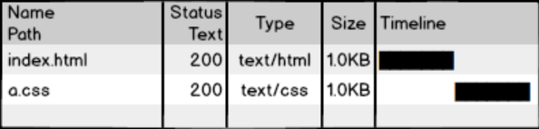
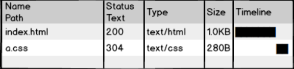
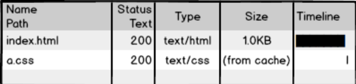
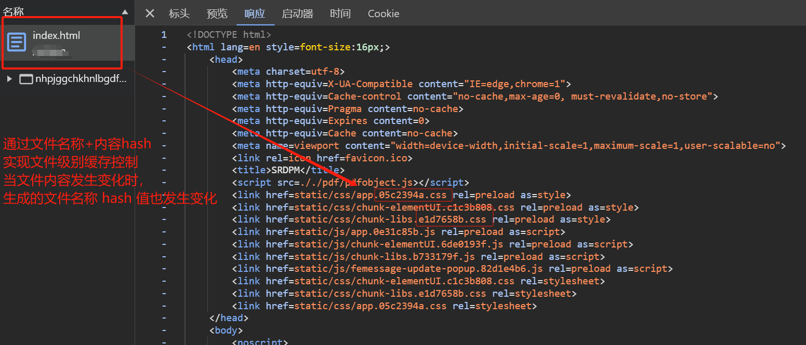
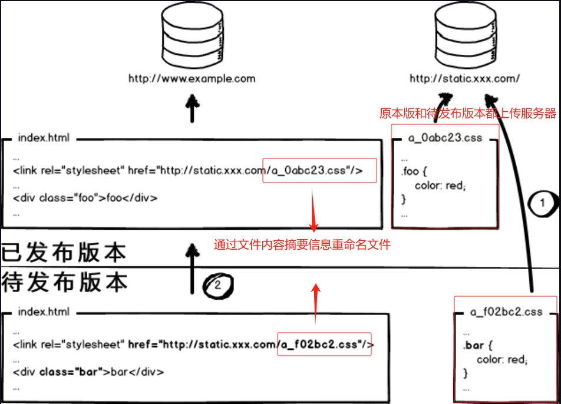
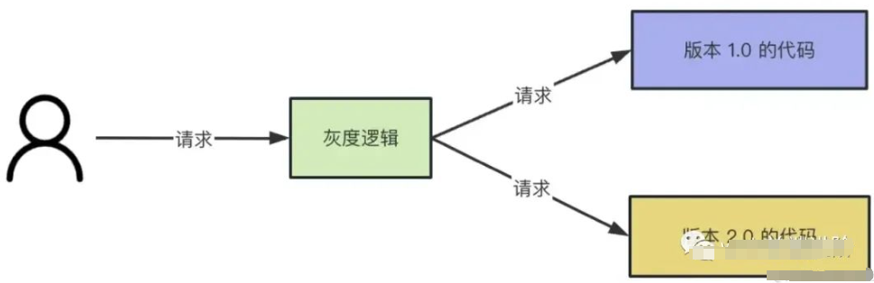

# 前端部署原理


## **前端手动部署**

### **前端手动发版流程**

1. **本地开发与打包**：
   - 前端开发人员在本地开发环境中编写和测试代码。
   - 当代码开发完成后，使用如`npm run build`或`yarn build`等命令，通过前端项目的构建脚本（通常是Webpack、Rollup等）打包前端代码。
   - 打包过程会生成优化后的静态资源文件，通常包括HTML、CSS、JavaScript等，这些文件被放置在项目的`dist`或`build`目录下。
2. **配置Nginx：**
   - 前端开发人员或系统管理员需要配置Nginx作为静态资源服务器。
   - 在Nginx的配置文件（通常是`nginx.conf`或某个站点特定的配置文件）中，指定静态资源文件的根目录为前端项目的`dist`或`build`目录。
   - 配置Nginx监听特定的端口（如80或443），并设置相应的访问规则，如域名、SSL证书等。
3. **启动Nginx服务：**
   - 根据操作系统和Nginx安装方式的不同，使用相应的命令启动Nginx服务。
   - Nginx开始监听配置的端口，并等待客户端的请求。
4. **部署静态资源：**
   - 将打包生成的静态资源文件（位于`dist`或`build`目录）部署到Nginx配置的根目录下。
   - 这可以通过手动复制文件或使用自动化工具（如FTP客户端、SCP、rsync等）完成。
5. **访问静态资源：**
   - 当用户通过浏览器访问配置好的域名或IP地址时，Nginx会拦截请求，并根据配置提供相应的静态资源文件。
   - 浏览器接收到这些文件后，会解析并渲染页面，从而展示前端应用。
6. **更新与发版：**
   - 当前端代码有更新时，开发人员会重复步骤1到步骤5，以发布新的版本。
   - 在更新过程中，可能需要重启Nginx服务或采用其他方式使配置生效。


### **静态资源服务搭建**

在前后端分离项目中，前端部署服务为：

1. 使用 `nginx` 起一个 web 服务器；
2. 将`dist`文件夹的静态资源放到指定的路径下；
3. 配置下`nginx`访问路径，对于请求接口使用`proxy_pass`进行转发，解决跨域的问题。


### **存在问题**

以上传统的前端手动发版流程存在以下几个问题：

1. **手动操作多，容易出错**：整个流程涉及多个步骤，且大部分需要手动完成，如打包、传输、部署等，这些步骤中容易出现操作失误，导致发版失败或出现问题。
2. **依赖后端人员**：前端开发人员需要将生成的`dist`文件夹交给后端开发人员，再由后端人员部署，这增加了沟通成本和依赖关系，也增加了出错的概率。
3. **缺乏自动化和持续集成/持续部署（CI/CD）**：没有利用自动化工具和CI/CD流程，使得发版过程繁琐且效率低下，也无法保证每次发版的质量和一致性。
4. **缺乏版本控制和追踪**：在手动发版过程中，很难对每次发版的内容和变化进行追踪和管理，这不利于问题排查和版本回滚。

为了解决这些问题，可以考虑引入自动化工具和CI/CD流程（如Jenkins、GitLab CI/CD等），将前端代码和后端代码分开部署，利用版本控制系统（如Git）对代码进行管理和追踪，以提高发版的效率和质量。

同时，也可以考虑使用Docker等容器化技术，将前端和后端代码打包成独立的容器，实现更快速、灵活的部署。

## **前端自动化部署**

### **概念**

前端自动化部署是指通过工具和脚本自动完成前端项目的构建、打包和部署等工作。

目的是减少人工操作，提高效率，降低出错概率。

通过自动化部署，开发人员可以更加专注于业务逻辑的开发，而不需要关心一些繁琐而机械的操作。

### **流程**

前端自动化部署的思路和流程可以大致分为以下几个步骤：

1. **代码提交与版本控制**：前端开发人员编写并测试代码后，将代码提交到版本控制系统（如Git）中。这一步确保了代码的版本管理和追踪。
2. **持续集成（CI）**：当代码提交到版本控制系统后，持续集成工具（如Jenkins、GitLab CI/CD等）会自动触发构建流程。构建过程通常包括代码拉取、依赖安装、代码检查（如linting）、单元测试等步骤。这一步确保了每次构建都是基于最新的代码，并且代码质量符合预设标准。
3. **构建与打包**：构建流程完成后，自动化部署工具会根据项目的配置和需求，对前端项目进行打包。这通常包括压缩JS、CSS文件，生成静态资源文件等。打包后的文件通常会被放置在特定的目录中，准备进行下一步的部署。
4. **持续部署（CD）**：在打包完成后，持续部署工具会自动将打包后的文件部署到目标环境（如测试环境、生产环境等）。部署过程可能包括文件传输（如FTP、SCP等）、环境配置、服务重启等步骤。这一步确保了代码能够自动、快速地部署到目标环境，提高了部署效率。
5. **监控与回滚**：在部署完成后，自动化部署工具会监控应用的运行状态，确保应用能够正常运行。如果出现问题，可以根据预设的策略进行回滚，将应用恢复到之前的状态，保证了应用的稳定性和可靠性。

整个前端自动化部署流程中，工具的选择和配置是关键。

需要根据项目的需求、团队的技术栈和偏好来选择合适的工具和配置。

同时，也需要不断地优化和完善流程，以提高部署效率和质量。

### **方案**

|    工具/方案     |                             思路                             |                             优点                             |                             缺点                             |
| :--------------: | :----------------------------------------------------------: | :----------------------------------------------------------: | :----------------------------------------------------------: |
|   **Jenkins**    | Jenkins是一个开源的持续集成/持续部署（CI/CD）工具，可以自动化构建、测试和部署项目。<br />通过配置Jenkins，可以实现在代码提交后自动打包、构建和部署前端项目。 | 高度可配置，支持多种构建工具和插件。<br />支持自动化构建、测试和部署流程。<br />有丰富的社区支持和文档资源。 | 配置相对复杂，需要一定的学习成本。<br /> 可能需要额外的插件或工具来实现某些功能。 |
| **GitLab CI/CD** | GitLab内置了CI/CD功能，可以直接在Git仓库中配置CI/CD流程。<br />通过编写`.gitlab-ci.yml`文件，可以定义自动化构建、测试和部署任务。 | 与GitLab紧密集成，方便管理和配置。<br /> 支持Docker等容器化技术，方便实现环境隔离和部署。<br />提供了丰富的预定义模板和工具，简化配置过程。 | 需要在GitLab中配置和管理CI/CD流程。<br />可能受到GitLab平台本身的限制或影响。 |
|   **GitHooks**   | 通过使用 Git Hooks 和 node script、shell 在 git 操作时,执行 node 和 shell 脚本，实现自动化构建和部署 |          使用 node 编写自动化构建和部署脚本灵活性高          | 与项目 Git Hooks 紧密集成，与项目耦合，不同项目之前需要重新编写 hooks 和 node、shell 脚本 |
|    **Docker**    | Docker是一个容器化技术，可以将前端项目打包成独立的容器，并通过Docker Compose或Kubernetes等工具进行管理和部署。 | 容器化技术可以实现环境隔离和一致性，减少部署错误和兼容性问题。<br />可以快速部署和扩展项目，提高部署效率。- 支持多平台部署，如Linux、Windows等。 | 需要学习和理解Docker和容器化技术的相关知识。<br /> 可能需要额外的配置和管理工作。 |
|   **Netlify**    | Netlify是一个基于云的前端自动化部署平台，支持多种前端框架和工具。<br />通过连接Git仓库，可以自动构建、测试和部署前端项目。 | 提供了简单易用的界面和配置方式，降低了学习成本。<br /> 支持多种前端框架和工具，兼容性好。<br />提供了实时预览和部署日志等功能，方便跟踪和调试。 | 可能需要付费使用高级功能或增加额外的配置。<br />可能受到Netlify平台本身的限制或影响。 |

关于前端自动化部署详细实践方案，可以参考博客：[前端自动部署 | Sewen 博客 (sewar-x.github.io)](https://sewar-x.github.io/projectDeploy/自动构建和部署/)


## **前端部署发展过程**

### **原始部署**


原始的前端开发过程：

1. 搭建一个静态资源服务器；

2. 将 `index.html` 页面和它的样式文件 `a.css`，用文本编辑器写代码，无需编译，本地预览，确认OK，使用 FPT 上传到服务器，等待用户访问。

3. 访问页面，查看一下网络请求，200状态，访问成功。

   


以上模式存在问题：`a.css` 通常是变化不大静态资源文件，，如果每次用户访问页面都要加载该文件，很影响性能和浪费带宽。

当第二次访问该文件时候，浏览器会使用 304协商缓存 保存 `a.css` 静态资源文件：



但协商缓存还是要和服务器通信一次，依然浪费带宽。

### **使用强制缓存**

为了减少通信带宽，通常我们会强制浏览器使用本地缓存（`cache-control/expires`），不要和服务器通信（通过配置响应 `cache-control/expires` 字段控制强制缓存），通过使用强制缓存，浏览器请求如下：



通过以上强制缓存解决了静态资源频繁请求浪费带宽的问题，但是又引出以下问题：存在缓存的静态资源如何更新？

为了解决缓存静态资源更新问题，后来产生以下解决方案：

### **静态资源添加版本号**

**通过更新页面中引用的资源路径，让浏览器主动放弃缓存，加载新资源**


在 `index.html` 中引入静态资源的标签中，添加 `?.v=1.0.0` 静态资源的版本号；

通过该方法，每次发布版本时， `index.html` 页面中静态资源版本号都会改变：


后来实践中发现以上模式存在问题：页面引用了3个css，而某次上线只改了其中的 `a.css`，如果所有链接都更新版本，就会导致 `b.css`，`c.css` 的缓存也失效，那岂不是又有带宽浪费了？！


### **文件级别的精确缓存控制**

为了让未更新的静态资源不更新，避免带宽的浪费，必须让url的修改与文件内容关联，也就是说，**只有文件内容变化，才会导致相应 url 的变更**，从而实现文件级别的精确缓存控制。

解决方案：利用 [数据摘要算法](http://baike.baidu.com/view/10961371.htm) 对文件求摘要信息，摘要信息与文件内容一一对应，就有了一种可以精确到单个文件粒度的缓存控制依据了。（数据摘要算法通过输入相同的明文数据经过相同的消息摘要算法得到相同的[密文](https://baike.baidu.com/item/密文/9684333?fromModule=lemma_inlink)）


通过利用 [数据摘要算法](http://baike.baidu.com/view/10961371.htm) 对文件求摘要信息作为文件版本号，只有当文件内容发生变更时，文件本版号才会更新，因此内容不变的静态资源文件版本号不更改。从而实现对文件更新的精准控制。

> 在现代前端工程项目中，如何使用精确文件级别的缓存控制？

在使用 webpack 构建的现代前端工程项目中，依然是使用 文件内容的数据摘要算法，对文件内存加密获取 hash 值作为文件的版本号，实现文件级别的精确缓存控制。



以上为使用 webpack 构建的现代前端工程项目，上图中，通过使用`文件名 + hash` 的方式生成文件名，实现文件级别的缓存控制，当文件内容发生变化时，生成的文件名称 hash 值也随之变化。

**webpack 输出文件名称配置**

在 webpack 配置中，通过使用 `output.filename` 配置输出文件的名称。

在有多个 Chunk 要输出时 Webpack 会为每个 Chunk取一个名称，可以根据 Chunk 的名称来区分输出的文件名：

```js
filename: '[name].js'
```

代码里的 `[name]` 代表用内置的 `name` 变量去替换`[name]`，这时可以把它看作一个字符串模块函数， 每个要输出的 Chunk 都会通过这个函数去拼接出输出的文件名称。

内置变量除了 `name` 还包括：

| 变量名    | 含义                       |
| --------- | -------------------------- |
| id        | Chunk 的唯一标识，从0开始  |
| name      | Chunk 的名称               |
| hash      | Chunk 的唯一标识的 Hash 值 |
| chunkhash | Chunk 内容的 Hash 值       |

其中 `hash` 和 `chunkhash` 的长度是可指定的，`[hash:8]` 代表取8位 Hash 值，默认是20位。

> 注意 [ExtractTextWebpackPlugin](https://github.com/webpack-contrib/extract-text-webpack-plugin) 插件是使用 `contenthash` 来代表哈希值而不是 `chunkhash`， 原因在于 `ExtractTextWebpackPlugin` 提取出来的内容是代码内容本身而不是由一组模块组成的 Chunk。

当你希望输出文件名包含 chunkhash（即每个代码块的唯一哈希值）时，Webpack 会为每个生成的 chunk（代码块）生成一个唯一的哈希值，该值基于 chunk 的内容。这种机制确保了当 chunk 的内容发生变化时，其对应的哈希值也会改变。

**chunkhash 的计算原理：**

1. **内容哈希**：chunkhash 是基于 chunk 的内容计算的。这意味着，如果你更改了 chunk 中的任何代码（例如，JavaScript、CSS 或其他资源），那么 chunkhash 将会改变。这种机制确保了当文件内容发生变化时，浏览器会加载新的文件版本，而不是使用缓存中的旧版本。
2. **不同入口文件的依赖解析**：Webpack 会为每个入口文件（entry point）单独构建依赖图，并为每个入口文件生成一个或多个 chunks。每个 chunk 都会有一个唯一的 chunkhash，即使它们属于同一个入口文件。这意味着，如果你有一个主入口文件（例如 `main.js`）和一些依赖文件（例如 `main.css`），并且它们都被打包在同一个 chunk 中，那么这个 chunk 将会有一个唯一的 chunkhash。
3. **公共库的单独处理**：在 Webpack 的多入口配置中，公共库（如 React、Vue 等）通常会被提取到单独的 chunks 中，以确保它们只被加载一次。这些公共库 chunks 也会有自己的 chunkhash，这样当它们的内容发生变化时，只有相应的 chunk 会被重新加载。

通过在 `output.filename` 中使用 `[contenthash]` 占位符，可以告诉 Webpack 在输出文件名中包含 chunkhash。例如：

```javascript
output: {  
  filename: '[name].[contenthash].js',  
  chunkFilename: '[name].[contenthash].js',  
}
```

### **动静资源分离部署**

现代互联网企业，为了进一步提升网站性能，提升网站访问速度，通常会把静态资源和动态网页分集群部署，静态资源会被部署到CDN节点上，网页中引用的资源也会变成对应的部署路径：


将静态资源和动态网页分集群部署的方案主要思路:

将静态资源（如图片、CSS、JS文件等）和动态网页（如需要后端处理的页面）分别部署在不同的服务器上，以提高系统的性能和可扩展性。具体实现流程如下：

1. **环境准备**：首先，需要准备静态资源服务器和动态网页服务器。静态资源服务器可以使用CDN（内容分发网络）节点或专门的静态文件服务器，而动态网页服务器则可以使用Web应用服务器，如Tomcat、Nginx等。
2. **静态资源部署**：将前端项目中的静态资源文件（如图片、CSS、JS文件等）部署到静态资源服务器上。这些文件通常会被打包成静态资源包，并上传至静态资源服务器的指定目录中。
3. **动态网页部署**：将前端项目中的动态网页文件（如需要后端处理的页面）部署到动态网页服务器上。这些文件通常会经过构建和打包过程，生成可执行的Web应用，并部署到动态网页服务器的指定目录中。
4. **配置服务器**：在静态资源服务器上配置CDN节点或静态文件服务器，确保用户能够正确地访问到静态资源。在动态网页服务器上配置Web应用服务器，确保能够正确地处理动态网页请求。
5. **负载均衡**：为了提高系统的可扩展性和性能，可以配置负载均衡器（如Nginx、HAProxy等）来分发用户请求。负载均衡器可以根据请求的类型（静态资源请求或动态网页请求）将请求转发至相应的服务器上。
6. **访问流程**：当用户访问前端应用时，首先会访问负载均衡器。负载均衡器会根据请求的类型将请求转发至相应的服务器上。如果用户请求的是静态资源，则会直接访问静态资源服务器上的资源；如果用户请求的是动态网页，则会访问动态网页服务器上的Web应用，由后端处理并生成相应的页面返回给用户。

通过这种方式，将静态资源和动态网页分集群部署可以提高系统的性能和可扩展性。静态资源服务器可以快速地响应用户的请求，而动态网页服务器则可以处理复杂的业务逻辑和数据处理。同时，通过负载均衡器的配置，可以实现请求的分发和负载均衡，进一步提高系统的性能和稳定性。

通过将动静资源分离部署，发布流程将如下图：


以上发布版本中，同时改了页面结构和样式，也更新了静态资源对应的url地址，现在要发布代码上线，结果引出下问题：先上线页面，还是先上线静态资源？

1. **先部署页面，再部署资源**：在二者部署的时间间隔内，如果有用户访问页面，就会在新的页面结构中加载旧的资源，并且把这个旧版本的资源当做新版本缓存起来，其结果就是：用户访问到了一个样式错乱的页面，除非手动刷新，否则在资源缓存过期之前，页面会一直执行错误。

2. **先部署资源，再部署页面**：在部署时间间隔之内，有旧版本资源本地缓存的用户访问网站，由于请求的页面是旧版本的，资源引用没有改变，浏览器将直接使用本地缓存，这种情况下页面展现正常；但没有本地缓存或者缓存过期的用户访问网站，就会出现旧版本页面加载新版本资源的情况，导致页面执行错误，但当页面完成部署，这部分用户再次访问页面又会恢复正常了。

   

通过以上分析发现：无论先部署哪个都会导致部署过程中发生页面错乱的问题。所以，通常在访问量不大的项目，让研发等到半夜偷偷上线，先上静态资源，再部署页面，看起来问题少一些。


### **非覆盖式发布**

以上问题产生的原因是采用了**覆盖式发布，用 待发布资源 覆盖 已发布资源**。

为了避免在发布时“待发布资源” 覆盖 “已发布资源”导致的部署过程中发生页面错乱的问题，可以采用非覆盖式发布：




用文件的摘要信息来对资源文件进行重命名，把摘要信息放到资源文件发布路径中，这样，内容有修改的资源就变成了一个新的文件发布到线上，不会覆盖已有的资源文件。

上线过程中，**先全量部署静态资源，再灰度部署页面**，整个问题就比较完美的解决了。

#### **全量部署**

全量部署静态资源是指在前端项目中，将所有的静态资源文件（如HTML、CSS、JavaScript、图片、视频等）一次性打包并部署到服务器上，供用户访问和使用。

这种方式下，用户在访问前端应用时，可以直接从服务器上获取到所需的静态资源，而不需要进行额外的动态生成或处理。

#### **灰度部署**

灰度部署（Gray Deployment）是一种逐步发布新版本的软件或应用的方式，它允许一部分用户继续使用旧版本，而另一部分用户开始使用新版本。

**目的**

实现平滑过渡，通过逐步扩大新版本的使用范围，观察新版本的性能和用户反馈，以确保整体系统的稳定。

**流程**

1. 在灰度部署中，通常会先选择一小部分用户或服务器作为“灰度”部分，将新版本部署到这些用户或服务器上。通常做法是把流量划分成多份，一份走新版本代码，一份走老版本代码。

2. 然后，根据对新版本的性能、稳定性等方面的观察，逐步扩大新版本的使用范围，直到最终将所有用户或服务器都迁移到新版本上。通常做法是把走新版本代码的流程设置为 5%，没问题了再放到 10%，50%，最后放到 100% 全量。这样可以把出现问题的影响降到最低。



**思路**

使用 Nginx 实现灰度系统的思路和流程可以大致分为以下几个步骤：

1. **准备环境**

- **Nginx 服务器**：安装并配置好 Nginx 服务器，确保它能够正常处理 HTTP 请求。
- **新旧版本的应用**：确保新旧版本的应用都已经准备好，并且可以独立运行。

2. **配置 Nginx**

- **负载均衡**：配置 Nginx 作为反向代理，实现负载均衡。这可以通过 Nginx 的 `upstream` 指令来实现。
- **请求分发**：根据一定的策略（如用户 ID、请求参数等）将请求分发到不同的应用版本上。这可以通过 Nginx 的 `location`、`if`、`set` 等指令来实现。

3. **灰度策略**

- **基于用户**：根据用户的某些属性（如用户 ID、用户组等）来决定是否将请求路由到新版本。
- **基于请求参数**：在请求中携带特定的参数，根据这些参数的值来决定是否路由到新版本。
- **基于百分比**：随机选择一定百分比的请求路由到新版本，以测试新版本的性能和稳定性。

4. **部署和观察**

- **逐步扩大范围**：初始阶段，只将一小部分请求路由到新版本。观察新版本的性能、稳定性以及用户反馈。
- **调整策略**：根据观察结果，调整灰度策略，逐步扩大新版本的使用范围。

5. **完全切换**

- **完全迁移**：当新版本经过充分的测试并确认稳定后，可以将所有请求都路由到新版本。

6. **监控和日志分析**

- **实时监控**：对新旧版本的应用进行实时监控，确保系统的稳定性。
- **日志分析**：分析 Nginx 和应用的日志，了解系统的运行状态和潜在问题。


**示例**

当使用 Nginx 进行灰度部署时，可以通过配置 Nginx 的 location 块和变量来实现基于不同条件的请求分发。以下是一个简单的 Nginx 灰度部署示例：

```shell
# 定义 Nginx 的工作进程数和错误日志路径  
worker_processes auto;  
error_log /var/log/nginx/error.log;  
  
# 定义 HTTP 服务器块  
http {  
    # 定义后端服务器组，用于存放旧版本应用的服务器地址  
    upstream old_app_servers {  
        server old_app_server1;  
        server old_app_server2;  
    }  
  
    # 定义后端服务器组，用于存放新版本应用的服务器地址  
    upstream new_app_servers {  
        server new_app_server1;  
        server new_app_server2;  
    }  
  
    # 定义服务器块，监听 80 端口  
    server {  
        listen 80;  
  
        # 定义访问日志路径  
        access_log /var/log/nginx/access.log;  
  
        # 定义根目录，用于存放静态文件  
        root /path/to/root;  
  
        # 定义 index 文件，默认为 index.html  
        index index.html;  
  
        # 定义 location 块，匹配所有请求  
        location / {  
            # 设置一个变量 $gray_version，初始值为 'old'  
            set $gray_version 'old';  
  
            # 如果请求头中包含自定义的 X-Gray-Version 头，并且值为 'new'  
            # 则将 $gray_version 设置为 'new'  
            if ($http_x_gray_version = 'new') {  
                set $gray_version 'new';  
            }  
  
            # 根据 $gray_version 变量的值，将请求代理到相应的后端服务器组  
            # 如果 $gray_version 为 'old'，则代理到旧版本应用服务器组  
            # 如果 $gray_version 为 'new'，则代理到新版本应用服务器组  
            # 使用 eval 指令动态构建代理目标  
            eval $gray_version;  
            proxy_pass http://$gray_version_servers;  
            
            # if ($http_x_gray_version = 'new') {  
        	#	proxy_pass http://new_app_servers;  
    		# }  
    		# proxy_pass http://old_app_servers;  
  
            # 设置代理请求的一些参数  
            proxy_set_header Host $host;  
            proxy_set_header X-Real-IP $remote_addr;  
            proxy_set_header X-Forwarded-For $proxy_add_x_forwarded_for;  
        }  
    }  
}
```

> 1. 定义了两个后端服务器组 `old_app_servers` 和 `new_app_servers`，分别存放旧版本和新版本应用的服务器地址。
> 2. 然后，在 `server` 块中，我们定义了一个 `location /` 块来匹配所有请求。
> 3. 在 `location` 块内部，我们使用了 `set` 指令来定义一个变量 `$gray_version`，并初始化为 `'old'`。
> 4. 然后，我们使用 `if` 指令来检查请求头中是否包含自定义的 `X-Gray-Version` 头，并且其值是否为 `'new'`。
>    * 如果是，则将 `$gray_version` 设置为 `'new'`。
> 5. 最后，我们使用 `proxy_pass` 指令将请求代理到相应的后端服务器组。
>    * 这里使用了变量 `$gray_version_app_servers`，它应该是根据 `$gray_version` 的值动态构建的。
>    * 但是，请注意，在上面的配置中，变量名 `$gray_version_app_servers` 并没有在前面定义，正确的做法应该是使用 `eval` 指令或者在 `if` 语句中直接设置 `proxy_pass` 的值。


### **静态资源优化方案总结**

1. 配置超长时间的本地缓存 —— 节省带宽，提高性能
2. 采用内容摘要作为缓存更新依据 —— 精确的缓存控制
3. 静态资源CDN部署 —— 优化网络请求
4. 更资源发布路径实现非覆盖式发布 —— 平滑升级


## **参考资料**

以上内容整理自 fouber 的博客：[大公司里怎样开发和部署前端代码？ · Issue #6 · fouber/blog (github.com)](https://github.com/fouber/blog/issues/6)