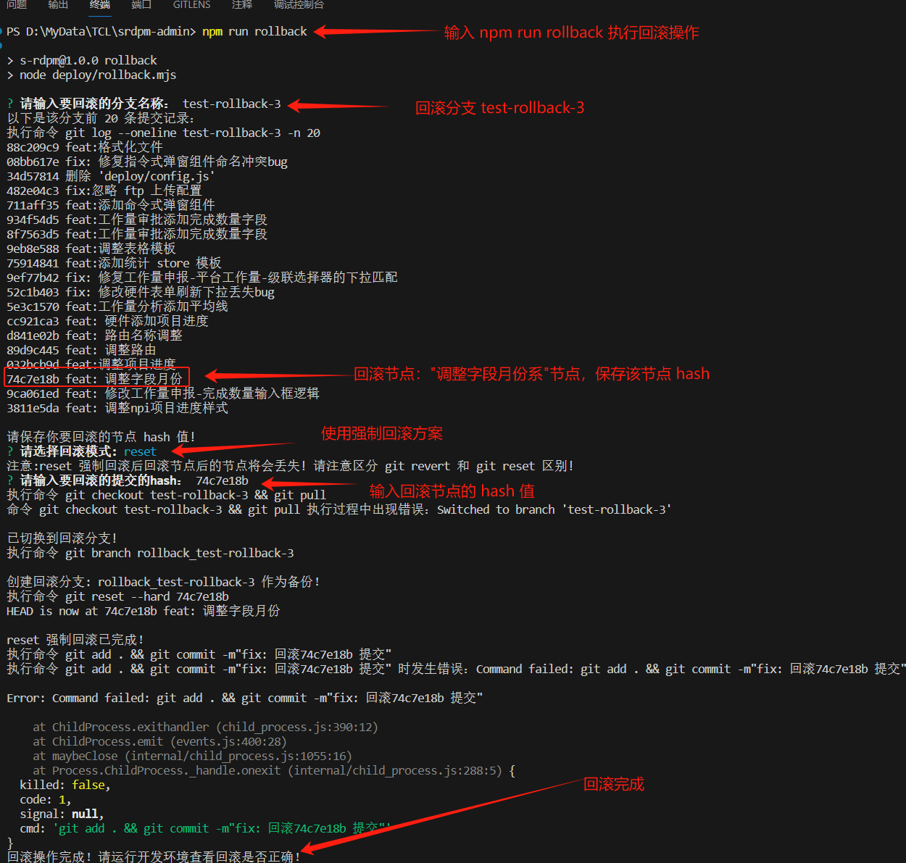

# 版本回滚

## 现状

当前版本回滚没有任何流程化管理模式，使用最原始的分支管理和 git 命令直接回滚

**当前回滚版本流程：**

>  以某系统为例，目前生产服对应 prod 分支代码，测试服对应 test 分支代码，（master 为保护分支，定期将 prod 代码合并到 master）假如生产服某个版本出现重大问题，需要回滚，通过以下 Git 操作流程回滚：

1. 使用 ` git checkout prod` 切换到 prod 分支，使用 `git log` 查看提交记录；
2. 创建新的回滚分支：基于发现bug的版本号或提交ID，从prod分支上创建一个新的回滚分支，命名为rollback_xxx（xxx为对应的版本号或提交ID）。
3. 查找到需要回滚的提交记录 hash 值，复制提交记录 hash 值；
4. 使用命令 `git reset --hard <commit-hash>` 强制回滚，也可以使用 `git revert <commit-hash>` 去除提交记录（两个命令区别可以参考文章：[git 回滚](https://sewar-x.github.io/git/#git-%E5%9B%9E%E6%BB%9A)）；
5. 强制推送到远程分支：`git push --force origin <branch-name>`;
6. 执行命令`npm run build`重新构建并上传当前分支代码；


**手动回滚的方式缺点非常明显**：

* 学习成本高：对于不熟悉 git 命令的开发人员，需要熟悉 Git 各个命令作用和回滚流程；
* 容易出错：首先要熟悉 git 命令和分支管理流程，此外要准确使用 git reset 命令，否则将可能出现不可估量的错误；
* 操作繁琐：每次回滚，都要本地执行以上多个步骤；
* 回滚速度慢：通过手动执行以上命令，需要一定的操作时间，当发布的版本有重大bug时候，回滚速度将严重影响软件质量；

为了避免以上问题，为了能够快速回滚代码，需要将回滚流程自动化；


## 代码自动回滚方案

1. **持续集成/持续部署（CI/CD）工具**：利用CI/CD工具（如Jenkins、GitLab CI、Travis CI等）来实现自动化回滚。可以在发现严重bug后，配置CI/CD工具自动触发回滚操作，例如通过执行预先编写好的回滚脚本或命令来自动回滚代码。
2. **脚本自动化**：编写脚本来实现自动化回滚操作。可以使用Shell脚本、Python脚本等编程语言编写自动化回滚脚本，通过调用版本控制系统的API或命令行工具来实现回滚代码的自动化操作。
3. **版本控制系统的钩子**（Hooks）：版本控制系统（如Git）提供了钩子机制，可以在特定事件发生时触发自定义的脚本。可以编写钩子脚本，在发现严重bug时触发自动化回滚操作。
4. **自动化测试框架**：在自动化测试框架中集成回滚代码的逻辑，当发现严重bug时，自动触发回滚操作并进行回滚后的自动化测试，以验证回滚的效果。
5. **监控和告警系统**：结合监控和告警系统，当发现严重bug时，自动触发回滚操作。可以通过配置监控系统来监视应用程序的健康状态，一旦发现异常情况，自动触发回滚操作以快速修复问题。

## 使用 Node 脚本回滚

**使用流程**

> 使用 node.js 实现一个版本自动回滚的脚本:
>
> 1. 需要通过 npm script 脚本执行命令；
> 2. 通过交互式方式，提示用户输入回滚分支；
> 3. 然后命令行列举出所有分支 git 日志 log 和 hash；
> 4. 然后用户输入回滚节点hash 后，自动回滚分支代码；

实现版本自动回滚脚本需要使用以下库：

| 库              | 作用                                                         |
| --------------- | ------------------------------------------------------------ |
| `inquirer`      | 用于实现交互式命令行，以便提示用户输入回滚分支和回滚节点hash |
| `child_process` | 用于执行命令行操作，例如执行git命令                          |

**实现思路**

1. 安装所需库

```bash
npm install inquirer child_process --save-dev
```

2. 实现思路

- 创建一个Node.js脚本，例如`rollback.mjs`，用于执行版本自动回滚的操作。
- 使用`inquirer`库来提示用户输入回滚分支和回滚节点hash。
- 使用`child_process`库来执行git命令，包括列举分支的日志和hash，以及执行回滚操作。
- 创建回滚命令： ` "rollback": "node deploy/rollback.mjs"`

3. 详细实现代码: `rollback.mjs`

```javascript
// 引入所需的库
import { exec } from 'child_process'
import inquirer from 'inquirer'

/**
 * 执行命令
 */
async function execCommands(command = null, text = null) {
  if (!command) return false
  return new Promise((resolve, reject) => {
    console.log(`执行命令 ${command}`)
    // 执行git revert命令，回滚指定分支到指定提交
    exec(command, (error, stdout, stderr) => {
      if (error) {
        console.error(`执行命令 ${text} 时发生错误：${error.message}`)
        return reject(error)
      }
      if (stderr) {
        console.error(`命令 ${text} 执行过程中出现错误：${stderr}`)
        return resolve(stderr)
      }
      console.log(stdout)
      resolve()
    })
  })
}

/**
 *
 * @param {*} model 回滚模式
 * @param {*} commitHash git 提交 hash
 * @returns
 */
async function rollBack(model, commitHash) {
  switch (model) {
    case 'revert':
      // 执行git revert命令，检出问题节点
      await execCommands(`git revert ${commitHash}`, `git revert ${commitHash}`)
      console.log('revert 检出问题节点已完成！')
      return 1
    case 'reset':
      // 执行git reset命令，强制回滚
      await execCommands(`git reset --hard ${commitHash}`, `git reset --hard ${commitHash}`)
      console.log('reset 强制回滚已完成！')
      return 1
    default:
      console.log('回滚模式错误，退出！')
      return 0
  }
}

/**
 * 获取回滚分支名称
 * @returns
 */
async function startRollBack() {
  // 交互式命令行，提示用户输入回滚分支
  const branchAnswers = await inquirer.prompt([
    {
      type: 'input',
      name: 'branch',
      message: '请输入要回滚的分支名称：'
    }
  ])
  const branch = branchAnswers.branch
  console.log('以下是该分支前 20 条提交记录：')
  // 执行git log命令，列举出指定分支的前20条提交记录
  await execCommands(`git log --oneline ${branch} -n 20  `, `git log --oneline ${branch}`)
  console.log('请保存你要回滚的节点 hash 值!')
  // 交互式命令行，提示用户输入要回滚的方式
  const modeAnswers = await inquirer.prompt([
    {
      type: 'list',
      name: 'model',
      message: '请选择回滚模式:',
      choices: ['revert', 'reset']
    }
  ])
  console.log('注意:reset 强制回滚后回滚节点后的节点将会丢失! 请注意区分 git revert 和 git reset 区别!')

  // 交互式命令行，提示用户输入要回滚的提交的hash
  const commitHashAnswers = await inquirer.prompt([
    {
      type: 'input',
      name: 'commitHash',
      message: '请输入要回滚的提交的hash：'
    }
  ])

  // 执行git checkout命令，切换到回滚分支并同步代码
  await execCommands(`git checkout ${branch} && git pull`, `git checkout ${branch} && git pull`)
  console.log('已切换到回滚分支!')

  try {
    // 执行git branch命令，创建回滚分支作为备份！
    await execCommands(`git branch rollback_${branch}`, `git branch rollback_${branch}`)
    console.log(`创建回滚分支: rollback_${branch} 作为备份！`)
  } catch (err) {
    // 可能已经存在相同的分支名称
    console.log(err)
    console.log(`已存在相同的分支名称 rollback_${branch}`)
  }

  // 回滚模式
  const model = modeAnswers.model
  // 回滚hash 值
  const commitHash = commitHashAnswers.commitHash
  let rollbackStatus = 0

  try {
    rollbackStatus = await rollBack(model, commitHash)
  } catch (err) {
    console.log(err)
    console.log(`在尝试使用 git ${model} 命令来撤销一个特定的提交（${commitHash}），但是遇到了问题:`)
  }

  if (rollbackStatus === 1) {
    try {
      // 执行git push命令，强制同步远程分支代码
      await execCommands(`git add . && git commit -m"fix: 回滚${commitHash} 提交"`, `git add . && git commit -m"fix: 回滚${commitHash} 提交"`)
      // 执行git push命令，强制同步远程分支代码
      await execCommands(`git push --force origin ${branch}`, `git push --force origin ${branch}`)
    } catch (err) {
      console.log(err)
    }
    console.log('回滚操作完成！请运行开发环境查看回滚是否正确！')
  }
}

// 开始执行回滚操作
startRollBack()

```

>  上述代码中，我们使用了`inquirer`库来实现交互式命令行;
>
>  首先提示用户输入要回滚的分支名称，然后执行`git log`命令列举出该分支的提交记录，接着提示用户输入要回滚的提交的hash 和使用的回滚模式，最后执行`git revert` 或 `git reset`命令来回滚指定分支到指定提交。
>
>  注意：创建 `.mjs` 的后缀文件名称，因为 node 中使用 commonjs 模块规范，而`inquirer`库 是使用了 ES 模块规范，因此直接创建 `.js` 文件时，执行 `node rollback.js` 会报错:
>
>  ```shell
>  Error [ERR_REQUIRE_ESM]: Must use import to load ES Module: D:\MyData\TCL\srdpm-admin\node_modules\inquirer\lib\inquirer.js
>  require() of ES modules is not supported.
>  require() of D:\MyData\TCL\srdpm-admin\node_modules\inquirer\lib\inquirer.js from D:\MyData\TCL\srdpm-admin\deploy\rollback.js is an ES module file as it is a .js file whose nearest parent package.json contains "type": "module" which defines all .js files in that package scope as ES modules.
>  Instead rename inquirer.js
>  ```
>
>  下面是该错误的其他解决方案：
>
>  1. **使用 Babel**：
>     Babel 是一个广泛使用的 JavaScript 编译器，可以将 ES6+ 代码转换为 ES5 代码，这样旧版本的 Node.js 也可以运行。你可以配置 Babel 来处理你的 `require` 导入。
>
>  2. **使用 Rollup 或 Webpack**：
>     这些是打包工具，它们可以处理 ES 模块的导入。使用它们，你可以将 ES 模块打包为可以在旧版本 Node.js 上运行的 CommonJS 模块。
>
>  3. **修改 package.json**：
>     你可以修改 `package.json` 中的 "type" 字段为 "commonjs"，这样 Node.js 会将所有的 `.js` 文件视为 CommonJS 模块，而不是 ES 模块。
>
>     ```js
>     {  
>       "type": "commonjs"  
>     }
>     ```
>
>  4. **更新 Node.js**：
>     考虑升级到最新版本的 Node.js，因为新版本可能支持更多的 ES 特性。
>
>  5. **考虑使用 ES6 模块的 polyfill**：
>     尽管这不是最佳实践，但如果你只是需要一个简单的解决方案，可以考虑使用一个 polyfill 来模拟 ES6 的 `import` 和 `export`。但请注意，这种方法可能不是最可靠或最有效的。
>
>  6. **手动转换**：
>     如果你只是需要引入一个或几个 ES 模块，并且不想使用 Babel、Rollup 或 Webpack，你可以手动将 `import` 语句转换为 `require` 语句。例如：
>
>     ```js
>     // ES 模块  
>     import module from 'module';  
>     
>     // 转换为 CommonJS  
>     const module = require('module');
>     ```
>
>  7. **兼容性问题**：
>     如果项目中有其他代码使用了 ES 特性（如 `import` 和 `export`），你可能还需要确保这些代码也被适当地转换或更新。
>
>  最后，选择哪种方法取决于你的具体需求和项目的复杂性。如果项目较大或有特定的构建/部署流程，Babel、Rollup 或 Webpack 可能是一个更好的选择。如果只是一个简单的项目或只需要处理几个文件，手动转换或使用 polyfill 可能更简单。

4. 使用：

   


## 参考资料

[自动打tag的可回滚发布模式](https://juejin.cn/post/7296308638687625226?searchId=2024010419133141E7FAA904594B206262)

