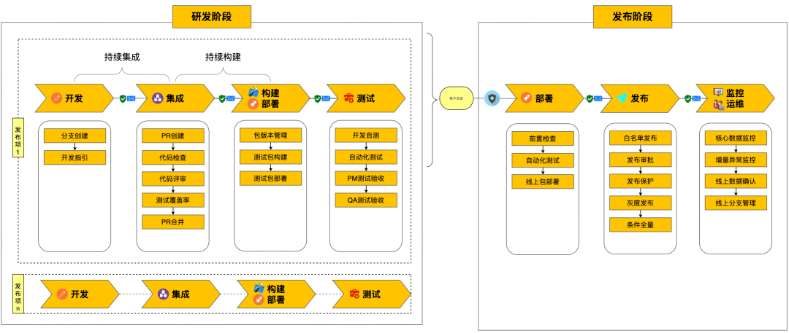
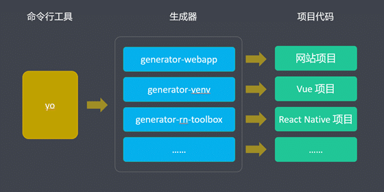
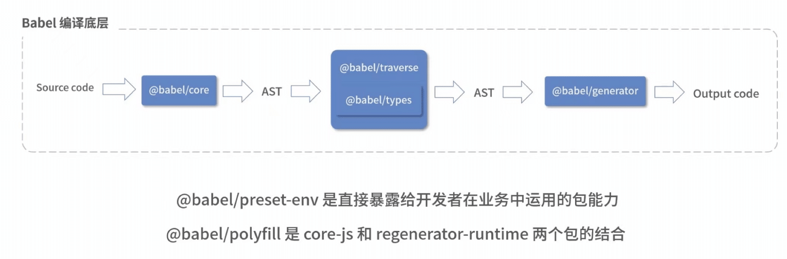
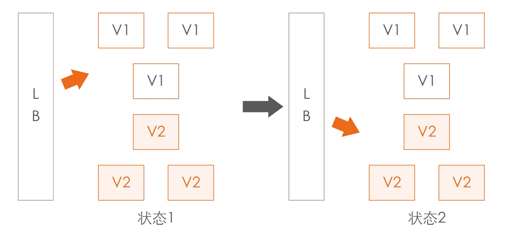
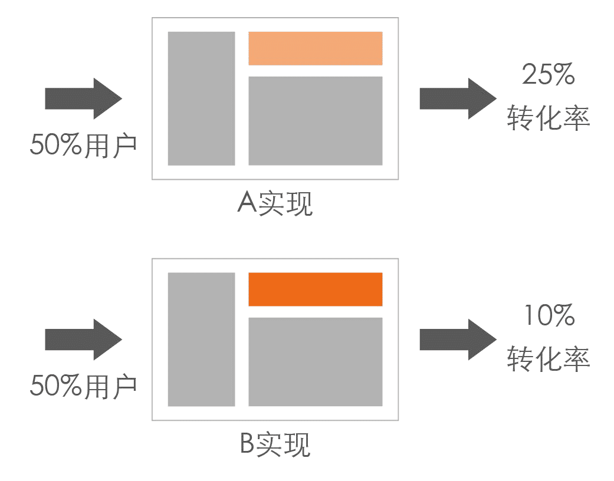
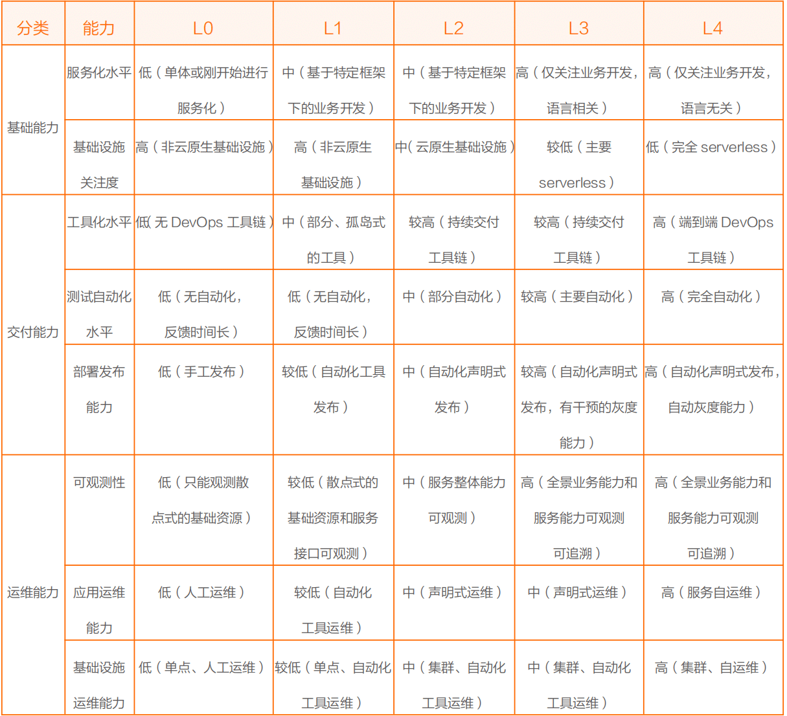

---
category:
  - 前端工程化
tag:
  - 前端工程化
---
# 前端工程化

## 概念和内容

* 概念：根据实际业务的特点，将前端开发的**整个流程** **规范化、标准化**，从创建项目——编码——预览测试——提交——部署，都遵循一定的标准和规范，通过不同的步骤采用不同的**工具提高开发效率和质量**，减低成本的一种手段。


前端工程化通常包括以下几个方面的内容：

1. **代码组织和模块化**：采用模块化的代码组织方式，将前端代码划分为独立的模块，提高代码的可维护性和重用性。常见的模块化规范包括 CommonJS、AMD、ES Modules 等。
2. **构建和打包**：使用构建工具（如Webpack、Parcel、Rollup等）对前端资源（如HTML、CSS、JavaScript、图片等）进行打包、压缩、合并和优化，以减少网络请求和提高加载性能。
3. **自动化测试**：使用自动化测试工具（如Jest、Mocha、Cypress等）编写和运行单元测试、集成测试和端到端测试，以确保代码的质量和功能的稳定性。
4. **代码质量和规范**：使用代码质量工具（如ESLint、Prettier、Stylelint等）进行代码风格检查、代码规范约束和静态代码分析，以确保代码的一致性和可读性。
5. **版本控制和协作**：使用版本控制系统（如Git）进行代码管理和团队协作，包括分支管理、代码合并和冲突解决等。
6. **持续集成和部署**：使用持续集成和部署工具（如Jenkins、Travis CI、CircleCI等）实现自动化的构建、测试和部署流程，以提高开发效率和减少人为错误。
7. **性能优化**：对前端代码和资源进行性能优化，包括减少网络请求、代码懒加载、资源缓存、CDN 加速等，以提供更好的用户体验和页面加载速度。

注意：工程化 不等于 某个工具，工程化是使用各种工具解决前端的各种问题；


----

## 前端工程化全流程



## 工程化相关工具


---


## 脚手架

### 概念

* 概念：前端脚手架（Frontend scaffolding）是一种用于快速搭建前端项目的工具，它提供了一个预设的项目结构、配置文件和一些常用的功能模块，以帮助开发人员快速启动和规范化前端项目的开发工作。

### 作用


脚手架作用：创建项目基本结构 提供项目规范和约定。


- 相同的**组织结构**

- 相同的**开发范式**

- 相同的**模块依赖**

- 相同的**工具配置**

- 相同的**代码基础**

  

### 为什么需要脚手架？

* 脚手架是实现前端自动化的关键工具。
* 目标：**提升前端研发效能**。
* 价值：
  * **自动化**：项目重复代码拷贝 / git操作 / 发布上线操作，实现自动化操作，减少人工操作风险
  * **标准化**：项目创建/git flow/发布流程/回滚流程，实现多个团队各个项目的一系列技术流程、技术操作标准化
  * **数据化**：研发过程系统化，数据化，使得研发过程可量化。比如新建项目的时间，我们可以通过脚手架工具实现其可统计为时间指标，有了指标就能够进一步为我们后续的脚手架迭代带来方向和目标。

脚手架的主要作用是解决以下问题：

1. **项目初始化**：脚手架提供了一个项目的初始结构和文件，免去了手动创建项目结构和配置文件的步骤，节省了时间和精力。
2. **规范化和标准化**：脚手架定义了一套项目的规范和标准，包括文件命名规范、代码风格规范、模块化规范等，使得不同开发人员之间的代码风格和项目结构保持一致，提高了协作效率和代码的可读性。
3. **模块化和组件化**：脚手架提供了一些常用的功能模块和组件，如路由管理、状态管理、表单验证等，开发人员可以直接使用这些模块，减少了重复开发的工作量，提高了开发效率和代码的可维护性。
4. **自动化工作流**：脚手架集成了构建工具、打包工具和自动化测试工具，通过配置文件和命令行工具，实现了**自动化**的构建、打包、测试和部署流程，**减少了手动操作和人为错误**，提高了开发工作的效率和质量。
5. **快速迭代和更新**：脚手架通常会提供更新和升级的机制，开发人员可以通过命令行工具快速更新脚手架的版本，获取最新的功能和修复的 bug，保持项目的技术栈和依赖库处于最新状态，提高了项目的可维护性和可持续发展性。

总的来说，前端脚手架通过提供项目的初始结构、规范、常用功能模块和自动化工作流，解决了项目初始化、规范化、模块化、自动化和快速迭代等一系列问题，帮助开发人员快速搭建和开发前端项目，提高了开发效率和项目质量。

### 脚手架分类


* 通用脚手架工具：

  - **Yeoman** 通用项目脚手架 灵活易拓展
  - **Plop** 创建特定类型的文件/模块

* 专用脚手架工具：

  * vue 脚手架工具： [vue-cli](https://cli.vuejs.org/zh/)

  


### 自定义脚手架

* 创建脚手架流程

  

* 构建脚手架方式：

  * 使用 Yeoman
  * 使用 Node 自定义：[使用 Node.js 开发简单的脚手架工具](https://zhuanlan.zhihu.com/p/37929333)


### [Yeoman](https://yeoman.io/learning/index.html)

#### 概念

* Yeoman 是一个通用的脚手架系统，允许创建任何类型的应用程序。它允许快速开始新项目并简化现有项目的维护。

* Yeoman 是语言不可知论者。它可以生成任何语言的项目（Web、Java、Python、C#等）

* Yeoman 本身不做任何决定。每个决定都是由*生成器*做出的，*生成器*基本上是 Yeoman 环境中的插件。有[很多公开可用的生成器，](https://yeoman.io/generators/)并且很容易[创建一个新的](https://yeoman.io/authoring/)[生成器](https://yeoman.io/generators/)来匹配任何工作流程。Yeoman 始终是满足您脚手架需求的正确选择。


以下是一些常见的用例：

* 快速创建新项目
* 创建项目的新部分，例如带有单元测试的新控制器
* 创建模块或包
* 引导新服务
* 执行标准、最佳实践和风格指南
* 通过让用户开始使用示例应用程序来推广新项目

#### 命令

* yo 是 Yeoman 的命令行管理工具，可以在命令行运行 yeoman 的命令。

* generator 生成器则是 Yeoman 中具体的脚手架。

* 针对不同的项目，例如网站、APP、小程序等，有不同的脚手架生成器。

#### 流程



#### 使用

Yeoman 使用说明及使用步骤：具体使用查看[Yeoman 文档](https://yeoman.io/learning/index.html)。具体构建流程查看官方文档[Yeoman 文档](https://yeoman.io/learning/index.html)。

**使用 yoman 构建webapp:**

1. 全局安装 yo：`npm install -g yo`

2. 安装 generator：不同的 generator 可以生成不同的项目。

   ```
   npm install -g generator-webapp  ||  npm install -g generator-node 
   ```

3. 通过 yo 运行 generator：`yo webapp || yo node`
4. 启动应用：`npm run start`

**使用 yoman 创建脚手架**

1. **安装 Yeoman**：首先，确保你已经安装了 Node.js，然后在命令行中运行以下命令来全局安装 Yeoman：

   ```shell
   npm install -g yo
   ```

2. **创建生成器项目**：在某个目录下创建一个新的文件夹，作为你的生成器项目。进入该文件夹，并在命令行中运行以下命令来初始化一个新的生成器项目：

   ```shell
   yo generator
   ```

   这将会引导你完成生成器项目的初始化设置，包括项目名称、描述等信息。

3. **项目结构和文件**：在生成器项目中，你可以定义生成器的结构和文件。

   * 一般而言，你可以在项目根目录下创建一个`generators`文件夹，用于存放不同类型的生成器。

   * 例如，你可以在`generators`文件夹下创建一个`app`文件夹，用于存放创建应用程序的生成器。

4. **编写生成器逻辑**：在生成器的相应文件中编写逻辑来处理用户的输入和生成项目。你可以使用 Yeoman 提供的 API 来获取用户输入、复制模板文件、修改文件内容等。以下是一个简单的示例：

   ```js
   const Generator = require('yeoman-generator');
   // 导出一个继承自 Generator 的类
   module.exports = class extends Generator {
     // shell 交互提示
     prompting() {
       return this.prompt([
         // 输入项目名
         {
           type: 'input',
           name: 'name',
           message: 'Enter project name:',
           default: this.appname,
         },
          // 输入作者名
         {
           type: 'input',
           name: 'author',
           message: 'Enter author name:',
           default: '',
         },
       ]).then((answers) => {
         // 保存结果
         this.answers = answers;
       });
     }
     // 写入文件方法
     writing() {
       // 创建写入模板数据
       const templateData = {
         name: this.answers.name,
         author: this.answers.author,
       };
   	//  this.fs.copyTpl 是 Generator 提供的文件模板复制方法
       this.fs.copyTpl(
         this.templatePath('template-files/**'),      // 模板路径
         this.destinationPath(this.answers.name),
         templateData
       );
     }
   };
   ```

   > 上述代码中，创建了一个继承自`Generator`的类，并在`prompting`方法中使用`this.prompt`方法获取用户的输入。
   >
   > 然后，在`writing`方法中，使用`this.fs.copyTpl`方法复制模板文件，并使用`this.answers`中存储的用户输入来动态填充文件内容。

5. **测试生成器**：在生成器项目的根目录中，运行以下命令来测试生成器：

   ```shell
   npm link
   yo generator-name
   ```

   这将会使用你的生成器来生成一个项目，根据提示输入项目名称和作者名称，并根据生成器逻辑生成文件。

6. **发布生成器**：如果你希望将生成器发布到 npm 上供他人使用，可以使用`npm publish`命令来发布你的生成器。


### 使用 Node 自定义脚手架

**所需库**

| 库                                                           | 作用                                         |
| ------------------------------------------------------------ | -------------------------------------------- |
| [commander.js](https://link.zhihu.com/?target=https%3A//github.com/tj/commander.js) | 自动的解析命令和参数，用于处理用户输入的命令 |
| [download-git-repo](https://link.zhihu.com/?target=https%3A//github.com/flipxfx/download-git-repo) | 下载并提取 git 仓库，用于下载项目模板        |
| [Inquirer.js](https://link.zhihu.com/?target=https%3A//github.com/SBoudrias/Inquirer.js) | 通用的命令行用户界面集合，用于和用户进行交互 |
| [handlebars.js](https://link.zhihu.com/?target=https%3A//github.com/wycats/handlebars.js) | 模板引擎，将用户提交的信息动态填充到文件中   |
| [ora](https://link.zhihu.com/?target=https%3A//github.com/sindresorhus/ora) | 用于显示下载中的动画效果                     |
| [chalk](https://link.zhihu.com/?target=https%3A//github.com/chalk/chalk) | 给终端的字体加上颜色                         |
| [log-symbols](https://link.zhihu.com/?target=https%3A//github.com/sindresorhus/log-symbols) | 在终端上显示出 √ 或 × 等的图标               |

**思路**


**实现**

1. **初始化项目**：创建一个新的项目文件夹，并在该文件夹中运行`npm init`命令来初始化一个新的Node.js项目。

2. **安装依赖**：在项目的根目录下运行以下命令来安装所需的库：

   ~~~shell
   npm install commander download-git-repo inquirer handlebars ora chalk log-symbols
   ```
   ~~~

3. **创建脚手架文件**：在项目的根目录下创建一个脚手架文件，例如`cli.js`。

4. **编写脚手架逻辑**：在脚手架文件`cli.js`中编写逻辑来处理用户的命令和参数。以下是一个简单的示例：

   ```js
   #!/usr/bin/env node
   
   const commander = require('commander');
   const download = require('download-git-repo');
   const inquirer = require('inquirer');
   const handlebars = require('handlebars');
   const ora = require('ora');
   const chalk = require('chalk');
   const symbols = require('log-symbols');
   const fs = require('fs');
   const path = require('path');
   
   commander.version('1.0.0').description('Custom CLI');
   
   commander
     .command('init <projectName>') // 解析 init 命令
     .action((projectName) => {
       inquirer
         .prompt([
           {
             name: 'author', // 获取作者名称参数
             message: 'Enter the author name:',
           },
         ])
         .then((answers) => {
           // shell 下载提示
           const spinner = ora('Downloading template...').start();
   
           // 下载 git 模板仓库
           download('github:username/repo', projectName, { clone: true }, (err) => {
             if (err) {
               spinner.fail();
               console.log(symbols.error, chalk.red('Failed to download template.'));
             } else {
               spinner.succeed();
               console.log(symbols.success, chalk.green('Template downloaded successfully.'));
   			// 添加项目名称到 package.json 文件
               const packageFile = path.join(projectName, 'package.json');
               // 读取模板文件
               const packageJson = fs.readFileSync(packageFile, 'utf8');
               // 编译  package.json 文件
               const template = handlebars.compile(packageJson);
               // 创建模板
               const result = template({ projectName, author: answers.author });
   			// 写入模板文件
               fs.writeFileSync(packageFile, result);
   
               console.log(symbols.success, chalk.green('Project initialized successfully.'));
             }
           });
         });
     });
   // 解析参数
   commander.parse(process.argv);
   ```

   > 上述代码中，使用了`commander`库来解析命令和参数，根据用户输入的命令来执行相应的操作。
   >
   > 1. 当用户执行`init <projectName>`命令时，我们使用`inquirer`库来与用户进行交互，获取作者的姓名。
   > 2. 使用`download-git-repo`库来下载项目模板，并使用`handlebars`库将用户的输入动态填充到文件中。

5. **设置脚手架文件的可执行权限**：在命令行中运行`chmod +x cli.js`，以确保脚手架文件具有可执行权限。

6. **本地测试**：在项目根目录下运行`npm link`命令，将你的脚手架链接到全局的`node_modules`目录中，从而可以在命令行中直接调用。

   > `npm link` 是一个 Node.js 提供的命令，用于在本地项目和全局安装的模块之间创建软链接。它的作用是将本地项目链接到全局模块目录，从而可以在命令行中直接调用本地项目，就像调用全局安装的模块一样。
   >
   > `npm link` 的具体作用如下：
   >
   > 1. **本地开发测试**: 当你正在开发一个模块或工具，并且希望在其他项目中测试它时，可以使用 `npm link` 将你的模块链接到其他项目中。这样，你可以在其他项目中直接使用你的本地模块进行开发和测试，而不需要手动拷贝或发布模块。
   > 2. **项目依赖调试**: 如果你的项目依赖于某个模块，并且你希望对该模块进行调试或修改，可以使用 `npm link` 将全局安装的模块链接到你的项目中。这样，你可以在项目中直接使用全局模块的本地副本，进行调试和修改，而不需要手动更改全局模块的源码。

**测试**

在命令行中执行 `mycli init myproject` 命令来初始化一个项目，根据提示输入作者的姓名，并下载模板并填充用户输入的信息到文件中。


----


### Vue-cli

#### 基础

* 构建的 vue-cli 工程都到了哪些技术，它们的作用分别是什么？
  * `vue.js`：`vue-cli` 工程的核心。
  * `vue-router`：vue官方推荐使用的路由框架。
  * `vuex`：专为 Vue.js 应用项目开发的状态管理器，主要用于维护vue组件间共用的一些 变量 和 方法。
  * `axios`（ 或者 fetch 、ajax ）：用于发起 GET 、或 POST 等 http请求，基于 Promise 设计。
  * `vux` 等组件库：一个专为 vue 设计的移动端UI组件库。
  * `emit.js` 文件，用于 vue 事件机制的管理。
  * `webpack`：模块加载和 vue-cli 工程打包器。
* vue-cli 工程常用的 npm 命令有哪些？
  * 下载 node_modules 资源包的命令：`npm install`
  * 启动 vue-cli 开发环境的 npm命令：`npm run dev`
  * vue-cli 生成 生产环境部署资源 的 npm命令：`npm run build`
  * 用于查看 vue-cli 生产环境部署资源文件大小的 npm命令：`npm run build --report`
* 自定义脚本命令： 在 `script` 添加命令，使用 `npm run 命令` 执行命令。
* vue-cli目录解析：
  * `build` 文件夹：用于存放 `webpack` 相关配置和脚本。开发中仅 偶尔使用 到此文件夹下 `webpack.base.conf.js`用于配置 `less`、`sass `等 `css `预编译库，或者配置一下 UI 库。
  * config 文件夹：主要存放配置文件，用于区分开发环境、线上环境的不同。 常用到此文件夹下 `config.js` 配置开发环境的 端口号、是否开启热加载 或者 设置生产环境的静态资源相对路径、是否开启gzip压缩、`npm run build` 命令打包生成静态资源的名称和路径等。
  * `dist` 文件夹：默认` npm run build` 命令打包生成的静态资源文件，用于生产部署。
  * `node_modules`：存放npm命令下载的开发环境和生产环境的依赖包。
  * `src`: 存放项目源码及需要引用的资源文件。
  * `src/assets`：存放项目中需要用到的资源文件，css、js、images等。
  * `src/componets`：存放vue开发中一些公共组件：`header.vue`、`footer.vue` 等。
  * `src/emit`：自己配置的vue集中式事件管理机制。
  * `src/router`：vue-router vue路由的配置文件。
  * `src/service`：自己配置的vue请求后台接口方法。
  * `src/page`：存在vue页面组件的文件夹。
  * `src/util`：存放vue开发过程中一些公共的.js方法。
  * `src/vuex`：存放 vuex 为vue专门开发的状态管理器。
  * `src/app.vue`：使用标签`<route-view></router-view>`渲染整个工程的.vue组件。
  * `src/main.js`：vue-cli工程的入口文件。
  * `index.html`：设置项目的一些meta头信息和提供`<div id="app"></div>`用于挂载 vue 节点。
  * `package.json`：用于 node_modules资源部 和 启动、打包项目的 npm 命令管理。

#### 原理

执行过程：
* 终端输入`vue create vue-test-app`
* 终端解析出`vue`主命令
* 终端在环境变量中找到`vue`命令
* 终端根据`vue`命令链接到实际可执行文件vue.js
* 终端利用node执行vue.js
* vue.js解析command和option
* vue.js执行command
* 执行完毕，退出执行


**参考资料**

[vue-cli](https://cli.vuejs.org/zh/guide/)

[自己搭建vue开发环境](https://juejin.cn/post/6844903833160646663#heading-22)

[剖析 Vue CLI 实现原理](https://cloud.tencent.com/developer/article/1781202#:~:text=Vue%20CLI%20%E6%98%AF%E4%B8%80%E4%B8%AA%E5%9F%BA%E4%BA%8E%20Vue.js%20%E8%BF%9B%E8%A1%8C%E5%BF%AB%E9%80%9F%E5%BC%80%E5%8F%91%E7%9A%84%E5%AE%8C%E6%95%B4%E7%B3%BB%E7%BB%9F%EF%BC%8C%E6%8F%90%E4%BE%9B%E4%BA%86%E7%BB%88%E7%AB%AF%E5%91%BD%E4%BB%A4%E8%A1%8C%E5%B7%A5%E5%85%B7%E3%80%81%E9%9B%B6%E9%85%8D%E7%BD%AE%E8%84%9A%E6%89%8B%E6%9E%B6%E3%80%81%E6%8F%92%E4%BB%B6%E4%BD%93%E7%B3%BB%E3%80%81%E5%9B%BE%E5%BD%A2%E5%8C%96%E7%AE%A1%E7%90%86%E7%95%8C%E9%9D%A2%E7%AD%89%E3%80%82,%E6%9C%AC%E6%96%87%E6%9A%82%E4%B8%94%E5%8F%AA%E5%88%86%E6%9E%90%20%E9%A1%B9%E7%9B%AE%E5%88%9D%E5%A7%8B%E5%8C%96%20%E9%83%A8%E5%88%86%EF%BC%8C%E4%B9%9F%E5%B0%B1%E6%98%AF%E7%BB%88%E7%AB%AF%E5%91%BD%E4%BB%A4%E8%A1%8C%E5%B7%A5%E5%85%B7%E7%9A%84%E5%AE%9E%E7%8E%B0%E3%80%82%200.%20%E7%94%A8%E6%B3%95)


## 构建工具

### 构建

* 前端构建（Frontend Build）是指将前端项目中的源代码、资源文件和配置文件等转换、优化和打包成可部署的静态文件的过程。
* 前端构建的目的是提高项目的性能、优化用户体验，并简化部署过程。

前端构建通常涉及以下几个主要步骤：

1. **代码转换和优化**：前端构建工具可以将使用较新的JavaScript语法或特性编写的代码转换为向后兼容的版本，以确保在不支持最新特性的浏览器上正常运行。此外，构建工具还可以进行代码压缩、混淆和优化，以减少文件大小、提高加载速度和执行效率。
2. **模块化管理**：前端构建工具支持将代码拆分为模块，使得开发人员可以使用模块化的方式组织和管理代码。构建工具可以根据模块之间的依赖关系，将它们合并为一个或多个最终的输出文件，减少网络请求的数量，提高加载性能。
3. **资源管理和优化**：前端构建工具可以处理和优化项目中的各种资源文件，如样式表（CSS）、图像、字体等。它们可以对样式表进行预处理、自动添加浏览器前缀、合并和压缩样式表，以及对图像进行压缩和优化，从而减少资源的大小和加载时间。
4. **环境配置和变量替换**：构建工具允许根据不同的环境（如开发、测试、生产）进行配置，并可以在构建过程中替换项目中的变量。这使得开发人员可以轻松地管理不同环境下的配置和行为，例如API端点、调试信息等。

自动化构建（Automated Build）是指使用自动化工具和脚本来执行前端构建过程的方法。通过自动化构建，开发人员可以减少手动操作，提高构建的稳定性和可靠性，并节省时间和精力。

自动化构建通常使用构建工具（如Webpack、Parcel、Gulp、Grunt等）和脚本（如npm scripts、Shell脚本等）来定义和执行构建任务。这些工具和脚本可以根据项目的需求，自动执行各种构建步骤，处理依赖关系、优化资源、生成最终的输出文件等。

### npm script

> npm script 详细介绍可以查看我的博客另一篇：[NPM | Sewen 博客 (sewar-x.github.io)](https://sewar-x.github.io/Front-end-Engineering/npm/)

#### 定义

npm 允许在`package.json`文件里面，使用`scripts`字段定义脚本命令。

> ```javascript
> {
>   // ...
>   "scripts": {
>    	"build": "node build.js"
>   }
> }
> ```

npm script 任务：


#### 原理

* 每当执行`npm run`，就会自动新建一个 **Shell**，在这个 Shell 里面执行指定的脚本命令。因此，只要是 Shell（一般是 Bash）可以运行的命令，就可以写在 npm 脚本里面。

* `npm run`新建的这个 Shell，会将当前目录的`node_modules/.bin`子目录加入`PATH`变量，执行结束后，再将`PATH`变量恢复原样。

* 这意味着，当前目录的`node_modules/.bin`子目录里面的所有脚本，都可以直接用脚本名调用，而不必加上路径。比如，当前项目的依赖里面有 Mocha，只要直接写`mocha test`就可以了。

  > ```javascript
  > "test": "mocha test"
  > ```

  而不用写成下面这样。

  > ```javascript
  > "test": "./node_modules/.bin/mocha test"
  > ```

  由于 npm 脚本的唯一要求就是可以在 Shell 执行，因此它不一定是 Node 脚本，任何可执行文件都可以写在里面。

  npm 脚本的退出码，也遵守 Shell 脚本规则。如果退出码不是`0`，npm 就认为这个脚本执行失败

#### 应用

在项目，可以添加多个命令脚本，执行 `npm run 命令` 的方式执行不同的脚本


**参考资料**

[npm scripts 使用指南](http://www.ruanyifeng.com/blog/2016/10/npm_scripts.html)

---


## 兼容性处理

### core-js

#### **概念**

* core-js是一个JavaScript库，它提供了许多ES5、ES6和其他新特性的polyfills，以**确保这些新特性在旧浏览器上的兼容性**
* Polyfill，也被称为垫片或补丁，是社区提供的一段代码，可以在不兼容某些新特性的浏览器上使用该新特性。
* 它的主要用途是为了确保Web应用程序在所有浏览器中都能运行，并提高代码的可移植性和可维护性。

#### **作用**

1. 兼容性：core-js提供了许多polyfills，可以确保新特性在旧浏览器上正常工作。例如，ES6引入了一个新的数据结构Map，但在旧版本浏览器中可能不支持。使用core-js的Map polyfill可以解决这个问题。
2. 模块化：core-js是完全模块化的库，所有的polyfill实现都有一个单独的module文件。开发者可以根据需要，在每个文件单独引入需要的core-js的modules文件。
3. 最新特性：通过引入core-js，开发者可以使用最新特性的ES写法进行编码，而无需担心浏览器兼容性问题。

使用core-js可以帮助开发者解决浏览器兼容性问题，并提高代码的可移植性和可维护性。

它还提供了一个模块化的架构，使得开发者可以根据需要引入所需的模块，而不是将整个库引入到项目中。这有助于减少项目体积，提高加载速度。

此外，core-js还包含了许多ECMAScript标准的新特性，开发者可以使用最新的ES写法进行编码，而不必担心浏览器兼容性问题。

#### 原理

1. **Polyfill**: Polyfill 是一段代码，用于在不支持某些新特性的环境中提供这些特性的实现。`core-js` 通过提供这些 polyfills 来确保 JavaScript 代码能在各种环境中一致地运行。
2. **模块化**: `core-js` 是完全模块化的，这意味着你可以只引入你需要的部分，而不是整个库。这有助于减少最终打包文件的大小，提高加载性能。
3. **兼容性**: `core-js` 的目标是提供广泛的浏览器兼容性，包括旧版本的浏览器。它通过提供 polyfills 来填补不同浏览器之间的功能差异。
4. **遵循标准**: `core-js` 尽可能遵循 ECMAScript 和 WHATWG/W3C 标准，以确保其行为与原生实现一致。
5. **可配置性**: 开发者可以选择是否将 `core-js` 的 polyfills 直接注入到全局环境中，或者通过不污染全局变量的方式按需引入。这提供了更大的灵活性，允许开发者根据项目需求进行配置。

#### 内置包

在 `core-js` 中，包含的主要包有：

1. **core-js/features**: 这个目录下包含了按照 ECMAScript 和 WHATWG/W3C 标准组织的**各个特性的 polyfills**。例如，`core-js/features/array/from` 提供了 `Array.from` 方法的 polyfill。
2. **core-js/stable**: 这个入口提供了与最**新稳定版** ECMAScript 标准相对应的 polyfills 集合。
3. **core-js/proposals**: 包含了一些处于**提案阶段**的 ECMAScript 新特性的 polyfills。
4. **core-js/web**: 提供了与 WHATWG/W3C Web 标准相关的 polyfills，比如 `URL` 和 `URLSearchParams`。
5. **core-js/pure**: 提供了不污染全局变量的 "pure" 版本的 polyfills，允许更细粒度的引入和控制。


---


### Babel

#### **概念**

Babel是一个JavaScript编译器，主要用于将采用ECMAScript 2015+语法编写的代码转换为**向后兼容的JavaScript语法**，以便在旧版本的浏览器或其他环境中运行。

使用Babel的原因主要有以下几点：

1. **兼容性**：Babel可以**将新的JavaScript语法编译成旧版本的语法**，以确保代码在各种浏览器和环境中都能正常运行。
2. **标准化**：Babel遵循ECMAScript标准，可以确保代码的标准化和一致性。
3. **性能优化**：通过转换代码，Babel可以帮助提高代码的执行效率。
4. **插件系统**：Babel的插件系统使得开发者可以根据需要添加或删除特定的转换功能，提高了代码的可配置性和可维护性。


#### 核心包

Babel是一个JavaScript编译器，它的核心包包括：

1. `@babel/core`：Babel编译器本身，提供了babel的**转译API**，如`babel.transform`等，用于**对代码进行转译**。
2. `@babel/parser`：用于**解析JavaScript代码，将其转换为AST**（抽象语法树）。
3. `@babel/traverse`：用于遍历AST，给插件使用。
4. `@babel/generator`：根据AST生成代码。

此外，Babel还包括一些功能包，例如@babel/types、@babel/template等，用于辅助AST的操作和代码生成。


#### 原理

Babel的原理可以分为三个阶段：**解析、转化和生成**。

1. **解析阶段**：**将JavaScript代码转换为AST**（抽象语法树）。在这个过程中，Babel会根据ECMAScript标准将代码分割成语法单元，并进行语义分析，生成AST。
2. **转化阶段**：**根据AST进行转换操作**。这个阶段可以通过插件来实现自定义的转换逻辑，例如添加polyfills、转换新的JavaScript语法等。在这个过程中，**Babel会遍历AST，并根据插件的规则对AST进行修改**。
3. **生成阶段**：**将转换后的AST生成新的JavaScript代码**。Babel会根据AST的结构和语法规则，生成符合ECMAScript标准的代码，以便在各种环境中运行。

通过这三个阶段的处理，Babel能够将新的JavaScript语法和特性转换为向后兼容的代码，以便在旧版本的浏览器或其他环境中运行。


#### **Babel Monorepo架构包解析**



## 模块化打包工具

### WebPack

#### 概念

Webpack是一个模块打包工具，主要用于将前端资源（如JavaScript、CSS、图片等）进行打包，以便在浏览器中运行。

它能够将多个模块打包成一个或多个文件，并处理模块之间的依赖关系。


Webpack的主要特点包括：

1. 模块化：Webpack将所有资源视为模块，可以方便地管理和组织代码结构。
2. 自动化：Webpack能够自动处理依赖关系，自动打包和刷新，提高了开发效率。
3. 扩展性：Webpack具有丰富的插件系统，可以定制化打包过程，满足各种需求。
4. 兼容性：Webpack能够将现代JavaScript代码转换为旧版本浏览器可运行的代码，提高兼容性。


#### 原理

1. 解析：Webpack从入口文件开始，递归地解析文件中的依赖关系。
2. 转换：对于非JavaScript文件，Webpack使用Loaders进行转换，使其成为模块。
3. 打包：Webpack将解析和转换后的模块打包成一个或多个文件，以便在浏览器中加载和使用。
4. 输出：Webpack将打包后的文件输出到指定的目录中。


### Vite

 #### 原理

**Vite 处理 import 方法**

* 在koa中间件里获取请求path 对应的 body内容；
* 通过es-module-lexer 解析资源AST，并拿到import 的内容如果判断import 的资源是绝对路径，即可认为该资源为 npm模块并返回处理后的资源路径。

**Vite 的 HMR 特性**

* 通过watcher 监听文件改动；
* 通过server 端编译资源，并推送新模块内容给浏览器；
* 浏览器收到新的模块内容，执行框架层面的 `rerender/reload`;


### WebPack VS Vite

**打包思路**


**热更新原理比较**


## 标准化规范和工具

### 代码规范

#### JavaScript 代码规范

在平常项目开发中，我们遵守一些基本规范，比如说：

* 一个函数作用域中所有的变量声明应该尽量提到函数首部。
* 用一个var声明，不允许出现两个连续的var声明，声明时如果变量没有值，应该给该变量赋值对应类型的初始值，便于他人阅读代码时，能够一目了然的知道变量对应的类型值。
* 代码中出现地址、时间等字符串时需要使用常量代替。
* 在进行比较的时候吧，尽量使用 `===`, `!==`代替 `==`, `!=`。
* 不要在内置对象的原型上添加方法，如 Array,Date。
* switch 语句必须带有 default 分支。
* for 循环必须使用大括号。
* if 语句必须使用大括号。

### ESlint

#### 基础知识

#### 配合 VSCode 自动格式化

通过配置 VS Code 可以在编写代码保存后自动格式化代码：

1. VS Code 安装 ESLint 插件

   

2. 设置 VS Code 配置文件 [`settings.json` ](https://code.visualstudio.com/docs/getstarted/settings)

   1. 在 VS Code **用户设置** 中添加配置，此项应用于个人 VS Code 配置 (使用 `Ctrl + p` 搜索 `setting.json` )：

      ```json
      {
          "eslint.packageManager": "npm",
          "eslint.probe": ["javascript", "vue", "html"],
          "editor.codeActionsOnSave": {
              "source.fixAll.eslint": true // 配置该配置项，在 vs code 保存时会自动格式化代码
          }
      }
      ```

   2. 在**工作区设置**中添加配置（工作区设置会覆盖用户设置。工作区设置特定于项目，可以在项目的开发人员之间共享）：

      1. 添加项目 vscode 文件： 在项目根目录直接添加 `.vscode` 目录，目录下添加 `setting.json` 文件，添加以上配置项；
      2. 直接配置工作区： 打开 `文件 -> 首选项 -> 设置 -> 工作区 -> 扩展 -> ESLint` 配置     

3. 项目根目录加上 `.eslintrc.js`  文件 ([ESLint 配置文档](https://eslint.org/docs/rules/))

### 命令行 ESlint 自动修复

1. 在项目 `package.json`  文件中 script 字段添加脚本命令：

   ```json
   "lint": "eslint --ext .js,.vue src --fix" // 自动修复 src 目录下 .js,.vue 文件后缀格式
   ```

2. 执行命令 `npm run lint`

**参考资料**

[前端编码规范工程化](https://encode-studio-fe.github.io/fe-spec/)

[ESLint 文档](https://eslint.org/docs/user-guide/getting-started)

[vue-element-admin ESLint 配置](https://panjiachen.github.io/vue-element-admin-site/zh/guide/advanced/eslint.html#%E9%85%8D%E7%BD%AE%E9%A1%B9)

[vscode 插件和配置推荐](https://github.com/varHarrie/Dawn-Blossoms/issues/10)


---


## NPM 仓库


发布到Npm仓库的模块主要有以下特点：

1. **文件类型**：模块中的文件主要以JavaScript文件为主，但不限于JavaScript文件。例如，一个UI组件可能同时需要JavaScript、CSS、图片文件等。
2. **模块化规范**：模块中的代码大多采用模块化规范。目前支持比较广泛的是CommonJS模块化规范。上传到Npm仓库的代码最好遵守该规范，以方便其他开发者引用和使用。
3. **ES6转ES5**：源代码可能采用ES6编写，但发布到Npm仓库时需要转换成ES5代码，以便在更多环境中运行。如果发布到Npm上的ES5代码是经过转换的，则应同时提供Source Map以方便调试。
4. **描述文件**：在每个模块根目录下都应该有一个描述该模块的`package.json`文件，该文件包含了模块的元数据和其他相关信息。


### **使用 Webpack 构建 Npm 模块**

>  Webpack 适合于构建完整不可分割的 Npm 模块


**参考资料**

[使用 webpack 构建 Npm 模块](https://webpack.wuhaolin.cn/3%E5%AE%9E%E6%88%98/3-13%E6%9E%84%E5%BB%BANpm%E6%A8%A1%E5%9D%97.html)


---


## **组件库/物料库**

## **Mock**

## BFF层


## 测试


## 部署


## 发布

### 发布策略

常见的发布策略包括：

1. **停机发布**：停机发布会在发布以前关闭服务，停止用户访问，然后一次性的升级所有服务。这种发布策略的发布频率

   往往比较低，且需要在发布之前做好充足的测试。

2. **滚动发布**：滚动发布策略通常用于分布式系统，其中每个组件都可以独立发布。这种策略允许在不影响系统其他部分的情况下发布新功能。

3. **蓝绿部署**：蓝绿部署策略涉及到两个完全独立的部署环境，一个是蓝色环境，另一个是绿色环境。首先在蓝色环境中进行新功能的测试，验证通过后，再部署到绿色环境，同时将蓝色环境降级为回滚环境。

4. **金丝雀发布**：金丝雀发布策略是逐步推出新功能给一部分用户使用，然后根据反馈和监控数据决定是否全面发布。这种策略可以降低风险，并在发现问题时及时回滚。

5. **灰度发布**：灰度发布是一种通过从核心应用或服务逐步向周边应用或服务进行功能发布的策略。这种策略可以通过逐一验证各个组件来降低风险。

6. **快速应用开发（RAD）**：RAD是一种迭代开发方法，强调快速构建和发布原型，然后根据用户反馈进行迭代改进。

7. **持续集成/持续部署（CI/CD）**：CI/CD是一种自动化软件构建、测试和部署的方法。它通过自动化流程来加速软件迭代，并减少错误。

8. **微服务发布**：微服务发布策略涉及到将单一应用程序分解为多个小型服务，每个服务都可以独立部署和扩展。这种策略可以加速新功能的推出，并提高系统的可伸缩性。


#### **停机发布**

停机发布会在发布以前关闭服务，停止用户访问，然后一次性的升级所有服务。这种发布策略的发布频率

往往比较低，且需要在发布之前做好充足的测试。

**特点：**

* 所有需要升级的组件被整合到一次发布中

* 一个项目中的大部分应用都会被更新

* 发布之前的研发流程和测试流程往往需要花很长的时间

* 发布时如果出现问题, 修复和回滚的成本很高

* 完成一次停机发布, 需要花费很久的时间, 且需要很多团队在一起才能完成

* 往往需要客户端和服务器端同步升级

停机发布并不适合互联网公司，因为两次发布的间隔很久，从功能特性提出到进入市场的时间太长，对市

场反应不敏感，会在充分竞争的市场里处于下风。每次发布因为要停机，也会带来经济损失。

**优势：**

1. 简单, 不太需要考虑新旧版本共存时的兼容性问题

**劣势：**

1. 发布过程中，服务不可用

2. 只能在业务低峰期 (往往是夜间)发布，并且需要很多团队在一起工作

3. 出现故障后很难回滚

**适合场景：**

1. 开发测试环境

2. 非关键应用，用户影响面小

3. 兼容性比较难管控的场景


#### **金丝雀发布**

在实践中，金丝雀发布一般会先发布到一个小比例的机器，比如 2% 的服务器做流量验证，然后从中快速获得反馈，根据反馈决定是扩大发布还是回滚。

金丝雀发布通常会结合监控系统，通过监控指标，观察金丝雀机器的健康状况。

如果金丝雀测试通过，则把剩余的机器全部升级成新版本，否则回滚代码。


**优势：**

1. 对用户体验影响较小，在金丝雀发布过程中，只有少量用户会受影响

2. 发布安全能够得到保障

**劣势：**

1. 金丝雀的机器数量比较少, 有一些问题并不能够暴露出来

**适用场景：**

1. 监控比较完备且与发布系统集成


#### **灰度发布**

灰度发布是金丝雀发布的延伸

**流程：**

1. 将发布分成不同的阶段/批次，每个阶段/批次的用户数量逐级增加。
2. 如果新版本在当前阶段没有发现问题，就再增加用户数量进入下一个阶段，直至扩展到全部用户。

灰度发布可以减小发布风险, 是一种零宕机时间的发布策略。它通过切换线上并存版本之间的路由权重，逐步从一个版本切换为另一个版本。

整个发布过程会持续比较长的时间, 在这段时间内, 新旧代码共存, 所以在开发过程中, 需要考虑版本之间的兼容性, 新旧代码共存不能影响功能可用性和用户体验。

当新版本代码出现问题时, 灰度发布能够比较快的回滚到老版本的代码上。

结合特性开关等技术，灰度发布可以实现更复杂灵活的发布策略。


**优势：**

1. 用户体验影响比较小, 不需要停机发布

2. 能够控制发布风险

**劣势：**

1. 发布时间会比较长

2. 需要复杂的发布系统和负载均衡器

3. 需要考虑新旧版本共存时的兼容性

**适用场景：**

1. 适合可用性较高的生产环境发布


#### **蓝绿发布**

蓝绿部署是指有两个完全相同的、互相独立的生产环境，一个叫做“蓝环境”，一个叫做“绿环境”。

其中，绿环境是用户正在使用的生产环境。

**流程：**

1. 当要部署一个新版本的时候，先把这个新版本部署到蓝环境中;

2. 然后在蓝环境中运行冒烟测试，以检查新版本是否正常工作:

   * 如果测试通过，发布系统更新路由配置，将用户流量从绿环境导向蓝环境，蓝环境就变成了生产环境。这种切换通常在一秒钟之内就能搞定。

   * 如果出了问题，把路由切回到绿环境上，再在蓝环境中调试，找到问题的原因。

因此，蓝绿部署可以做到仅仅一次切换，立刻就向所有用户推出新版本，新功能对所有用户立刻生效可见



**优势：**

1. 升级切换和回退速度非常快

2. 零停机时间

**不足：**

1. 一次性的全量切换, 如果发布出现问题, 会对用户产生比较大的影响

2. 需要两倍的机器资源

3. 需要中间件和应用自身支持热备集群的流量切换

**适用场景：**

1. 机器资源比较富余或者按需分配 (背靠云厂商)


#### **A/B 测试**

A/B 测试和灰度发布非常像，可以从发布的目的上进行区分。

AB 测试侧重的是根据 A 版本和 B 版本的差异进行决策，最终选择一个版本进行部署。

和灰度发布相比，AB 测试更倾向于去决策，和金丝雀发布相比，AB 测试在权重和流量的切换上更灵活。

* 举个例子，某功能有两个实现版本 A 和 B，通过细粒度的流量控制，把 50% 的用户总是引导到 A 实现上，把剩下的 50% 用户总是引导到 B 实现上，通过比较 A 实现和 B 实现的转化率，最终选择转化率较高的 A 实现作为功能的最终版本。



**优势：**

1. 快速实验能力

2. 用户体验影响小

3. 可以使用生产环境流量做测试

4. 可以针对某些特定用户做测试

**不足：**

1. 需要较为复杂的业务流量识别和控制能力

2. 需要考虑较为复杂的新旧版本兼容性问题

**适用场景：**

1. 用来做业务探索和创新测试

2. 需要对多个方案进行决策


## DevOps 成熟度模型

### **能力分类**

#### 基础能力

包括系统的服务化水平和基础设施水平两块，它是研发和交付的基础。

其中，服务化水平跟应用架构紧密关联，最理想的情况是无服务化架构，比较低级的状况是整个系统耦合在一起的巨石架构；

基础设施水平体现为研发对基础设施所需要的关注度，需要的关注度越高，研发花在基础设施上的成本越高，效率越低，而且稳定性反而难以保障。

#### 交付能力

包括工具化水平、测试自动化水平和部署发布水平三大块，它是工程能力水平的主要体现。

其中，工具化水平指的是研发全流程中涉及到的各类工具的整体水平，包括单点能力（如项目协作工具、构建工具、依赖管理工具、环境管理工具等）和协同能力（如需求与发布的系统、缺陷与测试的打通等）；

测试自动化水平指测试的反馈效率和自动化程度，测试自动化是工程能力的重要组成部分，也是提升部署发布能力的基础；部署发布水平是指把制品上线到生产环境并提供服务的能力，包括发布的自动化程度、稳定性（如平滑的灰度发布）和适应性（即面向不同情况的处理能力及出现问题后的自愈能力）。好的交付应该是持续、快速、高质量和低风险的。

#### 运维能力

包括系统的可观测性、应用的运维水平和基础设施的运维水平，是系统运行时弹性和韧性水平的体现。

其中，可观测性是运维能力中最重要的一环，主要体现在能否站在系统的角度看到全局的运行情况以及其中的问题，通常体现在监控水平和链路分析及问题定位能力上；

应用运维是指对应用进行的运维操作，包括配置项的修改、调整应用运行时参数、对应用进行调整如扩缩容等；基础设施运维是指对系统的基础设施部分的运维操作，包括虚拟机、容器平台、基础服务（如域名、配置中心等），这是整个系统的基础部分。最好的运维就是自运维。


### **成熟度模型**




**L0：**

* 手工批量交付、手工运维，这是零能力的 DevOps 阶段，其服务能力完全取决于开发者个人;
* 业务交付质量普遍不高，随着业务的发展和团队规模的变大会遇到各类问题，通常会首先寻求工具的帮助。

**L1：**

* 手工为主、工具辅助的批量交付和运维，这个阶段开始引入自动化工具来辅助进行运维、发布等工作，
* 通常已经有了服务化的基础，基础设施已经部分上云，并通过引入开源工具或自建搭建了一些完成特定诉求的工具，但这些工具往往还是孤岛，没有联系起来，业务、开发、运维间采用定期同步的方式，需求的交付还是批量式的。

**L2：**

* 基于业务需求的部分自动化的交付运维，这个阶段能基于业务需求进行持续发布，已经采用了声明式运维，通常已经使用云原生的基础设施，并且使用云上的资源管理服务状态，大部分工具链已经能串联起来，实现一定程度的持续交付，服务开始具有中间件级别的抽象和治理能力
* 但一般还无法做到自运维，回滚等操作还需要依赖人来判断和处理。

**L3：**

* 基于业务需求的端到端自动化交付和有限制的自运维，这个阶段的业务需求交付频率和交付质量有了明显提高，服务化水平已经相当高，针对特定的技术栈可以做到大部分情况下关注业务开发，主要服务以serverless 方式发布运行。
* 发布过程可以做到自动化和声明式，只在灰度处理上需要少量的干预，服务已经可以做到大部分情况下的自运维和自治理。

**L4：**

* 业务需求的端到端持续交付和调整闭环、完全自运维，这个阶段开发者只需关注业务开发，且业务需求能够做到快速的交付和调整，服务化水平与技术栈解耦，做到完全 serverless 化。整个交付过程完全自动化，服务能够完全自治理。

**参考资料**

[美团到店终端从标准化到数字化的演进之路](https://mp.weixin.qq.com/s/ayenpMtM5NjMM_HovR5iCQ)

## 监控

# 参考资料

[Yeoman 文档](https://yeoman.io/learning/index.html)

[如何快速开发一个自己的项目脚手架？](https://mp.weixin.qq.com/s/kAHipuplQpe0XbnI7e8rnA)

[前端工程化体系建设从理念到实战](https://www.bilibili.com/video/BV1gV41177Bh?p=7)
