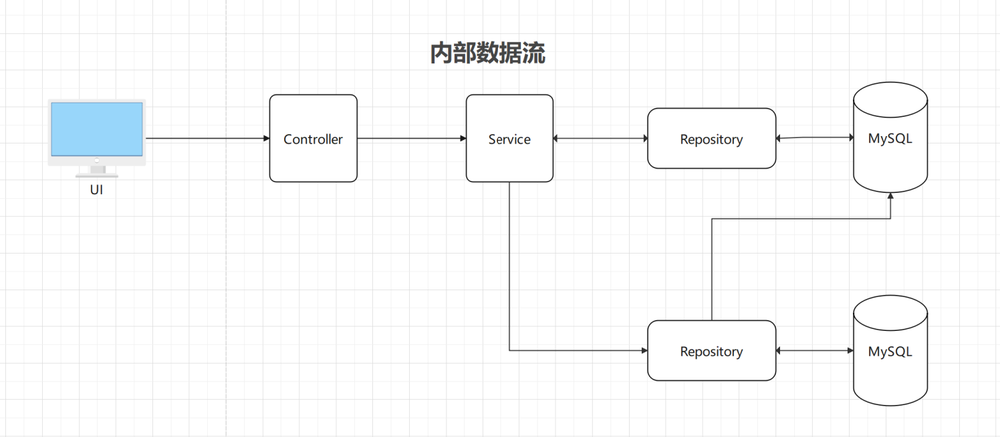
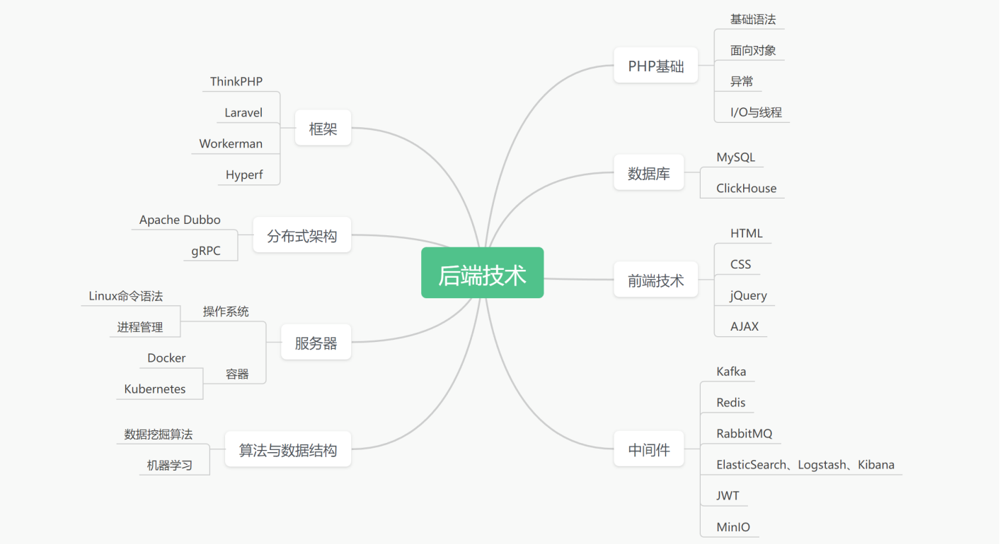
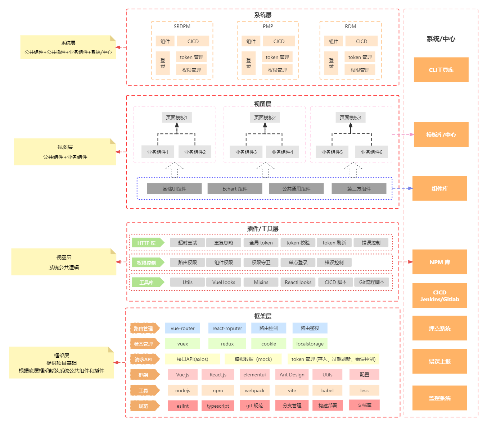
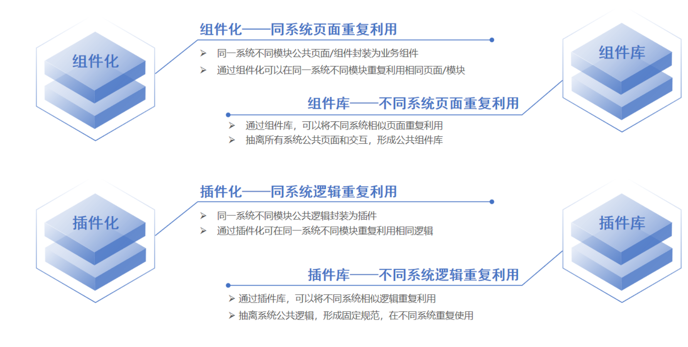

---
category:
  - 前端工程化
tag:
  - 前端工程化
  - 前端架构
---
# 架构实践

目前服务于某制造业公司数字化部门，以下根据当前数字化部门软件架构进行分析

## **服务架构**

### **各层应用架构**

#### **基础设施层**

基础设施层提供各种基础服务

> * **MySQL**: 提供基础数据存储服务；
> * **ElasticSearch**:全文搜索引擎，提供了近乎实时的搜索和分析功能，主要用于存储、搜索和分析大量的数据。在系统中提供搜索数字化流程中附件内容功能；
> * **Redis**: 提供数据缓存服务；
> * **RabbitMQ**: 消息代理软件，面向消息的中间件;
> * **流程引擎**： 提供制造数字化流程中的流程服务；
> * **MinIO OSS**： 开源的对象存储服务，类似于阿里云提供的OSS服务。MinIO允许用户在本地或云上部署，提供了更大的灵活性和自主权，用户可以自由地查看、修改和分发其源代码。提供文件服务。

#### **服务层**

服务层分为技术支撑和业务中心，技术支撑为服务层中使用的技术栈和相关技术分析，业务中心为提供各种服务的平台，使用微服务架构模式搭建，通过各种服务搭建而成。

#### **网络层**

网络层通常提供各种网关服务，该层由集团网络服务中心统一配置。

#### **应用层**

应用层主要为各种系统和服务，在部门中将系统分为应用系统和外部系统；

应用系统为当前部门负责开发和维护的系统，外部系统为其他部门开发和维护的系统；

#### **Service**

各系统中的服务，使用微服务架构。

> * **OAuth2 认证服务**：为各个系统提供统一的认证服务，所有系统通过该服务进行统一认证。
>
> * **API 中间件服务**：集中管理所有 API 服务。
>
> * **项目同步服务**：定时与其他服务同步项目数据服务。

#### **服务器架构**

> 为了提供容灾备份能力，目前团队内部所有服务都采用主从架构：
>
> **MySQL 数据库**：采用读写分离+备份服务。确保数据库高性能、高可用性和数据安全性。
>
> * **读写分离**：
>   - **主库（Master）**：负责处理所有的写操作（如INSERT、UPDATE、DELETE）以及部分或全部的读操作。主库会记录所有更改的二进制日志（Binary Log）。
>   - **从库（Slave）**：负责处理读操作。从库通过复制主库的二进制日志来保持与主库的数据同步。读操作可以根据负载均衡策略分配到多个从库上，从而分散读负载并提高性能。
>   - **读写分离中间件**：为了简化应用程序与多个数据库实例之间的交互，使用中间件（如ProxySQL、MyCAT等）实现读写分离和负载均衡。中间件会根据SQL语句的类型（读/写）将请求路由到适当的数据库实例。
> * **备份服务**：使用增量备份模式备份数据。
>   - **全量备份**：定期（如每天）对整个数据库进行完整备份。这通常是通过使用工具如`mysqldump`或其他第三方备份解决方案来完成的。
>   - **增量备份**：在全量备份之间，可以记录二进制日志的更改，以便在需要时恢复到某个特定时间点。这种备份方法可以减少备份所需的时间和存储空间。
>
> **服务集群**：所有应用服务也是采用主从架构的集群，通过 Nginx 实现主从服务的负载均衡。
>
> * **主服务**：应用系统主要服务。
> * **从服务**：应用系统备份和负载服务。

#### **业务中心**

> * **数据湖中心**：统一的数据中心，为 BI数据分析提供基础数据；
> * **配置中心**：统一管理各种应用配置的基础服务组件，将原本分散在各个应用中的配置信息集中管理起来，通过统一的接口对外提供服务。在微服务架构中，配置中心通常作为整个微服务基础架构体系中的一个组件，用于解决配置的动态变更、权限管理、持久化、运维成本等问题。
> * **镜像包中心**：集中存储和管理软件镜像包的平台。在软件开发和运维领域，镜像包通常指的是软件或应用的安装包、依赖库、插件等文件，它们通常以镜像的形式存储在镜像仓库（如Docker镜像仓库）或其他文件存储服务中。
> * **报表中心**：集成了各种报表功能的管理平台，主要功能是为用户提供数据呈现和决策支持。用户可以统一查看和管理各种类型的报表，包括财务报表、管理报表等。
> * **调度中心：**协调和管理资源、任务或进程，以确保它们按照特定的规则、优先级或需求进行运行。
> * **用户中心**：提供统一的用户登录与注册、基本信息查询与修改等功能。第三方应用需要登录的时候，会把用户的登录请求转发给用户中心进行处理，用户处理完毕后返回凭证，第三方应用验证凭证，通过后就登录用户。
> * **日志中心：**集中管理和存储日志信息。由日志服务提供。
> * **通知中心**：在程序内部提供了消息广播的一种机制。基于观察者模式设计，主要为了解决应用程序内部不同对象之间解耦而设计。由邮件服务提供。
> * **权限中心**：权限管理系统，主要负责用户身份和授权访问的控制，实现资源的访问控制和数据安全保障。能够对不同用户设置不同的访问权限。
> * **监控中心**：系统的控制中心，通常用于对各类设施、设备、环境等进行实时监控和管理。包括数据采集、监控控制、报警处理、数据分析等功能。

#### **服务数据流**

##### **内部数据流**

##### **外部数据流**

#### **服务端技术栈**

## **前端架构**

### 前端构架图

### 组件化和插件化

### 研发流程痛点分析

#### 发版不一致问题

#### 版本管理不规范

#### 版本回退

* 当前没有任何自动化版本回滚，都是通过 git 手动回滚版本；

#### 接口不规范

#### 接口开发进度阻塞UI开发进度

#### 重复造轮子

* SRDPM 登录接口开发一次，PMP 登录接口开发一次；
* SRDPM 用户接口开发一次，PMP 用户接口开发一次；
* SRDPM 权限脚本开发一次，PMP 权限 脚本开发一次；
* SRDPM 自动发版构建脚本开发一次，PMP 自动发版构建脚本开发一次；
* 脚手架不统一：SRDPM 搭建一个基本项目脚手架，PMP 也重新搭建一个基本项目脚手架；
* 组件库不统一：SRDPM 开发一个公共组件库，PMP 也开发一个公共组件库；

当出现多个项目时，如：RDM 重构，数据中台系统，权限管理系统重构，配置中台（配置中心，API 中间件中心，队列管理中心），以上重复工作量为量级增加；

当然，通过粘贴复制基础脚手架也能解决以上问题，然而，如果出现组件库版本更新时候，脚手架配置更新时候，是否所有项目也通过粘贴复制模式将更新代码手动更新？如果更新的量大，该如何解决更新量级问题？

#### 服务与业务耦合

* 单点登录服务与 SRDPM 用户数据耦合；

## 前端架构实践

### 自定义脚手架

#### 为什么要自定义脚手架

### 自定义脚本

* 统一规范
* 统一通用后台管理系统模板
* 统一自动部署脚本
* 统一自定义组件包
* 统一权限管理脚本
* 统一自定义模板生成器
* 统一Mock 数据

### 前端自动部署

### 前端版本回滚

**现状**

当前版本回滚没有任何流程化管理模式，使用最原始的分支管理和 git 命令直接回滚

当前回滚版本流程：以 SRDPM 为例，目前生产服对应 prod 分支代码，测试服对应 test 分支代码，（master 为保护分支，定期将 prod 代码合并到 master）假如生产服某个版本出现重大问题，需要回滚，通过以下 Git 操作流程回滚：

1. 使用 ` git checkout prod` 切换到 prod 分支，使用 `git log` 查看提交记录；
2. 查找到需要回滚的提交记录 hash 值，复制提交记录 hash 值；
3. 使用命令 `git reset --hard <commit-hash>` 强制回滚，也可以使用 `git revert <commit-hash>` 去除提交记录（两个命令区别可以参考文章：[git 回滚](https://sewar-x.github.io/git/#git-%E5%9B%9E%E6%BB%9A)）；
4. 强制推送到远程分支：`git push --force origin <branch-name>`;
5. 执行命令`npm run build`重新构建并上传当前分支代码；

手动回滚的方式缺点非常明显：

* 学习成本高：对于不熟悉 git 命令的开发人员，需要熟悉 Git 各个命令作用和回滚流程；
* 容易出错：首先要熟悉 git 命令和分支管理流程，此外要准确使用 git reset 命令，否则将可能出现不可估量的错误；
* 操作繁琐：每次回滚，都要本地执行以上多个步骤；

为了避免以上问题，为了能够快速回滚代码，需要将回滚流程自动化；

### Node版本回滚

### Jenkins 流水线

### 前端埋点系统

前端埋点系统的好处：

- 记录每个页面的访问量（日周月年的UV、PV）；    
- 记录每个功能的使用量；    
- 捕捉报错情况；    
- 图表化显示，方便给其他部门展示；

## **监控和报警系统**

## **权限系统**

## **用户认证**

### **现状**

1. 各系统已实现单点登陆，但仍然耦合各自应用系统授权登陆，自成一套体系；
2. 用户认证机制与权限耦合，导致扩展性差，不利于维护；
3. 用户认证机制逻辑流程未遵循单一原则，耦合其他字段；
4. 未形成研发内部统一标准规范，及对接API文档；

### **重构方案**

1. 重构用户认证流程，并且新增刷新/校验，及绑定对应唯一APPID；
2. 将现有登陆业务解耦，拆分用户认证与权限逻辑，实现验证逻辑的单一原则；
3. 统一认证中心，签发有效用户凭证；
4. 输出标准规范文档，及API文档；

