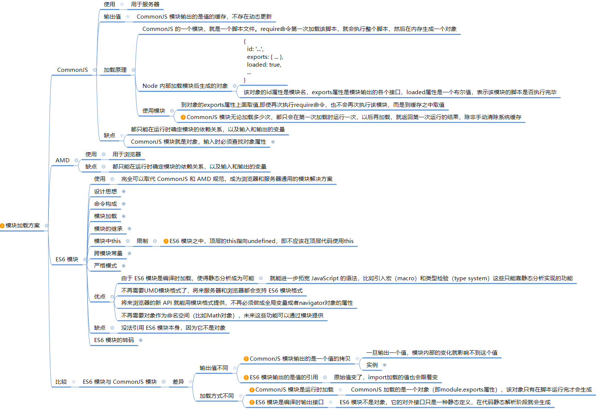
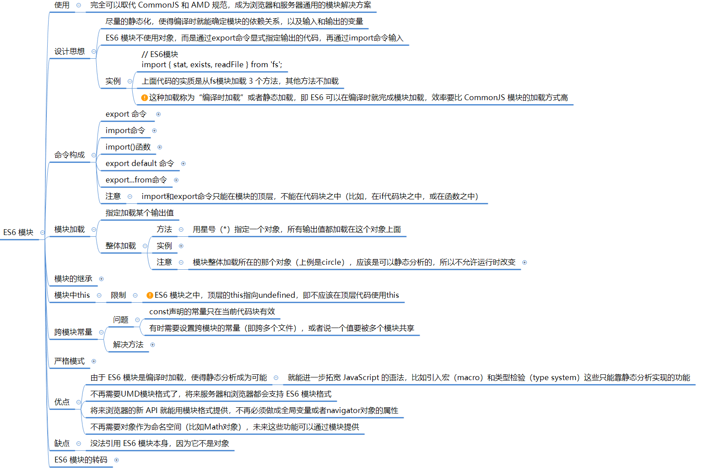
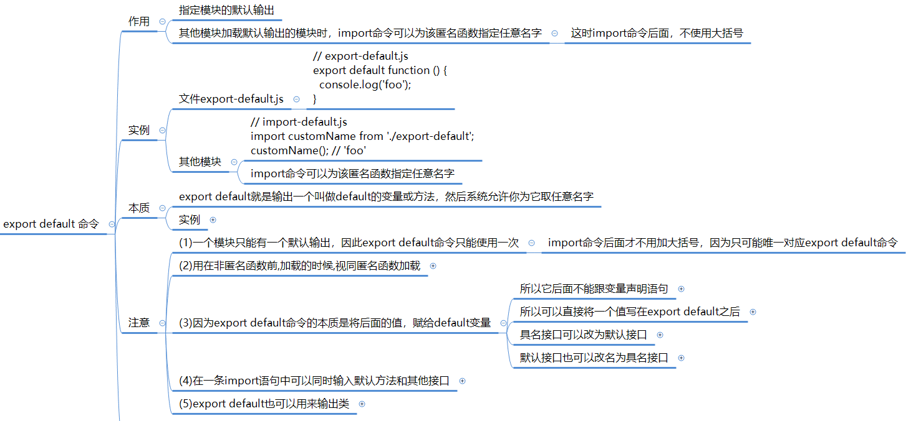
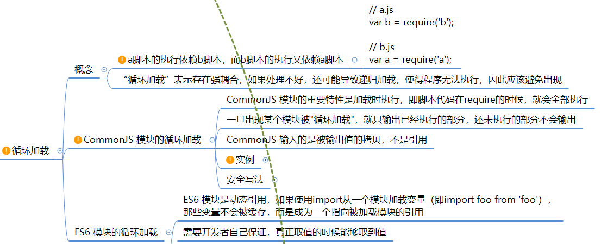

---
category:
  - 前端工程化
tag:
  - 前端工程化
  - 模块加载
---
# 模块加载方案

## **按规范分类**

前端模块加载方案主要可以分为以下几种：

1. **CommonJS规范**：这是Node.js的模块规范，每个文件都被视为一个模块，模块内部定义的变量、函数、类等都是私有的，对外暴露API通过`module.exports`或`exports`。在浏览器端，可以通过Browserify等工具将CommonJS模块转换为浏览器可识别的格式。
2. **AMD规范**：Asynchronous Module Definition的缩写，即异步模块定义。AMD规范是RequireJS在推广过程中对模块定义的规范化产出。它采用异步方式加载模块，模块的加载不影响它后面语句的运行。所有依赖这个模块的语句，都定义在一个回调函数中，等到加载完成之后，这个回调函数才会运行。
3. **ES6模块**：ES6原生支持模块的导入（import）和导出（export），而且其是静态的，有利于编译时优化。与CommonJS和AMD相比，ES6模块不会加载整个文件，而是通过静态分析，只加载需要的代码部分。
4. **UMD规范**：Universal Module Definition的缩写，即通用模块定义。UMD是AMD和CommonJS的糅合，希望同时兼容两种模块加载方式。




## **按目标环境分类**

根据目标环境对前端模块加载方案进行分类，我们可以将其大致分为以下三类：Node.js环境、浏览器环境、以及通用环境。下面将分别说明每种模块加载方案的目标环境、导入导出规范、输出文件格式以及模块加载方案特性。

### Node.js环境：CommonJS规范

**目标环境**：Node.js环境，主要用于服务器端JavaScript开发。

**导入导出规范**：

- 导入：使用`require`函数。
- 导出：使用`module.exports`或`exports`对象。

**输出文件格式**：

* **文件通常为 `.cjs`** 
* CommonJS模块格式，即每个文件都是一个模块，模块之间通过`require`进行依赖关系的管理。

**模块加载方案特性**：

- 同步加载：模块加载是阻塞的，会等待模块加载完成后再执行后续代码。
- 缓存机制：已加载的模块会被缓存，再次`require`相同模块时，会直接返回缓存的模块，避免重复加载。

### 浏览器环境：AMD、ES6模块

**目标环境**：浏览器环境，主要用于前端JavaScript开发。

**AMD规范**：

- 导入导出规范：
  - 导入：使用`require`函数，支持异步加载。
  - 导出：使用`define`函数定义模块。
- **输出文件格式**：AMD模块通常以`.js`文件形式存在，每个文件可以是一个独立的AMD模块。
- 模块加载方案特性：
  - 异步加载：模块加载是非阻塞的，可以并行加载多个模块，提高页面加载速度。
  - 依赖前置：在定义模块时就需要声明其依赖的其他模块。

**ES6模块**：

- 导入导出规范：
  - 导入：使用`import`语句。
  - 导出：使用`export`语句。
- **输出文件格式**：
  - **`.js`、` .esm.js` 、 `.mjs`** 
  - 也可以被打包工具（如Webpack）打包成更优化的格式。
- 模块加载方案特性：
  - 静态加载：模块的依赖关系在编译时确定，有利于进行静态分析和优化。
  - 异步/同步加载：根据构建工具和配置，ES6模块可以支持异步或同步加载。

### 通用环境：UMD规范

**目标环境**：同时兼容Node.js和浏览器环境。

**导入导出规范**：结合了CommonJS和AMD的规范，根据运行时的环境选择合适的模块定义方式。

- **Node.js环境**：使用`module.exports`导出，`require`导入。
- **浏览器环境**：使用`define`定义模块，`require`异步导入。

**输出文件格式**：

* 可以是通用的UMD模块格式，**通常为 `.umd.js`  文件**；
* 也可以被构建工具转换为特定环境的格式。

**模块加载方案特性**：

- 兼容性：UMD模块可以在多种环境中运行，无需修改代码。
- 灵活性：可以根据运行时的环境动态选择模块加载方式。


## CommonJS 模块

commonjs 核心就是 require 语句

**require() 的处理顺序**

当 Node 遇到 require(X) 时，按下面的顺序处理。

（1）如果 X 是内置模块（比如 require('http'）)
　　a. 返回该模块。
　　b. 不再继续执行。

（2）如果 X 以 "./" 或者 "/" 或者 "../" 开头
　　a. 根据 X 所在的父模块，确定 X 的绝对路径。
　　b. 将 X 当成文件，依次查找下面文件，只要其中有一个存在，就返回该文件，不再继续执行。

```
- `X`
- `X.js`
- `X.json`
- `X.node`
```

　　c. 将 X 当成目录，依次查找下面文件，只要其中有一个存在，就返回该文件，不再继续执行。

```
- `X/package.json（main字段）`
- `X/index.js`
- `X/index.json`
- `X/index.node`
```

（3）如果 X 不带路径
　　a. 根据 X 所在的父模块，确定 X 可能的安装目录。
　　b. 依次在每个目录中，将 X 当成文件名或目录名加载。

（4） 抛出 "not found"

**参考资料：**

[require() 源码解读](http://www.ruanyifeng.com/blog/2015/05/require.html)

## ES6模块



**ES6 模块命令**：





## 模块加载混合引用

### **什么是模块混合引用？**

在JavaScript项目中，有时可能需要混合使用不同的模块规范，尤其是在一个项目从旧版本迁移到新版本，或者需要兼容不同的运行环境时。

混合引用不同模块规范的模块意味着在代码中可能同时使用了CommonJS的`require`、AMD的`define`和`require`，以及ES6模块的`import`和`export`。


### **ES6模块加载CommonJS模块**

在ES6模块中加载CommonJS模块通常需要使用构建工具（如Webpack、Rollup等）或者Node.js的模块系统来桥接两者之间的差异。

ES6模块和CommonJS模块在加载机制、作用域和缓存等方面存在本质的不同，因此直接在ES6模块中`import`一个CommonJS模块通常是不被支持的。

以下是在ES6模块中加载CommonJS模块的几种方法：

#### **1. 使用构建工具**

构建工具可以转换你的源代码，使其在不同的环境中都能工作。对于模块加载，构建工具可以处理ES6模块的`import`语句，将它们转换为适合目标环境的代码。

例如，在Webpack中，你可以配置一个别名（alias）或者解析（resolve）规则，使得ES6模块能够正确地导入CommonJS模块。Webpack会自动处理这种转换。

#### **2. 使用Node.js的`require`函数**

在Node.js中，你可以使用`require`函数来加载CommonJS模块，即使在ES6模块中也是如此。但是，请注意，这样做会失去ES6模块的一些特性，如静态分析和tree shaking。

你可以在ES6模块中使用一个小的包装器函数来调用`require`：

```javascript
// ES6模块文件,通过require语句导入 commonjs 模块
const commonjsModule = require('./commonjs-module');  
// 然后通过 ES 模块导出 commonjs 模块
export default commonjsModule;
```

然后，在另一个ES6模块中，你可以这样导入它：

```javascript
import commonjsModule from './wrapper-module';
```

然而，这种方法并不推荐，因为它并没有充分利用ES6模块的优势。

#### **3. 动态导入（Dynamic Imports）**

ES6模块支持动态导入，它使用`import()`函数返回一个Promise，该Promise解析为导入的模块。

虽然动态导入主要用于异步加载模块，但你也可以用它来加载CommonJS模块（如果构建工具支持的话）。

```javascript
// ES6模块文件  
async function loadCommonJSModule() {  
  // 使用import() 动态导入 commonjs 模块
  const commonjsModule = await import('./commonjs-module');  
  return commonjsModule;  
}
```

这种方法仍然依赖于构建工具的处理，因为原生的ES6模块系统不支持直接动态导入CommonJS模块。

### **CommonJS模块加载ES6模块**

在Node.js环境中，直接让CommonJS模块加载ES6模块是不被原生支持的。CommonJS模块使用`require`函数来加载模块，而ES6模块使用`import`语句。

Node.js原生支持CommonJS模块，而ES6模块的支持是通过实验性标志（如`--experimental-modules`）或默认在较新版本中启用的。

由于Node.js在加载模块时区分了CommonJS和ES6模块，所以你不能直接在CommonJS模块中使用`require`来加载一个ES6模块。

但是，有几种方法可以在一定程度上实现这个目标：

#### **1. 将ES6模块转换为CommonJS模块**

你可以使用构建工具（如Babel）将ES6模块转换为CommonJS模块。这样，你就可以在CommonJS环境中使用转换后的模块了。这种方法需要你配置构建工具来处理模块转换，并在构建过程中生成CommonJS格式的模块。

#### **2. 使用动态`import()`在CommonJS模块中加载ES6模块**

Node.js支持在CommonJS模块中使用动态`import()`语法来加载ES6模块。这允许你异步地导入ES6模块，并在CommonJS环境中使用它们。

但是，请注意，`import()`返回的是一个Promise，你需要使用`await`或在Promise的`.then()`回调中处理导入的模块。

```javascript
// CommonJS模块文件  
const importESModule = async () => {  
  // CommonJS模块文件中使用 import() 语句导入 ES6模块
  const es6Module = await import('./es6-module.js');  
  // 使用 es6Module  
};  
  
importESModule();
```

这里的关键是`es6-module.js`文件必须是一个有效的ES6模块，并且Node.js需要以支持ES6模块的方式运行（例如，通过`node --experimental-modules es6-module.js`或者在`package.json`中设置`"type": "module"`）。

#### **3. 更改`package.json`以将整个项目视为ES6模块**

在项目的根目录下的`package.json`文件中，你可以设置`"type": "module"`，这样Node.js就会将整个项目中的所有`.js`和`.mjs`文件当作ES6模块来处理。这允许你在同一个项目中混合使用CommonJS和ES6模块，但请注意，这要求所有的CommonJS模块也使用ES6的`import/export`语法，这通常不是可行的。


### **混合引用处理方案**

当混合引用模块时，需要特别注意避免冲突和确保正确的模块解析。以下是一些关于如何混合引用模块的建议和注意事项：

#### **使用构建工具**

构建工具（如Webpack、Rollup等）可以帮助你处理不同模块规范之间的兼容性问题。这些工具通常允许你配置入口点，并自动处理模块之间的依赖关系，不论它们使用何种规范。

#### 使用UMD或ES6**模块作为通用解决方案**

UMD（Universal Module Definition）是一个模块定义，旨在兼容AMD和CommonJS，这样你的代码就可以在浏览器和Node.js环境中运行。然而，随着ES6模块的普及和构建工具的发展，现在更倾向于使用ES6模块作为通用解决方案，并通过构建工具进行转换以适应不同的环境。

#### 避免在浏览器中直接使用CommonJS**模块**

尽管有些方法可以在浏览器中模拟CommonJS环境（如Browserify），但这通常不是最佳实践。浏览器原生支持ES6模块，因此最好使用ES6模块规范，并通过构建工具进行打包和转换。

#### 在Node.js中使用ES6**模块**

Node.js从某个版本开始支持ES6模块作为官方规范。你可以在`package.json`中添加`"type": "module"`来告诉Node.js你的代码是ES6模块。然后，你就可以在`.js`文件中直接使用`import`和`export`语法。

#### **谨慎处理循环依赖**

循环依赖（即两个或多个模块相互引用）在混合使用模块规范时可能变得更加复杂。确保你的代码没有循环依赖，或者至少以一种可预测和可控的方式处理它们。

示例：在`package.json`**中配置混合模块入口**

虽然不推荐混合使用不同的模块规范，但如果你确实有这样的需求，可以在`package.json`中配置多个入口点来指向不同规范的模块文件。例如：

```json
{  
  "name": "my-package",  
  "version": "1.0.0",  
  "main": "dist/commonjs/index.js", // CommonJS入口，用于Node.js环境  
  "module": "dist/es6/index.js", // ES6模块入口，用于现代前端构建工具  
  "browser": "dist/umd/index.js", // UMD入口，用于浏览器环境  
  // ... 其他配置 ...  
}
```

在这种情况下，构建工具或打包器会根据目标环境选择合适的入口点。但是，请注意，这样的配置可能会导致复杂性增加，并且最好避免在大型项目中使用。

总的来说，虽然技术上可能混合引用不同规范的模块，但这通常不是推荐的做法。最好是选择一种模块规范（通常是ES6模块），并通过构建工具来确保代码在不同环境中的兼容性。

## 模块加载循环引用




## **模块规范对应`package.json`配置字段**

在`package.json`配置文件中，与模块规范对应的入口字段主要有以下几个：

- `main`：对应CommonJS规范，用于Node.js环境中模块的入口。
- `module`：对应ES6模块规范，用于现代前端构建工具（如Webpack、Rollup等）中的模块入口，支持静态导入和tree shaking等特性。
- `browser`：用于指定浏览器环境中的入口文件，通常与打包工具（如Webpack）结合使用，以处理浏览器特定的代码或模块分割。
- `exports`：是一个更通用的字段，允许定义包的导出映射，可以根据不同的导入条件（如导入路径、环境等）返回不同的模块入口。这个字段可以用来替代`main`、`module`和`browser`字段，提供更细粒度的控制。

下面是一个`package.json`配置文件的示例，说明了这些字段如何对应不同的模块规范：

```json
{  
  "name": "my-package",  
  "version": "1.0.0",  
  "description": "A package with different module entry points",  
    
  "main": "dist/main.cjs", // CommonJS入口，用于Node.js环境  
  "module": "dist/main.esm.js", // ES6模块入口，用于现代前端构建工具  
  "browser": "dist/main.browser.js", // 浏览器环境入口，与打包工具结合使用  
  "exports": {  //指定导出文件的路径
    ".": { // 导入文件名称时，实际的文件路径，如： reqiure('my-package') 实际导入 './dist/main.cjs' 文件
      "import": "./dist/main.esm.js", // ES6模块导入入口  
      "require": "./dist/main.cjs", // CommonJS模块导入入口  
      "default": "./dist/main.cjs" // 默认入口，通常与"require"相同  
    },  
    "./feature": {//reqiure('my-package/feature') 实际导入 'my-package/dist/feature/feature.cjs' 文件
      "import": "./dist/feature/feature.esm.js", // 特定功能的ES6模块导入入口  
      "require": "./dist/feature/feature.cjs" // 特定功能的CommonJS模块导入入口  
    }  
  },  
    
  "scripts": {  
    "build": "npm run build:cjs && npm run build:esm && npm run build:browser",  
    "build:cjs": "babel src --out-dir dist --extensions '.js,.jsx' --presets=@babel/preset-env",  
    "build:esm": "rollup src/index.js --file dist/main.esm.js --format esm",  
    "build:browser": "webpack src/index.js --output dist/main.browser.js"  
  },  
    
  "dependencies": {  
    // 项目依赖...  
  },  
    
  "devDependencies": {  
    "@babel/cli": "^7.x.x",  
    "@babel/core": "^7.x.x",  
    "@babel/preset-env": "^7.x.x",  
    "rollup": "^x.y.z",  
    "webpack": "^x.y.z",  
    // 其他开发依赖...  
  }  
}
```

在这个示例中：

- `main`字段指向了`dist/main.cjs`文件，这是使用CommonJS规范编写的Node.js环境入口文件。
- `module`字段指向了`dist/main.esm.js`文件，这是使用ES6模块规范编写的现代前端构建工具入口文件。
- `browser`字段指向了`dist/main.browser.js`文件，这是特定于浏览器环境的入口文件，通常用于与打包工具（如Webpack）结合使用。
- `exports`字段提供了一个映射，允许根据导入条件（`import`或`require`）返回不同的入口文件。它还演示了如何为特定功能（如`./feature`）提供单独的入口。

请注意，这个示例中的构建脚本（`scripts`字段）是假设性的，并且需要根据你的项目配置和使用的工具进行相应调整。实际上，你可能需要根据你的构建过程和工具链来生成这些入口文件（如`dist/main.cjs`、`dist/main.esm.js`等）。


## **模块和npm包的区别**

模块和npm包在JavaScript和Node.js的开发中扮演着不同的角色，它们之间存在一些关键的区别：

### **模块**

模块是一个设计术语，通常指的是在程序设计中，为完成某一功能所需的一段程序或子程序。

**在Node.js中，每一个JavaScript文件都可以被视为一个模块，它们提供了一些功能的实现**。

模块可以是系统自带的，比如Node.js中的内置模块（如http、fs、net等），也可以是用户自定义的。

模块之间通过`require`函数相互引用，以实现更为复杂的功能。

### **npm包**

npm包，或者称为Node.js中的第三方模块，是由第三方个人或团队开发出来的，并免费供所有人使用。

这些**包基于Node.js的内置模块封装而成**，提供了更高级、更方便的API，极大地提高了开发效率。

**通过包中会包含一个 `package.json` 文件**。

npm（node package manager）是JavaScript世界的包管理工具，并且是Node.js平台的默认包管理工具。npm提供了一个巨大的数据库（称为注册表），保存了每个包的信息，使得开发者可以轻松地跟踪依赖项和版本。

**模块和npm包的主要区别**

模块是代码的组织形式，可以是系统自带的或用户自定义的，主要用于实现特定的功能；而npm包则是一种特殊的模块，由第三方开发并共享，主要用于提供高级的API和功能，以提高开发效率。

npm包是通过npm这个包管理工具进行分发和管理的，而模块则不一定需要通过npm进行分发和管理。