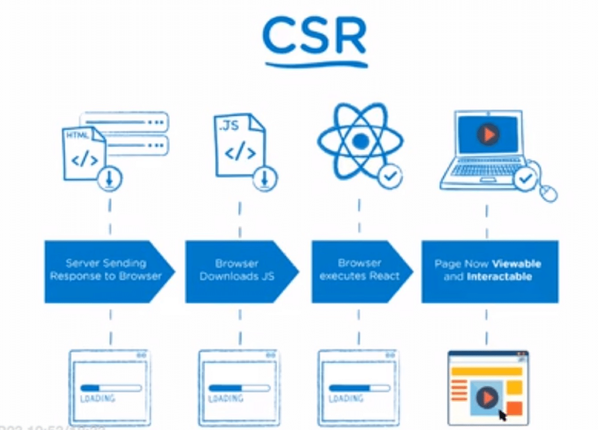
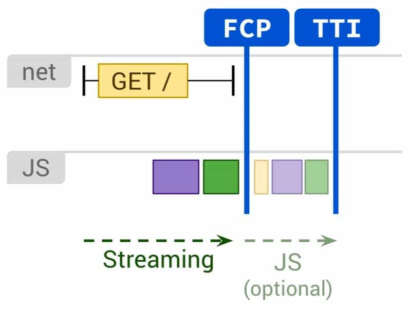
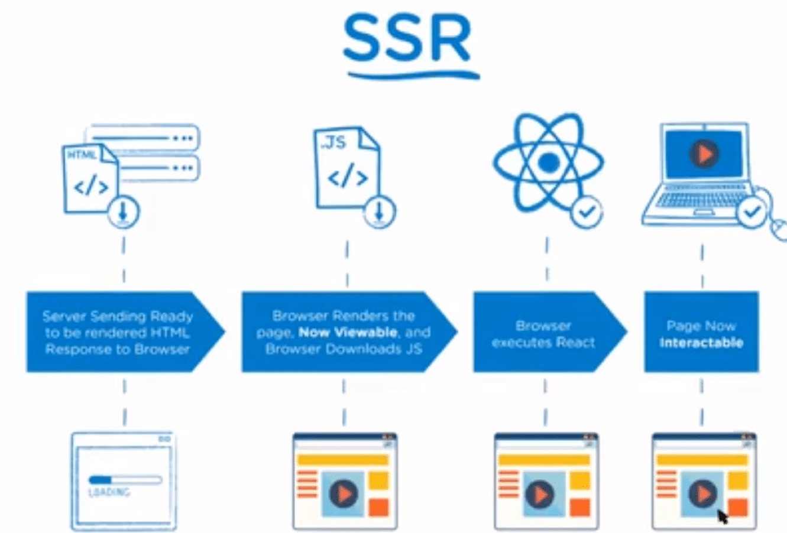
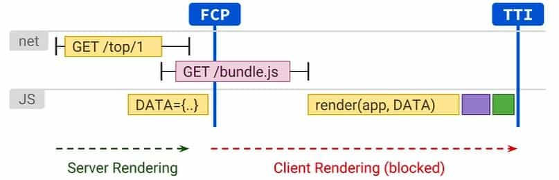

---
category:
  - 前端工程化
tag:
  - 前端工程化
  - 前端渲染架构
---
# 前端渲染架构

## 单页面应用与多页面应用

### 单页面应用

* 概念：

  * 单页面应用（Single Page Application，SPA）是一种基于Web的应用程序架构，通过动态地更新当前页面而不刷新整个页面，提供更流畅的用户体验。

* 特点：

  * **单页面加载**：SPA在初次加载时只加载一个HTML页面，后续的页面切换和内容更新通过JavaScript操作DOM来实现，无需进行整个页面的刷新。
  * **前端路由**：SPA使用前端路由来管理不同视图之间的切换，通过URL的变化来匹配不同的组件或页面。
  * **动态更新**：SPA可以通过AJAX或其他技术从服务器获取数据，并使用JavaScript动态地更新页面内容，实现数据驱动的交互和动态效果。
  * 更好的用户体验：由于只更新部分页面内容，SPA在用户与应用程序交互时提供更快速、流畅的响应，类似于桌面应用程序的体验。
  * 跨平台兼容性：SPA可以在多个平台上运行，如Web浏览器、移动设备浏览器和桌面应用程序。

* 优点：

  * 更快的响应速度：由于只需要加载和渲染部分内容，SPA相对于传统的多页面应用在页面切换和内容更新时具有更快的响应速度。
  * 更好的用户体验：SPA提供类似桌面应用程序的体验，无需频繁刷新整个页面，用户可以无缝地进行交互和导航。
  * 代码复用：SPA通常使用前端框架（如React、Vue等），可以实现组件化开发和代码复用，提高开发效率和维护性。

* 缺点：

  * **初次加载较慢**：由于SPA需要加载并执行大量JavaScript代码，初次加载时可能需要较长时间，尤其是在网络条件较差的情况下。
  * **SEO差**：由于SPA在初次加载时只返回一个HTML骨架，页面内容是通过JavaScript动态生成的，对搜索引擎的抓取和索引性能较差。需要额外的技术手段来解决SEO问题。
  * **浏览器兼容性**：SPA依赖于JavaScript来实现页面更新和交互，因此对于不支持JavaScript的浏览器或搜索引擎爬虫，SPA可能无法正常运行或被索引。

  单页面应用适用于对用户体验和交互性要求较高的应用，如Web应用程序、博客、社交媒体等。它提供了更快速、流畅的用户体验，但需要注意SEO和初次加载时间的优化。

  在使用 React、Vue、Angular 等框架开发的应用大多数为单页面应用。

### 多页面应用

* 概念：

  * 多页面应用（Multiple Page Application，MPA）是一种Web应用程序架构，每个页面都是一个独立的HTML文档，页面之间的跳转和刷新需要加载新的 HTML 文档，会导致整个页面的重新加载。

* 特点：

  * 多个独立页面：MPA由多个独立的HTML页面组成，每个页面对应一个不同的URL。

  * 服务器端渲染：每次跳转或刷新页面时，浏览器向服务器发送请求，服务器生成新的HTML页面并将其发送回浏览器进行加载和渲染。

  * 页面级别的路由：MPA使用服务器端路由来处理不同URL之间的导航和页面切换。

    

* 优点：

  * SEO友好：每个页面都是一个独立的HTML文档，对搜索引擎爬虫更友好，能够更好地被搜索引擎索引和排名。
  * 更好的初始加载性能：由于每个页面都是独立加载的，初始加载时可以只加载当前页面所需的资源，减少了初始加载时间。
  * 浏览器兼容性：MPA不依赖于JavaScript来实现页面更新和交互，因此对于不支持JavaScript的浏览器，仍然能够正常浏览和使用应用。

* 缺点：

  * **页面切换慢**：由于每次页面切换或刷新都需要向服务器发送请求并重新加载整个页面，导致页面切换和内容更新的响应速度较慢。
  * **用户体验较差**：每次页面切换都需要重新加载整个页面，用户体验不如单页面应用（SPA）流畅，可能会有页面闪烁和加载延迟的感觉。
  * **开发复杂性**：由于每个页面都是独立的，需要在每个页面中处理相应的逻辑和交互，增加了开发和维护的复杂性。

## 前端渲染架构类型

前端架构演进方向： **CSR 一> SSR 一>  NSR 一> ESR**

* 前端渲染主要为从服务到浏览器，根据页面渲染方式划分。


### 客户端渲染（CSR）



* 概念：

  * Client-side rendering (CSR) ，一种纯在客户端(浏览器)利用JS操作Dom渲染页面的方式，它是在浏览器端使用JavaScript来动态生成页面内容。

  * 所有的生成逻辑, 数据获取, 模板和路由 都由浏览器而不是服务端来控制。

  * 客户端渲染是当前最流行的渲染模式，常以SPA单页面应用的方式存在；通常使用 Vue/React/Angular  开发的单页面应用一般为客户端渲染；

* 特点：

  * 基于JavaScript：客户端渲染依赖于浏览器中的JavaScript执行，通过在**浏览器中动态生成和操作DOM来呈现页面内容**。

  * **前后端分离**：客户端渲染将前端和后端的职责分离，后端主要负责提供API接口，而前端负责处理数据和渲染页面。
    
    * 与后端的交互主要为API服务接口的数据调用，得到数据后在浏览器中通过 JS 进行模板编译、渲染、页面更新、路由等操作。
    
  * 除了**TTFB短，FCP/FMP 其他都会被延长**，可以通过Http2的服务端推送与`<link rel=preload>`来提升FCP；

    

  * 由于JS和CSS的大小会影响首屏的渲染，所以最好做好代码分割，只提供页面渲染必要的资源代码，应用懒加载的形式来提供其余的资源时非常有必要的；

* 优点：

  * 交互性和动态性：客户端渲染可以实现高度的交互性和动态性，通过JavaScript可以动态更新页面内容、处理用户事件和实现复杂的用户交互逻辑。
  * 快速响应：初始页面加载后，后续的页面更新和数据请求可以通过异步方式进行，提供了快速响应的用户体验。
  * 离线支持：客户端渲染可以使用Service Worker等技术来实现离线缓存和离线访问。

- 缺点：
  - 首屏性能差：由于页面渲染、三方包等逻辑都置于一个JS文件中，首屏加载会导致一定时间的白屏现象。
  - 浏览器SEO性能差：由于现阶段大多搜索引擎采用的爬虫算法是直接抓取页面代码分析，而 SPA 应用只有一个入口文件，由于初始页面内容较少或为空，而没实质内容，内容通过获取后端数据接口通过浏览器端 JS 解析渲染，而搜索引擎不能抓取异步解析的数据。
  - 安全性：由于客户端渲染依赖于浏览器执行JavaScript，可能存在安全风险，如跨站脚本攻击（XSS）等。

### 预渲染 (SSG )

* 概念：

  * SSG是指在**构建时（build time）生成静态HTML文件**，这些文件可以直接提供给浏览器，而不需要在服务器上进行动态渲染。
  * 在构建过程中，组件会被渲染成静态HTML，并保存在文件中。这意味着每个页面都是预渲染的，并且可以以纯静态文件的形式提供给浏览器，无需运行JavaScript代码，会有一些辅助的JS来增强页面交互；

* 特点：

  * **静态HTML文件**：预渲染生成的页面是纯静态的HTML文件，不需要在浏览器端执行JavaScript代码。
  * **快速加载速度**：由于页面已经在构建时生成，没有额外的网络请求和JavaScript执行，预渲染的页面加载速度非常快。
  * **支持SEO**：预渲染的HTML文件包含了完整的页面内容，对搜索引擎更友好，有助于提高网站的搜索引擎排名。

* 适应场景：

  * **静态内容**：适用于**内容相对稳定的页面，页面内容不频繁变化的情况**下，可以使用预渲染来生成静态HTML文件。
  * **高性能要求**：对于**追求快速加载速度和响应性能的网站**，预渲染可以大幅减少页面的加载时间，提供更好的用户体验。
  * **SEO优化**：对于需要更好的搜索引擎优化（SEO）的网站，预渲染可以确保搜索引擎能够看到完整的渲染结果，提高网站的可索引性和排名。

* 不适应场景：

  * **动态内容**：如果页面内容需要实时获取并根据用户交互进行更新，预渲染的静态HTML文件无法满足这种需求。

  * **大规模网站**：对于大规模网站或包含大量动态内容的网站，预渲染可能不太实用，因为构建和维护大量静态HTML文件可能变得复杂和耗时。

  * **频繁变化的内容**：如果页面内容需要频繁更新，每次更新都需要重新构建和生成静态HTML文件，预渲染的成本可能会很高。

  * **大量路由场景**。 如果您的站点有成百上千个路由，则预渲染将非常缓慢。当然，每个更新只需要执行一次，但是可能要花一些时间。大多数人并没有最终获得数千个静态网页，而是以防万一。

    

* **与服务端渲染区别**：

  * 服务端渲染的过程为：服务端获取后端数据 -> 解析执行JS -> 构建HTML页面 -> 输出完整的带数据 HTML 页面给浏览器。
  * 预渲染：直接输出 HTML 结构的页面给浏览器，HTML 页面中只有页面结构或静态内容，没有后端数据内容和 不执行JS。

* 优点：

  - 适合CDN部署；

  - 客户端与服务端压力都比较小；

  - 性能参数都比较优异，TTFB 和 FP 和 FCP几乎相同；

    

* 缺点：

  * **缺乏实时性**：预渲染生成的静态HTML文件是在构建时生成的，因此无法实时响应用户交互或动态数据的变化。如果页面内容需要频繁更新或需要实时交互，预渲染的静态文件无法满足这种需求。对于动态的、个性化的内容作用不大。
  * **构建和维护成本**：对于大型网站或包含大量页面的网站，预渲染可能会导致构建和维护的复杂性增加。每次内容变化都需要重新构建和生成静态HTML文件，这可能需要耗费时间和资源。
  * **数据获取限制**：预渲染过程中，只能获取到构建时的静态数据，无法动态获取数据。如果页面需要从后端或其他数据源获取实时数据，预渲染无法满足这种需求。
  * **更新频率限制**：预渲染的静态HTML文件通常是在构建时生成的，并且在更新时需要重新构建整个网站。这可能导致更新的频率受限，无法实现即时更新。
  * **复杂性管理**：在某些情况下，预渲染可能需要额外的配置和工具来管理。
    * 例如，对于需要根据路由动态生成静态文件的网站，可能需要使用额外的构建工具或静态网站生成器。
    * **必须为每个可能的URL生成单独的HTML文件**。 当无法提前预测这些URL的URL或具有大量唯一页面的网站时，这可能具有挑战性甚至不可行, 如果是纯手工开发，那开发效率相对也比较低。

  

* 常用插件： [prerender-spa-plugin](https://github.com/chrisvfritz/prerender-spa-plugin) 

* 参考资料：

  * [构建时预渲染：网页首帧优化实践](https://tech.meituan.com/2018/11/15/first-contentful-paint-practice.html)

### 服务端渲染（SSR）



* 概念：

  * Server-Side Rendering - 就是在服务器端生成完整的HTML页面，然后将渲染好的页面发送给浏览器进行展示。

* 特点：

  * **服务器生成HTML**：在服务器端使用服务器端技术（如Node.js、Java、Python等）来生成完整的HTML页面，包括页面内容和数据。
  * **静态页面交付**：浏览器收到的是已经渲染好的静态HTML页面，不需要在浏览器端执行额外的JavaScript代码来生成页面内容。

  * **服务器上渲染页面**：后端不仅仅进行数据的获取处理操作，同时也负责页面的生成，最终传到客户端(浏览器)的是生成的包含数据的页面。

* 分类：

  * **流式 SSR 渲染**：允许服务端通过stream的方式向浏览器发送HTML内容；
  * 这种模式使得服务器可以在等待后续数据或完成全部渲染之前，就开始发送 HTML 内容到客户端。
    * 这样可以使得浏览器更快地接收到 HTML 内容并开始解析和渲染，从而提高首屏渲染时间（FCP）和首次内容绘制时间（FCPT）等性能指标。

  * **渐进式 SSR 渲染**：允许在在 hydration（将客户端的 JavaScript 与服务端渲染的 HTML 进行合并和同步）没有完全结束前，部分已经染并注水完成的页面内容，可以优先完成交互响应。
  * 这种模式通常使用 React 的特性，通过将组件树分为不同的优先级，使得一些关键的、用户可能立即与之交互的组件能够更快地被渲染和交互。这样可以提高用户体验，因为用户可以更快地与页面进行交互，而不需要等待整个页面完全加载和渲染完成。
  

  流式 SSR 和渐进式 SSR 的主要区别在于它们处理和传输 HTML 内容的方式。流式 SSR 通过流的方式更快地将 HTML 内容发送给客户端，而渐进式 SSR 则关注在 hydration 过程中优先渲染和交互关键组件，以提高用户体验。

* 渲染流程：服务端渲染的主要流程是在服务器端生成完整的HTML页面，并将其发送给浏览器展示。

  1. 客户端请求：用户在浏览器中输入网址或点击链接，发送请求到服务器。

  2. 服务器接收请求：服务器接收到客户端的请求，并进行处理。

  3. 数据获取：服务器根据请求的内容，可能需要从数据库、API接口或其他数据源获取所需的数据。

  4. 模板渲染：服务器使用事先定义好的模板引擎或渲染框架，将数据注入到模板中，生成完整的HTML页面。

     * 在不同页面之间导航需要下载新的HTML，首页会从缓存中获取已渲染页面，为查找到则服务端重新渲染。

  5. 生成响应：服务器将渲染好的HTML页面作为响应的一部分，包括设置相应的HTTP状态码和头部信息。

  6. 响应发送：服务器将生成的响应发送回客户端，通过网络传输到浏览器。

  7. 客户端展示：浏览器接收到服务器发送的响应后，解析HTML并呈现页面内容。

     * 客户端所需要做的仅仅是html页面的展现和之后的DOM事件处理。

  8. 客户端交互：浏览器加载完初始页面后，可以执行JavaScript代码，处理用户交互、数据请求和动态更新等操作。

     

* 优点：

  * **首次加载性能好**：由于浏览器收到的是完整的HTML页面，无需在浏览器端执行JavaScript来生成页面内容，可以更快地呈现初始页面，提供更好的首次加载性能。

    除了TTFB会延长（服务端需要去准备相应的页面数据），其他三个性能参数都比较客观；

    

  * **SEO友好**：搜索引擎可以直接抓取到完整的渲染好的HTML页面，有利于搜索引擎优化（SEO），提高网页的可索引性和排名。更好的性能数据，客户端压力更。

  * **兼容性好**：由于服务端渲染生成的是静态HTML页面，对于浏览器的兼容性要求较低，适用于各种设备和浏览器。

    

- 缺点：
  - **交互性和动态性受限**：服务端渲染生成的HTML页面在浏览器端呈现后，后续的交互和内容变化需要通过额外的AJAX请求或客户端渲染来实现，相对于客户端渲染，交互和动态性较受限。
  - **服务器负载增加**：由于服务器需要负责生成每个页面的HTML，对服务器的负载要求较高，尤其在高流量或大规模应用中，可能需要增加服务器资源。
  - **开发复杂性增加**：服务端渲染需要在服务器端处理和渲染页面，开发过程中需要考虑服务器端和客户端的逻辑和交互，增加了开发复杂性。
  - **复用性能差**：因为返回的是整个页面，对于每个路由都要重新进行页面刷新，复用性能上不友好。
  - **前后端耦合**: 前端开发依赖于后端，开发形式上不友好，属于前后端不分离模式。
  - **页间加载时间延长**：首屏加载快，跨浏览器兼容性良好，但代价是页间加载时间延长，也就是总体感知上的性能降低：每加载一个页面，都需要一个服务器请求往返的时间。

### 同构渲染 (hydration)


* 概念：

  * 同构渲染（Isomorphic Rendering），也称为通用渲染（Universal Rendering）或一致性渲染（Consistent Rendering），是指将服务端渲染（Server-Side Rendering，SSR）和客户端渲染（Client-Side Rendering，CSR）结合起来的一种渲染策略

  * **同构是 SSR+CSR 的合体**。**首屏的html页面由服务端提供(服务端渲染SSR)**，然后加载 js，js 利用现有的 dom 树来接管渲染后页面的交互操作，跳转到新页面时就变成纯客户端（CSR）渲染。

  * 是一种比较有技术含量的渲染方式，当下比较流行的 NextJs(React) , NuxtJs(Vue) 就是这种渲染技术的成熟框架。

  

* 特点：

  * **服务器端和客户端共享代码**：同构渲染使用同一套代码，采用不同的构建方式，在服务器端和客户端都可以执行，以实现页面的预渲染和后续的客户端交互。
  * **首次加载性能优化**：通过在服务器端生成完整的HTML页面，提供更快的首次加载性能和更好的SEO。使用了 SSR，第一页加载很快；因为客户端可以仅使用已更改的部分重新渲染页面，所以页面之间的导航也是平滑的。
  * **客户端交互和动态性**：在客户端加载完成后，通过客户端渲染或将服务器端生成的HTML进行“混合”（Hydration）操作，恢复交互能力和动态更新。

* 渲染流程：

  1. 客户端请求：用户在浏览器中输入网址或点击链接，发送请求到服务器。

  2. 服务器接收请求：服务器接收到客户端的请求，并进行处理。

  3. 数据获取：服务器根据请求的内容，可能需要从数据库、API接口或其他数据源获取所需的数据。

  4. 服务器端渲染：服务器使用同构渲染框架或库，在服务器端执行相同的代码逻辑，将数据注入到页面模板中，生成完整的HTML页面。

     * 通过Node服务器进行页面的首屏生成，在服务器上渲染网站，缓存其内容，然后在客户端需要时更新渲染。

     * 将同一个组件渲染为服务器端的 HTML 字符串和渲染数据，将它们直接发送到浏览器，最后将这些静态标记"激活"为客户端上完全可交互的应用程序。激活后在客户端交给客户端脚本处理。

     * 服务端渲染后的内容包括 的 **HTML 字符串和渲染数据**：（预先渲染出基本的 HTML 页面结构和内容，将需要的后端数据数据注入页面，数据在客户端渲染时使用）

       > `bundle.js`仍然是全量的 CSR 代码，这些代码执行完毕页面才真正可交互。因此，这种模式下，FP（First Paint）虽然有所提升，但 TTI（Time To Interactive）可能会变慢，因为在客户端二次渲染完成之前，页面无法响应用户输入（被 JS 代码执行阻塞了）

  5. 生成响应：服务器将渲染好的HTML页面作为响应的一部分，包括设置相应的HTTP状态码和头部信息。

  6. 响应发送：服务器将生成的响应发送回客户端，通过网络传输到浏览器。

  7. 客户端展示：浏览器接收到服务器发送的响应后，解析HTML并呈现页面内容。由于服务器端已经预渲染了页面，所以用户可以更快地看到初始内容。

  8. 客户端渲染恢复：在浏览器端加载完初始页面后，客户端会重新执行之前在服务器端执行过的代码逻辑，此时通常会使用客户端渲染技术（如React、Vue等）来处理后续的交互和动态更新。

  9. 数据同步：客户端代码可以通过API请求或其他方式获取与服务器端相同的数据，以确保客户端的数据与服务器端保持同步。

  10. 客户端渲染替换：客户端代码执行后，将服务器端生成的静态HTML进行“混合”（Hydration）操作，将静态内容替换为客户端生成的动态内容，恢复交互能力和动态更新。

  

* 优点：

  * 更好的SEO：由于服务器端生成的HTML内容完整且有助于搜索引擎抓取，有利于提高网页的可索引性和排名。
  * 综合了SSR和CSR的优势：同构渲染结合了SSR的首次加载性能和SEO优势，以及CSR的交互性和动态性。
  * 更好的用户体验：用户可以更快地看到初始内容，同时享受到后续的交互和动态更新。
    * 更快的内容到达时间 (time-to-content)，特别是对于缓慢的网络情况或运行缓慢的设备。
    * 无需等待所有的 JavaScript 都完成下载并执行，才显示服务器渲染的标记，所以你的用户将会更快速地看到完整渲染的页面。
    * 通常可以产生更好的用户体验，并且对于那些「内容到达时间(time-to-content) 与转化率直接相关」的应用程序而言，服务器端渲染 (SSR) 至关重要。

* 缺点：

  * **开发条件所限**。浏览器特定的代码，只能在某些生命周期钩子函数 (lifecycle hook) 中使用；一些外部扩展库 (external library) 可能需要特殊处理，才能在服务器渲染应用程序中运行。
  * **涉及构建设置和部署的更多要求**。与可以部署在任何静态文件服务器上的完全静态单页面应用程序 (SPA) 不同，服务器渲染应用程序，需要处于 Node.js server 运行环境。
  * **更多的服务器端负载**。在 Node.js 中渲染完整的应用程序，显然会比仅仅提供静态文件的 server 更加大量占用 CPU 资源 (CPU-intensive - CPU 密集)，因此如果你预料在高流量环境 (high traffic) 下使用，请准备相应的服务器负载，并明智地采用缓存策略。
  * **技术要求更高**（包含代码处理），同时对服务器和客户端都有性能要求；
  * 通过服务端 `html` 生成方法 `renderToString` 是同步的，这会阻塞 Node 服务主线程；使用 `renderToNodeStream` 是异步的，服务端压力相对而言就没那么大。

同构渲染适用于需要兼顾首次加载性能、SEO和交互性的应用。它可以在首次加载时提供更好的性能和用户体验，而后续的交互和动态性可以通过客户端渲染来实现。但需要注意开发复杂性和服务器负载的增加。


### **原生渲染（NSR）**

* 概念：
  * NSR（Native Script Render）是一种前端渲染技术，它通过使用**原生的渲染方法来生成 HTML 数据**，并**缓存这些数据在客户端**。
  * 将服务器的渲染工作放在了一个个独立的移动设备中，并借助离线存储技术实现了页面的预加载，同时又不会增加额外的服务器压力。

* NSR 的特点：
  * **高效性能**：NSR 使用**原生的渲染方法**，可以在客户端上更快地生成 HTML 数据。相比于传统的服务器端渲染（SSR），NSR 可以减少网络延迟，并提高首屏渲染时间（FCP）和首次内容绘制时间（FCPT）等性能指标。
  * 缓存机制：NSR **将生成的 HTML 数据缓存在客户端**，这样在用户再次访问相同页面时，可以直接从缓存中获取数据，而不需要重新进行渲染。这样可以进一步减少加载时间，提高用户体验。
  * 异步渲染：NSR 支持异步渲染，这意味着在等待后续数据或完成全部渲染之前，服务器可以开始发送 HTML 内容到客户端。这样可以提高页面的加载速度和响应性。
  * 灵活性：NSR 可以与各种前端框架和库集成，例如 React、Vue 和 Angular 等。这使得开发人员可以根据项目需求选择合适的技术栈。

* NSR 的渲染流程如下：
  1. 服务器接收到客户端的请求后，开始进行 NSR 渲染。
  2. 服务器使用原生的渲染方法生成 HTML 数据，并将这些数据**缓存在本地**。
  3. 服务器通过流的方式将 HTML 数据发送给客户端。
  4. 客户端接收到 HTML 数据后，开始解析和渲染页面。
  5. 如果需要，客户端还可以与服务器进行异步通信，获取更多数据并进行进一步渲染。
  6. 在客户端上完成页面的交互和显示。


### **边缘渲染（ESR）**

* 概念：边缘渲染（ESR）是一种前端渲染技术，它利用边缘计算的能力，将页面进行动静拆分，将静态内容缓存在CDN节点上，快速返回给用户，然后在CDN节点上发起动态内容的请求，之后将动态内容与静态部分以流的形式进行拼接，再返回给用户。

* 特点：

  * **快速加载**：由于边缘渲染**将静态内容缓存在CDN节点上**，可以快速返回给用户，提高了首屏加载时间。
  * **减轻服务器压力**：通过将**部分渲染工作转移到CDN节点**，减轻了服务器的压力，降低了服务器的负载。
  * 优化网络传输：通过将**静态内容缓存于CDN节点**，减少了网络传输量，提高了传输效率。
  * 更好的用户体验：在弱网环境下，边缘渲染技术也可以提供较好的用户体验。

  

### Trisomorphic Rendering

* 概念：

  * 把Service Worker也考虑进来的话，还有一种*涉及三方的渲染模式*

  * `SSR + CSR + ServiceWorker rendering = Trisomorphic Rendering`

  * Trisomorphic Rendering（三重渲染）是一种将服务器端渲染（Server-Side Rendering，SSR）、客户端渲染（Client-Side Rendering，CSR）和预渲染（Prerendering）结合起来的渲染策略。

  * 它的目标是在不同的场景下，灵活地选择使用合适的渲染方式来优化性能和用户体验。

  * 首先通过流式 SSR 渲染初始页面，接着由 Service Worker 根据路由规则，借助 SSR 渲染出目标 HTML 页面。

  

* 优点：

  * 最佳渲染策略选择：Trisomorphic Rendering允许根据具体场景选择最佳的渲染方式。对于首次加载性能要求高的页面，可以使用服务器端渲染；对于交互性和动态性要求高的组件或页面，可以使用客户端渲染；对于静态内容不经常变化的页面，可以使用预渲染。
  * 灵活性和可扩展性：通过结合不同的渲染方式，Trisomorphic Rendering提供了更大的灵活性和可扩展性，可以根据具体需求进行调整和优化。
  * 更好的用户体验：通过选择合适的渲染方式，Trisomorphic Rendering可以提供更好的首次加载性能、交互性和动态更新，从而提升用户体验。

* 缺点：

  * 开发复杂性增加：Trisomorphic Rendering需要在开发过程中综合考虑服务器端渲染、客户端渲染和预渲染的逻辑和交互，增加了开发复杂性和学习成本。
  * 配置和部署复杂性：结合不同的渲染方式可能需要配置和部署不同的环境和工具，增加了配置和部署的复杂性。

### 比较


### **参考资料**

[Rendering on the Web](https://developers.google.com/web/updates/2019/02/rendering-on-the-web#:~:text=%20Rendering%20on%20the%20Web%20%201%20Terminology.,Paint%2C%20First%20Contentful%20Paint%20and%20Time...%20More%20)

## SEO

### **概念**

SEO是搜索引擎优化（Search Engine Optimization）的缩写，是通过优化网站的内容、结构和其他因素，以提高网站在搜索引擎中的排名和可见性的过程。

### **SEO 目的**

* **提高网站可见性**：搜索引擎是用户获取信息的主要途径之一，通过SEO可以提高网站在搜索结果中的排名，使其更容易被用户找到。
* **增加有针对性的流量**：通过在搜索引擎中获得更高的排名，可以吸引更多有针对性的流量，即对所提供的产品、服务或内容感兴趣的用户。
* **提升品牌形象**：高排名的网站通常被认为是权威和可信的，通过SEO可以提升品牌在用户心目中的形象和认知。
* **提高用户体验**：SEO优化包括改进网站的内容、结构和导航等方面，这也会为用户提供更好的浏览和使用体验。
* **节约成本**：相比于其他营销手段，SEO是一种相对低成本的方式，可以长期稳定地为网站带来流量和曝光。

### **SEO 标准**


### **SEO 原理**

通过优化网站的结构、内容和链接等因素，提高网站在搜索引擎中的排名，从而吸引更多的访问者。

具体来说，SEO的原理包括以下几个方面：

1. **关键词优化**：关键词是用户在搜索引擎中输入的查询词。通过对关键词的研究和选择，优化网页的标题、描述、内容和标签，使其与用户搜索的关键词匹配，从而提高网页的排名。
2. **内容优化**：创建高质量、有用和独特的内容，包括文字、图片、视频等，以吸引访问者并提高网站的用户体验。搜索引擎通常更喜欢内容丰富、结构清晰、易于阅读的网页。
3. **网站结构优化**：优化网站的结构、布局、导航和链接，使其易于被搜索引擎抓取和理解。这包括优化网站的URL结构、提高网站的内部链接质量等。
4. **链接优化**：建立高质量的外部链接和内部链接，以提高网站的权威性和可信度。外部链接通常来自其他网站，而内部链接则是网站内部页面之间的链接。
5. **用户体验优化**：通过提高网站的速度、安全性、可访问性和易用性等，提高用户体验。搜索引擎通常会考虑这些因素来确定网页的排名。

需要注意的是，SEO是一个长期的过程，需要不断地调整和优化网站的内容、结构和其他因素，以适应搜索引擎算法的变化和用户需求的变化。

同时，SEO也需要遵守搜索引擎的规则和道德标准，避免使用不当的优化手段，如黑帽SEO等。


### **前端 SEO 优化**

#### 添加 `TDK`

* `TDK` :  `title`、`description`、`keyword` 简称.

* `title`：
  * 浏览器上显示的那些内容，不仅用户能看到，也能被搜索引擎检索到（搜索引擎在抓取网页时，最先读取的就是网页标题，所以title是否正确设置极其重要。）
  * title一般不超过80个字符，而且词语间要用英文“-”隔开，因为计算机只对英语的敏感性较高，对汉语的敏感性不高。
  * 重要关键词出现不要超过 2 次，而且要靠前，不同页面 title 要有所不同。
  * 用法：`<title>网站标题</title>`
* description（内容摘要）:
  * description 是对于一个网页的简要内容概况。
  * description一般不超过150个字符，描述内容要和页面内容相关。
  * 用法：`<meta name="Description" Content="你网页的简述">`
* keywords（关键词）:
  * 主要作用是告诉搜索引擎本页内容是围绕哪些词展开的。
  * keywords 的每个词都要能在内容中找到相应匹配，才有利于排名。
  * keywords一般不超过3个，每个关键词不宜过长，而且词语间要用英文“,”隔开。
  * 用法：`<meta name="Keywords" Content="关键词1,关键词2,关键词3,关键词4″>`

#### 添加结构化数据

* 结构化数据（英文：Structured data）是一种标准化格式，用于提供网页的相关信息并对网页内容进行分类；
* 作用：增加展示信息，利于排名。结构化数据优化过的网站，在Google搜索中比单一的通过title，url，description三部分展示的信息更多更全，更加有助于排名，而且也更加吸引读者点击，也是Google比较推崇的。

#### 添加站点地图

* 站点地图是网站的蓝图，可帮助搜索引擎查找、爬取和索引网站的所有内容。它还会告诉搜索引擎您网站上的哪些页面最重要。
* 站点地图不是面向用户的，而是面向搜索引擎的。
* 主要作用是：主动帮助搜索引擎爬取网站内容，告诉搜索引擎哪个页面很重要。
* 网站地图主要有四种类型：
  - 普通XML网站地图：这是迄今为止最常见的网站地图类型。通常以XML Sitemap的形式链接到您网站上的页面。
  - 视频站点地图：专门用于帮助Google了解您页面上的视频内容。
  - 新闻站点地图：帮助Google在“Google新闻”审核过的网站上查找内容。
  - 图片站点地图：帮助Google 查找您网站上托管的所有图片。

#### 代码优化

* 减少无效代码；

* html 代码优化：

  * 重要内容 HTML 代码放在最前：搜索引擎抓取 HTML 顺序是从上到下，有的搜索引 擎对抓取长度有限制，保证重要内容肯定被抓取。
  * `<body>` 的代码遵循语义化：
    *  h1~h6标签多用于标题  
    *  ul标签多用于无序列表 
    *  ol标签用于有序列表  
    *  dl标签用于定义数据列表 
    *  em,strong表示强调 
    *  span标签是html里面最没有语义的
  * 标签优化：
    * `<a>` 标签：加上链接说明title，另外对于指向其他网站的链接要加上"rel=nofollow",表示不要爬取这个链接。
    * ``标签应使用alt说明，爬虫对图片的读取有限。

* CSS 代码优化：

  * 减少 CSS 结构嵌套

  * 隐藏内容元素对SEO影响：display:none 和 overflow:hidden 大量地被使用会被SEO认为作弊

  * 使用 display: none 控制 tab 元素显示隐藏，但是  display: none 大量地被使用会被SEO认为作弊

    解决方式： 使用 height: 0；控制不显示元素方式代替 display:none；

* JS 代码优化：

  * 重要内容不要用 js 输出：爬虫不会执行 js 获取内
  * 避免内嵌 JS 代码；
  * 少用 iframe：搜索引擎不会抓取 iframe 中的内容。

#### 内容优化

* 增加页面有效内容

**参考资料：**

[网站TDK对SEO有什么影响](http://www.tianying888.com/gongsidongtai/70326.html)

[google 结构化数据介绍](https://developers.google.com/search/docs/guides/search-gallery?hl=zh-cn)

[了解站点地图](https://support.google.com/webmasters/answer/156184?hl=zh-Hans)

[什么是站点地图？如何优化站点地图？](https://zhuanlan.zhihu.com/p/144078265)

[浅谈Google SEO里的结构化数据优化](https://zhuanlan.zhihu.com/p/76258427)

## PWA 应用

### 概念

* PWA 全称 Progressive Web App，即渐进式 WEB 应用。
* PWA 应用是一个网页, 可以通过搜索引擎发现。
* 使用 Manifest 和 Service Worker 来实现 PWA 的安装和离线等功能。

### PWA 特性

- [可发现（Discoverable）](https://developer.mozilla.org/en-US/docs/Web/Progressive_web_apps/Introduction#Advantages_of_web_applications#discoverable), 可以通过搜索引擎发现。
- [可安装（Installable）](https://developer.mozilla.org/en-US/docs/Web/Progressive_web_apps/Introduction#Advantages_of_web_applications#installable), 可以出现在设备的主屏幕。
- [可链接（Linkable）](https://developer.mozilla.org/en-US/docs/Web/Progressive_web_apps/Introduction#Advantages_of_web_applications#linkable), 可以简单地通过 URL 分享。 
- [独立于网络（Network independent）](https://developer.mozilla.org/en-US/docs/Web/Progressive_web_apps/Introduction#Advantages_of_web_applications#network_independent), 可以在离线状态或者是在网速很差的情况下运行。
- [渐进式（Progressive）](https://developer.mozilla.org/en-US/docs/Web/Progressive_web_apps/Introduction#Advantages_of_web_applications#progressive), 在老版本的浏览器仍旧可以使用，在新版本的浏览器上可以使用全部功能。
- [可重入（Re-engageable）](https://developer.mozilla.org/en-US/docs/Web/Progressive_web_apps/Introduction#Advantages_of_web_applications#re-engageable), 无论何时有新的内容，都可以发送通知。
- [响应式（Responsive）](https://developer.mozilla.org/en-US/docs/Web/Progressive_web_apps/Introduction#Advantages_of_web_applications#responsive), 在任何具有屏幕和浏览器的设备上可以正常使用——包括手机、平板电脑、笔记本、电视、冰箱等。
- [安全（Safe）](https://developer.mozilla.org/en-US/docs/Web/Progressive_web_apps/Introduction#Advantages_of_web_applications#safe), 在用户、应用和服务器之间的连接是安全的，第三方无法访问你的敏感数据。

### 主要结构

- 提供 [App Shell](https://developer.mozilla.org/zh-CN/docs/Web/Progressive_web_apps/App_structure#app_shell_%E6%A6%82%E5%BF%B5) 基本外壳可以添加至主屏幕。使用 Manifest 实现。
- 提供离线缓存功能。使用 service worke 实现。
- 提供消息推送功能。使用 service worke 实现。


### App Shell

* 概念：提供一个 Web APP 的外壳，然后缓存它，以便在后续访问时可以离线使用，然后再加载应用程序的所有内容。这样，下次有人从设备访问应用程序时，UI 立即从缓存加载；如果缓存数据不可用的话，再从服务器请求新内容。
  * 从 HTML 的角度，App Shell 就是 content 节之外的内容。再使用 JS 处理模板生成 content 中的内容。
* 优点：
  * 这种结构的页面很快，给用户的感觉也很快：用户会立即看到内容而不是加载动画或空白页。
  * 如果网络连接不可用，允许离线访问网站。
  * 网站感觉就像一个原生应用，交互及时、性能可靠。

### Manifest

可安装网站需要满足以下条件：

- 一份网页清单，填好[正确的字段](https://developer.mozilla.org/en-US/docs/Web/Progressive_web_apps/Add_to_home_screen#manifest)
- 网站的协议必须是安全的（即使用 HTTPS 协议）
- 一个在设备上代表应用的图标
- 一个注册好的 Service Worker，可以让应用离线工作（这仅对于安卓设备上的 Chrome 浏览器是必需的）

Manifest: 离线访问的关键在于一份网页清单，它通过 JSON 形式列举了网站的所有信息。

它通常位于网页应用的根目录，包含一些有用的信息，比如应用的标题、在移动设备操作系统上显示的代表该应用的不同大小的图标（例如主屏图标）的路径，和用于加载页或启动画面的背景颜色。浏览器需要这些信息来安装 web 应用并使其在主屏上显示。

参考资料：

[清单文件 (Manifest)](https://developer.mozilla.org/zh-CN/docs/Web/Progressive_web_apps/Installable_PWAs#清单文件_(manifest))

### Service Worker

* 概念： Service Worker 是浏览器和网络之间的虚拟代理。

* 特点：

  * 运行在一个与页面 JavaScript 主线程独立的线程上，单独的作用域范围，单独的运行环境和执行线程。

  * 不能操作页面 DOM。但可以通过事件机制来处理。

  * 不受页面刷新的影响，可以监听和截拦作用域范围内所有页面的 HTTP 请求。

  * API 是异步非阻塞的，并且可以在不同的上下文之间发送和接收信息。

  * 它设计为完全异步，同步API（如[XHR](https://developer.mozilla.org/zh-CN/docs/Web/API/XMLHttpRequest)和[localStorage](https://developer.mozilla.org/zh-CN/docs/conflicting/Web/API/Web_Storage_API)）不能在service worker中使用。

  * 事件驱动型服务线程。可分配给 Service Worker 一些任务，并通过基于 [Promise](https://developer.mozilla.org/en-US/docs/Web/JavaScript/Reference/Global_Objects/Promise) 的方法在任务完成时收到结果。

  * 网站必须使用 HTTPS。除了使用本地开发环境调试时(如域名使用 localhost)。

    * > 为什么要求网站必须是HTTPS？
      >
      > 因为service worker权限太大能拦截所有页面的请求，使用 http 的网站安装 service worker 很容易被攻击,修改网络请求的能力暴露给中间人攻击会非常危险

* Service Worker 使用场景：

  - [后台同步](https://github.com/slightlyoff/BackgroundSync)：启动一个service worker即使没有用户访问特定站点，也可以更新缓存
  - [响应推送](https://developer.mozilla.org/zh-CN/docs/Web/API/Push_API)：启动一个service worker向用户发送一条信息通知新的内容可用
  - 后台数据同步
  - 响应来自其它源的资源请求
  - 集中接收计算成本高的数据更新，比如地理位置和陀螺仪信息，这样多个页面就可以利用同一组数据
  - 在客户端进行 CoffeeScript，LESS，CJS/AMD等模块编译和依赖管理（用于开发目的）
  - 后台服务钩子
  - 自定义模板用于特定URL模式
  - 性能增强，比如预取用户可能需要的资源，比如相册中的后面数张图片

* 生命周期：注册、sw.js 文件下载、安装，激活。

  * 流程图

* 安全性问题

  * 跨域请求支持：  SW 可以拦截它作用域内的所有请求，跨域资源也不例外，但是浏览器默认对跨域资源发起的是 no-cors 请求，得到的 response 是 opaque 的， 所以会导致我们无法判断跨域请求是否成功，以便进行缓存，因此我们需要修改 fetch 请求头部信息，添加 mode：’cors’ 标记。
  * no-cors：该模式允许来自 CDN 的脚本、其他域的图片和其他一些跨域资源，但是首先有个前提条件，就是请求的 method 只能是 HEAD 、GET 、POST 。此外，如果 ServiceWorkers 拦截了这些请求，它不能随意添加或者修改除这些之外 Header 属性。第三，JS 不能访问 Response 对象中的任何属性，这确保了跨域时 ServiceWorkers 的安全和隐私信息泄漏问题。
  * opaque：Response 对象中 type 属性的值 ， 在 ‘no-cors’ 模式下请求了跨域资源，依靠服务端来做限制。

  

### 离线缓存

- Service Workers  缓存：Service Workers  能够拦截 HTTP 请求，进入任何传入的 HTTP 请求，并决定想要如何响应。在你的 Service Worker 中，可以编写逻辑来决定想要缓存的资源，以及需要满足什么条件和资源需要缓存多久。
  - 与 HTTP 缓存比较：Web 服务器可以使用 Expires 首部来通知 Web 客户端，它可以使用资源的当前副本，直到指定的“过期时间”。反过来，浏览器可以缓存此资源，并且只有在有效期满后才会再次检查新版本。使用 HTTP 缓存意味着你要依赖服务器来告诉你何时缓存资源和何时过期。

* **注册：**使用 [`ServiceWorkerContainer.register()`](https://developer.mozilla.org/zh-CN/docs/Web/API/ServiceWorkerContainer/register) 方法在该站点注册。其内容在 sw.js 文件中，可以在注册成功后执行。

  ```js
  if('serviceWorker' in navigator) {
      navigator.serviceWorker.register('/sw.js');
  };
  ```

* **安装：**sw.js 监听 install 事件、`e.waitUntil()`等待 service worker 安装完成、Cache API 开启了一个缓存，并且将我们的应用所需要缓存的文件全部添加进去，当我们再次加载这些资源时，由请求 URL 确定的对应缓存就是可用的。

  ```js
  self.addEventListener('install', function(e) {
    console.log('[Service Worker] Install');
    e.waitUntil(
      caches.open(cacheName).then(function(cache) {
            console.log('[Service Worker] Caching all: app shell and content');
        return cache.addAll(contentToCache);
      })
    );
  });
  ```

  * API 介绍：
    * `e.waitUntil()`：等待 service worker 安装完成。[`ExtendableEvent.waitUntil`](https://developer.mozilla.org/zh-CN/docs/Web/API/ExtendableEvent/waitUntil)方法告诉事件分发器该事件仍在进行。这个方法也可以用于检测进行的任务是否成功。在服务工作线程中，这个方法告诉浏览器事件一直进行，直至 promise 解决，浏览器不应该在事件中的异步操作完成之前终止服务工作线程。
      * `caches` 是一个特殊的 [`CacheStorage`](https://developer.mozilla.org/zh-CN/docs/Web/API/CacheStorage) 对象，它能在 Service Worker 指定的范围内提供数据存储的能力。因为 Web Storage 的执行是同步的，在 Service Worker 中使用 [Web Storage](https://developer.mozilla.org/zh-CN/docs/Web/API/Web_Storage_API) 将不会有效果，所以我们使用 Cache API 作为替代。

* **激活：** 监听`activate` 事件。删除那些我们已经不需要的文件或者做一些清理工作。

  ```js
  self.addEventListener('activate', event => {
    const currentCaches = [PRECACHE];
    //遍历缓存,查找不存在于自定义缓存列表中的浏览器缓存，并清除
    event.waitUntil(
      caches.keys().then(cacheNames => {//查找缓存
        return cacheNames.filter(cacheName => !currentCaches.includes(cacheName));
      }).then(cachesToDelete => {
        return Promise.all(cachesToDelete.map(cacheToDelete => {
          return caches.delete(cacheToDelete); //清除缓存
        }));
      }).then(() => self.clients.claim())
    );
  });
  ```

* **响应请求：**通过 [`FetchEvent`](https://developer.mozilla.org/zh-CN/docs/Web/API/FetchEvent) 事件去响应请求。通过使用 [`FetchEvent.respondWith`](https://developer.mozilla.org/zh-CN/docs/Web/API/FetchEvent/respondWith) 方法，你可以任意修改对于这些请求的响应。拦截页面请求，现在缓存中查找，未找到才去请求。

  ```js
  self.addEventListener('fetch', function(event) {
    console.log('Handling fetch event for', event.request.url);
   //事件处理程序侦听 fetch 事件。当触发时返回一个promise给受控页面。
    event.respondWith(
      // promise在 Cache 对象中查询第一个匹配URL请求。如果没有发现匹配项，该代码将转而从网络获取响应。
      caches.match(event.request).then(function(response) {
        if (response) {
          console.log('Found response in cache:', response);
  
          return response;
        }
        console.log('No response found in cache. About to fetch from network...');
  
        return fetch(event.request).then(function(response) {
          console.log('Response from network is:', response);
  
          return response;
        }).catch(function(error) {
          console.error('Fetching failed:', error);
  
          throw error;
        });
      })
    );
  });
  ```

参考资料：

* [Service Worker API MDN](https://developer.mozilla.org/zh-CN/docs/Web/API/Service_Worker_API)

### 消息推送

* 在 Service Worker 使用 [推送 API](https://developer.mozilla.org/en-US/docs/Web/API/Push_API)和[通知 API](https://developer.mozilla.org/en-US/docs/Web/API/Notifications_API)实现。

  * 推送 API 可以用来从服务端推送新的内容而无需客户端介入，它是由应用的 Service Worker 来实现的；
  * 通知功能则可以通过 Service Worker 来向用户展示一些新信息，或者至少提醒用户应用已经更新了某些功能。
  * 这些工作是在浏览器外部实现的，所以即使应用被隐藏到后台甚至被关闭了，我们仍然能够推送更新或者通知给用户。

* 通知实现：

  * 注册 Service Worker 成功后，为了能够显示通知，我们需要先请求用户的授权，一旦用户选择授权，这个授权结果对通知 API 和推送 API 两者都有效。
  * 创建通知：`new Notification(notifTitle, options);`

* 消息推送实现：

  * 注册 Service Worker 成功后，立即开启该客户端的消息推送订阅功能

    * 使用 [`PushManager`](https://developer.mozilla.org/zh-CN/docs/Web/API/PushManager) 来订阅新用户。这个方法支持传递两个参数：

      * 第一个是 `userVisibleOnly: true`，意思是发送给用户的所有通知对他们都是可见的
      * 第二个是 `applicationServerKey`，这个参数包含我们之前从服务端取得并转化的 VAPID key。

      ```js
      return registration.pushManager.subscribe({
          userVisibleOnly: true,
          applicationServerKey: convertedVapidKey
      });
      ```

  * 为了方便之后的推送，为每个客户端简单生成一个标识

  * 最后，将生成的客户端订阅信息存储在自己的服务器上：使用 fetch 将 subscription 以 JSON 的方式发送给服务器。

### 参考资料

[渐进式 Web 应用 MDN](https://developer.mozilla.org/zh-CN/docs/Web/Progressive_web_apps)

[PWA实现](https://segmentfault.com/a/1190000012353473)

[《PWA 应用实战》](https://lavas-project.github.io/pwa-book/)


