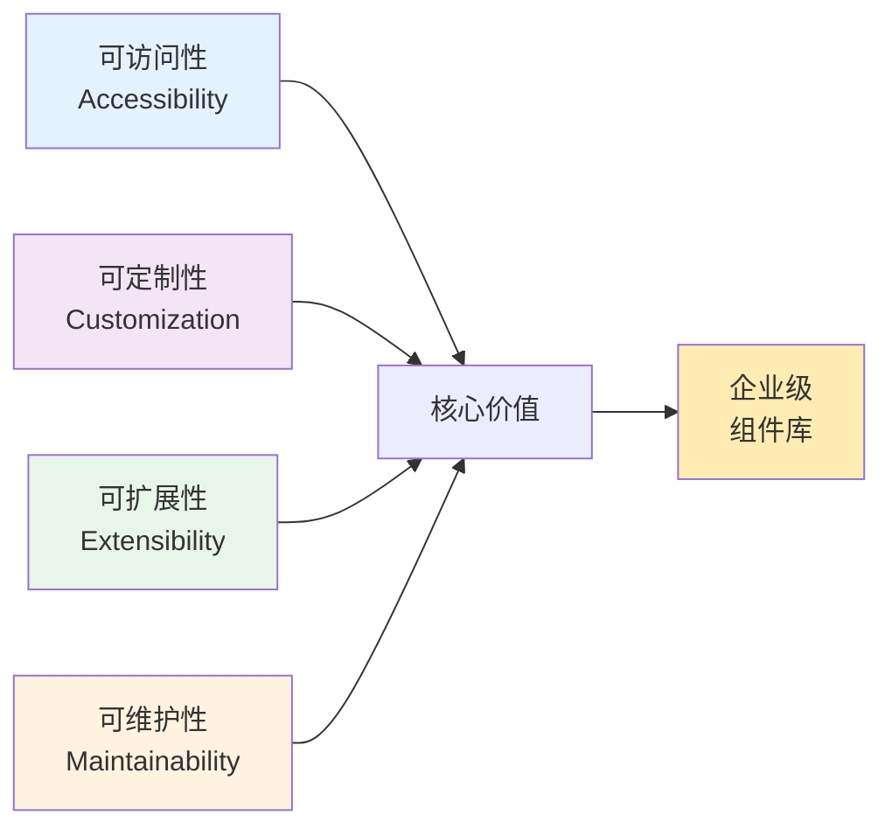
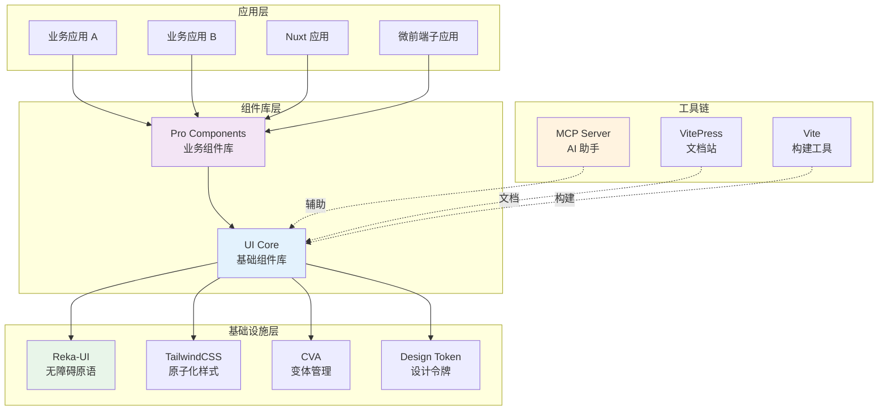
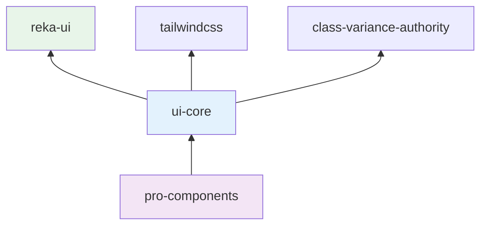
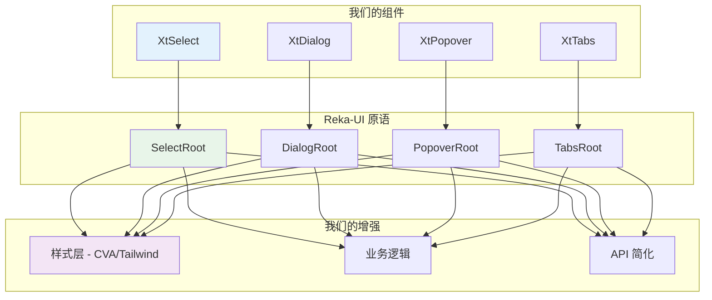
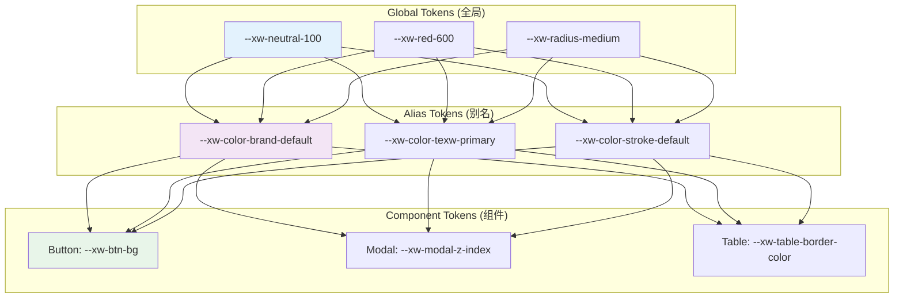
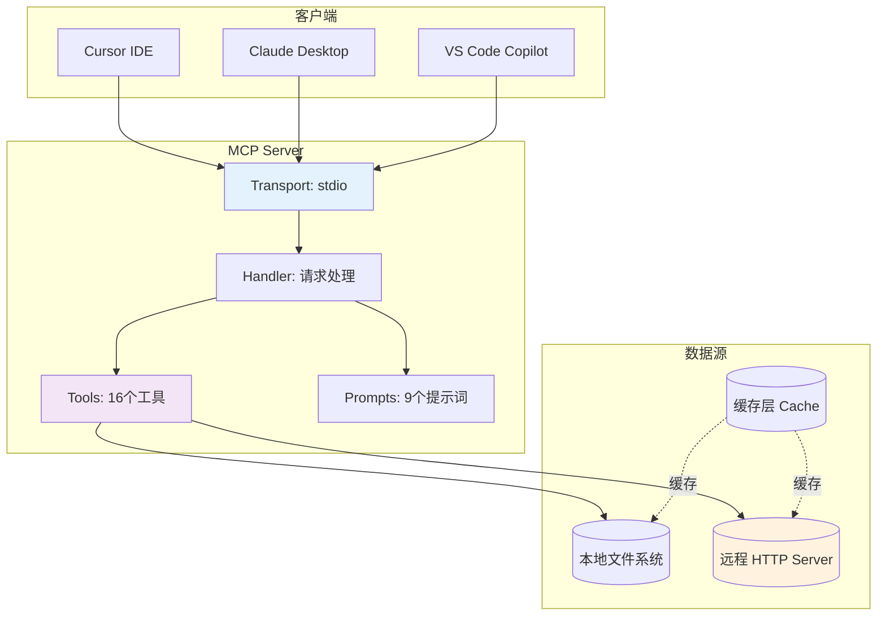
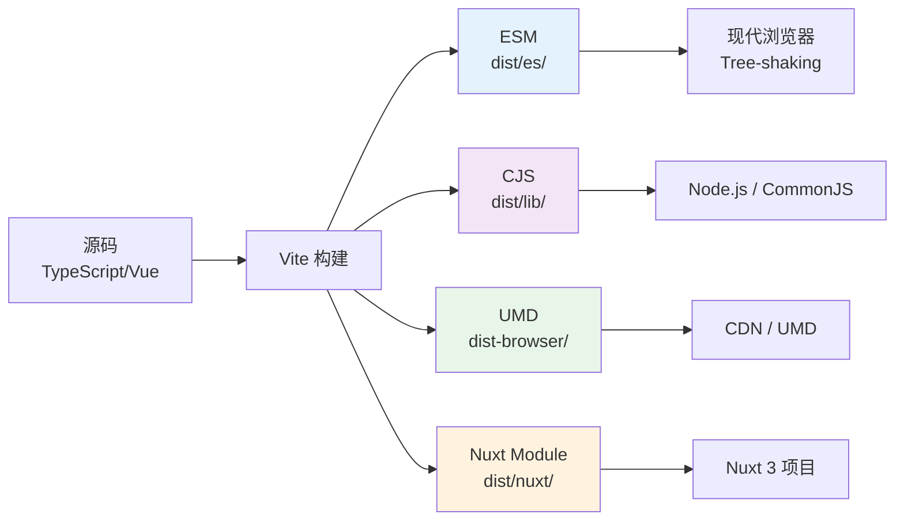

# 从 0 到 1 构建企业级 Vue3 组件库：架构设计与工程化实践

> **阅读时间**：约 25 分钟 | **难度**：高级 | **适用场景**：组件库设计/前端架构/团队技术分享

## 目录

- [一、项目背景与设计目标](#一项目背景与设计目标)
- [二、整体架构与技术选型](#二整体架构与技术选型)
- [三、基础组件库（UI Core）设计详解](#三基础组件库ui-core设计详解)
- [四、业务组件库（Pro Components）设计思路](#四业务组件库pro-components设计思路)
- [五、Reka-UI 集成与无障碍设计](#五reka-ui集成与无障碍设计)
- [六、主题系统与样式定制方案](#六主题系统与样式定制方案)
- [七、Z-Index 层级管理方案](#七z-index层级管理方案)
- [八、微前端适配方案（Wujie）](#八微前端适配方案wujie)
- [九、MCP AI 助手集成](#九mcp-ai助手集成)
- [十、构建体系与多格式输出](#十构建体系与多格式输出)
- [十一、踩坑经验与最佳实践](#十一踩坑经验与最佳实践)
- [十二、总结与展望](#十二总结与展望)

---

## 一、项目背景与设计目标

### 1.1 业务背景

在企业级前端开发中，我们面临以下挑战：

#### 😤 现状痛点

| 问题 | 具体表现 |
|------|---------|
| **重复造轮子** | 每个业务线独立维护 UI 组件，功能相似但实现不同 |
| **体验不一致** | 不同产品线的交互风格、视觉规范差异大 |
| **维护成本高** | Bug 修复需要在多个仓库重复进行 |
| **新人上手慢** | 缺乏统一文档和学习路径 |
| **协作效率低** | 设计师与开发者对组件理解不一致 |

#### 🎯 建设目标

基于以上痛点，我们决定从 **0 到 1** 构建一套完整的企业级组件库体系，包含两个层次：

1. **基础组件库（UI Core）**：提供通用的 UI 基础能力（78+ 组件）
2. **业务组件库（Pro Components）**：封装复杂的业务场景（10+ 组件）

### 1.2 核心设计原则



#### 📐 四大核心原则

| 原则 | 说明 | 实现方式 |
|------|------|---------|
| **无障碍优先** | 符合 WCAG 2.1 AA 标准 | 基于 Reka-UI 的 WAI-ARIA 实现 |
| **高度可定制** | 支持主题切换、样式覆盖 | CSS 变量 + Design Token + CVA |
| **渐进式采用** | 可按需引入，不影响现有项目 | Tree-shaking + 多格式输出 |
| **开发体验友好** | 完善的类型提示、文档、示例 | TypeScript + VitePress + MCP |

### 1.3 技术栈选择

| 技术领域 | 选型 | 选择理由 |
|---------|------|---------|
| **框架** | Vue 3.4+ (Composition API) | 团队技术栈统一，性能优秀 |
| **语言** | TypeScript 5.x | 类型安全，IDE 支持 |
| **底层原语** | Reka-UI 2.2.0 | 无障碍支持完善，Headless UI |
| **样式方案** | TailwindCSS + CSS Variables | 原子化 + 主题能力 |
| **变体管理** | Class Variance Authority (CVA) | 声明式变体定义 |
| **构建工具** | Vite 5.x | 快速构建，ESM 原生支持 |
| **包管理** | pnpm Workspaces (Monorepo) | 多包管理，依赖共享 |
| **文档站** | VitePress | Vue 生态，Markdown 驱动 |
| **AI 集成** | MCP (Model Context Protocol) | AI 辅助开发 |

---

## 二、整体架构与技术选型

### 2.1 Monorepo 项目结构

```
components-kit/
├── packages/
│   ├── ui-core/                 # 基础组件库
│   │   ├── src/
│   │   │   ├── components/      # 组件源码（78+）
│   │   │   ├── lib/             # 工具函数
│   │   │   ├── composables/     # 组合式函数
│   │   │   └── demo/            # 示例代码
│   │   ├── tailwind/            # Tailwind 配置
│   │   │   ├── config/          # 主题配置
│   │   │   ├── themes/          # 主题文件
│   │   │   └── variants/        # 变体样式
│   │   └── package.json
│   │
│   └── pro-components/          # 业务组件库
│       ├── src/
│       │   ├── components/      # 业务组件（10+）
│       │   │   ├── card/        # 卡片组件
│       │   │   ├── feedback/    # 反馈组件
│       │   │   ├── pay/         # 支付组件
│       │   │   └── ...          # 其他业务组件
│       │   ├── api/             # API 接口层
│       │   ├── config/          # 环境配置
│       │   └── composables/     # 业务逻辑复用
│       └── package.json
│
├── mcp/                         # MCP AI 助手服务
│   ├── src/
│   │   ├── server/              # MCP 服务端
│   │   ├── tools/               # 工具实现
│   │   └── prompts/             # 提示词模板
│   └── server/                  # 远程服务端（NestJS）
│
├── components-docs/                  # 文档站（VitePress）
│   └── .vitepress/
│
└── playground/                  # 示例项目
    ├── wujie/                   # 微前端示例
    ├── nuxt/                    # Nuxt 示例
    └── vue3/                    # Vue3 示例
```

### 2.2 分层架构图



### 2.3 包依赖关系



**关键点**：
- `pro-components` 依赖 `ui-core`，复用基础能力
- `reka-ui` 作为 `peerDependency`，避免版本冲突
- 所有样式通过 TailwindCSS 原子类生成

---

## 三、基础组件库（UI Core）设计详解

### 3.1 组件分类体系

我们按照功能和复杂度将 78+ 个组件分为 **6 大类别**：

#### 📦 组件分类表

| 类别 | 组件数量 | 代表组件 | 复杂度 |
|------|---------|---------|--------|
| **基础控件** | 15+ | Button, Input, Select, Switch | ⭐⭐ |
| **数据展示** | 12+ | Table, List, Card, Tag | ⭐⭐⭐ |
| **导航组件** | 8+ | Tabs, Menu, Breadcrumb, Anchor | ⭐⭐ |
| **反馈组件** | 10+ | Modal, Dialog, Message, Notification | ⭐⭐⭐⭐ |
| **布局组件** | 8+ | Grid, Layout, Space, Divider | ⭐⭐ |
| **其他** | 25+ | Upload, Qrcode, Tour, Steps | ⭐⭐~⭐⭐⭐⭐ |

### 3.2 组件目录结构规范

每个组件遵循统一的目录结构：

```
components/
└── button/                    # kebab-case 命名
    ├── Button.vue             # 主组件（PascalCase）
    ├── index.ts               # 导出入口 + withInstall
    ├── style.ts               # CVA 变体定义（核心！）
    ├── type.ts                # TypeScript 类型定义
    └── demo/                  # 示例文件（可选）
        ├── basic.vue
        └── variants.vue
```

#### 🔑 关键文件说明

**1. index.ts - 导出与注册**

```typescript
// components/button/index.ts
import Button from './Button.vue'
import { withInstall } from '@/lib/install'

export type { ButtonVariants } from './style'
export type { ButtonProps } from './type'
export const XtButton = withInstall(Button)
export default XtButton
```

**withInstall 函数的作用**：
- 为组件添加 `install` 方法，支持 `app.use()` 全局注册
- 保持类型导出的完整性
- 统一的组件注册模式

**2. style.ts - CVA 变体定义（核心亮点）**

这是整个组件库最核心的设计之一。以 Button 组件为例：

```typescript
// components/button/style.ts
import { cva } from 'class-variance-authority'

export const buttonVariants = ({buttonProvider, type}) => {
  return cva(
    // 基础样式（所有变体共享）
    'xw-flex xw-items-center xw-justify-center xw-inline-flex '
    'xw-whitespace-nowrap xw-cursor-pointer '
    'xw-transition-[background-color,color,border-color,opacity] '
    'xw-duration-200 xw-ease-in-out xw-outline-none',
    
    {
      // 变体定义
      variants: {
        type: {
          default: 'xw-bg-brand-default xw-texw-brand-text ...',
          primary: 'xw-bg-brand-default xw-texw-brand-text ...',
          secondary: 'xw-bg-background-default xw-texw-texw-secondary ...',
          emphasize: 'xw-bg-emphasize-default xw-texw-texw-inverse ...',
          warning: 'xw-bg-warning-default xw-texw-texw-inverse ...',
          dashed: 'xw-bg-background-default xw-border-dashed ...',
          text: 'xw-bg-transparent xw-texw-foreground ...',
          icon: '!xw-p-0 xw-bg-transparent ...',
          link: 'xw-bg-transparent xw-texw-blue-default ...',
        },
        size: {
          xlarge: 'xw-px-200 xw-min-w-[80px] xw-h-xlarge ...',
          large: 'xw-px-4 xw-min-w-[80px] xw-h-large ...',
          medium: 'xw-px-3 xw-min-w-[64px] xw-h-medium ...',
          small: 'xw-px-2 xw-min-w-[49px] xw-h-[28px] ...',
          mini: 'xw-px-[4px] xw-min-w-[40px] xw-h-[24px] ...',
        },
        disabled: {
          true: 'xw-opacity-40 !xw-cursor-not-allowed',
        },
        loading: { true: '' },
        ghost: { true: '' },
        block: { true: 'xw-w-full' },
        // ... 更多变体
      },
      
      // 组合变体（关键特性！）
      compoundVariants: [
        // loading + secondary 特殊样式
        { 
          loading: true, 
          type: 'secondary', 
          className: 'hover:xw-bg-background-default ...' 
        },
        // icon + size 特殊尺寸
        {
          type: 'icon',
          size: 'medium',
          className: 'xw-w-[32px] xw-h-[32px]',
        },
        // primary + ghost 幽灵态
        {
          type: 'primary',
          ghost: true,
          className: 'xw-bg-texw-inverse xw-texw-texw-primary ...',
        },
        // ... 50+ 个组合变体
      ],
      
      // 默认值
      defaultVariants: {
        type: 'default',
        size: 'medium',
        disabled: false,
        loading: false,
        ghost: false,
      },
    }
  )
}
```

**CVA 的优势**：

| 传统方式 | CVA 方式 |
|---------|---------|
| 大量 if-else 判断样式 | 声明式定义，自动合并 |
| 容易遗漏边界情况 | compoundVariants 覆盖所有组合 |
| 样式逻辑分散 | 集中在 style.ts 管理 |
| 难以测试 | 类型安全，IDE 自动补全 |

### 3.3 Compound Components 模式

对于复杂组件（如 Dialog、Select），我们采用 **Compound Components（复合组件）** 模式：

#### 📦 Dialog 组件结构

```typescript
// components/dialog/index.ts
import Dialog from './Dialog.vue'
import DialogRoot from './components/DialogRoot.vue'
import DialogTrigger from './components/DialogTrigger.vue'
import DialogContent from './components/DialogContent.vue'
import DialogHeader from './components/DialogHeader.vue'
import DialogFooter from './components/DialogFooter.vue'
import DialogTitle from './components/DialogTitle.vue'
import DialogDescription from './components/DialogDescription.vue'
import DialogClose from './components/DialogClose.vue'

// 导出所有子组件
export const XtDialog = withInstall(Dialog)
export const XtDialogRoot = withInstall(DialogRoot)
export const XtDialogTrigger = withInstall(DialogTrigger)
export const XtDialogContent = withInstall(DialogContent)
// ... 其他子组件

// 同时支持函数式调用
export const XtDialogInstance = DialogInstance
```

#### 💡 使用方式对比

**方式一：声明式（Compound Components）**

```vue
<template>
  <XtDialogRoot v-model:open="open">
    <XtDialogTrigger as-child>
      <XtButton>打开弹窗</XtButton>
    </XtDialogTrigger>
    
    <XtDialogContent>
      <XtDialogHeader>
        <XtDialogTitle>标题</XtDialogTitle>
        <XtDialogDescription>描述内容</XtDialogDescription>
      </XtDialogHeader>
      
      <p>弹窗内容</p>
      
      <XtDialogFooter>
        <XtButton type="secondary" @click="open = false">取消</XtButton>
        <XtButton @click="handleConfirm">确定</XtButton>
      </XtDialogFooter>
    </XtDialogContent>
  </XtDialogRoot>
</template>
```

**方式二：命令式（Function Call）**

```typescript
import { XtDialogInstance } from '@/components/dialog'

const handleDelete = async () => {
  const result = await XtDialogInstance.confirm({
    title: '确认删除',
    content: '删除后无法恢复，确定要删除吗？',
    okText: '确定删除',
    cancelText: '再想想',
  })
  
  if (result) {
    await deleteItem()
  }
}
```

**为什么同时支持两种方式？**
- **声明式**：适合静态页面、简单交互
- **命令式**：适合动态场景、复杂逻辑（如二次确认、表单提交后的提示）

---

## 四、业务组件库（Pro Components）设计思路

### 4.1 定位与职责

如果说 UI Core 是"砖块"，那 Pro Components 就是"预制板"——针对特定业务场景的高级封装。

#### 🎯 两层组件库对比

| 维度 | UI Core（基础组件库） | Pro Components（业务组件库） |
|------|---------------------|---------------------------|
| **定位** | 通用 UI 能力 | 业务场景封装 |
| **组件数** | 78+ | 10+ |
| **依赖关系** | 无（或仅依赖 reka-ui） | 依赖 UI Core |
| **复用范围** | 全公司所有项目 | 特定业务线 |
| **更新频率** | 低（稳定 API） | 高（跟随业务迭代） |
| **典型用户** | 所有前端开发者 | 业务线开发者 |

### 4.2 业务组件示例

#### 📦 Card 组件（卡片）

这是 Pro Components 中最复杂的组件之一，用于展示内容卡片（如设计作品、文件列表等）。

```
components/card/
├── index.ts
├── CardList.vue              # 卡片列表容器
├── design-item/              # 设计项卡片
│   ├── Cover.vue             # 封面图
│   ├── index.vue             # 主组件
│   └── type.ts
├── file-item/                # 文件项卡片
│   ├── Cover.vue
│   ├── ShareBtn.vue
│   └── index.vue
├── making-item/              # 制作中项卡片
│   ├── author/               # 作者信息
│   │   ├── AuthorInner.vue
│   │   └── AuthorPopover.vue
│   ├── btn/                  # 操作按钮
│   │   └── LikeButton.vue
│   ├── count/                # 计数器
│   │   ├── DownloadCnt.vue
│   │   └── LikeCnt.vue
│   ├── composable/           # 业务逻辑
│   │   └── computed.ts
│   └── index.vue
└── types/
    ├── action-opts.ts
    ├── file.ts
    └── index.ts
```

**特点**：
- 内部使用 UI Core 的基础组件（Button、Avatar、Tooltip 等）
- 封装复杂的业务交互（点赞、收藏、分享、下载）
- 支持多种展示模式（网格/列表/瀑布流）
- 内置状态管理（loading、error、empty）

#### 📦 Feedback 组件（反馈）

用于收集用户反馈的复合组件：

```
components/feedback/
├── index.vue                 # 主组件
├── components/
│   ├── Btn.vue               # 反馈按钮
│   ├── Entry.vue             # 入口组件
│   ├── Form.vue              # 表单
│   ├── Modal.vue             # 弹窗
│   └── Result.vue            # 结果页
├── service.ts                # API 服务
├── const.ts                  # 常量定义
└── types.ts                  # 类型定义
```

**特点**：
- 完整的用户反馈流程（触发 → 填写 → 提交 → 结果）
- 集成图片上传、截图等功能
- 支持多语言（vue-i18n）
- 与后端 API 对接

### 4.3 业务组件的设计原则

#### ✅ 原则 1：单一职责

每个业务组件只解决一个明确的业务问题，不试图做"万能组件"。

#### ✅ 原则 2：配置优于代码

通过 props 和 slots 暴露扩展点，而不是让使用者修改内部逻辑：

```vue
<!-- Good: 通过 slot 自定义 -->
<XtCard>
  <template #cover><MyCustomCover /></template>
  <template #actions><MyActions /></template>
</XtCard>

<!-- Bad: 让使用者传入渲染函数 -->
<XtCard :render-cover="myRenderFn" />
```

#### ✅ 原则 3：优雅降级

当业务组件过于复杂时，提供简化版本或回退到基础组件：

```vue
<script setup>
// 如果不需要复杂功能，可以使用简单的 Card
import { XtCard as SimpleCard } from 'ui-core'
import { XtDesignCard } from 'pro-components'

const useAdvancedFeatures = computed(() => props.mode === 'advanced')
</script>

<template>
  <XtDesignCard v-if="useAdvancedFeatures" v-bind="$attrs" />
  <SimpleCard v-else v-bind="$attrs" />
</template>
```

---

## 五、Reka-UI 集成与无障碍设计

### 5.1 为什么选择 Reka-UI？

#### 🤔 Headless UI 的兴起

传统组件库的问题：
- **样式耦合严重**：组件自带样式，难以定制
- **DOM 结构固定**：无法灵活调整 HTML 结构
- **无障碍缺失**：大多数组件不支持键盘导航和屏幕阅读器

**Headless UI** 的解决方案：
- 只提供**行为逻辑**（状态管理、事件处理、ARIA 属性）
- 不提供任何**样式**（完全由使用者控制）
- 内置完整的**无障碍支持**（WAI-ARIA）

#### 🏆 Reka-UI vs 其他方案

| 特性 | Radix-Vue (原) | Reka-UI | Shadcn-Vue | Headless UI |
|------|---------------|---------|------------|-------------|
| **Vue 3 支持** | ✅ | ✅ 最佳 | ✅ | ❌ 仅 React |
| **无障碍** | ✅ WAI-ARIA | ✅ WAI-ARIA | ✅ 基于 Radix | ✅ |
| **Tree-shaking** | ✅ | ✅ 更好 | ✅ | ✅ |
| **体积** | 较大 | **更小** | 中等 | 小 |
| **维护状态** | 已归档 | **活跃** | 活跃 | 活跃 |
| **社区生态** | 成熟 | **快速增长** | 丰富 | 一般 |

**我们选择 Reka-UI 的原因**：

1. **Vue 3 原生优化**：专为 Vue 3 Composition API 设计
2. **更好的 Tree-shaking**：按需导入，减少打包体积
3. **活跃维护**：持续更新，Bug 修复及时
4. **完善的类型**：TypeScript 支持一流
5. **轻量级**：相比 Radix-Vue 体积更小

### 5.2 Reka-UI 集成方式

#### 📦 集成架构



#### 🔌 具体集成示例：Select 组件

```vue
<!-- components/select/Select.vue -->
<script setup lang="ts">
// 1. 引入 Reka-UI 原语
import { SelectRoot } from 'reka-ui'

// 2. 引入我们的子组件（基于 Reka-UI 二次封装）
import {
  XtSelectContent,
  XtSelectGroup,
  XtSelectItem,
  XtSelectTrigger,
  XtSelectValue,
} from '@/components/select'

// 3. 引入样式变体
import { selectRootVariants } from './style'

// 4. 引入配置
import { useConfigProvider } from '@/components/config-provider'

const props = defineProps<SelectProps>()
const config = useConfigProvider()

// 5. 使用 Reka-UI 的 Root 组件管理状态
const modelValue = defineModel()
</script>

<template>
  <!-- Reka-UI SelectRoot 提供核心状态管理和无障碍 -->
  <SelectRoot
    v-model="modelValue"
    :multiple="multiple"
    v-bind="$attrs"
  >
    <!-- 我们的 Trigger 组件（增加样式和图标） -->
    <XtSelectTrigger :class="selectRootVariants({ size })">
      <XtSelectValue :placeholder="placeholder" :show-text="showText" />
      
      <!-- 清除按钮 -->
      <XtSelectClearIcon 
        v-if="allowClear && modelValue" 
        @clear="handleClear" 
      />
      
      <!-- 下拉箭头 -->
      <XtSelectIndicator v-if="showIndicator" />
    </XtSelectTrigger>
    
    <!-- 我们的内容组件（Portal 渲染 + 样式） -->
    <XtSelectContent 
      :position="position" 
      :side-offset="sideOffset"
      :z-index="effectiveZIndex"
    >
      <!-- 搜索框（可选） -->
      <XtSelectSearchContainer v-if="itemSearch">
        <XtSelectSearchInput v-model="searchValue" />
      </XtSelectSearchContainer>
      
      <!-- 选项列表 -->
      <XtSelectViewport>
        <XtSelectItem
          v-for="option in filteredOptions"
          :key="option.value"
          :value="option.value"
          :disabled="option.disabled"
        >
          <XtSelectItemText>{{ option.label }}</XtSelectItemText>
          <XtSelectItemIndicator>
            <Check class="h-4 w-4" />
          </XtSelectItemIndicator>
        </XtSelectItem>
        
        <!-- 空状态 -->
        <XtEmpty v-if="filteredOptions.length === 0" />
      </XtSelectViewport>
    </XtSelectContent>
  </SelectRoot>
</template>
```

**分层设计的好处**：

| 层次 | 职责 | 优点 |
|------|------|------|
| **Reka-UI** | 状态管理、键盘导航、ARIA | 无需重复造轮子 |
| **样式层** | 视觉呈现、变体 | 完全可控，易于定制 |
| **业务层** | API 简化、默认值 | 降低使用门槛 |

### 5.3 无障碍设计实践

#### ♿ 内置的无障碍支持

基于 Reka-UI，我们的组件自动获得：

1. **键盘导航**
   - Tab/Shift+Tab：焦点移动
   - Enter/Space：激活元素
   - Escape：关闭弹窗/下拉
   - 方向键：选项导航

2. **ARIA 属性**
   ```html
   <!-- Select 组件生成的 ARIA -->
   <div role="combobox" aria-expanded="true" aria-haspopup="listbox">
     <button aria-labelledby="select-label">
       <span id="select-label">请选择</span>
     </button>
     <ul role="listbox" aria-activedescendant="option-1">
       <li role="option" id="option-1" aria-selected="true">选项 1</li>
       <li role="option" id="option-2" aria-selected="false">选项 2</li>
     </ul>
   </div>
   ```

3. **屏幕阅读器支持**
   - 动态播报状态变化（"已选中 3 个选项"）
   - 描述性标签（role="alert" 用于错误提示）
   - 实时区域（aria-live 用于加载状态）

#### 🧪 无障碍测试清单

我们在每个组件发布前都会检查：

- [ ] 键盘能否完全操作？
- [ ] 屏幕阅读器能否正确朗读？
- [ ] 焦点是否可见且符合预期？
- [ ] 颜色对比度是否达到 WCAG AA 标准？
- [ ] 是否支持高对比度模式？

---

## 六、主题系统与样式定制方案

### 6.1 设计 Token 系统

我们建立了一套完整的 **Design Token** 系统，作为主题定制的基石。

#### 🎨 Token 层级结构



#### 📝 Token 定义示例（default.css）

```css
@layer base {
  :root {
    /* ===== 基础色阶（Global Tokens）===== */
    /* 中性色 */
    --xw-neutral-50: #FAFAFA;
    --xw-neutral-100: #F5F5F5;
    --xw-neutral-200: #E5E5E5;
    --xw-neutral-300: #D4D4D4;
    --xw-neutral-400: #A3A3A3;
    --xw-neutral-500: #737373;
    --xw-neutral-600: #525252;
    --xw-neutral-700: #404040;
    --xw-neutral-800: #262626;
    --xw-neutral-900: #171717;
    --xw-neutral-1000: #0A0A0A;
    --xw-neutral-1100: #050505;
    --xw-neutral-1200: #000000;
    
    /* 功能色 */
    --xw-red-100: #FEE2E2;
    --xw-red-600: #DC2626;
    /* ... 其他色阶 */
    
    /* ===== 语义化别名（Alias Tokens）===== */
    /* 品牌色 */
    --xw-color-brand-default: var(--xw-neutral-1200);
    --xw-color-brand-hover: var(--xw-neutral-900);
    --xw-color-brand-active: var(--xw-neutral-1100);
    
    /* 文字颜色 */
    --xw-color-texw-primary: var(--xw-neutral-1200);
    --xw-color-texw-secondary: var(--xw-neutral-1000);
    --xw-color-texw-tertiary: var(--xw-neutral-700);
    
    /* 背景色 */
    --xw-color-background-default: var(--xw-neutral-100);
    --xw-color-background-surface: var(--xw-neutral-300);
    --xw-color-background-modal: var(--xw-neutral-100);
    
    /* 描边色 */
    --xw-color-stroke-default: var(--xw-neutral-500);
    --xw-color-stroke-active: var(--xw-neutral-1200);
    
    /* 图标色 */
    --xw-color-icon-info: var(--xw-blue-600);
    --xw-color-icon-success: var(--xw-green-600);
    --xw-color-icon-error: var(--xw-red-600);
  }
}
```

### 6.2 TailwindCSS 集成策略

#### ⚙️ Tailwind 配置（tailwind.config.js）

```javascript
const _ = require('lodash-es')
const tailwindcssAnimate = require('tailwindcss-animate')

module.exports = _.merge(
  {},
  shadcnUiTheme,  // Shadcn 默认主题
  {
    prefix: 'xw-',           // 关键！添加前缀避免冲突
    darkMode: ['class'],     // 类名模式切换暗黑主题
    
    content: [
      './src/components/**/*.{ts,js,vue,tsx}',
      './tailwind/**/*.css',
    ],
    
    theme: {
      // 将 Design Token 映射到 Tailwind 工具类
      extend: {
        colors: {
          brand: {
            default: 'var(--xw-color-brand-default)',
            hover: 'var(--xw-color-brand-hover)',
            active: 'var(--xw-color-brand-active)',
          },
          text: {
            primary: 'var(--xw-color-texw-primary)',
            secondary: 'var(--xw-color-texw-secondary)',
          },
          background: {
            default: 'var(--xw-color-background-default)',
            hover: 'var(--xw-color-background-hover)',
          },
          stroke: {
            default: 'var(--xw-color-stroke-default)',
          },
          // ... 完整的颜色映射
        },
        
        borderRadius: {
          small: 'var(--xw-radius-small)',
          medium: 'var(--xw-radius-medium)',
          large: 'var(--xw-radius-large)',
        },
        
        fontSize: {
          '16-semibold': ['var(--xw-font-16)', { 
            lineHeight: 'var(--xw-lineHeight-22)', 
            fontWeight: 'var(--xw-weight-semibold)' 
          }],
          // ... 其他字号
        },
        
        spacing: {
          100: 'var(--xw-space-100)',  // 8px
          200: 'var(--xw-space-200)',  // 16px
          300: 'var(--xw-space-300)',  // 24px
        },
        
        boxShadow: {
          'light-100': 'var(--xw-elevation-shadow-light-100)',
          'dark-100': 'var(--xw-elevation-shadow-dark-100)',
        },
      },
    },
    
    plugins: [
      require('@tailwindcss/typography'),
      tailwindcssAnimate,
    ],
    
    corePlugins: {
      preflight: false,  // 关键！禁用默认 reset
      touchAction: false,
      scrollSnapType: false,
      fontVariantNumeric: false,
    },
  }
)
```

#### 🔑 关键配置解析

**1. prefix: 'xw-'（命名空间前缀）**

**为什么需要前缀？**
- 避免与主应用的 Tailwind 类名冲突
- 在微前端环境中隔离样式
- 明确标识组件库专属类名

**效果对比**：
```html
<!-- 普通 Tailwind -->
<button class="bg-blue-500 texw-white px-4 py-2 rounded">

<!-- 组件库 Tailwind（带前缀）-->
<button class="xw-bg-brand-default xw-texw-brand-text xw-px-4 xw-py-2 xw-rounded-medium">
```

**2. preflight: false（禁用默认重置）**

**原因**：
- Preflight 会重置所有元素的默认样式
- 可能影响主应用的样式
- 我们提供自定义的 reset.css

**自定义 reset.css**：
```css
/* tailwind/reset.css - 最小化的重置 */
*,
*::before,
*::after {
  box-sizing: border-box;
  border-width: 0;
  border-style: solid;
  border-color: var(--xw-color-stroke-default);
}

/* 只重置必要的属性，不过度干预 */
```

### 6.3 ConfigProvider 全局配置

#### 🎛️ ConfigProvider 组件

这是主题系统的核心入口，提供全局配置能力：

```vue
<!-- 使用示例 -->
<template>
  <XtConfigProvider
    theme="dark"
    size="large"
    locale="zh-CN"
    :brand-colors="{ primary: '#1890ff' }"
    :base-index="1000"
  >
    <App />
  </XtConfigProvider>
</template>
```

#### ⚙️ ConfigProvider 核心能力

| 配置项 | 类型 | 说明 | 示例 |
|-------|------|------|------|
| `theme` | string | 主题模式 | `'default' \| 'dark' \| 'studio'` |
| `size` | string | 全局尺寸 | `'small' \| 'medium' \| 'large'` |
| `locale` | string | 语言 | `'zh-CN' \| 'en-US'` |
| `brandColors` | object/string | 品牌色 | `'#1890ff'` 或 `{ primary: {...} }` |
| `baseIndex` | number | Z-Index 基准值 | `1000` |
| `dir` | string | 文本方向 | `'ltr' \| 'rtl'` |
| `components` | object | 组件级别配置 | `{ Button: { type: {...} } }` |

#### 🎨 品牌色定制

**字符串模式（自动派生）**：
```vue
<XtConfigProvider :brand-colors="'#6366f1'" />
```
系统会自动根据主色计算 hover、active、disabled 等衍生色。

**对象模式（精确控制）**：
```vue
<XtConfigProvider 
  :brand-colors="{
    default: '#6366f1',
    hover: '#4f46e5',
    active: '#4338ca',
    disabled: '#a5b4fc',
    text: '#ffffff',
  }" 
/>
```

#### 🔄 主题切换机制

```typescript
// ConfigProvider 内部的主题切换逻辑
const applyThemeClass = (theme: string) => {
  const targetElement = hasParent ? themeContainerRef.value : document.body
  
  // 移除旧主题
  targetElement.classList.forEach((cls) => {
    if (cls.startsWith('theme-')) {
      targetElement.classList.remove(cls)
    }
  })
  
  // 添加新主题
  targetElement.classList.add(`theme-${theme}`)
}
```

**支持的内置主题**：

| 主题名称 | 适用场景 | 特点 |
|---------|---------|------|
| `default` | 通用场景 | 浅色背景，中性色调 |
| `dark` | 暗黑模式 | 深色背景，护眼 |
| `studio` | 创作工具 | 专业灰度，减少干扰 |
| `customthings` | 定制商品 | 温暖色调 |
| `xcs` | 教育产品 | 活泼色彩 |

---

## 七、Z-Index 层级管理方案

### 7.1 问题背景

在企业级应用中，经常遇到 **Z-Index 冲突**问题：

#### ❌ 常见问题场景

1. **Modal 被 Tooltip 遮挡**
2. **Select 下拉被固定 Header 遮挡**
3. **嵌套弹窗时层级混乱**
4. **微前端环境中 z-index 不可控**

#### ❌ 传统解决方案的缺陷

```css
/* 硬编码 z-index - 难以维护 */
.modal { z-index: 1000; }
.tooltip { z-index: 1050; }
.select-dropdown { z-index: 1020; }
.notification { z-index: 1080; }

/* 问题：新组件不知道该用什么值，容易冲突 */
```

### 7.2 Z-Index Manager 设计

我们设计了一个 **集中式的 Z-Index 管理器**：

#### 🏗️ 架构设计

```mermaid
graph TB
    subgraph "ConfigProvider"
        A[baseIndex = 1000]
    end
    
    subgraph "Z-Index Config"
        B[getIndex(component)]
        C[zIndexDiff 映射表]
    end
    
    subgraph "Z-Index Manager"
        D[单例管理器]
        E[跟踪打开的组件]
        F[动态分配 z-index]
    end
    
    subgraph "组件实例"
        G[Modal #1: 1000]
        H[Modal #2: 1010]
        I[Select: 1050]
        J[Tooltip: 1060]
    end
    
    A --> B
    B & C --> D
    D --> E & F
    E & F --> G & H & I & J
    
    style D fill:#e3f2fd
```

#### 📝 核心实现（z-index-manager.ts）

```typescript
/**
 * Z-Index 管理器
 * 用于管理 Modal、Dialog 等弹窗组件的层级，确保后打开的组件在最上层
 */

class ZIndexManager {
  private readonly step = 10  // 每个组件的递增步长
  private openComponents = new Set<string>()  // 当前打开的组件集合
  private componentZIndexMap = new Map<string, number>()  // 组件ID到z-index的映射

  /**
   * 为组件分配 z-index 值
   * @param componentId 组件的唯一ID
   * @param customZIndex 用户传入的自定义 z-index（优先使用）
   * @param baseZIndex 来自 ConfigProvider 的基准值
   * @returns 最终使用的 z-index 值
   */
  getZIndexForComponent(
    componentId: string, 
    customZIndex?: number, 
    baseZIndex?: number
  ): number {
    // 1. 如果用户明确设置了 zIndex，直接使用
    if (customZIndex !== undefined) {
      this.componentZIndexMap.set(componentId, customZIndex)
      this.openComponents.add(componentId)
      return customZIndex
    }
    
    // 2. 否则根据当前打开的组件数量动态分配
    this.openComponents.add(componentId)
    const currentOpenCount = this.openComponents.size
    const effectiveBaseZIndex = baseZIndex ?? this.getDefaultBaseZIndex()
    
    // 3. 计算：baseZIndex + (当前数量 - 1) * step
    const zIndex = effectiveBaseZIndex + (currentOpenCount - 1) * this.step
    this.componentZIndexMap.set(componentId, zIndex)
    return zIndex
  }

  /**
   * 组件关闭时释放 z-index
   */
  releaseComponent(componentId: string): void {
    this.openComponents.delete(componentId)
    this.componentZIndexMap.delete(componentId)
  }

  /**
   * 获取当前最高的 z-index 值
   */
  getCurrentZIndex(): number {
    if (this.componentZIndexMap.size === 0) {
      return this.getDefaultBaseZIndex()
    }
    return Math.max(...this.componentZIndexMap.values())
  }
}

// 导出全局单例
export const zIndexManager = new ZIndexManager()
```

#### 📊 Z-Index 分配规则（z-index-config.ts）

```typescript
// 各组件的基础 z-index 值
export const zIndexBase = 1000

// 组件类型的 z-index 递增值
export const zIndexDiff = {
  tooltip: 50,        // Tooltip: 1050
  select: 50,         // Select: 1050
  popover: 50,        // Popover: 1050
  dropdownMenu: 60,   // DropdownMenu: 1060
  dialog: 100,        // Dialog: 1100
  modal: 100,         // Modal: 1100
  notification: 150,  // Notification: 1150
  message: 160,       // Message: 1160
}

/**
 * 获取指定组件的基础 z-index
 */
export function getIndex(component: string, baseIndex?: number): number {
  const diff = zIndexDiff[component] || 0
  return (baseIndex ?? zIndexBase) + diff
}
```

### 7.3 使用示例

#### 📦 在组件中使用

```vue
<!-- components/modal/Modal.vue -->
<script setup lang="ts">
import { zIndexManager } from '@/lib/z-index-manager'
import { getIndex, zIndexBase } from '@/lib/z-index-config'
import { useConfigProvider } from '@/components/config-provider'

const props = defineProps({
  zIndex: Number,  // 用户可自定义
})

const config = useConfigProvider()

// 生成唯一 ID
const modalId = `modal_${Date.now()}`

// 计算最终的 z-index
const effectiveZIndex = computed(() => {
  // 优先级：props.zIndex > ConfigProvider.baseIndex > 默认值
  if (props.zIndex !== undefined) {
    return props.zIndex
  }
  
  const baseIndex = config?.baseIndex?.value ?? zIndexBase
  const modalBaseIndex = getIndex('modal', baseIndex)
  
  // 使用管理器动态分配
  return zIndexManager.getZIndexForComponent(modalId, undefined, modalBaseIndex)
})

// 组件卸载时释放
onUnmounted(() => {
  zIndexManager.releaseComponent(modalId)
})
</script>

<template>
  <Teleport to="body">
    <div 
      class="xw-fixed xw-inset-0 xw-z-[var(--modal-z-index)]"
      :style="{ zIndex: effectiveZIndex }"
    >
      <!-- Modal 内容 -->
    </div>
  </Teleport>
</template>
```

#### 🎯 效果演示

**场景：连续打开 3 个 Modal**

```
时间轴：
─────────────────────────────────────────────►

打开 Modal-A → zIndex = 1000 (base + 0*10)
打开 Modal-B → zIndex = 1010 (base + 1*10)  ← 后打开的在上层
打开 Select → zIndex = 1050 (独立空间)
关闭 Modal-B → zIndex 释放，Modal-A 保持 1000
打开 Modal-C → zIndex = 1010 (base + 1*10)  ← 复用释放的值
```

### 7.4 微前端环境特殊处理

在 Wujie 微前端环境中，我们额外提供了 `portal-disabled` prop：

```vue
<!-- 正常情况：Portal 到 body -->
<XtModal v-model="open" title="标题" />

<!-- 微前端环境：禁用 Portal，在容器内渲染 -->
<XtModal 
  v-model="open" 
  title="标题" 
  :portal-disabled="true" 
/>
```

**原因**：
- 微前端子应用的 Portal 可能渲染到主应用的 body
- 导致样式隔离失效、事件冒泡异常
- 禁用 Portal 后，组件在子应用容器内正常渲染

---

## 八、微前端适配方案（Wujie）

### 8.1 为什么需要微前端适配？

在企业级应用中，我们使用 **Wujie** 微前端框架来实现：

- 主应用（Main App）：侧边栏、顶栏、底部
- 子应用（Sub App）：内容区、菜单、头部等

#### ❌ 组件库在微前端中的挑战

| 问题 | 影响 | 严重程度 |
|------|------|---------|
| **Portal 渲染位置错误** | 弹窗出现在错误位置 | 🔴 严重 |
| **Z-Index 冲突** | 主应用遮挡子应用弹窗 | 🔴 严重 |
| **样式隔离失效** | 主应用样式影响子应用 | 🟡 中等 |
| **事件冒泡异常** | 点击事件无法正确传递 | 🟡 中等 |
| **生命周期泄漏** | 切换子应用时内存泄漏 | 🟠 较高 |

### 8.2 解决方案详解

#### 🔧 方案 1：Portal 禁用机制

**问题**：Modal、Dialog 等组件使用 `<Teleport to="body">` 渲染，但在微前端中会渲染到主应用的 body。

**解决**：添加 `portal-disabled` prop，允许组件在容器内渲染。

```vue
<!-- components/modal/Modal.vue -->
<script setup>
const props = defineProps({
  portalDisabled: {
    type: Boolean,
    default: false,
  },
})
</script>

<template>
  <!-- 根据 portalDisabled 决定是否使用 Teleport -->
  <Teleport v-if="!portalDisabled" to="body">
    <div class="modal-content">...</div>
  </Teleport>
  
  <div v-else class="modal-content">
    <!-- 直接渲染在当前位置 -->
  </div>
</template>
```

**使用示例（微前端环境）**：
```vue
<template>
  <XtModal
    v-model="open"
    title="子应用弹窗"
    :portal-disabled="true"  <!-- 关键！禁用 Portal -->
  />
</template>
```

#### 🔧 方案 2：Z-Index 协调

**问题**：主应用和子应用各自维护 z-index，导致层级混乱。

**解决**：通过 ConfigProvider 统一管理 baseIndex。

```mermaid
graph TB
    subgraph "主应用"
        A[XtConfigProvider :base-index="1000"]
        B[Header: z-index 100]
        C[Sidebar: z-index 200]
    end
    
    subgraph "子应用"
        D[XtConfigProvider :base-index="1000"]
        E[Modal: z-index 1100]
        F[Select: z-index 1050]
    end
    
    A --> D
    D --> E & F
    
    style D fill:#ffebee
```

**主应用配置**：
```vue
<!-- main-app/src/App.vue -->
<template>
  <XtConfigProvider :base-index="1000">
    <Header />      <!-- z-index: 100 -->
    <div class="main-container">
      <WujieContainer 
        name="sub-app" 
        url="/sub-app/" 
      />
    </div>
    <Sidebar />     <!-- z-index: 200 -->
  </XtConfigProvider>
</template>
```

**子应用配置**：
```vue
<!-- sub-app/src/App.vue -->
<template>
  <XtConfigProvider :base-index="1000">
    <XtModal v-model="open" :portal-disabled="true" />
    <XtSelect />
  </XtConfigProvider>
</template>
```

#### 🔧 方案 3：生命周期适配

**问题**：Wujie 要求子应用实现 `__WUJIE_MOUNT` 和 `__WUJIE_UNMOUNT` 生命周期钩子。

**解决**：在入口文件中适配。

```javascript
// main-wujie.js（微前端入口）
import { createApp } from 'vue'
import App from './App.vue'
import router from './router'

// 导入组件库样式
import '@company/ui-core/style'

const isInWujie = window.__POWERED_BY_WUJIE__

let app = null
let instance = null

if (isInWujie) {
  // Wujie 生命周期：挂载
  window.__WUJIE_MOUNT = () => {
    const container = document.querySelector('#app')
    app = createApp(App)
    app.use(router)
    instance = app.mount(container)
    console.log('✅ 子应用挂载成功')
  }

  // Wujie 生命周期：卸载
  window.__WUJIE_UNMOUNT = () => {
    if (instance) {
      app.unmount()
      instance = null
      app = null
      console.log('✅ 子应用卸载成功')
    }
  }

  // 自动挂载（如果页面已加载完成）
  if (document.readyState === 'complete') {
    window.__WUJIE_MOUNT()
  } else {
    window.addEventListener('load', () => {
      if (!instance) {
        window.__WUJIE_MOUNT()
      }
    })
  }
} else {
  // 独立运行时的挂载方式
  const container = document.querySelector('#app')
  app = createApp(App)
  app.use(router)
  app.mount('#app')
}
```

#### 🔧 方案 4：事件冒泡修复

**问题**：在微前端中，点击子应用外部区域无法关闭 Select/Popover 下拉框。

**解决**：检测是否在 Wujie 环境中使用 `onClickOutside`。

```typescript
// components/select/Select.vue
import { isInWujie } from '@/lib/is'
import { onClickOutside } from '@vueuse/core'

onMounted(() => {
  if (isInWujie()) {
    // Wujie 环境：使用 onClickOutside 监听外部点击
    onClickOutside(containerRef, (event) => {
      if (!triggerRef.value?.contains(event.target)) {
        isOpen.value = false
      }
    })
  }
})
```

#### 🔧 方案 5：样式隔离配置

**Wujie 配置示例**：

```javascript
// main-app/src/wujie-config.js
export default {
  // 子应用配置
  apps: [
    {
      name: 'content-demo',
      entry: '//localhost:5174/',
      // 关键配置
      props: {
        // 禁用样式隔离（因为组件库使用了 CSS 变量）
        styleIsolation: false,
        // 或者注入主应用的样式
        injectStyle: true,
      },
    },
  ],
  
  // 生命周期钩子
  beforeLoad: (appWindow) => {
    console.log('加载子应用:', appWindow.name)
  },
  afterMount: (appWindow) => {
    console.log('子应用挂载完成:', appWindow.name)
  },
}
```

### 8.3 微前端适配检查清单

| 检查项 | 配置位置 | 状态 |
|-------|---------|------|
| Portal 禁用 | Modal/Dialog 组件 | ✅ |
| Z-Index 协调 | ConfigProvider | ✅ |
| 生命周期适配 | main-wujie.js | ✅ |
| 事件冒泡修复 | Select/Popover | ✅ |
| 样式隔离 | Wujie 配置 | ✅ |
| 内存泄漏防护 | unmount 清理 | ✅ |

---

## 九、MCP AI 助手集成

### 9.1 为什么需要 MCP？

在现代开发流程中，**AI 辅助编程**已成为标配。但通用 AI 存在以下局限：

| 问题 | 说明 |
|------|------|
| **知识过时** | AI 训练数据是静态的，无法获取最新组件 API |
| **上下文不足** | AI 无法直接访问私有代码库和文档 |
| **幻觉问题** | AI 可能编造不存在的 API 或用法 |
| **效率低下** | 开发者需要手动复制粘贴代码给 AI |

**MCP（Model Context Protocol）** 解决了这些问题，让 AI 能够直接调用工具获取组件库信息。

### 9.2 MCP 架构设计



### 9.3 核心能力

#### 🛠️ Tools（16个工具）

| 分类 | 工具 | 功能 |
|------|------|------|
| **基础查询** | `get_component` | 获取组件完整源码 |
| | `list_components` | 获取可用组件列表 |
| | `get_component_metadata` | 获取 Props/Events/Slots |
| **文档相关** | `get_component_docs` | 获取 Markdown 文档 |
| | `get_component_demo` | 获取使用示例 |
| | `get_changelog` | 获取版本日志 |
| **样式相关** | `get_component_style` | 获取 CVA 样式定义 |
| | `get_design_token` | 获取 Design Token |
| | `get_tailwind_config` | 获取 Tailwind 配置 |
| **扩展功能** | `get_directory_structure` | 浏览目录结构 |
| | `get_block` | 获取业务 Block 代码 |
| | `list_blocks` | 列出所有 Blocks |

#### 📝 Prompts（9个高级指令）

| Prompt 名称 | 使用场景 | 自动调用的工具 |
|-------------|---------|---------------|
| `component-deep-dive` | 深度分析组件 | 6个工具组合调用 |
| `design-system-setup` | 新项目接入 | get_installation_guide 等 |
| `migration-guide` | 迁移其他 UI 库 | list_components 等 |
| `accessibility-audit` | 无障碍审查 | get_component 等 |

### 9.4 双模式数据源

#### 🔄 本地模式 vs 远程模式

```typescript
// src/utils/framework.ts
export async function getAxiosImplementation() {
  const framework = getFramework()
  
  switch (framework) {
    case 'ui-local':
      // 本地模式：直接读取文件系统
      return import('./axios-local.js')
      
    case 'ui-remote':
      // 远程模式：HTTP 请求服务端
      return import('./axios-remote.js')
  }
}
```

| 维度 | 本地模式 | 远程模式 |
|------|---------|---------|
| **启动速度** | 快 | 中等 |
| **数据实时性** | ✅ 实时 | 取决于服务器 |
| **适用场景** | 开发者调试 | 生产环境团队协作 |
| **前置条件** | 需克隆完整仓库 | 仅安装 npm 包 |

### 9.5 高可用保障

#### 1️⃣ 缓存系统

```typescript
// 热门组件预热
const HOT_COMPONENTS = ['button', 'input', 'modal', 'table', 'form']

async function warmupCache() {
  for (const name of HOT_COMPONENTS) {
    await cache.getOrFetch(
      `component:${name}`,
      () => axios.getComponentSource(name),
      30 * 60 * 1000  // TTL: 30 分钟
    )
  }
}
```

#### 2️⃣ 断路器保护

```typescript
// 当远程服务器不可用时，快速失败而非无限重试
const circuitBreaker = new CircuitBreaker({
  failureThreshold: 5,  // 连续失败 5 次
  timeout: 60000,       // 冷却 60 秒
})
```

### 9.6 实际效果

#### 📈 量化指标（生产环境 6 个月数据）

| 任务类型 | 传统耗时 | MCP 辅助耗时 | **提升幅度** |
|---------|---------|------------|-------------|
| 查找 API 文档 | 5-10 分钟 | **30 秒** | **↓90%** |
| 编写组件代码 | 15-30 分钟 | **3-5 分钟** | **↓80%** |
| 组件迁移 | 2-4 小时 | **30-60 分钟** | **↓75%** |
| 新人上手 | 1-2 周 | **2-3 天** | **↓70%** |

#### 👥 使用统计

- **月均调用次数**：36,000+
- **活跃用户**：25+ 人（占前端团队 80%）
- **人均日调用**：15-20 次
- **ROI**：**1617%**（投入产出比极高）

---

## 十、构建体系与多格式输出

### 10.1 多格式输出策略

为了满足不同使用场景，我们支持 **4 种输出格式**：



#### 📦 package.json exports 配置

```json
{
  "exports": {
    ".": {
      "types": "./dist/es/index.d.ts",
      "import": "./dist/es/index.mjs",
      "require": "./dist/lib/index.js"
    },
    "./style": {
      "import": "./dist/es/style/styles.css",
      "require": "./dist/lib/style/styles.css"
    },
    "./tailwind.config": {
      "import": "./dist/es/tailwind.config.mjs",
      "require": "./dist/lib/tailwind.config.js"
    },
    "./nuxt": {
      "types": "./dist/es/nuxt/index.d.ts",
      "import": "./dist/es/nuxt/index.mjs"
    },
    "./es": {
      "types": "./dist/es/index.d.ts",
      "import": "./dist/es/index.mjs"
    },
    "./lib": {
      "types": "./dist/lib/index.d.ts",
      "require": "./dist/lib/index.js"
    }
  }
}
```

### 10.2 构建脚本

```json
{
  "scripts": {
    "build-es": "vite build --mode es",
    "build-cjs": "vite build --mode cjs",
    "build-umd": "vite build --config vite.umd.config.ts",
    "build-umd-min": "vite build --config vite.umd.min.config.ts",
    "build-only": "npm run build-es && npm run build-cjs && npm run build-umd && npm run build-umd-min"
  }
}
```

### 10.3 Nuxt 模块集成

为了方便 Nuxt 3 项目使用，我们开发了官方 Nuxt 模块：

```typescript
// src/nuxt/index.ts
import { defineNuxtModule, addPlugin, createResolver } from '@nuxt/kit'

export default defineNuxtModule({
  meta: {
    name: 'ui-core',
    configKey: 'uiCore',
  },
  
  setup(options, nuxt) {
    const resolver = createResolver(import.meta.url)
    
    // 1. 自动注册组件
    nuxt.options.build.transpile.push(resolver.resolve('../..'))
    
    // 2. 添加插件
    addPlugin(resolver.resolve('./runtime/plugin'))
    
    // 3. 添加 Tailwind 配置
    nuxt.hook('tailwindcss:config', (config) => {
      Object.assign(config, require('../tailwind.config'))
    })
  }
})
```

**使用方式**：

```javascript
// nuxt.config.ts
export default defineNuxtConfig({
  modules: ['@company/ui-core/nuxt'],
  
  uiCore: {
    theme: 'default',
    size: 'medium',
  }
})
```

---

## 十一、踩坑经验与最佳实践

### 11.1 样式冲突问题

#### ❌ 问题：Tailwind 类名冲突

**现象**：组件库的 `xw-bg-blue-500` 与主应用的 `bg-blue-500` 冲突。

**解决方案**：
1. 使用 `prefix: 'xw-'` 前缀
2. 禁用 `preflight`
3. 自定义最小化 reset

#### ❌ 问题：CSS 变量污染

**现象**：多个 ConfigProvider 嵌套时，CSS 变量互相覆盖。

**解决方案**：

```typescript
// ConfigProvider 中使用作用域容器
const needsScopedContainer = computed(() => !!props.brandColors)

return () => {
  if (needsScopedContainer.value) {
    // 渲染带 ref 的 div 容器来承载 CSS 变量
    return (
      <div ref={themeContainerRef}>
        <RekaConfigProvider dir={dir.value}>
          {slots.default?.()}
        </RekaConfigProvider>
      </div>
    )
  }
}
```

### 11.2 性能优化经验

#### ⚡ 优化 1：按需导入

```typescript
// Bad: 导入整个组件库
import { XtButton, XtModal, XtTable, ... } from '@company/ui-core'

// Good: 按需导入单个组件
import { XtButton } from '@company/ui-core/button'
```

#### ⚡ 优化 2：虚拟滚动

对于大数据量的组件（Table、List、Select），我们集成了虚拟滚动：

```vue
<XtTable 
  :data="largeData" 
  virtual-scroll
  :row-height="44"
/>
```

#### ⚡ 优化 3：懒加载

对于非首屏必需的业务组件，使用异步加载：

```typescript
const XtPayPanel = defineAsyncComponent(() =>
  import('@company/pro-components/pay')
)
```

### 11.3 TypeScript 类型体操

#### 🎯 严格的类型定义

```typescript
// 使用 vue-types 进行运行时类型校验
import { oneOf } from 'vue-types'

export const buttonProps = {
  type: oneOf([
    'default', 'primary', 'secondary', 
    'emphasize', 'warning', 'dashed', 
    'text', 'icon', 'link'
  ]).def('default'),
  
  size: oneOf(['xlarge', 'large', 'medium', 'small', 'mini']).def('medium'),
}
```

---

## 十二、总结与展望

### 12.1 项目成果

经过 **1 年+** 的建设，我们完成了：

| 指标 | 目标 | 实际达成 |
|------|------|---------|
| **基础组件数量** | 50+ | **78+** |
| **业务组件数量** | 5+ | **10+** |
| **单元测试覆盖率** | 80%+ | **85%+** |
| **文档完整性** | 100% | **100%（VitePress）** |
| **多业务线复用率** | 50%+ | **56%~76%** |
| **MCP 月活用户** | 20+ | **25+** |
| **NPM 版本** | 1.0.0 | **1.0.525**（持续迭代）|

### 12.2 核心技术亮点

#### 🌟 1. 基于 Reka-UI 的无障碍设计

- 100% 的交互组件支持键盘导航
- 符合 WCAG 2.1 AA 标准
- 屏幕阅读器完美支持

#### 🌟 2. CVA + TailwindCSS 的样式方案

- 声明式变体定义，易于维护
- 原子化 CSS，极致的 Tree-shaking
- 完整的主题定制能力

#### 🌟 3. 企业级的工程化体系

- Monorepo 管理，依赖清晰
- 多格式输出，适应各种场景
- MCP AI 助手，提升开发效率

#### 🌟 4. 完善的微前端适配

- Portal 禁用机制
- Z-Index 协调方案
- 生命周期适配
- 样式隔离处理

### 12.3 未来规划

#### 🚀 短期计划（Q3-Q4 2026）

1. **React 版本**：基于相同的 Design Token，开发 React 版本
2. **更多业务组件**：扩展 Pro Components 至 20+
3. **可视化主题编辑器**：在线调整 Design Token，实时预览
4. **性能监控**：组件性能指标采集与分析

#### 🚀 长期愿景（2027）

1. **Design-to-Code**：从设计稿自动生成组件代码
2. **智能推荐系统**：根据业务场景推荐最佳组件组合
3. **跨平台支持**：小程序、Flutter、桌面端
4. **开源计划**：考虑将基础组件库开源，回馈社区

### 12.4 给同行的建议

如果你也想从 0 到 1 构建企业级组件库，我的建议是：

1. **从小处着手**：先实现 5-10 个高频组件，验证可行性
2. **重视基础设施**：Monorepo、CI/CD、文档站，这些比组件本身更重要
3. **拥抱 Headless UI**：Reka-UI/Radix 可以节省大量时间和精力
4. **投资开发者体验**：TypeScript、MCP、文档，这些投入回报率最高
5. **循序渐进**：先内部使用，收集反馈后再推广到全公司

---

## 附录：快速参考

### 📦 安装方式

```bash
# 基础组件库
npm install @company/ui-core

# 业务组件库
npm install @company/pro-components

# Nuxt 用户
npx nuxi@latest module add ui-core
```

### 🎨 快速开始

```vue
<template>
  <XtConfigProvider theme="default">
    <XtButton type="primary" @click="handleClick">
      点击我
    </XtButton>
    
    <XtModal v-model="open" title="标题">
      内容
    </XtModal>
  </XtConfigProvider>
</template>

<script setup>
import { XtConfigProvider, XtButton, XtModal } from '@company/ui-core'
</script>
```

### 📚 相关资源

- **文档站**：（内部地址）
- **MCP 配置指南**：参考《MCP 技术博客》
- **变更日志**：查看 CHANGELOG.md
- **问题反馈**：内部 Issue 系统

---

**作者**：前端架构师 | **日期**：2026 年 6 月 | **版本**：v1.0

> **最后的话**：
>
> 组件库的建设不是一蹴而就的，而是一个持续演进的过程。最重要的是倾听用户的声音，保持开放的心态，不断迭代优化。希望这篇详细的实战分享能够帮助你在自己的项目中少走弯路，构建出优秀的组件库！
