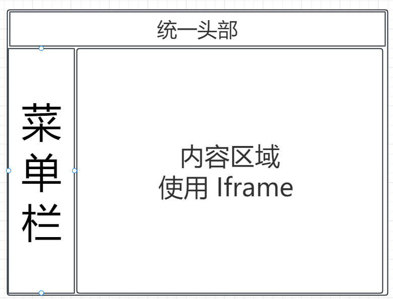
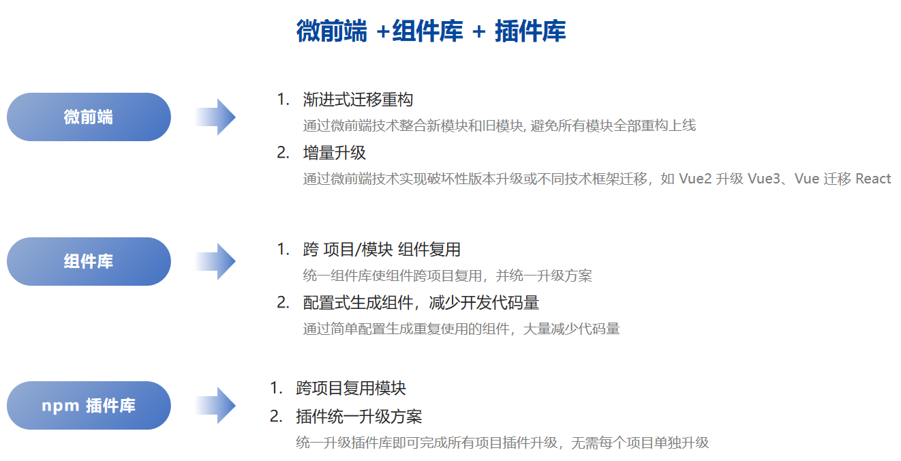
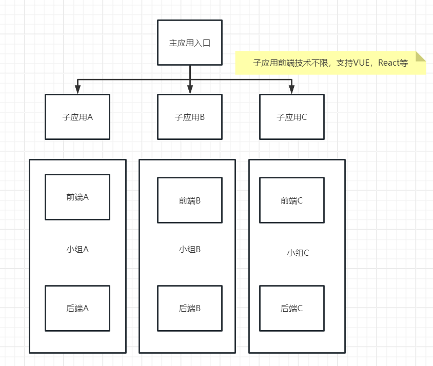
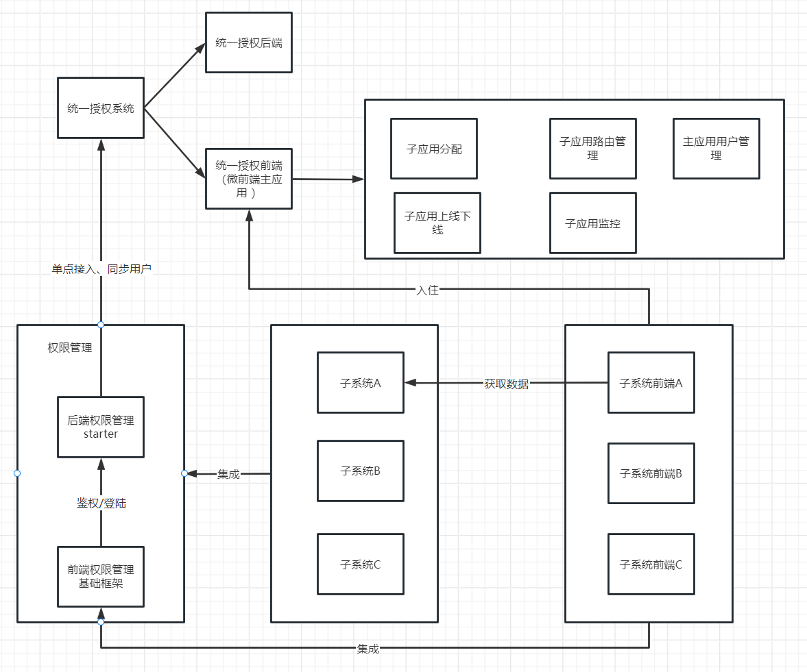

# 使用微前端重构项目

## 背景

最近有一个多年老项目（该项目使用 PHP + JQuery 前后端不分离模式开发，由于该项目经历多手人员维护，还参杂使用 CDN 方式引入 element-ui 和 Ant-design，纯后端人员维护，总之技术栈很乱）接到一些新需求，该项目由一位多年经验后端人员维护。这些需求后端维护人员表示无法使用 JQuery 实现（简述就是实现类是任务进度看板和自定义描述列表需求）。

该项目技术栈严重落后，大量复杂需求无法实现，因此借机将重构提上日程。

----

## 需求分析

**原系统存在以下问题：**

1. 系统使用 JQuery + PHP 技术开发、技术老旧过时，多数技术已停止更新维护

2. 模块繁多，一次性全部重构上线不现实

3. 使用前后端不分离开发，重构使用前后端分离技术开发，难以兼容

4. 新旧技术不兼容，权限管理困难

   

由于原系统任然有许多模块在迭代维护，我们不能直接抛弃原系统模块重新开发。

**因此需要实现增量迭代：**

* 原模块迭代升级较小时，继续使用原技术模块开发；
* 新需求使用新技术开发；
* 系统原模块和新需求模块需要共存；

---

## 技术分析

### 原系统技术栈

*  PHP + JQuery 前后端不分离；
* 部分页面使用 Vue2 + ElementUI，使用 CDN 方式引入；

原项目页面结构：

* 侧边菜单栏
* 内容区

原项目使用 iframe 实现微前端结构，使用了统一的菜单和统一头部，内容区域使用 iframe 嵌入不同的页面

然而整套项目时候 PHP + JQuery 实现；

### **重构方案**

* **基座**：可以使用 Vue/React 重构基座；
  * 基座负责控制子应用、登录、权限、状态、路由
* **旧项目容器**：使用 Vue/React 搭建一个原项目子应用，通过路由 + iframe 模式重构子项目；
  * 原项目子应用负责渲染原页面
* **新项目容器**：使用  Vue/React 搭建一个新项目子应用，负责开发新需求模块；

1. 基座控制权限和路由、状态等，根据路由渲染不同的子应用；
2. 当有新的需求模块时候，使用新应用开发；
3. 当完成旧应用某个模块时，在旧应用容器中下线对应模块路由；
4. 将`新的模块路由/重构后的模块路由`更新到基座容器路由表中。

下面会详细分析三个应用的技术方案

---

## 技术架构

### **微前端**

提供基座容器

### **组件库**

为主应用和子应用提供统一组件：

* 各应用组件资源共享
* 统一的配置化组件库
* 统一的样式结构

### **插件库**

为主应用和子应用提供统一插件：

* 各应用提供统一的逻辑处理
* 登录、token校验、权限控制
* 监控、错误处理、http

### **脚手架**

脚手架提供创建子应用项目统一配置和文件结构

* 统一的文件结构
* 统一的文件配置

### **CICD**

统一的CICD流程为各个子应用和主应用提供统一的构建/部署流程

---

## 项目构架

### 主应用（基座）

最外层是**基座，** 基座是微前端应用集成的一个重要平台。

基座同时也肩负着管理公共资源、依赖、规范的责任。

#### **职责**

基座主要有以下职责：

1. 子应用集成，给子应用提供渲染容器
2. 权限管理
3. 路由和菜单管理
4. 会话管理
5. 主题管理
6. 共享依赖
7. 多语言管理
8. 登录页面
9. 登录管理：登录、token 校验、token 刷新
10. 404 页面

#### **基座结构**

基座提供基础的功能和菜单栏，作为渲染容器。因此基座的页面结构为：

* 登录页面
* 内容页面：侧边栏菜单、header、footer

#### 基座权限管理和登录方案

1.统一授权系统只关心主应用配置，子应用菜单权限，接口权限由各个子系统各自管理（可在stater中统一继承）

2.子系统可与统一授权同步用户，由统一授权系统认证，子系统分配权限，也可以不同步用户（用户登陆主应用后，点击某个子系统重新输入子系统账号密码进入）

3.可快速响应需求 前端不限框架技术，不关心用户模块，同理后端也只关心业务模块

### 子应用（旧项目容器）

旧项目容器项目，使用 Vue/React 搭建，负责管理旧应用路由和页面渲染：

1. 封装一个 iframe 组件，负责渲染旧应用页面内容
2. 通过路由参数传入 iframe 组件，渲染不同的页面

### 新应用

新需求模块和重构的需求模块在新应用中开发。
