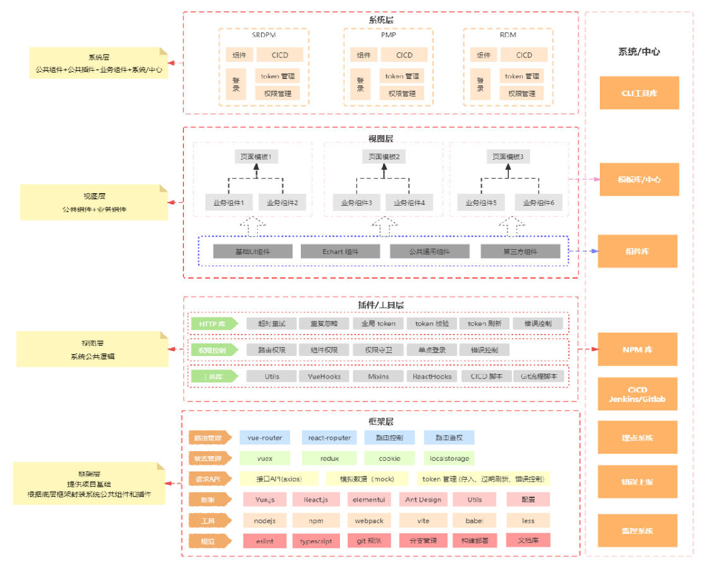

# 使用微前端重构项目

## 背景

最近有一个多年老项目（该项目使用 PHP + JQuery 前后端不分离模式开发，由于该项目经历多手人员维护，还参杂使用 CDN 方式引入 element-ui 和 Ant-design，纯后端人员维护，总之技术栈很乱）接到一些新需求，该项目由一位多年经验后端人员维护。这些需求后端维护人员表示无法使用 JQuery 实现（简述就是实现类是任务进度看板和自定义描述列表需求）。

该项目技术栈严重落后，大量复杂需求无法实现，因此借机将重构提上日程。

## 需求分析

**原系统存在以下问题：**

1. 系统使用 JQuery + PHP 技术开发、技术老旧过时，多数技术已停止更新维护
2. 模块繁多，一次性全部重构上线不现实
3. 使用前后端不分离开发，重构使用前后端分离技术开发，难以兼容
4. 新旧技术不兼容，权限管理困难

由于原系统任然有许多模块在迭代维护，我们不能直接抛弃原系统模块重新开发。

**因此需要实现增量迭代：**

* 原模块迭代升级较小时，继续使用原技术模块开发；
* 新需求使用新技术开发；
* 系统原模块和新需求模块需要共存；

## 技术分析

原系统技术栈：

*  PHP + JQuery 前后端不分离；
* 部分页面使用 Vue2 + ElementUI，使用 CDN 方式引入；

原项目页面结构：

## 技术方案选型

## 技术架构

## 项目分析

最外层是**基座，** 基座是微前端应用集成的一个重要平台。

基座同时也肩负着管理公共资源、依赖、规范的责任。

基座主要有以下职责：

1. 子应用集成，给子应用提供渲染容器
2. 权限管理
3. 会话管理
4. 路由、菜单管理
5. 主题管理
6. 共享依赖
7. 多语言管理
8. 登录页面

