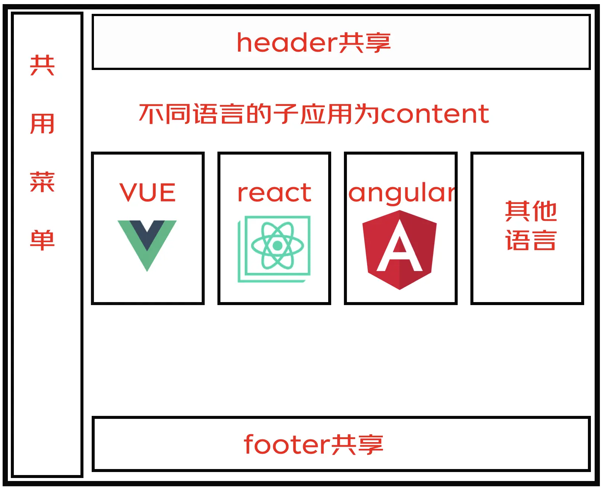

# 使用微前端重构项目

## 背景

## 技术方案选型

## 架构

## 项目分析

最外层是**基座，** 基座是微前端应用集成的一个重要平台。

基座同时也肩负着管理公共资源、依赖、规范的责任。

基座主要有以下职责：

1. 子应用集成，给子应用提供渲染容器
2. 权限管理
3. 会话管理
4. 路由、菜单管理
5. 主题管理
6. 共享依赖
7. 多语言管理
8. 登录页面

