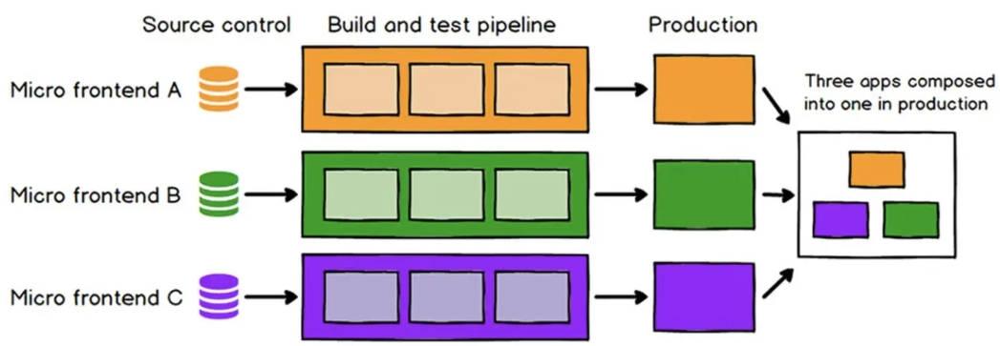
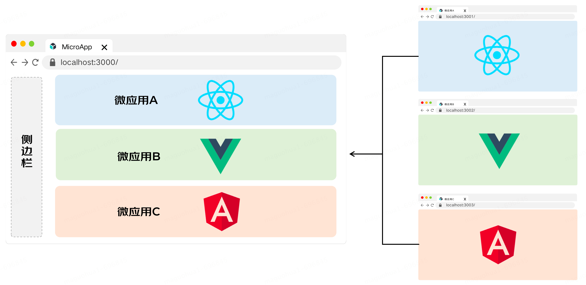
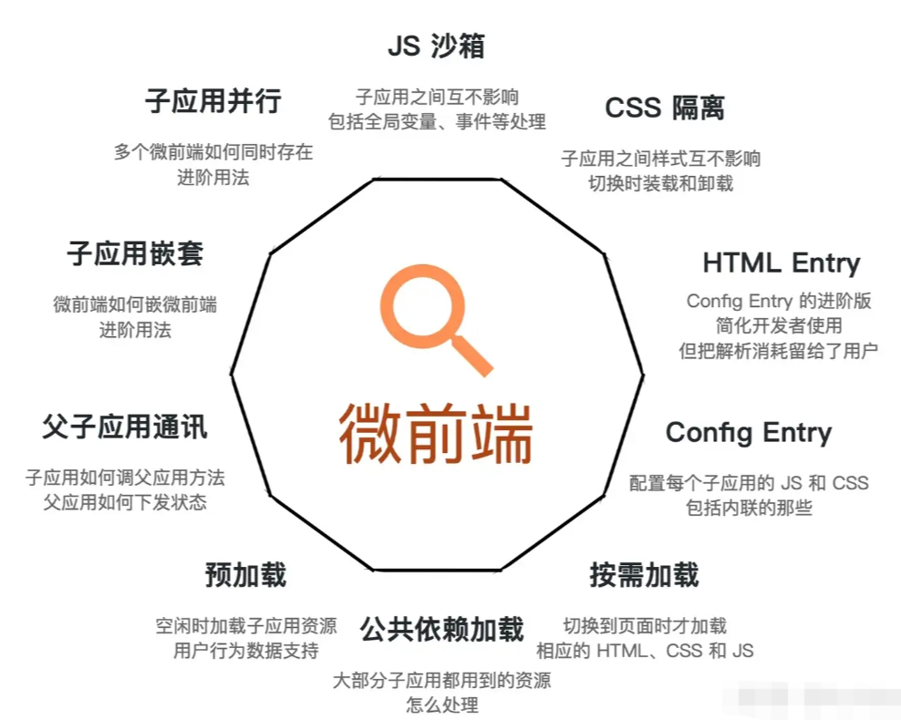
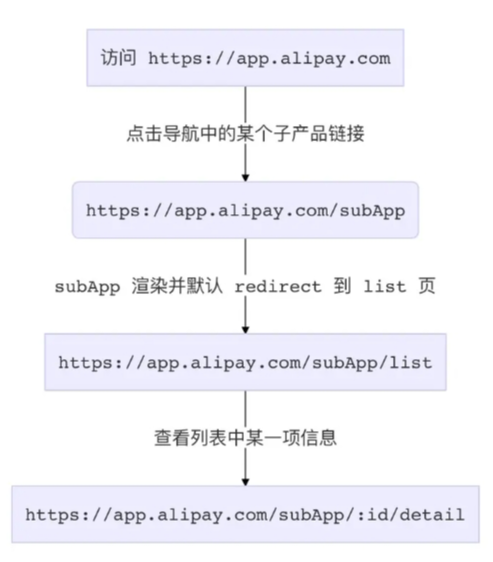
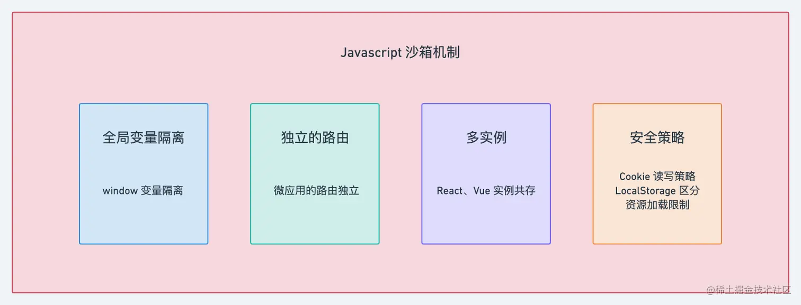
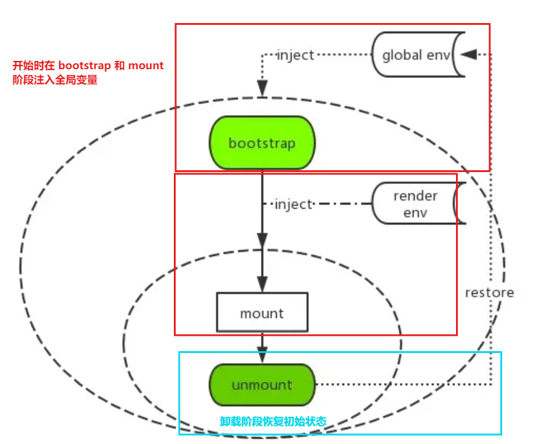
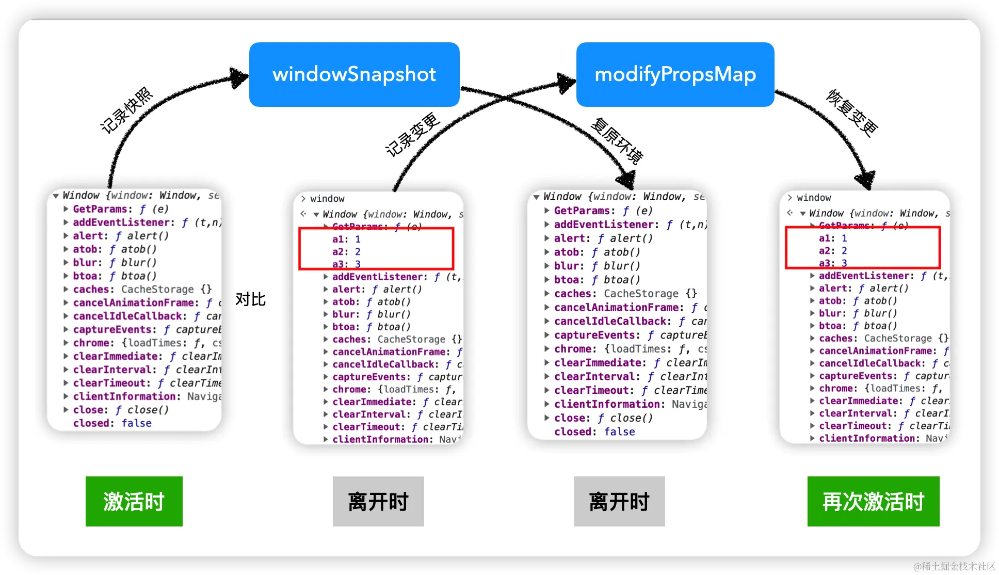
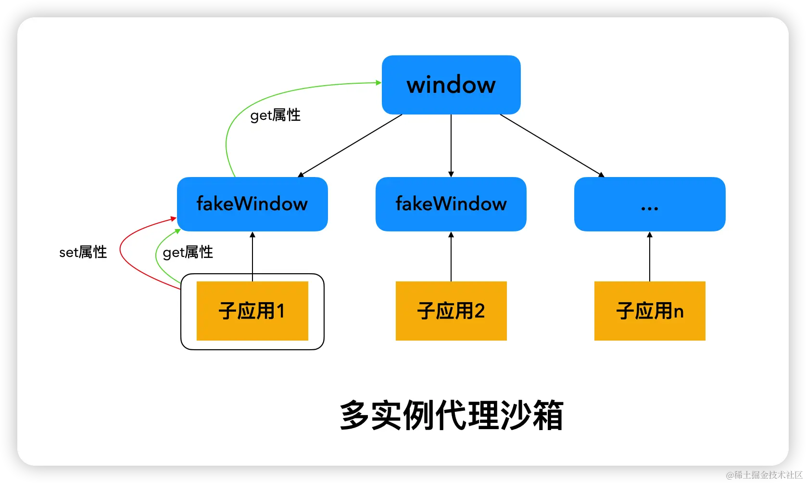
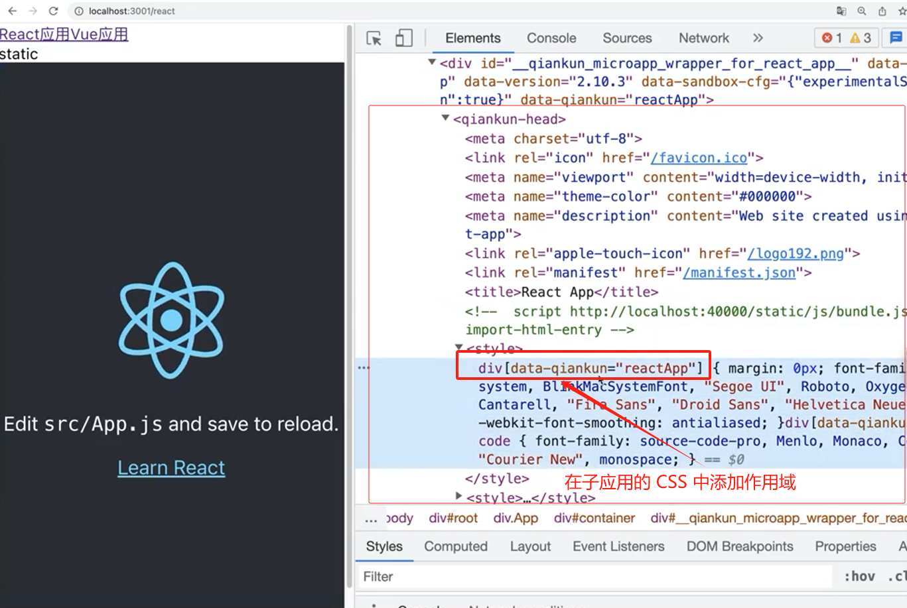

# 微前端基础

## 什么是微前端？

微前端是一种技术手段及方法策略，旨在通过多个团队独立发布功能的方式，共同构建现代化的Web应用。

它借鉴了微服务的架构理念，将一个庞大的前端应用拆分为多个独立灵活的小型应用（即微应用），每个微应用都可以独立开发、独立运行、独立部署，然后再将这些小型应用联合为一个完整的应用。




## **目标**

微前端的核心目标是将巨石应用拆解成若干可以自治的松耦合微应用，确保微应用真正具备独立开发、独立运行的能力。

这种架构既可以将多个项目融合为一，又可以减少项目之间的耦合，提升项目扩展性。相比一整块的前端仓库，微前端架构下的前端仓库更小、更灵活。

它主要解决了两个问题：

- 1、随着项目迭代应用越来越庞大，难以维护。
- 2、跨团队或跨部门协作开发项目导致效率低下的问题。




## **特点**

1. **技术栈无关**：微前端架构允许不同的团队使用不同的技术栈进行开发。这意味着，一个项目中可能同时包含使用React、Vue、Angular等不同框架构建的微应用。这种灵活性使得团队可以根据自身专长或项目需求选择合适的技术栈。
2. **独立开发、部署和演进**：每个微应用都是独立的，可以独立地进行开发、测试和部署。这种独立性极大地提高了开发效率，因为不同的团队可以并行工作，互不影响。同时，由于微应用可以独立演进，因此可以更容易地实现增量更新和升级。
3. **增量升级**：在微前端架构中，可以逐个升级微应用，而无需将整个应用一起升级。这种增量升级的特性使得应用的更新更加灵活和可控，减少了升级过程中的风险。
4. **运行时组合**：微前端架构在运行时将多个微应用组合成一个整体应用。这种组合是动态的，可以根据需要进行调整。这使得应用具有更好的可扩展性和可维护性。
5. **主从架构**：微前端通常采用主从架构，其中主应用负责整体应用的路由、状态管理、公共资源加载等，而微应用则负责各自的功能实现。主应用和微应用之间通过约定的接口进行通信和协作。
6. **隔离性**：微前端架构强调微应用之间的隔离性，以确保每个微应用的稳定性和安全性。这包括样式隔离、JavaScript 变量隔离、路由隔离等方面。
7. **弹性扩展**：由于微前端架构的模块化特性，可以方便地添加或移除微应用，以实现应用的弹性扩展。这种扩展性使得应用能够更好地适应业务需求的变化。
8. **提升开发体验**：微前端架构允许开发团队使用各自熟悉的技术栈和工具链进行开发，从而提升了开发体验和效率。同时，由于微应用之间的隔离性，开发过程中不会相互干扰，减少了开发过程中的冲突和错误。

总的来说，微前端架构通过拆分应用为多个独立的微应用，提高了应用的可维护性、可扩展性和开发效率。它允许不同的团队使用不同的技术栈进行开发，并通过约定的接口进行协作和通信，从而实现了一个更加灵活和高效的前端开发模式。

## 常见微前端应用

根据微前端以上特点，微前端应用于以下场景：

### **项目拆分**

- 微前端架构允许不同的团队使用不同的技术栈进行开发。
- 每个微应用都是独立的，可以独立地进行开发、测试和部署。

对比巨石应用一整块的代码仓库，微前端架构下的代码仓库更加**简单**、**轻量**。各个仓库的代码可以基于**业务**、**权限**、**变更的频率**、**组织结构**、**后端微服务**等原则拆分，**界限明确**，**降低耦合**，便于开发人员在开发过程中快速定位源代码，提高开发效率，降低维护成本。

在实际项目中，各个项目会因为各种各样的原因导致使用的技术栈不一样。比如开发框架有 **react**、**vue**、**angular** 等，构建工具有 **webpack**、**rollup**、**parcel** 等，而且版本还可能不一致。使用微前端架构，可以做到将使用不同技术栈(不同版本)的子应用聚合起来。


### 增量升级

> **使用微前端方案很大一部分原因就是为了解决遗留系统迁移问题。**

每个公司项目会存在一些应用随时时间推移和迭代，导致技术落后问题。如：使用 Jquery 开发的项目随时间推移成为技术老旧项目，并且使用 Jquery 实现一些功能复杂。 

我们很难一次性将整个项目重构完成再上线，因此需要将新需求使用新技术，系统原来功能保持不变。

使用微前端可以实现以上增量升级方案。


### 技术栈升级

有些项目，在成立之初使用了当前最新的技术如 Vue2。但是随着技术的发展，Vue 已经更新到了Vue3，但项目由于一直在迭代，还是使用  Vue2。直接全部重构，肯定是不现实的，费时费力不说，风险也大。

针对这种情况，我们可以重起一个应用，使用 Vue3 循序渐进的重构应用，然后使用微前端方案将新旧应用聚合在一起。

 

## 缺点

1. **复杂性增加**：微前端架构需要处理多个独立的应用，每个应用都有自己的技术栈、构建流程和依赖关系。这可能导致整体架构的复杂性增加，需要额外的管理和协调工作。
2. **性能问题**：在微前端中，每个应用都可能需要加载和初始化自己的依赖，这可能导致页面加载时间增加。同时，页面之间的跳转可能会引入额外的延迟。因此，需要仔细优化和考虑性能问题。
3. **数据共享和状态管理**：在微前端中，不同的应用可能来自不同的团队，它们之间的数据共享和状态管理可能变得复杂。需要找到合适的方法来共享数据和状态，避免数据不一致问题。
4. **开发门槛高**：实现微前端架构需要一定的技术积累和实践经验，对于新手来说可能存在一定的学习门槛。此外，由于涉及到多个应用的整合和协作，因此也需要具备一定的团队协作和沟通能力。

---


## 微前端带来问题

> [可能是你见过最完善的微前端解决方案 - 知乎 (zhihu.com)](https://zhuanlan.zhihu.com/p/78362028) 该文章详细介绍了微前端应用遇到的技术问题和解决方案


根据微前端架构，主框架的核心充当调度者的角色，由它来决定在不同的条件下激活不同的子应用。

因此主框架的定位则仅仅是：**导航路由 + 资源加载框架**。

而具体要实现这样一套架构，我们需要解决以下几个技术问题：

* **路由系统及 Future State 问题**：主应用和子应用路由加载时序，导致刷新页面时无法加载子应用路由出现 404.
* **组合模式 问题**：主框架和子框架在 构建时组合 or  运行时组合？
* **入口文件类型 问题**：子应用入口加载 JavaScript or  加载 HTML 文件？
* **模块导入 问题**：使用 UMD 模块格式打包子应用，如何在浏览器运行时获取远程脚本中导出的模块引用？
* **样式冲突 问题**： 不同子应用之间样式附加在同一页面上产生冲突。
* **脚本互斥 问题**：不同微前端应用之间因为加载和执行脚本而导致的冲突和干扰。
* **消息通信 问题**：在微前端架构中，每个微前端应用都是独立的，这些微前端应用之间又需要相互通信以协同工作，比如共享数据、触发事件等。
* **公共依赖加载 问题**：在微前端架构中，每个微前端应用可能都会依赖一些公共的库或框架。如果管理不好可能导致依赖重复加载和版本重提等问题。
* **微应用打开速度慢 问题**（通常使用 **资源预加载** 解决）



### 路由系统实现问题

在一个实现了微前端内核的产品中，正常访问一个子应用的页面时，可能会有这样一个链路：



此时浏览器的地址可能是 `https://app.alipay.com/subApp/123/detail`，想象一下，此时我们手动刷新一下浏览器，会发生什么情况？

**刷新后现象：**

子应用跳 NotFound 页或者直接路由报错。

**原因分析：**

* 由于我们的子应用都是 lazy load 的，当浏览器重新刷新时，主框架的资源会被重新加载，同时异步 load 子应用的静态资源
* 由于此时主应用的路由系统已经激活，但子应用的资源可能还没有完全加载完毕，从而导致路由注册表里发现没有能匹配子应用 `/subApp/123/detail` 的规则，这时候就会导致跳 NotFound 页或者直接路由报错。

这个问题在所有 lazy load 方式加载子应用的方案中都会碰到，早些年前 angularjs 社区把这个问题统一称之为 [Future State](https://link.zhihu.com/?target=https%3A//ui-router.github.io/guide/lazyloading%23future-states)。

**解决方案：**

需要设计这样一套路由机制：

1. 主框架配置子应用的路由为 `subApp: { url: '/subApp/**', entry: './subApp.js' }`
2. 当浏览器的地址为 `/subApp/abc` 时，框架需要先加载 entry 资源；
3. 待 entry 资源加载完毕，确保子应用的路由系统注册进主框架之后，再去由子应用的路由系统接管 url change 事件。
4. 同时在子应用路由切出时，主框架需要触发相应的 destroy 事件，子应用在监听到该事件时，调用自己的卸载方法卸载应用，如 React 场景下 `destroy = () => ReactDOM.unmountAtNode(container)`。

**实现原理：**劫持 url change 事件从而实现路由系统。 


### 主框架和子框架组合模式问题

微前端架构模式下，子应用打包的方式，基本分为两种：

| 方案   | 特点                                                         | 优点                                             | 缺点                                                         |
| ------ | ------------------------------------------------------------ | ------------------------------------------------ | ------------------------------------------------------------ |
| 构建时 | 子应用通过 Package Registry ( npm package 或 git tags ) 方式，**与主应用一起打包发布**。 | 主应用、子应用之间可以做打包优化:如依赖共享等    | 1.子应用与主应用之间产品工具链耦合。工具链属于技术栈的一部分。<br />2.子应用发布依赖主应用重新打包发布 |
| 运行时 | 子应用单独构建打包，主应用运行时动态加载子应用资源           | 主应用与子应用之间完全解耦，子应用完全技术栈无关 | 产生运行时的复杂度和 overhead                                |

要实现真正的技术栈无关跟独立部署两个核心目标，大部分场景下需要使用运行时加载子应用方案。


### 入口文件类型问题

在确定了运行时载入的方案后，需要确定子应用提供什么形式的资源作为渲染入口？

通常子应用提供什么形式的资源作为渲染入口：

* JS Entry
* HTML Entry 

| APP 入口文件      | 特点                                                         | 优点                                                         | 缺点                                                         |
| ----------------- | ------------------------------------------------------------ | ------------------------------------------------------------ | ------------------------------------------------------------ |
| JS 文件作为入口   | 子应用的所有资源打包到一个 js bundle 中，包括 css、图片等资源 | 主子应用使用同一个 bundler,方便做构建时优化                  | 1.子应用的发布需要主应用重新打包<br />2.主应用需为每个子应用预留一个容器节点，且该节点 id 需与子应用的容器 id 保持一致<br/>3.子应用各类资源需要一起打成一个 bundle，资源加载效率变低<br />4. 打包资源庞大<br />5.资源的并行加载特性无法使用 |
| HTML 文件作为入口 | 直接将子应用打出来 HTML 作为入口，<br />主框架可以通过 fetch html 的方式获取子应用的静态资源，<br />同时将 HTML document 作为子节点塞到主框架的容器中 | 1.子应用开发、发布完全独立<br/>2.子应用具备与独立应用开发时-致的开发体验<br />3.解决子应用样式隔离问题 | 1.多一次请求，子应用资源解析消耗转移到运行时<br />2.主子应用不处于同一个构建环境，无法利用 bundler 的一些构建期的优化能力，如公共依赖抽取等 |


### 模块导入问题

在微前端架构下，由于子应用通常有集成部署、独立部署两种模式同时支持。使得我们只能选择 umd 这种兼容性的模块格式打包子应用。

在这种模式下，**如何在浏览器运行时获取远程脚本中导出的模块引用**？

在常见的微前端框架中，解决微应用模块导入问题通常依赖于框架提供的特定机制或策略。

这些机制允许主应用在运行时动态地加载、注册和卸载微应用。

以下是一些常见的解决方案：

**SystemJS**：

* SystemJS 是一个动态 ES6 模块加载器，可以在运行时加载和执行 JavaScript 模块。
* 在微前端架构中，SystemJS 可以用于加载微应用的入口文件（通常是包含微应用初始化和挂载逻辑的 JavaScript 文件）。
* 当主应用需要加载某个微应用时，它会使用 SystemJS 来动态加载并执行该微应用的入口文件。

**Webpack 的动态导入**：

* Webpack 支持动态导入（dynamic imports），允许你在 JavaScript 代码中按需加载模块。
* 在微前端架构中，你可以使用 Webpack 的动态导入来加载微应用的入口文件。
* 当主应用需要加载某个微应用时，它会使用 Webpack 的 `import()` 语法来动态加载并执行该微应用的入口文件。

**Single-SPA**：

* Single-SPA 是一个微前端框架，它提供了一个核心 API 来注册、启动和卸载微应用。
* 在 Single-SPA 中，每个微应用都是一个独立的单页应用（SPA），它们有自己的路由和生命周期。
* 主应用使用 Single-SPA 的 API 来注册微应用，并在需要时加载和卸载它们。
* Single-SPA 通过监听 URL 变化来触发微应用的加载和卸载，从而实现微应用之间的无缝切换。

**自定义模块加载器**：除了上述方案外，你还可以根据实际需求自定义模块加载器来解决微应用模块导入问题。自定义模块加载器可以根据你的需求来加载和执行微应用的入口文件，并提供额外的功能（如缓存、错误处理等）。


### 脚本互斥问题

在微前端技术方案中，脚本互斥问题指的是不同微前端应用之间因为加载和执行脚本而导致的冲突和干扰。这些冲突可能来自于全局变量的污染、DOM 结构的冲突、事件监听的冲突等方面。

**脚本互斥问题的原因**

1. **全局变量污染**：不同的微前端应用可能使用了相同的全局变量名，导致一个应用修改了全局变量的值，影响到了另一个应用。
2. **DOM 结构冲突**：不同的微前端应用可能尝试操作相同的 DOM 元素，或者因为样式冲突导致 DOM 元素的表现不一致。
3. **事件监听冲突**：不同的微前端应用可能都监听了相同的事件，导致事件处理函数之间的冲突和干扰。

**解决方案**

1. **沙箱隔离：**
   - 使用 JavaScript 的沙箱机制，为每个微前端应用创建一个独立的全局环境，避免全局变量的污染。
   - 这可以通过 Proxy、Web Workers 或者 iframe 等技术实现。
   - 例如，qiankun 框架就采用了基于 Proxy 的沙箱实现，确保每个微前端应用都在自己的环境中运行。
2. **DOM 隔离：**
   - 为每个微前端应用分配一个独立的 DOM 容器，避免 DOM 结构的冲突。
   - 这可以通过在主应用中预留一些空的 DOM 节点，然后在加载微前端应用时将其挂载到这些节点上实现。
   - 同时，还需要注意样式隔离，避免不同微前端应用的样式相互干扰。
3. **事件监听隔离：**
   - 为每个微前端应用分配独立的事件监听空间，避免事件监听的冲突。
   - 这可以通过在事件监听器中添加命名空间、使用自定义事件或者事件委托等技术实现。
   - 例如，可以约定每个微前端应用只监听以自己命名空间为前缀的事件，从而避免冲突。


### 应用隔离问题

微前端的应用隔离主要指的是在微前端架构中，将不同的微前端应用程序隔离开来，以确保它们之间不会相互影响或干扰。

应用隔离主要分两种情况：

- 一种是 `主应用与微应用`之间的隔离；
- 一种是 `微应用与微应用`之间的隔离；

应用间所隔离的主要是：

* **Javascript 的沙箱隔离** 
* **CSS 的样式隔离**

#### **JavaScript的沙箱隔离**

**问题：**

如何确保各个子应用之间的全局变量不会互相干扰，从而保证每个子应用之间的软隔离？

**解决方案：**

沙箱是一种安全机制，目的是让程序运行在一个相对独立的隔离环境，使其不对外界的程序造成影响，保障系统的安全。

在微前端中，不同开发团队的子应用很难通过规范约束他们使用全局变量，因此沙箱机制可以确保每个微前端应用都在自己的环境中运行，互不干扰。

每当微应用的  JavaScript 被加载并运行时，它的核心实际上是对全局对象 Window 的修改以及一些全局事件的改变，例如 jQuery 脚本运行后，会在 Window 上挂载一个 window.$ 对象，对于其他库 React，Vue 也相同。

为此，需要在加载和卸载每个微应用的同时，尽可能消除这种冲突和影响，最普遍的做法是采用沙箱机制（SandBox）；



##### **实现沙箱隔离机制方法**

微前端中常见的实现沙箱的方法主要有以下几种：

* 基于 iframe 的沙箱
* 基于 JavaScript 的作用域和闭包机制的沙箱
* 基于 Proxy 的沙箱
* 基于快照的沙箱
* Shadow DOM

##### **基于 iframe 的沙箱**

- 在前端中，`iframe` 是一个重要的 HTML 标签，它允许将另一个 HTML 文档嵌入到当前的 HTML 文档中。
- 通过 `iframe` 对象，我们可以将原生浏览器对象通过 `contentWindow` 取出来，这个对象天然具有所有的属性，并且与主应用的环境隔离。
- 但是，使用 `iframe` 也有一些缺点，比如性能开销、跨域限制、样式同步问题等。

##### **基于 JavaScript 的作用域和闭包机制的沙箱**

- JavaScript 中的每个变量都有自己的作用域，作用域之间是相互独立的。
- 闭包机制可以使一个函数内部的变量被外部访问，但外部的变量不能被内部访问。
- 利用这些特性，可以创建出独立的运行环境，实现代码的隔离和限制。


##### **基于快照的沙箱**

- 这也是 qiankun 等框架提供的一种沙箱实现方式。
- 它在子应用加载时对全局对象进行快照，保存全局对象的当前状态。
- 然后，在子应用卸载时，将全局对象恢复到加载时的状态。
- 这种方式也能确保子应用在沙箱中自由地修改全局对象，而不会影响到其他子应用。
- 缺点：浪费内存（因为需要给 window 添加快照）



实现一个快照沙箱类：

```javascript
class SnapshotSandbox{
	constructor(){
		this.modifyPropsMap ={};//存储全局哪些属性被修改了
    }
    // 激活状态
	active(){
		this.windowSnapShot ={};
        //给window拍照，保存 window 的属性快照
        0bject.keys(window).forEach(prop=>{this.windowSnapShot[prop]= window[prop]})
        // 将修改后的属性赋值给 window
        0bject.keys(this.modifyPropsMap).forEach(prop=>{ window[prop]= this.modifyPropsMap[prop]})
     }
    // 失活状态，还原 window 属性
	inactive(){
		this.modifyPropsMap ={}
		Object.keys(window).forEach(prop=>{
            // 查看 window 属性是否有变化，有变化的属性保存到快照
			if(window[prop] !== this.windowSnapShot[prop]){
                this.modifyPropsMap[prop]= window[prop];
                // 应用快照的属性
				window[prop]= this.windowSnapShot[prop];
            }
        })
    }
}

// 使用示例
let sandbox =new SnapshotSandbox();
sandbox.active(); // 激活沙箱
window.a=100; // 修改 window 属性
window.b =200;
sandbox.inactive(); // 沙箱失活
console.log(window.a,window.b)
```




##### **基于 Proxy 的沙箱**

- Proxy 沙箱是微前端框架（如 qiankun）中的一种常见实现方式。
- 它使用 JavaScript 的 Proxy 对象创建一个全局对象的代理，通过这个代理隔离子应用对全局对象的影响。
- 当子应用试图修改全局对象时，这个代理会拦截这个操作，将修改应用到代理对象上，而不是全局对象上。
- 这样，子应用就可以在沙箱中自由地修改全局对象，而不会影响到其他子应用。

* 缺点：该模式只能在单例模式下使用，如果两个应用同时运行，则会导致 window 对象属性混乱。


**单例的代理沙箱 （** [**LegacySanbox**](https://link.juejin.cn?target=https%3A%2F%2Fgithub.com%2Fumijs%2Fqiankun%2Fblob%2Fmaster%2Fsrc%2Fsandbox%2Flegacy%2Fsandbox.ts) **）**

与快照沙箱思路很相似，但它不用通过 Diff 前后 window 的方式去记录变更，而是通过 ES6的 Proxy 代理 window 属性的 set 操作来记录变更。由于不用反复遍历 window，所以性能要比快照沙箱好。


实现 单例模式下基于 Proxy 的沙箱：

```javascript
class LegacySandbox {
	constructor(){
		//修改的内容 
        this.modifyPropsMap = new Map();
        // 新增的内容
        this.addedPropsMap =new Map();
         // 保存不管修改还是新增的属性
        this.currentPropsMap = new Map();
        // 代理 window 对象
		const fakeWindow = 0bject.create(null)
        const proxy = new Proxy(fakeWindow,{
            // 读取属性从 window 对象中获取
            get:(target,key,recevier)=>{
                return window[key]
            }
            
			set:(target,key,value)=>{
                // window 不存在属性
                if(!window.hasOwnProperty(key)){
                    // 加入新增属性
                    this.addedPropsMap.set(key,value)
                }else if(!this.modifyPropsMap.has(key)){
                    // 保存修改的值
                    this.modifyPropsMap.set(key,window[key])
                }
                this.currentPropsMap.set(key,value);
                window[key]= value;// 修改成最新的内容
        	}
        })
        this.proxy = proxy
	   }
    	// 将沙箱属性复制给 window 属性
        setWindowProp(key,value){
            if(value == undefined){
                 delete window[key];
            }else{
                window[key]= value;// 覆盖修改前的
            }
        }
    	// 沙箱激活
        active(){
            this.currentPropsMap.forEach((value,key)=>{
                // 将沙箱属性复制给 window 属性
                this.setWindowProp(key,value)
            })
        }
    	// 沙箱失活状态
        inactive(){
             // 将沙箱中修改后的属性复制给 window 属性
			this.modifyPropsMap.forEach((value, key)=>{
                this.setWindowProp(key,value)
            })
            // 将沙箱中删除后的属性复制给 window 属性
            this.addedPropsMap.forEach((value,key)=>{
                this.setWindowProp(key,undefined)
            })
        }
}


// 使用示例
let sandbox = new LegacySandbox();
sandbox.proxy.a = 100;
console.log(window.a) // 100
sandbox.inactive()
console.log(window.a) // undefined
sandbox.active()
console.log(window.a) // 100

```


**多例的代理沙箱（** [**ProxySandbox**](https://link.juejin.cn?target=https%3A%2F%2Fgithub.com%2Fumijs%2Fqiankun%2Fblob%2Fmaster%2Fsrc%2Fsandbox%2FproxySandbox.ts) **）**

以上两种沙箱机制，都只支持单例模式（同一页面只支持渲染单个子应用）,（因为它们都直接操作的是全局唯一的 window）

假如为每个子应用都分配一个独立的  `虚拟window` ，当子应用操作 window 时，其实是在各自的 `虚拟window`  上操作，就可以实现多实例共存了。事实上，qiankun 确实也是这样做的。




实现多例模式下基于 Proxy 的沙箱：

```javascript
class ProxySandbox{
	constructor(){
		this.running = false
		const fakeWindow = 0bject.create(null)
        this.proxy = new Proxy(fakeWindow,{
            get:(target,key)=>{
                if(!this.running){
                    return window[key]
                }
				return key in target ? target[key]:window[key]
            }
            //修改不在操作window属性
			set:(target,key,value)=>{
                if(this.running){
                    target[key]= value;
                }
				return true;
            }
        })
     }
	 active(){
		if(!this.running)
            this.running = true
     }
   
	inactive(){
		this.running = false
    }
  }

  
 // 使用示例
 let sandbox1 = newProxySandbox();
 let sandbox2 = newProxySandbox();
      sandbox1.active();
      sandbox2.active();
      sandbox1.proxy.a = 100;
      sandbox2.proxy.a=100;//不会影响window
    console.log(sandbox1.proxy.a,window.a) // 100  undefined
    console.log(sandbox2.proxy.a,window.a) // 100  undefined
    sandbox1.inactive();
    sandbox2.inactive();
    sandbox1.proxy.a=200;
    sandbox2.proxy.a= 200;
    console.log(sandbox1.proxy.a,window.a) // 200  undefined
    console.log(sandbox2.proxy.a,window.a)// 200  undefined
```


##### **Shadow DOM**

- 虽然 Shadow DOM 主要是用于封装组件的样式和行为，但它也可以用于实现某种程度的沙箱效果。
- Shadow DOM 提供了将 DOM 树的一部分（称为“shadow tree”）附加到任何元素（称为“host element”）的能力，并且这个 shadow tree 是封装的，不会影响到外部 DOM 树。
- 基于 Web Components 的 Shadow DOM 能力，我们可以将每个子应用包裹到一个 Shadow DOM 中，保证其运行时的样式的绝对隔离。
  - 缺点：
    - 由于子应用的样式作用域仅在 shadow 元素下，那么一旦子应用中出现运行时越界跑到外面构建 DOM 的场景，必定会导致构建出来的 DOM 无法应用子应用的样式的情况。
    - 比如 sub-app 里调用了 antd modal 组件，由于 modal 是动态挂载到 document.body 的，而由于 Shadow DOM 的特性 antd 的样式只会在 shadow 这个作用域下生效，结果就是弹出框无法应用到 antd 的样式。解决的办法是把 antd 样式上浮一层，丢到主文档里，但这么做意味着子应用的样式直接泄露到主文档。


#### **CSS的样式隔离**

由于在微前端场景下，不同技术栈的子应用会被集成到同一个运行池中，所以必须在框架层确保各个子应用之间不会出现样式互相干扰的问题。

例如：一个团队的微应用的样式表为 `h2 { color: black; }`，而另一个团队的微应用则为 `h2 { color: blue; }`，而这两个选择器都附加在同一页面上，就会冲突；

为了避免这个问题，常见的解决方案有：

- **BEM**: 严格的命名约定，使用不同命名进行区分应用样式；
- **CSS Module**: CSS Modules 通过将 CSS 类名转换为唯一的标识符来实现作用域隔离。
  - qiankun2.x 之前 的 CSS 样式隔离方案默认使用 **CSS Module**；
  - 缺点：子应用中的 dom 元素如果挂载到外层中，会导致样式不生效。

- **CSS-in-JS** 
- **shadow DOM**：
  - 缺点：样式完全隔离，如果需要主应用控制子应用样式 或则 子应用控制主应用样式 则无法实现。


##### **BEM**

CSS BEM 是一种 CSS 类名命名方法，它代表 Block Element Modifier。BEM 方法提供了一种标准化的方式来构建 CSS 选择器，使得样式的复用、维护和扩展变得更加容易。

**BEM 的核心概念：**

1. **Block**：代表一个独立的组件或模块，它是自包含的并且具有特定的功能。Block 的 CSS 类名通常以一个名词表示，如 `button`。

2. **Element**：是 Block 的一部分，它不能单独存在，总是与 Block 一起出现。Element 的 CSS 类名通常在 Block 类名的基础上添加一个前缀，如 `button__label`。

3. **Modifier**：用于表示 Block 或 Element 的不同状态或变体。Modifier 的 CSS 类名通常在 Block 或 Element 类名的后面添加一个带有短划线的后缀，如 `button--primary` 或 `button__label--large`。

**特点：**

- **可复用性**：通过使用 BEM 方法，可以创建可复用的组件，因为每个组件都是独立的。
- **可维护性**：BEM 提供了清晰的结构，使得代码更容易理解和维护。
- **扩展性**：通过添加 Modifier 类，可以轻松扩展组件的样式，而不需要重写现有的 CSS。

**示例：**

假设你有一个按钮组件，你想要为其添加不同的样式和大小。

**HTML**:

```html
<button class="button button--primary">Click me</button>
<button class="button button--large">Press me</button>
```

**CSS**:

```css
/* Block: 基础样式 */
.button {
  background-color: #42b983;
  color: white;
  padding: 10px 20px;
  border: none;
  border-radius: 5px;
  cursor: pointer;
  transition: background-color 0.3s ease;
}

/* Element: 按钮内的文本 */
.button__label {
  font-size: 16px;
}

/* Modifier: 主要按钮样式 */
.button--primary {
  background-color: #3498db;
}

/* Modifier: 大号按钮样式 */
.button--large {
  padding: 15px 30px;
  font-size: 20px;
}

/* 组合使用 Block 和 Modifier */
.button--primary:hover,
.button--large:hover {
  background-color: #2980b9;
}
```

在这个例子中，`button` 是 Block，它定义了按钮的基础样式。`button__label` 是 Element，它定义了按钮内文本的样式。`button--primary` 和 `button--large` 是 Modifier，它们分别定义了按钮的不同变体样式。

使用 BEM 方法，你可以创建出结构清晰、易于理解和维护的 CSS 代码。这种方法特别适用于大型项目和团队协作，因为它减少了样式冲突的可能性，并且使得代码更加模块化。


##### **CSS Module**

CSS Modules 是一种 CSS 文件的组织方式，它允许你写出具有局部作用域的样式，而不是全局作用域的样式。这意味着你的 CSS 类名不会被意外地应用到其他部分的页面上，从而避免了样式冲突。

**原理：**

CSS Modules 通过将 CSS 类名转换为唯一的标识符来实现作用域隔离。这个过程通常是在构建过程中自动完成的，例如，使用 webpack 或其他构建工具。

**特点：**

1. **局部作用域**：CSS Modules 中定义的类名只在当前模块中有效，不会影响其他模块。
2. **自动命名**：构建工具会根据文件名和类名生成唯一的类名，避免全局命名冲突。
3. **易于维护**：由于样式的作用域被限制在模块内部，维护和修改样式更加简单。
4. **支持嵌套**：CSS Modules 支持嵌套选择器，但只对当前模块内的嵌套有效。

**示例：**

qiankun2.x 之前 的 CSS 样式隔离方案默认使用 **CSS Module**；




##### **CSS in JS**

CSS-in-JS 是一种将 CSS 代码嵌入到 JavaScript 文件中的技术。这种方法允许开发者为每个组件编写局部作用域的样式，而不是全局样式。CSS-in-JS 在 React 等现代前端框架中非常流行，它提供了一些显著的优势，如动态样式、更好的组件封装和易于维护的主题。

**CSS-in-JS 的特点：**

- **局部作用域**：样式仅限于组件内部，不会影响其他组件。
- **动态样式**：根据组件的状态和属性动态生成样式。
- **主题和样式的可配置性**：易于创建可重用的主题和样式配置。
- **减少全局样式冲突**：避免了全局 CSS 类名的冲突。

**CSS-in-JS 样式隔离原理:**

样式隔离是通过将样式封装在组件内部来实现的，主要原理包括：

1. **组件作用域**：每个组件都有自己的样式定义，这些样式不会泄露到组件外部。
2. **动态生成类名**：CSS-in-JS 库通常会动态生成唯一的类名，确保样式的作用域限制在特定组件。
3. **样式注入**：样式在运行时被注入到 DOM 中，并且仅应用于该组件的元素。

**示例**

假设我们使用一个流行的 CSS-in-JS 库，如 `styled-components`，在 React 中创建一个按钮组件：

**Button.js**:

```jsx
import React from 'react';
import styled from 'styled-components';

// 使用 styled-components 创建一个局部作用域的样式
const Button = styled.button`
  background-color: #42b983;
  color: white;
  padding: 10px 20px;
  border: none;
  border-radius: 5px;
  cursor: pointer;
  transition: background-color 0.3s ease;

  &:hover {
    background-color: #3aa373;
  }
`;

const MyButton = ({ onClick, label }) => {
  return <Button onClick={onClick}>{label}</Button>;
};

export default MyButton;
```

在这个示例中，我们使用 `styled-components` 创建了一个 `Button` 组件，它具有自己的样式定义。这些样式是局部的，只会影响使用这个 `Button` 组件的地方。`styled-components` 会自动生成唯一的类名，并将其注入到 DOM 中，确保样式不会影响其他元素。

使用 `MyButton` 组件：

```jsx
import React from 'react';
import MyButton from './Button';

const App = () => {
  const handleClick = () => {
    console.log('Button clicked!');
  };

  return (
    <div>
      <MyButton onClick={handleClick} label="Click me" />
    </div>
  );
};

export default App;
```

在这个例子中，`MyButton` 组件的样式是隔离的，不会与其他组件的样式发生冲突。CSS-in-JS 提供了一种强大的方式来编写组件化的样式，使得样式管理变得更加模块化和可维护。


##### **shadow DOM**

Shadow DOM 是一种浏览器的 Web 组件技术，它允许开发者将一个 Web 组件的内部实现细节隐藏起来，创建一个封装的影子树（Shadow Tree）。这个影子树对于外部是不可见的，它与组件的外部 DOM 树（也称为 Light DOM）是隔离的。

**Shadow DOM 的特点：**

- **封装性**：Shadow DOM 允许开发者封装组件的实现细节，隐藏内部结构。
- **样式隔离**：在 Shadow DOM 中定义的 CSS 样式不会影响外部的 DOM，反之亦然。
- **DOM 隔离**：Shadow DOM 中的 DOM 节点与外部 DOM 节点是隔离的，它们不会相互影响。
- **事件封装**：在 Shadow DOM 中的事件默认不会冒泡到宿主元素之外。

**Shadow DOM CSS 样式隔离原理:**

Shadow DOM 的 CSS 样式隔离原理基于封装性，它通过以下机制实现样式隔离：

1. **作用域限定**：在 Shadow DOM 中定义的 CSS 规则仅适用于该 Shadow DOM 树内的元素，不会渗透到宿主元素或文档的其余部分。

2. **样式穿透限制**：外部样式默认不会穿透 Shadow DOM 边界，除非使用 `/deep/`（或 `::shadow` 和 `>>>`，取决于浏览器支持）伪选择器。

3. **自定义样式**：开发者可以在 Shadow DOM 中自由定义样式，而不必担心全局样式污染或命名冲突。

**示例**

假设我们有一个自定义的按钮组件 `MyButton`，我们希望它有独特的样式，且这些样式不会影响页面上的其他元素。

**HTML (在组件内部)**:

```html
<!-- 宿主元素 -->
<div id="my-button-host"></div>
```

**JavaScript**:

```javascript
const host = document.getElementById('my-button-host');
const button = document.createElement('button');
button.textContent = 'Click me';

// 创建 Shadow Root
const shadowRoot = host.attachShadow({ mode: 'open' });

// 在 Shadow DOM 中添加按钮
shadowRoot.appendChild(button);

// 定义 Shadow DOM 内的样式,该样式仅作用于  Shadow DOM 内的元素，不会影响 my-button-host 的样式
const style = document.createElement('style');
style.textContent = `
  button {
    background-color: #42b983;
    color: white;
    padding: 10px 20px;
    border: none;
    border-radius: 5px;
    cursor: pointer;
  }
`;
shadowRoot.appendChild(style);
```

在这个例子中，我们创建了一个按钮并将其添加到宿主元素的 Shadow DOM 中。同时，我们在 Shadow DOM 中添加了一个 `<style>` 元素，其中包含了按钮的样式。这些样式仅适用于 Shadow DOM 内部的按钮，不会影响外部 DOM 中的任何元素。

使用 Shadow DOM，你可以构建封装良好、样式隔离的 Web 组件，这对于构建大型应用和维护项目的样式一致性非常有用。


---


### 公共依赖加载问题

在微前端技术方案中，公共依赖加载是一个重要且需要仔细考虑的问题。

公共依赖指的是被多个微前端应用所共同使用的库或框架，如 React、Vue、jQuery 等。

**问题概述**

在微前端架构中，每个微前端应用可能都会依赖一些公共的库或框架。如果这些公共依赖没有被妥善管理，就可能导致以下问题：

1. **重复加载**：如果每个微前端应用都自行加载自己所需的公共依赖，那么这些依赖可能会被多次加载到浏览器中，导致资源的浪费和性能的下降。
2. **版本冲突**：不同的微前端应用可能依赖相同公共依赖的不同版本，这可能导致版本冲突和不可预测的行为。
3. **开发效率低下**：开发人员需要在每个微前端应用中单独管理公共依赖，这会增加开发成本和维护成本。

**解决方案**

为了解决公共依赖加载问题，微前端技术方案中通常采取以下策略：

1. **依赖预加载：**
   - 在主应用中预加载所有微前端应用可能用到的公共依赖。
   - 可以通过在主应用的 HTML 中预先引入这些依赖的脚本标签来实现。
   - 这种方式可以确保公共依赖只被加载一次，避免了资源的浪费。
2. **分布式依赖管理：**
   - 每个微前端应用自己管理其依赖，并在构建时通过 Webpack 等工具将依赖打包到子应用的 bundle 中。
   - 这种方式保持了子应用的独立性，但也可能导致依赖冲突和重复加载的问题。
   - 因此，需要配合其他策略来避免这些问题，如使用相同的公共依赖版本、利用 Webpack 的 externals 配置等。
3. **使用微前端框架：**
   - 一些微前端框架（如 qiankun、single-spa）提供了依赖管理的解决方案。
   - 这些框架允许子应用导出和导入生命周期钩子，并在主应用中加载和管理子应用的资源，包括依赖。
   - 通过框架的依赖管理机制，可以确保公共依赖只被加载一次，并且避免了版本冲突的问题。
4. **共享依赖：**
   - 所有微前端应用共享同一个依赖版本。
   - 这种方式可以减少重复的依赖文件加载，提高页面性能。
   - 但需要管理依赖版本的一致性，并解决依赖冲突的问题。
   - 可以通过构建工具（如 Webpack）的 SplitChunksPlugin 插件来提取公共依赖到一个单独的 bundle 中，并由所有微前端应用共享。
5. **动态导入：**
   - 使用 JavaScript 的动态导入（dynamic imports）功能来按需加载公共依赖。
   - 这种方式可以在需要时才加载公共依赖，进一步减少资源的浪费。
   - 但需要注意浏览器的兼容性和构建工具的配置。

**总结**

在微前端技术方案中，公共依赖加载是一个需要仔细考虑的问题。通过依赖预加载、分布式依赖管理、使用微前端框架、共享依赖和动态导入等策略，可以有效地解决公共依赖加载问题，提高微前端应用的性能和可维护性。


### 消息通信问题

在微前端架构中，每个微前端应用都是独立的，它们有自己的运行环境和生命周期。

然而，这些微前端应用之间又需要相互通信以协同工作，比如共享数据、触发事件等。这就带来了消息通信的问题。

**常见的消息通信方式**

1. **事件总线（Event Bus）：**
   - 主应用可以创建一个事件总线，用于发布和订阅事件。
   - 各个微应用可以通过订阅事件的方式获取其他微应用发送的消息，也可以通过发布事件的方式向其他微应用发送消息。
   - 事件总线需要提供一个全局可访问的接口，以便微应用可以方便地与之交互。
2. **全局状态管理（Global State）：**
   - 主应用可以提供一个全局状态管理的机制，如使用 Redux、MobX 等状态管理库。
   - 各个微应用可以通过读取和修改全局状态的方式进行通信。
   - 这种方式需要确保全局状态的安全性和一致性，避免多个微应用同时修改同一块状态导致的问题。
3. **Web 组件通信：**
   - 微前端架构中的各个微应用可以使用 Web 组件进行通信。
   - 主应用可以将需要传递的数据作为属性传递给微应用的 Web 组件，微应用可以通过监听属性变化的方式获取数据。
   - Web 组件通信方式适用于数据传递和简单的交互场景。
4. **Ajax/HTTP 请求：**
   - 不同微应用之间可以通过 Ajax 或 HTTP 请求的方式进行通信。
   - 一个微应用可以向主应用发送请求，主应用可以将请求转发给其他微应用，并将响应返回给发起请求的微应用。
   - 这种方式适用于跨域通信和数据交换的场景。
5. **postMessage：**
   - 跨文档通信（Cross-document Messaging）API 提供了 `postMessage` 方法，允许来自不同源的文档（iframe、window、worker）之间进行安全通信。
   - 通过 `postMessage`，微前端应用可以在不破坏浏览器同源策略的前提下进行通信。

**消息通信的最佳实践和注意事项**

1. **明确通信协议：**
   - 在微前端架构中，需要明确不同微前端应用之间的通信协议，包括事件名、数据格式等。
   - 这有助于确保通信的准确性和可靠性。
2. **避免共享状态：**
   - 尽量避免在微前端之间共享状态，因为这可能导致状态管理的复杂性和难以预测的问题。
   - 如果确实需要共享状态，建议使用全局状态管理库来确保状态的安全性和一致性。
3. **使用异步通信：**
   - 在微前端之间使用异步通信方式（如事件总线、Ajax 请求等），以确保通信的灵活性和可扩展性。
   - 异步通信方式可以避免阻塞主线程和提高应用的响应速度。
4. 处**理通信错误：**
   - 在实现微前端通信时，需要考虑通信错误的处理和重试机制。
   - 这有助于确保在通信失败时应用能够正常运行并尝试重新建立连接。
5. **测试与监控：**
   - 对微前端通信进行充分的测试和监控，以确保通信的稳定性和可靠性。
   - 通过测试可以发现潜在的通信问题并及时修复；通过监控可以实时了解通信状态并做出相应调整。


---

## 微前端项目管理方案

大多数的微服务体系都鼓励拆分的微前端项目独立的代码仓库、构建和部署。

微前端拆分应用后的管理应用模式主要包括以下几种：

1. **基座模式：**
   - 通过一个主应用（基座）来管理所有子应用。主应用可以只是单纯的基座功能，也可以带有业务功能，如用户登录、菜单管理等。
   - 只需要设计好对应的应用加载机制，如何时加载、何时卸载等。
   - 这种模式下，每个子应用可以独立开发、独立部署，而整体应用通过主应用进行整合和统一管理。
2. **NPM包模式：**
   - 将微前端应用作为NPM包进行发布和管理。
   - 每个微前端应用都可以作为一个独立的NPM包，具有自己的版本控制和依赖管理。
   - 通过NPM包的方式，可以方便地进行微前端应用的分发、更新和依赖管理。
3. **动态加载模块模式：**
   - 这种模式下，微前端应用不是通过传统的路由跳转或者iframe嵌入的方式进行加载，而是通过动态加载模块的方式实现。
   - 例如，可以使用JavaScript的动态导入（dynamic import）功能，在运行时根据需求加载对应的微前端应用模块。
   - 动态加载模块可以提高应用的加载速度和用户体验，同时也能够实现微前端应用的按需加载和卸载。


|              |                           基座模式                           |                          NPM包模式                           |                       动态加载模块                       |
| :----------: | :----------------------------------------------------------: | :----------------------------------------------------------: | :------------------------------------------------------: |
|     特点     | 主应用管理子应用<br />使用 monorepo 模式管理<br />一个代码仓库, 一个build包 | 子应用作为NPM包发布<br />每个子应用在一个单独的代码仓库中，负责每次更新时发布一个新版本 |                 运行时动态加载子应用模块                 |
|     优势     |     易于整合多个子应用，统一的路由管理，可复用的基座功能     | 清晰的版本控制和依赖管理，易于分发和更新，独立的开发环境<br />独立的npm包，每个应用在发布到npm仓库之前可以分别打包 | 按需加载，提高性能，灵活的加载策略，易于扩展和替换子应用 |
|     劣势     | 主应用可能过于臃肿，子应用之间耦合度高，技术栈受限<br />当你的项目越来越大时，打包速度越来越慢<br />构建和部署都是捆绑在一起的，这要求固定的发版计划，而不能临时发布。 | 依赖NPM生态，部署可能需要额外的构建步骤<br />当应用发生更改时，根应用程序应该重新安装、重新构建和重新部署。 |   复杂的加载逻辑，可能需要处理跨域问题，调试和监控困难   |
|   搭建难度   |                             简单                             |                             中等                             |                           困难                           |
| 代码是否独立 |                     部分独立（共享基座）                     |                             独立                             |                           独立                           |
|   分开构建   |                              否                              |                              是                              |                            是                            |
|   分别部署   |                              否                              |                              是                              |                            是                            |


---


## 微前端技术方案


| 技术方案                       | 特点                                                         | 优点                                                         | 缺点                                                         |
| :----------------------------- | :----------------------------------------------------------- | :----------------------------------------------------------- | :----------------------------------------------------------- |
| **基于Web Components**         | 使用Web Components的四个主要技术：Custom Elements、Shadow DOM、HTML Templates、HTML Imports。将前端应用程序拆分为多个Web Components。 | 标准化技术，具有广泛的浏览器支持<br />高内聚、低耦合，易于维护和扩展良好的封装性和隔离性 | 需要一定的学习成本来掌握Web Components的使用浏览器兼容性问题<br />可能需要额外处理不支持全局样式和JavaScript的共享 |
| **基于iframe**                 | 使用iframe将每个微前端应用嵌入到主框架中，实现隔离。         | 简单、快速<br />实现良好的隔离性，避免样式和全局变量的冲突<br />支持跨域通信 | 性能开销较大，因为每个iframe都是独立的浏览器上下文<br />难以共享资源，如全局状态、数据等页面刷新和导航问题 |
| **基于单页面应用（SPA）**      | 通过在主框架中配置路由，根据路由加载不同的微前端应用。       | 简单易用，适用于SPA架构<br />支持全局状态和数据共享<br />易于集成第三方库和框架 | 隔离性较差，样式和全局变量可能冲突<br />对SPA架构有依赖，不适合传统多页面应用<br />需要处理路由冲突和嵌套问题 |
| **基于微服务网关路由分发**     | 使用微服务网关作为微前端应用的代理和调度器，根据请求转发到不同的微前端应用。 | 支持跨域请求和API网关功能<br />可以实现统一的身份认证和权限管理<br />灵活性强，支持多种微前端技术 | 实现复杂，需要配置和维护微服务网关<br />对网络通信有较高要求可能增加额外的性能开销 |
| **基于自定义元素和Shadow DOM** | 使用自定义元素封装微前端应用，并使用Shadow DOM提供隔离性。   | 高内聚、低耦合，易于维护和扩展良好的封装性和隔离性<br />支持自定义元素和Shadow DOM的浏览器兼容性较好 | 需要一定的学习成本来掌握自定义元素和Shadow DOM的使用<br />不支持全局样式和JavaScript的共享可能受到浏览器兼容性的限制 |


---


## 微前端框架

|       技术框架        | 特点                                                         | 优点                                                         | 缺点                                                         |
| :-------------------: | :----------------------------------------------------------- | :----------------------------------------------------------- | :----------------------------------------------------------- |
|    **Single-SPA**     | 最早的微前端框架之一，基于路由和生命周期钩子实现微前端。     | 简单易用，轻量级<br/>支持多种前端框架（React, Vue, Angular等）<br/>清晰的生命周期管理 | 隔离性较弱，样式和全局变量可能冲突<br/>需要手动处理路由冲突和嵌套问题<br/>不自带通信机制，需要额外实现 |
|      **qiankun**      | 由蚂蚁金服开源，基于Single-SPA封装的微前端框架，提供了更加完善的隔离和通信机制。 | 兼容性强，支持主流前端框架<br/>提供沙箱机制，实现真正的样式隔离和JS隔离<br/>内置通信机制，方便微应用间通信 | 相对较重，可能引入一些不必要的依赖<br/>学习成本较高，需要理解其沙箱和通信机制<br/>对主框架有一定侵入性 |
|  **Micro-Frontends**  | 这是一个概念或策略，而不是具体的框架，它描述了将前端拆分成多个独立可部署应用的技术方法。 | 技术栈无关，支持多团队并行开发<br/>独立开发、部署、升级<br/>可维护性和可扩展性好 | 实现复杂，需要处理多个应用的集成和通信<br/>可能引入额外的性能开销<br/>需要额外的管理和监控机制 |
| **Module Federation** | Webpack 5 引入的新特性，允许在构建时动态地加载其他应用中的模块。 | 支持运行时动态加载模块<br/>可以实现跨应用代码共享<br/>与Webpack紧密集成，易于配置和使用 | 需要Webpack 5支持<br/>配置相对复杂<br/>可能引入额外的构建和部署复杂性 |
|        **EMP**        | 由饿了么前端团队开源的微前端解决方案，提供了完整的开发、构建、部署和监控能力。 | 功能全面，支持从开发到部署的全流程<br/>提供多种通信机制和隔离策略<br/>易于集成和扩展 | 相对较新，社区支持可能不如其他成熟框架<br/>学习成本较高，需要理解其整体架构和组件<br/>可能引入额外的依赖和配置复杂性 |
|       **wujie**       | 由某公司或组织开源的微前端框架，具有特定的设计和功能特点。   | （假设）提供丰富的API和插件机制<br/>（假设）支持多种通信方式和数据共享<br/>（假设）具有高性能和可扩展性 | （假设）可能对于某些场景或技术栈支持不够完善<br/>（假设）学习成本可能较高，尤其是对于新手开发者<br/>（假设）社区支持可能相对较少 |


