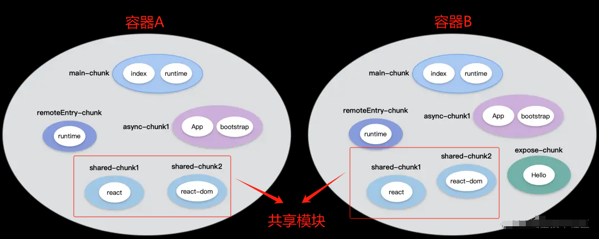
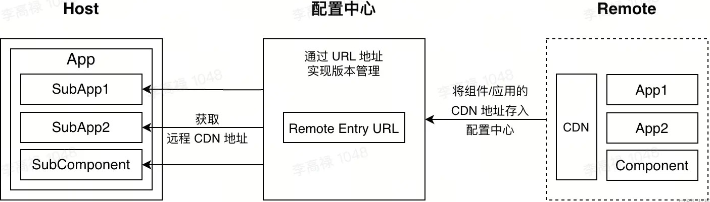

# 微前端技术方案


| 技术方案                       | 特点                                                         | 通信方式    | 优点                                                         | 缺点                                                         |
| :----------------------------- | :----------------------------------------------------------- | ----------- | :----------------------------------------------------------- | :----------------------------------------------------------- |
| **基于Web Components**         | 使用 Web Components的四个主要技术：<br />Custom Elements、Shadow DOM、HTML Templates、HTML Imports。<br />将前端应用程序拆分为多个Web Components。 | CustomEvent | 标准化技术，具有广泛的浏览器支持<br />高内聚、低耦合，易于维护和扩展良好的封装性和隔离性<br />Shadow DOM 天生的作用域隔离 | 需要一定的学习成本来掌握Web Components的使用<br />浏览器兼容性问题<br />可能需要额外处理不支持全局样式和JavaScript的共享<br />修改样式困难 |
| **基于自定义元素和Shadow DOM** | 使用自定义元素封装微前端应用，<br />并使用Shadow DOM提供隔离性。 |             | 高内聚、低耦合，易于维护和扩展良好的封装性和隔离性<br />支持自定义元素和Shadow DOM的浏览器兼容性较好 | 需要一定的学习成本来掌握自定义元素和Shadow DOM的使用<br />不支持全局样式和JavaScript的共享可能受到浏览器 |
| **基于iframe**                 | 使用iframe将每个微前端应用嵌入到主框架中，实现隔离。         | postMessage | 简单、快速<br />实现良好的隔离性，避免样式和全局变量的冲突<br />支持跨域通信 | 性能开销较大，因为每个iframe都是独立的浏览器上下文<br />难以共享资源，如全局状态、数据等页面刷新和导航问题<br />用户体验差：**弹窗只能在 iframe中，在内部切换刷新会丢失状态** |
| **基于微服务网关路由分发**     | 使用微服务网关作为微前端应用的代理和调度器，<br />根据请求转发到不同的微前端应用。 |             | 支持跨域请求和API网关功能<br />可以实现统一的身份认证和权限管理<br />灵活性强，支持多种微前端技术 | 实现复杂，需要配置和维护微服务网关<br />对网络通信有较高要求可能增加额外的性能开销 |
| **基于单页面应用（SPA）**      | 通过在主框架中配置路由，<br />根据路由加载不同的微前端应用。 |             | 简单易用，适用于SPA架构<br />支持全局状态和数据共享<br />易于集成第三方库和框架 | 隔离性较差，样式和全局变量可能冲突<br />对SPA架构有依赖，不适合传统多页面应用<br />需要处理路由冲突和嵌套问题兼容性的限制 |
| **Module fedearation**         | webpack5 的模块联邦机制                                      |             | 通过模块联动将组件打包导出<br />共享模块的方式通信<          | 无 CSS 沙箱和 JS 沙箱<br />需要 webpack5                     |

---


## 基于Web Components

基于Web Components的微前端技术方案是一种将Web组件（Custom Elements、Shadow DOM、HTML Templates）作为微前端应用的基础构建单元的方法。

这种方法允许开发者创建可重用、封装良好的自定义元素，这些元素可以在不同的前端应用中独立开发、测试、部署和升级。

### 特点

1. **封装性**：Web Components提供了强大的封装性，使得每个自定义元素都可以看作是一个独立的微前端应用。
2. **独立性**：每个Web Component都可以独立开发、测试、部署和升级，无需影响其他组件或主应用。
3. **可重用性**：一旦定义了一个Web Component，就可以在任何支持Web Components的浏览器或框架中重用它。
4. **样式隔离**：Shadow DOM提供了样式隔离的功能，使得每个Web Component的样式不会影响到其他组件或主应用。
5. **技术栈无关**：由于Web Components是浏览器原生支持的，因此它们不依赖于特定的前端框架或库。

### 示例

以下是一个简单的基于Web Components的微前端技术方案示例：

#### 1. 定义自定义元素

首先，我们需要定义一个自定义元素。在这个例子中，我们将创建一个名为`my-micro-app`的自定义元素：

```html
<!-- 定义自定义元素的HTML模板 -->  
<template id="my-micro-app-template">  
  <div>  
    <h1>My Micro App</h1>  
    <p>This is a simple micro app built with Web Components.</p>  
    <button id="my-button">Click Me</button>  
  </div>  
</template>  
  
<script>  
  // 定义自定义元素类  
  class MyMicroApp extends HTMLElement {  
    constructor() {  
      super(); // 必须首先调用 super() 方法  
  
      // 创建一个shadow DOM并附加到自定义元素上  
      const shadowRoot = this.attachShadow({ mode: 'open' });  
  
      // 克隆HTML模板并将其附加到shadow DOM中  
      const template = document.getElementById('my-micro-app-template');  
      const content = template.content.cloneNode(true);  
      shadowRoot.appendChild(content);  
  
      // 为shadow DOM中的元素添加事件监听器  
      const button = shadowRoot.getElementById('my-button');  
      button.addEventListener('click', () => {  
        alert('Button clicked in My Micro App!');  
      });  
    }  
  }  
  
  // 使用CustomElementRegistry.define()方法注册自定义元素  
  window.customElements.define('my-micro-app', MyMicroApp);  
</script>
```

#### 2. 在主应用中使用自定义元素

在主应用中，我们可以像使用普通HTML元素一样使用自定义元素：

```html
<!DOCTYPE html>  
<html lang="en">  
<head>  
  <meta charset="UTF-8">  
  <title>Main App</title>  
  <!-- 引入自定义元素的JavaScript代码 -->  
  <script src="my-micro-app.js"></script>  
</head>  
<body>  
  <h2>Welcome to Main App</h2>  
  <my-micro-app></my-micro-app> <!-- 使用自定义元素 -->  
</body>  
</html>
```

> 1. 在这个例子中，我们创建了一个名为`MyMicroApp`的自定义元素，并在其构造函数中创建了一个shadow DOM，并将一个HTML模板附加到该shadow DOM中。
> 2. 然后，我们为模板中的一个按钮添加了一个点击事件监听器。
> 3. 最后，我们在主应用的HTML文件中引入了自定义元素的JavaScript代码，并在页面中使用了该自定义元素。

这就是基于Web Components的微前端技术方案的一个简单示例。通过这种方式，我们可以将每个微前端应用封装成一个或多个自定义元素，并在主应用中组合使用这些自定义元素来构建整个前端应用。

---


## 基于 Iframe 

基于iframe的微前端技术方案主要是通过使用HTML的iframe元素来实现在一个主应用中嵌入多个子应用的功能。

iframe元素可以加载一个独立的HTML页面，并在这个页面中运行完整的JavaScript和CSS，从而实现微前端的隔离性。

### 特点

1. **隔离性**：iframe为嵌入的子应用提供了天然的隔离环境，避免了子应用之间的JS和CSS的冲突。
2. **嵌入性**：iframe可以轻松地嵌入到主应用的任何位置，且不需要修改主应用的结构。
3. **安全性**：由于iframe加载的是独立的页面，因此增加了安全性，使得子应用无法直接访问或修改主应用的DOM结构。

### 缺点

1. 路由状态丢失，刷新一下，`iframe`的`url`状态就丢失了。
2. `dom`割裂严重，弹窗只能在`iframe`内部展示，无法覆盖全局。
3. **性能问题**：iframe会大幅增加内存和计算资源，因为它需要为每个子应用创建一个全新且完整的文档环境。每次打开白屏时间太长，对于[SPA 应用](https://zh.wikipedia.org/wiki/单页应用)来说无法接受
4. **通信困难**：由于iframe与主应用不是同一个文档上下文，因此它们之间的通信相对困难，需要通过窗口对象（window.postMessage）等方式进行通信。`web`应用之间通信非常困难。
5. **无法共享资源**：iframe中的子应用无法共享主应用的基础库等资源，这可能导致包体积的增大。

### 示例

假设我们有一个主应用（MainApp.html），想要在其中嵌入一个子应用（SubApp.html）。

#### 主应用（MainApp.html）

```html
<!DOCTYPE html>  
<html lang="en">  
<head>  
    <meta charset="UTF-8">  
    <title>Main App</title>  
</head>  
<body>  
    <h1>Welcome to Main App</h1>  
    <iframe id="subAppFrame" src="SubApp.html" width="500" height="500"></iframe>  
    <script>  
        // 监听来自子应用的消息  
        window.addEventListener('message', function(event) {  
            if (event.origin !== 'http://your-subdomain.example.com') return; // 验证消息来源  
            console.log('Received message from sub-app: ', event.data);  
        }, false);  
    </script>  
</body>  
</html>
```

#### 子应用（SubApp.html）

```html
<!DOCTYPE html>  
<html lang="en">  
<head>  
    <meta charset="UTF-8">  
    <title>Sub App</title>  
</head>  
<body>  
    <h2>Welcome to Sub App</h2>  
    <button onclick="sendMessageToMain()">Send Message to Main App</button>  
    <script>  
        function sendMessageToMain() {  
            // 向主应用发送消息  
            window.parent.postMessage('Hello from Sub App!', 'http://your-main-domain.example.com');  
        }  
    </script>  
</body>  
</html>
```

> 在这个示例中:
>
> 1. 主应用通过iframe元素嵌入了子应用。
> 2. 子应用中有一个按钮，当点击该按钮时，会向主应用发送一条消息。
> 3. 主应用通过监听`message`事件来接收来自子应用的消息，并进行相应的处理。
>
> 注意，在实际应用中，需要验证消息的来源以确保安全性。

### 解决方案

为了解决基于 iframe 的微前端技术方案的缺点，可以考虑使用无界微前端框架等方案。

这些方案通过继承 iframe 的优点并解决其缺点，打造一个接近完美的iframe方案：

1. 例如，通过拦截iframe中的document对象，统一将DOM指向shadowRoot，可以实现在shadowRoot内部约束新建元素、弹窗或冒泡组件等操作，从而避免子应用对主应用的干扰。
2. 同时，通过监听iframe的URL变化等方式，可以实现主应用与子应用之间的同步和通信。

---

## 基于微服务网关路由分发

基于微服务网关路由分发的微前端技术方案是一种将前端应用拆分为多个独立的服务（或称为子应用），并通过微服务网关进行路由分发的方法。

这种方法允许各个子应用独立开发、测试、部署和升级，同时保持与主应用或其他子应用的良好集成。

### 特点

1. **服务拆分**：将前端应用拆分为多个独立的服务（子应用），每个服务都拥有独立的路由、状态管理和数据存储。
2. **微服务网关**：使用微服务网关作为统一入口，负责接收前端请求并根据路由规则将请求分发到相应的子应用。
3. **路由分发**：通过配置路由规则，微服务网关可以根据请求的URL将请求分发到不同的子应用。
4. **服务间通信**：子应用之间以及子应用与主应用之间通过API进行通信，实现数据共享和交互。
5. **独立部署**：每个子应用都可以独立部署和升级，不会影响其他子应用或主应用的正常运行。

### 示例

假设我们有一个电商网站作为主应用，它包含了商品详情、购物车、用户中心等子应用。我们可以使用基于微服务网关路由分发的微前端技术方案来实现这个网站。

#### 1. 微服务网关

微服务网关是整个微前端架构的核心，它负责接收前端请求并根据路由规则将请求分发到相应的子应用。

我们可以使用开源的微服务网关框架（如Kong、Traefik等）或自己搭建一个简易的网关来实现。

在微服务网关中，我们需要配置路由规则，将不同的URL路径映射到不同的子应用。例如，`/products/*` 路径映射到商品详情子应用，`/cart/*` 路径映射到购物车子应用，`/user/*` 路径映射到用户中心子应用。

#### 2. 子应用

每个子应用都是一个独立的SPA（单页面应用），拥有自己的路由、状态管理和数据存储。

子应用可以使用任何前端框架或技术栈进行开发，只要它们能够生成符合要求的SPA即可。

在开发子应用时，需要注意以下几点：

- 子应用需要遵循一定的规范或约定，以便微服务网关能够正确地识别和加载子应用。例如，子应用的入口文件需要是一个特定的文件名（如`entry.js`），并且需要暴露一些必要的生命周期钩子函数（如`bootstrap`、`mount`、`unmount`等）。
- 子应用需要处理与微服务网关之间的通信。这通常通过API请求来实现，子应用会向微服务网关发送请求以获取数据或触发事件。
- 子应用需要处理自己的路由逻辑，以便在接收到微服务网关转发的请求时能够正确地渲染相应的页面或组件。

### **基于路由分发的 Nginx 配置示例**

**路由分发式微前端**，即通过**路由**将不同的业务分发到不同的独立前端应用上。

最常用的方案是通过 **HTTP 服务的反向代理**来实现：

```nginx
 http {
        server {
            listen 80;
            server_name  xxx.xxx.com;
          	location / {
            # 代理到 3000 端口的 entry 应用中（entry 为一个独立应用）
                proxy_pass http://localhost:3000/entry;
            }
            location /products/ {
            # 代理到 3001 端口的 products 应用中（products 为一个独立应用）
                proxy_pass http://localhost:3001/products;
            }
            location /cart/ {
            # 代理到 3002 端口的 cart 应用中（cart 为一个独立应用）
                proxy_pass http://localhost:3002/cart;
            }
            location /user/ {
             # 代理到 3003 端口的 user 应用中（user 为一个独立应用）
                proxy_pass http://localhost:3003/user;
            }
        }
    }

```


### 工作流程

由于基于微服务网关路由分发的微前端技术方案涉及到多个组件和库的配合使用。

整个架构的工作流程：

1. 当用户访问电商网站的某个页面时（如商品详情页），浏览器会发送一个HTTP请求到微服务网关。
2. 微服务网关根据请求的URL路径（如`/products/123`）查找相应的路由规则，并将请求转发到商品详情子应用。
3. 商品详情子应用接收到请求后，会根据自己的路由逻辑找到对应的页面或组件，并将其渲染到浏览器中。
4. 如果用户在商品详情页上点击了“加入购物车”按钮，商品详情子应用会向微服务网关发送一个API请求，请求中包含要加入购物车的商品信息。
5. 微服务网关将API请求转发到购物车子应用，购物车子应用接收到请求后会处理相应的业务逻辑（如将商品添加到购物车中），并返回处理结果给微服务网关。
6. 微服务网关将处理结果转发回商品详情子应用，商品详情子应用根据处理结果更新页面的状态或显示相应的提示信息。

### 总结

基于微服务网关路由分发的微前端技术方案通过将前端应用拆分为多个独立的服务（子应用），并使用微服务网关进行路由分发，实现了前端应用的微服务化。这种方案具有服务拆分、独立部署、路由分发、服务间通信等特点，可以大大提高前端应用的开发效率和可维护性。同时，由于每个子应用都是独立的SPA，因此可以使用不同的技术栈进行开发，提高了技术的灵活性和可扩展性。

----


## Module fedearation

**Webpack 5** 的 Module Federation（模块联邦）是一种新的特性，它允许在不同Webpack构建的应用之间动态加载和共享代码

### 定义

Module Federation 允许一个Webpack构建的应用（称为“宿主”或“Host”）动态地加载并执行另一个Webpack构建的应用（称为“远程”或“Remote”）的代码，同时共享公共依赖。

这种特性在微前端架构中特别有用，因为它允许不同的前端应用独立开发、构建和部署，但又能作为一个整体应用来运行。

### 特点

**共享依赖：**

- 模块联邦允许在宿主应用和远程应用之间共享公共依赖（如React、React-DOM等）。
- 通过在Webpack配置中指定`shared`属性，可以定义哪些依赖是共享的，从而避免在多个应用中重复打包相同的依赖。


**动态加载和共享模块：**

- 模块联邦允许将一个JavaScript应用程序拆分成多个独立的模块，并在不同的Webpack构建中共享这些模块。
- 它解决了多个独立应用程序之间共享代码的问题，使得实现微前端架构变得更加容易。
- 通过动态加载的方式，模块联邦允许一个应用程序（宿主应用）在运行时加载和执行另一个应用程序（远程应用）的代码。


**去中心化的应用部署：**

- 模块联邦允许实现一个去中心化的应用部署群，其中每个应用都是单独部署在各自的服务器上。
- 每个微服务（或子应用）可以独立开发和部署，无需耦合在一起。
- 每个应用都可以引用其他应用，也能被其他应用所引用，即每个应用可以充当宿主应用的角色，也可以作为远程应用出现。


### 核心概念

#### 容器（Container/Host）

- 容器是一个主应用程序（宿主应用），它可以加载和渲染其他子应用程序（远程应用）。
- 一个被 ModuleFederationPlugin 打包出来的模块被称为 **Container**。 
- 如果我们的一个应用使用了 ModuleFederationPlugin 构建，那么它就成为一个 **Container**，它可以加载其他的 **Container**，可以被其他的 **Container** 所加载。
- 从消费者和生产者的角度看 **Container**，**Container** 又可被称作 **Host** 或 **Remote**；
- `Host`：消费方，它动态加载并运行其他 Container 的代码。


#### 远程（Remote）

- `Remote`：提供方，它**暴露属性**（如组件、方法等）供 **Host** 使用。
- 远程是一个独立的子应用程序，它提供了一些模块供其他子应用程序使用。


#### 共享模块（Shared）

- 容器可以通过配置指定需要共享的模块，并将这些共享模块以动态方式加载到其他子应用中使用，而无需将这些模块打包进每个子应用的构建文件中。



#### 架构图



> 图片引用于：[微前端五大门派大 Battle - 掘金 (juejin.cn)](https://juejin.cn/post/7338230967390224435)

### 使用示例

Module Federation 主要通过`ModuleFederationPlugin`插件实现。

下面是一个简化的示例，展示如何配置和使用Module Federation：

#### Remote 配置（提供方）

在Remote应用的`webpack.config.js`中：

```javascript
const ModuleFederationPlugin = require('webpack/lib/container/ModuleFederationPlugin');  
  
module.exports = {  
  // ... 其他配置 ...  
  plugins: [  
    new ModuleFederationPlugin({  
      name: 'remoteVar', // 唯一ID，作为输出的模块名  
      filename: 'remoteEntry.js', // 构建出来的文件名  
      exposes: {  
        // 表示作为Remote时，export哪些属性被消费  
        './NewsList': './src/NewsList',  
      },  
      shared: ['react', 'react-dom'], // 共享依赖  
    }),  
  ],  
  // ... 其他配置 ...  
};
```

#### Host 配置（消费方）

在Host应用的`webpack.config.js`中：

```javascript
const ModuleFederationPlugin = require('webpack/lib/container/ModuleFederationPlugin');  
  
module.exports = {  
  // ... 其他配置 ...  
  plugins: [  
    new ModuleFederationPlugin({  
      remotes: {  
        // 表示作为Host时，去消费哪个Remote  
        remoteVar: 'remoteVar@http://localhost:8080/remoteEntry.js',  
      },  
      shared: ['react', 'react-dom'], // 共享依赖  
    }),  
  ],  
  // ... 其他配置 ...  
};
```

在Host应用中，你可以通过`import('remoteVar/NewsList')`的方式动态加载Remote应用中的`NewsList`组件。

 

### 原理

> [漫谈构建工具(十五): 初探 webpack5 - module federation - 掘金 (juejin.cn)](https://juejin.cn/post/6927569428984889357#heading-3) 详细解释了 webpack5 - module federation 的工作原理


### 总结

Webpack 5 的 Module Federation 特性为微前端架构的实现提供了强有力的支持。它允许应用之间灵活地共享模块、独立开发和部署，并通过动态加载优化性能。通过配置`ModuleFederationPlugin`插件，你可以轻松地在不同Webpack构建的应用之间实现代码共享和动态加载。


---


## 基于单页面应用（SPA）

基于单页面应用（SPA）的微前端技术方案是一种将多个小型的、独立的单页面应用（SPA）整合到一个主应用中的架构方法。

这种方法允许各个子应用独立开发、测试、部署和升级，同时保持与主应用的良好集成。

### 特点

1. **独立性**：每个子应用都是一个独立的SPA，拥有自己的路由、状态管理和数据存储。
2. **集成性**：主应用负责加载、卸载和管理各个子应用，同时提供统一的入口和路由机制。
3. **通信机制**：子应用之间以及子应用与主应用之间需要有一种通信机制，以便传递数据、触发事件等。
4. **技术栈灵活**：子应用可以使用不同的前端框架或技术栈进行开发，只要它们能够生成符合要求的SPA即可。

### 示例

假设我们有一个主应用（MainApp），它集成了两个子应用（SubApp1和SubApp2）。

#### 1. 主应用（MainApp）

主应用通常是一个简单的SPA，它负责加载、卸载和管理各个子应用。

主应用需要提供一个统一的入口和路由机制，以便根据用户的操作加载相应的子应用。

主应用可以使用一个前端路由库（如React Router、Vue Router等）来管理路由：当用户访问某个路由时，主应用会根据路由信息加载相应的子应用。例如，当用户访问`/subapp1`时，主应用会加载并显示SubApp1；当用户访问`/subapp2`时，主应用会加载并显示SubApp2。

为了实现子应用的加载和卸载，主应用可以使用一种微前端框架（如qiankun、single-spa等）。这些框架提供了一套完整的API和机制，用于加载、卸载和管理子应用的生命周期。

#### 2. 子应用（SubApp1和SubApp2）

子应用是独立的SPA，它们拥有自己的路由、状态管理和数据存储。

子应用可以使用任何前端框架或技术栈进行开发，只要它们能够生成符合要求的SPA即可。

在开发子应用时，需要注意以下几点：

- 子应用需要暴露一些生命周期钩子函数（如bootstrap、mount、unmount等），以便主应用在适当的时机加载、挂载和卸载子应用。
- 子应用需要遵循一定的规范或约定，以便主应用能够正确地识别和加载子应用。例如，子应用的入口文件需要是一个特定的文件名（如`entry.js`），并且需要暴露一个特定的全局变量或方法（如`mount`函数）。
- 子应用需要处理与主应用之间的通信。这可以通过全局事件总线（如EventBus）、自定义事件（如CustomEvent）或通信库（如Redux-Saga、PostRobot等）来实现。子应用可以监听主应用广播的事件，并在需要时触发自己的事件通知主应用。

### 主应用和子应用之间的交互流程

1. 当用户访问主应用的某个路由时（如`/subapp1`），主应用会触发一个事件或调用一个API来加载SubApp1。
2. 主应用通过微前端框架加载SubApp1的入口文件（如`entry.js`），并执行其中的`bootstrap`和`mount`钩子函数来挂载SubApp1。
3. SubApp1在挂载过程中会注册自己的路由和事件监听器，以便与主应用进行通信。
4. 当用户离开SubApp1时（如跳转到其他路由），主应用会触发一个事件或调用一个API来卸载SubApp1。
5. 主应用通过微前端框架执行SubApp1的`unmount`钩子函数来卸载SubApp1，并清理相关的资源和事件监听器。