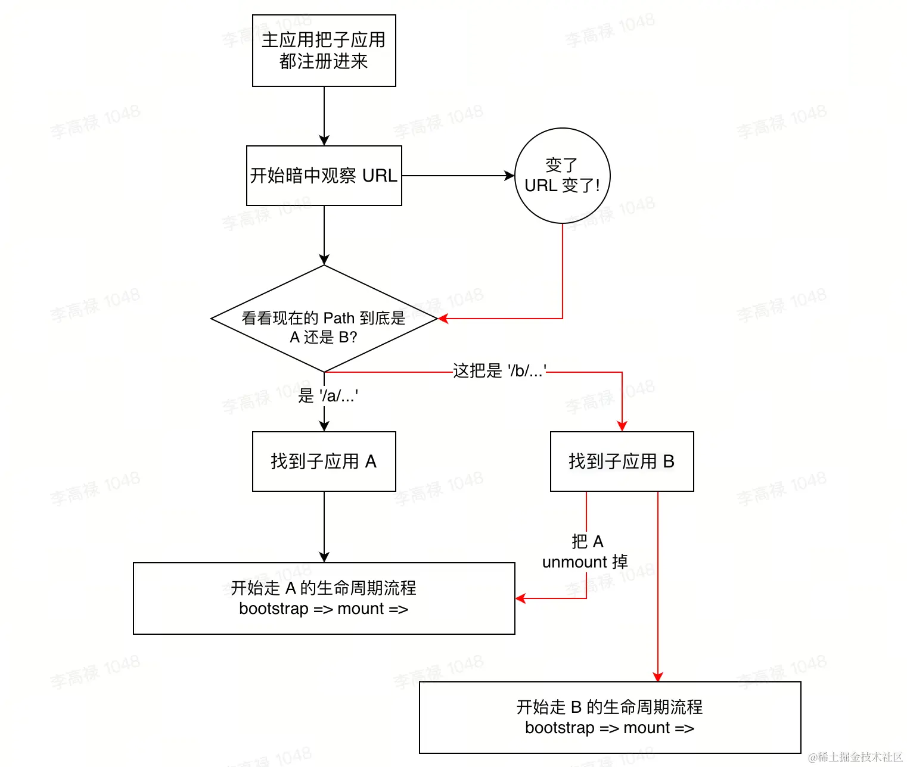
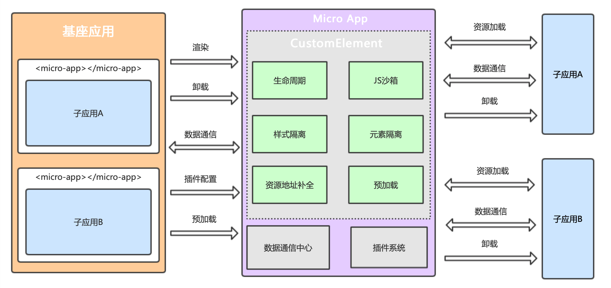
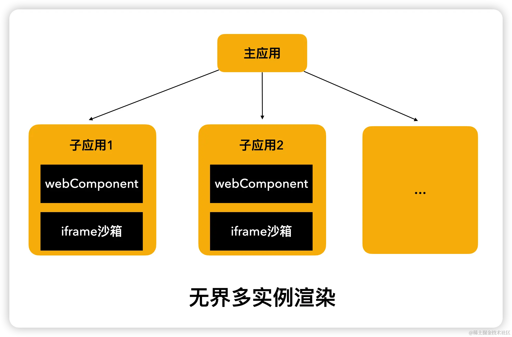
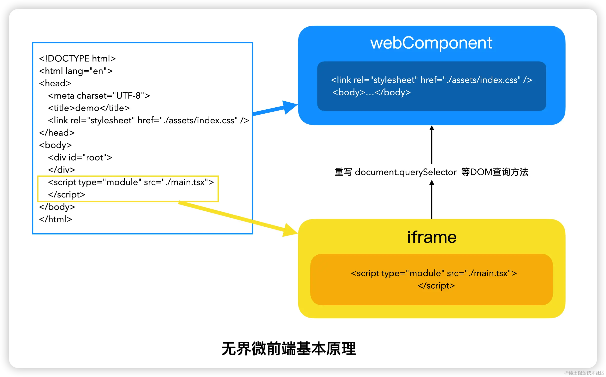
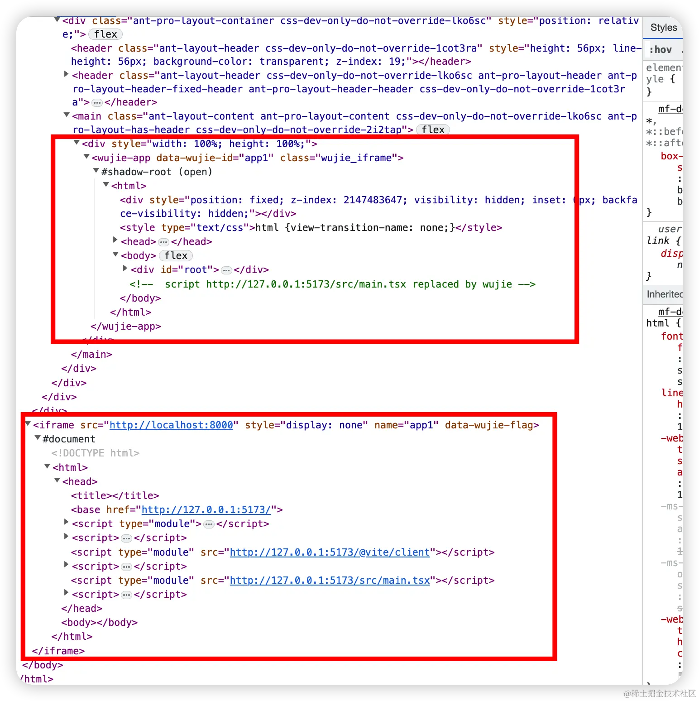
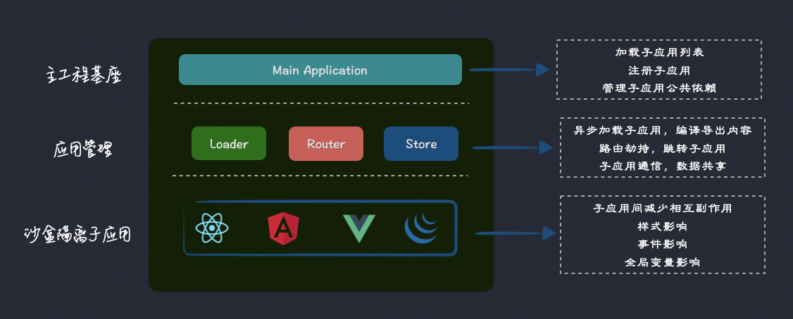

# 微前端框架


## 为什么需要微前端框架？

当我们需要进行对旧应用进行增量升级、项目拆分时候，确定了需要使用微前端技术以后，我们可以使用一些主流的微前端技术方案自己去实现微前端：

* 基于 Web Components 
* 基于自定义元素和 Shadow DOM
* 基于 iframe
* 基于微服务网关路由分发
* 基于单页面应用（SPA）
* 基于 WebPack5 Module fedearation

> 详细可以参考：[微前端技术方案 | Sewen 博客 (sewar-x.github.io)](https://sewar-x.github.io/myblog/article/微前端/微前端技术方案.html)

然而不管基于哪种技术方案实现的微前端，都会遇到以下技术问题：

- **路由系统及 Future State 问题**：主应用和子应用路由加载时序，导致刷新页面时无法加载子应用路由出现 404.
- **组合模式 问题**：主框架和子框架在 构建时组合 or 运行时组合？
- **入口文件类型 问题**：子应用入口加载 JavaScript or 加载 HTML 文件？
- **模块导入 问题**：使用 UMD 模块格式打包子应用，如何在浏览器运行时获取远程脚本中导出的模块引用？
- **样式冲突 问题**： 不同子应用之间样式附加在同一页面上产生冲突。
- **脚本互斥 问题**：不同微前端应用之间因为加载和执行脚本而导致的冲突和干扰。
- **消息通信 问题**：在微前端架构中，每个微前端应用都是独立的，这些微前端应用之间又需要相互通信以协同工作，比如共享数据、触发事件等。
- **公共依赖加载 问题**：在微前端架构中，每个微前端应用可能都会依赖一些公共的库或框架。如果管理不好可能导致依赖重复加载和版本重提等问题。
- **微应用打开速度慢 问题**

> 各种微前端问题详细解释参考博客：[微前端基础 | 微前端带来问题](https://sewar-x.github.io/myblog/article/微前端/微前端基础.html#微前端带来问题)

也就是如果自己手动基于以上方案实现的微前端技术，也需要自己手动解决以上问题。

微前端技术框架中，已经解决了以上大部分问题。

根据微前端的实现方案和各种问题的解决方案不同，产生了许多不同的微前端技术框架。

## 主流微前端框架对比

|                           技术框架                           | 特点                                                         | 优点                                                         | 缺点                                                         | start |
| :----------------------------------------------------------: | :----------------------------------------------------------- | :----------------------------------------------------------- | :----------------------------------------------------------- | ----- |
| [**Single-SPA**](https://zh-hans.single-spa.js.org/docs/getting-started-overview) | 最早的微前端框架之一<br />基于路由和生命周期钩子实现微前端。 | 1.简单易用，轻量级<br/>2.支持多种前端框架（React, Vue, Angular等）<br/>3.清晰的生命周期管理 | 1.隔离性较弱，样式和全局变量可能冲突<br/>2.需要手动处理路由冲突和嵌套问题<br/>3.需要手动处理子应用之间的通信和状态同步<br />4.不自带通信机制，需要额外实现<br />5.缺乏路由管理和状态管理的内置支持 | 13.1k |
|      [**qiankun**](https://qiankun.umijs.org/zh/guide)       | 由蚂蚁金服开源<br />**基于Single-SPA封装**的微前端框架<br />提供了更加完善的隔离和通信机制。 | 1.兼容性强，支持主流前端框架<br/>2.支持多种前端框架和构建工具<br />3.提供沙箱机制，实现真正的样式隔离和JS隔离<br />4.提供了丰富的功能和插件，如路由管理、状态管理、沙箱隔离等<br/>5.内置通信机制，方便微应用间通信<br />6.子应用可独立开发、独立部署，不会相互影响 | 1.相对较重，可能引入一些不必要的依赖<br/>2.学习成本较高，需要理解其沙箱和通信机制<br/>3.对主框架有一定侵入性 | 15.5k |
|    [**MicroApp**](https://micro-zoe.github.io/micro-app/)    | 一个轻量级的微前端框架，专注于解决微前端应用之间的通信和状态同步问题<br />结合CustomElement将微前端封装成一个类WebComponent组件，从而实现微前端的组件化渲染 | 1.简单易用<br />2.提供了强大的通信和状态同步功能<br /> 3.支持多个前端框架 | 1.功能相对较少，可能不适用于复杂的微前端场景                 | 5.3k  |
|        [**无界**](https://wujie-micro.github.io/doc/)        | 基于 WebComponent 容器 + iframe 沙箱的微前端框架             | 极致预加载、预执行，页面秒开无白屏、丝滑般切换<br />支持子应用保活、内嵌、去中心化通信、多应用激活<br />基于 WebComponent 和 iframe，原生物理隔离<br />避免 with 语句运行代码，整体的运行性能接近原生<br />主、子应用无需做任何适配，开箱即用 |                                                              | 3.8k  |
|             [**EMP**](https://emp2.netlify.app/)             | 由饿了么前端团队开源的微前端解决方案，提供了完整的开发、构建、部署和监控能力。<br />基于 webpack 5 module federation 的微前端方案<br />聚焦微前端生态闭环建设,v2.7全面支持模块共享热更 | 功能全面，支持从开发到部署的全流程<br/>提供多种通信机制和隔离策略<br/>易于集成和扩展<br />提供了模块联邦的功能，支持跨应用共享代码和组件<br />结合webpack5、Module Federation的丰富项目实践、建立三层共享模型<br />结合webpack 5 中心化缓存、提升整体构建速度.<br />对 TypeScript、JSX、CSS、Less、Sass 等支持开箱即用。<br />可选 “多页应用” 或 “库” 模式的预配置 webpack 构建.<br />在开发和构建之间共享 webpack chain 插件接口.<br />提供灵活的api、Plugin以及完整的类型提示. | 相对较新，社区支持可能不如其他成熟框架<br/>学习成本较高，需要理解其整体架构和组件<br/>可能引入额外的依赖和配置复杂性 | 2.3k  |
|       [**Garfish**](https://www.garfishjs.org/guide/)        |                                                              |                                                              |                                                              | 2.4k  |

---

## 微前端框架常见功能说明

| 功能 | 说明 |
| --- | --- |
| 子应用管理 | 管理和加载子应用，包括注册、启动、卸载等操作。 |
| 路由管理 | 管理前端应用的路由，支持子应用之间的路由跳转和共享。 |
| 数据通信 | 提供子应用之间的数据通信机制，如事件总线、状态管理等。 |
| JS沙箱 | 隔离子应用的JavaScript运行环境，防止不同子应用之间的全局变量冲突。 |
| 样式隔离 | 隔离子应用的样式，防止样式污染和冲突。 |
| 元素隔离 | 隔离子应用的DOM元素，防止DOM结构冲突和干扰。 |
| 静态资源处理 | 处理子应用的静态资源，如图片、字体、脚本等。 |
| 预加载和懒加载 | 支持子应用的预加载和懒加载，提高页面加载速度和用户体验。 |
| 缓存管理 | 管理子应用的缓存，提高应用性能和响应速度。 |
| 权限管理 | 提供子应用的权限管理功能，如权限验证、角色管理等。 |
| 跨域通信 | 支持跨域的子应用通信，如跨域`iframe`通信等。 |
| 插件系统 | 提供插件系统，支持扩展微前端框架的功能和定制开发。 |
| 降级兼容处理 | 提供降级和兼容性处理机制，确保在不同浏览器和环境下都能正常运行。 |
| 错误处理和监控 | 提供错误处理和监控机制，帮助开发人员快速定位和解决问题。 |
| 应用状态管理 | 管理微前端应用的全局状态，支持状态共享和同步。 |
| 应用嵌套 | 支持子应用的嵌套使用，构建复杂的微前端应用架构。 |
| 自定义配置 | 提供自定义配置选项，满足不同项目的需求。 |
| 文档和社区支持 | 提供详细的文档和社区支持，帮助开发人员快速上手和解决问题。 |


## 功能对比


| 特性/框架                  |    Single-SPA     |      qiankun       |       MicroApp       |          无界           |             EMP              |
| :------------------------- | :---------------: | :----------------: | :------------------: | :---------------------: | :--------------------------: |
| 使用方案                   | 路由分发+资源处理 | **基于Single-SPA** |   `类WebComponent`   | `WebComponent + iframe` | `webpack5 module federation` |
| IE支持                     |  ✓ (需polyfill)   |   ✓ (需polyfill)   |    ✓ (需polyfill)    |  ✓ (自动切换成iframe)   |        ✓ (需polyfill)        |
| 开箱即用                   |         ✓         |         ✓          |          ✓           |            ✓            |              ✓               |
| 多框架兼容                 |         ✓         |         ✓          |          ✓           |                         |                              |
| 接入成本                   |        中         |         中         |          低          |           高            |              中              |
| **子应用接入是否需要改造** |        是         |         是         |          否          |           否            |              是              |
| 数据通信机制               |      不支持       |     props传递      | 发布订阅+CustomEvent |         自定义          |            自定义            |
| JS沙箱                     |         ✗         |         ✓          |          ✓           |     ✓ (基于iframe)      |              ✓               |
| 样式隔离                   |  ✗ (需额外处理)   |         ✓          |          ✓           | ✓ (基于webcomponent实现 |              ✓               |
| 元素隔离                   |         ✗         |         ✓          |          ✓           |   ✓ (基于Shadow DOM)    |              ✓               |
| 静态资源地址补全           |         ✗         |         ✗          |          ✓           |            ✓            |              ✓               |
| 预加载                     |         ✗         |         ✓          |          ✓           |            ✗            |              ✓               |
| keep-alive                 |         ✗         |         ✓          |          ✓           |            ✓            |              ✓               |
| 应用共享同一个资源         |         ✓         |         ✓          |          ✓           |            ✓            |              ✓               |
| 应用嵌套                   |         ✓         |         ✓          |          ✓           |            ✓            |              ✓               |
| 插件系统                   |         ✗         |         ✗          |          ✓           |            ✗            |              ✓               |
| 内置降级兼容处理           |         ✗         |         ✓          |          ✓           | ✓ (基于Web Components)  |              ✓               |

---


## [**Single-SPA**](https://zh-hans.single-spa.js.org/docs/getting-started-overview)

[Single-spa](https://link.juejin.cn?target=https%3A%2F%2Fgithub.com%2Fsingle-spa%2Fsingle-spa) 是最早的微前端框架，兼容多种前端技术栈；

概念：Single-spa 是一个将多个单页面应用聚合为一个整体应用的  JavaScript 微前端框架；

我们都知道 spa 应用 的理念是让独立的应用程序组成一个完整的页面，`Single-spa` 并不用依赖于单个框架和每个特性，而是你可以在不同的新框架随意使用；

简单来说就是一个聚合，使用这个库可以让你的应用可以 使用多个不同的技术栈（vue、react、angular等等) 进行同步开发，最后使用一个公用的路由去实现完美的切换；

[快速体验入口](https://link.juejin.cn?target=https%3A%2F%2Fsingle-spa.surge.sh)

### **优点**

- 敏捷性 - 独立开发、独立部署，微应用仓库独立，前后端可独立开发，部署完成后主框架自动完成同步更新；
- 技术栈无关，主框架不限制接入应用的技术栈，微应用具备完全自主权；
- 增量升级，在面对各种复杂场景时，我们通常很难对一个已经存在的系统做全量的技术栈升级或重构，而微前端是一种非常好的实施渐进式重构的手段和策略
- 更快交付客户价值，有助于持续集成、持续部署以及持续交付；
- 维护和 bugfix 非常简单，每个团队都熟悉所维护特定的区域；

### **缺点**

- **需要改造子应用接入 Single-SPA**，对原项目具有侵入性；（**需要修改原项目，使原项目需要暴露接入协议**）
- 无通信机制
- 不支持 Javascript 沙箱
- 样式冲突
- 无法预加载
- 对 Vite 支持不友好；

> 正是因为有了 `Single-spa`，才让大部分微前端框架得以出现，所以以下所讲的微前端框架几乎都拥有 `Single-spa` 的优点


### 原理

**主应用通过路由匹配实现对子应用生命周期的管理**：

- 预先注册子应用(激活路由、子应用资源、生命周期函数)
- 主应用监听路由的变化，匹配到了激活的路由则加载子应用资源，顺序调用生命周期函数并最终渲染到容器



> 引用[微前端五大门派大 Battle - 掘金 (juejin.cn)](https://juejin.cn/post/7338230967390224435)


### **子应用加载方案**

**主应用如何导入子应用？** 

single-spa 通过**路由劫持**实现应用的加载 ，并**采用SystemJS**，提供应用间公共组件加载及公共业务逻辑处理。

子应用需要暴露固定的钩子 bootstrap、mount、unmount 接入协议。

### **通信机制**

Single-SPA的通信机制主要通过 p**rops 传递数据**、**路由事件**和自定义事件来实现微应用之间的数据共享和交互。

#### **应用间通信的主要方式**

- **通过props传递数据**：Single-SPA提供了`getProps`和`setProps`的API，允许主应用向子应用传递数据，或者子应用向主应用请求数据。这种方式实现了父子应用之间的简单数据通信。
- **路由事件**：当路由发生变化时，Single-SPA会触发相应的事件。微应用可以监听这些路由事件，根据路由的变化来加载或卸载相应的微应用，或者执行其他逻辑。
- **自定义事件**：Single-SPA允许微应用之间通过`addEventListener`和`removeEventListener`来监听和触发自定义事件，从而实现更复杂的应用间通信。

#### **详细步骤：**

1. 数据传递：
   - 主应用在加载子应用时，可以通过`setProps`方法向子应用传递数据。
   - 子应用可以在其生命周期钩子（如`mount`）中，通过`getProps`方法获取主应用传递的数据。
2. 路由事件监听：
   - 微应用可以通过Single-SPA提供的路由监听机制，监听路由的变化，并在路由变化时执行相应的逻辑。
3. 自定义事件监听与触发：
   - 微应用可以使用`addEventListener`方法监听其他微应用或主应用触发的自定义事件。
   - 当需要与其他微应用或主应用通信时，可以使用`dispatchEvent`或类似的方法触发自定义事件，并传递相关数据。


### **SystemJS**

> SystemJS是一个通用的模块加载器，它支持加载多种模块格式，如AMD、CommonJS、UMD等。
>
> 它的主要功能是在运行时按需加载模块，并为每个模块创建独立的作用域，以防止模块之间的全局污染。
>
> SystemJS还提供了配置选项和插件系统，可以根据需求进行灵活的定制和扩展。

在微前端架构中，SystemJS 可以用于加载微应用的入口文件（通常是包含微应用初始化和挂载逻辑的 JavaScript 文件）。当主应用需要加载某个微应用时，它会使用 SystemJS 来动态加载并执行该微应用的入口文件。

#### **基本用法示例**

1. **安装SystemJS**：

   - 通过npm进行安装：`npm install systemjs`

2. **配置SystemJS**：

   - 在项目的根目录下创建一个配置文件，例如`systemjs.config.js`，用于配置模块加载器和打包选项。

3. **配置示例**（参考自参考文章2）：

   ```javascript
   // systemjs.config.js  
   System.config({  
     baseURL: '/', // 指定模块加载的基础路径  
     paths: {  
       'app/*': 'src/app/*', // 定义模块的路径别名，方便引用  
       'vendor/*': 'src/vendor/*',  
       'npm:*': 'node_modules/*'  
     },  
     map: {  
       'app': 'app', // 指定模块的映射关系  
       'rxjs': 'npm:rxjs',  
       'angular': 'npm:@angular/core/bundles/core.umd.js'  
     },  
     packages: {  
       'app': { // 定义模块的包配置  
         main: 'main.js', // 入口文件  
         defaultExtension: 'js' // 默认扩展名  
       },  
       'rxjs': {  
         defaultExtension: 'js'  
       }  
     }  
   });
   ```

4. **使用SystemJS加载模块**：

   - 在HTML文件中引入SystemJS库和配置文件：

     ```html
     <script src="node_modules/systemjs/dist/system.js"></script>  
     <script src="systemjs.config.js"></script>
     ```

   - 然后使用

     ```
     System.import
     ```

     方法来动态加载模块：

     ```javascript
     System.import('app/main.js').then(function(module) {  
       // 模块加载完成后执行的代码  
       // 可以使用加载的模块进行后续操作  
     }).catch(function(err) {  
       // 处理模块加载错误  
       console.error('Module load failed', err);  
     });
     ```


### 拆分应用

在大型微服务系统中，我们需要将前端拆解成一个个小应用和基座应用。

（single-spa基础配置和每个应用程序都应该有自己的git仓库）

微前端拆分应用后的管理应用模式主要包括以下几种：

1. **基座模式：**
   - 通过一个主应用（基座）来管理所有子应用。主应用可以只是单纯的基座功能，也可以带有业务功能，如用户登录、菜单管理等。
   - 只需要设计好对应的应用加载机制，如何时加载、何时卸载等。
   - 这种模式下，每个子应用可以独立开发、独立部署，而整体应用通过主应用进行整合和统一管理。
2. **NPM包模式：**
   - 将微前端应用作为NPM包进行发布和管理。
   - 每个微前端应用都可以作为一个独立的NPM包，具有自己的版本控制和依赖管理。
   - 通过NPM包的方式，可以方便地进行微前端应用的分发、更新和依赖管理。
3. **动态加载模块模式：**
   - 这种模式下，微前端应用不是通过传统的路由跳转或者iframe嵌入的方式进行加载，而是通过动态加载模块的方式实现。
   - 例如，可以使用JavaScript的动态导入（dynamic import）功能，在运行时根据需求加载对应的微前端应用模块。
   - 动态加载模块可以提高应用的加载速度和用户体验，同时也能够实现微前端应用的按需加载和卸载。

| 比较维度     | 基座模式（Monorepo）                                         | NPM包                                                        | 动态加载模块                                                 |
| ------------ | :----------------------------------------------------------- | :----------------------------------------------------------- | :----------------------------------------------------------- |
| 特点         | 使用single-spa的最简单方法是拥有一个包含所有代码的仓库。<br />通常只有一个`package.json`,一个的webpack配置，产生一个包，<br />它在一个html文件中通过`<script>`标签引用。 | 创建一个父应用，npm安装每个single-spa应用。<br />每个子应用在一个单独的代码仓库中，负责每次更新时发布一个新版本。<br />当single-spa应用发生更改时，根应用程序应该重新安装、重新构建和重新部署 | 创建一个父应用，允许子应用单独部署。<br />为了实现这一点，创建一个manifest文件，当子应用部署更新时，它控制子应用的“上线”版本及加载的JavaScript文件 |
| 优势         | 1.最容易部署<br /> 2.[单一版本（monorepo）控制的优点](https://danluu.com/monorepo/) | 1.npm安装对于开发中更熟悉，易于搭建。 <br />2.独立的npm包意味着：每个应用在发布到npm仓库之前可以分别打包。 |                                                              |
| 劣势         | 1.对于每个单独的项目来说，一个Webpack配置和package.json意味着的灵活性和自由度不足。<br /> 2.当你的项目越来越大时，打包速度越来越慢。<br /> 3.构建和部署都是捆绑在一起的，这要求固定的发版计划，而不能临时发布。 | 1.父应用必须重新安装子应用来重新构建或部署。 <br />2.中等难度搭建。 |                                                              |
| 搭建难度     | 简单                                                         | 中等                                                         | 困难                                                         |
| 代码是否独立 | No                                                           | No                                                           | ✅                                                            |
| 分开构建     | No                                                           | ✅                                                            | ✅                                                            |
| 分别部署     | No                                                           | ✅                                                            | ✅                                                            |
| 例子         | [simple-webpack-example](https://github.com/joeldenning/simple-single-spa-webpack-example)[single-spa-examples](https://github.com/single-spa/single-spa-examples) | [single-spa-login-example-with-npm-packages](https://github.com/jualoppaz/single-spa-login-example-with-npm-packages) | [SystemJS example](https://gitlab.com/TheMcMurder/single-spa-portal-example) |


### 基础示例

以下示例使用 single-spa 接入 a、 b 两个子应用，当路由匹配到应用时，触发应用对应生命周期。

```html
<head>
	<meta charset="UTF-8">
    <meta http-equiv="'X-UA-Compatible" content="IE=edge">
    <meta name="viewport" content="width=device-width, initial-scale=1.0">
    <title>Document</title>
</head>
<body>
    <script src="https://cdn.bootcdn.net/ajax/libs/single-spa/5.9.3/umd/single-spa.min.js"></script>
	<div id="app"></div>
<script>
// 微前端 就是可以加载不同的应用 基于路由的微前端
//如何接入已经写好的应用 对于singlespa而言，我们需要改写子应用(接入协议)bootstrap,mount,unmo
const { registerApplication,start }= singleSpalet

// a 应用接入协议
app1={
    // 启动 a 应用 bootstrap生命周期，当路由匹配到 a 应用时候触发，二次匹配成功不触发该声明周期
	bootstrap:[
		async()=> console.log('app1 bootstrap1'),
        async()=> console.log('appl bootstrap2')
    ],
    // a 应用挂载时候触发
	mount:[
        async(props)=> {
            console.log('接收基础传入的参数',props)
            // new Vue().$mount()
            app1.innerHTML = 'APP1'
            
        },
        async(props)=> {
            console.log('接收基础传入的参数',props)
            // new Vue().$mount()
            console.log('app1 mount2')
        }
    ],
    // a 应用卸载时候触发
    unmount:async()=>{
        console.log('app1 unmount')
    }
}
// b 应用接入协议  
app2={
	bootstrap:[
		async()=> console.log('app2 bootstrap1'),
        async()=> console.log('app2 bootstrap2')
    ],
	mount:[
        async()=> {
            // new Vue().$mount()
            app2.innerHTML = 'APP2'
        },
        async()=> {
            // new Vue().$mount()
            console.log('app2 mount2')
        }
    ],
    unmount:async()=>{
        console.log('app2unmount')
     }
}
    
    
    
//注册 a 应用，根据路径加载应用。当路径是#/a 的时候就加载 a 应用,并传入参数 {a:1}
registerApplication('a',async()=> app1location =>location.hash.startsWith('#/a'),{ a:1 })
// 注册 b 应用，当路径是#/b 的时候就加载 b 应用
registerApplication('b',async()=> app2,location =>location.hash.startsWith('#/b'),{ a:2 })

// 开启路径监控，路径切换时候调用mount和unmount
start()
</script>
```

### 应用状态

single-spa 应用状态流程如下：


single-spa 应用的加载状态流程的详细说明：

1. **未加载状态 (Not Loaded)**
   - 应用尚未加载。这是应用的初始状态，表示应用还未被 single-spa 加载或注册。
2. **加载资源 (LOADING SOURCE CODE)**
   - 应用的资源（如 JavaScript、CSS 文件）正在被加载。single-spa 会异步加载应用的资源文件。
3. **资源加载失败 (LOADERR)**
   - 加载应用资源时发生错误。可能是网络问题、文件不存在或其他原因导致资源加载失败。
4. **代码出错 (SKIP BECAUSE BROKEN)**
   - 加载的资源中存在错误，导致应用无法启动。例如，JavaScript 代码有语法错误。
5. **没有启动 (NOT BOOTSTRAPPED)**
   - 应用的资源已加载，但尚未启动。这可能是因为应用正在等待某些条件满足后才开始启动。
6. **启动中 (BOOTSTRAPPING)**
   - 应用正在启动。这通常涉及到执行应用的启动逻辑，如初始化组件、路由等。
7. **没有挂载 (NOT MOUNTED)**
   - 应用已启动，但尚未挂载到 DOM 上。在 single-spa 中，启动和挂载是两个不同的步骤。
8. **挂载完成 (MOUNTED)**
   - 应用已成功挂载到 DOM 上，现在可以在浏览器中看到应用的内容。
9. **卸载 (UNMOUNTED)**
   - 应用已从 DOM 上卸载，但实例仍然存在。这通常发生在应用路由变化或应用被显式卸载时。
10. **ONMOUNTING**
    - 应用正在被挂载到 DOM 上。这是一个挂载过程中的状态，表示应用即将成为可见状态。
11. **更新 (UPDATING)**
    - 应用正在更新。这可能发生在应用的配置或资源发生变化时。
12. **移除加载 (ONLOADING)**
    - 应用正在被 single-spa 加载。这是一个通用的状态，表示应用正在被 single-spa 处理。
13. **挂载超时 (NOT MOUNTED IN TIME)**
    - 应用在规定的时间内没有完成挂载。这可能是由于应用启动逻辑中的性能问题或其他原因。
14. **启动超时 (TIMEOUT)**
    - 应用在规定的时间内没有完成启动。这可能需要开发者检查应用的启动代码是否存在阻塞操作。

这些状态提供了 single-spa 应用在加载和运行过程中的详细视图，帮助开发者了解应用的当前阶段，并在出现问题时进行调试。开发者可以利用这些状态来实现更复杂的应用逻辑，例如，根据应用的状态来调整路由行为或执行特定的操作。


### 接入应用

Single-spa 框架为每个小应用定义了生命周期钩子，包括 `bootstrap`、`mount`、`update` 和 `unmount`。

single-spa 接入应用，需要改写子应用（接入协议）：`bootstrap`、`mount`、`update` 和 `unmount`。


---


## [**qiankun**](https://qiankun.umijs.org/zh/guide)

[Qiankun](https://link.juejin.cn?target=https%3A%2F%2Fgithub.com%2Fumijs%2Fqiankun) 是一个基于 [single-spa](https://link.juejin.cn?target=https%3A%2F%2Fgithub.com%2FCanopyTax%2Fsingle-spa) ，阿里系开源的微前端框架，旨在帮助大家能更简单、无痛的构建一个生产可用微前端架构系统。

**设计理念：**

- 由于主应用微应用都能做到技术栈无关，qiankun 对于用户而言只是一个类似 jQuery 的库，你需要调用几个 qiankun 的 API 即可完成应用的微前端改造。
- 同时由于 qiankun 的 HTML entry 及沙箱的设计，使得微应用的接入 像使用 iframe 一样简单。
- 微前端的核心目标是 将巨石应用 拆解成若干可以 自治的松耦合微应用 ，而 qiankun 的诸多设计均是秉持这一原则，如 HTML entry、沙箱、应用间通信等。这样才能确保微应用真正具备 独立开发、独立运行 的能力。


### **优点**

- 📦 **基于 [single-spa](https://link.juejin.cn?target=https%3A%2F%2Fgithub.com%2FCanopyTax%2Fsingle-spa)** 封装，提供了更加开箱即用的 API。
- 📱 **技术栈无关**，任意技术栈的应用均可 使用/接入，不论是 `React/Vue/Angular/JQuery` 还是其他等框架。
- 💪 **HTML Entry 接入方式**，让你接入微应用像使用 iframe 一样简单。
- 🛡 **样式隔离**，确保微应用之间样式互相不干扰。
  - `css`沙箱做了两套`strictStyleIsolation`、`experimentalStyleIsolation`两套适用不同场景的方案

- 🧳 **JS 沙箱**，确保微应用之间 全局变量/事件 不冲突。
  - 完备的沙箱方案，`js`沙箱做了`SnapshotSandbox`、`LegacySandbox`、`ProxySandbox`三套渐进增强方案

- ⚡️ **资源预加载**，在浏览器空闲时间预加载未打开的微应用资源，加速微应用打开速度。
- 🔌 **umi 插件**，提供了 [@umijs/plugin-qiankun](https://link.juejin.cn?target=https%3A%2F%2Fgithub.com%2Fumijs%2Fplugins%2Ftree%2Fmaster%2Fpackages%2Fplugin-qiankun) 供 umi 应用一键切换成微前端架构系统。
- 🔥 **社区较为活跃**，维护者也较多，有问题会及时得到响应；
- 监听路由自动的加载、卸载当前路由对应的子应用
- 路由保持，浏览器刷新、前进、后退，都可以作用到子应用
- 应用间通信简单，全局注入

### **缺点**

- **目前主要支持 webpack，无法支持 `vite` 等 `ESM` 脚本运行；**
- 可能对一些 jQuery 老项目支持性不是特别好；
- 安全和性能可能会有影响，具体取决于项目；
- 对 eval 的争议，`eval`函数的安全和性能是有一些争议的：[MDN的eval介绍](https://link.juejin.cn?target=https%3A%2F%2Fdeveloper.mozilla.org%2Fzh-CN%2Fdocs%2FWeb%2FJavaScript%2FReference%2FGlobal_Objects%2Feval)；

* 基于路由匹配，无法同时激活多个子应用，也不支持子应用保活
* 改造成本较大，从 `webpack`、代码、路由等等都要做一系列的适配
* `css` 沙箱无法绝对的隔离，`js` 沙箱在某些场景下执行性能下降严重
* 依赖复用的问题：
  * 创建共享模块，独立打包部署到CDN上，通过加载应用时传入，或者在子应用中引入
  * 通过联邦模块进行打包处理公共资源 
  * 两个应用之间加载资源的地址相同即可复用(http缓存)
* 应用之间的组件复用问题
  * 应用中将共享的组件进行单独打包，加载应用时进行传入
* Vite支持问题
  * 基于vite构建的项目中 import、export 并没有被转码，会导致直接报错，可以采用生产环境接入vite
* qiankun嵌套的问题
  * 需要避免多重沙箱嵌套问题，子应用中需要关闭沙箱。
* CSS 沙箱不完美
  * strictStylelsolation完全隔离问题，样式无法传递到子应用中。
  * experimentalStylelsolation 子应用 dom 结构插入到 body 中，样式无法生效。
  * 后续将移除 globalState、addGlobalUncaughtErrorHandler、shadowDOM样式隔离方案。


> 另外阿里系还有另外两款微前端框架：
>
> - [Icestark](https://link.juejin.cn?target=https%3A%2F%2Ficestark.gitee.io%2F)，是一个面向大型系统的微前端解决方案；
> - [Alibaba Cloud Alfa](https://link.juejin.cn?target=https%3A%2F%2Falfajs.io%2Fdocs%2Fintro.html)，是在阿里云控制台体系中孵化的微前端方案，定位是面向企业级的微前端体系化解决方案；
>
> 这两款框架相较于 `Qiankun` 来讲社区活跃度以及 demo 较少，所以不太推荐使用该框架，大家了解即可。

 

### 使用

> 详细使用参考官方文档：[快速上手 - qiankun (umijs.org)](https://qiankun.umijs.org/zh/guide/getting-started)

实践方案：

> [微前端x重构实践落地总结 - 知乎 (zhihu.com)](https://zhuanlan.zhihu.com/p/453011497)
> [分享你的 demo Share your demo · Issue #1777 · umijs/qiankun (github.com)](https://github.com/umijs/qiankun/issues/1777)


#### 主应用

- 只有主应用需要安装 qiankun，子应用不需要；
- 根据当前路由，判断页面路由匹配 activeRule，动态创建 script，把entry中的文件加载出来（因为子应用 mount 生命周期判断了渲染的应用容器，所以就可以把内容渲染到自定义的 container 中）
- activeRule 则是和 window.location.pathname匹配，通过一级路由标识子应用

#### 子应用接入

- **子应用需要改造**，暴露生命周期：`bootstrap`、`mount`、 `unmount`。
- 判断是否有传入的 container，来判断是当前子应用要渲染到主应用中，还是独立渲染。
- 需要打包成一个umd格式的库：为了能通过 `window['app-name']` 拿到子应用声明的生命周期，配合子应用的暴露的生命周期加载子应用。


#### 接入非 webpack 构建的微应用

一些非 `webpack` 构建的项目，例如 `jQuery` 项目、`jsp` 项目，都可以按照这个处理。

接入非常简单，只需要额外声明一个 `script`，用于 `export` 相对应的 `lifecycles`。

例如:

1. 声明 entry 入口

   ``` html
   <!DOCTYPE html>
   <html lang="en">
   <head>
     <meta charset="UTF-8">
     <meta name="viewport" content="width=device-width, initial-scale=1.0">
     <title>Purehtml Example</title>
   </head>
   <body>
     <div>
       Purehtml Example
     </div>
   </body>
    <!--在非 webpack 构建的微应用中添加以下入口文件-->
    <script src="//yourhost/entry.js" entry></script>
   </html>
   ```

2. 在 entry js 里声明 lifecycles

   ```js
   const render = ($) => {
     $('#purehtml-container').html('Hello, render with jQuery');
     return Promise.resolve();
   };
   
   ((global) => {
     global['purehtml'] = {
       bootstrap: () => {
         console.log('purehtml bootstrap');
         return Promise.resolve();
       },
       mount: () => {
         console.log('purehtml mount');
         return render($);
       },
       unmount: () => {
         console.log('purehtml unmount');
         return Promise.resolve();
       },
     };
   })(window);
   ```


### 原理

### **路由系统原理**

1. **主应用与子应用分离**：
   - 在 qiankun 中，主应用负责管理全局的路由，而子应用则专注于自己的业务逻辑。
2. **路由配置**：
   - 主应用需要配置路由规则，指定不同路由下应该加载的子应用。
3. **路由监听**：
   - 主应用监听路由变化，当路由变化时，根据配置的路由规则决定加载或卸载子应用。
4. **子应用注册**：
   - 子应用通过 qiankun 的 API 注册到主应用，提供必要的信息，如名称、路由路径、加载入口等。
5. **生命周期管理**：
   - qiankun 管理子应用的生命周期，包括加载（bootstrap）、挂载（mount）、更新（update）、卸载（unmount）。


### **路由加载过程**

1. **用户导航**：
   - 用户通过点击链接、使用后退/前进按钮或其他导航操作来改变当前路由。
2. **路由变化检测**：
   - 主应用的路由系统检测到路由变化，并根据路由配置确定需要加载的子应用。
   - 主应用通过监听 `window.location.pathname` 相关变化。
3. **子应用匹配**：
   - 主应用查找与当前路由匹配的子应用，并检查该子应用是否已经加载。
   - 主应用通过 `window.popState`, `window.replaceState`重写路由，在保留原有功能的基础上，增加子应用entry映射相关逻辑
4. **子应用加载**：
   - 如果子应用未加载，主应用调用 qiankun 的 `loadMicroApp` 方法来加载子应用。
   - 通过 `import-html-entry`库 解析入口文件中的 html 和 script，动态创建 script 执行。
   - 主应用通过 umd 模块获取子应用，调用子应用 mount 方法，render子应用。
5. **子应用注册**：
   - 加载完成后，子应用通过 `qiankun.defineMicroApp` 方法注册自己，提供路由信息和其他配置。
6. **激活子应用**：
   - qiankun 激活匹配的子应用，并调用子应用的生命周期钩子，如 `bootstrap` 和 `mount`。
7. **子应用渲染**：
   - 子应用根据提供的路由参数和状态渲染对应的 UI，挂载到主营应用指定的 DOM 中。
8. **子应用通信**：
   - 如果需要，主应用和子应用可以通过 qiankun 的通信机制交换数据。
9. **路由更新**：
   - 当路由再次变化时，qiankun 会根据新的路由卸载当前子应用，并加载新的子应用。
10. **子应用卸载**：
    - 当子应用不再需要时，qiankun 调用子应用的 `unmount` 生命周期钩子来卸载子应用，并进行清理。


### **子应用加载方案**

qiankun 通过 **import-html-entry** 库来加载子应用的资源（ HTML、JS、CSS ）从而做进一步处理。


### JS 隔离方案

qiankun 实现 JS 隔离采用了两种方案：

* 基于快照沙箱
* 基于 proxy 代理沙箱机制

> 基于 proxy 代理沙箱机制的 JS 隔离参考文章：[微前端基础 | Sewen 博客 (sewar-x.github.io)](https://sewar-x.github.io/myblog/article/微前端/微前端基础.html#基于-proxy-的沙箱)


### 样式隔离方案

- 支持 Shadow DOM 严格的样式隔离，但可能会有问题。
- 在切换子应用时，通过删除子应用各自的 css 样式表来隔离。
- 官方建议自行定义选择器前缀。

> 开启样式隔离，参考文档： [API 说明 - qiankun (umijs.org)](https://qiankun.umijs.org/zh/api#registermicroappsapps-lifecycles)


## [**MicroApp**](https://micro-zoe.github.io/micro-app/)

[Micro App](https://link.juejin.cn?target=https%3A%2F%2Fmicro-zoe.github.io%2Fmicro-app%2F) 是京东出的一款基于 `Web Component` 原生组件进行渲染的微前端框架，不同于目前流行的开源框架，它从组件化的思维实现微前端，旨在降低上手难度、提升工作效率。

它是目前市面上接入微前端成本最低的框架，并且提供了 JS沙箱、样式隔离、元素隔离、预加载、资源地址补全、插件系统、数据通信 等一系列完善的功能。

### **优点**

- 简单：只需一行代码，实现微前端；
- **无需改造子应用；**
- 无关技术栈：任何框架皆可使用；
- 静态资源补全；
- JS沙箱；
- 样式隔离；
- Qiankun 微前端框架的优势他都有；
- **支持 Vite;**

 


### 原理

> 它**借鉴了 WebComponent 的思想**，通过`js沙箱`、`样式隔离`、`元素隔离`、`路由隔离`模拟实现了 ShadowDom 的隔离特性，并结合 CustomElement 将**微前端封装成一个类 WebComponent 组件**，从而实现微前端的组件化渲染




| 功能                                                         | 原理                                                         |
| ------------------------------------------------------------ | ------------------------------------------------------------ |
| [生命周期](https://micro-zoe.github.io/micro-app/docs.html#/zh-cn/life-cycles) | [created](https://micro-zoe.github.io/micro-app/docs.html#/zh-cn/life-cycles?id=_1-created)、[beforemount](https://micro-zoe.github.io/micro-app/docs.html#/zh-cn/life-cycles?id=_2-beforemount)、[mounted](https://micro-zoe.github.io/micro-app/docs.html#/zh-cn/life-cycles?id=_3-mounted)、[unmount](https://micro-zoe.github.io/micro-app/docs.html#/zh-cn/life-cycles?id=_4-unmount)、[ error](https://micro-zoe.github.io/micro-app/docs.html#/zh-cn/life-cycles?id=_5-error) |
| [JS沙箱](https://micro-zoe.github.io/micro-app/docs.html#/zh-cn/sandbox) | 使用**`Proxy`拦截**了用户全局操作的行为，防止对window的访问和修改，避免全局变量污染。<br />`micro-app`中的每个子应用都运行在沙箱环境，以获取相对纯净的运行空间。 |
| [虚拟路由](https://micro-zoe.github.io/micro-app/docs.html#/zh-cn/router) | MicroApp通过**拦截浏览器路由事件以及自定义的location、history，实现了一套虚拟路由系统**，<br />子应用运行在这套虚拟路由系统中，和主应用的路由进行隔离，避免相互影响。 |
| [样式隔离](https://micro-zoe.github.io/micro-app/docs.html#/zh-cn/scopecss) | 使用**CSS Module**为不用子应用的 CSS 选择器**加上microapp name属性的前缀**<br />以`<micro-app>`标签作为样式作用域，利用标签的`name`属性为每个样式添加前缀，将子应用的样式影响禁锢在当前标签区域。 |
| [通信机制](https://micro-zoe.github.io/micro-app/docs.html#/zh-cn/data) | **发布/订阅机制**<br />主子应用可以通信，子应用之间通过主应用通信 |
| 资源地址补全                                                 | 主应用加载子应用时，如果子应用的静态资源地址是相对地址，浏览器会以主应用的域名补全，就会导致请求错误<br />解决:处理子应用入口 HTML时，将`link、img、a`等标签里的相对地址改成绝对 |
| 插件系统                                                     | 插件系统的主要作用就是对js进行修改，每一个js文件都会经过插件系统，我们可以对这些js进行拦截和处理。<br />它通常用于修复js中的错误或向子应用注入一些全局变量。 |
| [预加载](https://micro-zoe.github.io/micro-app/docs.html#/zh-cn/prefetch) |                                                              |
| [多层嵌套](https://micro-zoe.github.io/micro-app/docs.html#/zh-cn/nest?id=多层嵌套) | `micro-app`支持多层嵌套，即子应用可以嵌入其它子应用，但为了防止标签名冲突，子应用中需要做一些修改 |


### **使用**

> 官方文档详细介绍了使用方法：[介绍 (micro-zoe.github.io)](https://micro-zoe.github.io/micro-app/docs.html#/)


## [**无界**](https://wujie-micro.github.io/doc/)

[wujie](https://link.juejin.cn/?target=https%3A%2F%2Fwujie-micro.github.io%2Fdoc%2F) 是腾讯出品的一款微前端框架。

使用基于 WebComponent 容器 + iframe 沙箱实现。


### **优点**

* ##### vite 兼容性好

  * 直接将完整的 ESM 标签块 `<script type="module" src="xxx.js"></script>` 插入 iframe 中，避免了 qiankun 使用 eval 执行 ESM 代码导致的报错问题。

* **iframe 沙箱隔离性好**


### **缺点**

* ##### 内存开销较大

  * 用于 js 沙箱的 iframe 是隐藏在主应用的 body 下面的，相当于是常驻内存，这可能会带来额外的内存开销。

* ##### 长期维护性一般


### 原理

> 详细介绍参考文档：[微前端是什么 | 无界 (wujie-micro.github.io)](https://wujie-micro.github.io/doc/guide/#无界方案)


### **应用加载机制和 js 沙箱机制**

- 将子应用的`js`注入主应用同域的`iframe`中运行(`iframe`是一个原生的`window`沙箱，内部有完整的`history`和`location`接口)
- 子应用实例`instance`运行在`iframe`中，路由也彻底和主应用解耦，可以直接在业务组件里面启动应用。

**多实例模式**：给每个子应用都分配一套 `iframe` + `webComponent` 的组合实现相互之间的隔离。



> 采用这种方式我们可以获得：
>
> - **组件方式来使用微前端**
>
>   不用注册，不用改造路由，直接使用无界组件，化繁为简
>
> - **一个页面可以同时激活多个子应用**
>
>   子应用采用 iframe 的路由，不用关心路由占用的问题
>
> - **天然 js 沙箱，不会污染主应用环境**
>
>   不用修改主应用`window`任何属性，只在`iframe`内部进行修改
>
> - **应用切换没有清理成本**
>
>   由于不污染主应用，子应用销毁也无需做任何清理工作


### iframe 连接机制和 css 沙箱机制

- 无界的方案就是：**JS 放 iframe 里运行，DOM 放 webComponent 渲染**
- 无界采用[webcomponent](https://developer.mozilla.org/en-US/docs/Web/Web_Components)来实现页面的样式隔离，无界会创建一个`wujie`自定义元素，然后将子应用的完整结构渲染在内部
- 子应用的实例`instance`在`iframe`内运行，`dom`在主应用容器下的`webcomponent`内，通过代理 `iframe`的`document`到`webcomponent`，可以实现两者的互联。
- 将`document`的查询类接口：`getElementsByTagName、getElementsByClassName、getElementsByName、getElementById、querySelector、querySelectorAll、head、body`全部代理到`webcomponent`，这样`instance`和`webcomponent`就精准的链接起来。
- 当子应用发生切换，`iframe`保留下来，子应用的容器可能销毁，但`webcomponent`依然可以选择保留，这样等应用切换回来将`webcomponent`再挂载回容器上，子应用可以获得类似`vue`的`keep-alive`的能力.



下图是子应用真实运行时的例子：



> 收益:
>
> - **天然 css 沙箱**
>
>   直接物理隔离，样式隔离子应用不用做任何修改
>
> - **天然适配弹窗问题**
>
>   `document.body`的`appendChild`或者`insertBefore`会代理直接插入到`webcomponent`，子应用不用做任何改造
>
> - **子应用保活**
>
>   子应用保留`iframe`和`webcomponent`，应用内部的`state`不会丢失
>
> - **完整的 DOM 结构**
>
>   `webcomponent`保留了子应用完整的`html`结构，样式和结构完全对应，子应用不用做任何修改


### **路由同步机制**

**刷新页面会导致子应用路由状态丢失？**

- 在`iframe`内部进行`history.pushState`，浏览器会自动的在  [joint session history ](https://html.spec.whatwg.org/multipage/history.html#joint-session-history)中添加`iframe`的 [session-history](https://html.spec.whatwg.org/multipage/history.html#session-history)，浏览器的前进、后退在不做任何处理的情况就可以直接作用于子应用。

- 劫持`iframe`的`history.pushState`和`history.replaceState`，就可以将子应用的`url`同步到主应用的`query`参数上，当刷新浏览器初始化`iframe`时，读回子应用的`url`并使用`iframe`的`history.replaceState`进行同步.

  

> 采用这种方式我们可以获得：
>
> - **浏览器刷新、前进、后退都可以作用到子应用**
> - **实现成本低，无需复杂的监听来处理同步问题**
> - **多应用同时激活时也能保持路由同步**


## [**EMP**](https://emp2.netlify.app/)

[EMP](https://link.juejin.cn?target=https%3A%2F%2Femp2.netlify.app%2F) 是欢聚时代基于 `Webpack5 Module Federation` 搭建的微前端方案；

由于是基于 `Webpack5 Module Federation` 搭建，相对与微前端跨框架、状态解决方案混淆比较严重，且 EMP 解决的是项目解耦而不是多系统聚合。

### **优点**

- **依赖自动管理**：可以共享 Host 中的依赖，版本不满足要求时自动 fallback 到 Remote 中依赖；

- **按需加载**：开发者可以选择只加载微应用中需要的部分，而不是强制只能将整个应用全部加载。

- **共享模块**：

  - 通过 Module Federation 实现**第三方依赖共享**，减少不必要的代码引入。
  - 共享模块粒度自由掌控，小到一个单独组件，大到一个完整应用。既实现了组件级别的复用，又实现了微服务的基本功能；
  - 共享模块非常灵活，模块中所有组件都可以通过异步加载调用；

- **独立部署运行**：每个**微应用独立部署运行**，并通过 **CDN** 的方式**引入**主程序中，因此只需要部署一次，便可以提供给任何基于 Module Federation 的应用使用。并且此部分代码是远程引入，无需参与应用的打包。

- **动态更新微应用**：EMP通过 CDN 加载微应用，因此每个微应用中的代码有变动时，无需重新打包发布新的整合应用便能加载到最新的微应用。

- **去中心化**：每个微应用间都可以引入其他的微应用，弱化中心应用的概念。

- **跨技术栈组件式调用**，提供了在主应用框架中可以调用其他框架组件的能力。

- **应用间通信**：每一个应用都可以进行**状态共享**，就像在使用 npm 模块进行开发一样便捷。

- **生成对应技术栈模板**：它能像 create-react-app 一样，通过指令一键搭建好开发环境，减少开发者的负担。

- 远程拉取 ts 声明文件，emp-cli 中内置了拉取远程应用中代码声明文件的能力，让使用 ts 开发的开发者不再为代码报错而烦恼。

  

### **缺点**

- 无法做到多框架兼容等微前端方案的痛点；
- 无法支持 JQuery 老项目。
- 侵入性高，需要修改新旧项目。
- 基于 **Webpack5 Module Federation**，需要统一 Webpack5 技术；
- 文档资料，社区不够活跃；

 

## [Garfish](https://www.garfishjs.org/guide/)

[Garfish](https://link.juejin.cn?target=https%3A%2F%2Fwww.garfishjs.org%2F) 是由字节跳动开源的一套微前端解决方案，主要用于解决现代 web 应用在前端生态繁荣和 web 应用日益复杂化两大背景下带来的 跨团队协作、技术体系多样化、应用日益复杂化等问题，Garfish 已经经过大量的线上应用的打磨和测试，功能稳定可靠。

**框架特性：**

- 🌈 **丰富高效的产品特征**
  - Garfish 微前端子应用支持任意多种框架、技术体系接入
  - Garfish 微前端子应用支持「**独立开发**」、「**独立测试**」、「**独立部署**」
  - 强大的预加载能力，**自动记录用户应用加载习惯增加加载权重**，应用切换时间极大缩短
  - **支持依赖共享**，极大程度的降低整体的包体积，减少依赖的重复加载
  - 内置数据收集，有效的感知到应用在运行期间的状态
  - 支持多实例能力，可在页面中同时运行多个子应用提升了业务的拆分力度
- 📦 **高扩展性的核心模块**
  - 通过 Loader 核心模块支持 HTML entry、JS entry 的支持，接入微前端应用简单易用
  - Router 模块提供了路由驱动、主子路由隔离，用户仅需要配置路由表应用即可完成自主的渲染和销毁，无需关心内部逻辑
  - Sandbox 模块为应用的 Runtime 提供运行时隔离能力，能有效隔离 JS、Style 对应用的副作用影响
  - Store 提供了一套简单的通信数据交换机制
- 🎯 **高度可扩展的插件机制**
  - 提供业务插件满足各种定制需求


### **原理**



## 框架选型

适合后台管理系统且都是最新的 MV* 框架：

*  Qiankun
* Micro App
* Garfish


适合需要聚合某些老旧框架（jQuery）的项目：

* Qiankun
* MicroApp（优先考虑 ）


适合 SEO 的微前端项目

*  Piral
* PuzzleJs

 